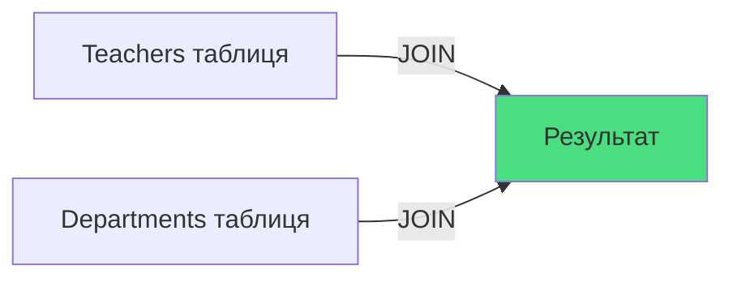
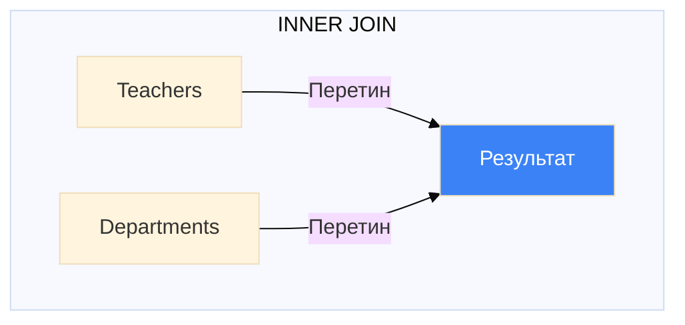

# INNER JOIN - З'єднання таблиць

## Проблема: Як отримати дані з кількох таблиць?

У попередньому файлі ми розбили дані на множинні таблиці. Тепер виникає питання: **як отримати інформацію з них?**

Припустимо, маємо такі таблиці:

```sql
-- Кафедри
CREATE TABLE Departments (
    Id INT PRIMARY KEY IDENTITY(1,1),
    Name NVARCHAR(50),
    Phone NVARCHAR(20)
);

-- Викладачі
CREATE TABLE Teachers (
    Id INT PRIMARY KEY IDENTITY(1,1),
    FirstName NVARCHAR(50),
    LastName NVARCHAR(50),
    DepartmentId INT,  -- FK → Departments.Id
    FOREIGN KEY (DepartmentId) REFERENCES Departments(Id)
);
```

**Задача**: Отримати список викладачів з **назвою їх кафедри** (не просто Id!).

::warning
Не можна отримати `Department.Name` з таблиці `Teachers` - цього поля там немає!
::

**Рішення**: **JOIN** - операція з'єднання таблиць.

---

## 1. Що таке JOIN?

**JOIN** — операція, що **об'єднує рядки з двох або більше таблиць** на основі зв'язку між ними.

::mermaid



::

**Концепція**: З'єднуємо таблиці по **спільному стовпцю** (зазвичай PK = FK).

---

## 2. INNER JOIN: Базовий синтаксис

### 2.1. Explicit JOIN (рекомендований)

```sql
SELECT column1, column2, ...
FROM table1
INNER JOIN table2
    ON table1.column = table2.column;
```

**Приклад**:

```sql
SELECT
    Teachers.FirstName,
    Teachers.LastName,
    Departments.Name AS DepartmentName
FROM Teachers
INNER JOIN Departments
    ON Teachers.DepartmentId = Departments.Id;
```

### 2.2. Implicit JOIN (застарілий)

```sql
SELECT column1, column2, ...
FROM table1, table2
WHERE table1.column = table2.column;
```

**Той самий приклад (implicit)**:

```sql
SELECT
    Teachers.FirstName,
    Teachers.LastName,
    Departments.Name AS DepartmentName
FROM Teachers, Departments
WHERE Teachers.DepartmentId = Departments.Id;
```

::code-group

```sql [✅ Explicit (сучасний)]
SELECT T.FirstName, D.Name
FROM Teachers AS T
INNER JOIN Departments AS D
    ON T.DepartmentId = D.Id;

-- Чітко видно JOIN умову
-- ON відокремлює умову з'єднання від WHERE
```

```sql [⚠️ Implicit (старий стиль)]
SELECT T.FirstName, D.Name
FROM Teachers AS T, Departments AS D
WHERE T.DepartmentId = D.Id;

-- Умова з'єднання змішана з WHERE фільтрами
-- Менш читабельний
```

::

::tip
**Best Practice**: Завжди використовуйте **Explicit JOIN** (INNER JOIN ... ON) замість implicit syntax!
::

---

## 3. Як працює INNER JOIN?

### 3.1. Діаграма Венна

::mermaid



::

**INNER JOIN** повертає **тільки** ті рядки, де **є збіг** в обох таблицях.

### 3.2. Візуалізація процесу

```
Teachers                    Departments
┌────┬─────────┬────────┐  ┌────┬──────────────┐
│ Id │ Name    │ DeptId │  │ Id │ Name         │
├────┼─────────┼────────┤  ├────┼──────────────┤
│ 1  │ Sophia  │   1    │──│ 1  │ Software Dev │
│ 2  │ Henry   │   1    │──│ 2  │ Mathematics  │
│ 3  │ Emma    │   2    │──│ 3  │ Physics      │
│ 4  │ John    │  NULL  │  └────┴──────────────┘
└────┴─────────┴────────┘

        ↓ INNER JOIN ↓

Результат (тільки збіги!)
┌─────────┬──────────────┐
│ Name    │ DeptName     │
├─────────┼──────────────┤
│ Sophia  │ Software Dev │
│ Henry   │ Software Dev │
│ Emma    │ Mathematics  │
└─────────┴──────────────┘

John НЕ включений (DeptId = NULL, немає збігу)
Physics НЕ включена (немає викладачів)
```

::note
**Важливо**: INNER JOIN виключає рядки без збігів. John (без кафедри) та Physics (без викладачів) відсутні в результаті.
::

---

## 4. Анатомія INNER JOIN запиту

```sql
SELECT
    T.FirstName + ' ' + T.LastName AS FullName,  -- 1
    D.Name AS DepartmentName,                     -- 2
    D.Phone AS DeptPhone                          -- 3
FROM Teachers AS T                                -- 4
INNER JOIN Departments AS D                       -- 5
    ON T.DepartmentId = D.Id                      -- 6
WHERE T.FirstName LIKE 'S%'                       -- 7
ORDER BY T.LastName;                              -- 8
```

**Пояснення**:

::field-group
::field{name="1-3. SELECT clause"}
Вибираємо стовпці з **обох** таблиць через псевдоніми `T.` та `D.`
::
::field{name="4. FROM Teachers AS T"}
Основна таблиця (ліва), псевдонім `T`
::
::field{name="5. INNER JOIN Departments AS D"}
Приєднуємо таблицю `Departments` з псевдонімом `D`
::
::field{name="6. ON T.DepartmentId = D.Id"}
**Умова з'єднання**: `FK = PK`
::
::field{name="7. WHERE T.FirstName LIKE 'S%'"}
Додатковий фільтр (після JOIN!)
::
::field{name="8. ORDER BY T.LastName"}
Сортування результату
::
::

---

## 5. Table Aliases (Псевдоніми таблиць)

### 5.1. Навіщо потрібні?

**Проблема**: Повні імена таблиць довгі та незручні.

```sql
-- ❌ Без псевдонімів (важко читати)
SELECT
    Teachers.FirstName,
    Teachers.LastName,
    Departments.Name
FROM Teachers
INNER JOIN Departments
    ON Teachers.DepartmentId = Departments.Id;
```

**Рішення**: Використовувати **aliases** (псевдоніми).

```sql
-- ✅ З псевдонімами (читабельно)
SELECT
    T.FirstName,
    T.LastName,
    D.Name
FROM Teachers AS T
INNER JOIN Departments AS D
    ON T.DepartmentId = D.Id;
```

### 5.2. Синтаксис aliases

```sql
FROM TableName AS Alias
-- Або без AS
FROM TableName Alias
```

**Приклади**:

```sql
FROM Teachers AS T       -- повний синтаксис
FROM Teachers T          -- скорочений (також валідний)
FROM Students AS S
FROM Departments AS Dept  -- псевдонім може бути довгим
```

::tip
**Naming Conventions**:

- Коротко: `T`, `D`, `S`, `G`
- Описово: `Teach`, `Dept`, `Stud`, `Grp`
- Уникайте надто загальних: `A`, `B`, `C`

::

### 5.3. Обов'язкове використання

Якщо стовпець існує в **обох** таблицях, **обов'язково** вказувати префікс:

```sql
-- ❌ Помилка: Ambiguous column name 'Id'
SELECT Id, FirstName, Name
FROM Teachers
INNER JOIN Departments
    ON Teachers.DepartmentId = Departments.Id;

-- ✅ Правильно: вказуємо таблицю
SELECT
    T.Id AS TeacherId,       -- з Teachers
    D.Id AS DepartmentId,    -- з Departments
    T.FirstName,
    D.Name AS DepartmentName
FROM Teachers AS T
INNER JOIN Departments AS D
    ON T.DepartmentId = D.Id;
```

---

## 6. Приклади INNER JOIN

### 6.1. Простий JOIN двох таблиць

**Задача**: Показати викладачів з їх кафедрами.

```sql
-- Sample data
INSERT INTO Departments (Name, Phone) VALUES
('Software Development', '48-21'),
('Mathematics', '51-33'),
('Physics', '52-44');

INSERT INTO Teachers (FirstName, LastName, DepartmentId) VALUES
('Sophia', 'Nelson', 1),
('Henry', 'MacAlister', 1),
('Emma', 'Kirk', 2);

-- INNER JOIN запит
SELECT
    T.FirstName + ' ' + T.LastName AS Teacher,
    D.Name AS Department,
    D.Phone
FROM Teachers AS T
INNER JOIN Departments AS D
    ON T.DepartmentId = D.Id
ORDER BY D.Name, T.LastName;
```

**Результат**:

| Teacher          | Department           | Phone |
| :--------------- | :------------------- | :---- |
| Emma Kirk        | Mathematics          | 51-33 |
| Henry MacAlister | Software Development | 48-21 |
| Sophia Nelson    | Software Development | 48-21 |

::note
Кафедра "Physics" **не з'явилася в результаті** - немає викладачів на цій кафедрі!
::

---

### 6.2. JOIN з додатковими умовами (WHERE)

**Задача**: Показати викладачів кафедри "Software Development".

```sql
SELECT
    T.FirstName,
    T.LastName,
    D.Name AS Department
FROM Teachers AS T
INNER JOIN Departments AS D
    ON T.DepartmentId = D.Id
WHERE D.Name = 'Software Development';
```

**Результат**:

| FirstName | LastName   | Department           |
| :-------- | :--------- | :------------------- |
| Sophia    | Nelson     | Software Development |
| Henry     | MacAlister | Software Development |

**Логічний порядок виконання**:

1. `FROM Teachers` - беремо основну таблицю
2. `INNER JOIN Departments ON ...` - з'єднуємо з Departments
3. `WHERE D.Name = ...` - фільтруємо результат
4. `SELECT` - вибираємо стовпці

---

### 6.3. JOIN трьох таблиць

**Схема БД**:

```
Departments ──1:N── Teachers ──N:M── Subjects
                                 │
                            TeachersSubjects
                            (junction table)
```

**Задача**: Показати, які предмети викладає кожен викладач.

```sql
-- Створюємо Subjects
CREATE TABLE Subjects (
    Id INT PRIMARY KEY IDENTITY(1,1),
    Name NVARCHAR(50) NOT NULL
);

-- Junction table
CREATE TABLE TeachersSubjects (
    TeacherId INT NOT NULL,
    SubjectId INT NOT NULL,
    PRIMARY KEY (TeacherId, SubjectId),
    FOREIGN KEY (TeacherId) REFERENCES Teachers(Id),
    FOREIGN KEY (SubjectId) REFERENCES Subjects(Id)
);

-- Sample data
INSERT INTO Subjects (Name) VALUES
('C#'), ('Java'), ('Databases'), ('Web Development');

INSERT INTO TeachersSubjects (TeacherId, SubjectId) VALUES
(1, 1),  -- Sophia → C#
(1, 2),  -- Sophia → Java
(2, 3),  -- Henry → Databases
(3, 1);  -- Emma → C#

-- JOIN трьох таблиць
SELECT
    T.FirstName + ' ' + T.LastName AS Teacher,
    S.Name AS Subject
FROM Teachers AS T
INNER JOIN TeachersSubjects AS TS
    ON T.Id = TS.TeacherId
INNER JOIN Subjects AS S
    ON TS.SubjectId = S.Id
ORDER BY Teacher, Subject;
```

**Результат**:

| Teacher          | Subject   |
| :--------------- | :-------- |
| Emma Kirk        | C#        |
| Henry MacAlister | Databases |
| Sophia Nelson    | C#        |
| Sophia Nelson    | Java      |

**Візуалізація з'єднання**:

```
Teachers        TeachersSubjects        Subjects
┌───┬────────┐  ┌──────┬─────────┐     ┌───┬──────────┐
│ID │ Name   │  │T_Id  │ S_Id    │     │ID │ Name     │
├───┼────────┤  ├──────┼─────────┤     ├───┼──────────┤
│1  │Sophia  │──│  1   │   1     │──┬──│1  │ C#       │
│2  │Henry   │──│  1   │   2     │──┼──│2  │ Java     │
│3  │Emma    │──│  2   │   3     │──┼──│3  │Databases │
└───┴────────┘  │  3   │   1     │──┘  └───┴──────────┘
                └──────┴─────────┘
```

---

### 6.4. JOIN чотирьох таблиць

**Задача**: Показати, які предмети викладаються на кожній кафедрі.

```sql
SELECT
    D.Name AS Department,
    S.Name AS Subject,
    COUNT(DISTINCT T.Id) AS TeachersCount
FROM Departments AS D
INNER JOIN Teachers AS T
    ON D.Id = T.DepartmentId
INNER JOIN TeachersSubjects AS TS
    ON T.Id = TS.TeacherId
INNER JOIN Subjects AS S
    ON TS.SubjectId = S.Id
GROUP BY D.Name, S.Name
ORDER BY D.Name, S.Name;
```

**Результат**:

| Department           | Subject   | TeachersCount |
| :------------------- | :-------- | :------------ |
| Mathematics          | C#        | 1             |
| Software Development | C#        | 1             |
| Software Development | Databases | 1             |
| Software Development | Java      | 1             |

---

## 7. INNER JOIN з обчисленнями

**Задача**: Додати вік викладача.

```sql
SELECT
    T.FirstName + ' ' + T.LastName AS Teacher,
    D.Name AS Department,
    T.BirthDate,
    DATEDIFF(YEAR, T.BirthDate, GETDATE()) AS Age
FROM Teachers AS T
INNER JOIN Departments AS D
    ON T.DepartmentId = D.Id
WHERE DATEDIFF(YEAR, T.BirthDate, GETDATE()) > 30
ORDER BY Age DESC;
```

---

## 8. Декартове представлення (Cartesian Product)

**Критична помилка**: Забути вказати умову ON!

```sql
-- ❌ ПОМИЛКА: Немає ON
SELECT
    T.FirstName,
    D.Name
FROM Teachers AS T
INNER JOIN Departments AS D;
-- Або implicit:
FROM Teachers, Departments;
```

**Результат**: **Декартове представлення** - кожен рядок з `Teachers` з'єднується з **кожним** рядком з `Departments`!

```
3 Teachers × 3 Departments = 9 рядків (замість 3!)
```

**Приклад результату**:

| FirstName | Name                 |
| :-------- | :------------------- |
| Sophia    | Software Development |
| Sophia    | Mathematics          |
| Sophia    | Physics              |
| Henry     | Software Development |
| Henry     | Mathematics          |
| Henry     | Physics              |
| Emma      | Software Development |
| Emma      | Mathematics          |
| Emma      | Physics              |

::warning
**Декартове представлення = катастрофа**:

- Неправильні дані
- Величезна кількість рядків (Tables: 1000 × 1000 = 1,000,000!)
- Повільні запити

::

::caution
**Завжди вказуйте умову ON** при INNER JOIN!
::

---

## 9. Performance Tips

### 9.1. Використовуйте індекси

```sql
-- Створіть індекс на FK стовпці
CREATE INDEX IX_Teachers_DepartmentId
ON Teachers(DepartmentId);

-- JOIN буде швидшим!
```

### 9.2. SELECT тільки потрібні стовпці

```sql
-- ❌ Погано
SELECT *
FROM Teachers AS T
INNER JOIN Departments AS D
    ON T.DepartmentId = D.Id;

-- ✅ Добре
SELECT T.FirstName, T.LastName, D.Name
FROM Teachers AS T
INNER JOIN Departments AS D
    ON T.DepartmentId = D.Id;
```

### 9.3. Фільтруйте ДО JOIN (якщо можливо)

```sql
-- Якщо фільтр тільки на одну таблицю, краще фільтрувати ДО JOIN
SELECT T.FirstName, D.Name
FROM (
    SELECT * FROM Teachers WHERE FirstName LIKE 'S%'
) AS T
INNER JOIN Departments AS D
    ON T.DepartmentId = D.Id;

-- Але зазвичай SQL Server оптимізує це автоматично
```

---

## 10. Best Practices

::card-group

::card{title="1. Explicit JOIN" icon="i-lucide-check"}

```sql
-- ✅ Використовуйте
INNER JOIN ... ON

-- ❌ Уникайте
FROM table1, table2 WHERE
```

::

::card{title="2. Aliases завжди" icon="i-lucide-type"}

```sql
-- Навіть для двох таблиць
FROM Teachers AS T
INNER JOIN Departments AS D
```

::

::card{title="3. Умова ON обов'язкова" icon="i-lucide-link"}

```sql
-- Завжди вказуйте умову з'єднання
ON T.DepartmentId = D.Id
```

::

::card{title="4. WHERE після ON" icon="i-lucide-filter"}

```sql
-- ON - умова з'єднання
-- WHERE - фільтр результату
INNER JOIN ... ON ...
WHERE condition
```

::

::

---

## 11. Практичні завдання

::accordion

::accordion-item{label="Завдання 1: Студенти та групи" icon="i-lucide-users"}

Створіть запит, що показує студентів з назвою їх групи.

**Таблиці**:

- `Students (Id, FirstName, LastName, GroupId)`
- `Groups (Id, Name)`

<details>
<summary>💡 Розв'язок</summary>

```sql
SELECT
    S.FirstName + ' ' + S.LastName AS Student,
    G.Name AS GroupName
FROM Students AS S
INNER JOIN Groups AS G
    ON S.GroupId = G.Id
ORDER BY G.Name, S.LastName;
```

</details>

::

::accordion-item{label="Завдання 2: Фільтр та обчислення" icon="i-lucide-calculator"}

Показати студентів групи "31PR11" з їх віком.

<details>
<summary>💡 Розв'язок</summary>

```sql
SELECT
    S.FirstName,
    S.LastName,
    G.Name AS GroupName,
    DATEDIFF(YEAR, S.BirthDate, GETDATE()) AS Age
FROM Students AS S
INNER JOIN Groups AS G
    ON S.GroupId = G.Id
WHERE G.Name = '31PR11'
ORDER BY Age DESC;
```

</details>

::

::accordion-item{label="Завдання 3: Три таблиці" icon="i-lucide-network"}

Показати студентів, їх групи та факультети.

**Таблиці**:

- `Students (Id, FirstName, LastName, GroupId)`
- `Groups (Id, Name, FacultyId)`
- `Faculties (Id, Name)`

<details>
<summary>💡 Розв'язок</summary>

```sql
SELECT
    S.FirstName + ' ' + S.LastName AS Student,
    G.Name AS GroupName,
    F.Name AS Faculty
FROM Students AS S
INNER JOIN Groups AS G
    ON S.GroupId = G.Id
INNER JOIN Faculties AS F
    ON G.FacultyId = F.Id
ORDER BY F.Name, G.Name, S.LastName;
```

</details>

::

::accordion-item{label="Завдання 4: Агрегація" icon="i-lucide-bar-chart"}

Порахувати кількість студентів у кожній групі та показати факультет.

<details>
<summary>💡 Розв'язок</summary>

```sql
SELECT
    G.Name AS GroupName,
    F.Name AS Faculty,
    COUNT(S.Id) AS StudentsCount
FROM Groups AS G
INNER JOIN Faculties AS F
    ON G.FacultyId = F.Id
LEFT JOIN Students AS S  -- LEFT, бо може не бути студентів
    ON G.Id = S.GroupId
GROUP BY G.Name, F.Name
ORDER BY StudentsCount DESC;
```

</details>

::

::accordion-item{label="Завдання 5: Множинні умови" icon="i-lucide-filter"}

Показати викладачів кафедри "Software Development", які викладають "C#" або "Java".

**Таблиці**: `Teachers`, `Departments`, `TeachersSubjects`, `Subjects`

<details>
<summary>💡 Розв'язок</summary>

```sql
SELECT DISTINCT
    T.FirstName + ' ' + T.LastName AS Teacher,
    D.Name AS Department,
    S.Name AS Subject
FROM Teachers AS T
INNER JOIN Departments AS D
    ON T.DepartmentId = D.Id
INNER JOIN TeachersSubjects AS TS
    ON T.Id = TS.TeacherId
INNER JOIN Subjects AS S
    ON TS.SubjectId = S.Id
WHERE D.Name = 'Software Development'
    AND S.Name IN ('C#', 'Java')
ORDER BY Teacher, Subject;
```

</details>

::

::

---

## Резюме

::tip
**Ключові моменти INNER JOIN**:

1. **Синтаксис**: `FROM table1 INNER JOIN table2 ON condition`
2. **Результат**: Тільки **збіги** з обох таблиць
3. **ON vs WHERE**:
    - `ON` - умова з'єднання (PK = FK)
    - `WHERE` - фільтр результату
4. **Aliases**: Завжди використовуйте для читабельності
5. **Множинні JOIN**: Можна з'єднувати 3, 4, 5+ таблиць
6. **Performance**: Індекси на FK покращують швидкість
7. **Декартове представлення**: Катастрофа, уникайте (завжди вказуйте ON!)

**Коли використовувати**:

- Отримання даних з пов'язаних таблиць
- Показ "повної картини" (Student + Group + Faculty)
- Коли потрібні **тільки збіги**

::

---

**Попередня тема**: [Зв'язки та нормалізація](./00.relationships-and-normalization.md)  
**Наступна тема**: [OUTER JOINs - LEFT, RIGHT, FULL](./02.outer-joins.md)
