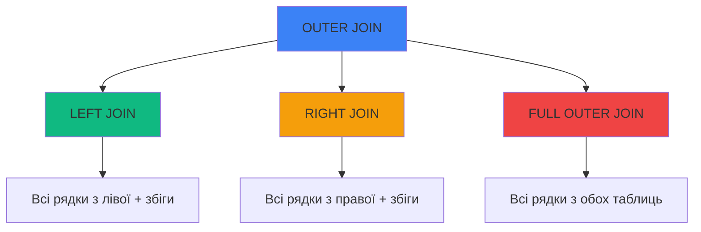
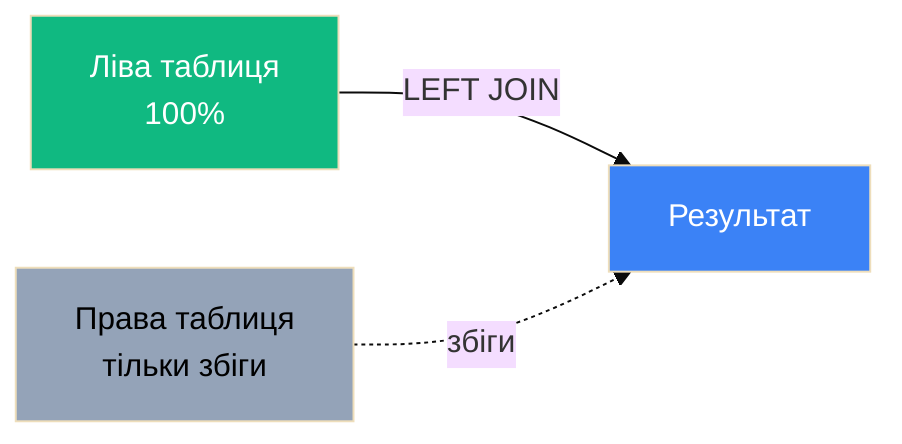
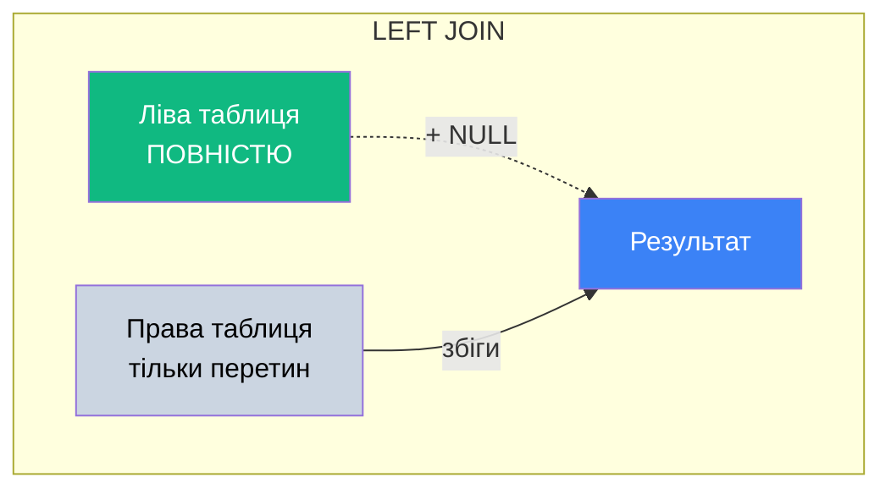
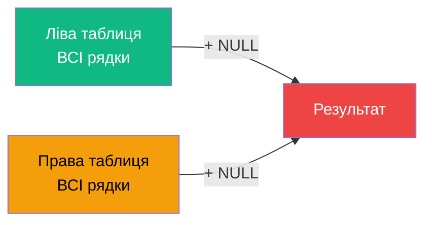

# OUTER JOINs - LEFT, RIGHT, FULL

## Проблема: INNER JOIN втрачає дані

Згадаймо приклад з попереднього файлу:

```sql
-- Дані
Departments: Software Dev, Mathematics, Physics
Teachers: Sophia (Software Dev), Henry (Software Dev), Emma (Mathematics)

-- INNER JOIN
SELECT T.FirstName, D.Name
FROM Teachers AS T
INNER JOIN Departments AS D
    ON T.DepartmentId = D.Id;

-- Результат: 3 рядки
-- ❌ Physics НЕ відображається (немає викладачів)
```

**Питання**: Як показати **всі** кафедри, навіть якщо на них немає викладачів?

**Відповідь**: **OUTER JOIN**!

---

## 1. Що таке OUTER JOIN?

**OUTER JOIN** — з'єднання таблиць, що повертає:

- Всі збіги (як INNER JOIN)
- **+ рядки без збігів** з однієї або обох таблиць

::mermaid



::

---

## 2. LEFT JOIN (LEFT OUTER JOIN)

### 2.1. Концепція

**LEFT JOIN** повертає:

- ✅ **Всі** рядки з **лівої** таблиці (FROM)
- ✅ Збіги з правої таблиці
- ⚠️ NULL для правої таблиці, якщо немає збігу

::mermaid



::

### 2.2. Синтаксис

```sql
SELECT columns
FROM table1
LEFT JOIN table2
    ON table1.column = table2.column;

-- Або повна назва
LEFT OUTER JOIN
```

### 2.3. Приклад

```sql
SELECT
    D.Name AS Department,
    T.FirstName + ' ' + T.LastName AS Teacher
FROM Departments AS D  -- Ліва таблиця (всі рядки)
LEFT JOIN Teachers AS T  -- Права таблиця (тільки збіги)
    ON D.Id = T.DepartmentId
ORDER BY D.Name;
```

**Результат**:

| Department           | Teacher          |
| :------------------- | :--------------- |
| Mathematics          | Emma Kirk        |
| Physics              | NULL             |
| Software Development | Sophia Nelson    |
| Software Development | Henry MacAlister |

::note
**Physics** з'явилась з `Teacher = NULL`, бо немає викладачів на цій кафедрі!
::

### 2.4. Візуалізація LEFT JOIN

```
Departments (Ліва - ВСІ)     Teachers (Права - збіги)
┌────┬──────────────┐         ┌────┬─────────┬────────┐
│ Id │ Name         │         │ Id │ Name    │ DeptId │
├────┼──────────────┤         ├────┼─────────┼────────┤
│ 1  │ Software Dev │ ────┬───│ 1  │ Sophia  │   1    │
│ 2  │ Mathematics  │ ────┼───│ 2  │ Henry   │   1    │
│ 3  │ Physics      │ ✗   └───│ 3  │ Emma    │   2    │
└────┴──────────────┘         └────┴─────────┴────────┘

        ↓ LEFT JOIN ↓

Результат (ВСІ кафедри + збіги)
┌──────────────┬─────────┐
│ Department   │ Teacher │
├──────────────┼─────────┤
│ Software Dev │ Sophia  │
│ Software Dev │ Henry   │
│ Mathematics  │ Emma    │
│ Physics      │ NULL    │ ← Немає викладачів
└──────────────┴─────────┘
```

### 2.5. Діаграма Венна LEFT JOIN

::mermaid



::

---

## 3. RIGHT JOIN (RIGHT OUTER JOIN)

### 3.1. Концепція

**RIGHT JOIN** — **дзеркало LEFT JOIN**:

- ✅ **Всі** рядки з **правої** таблиці (після JOIN)
- ✅ Збіги з лівої таблиці
- ⚠️ NULL для лівої таблиці, якщо немає збігу

::tip
**У практиці**: RIGHT JOIN використовується **рідко** - завжди можна переписати як LEFT JOIN (поміняти таблиці місцями).
::

### 3.2. Синтаксис

```sql
SELECT columns
FROM table1
RIGHT JOIN table2
    ON table1.column = table2.column;

-- Або повна назва
RIGHT OUTER JOIN
```

### 3.3. Приклад

```sql
-- Студенти БЕЗ групи (якщо такі є)
INSERT INTO Students (FirstName, LastName, GroupId) VALUES
('John', 'Doe', 1),
('Jane', 'Smith', 2),
('Orphan', 'Student', NULL);  -- Студент БЕЗ групи!

-- RIGHT JOIN - показати ВСІ студентів
SELECT
    G.Name AS GroupName,
    S.FirstName + ' ' + S.LastName AS Student
FROM Groups AS G          -- Ліва (може бути NULL)
RIGHT JOIN Students AS S  -- Права (ВСІ рядки)
    ON G.Id = S.GroupId
ORDER BY G.Name, S.LastName;
```

**Результат**:

| GroupName | Student        |
| :-------- | :------------- |
| NULL      | Orphan Student |
| 31PR11    | John Doe       |
| 32PR31    | Jane Smith     |

### 3.4. LEFT vs RIGHT: Еквівалентність

Ці два запити **ідентичні**:

::code-group

```sql [LEFT JOIN]
-- Показати ВСІ студентів + їх групи
SELECT G.Name, S.FirstName
FROM Students AS S       -- Ліва (ВСІ)
LEFT JOIN Groups AS G    -- Права (збіги)
    ON S.GroupId = G.Id;
```

```sql [RIGHT JOIN (те ж саме)]
-- Той самий результат
SELECT G.Name, S.FirstName
FROM Groups AS G         -- Ліва (збіги)
RIGHT JOIN Students AS S -- Права (ВСІ)
    ON S.GroupId = G.Id;
```

::

::tip
**Best Practice**: Завжди використовуйте LEFT JOIN замість RIGHT JOIN (просто поміняйте таблиці місцями для кращої читабельності).
::

---

## 4. FULL OUTER JOIN (FULL JOIN)

### 4.1. Концепція

**FULL OUTER JOIN** повертає:

- ✅ **Всі** рядки з **обох** таблиць
- ✅ Збіги
- ⚠️ NULL для лівої таблиці, якщо немає збігу справа
- ⚠️ NULL для правої таблиці, якщо немає збігу зліва

::mermaid



::

### 4.2. Синтаксис

```sql
SELECT columns
FROM table1
FULL OUTER JOIN table2
    ON table1.column = table2.column;

-- Або коротко
FULL JOIN
```

### 4.3. Приклад

```sql
-- Дані
Departments: Software Dev (Id=1), Mathematics (Id=2), Physics (Id=3)
Teachers: Sophia (DeptId=1), Henry (DeptId=1), Emma (DeptId=2), John (DeptId=NULL)

-- FULL OUTER JOIN
SELECT
    D.Name AS Department,
    T.FirstName + ' ' + T.LastName AS Teacher
FROM Departments AS D
FULL OUTER JOIN Teachers AS T
    ON D.Id = T.DepartmentId
ORDER BY D.Name, T.FirstName;
```

**Результат**:

| Department           | Teacher          |
| :------------------- | :--------------- |
| NULL                 | John Doe         |
| Mathematics          | Emma Kirk        |
| Physics              | NULL             |
| Software Development | Henry MacAlister |
| Software Development | Sophia Nelson    |

**Що бачимо**:

- ✅ Physics (кафедра БЕЗ викладачів) - `Teacher = NULL`
- ✅ John Doe (викладач БЕЗ кафедри) - `Department = NULL`

### 4.4. Візуалізація FULL OUTER JOIN

```
Departments               Teachers
┌────┬──────────────┐    ┌────┬──────┬────────┐
│ Id │ Name         │    │ Id │ Name │ DeptId │
├────┼──────────────┤    ├────┼──────┼────────┤
│ 1  │ Software Dev │────│ 1  │Sophia│   1    │
│ 2  │ Mathematics  │────│ 2  │Henry │   1    │
│ 3  │ Physics      │ ✗  │ 3  │Emma  │   2    │
└────┴──────────────┘    │ 4  │John  │  NULL  │✗
                         └────┴──────┴────────┘

        ↓ FULL OUTER JOIN ↓

Результат (ВСІ з обох таблиць)
┌──────────────┬─────────┐
│ Department   │ Teacher │
├──────────────┼─────────┤
│ Software Dev │ Sophia  │
│ Software Dev │ Henry   │
│ Mathematics  │ Emma    │
│ Physics      │ NULL    │ ← Кафедра БЕЗ викладачів
│ NULL         │ John    │ ← Викладач БЕЗ кафедри
└──────────────┴─────────┘
```

---

## 5. Порівняння INNER vs OUTER JOINs

### 5.1. Візуальне порівняння

::tabs

::tabs-item{label="INNER JOIN"}

```sql
SELECT D.Name, T.FirstName
FROM Departments AS D
INNER JOIN Teachers AS T
    ON D.Id = T.DepartmentId;
```

**Результат**: Тільки збіги (3 рядки)

| Name         | FirstName |
| :----------- | :-------- |
| Software Dev | Sophia    |
| Software Dev | Henry     |
| Mathematics  | Emma      |

::

::tabs-item{label="LEFT JOIN"}

```sql
SELECT D.Name, T.FirstName
FROM Departments AS D
LEFT JOIN Teachers AS T
    ON D.Id = T.DepartmentId;
```

**Результат**: Всі кафедри (4 рядки)

| Name         | FirstName |
| :----------- | :-------- |
| Software Dev | Sophia    |
| Software Dev | Henry     |
| Mathematics  | Emma      |
| Physics      | NULL      |

::

::tabs-item{label="RIGHT JOIN"}

```sql
SELECT D.Name, T.FirstName
FROM Departments AS D
RIGHT JOIN Teachers AS T
    ON D.Id = T.DepartmentId;
```

**Результат**: Всі викладачі (4 рядки)

| Name         | FirstName |
| :----------- | :-------- |
| Software Dev | Sophia    |
| Software Dev | Henry     |
| Mathematics  | Emma      |
| NULL         | John      |

::

::tabs-item{label="FULL OUTER JOIN"}

```sql
SELECT D.Name, T.FirstName
FROM Departments AS D
FULL OUTER JOIN Teachers AS T
    ON D.Id = T.DepartmentId;
```

**Результат**: Всі з обох таблиць (5 рядків)

| Name         | FirstName |
| :----------- | :-------- |
| Software Dev | Sophia    |
| Software Dev | Henry     |
| Mathematics  | Emma      |
| Physics      | NULL      |
| NULL         | John      |

::

::

### 5.2. Порівняльна таблиця

| JOIN тип  | Ліва таблиця  | Права таблиця | NULL можливий?  |
| :-------- | :------------ | :------------ | :-------------- |
| **INNER** | Тільки збіги  | Тільки збіги  | ❌ Ні           |
| **LEFT**  | **ВСІ** рядки | Тільки збіги  | ✅ Так (права)  |
| **RIGHT** | Тільки збіги  | **ВСІ** рядки | ✅ Так (ліва)   |
| **FULL**  | **ВСІ** рядки | **ВСІ** рядки | ✅ Так (обидві) |

---

## 6. Обробка NULL значень

### 6.1. Проблема NULL в результатах

```sql
SELECT
    D.Name AS Department,
    T.FirstName AS Teacher
FROM Departments AS D
LEFT JOIN Teachers AS T
    ON D.Id = T.DepartmentId;

-- Результат містить NULL для кафедр без викладачів
```

### 6.2. COALESCE - заміна NULL

```sql
SELECT
    D.Name AS Department,
    COALESCE(T.FirstName, 'Немає викладачів') AS Teacher
FROM Departments AS D
LEFT JOIN Teachers AS T
    ON D.Id = T.DepartmentId;
```

**Результат**:

| Department   | Teacher              |
| :----------- | :------------------- |
| Mathematics  | Emma                 |
| Physics      | **Немає викладачів** |
| Software Dev | Sophia               |
| Software Dev | Henry                |

### 6.3. ISNULL - альтернатива COALESCE

```sql
SELECT
    D.Name AS Department,
    ISNULL(T.FirstName, 'N/A') AS Teacher
FROM Departments AS D
LEFT JOIN Teams AS T
    ON D.Id = T.DepartmentId;
```

::note
**COALESCE vs ISNULL**:

- `COALESCE` - стандарт SQL, може приймати багато аргументів
- `ISNULL` - T-SQL специфічний, тільки 2 аргументи, трохи швидший

::

### 6.4. CASE для складної логіки

```sql
SELECT
    D.Name AS Department,
    CASE
        WHEN T.FirstName IS NULL THEN 'Вакансія'
        ELSE T.FirstName + ' ' + T.LastName
    END AS Teacher
FROM Departments AS D
LEFT JOIN Teachers AS T
    ON D.Id = T.DepartmentId;
```

---

## 7. Практичні сценарії OUTER JOIN

### 7.1. Знайти кафедри БЕЗ викладачів

```sql
SELECT D.Name AS EmptyDepartment
FROM Departments AS D
LEFT JOIN Teachers AS T
    ON D.Id = T.DepartmentId
WHERE T.Id IS NULL;  -- Немає викладачів
```

**Логіка**: LEFT JOIN дає NULL для `T.Id`, якщо немає збігу.

### 7.2. Знайти студентів БЕЗ групи

```sql
SELECT
    S.FirstName,
    S.LastName,
    'Не зарахований до групи' AS IssueStatus
FROM Students AS S
LEFT JOIN Groups AS G
    ON S.GroupId = G.Id
WHERE G.Id IS NULL;
```

### 7.3. Знайти групи БЕЗ студентів

```sql
SELECT
    G.Name AS EmptyGroup,
    COUNT(S.Id) AS StudentsCount  -- Буде 0
FROM Groups AS G
LEFT JOIN Students AS S
    ON G.Id = S.GroupId
GROUP BY G.Name
HAVING COUNT(S.Id) = 0;
```

### 7.4. Аудит даних (знайти проблеми)

```sql
-- Знайти ВСІ невідповідності між таблицями
SELECT
    CASE
        WHEN D.Id IS NULL THEN 'Викладач без кафедри'
        WHEN T.Id IS NULL THEN 'Кафедра без викладачів'
        ELSE 'OK'
    END AS Status,
    COALESCE(D.Name, 'N/A') AS Department,
    COALESCE(T.FirstName + ' ' + T.LastName, 'N/A') AS Teacher
FROM Departments AS D
FULL OUTER JOIN Teachers AS T
    ON D.Id = T.DepartmentId
WHERE D.Id IS NULL OR T.Id IS NULL;  -- Тільки проблеми
```

### 7.5. Звіт з опціональними даними

```sql
-- Показати ВСІ предмети з викладачами (якщо є)
SELECT
    S.Name AS Subject,
    COALESCE(T.FirstName + ' ' + T.LastName, 'Наразі не призначено') AS Teacher
FROM Subjects AS S
LEFT JOIN TeachersSubjects AS TS
    ON S.Id = TS.SubjectId
LEFT JOIN Teachers AS T
    ON TS.TeacherId = T.Id
ORDER BY S.Name;
```

---

## 8. LEFT JOIN з агрегацією

### 8.1. Підрахунок кількості

```sql
-- Кількість студентів у кожній групі (включаючи порожні)
SELECT
    G.Name AS GroupName,
    COUNT(S.Id) AS StudentsCount  -- NULL не враховуються!
FROM Groups AS G
LEFT JOIN Students AS S
    ON G.Id = S.GroupId
GROUP BY G.Name
ORDER BY StudentsCount DESC;
```

**Результат**:

| GroupName | StudentsCount |
| :-------- | :------------ |
| 31PR11    | 5             |
| 32PR31    | 3             |
| 33PR51    | 0             |

::note
`COUNT(S.Id)` повертає 0 для групи без студентів, бо NULL не враховуються!
::

### 8.2. Середнє значення з NULL handling

```sql
-- Середній бал по кафедрах (включаючи кафедри без оцінок)
SELECT
    D.Name AS Department,
    AVG(A.Grade) AS AvgGrade,
    COUNT(A.Id) AS GradesCount
FROM Departments AS D
LEFT JOIN Teachers AS T
    ON D.Id = T.DepartmentId
LEFT JOIN Assessments AS A
    ON T.Id = A.TeacherId
GROUP BY D.Name
ORDER BY AvgGrade DESC;
```

---

## 9. Множинні OUTER JOINs

### 9.1. Ланцюг LEFT JOINs

```sql
-- Показати ВСІ факультети → групи → студентів
SELECT
    F.Name AS Faculty,
    COALESCE(G.Name, 'Немає груп') AS GroupName,
    COALESCE(S.FirstName + ' ' + S.LastName, 'Немає студентів') AS Student
FROM Faculties AS F
LEFT JOIN Groups AS G
    ON F.Id = G.FacultyId
LEFT JOIN Students AS S
    ON G.Id = S.GroupId
ORDER BY F.Name, G.Name, S.LastName;
```

::warning
**Порядок має значення**: Якщо зробити `Groups RIGHT JOIN Faculties`, результат буде інший!
::

### 9.2. Комбінація INNER + LEFT JOINs

```sql
-- Показати студентів з групами (обов'язково) та оцінками (опціонально)
SELECT
    S.FirstName,
    G.Name AS GroupName,        -- INNER JOIN (обов'язково)
    COALESCE(AVG(A.Grade), 0) AS AvgGrade  -- LEFT JOIN (опціонально)
FROM Students AS S
INNER JOIN Groups AS G          -- Тільки студенти З групою
    ON S.GroupId = G.Id
LEFT JOIN Assessments AS A      -- Оцінки можуть бути відсутні
    ON S.Id = A.StudentId
GROUP BY S.FirstName, G.Name;
```

---

## 10. Best Practices

::card-group

::card{title="1. LEFT JOIN замість RIGHT" icon="i-lucide-arrow-left"}

```sql
-- ✅ Використовуйте LEFT
FROM Main AS M
LEFT JOIN Optional AS O

-- ❌ Уникайте RIGHT
FROM Optional AS O
RIGHT JOIN Main AS M
```

::

::card{title="2. NULL handling" icon="i-lucide-shield"}

```sql
-- Завжди обробляйте NULL
COALESCE(column, 'default')
ISNULL(column, 'default')
```

::

::card{title="3. IS NULL для фільтрів" icon="i-lucide-filter"}

```sql
-- Знайти рядки БЕЗ збігу
WHERE T.Id IS NULL

-- ❌ НЕ
WHERE T.Id = NULL  -- Не працює!
```

::

::card{title="4. COUNT NULL-safe" icon="i-lucide-hash"}

```sql
-- COUNT(column) не враховує NULL
COUNT(S.Id)  -- ✅ Правильно

-- COUNT(*) враховує всі рядки
COUNT(*)  -- ⚠️ Включає NULL
```

::

::

---

## 11. Практичні завдання

::accordion

::accordion-item{label="Завдання 1: Порожні групи" icon="i-lucide-users"}

Знайти групи, в яких немає жодного студента.

<details>
<summary>💡 Розв'язок</summary>

```sql
SELECT G.Name AS EmptyGroup
FROM Groups AS G
LEFT JOIN Students AS S
    ON G.Id = S.GroupId
WHERE S.Id IS NULL;
```

</details>

::

::accordion-item{label="Завдання 2: Студенти без оцінок" icon="i-lucide-file-question"}

Показати студентів, які не мають жодної оцінки.

<details>
<summary>💡 Розв'язок</summary>

```sql
SELECT
    S.FirstName + ' ' + S.LastName AS Student,
    G.Name AS GroupName
FROM Students AS S
INNER JOIN Groups AS G
    ON S.GroupId = G.Id
LEFT JOIN Assessments AS A
    ON S.Id = A.StudentId
WHERE A.Id IS NULL;
```

</details>

::

::accordion-item{label="Завдання 3: Аудит кафедр" icon="i-lucide-search"}

Показати всі кафедри з кількістю викладачів (включаючи кафедри без викладачів).

<details>
<summary>💡 Розв'язок</summary>

```sql
SELECT
    D.Name AS Department,
    COUNT(T.Id) AS TeachersCount,
    CASE
        WHEN COUNT(T.Id) = 0 THEN 'Вакансія!'
        ELSE 'OK'
    END AS Status
FROM Departments AS D
LEFT JOIN Teachers AS T
    ON D.Id = T.DepartmentId
GROUP BY D.Name
ORDER BY TeachersCount;
```

</details>

::

::accordion-item{label="Завдання 4: Звіт з опціями" icon="i-lucide-file-text"}

Показати всі предмети з викладачами та кількістю груп (все опціонально).

<details>
<summary>💡 Розв'язок</summary>

```sql
SELECT
    S.Name AS Subject,
    COALESCE(T.FirstName + ' ' + T.LastName, 'Не призначено') AS Teacher,
    COUNT(DISTINCT TS.GroupId) AS GroupsCount
FROM Subjects AS S
LEFT JOIN TeachersSubjects AS TS
    ON S.Id = TS.SubjectId
LEFT JOIN Teachers AS T
    ON TS.TeacherId = T.Id
GROUP BY S.Name, T.FirstName, T.LastName
ORDER BY S.Name;
```

</details>

::

::

---

## Резюме

::tip
**Ключові моменти OUTER JOINs**:

1. **LEFT JOIN**: Всі рядки з **лівої** таблиці + збіги
2. **RIGHT JOIN**: Всі рядки з **правої** таблиці + збіги (рідко використовується)
3. **FULL OUTER JOIN**: Всі рядки з **обох** таблиць
4. **NULL handling**: Завжди обробляйте NULL через COALESCE/ISNULL/CASE
5. **Пошук відсутніх зв'язків**: `WHERE T.Id IS NULL`
6. **COUNT NULL-safe**: `COUNT(column)` не враховує NULL
7. **Best Practice**: Використовуйте LEFT JOIN замість RIGHT JOIN

**Коли використовувати**:

- Показати **всі** рядки з головної таблиці
- Знайти рядки **без** зв'язків (порожні групи, студенти без оцінок)
- Аудит даних (знайти проблеми)
- Звіти з опціональними полями

::

---

**Попередня тема**: [INNER JOIN](./01.inner-join.md)  
**Наступна тема**: [CROSS та SELF JOINs](./03.cross-self-joins.md)
