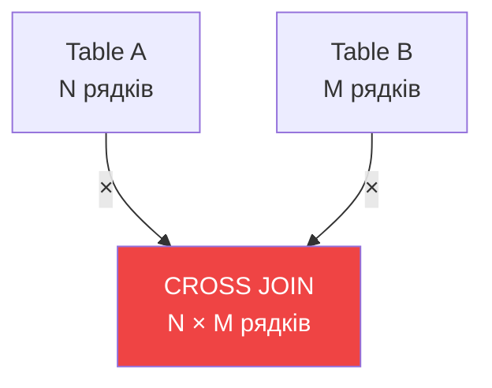
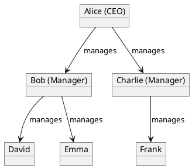

# CROSS та SELF JOINs

## 1. CROSS JOIN - Декартове представлення

### 1.1. Що таке CROSS JOIN?

**CROSS JOIN** — з'єднання таблиць без умови ON, що повертає **всі можливі комбінації** рядків з обох таблиць.

::warning
**Декартове представлення** = Кожен рядок з таблиці A × Кожен рядок з таблиці B
::

**Формула**: `Кількість рядків = Rows(A) × Rows(B)`

Приклад:

- Таблиця A: 3 рядки
- Таблиця B: 4 рядки
- CROSS JOIN: **3 × 4 = 12 рядків**

### 1.2. Синтаксис

::code-group

```sql [Explicit CROSS JOIN]
SELECT columns
FROM table1
CROSS JOIN table2;
```

```sql [Implicit (старий стиль)]
SELECT columns
FROM table1, table2;
-- Без WHERE - автоматично CROSS JOIN!
```

::

### 1.3. Візуалізація

```
Table A         Table B
┌────┬───┐     ┌────┬───┐
│ Id │ X │     │ Id │ Y │
├────┼───┤     ├────┼───┤
│ 1  │ A │     │ 1  │ P │
│ 2  │ B │     │ 2  │ Q │
└────┴───┘     └────┴───┘

    ↓ CROSS JOIN ↓

Результат (2 × 2 = 4 рядки)
┌────┬───┬────┬───┐
│A.Id│ X │B.Id│ Y │
├────┼───┼────┼───┤
│ 1  │ A │ 1  │ P │
│ 1  │ A │ 2  │ Q │ ← Всі комбінації
│ 2  │ B │ 1  │ P │
│ 2  │ B │ 2  │ Q │
└────┴───┴────┴───┘
```

::mermaid



::

---

### 1.4. Приклад 1: Просте декартове представлення

```sql
-- Кольори
CREATE TABLE Colors (Id INT, Name NVARCHAR(20));
INSERT INTO Colors VALUES (1, 'Червоний'), (2, 'Синій'), (3, 'Зелений');

-- Розміри
CREATE TABLE Sizes (Id INT, Name NVARCHAR(10));
INSERT INTO Sizes VALUES (1, 'S'), (2, 'M'), (3, 'L');

-- CROSS JOIN - всі комбінації
SELECT
    C.Name AS Color,
    S.Name AS Size
FROM Colors AS C
CROSS JOIN Sizes AS S
ORDER BY C.Name, S.Name;
```

**Результат** (3 × 3 = 9 рядків):

| Color    | Size |
| :------- | :--- |
| Зелений  | L    |
| Зелений  | M    |
| Зелений  | S    |
| Синій    | L    |
| Синій    | M    |
| Синій    | S    |
| Червоний | L    |
| Червоний | M    |
| Червоний | S    |

::tip
**Use Case**: Генерація всіх можливих варіантів товарів (колір × розмір).
::

---

### 1.5. Приклад 2: Генерація календаря

```sql
-- Дні тижня
CREATE TABLE Weekdays (DayNum INT, DayName NVARCHAR(20));
INSERT INTO Weekdays VALUES
(1, 'Понеділок'), (2, 'Вівторок'), (3, 'Середа'),
(4, 'Четвер'), (5, 'П''ятниця');

-- Години
CREATE TABLE Hours (Hour INT);
INSERT INTO Hours VALUES (9), (10), (11), (12), (13), (14), (15), (16);

-- Всі можливі слоти (день × година)
SELECT
    W.DayName,
    H.Hour,
    CAST(H.Hour AS NVARCHAR) + ':00' AS TimeSlot
FROM Weekdays AS W
CROSS JOIN Hours AS H
ORDER BY W.DayNum, H.Hour;
```

**Результат** (5 днів × 8 годин = 40 слотів):

| DayName   | Hour | TimeSlot |
| :-------- | :--- | :------- |
| Понеділок | 9    | 9:00     |
| Понеділок | 10   | 10:00    |
| ...       | ...  | ...      |
| П'ятниця  | 16   | 16:00    |

**Use Case**: Розклад занять, бронювання слотів, календарне планування.

---

### 1.6. Приклад 3: Тестові дані

```sql
-- Генерація комбінацій для тестування
SELECT
    T.Type,
    C.Category,
    P.Priority
FROM
    (VALUES ('Bug'), ('Feature'), ('Task')) AS T(Type)
CROSS JOIN
    (VALUES ('Frontend'), ('Backend'), ('Database')) AS C(Category)
CROSS JOIN
    (VALUES ('Low'), ('Medium'), ('High')) AS P(Priority);

-- 3 × 3 × 3 = 27 комбінацій!
```

---

### 1.7. Performance Warning

::caution
**НЕБЕЗПЕКА**: CROSS JOIN створює ВЕЛИЧЕЗНІ результати!

```
100 рядків × 100 рядків = 10,000 рядків
1,000 × 1,000 = 1,000,000 рядків
10,000 × 10,000 = 100,000,000 рядків ⚠️
```

**Завжди обмежуйте розмір таблиць при CROSS JOIN!**
::

::warning
**Найчастіша помилка**: Забути ON в INNER JOIN → випадково отримати CROSS JOIN!

```sql
-- ❌ ПОМИЛКА! Забули ON
SELECT *
FROM BigTable1  -- 10,000 рядків
INNER JOIN BigTable2;  -- 10,000 рядків
-- Результат: 100,000,000 рядків!!! 🔥
```

::

---

### 1.8. Коли використовувати CROSS JOIN?

::card-group

::card{title="✅ Генерація комбінацій" icon="i-lucide-grid"}
Товари (колір × розмір × матеріал)
::

::card{title="✅ Календарі та розкладі" icon="i-lucide-calendar"}
Дні × години для бронювань
::

::card{title="✅ Тестові дані" icon="i-lucide-flask"}
Всі можливі сценарії для тестів
::

::card{title="✅ Статистичні звіти" icon="i-lucide-bar-chart"}
Всі комбінації для групування
::

::

---

## 2. SELF JOIN - Таблиця з собою

### 2.1. Що таке SELF JOIN?

**SELF JOIN** — з'єднання таблиці **самої з собою** для порівняння рядків між собою.

::tip
**Ключова ідея**: Одна таблиця використовується **двічі** з різними псевдонімами.
::

::note
SELF JOIN — це **не окремий тип** JOIN! Це INNER/LEFT/RIGHT JOIN, де обидві таблиці однакові.
::

### 2.2. Синтаксис

```sql
SELECT columns
FROM TableName AS Alias1
INNER JOIN TableName AS Alias2  -- Та сама таблиця!
    ON Alias1.column = Alias2.column
WHERE Alias1.Id <> Alias2.Id;  -- Уникнути порівняння з собою
```

::warning
**Обов'язково**: Використовувати **різні псевдоніми** (Alias1, Alias2)!
::

---

### 2.3. Приклад 1: Ієрархія (Manager-Employee)

```sql
CREATE TABLE Employees (
    Id INT PRIMARY KEY,
    Name NVARCHAR(50),
    ManagerId INT NULL,  -- FK на того ж Employees.Id
    FOREIGN KEY (ManagerId) REFERENCES Employees(Id)
);

INSERT INTO Employees VALUES
(1, 'CEO Alice', NULL),      -- Топ менеджер
(2, 'Manager Bob', 1),        -- Підлеглий Alice
(3, 'Manager Charlie', 1),    -- Підлеглий Alice
(4, 'Employee David', 2),     -- Підлеглий Bob
(5, 'Employee Emma', 2),      -- Підлеглий Bob
(6, 'Employee Frank', 3);     -- Підлеглий Charlie

-- SELF JOIN: показати співробітників з їх менеджерами
SELECT
    E.Name AS Employee,
    M.Name AS Manager
FROM Employees AS E            -- E = Employee
LEFT JOIN Employees AS M       -- M = Manager (та сама таблиця!)
    ON E.ManagerId = M.Id
ORDER BY M.Name, E.Name;
```

**Результат**:

| Employee        | Manager         |
| :-------------- | :-------------- |
| CEO Alice       | NULL            |
| Manager Bob     | CEO Alice       |
| Manager Charlie | CEO Alice       |
| Employee David  | Manager Bob     |
| Employee Emma   | Manager Bob     |
| Employee Frank  | Manager Charlie |

**Візуалізація**:

```
Employees (як E)         Employees (як M)
┌───┬─────────┬────────┐ ┌───┬──────────┐
│Id │ Name    │Mgr_Id  │ │Id │ Name     │
├───┼─────────┼────────┤ ├───┼──────────┤
│1  │Alice    │ NULL   │ │1  │Alice     │
│2  │Bob      │  1     │─│2  │Bob       │
│3  │Charlie  │  1     │─│3  │Charlie   │
│4  │David    │  2     │─│...│...       │
└───┴─────────┴────────┘ └───┴──────────┘
          ↓ SELF JOIN ↓
```

::plant-uml



::

---

### 2.4. Приклад 2: Порівняння студентів (однокласники)

```sql
CREATE TABLE Students (
    Id INT PRIMARY KEY,
    FirstName NVARCHAR(50),
    LastName NVARCHAR(50),
    GroupId INT,
    BirthDate DATE
);

INSERT INTO Students VALUES
(1, 'John', 'Doe', 1, '1998-05-15'),
(2, 'Jane', 'Smith', 1, '1998-08-20'),
(3, 'Bob', 'Johnson', 1, '1997-12-10'),
(4, 'Alice', 'Williams', 2, '1998-03-25');

-- Знайти пари студентів з ОДНІЄЇ групи
SELECT
    S1.FirstName + ' ' + S1.LastName AS Student1,
    S2.FirstName + ' ' + S2.LastName AS Student2,
    'Group ' + CAST(S1.GroupId AS NVARCHAR) AS SharedGroup
FROM Students AS S1
INNER JOIN Students AS S2
    ON S1.GroupId = S2.GroupId  -- Одна група
    AND S1.Id < S2.Id           -- Уникнути дублювання (John-Jane = Jane-John)
ORDER BY S1.GroupId, S1.LastName;
```

**Результат**:

| Student1    | Student2    | SharedGroup |
| :---------- | :---------- | :---------- |
| John Doe    | Bob Johnson | Group 1     |
| John Doe    | Jane Smith  | Group 1     |
| Bob Johnson | Jane Smith  | Group 1     |

::tip
**`S1.Id < S2.Id`** - критично! Без цього отримаємо дублі:

- John-Jane ✅
- Jane-John ❌ (дублікат)
  ::

---

### 2.5. Приклад 3: Знайти старших за віком

```sql
-- Знайти пари (молодший, старший) в одній групі
SELECT
    Younger.FirstName AS YoungerStudent,
    Older.FirstName AS OlderStudent,
    DATEDIFF(YEAR, Older.BirthDate, Younger.BirthDate) AS AgeDifference
FROM Students AS Younger
INNER JOIN Students AS Older
    ON Younger.GroupId = Older.GroupId
    AND Younger.BirthDate > Older.BirthDate  -- Younger народився ПІСЛЯ
ORDER BY YoungerStudent, AgeDifference DESC;
```

**Результат**:

| YoungerStudent | OlderStudent | AgeDifference |
| :------------- | :----------- | :------------ |
| Jane           | Bob          | 1             |
| John           | Bob          | 1             |

---

### 2.6. Приклад 4: Рекомендації (схожі записи)

```sql
-- Знайти студентів з схожими іменами (можливі помилки вводу)
SELECT
    S1.FirstName AS Name1,
    S1.LastName AS LastName1,
    S2.FirstName AS Name2,
    S2.LastName AS LastName2,
    'Можливий дублікат?' AS Warning
FROM Students AS S1
INNER JOIN Students AS S2
    ON S1.Id <> S2.Id
    AND S1.FirstName = S2.FirstName  -- Однакові імена
    AND S1.GroupId = S2.GroupId      -- В одній групі
ORDER BY S1.FirstName;
```

---

### 2.7. Приклад 5: Transitive relationships

```sql
-- Таблиця дружби (симетрична!)
CREATE TABLE Friendships (
    StudentId1 INT,
    StudentId2 INT,
    PRIMARY KEY (StudentId1, StudentId2)
);

INSERT INTO Friendships VALUES
(1, 2),  -- John ↔ Jane
(1, 3),  -- John ↔ Bob
(2, 4);  -- Jane ↔ Alice

-- Знайти "друзів друзів" (хто може познайомитись)
SELECT DISTINCT
    S1.FirstName AS Person,
    S3.FirstName AS PotentialFriend,
    S2.FirstName AS MutualFriend
FROM Friendships AS F1
INNER JOIN Friendships AS F2
    ON F1.StudentId2 = F2.StudentId1  -- Друг друга
INNER JOIN Students AS S1 ON F1.StudentId1 = S1.Id
INNER JOIN Students AS S2 ON F1.StudentId2 = S2.Id
INNER JOIN Students AS S3 ON F2.StudentId2 = S3.Id
WHERE F1.StudentId1 <> F2.StudentId2  -- Уникнути себе
ORDER BY Person, PotentialFriend;
```

**Результат**: John може познайомитись з Alice через Jane.

---

## 3. Порівняння CROSS vs SELF JOIN

| Характеристика  | CROSS JOIN                    | SELF JOIN              |
| :-------------- | :---------------------------- | :--------------------- |
| **Таблиці**     | Дві **різні** таблиці         | Одна таблиця **двічі** |
| **Умова ON**    | ❌ Немає                      | ✅ Обов'язкова         |
| **Псевдоніми**  | Опціонально                   | **Обов'язково**        |
| **Результат**   | Всі комбінації                | Зв'язані рядки         |
| **Use Case**    | Генерація варіантів           | Ієрархії, порівняння   |
| **Performance** | ⚠️ Небезпечно (багато рядків) | ✅ Нормально (з ON)    |

---

## 4. Best Practices

::card-group

::card{title="CROSS JOIN: Обмеження!" icon="i-lucide-alert-triangle"}

```sql
-- Завжди контролюйте розмір
SELECT COUNT(*)
FROM Table1
CROSS JOIN Table2;
-- Перевірити перед виконанням!
```

::

::card{title="SELF JOIN: Унікальні aliases" icon="i-lucide-type"}

```sql
-- ✅ Чіткі назви
FROM Employees AS Manager
JOIN Employees AS Employee

-- ❌ Заплутано
FROM Employees AS E1
JOIN Employees AS E2
```

::

::card{title="SELF JOIN: Уникнути дублів" icon="i-lucide-copy"}

```sql
-- Додати умову
WHERE S1.Id < S2.Id
-- Або
WHERE S1.Id <> S2.Id
```

::

::card{title="Індекси важливі!" icon="i-lucide-zap"}

```sql
-- Для SELF JOIN по FK
CREATE INDEX IX_Employees_ManagerId
ON Employees(ManagerId);
```

::

::

---

## 5. Практичні завдання

::accordion

::accordion-item{label="Завдання 1: Каталог товарів" icon="i-lucide-shopping-cart"}

Створіть всі комбінації товарів (Категорія × Колір × Розмір) використовуючи CROSS JOIN.

<details>
<summary>💡 Розв'язок</summary>

```sql
SELECT
    Cat.Name AS Category,
    Col.Name AS Color,
    Siz.Name AS Size
FROM Categories AS Cat
CROSS JOIN Colors AS Col
CROSS JOIN Sizes AS Siz
ORDER BY Category, Color, Size;
```

</details>

::

::accordion-item{label="Завдання 2: Організаційна структура" icon="i-lucide-sitemap"}

Показати всіх співробітників з їх менеджерами (3 рівні: Employee → Manager → TopManager).

<details>
<summary>💡 Розв'язок</summary>

```sql
SELECT
    E.Name AS Employee,
    M.Name AS Manager,
    TM.Name AS TopManager
FROM Employees AS E
LEFT JOIN Employees AS M
    ON E.ManagerId = M.Id
LEFT JOIN Employees AS TM
    ON M.ManagerId = TM.Id
ORDER BY TM.Name, M.Name, E.Name;
```

</details>

::

::accordion-item{label="Завдання 3: Знайти однолітків" icon="i-lucide-users"}

Знайти пари студентів однакового віку в одній групі.

<details>
<summary>💡 Розв'язок</summary>

```sql
SELECT
    S1.FirstName AS Student1,
    S2.FirstName AS Student2,
    YEAR(S1.BirthDate) AS BirthYear
FROM Students AS S1
INNER JOIN Students AS S2
    ON S1.GroupId = S2.GroupId
    AND YEAR(S1.BirthDate) = YEAR(S2.BirthDate)
    AND S1.Id < S2.Id
ORDER BY BirthYear, Student1;
```

</details>

::

::accordion-item{label="Завдання 4: Послідовність" icon="i-lucide-arrow-right"}

Знайти послідовні пари (попередній → поточний) по даті реєстрації.

<details>
<summary>💡 Розв'язок</summary>

```sql
SELECT
    S1.FirstName AS Previous,
    S1.EnrollmentDate AS PrevDate,
    S2.FirstName AS Current,
    S2.EnrollmentDate AS CurrDate,
    DATEDIFF(DAY, S1.EnrollmentDate, S2.EnrollmentDate) AS DaysDiff
FROM Students AS S1
INNER JOIN Students AS S2
    ON S2.EnrollmentDate > S1.EnrollmentDate
WHERE NOT EXISTS (
    SELECT 1 FROM Students AS S3
    WHERE S3.EnrollmentDate > S1.EnrollmentDate
    AND S3.EnrollmentDate < S2.EnrollmentDate
)
ORDER BY S1.EnrollmentDate;
```

</details>

::

::

---

## Резюме

::tip
**Ключові моменти**:

**CROSS JOIN**:

1. Всі можливі **комбінації** рядків
2. **Немає** умови ON
3. Результат: `Rows(A) × Rows(B)`
4. Use cases: генерація варіантів, календарі, тести
5. ⚠️ **НЕБЕЗПЕЧНО** для великих таблиць!

**SELF JOIN**:

1. Таблиця з'єднується **сама з собою**
2. **Обов'язкові** різні псевдоніми
3. Умова ON - як у звичайному JOIN
4. Use cases: ієрархії (manager-employee), порівняння, рекомендації
5. Уникайте дублів: `WHERE T1.Id < T2.Id`

**Performance**:

- CROSS JOIN: контролюйте розмір!
- SELF JOIN: індекси на FK критичні
  ::

---

**Попередня тема**: [OUTER JOINs](./02.outer-joins.md)  
**Наступна тема**: [Підзапити (Subqueries)](./04.subqueries.md)
