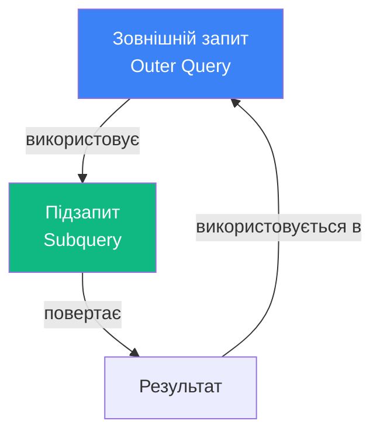
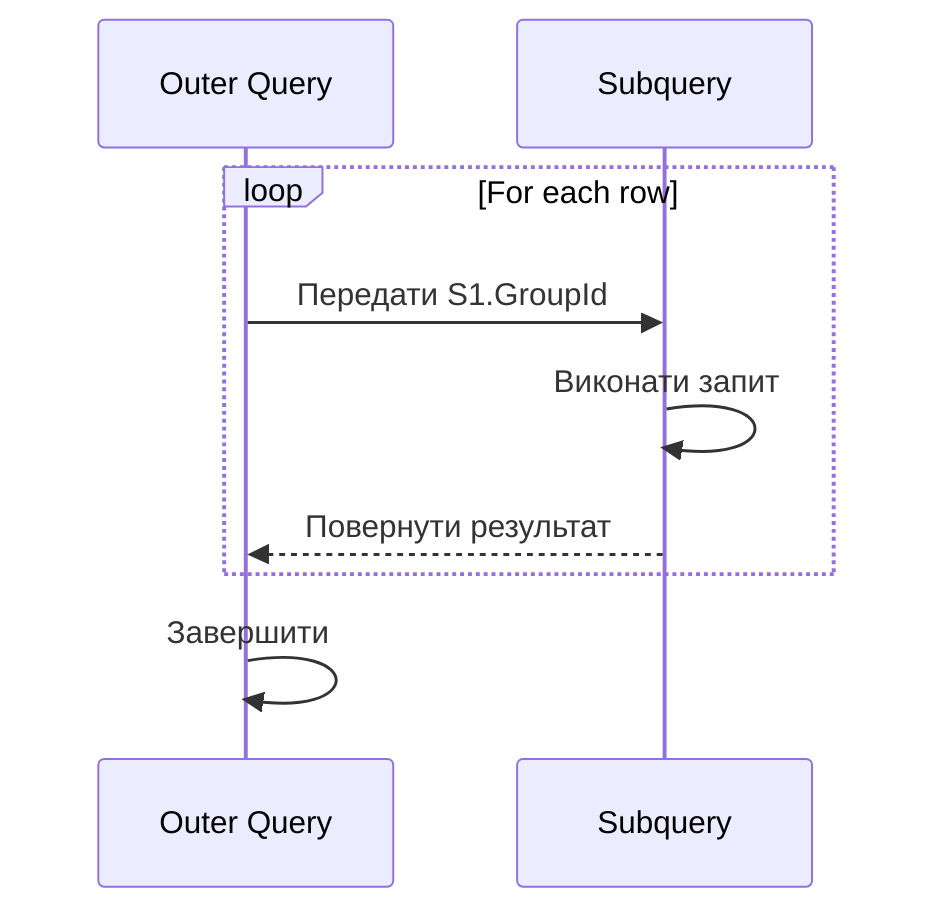

# Підзапити (Subqueries)

## Проблема: Складні багаторівневі запити

**Задача**: Знайти студентів, які мають бал **вище за середній** по їх групі.

Простий підхід НЕ працює:

```sql
-- ❌ Не працює - WHERE виконується ДО агрегації!
SELECT FirstName, Grade
FROM Students
WHERE Grade > AVG(Grade);  -- Помилка!
```

**Рішення**: **Підзапит (Subquery)**!

```sql
-- ✅ Працює - спочатку обчислюємо середнє
SELECT FirstName, Grade
FROM Students
WHERE Grade > (
    SELECT AVG(Grade) FROM Students  -- Підзапит
);
```

---

## 1. Що таке підзапит?

**Підзапит (Subquery)** — SQL-запит **всередині** іншого запиту.

::mermaid



::

**Терміни**:

- **Outer query** (зовнішній запит) - головний запит
- **Subquery / Inner query** (підзапит) - вкладений запит

---

## 2. Типи підзапитів

### 2.1. За результатом

::tabs

::tabs-item{label="Scalar Subquery"}

**Повертає**: ONE VALUE (один рядок, один стовпець)

```sql
SELECT FirstName,
    (SELECT AVG(Grade) FROM Assessments) AS AvgGrade
FROM Students;
```

::

::tabs-item{label="Table Subquery"}

**Повертає**: МНОЖИНУ РЯДКІВ (таблицю)

```sql
SELECT *
FROM (
    SELECT FirstName, Grade
    FROM Students
    WHERE Grade > 80
) AS TopStudents;
```

::

::tabs-item{label="Row Subquery"}

**Повертає**: ОДИН РЯДОК (кілька стовпців)

```sql
SELECT *
FROM Students
WHERE (GroupId, Grade) = (
    SELECT GroupId, MAX(Grade)
    FROM Students
    GROUP BY GroupId
    LIMIT 1
);
```

::

::

### 2.2. За залежністю

::tabs

::tabs-item{label="Non-Correlated"}

**Незалежний** від зовнішнього запиту - виконується **один раз**.

```sql
WHERE Grade > (
    SELECT AVG(Grade) FROM Students
    -- Виконується ОДИН РАЗ
)
```

::

::tabs-item{label="Correlated"}

**Залежний** від зовнішнього запиту - виконується **for each row**.

```sql
WHERE Grade > (
    SELECT AVG(Grade)
    FROM Assessments AS A
    WHERE A.StudentId = S.Id  -- Залежить від S!
    -- Виконується ДЛЯ КОЖНОГО студента
)
```

::

::

---

## 3. Підзапити в WHERE

### 3.1. Scalar subquery (одне значення)

```sql
-- Студенти з балом вище середнього
SELECT
    FirstName,
    LastName,
    Grade
FROM Students
WHERE Grade > (SELECT AVG(Grade) FROM Students);
```

**Виконання**:

1. Спочатку підзапит: `SELECT AVG(Grade)` → `75.5`
2. Потім: `WHERE Grade > 75.5`

### 3.2. IN з підзапитом (множина значень)

```sql
-- Студенти, які є в групах факультету "Computer Science"
SELECT FirstName, LastName
FROM Students
WHERE GroupId IN (
    SELECT G.Id
    FROM Groups AS G
    INNER JOIN Faculties AS F
        ON G.FacultyId = F.Id
    WHERE F.Name = 'Computer Science'
);
```

**Аналогічно з JOIN**:

::code-group

```sql [З підзапитом]
SELECT S.FirstName
FROM Students AS S
WHERE S.GroupId IN (
    SELECT G.Id FROM Groups AS G
    WHERE G.FacultyId = 1
);
```

```sql [З JOIN (краще performance)]
SELECT S.FirstName
FROM Students AS S
INNER JOIN Groups AS G
    ON S.GroupId = G.Id
WHERE G.FacultyId = 1;
```

::

::tip
**Performance**: JOIN зазвичай швидший за IN з підзапитом. Але IN зрозуміліший для читання.
::

### 3.3. NOT IN - знайти відсутні

```sql
-- Кафедри БЕЗ викладачів
SELECT Name
FROM Departments
WHERE Id NOT IN (
    SELECT DISTINCT DepartmentId
    FROM Teachers
    WHERE DepartmentId IS NOT NULL  -- ВАЖЛИВО!
);
```

::warning
**NULL проблема**: `NOT IN` з NULL повертає **ПУСТЕ** результат!

```sql
-- ❌ Поверне 0 рядків, якщо є NULL
WHERE Id NOT IN (1, 2, NULL)

-- ✅ Фільтруйте NULL
WHERE Id NOT IN (
    SELECT DepartmentId
    FROM Teachers
    WHERE DepartmentId IS NOT NULL
)
```

::

---

## 4. Підзапити в SELECT

### 4.1. Scalar subquery для обчислень

```sql
-- Показати студента + середній бал по БД
SELECT
    FirstName,
    LastName,
    Grade,
    (SELECT AVG(Grade) FROM Students) AS OverallAvg,
    Grade - (SELECT AVG(Grade) FROM Students) AS Difference
FROM Students;
```

**Результат**:

| FirstName | LastName | Grade | OverallAvg | Difference |
| :-------- | :------- | :---- | :--------- | :--------- |
| John      | Doe      | 85    | 75.5       | +9.5       |
| Jane      | Smith    | 70    | 75.5       | -5.5       |

### 4.2. Correlated subquery в SELECT

```sql
-- Для кожного студента - його бал + середній по його групі
SELECT
    S.FirstName,
    S.Grade,
    (
        SELECT AVG(S2.Grade)
        FROM Students AS S2
        WHERE S2.GroupId = S.GroupId  -- Correlated!
    ) AS GroupAvg
FROM Students AS S;
```

**Виконання**: Для **кожного** студента S підзапит виконується заново з його `GroupId`.

::warning
**Performance**: Correlated subqueries **повільні** - виконуються N разів (по разу на рядок)!
::

---

## 5. Підзапити в FROM (Derived Tables)

### 5.1. Table subquery

```sql
-- Спочатку відфільтрувати, потім JOIN
SELECT
    TS.FirstName,
    TS.Grade,
    G.Name AS GroupName
FROM (
    SELECT *
    FROM Students
    WHERE Grade > 80  -- Попередній фільтр
) AS TS  -- "Derived table" - ОБОВ'ЯЗКОВИЙ alias!
INNER JOIN Groups AS G
    ON TS.GroupId = G.Id;
```

::note
**Обов'язково**: Derived table має мати **alias** (`AS TS`)!
::

### 5.2. Агрегація в підзапиті

```sql
-- Середній бал по групі, потім відсортувати
SELECT
    GroupAvg.GroupId,
    GroupAvg.AvgGrade
FROM (
    SELECT
        GroupId,
        AVG(Grade) AS AvgGrade
    FROM Students
    GROUP BY GroupId
) AS GroupAvg  -- Derived table
WHERE GroupAvg.AvgGrade > 75
ORDER BY GroupAvg.AvgGrade DESC;
```

---

## 6. EXISTS та NOT EXISTS

### 6.1. EXISTS - перевірка існування

**EXISTS** повертає `TRUE`, якщо підзапит повертає **хоч один рядок**.

```sql
-- Кафедри, на яких Є викладачі
SELECT D.Name
FROM Departments AS D
WHERE EXISTS (
    SELECT 1  -- Не важливо що SELECT, важливо ЧИ Є рядки
    FROM Teachers AS T
    WHERE T.DepartmentId = D.Id
);
```

**Переваги EXISTS**:

- ✅ Зупиняється після **першого** збігу (швидко!)
- ✅ Не має NULL проблем
- ✅ Підтримує correlated підзапити

::tip
**Best Practice**: Використовуйте `SELECT 1` або `SELECT *` в EXISTS - все одно.
::

### 6.2. NOT EXISTS - відсутність записів

```sql
-- Кафедри БЕЗ викладачів
SELECT D.Name
FROM Departments AS D
WHERE NOT EXISTS (
    SELECT 1
    FROM Teachers AS T
    WHERE T.DepartmentId = D.Id
);
```

### 6.3. EXISTS vs IN: Порівняння

::code-group

```sql [EXISTS (краще)]
-- ✅ Швидше, зупиняється після першого збігу
SELECT D.Name
FROM Departments AS D
WHERE EXISTS (
    SELECT 1
    FROM Teachers AS T
    WHERE T.DepartmentId = D.Id
);
```

```sql [IN (повільніше)]
-- ⚠️ Обробляє всі рядки
SELECT D.Name
FROM Departments AS D
WHERE D.Id IN (
    SELECT DepartmentId
    FROM Teachers
);
```

::

**Коли що використовувати**:

| Сценарій                        | Рекомендація            |
| :------------------------------ | :---------------------- |
| Перевірка існування             | **EXISTS**              |
| Порівняння з конкретним списком | **IN ('A', 'B', 'C')**  |
| Велика кількість збігів         | **EXISTS**              |
| NULL можливі                    | **EXISTS** (безпечніше) |

---

## 7. ANY, ALL, SOME

### 7.1. ANY - хоч один

```sql
-- Студенти з балом вище ЗА БУДЬ-ЯКИЙ бал групи 1
SELECT FirstName, Grade
FROM Students
WHERE Grade > ANY (
    SELECT Grade
    FROM Students
    WHERE GroupId = 1
);

-- Еквівалентно: Grade > MIN(subquery)
```

### 7.2. ALL - всі

```sql
-- Студенти з балом вище ЗА ВСІ бали групи 1
SELECT FirstName, Grade
FROM Students
WHERE Grade > ALL (
    SELECT Grade
    FROM Students
    WHERE GroupId = 1
);

-- Еквівалентно: Grade > MAX(subquery)
```

### 7.3. SOME - синонім ANY

```sql
WHERE Grade > SOME (subquery)
-- Те саме що ANY
```

::note
**На практиці**: `ANY`/`ALL` **рідко використовуються** - `MIN`/`MAX` зрозуміліші.
::

---

## 8. Correlated Subqueries

### 8.1. Концепція

**Correlated subquery** посилається на стовпці з **зовнішнього** запиту.

```sql
SELECT
    S1.FirstName,
    S1.Grade,
    (
        SELECT AVG(S2.Grade)
        FROM Students AS S2
        WHERE S2.GroupId = S1.GroupId  -- ← Correlated!
    ) AS GroupAvg
FROM Students AS S1;
```

**Виконання**:

```
Для S1 (рядок 1): виконати підзапит з S1.GroupId = 1
Для S1 (рядок 2): виконати підзапит з S1.GroupId = 1
Для S1 (рядок 3): виконати підзапит з S1.GroupId = 2
...
```

::mermaid



::

### 8.2. Приклад: Вище середнього по групі

```sql
-- Студенти з балом вище середнього ПО ЇХ ГРУПІ
SELECT
    S1.FirstName,
    S1.Grade,
    S1.GroupId
FROM Students AS S1
WHERE S1.Grade > (
    SELECT AVG(S2.Grade)
    FROM Students AS S2
    WHERE S2.GroupId = S1.GroupId  -- Correlated
);
```

### 8.3. Performance проблеми

::warning
**ПОВІЛЬНО**: Correlated subquery виконується **N разів** (для кожного рядка)!

**Альтернатива - CTE або JOIN**:

```sql
-- ✅ Швидше - виконується ОДИН раз
WITH GroupAvgs AS (
    SELECT GroupId, AVG(Grade) AS AvgGrade
    FROM Students
    GROUP BY GroupId
)
SELECT S.FirstName, S.Grade
FROM Students AS S
INNER JOIN GroupAvgs AS GA
    ON S.GroupId = GA.GroupId
WHERE S.Grade > GA.AvgGrade;
```

::

---

## 9. Common Table Expressions (CTE) - Preview

**CTE** - альтернатива підзапитам, зрозуміліша та швидша.

```sql
-- Замість підзапиту в FROM
WITH TopStudents AS (
    SELECT FirstName, Grade
    FROM Students
    WHERE Grade > 80
)
SELECT TS.FirstName, G.Name
FROM TopStudents AS TS
INNER JOIN Groups AS G
    ON TS.GroupId = G.Id;
```

::tip
**CTE** буде детально розглянуто в наступних уроках. Поки що пам'ятайте: CTE = "іменований підзапит".
::

---

## 10. Практичні приклади

### 10.1. Топ-N запит

```sql
-- Топ-3 студенти по балу
SELECT FirstName, Grade
FROM Students
WHERE Grade IN (
    SELECT DISTINCT TOP 3 Grade
    FROM Students
    ORDER BY Grade DESC
)
ORDER BY Grade DESC;
```

### 10.2. Знайти другий максимум

```sql
-- Другий найвищий бал
SELECT MAX(Grade) AS SecondMax
FROM Students
WHERE Grade < (SELECT MAX(Grade) FROM Students);
```

### 10.3. Duplicate detection

```sql
-- Знайти студентів з однаковими іменами
SELECT FirstName, LastName
FROM Students AS S1
WHERE EXISTS (
    SELECT 1
    FROM Students AS S2
    WHERE S1.FirstName = S2.FirstName
    AND S1.LastName = S2.LastName
    AND S1.Id <> S2.Id  -- Не той самий запис
);
```

### 10.4. Знайти "сироти"

```sql
-- Студенти без групи (група видалена)
SELECT FirstName
FROM Students AS S
WHERE NOT EXISTS (
    SELECT 1
    FROM Groups AS G
    WHERE G.Id = S.GroupId
);
```

---

## 11. Best Practices

::card-group

::card{title="1. JOIN замість IN" icon="i-lucide-zap"}

```sql
-- ✅ Швидше
FROM Students S
INNER JOIN Groups G
    ON S.GroupId = G.Id

-- ⚠️ Повільніше
WHERE GroupId IN (
    SELECT Id FROM Groups
)
```

::

::card{title="2. EXISTS замість IN" icon="i-lucide-check"}

```sql
-- ✅ Для перевірки існування
WHERE EXISTS (SELECT 1 ...)

-- ⚠️ Для списку значень
WHERE Id IN (1, 2, 3)
```

::

::card{title="3. Уникайте Correlated" icon="i-lucide-alert-triangle"}

```sql
-- ❌ Повільно (N виконань)
WHERE Grade > (
    SELECT AVG(Grade)
    WHERE GroupId = S.GroupId
)

-- ✅ Використовуйте CTE/JOIN
```

::

::card{title="4. Filter NULL в NOT IN" icon="i-lucide-filter"}

```sql
WHERE Id NOT IN (
    SELECT DepartmentId
    FROM Teachers
    WHERE DepartmentId IS NOT NULL  -- !
)
```

::

::

---

## 12. Практичні завдання

::accordion

::accordion-item{label="Завдання 1: Вище середнього" icon="i-lucide-trending-up"}

Знайти студентів з балом вище середнього по всій БД.

<details>
<summary>💡 Розв'язок</summary>

```sql
SELECT FirstName, LastName, Grade
FROM Students
WHERE Grade > (
    SELECT AVG(Grade) FROM Students
)
ORDER BY Grade DESC;
```

</details>

::

::accordion-item{label="Завдання 2: Порожні кафедри" icon="i-lucide-building"}

Знайти кафедри без викладачів використовуючи NOT EXISTS.

<details>
<summary>💡 Розв'язок</summary>

```sql
SELECT Name
FROM Departments AS D
WHERE NOT EXISTS (
    SELECT 1
    FROM Teachers AS T
    WHERE T.DepartmentId = D.Id
);
```

</details>

::

::accordion-item{label="Завдання 3: Топ-5 груп" icon="i-lucide-award"}

Групи з найвищим середнім балом (топ-5).

<details>
<summary>💡 Розв'язок</summary>

```sql
SELECT
    G.Name,
    (
        SELECT AVG(S.Grade)
        FROM Students AS S
        WHERE S.GroupId = G.Id
    ) AS AvgGrade
FROM Groups AS G
ORDER BY AvgGrade DESC
OFFSET 0 ROWS FETCH NEXT 5 ROWS ONLY;
```

</details>

::

::accordion-item{label="Завдання 4: Кращі за групу" icon="i-lucide-star"}

Студенти з балом вище середнього **по їх групі** (correlated).

<details>
<summary>💡 Розв'язок</summary>

```sql
SELECT S1.FirstName, S1.Grade, G.Name AS GroupName
FROM Students AS S1
INNER JOIN Groups AS G
    ON S1.GroupId = G.Id
WHERE S1.Grade > (
    SELECT AVG(S2.Grade)
    FROM Students AS S2
    WHERE S2.GroupId = S1.GroupId
);
```

</details>

::

::

---

## Резюме

::tip
**Ключові моменти п підзапитів**:

1. **Типи за результатом**:
    - Scalar (одне значення)
    - Table (таблиця)
    - Row (один рядок)

2. **Позиції**:
    - **WHERE**: фільтрація (`WHERE Grade > (SELECT ...))`)
    - **SELECT**: обчислення (` SELECT (SELECT AVG...) AS Avg`)
    - **FROM**: derived tables

3. **Оператори**:
    - **IN / NOT IN**: список значень
    - **EXISTS / NOT EXISTS**: перевірка існування (краще за IN!)
    - **ANY / ALL**: порівняння з множиною

4. **Correlated Subqueries**:
    - Залежать від зовнішнього запиту
    - ⚠️ Повільні (виконуються N разів)
    - Альтернатива: CTE або JOIN

5. **Performance**:
    - JOIN > EXISTS > IN
    - Уникайте correlated підзапитів
    - Остерігайтеся NULL в NOT IN

**Коли використовувати**:

- Багаторівневі умови
- Comparison з агрегатами
- Знайти відсутні зв'язки
- Динамічні фільтри
  ::

---

**Попередня тема**: [CROSS та SELF JOINs](./03.cross-self-joins.md)  
**Наступна тема**: [Агрегації з JOIN](./05.aggregations-with-joins.md)
