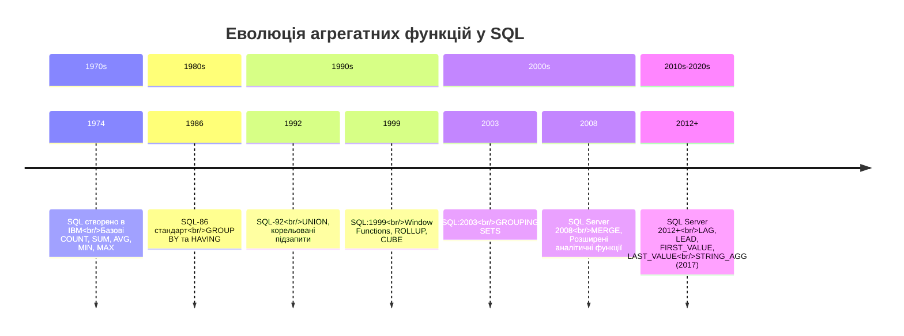
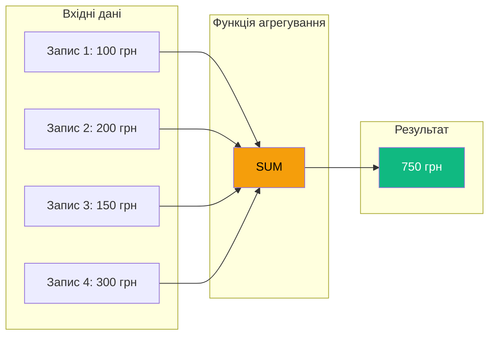
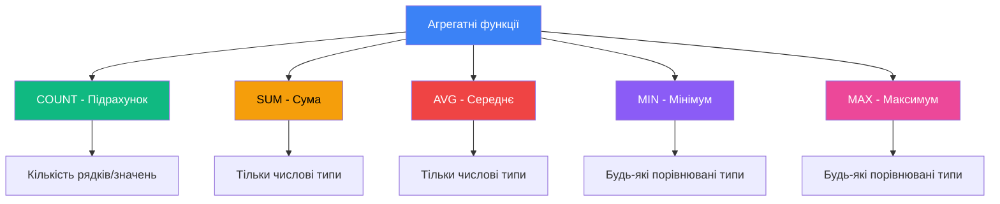
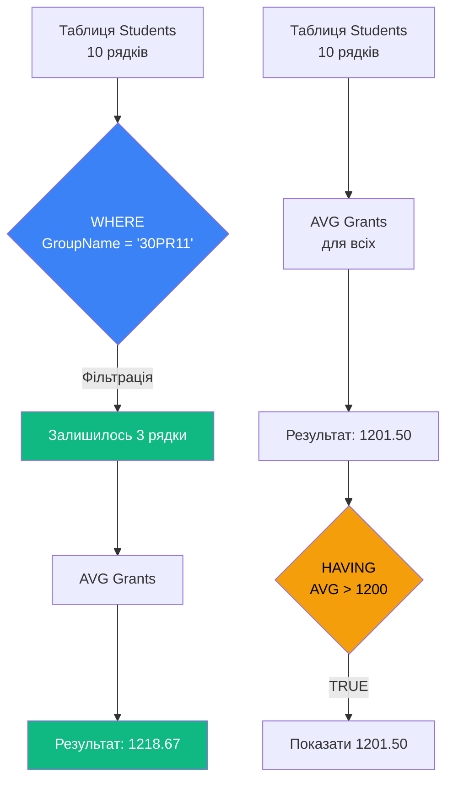
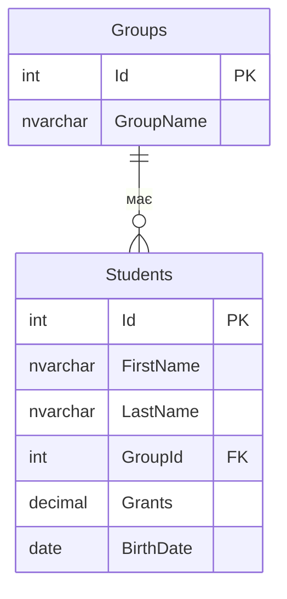
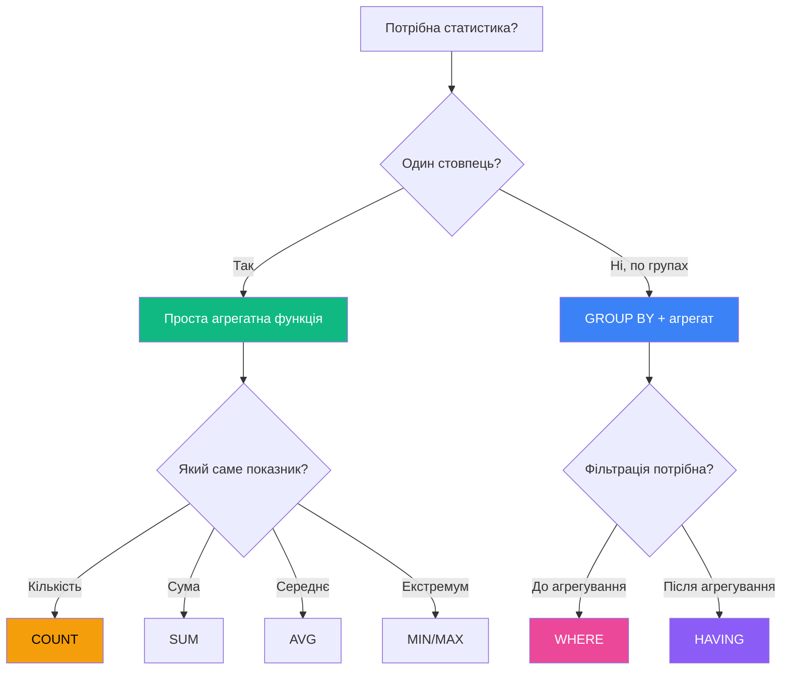

# Функції агрегування в MS SQL Server

## Вступ: Навіщо потрібна статистика в базах даних?

Уявіть, що ви керуєте великим інтернет-магазином з мільйонами товарів та транзакцій. Щодня вам потрібно відповідати на питання:

- Скільки товарів продано сьогодні?
- Який середній чек замовлення?
- Хто з клієнтів витратив найбільше грошей?
- Яка загальна сума виручки за місяць?

**Погана новина**: Якби ви отримували всі записи з бази даних та рахували результат у додатку (Python, C#, Java), це було б **катастрофічно повільно**:

```python
# ❌ НЕПРАВИЛЬНО: Отримуємо мільйон записів у додаток
orders = db.query("SELECT price FROM orders")  # 1,000,000 рядків!
total = sum([order.price for order in orders])  # Обчислення у Python
# Проблеми:
# - Передача 1 млн рядків через мережу (100+ МБ)
# - Використання пам'яті додатку
# - Повільно (секунди замість мілісекунд)
```

**Хороша новина**: SQL Server може зробити все це **на стороні БД** за мілісекунди:

```sql
-- ✅ ПРАВИЛЬНО: Обчислюємо в БД
SELECT SUM(price) AS total_revenue FROM orders;
-- Результат: одне число, виконання ~50ms на 1 млн записів
```

::note
**Ключова ідея**: Функції агрегування (Aggregate Functions) дозволяють перетворити **множину рядків** у **єдине підсумкове значення** безпосередньо в базі даних, що набагато швидше та ефективніше.
::

---

## Реальний сценарій: Dashboard для E-commerce

Припустимо, у нас є база даних з таблицею замовлень:

```sql
CREATE TABLE Orders (
    order_id INT PRIMARY KEY,
    customer_id INT,
    product_name NVARCHAR(100),
    price DECIMAL(10, 2),
    quantity INT,
    order_date DATETIME2
);
```

Менеджеру потрібен дашборд з такими метриками:

| Метрика                     | Без агрегатів                   | З агрегатами            |
| :-------------------------- | :------------------------------ | :---------------------- |
| Кількість замовлень         | Завантажити все + рахувати в C# | `COUNT(*)`              |
| Середній чек                | Завантажити все + AVG у Python  | `AVG(price)`            |
| Максимальна сума замовлення | Завантажити все + MAX у Java    | `MAX(price)`            |
| Загальна виручка            | Завантажити все + SUM у PHP     | `SUM(price * quantity)` |

::tip
**Performance gain**: Використання агрегатних функцій може прискорити запити у **100-1000 разів** порівняно з обчисленнями у додатку!
::

---

## Історична еволюція агрегатних функцій

Функції агрегування — це не нова концепція. Вони з'явилися разом з першими реляційними базами даних:

::mermaid



::

::note
**Цікавий факт**: У SQL Server 2017 з'явилася функція `STRING_AGG()`, яка дозволяє агрегувати рядки тексту (наприклад, об'єднати всі імена клієнтів у один список).
::

---

## Фундаментальні концепції

### Що таке агрегування?

**Агрегування** (Aggregation) — це процес перетворення множини значень у єдине підсумкове значення.

::mermaid



::

### Відмінність від скалярних функцій

| Характеристика | Скалярна функція         | Агрегатна функція             |
| :------------- | :----------------------- | :---------------------------- |
| Вхідні дані    | **Один** рядок           | **Множина** рядків            |
| Вихідні дані   | Одне значення            | Одне значення                 |
| Приклад        | `UPPER('text')`          | `COUNT(*)`                    |
| Використання   | Для кожного рядка окремо | Для всіх рядків разом         |
| WHERE clause   | ✅ Можна                 | ❌ Не можна (тільки в HAVING) |

**Приклад різниці**:

```sql
-- Скалярна функція: застосовується до КОЖНОГО рядка окремо
SELECT
    first_name,
    UPPER(first_name) AS uppercase_name  -- Виконується для кожного студента
FROM Students;
-- Результат: 10 рядків → 10 рядків

-- Агрегатна функція: об'єднує ВСІ рядки в один
SELECT
    COUNT(*) AS total_students  -- Одне число для всіх студентів
FROM Students;
-- Результат: 10 рядків → 1 рядок
```

---

## П'ять базових агрегатних функцій

SQL Server надає **5 основних** агрегатних функцій:

::mermaid



::

::warning
**Важливе обмеження**: Функції `SUM()` та `AVG()` працюють **тільки з числовими** типами даних (`INT`, `DECIMAL`, `FLOAT` тощо). Спроба використати їх з `VARCHAR` призведе до помилки!
::

---

## COUNT(): Підрахунок записів

### Навіщо рахувати записи?

Найпростіше питання: "Скільки?" — найпоширеніше у бізнес-аналітиці:

- Скільки клієнтів зареєструвалося?
- Скільки замовлень оброблено?
- Скільки товарів на складі?

### Три варіації COUNT()

Функція `COUNT()` має **три різні форми** з різною поведінкою:

::tabs

::tab{label="COUNT(\*) - Усі рядки"}

```sql
SELECT COUNT(*) AS total_students
FROM Students;
```

**Що рахує**: Абсолютно ВСІ рядки, **включаючи NULL**

**Результат на тестових даних** (10 студентів, з них 2 мають `Grants = NULL`):

```
total_students
--------------
10
```

**Коли використовувати**: Коли потрібна **загальна кількість рядків** у таблиці або результаті запиту.

::

::tab{label="COUNT(column) - Непусті значення"}

```sql
SELECT COUNT(Grants) AS students_with_grants
FROM Students;
```

**Що рахує**: Тільки рядки, де стовпець `Grants` **НЕ NULL**

**Результат**:

```
students_with_grants
--------------------
8
```

**Коли використовувати**: Коли потрібно дізнатися, у скількох записах **заповнено** конкретне поле.

::

::tab{label="COUNT(DISTINCT column) - Унікальні значення"}

```sql
SELECT COUNT(DISTINCT Grants) AS unique_grant_amounts
FROM Students;
```

**Що рахує**: Кількість **унікальних** значень (без повторів та NULL)

**Приклад даних**:

```
Студент | Стипендія
--------|----------
Іван    | 1200
Марія   | 1200
Петро   | 1300
Ольга   | NULL
```

**Результат**:

```
unique_grant_amounts
--------------------
2  (1200 і 1300, NULL не враховується)
```

**Коли використовувати**: Коли потрібна кількість **різних** значень.

::

::

### Анатомія коду: Порівняння варіантів

```sql {2-4}
SELECT
    COUNT(*) AS total_rows,           -- 10 (усі студенти)
    COUNT(Grants) AS has_grant,       -- 8 (студенти зі стипендією)
    COUNT(DISTINCT Grants) AS unique_grants  -- 5 (різні розміри стипендій)
FROM Students;
```

**Результат виконання**:

| total_rows | has_grant | unique_grants |
| ---------: | --------: | ------------: |
|         10 |         8 |             5 |

**Пояснення**:

- **Рядок 2**: `COUNT(*)` — рахує всі 10 студентів
- **Рядок 3**: `COUNT(Grants)` — ігнорує 2 студентів з `NULL`
- **Рядок 4**: `COUNT(DISTINCT Grants)` — рахує лише унікальні суми: 1000, 1100, 1200, 1256, 1300

---

## SUM(): Обчислення суми

### Навіщо потрібна сума?

Фінансові та кількісні підрахунки — основа бізнес-аналітики:

- Яка загальна виручка?
- Скільки грошей витрачено на стипендії?
- Скільки товарів продано?

### Базове використання

```sql
SELECT SUM(Grants) AS total_grants_budget
FROM Students;
```

**Підрахунок вручну для перевірки**:

```
1000 + 1100 + 1200 + 1200 + 1256 + 1256 + 1300 + 1300 = 9612 грн
```

**Результат запиту**:

```
total_grants_budget
-------------------
9612.00
```

::note
**Важливо**: `SUM()` **автоматично ігнорує NULL** значення. Якщо у всіх студентів стипендія NULL, результат буде `NULL` (а не 0!).
::

### Обчислювані вирази в SUM()

Функція `SUM()` може працювати не тільки зі стовпцями, але й з **виразами**:

```sql
-- Розрахунок загальної виручки (ціна × кількість)
SELECT
    SUM(price * quantity) AS total_revenue
FROM OrderItems;
```

**Приклад даних**:

| product_name | price | quantity | price × quantity |
| :----------- | ----: | -------: | ---------------: |
| Ноутбук      | 20000 |        2 |            40000 |
| Миша         |   300 |       10 |             3000 |
| Клавіатура   |  1500 |        5 |             7500 |

**Результат**:

```
total_revenue
-------------
50500.00
```

**Пояснення**: SQL Server **спочатку обчислює вираз** для кожного рядка (20000×2, 300×10, 1500×5), а **потім** сумує результати.

---

## AVG(): Середнє арифметичне

### Коли потрібне середнє значення?

Середні показники допомагають зрозуміти "типову" ситуацію:

- Який середній чек?
- Скільки в середньому років клієнтам?
- Яка середня зарплата?

### Проста формула

$$
AVG = \frac{\sum values}{COUNT(non-NULL\ values)}
$$

```sql
SELECT AVG(Grants) AS average_grant
FROM Students;
```

**Перевірка вручну**:

```
(1000 + 1100 + 1200 + 1200 + 1256 + 1256 + 1300 + 1300) ÷ 8 = 1201.50 грн
```

**Результат**:

```
average_grant
-------------
1201.50
```

::warning
**Критична помилка**: `AVG()` ігнорує NULL, що може спотворити результат!

**Приклад проблеми**:

```sql
-- У нас 10 студентів, але тільки 8 отримують стипендію
SELECT AVG(Grants) FROM Students;  -- 1201.50
-- Це НЕ середня стипендія на одного студента!
-- Правильно: 9612 ÷ 10 = 961.20 грн на студента
```

**Рішення**:

```sql
SELECT SUM(Grants) / COUNT(*) AS true_average_per_student
FROM Students;  -- 961.20
```

::

### Складні обчислення з AVG()

**Завдання**: Знайти середній вік студентів

```sql
SELECT
    AVG(DATEDIFF(DAY, BirthDate, GETDATE()) / 365.25) AS average_age
FROM Students;
```

**Розбір анатомії**:

1. `GETDATE()` — поточна дата (2024-02-08)
2. `DATEDIFF(DAY, BirthDate, GETDATE())` — різниця в **днях** між датою народження та сьогодні
3. `... / 365.25` — перетворюємо дні у роки (з урахуванням високосних років)
4. `AVG(...)` — середнє арифметичне віку всіх студентів

**Чому 365.25?**  
У звичайному році 365 днів, але кожні 4 роки — високосний рік (366 днів). Середнє: (365×3 + 366) ÷ 4 = **365.25** днів.

---

## MIN() та MAX(): Пошук екстремумів

### Коли потрібні мінімум/максимум?

- Хто найстарший/наймолодший клієнт?
- Яка найдешевша/найдорожча покупка?
- Коли було останнє замовлення?

### MIN(): Найменше значення

```sql
SELECT MIN(BirthDate) AS oldest_student_birthdate
FROM Students;
```

**Приклад даних**:

```
Студент | Дата народження
--------|----------------
Іван    | 2000-05-15
Марія   | 1999-03-22  ← MIN (найстарша)
Петро   | 2001-11-30
```

**Результат**:

```
oldest_student_birthdate
------------------------
1999-03-22
```

::note
**Логіка для дат**: Для типу `DATE`/`DATETIME2`:

- `MIN()` повертає **найдавнішу** дату (найстаріший студент)
- `MAX()` повертає **найновішу** дату (наймолодший студент)
  ::

### MAX(): Найбільше значення

```sql
SELECT MAX(Grants) AS highest_grant
FROM Students;
```

**Результат**:

```
highest_grant
-------------
1300.00
```

### Робота з текстовими даними

**MIN()** та **MAX()** працюють не тільки з числами, але й з **текстом**!

```sql
SELECT
    MIN(LastName) AS first_alphabetically,
    MAX(LastName) AS last_alphabetically
FROM Students;
```

**Як порівнюються рядки?**  
SQL Server порівнює рядки **посимвольно** за значеннями Unicode:

```
Андрій  < Борис  < Вікторія < Ірина
A (U+0410) < Б (U+0411) < В (U+0412) < І (U+0406)
```

**Приклад даних**:

```
LastName
---------
Іванов    ← MAX (останній в алфавіті за кириличною І)
Doe
Brown
Коваленко
Moore
Петренко
```

**Результат**:

```
first_alphabetically | last_alphabetically
---------------------|--------------------
Brown                | Петренко
```

::tip
**Unicode сортування**: Англійські літери (A-Z, U+0041-U+005A) йдуть **раніше** за кириличні (А-Я, U+0410-U+042F) в Unicode, тому "Brown" < "Іванов".
::

---

## Робота з NULL значеннями

### NULL — це не 0 і не порожній рядок!

`NULL` означає **відсутність значення** або **невідоме значення**.

::tabs

::tab{label="NULL у COUNT"}

```sql
SELECT
    COUNT(*) AS all_students,        -- 10
    COUNT(Grants) AS with_grants,    -- 8 (ігнорує NULL)
    COUNT(*) - COUNT(Grants) AS without_grants  -- 2
FROM Students;
```

**Результат**:

```
all_students | with_grants | without_grants
-------------|-------------|---------------
          10 |           8 |              2
```

::

::tab{label="NULL у SUM/AVG"}

```sql
-- Таблиця Orders
INSERT INTO Orders VALUES (1, 100.00);
INSERT INTO Orders VALUES (2, 200.00);
INSERT INTO Orders VALUES (3, NULL);   -- Немає ціни

SELECT
    SUM(price) AS total,    -- 300.00 (NULL ігнорується)
    AVG(price) AS average   -- 150.00 (300 ÷ 2, а не ÷ 3!)
FROM Orders;
```

::

::tab{label="NULL у MIN/MAX"}

```sql
SELECT
    MIN(Grants) AS min_grant,  -- 1000 (NULL ігнорується)
    MAX(Grants) AS max_grant   -- 1300
FROM Students;
-- NULL не бере участі в порівнянні
```

::

::

::caution
**Підступності NULL**:

```sql
-- ❌ Це НЕ знайде студентів без стипендії!
SELECT * FROM Students WHERE Grants = NULL;  -- Завжди 0 рядків!

-- ✅ Правильно:
SELECT * FROM Students WHERE Grants IS NULL;
```

**Причина**: NULL означає "невідомо", тому `NULL = NULL` дає `UNKNOWN` (не TRUE і не FALSE).
::

---

## Комбінування агрегатних функцій

Ви можете використовувати **кілька** агрегатних функцій в одному запиті:

```sql
SELECT
    COUNT(*) AS total_students,
    COUNT(Grants) AS students_with_grants,
    SUM(Grants) AS total_budget,
    AVG(Grants) AS average_grant,
    MIN(Grants) AS min_grant,
    MAX(Grants) AS max_grant,
    MAX(Grants) - MIN(Grants) AS grant_range
FROM Students;
```

**Результат**:

| total_students | students_with_grants | total_budget | average_grant | min_grant | max_grant | grant_range |
| -------------: | -------------------: | -----------: | ------------: | --------: | --------: | ----------: |
|             10 |                    8 |      9612.00 |       1201.50 |   1000.00 |   1300.00 |      300.00 |

**Пояснення останнього стовпця**:  
`MAX(Grants) - MIN(Grants)` — це **діапазон** (range) стипендій. Обчислюється як вираз з двох агрегатів.

---

## WHERE vs HAVING: Фільтрація до та після агрегування

### Проблема: Коли фільтрувати?

Припустимо, нам потрібно знайти **середню стипендію студентів групи 30PR11**.

::tabs

::tab{label="WHERE - Фільтрація ДО агрегування"}

```sql
SELECT AVG(Grants) AS avg_grant_30PR11
FROM Students AS S
JOIN Groups AS G ON S.GroupId = G.Id
WHERE G.GroupName = '30PR11';  -- Фільтруємо РЯДКИ перед агрегуванням
```

**Порядок виконання**:

1. JOIN таблиць Students і Groups
2. **WHERE** — залишаємо тільки студентів з групи 30PR11
3. **AVG()** — обчислюємо середню стипендію **відфільтрованих** рядків

::

::tab{label="HAVING - Фільтрація ПІСЛЯ агрегування"}

```sql
-- ❌ Це НЕ спрацює для нашої задачі!
SELECT AVG(Grants) AS avg_grant
FROM Students
HAVING AVG(Grants) > 1200;  -- Фільтруємо РЕЗУЛЬТАТ агрегування
```

**Порядок виконання**:

1. **AVG()** — обчислюємо середню стипендію для ВСІХ студентів
2. **HAVING** — перевіряємо чи середня > 1200
3. Якщо ТАК — показуємо результат, якщо НІ — не показуємо

::

::

::warning
**Золоте правило**:

- `WHERE` — фільтрує **окремі рядки** ДО агрегування
- `HAVING` — фільтрує **результати агрегування** ПІСЛЯ
  ::

### Візуалізація порядку виконання

::mermaid



::

---

## Багатотабличні запити з агрегатами

До цього моменту ми працювали з однією таблицею. У реальних проектах дані розподілені по **кількох таблицях**.

### Схема бази даних University

::mermaid



::

### Завдання: Кількість студентів у кожній групі

```sql {2,4,5}
SELECT
    G.GroupName,
    COUNT(S.Id) AS student_count
FROM Groups AS G
LEFT JOIN Students AS S ON G.Id = S.GroupId
GROUP BY G.GroupName;
```

**Анатомія коду**:

- **Рядок 2**: Назва групи (буде в результаті для кожної групи окремо)
- **Рядок 3**: Кількість студентів у цій групі
- **Рядок 4-5**: `LEFT JOIN` — щоб включити групи **без студентів** (якщо такі є)
- **GROUP BY** — про це детально в наступному розділі

**Результат**:

| GroupName | student_count |
| :-------- | ------------: |
| 30PR11    |             3 |
| 30PR12    |             3 |
| 32SS11    |             2 |
| 32SS12    |             2 |

---

## Продуктивність агрегатних функцій

### Як SQL Server виконує агрегування?

За лаштунками SQL Server може використовувати різні алгоритми:

::tabs

::tab{label="Stream Aggregate"}

**Коли**: Дані вже **відсортовані** (наприклад, є індекс)

**Принцип**: Послідовно читає рядки та накопичує результат

```
Відсортовані дані:  [1, 1, 2, 2, 3, 3]
                     ↓  ↓  ↓  ↓  ↓  ↓
SUM:          1 → 2 → 4 → 6 → 9 → 12
```

**Продуктивність**: O(n) — дуже швидко ⚡

::

::tab{label="Hash Aggregate"}

**Коли**: Дані **НЕ** відсортовані

**Принцип**: Використовує hash-таблицю для групування

```
Невідсортовані дані: [3, 1, 2, 1, 3, 2]
                      ↓
Hash Table:  {1: [1,1], 2: [2,2], 3: [3,3]}
             ↓
Результати:  {1: SUM=2, 2: SUM=4, 3: SUM=6}
```

**Продуктивність**: O(n) але **потребує пам'яті** 🐌

::

::

::tip
**Оптимізація**: Створіть індекс на стовпці, по якому часто агрегуєте:

```sql
CREATE INDEX IX_Students_Grants ON Students(Grants);
-- Тепер SUM(Grants) буде швидшим!
```

::

---

## Типові помилки та Anti-Patterns

### ❌ Помилка 1: Змішування агрегатів і неагрегованих стовпців

```sql
-- ❌ ЦЕ НЕ ПРАЦЮЄ!
SELECT
    GroupName,      -- Неагрегований стовпець
    COUNT(*)        -- Агрегатна функція
FROM Students AS S
JOIN Groups AS G ON S.GroupId = G.Id;
```

**Помилка**:

```
Column 'Groups.GroupName' is invalid in the select list
because it is not contained in either an aggregate function
or the GROUP BY clause.
```

**Чому**: Агрегат повертає **одне** значення, а `GroupName` — **багато**. SQL не знає, яке з них вибрати.

**Рішення**:

```sql
-- ✅ ПРАВИЛЬНО
SELECT
    GroupName,
    COUNT(*)
FROM Students AS S
JOIN Groups AS G ON S.GroupId = G.Id
GROUP BY GroupName;  -- Групуємо по GroupName!
```

---

### ❌ Помилка 2: WHERE замість HAVING для агрегатів

```sql
-- ❌ НЕ ПРАЦЮЄ
SELECT AVG(Grants) FROM Students
WHERE AVG(Grants) > 1200;
```

**Помилка**:

```
An aggregate may not appear in the WHERE clause.
```

**Рішення**:

```sql
-- ✅ ПРАВИЛЬНО
SELECT AVG(Grants) FROM Students
HAVING AVG(Grants) > 1200;
```

---

### ❌ Помилка 3: Ігнорування NULL у середніх значеннях

```sql
-- ❌ НЕКОРЕКТНО: не враховує студентів без стипендії
SELECT AVG(Grants) AS avg_grant FROM Students;
-- Результат: 1201.50 (поділено на 8, а не на 10!)

-- ✅ ПРАВИЛЬНО: середня стипендія на ВСІХ студентів
SELECT SUM(Grants) / COUNT(*) AS true_avg FROM Students;
-- Результат: 961.20
```

---

## Best Practices: Коли використовувати що?

::mermaid



::

---

## Практичні завдання

::steps

### Крок 1: Створіть тестову базу даних

```sql
CREATE TABLE Products (
    product_id INT PRIMARY KEY,
    product_name NVARCHAR(100),
    category NVARCHAR(50),
    price DECIMAL(10, 2),
    stock_quantity INT,
    supplier_id INT
);

INSERT INTO Products VALUES
(1, 'Ноутбук Dell XPS', 'Електроніка', 35000.00, 15, 1),
(2, 'Миша Logitech', 'Аксесуари', 450.00, 120, 2),
(3, 'Клавіатура Razer', 'Аксесуари', 2500.00, 45, 2),
(4, 'Монітор Samsung', 'Електроніка', 8500.00, 30, 3),
(5, 'SSD 1TB', 'Комплектуючі', 2200.00, NULL, 1);
```

### Крок 2: Базові агрегати

**Завдання**: Знайдіть:

1. Загальну кількість товарів
2. Середню ціну
3. Найдорожчий товар
4. Загальну вартість складу (ціна × кількість)

::collapsible{label="Показати рішення"}

```sql
SELECT
    COUNT(*) AS total_products,
    AVG(price) AS avg_price,
    MAX(price) AS max_price,
    SUM(price * ISNULL(stock_quantity, 0)) AS total_inventory_value
FROM Products;
```

**Пояснення**:

- `ISNULL(stock_quantity, 0)` — замінює NULL на 0, щоб не втратити товар у підрахунку

::

### Крок 3: Фільтрація

**Завдання**: Знайдіть середню ціну товарів категорії "Аксесуари"

::collapsible{label="Показати рішення"}

```sql
SELECT AVG(price) AS avg_accessory_price
FROM Products
WHERE category = 'Аксесуари';
```

::

### Крок 4: Складні обчислення

**Завдання**: Знайдіть різницю між найдорожчим і найдешевшим товаром

::collapsible{label="Показати рішення"}

```sql
SELECT
    MAX(price) - MIN(price) AS price_range,
    MAX(price) AS most_expensive,
    MIN(price) AS cheapest
FROM Products;
```

::

::

---

## Резюме

::note
**Ключові висновки**:

1. **Агрегатні функції** перетворюють множину рядків в одне значення
2. **5 базових функцій**: COUNT, SUM, AVG, MIN, MAX
3. **NULL автоматично ігнорується** всіма агрегатами
4. **WHERE** фільтрує рядки ДО агрегування
5. **HAVING** фільтрує результати ПІСЛЯ агрегування
6. **Продуктивність**: Агрегування у БД швидше у 100-1000 разів ніж у застосунку
7. **Індекси** прискорюють агрегатні запити

::

::tip
**Що далі?**

У наступному розділі ми детально вивчимо:

- `GROUP BY` — як групувати дані
- `HAVING` — фільтрація груп
- `ROLLUP`, `CUBE`, `GROUPING SETS` — багаторівневі підсумки

[Перейти до розділу "Групування даних" →](./02.grouping-data.md)
::

---

## Додаткові ресурси

- [Офіційна документація Microsoft: Aggregate Functions](https://learn.microsoft.com/en-us/sql/t-sql/functions/aggregate-functions-transact-sql)
- [Execution Plans для агрегатів](https://learn.microsoft.com/en-us/sql/relational-databases/performance/execution-plans)
