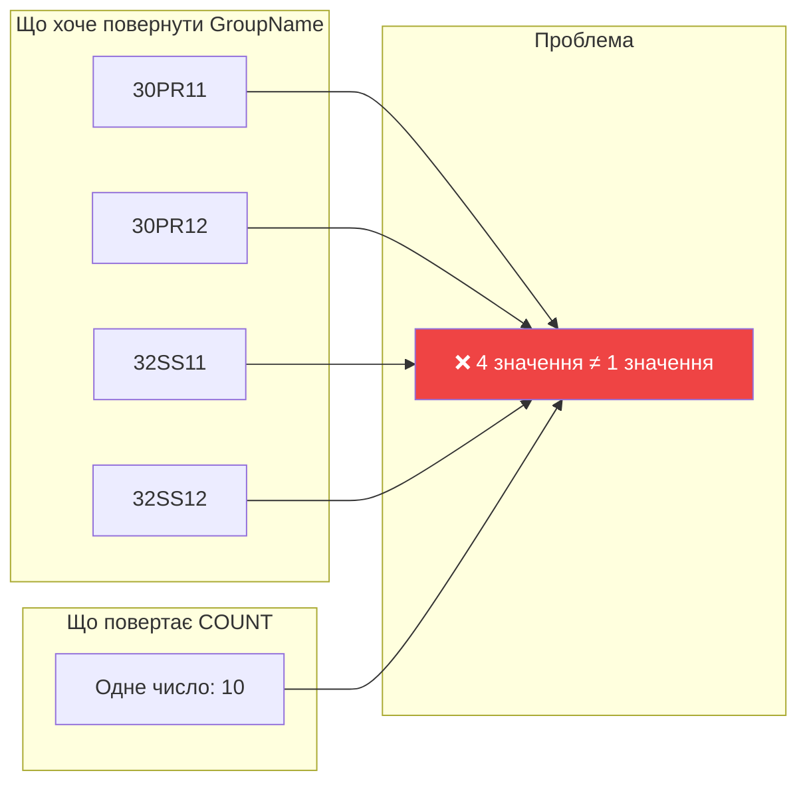
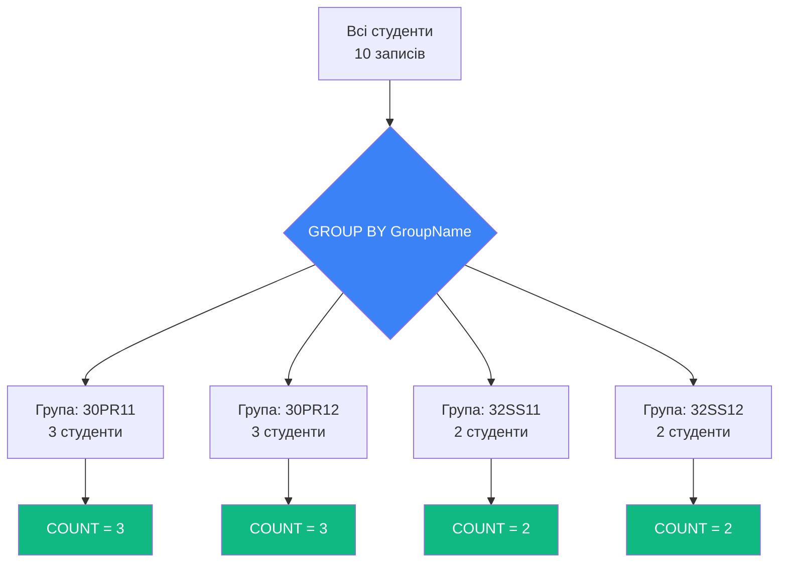
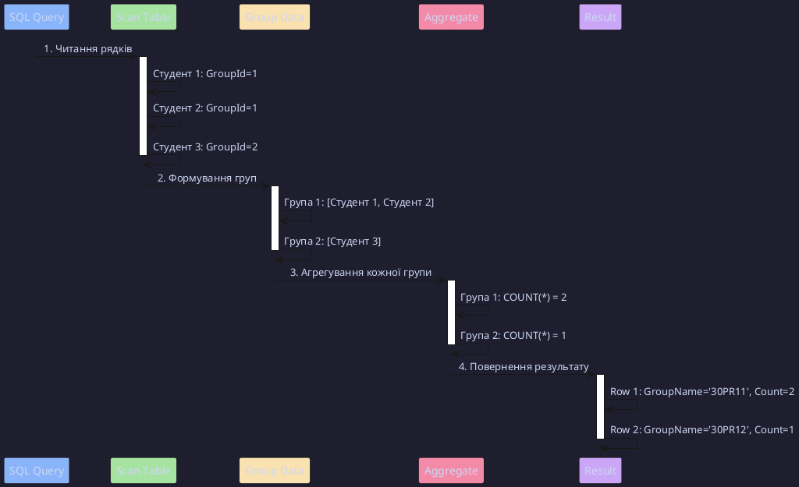
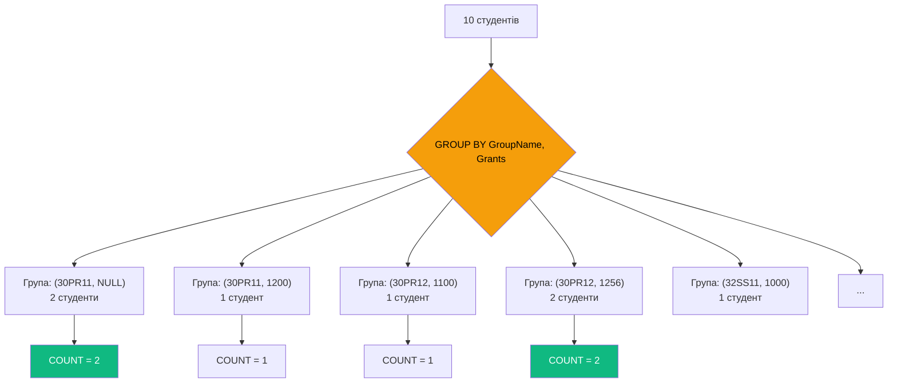
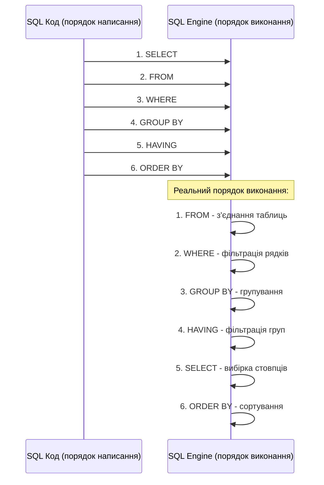
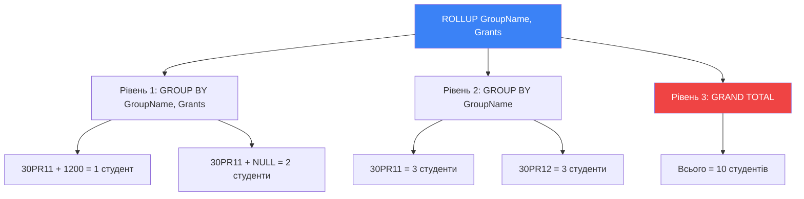

# Групування даних в MS SQL Server

## Проблема: Чому не можна просто додати стовпець до агрегату?

Припустимо, ми хочемо дізнатися скільки студентів навчається в **кожній** групі. Спробуємо написати такий запит:

```sql
-- ❌ ЦЕ НЕ СПРАЦЮЄ!
SELECT
    GroupName,
    COUNT(*) AS student_count
FROM Students AS S
JOIN Groups AS G ON S.GroupId = G.Id;
```

**Помилка**:

```
Column 'Groups.GroupName' is invalid in the select list because it is not contained in either an aggregate function or the GROUP BY clause.
```

### Чому виникає помилка?

::mermaid



::

**Пояснення**: `COUNT(*)` повертає **одне** число (загальну кількість студентів), а `GroupName` хоче повернути **багато** значень (назви всіх груп). SQL не знає, як поєднати багато з одним.

**Уявний неможливий результат**:

| GroupName                            | student_count |
| :----------------------------------- | ------------: |
| 30PR11<br>30PR12<br>32SS11<br>32SS12 |            10 |

::warning
**Конфлікт кардинальності**: Агрегатна функція згортає N рядків у 1, а неагрегований стовпець залишає N рядків. Це логічна суперечність!
::

---

## Рішення: GROUP BY

`GROUP BY` вирішує цю проблему, дозволяючи **розділити дані на групи** та застосувати агрегатну функцію **до кожної групи окремо**.

### Концепція групування

::mermaid



::

### Правильний запит з GROUP BY

```sql {4}
-- ✅ ПРАВИЛЬНО
SELECT
    GroupName,
    COUNT(*) AS student_count
FROM Students AS S
JOIN Groups AS G ON S.GroupId = G.Id
GROUP BY GroupName;
```

**Результат**:

| GroupName | student_count |
| :-------- | ------------: |
| 30PR11    |             3 |
| 30PR12    |             3 |
| 32SS11    |             2 |
| 32SS12    |             2 |

**Анатомія виконання**:

1. `JOIN` з'єднує таблиці Students і Groups
2. `GROUP BY GroupName` **розділяє** рядки на групи по назві групи
3. `COUNT(*)` рахує кількість студентів **у кожній групі окремо**
4. Кожна група стає **одним рядком** у результаті

---

## Як SQL Server виконує GROUP BY під капотом?

### Візуалізація процесу

::plant-uml



::

### Два алгоритми групування

SQL Server може використовувати різні фізичні алгоритми для `GROUP BY`:

::tabs

::tab{label="Stream Aggregate"}

**Умова**: Дані **вже відсортовані** по стовпцю групування (наприклад, є індекс)

**Принцип роботи**:

```
Відсортовані дані:
GroupName    | student_id
-------------|------------
30PR11       | 1          ← Група 1 почалася
30PR11       | 2          │
30PR11       | 3          ← Група 1 закінчилась, COUNT=3
30PR12       | 4          ← Група 2 почалася
30PR12       | 5          │
30PR12       | 6          ← Група 2 закінчилась, COUNT=3
```

**Продуктивність**:

- ⚡ O(n) — дуже швидко
- 💾 Мало пам'яті (обробка "на льоту")

::

::tab{label="Hash Aggregate"}

**Умова**: Дані **НЕ** відсортовані

**Принцип роботи**:

```
Невідсортовані дані:
GroupName    | student_id
-------------|------------
30PR12       | 4
30PR11       | 1
32SS11       | 7
30PR11       | 2
...

↓ Створення Hash Table

Hash Table:
{
  "30PR11": [1, 2, 3],      → COUNT = 3
  "30PR12": [4, 5, 6],      → COUNT = 3
  "32SS11": [7, 8]          → COUNT = 2
}
```

**Продуктивність**:

- 🐌 O(n) але повільніше за Stream
- 💾 Потребує пам'яті для hash-таблиці

::

::

::tip
**Оптимізація**: Створіть індекс на стовпці, по якому групуєте:

```sql
CREATE INDEX IX_Students_GroupId ON Students(GroupId);
-- Тепер SQL Server використає Stream Aggregate ⚡
```

::

---

## Групування по кількох стовпцях

Ви можете групувати дані одразу по **кількох** стовпцях. У цьому випадку група формується на основі **унікальної комбінації** значень.

### Приклад: Кількість студентів з однаковою стипендією в кожній групі

```sql
SELECT
    GroupName,
    Grants,
    COUNT(*) AS student_count
FROM Students AS S
JOIN Groups AS G ON S.GroupId = G.Id
GROUP BY GroupName, Grants;
```

**Результат**:

| GroupName | Grants | student_count |
| :-------- | -----: | ------------: |
| 30PR11    |   NULL |             2 |
| 30PR11    |   1200 |             1 |
| 30PR12    |   1100 |             1 |
| 30PR12    |   1256 |             2 |
| 32SS11    |   1000 |             1 |
| 32SS11    |   1300 |             1 |

**Пояснення**:

- У групі **30PR11** є 2 студенти з `Grants = NULL` (обидва без стипендії)
- У групі **30PR12** є 2 студенти з `Grants = 1256`
- Інші групи: всі студенти мають різні стипендії → кожен утворює окрему групу

::note
**Важливо**: `GROUP BY` трактує всі `NULL` як **однакові** значення. Тому два студенти з `Grants = NULL` потраплять в одну групу.
::

### Візуалізація групування по двох стовпцях

::mermaid



::

---

## WHERE vs HAVING: Порядок виконання

Найчастіша плутанина при роботі з `GROUP BY` — **коли використовувати WHERE, а коли HAVING?**

### Золоте правило

::note
**Ключова відмінність**:

- `WHERE` фільтрує **окремі рядки** ДО групування
- `HAVING` фільтрує **групи** ПІСЛЯ агрегування
  ::

### Порядок виконання SQL запиту

SQL виконує запит не в тому порядку, в якому ви його пишете!

::mermaid



::

### Приклад 1: WHERE — фільтрація ДО групування

**Завдання**: Знайти кількість студентів у кожній групі, але **тільки тих, хто має стипендію**.

```sql {5}
SELECT
    GroupName,
    COUNT(*) AS students_with_grants
FROM Students AS S
JOIN Groups AS G ON S.GroupId = G.Id
WHERE S.Grants IS NOT NULL  -- Фільтруємо РЯДКИ (окремих студентів)
GROUP BY GroupName;
```

**Порядок виконання**:

1. `FROM` + `JOIN` — з'єднуємо таблиці (10 студентів)
2. **WHERE** — залишаємо тільки студентів зі стипендією (8 студентів)
3. `GROUP BY` — групуємо 8 студентів по групах
4. `COUNT(*)` — рахуємо кількість у кожній групі

**Результат**:

| GroupName | students_with_grants |
| :-------- | -------------------: |
| 30PR11    |                    1 |
| 30PR12    |                    3 |
| 32SS11    |                    2 |
| 32SS12    |                    2 |

---

### Приклад 2: HAVING — фільтрація ПІСЛЯ групування

**Завдання**: Знайти групи, в яких **більше 2 студентів**.

```sql {6}
SELECT
    GroupName,
    COUNT(*) AS student_count
FROM Students AS S
JOIN Groups AS G ON S.GroupId = G.Id
GROUP BY GroupName
HAVING COUNT(*) > 2;  -- Фільтруємо ГРУПИ (не окремих студентів!)
```

**Порядок виконання**:

1. `FROM` + `JOIN` — з'єднуємо таблиці (10 студентів)
2. `GROUP BY` — групуємо всіх студентів по групах
3. `COUNT(*)` — рахуємо кількість студентів у кожній групі
4. **HAVING** — залишаємо тільки групи, де `COUNT(*) > 2`

**Результат**:

| GroupName | student_count |
| :-------- | ------------: |
| 30PR11    |             3 |
| 30PR12    |             3 |

---

### Приклад 3: WHERE І HAVING разом

**Завдання**: Знайти групи, в яких **більше 1 студента** має **стипендію більше 1100 грн**.

```sql {5,7}
SELECT
    GroupName,
    COUNT(*) AS high_grant_students
FROM Students AS S
JOIN Groups AS G ON S.GroupId = G.Id
WHERE S.Grants > 1100           -- 1. Фільтруємо РЯДКИ
GROUP BY GroupName
HAVING COUNT(*) > 1;             -- 2. Фільтруємо ГРУПИ
```

**Покрокове виконання**:

::steps

### Крок 1: FROM + JOIN

```
10 студентів з'єднано з їх групами
```

### Крок 2: WHERE S.Grants > 1100

```
Залишилось 6 студентів:
- 30PR11: 1200
- 30PR12: 1256, 1256
- 32SS11: 1300
- 32SS12: 1300, 1300
```

### Крок 3: GROUP BY GroupName

```
Групи:
- 30PR11: 1 студент
- 30PR12: 2 студенти
- 32SS11: 1 студент
- 32SS12: 2 студенти
```

### Крок 4: HAVING COUNT(\*) > 1

```
Залишились тільки групи з COUNT > 1:
- 30PR12: 2 студенти
- 32SS12: 2 студенти
```

::

**Результат**:

| GroupName | high_grant_students |
| :-------- | ------------------: |
| 30PR12    |                   2 |
| 32SS12    |                   2 |

---

## Групування по обчисленим виразам

Ви можете групувати не тільки по стовпцях, але й по **обчисленим значенням**.

### Приклад: Групування студентів по віковій категорії

```sql
SELECT
    CASE
        WHEN DATEDIFF(YEAR, BirthDate, GETDATE()) < 20 THEN 'До 20 років'
        WHEN DATEDIFF(YEAR, BirthDate, GETDATE()) BETWEEN 20 AND 25 THEN '20-25 років'
        ELSE 'Понад 25 років'
    END AS age_category,
    COUNT(*) AS student_count,
    AVG(Grants) AS avg_grant
FROM Students
GROUP BY
    CASE
        WHEN DATEDIFF(YEAR, BirthDate, GETDATE()) < 20 THEN 'До 20 років'
        WHEN DATEDIFF(YEAR, BirthDate, GETDATE()) BETWEEN 20 AND 25 THEN '20-25 років'
        ELSE 'Понад 25 років'
    END;
```

::warning
**Важливо**: Вираз у `GROUP BY` має **точно збігатися** з виразом у `SELECT`! Інакше буде помилка.
::

**Альтернатива з CTE** (Common Table Expression) — більш читабельно:

```sql
WITH StudentAges AS (
    SELECT
        *,
        CASE
            WHEN DATEDIFF(YEAR, BirthDate, GETDATE()) < 20 THEN 'До 20 років'
            WHEN DATEDIFF(YEAR, BirthDate, GETDATE()) BETWEEN 20 AND 25 THEN '20-25 років'
            ELSE 'Понад 25 років'
        END AS age_category
    FROM Students
)
SELECT
    age_category,
    COUNT(*) AS student_count,
    AVG(Grants) AS avg_grant
FROM StudentAges
GROUP BY age_category;
```

---

## ROLLUP: Багаторівневі підсумки

`ROLLUP` дозволяє створювати **ієрархічні підсумки** — від деталізованих до загальних.

### Базовий приклад

```sql
SELECT
    GroupName,
    Grants,
    COUNT(*) AS student_count
FROM Students AS S
JOIN Groups AS G ON S.GroupId = G.Id
GROUP BY ROLLUP(GroupName, Grants);
```

**Результат**:

| GroupName | Grants | student_count | Рівень підсумку                |
| :-------- | -----: | ------------: | :----------------------------- |
| 30PR11    |   NULL |             2 | Деталізація: група + стипендія |
| 30PR11    |   1200 |             1 | ↑                              |
| 30PR11    |   NULL |             3 | **Підсумок по групі 30PR11**   |
| 30PR12    |   1100 |             1 | Деталізація: група + стипендія |
| 30PR12    |   1256 |             2 | ↑                              |
| 30PR12    |   NULL |             3 | **Підсумок по групі 30PR12**   |
| NULL      |   NULL |            10 | **ЗАГАЛЬНИЙ ПІДСУМОК ПО ВСІХ** |

### Як працює ROLLUP?

`ROLLUP(A, B, C)` створює підсумки для:

1. `GROUP BY A, B, C` (найдеталізованіший рівень)
2. `GROUP BY A, B` (без C)
3. `GROUP BY A` (без B і C)
4. `GROUP BY ()` (загальний підсумок, A=B=C=NULL)

::mermaid



::

---

## CUBE: Всі можливі комбінації підсумків

`CUBE` схожий на `ROLLUP`, але створює підсумки для **ВСІХ можливих комбінацій** стовпців.

### Різниця між ROLLUP і CUBE

::tabs

::tab{label="ROLLUP"}

```sql
GROUP BY ROLLUP(A, B)
```

**Створює 3 рівні**:

1. `GROUP BY A, B`
2. `GROUP BY A`
3. `GROUP BY ()` (загальний підсумок)

**Приклад**: Звіт про продажі з підсумками по регіонах

::

::tab{label="CUBE"}

```sql
GROUP BY CUBE(A, B)
```

**Створює 4 рівні**:

1. `GROUP BY A, B`
2. `GROUP BY A`
3. **`GROUP BY B`** ← Додатковий рівень!
4. `GROUP BY ()` (загальний підсумок)

**Приклад**: Аналіз продажів з підсумками по регіонах ТА окремо по продуктах

::

::

### Приклад CUBE

```sql
SELECT
    GroupName,
    CASE WHEN Grants IS NULL THEN 'Без стипендії' ELSE 'Зі стипендією' END AS has_grant,
    COUNT(*) AS student_count
FROM Students AS S
JOIN Groups AS G ON S.GroupId = G.Id
GROUP BY CUBE(GroupName, has_grant);
```

**Результат включає**:

- Кількість студентів у кожній групі зі стипендією / без
- **Підсумок по кожній групі** (незалежно від стипендії)
- **Підсумок по стипендіях** (незалежно від групи) ← Це додає CUBE!
- Загальний підсумок

---

## GROUPING SETS: Гнучкий контроль підсумків

`GROUPING SETS` дозволяє **вручну вказати**, які саме комбінації підсумків потрібні.

### Синтаксис

```sql
GROUP BY GROUPING SETS (
    (A, B),    -- Група 1
    (A),       -- Група 2
    ()         -- Загальний підсумок
)
```

### Приклад: Вибіркові підсумки

**Завдання**: Отримати:

- Кількість студентів у кожній групі
- Кількість студентів з кожним розміром стипендії
- Без загального підсумку

```sql
SELECT
    GroupName,
    Grants,
    COUNT(*) AS student_count
FROM Students AS S
JOIN Groups AS G ON S.GroupId = G.Id
GROUP BY GROUPING SETS (
    (GroupName),  -- Тільки по групах
    (Grants)      -- Тільки по стипендіях
);
```

**Результат**:

| GroupName | Grants | student_count |
| :-------- | -----: | ------------: |
| 30PR11    |   NULL |             3 |
| 30PR12    |   NULL |             3 |
| 32SS11    |   NULL |             2 |
| NULL      |   NULL |             2 |
| NULL      |   1000 |             1 |
| NULL      |   1100 |             1 |
| NULL      |   1200 |             2 |

::tip
**Коли використовувати**:

- `ROLLUP` — ієрархічні дані (Рік → Квартал → Місяць)
- `CUBE` — багатовимірний аналіз (всі комбінації)
- `GROUPING SETS` — коли потрібні лише конкретні комбінації
  ::

---

## GROUPING(): Визначення рівня підсумку

Функція `GROUPING()` допомагає **відрізнити** реальні `NULL` від `NULL`, які з'явились через `ROLLUP`/`CUBE`.

### Проблема

```sql
SELECT
    GroupName,
    Grants,
    COUNT(*) AS student_count
FROM Students AS S
JOIN Groups AS G ON S.GroupId = G.Id
GROUP BY ROLLUP(GroupName, Grants);
```

**У результаті є два види NULL**:

1. **Реальний NULL** — студент дійсно не має стипендії
2. **NULL від ROLLUP** — це підсумковий рядок

Як їх відрізнити?

### Рішення: GROUPING()

```sql
SELECT
    GroupName,
    Grants,
    COUNT(*) AS student_count,
    GROUPING(GroupName) AS is_group_subtotal,
    GROUPING(Grants) AS is_grant_subtotal
FROM Students AS S
JOIN Groups AS G ON S.GroupId = G.Id
GROUP BY ROLLUP(GroupName, Grants);
```

**Результат**:

| GroupName | Grants | student_count | is_group_subtotal | is_grant_subtotal | Що це означає?           |
| :-------- | -----: | ------------: | ----------------: | ----------------: | :----------------------- |
| 30PR11    |   NULL |             2 |                 0 |                 0 | Реальні дані             |
| 30PR11    |   1200 |             1 |                 0 |                 0 | Реальні дані             |
| 30PR11    |   NULL |             3 |                 0 |                 1 | Підсумок по групі 30PR11 |
| NULL      |   NULL |            10 |                 1 |                 1 | Загальний підсумок       |

**GROUPING() повертає**:

- `0` — це реальне значення стовпця
- `1` — це NULL від підсумку (агрегації)

### Використання для читабельності

```sql
SELECT
    CASE WHEN GROUPING(GroupName) = 1 THEN '=== ВСЬОГО ===' ELSE GroupName END AS GroupName,
    CASE WHEN GROUPING(Grants) = 1 THEN 'Всі стипендії' ELSE CAST(Grants AS NVARCHAR) END AS Grants,
    COUNT(*) AS student_count
FROM Students AS S
JOIN Groups AS G ON S.GroupId = G.Id
GROUP BY ROLLUP(GroupName, Grants);
```

**Результат тепер легше читати**:

| GroupName      | Grants        | student_count |
| :------------- | :------------ | ------------: |
| 30PR11         | NULL          |             2 |
| 30PR11         | 1200          |             1 |
| 30PR11         | Всі стипендії |             3 |
| 30PR12         | 1100          |             1 |
| === ВСЬОГО === | Всі стипендії |            10 |

---

## Продуктивність групування: Execution Plans

### Benchmark: Stream vs Hash Aggregate

::code-group

```sql [Без індексу (Hash Aggregate)]
-- Не має індексу на GroupId
SELECT
    GroupId,
    COUNT(*) AS student_count
FROM Students
GROUP BY GroupId;

-- Execution Plan:
-- Hash Aggregate (Cost: 0.50)
--   └─ Table Scan (Cost: 0.50)
```

```sql [З індексом (Stream Aggregate)]
CREATE INDEX IX_Students_GroupId ON Students(GroupId);

SELECT
    GroupId,
    COUNT(*) AS student_count
FROM Students
GROUP BY GroupId;

-- Execution Plan:
-- Stream Aggregate (Cost: 0.30) ← Швидше!
--   └─ Index Scan IX_Students_GroupId (Cost: 0.20)
```

::

::tip
**Рекомендації оптимізації**:

1. Створіть індекс на стовпці групування
2. Для групування по кількох стовпцях — composite index
3. Використовуйте `WHERE` замість `HAVING` де можливо (фільтрація раніше = менше даних для групування)
   ::

---

## Типові помилки та Anti-Patterns

### ❌ Помилка 1: Неагрегований стовпець не в GROUP BY

```sql
-- ❌ ПОМИЛКА
SELECT
    GroupName,
    FirstName,      -- Цей стовпець НЕ в GROUP BY і НЕ в агрегаті!
    COUNT(*)
FROM Students AS S
JOIN Groups AS G ON S.GroupId = G.Id
GROUP BY GroupName;
```

**Помилка**:

```
Column 'Students.FirstName' is invalid in the select list
because it is not contained in either an aggregate function
or the GROUP BY clause.
```

**Рішення**:

```sql
-- ✅ ПРАВИЛЬНО: Додати FirstName в GROUP BY
GROUP BY GroupName, FirstName;

-- АБО використати агрегат, наприклад STRING_AGG (SQL Server 2017+)
SELECT
    GroupName,
    STRING_AGG(FirstName, ', ') AS all_names,
    COUNT(*)
FROM Students AS S
JOIN Groups AS G ON S.GroupId = G.Id
GROUP BY GroupName;
```

---

### ❌ Помилка 2: Агрегат у WHERE замість HAVING

```sql
-- ❌ НЕ ПРАЦЮЄ
SELECT GroupName, COUNT(*) AS cnt
FROM Students AS S
JOIN Groups AS G ON S.GroupId = G.Id
GROUP BY GroupName
WHERE COUNT(*) > 2;  -- Помилка: агрегати не можна у WHERE!
```

**Рішення**:

```sql
-- ✅ ПРАВИЛЬНО
HAVING COUNT(*) > 2;
```

---

### ❌ Anti-Pattern: Зайве GROUP BY

```sql
-- ❌ НЕОПТИМАЛЬНО: Групування де не потрібно
SELECT
    product_id,
    product_name,
    price
FROM Products
GROUP BY product_id, product_name, price;
```

**Проблема**: Якщо `product_id` — PRIMARY KEY, то кожен рядок унікальний. `GROUP BY` тут нічого не робить, але **сповільнює запит**!

**Рішення**:

```sql
-- ✅ ПРАВИЛЬНО: Просто SELECT
SELECT product_id, product_name, price
FROM Products;
```

---

## Best Practices

::steps

### 1. Використовуйте псевдоніми для читабельності

```sql
-- ✅ Добре
SELECT
    G.GroupName,
    COUNT(*) AS student_count,
    AVG(S.Grants) AS avg_grant
FROM Students AS S
JOIN Groups AS G ON S.GroupId = G.Id
GROUP BY G.GroupName;
```

### 2. WHERE перед GROUP BY де можливо

```sql
-- ✅ Швидше: фільтрація 10000 → 5000 рядків ДО групування
SELECT category, COUNT(*)
FROM Products
WHERE price > 1000  -- Відсікаємо половину ПЕРЕД групуванням
GROUP BY category;

-- ❌ Повільніше: групуємо всі 10000, потім фільтруємо
SELECT category, COUNT(*)
FROM Products
GROUP BY category
HAVING AVG(price) > 1000;  -- Якщо можна у WHERE, не використовуйте HAVING
```

### 3. Індекси на стовпці групування

```sql
CREATE INDEX IX_Products_Category ON Products(category);
-- Прискорює GROUP BY category в 5-10 разів
```

### 4. ROLLUP/CUBE тільки коли потрібно

```sql
-- Якщо не потрібні проміжні підсумки:
GROUP BY category, region  -- Швидше

-- Якщо потрібні підсумки:
GROUP BY ROLLUP(category, region)  -- Повільніше, але корисно
```

::

---

## Практичні завдання

::steps

### Базове групування

**Завдання**: У базі даних `Orders` знайдіть:

1. Кількість замовлень кожного клієнта
2. Загальну суму замовлень кожного клієнта
3. Середній чек кожного клієнта

::collapsible{label="Показати рішення"}

```sql
SELECT
    customer_id,
    COUNT(*) AS order_count,
    SUM(total_amount) AS total_spent,
    AVG(total_amount) AS avg_order_amount
FROM Orders
GROUP BY customer_id
ORDER BY total_spent DESC;
```

::

### WHERE + HAVING

**Завдання**: Знайдіть клієнтів, які зробили більше 5 замовлень у 2024 році з середнім чеком > 1000 грн

::collapsible{label="Показати рішення"}

```sql
SELECT
    customer_id,
    COUNT(*) AS order_count,
    AVG(total_amount) AS avg_amount
FROM Orders
WHERE YEAR(order_date) = 2024          -- Фільтрація ДО групування
GROUP BY customer_id
HAVING COUNT(*) > 5                    -- Фільтрація ПІСЛЯ групування
   AND AVG(total_amount) > 1000
ORDER BY order_count DESC;
```

::

### ROLLUP для звітності

**Завдання**: Створіть звіт продажів з підсумками по регіонах та категоріях

::collapsible{label="Показати рішення"}

```sql
SELECT
    ISNULL(region, '=== ВСЬОГО ===') AS region,
    ISNULL(category, 'Всі категорії') AS category,
    SUM(sales_amount) AS total_sales,
    COUNT(*) AS transaction_count
FROM Sales
GROUP BY ROLLUP(region, category)
ORDER BY
    GROUPING(region),
    region,
    GROUPING(category),
    category;
```

::

::

---

## Резюме

::note
**Ключові висновки**:

1. **GROUP BY** розділяє дані на групи та застосовує агрегатні функції до кожної групи
2. **WHERE** фільтрує рядки ДО групування, **HAVING** — групи ПІСЛЯ
3. **Порядок виконання**: FROM → WHERE → GROUP BY → HAVING → SELECT → ORDER BY
4. **ROLLUP** створює ієрархічні підсумки
5. **CUBE** створює всі можливі комбінації підсумків
6. **GROUPING SETS** дозволяє вибрати конкретні комбінації
7. **GROUPING()** відрізняє реальні NULL від NULL підсумків
8. **Індекси** прискорюють групування у 5-10 разів

::

::tip
**Що далі?**

У наступному розділі ми вивчимо:

- Підзапити з агрегатними функціями
- Correlated subqueries
- Common Table Expressions (CTE)
- Window Functions як сучасна альтернатива

[Перейти до розділу "Підзапити з агрегатами" →](./03.subqueries-aggregates.md)
::

---

## Додаткові ресурси

- [Офіційна документація: GROUP BY](https://learn.microsoft.com/en-us/sql/t-sql/queries/select-group-by-transact-sql)
- [ROLLUP, CUBE і GROUPING SETS](https://learn.microsoft.com/en-us/sql/t-sql/queries/select-group-by-transact-sql#group-by-rollup)
- [Execution Plans для GROUP BY](https://learn.microsoft.com/en-us/sql/relational-databases/performance/execution-plans)
