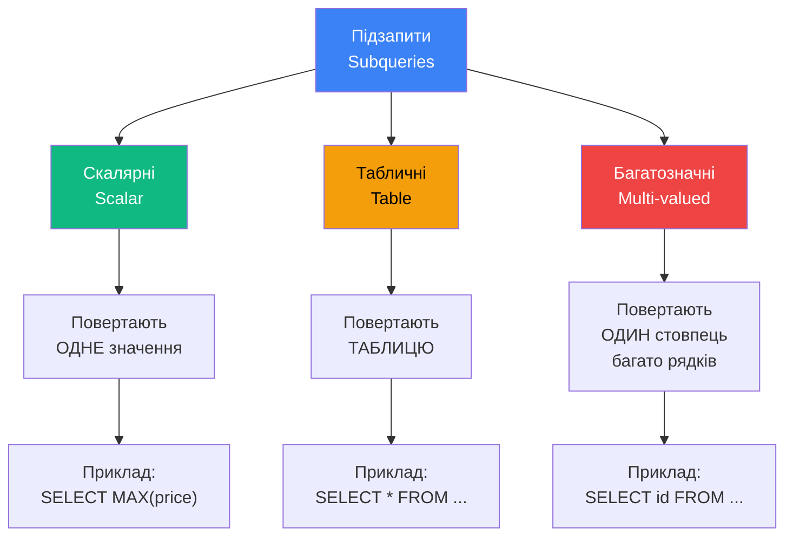
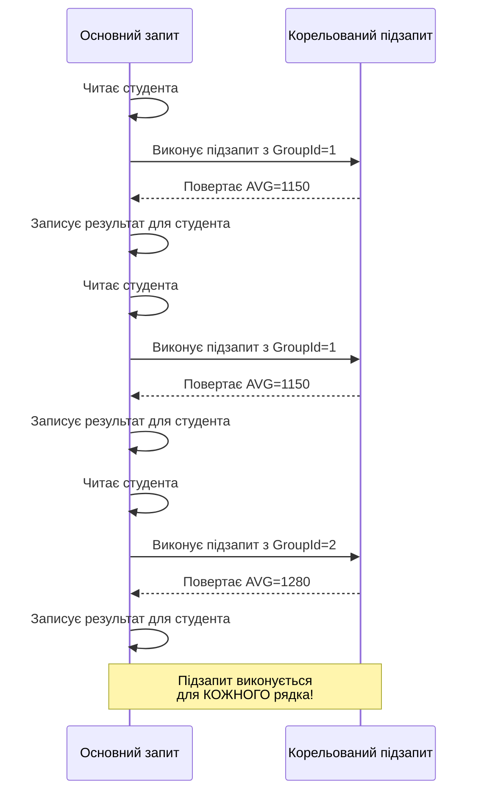

# Підзапити з агрегатними функціями

## Вступ: Коли простих агрегатів недостатньо?

У попередніх розділах ми навчилися використовувати агрегатні функції та `GROUP BY` для базових підрахунків. Але що робити, коли потрібна **більш складна логіка**?

### Реальний сценарій: "Кращі за середнє"

**Завдання**: Знайти студентів, які отримують стипендію **вище середньої**.

::tabs

::tab{label="❌ Спроба без підзапиту"}

```sql
-- НЕ ПРАЦЮЄ!
SELECT FirstName, LastName, Grants
FROM Students
WHERE Grants > AVG(Grants);
```

**Помилка**:

```
An aggregate may not appear in the WHERE clause
unless it is in a subquery contained in a HAVING clause
or a select list.
```

::

::tab{label="✅ Рішення з підзапитом"}

```sql
SELECT FirstName, LastName, Grants
FROM Students
WHERE Grants > (SELECT AVG(Grants) FROM Students);
```

**Як це працює**:

1. **Підзапит** `(SELECT AVG(Grants) ...)` виконується **ПЕРШИЙ** → повертає `1201.50`
2. **Основний запит** підставляє це значення: `WHERE Grants > 1201.50`

::

::

::note
**Ключова ідея**: Підзапит (Subquery) дозволяє **використовувати результат одного запиту всередині іншого**, що відкриває величезні можливості для складної аналітики.
::

---

## Типи підзапитів

SQL Server підтримує різні види підзапитів залежно від того, **що вони повертають**:

::mermaid



::

---

## Скалярні підзапити (Scalar Subqueries)

**Визначення**: Підзапит, який повертає **ТОЧНО ОДНЕ** значення (один рядок, один стовпець).

### Де можна використовувати скалярні підзапити?

::tabs

::tab{label="У SELECT"}

```sql
-- Показати кожного студента + середня стипендія по всій таблиці
SELECT
    FirstName,
    LastName,
    Grants,
    (SELECT AVG(Grants) FROM Students) AS overall_avg,
    Grants - (SELECT AVG(Grants) FROM Students) AS diff_from_avg
FROM Students;
```

**Результат**:

| FirstName | LastName | Grants | overall_avg | diff_from_avg |
| :-------- | :------- | -----: | ----------: | ------------: |
| John      | Doe      |   1200 |     1201.50 |         -1.50 |
| Jane      | Moore    |   1300 |     1201.50 |         98.50 |
| ...       | ...      |    ... |         ... |           ... |

::

::tab{label="У WHERE"}

```sql
-- Студенти зі стипендією вище середнього
SELECT FirstName, LastName, Grants
FROM Students
WHERE Grants > (SELECT AVG(Grants) FROM Students);
```

::

::tab{label="У HAVING"}

```sql
-- Групи, де середня стипендія вища за загальну середню
SELECT
    G.GroupName,
    AVG(S.Grants) AS avg_group_grant
FROM Students AS S
JOIN Groups AS G ON S.GroupId = G.Id
GROUP BY G.GroupName
HAVING AVG(S.Grants) > (SELECT AVG(Grants) FROM Students);
```

::

::

### Анатомія виконання скалярного підзапиту

```sql {4}
SELECT
    FirstName,
    LastName,
    Grants,
    (SELECT MAX(Grants) FROM Students) AS max_grant  -- Підзапит
FROM Students
WHERE Grants > 1100;
```

**Покрокове виконання**:

::steps

### Крок 1: Виконання підзапиту

```sql
SELECT MAX(Grants) FROM Students
-- Результат: 1300
```

### Крок 2: Підстановка результату

```sql
-- Запит стає таким:
SELECT FirstName, LastName, Grants, 1300 AS max_grant
FROM Students
WHERE Grants > 1100;
```

### Крок 3: Виконання основного запиту

SQL Server виконує вже простий запит з константою `1300`

::

::tip
**Оптимізація**: SQL Server **кешує** результат скалярного підзапиту, тому він виконується **лише раз**, а не для кожного рядка!
::

---

## Багатозначні підзапити (Multi-valued Subqueries)

**Визначення**: Підзапит, який повертає **ОДИН стовпець, БАГАТО рядків**.

### Проблема: Неможливість порівняння з кількома значеннями

```sql
-- ❌ ПОМИЛКА!
SELECT * FROM Students
WHERE GroupId = (SELECT Id FROM Groups WHERE GroupName LIKE '30%');
```

**Помилка**:

```
Subquery returned more than 1 value. This is not permitted
when the subquery follows =, !=, <, <=, >, >=
```

**Чому**: Підзапит повернув `[1, 2]` (дві групи: 30PR11 і 30PR12), а оператор `=` може порівнювати тільки з **ОДНИМ** значенням.

### Рішення: Оператори IN, NOT IN, ANY, ALL

::tabs

::tab{label="IN"}

```sql
-- ✅ ПРАВИЛЬНО: Знайти студентів з груп, які починаються на '30'
SELECT FirstName, LastName
FROM Students
WHERE GroupId IN (SELECT Id FROM Groups WHERE GroupName LIKE '30%');
```

**Еквівалент без підзапиту**:

```sql
WHERE GroupId = 1 OR GroupId = 2
```

::

::tab{label="NOT IN"}

```sql
-- Студенти НЕ з груп, які починаються на '30'
SELECT FirstName, LastName
FROM Students
WHERE GroupId NOT IN (SELECT Id FROM Groups WHERE GroupName LIKE '30%');
```

::warning
**Пастка NULL**: Якщо підзапит повертає NULL, `NOT IN` може дати **несподіваний результат**!

```sql
-- Якщо підзапит повертає [1, 2, NULL]
WHERE GroupId NOT IN (1, 2, NULL)
-- Це еквівалентно:
WHERE GroupId != 1 AND GroupId != 2 AND GroupId != NULL
-- GroupId != NULL завжди UNKNOWN → весь WHERE стає FALSE!
```

**Рішення**: Фільтруйте NULL у підзапиті:

```sql
WHERE GroupId NOT IN (SELECT Id FROM Groups WHERE Id IS NOT NULL)
```

::

::

::tab{label="ANY / SOME"}

```sql
-- Студенти зі стипендією більшою за БУДЬ-ЯКУ стипендію в групі 30PR11
SELECT FirstName, LastName, Grants
FROM Students
WHERE Grants > ANY (
    SELECT Grants
    FROM Students AS S
    JOIN Groups AS G ON S.GroupId = G.Id
    WHERE G.GroupName = '30PR11'
);
```

**Логіка**: `> ANY (100, 200, 300)` означає `> 100 OR > 200 OR > 300` (фактично `> MIN`)

::

::tab{label="ALL"}

```sql
-- Студенти зі стипендією більшою за ВСІ стипендії в групі 30PR11
SELECT FirstName, LastName, Grants
FROM Students
WHERE Grants > ALL (
    SELECT Grants
    FROM Students AS S
    JOIN Groups AS G ON S.GroupId = G.Id
    WHERE G.GroupName = '30PR11'
);
```

**Логіка**: `> ALL (100, 200, 300)` означає `> 100 AND > 200 AND > 300` (фактично `> MAX`)

::

::

---

## Табличні підзапити (Table Subqueries)

**Визначення**: Підзапит, який повертає **повноцінну таблицю** (багато рядків, багато стовпців) і використовується у **FROM**.

### Базовий приклад

```sql
SELECT *
FROM (
    SELECT
        FirstName,
        LastName,
        Grants,
        CASE
            WHEN Grants >= 1200 THEN 'Висока'
            WHEN Grants >= 1100 THEN 'Середня'
            ELSE 'Низька'
        END AS grant_category
    FROM Students
) AS categorized_students
WHERE grant_category = 'Висока';
```

**Анатомія**:

1. **Підзапит** створює віртуальну таблицю з додатковим стовпцем `grant_category`
2. **AS categorized_students** — **обов'язковий** псевдонім для підзапиту
3. **Основний запит** фільтрує цю таблицю

::warning
**Критично**: Підзапит у FROM **ЗАВЖДИ** потребує **псевдоніму** (AS)!

```sql
-- ❌ ПОМИЛКА
SELECT * FROM (SELECT * FROM Students);

-- ✅ ПРАВИЛЬНО
SELECT * FROM (SELECT * FROM Students) AS S;
```

::

### Складний приклад: Агрегація + фільтрація

**Завдання**: Знайти групи, де середня стипендія > 1200, та показати студентів з цих груп.

```sql
SELECT
    S.FirstName,
    S.LastName,
    S.Grants,
    high_grant_groups.avg_grant
FROM Students AS S
JOIN (
    -- Підзапит: групи з високою середньою стипендією
    SELECT
        GroupId,
        AVG(Grants) AS avg_grant
    FROM Students
    GROUP BY GroupId
    HAVING AVG(Grants) > 1200
) AS high_grant_groups ON S.GroupId = high_grant_groups.GroupId;
```

**Порядок виконання**:

1. Підзапит створює таблицю `high_grant_groups` з групами, де AVG > 1200
2. JOIN з'єднує Students з цією віртуальною таблицею
3. Показуються всі студенти з відповідних груп

---

## Корельовані підзапити (Correlated Subqueries)

**Визначення**: Підзапит, який **залежить** від значень з зовнішнього запиту і виконується **для кожного рядка** окремо.

### Відмінність від звичайних підзапитів

::tabs

::tab{label="Некорельований (звичайний)"}

```sql
-- Виконується ОДИН РАЗ
SELECT * FROM Students
WHERE Grants > (SELECT AVG(Grants) FROM Students);
```

**Виконання**:

1. Підзапит → `1201.50`
2. Основний запит → `WHERE Grants > 1201.50`

**Продуктивність**: ⚡ Швидко (підзапит лише раз)

::

::tab{label="Корельований"}

```sql
-- Виконується ДЛЯ КОЖНОГО РЯДКА
SELECT
    S1.FirstName,
    S1.LastName,
    S1.Grants,
    (SELECT AVG(S2.Grants)
     FROM Students AS S2
     WHERE S2.GroupId = S1.GroupId) AS group_avg
FROM Students AS S1;
```

**Виконання**:

- Для студента #1: підзапит з `GroupId = 1` → `1150`
- Для студента #2: підзапит з `GroupId = 1` → `1150` (той самий)
- Для студента #3: підзапит з `GroupId = 2` → `1280`
- ...

**Продуктивність**: 🐌 Повільно (підзапит N разів, де N = кількість студентів)

::

::

### Візуалізація корельованого підзапиту

::mermaid



::

### Практичний приклад: EXISTS

**Завдання**: Знайти студентів, які навчаються в групах з потоку 30.

```sql
SELECT FirstName, LastName
FROM Students AS S
WHERE EXISTS (
    SELECT 1
    FROM Groups AS G
    WHERE G.Id = S.GroupId
      AND G.GroupName LIKE '30%'
);
```

**Як працює EXISTS**:

- Для кожного студента перевіряє, чи **існує** група з потоку 30
- Якщо так → TRUE → студент потрапляє у результат
- Якщо ні → FALSE → студент ігнорується

::tip
**EXISTS vs IN**: Для великих таблиць `EXISTS` часто **швидший** за `IN`, бо він зупиняється на **першому знайденому** рядку, а `IN` завжди читає всі.

```sql
-- ✅ Швидше для великих таблиць
WHERE EXISTS (SELECT 1 FROM Groups WHERE ...)

-- 🐌 Повільніше, бо завантажує всі ID
WHERE GroupId IN (SELECT Id FROM Groups WHERE ...)
```

::

---

## CTE (Common Table Expressions)

**Визначення**: Іменований тимчасовий результат запиту, який можна **повторно використовувати** у основному запиті.

### Синтаксис

```sql
WITH cte_name AS (
    -- Запит CTE
    SELECT ...
)
-- Основний запит
SELECT * FROM cte_name;
```

### Переваги перед підзапитами

::tabs

::tab{label="Підзапит у FROM (складно читати)"}

```sql
SELECT
    S.FirstName,
    S.LastName,
    high_groups.avg_grant
FROM Students AS S
JOIN (
    SELECT GroupId, AVG(Grants) AS avg_grant
    FROM Students
    GROUP BY GroupId
    HAVING AVG(Grants) > 1200
) AS high_groups ON S.GroupId = high_groups.GroupId
JOIN (
    SELECT GroupId, COUNT(*) AS student_count
    FROM Students
    GROUP BY GroupId
) AS group_counts ON S.GroupId = group_counts.GroupId;
```

**Проблеми**:

- Важко читати (вкладеність)
- Неможливо повторно використати підзапит

::

::tab{label="CTE (читабельно)"}

```sql
WITH HighGrantGroups AS (
    SELECT GroupId, AVG(Grants) AS avg_grant
    FROM Students
    GROUP BY GroupId
    HAVING AVG(Grants) > 1200
),
GroupCounts AS (
    SELECT GroupId, COUNT(*) AS student_count
    FROM Students
    GROUP BY GroupId
)
SELECT
    S.FirstName,
    S.LastName,
    HGG.avg_grant,
    GC.student_count
FROM Students AS S
JOIN HighGrantGroups AS HGG ON S.GroupId = HGG.GroupId
JOIN GroupCounts AS GC ON S.GroupId = GC.GroupId;
```

**Переваги**:

- ✅ Зрозумілий порядок (зверху вниз)
- ✅ Можна повторно використати CTE
- ✅ Легко дебажити (виконайте CTE окремо)

::

::

### Рекурсивні CTE

CTE може **посилатися сам на себе** — це дозволяє обробляти **ієрархічні дані**.

**Приклад: Ієрархія співробітників**

```sql
WITH EmployeeHierarchy AS (
    -- Anchor: Топ-менеджер (без керівника)
    SELECT
        employee_id,
        name,
        manager_id,
        1 AS level
    FROM Employees
    WHERE manager_id IS NULL

    UNION ALL

    -- Recursive: Підлеглі
    SELECT
        E.employee_id,
        E.name,
        E.manager_id,
        EH.level + 1
    FROM Employees AS E
    JOIN EmployeeHierarchy AS EH ON E.manager_id = EH.employee_id
)
SELECT * FROM EmployeeHierarchy
ORDER BY level, name;
```

::note
**Обмеження**: За замовчуванням рекурсія обмежена **100 рівнями**. Для збільшення:

```sql
WITH EmployeeHierarchy AS (...)
SELECT * FROM EmployeeHierarchy
OPTION (MAXRECURSION 1000);  -- Макс 1000 рівнів
```

::

---

## Window Functions: Сучасна альтернатива

**Проблема**: Корельовані підзапити повільні. Window Functions вирішують це елегантно.

### Порівняння підходів

::code-group

```sql [❌ Корельований підзапит (повільно)]
-- Для КОЖНОГО студента виконується окремий підзапит
SELECT
    FirstName,
    LastName,
    Grants,
    (SELECT AVG(Grants)
     FROM Students AS S2
     WHERE S2.GroupId = S1.GroupId) AS group_avg
FROM Students AS S1;
-- На 10,000 студентів: 10,000 підзапитів!
```

```sql [✅ Window Function (швидко)]
-- Виконується ОДИН РАЗ, результат кешується для груп
SELECT
    FirstName,
    LastName,
    Grants,
    AVG(Grants) OVER (PARTITION BY GroupId) AS group_avg
FROM Students;
-- На 10,000 студентів: 1 проход!
```

::

### Синтаксис Window Functions

```sql
<агрегатна_функція> OVER (
    [PARTITION BY <стовпці_групування>]
    [ORDER BY <стовпці_сортування>]
    [ROWS/RANGE <вікно>]
)
```

**Пояснення**:

- `PARTITION BY` — аналог `GROUP BY`, але **НЕ** згортає рядки
- `ORDER BY` — сортування всередині партиції
- `ROWS/RANGE` — визначає "вікно" рядків для обчислення

### Практичні приклади Window Functions

::tabs

::tab{label="AVG по групах"}

```sql
SELECT
    FirstName,
    LastName,
    GroupId,
    Grants,
    AVG(Grants) OVER (PARTITION BY GroupId) AS group_avg,
    Grants - AVG(Grants) OVER (PARTITION BY GroupId) AS diff_from_group_avg
FROM Students;
```

**Результат**:

| FirstName | GroupId | Grants | group_avg | diff_from_group_avg |
| :-------- | ------: | -----: | --------: | ------------------: |
| John      |       1 |   1200 |   1166.67 |               33.33 |
| Jane      |       1 |   1100 |   1166.67 |              -66.67 |
| Mike      |       1 |   1200 |   1166.67 |               33.33 |
| Anna      |       2 |   1300 |   1278.00 |               22.00 |

::

::tab{label="ROW_NUMBER - Нумерація"}

```sql
SELECT
    FirstName,
    LastName,
    Grants,
    ROW_NUMBER() OVER (ORDER BY Grants DESC) AS rank_overall,
    ROW_NUMBER() OVER (PARTITION BY GroupId ORDER BY Grants DESC) AS rank_in_group
FROM Students;
```

**Результат**:

| FirstName | Grants | rank_overall | rank_in_group |
| :-------- | -----: | -----------: | ------------: |
| Mike      |   1300 |            1 |             1 |
| Anna      |   1300 |            2 |             1 |
| John      |   1256 |            3 |             2 |
| Peter     |   1200 |            4 |             1 |

::

::tab{label="Running Total (Накопичувальна сума)"}

```sql
SELECT
    order_date,
    daily_sales,
    SUM(daily_sales) OVER (ORDER BY order_date) AS running_total
FROM DailySales;
```

**Результат**:

| order_date | daily_sales | running_total |
| :--------- | ----------: | ------------: |
| 2024-01-01 |        1000 |          1000 |
| 2024-01-02 |        1500 |          2500 |
| 2024-01-03 |        1200 |          3700 |

::

::

---

## Підзапити vs JOIN: Коли що використовувати?

### Порівняльна таблиця

| Критерій              | Підзапит                        | JOIN                        |
| :-------------------- | :------------------------------ | :-------------------------- |
| **Читабельність**     | 🟡 Складно при вкладеності      | ✅ Зрозуміліше для багатьох |
| **Продуктивність**    | 🔴 Повільно (корельовані)       | ✅ Швидше (оптимізовано)    |
| **Гнучкість**         | ✅ Зручно для EXISTS/NOT EXISTS | 🟡 Менш гнучко              |
| **Дублювання рядків** | ✅ Немає дублювання             | 🔴 Можливе при 1:N зв'язках |
| **CTE сумісність**    | ✅ Можна замінити на CTE        | ✅ Працює з CTE             |

### Приклад: Студенти з максимальною стипендією

::code-group

```sql [Підзапит]
SELECT FirstName, LastName, Grants
FROM Students
WHERE Grants = (SELECT MAX(Grants) FROM Students);
```

```sql [JOIN (складніше)]
SELECT S.FirstName, S.LastName, S.Grants
FROM Students AS S
JOIN (
    SELECT MAX(Grants) AS max_grant
    FROM Students
) AS MaxGrant ON S.Grants = MaxGrant.max_grant;
```

```sql [Window Function (найкраще)]
WITH RankedStudents AS (
    SELECT
        FirstName,
        LastName,
        Grants,
        RANK() OVER (ORDER BY Grants DESC) AS grant_rank
    FROM Students
)
SELECT FirstName, LastName, Grants
FROM RankedStudents
WHERE grant_rank = 1;
```

::

::tip
**Рекомендації**:

1. **Скалярні підзапити** → OK для простих випадків
2. **Корельовані підзапити** → замінюйте на Window Functions
3. **Складні підзапити** → використовуйте CTE
4. **EXISTS/NOT EXISTS** → залишайте як є (оптимізовано SQL Server)

::

---

## Типові помилки та Anti-Patterns

### ❌ Помилка 1: Більше одного значення у скалярному підзапиті

```sql
-- ❌ ПОМИЛКА
SELECT * FROM Students
WHERE Grants = (SELECT Grants FROM Students WHERE FirstName = 'John');
-- Якщо є 2 John'и, підзапит поверне 2 значення → ПОМИЛКА!
```

**Рішення**:

```sql
-- ✅ Використовуйте IN або обмежте підзапит
WHERE Grants IN (SELECT Grants FROM Students WHERE FirstName = 'John');
```

---

### ❌ Помилка 2: NULL у NOT IN

```sql
-- ❌ ПАСТКА
SELECT * FROM Students
WHERE GroupId NOT IN (SELECT GroupId FROM Groups WHERE GroupName LIKE '30%');
-- Якщо підзапит поверне NULL → весь WHERE стане FALSE!
```

**Рішення**:

```sql
-- ✅ Фільтруйте NULL
WHERE GroupId NOT IN (
    SELECT GroupId FROM Groups
    WHERE GroupName LIKE '30%' AND GroupId IS NOT NULL
);

-- ✅ Або використовуйте NOT EXISTS
WHERE NOT EXISTS (
    SELECT 1 FROM Groups AS G
    WHERE G.Id = Students.GroupId AND G.GroupName LIKE '30%'
);
```

---

### ❌ Anti-Pattern: Надмірні корельовані підзапити

```sql
-- ❌ ПОВІЛЬНО: Для кожного студента 3 підзапити!
SELECT
    FirstName,
    (SELECT AVG(Grants) FROM Students AS S2 WHERE S2.GroupId = S1.GroupId) AS avg,
    (SELECT MIN(Grants) FROM Students AS S2 WHERE S2.GroupId = S1.GroupId) AS min,
    (SELECT MAX(Grants) FROM Students AS S2 WHERE S2.GroupId = S1.GroupId) AS max
FROM Students AS S1;
```

**Рішення**:

```sql
-- ✅ ШВИДКО: Window Functions
SELECT
    FirstName,
    AVG(Grants) OVER (PARTITION BY GroupId) AS avg,
    MIN(Grants) OVER (PARTITION BY GroupId) AS min,
    MAX(Grants) OVER (PARTITION BY GroupId) AS max
FROM Students;
```

---

## Практичні завдання

::steps

### Скалярний підзапит

**Завдання**: Знайти студентів, стипендія яких відрізняється від середньої більш ніж на 100 грн

::collapsible{label="Показати рішення"}

```sql
SELECT FirstName, LastName, Grants
FROM Students
WHERE ABS(Grants - (SELECT AVG(Grants) FROM Students)) > 100;
```

::

### EXISTS vs IN

**Завдання**: Знайти групи, в яких є хоча б один студент зі стипендією > 1200

::collapsible{label="Показати рішення"}

```sql
-- Варіант 1: EXISTS (рекомендовано)
SELECT GroupName
FROM Groups AS G
WHERE EXISTS (
    SELECT 1 FROM Students AS S
    WHERE S.GroupId = G.Id AND S.Grants > 1200
);

-- Варіант 2: IN
SELECT GroupName
FROM Groups
WHERE Id IN (
    SELECT DISTINCT GroupId FROM Students WHERE Grants > 1200
);
```

::

### CTE + Window Function

**Завдання**: Для кожної групи показати топ-3 студенти з найвищою стипендією

::collapsible{label="Показати рішення"}

```sql
WITH RankedStudents AS (
    SELECT
        S.FirstName,
        S.LastName,
        S.Grants,
        G.GroupName,
        ROW_NUMBER() OVER (PARTITION BY S.GroupId ORDER BY S.Grants DESC) AS rank
    FROM Students AS S
    JOIN Groups AS G ON S.GroupId = G.Id
)
SELECT GroupName, FirstName, LastName, Grants
FROM RankedStudents
WHERE rank <= 3
ORDER BY GroupName, rank;
```

::

::

---

## Резюме

::note
**Ключові висновки**:

1. **Підзапити** дозволяють використовувати результат одного запиту всередині іншого
2. **3 типи підзапитів**: Скалярні (1 значення), Багатозначні (1 стовпець, N рядків), Табличні (таблиця)
3. **Корельовані підзапити** виконуються для кожного рядка → **повільно**
4. **CTE** роблять код читабельнішим та підтримуваним
5. **Window Functions** — сучасна заміна корельованим підзапитам
6. **EXISTS** швидший за **IN** для великих таблиць
7. **Остерігайтесь NULL** у `NOT IN`

::

::tip
**Що далі?**

Рекомендовані теми для поглибленого вивчення:

- Execution Plans для підзапитів
- Оптимізація складних запитів
- Advanced Window Functions (LAG, LEAD, PERCENTILE)
- Temporal Tables для історії змін

::

---

## Додаткові ресурси

- [Офіційна документація: Subqueries](https://learn.microsoft.com/en-us/sql/relational-databases/performance/subqueries)
- [Common Table Expressions (CTE)](https://learn.microsoft.com/en-us/sql/t-sql/queries/with-common-table-expression-transact-sql)
- [Window Functions](https://learn.microsoft.com/en-us/sql/t-sql/queries/select-over-clause-transact-sql)
- [Query Optimization Best Practices](https://learn.microsoft.com/en-us/sql/relational-databases/performance/query-processing-architecture-guide)
