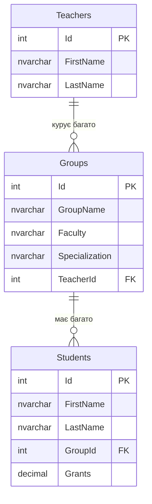
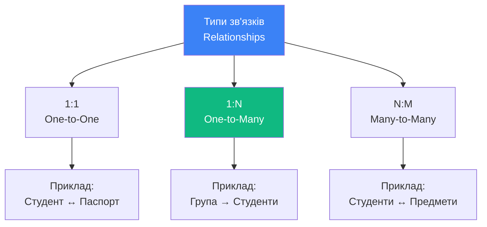
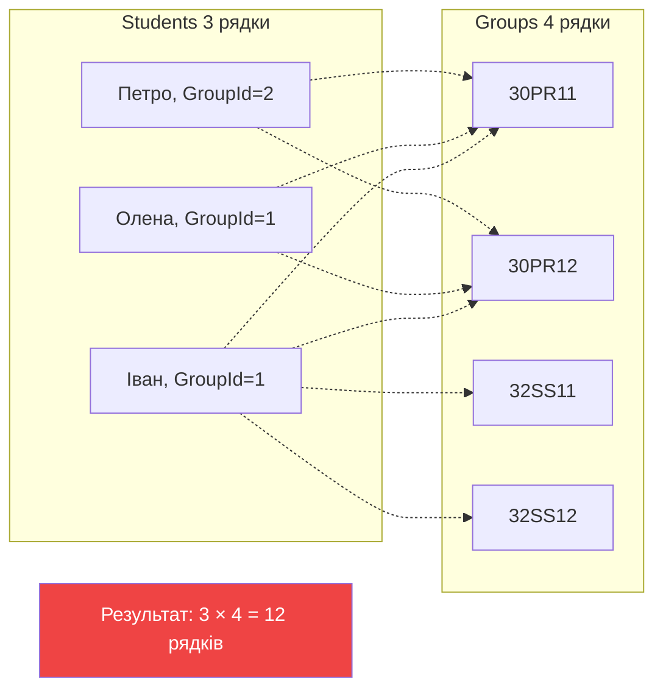
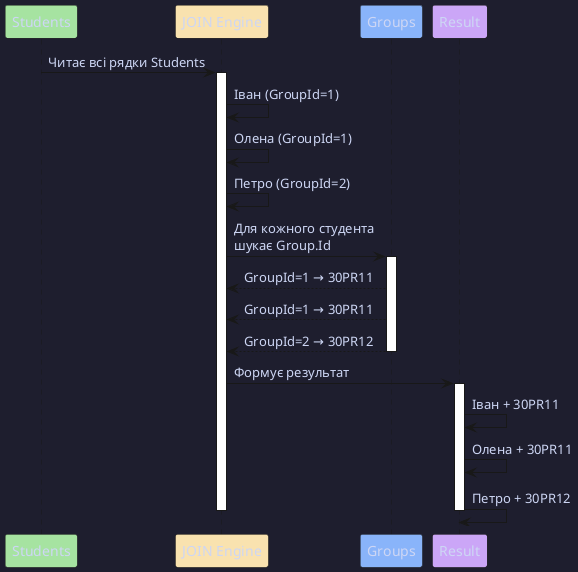
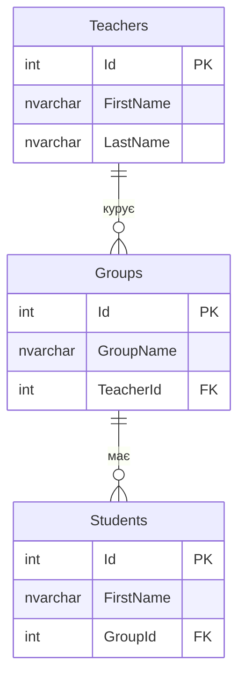
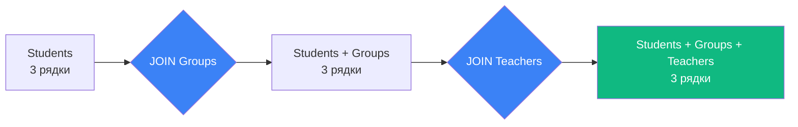

# Об'єднання таблиць та INNER JOIN

## Проблема: Чому однієї таблиці недостатньо?

Уявіть, що ви розробляєте систему управління студентами університету. Спочатку ви створили просту таблицю:

```sql
CREATE TABLE StudentsSimple (
    Id INT PRIMARY KEY,
    FirstName NVARCHAR(50),
    LastName NVARCHAR(50),
    GroupName NVARCHAR(20),        -- Назва групи
    Faculty NVARCHAR(100),          -- Факультет
    Specialization NVARCHAR(100),   -- Спеціалізація
    TeacherName NVARCHAR(100),      -- Куратор групи
    Grants DECIMAL(10,2)
);
```

**Вставляємо дані**:

```sql
INSERT INTO StudentsSimple VALUES
(1, 'Іван', 'Петренко', '30PR11', 'IT', 'Розробка ПЗ', 'Марія Іванова', 1200),
(2, 'Олена', 'Коваленко', '30PR11', 'IT', 'Розробка ПЗ', 'Марія Іванова', 1100),
(3, 'Петро', 'Сидоренко', '30PR12', 'IT', 'Кібербезпека', 'Олег Смирнов', 1300);
```

### Проблеми такого підходу

::warning
**Аномалії даних**: Цей підхід призводить до серйозних проблем!
::

::tabs

::tab{label="Проблема 1: Дублювання"}

Кожен студент з групи **30PR11** містить **однакову** інформацію про факультет, спеціалізацію та куратора:

| Студент         | GroupName | Faculty | Specialization | TeacherName   |
| :-------------- | :-------- | :------ | :------------- | :------------ |
| Іван Петренко   | 30PR11    | IT      | Розробка ПЗ    | Марія Іванова |
| Олена Коваленко | 30PR11    | IT      | Розробка ПЗ    | Марія Іванова |

**Марнування пам'яті**: Якщо в групі 30 студентів, інформація про групу дублюється 30 разів!

::

::tab{label="Проблема 2: Anomaly Insert"}

Ви хочете додати нову групу **32SS11**, але ще немає студентів:

```sql
-- ❌ НЕ МОЖНА! Id студента обов'язковий (PRIMARY KEY)
INSERT INTO StudentsSimple (GroupName, Faculty, Specialization, TeacherName)
VALUES ('32SS11', 'IT', 'Системний аналіз', 'Петро Коваль');
```

**Проблема**: Неможливо зберегти інформацію про групу без студента!

::

::tab{label="Проблема 3: Anomaly Update"}

Викладач **Марія Іванова** виходить заміж і змінює прізвище на **Марія Сидорова**:

```sql
-- Треба оновити ВСІ рядки студентів з групи 30PR11!
UPDATE StudentsSimple
SET TeacherName = 'Марія Сидорова'
WHERE GroupName = '30PR11';  -- Якщо пропустити WHERE, буде катастрофа!
```

**Ризик**: Забули оновити один рядок → дані стають неконсистентними!

::

::tab{label="Проблема 4: Anomaly Delete"}

Останній студент групи **30PR12** відрахувався:

```sql
DELETE FROM StudentsSimple WHERE Id = 3;
```

**Втрата даних**: Разом зі студентом **втрачається інформація про існування групи 30PR12**!

::

::

---

## Рішення: Нормалізація та зв'язки між таблицями

### Принцип нормалізації

::note
**Нормалізація (Normalization)** — процес організації даних у базі даних для мінімізації дублювання та забезпечення цілісності.
::

**Правильна структура**:

::mermaid



::

### Створення нормалізованої структури

```sql
-- Таблиця викладачів
CREATE TABLE Teachers (
    Id INT PRIMARY KEY IDENTITY,
    FirstName NVARCHAR(50),
    LastName NVARCHAR(50)
);

-- Таблиця груп
CREATE TABLE Groups (
    Id INT PRIMARY KEY IDENTITY,
    GroupName NVARCHAR(20) UNIQUE,
    Faculty NVARCHAR(100),
    Specialization NVARCHAR(100),
    TeacherId INT FOREIGN KEY REFERENCES Teachers(Id)
);

-- Таблиця студентів
CREATE TABLE Students (
    Id INT PRIMARY KEY IDENTITY,
    FirstName NVARCHAR(50),
    LastName NVARCHAR(50),
    GroupId INT FOREIGN KEY REFERENCES Groups(Id),
    Grants DECIMAL(10,2)
);
```

**Переваги**:

✅ Дані про групу зберігаються **один раз**  
✅ Можна додати групу без студентів  
✅ Оновлення викладача — **один рядок**  
✅ Видалення студента не втрачає інформацію про групу

---

## Типи зв'язків між таблицями

::mermaid



::

### 1:N (One-to-Many) — Найпоширеніший

**Приклад**: Одна група має **багато** студентів, але кожен студент належить **одній** групі.

```sql
Groups (Id=1, GroupName='30PR11')
    ↓ має багато
Students (Id=1, GroupId=1)
Students (Id=2, GroupId=1)
Students (Id=3, GroupId=1)
```

**Реалізація**: `FOREIGN KEY` у таблиці "багато" (`Students.GroupId → Groups.Id`)

---

## Проблема об'єднання: Як отримати дані з кількох таблиць?

Тепер дані розподілені по таблицях. Як отримати список студентів **з назвами груп**?

### Спроба 1: Два окремі запити (❌ Неефективно)

```sql
-- Запит 1: Отримати студентів
SELECT Id, FirstName, LastName, GroupId FROM Students;

-- Результат:
-- Id | FirstName | LastName  | GroupId
-- 1  | Іван      | Петренко  | 1
-- 2  | Олена     | Коваленко | 1

-- Запит 2: Для кожного GroupId дізнатися назву
SELECT GroupName FROM Groups WHERE Id = 1;  -- 30PR11
```

**Проблеми**:

- Потрібно N+1 запитів (1 для студентів + N для груп)
- Неможливо відфільтрувати або сортувати по GroupName

### Спроба 2: Декартовий добуток (❌ Надмірність)

```sql
SELECT * FROM Students, Groups;
```

**Що відбувається?**

::mermaid



::

**Результат**: 3 студенти × 4 групи = **12 рядків** (замість потрібних 3!)

| FirstName | GroupId | GroupName |
| :-------- | ------: | :-------- | -------------- |
| Іван      |       1 | 30PR11    |
| Іван      |       1 | 30PR12    | ← Неправильно! |
| Іван      |       1 | 32SS11    | ← Неправильно! |
| Іван      |       1 | 32SS12    | ← Неправильно! |
| Олена     |       1 | 30PR11    |
| ...       |     ... | ...       |

::caution
**Декартовий добуток (Cartesian Product)** — кожен рядок з першої таблиці поєднується з **кожним** рядком другої таблиці. Це майже **завжди помилка**!
::

---

## INNER JOIN: Правильне рішення

**INNER JOIN** дозволяє об'єднати таблиці **за умовою**, залишаючи тільки **відповідні** рядки.

### Синтаксис

```sql
SELECT <стовпці>
FROM <Таблиця_1>
INNER JOIN <Таблиця_2>
    ON <умова_зв'язку>
```

### Базовий приклад

```sql {3-4}
SELECT
    S.FirstName,
    S.LastName,
    G.GroupName
FROM Students AS S
INNER JOIN Groups AS G
    ON S.GroupId = G.Id;
```

**Результат**:

| FirstName | LastName  | GroupName |
| :-------- | :-------- | :-------- |
| Іван      | Петренко  | 30PR11    |
| Олена     | Коваленко | 30PR11    |
| Петро     | Сидоренко | 30PR12    |

**Анатомія коду**:

1. **Рядок 3**: `FROM Students AS S` — призначаємо псевдонім `S` для Students
2. **Рядок 4**: `INNER JOIN Groups AS G` — приєднуємо таблицю Groups з псевдонімом `G`
3. **Рядок 5**: `ON S.GroupId = G.Id` — **умова зв'язку**: GroupId студента дорівнює Id групи

::tip
**Псевдоніми (Aliases)**: `AS S`, `AS G` дозволяють скоротити назви таблиць та уникнути конфліктів імен.
::

---

## Як працює INNER JOIN під капотом?

::plant-uml



::

**Покроковий процес**:

::steps

### Крок 1: Сканування першої таблиці

```
SQL Server читає всі рядки з Students:
- Іван, GroupId=1
- Олена, GroupId=1
- Петро, GroupId=2
```

### Крок 2: Для кожного рядка перевірка умови ON

```
Для Івана (GroupId=1):
  Шукає в Groups рядок де Id=1 → Знайдено: 30PR11

Для Олени (GroupId=1):
  Шукає в Groups рядок де Id=1 → Знайдено: 30PR11

Для Петра (GroupId=2):
  Шукає в Groups рядок де Id=2 → Знайдено: 30PR12
```

### Крок 3: Об'єднання стовпців

```
Конкатенація рядків Students + Groups:
[Іван, Петренко, 1] + [1, 30PR11] = [Іван, Петренко, 30PR11]
```

::

---

## Псевдоніми таблиць: Обов'язкова практика

### Проблема без псевдонімів

```sql
-- ❌ ПОГАНО: Важко читати
SELECT Students.FirstName, Students.LastName, Groups.GroupName
FROM Students
INNER JOIN Groups ON Students.GroupId = Groups.Id;
```

### З псевдонімами

```sql
-- ✅ ДОБРЕ: Читабельно
SELECT S.FirstName, S.LastName, G.GroupName
FROM Students AS S
INNER JOIN Groups AS G ON S.GroupId = G.Id;
```

::note
Ключове слово `AS` можна опускати: `FROM Students S` працює так само, як `FROM Students AS S`.
::

---

## Конфлікти імен стовпців

### Проблема: Однакові назви

Обидві таблиці мають стовпець `Id`:

```sql
-- ❌ ПОМИЛКА: Неоднозначність!
SELECT Id, FirstName, GroupName
FROM Students AS S
INNER JOIN Groups AS G ON S.GroupId = G.Id;
```

**Помилка**:

```
Ambiguous column name 'Id'.
```

### Рішення: Вказати таблицю

```sql
-- ✅ ПРАВИЛЬНО
SELECT
    S.Id AS StudentId,     -- Явно вказуємо S.Id
    S.FirstName,
    G.Id AS GroupId,       -- Явно вказуємо G.Id
    G.GroupName
FROM Students AS S
INNER JOIN Groups AS G ON S.GroupId = G.Id;
```

**Результат**:

| StudentId | FirstName | GroupId | GroupName |
| --------: | :-------- | ------: | :-------- |
|         1 | Іван      |       1 | 30PR11    |
|         2 | Олена     |       1 | 30PR11    |

---

## Множинні JOIN: Об'єднання 3+ таблиць

**Завдання**: Отримати список студентів з назвою групи **та ім'ям куратора**.

### Схема зв'язків

::mermaid



::

### Запит з двома JOIN

```sql {4-7}
SELECT
    S.FirstName AS StudentName,
    G.GroupName,
    T.FirstName + ' ' + T.LastName AS TeacherName
FROM Students AS S
INNER JOIN Groups AS G ON S.GroupId = G.Id
INNER JOIN Teachers AS T ON G.TeacherId = T.Id;
```

**Результат**:

| StudentName | GroupName | TeacherName   |
| :---------- | :-------- | :------------ |
| Іван        | 30PR11    | Марія Іванова |
| Олена       | 30PR11    | Марія Іванова |
| Петро       | 30PR12    | Олег Смирнов  |

**Анатомія коду**:

- **Рядок 4**: Конкатенація імені та прізвища викладача через `+`
- **Рядок 6**: Перший JOIN — Students → Groups (через `GroupId`)
- **Рядок 7**: Другий JOIN — Groups → Teachers (через `TeacherId`)

::tip
**Порядок JOIN**: SQL Server автоматично оптимізує порядок, але логічно краще йти від "головної" таблиці (Students) до залежних.
::

---

## Порядок виконання множинних JOIN

```sql
FROM Students AS S           -- 1. Базова таблиця
INNER JOIN Groups AS G       -- 2. Приєднати Groups
    ON S.GroupId = G.Id
INNER JOIN Teachers AS T     -- 3. До результату (Students+Groups) приєднати Teachers
    ON G.TeacherId = T.Id
```

::mermaid



::

---

## WHERE після JOIN: Фільтрація результатів

### Приклад: Студенти зі стипендією > 1150

```sql {6}
SELECT
    S.FirstName,
    S.LastName,
    S.Grants,
    G.GroupName
FROM Students AS S
INNER JOIN Groups AS G ON S.GroupId = G.Id
WHERE S.Grants > 1150;
```

**Результат**:

| FirstName | LastName  | Grants | GroupName |
| :-------- | :-------- | -----: | :-------- |
| Іван      | Петренко  |   1200 | 30PR11    |
| Петро     | Сидоренко |   1300 | 30PR12    |

**Порядок виконання**:

1. `FROM` + `INNER JOIN` — об'єднання таблиць
2. `WHERE` — фільтрація результату
3. `SELECT` — вибірка стовпців

---

## WHERE vs ON: Різниця критична!

::tabs

::tab{label="WHERE — Фільтрація ПІСЛЯ JOIN"}

```sql
FROM Students AS S
INNER JOIN Groups AS G ON S.GroupId = G.Id
WHERE G.GroupName = '30PR11';  -- Фільтрує результат JOIN
```

**Процес**:

1. Об'єднує ВСІ студенти + групи
2. Залишає тільки рядки де `GroupName = '30PR11'`

::

::tab{label="ON — Умова ПІД ЧАС JOIN"}

```sql
FROM Students AS S
INNER JOIN Groups AS G ON S.GroupId = G.Id AND G.GroupName = '30PR11';
```

**Процес**:

1. Об'єднує тільки студентів з груп '30PR11'

::

::

::note
**Для INNER JOIN** різниці в результаті немає, але для **LEFT JOIN** це критично важливо (детально в наступному розділі).
::

---

##Типові помилки при використанні JOIN

### ❌ Помилка 1: Забули ON

```sql
-- ПОМИЛКА!
SELECT * FROM Students AS S
INNER JOIN Groups AS G;
```

**Помилка**:

```
The multi-part identifier "S.GroupId" could not be bound.
Syntax error near 'INNER JOIN'.
```

**Рішення**: Завжди вказуйте умову `ON`:

```sql
-- ✅ ПРАВИЛЬНО
INNER JOIN Groups AS G ON S.GroupId = G.Id
```

---

### ❌ Помилка 2: Неправильна умова ON

```sql
-- ЛОГІЧНА ПОМИЛКА: Порівнюємо Id з GroupId
SELECT * FROM Students AS S
INNER JOIN Groups AS G ON S.Id = G.Id;  -- ❌ Неправильно!
```

**Проблема**: Студент з `Id=1` поєднається з групою `Id=1`, але це **НЕ належність** студента до групи!

**Рішення**:

```sql
-- ✅ ПРАВИЛЬНО: Порівнюємо FOREIGN KEY з PRIMARY KEY
ON S.GroupId = G.Id
```

---

### ❌ Помилка 3: Декартовий добуток випадково

```sql
-- Забули вказати зв'язок між Students і Groups
SELECT *
FROM Students AS S, Groups AS G, Teachers AS T;
-- Результат: 10 студентів × 4 групи × 5 викладачів = 200 рядків!
```

::warning
**Завжди використовуйте явний синтаксис INNER JOIN** замість старого стилю `,` (кома).
::

---

## Performance: Індекси для JOIN

### Проблема: Повільний JOIN без індексів

```sql
SELECT S.FirstName, G.GroupName
FROM Students AS S
INNER JOIN Groups AS G ON S.GroupId = G.Id;
```

**Без індексу на `Students.GroupId`**:

```
Table Scan на обох таблицях → O(N × M) операцій
```

**З індексом**:

```sql
CREATE INDEX IX_Students_GroupId ON Students(GroupId);
```

**Результат**:

```
Index Seek → O(N log M) операцій — в 100+ разів швидше!
```

::tip
**Best Practice**: Створюйте індекси на **всі стовпці FOREIGN KEY**, які використовуються у JOIN.
::

---

## Execution Plan для JOIN

::code-group

```sql [Без індексу (повільно)]
-- Execution Plan:
-- Nested Loop Join (Cost: 85%)
--   ├─ Table Scan Students (Cost: 50%)
--   └─ Table Scan Groups (Cost: 35%)
```

```sql [З індексом (швидко)]
CREATE INDEX IX_Students_GroupId ON Students(GroupId);

-- Execution Plan:
-- Nested Loop Join (Cost: 25%)
--   ├─ Index Scan Students (Cost: 10%)
--   └─ Index Seek Groups (Cost: 15%)
```

::

---

## Best Practices для INNER JOIN

::steps

### 1. Завжди використовуйте псевдоніми

```sql
-- ✅ ДОБРЕ
FROM Students AS S INNER JOIN Groups AS G

-- ❌ ПОГАНО
FROM Students INNER JOIN Groups
```

### 2. Явно вказуйте таблицю для кожного стовпця

```sql
-- ✅ ДОБРЕ
SELECT S.Id, S.FirstName, G.GroupName

-- ❌ ПОГАНО (працює, але небезпечно)
SELECT Id, FirstName, GroupName
```

### 3. Обмежуйте стовпці у SELECT

```sql
-- ✅ ДОБРЕ: Тільки потрібні стовпці
SELECT S.FirstName, G.GroupName

-- ❌ ПОГАНО: Завантажує всі дані
SELECT *
```

### 4. Створюйте індекси на FK

```sql
CREATE INDEX IX_Students_GroupId ON Students(GroupId);
CREATE INDEX IX_Groups_TeacherId ON Groups(TeacherId);
```

### 5. Використовуйте WHERE для фільтрації

```sql
-- Спочатку JOIN, потім фільтрація
INNER JOIN Groups AS G ON S.GroupId = G.Id
WHERE G.Faculty = 'IT'
```

::

---

## Практичні завдання

::steps

### Завдання 1: Базовий JOIN

Отримати список студентів з назвою їхньої групи, відсортований за прізвищем.

::collapsible{label="Показати рішення"}

```sql
SELECT
    S.FirstName,
    S.LastName,
    G.GroupName
FROM Students AS S
INNER JOIN Groups AS G ON S.GroupId = G.Id
ORDER BY S.LastName;
```

::

### Завдання 2: Три таблиці

Вивести студентів, їхню групу та куратора, тільки з факультету 'IT'.

::collapsible{label="Показати рішення"}

```sql
SELECT
    S.FirstName + ' ' + S.LastName AS Student,
    G.GroupName,
    T.FirstName + ' ' + T.LastName AS Teacher,
    G.Faculty
FROM Students AS S
INNER JOIN Groups AS G ON S.GroupId = G.Id
INNER JOIN Teachers AS T ON G.TeacherId = T.Id
WHERE G.Faculty = 'IT'
ORDER BY G.GroupName, S.LastName;
```

::

### Завдання 3: Агрегація з JOIN

Порахувати кількість студентів у кожній групі.

::collapsible{label="Показати рішення"}

```sql
SELECT
    G.GroupName,
    COUNT(S.Id) AS StudentCount,
    AVG(S.Grants) AS AvgGrant
FROM Groups AS G
INNER JOIN Students AS S ON G.Id = S.GroupId
GROUP BY G.GroupName
ORDER BY StudentCount DESC;
```

::

::

---

## Резюме

::note
**Ключові висновки**:

1. **Нормалізація** вирішує проблеми дублювання даних
2. **INNER JOIN** об'єднує таблиці за умовою, залишаючи тільки відповідні рядки
3. **Псевдоніми** обов'язкові для читабельності
4. **ON** задає умову зв'язку, **WHERE** фільтрує результат
5. **Індекси на FK** критичні для продуктивності
6. Можна об'єднувати **3+ таблиці** послідовними JOIN

::

::tip
**Що далі?**

В наступному розділі ви дізнаєтесь про:

- **LEFT JOIN** — коли потрібні всі рядки з лівої таблиці
- **RIGHT JOIN** та **FULL JOIN**
- Робота з NULL значеннями після JOIN
- Діаграми Венна для розуміння JOIN типів

[Перейти до розділу "Зовнішні об'єднання" →](./02.outer-joins.md)
::

---

## Додаткові ресурси

- [Офіційна документація: JOIN](https://learn.microsoft.com/en-us/sql/relational-databases/performance/joins)
- [Database Normalization](https://learn.microsoft.com/en-us/office/troubleshoot/access/database-normalization-description)
- [Execution Plans для JOIN](https://learn.microsoft.com/en-us/sql/relational-databases/performance/execution-plans)
