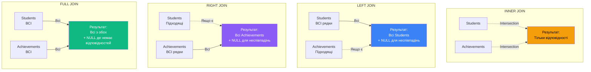
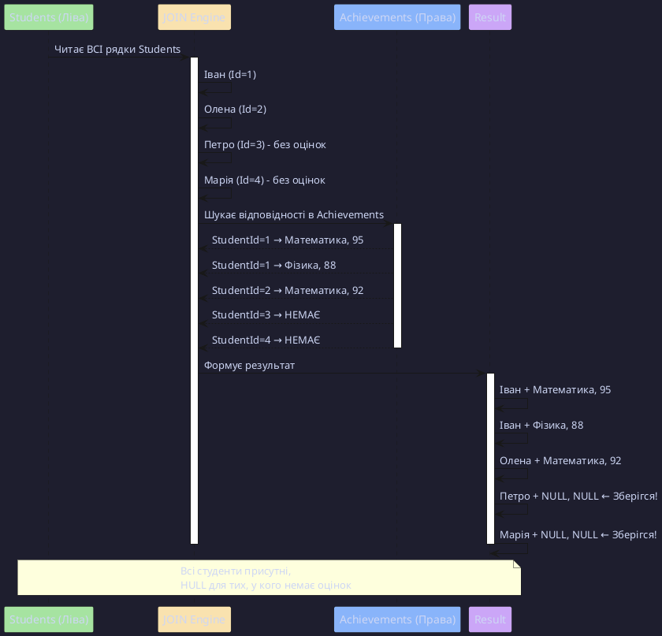
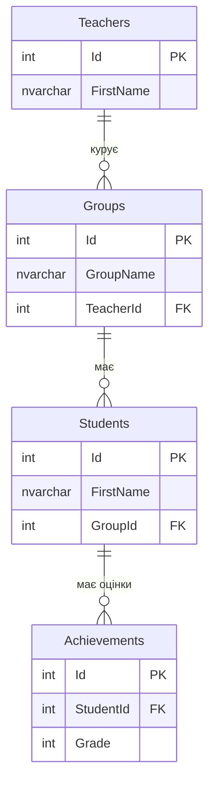

# Зовнішні об'єднання (OUTER JOIN)

## Проблема INNER JOIN: Втрата даних

У попередньому розділі ми навчилися використовувати **INNER JOIN**, але він має важливе обмеження.

### Реальний сценарій: Студенти без оцінок

Припустимо, у нас є таблиці `Students` та `Achievements` (успішність):

```sql
CREATE TABLE Achievements (
    Id INT PRIMARY KEY IDENTITY,
    StudentId INT FOREIGN KEY REFERENCES Students(Id),
    SubjectName NVARCHAR(100),
    Grade INT CHECK (Grade BETWEEN 1 AND 100)
);
```

**Дані**:

```sql
-- 5 студентів
INSERT INTO Students (FirstName, LastName, GroupId, Grants) VALUES
(1, 'Іван', 'Петренко', 1, 1200),
(2, 'Олена', 'Коваленко', 1, 1100),
(3, 'Петро', 'Сидоренко', 2, 1300),
(4, 'Марія', 'Іванова', 2, NULL),    -- Немає оцінок!
(5, 'Андрій', 'Ковальчук', 3, 1250); -- Немає оцінок!

-- 3 оцінки (тільки для 3 студентів)
INSERT INTO Achievements VALUES
(1, 1, 'Математика', 95),
(2, 1, 'Фізика', 88),
(3, 2, 'Математика', 92);
```

**Завдання**: Отримати список **ВСІХ** студентів та їхні оцінки.

### Спроба з INNER JOIN

```sql
SELECT
    S.FirstName,
    S.LastName,
    A.SubjectName,
    A.Grade
FROM Students AS S
INNER JOIN Achievements AS A ON S.Id = A.StudentId;
```

**Результат**:

| FirstName | LastName  | SubjectName | Grade |
| :-------- | :-------- | :---------- | ----: |
| Іван      | Петренко  | Матем атика |    95 |
| Іван      | Петренко  | Фізика      |    88 |
| Олена     | Коваленко | Математика  |    92 |

::warning
**Проблема**: **Марія** та **Андрій** (студенти без оцінок) **НЕ** потрапили в результат!  
INNER JOIN повертає тільки рядки, де є **відповідність** у обох таблицях.
::

---

## Рішення: LEFT JOIN

**LEFT JOIN (LEFT OUTER JOIN)** повертає **ВСІ** рядки з **лівої** таблиці, навіть якщо немає відповідностей в правій.

### Синтаксис

```sql
SELECT <стовпці>
FROM <Ліва_Таблиця>
LEFT JOIN <Права_Таблиця>
    ON <умова>
```

### Той самий запит з LEFT JOIN

```sql {4}
SELECT
    S.FirstName,
    S.LastName,
    A.SubjectName,
    A.Grade
FROM Students AS S
LEFT JOIN Achievements AS A ON S.Id = A.StudentId;
```

**Результат**:

| FirstName | LastName  | SubjectName | Grade |
| :-------- | :-------- | :---------- | ----: |
| Іван      | Петренко  | Математика  |    95 |
| Іван      | Петренко  | Фізика      |    88 |
| Олена     | Коваленко | Математика  |    92 |
| Петро     | Сидоренко | **NULL**    |  NULL |
| Марія     | Іванова   | **NULL**    |  NULL |
| Андрій    | Ковальчук | **NULL**    |  NULL |

::note
**Ключова відмінність**: Студенти **без оцінок** тепер присутні в результаті, але стовпці з Achievements заповнені **NULL**.
::

---

## Візуалізація: Діаграми Венна для JOIN

::mermaid



::

---

## Класичні діаграми Венна для JOIN

::tabs

::tab{label="INNER JOIN"}

```
     Students    Achievements
        ╭───╮   ╭───╮
        │   │   │   │
        │   ╰───╯   │
        │   │█████  │
        │   ╰───╯   │
        │       │   │
        ╰───╯   ╰───╯
```

**Тільки перетин** (█) — рядки з відповідностями в обох таблицях.

::

::tab{label="LEFT JOIN"}

```
     Students    Achievements
        ╭───╮   ╭───╮
        │███│   │   │
        │███╰───╯   │
        │███│█████  │
        │███╰───╯   │
        │███    │   │
        ╰───╯   ╰───╯
```

**Вся ліва** (█) — всі Students + підходящі Achievements (NULL для решти).

::

::tab{label="RIGHT JOIN"}

```
     Students    Achievements
        ╭───╮   ╭───╮
        │   │   │███│
        │   ╰───╯███│
        │   │█████████│
        │   ╰───╯███│
        │       │███│
        ╰───╯   ╰───╯
```

**Вся права** (█) — всі Achievements + підходящі Students (NULL для решти).

::

::tab{label="FULL JOIN"}

```
     Students    Achievements
        ╭───╮   ╭───╮
        │███│   │███│
        │███╰───╯███│
        │███│█████████│
        │███╰───╯███│
        │███    │███│
        ╰───╯   ╰───╯
```

**Всі з обох** (█) — всі Students + всі Achievements, NULL де немає відповідностей.

::

::

---

## LEFT JOIN: Детальний розбір

### Як працює LEFT JOIN?

::plant-uml



::

### Практичний приклад: Групи без студентів

**Завдання**: Показати **всі** групи та кількість студентів у кожній (включно з порожніми групами).

```sql {5}
SELECT
    G.GroupName,
    COUNT(S.Id) AS StudentCount  -- COUNT(S.Id) ігнорує NULL
FROM Groups AS G
LEFT JOIN Students AS S ON G.Id = S.GroupId
GROUP BY G.GroupName
ORDER BY StudentCount DESC;
```

**Результат**:

| GroupName | StudentCount |
| :-------- | -----------: | ---------------------- |
| 30PR11    |            3 |
| 30PR12    |            3 |
| 32SS11    |            2 |
| 33GR12    |            0 | ← Група без студентів! |

::tip
**Важливо**: `COUNT(S.Id)` рахує **не-NULL** значення, тому для груп без студентів повертає `0`.  
`COUNT(*)` поверне `1` (рахує рядок з NULL), що неправильно!
::

---

## Робота з NULL після LEFT JOIN

### Проблема: NULL у обчисленнях

```sql
SELECT
    S.FirstName,
    S.Grants,
    A.Grade,
    S.Grants + A.Grade AS Total  -- ❌ Проблема!
FROM Students AS S
LEFT JOIN Achievements AS A ON S.Id = A.StudentId;
```

**Результат**:

| FirstName | Grants | Grade | Total |
| :-------- | -----: | ----: | ----: | --------------------- |
| Іван      |   1200 |    95 |  1295 |
| Петро     |   1300 |  NULL |  NULL | ← NULL + число = NULL |

::warning
**Арифметика з NULL**: Будь-яка операція з NULL повертає NULL!

- `1300 + NULL = NULL`
- `NULL / 2 = NULL`
- `NULL > 100 = UNKNOWN`

::

### Рішення 1: COALESCE()

```sql {5}
SELECT
    S.FirstName,
    S.Grants,
    A.Grade,
    S.Grants + COALESCE(A.Grade, 0) AS Total
FROM Students AS S
LEFT JOIN Achievements AS A ON S.Id = A.StudentId;
```

**Результат**:

| FirstName | Grants | Grade | Total |
| :-------- | -----: | ----: | ----: | ----------------- |
| Іван      |   1200 |    95 |  1295 |
| Петро     |   1300 |  NULL |  1300 | ← 1300 + 0 = 1300 |

**COALESCE(value, default)**: Повертає **перше не-NULL** значення.

### Рішення 2: ISNULL()

```sql
ISNULL(A.Grade, 0)  -- SQL Server специфічна функція
```

**Різниця ISNULL vs COALESCE**:

| Функція    | Кількість аргументів | Стандарт SQL | Продуктивність      |
| :--------- | -------------------: | :----------- | :------------------ |
| ISNULL()   |                    2 | ❌ Ні        | ⚡ Трохи швидше     |
| COALESCE() |                    N | ✅ Так       | 🐌 Трохи повільніше |

::tip
**Рекомендація**: Використовуйте `COALESCE()` для портативності, `ISNULL()` для максимальної швидкості в SQL Server.
::

---

## Фільтрація NULL після LEFT JOIN

### Завдання: Знайти студентів **БЕЗ** оцінок

```sql {6}
SELECT
    S.FirstName,
    S.LastName
FROM Students AS S
LEFT JOIN Achievements AS A ON S.Id = A.StudentId
WHERE A.Id IS NULL;  -- Id з Achievements буде NULL, якщо немає оцінки
```

**Результат**:

| FirstName | LastName  |
| :-------- | :-------- |
| Петро     | Сидоренко |
| Марія     | Іванова   |
| Андрій    | Ковальчук |

**Пояснення**: `A.Id IS NULL` означає, що для цього студента **немає жодного запису** в Achievements.

---

## WHERE vs ON у LEFT JOIN: Критична різниця!

::tabs

::tab{label="WHERE — Перетворює LEFT JOIN в INNER JOIN"}

```sql
SELECT S.FirstName, G.GroupName
FROM Students AS S
LEFT JOIN Groups AS G ON S.GroupId = G.Id
WHERE G.Faculty = 'IT';  -- ❌ Проблема!
```

**Що відбувається**:

1. LEFT JOIN додає **всіх** студентів (з NULL для груп)
2. `WHERE G.Faculty = 'IT'` **видаляє** рядки де `G.Faculty = NULL`
3. Результат: тільки студенти з груп IT (як INNER JOIN!)

::

::tab{label="ON — Умова ПІД ЧАС JOIN"}

```sql
SELECT S.FirstName, G.GroupName
FROM Students AS S
LEFT JOIN Groups AS G
    ON S.GroupId = G.Id AND G.Faculty = 'IT';  -- ✅ Правильно!
```

**Що відбувається**:

1. LEFT JOIN додає **всіх** студентів
2. Приєднує групи **тільки якщо** `Faculty = 'IT'`
3. Студенти з не-IT груп отримають `NULL` для GroupName

::

::

::caution
**Золоте правило**: Фільтрацію **правої** таблиці в LEFT JOIN робіть в `ON`, а не в `WHERE`!
::

---

## RIGHT JOIN: Дзеркало LEFT JOIN

**RIGHT JOIN** — це **дзеркальне** відображення LEFT JOIN: зберігає **ВСІ** рядки з **правої** таблиці.

### Приклад

```sql
SELECT
    S.FirstName,
    A.SubjectName,
    A.Grade
FROM Achievements AS A
RIGHT JOIN Students AS S ON A.StudentId = S.Id;
```

**Це еквівалентно**:

```sql
-- Просто міняємо таблиці місцями
FROM Students AS S
LEFT JOIN Achievements AS A ON S.Id = A.StudentId;
```

::note
**Коли використовувати RIGHT JOIN?**  
Більшість розробників **уникають** RIGHT JOIN, бо він менш інтуїтивний. Завжди можна переписати як LEFT JOIN.
::

### Конвертація RIGHT в LEFT

::code-group

```sql [RIGHT JOIN]
FROM Orders AS O
RIGHT JOIN Customers AS C
ON O.CustomerId = C.Id
```

```sql [LEFT JOIN (краще)]
FROM Customers AS C
LEFT JOIN Orders AS O
ON C.Id = O.CustomerId
```

::

---

## FULL JOIN: Комбінація LEFT + RIGHT

**FULL JOIN (FULL OUTER JOIN)** повертає **ВСІ** рядки з **обох** таблиць, заповнюючи NULL де немає відповідностей.

### Синтаксис

```sql
SELECT <стовпці>
FROM <Таблиця_1>
FULL JOIN <Таблиця_2>
    ON <умова>
```

### Приклад: Всі студенти та всі групи

```sql
SELECT
    S.FirstName,
    S.LastName,
    G.GroupName
FROM Students AS S
FULL JOIN Groups AS G ON S.GroupId = G.Id;
```

**Результат**:

| FirstName | LastName  | GroupName |
| :-------- | :-------- | :-------- | --------------------- |
| Іван      | Петренко  | 30PR11    |
| Олена     | Коваленко | 30PR11    |
| Петро     | Сидоренко | 30PR12    |
| Марія     | NULL      | NULL      | ← Студентка без групи |
| NULL      | NULL      | 33GR12    | ← Група без студентів |

::note
**Коли використовувати FULL JOIN?**

- Пошук розбіжностей між таблицями
- Аудит даних (хто без відповідностей?)
- Звіти "все + все"

::

---

## Знаходження записів без відповідностей

### Завдання: Студенти БЕЗ групи та Групи БЕЗ студентів

```sql {6-7}
SELECT
    S.FirstName,
    G.GroupName,
    CASE
        WHEN S.Id IS NULL THEN 'Група без студентів'
        WHEN G.Id IS NULL THEN 'Студент без групи'
        ELSE 'OK'
    END AS Status
FROM Students AS S
FULL JOIN Groups AS G ON S.GroupId = G.Id
WHERE S.Id IS NULL OR G.Id IS NULL;  -- Тільки "проблемні" рядки
```

**Результат**:

| FirstName | GroupName | Status              |
| :-------- | :-------- | :------------------ |
| Марія     | NULL      | Студент без групи   |
| NULL      | 33GR12    | Група без студентів |

---

## Комбінування різних типів JOIN

### Приклад: LEFT + LEFT

**Завдання**: Всі студенти + їхня група + куратор групи (якщо є).

```sql
SELECT
    S.FirstName AS Student,
    G.GroupName,
    T.FirstName + ' ' + T.LastName AS Teacher
FROM Students AS S
LEFT JOIN Groups AS G ON S.GroupId = G.Id
LEFT JOIN Teachers AS T ON G.TeacherId = T.Id;
```

**Ключ**: **Порядок** важливий! Другий LEFT JOIN приєднується до **результату** першого LEFT JOIN.

---

### Приклад: LEFT + INNER

**Завдання**: Всі групи + тільки студенти зі стипендіями.

```sql {4-5}
SELECT
    G.GroupName,
    S.FirstName,
    S.Grants
FROM Groups AS G
LEFT JOIN Students AS S
    ON G.Id = S.GroupId AND S.Grants IS NOT NULL;
```

**Альтернатива** (менш ефективна):

```sql
FROM Groups AS G
LEFT JOIN Students AS S ON G.Id = S.GroupId
WHERE S.Grants IS NOT NULL OR S.Grants IS NULL;  -- Незрозуміло!
```

---

## Складний приклад: 4 таблиці з різними JOIN

**Схема**:

::mermaid



::

**Завдання**: Звіт по всіх групах з інформацією про студентів та їхню успішність.

```sql
SELECT
    G.GroupName,
    T.FirstName + ' ' + T.LastName AS Teacher,
    S.FirstName AS Student,
    AVG(A.Grade) AS AvgGrade
FROM Groups AS G
LEFT JOIN Teachers AS T ON G.TeacherId = T.Id
LEFT JOIN Students AS S ON G.Id = S.GroupId
LEFT JOIN Achievements AS A ON S.Id = A.StudentId
GROUP BY G.GroupName, T.FirstName, T.LastName, S.FirstName
ORDER BY G.GroupName, S.FirstName;
```

**Цей запит поверне**:

- **Всі** групи (навіть без викладача)
- **Всі** студенти (навіть без оцінок → AvgGrade = NULL)
- Групи без студентів матимуть NULL у стовпцях Student і AvgGrade

---

## Performance Tips для LEFT JOIN

### Проблема: LEFT JOIN може бути повільнішим за INNER JOIN

```sql
-- INNER JOIN: SQL Server може вибрати будь-який порядок
FROM Students AS S INNER JOIN Groups AS G

-- LEFT JOIN: Порядок фіксований (Students першi!)
FROM Students AS S LEFT JOIN Groups AS G
```

### Оптимізації

::steps

### 1. Індекси на FK

```sql
CREATE INDEX IX_Students_GroupId ON Students(GroupId);
CREATE INDEX IX_Achievements_StudentId ON Achievements(StudentId);
```

### 2. Фільтрувати ліву таблицю у WHERE

```sql
-- ✅ Швидше: зменшує кількість рядків для JOIN
FROM Students AS S
LEFT JOIN Achievements AS A ON S.Id = A.StudentId
WHERE S.GroupId = 1;
```

### 3. Використовуйте Covering Index

```sql
-- Індекс містить ВСІ потрібні стовпці
CREATE INDEX IX_Students_Covering
ON Students(GroupId)
INCLUDE (FirstName, LastName, Grants);
```

::

---

## Типові Anti-Patterns

### ❌ Anti-Pattern 1: RIGHT JOIN замість LEFT

```sql
-- ❌ ПОГАНО: Важко читати
FROM Achievements AS A
RIGHT JOIN Students AS S ON A.StudentId = S.Id

-- ✅ ДОБРЕ: Інтуїтивно
FROM Students AS S
LEFT JOIN Achievements AS A ON S.Id = A.StudentId
```

---

### ❌ Anti-Pattern 2: Забування про NULL

```sql
-- ❌ ПОМИЛКА: Де Grants < 1200 АБО NULL?
SELECT S.FirstName, S.Grants
FROM Students AS S
LEFT JOIN Groups AS G ON S.GroupId = G.Id
WHERE S.Grants < 1200;  -- Втратимо рядки з Grants = NULL!

-- ✅ ПРАВИЛЬНО
WHERE S.Grants < 1200 OR S.Grants IS NULL;
```

---

### ❌ Anti-Pattern 3: WHERE замість ON для правої таблиці

```sql
-- ❌ Перетворює LEFT JOIN в INNER JOIN
LEFT JOIN Groups AS G ON S.GroupId = G.Id
WHERE G.Faculty = 'IT';

-- ✅ ПРАВИЛЬНО
LEFT JOIN Groups AS G
    ON S.GroupId = G.Id AND G.Faculty = 'IT';
```

---

## Практичні завдання

::steps

### Завдання 1: Всі групи та студенти

Отримати всі групи з кількістю студентів (включно з порожніми).

::collapsible{label="Показати рішення"}

```sql
SELECT
    G.GroupName,
    COUNT(S.Id) AS StudentCount,
    COALESCE(AVG(S.Grants), 0) AS AvgGrant
FROM Groups AS G
LEFT JOIN Students AS S ON G.Id = S.GroupId
GROUP BY G.GroupName
ORDER BY StudentCount DESC;
```

::

### Завдання 2: Студенти без оцінок

Знайти студентів, які не мають **жодної** оцінки.

::collapsible{label="Показати рішення"}

```sql
SELECT
    S.FirstName,
    S.LastName,
    G.GroupName
FROM Students AS S
LEFT JOIN Achievements AS A ON S.Id = A.StudentId
LEFT JOIN Groups AS G ON S.GroupId = G.Id
WHERE A.Id IS NULL
ORDER BY S.LastName;
```

::

### Завдання 3: FULL JOIN для аудиту

Знайти всі розбіжності: студенти без груп та групи без студентів.

::collapsible{label="Показати рішення"}

```sql
SELECT
    COALESCE(S.FirstName + ' ' + S.LastName, 'N/A') AS Student,
    COALESCE(G.GroupName, 'N/A') AS GroupName,
    CASE
        WHEN S.Id IS NULL THEN '⚠ Група без студентів'
        WHEN G.Id IS NULL THEN '⚠ Студент без групи'
    END AS Issue
FROM Students AS S
FULL JOIN Groups AS G ON S.GroupId = G.Id
WHERE S.Id IS NULL OR G.Id IS NULL;
```

::

::

---

## Резюме

::note
**Ключові висновки**:

1. **INNER JOIN** — тільки відповідності
2. **LEFT JOIN** — всі з лівої + підходящі з правої (NULL для решти)
3. **RIGHT JOIN** — дзеркало LEFT JOIN (краще переписувати як LEFT)
4. **FULL JOIN** — всі з обох таблиць
5. `WHERE` після LEFT JOIN може перетворити його в INNER JOIN
6. **NULL** потребує спеціальної обробки (COALESCE, ISNULL, IS NULL)
7. Індекси критичні для продуктивності

::

::tip
**Що далі?**

В наступному розділі:

- **SELF JOIN** — об'єднання таблиці з собою
- Ієрархічні структури (співробітники → менеджери)
- JOIN з підзапитами та CTE
- Advanced performance patterns

[Перейти до розділу "SELF JOIN та складні сценарії" →](./03.self-joins-advanced.md)
::

---

## Додаткові ресурси

- [Офіційна документація: OUTER JOIN](https://learn.microsoft.com/en-us/sql/relational-databases/performance/joins#outer)
- [NULL Semantics](https://learn.microsoft.com/en-us/sql/t-sql/language-elements/null-values)
- [Execution Plans для LEFT JOIN](https://learn.microsoft.com/en-us/sql/relational-databases/performance/execution-plans)
