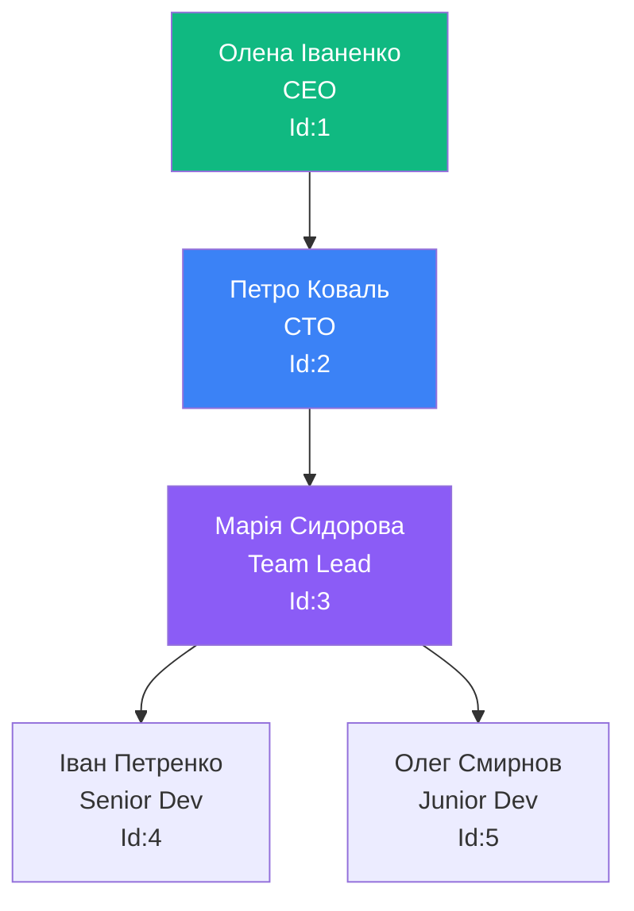
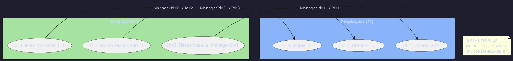

# SELF JOIN та складні сценарії JOIN

## Що таке SELF JOIN?

**SELF JOIN** — це об'єднання таблиці **сама з собою**. Це може здатися дивним, але вирішує важливий клас задач.

### Навіщо потрібен SELF JOIN?

::note
**SELF JOIN використовується коли**:

1. Потрібно порівняти рядки в межах **однієї** таблиці
2. Є ієрархічні зв'язки (співробітник → менеджер)
3. Потрібно знайти пари або дублікати

::

---

## Ієрархічні структури: Співробітники та менеджери

### Реальна задача

У компанії кожен співробітник (окрім CEO) має менеджера, який **теж є співробітником**.

**Структура**:

```sql
CREATE TABLE Employees (
    Id INT PRIMARY KEY,
    FirstName NVARCHAR(50),
    LastName NVARCHAR(50),
    Position NVARCHAR(100),
    ManagerId INT NULL,  -- FOREIGN KEY → сама таблиця!
    FOREIGN KEY (ManagerId) REFERENCES Employees(Id)
);
```

**Дані**:

```sql
INSERT INTO Employees VALUES
(1, 'Олена', 'Іваненко', 'CEO', NULL),           -- CEO без менеджера
(2, 'Петро', 'Коваль', 'CTO', 1),                -- CTO → CEO
(3, 'Марія', 'Сидорова', 'Team Lead Dev', 2),   -- Team Lead → CTO
(4, 'Іван', 'Петренко', 'Senior Developer', 3), -- Developer → Team Lead
(5, 'Олег', 'Смирнов', 'Junior Developer', 3);
```

**Ієрархія**:

::mermaid



::

---

### SELF JOIN для отримання імені менеджера

**Завдання**: Показати кожного співробітника та його менеджера.

```sql {5-6}
SELECT
    E.FirstName + ' ' + E.LastName AS Employee,
    E.Position,
    M.FirstName + ' ' + M.LastName AS Manager
FROM Employees AS E
LEFT JOIN Employees AS M ON E.ManagerId = M.Id;
```

**Ключеві моменти**:

1. **Рядок 5**: `Employees AS E` — **співробітники** (ліва таблиця)
2. **Рядок 6**: `Employees AS M` — **менеджери** (права таблиця, та сама!)
3. **Умова**: `E.ManagerId = M.Id` — ManagerId співробітника = Id менеджера
4. **LEFT JOIN**: Щоб CEO (без менеджера) теж потрапив в результат

**Результат**:

| Employee       | Position         | Manager        |
| :------------- | :--------------- | :------------- |
| Олена Іваненко | CEO              | NULL           |
| Петро Коваль   | CTO              | Олена Іваненко |
| Марія Сидорова | Team Lead Dev    | Петро Коваль   |
| Іван Петренко  | Senior Developer | Марія Сидорова |
| Олег Смирнов   | Junior Developer | Марія Сидорова |

::tip
**Псевдоніми обов'язкові!** Без `AS E` та `AS M` SQL Server не зрозуміє, що ви посилаєтесь на ту саму таблицю двічі.
::

---

## Візуалізація SELF JOIN

::plant-uml



::

---

## Порівняння рядків в межах таблиці

### Завдання: Студенти з однаковою стипендією

**Мета**: Знайти пари студентів, у яких **однакова** стипендія.

```sql {5}
SELECT
    S1.FirstName + ' ' + S1.LastName AS Student1,
    S2.FirstName + ' ' + S2.LastName AS Student2,
    S1.Grants
FROM Students AS S1
INNER JOIN Students AS S2
    ON S1.Grants = S2.Grants AND S1.Id < S2.Id;
```

**Анатомія коду**:

- `S1.Grants = S2.Grants` — студенти з однаковою стипендією
- `S1.Id < S2.Id` — **критично!** Без цього отримаємо:
    - Дублікати: (Іван, Олена) та (Олена, Іван)
    - Самих себе: (Іван, Іван)

**Результат**:

| Student1      | Student2      | Grants |
| :------------ | :------------ | -----: |
| Іван Петренко | Марія Іванова |   1200 |
| Олег Смирнов  | Андрій Коваль |   1250 |

::warning
**Без `S1.Id < S2.Id`** отримаєте N² рядків (кожен зі всіма, включно з собою)!
::

---

### Завдання: Продукти дорожчі за інші

**База даних Products**:

```sql
CREATE TABLE Products (
    Id INT PRIMARY KEY,
    Name NVARCHAR(100),
    Price DECIMAL(10,2),
    Category NVARCHAR(50)
);
```

**Знайти продукти дорожчі за середнє в категорії**:

```sql
SELECT
    P1.Name,
    P1.Price,
    P1.Category,
    AVG(P2.Price) AS CategoryAvgPrice
FROM Products AS P1
INNER JOIN Products AS P2 ON P1.Category = P2.Category
GROUP BY P1.Name, P1.Price, P1.Category
HAVING P1.Price > AVG(P2.Price);
```

**Пояснення**:

- Кожен продукт порівнюється з **усіма продуктами** своєї категорії
- `AVG(P2.Price)` — середня ціна в категорії
- `HAVING P1.Price > AVG(P2.Price)` — тільки дорожчі

---

## Recursive CTE: Альтернатива SELF JOIN для ієрархій

Для **глибоких** ієрархій (багато рівнів) SELF JOIN незручний. **Рекурсивні CTE** вирішують це елегантно.

### Приклад: Вся ієрархія підлеглих

**Завдання**: Отримати **всіх** підлеглих Петра Коваля (CTO), незалежно від рівня.

```sql
WITH EmployeeHierarchy AS (
    -- Anchor: Петро Коваль (точка старту)
    SELECT Id, FirstName, LastName, Position, ManagerId, 1 AS Level
    FROM Employees
    WHERE Id = 2  -- CTO

    UNION ALL

    -- Recursive: Підлеглі підлеглих
    SELECT E.Id, E.FirstName, E.LastName, E.Position, E.ManagerId, EH.Level + 1
    FROM Employees AS E
    INNER JOIN EmployeeHierarchy AS EH ON E.ManagerId = EH.Id
)
SELECT
    REPLICATE('  ', Level - 1) + FirstName + ' ' + LastName AS Employee,
    Position,
    Level
FROM EmployeeHierarchy
ORDER BY Level;
```

**Результат**:

| Employee       | Position         | Level |
| :------------- | :--------------- | ----: |
| Петро Коваль   | CTO              |     1 |
| Марія Сидорова | Team Lead Dev    |     2 |
| Іван Петренко  | Senior Developer |     3 |
| Олег Смирнов   | Junior Developer |     3 |

**Переваги CTE над SELF JOIN**:

- Працює для **необмеженої** глибини
- Показує **рівень** ієрархії
- Більш читабельно

::tip
**Коли використовувати CTE замість SELF JOIN?**

- Ієрархії з невідомою глибиною
- Потрібен номер рівня
- Агрегація по всій гілці

::

---

## JOIN з підзапитами

### Підзапит у FROM (Derived Table)

**Завдання**: Студенти з оцінкою вищою за середню їхньої групи.

```sql {2-6}
SELECT
    S.FirstName,
    S.AvgGrade,
    GroupAvg.Avg AS GroupAverage
FROM (
    SELECT
        StudentId,
        AVG(Grade) AS AvgGrade
    FROM Achievements
    GROUP BY StudentId
) AS S
INNER JOIN Students AS St ON S.StudentId = St.Id
INNER JOIN (
    SELECT
        G.Id AS GroupId,
        AVG(A.Grade) AS Avg
    FROM Groups AS G
    INNER JOIN Students AS S ON G.Id = S.GroupId
    INNER JOIN Achievements AS A ON S.Id = A.StudentId
    GROUP BY G.Id
) AS GroupAvg ON St.GroupId = GroupAvg.GroupId
WHERE S.AvgGrade > GroupAvg.Avg;
```

::note
**Derived Table** — результат підзапиту, який використовується як таблиця. Обов'язково потребує псевдоніму (`AS S`).
::

---

### Common Table Expression (CTE) замість вкладених JOIN

**Той самий запит з CTE** (більш читабельно):

```sql
WITH StudentAvg AS (
    SELECT StudentId, AVG(Grade) AS AvgGrade
    FROM Achievements
    GROUP BY StudentId
),
GroupAvg AS (
    SELECT
        G.Id AS GroupId,
        AVG(A.Grade) AS Avg
    FROM Groups AS G
    INNER JOIN Students AS S ON G.Id = S.GroupId
    INNER JOIN Achievements AS A ON S.Id = A.StudentId
    GROUP BY G.Id
)
SELECT
    St.FirstName,
    SA.AvgGrade,
    GA.Avg AS GroupAverage
FROM Students AS St
INNER JOIN StudentAvg AS SA ON St.Id = SA.StudentId
INNER JOIN GroupAvg AS GA ON St.GroupId = GA.GroupId
WHERE SA.AvgGrade > GA.Avg;
```

**Переваги CTE**:

- ✅ Читабельніше
- ✅ Можна перевикористати кілька разів
- ✅ Легше дебажити (можна SELECT з CTE окремо)

---

## Performance JOIN операцій

### Як SQL Server виконує JOIN?

SQL Server використовує **3 основні алгоритми**:

::tabs

::tab{label="Nested Loop Join"}

**Принцип**: Для кожного рядка з **outer** table шукає відповідності в **inner** table.

```
FOR кожен рядок у таблиці 1:
    FOR кожен рядок у таблиці 2:
        IF умова ON виконується:
            додати до результату
```

**Коли використовується**:

- Одна таблиця **мала** (< 100 рядків)
- Є **індекс** на inner table

**Складність**: O(N × M)

::

::tab{label="Hash Join"}

**Принцип**: Створює **hash-таблицю** з меншої таблиці, потім шукає відповідності в більшій.

```
Етап 1: BUILD - створення hash-таблиці з меншої таблиці
Етап 2: PROBE - сканування більшої таблиці та пошук в hash
```

**Коли використовується**:

- Обидві таблиці **великі**
- **Немає індексу** на join column
- Equality JOIN (`=`)

**Складність**: O(N + M)

::

::tab{label="Merge Join"}

**Принцип**: Обидві таблиці **відсортовані** по join column, синхронне зчитування.

```
Покажчики на початок обох таблиць:
ПОКИ не кінець будь-якої таблиці:
    IF значення співпадають → додати
    ELSE просунути покажчик з меншим значенням
```

**Коли використовується**:

- Дані вже **відсортовані** (є індекс)
- Equality JOIN (`=`)
- Many-to-Many відношення

**Складність**: O(N + M) — **найшвидший**!

::

::

---

### Execution Plan: Читання

::code-group

```sql [Повільний запит (Table Scan)]
SELECT S.FirstName, G.GroupName
FROM Students AS S
INNER JOIN Groups AS G ON S.GroupId = G.Id;

-- Execution Plan:
-- Hash Match (Cost: 75%)
--   ├─ Table Scan Students (Cost: 50%)
--   └─ Table Scan Groups (Cost: 25%)
```

```sql [Швидкий запит (Index Seek)]
CREATE INDEX IX_Students_GroupId ON Students(GroupId);

-- Execution Plan:
-- Nested Loop (Cosт: 15%)
--   ├─ Index Scan Students.IX_Students_GroupId (Cost: 5%)
--   └─ Clustered Index Seek Groups.PK (Cost: 10%)
```

::

**Як читати Execution Plan**:

```
Hash Match (75%) ← Алгоритм JOIN (% від загальної вартості)
  ├─ Table Scan (50%) ← Table Scan = ПОВІЛЬНО!
  └─ Index Seek (10%) ← Index Seek = ШВИДКО!
```

::tip
**Відкрити Execution Plan** в SQL Server Management Studio:

- `Ctrl + M` → Увімкнути Actual Execution Plan
- Виконати запит
- Вкладка "Execution Plan"

::

---

## Індекси для JOIN: Best Practices

### Covering Index

**Covering Index** містить **ВСІ** стовпці, потрібні для запиту.

```sql
-- Запит
SELECT S.FirstName, S.LastName, S.Grants, G.GroupName
FROM Students AS S
INNER JOIN Groups AS G ON S.GroupId = G.Id
WHERE S.Grants > 1200;

-- Створення Covering Index
CREATE NONCLUSTERED INDEX IX_Students_Covering
ON Students(GroupId)  -- JOIN column
INCLUDE (FirstName, LastName, Grants);  -- SELECT columns
```

**Переваги**:

- SQL Server читає **тільки індекс**, не звертається до таблиці
- Execution Plan: **Index Seek** замість **Key Lookup**

---

### Composite Index для складних JOIN

```sql
-- Запит з кількома умовами
FROM Students AS S
INNER JOIN Groups AS G
    ON S.GroupId = G.Id AND G.Faculty = 'IT';

-- Створення Composite Index
CREATE INDEX IX_Groups_Faculty_Id ON Groups(Faculty, Id);
```

**Порядок стовпців важливий**:

- Перший стовпець — той, що у **WHERE** або **GROUP BY**
- Другий — той, що у **JOIN**

---

## Складні запити: Реальні сценарії

### Сценарій 1: Звіт з 5 таблицями

**Завдання**: Повний звіт успішності студентів з інформацією про групу, викладача та предмети.

```sql
WITH StudentGrades AS (
    SELECT
        StudentId,
        SubjectId,
        AVG(Grade) AS AvgGrade,
        COUNT(*) AS TestCount
    FROM Achievements
    GROUP BY StudentId, SubjectId
)
SELECT
    S.FirstName + ' ' + S.LastName AS Student,
    G.GroupName,
    T.FirstName + ' ' + T.LastName AS Teacher,
    Sub.SubjectName,
    SG.AvgGrade,
    SG.TestCount,
    CASE
        WHEN SG.AvgGrade >= 90 THEN 'Відмінно'
        WHEN SG.AvgGrade >= 75 THEN 'Добре'
        WHEN SG.AvgGrade >= 60 THEN 'Задовільно'
        ELSE 'Незадовільно'
    END AS Performance
FROM Students AS S
INNER JOIN Groups AS G ON S.GroupId = G.Id
INNER JOIN Teachers AS T ON G.TeacherId = T.Id
INNER JOIN StudentGrades AS SG ON S.Id = SG.StudentId
INNER JOIN Subjects AS Sub ON SG.SubjectId = Sub.Id
WHERE SG.AvgGrade >= 60
ORDER BY G.GroupName, S.LastName, Sub.SubjectName;
```

**Оптимізації**:

1. CTE для попередньої агрегації
2. Індекси на всі FK
3. WHERE для фільтрації незадовільних оцінок

---

### Сценарій 2: Dashboard запит

**Завдання**: Статистика по групах для адмінської панелі.

```sql
SELECT
    G.GroupName,
    G.Faculty,
    T.FirstName + ' ' + T.LastName AS Teacher,
    COUNT(DISTINCT S.Id) AS TotalStudents,
    COUNT(DISTINCT CASE WHEN S.Grants IS NOT NULL THEN S.Id END) AS StudentsWithGrants,
    AVG(S.Grants) AS AvgGrant,
    COUNT(DISTINCT A.Id) AS TotalAchievements,
    AVG(A.Grade) AS AvgGrade,
    MAX(A.Grade) AS MaxGrade,
    MIN(A.Grade) AS MinGrade
FROM Groups AS G
LEFT JOIN Teachers AS T ON G.TeacherId = T.Id
LEFT JOIN Students AS S ON G.Id = S.GroupId
LEFT JOIN Achievements AS A ON S.Id = A.StudentId
GROUP BY G.GroupName, G.Faculty, T.FirstName, T.LastName
ORDER BY TotalStudents DESC;
```

**Ключові моменти**:

- **LEFT JOIN** для включення груп без студентів
- `COUNT(DISTINCT S. Id)` для точного підрахунку
- Агрегація по кількох вимірах

---

## Best Practices: Підсумок

::steps

### 1. Завжди використовуйте явний JOIN синтаксис

```sql
-- ❌ ПОГАНО (старий стиль)
FROM Students, Groups
WHERE Students.GroupId = Groups.Id

-- ✅ ДОБРЕ
FROM Students AS S
INNER JOIN Groups AS G ON S.GroupId = G.Id
```

### 2. Псевдоніми обов'язкові

```sql
-- ✅ Читабельно та коротко
FROM Students AS S
INNER JOIN Groups AS G
```

### 3. Фільтруйте рано

```sql
-- ✅ WHERE перед JOIN (якщо можливо)
FROM Students AS S
WHERE S.GroupId = 1  -- Зменшує кількість рядків для JOIN
INNER JOIN Groups AS G ON S.GroupId = G.Id
```

### 4. Використовуйте CTE для складності

```sql
-- ✅ Розбивайте складні запити на CTE
WITH FilteredStudents AS (...),
     GroupStats AS (...)
SELECT ... FROM FilteredStudents ...
```

### 5. Індекси на FK

```sql
-- ✅ Індекси на ВСІ колонки JOIN
CREATE INDEX IX_Students_GroupId ON Students(GroupId);
CREATE INDEX IX_Achievements_StudentId ON Achievements(StudentId);
```

### 6. Covering Indexes для частих запитів

```sql
CREATE INDEX IX_Students_Covering
ON Students(GroupId)
INCLUDE (FirstName, LastName, Grants);
```

### 7. Аналізуйте Execution Plans

```sql
-- Шукайте:
-- ❌ Table Scan (повільно)
-- ❌ Key Lookup (багато звернень)
-- ❌ Hash Match (якщо можна Merge Join)
-- ✅ Index Seek (ідеально!)
```

::

---

## Типові помилки та рішення

::tabs

::tab{label="Помилка: Декартовий добуток"}

```sql
-- ❌ Забули зв'язати Students з Achievements
SELECT *
FROM Students AS S, Groups AS G, Achievements AS A;
-- Результат: 10 × 5 × 100 = 5000 рядків!

-- ✅ ПРАВИЛЬНО
FROM Students AS S
INNER JOIN Groups AS G ON S.GroupId = G.Id
INNER JOIN Achievements AS A ON S.Id = A.StudentId;
```

::

::tab{label="Помилка: Втрата NULL"}

```sql
-- ❌ WHERE видаляє NULL
FROM Students AS S
LEFT JOIN Achievements AS A ON S.Id = A.StudentId
WHERE A.Grade > 80;  -- Втратили студентів без оцінок!

-- ✅ ПРАВИЛЬНО
WHERE A.Grade > 80 OR A.Grade IS NULL;
```

::

::tab{label="Помилка: Неефективний JOIN"}

```sql
-- ❌ JOIN без індексу
FROM LargeTable1 AS T1
INNER JOIN LargeTable2 AS T2 ON T1.Column = T2.Column;
-- Table Scan на обох → O(N²)

-- ✅ ПРАВИЛЬНО
CREATE INDEX IX_LargeTable1_Column ON LargeTable1(Column);
CREATE INDEX IX_LargeTable2_Column ON LargeTable2(Column);
-- Index Seek → O(N log N)
```

::

::

---

## Практичні завдання

::steps

### Завдання 1: SELF JOIN для ієрархії

Створити запит для виведення співробітника, його менеджера та менеджера його менеджера.

::collapsible{label="Показати рішення"}

```sql
SELECT
    E.FirstName + ' ' + E.LastName AS Employee,
    M1.FirstName + ' ' + M1.LastName AS DirectManager,
    M2.FirstName + ' ' + M2.LastName AS SecondLevelManager
FROM Employees AS E
LEFT JOIN Employees AS M1 ON E.ManagerId = M1.Id
LEFT JOIN Employees AS M2 ON M1.ManagerId = M2.Id
ORDER BY E.LastName;
```

::

### Завдання 2: Складний звіт з CTE

Знайти студентів, чия середня оцінка вища за середню їхньої групи.

::collapsible{label="Показати рішення"}

```sql
WITH StudentAvg AS (
    SELECT
        StudentId,
        AVG(Grade) AS AvgGrade
    FROM Achievements
    GROUP BY StudentId
),
GroupAvg AS (
    SELECT
        S.GroupId,
        AVG(A.Grade) AS GroupAvgGrade
    FROM Students AS S
    INNER JOIN Achievements AS A ON S.Id = A.StudentId
    GROUP BY S.GroupId
)
SELECT
    S.FirstName + ' ' + S.LastName AS Student,
    G.GroupName,
    SA.AvgGrade AS StudentAvg,
    GA.GroupAvgGrade
FROM Students AS S
INNER JOIN StudentAvg AS SA ON S.Id = SA.StudentId
INNER JOIN Groups AS G ON S.GroupId = G.Id
INNER JOIN GroupAvg AS GA ON S.GroupId = GA.GroupId
WHERE SA.AvgGrade > GA.GroupAvgGrade
ORDER BY SA.AvgGrade DESC;
```

::

### Завдання 3: Оптимізація запиту

Проаналізувати Execution Plan та створити необхідні індекси для запиту:

```sql
SELECT
    S.FirstName,
    G.GroupName,
    AVG(A.Grade) AS AvgGrade
FROM Students AS S
INNER JOIN Groups AS G ON S.GroupId = G.Id
INNER JOIN Achievements AS A ON S.Id = A.StudentId
WHERE G.Faculty = 'IT'
GROUP BY S.FirstName, G.GroupName
HAVING AVG(A.Grade) > 80;
```

::collapsible{label="Показати рішення"}

```sql
-- Індекси для оптимізації:

-- 1. Для Groups (WHERE по Faculty)
CREATE INDEX IX_Groups_Faculty_Id
ON Groups(Faculty)
INCLUDE (Id, GroupName);

-- 2. Для Students (JOIN)
CREATE INDEX IX_Students_GroupId_FirstName
ON Students(GroupId)
INCLUDE (Id, FirstName);

-- 3. Для Achievements (JOIN + GROUP BY)
CREATE INDEX IX_Achievements_StudentId_Grade
ON Achievements(StudentId)
INCLUDE (Grade);

-- Після створення індексів Execution Plan покаже:
-- ✅ Index Seek замість Table Scan
-- ✅ Nested Loop замість Hash Match (швидше)
```

::

::

---

## Резюме

::note
**Ключові висновки**:

1. **SELF JOIN** дозволяє порівнювати рядки в межах однієї таблиці
2. Ієрархічні структури: SELF JOIN для 1-2 рівнів, **Recursive CTE** для глибоких ієрархій
3. **CTE** покращує читабельність складних запитів
4. SQL Server використовує **3 алгоритми JOIN**: Nested Loop, Hash Match, Merge Join
5. **Індекси** критичні: Covering Index, Composite Index
6. **Execution Plan** показує вузькі місця
7. Завжди аналізуйте продуктивність на реальних даних

::

::tip
**Практичні поради**:

- Починайте з простих JOIN, поступово ускладнюйте
- Використовуйте CTE для декомпозиції логіки
- Створюйте індекси **після** написання запиту (спочатку логіка, потім оптимізація)
- Тестуйте на великих обсягах даних (не на 10 рядках!)
- Execution Plan — ваш найкращий друг

::

---

## Додаткові ресурси

- [Recursive Queries](https://learn.microsoft.com/en-us/sql/t-sql/queries/with-common-table-expression-transact-sql#guidelines-for-defining-and-using-recursive-common-table-expressions)
- [JOIN Fundamentals](https://learn.microsoft.com/en-us/sql/relational-databases/performance/joins)
- [Index Design Guide](https://learn.microsoft.com/en-us/sql/relational-databases/sql-server-index-design-guide)
- [Execution Plans](https://learn.microsoft.com/en-us/sql/relational-databases/performance/execution-plans)
- [Query Optimization Tips](https://learn.microsoft.com/en-us/sql/relational-databases/performance/performance-monitoring-and-tuning-tools)

---

::note
🎉 **Вітаємо!** Ви завершили повний курс по JOIN операціях у MS SQL Server!

Тепер ви знаєте:

- ✅ INNER JOIN для відповідностей
- ✅ LEFT/RIGHT/FULL JOIN для зовнішніх об'єднань
- ✅ SELF JOIN для ієрархій
- ✅ Оптимізацію через індекси та Execution Plans
- ✅ Best practices для реальних проєктів

**Наступні кроки**: Практикуйтесь на реальних даних та вивчайте Window Functions для ще більш потужних запитів!
::
