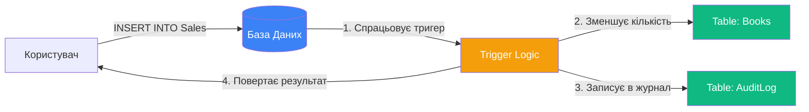
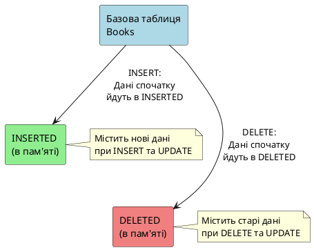
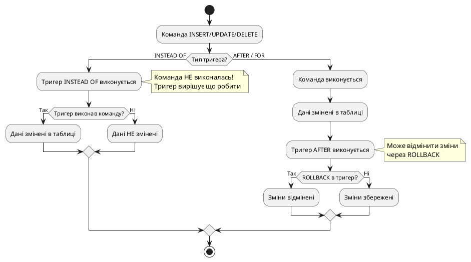

# DML-тригери

## Проблема: Як автоматизувати реакцію на зміни даних?

Уявіть інтернет-магазин книг. При кожному продажу потрібно:
- Зменшити кількість книг на складі
- Записати в журнал аудиту
- Перевірити чи не продається останній екземпляр бестселера
- Обновити статистику продажів

Можна робити це вручну в кожному запиті INSERT/UPDATE/DELETE... Але що, якщо **база даних сама могла б відреагувати** на зміну даних?

::mermaid



::

**DML-тригер (Trigger)** — це спеціалізована процедура, яка **автоматично викликається** при виникненні подій зміни даних (INSERT, UPDATE, DELETE) в таблиці або представленні.

::note
**DML** — Data Manipulation Language (Мова Маніпулювання Даними). DML-тригери реагують саме на команди маніпулювання даними, а не на зміни структури БД (для цього є DDL-тригери).
::

---

## Навіщо потрібні тригери?

### Use Cases (Сценарії використання)

::card-group
::card{icon="i-lucide-shield-check" title="Забезпечення цілісності даних"}
Автоматична перевірка бізнес-правил, які неможливо реалізувати через FOREIGN KEY або CHECK constraints.

**Приклад**: Заборонити видалення книги-бестселера.
::

::card{icon="i-lucide-file-text" title="Аудит змін"}
Автоматичне логування всіх змін даних (хто, коли, що змінив).

**Приклад**: Записувати в окрему таблицю всі видалені книги.
::

::card{icon="i-lucide-refresh-cw" title="Синхронізація даних"}
Автоматичне оновлення залежних даних в інших таблицях.

**Приклад**: При продажу зменшити кількість книг на складі.
::

::card{icon="i-lucide-calculator" title="Обчислення значень"}
Автоматичний перерахунок агрегованих значень.

**Приклад**: Оновлювати середню ціну книг при зміні ціни.
::
::

::warning
**Важливо**: Тригери **НЕ** повинні замінювати constraints (обмеження цілісності)!

- **FOREIGN KEY, CHECK, UNIQUE** — використовуйте для простої цілісності
- **Тригери** — для складної бізнес-логіки, яку неможливо виразити через constraints

Чому? Constraints швидші і явно показують структуру БД.
::

---

## Фундаментальні концепції

### Автоматичне виконання

Тригери **НЕ** викликаються явно. Вони спрацьовують автоматично при виникненні події.

::code-group

```sql [Без тригера - вручну]
-- При кожному INSERT потрібно вручну:
BEGIN TRANSACTION;

INSERT INTO Sales (BookId, Quantity, Price)
VALUES (1, 2, 250.00);

-- Зменшити кількість на складі
UPDATE Books
SET QuantityInStock = QuantityInStock - 2
WHERE Id = 1;

-- Записати в журнал
INSERT INTO AuditLog (ActionType, TableName, ActionDate)
VALUES ('INSERT', 'Sales', GETDATE());

COMMIT;
```

```sql [З тригером - автоматично]
-- Створюємо тригер один раз
CREATE TRIGGER trg_AfterSaleInsert
ON Sales
AFTER INSERT
AS
BEGIN
    -- Автоматично зменшуємо кількість
    UPDATE Books
    SET QuantityInStock = QuantityInStock - inserted.Quantity
    FROM Books b
    INNER JOIN inserted i ON b.Id = i.BookId;
    
    -- Автоматично логуємо
    INSERT INTO AuditLog (ActionType, TableName, ActionDate)
    VALUES ('INSERT', 'Sales', GETDATE());
END;

-- Тепер простий INSERT — решта зробиться автоматично!
INSERT INTO Sales (BookId, Quantity, Price)
VALUES (1, 2, 250.00);
```

::

### Таблиці INSERTED та DELETED

MS SQL Server надає дві **логічні таблиці** для доступу до даних, які змінюються:

| Таблиця    | Коли заповнюється     | Що містить                          |
| :--------- | :-------------------- | :---------------------------------- |
| `INSERTED` | INSERT, UPDATE        | **Нові** значення рядків            |
| `DELETED`  | DELETE, UPDATE        | **Старі** значення рядків (до зміни) |

::plant-uml



::

**Як це працює:**

::tabs

::tabs-item{label="INSERT"}
1. **Перед** вставкою в базову таблицю дані потрапляють в `INSERTED`
2. Спрацьовує тригер → може прочитати дані з `INSERTED`
3. Дані вставляються в базову таблицю

```sql
-- При виконанні:
INSERT INTO Books (Title, Price) VALUES ('SQL для початківців', 299.99);

-- Таблиця INSERTED містить:
-- Title                  | Price
-- 'SQL для початківців'  | 299.99

-- Таблиця DELETED — порожня
```

::

::tabs-item{label="DELETE"}
1. Дані з базової таблиці копіюються в `DELETED`
2. Спрацьовує тригер → може прочитати видаляємі дані з `DELETED`
3. Дані видаляються з базової таблиці

```sql
-- При виконанні:
DELETE FROM Books WHERE Id = 5;

-- Таблиця DELETED містить:
-- Id | Title        | Price
-- 5  | 'Старачок'   | 150.00

-- Таблиця INSERTED — порожня
```

::

::tabs-item{label="UPDATE"}
UPDATE — це **DELETE + INSERT**!

1. Старе значення → `DELETED`
2. Нове значення → `INSERTED`
3. Спрацьовує тригер → може порівняти старі й нові дані

```sql
-- При виконанні:
UPDATE Books SET Price = 350.00 WHERE Id = 10;

-- Таблиця DELETED (старе значення):
-- Id | Title               | Price
-- 10 | 'Чистий код'        | 320.00

-- Таблиця INSERTED (нове значення):
-- Id | Title               | Price
-- 10 | 'Чистий код'        | 350.00
```

::

::

::tip
**Ключова перевага**: Доступ до даних без додаткових запитів до БД. Тригер може відразу прочитати що саме вставляється/видаляється/змінюється.
::

---

## Типи DML-тригерів: AFTER vs INSTEAD OF

MS SQL Server підтримує два режими DML-тригерів:

::tabs

::tabs-item{label="AFTER (Після)"}
**Виконується ПІСЛЯ** зміни даних в базовій таблиці.

```sql
CREATE TRIGGER trg_AfterInsert
ON Books
AFTER INSERT  -- або FOR INSERT (синоніми)
AS
BEGIN
    PRINT 'Книга вже додана в таблицю!';
END;
```

**Характеристики**:
- ✅ Дані вже в таблиці
- ✅ Можна відмінити зміни через `ROLLBACK TRANSACTION`
- ✅ **Тільки для таблиць** (не для представлень)
- Використання: аудит, синхронізація, логування

::

::tabs-item{label="INSTEAD OF (Замість)"}
**Виконується ЗАМІСТЬ** команди INSERT/UPDATE/DELETE.

```sql
CREATE TRIGGER trg_InsteadOfDelete
ON Books
INSTEAD OF DELETE
AS
BEGIN
    -- Команда DELETE НЕ виконалась!
    -- Ми можемо зробити власну логіку
    PRINT 'Видалення книг заборонено! Переносимо в архів...';
    
    -- Наприклад, замість видалення — позначити IsDeleted = 1
    UPDATE Books
    SET IsDeleted = 1
    WHERE Id IN (SELECT Id FROM deleted);
END;
```

**Характеристики**:
- ✅ Дані **НЕ** змінені в таблиці (команда не виконалась)
- ✅ Тригер сам вирішує що робити
- ✅ Може використовуватись для представлень
- Використання: перехоплення команд, складна валідація, soft delete

::

::

::plant-uml



::

---

## Базовий синтаксис CREATE TRIGGER

```sql
CREATE TRIGGER [schema.]trigger_name
    ON {table_name | view_name}
    [WITH ENCRYPTION]  -- шифрування коду тригера
    {FOR | AFTER | INSTEAD OF}
    {[INSERT] [,] [UPDATE] [,] [DELETE]}
    [NOT FOR REPLICATION]  -- не виконувати при реплікації
AS
BEGIN
    -- Тіло тригера (T-SQL код)
END;
```

**Анатомія**:

- `trigger_name` — ім'я тригера (рекомендація: `trg_<Table>_<Action>_<Operation>`, наприклад `trg_Books_After_Insert`)
- `ON table_name` — для якої таблиці/представлення створюється тригер
- `FOR | AFTER | INSTEAD OF` — режим виконання
  - `FOR` та `AFTER` — синоніми (за замовчуванням AFTER)
- `INSERT, UPDATE, DELETE` — на які події реагувати (можна комбінувати)
- `NOT FOR REPLICATION` — тригер не виконається при реплікації даних

---

## Практичні приклади

### Приклад 1: Логування кількості змінених рядків

**Задача**: При додаванні або зміні авторів виводити повідомлення про кількість оброблених рядків.

```sql
CREATE TRIGGER trg_Authors_AfterInsertUpdate
ON book.Authors
FOR INSERT, UPDATE  -- Спрацює і на INSERT, і на UPDATE
AS
BEGIN
    DECLARE @rowCount INT = @@ROWCOUNT;
    
    RAISERROR('%d рядків було додано або модифіковано', 0, 1, @rowCount);
END;
GO

-- Тестуємо:
INSERT INTO book.Authors (FirstName, LastName, CountryId)
VALUES ('Артур', 'Конан Дойл', 2);

-- Результат: "1 рядків було додано або модифіковано"
```

**Пояснення**:
- `@@ROWCOUNT` — глобальна змінна, яка містить кількість рядків, що оброблені останньою командою
- `RAISERROR` — виводить форматоване повідомлення (0 — рівень важливості для інформаційних повідомлень)

---

### Приклад 2: Перевірка дати публікації

**Задача**: Заборонити додавання книг, дата публікації яких старше 30 днів.

```sql
CREATE TRIGGER trg_Books_CheckPublishDate
ON book.Books
FOR INSERT
AS
BEGIN
    DECLARE @publishDate SMALLDATETIME;
    
    -- Отримуємо дату з таблиці INSERTED
    SELECT @publishDate = DateOfPublish
    FROM inserted;
    
    -- Перевіряємо чи дата не старша 30 днів
    IF @publishDate <= DATEADD(DAY, -30, GETDATE())
    BEGIN
        RAISERROR('Це стара книга, дані про неї додані не будуть', 16, 1);
        ROLLBACK TRANSACTION;  -- Відміняємо INSERT
    END
    ELSE
    BEGIN
        PRINT 'Дані додані успішно';
    END
END;
GO

-- Тестуємо:
INSERT INTO book.Books (NameBook, ThemeId, AuthorId, Price, DateOfPublish, Pages)
VALUES ('Адміністрування MS SQL Server 2005', 21, 1, 125.0, '2007-09-01', 726);

-- Результат: "Це стара книга, дані про неї додані не будуть"
-- INSERT відмінено через ROLLBACK
```

**Пояснення**:
- Використовуємо таблицю `inserted` для доступу до даних, які вставляються
- `DATEADD(DAY, -30, GETDATE())` — дата 30 днів тому від сьогодні
- `ROLLBACK TRANSACTION` — відміняє всі зміни поточної транзакції (в тому числі INSERT)
- `RAISERROR` з рівнем 16 — помилка рівня користувача

::tip
**Best Practice**: Завжди використовуйте `IF EXISTS` або змінні для роботи з `inserted`/`deleted`, оскільки ці таблиці можуть містити **кілька рядків** (наприклад, при масовому INSERT).
::

---

### Приклад 3: Захист від видалення бестселера

**Задача**: Заборонити видалення книги, яка є лідером продажів.

```sql
CREATE TRIGGER trg_Books_PreventBestsellerDelete
ON book.Books
FOR DELETE
AS
BEGIN
    DECLARE @deletedBookName NVARCHAR(100);
    DECLARE @bestsellerName NVARCHAR(100);
    
    -- Отримуємо назву книги, яку видаляють
    SELECT @deletedBookName = NameBook
    FROM deleted;
    
    -- Знаходимо бестселер (книга з найбільшою кількістю продажів)
    SELECT TOP 1 @bestsellerName = b.NameBook
    FROM book.Books b
    INNER JOIN sale.Sales s ON b.Id = s.BookId
    GROUP BY b.NameBook
    ORDER BY COUNT(s.Id) DESC;
    
    -- Перевіряємо чи збігаються назви
    IF @bestsellerName = @deletedBookName
    BEGIN
        RAISERROR('Ви не можете видалити дану книгу - це бестселер!', 16, 1);
        ROLLBACK TRANSACTION;
    END
    ELSE
    BEGIN
        PRINT 'Книга видалена успішно';
    END
END;
GO
```

**Пояснення**:
- Використовуємо таблицю `deleted` для доступу до видаляємих даних
- Підзапит знаходить книгу з найбільшою кількістю продажів
- Якщо книга співпадає з бестселером — видалення заборонено

---

### Приклад 4: INSTEAD OF для "м'якого" видалення

**Задача**: Замість фізичного видалення книги програмування — позначати як видалену (soft delete).

```sql
-- Спочатку додамо колонку IsDeleted до таблиці Books
ALTER TABLE book.Books
ADD IsDeleted BIT NOT NULL DEFAULT 0;
GO

CREATE TRIGGER trg_Books_InsteadOfDelete
ON book.Books
INSTEAD OF DELETE
AS
BEGIN
    DECLARE @programmingThemeId INT;
    
    -- Отримуємо ID тематики "Програмування"
    SELECT @programmingThemeId = Id
    FROM book.Themes
    WHERE NameTheme = 'Програмування';
    
    -- Перевіряємо чи є в deleted книги цієї тематики
    IF EXISTS (
        SELECT 1
        FROM deleted
        WHERE ThemeId = @programmingThemeId
    )
    BEGIN
        -- Замість видалення — позначаємо IsDeleted = 1
        UPDATE book.Books
        SET IsDeleted = 1
        WHERE Id IN (SELECT Id FROM deleted WHERE ThemeId = @programmingThemeId);
        
        RAISERROR('Книги програмування не видалено фізично, а перенесено в архів', 10, 1);
    END
    ELSE
    BEGIN
        -- Для інших тематик — виконуємо реальне видалення
        DELETE FROM book.Books
        WHERE Id IN (SELECT Id FROM deleted);
        
        PRINT 'Книги видалено';
    END
END;
GO
```

**Пояснення**:
- `INSTEAD OF DELETE` — команда DELETE НЕ виконалась автоматично
- Тригер сам вирішує: для програмування — soft delete, для інших — реальне видалення
- **Важливо**: Якщо потрібне реальне видалення, тригер повинен сам виконати `DELETE`

---

## Правила та обмеження

::warning
**Заборонено** в тілі DML-тригерів:

- ❌ Створення БД: `CREATE/ALTER/DROP DATABASE`
- ❌ `TRUNCATE TABLE` (спрацює тільки DELETE)
- ❌ `RECONFIGURE`, `BACKUP`, `RESTORE`
- ❌ `GRANT`, `REVOKE` (права доступу)
- ❌ `SELECT INTO` (створення таблиці)
- ❌ `UPDATE STATISTICS`

**Дозволено**:

- ✅ INSERT, UPDATE, DELETE в інших таблицях
- ✅ SELECT для читання даних
- ✅ Виклик зберігаємих процедур
- ✅ Робота з тимчасовими таблицями
- ✅ ROLLBACK TRANSACTION
::

::note
**Важливі правила**:

1. **Тимчасові таблиці**: НЕ можна створювати тригери для тимчасових таблиць, але тригер може звертатися до них
2. **Представлення**: INSTEAD OF тригери можуть бути створені для представлень
3. **AFTER тригери**: Тільки для таблиць
4. **Повернення результатів**: Тригери не повинні повертати result sets (уникайте SELECT без INTO/INSERT)
5. **Рекурсія**: Підтримується до 32 рівнів (потрібно увімкнути `RECURSIVE_TRIGGERS`)
::

---

## Управління тригерами

### Зміна тригера (ALTER TRIGGER)

```sql
ALTER TRIGGER trg_Books_AfterInsert
ON book.Books
AFTER INSERT
AS
BEGIN
    -- Новий код тригера
    PRINT 'Оновлений тригер!';
END;
```

### Відключення тригера

```sql
-- Відключити конкретний тригер
DISABLE TRIGGER trg_Books_AfterInsert ON book.Books;

-- Відключити ВСІ тригери на таблиці
DISABLE TRIGGER ALL ON book.Books;
```

### Увімкнення тригера

```sql
-- Увімкнути конкретний тригер
ENABLE TRIGGER trg_Books_AfterInsert ON book.Books;

-- Увімкнути ВСІ тригери на таблиці
ENABLE TRIGGER ALL ON book.Books;
```

### Видалення тригера

```sql
DROP TRIGGER trg_Books_AfterInsert;

-- Видалити кілька тригерів відразу
DROP TRIGGER trg_Books_AfterInsert, trg_Authors_AfterUpdate;
```

---

## Метадані тригерів

Інформація про тригери зберігається в системних представленнях:

```sql
-- Список всіх тригерів бази даних
SELECT 
    name AS TriggerName,
    OBJECT_NAME(parent_id) AS TableName,
    is_disabled AS IsDisabled,
    is_instead_of_trigger AS IsInsteadOf
FROM sys.triggers
WHERE parent_class_desc = 'OBJECT_OR_COLUMN';

-- Отримати код тригера
SELECT m.definition
FROM sys.sql_modules m
INNER JOIN sys.triggers t ON m.object_id = t.object_id
WHERE t.name = 'trg_Books_AfterInsert';

-- Альтернатива: через sp_helptext
EXEC sp_helptext 'trg_Books_AfterInsert';
```

---

## Практичні завдання

::accordion

::accordion-item{label="Завдання 1: Тригер на оновлення кількості" icon="i-lucide-package"}

**Умова**: При продажу книги (INSERT в таблицю `Sales`) автоматично зменшувати `QuantityInStock` в таблиці `Books`.

<details>
<summary>💡 Розв'язок</summary>

```sql
CREATE TRIGGER trg_Sales_UpdateStock
ON sale.Sales
AFTER INSERT
AS
BEGIN
    UPDATE book.Books
    SET QuantityInStock = QuantityInStock - i.Quantity
    FROM book.Books b
    INNER JOIN inserted i ON b.Id = i.BookId;
    
    PRINT 'Кількість книг на складі оновлено';
END;
```

**Пояснення**:
- JOIN з `inserted` дозволяє обробити всі вставлені рядки одночасно
- `QuantityInStock - i.Quantity` — зменшуємо на куплену кількість

</details>

::

::accordion-item{label="Завдання 2: Перевірка достатності товару" icon="i-lucide-alert-triangle"}

**Умова**: Заборонити продаж, якщо кількість книг в `Sales.Quantity` перевищує `Books.QuantityInStock`.

<details>
<summary>💡 Розв'язок</summary>

```sql
CREATE TRIGGER trg_Sales_CheckStock
ON sale.Sales
FOR INSERT
AS
BEGIN
    IF EXISTS (
        SELECT 1
        FROM inserted i
        INNER JOIN book.Books b ON i.BookId = b.Id
        WHERE i.Quantity > b.QuantityInStock
    )
    BEGIN
        RAISERROR('Недостатньо книг на складі для продажу', 16, 1);
        ROLLBACK TRANSACTION;
    END
END;
```

</details>

::

::accordion-item{label="Завдання 3: Логування видалених книг" icon="i-lucide-file-text"}

**Умова**: При видаленні книги — копіювати дані в таблицю `DeletedBooks`.

<details>
<summary>💡 Розв'язок</summary>

```sql
-- Спочатку створюємо таблицю для архіву
CREATE TABLE book.DeletedBooks (
    Id INT PRIMARY KEY IDENTITY,
    OriginalBookId INT,
    NameBook NVARCHAR(200),
    Price DECIMAL(10,2),
    DeletedAt DATETIME DEFAULT GETDATE()
);
GO

CREATE TRIGGER trg_Books_ArchiveDeleted
ON book.Books
FOR DELETE
AS
BEGIN
    INSERT INTO book.DeletedBooks (OriginalBookId, NameBook, Price)
    SELECT Id, NameBook, Price
    FROM deleted;
    
    PRINT 'Видалені книги скопійовано в архів';
END;
```

</details>

::

::accordion-item{label="Завдання 4: Контроль ціни продажу" icon="i-lucide-dollar-sign"}

**Умова**: Заборонити продаж книги за ціною нижчою, ніж базова ціна в таблиці `Books`.

<details>
<summary>💡 Розв'язок</summary>

```sql
CREATE TRIGGER trg_Sales_CheckPrice
ON sale.Sales
FOR INSERT, UPDATE
AS
BEGIN
    IF EXISTS (
        SELECT 1
        FROM inserted i
        INNER JOIN book.Books b ON i.BookId = b.Id
        WHERE i.Price < b.Price
    )
    BEGIN
        RAISERROR('Ціна продажу не може бути меншою базової ціни', 16, 1);
        ROLLBACK TRANSACTION;
    END
END;
```

</details>

::

::

---

## Резюме

::tip
**Ключові моменти DML-тригерів**:

1. **Автоматичне виконання** — спрацьовують без явного виклику
2. **INSERTED та DELETED** — логічні таблиці для доступу до даних
3. **AFTER** — виконується після зміни (тільки таблиці)
4. **INSTEAD OF** — виконується замість команди (таблиці + представлення)
5. **Комбінації подій** — можна реагувати на INSERT, UPDATE, DELETE одночасно
6. **ROLLBACK** — відміна змін при валідації
7. **Не для тимчасових таблиць** — тригери НЕ можна створювати для `#temp`
8. **sys.triggers** — метадані про тригери

**Best Practices**:
- Тримайте тригери простими та швидкими
- Уникайте складних запитів в тригерах (знижують performance)
- Логуйте тільки необхідне
- Пам'ятайте про масові операції (`inserted`/`deleted` можуть містити багато рядків)
- Використовуйте constraints замість тригерів де можливо

**Наступний крок**: Вивчіть [DDL-тригери](02.ddl-triggers.md) для контролю змін структури БД.
::
