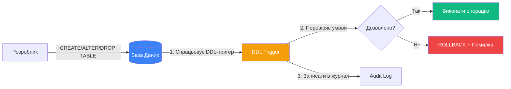
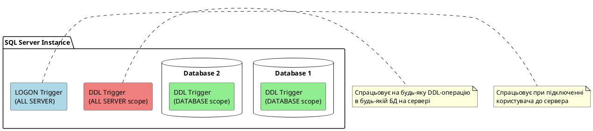

# DDL-тригери

## Проблема: Як контролювати зміни структури БД?

Уявіть, що ви адміністратор бази даних великої компанії. Раптом хтось (навіть випадково!) видаляє критично важливу таблицю або змінює структуру:

```sql
DROP TABLE Customers;  -- Упс... 😱
```

Або молодший розробник створює таблиці без дотримання стандартів:

```sql
CREATE TABLE tbl_temp_data (...);  -- Погана назва!
```

**Питання**: Як автоматично відстежувати та контролювати такі операції? Як записувати в журнал всі зміни структури БД?

::mermaid



::

**DDL-тригер** — це тригер, який спрацьовує при виконанні **DDL-операцій** (Data Definition Language): CREATE, ALTER, DROP для таблиць, представлень, індексів, процедур тощо.

::note
**DDL** (Data Definition Language) — операції зі структурою БД:
- `CREATE TABLE`, `ALTER TABLE`, `DROP TABLE`
- `CREATE INDEX`, `DROP INDEX`
- `CREATE PROCEDURE`, `ALTER PROCEDURE`
- `GRANT`, `DENY`, `REVOKE` (права доступу)

На відміну від **DML-тригерів** (які реагують на зміни **даних**: INSERT/UPDATE/DELETE), DDL-тригери реагують на зміни **структури**.
::

---

## Навіщо потрібні DDL-тригери?

::card-group
::card{icon="i-lucide-shield" title="Захист від випадкових змін"}
Заборонити видалення або зміну критичних об'єктів БД.

**Приклад**: Заборонити `DROP TABLE` або `ALTER TABLE` для звичайних користувачів.
::

::card{icon="i-lucide-file-search" title="Аудит змін структури"}
Логувати всі DDL-операції: хто, коли, що змінив.

**Приклад**: Записувати в таблицю аудиту всі CREATE/ALTER/DROP команди.
::

::card{icon="i-lucide-check-circle" title="Перевірка стандартів"}
Контролювати дотримання naming conventions та стандартів розробки.

**Приклад**: Заборонити створення таблиць без префіксу схеми.
::

::card{icon="i-lucide-git-branch" title="Контроль версій БД"}
Інтеграція з системами версійного контролю для відстеження змін схеми.

**Приклад**: Автоматично створювати скрипт зміни і зберігати в git.
::
::

---

## Області дії DDL-тригерів

DDL-тригери можуть діяти на двох рівнях:

::tabs

::tabs-item{label="DATABASE (Рівень БД)"}
Тригер спрацьовує при DDL-операціях в **поточній базі даних**.

```sql
CREATE TRIGGER trg_AuditDatabaseChanges
ON DATABASE  -- ← Рівень поточної БД
FOR CREATE_TABLE, ALTER_TABLE, DROP_TABLE
AS
BEGIN
    PRINT 'Зміна структури БД виявлена!';
END;
```

**Використання**:
- Контроль змін таблиць, процедур, функцій в конкретній ОЗ
- Аудит розробницьких змін
- Валідація naming conventions

**Де зберігається**: В папці **Programmability → Database Triggers** в SSMS.

::

::tabs-item{label="ALL SERVER (Рівень сервера)"}
Тригер спрацьовує при DDL-операціях на **всьому сервері** (всі БД).

```sql
CREATE TRIGGER trg_PreventDatabaseDrop
ON ALL SERVER  -- ← Рівень всього сервера
FOR DROP_DATABASE
AS
BEGIN
    PRINT 'Видалення БД заборонено!';
    ROLLBACK;
END;
```

**Використання**:
- Захист від видалення баз даних
- Контроль створення/зміни логінів
- Моніторинг змін конфігурації сервера

**Де зберігається**: В папці **Server Objects → Triggers** в SSMS.

**Спеціальний тип**: **LOGON тригери** — спрацьовують при вході користувача на сервер.

::

::

::plant-uml



::

---

## Базовий синтаксис CREATE TRIGGER

### Для рівня DATABASE

```sql
CREATE TRIGGER trigger_name
ON DATABASE  -- Область дії: поточна БД
[WITH ENCRYPTION]
{FOR | AFTER} {event_name | event_group} [, ...n]
AS
BEGIN
    -- Тіло тригера
END;
```

### Для рівня ALL SERVER

```sql
CREATE TRIGGER trigger_name
ON ALL SERVER  -- Область дії: весь сервер
[WITH ENCRYPTION]
{FOR | AFTER} {event_name | event_group} [, ...n]
AS
BEGIN
    -- Тіло тригера
END;
```

### Для LOGON (вхід на сервер)

```sql
CREATE TRIGGER trigger_name
ON ALL SERVER
[WITH ENCRYPTION]
FOR LOGON  -- Подія входу користувача
AS
BEGIN
    -- Тіло тригера
END;
```

**Анатомія**:
- `ON DATABASE | ALL SERVER` — область дії
- `FOR | AFTER` — режим виконання (тільки AFTER для DDL, немає INSTEAD OF!)
- `event_name` — конкретна подія, наприклад `CREATE_TABLE`, `DROP_TABLE`
- `event_group` — група подій, наприклад `DDL_TABLE_EVENTS` (всі події таблиць)

---

## Події та групи подій

### Основні події

| Подія               | Опис                      | Приклад команди          |
| :------------------ | :------------------------ | :----------------------- |
| `CREATE_TABLE`      | Створення таблиці         | `CREATE TABLE ...`       |
| `ALTER_TABLE`       | Зміна таблиці             | `ALTER TABLE ...`        |
| `DROP_TABLE`        | Видалення таблиці         | `DROP TABLE ...`         |
| `CREATE_INDEX`      | Створення індексу         | `CREATE INDEX ...`       |
| `DROP_INDEX`        | Видалення індексу         | `DROP INDEX ...`         |
| `CREATE_PROCEDURE`  | Створення процедури       | `CREATE PROCEDURE ...`   |
| `ALTER_PROCEDURE`   | Зміна процедури           | `ALTER PROCEDURE ...`    |
| `DROP_PROCEDURE`    | Видалення процедури       | `DROP PROCEDURE ...`     |
| `CREATE_DATABASE`   | Створення БД (SERVER!)    | `CREATE DATABASE ...`    |
| `DROP_DATABASE`     | Видалення БД (SERVER!)    | `DROP DATABASE ...`      |
| `GRANT_DATABASE`    | Надання прав (БД)         | `GRANT SELECT ...`       |
| `DENY_DATABASE`     | Заборона прав (БД)        | `DENY DELETE ...`        |

### Групи подій

Групи дозволяють реагувати на кілька схожих подій одночасно:

| Група подій              | Включає події                                |
| :----------------------- | :------------------------------------------- |
| `DDL_TABLE_EVENTS`       | CREATE/ALTER/DROP TABLE                      |
| `DDL_VIEW_EVENTS`        | CREATE/ALTER/DROP VIEW                       |
| `DDL_INDEX_EVENTS`       | CREATE/ALTER/DROP INDEX                      |
| `DDL_PROCEDURE_EVENTS`   | CREATE/ALTER/DROP PROCEDURE                  |
| `DDL_FUNCTION_EVENTS`    | CREATE/ALTER/DROP FUNCTION                   |
| `DDL_DATABASE_LEVEL_EVENTS` | **Всі** DDL-події рівня БД                |
| `DDL_SERVER_LEVEL_EVENTS`   | **Всі** DDL-події рівня сервера           |

::tip
**Рекомендація**: Використовуйте групи для простоти коду.

Замість:
```sql
FOR CREATE_TABLE, ALTER_TABLE, DROP_TABLE
```

Пишіть:
```sql
FOR DDL_TABLE_EVENTS
```
::

---

## Функція EVENTDATA(): Отримання інформації про подію

DDL-тригери не мають таблиць `INSERTED`/`DELETED`. Замість цього використовується функція **EVENTDATA()**, яка повертає **XML** з інформацією про подію.

```sql
CREATE TRIGGER trg_LogDDLChanges
ON DATABASE
FOR DDL_DATABASE_LEVEL_EVENTS
AS
BEGIN
    DECLARE @eventData XML = EVENTDATA();
    
    SELECT 
        @eventData.value('(/EVENT_INSTANCE/EventType)[1]', 'NVARCHAR(100)') AS EventType,
        @eventData.value('(/EVENT_INSTANCE/ObjectName)[1]', 'NVARCHAR(256)') AS ObjectName,
        @eventData.value('(/EVENT_INSTANCE/LoginName)[1]', 'NVARCHAR(256)') AS LoginName,
        @eventData.value('(/EVENT_INSTANCE/TSQLCommand/CommandText)[1]', 'NVARCHAR(MAX)') AS CommandText;
END;
```

**Структура XML від EVENTDATA()**:

```xml
<EVENT_INSTANCE>
  <EventType>CREATE_TABLE</EventType>
  <PostTime>2026-02-13T14:30:00.123</PostTime>
  <SPID>52</SPID>
  <ServerName>SQL-SERVER-01</ServerName>
  <LoginName>sa</LoginName>
  <UserName>dbo</UserName>
  <DatabaseName>BookStore</DatabaseName>
  <SchemaName>dbo</SchemaName>
  <ObjectName>NewTable</ObjectName>
  <ObjectType>TABLE</ObjectType>
  <TSQLCommand>
    <SetOptions .../>
    <CommandText>CREATE TABLE NewTable (Id INT);</CommandText>
  </TSQLCommand>
</EVENT_INSTANCE>
```

**Корисні елементи XML**:
- `EventType` — тип події (CREATE_TABLE, DROP_PROCEDURE тощо)
- `ObjectName` — назва об'єкта
- `LoginName` — логін користувача, який виконав команду
- `CommandText` — повний текст SQL-команди
- `PostTime` — час виконання

---

## Практичні приклади

### Приклад 1: Заборона зміни та видалення таблиць

**Задача**: Заборонити всім користувачам (крім адміністратора) змінювати або видаляти таблиці.

```sql
CREATE TRIGGER trg_PreventTableModification
ON DATABASE
FOR ALTER_TABLE, DROP_TABLE
AS
BEGIN
    DECLARE @eventData XML = EVENTDATA();
    DECLARE @loginName NVARCHAR(256);
    DECLARE @objectName NVARCHAR(256);
    DECLARE @eventType NVARCHAR(100);
    
    -- Витягуємо інформацію з XML
    SELECT 
        @loginName = @eventData.value('(/EVENT_INSTANCE/LoginName)[1]', 'NVARCHAR(256)'),
        @objectName = @eventData.value('(/EVENT_INSTANCE/ObjectName)[1]', 'NVARCHAR(256)'),
        @eventType = @eventData.value('(/EVENT_INSTANCE/EventType)[1]', 'NVARCHAR(100)');
    
    -- Дозволяємо тільки адміністратору
    IF @loginName != 'sa' AND @loginName != 'BUILTIN\Administrators'
    BEGIN
        DECLARE @errorMsg NVARCHAR(500) = 
            'Модифікація та видалення таблиць заборонені. Зверніться до адміністратора.' +
            CHAR(13) + 'Спроба: ' + @eventType + ' для таблиці ' + @objectName;
        
        RAISERROR(@errorMsg, 16, 1);
        ROLLBACK;
    END
    ELSE
    BEGIN
        PRINT 'Операція дозволена для адміністратора';
    END
END;
GO

-- Тестуємо (якщо ви не sa):
ALTER TABLE book.Books ADD TestColumn INT;
-- Результат: "Модифікація та видалення таблиць заборонені..."
```

**Пояснення**:
- Перевіряємо логін через `EVENTDATA()`
- Якщо не адміністратор — викидаємо помилку і відміняємо операцію
- `ROLLBACK` відміняє DDL-команду

---

### Приклад 2: Аудит всіх DDL-змін

**Задача**: Записувати всі зміни структури БД в спеціальну таблицю аудиту.

```sql
-- Створюємо таблицю аудиту
CREATE TABLE dbo.DDLAuditLog (
    Id INT IDENTITY PRIMARY KEY,
    EventType NVARCHAR(100),
    ObjectName NVARCHAR(256),
    LoginName NVARCHAR(256),
    CommandText NVARCHAR(MAX),
    EventDate DATETIME DEFAULT GETDATE()
);
GO

-- Створюємо тригер для аудиту
CREATE TRIGGER trg_AuditDDLChanges
ON DATABASE
FOR DDL_DATABASE_LEVEL_EVENTS  -- Всі DDL-події в БД
AS
BEGIN
    SET NOCOUNT ON;
    
    DECLARE @eventData XML = EVENTDATA();
    
    INSERT INTO dbo.DDLAuditLog (EventType, ObjectName, LoginName, CommandText)
    SELECT
        @eventData.value('(/EVENT_INSTANCE/EventType)[1]', 'NVARCHAR(100)'),
        @eventData.value('(/EVENT_INSTANCE/ObjectName)[1]', 'NVARCHAR(256)'),
        @eventData.value('(/EVENT_INSTANCE/LoginName)[1]', 'NVARCHAR(256)'),
        @eventData.value('(/EVENT_INSTANCE/TSQLCommand/CommandText)[1]', 'NVARCHAR(MAX)');
END;
GO

-- Тестуємо:
CREATE TABLE dbo.TestTable (Id INT);
DROP TABLE dbo.TestTable;

-- Перевіряємо журнал:
SELECT * FROM dbo.DDLAuditLog ORDER BY EventDate DESC;
```

**Результат в DDLAuditLog**:

| EventType     | ObjectName | LoginName | CommandText                        | EventDate            |
| :------------ | :--------- | :-------- | :--------------------------------- | :------------------- |
| DROP_TABLE    | TestTable  | sa        | DROP TABLE dbo.TestTable;          | 2026-02-13 14:35:12  |
| CREATE_TABLE  | TestTable  | sa        | CREATE TABLE dbo.TestTable (...);  | 2026-02-13 14:35:10  |

---

### Приклад 3: Контроль naming conventions

**Задача**: Заборонити створення таблиць з назвами, які починаються з `tbl_` або `temp_`.

```sql
CREATE TRIGGER trg_EnforceNamingConventions
ON DATABASE
FOR CREATE_TABLE
AS
BEGIN
    DECLARE @eventData XML = EVENTDATA();
    DECLARE @tableName NVARCHAR(256);
    
    SELECT @tableName = @eventData.value('(/EVENT_INSTANCE/ObjectName)[1]', 'NVARCHAR(256)');
    
    -- Перевіряємо naming convention
    IF @tableName LIKE 'tbl[_]%' OR @tableName LIKE 'temp[_]%'
    BEGIN
        RAISERROR('Назви таблиць не повинні починатися з "tbl_" або "temp_". Використовуйте осмислені назви!', 16, 1);
        ROLLBACK;
    END
END;
GO

-- Тестуємо:
CREATE TABLE tbl_BadName (Id INT);
-- Результат: "Назви таблиць не повинні починатися з "tbl_"..."

CREATE TABLE Customers (Id INT);  -- ✅ Дозволено
```

---

### Приклад 4: Захист від видалення БД (рівень сервера)

**Задача**: Заборонити видалення будь-яких баз даних на сервері.

```sql
USE master;
GO

CREATE TRIGGER trg_PreventDatabaseDrop
ON ALL SERVER  -- Рівень сервера!
FOR DROP_DATABASE
AS
BEGIN
    DECLARE @eventData XML = EVENTDATA();
    DECLARE @dbName NVARCHAR(256);
    
    SELECT @dbName = @eventData.value('(/EVENT_INSTANCE/DatabaseName)[1]', 'NVARCHAR(256)');
    
    RAISERROR('Видалення бази даних "%s" заборонено на цьому сервері!', 16, 1, @dbName);
    ROLLBACK;
END;
GO

-- Тестуємо:
DROP DATABASE TestDB;
-- Результат: "Видалення бази даних "TestDB" заборонено..."
```

::note
**Важливо**: DDL-тригери рівня сервера зберігаються в базі `master` і відображаються в **Server Objects → Triggers** в SSMS.
::

---

### Приклад 5: LOGON тригер — обмеження підключень

**Задача**: Заборонити підключення користувачу `guest_user` в неробочий час (18:00-08:00).

```sql
USE master;
GO

CREATE TRIGGER trg_RestrictLoginTime
ON ALL SERVER
FOR LOGON
AS
BEGIN
    DECLARE @loginName NVARCHAR(256) = ORIGINAL_LOGIN();
    DECLARE @currentHour INT = DATEPART(HOUR, GETDATE());
    
    -- Перевіряємо час та користувача
    IF @loginName = 'guest_user' AND (@currentHour >= 18 OR @currentHour < 8)
    BEGIN
        RAISERROR('Підключення для користувача "guest_user" дозволено тільки з 08:00 до 18:00', 16, 1);
        ROLLBACK;
    END
END;
GO
```

**Пояснення**:
- `ORIGINAL_LOGIN()` — повертає логін користувача, який підключається
- `DATEPART(HOUR, GETDATE())` — поточна година (0-23)
- Якщо умова не виконується — підключення відхилено

::warning
**Обережно з LOGON тригерами!**

Якщо тригер містить помилку і заборо **ВСІ** підключення (включно з адмінами), ви можете заблокувати себе на сервері!

**Порятунок**: Підключитися через **Dedicated Administrator Connection (DAC)**:
```
sqlcmd -S .\SQLSERVER -A -U sa -P password
DROP TRIGGER trg_RestrictLoginTime ON ALL SERVER;
```
::

---

## Управління DDL-тригерами

### Зміна тригера

```sql
-- Для рівня DATABASE
ALTER TRIGGER trg_AuditDDLChanges
ON DATABASE
FOR DDL_DATABASE_LEVEL_EVENTS
AS
BEGIN
    -- Новий код
END;

-- Для рівня ALL SERVER
ALTER TRIGGER trg_PreventDatabaseDrop
ON ALL SERVER
FOR DROP_DATABASE
AS
BEGIN
    -- Новий код
END;
```

### Відключення тригера

```sql
-- Для рівня DATABASE
DISABLE TRIGGER trg_AuditDDLChanges ON DATABASE;

-- Для рівня ALL SERVER
DISABLE TRIGGER trg_PreventDatabaseDrop ON ALL SERVER;

-- Відключити ВСІ DDL-тригери БД
DISABLE TRIGGER ALL ON DATABASE;
```

### Увімкнення тригера

```sql
ENABLE TRIGGER trg_AuditDDLChanges ON DATABASE;
ENABLE TRIGGER trg_PreventDatabaseDrop ON ALL SERVER;
```

### Видалення тригера

```sql
-- Для рівня DATABASE
DROP TRIGGER trg_AuditDDLChanges ON DATABASE;

-- Для рівня ALL SERVER
DROP TRIGGER trg_PreventDatabaseDrop ON ALL SERVER;
```

---

## Метадані DDL-тригерів

```sql
-- Тригери рівня DATABASE
SELECT 
    name AS TriggerName,
    create_date AS CreatedDate,
    modify_date AS ModifiedDate,
    is_disabled AS IsDisabled
FROM sys.triggers
WHERE parent_class_desc = 'DATABASE';

-- Тригери рівня SERVER
SELECT 
    name AS TriggerName,
    create_date AS CreatedDate,
    modify_date AS ModifiedDate,
    is_disabled AS IsDisabled
FROM sys.server_triggers;

-- Отримати код тригера рівня DATABASE
SELECT m.definition
FROM sys.sql_modules m
INNER JOIN sys.triggers t ON m.object_id = t.object_id
WHERE t.name = 'trg_AuditDDLChanges'
  AND t.parent_class_desc = 'DATABASE';

-- Отримати код тригера рівня SERVER
SELECT m.definition
FROM sys.server_sql_modules m
INNER JOIN sys.server_triggers t ON m.object_id = t.object_id
WHERE t.name = 'trg_PreventDatabaseDrop';
```

---

## Різниця між DML та DDL тригерами

::tabs

::tabs-item{label="Порівняння"}

| Характеристика       | DML-тригери                    | DDL-тригери                        |
| :------------------- | :----------------------------- | :--------------------------------- |
| **Події**            | INSERT, UPDATE, DELETE         | CREATE, ALTER, DROP, GRANT тощо    |
| **Об'єкт**           | Дані в таблицях                | Структура БД (таблиці, індекси...) |
| **Області дії**      | Тільки таблиця/представлення   | DATABASE або ALL SERVER            |
| **INSTEAD OF**       | ✅ Підтримується               | ❌ Не підтримується                |
| **INSERTED/DELETED** | ✅ Таблиці доступні            | ❌ Немає (використовується EVENTDATA) |
| **EVENTDATA()**      | ❌ Немає                       | ✅ Повертає XML з інформацією      |
| **Use Case**         | Валідація даних, аудит DML     | Захист структури, аудит DDL        |

::

::tabs-item{label="Приклади"}

**DML-тригер**:
```sql
CREATE TRIGGER trg_Sales_AfterInsert
ON Sales
AFTER INSERT  -- Подія: INSERT даних
AS
BEGIN
    -- Доступ до inserted/deleted
    UPDATE Books SET Stock = Stock - i.Quantity
    FROM inserted i;
END;
```

**DDL-тригер**:
```sql
CREATE TRIGGER trg_PreventTableDrop
ON DATABASE
FOR DROP_TABLE  -- Подія: DROP структури
AS
BEGIN
    -- Використовуємо EVENTDATA()
    DECLARE @data XML = EVENTDATA();
    ROLLBACK;
END;
```

::

::

---

## Практичні завдання

::accordion

::accordion-item{label="Завдання 1: Логування створення процедур" icon="i-lucide-file-plus"}

**Умова**: Створіть тригер, який записує в таблицю аудиту всі створені/змінені зберігаємі процедури.

<details>
<summary>💡 Розв'язок</summary>

```sql
-- Таблиця аудиту
CREATE TABLE dbo.ProcedureAuditLog (
    Id INT IDENTITY PRIMARY KEY,
    EventType NVARCHAR(100),
    ProcedureName NVARCHAR(256),
    LoginName NVARCHAR(256),
    EventDate DATETIME DEFAULT GETDATE()
);
GO

-- Тригер
CREATE TRIGGER trg_AuditProcedures
ON DATABASE
FOR DDL_PROCEDURE_EVENTS  -- CREATE/ALTER/DROP PROCEDURE
AS
BEGIN
    DECLARE @data XML = EVENTDATA();
    
    INSERT INTO dbo.ProcedureAuditLog (EventType, ProcedureName, LoginName)
    SELECT
        @data.value('(/EVENT_INSTANCE/EventType)[1]', 'NVARCHAR(100)'),
        @data.value('(/EVENT_INSTANCE/ObjectName)[1]', 'NVARCHAR(256)'),
        @data.value('(/EVENT_INSTANCE/LoginName)[1]', 'NVARCHAR(256)');
END;
```

</details>

::

::accordion-item{label="Завдання 2: Захист системних таблиць" icon="i-lucide-shield-alert"}

**Умова**: Заборонити видалення таблиць зі схеми `sys` (системні таблиці).

<details>
<summary>💡 Розв'язок</summary>

```sql
CREATE TRIGGER trg_ProtectSystemTables
ON DATABASE
FOR DROP_TABLE
AS
BEGIN
    DECLARE @data XML = EVENTDATA();
    DECLARE @schemaName NVARCHAR(256);
    
    SELECT @schemaName = @data.value('(/EVENT_INSTANCE/SchemaName)[1]', 'NVARCHAR(256)');
    
    IF @schemaName = 'sys'
    BEGIN
        RAISERROR('Видалення системних таблиць заборонено!', 16, 1);
        ROLLBACK;
    END
END;
```

</details>

::

::accordion-item{label="Завдання 3: Контроль кількості підключень" icon="i-lucide-users"}

**Умова**: Обмежити кількість одночасних підключень користувача `test_user` до 3.

<details>
<summary>💡 Розв'язок</summary>

```sql
CREATE TRIGGER trg_LimitUserConnections
ON ALL SERVER
FOR LOGON
AS
BEGIN
    DECLARE @loginName NVARCHAR(256) = ORIGINAL_LOGIN();
    DECLARE @connectionCount INT;
    
    IF @loginName = 'test_user'
    BEGIN
        -- Підраховуємо активні з'єднання
        SELECT @connectionCount = COUNT(*)
        FROM sys.dm_exec_sessions
        WHERE login_name = @loginName;
        
        IF @connectionCount > 3
        BEGIN
            RAISERROR('Перевищено ліміт підключень (максимум 3)', 16, 1);
            ROLLBACK;
        END
    END
END;
```

</details>

::

::

---

## Резюме

::tip
**Ключові моменти DDL-тригерів**:

1. **Області дії**: DATABASE (поточна БД) або ALL SERVER (весь сервер)
2. **Події**: CREATE, ALTER, DROP для таблиць, процедур, БД тощо
3. **Групи подій**: `DDL_TABLE_EVENTS`, `DDL_DATABASE_LEVEL_EVENTS` тощо
4. **EVENTDATA()**: XML з інформацією про подію (замість INSERTED/DELETED)
5. **Тільки AFTER**: INSTEAD OF не підтримується для DDL
6. **LOGON тригери**: Спеціальний тип для контролю входу на сервер
7. **Захист**: Використовуйте для захисту від випадкових змін структури
8. **Аудит**: Логуйте всі DDL-операції для безпеки та compliance

**Best Practices**:
- Використовуйте для критичних БД production
- Логуйте DDL-зміни через EVENTDATA()
- Обережно з LOGON тригерами (можна заблокувати сервер!)
- Тестуйте в dev середовищі перед production
- Документуйте всі DDL-тригери

**Наступний крок**: Вивчіть [Transact-SQL розширення](03.transact-sql-extensions.md) для написання складнішої логіки в тригерах.
::
