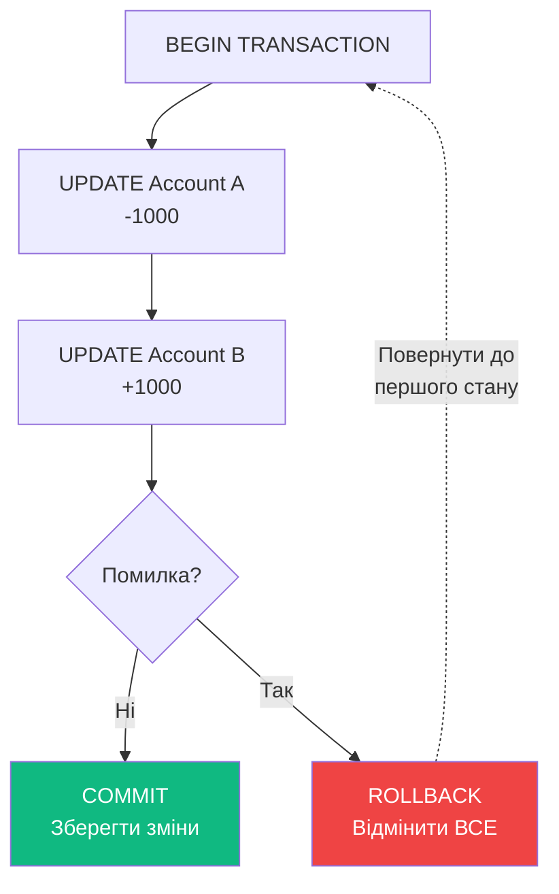
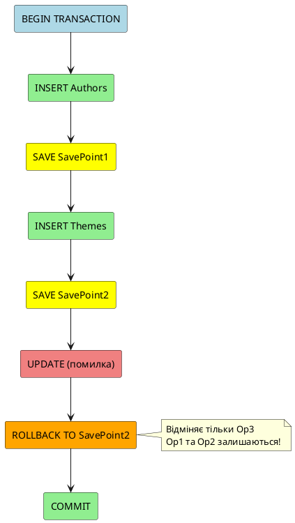
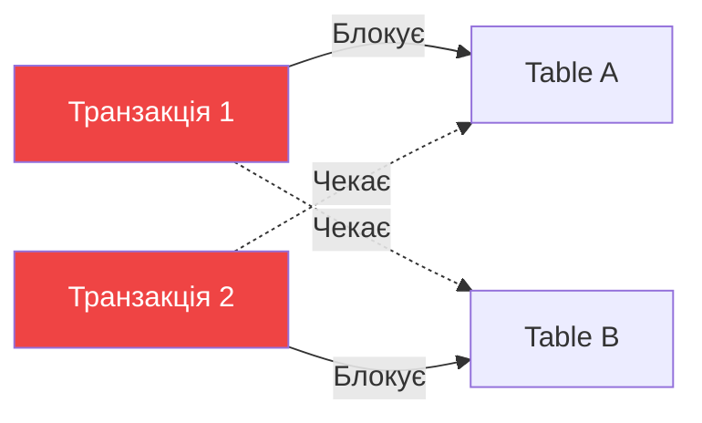

# Транзакції

## Проблема: Як забезпечити цілісність при кількох операціях?

Уявіть переказ грошей між банківськими рахунками:

```sql
-- Крок 1: Зняти гроші з рахунку А
UPDATE Accounts SET Balance = Balance - 1000 WHERE Id = 1;

-- 💥 ОЙ! Сервер впав тут...

-- Крок 2: Додати гроші на рахунок Б (НЕ ВИКОНАВСЯ!)
UPDATE Accounts SET Balance = Balance + 1000 WHERE Id = 2;
```

**Проблема**: Гроші зникли! Зняли з рахунку А, але не додали на рахунок Б.

**Розв'язок**: Використати ТРАНЗАКЦІЮ!

```sql
BEGIN TRANSACTION;

    -- Крок 1
    UPDATE Accounts SET Balance = Balance - 1000 WHERE Id = 1;
    
    -- Крок 2
    UPDATE Accounts SET Balance = Balance + 1000 WHERE Id = 2;

COMMIT TRANSACTION;  -- АБО обидва кроки, АБО жоден!
```

::mermaid



::

**Транзакція** — це група послідовних операцій, які логічно виконуються як **одне ціле**. Або виконуються **всі**, або **жодна**.

---

## ACID Властивості

Кожна транзакція повинна мати **4 властивості** (ACID):

::card-group
::card{icon="i-lucide-atom" title="Atomicity (Атомарність)"}
**"Все або нічого"**

Або виконалися ВСІ операції транзакції, або ЖОДНА. Часткове виконання неможливе.

```sql
BEGIN TRAN;
  INSERT INTO Orders (...);  -- Виконано
  -- 💥 Помилка тут!
  UPDATE Stock ...;          -- НЕ виконано
ROLLBACK;  -- ВСЕ відмінено!
```
::

::card{icon="i-lucide-check-circle" title="Consistency (Узгодженість)"}
**"Дані завжди валідні"**

Транзакція переводить БД з одного **валідного стану** в інший **валідний стан**. Правила цілісності (constraints) дотримуються.

```sql
-- Було: A=1000, B=500
BEGIN TRAN;
  UPDATE ... A-500;  -- A=500
  UPDATE ... B+500;  -- B=1000
COMMIT;
-- Стало: A=500, B=1000
-- Сума: 1500 = 1500 ✅
```
::

::card{icon="i-lucide-shield" title="Isolation (Ізольованість)"}
**"Не заважати іншим"**

Паралельні транзакції не конфліктують між собою. Кожна транзакція "бачить" тільки свої зміни до COMMIT.

```sql
-- Транзакція 1
BEGIN TRAN;
  UPDATE Products SET Price=100 WHERE Id=1;
  -- Інші НЕ бачать зміни!
COMMIT;  -- Тепер всі бачать
```
::

::card{icon="i-lucide-database" title="Durability (Довгочасність)"}
**"Назавжди збережено"**

Після COMMIT зміни **гарантовано** збережені, навіть якщо сервер впаде.

```sql
COMMIT TRANSACTION;
-- 💥 Сервер впав!
-- Після перезавантаження дані НА МІСЦІ ✅
```
::
::

---

## Типи транзакцій ў MS SQL Server

### 1. Явні транзакції (Explicit)

Ви **явно** вказуєте початок і кінець транзакції.

```sql
BEGIN TRANSACTION;  -- або BEGIN TRAN

    INSERT INTO book.Books (...);
    UPDATE book.Authors SET ...;
    DELETE FROM book.Themes WHERE ...;

COMMIT TRANSACTION;  -- або COMMIT
-- АБО
ROLLBACK TRANSACTION;  -- або ROLLBACK
```

**Команди**:
- `BEGIN TRANSACTION [name]` — почати транзакцію
- `COMMIT [TRANSACTION] [name]` — зберегти зміни
- `ROLLBACK [TRANSACTION] [name]` — відмінити зміни
- `SAVE TRANSACTION savepoint_name` — створити точку збереження

### 2. Не явні транзакції (Implicit)

Транзакція автоматично **починається** при виконанні DML/DDL, але **вручну завершується**.

```sql
SET IMPLICIT_TRANSACTIONS ON;

-- Транзакція автоматично починається
INSERT INTO Books (...);

-- Треба вручну завершити!
COMMIT;
```

::warning
**Не рекомендовано**: Легко забути COMMIT → дані заблоковані!
::

### 3. Автоматичні транзакції (Autocommit)

За замовчуванням кожна команда — це окрема транзакція.

```sql
INSERT INTO Books (...);  -- Автоматично: BEGIN + COMMIT

UPDATE Authors ...;  -- Ще одна автоматична транзакція
```

**Режим за замовчуванням** в SQL Server.

---

## Практичні приклади

### Приклад 1: Базова транзакція

```sql
BEGIN TRANSACTION;

    -- 1. Додаємо нову тематику
    INSERT INTO book.Themes (NameTheme)
    VALUES ('Штучний інтелект');
    
    -- 2. Оновлюємо автора
    UPDATE book.Authors
    SET CountryId = (SELECT Id FROM global.Country WHERE NameCountry = 'Україна');

COMMIT TRANSACTION;
```

### Приклад 2: Обробка помилок через TRY...CATCH

```sql
BEGIN TRY
    BEGIN TRANSACTION;
    
        INSERT INTO sale.Sales (BookId, Quantity, Price)
        VALUES (1, 2, 299.99);
        
        UPDATE book.Books
        SET QuantityInStock = QuantityInStock - 2
        WHERE Id = 1;
    
    COMMIT TRANSACTION;
    PRINT 'Транзакція успішно завершена';
    
END TRY
BEGIN CATCH
    ROLLBACK TRANSACTION;
    
    PRINT 'Помілка: ' + ERROR_MESSAGE();
    PRINT 'Номер помилки: ' + CAST(ERROR_NUMBER() AS NVARCHAR);
    PRINT 'Рядок помилки: ' + CAST(ERROR_LINE() AS NVARCHAR);
END CATCH;
```

**Функції обробки помилок**:
- `ERROR_NUMBER()` — номер помилки
- `ERROR_MESSAGE()` — текст помилки
- `ERROR_LINE()` — рядок, де сталася помилка
- `ERROR_SEVERITY()` — рівень серйозності помилки
- `ERROR_STATE()` — стан помилки

### Приклад 3: Точки збереження (Savepoints)

Дозволяють відмінити **частину** транзакції, а не всю.

```sql
BEGIN TRANSACTION;

    -- Крок 1
    INSERT INTO book.Authors (FirstName, LastName) VALUES ('Іван', 'Франко');
    SAVE TRANSACTION SavePoint1;  -- Точка збереження 1
    
    -- Крок 2
    INSERT INTO book.Themes (NameTheme) VALUES ('Поезія');
    SAVE TRANSACTION SavePoint2;  -- Точка збереження 2
    
    -- Крок 3
    UPDATE book.Authors SET CountryId = NULL;  -- Помилка!
    
    -- Відміна тільки до точки 2
    ROLLBACK TRANSACTION SavePoint2;
    
    -- Крок 1 та 2 залишаються!
COMMIT TRANSACTION;
```

::plant-uml



::

### Приклад 4: Вкладені транзакції

```sql
BEGIN TRANSACTION OuterTran;  -- Зовнішня транзакція
    PRINT 'Зовнішня транзакція почалася';
    
    INSERT INTO book.Authors (...);
    
    BEGIN TRANSACTION InnerTran;  -- Внутрішня
        PRINT 'Внутрішня транзакція почалася';
        
        INSERT INTO book.Books (...);
        
    COMMIT TRANSACTION InnerTran;
    
COMMIT TRANSACTION OuterTran;

-- Перевірка рівня вкладеності
SELECT @@TRANCOUNT AS TransactionLevel;
```

::note
**Важливо про вкладені транзакції**:

- `@@TRANCOUNT` — поточний рівень вкладеності (0 = немає транзакцій)
- `COMMIT` зменшує `@@TRANCOUNT` на 1
- `ROLLBACK` (без імені) обнуляє `@@TRANCOUNT` і відміняє ВСЕ!
- Реальний COMMIT відбувається тільки коли `@@TRANCOUNT` стає 0
::

---

## Системні змінні

### @@TRANCOUNT

Кількість активних транзакцій (рівень вкладеності).

```sql
SELECT @@TRANCOUNT;  -- 0 (немає транзакцій)

BEGIN TRAN;
SELECT @@TRANCOUNT;  -- 1

  BEGIN TRAN;
  SELECT @@TRANCOUNT;  -- 2
  
  COMMIT;
SELECT @@TRANCOUNT;  -- 1

COMMIT;
SELECT @@TRANCOUNT;  -- 0
```

### @@ERROR

Номер останньої помилки (0 = немає помилки).

```sql
INSERT INTO Books (Id, Title) VALUES (1, 'Test');

IF @@ERROR <> 0
BEGIN
    PRINT 'Помилка при вставці!';
    ROLLBACK;
END
ELSE
BEGIN
    COMMIT;
END
```

::tip
**Best Practice**: Замість `@@ERROR` використовуйте **TRY...CATCH** для обробки помилок!
::

---

## Рівні ізоляції транзакцій

Рівень ізоляції визначає **як транзакції впливають одна на одну**.

| Рівень                 | Dirty Read | Non-Repeatable Read | Phantom Read |
| :--------------------- | :--------- | :------------------ | :----------- |
| READ UNCOMMITTED       | ✅ Можливо | ✅ Можливо          | ✅ Можливо   |
| READ COMMITTED (за замовч.) | ❌ Ні | ✅ Можливо          | ✅ Можливо   |
| REPEATABLE READ        | ❌ Ні      | ❌ Ні               | ✅ Можливо   |
| SERIALIZABLE           | ❌ Ні      | ❌ Ні               | ❌ Ні        |

**Встановлення рівня**:

```sql
SET TRANSACTION ISOLATION LEVEL READ COMMITTED;

BEGIN TRANSACTION;
    SELECT * FROM Books;
COMMIT;
```

::note
**Terminology**:
- **Dirty Read** — Читання незафіксованих даних іншої транзакції
- **Non-Repeatable Read** — При повторному читанні дані змінилися
- **Phantom Read** — При повторному читанні з'явилися/зникли рядки
::

---

## Deadlock (Взаємне блокування)

Дві транзакції чекають одна на одну → **глухий кут**.

::mermaid



::

**Приклад**:

```sql
-- Транзакція 1
BEGIN TRAN;
  UPDATE Books SET Price=100 WHERE Id=1;  -- Блокує Books
  -- Чекає Themes...
  UPDATE Themes SET ...;  -- Themes заблокована Транзакцією 2!
COMMIT;

-- Транзакція 2 (одночасно)
BEGIN TRAN;
  UPDATE Themes SET ...;  -- Блокує Themes
  -- Чекає Books...
  UPDATE Books SET ...;  -- Books заблокована Транзакцією 1!
COMMIT;

-- 💥 DEADLOCK!
```

**SQL Server автоматично**:
1. Виявляє deadlock
2. Вибирає "жертву" (транзакцію з меншою кількістю змін)
3. Відміняє цю транзакцію (ROLLBACK)

**Як уникнути**:
- Завжди блокувати таблиці в **однаковому порядку**
- Тримати транзакції **короткими**
- Використовувати відповідний рівень ізоляції

---

## Практичні завдання

::accordion

::accordion-item{label="Завдання 1: Транзакція з перевіркою" icon="i-lucide-check-square"}

**Умова**: Створіть транзакцію для оновлення ціни книги з перевіркою (ціна > 0).

<details>
<summary>💡 Розв'язок</summary>

```sql
BEGIN TRY
    BEGIN TRANSACTION;
    
    DECLARE @newPrice DECIMAL(10,2) = 299.99;
    
    IF @newPrice <= 0
    BEGIN
        RAISERROR('Ціна повинна бути більша за 0', 16, 1);
    END
    
    UPDATE book.Books
    SET Price = @newPrice
    WHERE Id = 1;
    
    COMMIT TRANSACTION;
    PRINT 'Ціну оновлено успішно';
    
END TRY
BEGIN CATCH
    ROLLBACK TRANSACTION;
    PRINT 'Помилка: ' + ERROR_MESSAGE();
END CATCH;
```

</details>

::

::accordion-item{label="Завдання 2: Точки збереження" icon="i-lucide-bookmark"}

**Умова**: Використайте точки збереження для часткового відміни транзакції.

<details>
<summary>💡 Розв'язок</summary>

```sql
BEGIN TRANSACTION;

    INSERT INTO book.Authors (FirstName, LastName) VALUES ('Тарас', 'Шевченко');
    PRINT 'Автор доданий';
    SAVE TRANSACTION AuthorAdded;
    
    INSERT INTO book.Themes (NameTheme) VALUES ('Класика');
    PRINT 'Тематика додана';
    SAVE TRANSACTION ThemeAdded;
    
    -- Спроба додати книгу (можлива помилка)
    BEGIN TRY
        INSERT INTO book.Books (AuthorId, ThemeId, Title) VALUES (999, 1, 'Test');
    END TRY
    BEGIN CATCH
        PRINT 'Помилка додавання книги, відміна до ThemeAdded';
        ROLLBACK TRANSACTION ThemeAdded;
    END CATCH;

COMMIT TRANSACTION;
```

</details>

::

::

---

## Резюме

::tip
**Ключові моменти транзакцій**:

1. **ACID**: Atomicity, Consistency, Isolation, Durability
2. **BEGIN TRAN**: Почати транзакцію
3. **COMMIT**: Зберегти зміни
4. **ROLLBACK**: Відмінити зміни
5. **SAVE TRANSACTION**: Точка збереження
6. **TRY...CATCH**: Обробка помилок
7. **@@TRANCOUNT**: Рівень вкладеності
8. **Рівні ізоляції**: READ COMMITTED за замовчуванням

**Best Practices**:
- Тримайте транзакції короткими
- Завжди обробляйте помилки через TRY...CATCH
- Уникайте deadlock через однаковий порядок блокування
- Використовуйте SAVE TRANSACTION для складної логіки
- Перевіряйте @@TRANCOUNT перед COMMIT

**Наступний крок**: Вивчіть [Transact-SQL розширення](03.transact-sql-extensions.md) для написання складнішої логіки в транзакціях.
::
