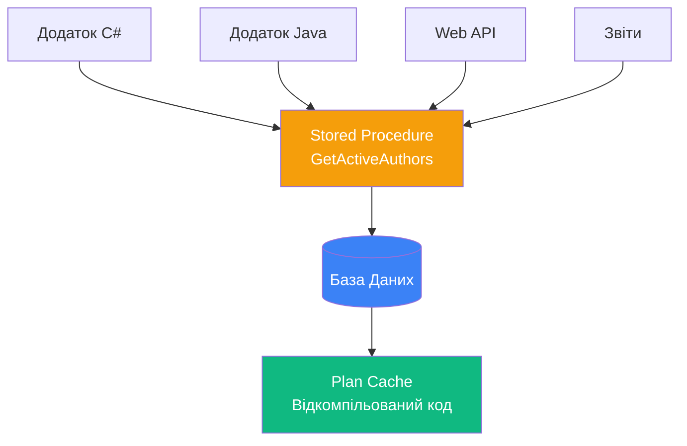

# Зберігаємі процедури

## Проблема: Як повторно використовувати SQL-код?

Уявіть, що вам потрібно виконувати одну і ту ж послідовність SQL-команд у різних місцях додатку:

```sql
-- В 10+ місцях коду треба писати:
SELECT a.FirstName + ' ' + a.LastName AS AuthorName,
       COUNT(b.Id) AS BookCount
FROM book.Authors a
LEFT JOIN book.Books b ON a.Id = b.AuthorId
GROUP BY a.FirstName, a.LastName
HAVING COUNT(b.Id) > 5
ORDER BY BookCount DESC;
```

**Проблеми**:
- Копіювання коду → важко підтримувати
- Зміна логіки → треба міняти в 10+ місцях
- Помилки → розмножуються скрізь
- Складність → важко читати

**Розв'язок**: Створити зберігаєму процедуру!

```sql
-- Створюємо ОДИН РАЗ
CREATE PROCEDURE GetActiveAuthors
AS
BEGIN
    SELECT a.FirstName + ' ' + a.LastName AS AuthorName,
           COUNT(b.Id) AS BookCount
    FROM book.Authors a
    LEFT JOIN book.Books b ON a.Id = b.AuthorId
    GROUP BY a.FirstName, a.LastName
    HAVING COUNT(b.Id) > 5
    ORDER BY BookCount DESC;
END;
GO

-- Викликаємо СКРІЗЬ однаково
EXEC GetActiveAuthors;
```

::mermaid



::

**Зберігаєма процедура (Stored Procedure)** — це іменований набір SQL-команд, збережений в базі даних у відкомпільованому вигляді.

---

## Переваги зберігаємих процедур

::card-group
::card{icon="i-lucide-zap" title="Продуктивність"}
- Код компілюється **один раз** при першому виклику
- План виконання зберігається в **кеші**
- Наступні виклики використовують готовий план

**Результат**: Швидше ніж динамічний SQL!
::

::card{icon="i-lucide-recycle" title="Повторне використання"}
- Пишемо логіку **один раз**
- Викликаємо з будь-якого місця
- Змінили в одному місці → працює скрізь

**Результат**: Менше дублювання коду!
::

::card{icon="i-lucide-shield" title="Безпека"}
- Користувачі викликають процедуру без прямого доступу до таблиць
- Захист від SQL Injection
- Контроль прав через `GRANT EXECUTE`

**Результат**: Вищий рівень безпеки!
::

::card{icon="i-lucide-package" title="Інкапсуляція"}
- Бізнес-логіка в БД, а не в додатку
- Незалежність від мови програмування
- Єдина точка зміни логіки

**Результат**: Легше підтримувати!
::
::

---

## Базовий синтаксис CREATE PROCEDURE

```sql
CREATE PROCEDURE [schema.]procedure_name
    [;number]  -- Номер групи процедур
    [@parameter [schema.]data_type
        [ = default_value | DEFAULT ]
        [OUTPUT]
        [READONLY]
    ] [, ...n]
    [WITH {
        [ENCRYPTION]
        [RECOMPILE]
        [EXECUTE AS {CALLER | SELF | OWNER | 'user_name'}]
    }]
AS
BEGIN
    -- Тіло процедури (T-SQL команди)
END;
GO
```

**Анатомія**:
- `procedure_name` — ім'я процедури (рекомендація: `sp_<Domain>_<Action>`, наприклад `sp_Books_GetBestsellers`)
- `@parameter` — вхідні/вихідні параметри
- `OUTPUT` — параметр, який повертає значення
- `READONLY` — параметр тільки для читання (для табличних типів)
- `WITH ENCRYPTION` — шифрування коду процедури
- `WITH RECOMPILE` — перекомп компілювати щоразу
- `EXECUTE AS` — контекст безпеки виконання

---

## Виклик процедур

::code-group

```sql [Без параметрів]
EXEC GetAllBooks;
-- або
EXECUTE GetAllBooks;
```

```sql [З вхідними параметрами (позиційно)]
EXEC GetBooksByAuthor 1, 'Fiction';
-- Параметри передаються по порядку
```

```sql [З вхідними параметрами (іменовано)]
EXEC GetBooksByAuthor 
    @authorId = 1,
    @genre = 'Fiction';
-- Явна вказівка параметрів (порядок не важливий)
```

```sql [З вихідними параметрами]
DECLARE @totalBooks INT;
EXEC CalculateTotalBooks 
    @authorId = 1,
    @total = @totalBooks OUTPUT;
    
SELECT @totalBooks AS TotalBooks;
```

```sql [Через RETURN]
DECLARE @result INT;
EXEC @result = CalculateSum 5, 10;

SELECT @result AS Sum;  -- 15
```

::

---

## Практичні приклади

### Приклад 1: Проста процедура без параметрів

**Задача**: Отримати список авторів та кількість їх книг.

```sql
CREATE PROCEDURE sp_Authors_GetStatistics
AS
BEGIN
    SELECT 
        a.FirstName + ' ' + a.LastName AS AuthorName,
        COUNT(b.Id) AS BookCount
    FROM book.Authors a
    LEFT JOIN book.Books b ON a.Id = b.AuthorId
    GROUP BY a.FirstName, a.LastName
    ORDER BY BookCount DESC;
END;
GO

-- Виклик
EXEC sp_Authors_GetStatistics;
```

---

### Приклад 2: Процедура з вхідними параметрами

**Задача**: Отримати книги конкретного автора з можливістю фільтрації за тематикою.

```sql
CREATE PROCEDURE sp_Books_GetByAuthorAndTheme
    @authorId INT,
    @themeName NVARCHAR(100) = NULL  -- Значення за замовчуванням
AS
BEGIN
    SELECT 
        b.NameBook AS Title,
        b.Price,
        t.NameTheme AS Theme
    FROM book.Books b
    INNER JOIN book.Authors a ON b.AuthorId = a.Id
    LEFT JOIN book.Themes t ON b.ThemeId = t.Id
    WHERE a.Id = @authorId
      AND (@themeName IS NULL OR t.NameTheme = @themeName);
END;
GO

-- Виклик без фільтра за тематикою
EXEC sp_Books_GetByAuthorAndTheme @authorId = 1;

-- Виклик з фільтром
EXEC sp_Books_GetByAuthorAndTheme 
    @authorId = 1,
    @themeName = 'Програмування';
```

**Пояснення**:
- `@themeName = NULL` — значення за замовчуванням
- `WHERE (@themeName IS NULL OR ...)` — динамічний фільтр

---

### Приклад 3: Процедура з вихідними параметрами (OUTPUT)

**Задача**: Обчислити суму двох чисел і повернути результат через OUTPUT параметр.

```sql
CREATE PROCEDURE sp_Math_Add
    @a INT,
    @b INT,
    @result INT OUTPUT  -- Вихідний параметр
AS
BEGIN
    SET @result = @a + @b;
END;
GO

-- Виклик
DECLARE @sum INT;
EXEC sp_Math_Add 
    @a = 15,
    @b = 25,
    @result = @sum OUTPUT;  -- ОБОВ'ЯЗКОВО вказати OUTPUT при виклику!

SELECT @sum AS Total;  -- 40
```

::warning
**Важливо**: При виклику процедури з OUTPUT параметрами **обов'язково** вказувати ключове слово `OUTPUT`! Інакше параметр не буде заповнений.
::

---

### Приклад 4: Повернення значення через RETURN

`RETURN` можеповертати тільки **цілочисельне** (INT) значення і зазвичай використовується для кодів помилок (0 = успіх, інше = помилка).

```sql
CREATE PROCEDURE sp_Math_Multiply
    @a INT,
    @b INT
AS
BEGIN
    DECLARE @result INT;
    SET @result = @a * @b;
    RETURN @result;
END;
GO

-- Виклик
DECLARE @product INT;
EXEC @product = sp_Math_Multiply 7, 6;

SELECT @product AS Product;  -- 42
```

::tip
**Best Practice**: 

- **RETURN** — для кодів статусу (0/1, коди помилок)
- **OUTPUT** — для повернення даних (рядки, числа, таблиці)
- **SELECT** — для повернення result sets (таблиць даних)
::

---

### Приклад 5: Складна бізнес-логіка

**Задача**: При додаванні продажу — зменшити кількість книг на складі та перевірити доступність.

```sql
CREATE PROCEDURE sp_Sales_Create
    @bookId INT,
    @quantity INT,
    @price DECIMAL(10,2),
    @statusMessage NVARCHAR(200) OUTPUT
AS
BEGIN
    SET NOCOUNT ON;  -- Не повертати "N rows affected"
    
    DECLARE @availableStock INT;
    
    -- Перевіряємо кількість на складі
    SELECT @availableStock = QuantityInStock
    FROM book.Books
    WHERE Id = @bookId;
    
    -- Валідація
    IF @availableStock IS NULL
    BEGIN
        SET @statusMessage = 'Книга не знайдена';
        RETURN 1;  -- Код помилки
    END
    
    IF @availableStock < @quantity
    BEGIN
        SET @statusMessage = 'Недостатньо книг на складі';
        RETURN 2;  -- Код помилки
    END
    
    BEGIN TRY
        BEGIN TRANSACTION;
        
        -- Додаємо продаж
        INSERT INTO sale.Sales (BookId, Quantity, Price, SaleDate)
        VALUES (@bookId, @quantity, @price, GETDATE());
        
        -- Зменшуємо кількість на складі
        UPDATE book.Books
        SET QuantityInStock = QuantityInStock - @quantity
        WHERE Id = @bookId;
        
        COMMIT TRANSACTION;
        
        SET @statusMessage = 'Продаж успішно створено';
        RETURN 0;  -- Успіх
    END TRY
    BEGIN CATCH
        ROLLBACK TRANSACTION;
        SET @statusMessage = 'Помилка: ' + ERROR_MESSAGE();
        RETURN 99;  -- Загальна помилка
    END CATCH
END;
GO

-- Виклик
DECLARE @message NVARCHAR(200);
DECLARE @resultCode INT;

EXEC @resultCode = sp_Sales_Create 
    @bookId = 1,
    @quantity = 2,
    @price = 499.99,
    @statusMessage = @message OUTPUT;

SELECT 
    @resultCode AS ResultCode,
    @message AS Message;
```

**Пояснення**:
- `SET NOCOUNT ON` — вимикає повідомлення "X rows affected" для чистоти виводу
- `BEGIN TRY...END TRY` — блок з можливою помилкою
- `BEGIN CATCH...END CATCH` — обробка помилки
- `RETURN` коди: 0 = успіх, 1+ = різні типи помилок

---

## Групи процедур (Numbering)

Можна створювати **групи процедур** з однаковим іменем, але різними номерами. Вони видаляються тільки разом.

```sql
CREATE PROCEDURE sp_Authors_Get;1
AS
BEGIN
    -- Перша версія: всі автори
    SELECT * FROM book.Authors;
END;
GO

CREATE PROCEDURE sp_Authors_Get;2
AS
BEGIN
    -- Друга версія: тільки статистика
    SELECT 
        FirstName + ' ' + LastName AS AuthorName,
        COUNT(b.Id) AS BookCount
    FROM book.Authors a
    LEFT JOIN book.Books b ON a.Id = b.AuthorId
    GROUP BY FirstName, LastName;
END;
GO

-- Виклик
EXEC sp_Authors_Get;1;  -- Викликає першу
EXEC sp_Authors_Get;2;  -- Викликає другу
EXEC sp_Authors_Get;    -- Викликає першу (за замовчуванням)
```

::caution
**Не рекомендовано**: Номерування процедур застаріле і буде вилучено в наступних версіях SQL Server. Краще створювати окремі процедури з різними іменами.
::

---

## Опція RECOMPILE

За замовчуванням процедура компілюється при першому виклику, і план виконання зберігається в кеші. Опція `RECOMPILE` змушує SQL Server перекомпілювати процедуру.

::tabs

::tabs-item{label="WITH RECOMPILE (при створенні)"}
Процедура **завжди** перекомпілюється при кожному виклику.

```sql
CREATE PROCEDURE sp_Books_GetByDate
    @startDate DATE
WITH RECOMPILE  -- Завжди перекомпілювати
AS
BEGIN
    SELECT * FROM book.Books
    WHERE PublishDate >= @startDate;
END;
```

**Використання**: Процедури з параметрами, які сильно впливають на план виконання (наприклад, діапазони дат).

::

::tabs-item{label="WITH RECOMPILE (при виклику)"}
Перекомпілювати **тільки цей виклик**.

```sql
EXEC sp_Books_GetByDate 
    @startDate = '2020-01-01'
WITH RECOMPILE;
```

**Використання**: Одноразова перекомпіляція при нетипових параметрах.

::

::

::note
**Коли використовувати RECOMPILE**:
- Параметри значно змінюють кількість рядків у результаті
- Додано новий індекс, який покращує виконання
- Статистика таблиць суттєво змінилася

**Недолік**: Перекомпіляція забирає час CPU.
::

---

## Опція EXECUTE AS

Визначає контекст безпеки, в якому виконується процедура.

| Опція         | Опис                                              |
| :------------ | :------------------------------------------------ |
| `CALLER`      | За замовчуванням. Виконання від імені викликача   |
| `SELF`        | Виконання від імені створювача процедури          |
| `OWNER`       | Виконання від імені власника процедури            |
| `'user_name'` | Виконання від імені конкретного користувача       |

```sql
CREATE PROCEDURE sp_Admin_GetSensitiveData
WITH EXECUTE AS OWNER  -- Виконати з правами власника
AS
BEGIN
    SELECT * FROM SensitiveData;
END;
```

**Use Case**: Надати доступ до даних через процедуру, не даючи прямих прав на таблицю.

---

## Управління процедурами

### Зміна процедури (ALTER PROCEDURE)

```sql
ALTER PROCEDURE sp_Authors_GetStatistics
AS
BEGIN
    -- Оновлений код
    SELECT 
        FirstName + ' ' + LastName AS AuthorName,
        COUNT(b.Id) AS BookCount,
        AVG(b.Price) AS AvgPrice  -- Додали нове поле
    FROM book.Authors a
    LEFT JOIN book.Books b ON a.Id = b.AuthorId
    GROUP BY FirstName, LastName;
END;
```

::tip
**Best Practice**: Використовуйте `ALTER PROCEDURE` замість `DROP + CREATE`:
- Зберігаються права доступу (GRANT)
- Зберігається історія змін в контролі версій
::

### Видалення процедури

```sql
DROP PROCEDURE sp_Authors_GetStatistics;

-- Видалити кілька відразу
DROP PROCEDURE sp_Proc1, sp_Proc2, sp_Proc3;
```

### Перегляд коду процедури

```sql
-- Через системну процедуру
EXEC sp_helptext 'sp_Authors_GetStatistics';

-- Через системне представлення
SELECT m.definition
FROM sys.sql_modules m
INNER JOIN sys.procedures p ON m.object_id = p.object_id
WHERE p.name = 'sp_Authors_GetStatistics';
```

### Перегляд залежностей

```sql
EXEC sp_depends 'sp_Authors_GetStatistics';
```

---

## Системні процедури

SQL Server містить сотні вбудованих **системних зберігаємих процедур** (з префіксом `sp_`):

| Процедура           | Опис                                |
| :------------------ | :---------------------------------- |
| `sp_helptext`       | Отримати код процедури/тригера      |
| `sp_depends`        | Показати залежності об'єкта         |
| `sp_help`           | Інформація про об'єкт БД            |
| `sp_who`            | Активні з'єднання                   |
| `sp_recompile`      | Відмітити процедуру для перекомпіляції |
| `sp_addmessage`     | Додати користувацьке повідомлення   |
| `sp_dropmessage`    | Видалити користувацьке повідомлення |

::warning
**НЕ використовуйте префікс `sp_` для власних процедур**!

SQL Server спершу шукає `sp_` процедури в базі `master`, що уповільнює виконання.

Використовуйте інші префікси: `usp_`, `proc_`, або `sp<Domain>_`.
::

---

## Метадані процедур

```sql
-- Список всіх процедур
SELECT 
    name AS ProcedureName,
    create_date AS Created,
    modify_date AS Modified
FROM sys.procedures
ORDER BY name;

-- Параметри процедури
SELECT 
    p.name AS ParameterName,
    TYPE_NAME(p.user_type_id) AS DataType,
    p.max_length AS MaxLength,
    p.is_output AS IsOutput
FROM sys.parameters p
INNER JOIN sys.procedures pr ON p.object_id = pr.object_id
WHERE pr.name = 'sp_Sales_Create'
ORDER BY p.parameter_id;
```

---

## Практичні завдання

::accordion

::accordion-item{label="Завдання 1: Процедура додавання автора" icon="i-lucide-user-plus"}

**Умова**: Створіть процедуру для додавання нового автора з вихідним параметром ID.

<details>
<summary>💡 Розв'язок</summary>

```sql
CREATE PROCEDURE sp_Authors_Add
    @firstName NVARCHAR(50),
    @lastName NVARCHAR(50),
    @countryId INT,
    @newAuthorId INT OUTPUT
AS
BEGIN
    INSERT INTO book.Authors (FirstName, LastName, CountryId)
    VALUES (@firstName, @lastName, @countryId);
    
    SET @newAuthorId = SCOPE_IDENTITY();  -- ID щойно доданого запису
    
    RETURN 0;
END;
GO

-- Виклик
DECLARE @authorId INT;
EXEC sp_Authors_Add 
    @firstName = 'Іван',
    @lastName = 'Франко',
    @countryId = 1,
    @newAuthorId = @authorId OUTPUT;

SELECT @authorId AS NewAuthorID;
```

</details>

::

::accordion-item{label="Завдання 2: Валідація та повернення кодів помилок" icon="i-lucide-alert-circle"}

**Умова**: Створіть процедуру оновлення ціни книги з валідацією (ціна > 0).

<details>
<summary>💡 Розв'язок</summary>

```sql
CREATE PROCEDURE sp_Books_UpdatePrice
    @bookId INT,
    @newPrice DECIMAL(10,2)
AS
BEGIN
    -- Валідація вхідних даних
    IF @newPrice <= 0
    BEGIN
        RAISERROR('Ціна повинна бути більша за 0', 16, 1);
        RETURN 1;
    END
    
    IF NOT EXISTS (SELECT 1 FROM book.Books WHERE Id = @bookId)
    BEGIN
        RAISERROR('Книга з таким ID не знайдена', 16, 1);
        RETURN 2;
    END
    
    -- Оновлення
    UPDATE book.Books
    SET Price = @newPrice
    WHERE Id = @bookId;
    
    RETURN 0;  -- Успіх
END;
GO

-- Виклик
DECLARE @result INT;
EXEC @result = sp_Books_UpdatePrice @bookId = 1, @newPrice = 299.99;

IF @result = 0
    PRINT 'Ціну оновлено успішно';
ELSE
    PRINT 'Помилка оновлення ціни';
```

</details>

::

::

---

## Резюме

::tip
**Ключові моменти зберігаємих процедур**:

1. **Інкапсуляція**: Логіка в БД, не в додатку
2. **Продуктивність**: План виконання кешується
3. **Параметри**: Вхідні (INPUT) та вихідні (OUTPUT)
4. **RETURN**: Цілочисельне значення (коди статусу)
5. **Безпека**: EXECUTE AS для контролю прав
6. **RECOMPILE**: Перекомпіляція при зміні статистики
7. **Префікс**: НЕ використовуйте `sp_` для власних процедур
8. **ALTER vs DROP+CREATE**: ALTER зберігає права

**Best Practices**:
- Використовуйте осмислені назви
- Додавайте коментарі до складної логіки
- Обробляйте помилки через TRY...CATCH
- Валідуйте вхідні параметри
- Повертайте статус через RETURN
- Документуйте параметри та результати

**Наступний крок**: Вивчіть [Транзакції](04.transactions.md) для забезпечення цілісності при виконанні процедур.
::
