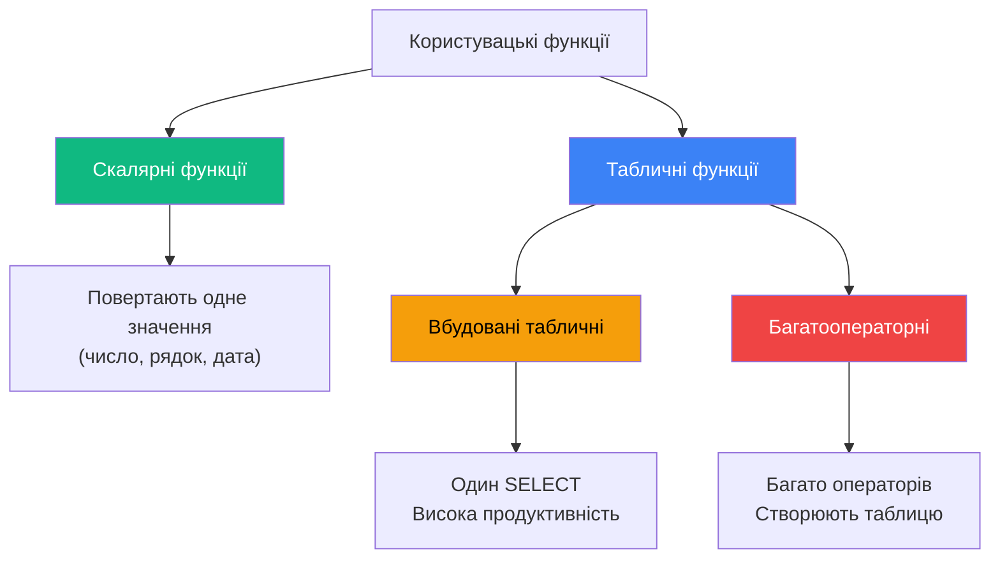

# Користувацькі функції

## Проблема: Як створити власну логіку обчислень?

SQL Server має багатовбудованих функцій: `GETDATE()`, `LEN()`, `SUBSTRING()` тощо. Але що робити, якщо потрібна **своя логіка**?

**Приклад**: Потрібно перетворювати англійські назви днів тижня на українські:

```sql
-- Без функції — копіювати CASE скрізь 😫
SELECT 
    *,
    CASE DATENAME(dw, OrderDate)
        WHEN 'Monday' THEN 'Понеділок'
        WHEN 'Tuesday' THEN 'Вівторок'
        WHEN 'Wednesday' THEN 'Середа'
        WHEN 'Thursday' THEN 'Четвер'
        WHEN 'Friday' THEN 'П''ятниця'
        WHEN 'Saturday' THEN 'Субота'
        WHEN 'Sunday' THEN 'Неділя'
    END AS DayNameUA
FROM Orders;
```

**З функцією — викликати ОДИН РАЗ** ✨:

```sql
CREATE FUNCTION dbo.GetUkrainianDayName(@date DATETIME)
RETURNS NVARCHAR(15)
AS
BEGIN
    RETURN CASE DATENAME(dw, @date)
        WHEN 'Monday' THEN 'Понеділок'
        WHEN 'Tuesday' THEN 'Вівторок'
        WHEN 'Wednesday' THEN 'Середа'
        WHEN 'Thursday' THEN 'Четвер'
        WHEN 'Friday' THEN 'П''ятниця'
        WHEN 'Saturday' THEN 'Субота'
        WHEN 'Sunday' THEN 'Неділя'
    END;
END;
GO

-- Використання
SELECT *, dbo.GetUkrainianDayName(OrderDate) AS DayNameUA
FROM Orders;
```

**Користувацька функція (User-Defined Function, UDF)** — це іменований блок коду, який приймає параметри, виконує обчислення та **повертає значення**.

---

## Типи користувацьких функцій

::mermaid



::

### 1. Скалярні функції (Scalar Functions)

Повертають **одне скалярне значення**: число, рядок, дату тощо.

### 2. Вбудовані табличні функції (Inline Table-Valued Functions)

Повертають **таблицю** результатом **одного SELECT**.

### 3. Багатооператорні функції (Multi-Statement Table-Valued Functions)

Повертають **таблицю**, створену **кількома операторами**.

---

## 1. Скалярні функції

### Синтаксис

```sql
CREATE FUNCTION [schema.]function_name
(
    [@parameter [schema.]data_type [ = default | DEFAULT ] [READONLY]]
    [, ...n]
)
RETURNS return_data_type
[WITH {
    [ENCRYPTION]
    [SCHEMABINDING]
    [RETURNS NULL ON NULL INPUT | CALLED ON NULL INPUT]
    [EXECUTE AS {CALLER | SELF | OWNER | 'user_name'}]
}]
AS
BEGIN
    -- Тіло функції
    RETURN scalar_value;
END;
```

**Анатомія**:
- `RETURNS return_data_type` — тип даних, який повертається
- `RETURN` — обов'язковий оператор повернення значення
- **НЕ можна** використовувати `TIMESTAMP`, `CURSOR`, `TABLE` як тип повернення

### Приклад 1: Функція перетворення дня тижня

```sql
CREATE FUNCTION dbo.GetUkrainianDayName(@date DATETIME)
RETURNS NVARCHAR(15)
AS
BEGIN
    DECLARE @dayName NVARCHAR(15);
    
    SET @dayName = CASE DATENAME(dw, @date)
        WHEN 'Monday' THEN 'Понеділок'
        WHEN 'Tuesday' THEN 'Вівторок'
        WHEN 'Wednesday' THEN 'Середа'
        WHEN 'Thursday' THEN 'Четвер'
        WHEN 'Friday' THEN 'П''ятниця'
        WHEN 'Saturday' THEN 'Субота'
        WHEN 'Sunday' THEN 'Неділя'
        ELSE 'Невідомо'
    END;
    
    RETURN @dayName;
END;
GO

-- Виклик
SELECT dbo.GetUkrainianDayName(GETDATE()) AS TodayUA;
-- Результат: "Четвер" (якщо сьогодні четвер)
```

### Виклик скалярних функцій

::code-group

```sql [Через SELECT]
SELECT dbo.GetUkrainianDayName('2026-02-10') AS DayName;
```

```sql [Через EXEC (в змінну)]
DECLARE @dayName NVARCHAR(15);
EXEC @dayName = dbo.GetUkrainianDayName '2026-02-10';
SELECT @dayName;
```

```sql [У виразах]
SELECT 
    OrderId,
    OrderDate,
    'Замовлення створено в ' + dbo.GetUkrainianDayName(OrderDate) AS Info
FROM Orders;
```

::

### Приклад 2: Обчислення знижки

```sql
CREATE FUNCTION dbo.CalculateDiscount
(
    @price DECIMAL(10,2),
    @discountPercent INT = 0  -- Значення за замовчуванням
)
RETURNS DECIMAL(10,2)
AS
BEGIN
    DECLARE @discountedPrice DECIMAL(10,2);
    
    IF @discountPercent < 0
        SET @discountPercent = 0;
    IF @discountPercent > 100
        SET @discountPercent = 100;
    
    SET @discountedPrice = @price * (1 - @discountPercent / 100.0);
    
    RETURN @discountedPrice;
END;
GO

-- Використання
SELECT 
    Title,
    Price AS OriginalPrice,
    dbo.CalculateDiscount(Price, 15) AS PriceWith15Discount,
    dbo.CalculateDiscount(Price, 30) AS PriceWith30Discount
FROM book.Books;
```

---

## 2. Вбудовані табличні функції (Inline TVF)

Повертають таблицю результатом **одного SELECT**. Дуже схожі на представлення (VIEW), але можуть приймати параметри!

### Синтаксис

```sql
CREATE FUNCTION [schema.]function_name
(
    [@parameter data_type [ = default | DEFAULT ] [READONLY]]
    [, ...n]
)
RETURNS TABLE
[WITH {ENCRYPTION | SCHEMABINDING | ...}]
AS
RETURN
(
    -- Один оператор SELECT
    SELECT ...
);
```

**Особливості**:
- **Тільки один SELECT**
- **Високана продуктивність** (план виконання оптимізується як для представлення)
- Імена стовпців визначаються псевдонімами в SELECT

### Приклад 1: Книги автора з можливістю фільтрації

```sql
CREATE FUNCTION dbo.GetBooksByAuthor(@authorId INT)
RETURNS TABLE
AS
RETURN
(
    SELECT 
        b.Id,
        b.NameBook AS Title,
        b.Price,
        t.NameTheme AS Theme,
        b.DateOfPublish AS PublishDate
    FROM book.Books b
    LEFT JOIN book.Themes t ON b.ThemeId = t.Id
    WHERE b.AuthorId = @authorId
);
GO

-- Виклик
SELECT * FROM dbo.GetBooksByAuthor(1);

-- Можна JOINИТИ з іншими таблицями!
SELECT 
    a.FirstName + ' ' + a.LastName AS Author,
    f.Title,
    f.Price
FROM book.Authors a
CROSS APPLY dbo.GetBooksByAuthor(a.Id) f
ORDER BY a.LastName, f.Title;
```

**Перевага**: Функція може використовуватись в `FROM`, `JOIN`, `CROSS APPLY`, `OUTER APPLY`!

::tip
**Inline TVF vs VIEW**:

| Характеристика | VIEW                  | Inline TVF                   |
| :------------- | :-------------------- | :--------------------------- |
| Параметри      | ❌ Не підтримує       | ✅ Підтримує                 |
| Продуктивність | Висока                | Висока (аналогічно VIEW)     |
| Використання   | `SELECT * FROM View`  | `SELECT * FROM Function(@p)` |

**Рекомендація**: Якщо потрібні параметри — використовуйте Inline TVF замість VIEW!
::

### Приклад 2: Топ книг за ціною

```sql
CREATE FUNCTION dbo.GetTopExpensiveBooks(@topN INT = 10)
RETURNS TABLE
AS
RETURN
(
    SELECT TOP (@topN)
        Id,
        NameBook AS Title,
        Price,
        DateOfPublish
    FROM book.Books
    ORDER BY Price DESC
);
GO

-- Виклик
SELECT * FROM dbo.GetTopExpensiveBooks(5);  -- Топ 5
SELECT * FROM dbo.GetTopExpensiveBooks(DEFAULT);  -- Топ 10 (за замовчуванням)
```

---

## 3. Багатооператорні табличні функції (Multi-Statement TVF)

Повертають таблицю, створену **кількома операторами**. Дозволяє виконувати складну логіку.

### Синтаксис

```sql
CREATE FUNCTION [schema.]function_name
(
    [@parameter data_type [ = default | DEFAULT ] [READONLY]]
    [, ...n]
)
RETURNS @return_table TABLE (column_definition [, ...n])
[WITH {ENCRYPTION | SCHEMABINDING | ...}]
AS
BEGIN
    -- Багато операторів
    -- Створення тимчасових таблиць
    -- INSERT в @return_table
    
    RETURN;  -- Повертає @return_table (БЕЗ аргументів!)
END;
```

**Особливості**:
- Явне визначення структури таблиці що повертається
- Можна виконувати багато операторів
- Створювати тимчасові таблиці
- **Гірша продуктивність** ніж Inline TVF

### Приклад 1: Магазини з найбільшою кількістю продажів

**Задача**: Повернути магазини, які продали найбільше книг. Логіка складна — потрібно два етапи:
1. Підрахувати продажі по магазинах
2. Знайти максимум

```sql
CREATE FUNCTION dbo.GetBestShops()
RETURNS @result TABLE
(
    ShopName NVARCHAR(100) NOT NULL,
    TotalBooksSold INT NOT NULL
)
AS
BEGIN
    -- Крок 1: Створюємо тимчасову таблицю для проміжних даних
    DECLARE @tempSales TABLE
    (
        ShopId INT,
        BooksSold INT
    );
    
    INSERT INTO @tempSales
    SELECT 
        s.ShopId,
        COUNT(s.Id) AS BooksSold
    FROM sale.Sales s
    GROUP BY s.ShopId;
    
    -- Крок 2: Знаходимо максимальну кількість
    DECLARE @maxSales INT;
    SELECT @maxSales = MAX(BooksSold) FROM @tempSales;
    
    -- Крок 3: Заповнюємо результуючу таблицю
    INSERT INTO @result
    SELECT 
        sh.NameShop,
        ts.BooksSold
    FROM @tempSales ts
    INNER JOIN sale.Shops sh ON ts.ShopId = sh.Id
    WHERE ts.BooksSold = @maxSales;
    
    RETURN;  -- Повертає @result (без аргументів!)
END;
GO

-- Виклик
SELECT * FROM dbo.GetBestShops();
```

**Пояснення**:
- `RETURNS @result TABLE (...)` — явно створюємо таблицю, яка повертається
- Використовуємо тимчасову таблицю `@tempSales` для проміжних даних
- `RETURN;` — повертає таблицю `@result` (без аргументів!)

::warning
**Продуктивність**: Multi-Statement TVF Matisse **гірше**, ніж Inline TVF!

**Причина**: SQL Server не може оптимізувати план виконання так само ефективно.

**Рекомендація**: Використовуйте Multi-Statement TVF тільки коли Inline TVF неможливо (складна багатоетапна логіка).
::

---

## Детермінізм функцій

**Детермінована функція** — завжди повертає **однаковий результат** при однакових вхідних параметрах.

::tabs

::tabs-item{label="Детерміновані"}
Завжди одинаковий результат:

```sql
-- Детермінована: 2 + 3 = завжди 5
SELECT dbo.Add(2, 3);  -- Завжди 5

-- Детермінована: COS(0) = завжди 1
SELECT COS(0);  -- Завжди 1.0

-- Детермінована: DATEADD додає фіксовану кількість днів
SELECT DATEADD(DAY, 3, '2026-02-10');  -- Завжди 2026-02-13
```

**Використання**:
- ✅ Можна індексувати обчислювані стовпці
- ✅ Можна використовувати в індексованих представленнях

::

::tabs-item{label="Недетерміновані"}
Результат може змінюватись:

```sql
-- Недетермінована: поточна дата змінюється
SELECT GETDATE();

-- Недетермінована: випадкове число
SELECT RAND();

-- Недетермінована: поточний користувач
SELECT CURRENT_USER;
```

**Обмеження**:
- ❌ НЕ можна індексувати обчислювані стовпці
- ❌ НЕ можна використовувати в індексованих представленнях

::

::

::note
**Як SQL Server визначає детермінізм**:

Функція є детермінованою , якщо:
1. Не використовує недетерміновані вбудовані функції (`GETDATE`, `RAND`, `NEWID` тощо)
2. Не звертається до таблиць (крім табличних змінних/параметрів)
3. Позначена `WITH SCHEMABINDING`

Перевірити детермінізм:
```sql
SELECT OBJECTPROPERTY(OBJECT_ID('dbo.GetUkrainianDayName'), 'IsDeterministic');
-- 1 = детермінована, 0 = недетермінована
```
::

---

## Опції функцій

### SCHEMABINDING

**Прив'язка до схеми** — функція "закріплюється" за об'єктами, які використовує. Їх неможливо змінити/видалити без зміни функції.

```sql
CREATE FUNCTION dbo.GetBookCount(@authorId INT)
RETURNS INT
WITH SCHEMABINDING  -- Прив'язка до схеми
AS
BEGIN
    DECLARE @count INT;
    
    -- Тепер таблицю dbo.Books НЕ можна видалити!
    SELECT @count = COUNT(*)
    FROM dbo.Books
    WHERE AuthorId = @authorId;
    
    RETURN @count;
END;
```

**Переваги**:
- Захист від випадкового видалення/зміни таблиць
- Необхідно для детермінованих функцій в індексованих представленнях

### RETURNS NULL ON NULL INPUT

Якщо хоча б один параметр `NULL` → функція автоматично повертає `NULL` (не виконуючи код).

```sql
CREATE FUNCTION dbo.SafeAdd(@a INT, @b INT)
RETURNS INT
WITH RETURNS NULL ON NULL INPUT  -- Якщо @a або @b = NULL → повернути NULL
AS
BEGIN
    RETURN @a + @b;
END;
GO

SELECT dbo.SafeAdd(5, NULL);  -- Результат: NULL (код не виконувався)
```

**Альтернатива**: `CALLED ON NULL INPUT` (за замовчуванням) — виконувати код навіть якщо параметри NULL.

---

## Управління функціями

### Зміна функції

```sql
ALTER FUNCTION dbo.GetUkrainianDayName(@date DATETIME)
RETURNS NVARCHAR(15)
AS
BEGIN
    -- Оновлений код
    RETURN CASE DATENAME(dw, @date)
        WHEN 'Monday' THEN 'Пн'
        WHEN 'Tuesday' THEN 'Вт'
        -- Скорочені назви
    END;
END;
```

### Видалення функції

```sql
DROP FUNCTION dbo.GetUkrainianDayName;

-- Видалити кілька відразу
DROP FUNCTION dbo.Func1, dbo.Func2;
```

### Метадані функцій

```sql
-- Список функцій
SELECT 
   name AS FunctionName,
    type_desc AS FunctionType,  -- SQL_SCALAR_FUNCTION, SQL_TABLE_VALUED_FUNCTION
    create_date AS Created,
    modify_date AS Modified
FROM sys.objects
WHERE type IN ('FN', 'TF', 'IF')  -- FN=Scalar, TF=Multi-Statement TVF, IF=Inline TVF
ORDER BY name;

-- Параметри функції
SELECT 
    p.name AS ParameterName,
    TYPE_NAME(p.user_type_id) AS DataType,
    p.max_length AS MaxLength
FROM sys.parameters p
WHERE object_id = OBJECT_ID('dbo.GetBooksByAuthor');

-- Код функції
EXEC sp_helptext 'dbo.GetUkrainianDayName';
```

---

## Практичні завдання

::accordion

::accordion-item{label="Завдання 1: Скалярна функція — підрахунок віку" icon="i-lucide-calculator"}

**Умова**: Створіть функцію, яка обчислює вік (повних років) за датою народження.

<details>
<summary>💡 Розв'язок</summary>

```sql
CREATE FUNCTION dbo.CalculateAge(@birthDate DATE)
RETURNS INT
AS
BEGIN
    DECLARE @age INT;
    
    SET @age = DATEDIFF(YEAR, @birthDate, GETDATE());
    
    -- Враховуємо чи вже був день народження цього року
    IF (MONTH(@birthDate) > MONTH(GETDATE())) 
       OR (MONTH(@birthDate) = MONTH(GETDATE()) AND DAY(@birthDate) > DAY(GETDATE()))
    BEGIN
        SET @age = @age - 1;
    END
    
    RETURN @age;
END;
GO

-- Використання
SELECT 
    FirstName,
    BirthDate,
    dbo.CalculateAge(BirthDate) AS Age
FROM Students;
```

</details>

::

::accordion-item{label="Завдання 2: Inline TVF — фільтрація книг за ціною" icon="i-lucide-filter"}

**Умова**: Створіть функцію, яка повертає книги в діапазоні цін.

<details>
<summary>💡 Розв'язок</summary>

```sql
CREATE FUNCTION dbo.GetBooksByPriceRange
(
    @minPrice DECIMAL(10,2) = 0,
    @maxPrice DECIMAL(10,2) = 999999.99
)
RETURNS TABLE
AS
RETURN
(
    SELECT 
        Id,
        NameBook AS Title,
        Price,
        DateOfPublish
    FROM book.Books
    WHERE Price BETWEEN @minPrice AND @maxPrice
);
GO

-- Використання
SELECT * FROM dbo.GetBooksByPriceRange(100, 500);
```

</details>

::

::accordion-item{label="Завдання 3: Multi-Statement TVF — топ авторів" icon="i-lucide-trophy"}

**Умова**: Створіть функцію, яка повертає топ N авторів за кількістю книг.

<details>
<summary>💡 Розв'язок</summary>

```sql
CREATE FUNCTION dbo.GetTopAuthors(@topN INT = 10)
RETURNS @result TABLE
(
    AuthorName NVARCHAR(200),
    BookCount INT
)
AS
BEGIN
    INSERT INTO @result
    SELECT TOP (@topN)
        a.FirstName + ' ' + a.LastName AS AuthorName,
        COUNT(b.Id) AS BookCount
    FROM book.Authors a
    LEFT JOIN book.Books b ON a.Id = b.AuthorId
    GROUP BY a.FirstName, a.LastName
    ORDER BY COUNT(b.Id) DESC;
    
    RETURN;
END;
GO

-- Використання
SELECT * FROM dbo.GetTopAuthors(5);
```

</details>

::

::

---

## Резюме

::tip
**Ключові моменті користувацьких функцій**:

1. **Три типи**: Скалярні, Inline TVF, Multi-Statement TVF
2. **Скалярні**: Повертають одне значення через `RETURN`
3. **Inline TVF**: Один SELECT, висока продуктивність
4. **Multi-Statement TVF**: Багато операторів, гірша продуктивність
5. **Детермінізм**: Важливо для індексів та обчислюваних стовпців
6. **SCHEMABINDING**: Захист від зміни залежних об'єктів
7. **Виклик**: SELECT для скалярних, FROM для табличних

**Порівняння**:

| Тип               | Продуктивність | Складність | Використання                |
| :---------------- | :------------- | :--------- | :-------------------------- |
| Скалярна          | Висока         | Проста     | Обчислення одного значення  |
| Inline TVF        | Дуже висока    | Проста     | Фільтрація, параметризація  |
| Multi-Statement   | Середня        | Складна    | Багатоетапна логіка         |

**Best Practices**:
- Надавайте перевагу Inline TVF замість Multi-Statement
- Використовуйте SCHEMABINDING для детермінованих функцій
- Уникайте скалярних функцій в WHERE (знижують performance)
- Документуйте призначення та параметри функцій

**Наступний крок**: Вивчіть [Transact-SQL розширення](03.transact-sql-extensions.md) для написання складнішої логіки у функйbх.
::
