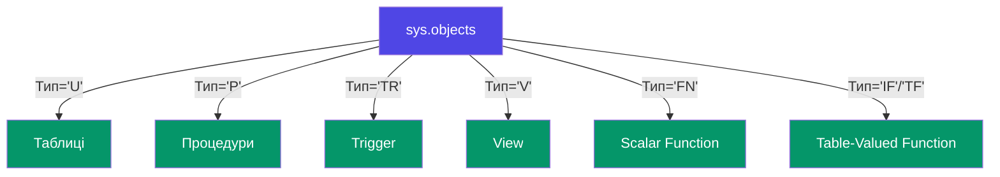
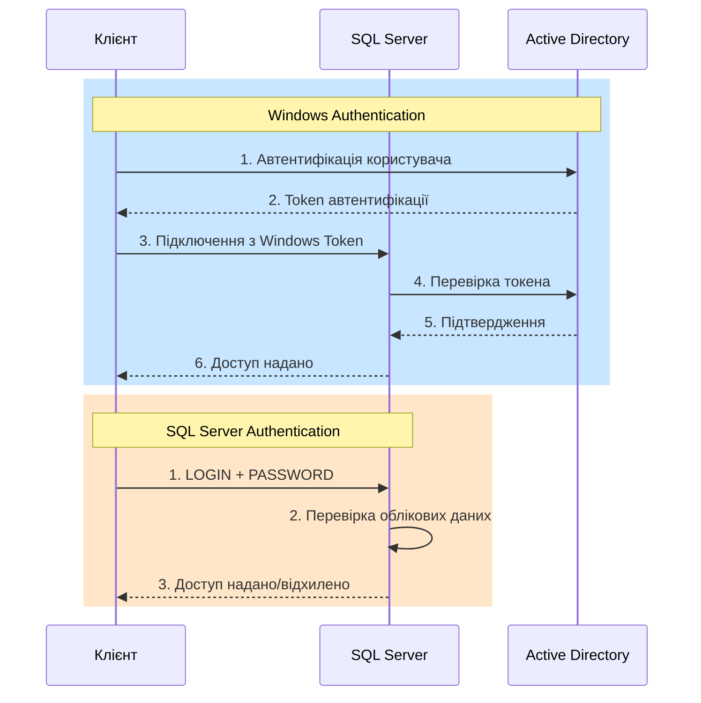
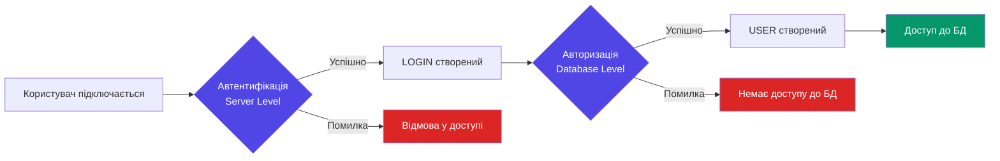
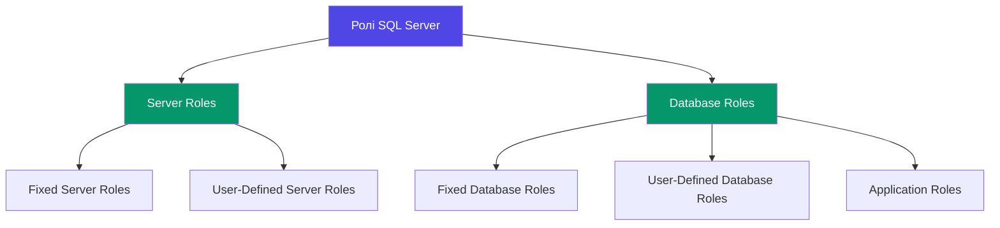
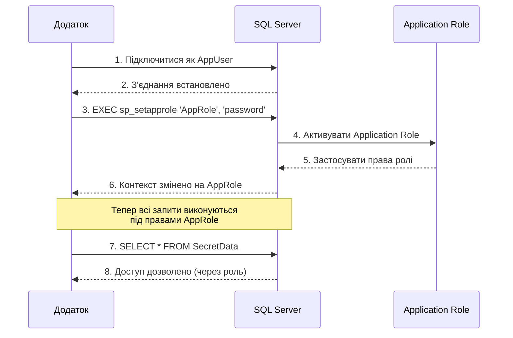
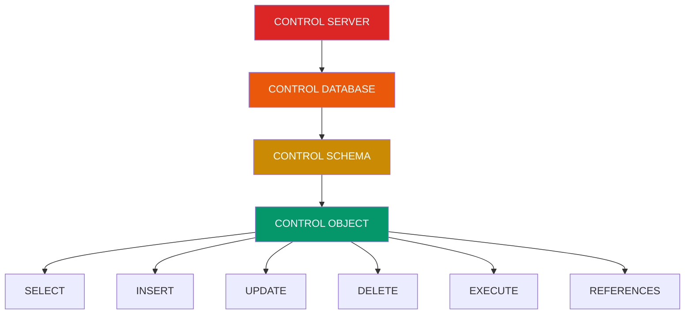

# Безпека баз даних

::lead
Захист даних у сучасних інформаційних системах є критично важливим аспектом. SQL Server надає потужні механізми для контролю доступу та захисту інформації на кількох рівнях.
::

## Навіщо потрібна безпека БД?

Уявіть, що ваша база даних — це банківське сховище. Ви не можете дозволити будь-кому зайти всередину та робити що завгодно з вашими активами.

::card-group{class="mt-6"}
::card{icon="i-lucide-shield"}
#title
Конфіденційність
#description
Захист персональних та бізнес-критичних даних від несанкціонованого доступу.
::

::card{icon="i-lucide-lock"}
#title
Цілісність
#description
Гарантія того, що дані не будуть випадково або навмисно змінені.
::

::card{icon="i-lucide-eye"}
#title
Аудит
#description
Можливість відстежувати, хто, коли і які дії виконував з даними.
::

::card{icon="i-lucide-user-check"}
#title
Compliance
#description
Відповідність вимогам GDPR, HIPAA та інших регуляторних стандартів.
::
::

## Системні таблиці та представлення

::note
У SQL Server 2000 використовувалася система **системних таблиць** (наприклад, `sysobjects`, `syscolumns`). Починаючи з SQL Server 2005/2008, Microsoft переходить на **системні представлення каталогу** (`sys.*`), які є більш структурованими та стабільними.
::

### Порівняння: SQL Server 2000 vs 2008+

::tabs
::code-panel

---

label: SQL Server 2000
icon: i-lucide-database

---

```sql
-- Старі системні таблиці
SELECT * FROM sysobjects WHERE xtype = 'U';  -- Таблиці
SELECT * FROM syscolumns;                     -- Стовпці
SELECT * FROM sysusers;                       -- Користувачі
SELECT * FROM sysprocedures;                  -- Процедури
```

::

::code-panel

---

label: SQL Server 2008+
icon: i-lucide-database-zap

---

```sql
-- Нові системні представлення
SELECT * FROM sys.objects WHERE type = 'U';  -- Таблиці
SELECT * FROM sys.columns;                    -- Стовпці
SELECT * FROM sys.database_principals;        -- Користувачі
SELECT * FROM sys.procedures;                 -- Процедури
```

::
::

### Основні системні представлення

::mermaid



::

#### Корисні представлення для роботи з метаданими

```sql
-- Інформація про об'єкти БД
SELECT
    name AS [Назва об'єкта],
    type_desc AS [Тип],
    create_date AS [Дата створення],
    modify_date AS [Дата зміни]
FROM sys.objects
WHERE is_ms_shipped = 0  -- Виключити системні об'єкти
ORDER BY type_desc, name;

-- Перегляд тексту збережених процедур і функцій
SELECT
    o.name AS [Назва],
    o.type_desc AS [Тип],
    m.definition AS [Код]
FROM sys.sql_modules m
INNER JOIN sys.objects o ON m.object_id = o.object_id
WHERE o.is_ms_shipped = 0;

-- Інформація про тригери
SELECT
    name AS [Тригер],
    parent_class_desc AS [Область],
    is_disabled AS [Відключений],
    is_instead_of_trigger AS [INSTEAD OF]
FROM sys.triggers
WHERE is_ms_shipped = 0;
```

::tip
Завжди використовуйте `sys.*` представлення замість застарілих системних таблиць. Це гарантує сумісність з майбутніми версіями SQL Server.
::

---

## Режими автентифікації

SQL Server підтримує два основні режими автентифікації:

::tabs
::code-panel

---

label: Windows Authentication
icon: i-lucide-shield-check

---

### Автентифікація Windows (рекомендовано)

**Переваги:**

- Централізоване керування через Active Directory
- Підтримка Kerberos
- Автоматична інтеграція з групами безпеки
- Немає необхідності зберігати паролі в додатку

```sql
-- Windows-логін створюється через AD
CREATE LOGIN [DOMAIN\UserName] FROM WINDOWS;
```

::tip
Windows Authentication є найбільш захищеним варіантом для корпоративного середовища, оскільки використовує надійну систему автентифікації операційної системи.
::
::

::code-panel

---

label: Mixed Mode
icon: i-lucide-database

---

### Mixed Mode (SQL Server + Windows)

**Коли використовувати:**

- Додатки, які працюють на різних платформах (Linux, macOS)
- Веб-додатки без інтеграції з AD
- Тестові середовища

```sql
-- SQL Server логін
CREATE LOGIN AppUser WITH PASSWORD = 'StrongP@ssw0rd!';
```

::warning
При використанні SQL Server Authentication:

- Використовуйте складні паролі
- Застосовуйте політику складності паролів
- Регулярно змінюйте паролі
- Шифруйте з'єднання (SSL/TLS)

::
::
::

::mermaid



::

---

## Двухрівнева модель безпеки

SQL Server використовує дворівневу модель безпеки:

::mermaid



::

1. **Server Level (LOGIN)** — автентифікація на рівні сервера
2. **Database Level (USER)** — авторизація на рівні бази даних

::note
**LOGIN** — це облікові дані для підключення до SQL Server.  
**USER** — це облікові дані для роботи з конкретною базою даних.

Один LOGIN може мати кілька USER у різних базах даних.
::

---

## Керування логінами (Logins)

### Створення логінів

::tabs
::code-panel

---

label: SQL Authentication
icon: i-lucide-database

---

```sql
-- Створення SQL Server логіна
CREATE LOGIN AppUser
WITH PASSWORD = 'MyP@ssw0rd123',
     DEFAULT_DATABASE = MyDatabase,
     CHECK_EXPIRATION = ON,
     CHECK_POLICY = ON;
```

**Параметри:**

- `CHECK_EXPIRATION` — термін дії пароля
- `CHECK_POLICY` — політика складності паролів Windows
- `DEFAULT_DATABASE` — БД за замовчуванням
  ::

::code-panel

---

label: Windows Authentication
icon: i-lucide-shield

---

```sql
-- Створення Windows логіна
CREATE LOGIN [DOMAIN\UserName] FROM WINDOWS
WITH DEFAULT_DATABASE = MyDatabase;

-- Створення групи з Active Directory
CREATE LOGIN [DOMAIN\DevelopersGroup] FROM WINDOWS;
```

::tip
Використовуйте групи AD для спрощення управління правами доступу. При додаванні користувача до групи він автоматично отримує всі права групи.
::
::
::

### Модифікація логінів

```sql
-- Зміна пароля
ALTER LOGIN AppUser
WITH PASSWORD = 'NewP@ssw0rd456';

-- Розблокування та зміна пароля
ALTER LOGIN AppUser
WITH PASSWORD = 'NewP@ssw0rd456' UNLOCK;

-- Відключення логіна (не видаляючи)
ALTER LOGIN AppUser DISABLE;

-- Увімкнення логіна
ALTER LOGIN AppUser ENABLE;

-- Перейменування логіна
ALTER LOGIN AppUser WITH NAME = NewAppUser;
```

### Видалення логінів

```sql
-- Видалення логіна
DROP LOGIN AppUser;
```

::warning
Перед видаленням логіна переконайтеся, що:

1. Він не є власником баз даних або схем
2. Немає активних підключень
3. Видалені всі відповідні користувачі в базах даних
   ::

### Перегляд логінів

```sql
-- Список всіх логінів
SELECT
    name AS [Login],
    type_desc AS [Тип],
    create_date AS [Створено],
    is_disabled AS [Відключено]
FROM sys.sql_logins
ORDER BY name;

-- Системна процедура
EXEC sp_helplogins;
EXEC sp_helplogins 'AppUser';  -- Детальна інформація про конкретний логін
```

---

## Керування користувачами (Users)

Після створення логіна потрібно створити користувача в конкретній базі даних.

### Створення користувачів

```sql
USE MyDatabase;
GO

-- Створення користувача для SQL-логіна
CREATE USER AppUser FOR LOGIN AppUser;

-- Створення користувача для Windows-логіна
CREATE USER [DOMAIN\UserName] FOR LOGIN [DOMAIN\UserName];

-- Користувач без логіна (для certificates або asymmetric keys)
CREATE USER GuestUser WITHOUT LOGIN;

-- Користувач з default schema
CREATE USER DevUser FOR LOGIN DevUser
WITH DEFAULT_SCHEMA = dbo;
```

::note
**DEFAULT_SCHEMA** визначає схему, яка буде використовуватися за замовчуванням при створенні об'єктів цим користувачем.
::

### Модифікація користувачів

```sql
-- Зміна схеми за замовчуванням
ALTER USER AppUser WITH DEFAULT_SCHEMA = Sales;

-- Перейменування користувача
ALTER USER AppUser WITH NAME = NewAppUser;
```

### Видалення користувачів

```sql
USE MyDatabase;
GO

DROP USER AppUser;
```

### Перегляд користувачів

```sql
-- Список користувачів поточної БД
SELECT
    name AS [Користувач],
    type_desc AS [Тип],
    authentication_type_desc AS [Автентифікація],
    default_schema_name AS [Схема за замовчуванням],
    create_date AS [Створено]
FROM sys.database_principals
WHERE type IN ('S', 'U', 'G')  -- S=SQL user, U=Windows user, G=Windows group
ORDER BY name;
```

---

## Ролі (Roles)

Ролі — це механізм групування користувачів для спрощення управління правами доступу.

::mermaid



::

### Фіксовані ролі сервера (Fixed Server Roles)

::accordion
::accordion-item{value="sysadmin"}
#title

### sysadmin — Повний контроль

#content

- Може виконувати будь-які дії на сервері
- Обходить всі перевірки прав доступу
- **Використовуйте обережно!**

```sql
-- Додати логін до ролі sysadmin
ALTER SERVER ROLE sysadmin ADD MEMBER [DOMAIN\DBA];
```

::

::accordion-item{value="serveradmin"}
#title

### serveradmin — Конфігурація сервера

#content

- Зміна налаштувань сервера
- Завершення процесів
- Керування linked servers

```sql
ALTER SERVER ROLE serveradmin ADD MEMBER [DOMAIN\ServerAdmin];
```

::

::accordion-item{value="securityadmin"}
#title

### securityadmin — Керування безпекою

#content

- Створення/зміна логінів
- Надання прав на рівні сервера
- Читання логів помилок

::warning
`securityadmin` може надати собі права `sysadmin`, тому слід обережно призначати цю роль.
::

```sql
ALTER SERVER ROLE securityadmin ADD MEMBER [DOMAIN\SecurityAdmin];
```

::

::accordion-item{value="processadmin"}
#title

### processadmin — Керування процесами

#content

- Завершення процесів SQL Server

```sql
ALTER SERVER ROLE processadmin ADD MEMBER [DOMAIN\ProcessAdmin];
```

::

::accordion-item{value="dbcreator"}
#title

### dbcreator — Створення БД

#content

- Створення, зміна, видалення баз даних
- Відновлення БД

```sql
ALTER SERVER ROLE dbcreator ADD MEMBER [DOMAIN\DBCreator];
```

::

::accordion-item{value="diskadmin"}
#title

### diskadmin — Керування файлами

#content

- Керування файлами резервних копій

```sql
ALTER SERVER ROLE diskadmin ADD MEMBER [DOMAIN\DiskAdmin];
```

::

::accordion-item{value="bulkadmin"}
#title

### bulkadmin — Масове завантаження

#content

- Виконання `BULK INSERT`

```sql
ALTER SERVER ROLE bulkadmin ADD MEMBER [DOMAIN\BulkAdmin];
```

::

::accordion-item{value="public"}
#title

### public — Базові права

#content

- Усі логіни автоматично є членами ролі `public`
- Має мінімальні права доступу

::note
Не можна видалити логін з ролі `public` — це автоматична роль для всіх користувачів.
::
::
::

### Фіксовані ролі бази даних (Fixed Database Roles)

::tabs
::code-panel

---

label: Адміністративні ролі
icon: i-lucide-shield

---

```sql
USE MyDatabase;
GO

-- db_owner — повний контроль над БД
ALTER ROLE db_owner ADD MEMBER AppUser;

-- db_securityadmin — керування ролями та правами
ALTER ROLE db_securityadmin ADD MEMBER SecurityUser;

-- db_accessadmin — додавання/видалення користувачів
ALTER ROLE db_accessadmin ADD MEMBER AccessUser;

-- db_backupoperator — резервне копіювання
ALTER ROLE db_backupoperator ADD MEMBER BackupUser;

-- db_ddladmin — DDL операції (CREATE, ALTER, DROP)
ALTER ROLE db_ddladmin ADD MEMBER DDLUser;
```

::

::code-panel

---

label: Робочі ролі
icon: i-lucide-database

---

```sql
USE MyDatabase;
GO

-- db_datareader — читання всіх даних
ALTER ROLE db_datareader ADD MEMBER ReaderUser;

-- db_datawriter — зміна всіх даних
ALTER ROLE db_datawriter ADD MEMBER WriterUser;

-- db_denydatareader — заборонити читання
ALTER ROLE db_denydatareader ADD MEMBER DeniedReaderUser;

-- db_denydatawriter — заборонити запис
ALTER ROLE db_denydatawriter ADD MEMBER DeniedWriterUser;
```

::
::

::tip
**Best Practice**: Для додатків зазвичай створюють користувача з роллю `db_datareader` + `db_datawriter` замість надання ролі `db_owner`.
::

### Користувацькі ролі бази даних

```sql
USE MyDatabase;
GO

-- Створення власної ролі
CREATE ROLE SalesTeam;

-- Надання прав ролі
GRANT SELECT, INSERT, UPDATE ON Sales.Orders TO SalesTeam;
GRANT SELECT ON Sales.Customers TO SalesTeam;
GRANT EXECUTE ON dbo.GetSalesReport TO SalesTeam;

-- Додавання користувачів до ролі
ALTER ROLE SalesTeam ADD MEMBER SalesUser1;
ALTER ROLE SalesTeam ADD MEMBER SalesUser2;

-- Видалення користувача з ролі
ALTER ROLE SalesTeam DROP MEMBER SalesUser1;

-- Видалення ролі
DROP ROLE SalesTeam;
```

### Застарілі процедури (SQL Server 2005-2008)

::warning
Наступні процедури є застарілими та не рекомендуються до використання в нових проектах. Використовуйте `ALTER SERVER ROLE` та `ALTER ROLE` замість них.
::

```sql
-- ЗАСТАРІЛО: Додавання до серверної ролі
EXEC sp_addsrvrolemember 'AppUser', 'dbcreator';

-- ЗАСТАРІЛО: Видалення із серверної ролі
EXEC sp_dropsrvrolemember 'AppUser', 'dbcreator';

-- ЗАСТАРІЛО: Додавання до ролі БД
EXEC sp_addrolemember 'db_datareader', 'AppUser';

-- ЗАСТАРІЛО: Видалення з ролі БД
EXEC sp_droprolemember 'db_datareader', 'AppUser';
```

### Перегляд членства в ролях

```sql
-- Серверні ролі
SELECT
    r.name AS [Роль],
    m.name AS [Член]
FROM sys.server_role_members rm
JOIN sys.server_principals r ON rm.role_principal_id = r.principal_id
JOIN sys.server_principals m ON rm.member_principal_id = m.principal_id
ORDER BY r.name, m.name;

-- Ролі БД
SELECT
    r.name AS [Роль],
    m.name AS [Член]
FROM sys.database_role_members rm
JOIN sys.database_principals r ON rm.role_principal_id = r.principal_id
JOIN sys.database_principals m ON rm.member_principal_id = m.principal_id
ORDER BY r.name, m.name;
```

---

## Ролі додатків (Application Roles)

Application Roles — це спеціальний тип ролі, яка **активується паролем** і не має прямих членів.

::mermaid



::

### Створення та використання

```sql
-- Створення Application Role
CREATE APPLICATION ROLE AppRole
WITH PASSWORD = 'SecureP@ssw0rd!',
     DEFAULT_SCHEMA = dbo;

-- Надання прав
GRANT SELECT, INSERT ON dbo.Orders TO AppRole;
GRANT EXECUTE ON dbo.ProcessOrder TO AppRole;

-- Активація ролі з додатка
DECLARE @cookie VARBINARY(8000);
EXEC sp_setapprole
    @rolename = 'AppRole',
    @password = 'SecureP@ssw0rd!',
    @fCreateCookie = 1,
    @cookie = @cookie OUTPUT;

-- Виконання операцій під роллю
SELECT * FROM dbo.Orders;

-- Повернення до попереднього контексту
EXEC sp_unsetapprole @cookie;
```

::note
**Коли використовувати Application Roles:**

- Двох-рівневі додатки, де всі користувачі підключаються через єдиний акаунт
- Потрібен додатковий рівень безпеки для певних операцій
- Розмежування прав доступу на рівні додатка, а не користувача
  ::

### Модифікація та видалення

```sql
-- Зміна пароля
ALTER APPLICATION ROLE AppRole
WITH PASSWORD = 'NewP@ssw0rd!';

-- Зміна схеми за замовчуванням
ALTER APPLICATION ROLE AppRole
WITH DEFAULT_SCHEMA = Sales;

-- Видалення
DROP APPLICATION ROLE AppRole;
```

::warning
Після активації Application Role:

- Не можна змінювати контекст БД (`USE`)
- Втрачається інформація про оригінального користувача (але можна зберегти через cookie)
- Всі операції виконуються під контекстом ролі
  ::

---

## Права доступу (Permissions)

SQL Server має гранульовану систему прав доступу на рівні об'єктів.

### Ієрархія прав

::mermaid



::

### Надання прав (GRANT)

```sql
USE MyDatabase;
GO

-- Надати права на читання таблиці
GRANT SELECT ON dbo.Employees TO AppUser;

-- Надати права на конкретні стовпці
GRANT SELECT ON dbo.Employees(FirstName, LastName, Email) TO AppUser;

-- Надати права на оновлення
GRANT UPDATE ON dbo.Products TO SalesUser;

-- Надати права на виконання процедури
GRANT EXECUTE ON dbo.GetSalesReport TO ReportUser;

-- Надати права на схему
GRANT SELECT, INSERT, UPDATE, DELETE ON SCHEMA::Sales TO SalesTeam;

-- Надати права з можливістю передачі (WITH GRANT OPTION)
GRANT SELECT ON dbo.Orders TO ManagerUser WITH GRANT OPTION;
```

::note
`WITH GRANT OPTION` дозволяє користувачу надавати права іншим користувачам.
::

### Відмова в правах (DENY)

```sql
-- Явно заборонити читання
DENY SELECT ON dbo.Salaries TO RegularUser;

-- Заборонити видалення
DENY DELETE ON dbo.Orders TO AppUser;

-- Заборонити всі DML операції
DENY SELECT, INSERT, UPDATE, DELETE ON dbo.SecurityAudit TO AppUser;
```

::warning
`DENY` має **вищий пріоритет** ніж `GRANT`. Навіть якщо користувач є членом ролі з правом `SELECT`, але має явний `DENY`, доступ буде заборонено.
::

### Відкликання прав (REVOKE)

```sql
-- Відкликати права на читання
REVOKE SELECT ON dbo.Employees FROM AppUser;

-- Відкликати права на виконання
REVOKE EXECUTE ON dbo.ProcessOrder FROM AppUser;

-- Відкликати GRANT OPTION (але залишити саме право)
REVOKE GRANT OPTION FOR SELECT ON dbo.Orders FROM ManagerUser;
```

### Перегляд прав

```sql
-- Права на об'єкти поточної БД
SELECT
    dp.name AS [Principal],
    dp.type_desc AS [Principal Type],
    o.name AS [Object],
    p.permission_name AS [Permission],
    p.state_desc AS [State]
FROM sys.database_permissions p
JOIN sys.database_principals dp ON p.grantee_principal_id = dp.principal_id
LEFT JOIN sys.objects o ON p.major_id = o.object_id
WHERE dp.name = 'AppUser'
ORDER BY o.name, p.permission_name;

-- Права на рівні сервера
SELECT
    sp.name AS [Principal],
    p.permission_name AS [Permission],
    p.state_desc AS [State]
FROM sys.server_permissions p
JOIN sys.server_principals sp ON p.grantee_principal_id = sp.principal_id
WHERE sp.name = 'AppUser';
```

---

## Best Practices для безпеки

::card-group{class="mt-6"}
::card{icon="i-lucide-shield-check"}
#title

1. Використовуйте Windows Authentication
   #description
   Завжди віддавайте перевагу Windows Authentication, особливо в корпоративному середовищі. Це забезпечує централізоване керування та кращу безпеку.
   ::

::card{icon="i-lucide-lock"}
#title 2. Принцип найменших привілеїв
#description
Надавайте лише ті права, які необхідні для виконання завдань. Не використовуйте `db_owner` або `sysadmin` для звичайних додатків.
::

::card{icon="i-lucide-users"}
#title 3. Використовуйте ролі
#description
Створюйте користувацькі ролі для групування користувачів з однаковими правами. Це спрощує управління.
::

::card{icon="i-lucide-eye"}
#title 4. Аудит доступу
#description
Використовуйте SQL Server Audit або extended events для відстеження операцій з чутливими даними.
::

::card{icon="i-lucide-database"}
#title 5. Схеми для розділення
#description
Використовуйте різні схеми для логічного розділення об'єктів БД та спрощення управління правами.
::

::card{icon="i-lucide-key"}
#title 6. Шифрування з'єднань
#description
Завжди використовуйте TLS/SSL для шифрування даних в мережі, особливо при SQL Server Authentication.
::
::

### Перевірка складності паролів

```sql
-- Увімкнути політику паролів
ALTER LOGIN AppUser
WITH CHECK_POLICY = ON, CHECK_EXPIRATION = ON;

-- Вимоги до пароля:
-- - Мінімум 8 символів
-- - Містить великі та малі літери
-- - Містить цифри
-- - Містить спеціальні символи
```

### Відстеження автентифікації

```sql
-- Створення DDL тригера для відстеження створення логінів
CREATE TRIGGER trg_AuditLoginCreation
ON ALL SERVER
FOR CREATE_LOGIN
AS
BEGIN
    DECLARE @EventData XML = EVENTDATA();

    INSERT INTO SecurityDB.dbo.LoginAudit (
        EventType,
        LoginName,
        CreatedBy,
        EventDate
    )
    SELECT
        @EventData.value('(/EVENT_INSTANCE/EventType)[1]', 'NVARCHAR(100)'),
        @EventData.value('(/EVENT_INSTANCE/ObjectName)[1]', 'NVARCHAR(100)'),
        @EventData.value('(/EVENT_INSTANCE/LoginName)[1]', 'NVARCHAR(100)'),
        GETDATE();
END;
GO
```

### Відстеження невдалих спроб входу

```sql
-- Створення LOGON тригера
CREATE TRIGGER trg_LoginFailureTracking
ON ALL SERVER
WITH EXECUTE AS 'sa'
FOR LOGON
AS
BEGIN
    -- Перевірка кількості невдалих спроб
    DECLARE @LoginName NVARCHAR(128) = ORIGINAL_LOGIN();
    DECLARE @FailedAttempts INT;

    SELECT @FailedAttempts = COUNT(*)
    FROM SecurityDB.dbo.FailedLogins
    WHERE LoginName = @LoginName
      AND AttemptTime > DATEADD(MINUTE, -15, GETDATE());

    -- Якщо більше 5 невдалих спроб за 15 хвилин
    IF @FailedAttempts >= 5
    BEGIN
        ROLLBACK;
        RAISERROR('Забагато невдалих спроб входу. Акаунт тимчасово заблоковано.', 16, 1);
    END
END;
GO
```

---

## Практичні завдання

::accordion
::accordion-item{value="task1"}
#title

### Завдання 1: Створення системи безпеки для відділу продажів

#content
**Мета**: Налаштувати безпеку для команди продажів, де менеджери можуть читати та змінювати дані, а аналітики лише читати.

**Вимоги**:

1. Створити 2 SQL-логіни: `SalesManager` та `SalesAnalyst`
2. Створити користувацьку роль `SalesTeam`
3. Надати ролі права на читання та зміну в схемі `Sales`
4. Аналітик може лише читати дані
5. Заборонити всім доступ до таблиці `Sales.Salaries`

::code-collapse

---

label: Рішення

---

```sql
-- 1. Створення логінів
CREATE LOGIN SalesManager WITH PASSWORD = 'ManagerP@ss123';
CREATE LOGIN SalesAnalyst WITH PASSWORD = 'AnalystP@ss123';

-- 2. Створення користувачів у БД
USE SalesDB;
GO

CREATE USER SalesManager FOR LOGIN SalesManager;
CREATE USER SalesAnalyst FOR LOGIN SalesAnalyst;

-- 3. Створення ролі
CREATE ROLE SalesTeam;

-- 4. Надання прав ролі
GRANT SELECT, INSERT, UPDATE ON SCHEMA::Sales TO SalesTeam;

-- 5. Заборона доступу до Salaries
DENY SELECT, INSERT, UPDATE, DELETE ON Sales.Salaries TO SalesTeam;

-- 6. Додавання менеджера до ролі
ALTER ROLE SalesTeam ADD MEMBER SalesManager;

-- 7. Для аналітика тільки читання
GRANT SELECT ON SCHEMA::Sales TO SalesAnalyst;
DENY SELECT ON Sales.Salaries TO SalesAnalyst;

-- Перевірка
EXECUTE AS USER = 'SalesManager';
SELECT * FROM Sales.Orders;  -- ОК
SELECT * FROM Sales.Salaries;  -- DENIED
REVERT;
```

::
::

::accordion-item{value="task2"}
#title

### Завдання 2: Налаштування Application Role для веб-додатка

#content
**Мета**: Створити Application Role для веб-додатка, який має доступ лише до певних процедур.

**Вимоги**:

1. Створити Application Role `WebAppRole`
2. Надати права на виконання процедур `GetProducts`, `AddToCart`, `ProcessOrder`
3. Заборонити прямий доступ до таблиць
4. Створити тестовий скрипт активації ролі

::code-collapse

---

label: Рішення

---

```sql
USE ShopDB;
GO

-- 1. Створення Application Role
CREATE APPLICATION ROLE WebAppRole
WITH PASSWORD = 'WebApp$ecure2024!',
     DEFAULT_SCHEMA = dbo;

-- 2. Надання прав на виконання процедур
GRANT EXECUTE ON dbo.GetProducts TO WebAppRole;
GRANT EXECUTE ON dbo.AddToCart TO WebAppRole;
GRANT EXECUTE ON dbo.ProcessOrder TO WebAppRole;

-- 3. Явна заборона прямого доступу до таблиць
DENY SELECT, INSERT, UPDATE, DELETE ON dbo.Products TO WebAppRole;
DENY SELECT, INSERT, UPDATE, DELETE ON dbo.Orders TO WebAppRole;
DENY SELECT, INSERT, UPDATE, DELETE ON dbo.OrderItems TO WebAppRole;

-- 4. Тестовий скрипт активації
-- Підключення як AppUser
CREATE LOGIN AppUser WITH PASSWORD = 'AppP@ss123';
CREATE USER AppUser FOR LOGIN AppUser;

-- З боку додатка
DECLARE @cookie VARBINARY(8000);
EXEC sp_setapprole
    @rolename = 'WebAppRole',
    @password = 'WebApp$ecure2024!',
    @fCreateCookie = 1,
    @cookie = @cookie OUTPUT;

-- Тепер можна викликати процедури
EXEC dbo.GetProducts;

-- Але не можна прямо запитувати таблиці
-- SELECT * FROM dbo.Products;  -- DENIED

-- Повернення контексту
EXEC sp_unsetapprole @cookie;
```

::
::

::accordion-item{value="task3"}
#title

### Завдання 3: Аудит створення та видалення об'єктів

#content
**Мета**: Створити систему аудиту для відстеження всіх DDL-операцій у БД.

**Вимоги**:

1. Створити таблицю `DDLAuditLog`
2. Створити DDL-тригер, який логує всі CREATE, ALTER, DROP операції
3. Зберігати: тип події, назву об'єкта, користувача, час, команду
4. Перевірити роботу тригера

::code-collapse

---

label: Рішення

---

```sql
-- 1. Створення таблиці аудиту
CREATE TABLE dbo.DDLAuditLog (
    AuditID INT IDENTITY(1,1) PRIMARY KEY,
    EventType NVARCHAR(100) NOT NULL,
    ObjectName NVARCHAR(256),
    ObjectType NVARCHAR(50),
    DatabaseName NVARCHAR(128),
    SchemaName NVARCHAR(128),
    LoginName NVARCHAR(128),
    EventDate DATETIME DEFAULT GETDATE(),
    TSQLCommand NVARCHAR(MAX)
);
GO

-- 2. Створення DDL-тригера
CREATE TRIGGER trg_DDLAudit
ON DATABASE
FOR CREATE_TABLE, ALTER_TABLE, DROP_TABLE,
    CREATE_PROCEDURE, ALTER_PROCEDURE, DROP_PROCEDURE,
    CREATE_FUNCTION, ALTER_FUNCTION, DROP_FUNCTION,
    CREATE_VIEW, ALTER_VIEW, DROP_VIEW
AS
BEGIN
    SET NOCOUNT ON;

    DECLARE @EventData XML = EVENTDATA();

    INSERT INTO dbo.DDLAuditLog (
        EventType,
        ObjectName,
        ObjectType,
        DatabaseName,
        SchemaName,
        LoginName,
        TSQLCommand
    )
    VALUES (
        @EventData.value('(/EVENT_INSTANCE/EventType)[1]', 'NVARCHAR(100)'),
        @EventData.value('(/EVENT_INSTANCE/ObjectName)[1]', 'NVARCHAR(256)'),
        @EventData.value('(/EVENT_INSTANCE/ObjectType)[1]', 'NVARCHAR(50)'),
        @EventData.value('(/EVENT_INSTANCE/DatabaseName)[1]', 'NVARCHAR(128)'),
        @EventData.value('(/EVENT_INSTANCE/SchemaName)[1]', 'NVARCHAR(128)'),
        @EventData.value('(/EVENT_INSTANCE/LoginName)[1]', 'NVARCHAR(128)'),
        @EventData.value('(/EVENT_INSTANCE/TSQLCommand/CommandText)[1]', 'NVARCHAR(MAX)')
    );
END;
GO

-- 3. Тестування
CREATE TABLE dbo.TestTable (ID INT, Name NVARCHAR(50));
ALTER TABLE dbo.TestTable ADD Email NVARCHAR(100);
DROP TABLE dbo.TestTable;

-- 4. Перегляд логу
SELECT
    EventDate,
    EventType,
    ObjectName,
    ObjectType,
    LoginName,
    TSQLCommand
FROM dbo.DDLAuditLog
ORDER BY EventDate DESC;
```

::
::
::

---

## Корисні поради

::tip
**Іменування об'єктів безпеки**:

- Логіни: `app_shopuser`, `svc_reporting`
- Ролі: `SalesTeam`, `ReportReaders`, `DataAnalysts`
- Application Roles: `WebAppRole`, `MobileAppRole`

Використовуйте префікси `app_` для додатків, `svc_` для сервісів, `usr_` для користувачів.
::

::warning
**Не використовуйте префікс `sp_` для власних процедур!**

SQL Server спочатку шукає процедури з префіксом `sp_` у системній БД `master`, що призводить до зниження продуктивності. Використовуйте інші префікси, наприклад `usp_` (user stored procedure).
::

::note
**Функція `ORIGINAL_LOGIN()`**

У тригерах та при використанні `EXECUTE AS` корисно отримувати оригінальний логін:

```sql
SELECT
    SUSER_NAME() AS CurrentContext,
    ORIGINAL_LOGIN() AS OriginalLogin;
```

::

---

## Висновки

Безпека баз даних — це багаторівнева система, яка включає:

1. **Автентифікацію** (хто ви?) — Logins на рівні сервера
2. **Авторизацію** (що ви можете робити?) — Users, Roles, Permissions на рівні БД
3. **Аудит** (що ви зробили?) — Triggers, SQL Server Audit

::card-group{class="mt-6"}
::card{icon="i-lucide-check-circle"}
#title
Ключові висновки
#description

- Використовуйте Windows Authentication де можливо
- Застосовуйте принцип найменших привілеїв
- Створюйте ролі для групування користувачів
- Використовуйте `sys.*` представлення замість застарілих системних таблиць
- Регулярно аудитуйте права доступу
- Шифруйте з'єднання при SQL Server Authentication
  ::

::card{icon="i-lucide-book-open"}
#title
Подальше вивчення
#description

- **Row-Level Security (RLS)** — детальний контроль на рівні рядків
- **Dynamic Data Masking** — маскування чутливих даних
- **Always Encrypted** — шифрування даних на рівні колонок
- **SQL Server Audit** — професійний аудит подій
  ::
  ::

---

## Додаткові ресурси

- [Microsoft Docs: Security Center for SQL Server Database Engine](https://learn.microsoft.com/en-us/sql/relational-databases/security/security-center-for-sql-server-database-engine-and-azure-sql-database)
- [Best Practices for SQL Server Security](https://learn.microsoft.com/en-us/sql/relational-databases/security/sql-server-security-best-practices)
- [System Catalog Views](https://learn.microsoft.com/en-us/sql/relational-databases/system-catalog-views/catalog-views-transact-sql)
