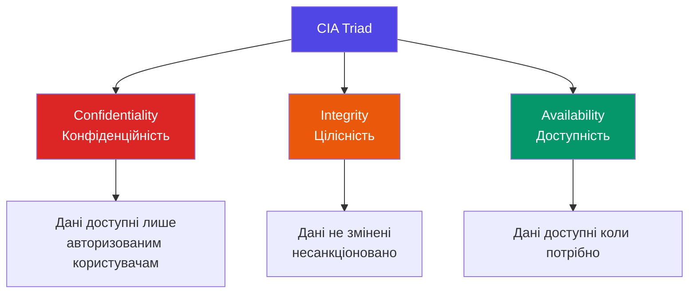
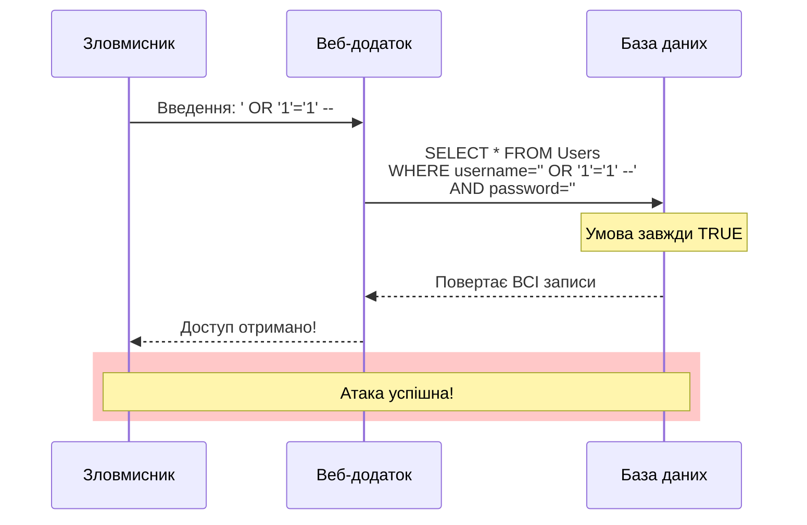
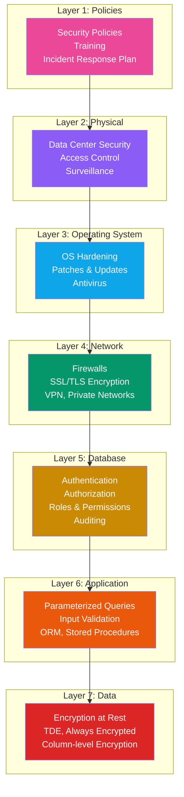
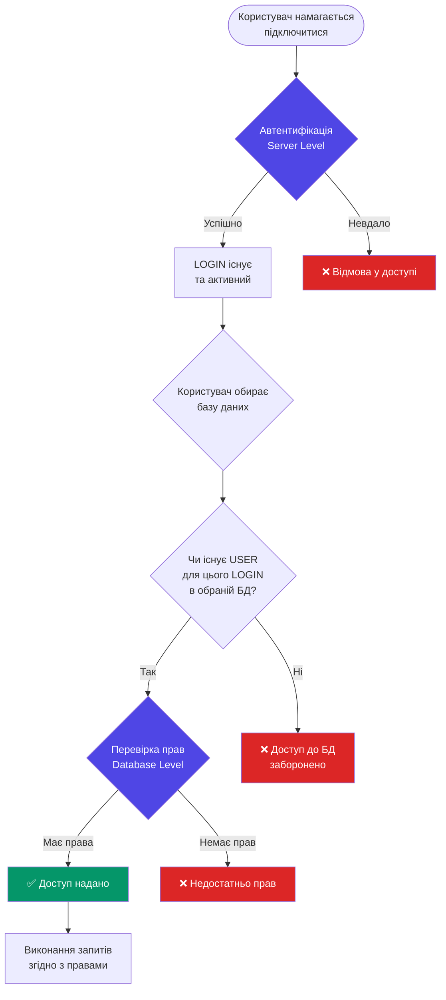

# Вступ до безпеки баз даних

::lead
Безпека баз даних — це не просто технічна вимога, а критично важливий фундамент, на якому будується довіра користувачів та стабільність бізнесу. У цій статті ми розглянемо, чому безпека БД є таким важливим аспектом та які основні принципи лежать в її основі.
::

## Чому безпека баз даних критично важлива?

У сучасному цифровому світі дані є одним з найцінніших активів компанії. Уявіть, що ваша база даних — це сховище банку, де зберігаються не гроші, а щось набагато цінніше: персональна інформація клієнтів, фінансові дані, бізнес-секрети, медичні записи тощо.

### Реальні наслідки порушень безпеки

::card-group{class="mt-6"}
  ::card{icon="i-lucide-skull"}
  #title
  Фінансові втрати
  #description
  За даними IBM, середня вартість витоку даних у 2023 році склала **$4.45 мільйона**. Це включає штрафи, судові позови, втрату клієнтів та відновлювальні роботи.
  ::

  ::card{icon="i-lucide-trending-down"}
  #title
  Репутаційні наслідки
  #description
  60% малих та середніх компаній закриваються протягом 6 місяців після кібератаки через втрату довіри клієнтів.
  ::

  ::card{icon="i-lucide-gavel"}
  #title
  Юридичні наслідки
  #description
  GDPR передбачає штрафи до **€20 мільйонів** або **4% світового річного обороту** компанії за порушення захисту персональних даних.
  ::

  ::card{icon="i-lucide-shield-alert"}
  #title
  Операційні збої
  #description
  Кібератаки можуть призвести до повної зупинки бізнес-процесів, втрати критичних даних та неможливості обслуговувати клієнтів.
  ::
::

### Приклади реальних інцидентів

::note
**Equifax (2017)**: Зламано базу даних з персональними даними 147 мільйонів людей через незакриєну вразливість. Загальні збитки склали понад $1.4 мільярда, включаючи штрафи та компенсації.

**Capital One (2019)**: Через неправильно налаштовані права доступу хакер отримав дані 100 мільйонів клієнтів. Компанія отримала штраф $80 мільйонів.

**Marriott (2018)**: Витік даних 500 мільйонів гостей через скомпрометовані облікові дані адміністратора БД.
::

---

## CIA Triad: Три стовпи безпеки інформації

CIA Triad — це класична модель безпеки інформації, яка визначає три ключові аспекти, які потрібно захищати.

::mermaid

::

### 1. Confidentiality (Конфіденційність)

**Визначення**: Інформація повинна бути доступна лише тим користувачам, які мають на це право.

**Чому це важливо:**
- Захист персональних даних (GDPR, HIPAA)
- Збереження комерційних таємниць
- Запобігання промисловому шпигунству
- Захист інтелектуальної власності

**Механізми забезпечення:**
- Автентифікація (перевірка особи користувача)
- Авторизація (надання прав доступу)
- Шифрування даних (TDE, Always Encrypted)
- Маскування даних (Dynamic Data Masking)

**Приклад порушення:**
```sql
-- ПОГАНО: Всі користувачі можуть бачити зарплати
GRANT SELECT ON HR.Salaries TO PUBLIC;

-- ДОБРЕ: Тільки HR-менеджери можуть бачити зарплати
GRANT SELECT ON HR.Salaries TO HR_Managers;
DENY SELECT ON HR.Salaries TO ALL_Employees;
```

### 2. Integrity (Цілісність)

**Визначення**: Дані повинні залишатися точними, повними та незмінними протягом усього життєвого циклу.

**Чому це важливо:**
- Гарантія достовірності бізнес-даних
- Запобігання фінансовому шахрайству
- Відповідність регуляторним вимогам
- Підтримка довіри до системи

**Механізми забезпечення:**
- Обмеження прав на зміну даних (DENY UPDATE/DELETE)
- Транзакції та ACID властивості
- Тригери для аудиту змін
- Check constraints та foreign keys
- Хешування для перевірки цілісності

**Приклад порушення:**
```sql
-- ПОГАНО: Будь-хто може змінювати фінансові дані
GRANT UPDATE, DELETE ON Finance.Transactions TO PUBLIC;

-- ДОБРЕ: Тільки система може вставляти, а зміни та видалення заборонені
GRANT INSERT ON Finance.Transactions TO FinanceApp;
DENY UPDATE, DELETE ON Finance.Transactions TO FinanceApp;

-- Ще краще: Використовуйте тригер для аудиту
CREATE TRIGGER trg_AuditTransactions
ON Finance.Transactions
FOR UPDATE, DELETE
AS
BEGIN
    RAISERROR('Modification of transactions is not allowed', 16, 1);
    ROLLBACK;
END;
```

### 3. Availability (Доступність)

**Визначення**: Дані та системи повинні бути доступні та функціональні, коли користувачам потрібен доступ.

**Чому це важливо:**
- Безперервність бізнес-процесів
- Задоволеність клієнтів
- Дотримання SLA (Service Level Agreements)
- Конкурентоспроможність

**Механізми забезпечення:**
- Резервне копіювання (Backup & Restore)
- Високодоступність (Always On, Mirroring, Replication)
- Disaster Recovery планування
- Захист від DDoS атак
- Моніторинг та alerting

**Загрози доступності:**
- DDoS атаки
- Ransomware (шифрувальники)
- Апаратні збої
- Помилки конфігурації
- Перевантаження системи

::warning
**Баланс безпеки та доступності:**

Надмірна безпека може знизити доступність (наприклад, дуже складні процедури автентифікації). Потрібен баланс між захистом і зручністю використання.
::

---

## Загрози безпеці баз даних

Розуміння загроз — перший крок до побудови надійної системи захисту. Розглянемо найпоширеніші типи атак на бази даних.

### 1. SQL Injection

**Що це:** Введення шкідливого SQL-коду через вхідні дані додатка.

::mermaid

::

**Приклад вразливого коду:**
```csharp
// ДУЖЕ НЕБЕЗПЕЧНО! Ніколи так не робіть!
string query = "SELECT * FROM Users WHERE Username = '" + username + "' AND Password = '" + password + "'";
SqlCommand cmd = new SqlCommand(query, connection);
SqlDataReader reader = cmd.ExecuteReader();
```

**Вхідні дані зловмисника:**
```
Username: admin' --
Password: (будь-що)
```

**Результуючий запит:**
```sql
SELECT * FROM Users WHERE Username = 'admin' --' AND Password = ''
-- Частина після -- є коментарем і ігнорується!
```

**Правильний підхід:**
```csharp
// БЕЗПЕЧНО: Використовуємо параметризовані запити
string query = "SELECT * FROM Users WHERE Username = @username AND Password = @password";
SqlCommand cmd = new SqlCommand(query, connection);
cmd.Parameters.AddWithValue("@username", username);
cmd.Parameters.AddWithValue("@password", password);
SqlDataReader reader = cmd.ExecuteReader();
```

::tip
**Захист від SQL Injection:**
1. **Завжди** використовуйте параметризовані запити або ORM
2. Валідуйте та санітизуйте вхідні дані
3. Використовуйте stored procedures з правильними параметрами
4. Застосовуйте principle of least privilege
5. Використовуйте Web Application Firewall (WAF)
::

### 2. Privilege Escalation (Підвищення привілеїв)

**Що це:** Зловмисник отримує вищі права доступу, ніж йому надано.

**Приклад сценарію:**
```sql
-- Уразлива конфігурація:
-- Користувач має роль db_securityadmin
EXEC sp_addrolemember 'db_securityadmin', 'RegularUser';

-- Тепер RegularUser може надати собі роль db_owner!
-- (виконано як RegularUser)
EXEC sp_addrolemember 'db_owner', 'RegularUser';

-- Тепер він має повний контроль над БД
```

::warning
**Небезпека `db_securityadmin` та `securityadmin` ролей:**

Користувачі з цими ролями можуть **підвищити свої власні привілеї**. Будьте дуже обережні при призначенні цих ролей!
::

### 3. Credential Theft (Крадіжка облікових даних)

**Методи:**
- Фішинг
- Keylogging
- Brute-force атаки
- Password spraying
- Витік даних з інших сервісів

**Приклад brute-force:** 
```sql
-- Атакуючий намагається підібрати пароль
DECLARE @attempt INT = 1;
WHILE @attempt <= 10000
BEGIN
    -- Спроба входу з різними паролями
    EXEC sp_TryLogin 'admin', CONCAT('Password', @attempt);
    SET @attempt = @attempt + 1;
END
```

**Захист:**
```sql
-- Увімкнути політику паролів
ALTER LOGIN [AppUser] 
WITH CHECK_POLICY = ON, CHECK_EXPIRATION = ON;

-- Створити LOGON тригер для обмеження спроб
CREATE TRIGGER trg_LimitLoginAttempts
ON ALL SERVER
FOR LOGON
AS
BEGIN
    -- Перевірка кількості невдалих спроб за останні 15 хвилин
    DECLARE @LoginName NVARCHAR(128) = ORIGINAL_LOGIN();
    DECLARE @FailedAttempts INT;
    
    SELECT @FailedAttempts = COUNT(*)
    FROM SecurityDB.dbo.FailedLogins
    WHERE LoginName = @LoginName
      AND AttemptTime > DATEADD(MINUTE, -15, GETDATE());
    
    IF @FailedAttempts >= 5
    BEGIN
        ROLLBACK;
        RAISERROR('Too many failed login attempts. Account temporarily locked.', 16, 1);
    END
END;
```

### 4. Insider Threats (Внутрішні загрози)

**Що це:** Загрози від співробітників компанії, які мають легітимний доступ.

**Типи:**
- **Зловмисні**: Навмисна крадіжка даних, саботаж
- **Необережні**: Випадкове видалення, неправильна конфігурація
- **Скомпрометовані**: Акаунти співробітників, зламані ззовні

**Статистика:**
- 34% всіх порушень безпеки спричинені інсайдерами (Verizon DBIR 2023)
- Середній час виявлення insider threat: 85 днів

**Захист:**
```sql
-- 1. Аудит всіх дій адміністраторів
CREATE SERVER AUDIT AdminAudit
TO FILE (FILEPATH = 'D:\Audit\');

ALTER SERVER AUDIT AdminAudit WITH (STATE = ON);

CREATE SERVER AUDIT SPECIFICATION AdminActions
FOR SERVER AUDIT AdminAudit
ADD (DATABASE_OBJECT_ACCESS_GROUP),
ADD (DATABASE_OBJECT_CHANGE_GROUP),
ADD (DATABASE_PERMISSION_CHANGE_GROUP);

ALTER SERVER AUDIT SPECIFICATION AdminActions WITH (STATE = ON);

-- 2. Separation of Duties
-- DBA не повинен мати доступ до продакшн даних
DENY SELECT, INSERT, UPDATE, DELETE ON SCHEMA::Sales TO DBA_Role;

-- 3. Використовувати Dynamic Data Masking для чутливих даних
ALTER TABLE Customers
ALTER COLUMN Email ADD MASKED WITH (FUNCTION = 'email()');

ALTER TABLE Customers
ALTER COLUMN CreditCard ADD MASKED WITH (FUNCTION = 'partial(0,"XXXX-XXXX-XXXX-",4)');
```

### 5. Malware та Ransomware

**Що це:** Шкідливе ПЗ, яке може шифрувати дані та вимагати викуп.

**Вектори атаки:**
- Електронна пошта з вкладеннями
- Зламані веб-сайти
- USB-носії
- Вразливості у програмному забезпеченні

**Захист:**
```sql
-- 1. Регулярні backup з перевіркою можливості відновлення
BACKUP DATABASE ProductionDB
TO DISK = 'D:\Backup\ProductionDB_Full.bak'
WITH COMPRESSION, CHECKSUM, INIT;

-- 2. Захист backup-файлів
-- Зберігати offline або в immutable storage

-- 3. Тестувати процедуру відновлення
RESTORE VERIFYONLY
FROM DISK = 'D:\Backup\ProductionDB_Full.bak';
```

---

## Defense in Depth: Багаторівнева модель захисту

Defense in Depth (оборона в глибину) — це стратегія безпеки, яка передбачає кілька рівнів захисту. Якщо один рівень скомпрометовано, інші рівні продовжують захищати систему.

::mermaid

::

### Розгляд кожного рівня

::accordion
  ::accordion-item{value="layer1"}
  #title
  ### Layer 1: Політики та процедури
  #content
  **Що включає:**
  - Політика інформаційної безпеки
  - Процедури управління паролями
  - План реагування на інциденти (Incident Response Plan)
  - Навчання співробітників
  - Регулярні security assessments

  **Чому важливо:**
  Більшість порушень безпеки відбуваються через людський фактор. Навіть найкраща технічна захист буде неефективним, якщо користувачі не розуміють основ безпеки.

  **Приклад політики паролів:**
  - Мінімум 12 символів
  - Складність: великі/малі літери, цифри, спецсимволи
  - Зміна кожні 90 днів
  - Заборона повторного використання останніх 5 паролів
  - MFA (Multi-Factor Authentication) для привілейованих акаунтів
  ::

  ::accordion-item{value="layer2"}
  #title
  ### Layer 2: Фізична безпека
  #content
  **Що включає:**
  - Контроль доступу до серверних приміщень
  - Відеоспостереження
  - Біометрична автентифікація
  - Захист від стихійних лих (пожежа, повінь)

  **Чому важливо:**
  Якщо зловмисник має фізичний доступ до сервера, всі програмні захисти стають неефективними.
  ::

  ::accordion-item{value="layer3"}
  #title
  ### Layer 3: Операційна система
  #content
  **Що включає:**
  - Hardening операційної системи
  - Регулярні оновлення та патчі
  - Антивірус та антималware
  - Відключення непотрібних сервісів
  - Host-based firewall

  **Для SQL Server:**
  ```powershell
  # Відключити непотрібні служби Windows
  Stop-Service -Name "RemoteRegistry"
  Set-Service -Name "RemoteRegistry" -StartupType Disabled
  
  # Налаштувати Windows Firewall
  New-NetFirewallRule -DisplayName "SQL Server" `
    -Direction Inbound -Protocol TCP -LocalPort 1433 `
    -Action Allow -Profile Domain
  ```
  ::

  ::accordion-item{value="layer4"}
  #title
  ### Layer 4: Мережа
  #content
  **Що включає:**
  - Network firewalls
  - Network segmentation (VLANs)
  - Encryption in transit (TLS/SSL)
  - VPN для віддаленого доступу
  - Intrusion Detection/Prevention Systems (IDS/IPS)

  **SQL Server Network Configuration:**
  ```sql
  -- Увімкнути шифрування з'єднань
  -- Через SQL Server Configuration Manager:
  -- 1. Завантажити та встановити сертифікат
  -- 2. SQL Server Network Configuration → Protocols → Force Encryption = Yes
  
  -- Клієнт може примусово використовувати шифрування
  Server=myServer;Database=myDB;Encrypt=True;TrustServerCertificate=False;
  ```
  ::

  ::accordion-item{value="layer5"}
  #title
  ### Layer 5: База даних
  #content
  **Що включає:**
  - Authentication (Windows/SQL Server)
  - Authorization (Logins, Users, Roles)
  - Permissions (GRANT, DENY, REVOKE)
  - Auditing (SQL Server Audit, Extended Events)
  - Row-Level Security
  - Dynamic Data Masking

  Цей рівень детально розглядається в наступних статтях цього модуля.
  ::

  ::accordion-item{value="layer6"}
  #title
  ### Layer 6: Додаток
  #content
  **Що включає:**
  - Parameterized queries / Prepared statements
  - ORM frameworks
  - Input validation та sanitization
  - Error handling (не показувати технічні деталі користувачам)
  - Logging та monitoring

  **Приклад безпечного коду:**
  ```csharp
  // Entity Framework (ORM) - автоматично параметризує
  var user = context.Users
      .Where(u => u.Username == username && u.Password == hashedPassword)
      .FirstOrDefault();
  
  // ADO.NET - ручна параметризація
  using (SqlCommand cmd = new SqlCommand(
      "SELECT * FROM Users WHERE Username = @user AND Password = @pass", 
      connection))
  {
      cmd.Parameters.AddWithValue("@user", username);
      cmd.Parameters.AddWithValue("@pass", hashedPassword);
      // ...
  }
  ```
  ::

  ::accordion-item{value="layer7"}
  #title
  ### Layer 7: Дані
  #content
  **Що включає:**
  - Transparent Data Encryption (TDE) - шифрування файлів БД
  - Always Encrypted - шифрування на рівні колонок
  - Column-level encryption - ручне шифрування
  - Backup encryption
  - Data classification

  **Приклад TDE:**
  ```sql
  -- 1. Створити master key
  USE master;
  CREATE MASTER KEY ENCRYPTION BY PASSWORD = 'StrongP@ssw0rd!';
  
  -- 2. Створити сертифікат
  CREATE CERTIFICATE TDECert 
  WITH SUBJECT = 'TDE Certificate';
  
  -- 3. Створити encryption key для БД
  USE MyDatabase;
  CREATE DATABASE ENCRYPTION KEY
  WITH ALGORITHM = AES_256
  ENCRYPTION BY SERVER CERTIFICATE TDECert;
  
  -- 4. Увімкнути TDE
  ALTER DATABASE MyDatabase
  SET ENCRYPTION ON;
  ```
  ::
::

---

## Модель безпеки SQL Server

SQL Server використовує дворівневу модель безпеки: **Server Level** та **Database Level**.

::mermaid

::

### Server Level (Рівень сервера)

**Основні компоненти:**
- **Logins** — облікові записи для підключення до SQL Server
- **Server Roles** — групи logins з певними правами на рівні сервера
- **Server Permissions** — окремі права на виконання операцій на сервері

**Приклад:**
```sql
-- Створення логіна
CREATE LOGIN [AppUser] WITH PASSWORD = 'SecureP@ss123';

-- Додавання до серверної ролі
ALTER SERVER ROLE dbcreator ADD MEMBER [AppUser];

-- Надання специфічного права
GRANT VIEW SERVER STATE TO [AppUser];
```

### Database Level (Рівень бази даних)

**Основні компоненти:**
- **Users** — представлення логіна в конкретній базі даних
- **Database Roles** — групи users з певними правами в БД
- **Permissions** — права на об'єкти БД (таблиці, процедури, схеми)
- **Schemas** — логічні контейнери для об'єктів БД

**Приклад:**
```sql
-- Створення користувача в БД
USE SalesDB;
CREATE USER [AppUser] FOR LOGIN [AppUser];

-- Додавання до ролі БД
ALTER ROLE db_datareader ADD MEMBER [AppUser];

-- Надання конкретних прав
GRANT EXECUTE ON SCHEMA::dbo TO [AppUser];
GRANT SELECT, INSERT ON Sales.Orders TO [AppUser];
```

::note
**Key Point: LOGIN ≠ USER**

- **LOGIN** існує на рівні SQL Server instance (один логін для всього сервера)
- **USER** існує в межах конкретної бази даних (один логін може мати різних users в різних БД)
- Один LOGIN може мати 0, 1 або багато USERS в різних базах даних
::

---

## Compliance та регуляторні вимоги

Багато індустрій мають специфічні вимоги до безпеки даних, які закріплені на законодавчому рівні.

### GDPR (General Data Protection Regulation)

**Застосовується:** ЄС та компанії, що обробляють дані громадян ЄС

**Ключові вимоги:**
- Право на видалення даних ("right to be forgotten")
- Право на портативність даних
- Обов'язкове повідомлення про витік даних протягом 72 годин
- Data Protection Impact Assessment (DPIA)
- Призначення Data Protection Officer (DPO)

**SQL Server реалізація:**
```sql
-- 1. Забезпечення права на видалення
CREATE PROCEDURE usp_DeleteUserData
    @UserID INT
AS
BEGIN
    BEGIN TRANSACTION;
    
    DELETE FROM UserProfiles WHERE UserID = @UserID;
    DELETE FROM UserOrders WHERE UserID = @UserID;
    DELETE FROM UserPreferences WHERE UserID = @UserID;
    
    -- Логування видалення для compliance
    INSERT INTO GDPR_DeletionLog (UserID, DeletedAt, DeletedBy)
    VALUES (@UserID, GETDATE(), SUSER_NAME());
    
    COMMIT TRANSACTION;
END;

-- 2. Аудит доступу до персональних даних
CREATE SERVER AUDIT GDPR_Audit
TO FILE (FILEPATH = 'D:\Audit\GDPR\');

ALTER SERVER AUDIT GDPR_Audit WITH (STATE = ON);
```

### HIPAA (Health Insurance Portability and Accountability Act)

**Застосовується:** США, медичні організації

**Ключові вимоги:**
- Шифрування PHI (Protected Health Information)
- Audit trails для всіх доступів до медичних даних
- Business Associate Agreements (BAA)
- Регулярні risk assessments

**SQL Server реалізація:**
```sql
-- Шифрування чутливих медичних даних
CREATE TABLE Patients (
    PatientID INT PRIMARY KEY,
    Name NVARCHAR(100),
    SSN NVARCHAR(11) ENCRYPTED WITH (
        ENCRYPTION_TYPE = DETERMINISTIC,
        ALGORITHM = 'AEAD_AES_256_CBC_HMAC_SHA_256',
        COLUMN_ENCRYPTION_KEY = PatientDataKey
    ),
    Diagnosis NVARCHAR(MAX) ENCRYPTED WITH (
        ENCRYPTION_TYPE = RANDOMIZED,
        ALGORITHM = 'AEAD_AES_256_CBC_HMAC_SHA_256',
        COLUMN_ENCRYPTION_KEY = PatientDataKey
    )
);
```

### PCI DSS (Payment Card Industry Data Security Standard)

**Застосовується:** Компанії, що обробляють платіжні картки

**Ключові вимоги:**
- Шифрування карткових даних
- Обмеження доступу за принципом "need to know"
- Регулярні vulnerability scans
- Penetration testing

**SQL Server реалізація:**
```sql
-- Маскування номерів карток
CREATE TABLE CreditCards (
    CardID INT PRIMARY KEY,
    CardholderName NVARCHAR(100),
    CardNumber NVARCHAR(16) MASKED WITH (FUNCTION = 'partial(0,"XXXX-XXXX-XXXX-",4)'),
    CVV NVARCHAR(3) MASKED WITH (FUNCTION = 'default()')
);

-- Тільки privileged users можуть бачити повні номери
GRANT UNMASK TO CardProcessingApp;
```

---

## Висновки

Безпека баз даних — це не одноразова задача, а безперервний процес, який вимагає:

::card-group{class="mt-6"}
  ::card{icon="i-lucide-shield"}
  #title
  Проактивний підхід
  #description
  Передбачати загрози та запобігати їм до того, як вони реалізуються
  ::

  ::card{icon="i-lucide-layers"}
  #title
  Багаторівневий захист
  #description
  Defense in Depth — використовувати кілька рівнів безпеки одночасно
  ::

  ::card{icon="i-lucide-users"}
  #title
  Людський фактор
  #description
  Навчання співробітників та політики безпеки так само важливі, як і технології
  ::

  ::card{icon="i-lucide-refresh-cw"}
  #title
  Постійне вдосконалення
  #description
  Регулярні audits, updates, patches та адаптація до нових загроз
  ::
::

### Ключові takeaways

1. **CIA Triad** (Confidentiality, Integrity, Availability) — основа безпеки інформації
2. **Загрози різноманітні**: від SQL Injection до insider threats
3. **Defense in Depth** — використовуйте кілька рівнів захисту
4. **SQL Server має дворівневу модель**: Server Level (LOGIN) → Database Level (USER)
5. **Compliance важливий**: GDPR, HIPAA, PCI DSS мають серйозні штрафи за порушення

### Що далі?

У наступних статтях ми детально розглянемо кожен аспект безпеки SQL Server:
- [Системні представлення](/databases/security/system-views) — метадані та аудит
- [Автентифікація](/databases/security/authentication) — Windows vs SQL Server
- [Логіни](/databases/security/logins) — створення та управління
- [Користувачі](/databases/security/users) — mapping та схеми
- [Ролі сервера](/databases/security/server-roles) — права на sysadmin та інші
- [Ролі БД](/databases/security/database-roles) — db_owner, db_datareader
- [Ролі додатків](/databases/security/application-roles) — context switching
- [Права доступу](/databases/security/permissions) — GRANT, DENY, REVOKE
- [Best Practices](/databases/security/best-practices) — аудит, шифрування, RLS

---

## Додаткові ресурси

- [OWASP Database Security Cheat Sheet](https://cheatsheetseries.owasp.org/cheatsheets/Database_Security_Cheat_Sheet.html)
- [Microsoft: Security Center for SQL Server](https://learn.microsoft.com/en-us/sql/relational-databases/security/security-center-for-sql-server-database-engine-and-azure-sql-database)
- [NIST Cybersecurity Framework](https://www.nist.gov/cyberframework)
- [Verizon Data Breach Investigations Report](https://www.verizon.com/business/resources/reports/dbir/)
