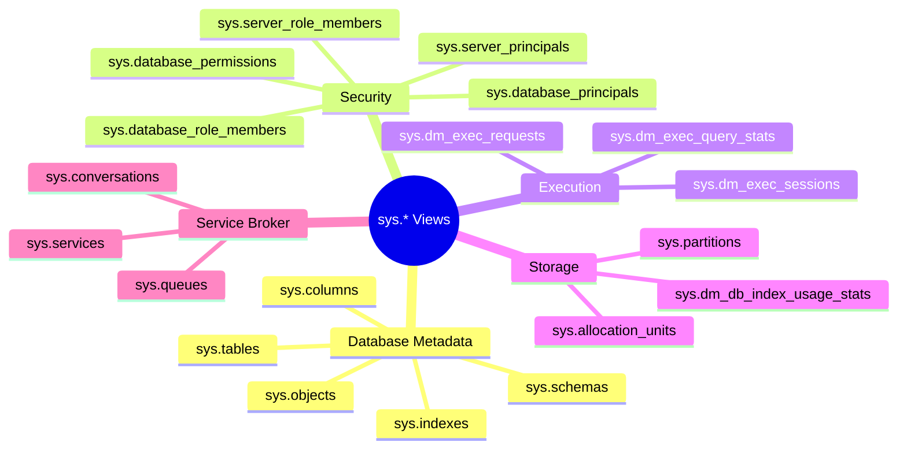

# Системні представлення та метадані

::lead
Системні представлення (System Catalog Views) — це потужний інструмент для аналізу структури бази даних, налаштувань безпеки та аудиту. Розуміння системних представлень критично важливе для ефективного управління безпекою SQL Server.
::

## Еволюція системних об'єктів

### SQL Server 2000: Системні таблиці

У SQL Server 2000 метадані зберігалися в **системних таблицях**, які мали назви з префіксом `sys`:

```sql
-- SQL Server 2000 (застарілий підхід)
SELECT * FROM sysobjects WHERE xtype = 'U';  -- Таблиці
SELECT * FROM syscolumns WHERE id = OBJECT_ID('MyTable');
SELECT * FROM syslogins;  -- Server logins
SELECT * FROM sysusers;   -- Database users
```

::warning
**Проблеми системних таблиць:**
- Відсутність документованої структури
- Можливість змін між версіями (breaking changes)
- Пряма залежність від внутрішньої реалізації SQL Server
- Відсутність абстракції
::

### SQL Server 2005+: Catalog Views

Починаю з SQL Server 2005, Microsoft впровадила **системні представлення каталогу** (Catalog Views):

```sql
-- SQL Server 2005+ (сучасний підхід)
SELECT * FROM sys.objects WHERE type = 'U';  -- Таблиці
SELECT * FROM sys.columns WHERE object_id = OBJECT_ID('MyTable');
SELECT * FROM sys.server_principals;  -- Server logins
SELECT * FROM sys.database_principals;  -- Database users
```

::tip
**Переваги Catalog Views:**
- ✅ Документована структура
- ✅ Backward compatibility гарантія
- ✅ Логічна організація
- ✅ Розширена інформація
- ✅ Підтримка сучасних функцій (Always Encrypted, RLS, тощо)
::

### Порівняльна таблиця

| SQL Server 2000 | SQL Server 2005+ | Призначення |
|----------------|------------------|-------------|
| `sysobjects` | `sys.objects` | Об'єкти БД |
| `syscolumns` | `sys.columns` | Стовпці таблиць |
| `sysindexes` | `sys.indexes` | Індекси |
| `sysdepends` | `sys.sql_dependencies` | Залежності об'єктів |
| `syslogins` | `sys.server_principals` | Server logins |
| `sysusers` | `sys.database_principals` | Database users |
| `sysprocedures` | `sys.procedures` | Stored procedures |

::note
**Зворотна сумісність:**

Старі системні таблиці досі доступні як **compatibility views** (`sys.sysobjects`, `sys.syscolumns`), але їх використання не рекомендується. Microsoft може прибрати їх підтримку в майбутніх версіях.
::

---

## Категорії системних представлень

Системні представлення організовані в логічні категорії:

::mermaid

::

---

## Security-Related System Views

### Server-Level Security Views

#### sys.server_principals

Містить усі server-level principals (logins, server roles):

```sql
-- Перегл всіх логінів
SELECT 
    principal_id,
    name AS LoginName,
    type_desc AS LoginType,
    is_disabled,
    create_date,
    modify_date,
    default_database_name
FROM sys.server_principals
WHERE type IN ('S', 'U', 'G')  -- S=SQL login, U=Windows login, G=Windows group
ORDER BY name;
```

**Типи principals:**
- `S` - SQL login
- `U` - Windows login  
- `G` - Windows group
- `R` - Server role
- `C` - Certificate mapped login
- `K` - Asymmetric key mapped login

**Практичні запити:**

```sql
-- 1. Знайти всі SQL-логіни з неактуальними паролями
SELECT 
    name AS LoginName,
    create_date,
    DATEDIFF(DAY, modify_date, GETDATE()) AS DaysSincePasswordChange
FROM sys.sql_logins
WHERE is_expiration_checked = 1
  AND DATEDIFF(DAY, modify_date, GETDATE()) > 90
ORDER BY DaysSincePasswordChange DESC;

-- 2. Знайти відключені логіни
SELECT 
    name AS DisabledLogin,
    type_desc,
    create_date
FROM sys.server_principals
WHERE is_disabled = 1
  AND type IN ('S', 'U')
ORDER BY name;

-- 3. Знайти логіни без політики паролів
SELECT 
    name AS WeakPasswordLogin,
    is_policy_checked,
    is_expiration_checked
FROM sys.sql_logins
WHERE is_policy_checked = 0 OR is_expiration_checked = 0
ORDER BY name;
```

#### sys.server_role_members

Членство в серверних ролях:

```sql
-- Хто є членами sysadmin?
SELECT 
    sp.name AS LoginName,
    sp.type_desc AS LoginType,
    sr.name AS RoleName
FROM sys.server_role_members srm
JOIN sys.server_principals sp ON srm.member_principal_id = sp.principal_id
JOIN sys.server_principals sr ON srm.role_principal_id = sr.principal_id
WHERE sr.name = 'sysadmin'
ORDER BY sp.name;

-- Всі членства в ролях з групуванням
SELECT 
    sr.name AS RoleName,
    COUNT(*) AS MemberCount,
    STRING_AGG(sp.name, ', ') AS Members
FROM sys.server_role_members srm
JOIN sys.server_principals sp ON srm.member_principal_id = sp.principal_id
JOIN sys.server_principals sr ON srm.role_principal_id = sr.principal_id
GROUP BY sr.name
ORDER BY MemberCount DESC, sr.name;
```

#### sys.server_permissions

Права на рівні сервера:

```sql
-- Кастомні права на сервері
SELECT 
    sp.name AS PrincipalName,
    sp.type_desc AS PrincipalType,
    pe.state_desc AS PermissionState,
    pe.permission_name AS Permission,
    pe.class_desc AS PermissionClass
FROM sys.server_permissions pe
JOIN sys.server_principals sp ON pe.grantee_principal_id = sp.principal_id
WHERE pe.class_desc <> 'SERVER_ROLE'  -- Виключаємо стандартні ролі
ORDER BY sp.name, pe.permission_name;
```

### Database-Level Security Views

#### sys.database_principals

Користувачі та ролі в поточній БД:

```sql
-- Всі користувачі поточної БД
SELECT 
    principal_id,
    name AS UserName,
    type_desc AS UserType,
    authentication_type_desc AS AuthType,
    default_schema_name,
    create_date
FROM sys.database_principals
WHERE type IN ('S', 'U', 'G')  -- S=SQL user, U=Windows user, G=Windows group
ORDER BY name;

-- Знайти orphaned users
SELECT 
    dp.name AS OrphanedUser,
    dp.sid AS UserSID
FROM sys.database_principals dp
LEFT JOIN sys.server_principals sp ON dp.sid = sp.sid
WHERE dp.type IN ('S', 'U')
  AND dp.name NOT IN ('dbo', 'guest', 'INFORMATION_SCHEMA', 'sys')
  AND sp.sid IS NULL;
```

#### sys.database_role_members

Членство в ролях БД:

```sql
-- Хто є членами db_owner?
SELECT 
    dp.name AS UserName,
    dp.type_desc AS UserType,
    dr.name AS RoleName
FROM sys.database_role_members drm
JOIN sys.database_principals dp ON drm.member_principal_id = dp.principal_id
JOIN sys.database_principals dr ON drm.role_principal_id = dr.principal_id
WHERE dr.name = 'db_owner'
ORDER BY dp.name;

-- Матриця користувачів та їх ролей
SELECT 
    dp.name AS UserName,
    STRING_AGG(dr.name, ', ') AS Roles
FROM sys.database_role_members drm
JOIN sys.database_principals dp ON drm.member_principal_id = dp.principal_id
JOIN sys.database_principals dr ON drm.role_principal_id = dr.principal_id
GROUP BY dp.name
ORDER BY dp.name;
```

#### sys.database_permissions

Права на об'єкти БД:

```sql
-- Детальний аналіз прав доступу
SELECT 
    dp.name AS PrincipalName,
    dp.type_desc AS PrincipalType,
    o.name AS ObjectName,
    o.type_desc AS ObjectType,
    pe.state_desc AS PermissionState,
    pe.permission_name AS Permission
FROM sys.database_permissions pe
JOIN sys.database_principals dp ON pe.grantee_principal_id = dp.principal_id
LEFT JOIN sys.objects o ON pe.major_id = o.object_id
WHERE dp.name NOT IN ('public', 'dbo')
ORDER BY dp.name, o.name, pe.permission_name;

-- Знайти всі DENY permissions
SELECT 
    dp.name AS PrincipalName,
    OBJECT_NAME(pe.major_id) AS ObjectName,
    pe.permission_name,
    pe.state_desc
FROM sys.database_permissions pe
JOIN sys.database_principals dp ON pe.grantee_principal_id = dp.principal_id
WHERE pe.state_desc = 'DENY'
ORDER BY dp.name;
```

---

## Metadata Views for Objects

### sys.objects

Базове представлення для всіх об'єктів БД:

```sql
-- Типи об'єктів та їх кількість
SELECT 
    type_desc AS ObjectType,
    COUNT(*) AS ObjectCount
FROM sys.objects
WHERE is_ms_shipped = 0  -- Виключити системні об'єкти
GROUP BY type_desc
ORDER BY ObjectCount DESC;

-- Коли були створені/змінені об'єкти
SELECT 
    name AS ObjectName,
    type_desc AS ObjectType,
    create_date,
    modify_date,
    DATEDIFF(DAY, modify_date, GETDATE()) AS DaysSinceModified
FROM sys.objects
WHERE is_ms_shipped = 0
ORDER BY modify_date DESC;
```

**Типи об'єктів:**

| Тип | type_desc | Опис |
|-----|-----------|------|
| `U` | USER_TABLE | Таблиці |
| `V` | VIEW | Представлення |
| `P` | SQL_STORED_PROCEDURE | Процедури |
| `FN` | SQL_SCALAR_FUNCTION | Scalar functions |
| `IF` | SQL_INLINE_TABLE_VALUED_FUNCTION | Inline TVF |
| `TF` | SQL_TABLE_VALUED_FUNCTION | Multi-statement TVF |
| `TR` | SQL_TRIGGER | DML тригери |
| `PK` | PRIMARY_KEY_CONSTRAINT | PK constraints |
| `F` | FOREIGN_KEY_CONSTRAINT | FK constraints |

### sys.sql_modules

Тексти stored procedures, functions, views:

```sql
-- Знайти процедури зі специфічним текстом (search for sp_executesql)
SELECT 
    o.name AS ProcedureName,
    o.type_desc,
    m.definition
FROM sys.sql_modules m
JOIN sys.objects o ON m.object_id = o.object_id
WHERE m.definition LIKE '%sp_executesql%'
ORDER BY o.name;

-- Знайти всі об'єкти, що використовують конкретну таблицю
SELECT 
    o.name AS ObjectName,
    o.type_desc AS ObjectType,
    m.definition
FROM sys.sql_modules m
JOIN sys.objects o ON m.object_id = o.object_id
WHERE m.definition LIKE '%Orders%'
  AND o.is_ms_shipped = 0
ORDER BY o.type_desc, o.name;
```

### sys.columns

Детальна інформація про стовпці:

```sql
-- Аналіз типів даних
SELECT 
    t.name AS TableName,
    c.name AS ColumnName,
    ty.name AS DataType,
    c.max_length,
    c.precision,
    c.scale,
    c.is_nullable,
    c.is_identity
FROM sys.columns c
JOIN sys.tables t ON c.object_id = t.object_id
JOIN sys.types ty ON c.user_type_id = ty.user_type_id
WHERE t.is_ms_shipped = 0
ORDER BY t.name, c.column_id;

-- Знайти таблиці з стовпцями певного типу
SELECT 
    t.name AS TableName,
    COUNT(*) AS VarcharColumnCount
FROM sys.columns c
JOIN sys.tables t ON c.object_id = t.object_id
JOIN sys.types ty ON c.user_type_id = ty.user_type_id
WHERE ty.name = 'varchar'
  AND t.is_ms_shipped = 0
GROUP BY t.name
HAVING COUNT(*) > 5
ORDER BY VarcharColumnCount DESC;
```

### sys.indexes та sys.index_columns

Інформація про індекси:

```sql
-- Аналіз індексів
SELECT 
    t.name AS TableName,
    i.name AS IndexName,
    i.type_desc AS IndexType,
    i.is_unique,
    i.is_primary_key,
    STUFF((
        SELECT ', ' + c.name
        FROM sys.index_columns ic
        JOIN sys.columns c ON ic.object_id = c.object_id AND ic.column_id = c.column_id
        WHERE ic.object_id = i.object_id AND ic.index_id = i.index_id
        ORDER BY ic.key_ordinal
        FOR XML PATH('')
    ), 1, 2, '') AS IndexColumns
FROM sys.indexes i
JOIN sys.tables t ON i.object_id = t.object_id
WHERE t.is_ms_shipped = 0
  AND i.type > 0  -- Exclude heap
ORDER BY t.name, i.name;
```

---

## Dynamic Management Views (DMVs)

DMVs надають інформацію про поточний стан сервера та виконання запитів.

### sys.dm_exec_sessions

Активні сесії:

```sql
-- Хто зараз підключений?
SELECT 
    s.session_id,
    s.login_name,
    s.host_name,
    s.program_name,
    s.login_time,
    s.status,
    s.last_request_start_time,
    s.last_request_end_time
FROM sys.dm_exec_sessions s
WHERE s.is_user_process = 1
ORDER BY s.login_time DESC;

-- Підрахувати підключення по логінах
SELECT 
    login_name,
    COUNT(*) AS SessionCount,
    MAX(login_time) AS LastLogin
FROM sys.dm_exec_sessions
WHERE is_user_process = 1
GROUP BY login_name
ORDER BY SessionCount DESC;
```

### sys.dm_exec_requests

Виконувані запити:

```sql
-- Що виконується зараз?
SELECT 
    r.session_id,
    s.login_name,
    r.status,
    r.command,
    DB_NAME(r.database_id) AS DatabaseName,
    r.cpu_time,
    r.total_elapsed_time,
    SUBSTRING(
        t.text,
        (r.statement_start_offset/2) + 1,
        ((CASE r.statement_end_offset
            WHEN -1 THEN DATALENGTH(t.text)
            ELSE r.statement_end_offset
        END - r.statement_start_offset)/2) + 1
    ) AS CurrentQuery
FROM sys.dm_exec_requests r
JOIN sys.dm_exec_sessions s ON r.session_id = s.session_id
CROSS APPLY sys.dm_exec_sql_text(r.sql_handle) t
WHERE s.is_user_process = 1
ORDER BY r.cpu_time DESC;
```

---

## Практичні сценарії

### Security Audit Reports

#### 1. Повний Security Audit

```sql
-- Comprehensive Security Report
-- =============================

-- 1. Server Logins Summary
PRINT '=== SERVER LOGINS ==='
SELECT 
    'Total Logins' AS Metric,
    COUNT(*) AS Value
FROM sys.server_principals
WHERE type IN ('S', 'U', 'G')

UNION ALL

SELECT 
    'SQL Logins',
    COUNT(*)
FROM sys.server_principals
WHERE type = 'S'

UNION ALL

SELECT 
    'Windows Logins',
    COUNT(*)
FROM sys.server_principals
WHERE type IN ('U', 'G')

UNION ALL

SELECT 
    'Disabled Logins',
    COUNT(*)
FROM sys.server_principals
WHERE is_disabled = 1 AND type IN ('S', 'U', 'G');

-- 2. Sysadmin Members (HIGH RISK)
PRINT CHAR(10) + '=== SYSADMIN MEMBERS (HIGH RISK) ==='
SELECT 
    sp.name AS LoginName,
    sp.type_desc AS LoginType,
    sp.create_date,
    sp.is_disabled
FROM sys.server_role_members srm
JOIN sys.server_principals sp ON srm.member_principal_id = sp.principal_id
JOIN sys.server_principals sr ON srm.role_principal_id = sr.principal_id
WHERE sr.name = 'sysadmin'
ORDER BY sp.name;

-- 3. Database Users without Logins (Orphaned)
PRINT CHAR(10) + '=== ORPHANED USERS ==='
SELECT 
    DB_NAME() AS DatabaseName,
    dp.name AS OrphanedUser,
    dp.type_desc
FROM sys.database_principals dp
LEFT JOIN sys.server_principals sp ON dp.sid = sp.sid
WHERE dp.type IN ('S', 'U')
  AND dp.name NOT IN ('dbo', 'guest', 'INFORMATION_SCHEMA', 'sys')
  AND sp.sid IS NULL;

-- 4. Permissions Report
PRINT CHAR(10) + '=== DATABASE PERMISSIONS ==='
SELECT TOP 100
    dp.name AS PrincipalName,
    dp.type_desc AS PrincipalType,
    o.name AS ObjectName,
    o.type_desc AS ObjectType,
    pe.state_desc AS PermissionState,
    pe.permission_name
FROM sys.database_permissions pe
JOIN sys.database_principals dp ON pe.grantee_principal_id = dp.principal_id
LEFT JOIN sys.objects o ON pe.major_id = o.object_id
WHERE dp.name NOT IN ('public')
ORDER BY dp.name, pe.state_desc DESC, o.name;
```

#### 2. Password Policy Compliance

```sql
-- Check Password Policy Compliance
SELECT 
    name AS LoginName,
    CASE 
        WHEN is_policy_checked = 0 THEN '⚠️ Password policy NOT enforced'
        ELSE '✅ Password policy enforced'
    END AS PolicyStatus,
    CASE 
        WHEN is_expiration_checked = 0 THEN '⚠️ No expiration'
        ELSE '✅ Expiration enabled'
    END AS ExpirationStatus,
    DATEDIFF(DAY, modify_date, GETDATE()) AS DaysSincePasswordChange,
    CASE 
        WHEN DATEDIFF(DAY, modify_date, GETDATE()) > 90 THEN '⚠️ Password > 90 days old'
        WHEN DATEDIFF(DAY, modify_date, GETDATE()) > 60 THEN '⚡ Password > 60 days old'
        ELSE '✅ Password recent'
    END AS PasswordAgeStatus
FROM sys.sql_logins
WHERE is_disabled = 0
ORDER BY DaysSincePasswordChange DESC;
```

#### 3. Permission Changes History

```sql
-- Створити audit для відстеження змін permissions
CREATE TABLE dbo.PermissionsAuditLog (
    AuditID INT IDENTITY(1,1) PRIMARY KEY,
    EventDate DATETIME DEFAULT GETDATE(),
    LoginName NVARCHAR(128),
    EventType NVARCHAR(100),
    PrincipalName NVARCHAR(128),
    ObjectName NVARCHAR(256),
    Permission NVARCHAR(128),
    TSQLCommand NVARCHAR(MAX)
);
GO

-- DDL Trigger для логування GRANT/DENY/REVOKE
CREATE TRIGGER trg_AuditPermissionChanges
ON DATABASE
FOR GRANT_DATABASE, DENY_DATABASE, REVOKE_DATABASE
AS
BEGIN
    SET NOCOUNT ON;
    
    DECLARE @EventData XML = EVENTDATA();
    
    INSERT INTO dbo.PermissionsAuditLog (
        LoginName,
        EventType,
        PrincipalName,
        ObjectName,
        Permission,
        TSQLCommand
    )
    VALUES (
        @EventData.value('(/EVENT_INSTANCE/LoginName)[1]', 'NVARCHAR(128)'),
        @EventData.value('(/EVENT_INSTANCE/EventType)[1]', 'NVARCHAR(100)'),
        @EventData.value('(/EVENT_INSTANCE/Grantees/Grantee)[1]', 'NVARCHAR(128)'),
        @EventData.value('(/EVENT_INSTANCE/ObjectName)[1]', 'NVARCHAR(256)'),
        @EventData.value('(/EVENT_INSTANCE/Permissions/Permission)[1]', 'NVARCHAR(128)'),
        @EventData.value('(/EVENT_INSTANCE/TSQLCommand/CommandText)[1]', 'NVARCHAR(MAX)')
    );
END;
GO
```

---

## Best Practices

::card-group{class="mt-6"}
  ::card{icon="i-lucide-shield-check"}
  #title
  Регулярний Audit
  #description
  Створюйте automated scripts для перевірки security configuration щотижня
  ::

  ::card{icon="i-lucide-database"}
  #title
  Використовуйте sys.* замість сумісності
  #description
  Завжди використовуйте `sys.*` views замість застарілих `sys.sys*` compatibility views
  ::

  ::card{icon="i-lucide-clock"}
  #title
  Моніторинг DMVs
  #description
  Регулярно перевіряйте DMVs для виявлення підозрілої активності
  ::

  ::card{icon="i-lucide-file-text"}
  #title
  Документація
  #description
  Зберігайте результати security audits для compliance та forensics
  ::
::

### Recommended Audit Schedule

```sql
-- Weekly Security Audit Job
-- Запускати кожного понеділка о 02:00
CREATE PROCEDURE usp_WeeklySecurityAudit
AS
BEGIN
    -- 1. Check for new sysadmins
    -- 2. Check orphaned users
    -- 3. Verify password policies
    -- 4. Review recent permission changes
    -- 5. Send email report to security team
    
    -- Implementation here...
END;
GO
```

---

## Висновки

Системні представлення — це основа для:
1. **Security management** — перевірка логінів, користувачів, прав
2. **Compliance auditing** — звіти для регуляторів
3. **Troubleshooting** — виявлення проблем з доступом
4. **Documentation** — автоматична документація схеми БД

::tip
**Корисні ресурси:**
- [Microsoft Docs: System Catalog Views](https://learn.microsoft.com/en-us/sql/relational-databases/system-catalog-views/catalog-views-transact-sql)
- [DMVs Reference](https://learn.microsoft.com/en-us/sql/relational-databases/system-dynamic-management-views/system-dynamic-management-views)
::

У наступній статті розглянемо [Authentication](/databases/security/authentication) — детально про Windows та SQL Server Authentication.
