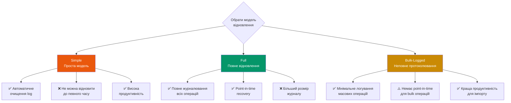
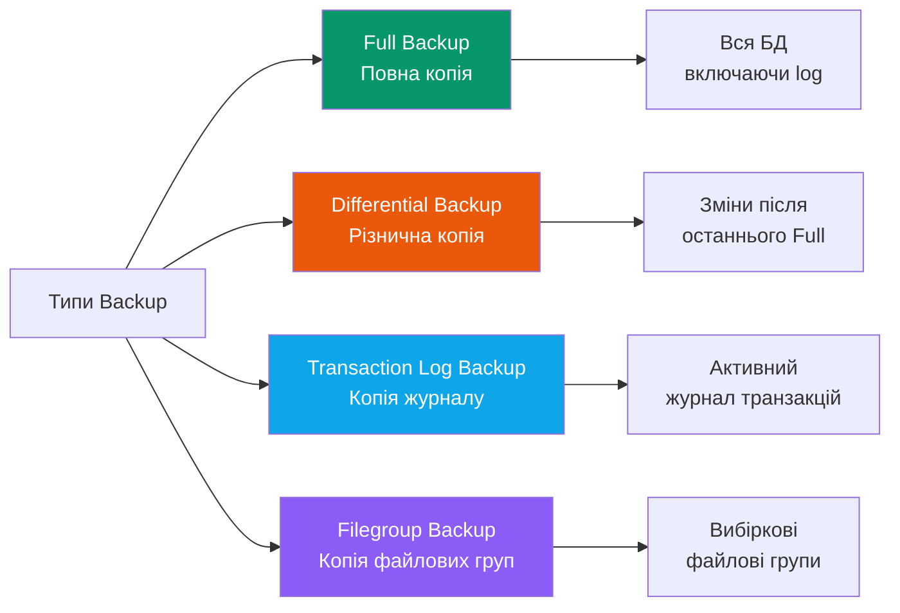
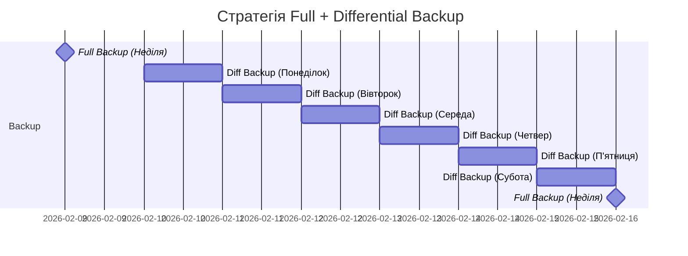
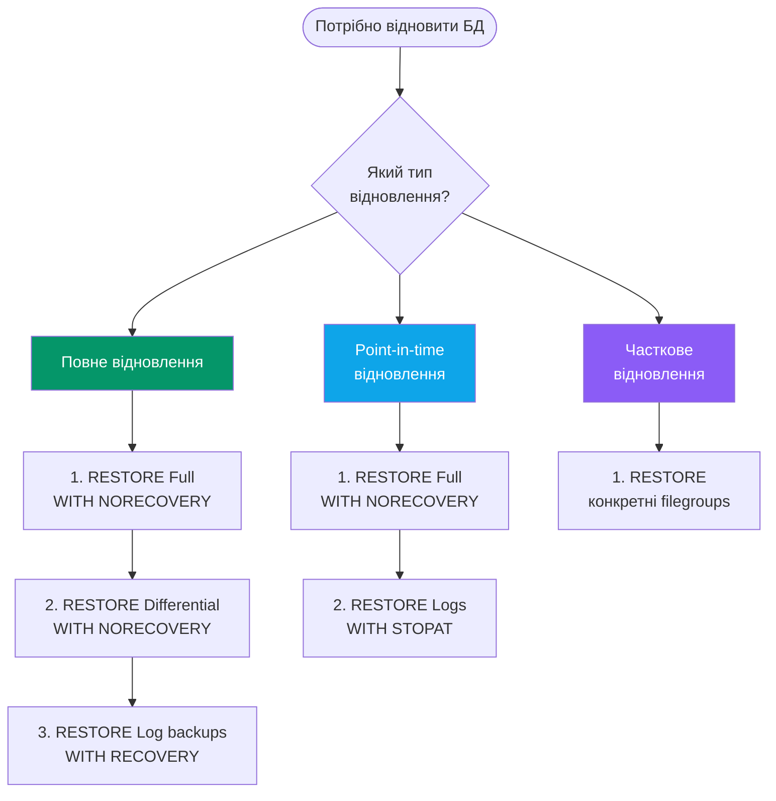

# Резервне копіювання та відновлення

::lead
Резервне копіювання (backup) та відновлення (restore) — це два найважливіших адміністративних процеси, які забезпечують захист даних від втрати. Регулярне виконання backup/restore бази даних та журналу транзакцій дозволяє уникнути втрати даних при будь-яких збоях.
::

## Чому резервне копіювання критично важливе?

У процесі роботи БД можуть виникнути різні непередбачувані ситуації:

::card-group{class="mt-6"}
  ::card{icon="i-lucide-flame"}
  #title
  Стихійні лиха
  #description
  Пожежа, повінь, землетрус — фізичне знищення серверів та носіїв даних
  ::

  ::card{icon="i-lucide-hard-drive-download"}
  #title
  Апаратні збої
  #description
  Вихід з ладу жорстких дисків, RAID-контролерів, пам'яті або материнської плати
  ::

  ::card{icon="i-lucide-user-x"}
  #title
  Помилки користувачів
  #description
  Випадкове видалення даних, неправильні UPDATE запити без WHERE clause
  ::

  ::card{icon="i-lucide-bug"}
  #title
  Програмні помилки
  #description
  Баги в додатках, пошкодження даних, ransomware атаки
  ::
::

::warning
**Реальна статистика:**
- 31% компаній втратили дані через випадкове видалення (Veeam, 2023)
- Середній час простою після втрати даних: 7.9 годин
- 60% компаній без backup закриваються протягом року після втрати даних
::

---

## Recovery Models: Моделі відновлення

Модель відновлення (Recovery Model) визначає, як SQL Server працює з журналом транзакцій — реєструє та очищає (truncating) його.

::mermaid

::

### 1. Simple Recovery Model (Проста модель)

**Характеристики:**
- Реєструє мінімум даних про транзакції
- Автоматично очищує log після кожної checkpoint
- Не підтримує backup журналу транзакцій
- Не дозволяє point-in-time recovery

**Використання:**
- Тестові та dev середовища
- Бази даних з даними, які легко відновити
- Випадки, коли втрата даних за останній час прийнятна

**Переваги/недоліки:**

| ✅ Переваги | ❌ Недоліки |
|------------|------------|
| Мінімальний розмір log файлу | Втрата незбережених транзакцій |
| Висока продуктивність | Відновлення лише до останнього full/diff backup |
| Автоматичне управління log | Не підходить для критичних даних |

### 2. Full Recovery Model (Повне відновлення)

**Характеристики:**
- Реєструє ВСІ транзакції повністю
- Log НЕ очищається автоматично
- Підтримує backup журналу транзакцій
- Дозволяє point-in-time recovery

**Використання:**
- Production бази даних
- Критично важливі дані
- Коли потрібно відновити до конкретної секунди

**Стратегія backup:**
```sql
-- 1. Full backup (щотижня)
BACKUP DATABASE ProductionDB
TO DISK = 'D:\Backup\ProductionDB_Full.bak'
WITH COMPRESSION, INIT;

-- 2. Differential backup (щодня)
BACKUP DATABASE ProductionDB
TO DISK = 'D:\Backup\ProductionDB_Diff.bak'
WITH DIFFERENTIAL, COMPRESSION;

-- 3. Transaction log backup (кожну годину)
BACKUP LOG ProductionDB
TO DISK = 'D:\Backup\ProductionDB_Log.trn'
WITH COMPRESSION;
```

::tip
**Best Practice:**

Регулярно backup журналу транзакцій! Без цього log файл буде рости необмежено і може заповнити весь диск.
::

### 3. Bulk-Logged Recovery Model

**Характеристики:**
- Повне логування звичайних операцій
- Мінімальне логування масових операцій:
  - `SELECT INTO`
  - `BULK INSERT`
  - `CREATE INDEX`
  - `BCP` utility

**Використання:**
- Тимчасово під час великих імпортів даних
- ETL процеси

**Приклад використання:**
```sql
-- Перед масовим імпортом
ALTER DATABASE ImportDB SET RECOVERY BULK_LOGGED;
GO

-- Масовий імпорт
SELECT * INTO dbo.ArchiveOrders
FROM dbo.Orders
WHERE OrderDate < '2020-01-01';

BULK INSERT dbo.ImportedData
FROM 'D:\Data\import.csv'
WITH (FORMATFILE = 'D:\format.xml');

-- Після імпорту повернути Full recovery
ALTER DATABASE ImportDB SET RECOVERY FULL;
GO

-- Обов'язково зробити full backup
BACKUP DATABASE ImportDB
TO DISK = 'D:\Backup\ImportDB_AfterBulk.bak'
WITH COMPRESSION;
```

### Перевірка та зміна моделі відновлення

**Перевірити поточну модель:**
```sql
SELECT 
    name AS DatabaseName,
    recovery_model_desc AS RecoveryModel,
    log_reuse_wait_desc AS LogReuseWait
FROM sys.databases
WHERE name NOT IN ('master', 'model', 'msdb', 'tempdb')
ORDER BY name;
```

**Змінити модель:**
```sql
-- Встановити Full recovery
ALTER DATABASE MyDatabase SET RECOVERY FULL;

-- Встановити Simple recovery
ALTER DATABASE MyDatabase SET RECOVERY SIMPLE;

-- Встановити Bulk-Logged recovery
ALTER DATABASE MyDatabase SET RECOVERY BULK_LOGGED;
```

::note
**Важливо:**

Після зміни моделі з Simple на Full, обов'язково зробіть повний backup БД! Інакше backup журналу транзакцій не працюватиме.
::

---

## Види резервного копіювання

SQL Server підтримує кілька типів backup, які використовуються в різних стратегіях відновлення.

::mermaid

::

### 1. Full Database Backup (Повна резервна копія)

**Що включає:**
- Всі дані всіх таблиць
- Всі об'єкти БД (stored procedures, views, functions, тощо)
- Частину журналу транзакцій (для узгодженості)

**Синтаксис:**
```sql
BACKUP DATABASE { database_name | @database_name_var }
TO <backup_device> [, ...n]
[MIRROR TO <backup_device> [, ...n]]
[WITH options];
```

**Практичні приклади:**

```sql
-- 1. Простий full backup на диск
BACKUP DATABASE ProductionDB
TO DISK = 'D:\Backup\ProductionDB_Full.bak'
WITH INIT;  -- Перезаписати існуючий файл

-- 2. Full backup з compression та опцією overwrit
BACKUP DATABASE ProductionDB
TO DISK = 'D:\Backup\ProductionDB_Full_20260213.bak'
WITH 
    COMPRESSION,  -- Стисн ення (зменшує розмір на 50-70%)
    CHECKSUM,     -- Перевірка цілісності
    INIT,         -- Перезаписати
    STATS = 10;   -- Показувати прогрес кожні 10%

-- 3. Backup з описом та терміном дії
BACKUP DATABASE ProductionDB
TO DISK = 'D:\Backup\ProductionDB.bak'
WITH 
    DESCRIPTION = 'Weekly full backup before deployment',
    NAME = 'ProductionDB-Full Backup',
    RETAINDAYS = 7,  -- Зберігати 7 днів
    COMPRESSION;

-- 4. Backup на кілька файлів (stripe set)
BACKUP DATABASE LargeDB
TO DISK = 'D:\Backup\LargeDB_1.bak',
   DISK = 'E:\Backup\LargeDB_2.bak',
   DISK = 'F:\Backup\LargeDB_3.bak'
WITH COMPRESSION, FORMAT;

-- 5. Backup на мережевий ресурс (UNC path)
BACKUP DATABASE ProductionDB
TO DISK = '\\BackupServer\SQLBackups\ProductionDB.bak'
WITH COMPRESSION, INIT;
```

::warning
**Важливі моменти:**

1. **Блокування**: Під час backup БД продовжує працювати, але може спостерігатися зниження продуктивності
2. **Розмір**: Full backup може бути дуже великим для великих БД
3. **Мережеві backup**: Потрібні відповідні права доступу до мережевої папки
::

### 2. Differential Backup (Різнична резервна копія)

**Що включає:**
- Тільки екстенти (blocks), що змінилися після останнього **FULL** backup

**Переваги:**
- Менший розмір, ніж full backup
- Швидше створюється
- Потребує лише останній full + останній differential для відновлення

::mermaid

::

**Приклади:**
```sql
-- 1. Створити differential backup
BACKUP DATABASE ProductionDB
TO DISK = 'D:\Backup\ProductionDB_Diff.bak'
WITH DIFFERENTIAL, COMPRESSION, INIT;

-- 2. Differential backup з датою у назві
DECLARE @BackupFile NVARCHAR(500);
SET @BackupFile = 'D:\Backup\ProductionDB_Diff_' + 
                  CONVERT(VARCHAR, GETDATE(), 112) + '.bak';

BACKUP DATABASE ProductionDB
TO DISK = @BackupFile
WITH DIFFERENTIAL, COMPRESSION;

-- 3. Стратегія відновлення: Full + Latest Differential
-- Крок 1: Відновити Full backup
RESTORE DATABASE ProductionDB
FROM DISK = 'D:\Backup\ProductionDB_Full.bak'
WITH NORECOVERY;  -- Важливо!

-- Крок 2: Відновити останній Differential
RESTORE DATABASE ProductionDB
FROM DISK = 'D:\Backup\ProductionDB_Diff.bak'
WITH RECOVERY;  -- Завершити відновлення
```

::tip
**Порада щодо стратегії:**

Differential накопичує зміни з часом. Якщо differential стає занадто великим (>50% від full), краще зробити новий full backup.
::

### 3. Transaction Log Backup

**Що включає:**
- Активний журнал транзакцій з моменту останнього log backup
- Дозволяє point-in-time recovery

**Синтаксис:**
```sql
BACKUP LOG { database_name | @database_name_var }
TO <backup_device> [, ...n]
[WITH options];
```

**Практичні приклади:**
```sql
-- 1. Простий backup журналу
BACKUP LOG ProductionDB
TO DISK = 'D:\Backup\ProductionDB_Log.trn'
WITH COMPRESSION;

-- 2. Log backup з автоматичною назвою
DECLARE @LogBackupFile NVARCHAR(500);
SET @LogBackupFile = 'D:\Backup\ProductionDB_Log_' + 
                      CONVERT(VARCHAR, GETDATE(), 112) + '_' +
                      REPLACE(CONVERT(VARCHAR, GETDATE(), 108), ':', '') + '.trn';

BACKUP LOG ProductionDB
TO DISK = @LogBackupFile
WITH COMPRESSION;

-- 3. Tail-log backup перед відновленням
-- (зберігає активні транзакції навіть якщо БД пошкоджена)
BACKUP LOG ProductionDB
TO DISK = 'D:\Backup\ProductionDB_TailLog.trn'
WITH NO_TRUNCATE, NORECOVERY;

-- 4. Очистити log без backup (Simple recovery)
BACKUP LOG ProductionDB WITH TRUNCATE_ONLY;  -- Deprecated!
-- Замість цього використовуйте:
ALTER DATABASE ProductionDB SET RECOVERY SIMPLE;
DBCC SHRINKFILE (ProductionDB_Log, 1024);  -- Зменшити до 1GB
ALTER DATABASE ProductionDB SET RECOVERY FULL;
```

### 4. Filegroup Backup

**Використання:**
- Дуже великі БД (terabytes)
- Backup окремих файлових груп
- Часткове відновлення

**Приклад:**
```sql
-- 1. Backup конкретної файлової групи
BACKUP DATABASE MyLargeDB
    FILEGROUP = 'HistoricalData'
TO DISK = 'D:\Backup\MyLargeDB_Historical_FG.bak'
WITH COMPRESSION;

-- 2. Backup кількох файлових груп
BACKUP DATABASE MyLargeDB
    FILEGROUP = 'PRIMARY',
    FILEGROUP = 'CurrentYear'
TO DISK = 'D:\Backup\MyLargeDB_Current.bak'
WITH COMPRESSION;

-- 3. Backup тільки read-write файлових груп
BACKUP DATABASE MyLargeDB
    READ_WRITE_FILEGROUPS
TO DISK = 'D:\Backup\MyLargeDB_RW.bak'
WITH COMPRESSION;
```

---

## Логічні пристрої резервного копіювання

Логічні пристрої (Backup Devices) — це іменовані псевдоніми для фізичних шляхів backup файлів.

**Переваги:**
- Простота використання
- Не потрібно запам'ятовувати довгі шляхи
- Легко змінювати фізичне розташування

**Створення та використання:**
```sql
-- 1. Створити логічний пристрій
EXEC sp_addumpdevice 
    @devtype = 'disk',
    @logicalname = 'ProductionDB_FullBackup',
    @physicalname = 'D:\Backup\ProductionDB_Full.bak';

-- 2. Використовувати при backup
BACKUP DATABASE ProductionDB
TO ProductionDB_FullBackup
WITH COMPRESSION;

-- 3. Переглянути існуючі пристрої
SELECT name, physical_name, device_type
FROM sys.backup_devices;

-- 4. Видалити логічний пристрій
EXEC sp_dropdevice 
    @logicalname = 'ProductionDB_FullBackup',
    @delfile = 'delfile';  -- Видалити також фізичний файл
```

---

## Дзеркальні набори носіїв (Miroring Backup)

Створення кількох копій backup одночасно для додаткової надійності.

```sql
-- Backup з двома дзеркалами
BACKUP DATABASE ProductionDB
TO  DISK = 'D:\Backup\ProductionDB.bak',
    DISK = 'E:\Backup\ProductionDB.bak'
MIRROR TO 
    DISK = '\\BackupServer1\Backups\ProductionDB.bak',
    DISK = '\\BackupServer1\Backups2\ProductionDB.bak'
MIRROR TO
    DISK = '\\BackupServer2\Backups\ProductionDB.bak',
    DISK = '\\BackupServer2\Backups2\ProductionDB.bak'
WITH FORMAT, MEDIANAME = 'ProductionDBMirrorSet', COMPRESSION;
```

::note
**Обов'язкова умова:**

Для mirror backup ПОТРІБНО вказати опцію `FORMAT`. Це перезапише існуючі заголовки носіїв.
::

---

## Відновлення з резервної копії (RESTORE)

Процес відновлення залежить від обраної стратегії backup.

### Сценарії відновлення

::mermaid

::

### 1. Повне відновлення БД

```sql
-- Варіант 1: Тільки Full backup
RESTORE DATABASE ProductionDB
FROM DISK = 'D:\Backup\ProductionDB_Full.bak'
WITH REPLACE, RECOVERY;

-- Варіант 2: Full + Differential backup
-- Крок 1: Відновити Full
RESTORE DATABASE ProductionDB
FROM DISK = 'D:\Backup\ProductionDB_Full.bak'
WITH NORECOVERY;  -- Не завершувати відновлення!

-- Крок 2: Відновити Differential
RESTORE DATABASE ProductionDB
FROM DISK = 'D:\Backup\ProductionDB_Diff.bak'
WITH RECOVERY;  -- Завершити відновлення

-- Варіант 3: Full + Differential + Transaction Logs
-- Крок 1: Full
RESTORE DATABASE ProductionDB
FROM DISK = 'D:\Backup\ProductionDB_Full.bak'
WITH NORECOVERY;

-- Крок 2: Differential
RESTORE DATABASE ProductionDB
FROM DISK = 'D:\Backup\ProductionDB_Diff.bak'
WITH NORECOVERY;

-- Крок 3: Transaction Logs (кілька)
RESTORE LOG ProductionDB
FROM DISK = 'D:\Backup\ProductionDB_Log1.trn'
WITH NORECOVERY;

RESTORE LOG ProductionDB
FROM DISK = 'D:\Backup\ProductionDB_Log2.trn'
WITH NORECOVERY;

RESTORE LOG ProductionDB
FROM DISK = 'D:\Backup\ProductionDB_Log3.trn'
WITH RECOVERY;  -- Останній з RECOVERY
```

::warning
**Критично важливо:**

- Використовуйте `WITH NORECOVERY` для всіх кроків КРІМ останнього
- `WITH RECOVERY` тільки на останньому кроці
- Порядок: Full → Differential → Log backups (у хронологічному порядку)
::

### 2. Point-in-Time Recovery

Відновлення до конкретного моменту часу:

```sql
-- Відновити до конкретної дати/часу
-- Крок 1: Full backup
RESTORE DATABASE ProductionDB
FROM DISK = 'D:\Backup\ProductionDB_Full.bak'
WITH NORECOVERY;

-- Крок 2: Differential (якщо є)
RESTORE DATABASE ProductionDB
FROM DISK = 'D:\Backup\ProductionDB_Diff.bak'
WITH NORECOVERY;

-- Крок 3: Transaction Logs з STOPAT
RESTORE LOG ProductionDB
FROM DISK = 'D:\Backup\ProductionDB_Log1.trn'
WITH NORECOVERY;

RESTORE LOG ProductionDB
FROM DISK = 'D:\Backup\ProductionDB_Log2.trn'
WITH STOPAT = '2026-02-13 14:30:00',  -- Точний час
     RECOVERY;

-- Відновити до конкретної транзакції (marked transaction)
BEGIN TRANSACTION ImportantUpdate
WITH MARK 'Before critical update';

-- ... щось виконується ...

COMMIT TRANSACTION ImportantUpdate;

-- Потім відновити ДО цієї мітки:
RESTORE LOG ProductionDB
FROM DISK = 'D:\Backup\ProductionDB_Log.trn'
WITH STOPATMARK = 'ImportantUpdate',
     RECOVERY;
```

### 3. Відновлення з переміщенням файлів

Корисно при відновленні на іншому сервері або при зміні структури каталогів:

```sql
-- Спочатку подивитися, які файли в backup
RESTORE FILELISTONLY
FROM DISK = 'D:\Backup\ProductionDB_Full.bak';

-- Відновити з переміщенням файлів
RESTORE DATABASE ProductionDB_Test
FROM DISK = 'D:\Backup\ProductionDB_Full.bak'
WITH 
    MOVE 'ProductionDB_Data' TO 'E:\DataFiles\ProductionDB_Test.mdf',
    MOVE 'ProductionDB_Log' TO 'F:\LogFiles\ProductionDB_Test.ldf',
    REPLACE,
    RECOVERY;
```

### 4. Відновлення з Database Snapshot

```sql
-- 1. Створити snapshot
CREATE DATABASE ProductionDB_Snapshot
ON
(
    NAME = ProductionDB_Data,
    FILENAME = 'D:\Snapshots\ProductionDB_Snapshot.ss'
)
AS SNAPSHOT OF ProductionDB;

-- 2. Виконати якісь зміни в основній БД...

-- 3. Відновити з snapshot
RESTORE DATABASE ProductionDB
FROM DATABASE_SNAPSHOT = 'ProductionDB_Snapshot';

-- 4. Видалити snapshot
DROP DATABASE ProductionDB_Snapshot;
```

---

## Перевірка резервних копій

Перевірка без фактичного відновлення:

```sql
-- 1. Verify backup integrity
RESTORE VERIFYONLY
FROM DISK = 'D:\Backup\ProductionDB_Full.bak'
WITH CHECKSUM;

-- 2. Переглянути заголовок backup
RESTORE HEADERONLY
FROM DISK = 'D:\Backup\ProductionDB_Full.bak';

-- 3. Переглянути файли в backup
RESTORE FILELISTONLY
FROM DISK = 'D:\Backup\ProductionDB_Full.bak';

-- 4. Перевірити кілька backup файлів
RESTORE VERIFYONLY
FROM DISK = 'D:\Backup\ProductionDB_Full.bak',
     DISK = 'D:\Backup\ProductionDB_Diff.bak'
WITH LOADHISTORY;
```

---

## Best Practices: Стратегії резервного копіювання

### 1. Стратегія для малих/середніх БД (<100 GB)

```sql
-- Неділя: Full backup
BACKUP DATABASE SmallDB
TO DISK = 'D:\Backup\SmallDB_Full_Sunday.bak'
WITH COMPRESSION, INIT;

-- Понеділок-Субота: Differential backup
BACKUP DATABASE SmallDB
TO DISK = 'D:\Backup\SmallDB_Diff_Monday.bak'
WITH DIFFERENTIAL, COMPRESSION, INIT;

-- Кожні 4 години: Transaction Log backup
BACKUP LOG SmallDB
TO DISK = 'D:\Backup\SmallDB_Log_' + 
          CONVERT(VARCHAR, GETDATE(), 112) + '.trn'
WITH COMPRESSION;
```

### 2. Стратегія для великих БД (>1 TB)

```sql
-- Неділя: Full backup (може тривати години)
BACKUP DATABASE LargeDB
TO DISK = 'D:\Backup\LargeDB_Sunday_1.bak',
   DISK = 'E:\Backup\LargeDB_Sunday_2.bak',
   DISK = 'F:\Backup\LargeDB_Sunday_3.bak'
WITH COMPRESSION, FORMAT;

-- Щодня: Differential backup
BACKUP DATABASE LargeDB
TO DISK = 'D:\Backup\LargeDB_Diff.bak'
WITH DIFFERENTIAL, COMPRESSION, INIT;

-- Кожну годину: Transaction Log backup
BACKUP LOG LargeDB
TO DISK = 'D:\Backup\LargeDB_Log_' + 
          CONVERT(VARCHAR, GETDATE(), 112) + '_' +
          REPLACE(CONVERT(VARCHAR, GETDATE(), 108), ':', '') + '.trn'
WITH COMPRESSION;
```

### 3. Автоматизація через SQL Server Agent

```sql
-- Створити Job для щоденного full backup
USE msdb;
GO

EXEC sp_add_job
    @job_name = N'Daily Full Backup - ProductionDB';

EXEC sp_add_jobstep
    @job_name = N'Daily Full Backup - ProductionDB',
    @step_name = N'Perform Backup',
    @subsystem = N'TSQL',
    @command = N'
        BACKUP DATABASE ProductionDB
        TO DISK = ''D:\Backup\ProductionDB_Full.bak''
        WITH COMPRESSION, INIT, CHECKSUM;
    ';

EXEC sp_add_schedule
    @schedule_name = N'Daily at 2 AM',
    @freq_type = 4,  -- Daily
    @freq_interval = 1,
    @active_start_time = 020000;  -- 02:00:00

EXEC sp_attach_schedule
    @job_name = N'Daily Full Backup - ProductionDB',
    @schedule_name = N'Daily at 2 AM';

EXEC sp_add_jobserver
    @job_name = N'Daily Full Backup - ProductionDB';
GO
```

---

## Практичні завдання

::accordion
  ::accordion-item{value="task1"}
  #title
  ### Завдання 1: Створення стратегії backup
  #content
  **Умова:**

Створіть комплексну стратегію резервного копіювання для вашої бази даних:
1. Встановіть Full Recovery Model
2. Створіть логічні пристрої для Full, Differential та Log backups
3. Виконайте повний цикл: Full → Differential → Log backup

**Розв'язок:**

```sql
-- 1. Встановити Full Recovery Model
USE master;
GO
ALTER DATABASE MyDatabase SET RECOVERY FULL;
GO

-- 2. Створити логічні пристрої
EXEC sp_addumpdevice 'disk', 'MyDB_Full', 'D:\Backup\MyDB_Full.bak';
EXEC sp_addumpdevice 'disk', 'MyDB_Diff', 'D:\Backup\MyDB_Diff.bak';
EXEC sp_addumpdevice 'disk', 'MyDB_Log', 'D:\Backup\MyDB_Log.trn';
GO

-- 3. Виконати Full backup
BACKUP DATABASE MyDatabase
TO MyDB_Full
WITH COMPRESSION, INIT, CHECKSUM;
GO

-- Виконати деякі зміни...
INSERT INTO MyTable VALUES ('Test data');
GO

-- 4. Виконати Differential backup
BACKUP DATABASE MyDatabase
TO MyDB_Diff
WITH DIFFERENTIAL, COMPRESSION, INIT;
GO

-- Виконати ще зміни...
UPDATE MyTable SET Column = 'Updated';
GO

-- 5. Виконати Log backup
BACKUP LOG MyDatabase
TO MyDB_Log
WITH COMPRESSION;
GO

-- 6. Перевірити всі backups
RESTORE VERIFYONLY FROM MyDB_Full;
RESTORE VERIFYONLY FROM MyDB_Diff;
RESTORE VERIFYONLY FROM MyDB_Log;
```
  ::

  ::accordion-item{value="task2"}
  #title
  ### Завдання 2: Point-in-Time Recovery
  #content
  **Умова:**

1. Створіть таблицю та додайте кілька записів
2. Зробіть Full backup
3. Створіть транзакцію з міткою (marked transaction)
4. Додайте більше даних після мітки
5. Зробіть Log backup
6. Відновіть БД до стану перед міткою

**Розв'язок:**

```sql
-- 1. Створити таблицю та додати дані
USE MyDatabase;
GO

CREATE TABLE TestRestore (
    ID INT IDENTITY PRIMARY KEY,
    Data NVARCHAR(100),
    CreatedAt DATETIME DEFAULT GETDATE()
);

INSERT INTO TestRestore (Data)
VALUES ('Initial data 1'), ('Initial data 2'), ('Initial data 3');
GO

-- 2. Full backup
BACKUP DATABASE MyDatabase
TO DISK = 'D:\Backup\MyDB_Full.bak'
WITH COMPRESSION, INIT;
GO

-- 3. Створити marked transaction
BEGIN TRANSACTION ImportantPoint
WITH MARK 'Before dangerous operation';

INSERT INTO TestRestore (Data)
VALUES ('Safe data before mark');

COMMIT TRANSACTION ImportantPoint;
GO

-- 4. Додати "небезпечні" дані
INSERT INTO TestRestore (Data)
VALUES ('Dangerous data 1'), ('Dangerous data 2');

DELETE FROM TestRestore WHERE ID <= 2;  -- Помилкове видалення!
GO

-- 5. Log backup
BACKUP LOG MyDatabase
TO DISK = 'D:\Backup\MyDB_Log.trn'
WITH COMPRESSION;
GO

-- 6. Відновити до мітки
USE master;
GO

-- Відновити Full
RESTORE DATABASE MyDatabase
FROM DISK = 'D:\Backup\MyDB_Full.bak'
WITH NORECOVERY;

-- Відновити Log до мітки
RESTORE LOG MyDatabase
FROM DISK = 'D:\Backup\MyDB_Log.trn'
WITH STOPATMARK = 'ImportantPoint',
     RECOVERY;
GO

-- Перевірити результат
USE MyDatabase;
SELECT * FROM TestRestore;
-- Повинні бути тільки початкові дані + 'Safe data before mark'
```
  ::

  ::accordion-item{value="task3"}
  #title
  ### Завдання 3: Дзеркальне резервне копіювання
  #content
  **Умова:**

Створіть дзеркальний набір носіїв з основним backup на локальному диску та двома дзеркалами на мережевих ресурсах.

**Розв'язок:**

```sql
-- Створити дзеркальний backup
BACKUP DATABASE MyDatabase
TO 
    DISK = 'D:\Backup\MyDB_Primary_1.bak',
    DISK = 'E:\Backup\MyDB_Primary_2.bak'
MIRROR TO 
    DISK = '\\BackupServer1\SQL\MyDB_Mirror1_1.bak',
    DISK = '\\BackupServer1\SQL\MyDB_Mirror1_2.bak'
MIRROR TO
    DISK = '\\BackupServer2\SQL\MyDB_Mirror2_1.bak',
    DISK = '\\BackupServer2\SQL\MyDB_Mirror2_2.bak'
WITH 
    FORMAT,
    MEDIANAME = 'MyDB_MirrorSet',
    COMPRESSION,
    CHECKSUM;
GO

-- Перевірити backup (з будь-якого дзеркала)
RESTORE HEADERONLY
FROM DISK = 'D:\Backup\MyDB_Primary_1.bak',
     DISK = 'E:\Backup\MyDB_Primary_2.bak';
```
  ::
::

---

## Висновки

Резервне копіювання — це **страховка** для ваших даних. Ключові моменти:

::card-group{class="mt-6"}
  ::card{icon="i-lucide-circle-check-big"}
  #title
  Регулярність
  #description
  Автоматизуйте backup через SQL Server Agent. Ручні backup — ненадійні.
  ::

  ::card{icon="i-lucide-test-tubes"}
  #title
  Тестування
  #description
  Регулярно тестуйте процедуру RESTORE. Непротестований backup = відсутність backup.
  ::

  :: card{icon="i-lucide-hard-drive"}
  #title
  Офф-сайт копії
  #description
  Зберігайте копії за межами data center (cloud, інший office).
  ::

  ::card{icon="i-lucide-shield-check"}
  #title
  Моніторинг
  #description
  Налаштуйте alerts для невдалих backup jobs. Перевіряйте логи щодня.
  ::
::

**Найкращі практики:**
1. ✅ Використовуйте Full Recovery Model для production БД
2. ✅ Стратегія: Full (тижня) + Differential (дня) + Log (години)
3. ✅ Compression для зменшення розміру
4. ✅ CHECKSUM для перевірки цілісності
5. ✅ Зберігайте backups на окремих дисках/серверах
6. ✅ Тестуйте відновлення щомісяця

::tip
**Золоте правило backup:**

Backup існує тільки тоді, коли ви успішно відновили дані з нього!
::

---

## Додаткові ресурси

- [Microsoft Docs: Backup and Restore](https://learn.microsoft.com/en-us/sql/relational-databases/backup-restore/back-up-and-restore-of-sql-server-databases)
- [Recovery Models](https://learn.microsoft.com/en-us/sql/relational-databases/backup-restore/recovery-models-sql-server)
- [BACKUP (Transact-SQL)](https://learn.microsoft.com/en-us/sql/t-sql/statements/backup-transact-sql)
- [RESTORE (Transact-SQL)](https://learn.microsoft.com/en-us/sql/t-sql/statements/restore-statements-transact-sql)
