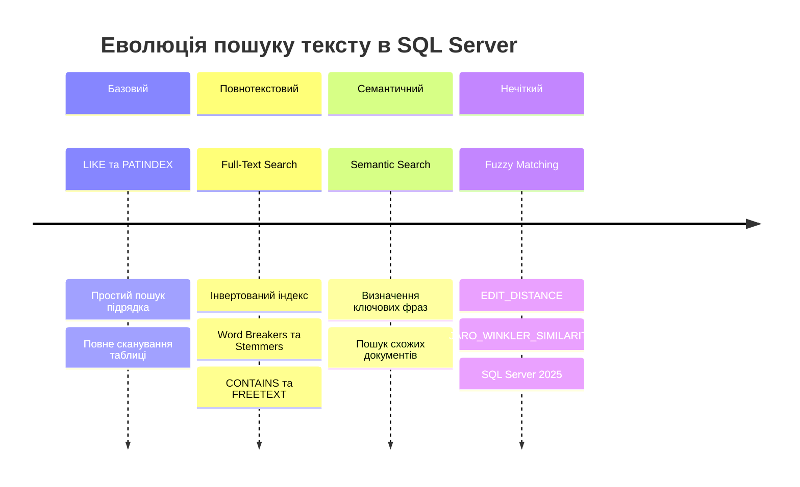
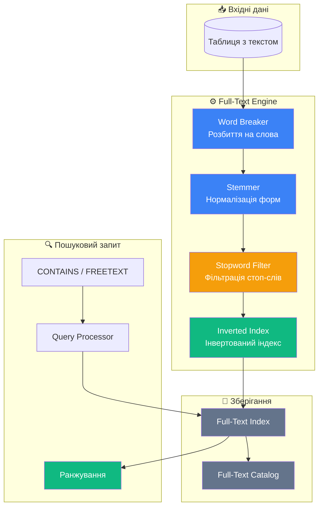

# Повнотекстовий пошук (Full-Text Search)

## Проблема: Чому `LIKE` — це не пошук?

Уявімо інтернет-магазин книг. Користувач вводить у пошуковий рядок: **"програмування на C#"**. Як знайти відповідні книги?

Перше, що спадає на думку, — оператор `LIKE`:

```sql
SELECT NameBook, Price
FROM book.Books
WHERE NameBook LIKE '%програмування%'
   OR NameBook LIKE '%C#%';
```

На перший погляд — працює. Але що буде, коли:

- У вас **мільйони** записів? `LIKE '%слово%'` ігнорує **будь-які** індекси і сканує кожен рядок таблиці (Full Table Scan).
- Користувач шукає **"програмувати"**, а в базі — "програмування"? `LIKE` не розуміє словоформи.
- Потрібно знайти **"C# для початківців"**, але книга називається **"Початківцям: мова C#"**? `LIKE` не вміє аналізувати зміст.
- Потрібно **ранжувати** результати за релевантністю? `LIKE` повертає або `TRUE`, або `FALSE` — ніякого рейтингу.

::warning
**`LIKE '%text%'`** — це **фільтрація рядків**, а не **пошук**. Різниця принципова:
- **Фільтрація**: "Чи містить цей рядок підрядок?" — бінарна відповідь (так/ні).
- **Пошук**: "Наскільки цей документ відповідає запиту?" — градація релевантності.

::

Порівняємо ці два підходи на прикладі:

| Критерій | `LIKE '%…%'` | Full-Text Search |
| :--- | :--- | :--- |
| **Продуктивність** | Full Table Scan — O(n) | Інвертований індекс — O(log n) |
| **Словоформи** | ❌ Тільки точний збіг | ✅ "програмування" → "програмувати" |
| **Логічні оператори** | ❌ Тільки `AND`/`OR` в `WHERE` | ✅ `AND`, `OR`, `NEAR`, `NOT` |
| **Ранжування** | ❌ Немає | ✅ Ранг від 0 до 1000 |
| **Стоп-слова** | ❌ Шукає все підряд | ✅ Ігнорує "і", "в", "на" |
| **Мовна підтримка** | ❌ Байтове порівняння | ✅ Word Breaker + Stemmer для мови |
| **Використання індексів** | ❌ Ігнорує B-tree індекси | ✅ Власний Full-Text Index |

**Розв'язок**: MS SQL Server має вбудований механізм **Full-Text Search** — спеціалізовану підсистему для повнотекстового пошуку, яка вирішує всі ці проблеми.

---

## Еволюція пошуку в SQL Server

::mermaid



::

Кожен наступний рівень додає можливості, але і складність. У цій статті ми детально розглянемо **Full-Text Search** та **Fuzzy Matching**, приділяючи особливу увагу підтримці **української мови**.

---

## Архітектура Full-Text Search

### Як це працює "під капотом"?

Full-Text Search — це не просто "розумний `LIKE`". Це окрема підсистема SQL Server зі своєю архітектурою, процесами та структурами даних.

::mermaid



::

### Компоненти системи

::card-group

::card{icon="i-lucide-scissors" title="Word Breaker (Розбивач слів)"}
Аналізує текст і розбиває його на окремі **токени** (слова). Кожна мова має свій Word Breaker, який розуміє правила розділення слів цієї мови.

**Приклад**: `"Програмування на C#"` → `["програмування", "на", "c#"]`

::

::card{icon="i-lucide-languages" title="Stemmer (Стемер)"}
Зводить слова до їхньої **основної форми** (стему). Це дозволяє знаходити документи за будь-якою словоформою.

**Приклад**: `"програмування"` → `"програм"`, `"книгами"` → `"книг"`

::

::card{icon="i-lucide-filter" title="Stopword List (Стоп-слова)"}
Список слів, які **ігноруються** при індексації, бо не несуть смислового навантаження: прийменники, сполучники, частки.

**Приклад**: `"і"`, `"в"`, `"на"`, `"для"`, `"що"`, `"це"`

::

::card{icon="i-lucide-book-open" title="Inverted Index (Інвертований індекс)"}
Спеціальна структура даних: для кожного слова зберігається список документів, де це слово зустрічається, з позицією та частотою.

**Приклад**: `"C#"` → `[doc_5, doc_12, doc_87]`

::

::

### Інвертований індекс — серце Full-Text Search

Традиційний індекс (B-tree) відповідає на запитання: _"Де знаходиться рядок з ID = 5?"_. Інвертований індекс відповідає на інше запитання: _"У яких рядках зустрічається слово 'програмування'?"_.

```
┌─────────────────────────────────────────────────────────┐
│              Інвертований індекс (Inverted Index)       │
├──────────────────┬──────────────────────────────────────┤
│ Термін (Token)   │ Документи (DocID : Позиція)         │
├──────────────────┼──────────────────────────────────────┤
│ "програмування"  │ Doc_1:3, Doc_5:1, Doc_12:7          │
│ "c#"             │ Doc_1:4, Doc_5:2, Doc_23:1           │
│ "початківці"     │ Doc_5:5, Doc_87:3                    │
│ "алгоритми"      │ Doc_12:1, Doc_23:5, Doc_45:2         │
│ "бази"           │ Doc_33:1, Doc_45:8                   │
│ "дані"           │ Doc_33:2, Doc_45:9                   │
└──────────────────┴──────────────────────────────────────┘
```

Коли надходить запит `CONTAINS(column, 'програмування AND C#')`, SQL Server:

1. Знаходить список документів для "програмування": `{1, 5, 12}`
2. Знаходить список документів для "C#": `{1, 5, 23}`
3. Обчислює перетин (`AND`): `{1, 5}`
4. Повертає рядки з ID 1 та 5

Ця операція виконується за **мілісекунди** навіть на мільйонах записів, тоді як `LIKE` сканував би кожен рядок.

---

## Налаштування Full-Text Search

::steps

### Крок 1: Перевірка встановлення компонента

Full-Text Search — це **окремий компонент** SQL Server, який може бути не встановлений. Перевіримо:

```sql
-- Перевірка, чи встановлено Full-Text Search
SELECT SERVERPROPERTY('IsFullTextInstalled') AS IsInstalled;
-- 1 = встановлено, 0 = ні
```

Якщо результат `0`, необхідно додати компонент через інсталятор SQL Server (Setup → Add Features → Full-Text and Semantic Extractions for Search).

### Крок 2: Створення Full-Text Catalog

**Full-Text Catalog** — це логічний контейнер для Full-Text індексів. Він не зберігає дані, а лише групує індекси для зручності управління.

```sql
-- Створення каталогу
CREATE FULLTEXT CATALOG BookSearchCatalog
    WITH ACCENT_SENSITIVITY = OFF  -- "і" = "ї"? Ні, це про наголоси
    AS DEFAULT;                    -- Каталог за замовчуванням
GO

-- Перевірка створених каталогів
SELECT name, is_default, is_accent_sensitivity_on
FROM sys.fulltext_catalogs;
```

::note
`ACCENT_SENSITIVITY = OFF` означає, що символи з діакритичними знаками (наголосами) вважаються еквівалентними своїм базовим формам. Для української мови це, зазвичай, не критично, але може бути корисним.

::

### Крок 3: Створення Full-Text Index

Full-Text Index створюється для **конкретних стовпців** таблиці. Таблиця повинна мати **унікальний індекс** (зазвичай Primary Key).

```sql
-- Створення Full-Text індексу на таблиці книг
CREATE FULLTEXT INDEX ON book.Books
(
    NameBook LANGUAGE 1058,        -- Українська мова (LCID 1058)
    Description LANGUAGE 1058      -- Опис книги теж українською
)
KEY INDEX PK_Books                 -- Унікальний індекс таблиці
ON BookSearchCatalog               -- Каталог
WITH (
    CHANGE_TRACKING AUTO,          -- Автоматичне оновлення індексу
    STOPLIST = SYSTEM              -- Системний список стоп-слів
);
GO
```

**Розбір параметрів**:

- `LANGUAGE 1058` — LCID (Locale ID) української мови. Це вказує SQL Server використовувати **український Word Breaker та Stemmer**.
- `KEY INDEX PK_Books` — унікальний індекс, через який Full-Text Engine прив'язує токени до рядків.
- `CHANGE_TRACKING AUTO` — індекс автоматично оновлюється при зміні даних.
- `STOPLIST = SYSTEM` — використовувати системний список стоп-слів.

### Крок 4: Перевірка стану індексу

```sql
-- Статус індексу
SELECT
    OBJECT_NAME(object_id) AS TableName,
    is_enabled,
    change_tracking_state_desc,
    crawl_type_desc,
    crawl_start_date
FROM sys.fulltext_indexes;

-- Кількість індексованих слів
SELECT COUNT(*) AS IndexedWords
FROM sys.dm_fts_index_keywords(DB_ID(), OBJECT_ID('book.Books'));
```

::

---

## Підтримка української мови {#ukrainian-language-support}

Це — ключова частина статті. MS SQL Server має **вбудовану підтримку** української мови для повнотекстового пошуку, і це значно спрощує роботу з україномовним контентом.

### Перевірка підтримки мови

Щоб побачити, які мови підтримує ваш екземпляр SQL Server для Full-Text Search:

```sql
-- Список усіх підтримуваних мов
SELECT lcid, name
FROM sys.fulltext_languages
ORDER BY name;
```

У результатах ви знайдете рядок:

| lcid | name |
| :--- | :--- |
| 1058 | Ukrainian |

::tip
**LCID 1058** — це Locale ID для української мови. Його можна вказувати як числом (`1058`), так і рядком (`'Ukrainian'`) або шістнадцятковим (`0x0422`):

```sql
-- Три еквівалентні способи вказати мову
CREATE FULLTEXT INDEX ON MyTable (MyColumn LANGUAGE 1058)
CREATE FULLTEXT INDEX ON MyTable (MyColumn LANGUAGE 'Ukrainian')
CREATE FULLTEXT INDEX ON MyTable (MyColumn LANGUAGE 0x0422)
```

::

### Word Breaker для української мови

Word Breaker — це компонент, який визначає, де в тексті закінчується одне слово і починається інше. Для української мови він враховує:

- **Кириличний алфавіт** з усіма специфічними літерами (і, ї, є, ґ)
- **Апостроф** як частину слова: `"пам'ять"` → одне слово, а не два
- **Дефіс** у складних словах: `"будь-який"`, `"хтось-небудь"`
- **Розділові знаки** та пробіли як роздільники

```sql
-- Перевірка, які Word Breaker-и зареєстровані
EXEC sp_help_fulltext_system_components 'wordbreaker';
GO
```

Подивімося, як Word Breaker обробляє український текст:

```sql
-- Перегляд індексованих токенів для конкретного тексту
-- (потрібен вже створений Full-Text індекс)
SELECT display_term, column_id, document_count
FROM sys.dm_fts_index_keywords(DB_ID(), OBJECT_ID('book.Books'))
WHERE display_term LIKE '%програм%'
ORDER BY document_count DESC;
```

### Стемінг (Stemming) та словоформи

**Стемінг** — це процес зведення слова до його кореневої форми (стему). Для української мови це критично важливо через багату **морфологію**:

```
програмування → програм
програмувати  → програм
програміст    → програм
програмний    → програм

книга    → книг
книги    → книг
книгою   → книг
книгами  → книг
книжкою  → книжк (інший стем!)
```

::warning
Стемінг — це не **лематизація** (зведення до словникової форми). Стемер просто обрізає закінчення за правилами, тому результат може не бути реальним словом. Для Full-Text Search це не проблема — головне, щоб усі форми одного слова давали однаковий стем.

::

Завдяки стемінгу, пошук за словом **"програмування"** знайде документи, що містять **"програмувати"**, **"програміст"**, **"програмний"** тощо:

```sql
-- FORMSOF(INFLECTIONAL, ...) використовує стемер мови
SELECT NameBook, Price
FROM book.Books
WHERE CONTAINS(NameBook, 'FORMSOF(INFLECTIONAL, програмування)', LANGUAGE 1058);
```

### Стоп-слова (Stopwords) для української мови

Стоп-слова — слова, які настільки поширені, що їх індексація не має сенсу. Вони лише збільшують розмір індексу, не покращуючи якість пошуку.

**Типові стоп-слова для української мови:**

| Категорія | Приклади |
| :--- | :--- |
| **Прийменники** | в, у, на, з, із, до, від, для, за, під, над, між, через, при, по |
| **Сполучники** | і, й, та, або, але, проте, однак, бо, тому, що, як, коли, якщо |
| **Частки** | не, ні, би, б, же, ж, ось, от, навіть, лише, тільки |
| **Займенники** | я, ти, він, вона, воно, ми, ви, вони, це, той, та, те, ці |
| **Дієслова-зв'язки** | є, бути, було, буде, був, була, були |

#### Перегляд системних стоп-слів

```sql
-- Системні стоп-слова для української мови
SELECT stopword, language_id
FROM sys.fulltext_system_stopwords
WHERE language_id = 1058
ORDER BY stopword;
```

#### Створення власного Stoplist

Системний список може не містити всіх потрібних стоп-слів. Створимо власний:

```sql
-- Створюємо новий Stoplist на основі системного
CREATE FULLTEXT STOPLIST BookStoplist
FROM SYSTEM STOPLIST;
GO

-- Додаємо власні стоп-слова для української
ALTER FULLTEXT STOPLIST BookStoplist
    ADD 'також' LANGUAGE 1058;
ALTER FULLTEXT STOPLIST BookStoplist
    ADD 'однак' LANGUAGE 1058;
ALTER FULLTEXT STOPLIST BookStoplist
    ADD 'тобто' LANGUAGE 1058;
ALTER FULLTEXT STOPLIST BookStoplist
    ADD 'наприклад' LANGUAGE 1058;
ALTER FULLTEXT STOPLIST BookStoplist
    ADD 'зокрема' LANGUAGE 1058;
GO

-- Перевірка
SELECT stopword
FROM sys.fulltext_stopwords
WHERE stoplist_id = (SELECT stoplist_id FROM sys.fulltext_stoplists WHERE name = 'BookStoplist')
  AND language_id = 1058
ORDER BY stopword;
```

#### Прив'язка Stoplist до індексу

```sql
-- Зміна Stoplist для існуючого індексу
ALTER FULLTEXT INDEX ON book.Books
    SET STOPLIST = BookStoplist;
GO
```

### Обмеження та рекомендації для українського тексту

::card-group

::card{icon="i-lucide-alert-triangle" title="⚠️ Обмеження стемера"}

- Стемер може **неточно** обробляти деякі складні словоформи
- Слова з **чергуванням приголосних** (книга/книжка) можуть давати різні стеми
- **Неологізми** та запозичення не завжди обробляються коректно

::

::card{icon="i-lucide-check-circle" title="✅ Рекомендації"}

- Завжди **явно вказуйте** `LANGUAGE 1058` при створенні індексу та в запитах
- **Тестуйте** стемінг на реальних даних перед продакшеном
- Створюйте **власний Stoplist** з урахуванням специфіки домену
- Для **кращої якості** комбінуйте Full-Text з `LIKE` для критичних запитів

::

::

---

## Запити Full-Text Search

SQL Server надає два типи предикатів та дві табличні функції для повнотекстового пошуку:

| Компонент | Тип | Призначення |
| :--- | :--- | :--- |
| `CONTAINS` | Предикат (WHERE) | Точний пошук з логічними операторами |
| `FREETEXT` | Предикат (WHERE) | Природномовний пошук (нечіткий) |
| `CONTAINSTABLE` | Таблична функція | Як `CONTAINS`, але з рангом |
| `FREETEXTTABLE` | Таблична функція | Як `FREETEXT`, але з рангом |

### CONTAINS — Точний повнотекстовий пошук

`CONTAINS` — найпотужніший інструмент Full-Text Search. Він підтримує:

#### Простий пошук слова

```sql
-- Знайти книги зі словом "програмування"
SELECT NameBook, Price
FROM book.Books
WHERE CONTAINS(NameBook, 'програмування', LANGUAGE 1058);
```

#### Пошук фрази

```sql
-- Знайти точну фразу "бази даних"
SELECT NameBook, Price
FROM book.Books
WHERE CONTAINS(NameBook, '"бази даних"', LANGUAGE 1058);
```

::note
Зверніть увагу: фраза обгортається в **подвійні лапки** всередині одинарних. Це вказує Full-Text Engine шукати слова **поруч** і **у вказаному порядку**.

::

#### Логічні оператори: AND, OR, NOT

```sql
-- AND: обидва слова повинні бути
SELECT NameBook
FROM book.Books
WHERE CONTAINS(NameBook, 'програмування AND C#', LANGUAGE 1058);

-- OR: хоча б одне слово
SELECT NameBook
FROM book.Books
WHERE CONTAINS(NameBook, 'програмування OR алгоритми', LANGUAGE 1058);

-- AND NOT: виключення
SELECT NameBook
FROM book.Books
WHERE CONTAINS(NameBook, 'програмування AND NOT Java', LANGUAGE 1058);
```

#### Оператор NEAR — пошук поряд

`NEAR` знаходить слова, що розташовані **близько одне до одного** в тексті:

```sql
-- Слова "основи" та "програмування" на відстані не більше 5 слів
SELECT NameBook
FROM book.Books
WHERE CONTAINS(NameBook,
    'NEAR((основи, програмування), 5)',
    LANGUAGE 1058
);

-- З вказівкою порядку (ORDER = TRUE)
SELECT NameBook
FROM book.Books
WHERE CONTAINS(NameBook,
    'NEAR((основи, програмування), 5, TRUE)',
    LANGUAGE 1058
);
```

**Параметри `NEAR`**:

- Перший параметр — список слів у дужках через кому
- Другий параметр — максимальна відстань між словами (у словах)
- Третій параметр — `TRUE` = зберігати порядок слів, `FALSE` = будь-який порядок

#### FORMSOF — словоформи

```sql
-- INFLECTIONAL: граматичні форми (відмінки, числа, часи)
SELECT NameBook
FROM book.Books
WHERE CONTAINS(NameBook,
    'FORMSOF(INFLECTIONAL, книга)',
    LANGUAGE 1058
);
-- Знайде: книга, книги, книгою, книгам, книгами...

-- THESAURUS: синоніми (потребує налаштування файлу тезауруса)
SELECT NameBook
FROM book.Books
WHERE CONTAINS(NameBook,
    'FORMSOF(THESAURUS, програмування)',
    LANGUAGE 1058
);
```

#### Префіксний пошук (Wildcard)

```sql
-- Знайти слова, що починаються на "програм"
SELECT NameBook
FROM book.Books
WHERE CONTAINS(NameBook, '"програм*"', LANGUAGE 1058);
-- Знайде: програмування, програміст, програмний, програмувати...
```

::tip
Префіксний пошук `"слово*"` — це **дуже швидка** альтернатива `LIKE 'слово%'`, бо використовує Full-Text індекс.

::

#### Зважений пошук (Weighted Terms)

```sql
-- ISABOUT: різна вага для різних термінів
SELECT NameBook
FROM book.Books
WHERE CONTAINS(NameBook,
    'ISABOUT(програмування WEIGHT(0.9), алгоритми WEIGHT(0.5), математика WEIGHT(0.3))',
    LANGUAGE 1058
);
```

Ваги від `0.0` до `1.0` визначають **пріоритет** кожного терміна при ранжуванні.

### FREETEXT — Природномовний пошук

`FREETEXT` — спрощений пошук, який автоматично:
1. Розбиває фразу на слова
2. Генерує словоформи для кожного слова
3. Видаляє стоп-слова
4. Шукає **будь-які** збіги

```sql
-- Простий природномовний пошук
SELECT NameBook, Price
FROM book.Books
WHERE FREETEXT(NameBook,
    'книга про основи програмування для початківців',
    LANGUAGE 1058
);
```

::note
`FREETEXT` не підтримує логічних операторів (`AND`, `OR`, `NEAR`). Він завжди шукає за принципом "знайди все, що має щось спільне з цією фразою". Використовуйте `CONTAINS`, коли потрібен точний контроль.

::

#### Порівняння CONTAINS vs FREETEXT

| Характеристика | CONTAINS | FREETEXT |
| :--- | :--- | :--- |
| **Точність** | Висока | Середня |
| **Простота** | Складний синтаксис | Простий |
| **Логічні оператори** | ✅ AND, OR, NOT, NEAR | ❌ |
| **Словоформи** | Через FORMSOF | Автоматично |
| **Фрази** | ✅ "точна фраза" | ❌ |
| **Префікси** | ✅ "слово*" | ❌ |
| **Вага термінів** | ✅ ISABOUT WEIGHT | ❌ |
| **Use Case** | Пошук з точними критеріями | "Пошуковий рядок" від користувача |

### CONTAINSTABLE та FREETEXTTABLE — Ранжування

Предикати `CONTAINS` і `FREETEXT` повертають лише `TRUE`/`FALSE`. Але часто потрібно **відсортувати** результати за релевантністю. Для цього є табличні функції.

#### CONTAINSTABLE

```sql
-- Пошук з ранжуванням через CONTAINSTABLE
SELECT
    b.NameBook,
    b.Price,
    ft.[RANK] AS Relevance
FROM book.Books b
INNER JOIN CONTAINSTABLE(
    book.Books,
    NameBook,
    'програмування OR алгоритми',
    LANGUAGE 1058
) AS ft ON b.Id = ft.[KEY]
ORDER BY ft.[RANK] DESC;
```

**Пояснення**:

- `CONTAINSTABLE` повертає **таблицю** з двома стовпцями: `KEY` (ідентифікатор рядка) і `RANK` (релевантність від 0 до 1000).
- `ft.[KEY]` відповідає значенню з стовпця, що є ключем Full-Text індексу.
- `ORDER BY ft.[RANK] DESC` — сортування від найбільш до найменш релевантного.

#### FREETEXTTABLE

```sql
-- Природномовний пошук з ранжуванням
SELECT TOP 10
    b.NameBook,
    b.Price,
    ft.[RANK] AS Relevance
FROM book.Books b
INNER JOIN FREETEXTTABLE(
    book.Books,
    NameBook,
    'основи об''єктно-орієнтованого програмування',
    LANGUAGE 1058
) AS ft ON b.Id = ft.[KEY]
ORDER BY ft.[RANK] DESC;
```

::tip
**Best Practice**: У реальних додатках завжди використовуйте `CONTAINSTABLE`/`FREETEXTTABLE` замість `CONTAINS`/`FREETEXT`, якщо вам потрібен **пошуковий інтерфейс**, де результати відсортовані за релевантністю.

::

#### Обмеження кількості результатів

```sql
-- Повернути не більше 50 найрелевантніших результатів
SELECT
    b.NameBook,
    ft.[RANK]
FROM book.Books b
INNER JOIN CONTAINSTABLE(
    book.Books,
    NameBook,
    'програмування',
    LANGUAGE 1058,
    50  -- top_n_by_rank
) AS ft ON b.Id = ft.[KEY]
ORDER BY ft.[RANK] DESC;
```

Параметр `top_n_by_rank` обмежує кількість результатів **на рівні Full-Text Engine**, що значно ефективніше, ніж `TOP` у зовнішньому запиті.

---

## Розширені можливості

### Пошук по кількох стовпцях

```sql
-- Пошук в назві ТА описі книги
SELECT NameBook, Description
FROM book.Books
WHERE CONTAINS((NameBook, Description),
    'програмування',
    LANGUAGE 1058
);

-- Пошук по УСІХ повнотекстових стовпцях
SELECT NameBook, Description
FROM book.Books
WHERE CONTAINS(*,
    'програмування',
    LANGUAGE 1058
);
```

### Мультимовний контент

Якщо в одній таблиці є контент різними мовами, можна вказати мову для кожного стовпця окремо:

```sql
CREATE FULLTEXT INDEX ON book.Books
(
    NameBook LANGUAGE 1058,       -- Українська
    DescriptionEn LANGUAGE 1033,  -- Англійська
    DescriptionDe LANGUAGE 1031   -- Німецька
)
KEY INDEX PK_Books
ON BookSearchCatalog;
```

### Управління Full-Text Index

::code-group

```sql [Призупинення індексації]
-- Призупинити оновлення індексу (для масового завантаження даних)
ALTER FULLTEXT INDEX ON book.Books
    SET CHANGE_TRACKING OFF;
GO

-- Масове вставлення даних...
INSERT INTO book.Books (...) VALUES (...);
-- ...ще багато INSERT операцій...

-- Запустити повну переіндексацію
ALTER FULLTEXT INDEX ON book.Books
    START FULL POPULATION;
GO

-- Повернути автоматичне відстеження
ALTER FULLTEXT INDEX ON book.Books
    SET CHANGE_TRACKING AUTO;
GO
```

```sql [Видалення]
-- Видалення Full-Text індексу
DROP FULLTEXT INDEX ON book.Books;
GO

-- Видалення каталогу
DROP FULLTEXT CATALOG BookSearchCatalog;
GO

-- Видалення Stoplist
DROP FULLTEXT STOPLIST BookStoplist;
GO
```

```sql [Моніторинг]
-- Статус індексації
SELECT
    OBJECT_NAME(object_id) AS TableName,
    is_enabled,
    change_tracking_state_desc AS TrackingState,
    crawl_type_desc AS LastCrawlType,
    crawl_start_date AS LastCrawlStart,
    crawl_end_date AS LastCrawlEnd,
    item_count AS IndexedItems
FROM sys.fulltext_indexes;

-- Кількість помилок індексації
SELECT *
FROM sys.dm_fts_index_population;
```

::

---

## Нечіткий пошук (Fuzzy String Matching)

Повнотекстовий пошук чудово вирішує проблему словоформ, але що робити, коли користувач **допустив помилку** у запиті? Наприклад:
- Написав **"прогрмування"** замість "програмування"
- Написав **"Шевчнко"** замість "Шевченко"
- Перемішав літери: **"пограмування"** замість "програмування"

Full-Text Search **не допоможе** в таких випадках — він шукає лише правильні слова та їхні форми. Для пошуку "схожих" рядків потрібен **нечіткий пошук (Fuzzy String Matching)**.

### SOUNDEX та DIFFERENCE — Фонетичний пошук

SQL Server давно має вбудовані фонетичні функції:

```sql
-- SOUNDEX: фонетичний код рядка
SELECT SOUNDEX('Smith') AS Code1, SOUNDEX('Smyth') AS Code2;
-- S530, S530 — однакові коди, бо слова звучать схоже

-- DIFFERENCE: порівняння фонетичних кодів (0-4)
SELECT DIFFERENCE('Smith', 'Smyth') AS Similarity;
-- 4 = ідеально схожі за звучанням
```

::caution
**`SOUNDEX` працює тільки для ЛАТИНСЬКИХ символів!** Для кириличного тексту (українського) він повертає `'0000'` для всіх рядків і **абсолютно непридатний**:

```sql
SELECT SOUNDEX('Шевченко') AS UkrCode;
-- Результат: '0000' — безкорисне значення
```

Для нечіткого пошуку українським текстом потрібні інші функції.

::

### Нові функції SQL Server 2025 :badge[Preview]{color="amber"}

Починаючи з **SQL Server 2025** (та Azure SQL Database), Microsoft додала нові потужні функції для нечіткого порівняння рядків. Ці функції працюють на **символьному рівні** і не залежать від мови, тому **підходять для кирилиці та української мови**!

#### EDIT_DISTANCE — Відстань редагування

**Edit Distance** (відстань Левенштейна) — це мінімальна кількість операцій (вставка, видалення, заміна символу, транспозиція), потрібних для перетворення одного рядка в інший.

```sql
-- Відстань редагування
SELECT EDIT_DISTANCE('програмування', 'прогрмування') AS Distance;
-- Результат: 1 (пропущена одна літера 'а')

SELECT EDIT_DISTANCE('Шевченко', 'Шевчнко') AS Distance;
-- Результат: 1 (пропущена літера 'е')

SELECT EDIT_DISTANCE('алгоритм', 'алгортим') AS Distance;
-- Результат: 2 (переставлені 'и' та 'т')
```

**Практичне застосування** — пошук з допуском помилок:

```sql
-- Знайти авторів, чиє прізвище схоже на введене (допуск 2 помилки)
SELECT FirstName, LastName
FROM book.Authors
WHERE EDIT_DISTANCE(LastName, N'Шевчнко') <= 2;
-- Знайде: Шевченко (відстань = 1)
```

#### EDIT_DISTANCE_SIMILARITY — Схожість за відстанню

Повертає нормалізований показник схожості від **0** (не схожі) до **100** (ідентичні):

```sql
SELECT
    EDIT_DISTANCE_SIMILARITY(N'програмування', N'прогрмування') AS SimilarityTypo,
    EDIT_DISTANCE_SIMILARITY(N'програмування', N'математика') AS SimilarityDiff;
-- SimilarityTypo: 92 (дуже схожі — 1 помилка)
-- SimilarityDiff: 15 (зовсім не схожі)
```

```sql
-- Пошук схожих назв книг (схожість > 80%)
SELECT b1.NameBook, b2.NameBook,
       EDIT_DISTANCE_SIMILARITY(b1.NameBook, b2.NameBook) AS Similarity
FROM book.Books b1
CROSS JOIN book.Books b2
WHERE b1.Id < b2.Id
  AND EDIT_DISTANCE_SIMILARITY(b1.NameBook, b2.NameBook) > 80
ORDER BY Similarity DESC;
```

#### JARO_WINKLER_DISTANCE — Відстань Джаро-Вінклера

Алгоритм Джаро-Вінклера спеціально оптимізований для **порівняння імен та назв** — він надає більшу вагу збігам на **початку** рядка:

```sql
-- Відстань Джаро-Вінклера (0.0 = ідентичні, 1.0 = повністю різні)
SELECT JARO_WINKLER_DISTANCE(N'Іван', N'Іванко') AS Distance;
-- Результат: ~0.07 (дуже близькі — спільний початок "Іван")

SELECT JARO_WINKLER_DISTANCE(N'Петренко', N'Петренка') AS Distance;
-- Результат: ~0.04 (майже ідентичні)
```

#### JARO_WINKLER_SIMILARITY — Схожість Джаро-Вінклера

```sql
-- Схожість від 0 до 100
SELECT
    N'Київ' AS Word1,
    N'Киів' AS Word2,
    JARO_WINKLER_SIMILARITY(N'Київ', N'Киів') AS Similarity;
-- Similarity: ~89

-- Пошук авторів із нечітким збігом прізвища
SELECT FirstName, LastName,
       JARO_WINKLER_SIMILARITY(LastName, N'Франко') AS Similarity
FROM book.Authors
WHERE JARO_WINKLER_SIMILARITY(LastName, N'Франко') > 75
ORDER BY Similarity DESC;
```

### Порівняння алгоритмів нечіткого пошуку

```sql
-- Демонстрація різних алгоритмів на одних даних
SELECT
    T.Source,
    T.Target,
    EDIT_DISTANCE(T.Source, T.Target) AS ED_Dist,
    EDIT_DISTANCE_SIMILARITY(T.Source, T.Target) AS ED_Sim,
    JARO_WINKLER_SIMILARITY(T.Source, T.Target) AS JW_Sim
FROM (VALUES
    (N'програмування', N'прогрмування'),
    (N'Шевченко', N'Шевчнко'),
    (N'алгоритм', N'алгортим'),
    (N'Франко', N'Франка'),
    (N'Київ', N'Львів'),
    (N'база даних', N'бази даних')
) AS T(Source, Target);
```

| Source | Target | ED_Dist | ED_Sim | JW_Sim |
| :--- | :--- | :--- | :--- | :--- |
| програмування | прогрмування | 1 | 92 | 97 |
| Шевченко | Шевчнко | 1 | 87 | 95 |
| алгоритм | алгортим | 2 | 75 | 90 |
| Франко | Франка | 1 | 83 | 89 |
| Київ | Львів | 3 | 25 | 53 |
| база даних | бази даних | 1 | 90 | 95 |

::tip
**Коли який алгоритм використовувати?**

- **EDIT_DISTANCE** — коли потрібен точний "допуск помилок" (не більше N помилок)
- **EDIT_DISTANCE_SIMILARITY** — коли потрібен процентний поріг схожості
- **JARO_WINKLER_SIMILARITY** — найкращий для **імен та прізвищ**, бо враховує спільний початок

::

---

## Комплексний приклад: Пошукова система для книжкового магазину

Об'єднаємо всі підходи в реальному сценарії — пошуковій системі, яка:
1. Використовує Full-Text для семантичного пошуку
2. Додає Fuzzy Matching для обробки помилок
3. Ранжує результати за релевантністю

```sql
-- Створення зберігаємої процедури для пошуку
CREATE PROCEDURE sp_Books_Search
    @searchQuery NVARCHAR(200),
    @maxResults INT = 20
AS
BEGIN
    SET NOCOUNT ON;

    -- Спроба 1: Точний Full-Text пошук
    IF EXISTS (
        SELECT 1 FROM CONTAINSTABLE(
            book.Books, NameBook, @searchQuery, LANGUAGE 1058, 1
        )
    )
    BEGIN
        SELECT TOP (@maxResults)
            b.NameBook,
            b.Price,
            a.FirstName + ' ' + a.LastName AS AuthorName,
            ft.[RANK] AS Relevance,
            'Full-Text' AS SearchMethod
        FROM book.Books b
        INNER JOIN CONTAINSTABLE(
            book.Books, NameBook, @searchQuery, LANGUAGE 1058
        ) AS ft ON b.Id = ft.[KEY]
        LEFT JOIN book.Authors a ON b.AuthorId = a.Id
        ORDER BY ft.[RANK] DESC;
        RETURN;
    END

    -- Спроба 2: Природномовний пошук (ширший)
    IF EXISTS (
        SELECT 1 FROM FREETEXTTABLE(
            book.Books, NameBook, @searchQuery, LANGUAGE 1058, 1
        )
    )
    BEGIN
        SELECT TOP (@maxResults)
            b.NameBook,
            b.Price,
            a.FirstName + ' ' + a.LastName AS AuthorName,
            ft.[RANK] AS Relevance,
            'FREETEXT' AS SearchMethod
        FROM book.Books b
        INNER JOIN FREETEXTTABLE(
            book.Books, NameBook, @searchQuery, LANGUAGE 1058
        ) AS ft ON b.Id = ft.[KEY]
        LEFT JOIN book.Authors a ON b.AuthorId = a.Id
        ORDER BY ft.[RANK] DESC;
        RETURN;
    END

    -- Спроба 3: Нечіткий пошук (для помилок у запиті)
    SELECT TOP (@maxResults)
        b.NameBook,
        b.Price,
        a.FirstName + ' ' + a.LastName AS AuthorName,
        JARO_WINKLER_SIMILARITY(b.NameBook, @searchQuery) AS Relevance,
        'Fuzzy' AS SearchMethod
    FROM book.Books b
    LEFT JOIN book.Authors a ON b.AuthorId = a.Id
    WHERE JARO_WINKLER_SIMILARITY(b.NameBook, @searchQuery) > 50
    ORDER BY Relevance DESC;
END;
GO

-- Використання
EXEC sp_Books_Search @searchQuery = N'програмування';
EXEC sp_Books_Search @searchQuery = N'прогрмування'; -- з помилкою
```

---

## Порівняння підходів до пошуку

| Критерій | `LIKE` | Full-Text Search | Fuzzy Matching |
| :--- | :--- | :--- | :--- |
| **Швидкість** | 🔴 Повільно (Full Scan) | 🟢 Швидко (Inverted Index) | 🔴 Повільно (порівняння рядків) |
| **Словоформи** | ❌ | ✅ Stemming | ❌ |
| **Помилки введення** | ❌ | ❌ | ✅ |
| **Ранжування** | ❌ | ✅ RANK | ✅ Similarity Score |
| **Українська мова** | ✅ Базовий | ✅ Word Breaker + Stemmer | ✅ Символьний рівень |
| **Налаштування** | Не потрібно | Каталог + Індекс + Stoplist | Не потрібно |
| **Ідеальний сценарій** | Точний пошук підрядка | Пошук по документах | Пошук "схожих" назв |

::note
**Оптимальна стратегія** — **комбінація підходів**: спочатку Full-Text Search (швидкий та точний), потім Fuzzy Matching як fallback для обробки помилок користувача. Саме цей підхід реалізовано в процедурі `sp_Books_Search` вище.

::

---

## Практичні завдання

::accordion

::accordion-item{label="Завдання 1 (Базовий): Налаштування Full-Text Search" icon="i-lucide-book-open"}

**Умова**: Створіть Full-Text Catalog та Full-Text Index для таблиці `book.Authors`. Індексуйте стовпці `FirstName` та `LastName` з використанням української мови. Виконайте пошук авторів за прізвищем.

<details>
<summary>💡 Розв'язок</summary>

```sql
-- 1. Створення каталогу
CREATE FULLTEXT CATALOG AuthorSearchCatalog AS DEFAULT;
GO

-- 2. Створення індексу
CREATE FULLTEXT INDEX ON book.Authors
(
    FirstName LANGUAGE 1058,
    LastName LANGUAGE 1058
)
KEY INDEX PK_Authors
ON AuthorSearchCatalog
WITH (CHANGE_TRACKING AUTO);
GO

-- 3. Пошук за прізвищем
SELECT FirstName, LastName
FROM book.Authors
WHERE CONTAINS(LastName, 'Шевченко', LANGUAGE 1058);

-- 4. Пошук за будь-яким полем
SELECT FirstName, LastName
FROM book.Authors
WHERE CONTAINS(*, 'Іван', LANGUAGE 1058);
```

</details>

::

::accordion-item{label="Завдання 2 (Логіка): Пошук з ранжуванням" icon="i-lucide-bar-chart"}

**Умова**: Напишіть запит, який шукає книги за запитом користувача `"основи програмування для початківців"` з використанням `FREETEXTTABLE`. Результати повинні бути відсортовані за релевантністю, показувати назву книги, автора та ранг. Обмежте результати 10 записами на рівні Full-Text Engine.

<details>
<summary>💡 Розв'язок</summary>

```sql
SELECT TOP 10
    b.NameBook AS Title,
    a.FirstName + ' ' + a.LastName AS Author,
    b.Price,
    ft.[RANK] AS Relevance
FROM book.Books b
INNER JOIN FREETEXTTABLE(
    book.Books,
    NameBook,
    N'основи програмування для початківців',
    LANGUAGE 1058,
    10  -- top_n_by_rank
) AS ft ON b.Id = ft.[KEY]
LEFT JOIN book.Authors a ON b.AuthorId = a.Id
ORDER BY ft.[RANK] DESC;
```

**Пояснення**:
- `FREETEXTTABLE` автоматично розбиває фразу: `"основи"`, `"програмування"`, `"початківців"` (стоп-слово `"для"` ігнорується).
- Параметр `10` в `FREETEXTTABLE` обмежує результати **до Full-Text Engine**, що ефективніше, ніж `TOP 10`.
- `LANGUAGE 1058` задіє український стемер для кращого пошуку.

</details>

::

::accordion-item{label="Завдання 3 (Архітектура): Пошукова процедура з Fallback" icon="i-lucide-search"}

**Умова**: Створіть зберігаєму процедуру `sp_Search_Universal`, яка:
1. Приймає параметр `@query NVARCHAR(200)`
2. Спершу намагається знайти результати через `CONTAINSTABLE` (точний пошук)
3. Якщо нічого не знайдено — використовує `FREETEXTTABLE` (ширший пошук)
4. Якщо і це не допомогло — використовує `EDIT_DISTANCE_SIMILARITY` з порогом 70%
5. Повертає назву книги, ранг та метод пошуку, що спрацював

<details>
<summary>💡 Підказка</summary>

Використовуйте структуру з `IF EXISTS (SELECT 1 FROM ...)` для перевірки наявності результатів перед їх поверненням. Для `EDIT_DISTANCE_SIMILARITY` зверніть увагу, що ця функція **не використовує** Full-Text індекс, тому працюватиме повільніше на великих таблицях.

</details>

<details>
<summary>💡 Розв'язок</summary>

```sql
CREATE PROCEDURE sp_Search_Universal
    @query NVARCHAR(200)
AS
BEGIN
    SET NOCOUNT ON;

    -- Спроба 1: Точний Full-Text
    IF EXISTS (
        SELECT 1 FROM CONTAINSTABLE(
            book.Books, NameBook, @query, LANGUAGE 1058, 1
        )
    )
    BEGIN
        SELECT TOP 20
            b.NameBook,
            ft.[RANK] AS Relevance,
            'CONTAINS' AS Method
        FROM book.Books b
        INNER JOIN CONTAINSTABLE(
            book.Books, NameBook, @query, LANGUAGE 1058
        ) ft ON b.Id = ft.[KEY]
        ORDER BY ft.[RANK] DESC;
        RETURN;
    END

    -- Спроба 2: Природномовний
    IF EXISTS (
        SELECT 1 FROM FREETEXTTABLE(
            book.Books, NameBook, @query, LANGUAGE 1058, 1
        )
    )
    BEGIN
        SELECT TOP 20
            b.NameBook,
            ft.[RANK] AS Relevance,
            'FREETEXT' AS Method
        FROM book.Books b
        INNER JOIN FREETEXTTABLE(
            book.Books, NameBook, @query, LANGUAGE 1058
        ) ft ON b.Id = ft.[KEY]
        ORDER BY ft.[RANK] DESC;
        RETURN;
    END

    -- Спроба 3: Fuzzy
    SELECT TOP 20
        NameBook,
        EDIT_DISTANCE_SIMILARITY(NameBook, @query) AS Relevance,
        'FUZZY' AS Method
    FROM book.Books
    WHERE EDIT_DISTANCE_SIMILARITY(NameBook, @query) >= 70
    ORDER BY Relevance DESC;
END;
GO

EXEC sp_Search_Universal @query = N'програмування';
EXEC sp_Search_Universal @query = N'прогрмування';
```

</details>

::

::

---

## Резюме

::tip
**Ключові моменти повнотекстового пошуку в MS SQL Server**:

1. **`LIKE '%…%'` — не пошук**: Він не використовує індекси, не розуміє словоформи і не вміє ранжувати.
2. **Full-Text Search**: Інвертований індекс + Word Breaker + Stemmer = швидкий семантичний пошук.
3. **Українська мова (LCID 1058)**: SQL Server має вбудований Word Breaker та Stemmer для української. Завжди вказуйте `LANGUAGE 1058`.
4. **CONTAINS**: Точний пошук з операторами `AND`, `OR`, `NEAR`, `FORMSOF`, `ISABOUT`.
5. **FREETEXT**: Простий природномовний пошук — ідеальний для "пошукового рядка" користувача.
6. **CONTAINSTABLE / FREETEXTTABLE**: Ті самі пошуки, але з **ранжуванням** (RANK від 0 до 1000).
7. **Stoplist**: Створюйте власний список стоп-слів для кращої релевантності.
8. **Fuzzy Matching (SQL Server 2025)**: `EDIT_DISTANCE` та `JARO_WINKLER_SIMILARITY` працюють з кирилицею і знаходять "схожі" рядки навіть з помилками.
9. **SOUNDEX не працює з кирилицею**: Для нечіткого пошуку українським текстом використовуйте нові функції.
10. **Оптимальна стратегія**: Full-Text → FREETEXT → Fuzzy Matching (fallback).

**Best Practices**:
- Завжди явно вказуйте мову (`LANGUAGE 1058`) при створенні індексу та в запитах
- Створюйте власний Stoplist для покращення релевантності
- Використовуйте `CONTAINSTABLE` замість `CONTAINS` для ранжування
- Комбінуйте Full-Text та Fuzzy Matching для обробки помилок введення
- Призупиняйте Change Tracking при масовому завантаженні даних
- Моніторте стан індексації через `sys.fulltext_indexes`

::
