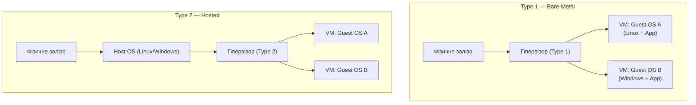
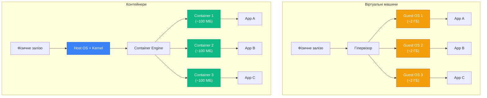

## Уявіть типовий понеділок розробника

Ваш C# застосунок пройшов усі тести на локальній машині. Git push, деплой на сервер — і ви отримуєте:

```text
Unhandled exception. System.IO.FileNotFoundException:
Could not load file or assembly 'SomePackage, Version=3.1.0.0'
```

Або ще гірше — застосунок запускається, але поводиться не так, як під час розробки: неправильне сортування рядків через інший `locale`, відмінна обробка шляхів файлів на Windows і Linux, або конфлікт версій бібліотек з іншим застосунком на тому ж сервері.

Це не помилка у вашому коді. Це **проблема середовища**.

::note
**Феномен "works on my machine"** — одна з найстаріших і найбільш болісних проблем у розробці програмного забезпечення. Вона виникає через фундаментальну невідповідність між середовищем розробника та середовищем виконання.

::

---

## Проблема розгортання програмного забезпечення

Будь-який застосунок існує не у вакуумі. Він залежить від:

- **Runtime**: конкретна версія .NET, Node.js, Python
- **Системних бібліотек**: `glibc`, `openssl`, `libicu`
- **Конфігурації ОС**: змінні оточення, файлові дескриптори, мережеві параметри
- **Інших застосунків**: бази даних, черги повідомлень, кеш-сервери
- **Файлової системи**: конкретні шляхи, права доступу, символічні посилання

Чим складніший застосунок — тим довший цей список залежностей. Чим більше серверів — тим складніше гарантувати однакове середовище на кожному з них.

### Масштаб проблеми

Розглянемо реальний сценарій. Команда з 5 розробників, 3 середовища (dev, staging, production), 10 сервісів. Кожен розробник має власну версію .NET SDK, власні глобальні налаштування. Staging може відставати від production на кілька патч-версій бібліотек.

| Середовище  | .NET SDK | `openssl` | `libicu` | PostgreSQL client |
| :---------- | :------- | :-------- | :------- | :---------------- |
| Dev (Іван)  | 10.0.100 | 3.1.4     | 72.1     | 16.2              |
| Dev (Марія) | 10.0.101 | 3.1.5     | 72.2     | 15.6              |
| Staging     | 9.0.203  | 3.0.14    | 70.1     | 15.5              |
| Production  | 9.0.200  | 3.0.12    | 70.0     | 15.4              |

Помножте цю ентропію на кількість мікросервісів, і ви отримаєте класичну "пекельну матрицю залежностей".

---

## Еволюція підходів до ізоляції середовищ

Індустрія вирішувала проблему невідтворюваності середовищ поетапно, і кожне покоління рішень мало свої компроміси.

### Bare Metal: один сервер — один застосунок

Найпростіший підхід — виділити кожному застосунку окремий фізичний сервер. Ізоляція абсолютна, конфліктів немає.

Але ціна катастрофічна:

- **Неефективне використання ресурсів**: типовий веб-сервер завантажує CPU на 10–20% у звичайний день
- **Висока вартість**: кожен застосунок потребує придбання, розміщення та обслуговування окремого "заліза"
- **Повільне масштабування**: додавання нового сервера займає дні або тижні

У 2000-х роках великі компанії тримали сотні серверів, більшість з яких просто "грілися" у стійках, чекаючи на пікове навантаження.

---

### Віртуальні машини: ізоляція через програмне "залізо"

Відповіддю на неефективність bare metal стала **віртуалізація**. Гіпервізор (hypervisor) — це програмний шар, який дозволяє запускати кілька **гостьових операційних систем** на одному фізичному хості, кожну в повністю ізольованому середовищі.

Розрізняють два типи гіпервізорів:

**Type 1 (Bare-Metal Hypervisor)** встановлюється безпосередньо на фізичне "залізо", без ОС-хоста. Він сам і є операційною системою для обладнання. Приклади: VMware ESXi, Microsoft Hyper-V, Xen. Використовується у корпоративних дата-центрах та хмарних провайдерах (AWS EC2, Azure VMs).

**Type 2 (Hosted Hypervisor)** запускається поверх звичайної ОС як звичайний застосунок. Приклади: VirtualBox, VMware Workstation, Parallels. Зручний для розробника на ноутбуці, але має вищий overhead через подвійний шар абстракції.

::mermaid



::

Віртуальні машини вирішили головну проблему: тепер один фізичний сервер може запускати десятки ізольованих середовищ. Якщо VM з одним застосунком "впала" — решта продовжують працювати. Якщо потрібен новий сервер — можна створити нову VM за хвилини, а не тижні.

Проте VM принесли власний тягар — **overhead гостьової ОС**:

- Кожна VM містить **повну копію операційної системи**: ядро, системні процеси, драйвери, стандартні бібліотеки. Це 1–10 ГБ лише для ОС, незалежно від розміру самого застосунку.
- **Час завантаження** VM — від кількох десятків секунд до кількох хвилин (завантажується ціла ОС).
- **Пам'ять**: гостьова ОС сама по собі споживає 200–500 МБ RAM, ще до того як запустився ваш застосунок.
- **CPU**: апаратна віртуалізація є ефективною, але емуляція деяких операцій (особливо I/O) додає затримки.

::warning
Парадокс VM: ви орендуєте сервер з 64 ГБ RAM, але 20 ГБ з них "з'їдають" самі гостьові операційні системи, не зробивши жодної корисної роботи.

::

---

## Контейнери: ізоляція на рівні операційної системи

Контейнери пропонують радикально інший підхід. Замість віртуалізації апаратного забезпечення, вони **віртуалізують операційну систему**. Усі контейнери на одному хості спільно використовують одне й те саме ядро ОС, але кожен контейнер бачить власний ізольований простір процесів, файлову систему, мережу та ресурси.

### Ключова відмінність від віртуальних машин

Віртуальна машина емулює цілий комп'ютер: CPU, RAM, диски, мережеві адаптери. Гостьова ОС "думає", що працює на реальному залізі. Контейнер, навпаки, — це звичайний процес у хост-системі, але з обмеженою видимістю та доступом до ресурсів.

::mermaid



::

Як видно з діаграми, віртуальні машини дублюють операційну систему для кожного застосунку, тоді як контейнери спільно використовують одне ядро. Це призводить до драматичної різниці в ефективності.

### Переваги контейнерного підходу

**Легковісність**: контейнер містить лише застосунок та його безпосередні залежності (бібліотеки, runtime). Типовий контейнер з .NET застосунком важить 50–200 МБ, а не 2–5 ГБ як VM.

**Швидкість запуску**: контейнер стартує за частки секунди, оскільки не потрібно завантажувати операційну систему. Це звичайний процес, який просто отримує ізольоване середовище.

**Щільність розміщення**: на одному фізичному сервері можна запустити сотні контейнерів, тоді як VM зазвичай обмежуються десятками через overhead гостьових ОС.

**Портативність**: контейнер, який працює на вашому ноутбуці, гарантовано працюватиме на сервері, оскільки він містить усе необхідне середовище всередині себе.

::tip
Контейнери не замінюють віртуальні машини повністю. У хмарних середовищах часто використовується гібридний підхід: контейнери запускаються всередині VM для додаткового рівня ізоляції та безпеки.

::

---

## Технічні основи контейнеризації в Linux

Контейнери не є магією. Вони побудовані на трьох фундаментальних можливостях ядра Linux, які існують з 2000-х років: **namespaces** (простори імен), **cgroups** (контрольні групи) та **union file systems** (об'єднані файлові системи).

### Linux Namespaces: ізоляція видимості

Namespace (простір імен) — це механізм ядра Linux, який дозволяє процесу бачити лише частину системних ресурсів, створюючи ілюзію ексклюзивного володіння системою.

Існує кілька типів namespaces, кожен з яких ізолює певний аспект системи:

**PID Namespace (Process ID)**: процеси всередині контейнера бачать власну ізольовану ієрархію процесів. Головний процес контейнера має PID 1 у своєму namespace, хоча в хост-системі він може мати PID 15234. Процеси в контейнері не можуть бачити процеси хоста або інших контейнерів.

**NET Namespace (Network)**: кожен контейнер отримує власний мережевий стек — власні мережеві інтерфейси, IP-адреси, таблиці маршрутизації, правила firewall. Контейнер "думає", що він єдиний у мережі, хоча насправді хост керує віртуальними мережевими з'єднаннями між контейнерами.

**MNT Namespace (Mount)**: ізолює точки монтування файлових систем. Контейнер бачить власне дерево директорій, починаючи з кореневої `/`, яка насправді є підкаталогом на хості. Зміни у файловій системі контейнера не впливають на хост.

**UTS Namespace (Unix Timesharing System)**: дозволяє контейнеру мати власне ім'я хоста (hostname) та доменне ім'я, незалежне від хост-системи.

**IPC Namespace (Inter-Process Communication)**: ізолює механізми міжпроцесної комунікації — черги повідомлень, семафори, спільну пам'ять. Процеси в різних контейнерах не можуть обмінюватися даними через IPC.

**USER Namespace (User ID)**: дозволяє мапувати ідентифікатори користувачів між контейнером та хостом. Процес може мати root-привілеї (UID 0) всередині контейнера, але бути непривілейованим користувачем на хості — критично для безпеки.

::note
Namespaces створюють **ілюзію ізоляції**, але не обмежують споживання ресурсів. Процес у контейнері може спробувати з'їсти всю оперативну пам'ять або CPU хоста. Для обмеження ресурсів використовуються cgroups.

::

### Control Groups (cgroups): обмеження ресурсів

Якщо namespaces відповідають на питання "що процес може **бачити**", то cgroups відповідають на питання "скільки ресурсів процес може **використовувати**".

Control Groups — це механізм ядра Linux для обліку, обмеження та пріоритезації системних ресурсів для груп процесів. Кожен контейнер працює у власній cgroup, яка визначає його ресурсні ліміти.

**CPU**: можна обмежити кількість процесорного часу, доступного контейнеру. Наприклад, контейнер може використовувати максимум 50% одного ядра CPU, навіть якщо система має вільні ресурси.

**Memory**: жорсткі ліміти на споживання оперативної пам'яті. Якщо контейнер спробує виділити більше пам'яті, ніж дозволено, ядро завершить процеси всередині контейнера (OOM Killer).

**Disk I/O**: обмеження швидкості читання/запису на диск, щоб один контейнер не міг монополізувати дискову підсистему.

**Network**: контроль пропускної здатності мережі для кожного контейнера.

Завдяки cgroups адміністратор може гарантувати, що критично важливий сервіс завжди матиме достатньо ресурсів, навіть якщо на тому ж хості працюють десятки інших контейнерів.

### Union File Systems: ефективне зберігання

Третій ключовий компонент контейнеризації — **union file system** (об'єднана файлова система), яка дозволяє накладати кілька файлових систем одну на одну, створюючи єдине уявлення.

Найпопулярніша реалізація — **OverlayFS**. Вона працює з концепцією **шарів** (layers):

- **Нижні шари (lower layers)**: незмінні (read-only) шари, які містять базову операційну систему та залежності.
- **Верхній шар (upper layer)**: змінний (read-write) шар, куди записуються всі зміни, зроблені контейнером під час роботи.

Коли контейнер читає файл, OverlayFS шукає його спочатку у верхньому шарі, потім у нижніх. Коли контейнер модифікує файл з нижнього шару, спрацьовує механізм **copy-on-write**: файл копіюється у верхній шар, і зміни застосовуються до копії. Оригінал залишається недоторканим.

Це дозволяє:

- **Економити дисковий простір**: якщо 10 контейнерів використовують один базовий образ Ubuntu (500 МБ), він зберігається на диску лише один раз.
- **Швидко створювати контейнери**: не потрібно копіювати гігабайти даних — достатньо створити новий порожній верхній шар.
- **Ізолювати зміни**: кожен контейнер має власний верхній шар, тому зміни в одному контейнері не впливають на інші.

::tip
Union file systems — це причина, чому контейнери запускаються миттєво. Не потрібно копіювати файли — лише створити новий шар поверх існуючих.

::

---

## Порівняння підходів до ізоляції

Тепер, коли ми розглянули всі три покоління технологій, можна провести систематичне порівняння їхніх характеристик.

| Характеристика | Bare Metal | Віртуальні машини | Контейнери |
| :--- | :--- | :--- | :--- |
| **Ізоляція** | Абсолютна (фізична) | Сильна (гіпервізор) | Помірна (kernel namespaces) |
| **Overhead ресурсів** | Немає | Високий (гостьова ОС) | Мінімальний |
| **Час запуску** | Хвилини–години | 30–60 секунд | <1 секунда |
| **Розмір** | Цілий сервер | 1–10 ГБ | 50–500 МБ |
| **Щільність** | 1 застосунок/сервер | 10–50 VM/сервер | 100–1000 контейнерів/сервер |
| **Портативність** | Відсутня | Обмежена (формат VM) | Висока (стандартизовані образи) |
| **Безпека** | Максимальна | Висока | Залежить від конфігурації |
| **Використання** | Legacy системи | Ізоляція різних ОС | Мікросервіси, CI/CD |

### Коли використовувати що?

**Bare Metal** залишається актуальним для:
- Високопродуктивних обчислень (HPC), де кожен відсоток CPU критичний
- Застосунків з екстремальними вимогами до латентності (фінансовий трейдинг)
- Систем, які потребують прямого доступу до специфічного обладнання

**Віртуальні машини** оптимальні для:
- Запуску різних операційних систем на одному хості (Windows + Linux)
- Сценаріїв, де потрібна сильна ізоляція між орендарями (multi-tenancy)
- Міграції legacy-застосунків, які очікують повноцінну ОС

**Контейнери** ідеальні для:
- Мікросервісних архітектур з десятками незалежних сервісів
- CI/CD пайплайнів, де потрібно швидко створювати та знищувати середовища
- Застосунків, які потребують горизонтального масштабування
- Розробки, де критична ідентичність середовищ dev/staging/production

::note
У сучасних хмарних платформах (AWS, Azure, GCP) контейнери часто запускаються **всередині** віртуальних машин, поєднуючи переваги обох підходів: сильну ізоляцію VM та ефективність контейнерів.

::

---

## Переваги контейнеризації

Підсумуємо ключові переваги, які зробили контейнери домінуючою технологією у сучасній розробці.

### Портативність: "Build once, run anywhere"

Контейнер, який працює на вашому MacBook, гарантовано працюватиме на Linux-сервері у хмарі. Усі залежності упаковані всередині, немає прихованих залежностей від хост-системи (окрім ядра Linux).

Це вирішує класичну проблему "works on my machine". Якщо контейнер запустився у вас локально — він запуститься і на продакшені, оскільки середовище ідентичне.

### Швидкість розгортання та масштабування

Створення нового контейнера займає частки секунди. Це дозволяє:
- **Автоматичне масштабування**: при зростанні навантаження система може миттєво запустити додаткові екземпляри застосунку
- **Швидкі релізи**: деплой нової версії — це просто заміна контейнера, без складних процедур оновлення
- **Ефективне тестування**: кожен тест може запускатися у свіжому, ізольованому контейнері

### Ефективність використання ресурсів

Відсутність overhead гостьових ОС означає, що більше ресурсів доступно для корисної роботи. На сервері з 64 ГБ RAM можна запустити сотні контейнерів, тоді як VM обмежилися б десятками.

### Консистентність середовищ

Розробник, тестувальник та продакшен-сервер використовують ідентичні контейнери. Це усуває цілий клас проблем, пов'язаних з різницею конфігурацій.

### Ізоляція залежностей

Кожен контейнер має власний набір бібліотек. Можна запустити на одному хості застосунки, які потребують різних версій .NET, Python, Node.js — вони не конфліктуватимуть.

::tip
Контейнеризація не є панацеєю. Вона вирішує проблеми портативності та ізоляції середовищ, але не замінює правильну архітектуру застосунку, моніторинг та операційні практики.

::

---

## Резюме

Контейнеризація — це еволюційний крок у розвитку технологій ізоляції застосунків. Вона поєднує переваги віртуалізації (ізоляція, портативність) з ефективністю bare metal (мінімальний overhead, швидкість).

Технічно контейнери базуються на трьох фундаментальних можливостях Linux:
- **Namespaces** забезпечують ізоляцію видимості системних ресурсів
- **Cgroups** обмежують споживання ресурсів
- **Union file systems** дозволяють ефективно зберігати та перевикористовувати шари файлових систем

Контейнери не замінюють віртуальні машини повністю, але стали стандартом де-факто для мікросервісних архітектур, CI/CD пайплайнів та хмарних застосунків.

У наступній статті ми розглянемо Docker — конкретну реалізацію контейнеризації, яка зробила цю технологію доступною для мільйонів розробників.

---

## Практичні завдання

### Завдання 1: Аналіз overhead

Порівняйте ресурси, необхідні для запуску трьох ізольованих середовищ з .NET застосунком:

**Сценарій A (Bare Metal)**: 3 фізичні сервери
- Кожен сервер: 8 ГБ RAM, 4 CPU cores
- Загальні ресурси: 24 ГБ RAM, 12 cores

**Сценарій B (VM)**: 1 фізичний сервер, 3 віртуальні машини
- Хост: 24 ГБ RAM, 12 cores
- Кожна VM: гостьова ОС (2 ГБ) + застосунок (1 ГБ)
- Доступно для застосунків: 24 - (3 × 2) = 18 ГБ

**Сценарій C (Контейнери)**: 1 фізичний сервер, 3 контейнери
- Хост: 24 ГБ RAM, 12 cores
- Кожен контейнер: застосунок (1 ГБ), спільне ядро
- Доступно для застосунків: ~23 ГБ (мінус 1 ГБ на хост ОС)

**Питання**: Скільки відсотків ресурсів витрачається на overhead у кожному сценарії?

### Завдання 2: Сценарії використання

Для кожного сценарію визначте оптимальний підхід (Bare Metal / VM / Контейнери) та обґрунтуйте вибір:

1. Банківська система з високими вимогами до безпеки, де потрібно ізолювати дані різних клієнтів
2. Веб-застосунок з 20 мікросервісами, який потребує швидкого масштабування
3. Legacy .NET Framework застосунок на Windows Server 2012, який не можна модифікувати
4. CI/CD система, яка запускає 500 тестових збірок на день
5. Високопродуктивний застосунок для обробки відео, який використовує GPU

### Завдання 3: Розрахунок щільності

Маєте сервер з 128 ГБ RAM та 32 CPU cores. Кожен застосунок потребує 2 ГБ RAM та 0.5 CPU core.

**Розрахуйте максимальну кількість застосунків для кожного підходу:**

**VM**: Гостьова ОС споживає 1.5 ГБ RAM та 0.2 CPU core
- RAM: 128 / (2 + 1.5) = ?
- CPU: 32 / (0.5 + 0.2) = ?

**Контейнери**: Overhead контейнера ~50 МБ RAM, CPU overhead незначний
- RAM: 128 / (2 + 0.05) = ?
- CPU: 32 / 0.5 = ?

::note
Ці завдання допоможуть вам зрозуміти практичні наслідки вибору технології ізоляції. У реальних сценаріях рішення часто залежить від балансу між безпекою, ефективністю та операційною складністю.

::
