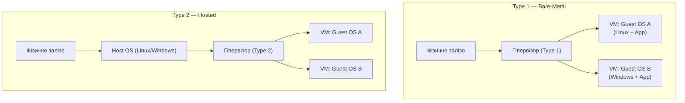

## Уявіть типовий понеділок розробника

Ваш C# застосунок пройшов усі тести на локальній машині. Git push, деплой на сервер — і ви отримуєте:

```text
Unhandled exception. System.IO.FileNotFoundException:
Could not load file or assembly 'SomePackage, Version=3.1.0.0'
```

Або ще гірше — застосунок запускається, але поводиться не так, як під час розробки: неправильне сортування рядків через інший `locale`, відмінна обробка шляхів файлів на Windows і Linux, або конфлікт версій бібліотек з іншим застосунком на тому ж сервері.

Це не помилка у вашому коді. Це **проблема середовища**.

::note
**Феномен "works on my machine"** — одна з найстаріших і найбільш болісних проблем у розробці програмного забезпечення. Вона виникає через фундаментальну невідповідність між середовищем розробника та середовищем виконання.

::

---

## Проблема розгортання програмного забезпечення

Будь-який застосунок існує не у вакуумі. Він залежить від:

- **Runtime**: конкретна версія .NET, Node.js, Python
- **Системних бібліотек**: `glibc`, `openssl`, `libicu`
- **Конфігурації ОС**: змінні оточення, файлові дескриптори, мережеві параметри
- **Інших застосунків**: бази даних, черги повідомлень, кеш-сервери
- **Файлової системи**: конкретні шляхи, права доступу, символічні посилання

Чим складніший застосунок — тим довший цей список залежностей. Чим більше серверів — тим складніше гарантувати однакове середовище на кожному з них.

### Масштаб проблеми

Розглянемо реальний сценарій. Команда з 5 розробників, 3 середовища (dev, staging, production), 10 сервісів. Кожен розробник має власну версію .NET SDK, власні глобальні налаштування. Staging може відставати від production на кілька патч-версій бібліотек.

| Середовище  | .NET SDK | `openssl` | `libicu` | PostgreSQL client |
| :---------- | :------- | :-------- | :------- | :---------------- |
| Dev (Іван)  | 10.0.100 | 3.1.4     | 72.1     | 16.2              |
| Dev (Марія) | 10.0.101 | 3.1.5     | 72.2     | 15.6              |
| Staging     | 9.0.203  | 3.0.14    | 70.1     | 15.5              |
| Production  | 9.0.200  | 3.0.12    | 70.0     | 15.4              |

Помножте цю ентропію на кількість мікросервісів, і ви отримаєте класичну "пекельну матрицю залежностей".

---

## Еволюція підходів до ізоляції середовищ

Індустрія вирішувала проблему невідтворюваності середовищ поетапно, і кожне покоління рішень мало свої компроміси.

### Bare Metal: один сервер — один застосунок

Найпростіший підхід — виділити кожному застосунку окремий фізичний сервер. Ізоляція абсолютна, конфліктів немає.

Але ціна катастрофічна:

- **Неефективне використання ресурсів**: типовий веб-сервер завантажує CPU на 10–20% у звичайний день
- **Висока вартість**: кожен застосунок потребує придбання, розміщення та обслуговування окремого "заліза"
- **Повільне масштабування**: додавання нового сервера займає дні або тижні

У 2000-х роках великі компанії тримали сотні серверів, більшість з яких просто "грілися" у стійках, чекаючи на пікове навантаження.

---

### Віртуальні машини: ізоляція через програмне "залізо"

Відповіддю на неефективність bare metal стала **віртуалізація**. Гіпервізор (hypervisor) — це програмний шар, який дозволяє запускати кілька **гостьових операційних систем** на одному фізичному хості, кожну в повністю ізольованому середовищі.

Розрізняють два типи гіпервізорів:

**Type 1 (Bare-Metal Hypervisor)** встановлюється безпосередньо на фізичне "залізо", без ОС-хоста. Він сам і є операційною системою для обладнання. Приклади: VMware ESXi, Microsoft Hyper-V, Xen. Використовується у корпоративних дата-центрах та хмарних провайдерах (AWS EC2, Azure VMs).

**Type 2 (Hosted Hypervisor)** запускається поверх звичайної ОС як звичайний застосунок. Приклади: VirtualBox, VMware Workstation, Parallels. Зручний для розробника на ноутбуці, але має вищий overhead через подвійний шар абстракції.

::mermaid



::

Віртуальні машини вирішили головну проблему: тепер один фізичний сервер може запускати десятки ізольованих середовищ. Якщо VM з одним застосунком "впала" — решта продовжують працювати. Якщо потрібен новий сервер — можна створити нову VM за хвилини, а не тижні.

Проте VM принесли власний тягар — **overhead гостьової ОС**:

- Кожна VM містить **повну копію операційної системи**: ядро, системні процеси, драйвери, стандартні бібліотеки. Це 1–10 ГБ лише для ОС, незалежно від розміру самого застосунку.
- **Час завантаження** VM — від кількох десятків секунд до кількох хвилин (завантажується ціла ОС).
- **Пам'ять**: гостьова ОС сама по собі споживає 200–500 МБ RAM, ще до того як запустився ваш застосунок.
- **CPU**: апаратна віртуалізація є ефективною, але емуляція деяких операцій (особливо I/O) додає затримки.

::warning
Парадокс VM: ви орендуєте сервер з 64 ГБ RAM, але 20 ГБ з них "з'їдають" самі гостьові операційні системи, не зробивши жодної корисної роботи.

::
