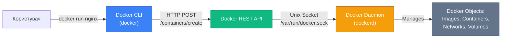
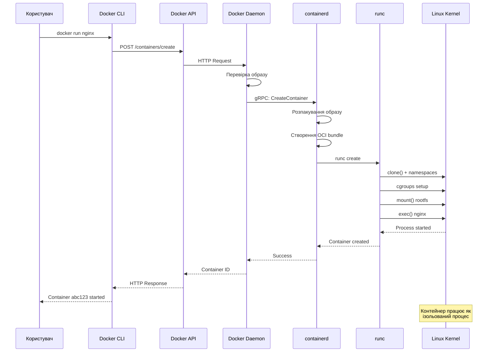

# Архітектура Docker Engine

## Заглянути під капот

Коли ви виконуєте команду `docker run nginx`, на екрані з'являється повідомлення про завантаження образу, а через кілька секунд веб-сервер Nginx вже працює у контейнері. Цей процес здається простим та майже магічним. Але що насправді відбувається між моментом натискання Enter та запуском контейнера?

За лаконічним інтерфейсом Docker CLI ховається складна багатошарова архітектура, в якій кожен компонент виконує чітко визначену роль. Розуміння цієї архітектури критично важливе не лише для задоволення інтелектуальної цікавості, але й для ефективного використання Docker, діагностики проблем та прийняття обґрунтованих рішень щодо конфігурації.

У цій статті ми детально розглянемо внутрішню будову Docker Engine — від клієнтської команди до низькорівневого створення контейнера на рівні ядра Linux. Ми простежимо повний шлях виконання команди `docker run` через усі шари архітектури, зрозумієм роль кожного компонента та побачимо, як Docker взаємодіє з операційною системою.

::note
Ця стаття фокусується на архітектурі Docker Engine — серцевині Docker. Інші компоненти екосистеми (Docker Hub, Docker Compose) будуть розглянуті в окремих статтях.

::

---

## Клієнт-серверна архітектура Docker

Docker побудований за класичною **клієнт-серверною моделлю**, де клієнт та сервер є окремими процесами, які спілкуються через добре визначений інтерфейс. Ця архітектурна модель не є унікальною для Docker — вона використовується в безлічі систем, від баз даних (PostgreSQL, MySQL) до веб-серверів (Apache, Nginx). Але в контексті Docker вона має особливе значення.

### Три ключові компоненти

Архітектура Docker складається з трьох основних компонентів, які взаємодіють один з одним:

**Docker Client (docker)** — це інструмент командного рядка, з яким безпосередньо взаємодіє користувач. Коли ви виконуєте команду `docker run`, `docker build` або `docker ps`, ви працюєте саме з клієнтом. Клієнт сам по собі не виконує жодних операцій з контейнерами — він лише формує запити та відправляє їх серверу.

**Docker Daemon (dockerd)** — це фоновий процес (daemon), який виконує всю важку роботу: управління образами, створення та запуск контейнерів, налаштування мереж, управління томами. Демон постійно працює у фоновому режимі, очікуючи на команди від клієнтів.

**Docker REST API** — це інтерфейс, через який клієнт спілкується з демоном. API визначає набір HTTP-ендпоінтів для кожної операції: створення контейнера, завантаження образу, перегляд логів тощо. Використання REST API означає, що клієнт та демон можуть працювати на різних машинах — клієнт на вашому ноутбуці може керувати демоном на віддаленому сервері.

::mermaid



::

### Аналогія: ресторан

Щоб краще зрозуміти клієнт-серверну модель Docker, уявімо ресторан:

- **Ви (користувач)** — це гість ресторану, який хоче замовити страву
- **Офіціант (Docker CLI)** — приймає ваше замовлення та передає його на кухню. Офіціант не готує їжу сам — він лише посередник
- **Меню (Docker API)** — стандартизований список страв (операцій), які можна замовити. Ви не можете попросити щось, чого немає в меню
- **Кухня (Docker Daemon)** — місце, де відбувається вся робота: готування, сервірування, управління інгредієнтами
- **Інгредієнти та страви (Docker Objects)** — образи, контейнери, мережі, томи, якими управляє кухня

Коли ви кажете офіціанту "Принесіть мені пасту карбонара" (аналог `docker run nginx`), офіціант не біжить на кухню готувати — він передає замовлення через стандартизовану систему (меню/API), і кухня виконує всю роботу. Ви отримуєте готову страву (запущений контейнер), не знаючи деталей приготування.

### Чому така архітектура?

Розділення клієнта та сервера дає кілька важливих переваг:

**Віддалене управління**: Docker CLI на вашому ноутбуці може керувати демоном на сервері в іншому дата-центрі. Достатньо вказати змінну оточення `DOCKER_HOST`, і всі команди будуть виконуватися віддалено.

**Множинні клієнти**: Один демон може обслуговувати кілька клієнтів одночасно. Розробник може виконувати команди через CLI, тоді як CI/CD система взаємодіє з тим самим демоном через API.

**Різні інтерфейси**: Окрім CLI, існують графічні інтерфейси (Docker Desktop, Portainer), бібліотеки для різних мов програмування (Python `docker-py`, Go `moby/moby/client`), які використовують той самий API.

**Безпека**: Демон працює з підвищеними привілеями (зазвичай від root), тоді як клієнт може працювати від звичайного користувача. Доступ до демона контролюється через права на Unix socket або TLS-сертифікати для мережевого доступу.

::tip
Ви можете перевірити, де працює ваш Docker Daemon, виконавши команду `docker context ls`. За замовчуванням це локальний Unix socket, але можна налаштувати віддалені контексти для управління кількома Docker-хостами.

::

---

## Docker Daemon: серце системи

Docker Daemon (`dockerd`) — це центральний компонент Docker Engine, який виконує всю важку роботу. Це довготривалий процес (long-running daemon), який запускається при завантаженні системи та працює у фоновому режимі, очікуючи на команди.

### Відповідальність демона

Демон відповідає за управління всіма аспектами життєвого циклу контейнерів:

**Управління образами**: завантаження образів з реєстрів (Docker Hub, приватні реєстри), зберігання їх локально, побудова нових образів з Dockerfile, видалення непотрібних образів.

**Управління контейнерами**: створення контейнерів з образів, запуск та зупинка контейнерів, моніторинг їхнього стану, збір логів, виконання команд всередині працюючих контейнерів.

**Управління мережами**: створення віртуальних мереж для контейнерів, налаштування DNS-резолюції між контейнерами, проброс портів з хоста в контейнер, ізоляція мережевого трафіку.

**Управління томами**: створення та видалення томів для збереження даних, монтування томів у контейнери, управління життєвим циклом даних незалежно від контейнерів.

**Взаємодія з іншими демонами**: Docker Daemon може спілкуватися з іншими демонами для реалізації розподілених сценаріїв (наприклад, Docker Swarm, хоча це за межами нашого курсу).

### Як працює демон?

Коли ви запускаєте Docker Daemon командою `dockerd`, він виконує кілька ініціалізаційних кроків:

1. **Створює Unix socket** за адресою `/var/run/docker.sock` (на Linux) або named pipe на Windows. Це точка входу для всіх клієнтів.

2. **Завантажує конфігурацію** з файлу `/etc/docker/daemon.json` (якщо він існує), де можна налаштувати параметри роботи демона.

3. **Ініціалізує підсистеми**: мережевий драйвер, драйвер зберігання (overlay2, aufs), плагіни.

4. **Відновлює стан**: перевіряє, які контейнери були запущені до перезавантаження, та відновлює їхній стан (якщо налаштовано автоматичний перезапуск).

5. **Починає слухати** на socket, очікуючи на вхідні API-запити від клієнтів.

Після ініціалізації демон працює в нескінченному циклі, обробляючи запити від клієнтів. Кожен запит обробляється в окремій горутині (Go concurrency primitive), що дозволяє демону обслуговувати багато клієнтів одночасно.

### Конфігурація демона

Поведінку Docker Daemon можна налаштувати через файл `/etc/docker/daemon.json`. Це JSON-файл, який містить параметри конфігурації:

```json
{
  "log-driver": "json-file",
  "log-opts": {
    "max-size": "10m",
    "max-file": "3"
  },
  "storage-driver": "overlay2",
  "default-address-pools": [
    {
      "base": "172.17.0.0/16",
      "size": 24
    }
  ]
}
```

Цей файл дозволяє централізовано керувати параметрами, які інакше довелося б передавати через прапорці командного рядка при кожному запуску `dockerd`.

::warning
Зміни в `daemon.json` вимагають перезапуску Docker Daemon. Це означає, що всі запущені контейнери будуть зупинені (якщо не налаштовано live restore). Плануйте зміни конфігурації в періоди низького навантаження.

::

---

## Docker REST API: мова спілкування

Docker REST API — це серце комунікації між клієнтом та демоном. Це HTTP-based API, який визначає набір ендпоінтів для кожної операції з Docker-об'єктами.

### Структура API

API організований навколо ресурсів (resources), кожен з яких представляє певний тип об'єкта:

- `/containers` — операції з контейнерами
- `/images` — операції з образами
- `/networks` — операції з мережами
- `/volumes` — операції з томами
- `/system` — системна інформація та події

Кожен ресурс підтримує стандартні HTTP-методи:

- **GET** — отримання інформації (наприклад, `GET /containers/json` повертає список контейнерів)
- **POST** — створення або виконання дії (наприклад, `POST /containers/create` створює новий контейнер)
- **DELETE** — видалення ресурсу (наприклад, `DELETE /containers/{id}` видаляє контейнер)

### Docker Socket: транспортний шар

На Linux-системах Docker CLI та Daemon спілкуються через **Unix domain socket** — спеціальний тип сокета, який працює через файлову систему замість мережевого стека. За замовчуванням цей socket знаходиться за адресою `/var/run/docker.sock`.

Unix socket має кілька переваг над TCP-сокетом:

**Продуктивність**: комунікація через Unix socket швидша, оскільки не потрібно проходити через мережевий стек ядра.

**Безпека**: доступ до socket контролюється через файлові права. Тільки користувачі з правами на читання/запис до `/var/run/docker.sock` можуть взаємодіяти з демоном.

**Простота**: не потрібно налаштовувати порти, firewall, TLS-сертифікати для локальної комунікації.

Ви можете безпосередньо взаємодіяти з Docker API через `curl`, минаючи Docker CLI:

```bash
# Отримати список контейнерів
curl --unix-socket /var/run/docker.sock http://localhost/v1.43/containers/json

# Створити контейнер
curl --unix-socket /var/run/docker.sock \
  -H "Content-Type: application/json" \
  -d '{"Image": "nginx", "HostConfig": {"PortBindings": {"80/tcp": [{"HostPort": "8080"}]}}}' \
  -X POST http://localhost/v1.43/containers/create

# Запустити контейнер
curl --unix-socket /var/run/docker.sock \
  -X POST http://localhost/v1.43/containers/{container_id}/start
```

::note
Версія API (`v1.43` у прикладі) відповідає версії Docker Engine. Docker підтримує зворотну сумісність — новіші версії демона можуть обробляти запити від старіших клієнтів. Поточна версія API завжди доступна через `docker version`.

::

### Віддалений доступ через TCP

Для управління віддаленими Docker-хостами можна налаштувати демон на прослуховування TCP-порту замість (або на додаток до) Unix socket. Це дозволяє виконувати команди на віддаленому сервері:

```bash
# На віддаленому сервері: запустити демон з TCP listener
dockerd -H tcp://0.0.0.0:2375

# На локальній машині: підключитися до віддаленого демона
export DOCKER_HOST=tcp://remote-server:2375
docker ps  # Ця команда виконається на віддаленому сервері
```

::caution
Відкриття Docker API через TCP без TLS-шифрування та аутентифікації — це критична вразливість безпеки. Будь-хто, хто має доступ до порту, може виконувати довільні команди з правами root. У продакшені завжди використовуйте TLS та клієнтські сертифікати.

::

---

## containerd: високорівневий runtime

Docker Daemon не створює контейнери безпосередньо. Замість цього він делегує цю роботу **containerd** — високорівневому контейнерному runtime, який управляє життєвим циклом контейнерів.

### Історія та призначення

containerd спочатку був частиною Docker Engine, але в 2016 році Docker Inc. виділила його в окремий проєкт та передала під управління Cloud Native Computing Foundation (CNCF). Це рішення мало кілька цілей:

- **Модульність**: розділити монолітний Docker на незалежні компоненти
- **Стандартизація**: створити runtime, який може використовуватися не тільки Docker, але й іншими системами (Kubernetes)
- **Спеціалізація**: дозволити containerd фокусуватися на одній задачі — управлінні контейнерами

Сьогодні containerd використовується не тільки Docker, але й:

- **Kubernetes** (через Container Runtime Interface)
- **AWS Fargate** (serverless контейнери)
- **Google Cloud Run**
- **Azure Container Instances**

### Відповідальність containerd

containerd відповідає за:

**Управління життєвим циклом контейнера**: створення, запуск, зупинка, видалення контейнерів.

**Управління образами**: завантаження образів з реєстрів, розпакування шарів, зберігання образів локально.

**Управління snapshots**: створення знімків файлової системи для контейнерів (через драйвери на кшталт overlayfs).

**Управління мережею та storage**: налаштування мережевих інтерфейсів контейнера, монтування томів.

**Моніторинг та метрики**: збір інформації про стан контейнерів, споживання ресурсів.

containerd надає gRPC API, через який Docker Daemon взаємодіє з ним. Коли демон отримує запит на створення контейнера, він формує gRPC-виклик до containerd, передаючи специфікацію контейнера.

### Архітектурна роль

containerd займає проміжну позицію між Docker Daemon (високорівневий інтерфейс для користувачів) та runc (низькорівневий інструмент для створення контейнерів). Він абстрагує складність роботи з низькорівневими деталями, надаючи зручний API для управління контейнерами.

Аналогія: якщо Docker Daemon — це диспетчер таксі, який приймає замовлення від клієнтів, то containerd — це менеджер автопарку, який керує конкретними автомобілями (контейнерами), призначає водіїв (процеси), стежить за станом машин.

::tip
Ви можете безпосередньо взаємодіяти з containerd через CLI-інструмент `ctr`, який постачається разом з containerd. Це корисно для діагностики проблем на низькому рівні, але для повсякденної роботи використовуйте Docker CLI.

::

---

## runc: низькорівневий runtime

На самому дні архітектурного стека знаходиться **runc** — низькорівневий контейнерний runtime, який безпосередньо взаємодіє з ядром Linux для створення контейнерів. Якщо containerd — це менеджер, то runc — це виконавець, який робить "брудну роботу".

### Що таке runc?

runc — це CLI-інструмент для створення та запуску контейнерів відповідно до специфікації OCI (Open Container Initiative). Він написаний на Go та є еталонною реалізацією OCI Runtime Specification.

runc не є демоном — це звичайна програма, яка запускається, створює контейнер та завершується. Кожен контейнер створюється окремим викликом runc. containerd викликає runc для кожного контейнера, передаючи йому конфігурацію у форматі JSON.

### Що робить runc?

Коли containerd просить runc створити контейнер, runc виконує наступні низькорівневі операції:

**Створює Linux namespaces**: викликає системні виклики `clone()` або `unshare()` для створення ізольованих просторів імен (PID, NET, MNT, UTS, IPC, USER).

**Налаштовує cgroups**: створює cgroup для контейнера та встановлює ліміти на CPU, пам'ять, I/O відповідно до специфікації.

**Налаштовує файлову систему**: монтує rootfs контейнера (зазвичай через overlayfs), створює необхідні точки монтування (`/proc`, `/sys`, `/dev`).

**Налаштовує мережу**: створює мережеві інтерфейси, налаштовує IP-адреси, маршрутизацію (хоча часто це робить окремий CNI-плагін).

**Застосовує security profiles**: налаштовує SELinux, AppArmor, seccomp для обмеження можливостей контейнера.

**Запускає процес**: виконує `exec()` для запуску головного процесу контейнера (того, що вказано в `CMD` або `ENTRYPOINT` Dockerfile).

Після створення контейнера runc може або залишитися як батьківський процес (foreground mode), або передати контроль containerd та завершитися (detached mode).

### OCI Runtime Specification

runc реалізує OCI Runtime Specification — відкритий стандарт, який визначає:

- **Формат конфігурації контейнера**: JSON-файл `config.json`, який описує всі параметри контейнера (namespaces, cgroups, mounts, process)
- **Життєвий цикл контейнера**: стани контейнера (creating, created, running, stopped) та операції переходу між ними
- **Hooks**: точки розширення, де можна виконати кастомні скрипти на різних етапах життєвого циклу

Завдяки OCI стандарту, runc можна замінити на інші OCI-сумісні runtime (наприклад, `crun` — реалізація на C, `kata-runtime` — контейнери у легковісних VM). containerd працюватиме з будь-яким runtime, який дотримується специфікації.

::note
runc — це не єдиний низькорівневий runtime. Існують альтернативи: `crun` (швидший, написаний на C), `youki` (написаний на Rust), `kata-runtime` (контейнери у мікро-VM для додаткової ізоляції). Але runc залишається найпопулярнішим та найстабільнішим.

::

---

## OCI: стандартизація контейнерів

Open Container Initiative (OCI) — це організація під егідою Linux Foundation, яка розробляє відкриті стандарти для контейнерних технологій. OCI була заснована в 2015 році Docker, CoreOS, Google, IBM, Microsoft та іншими лідерами індустрії.

### Три ключові специфікації

OCI визначає три стандарти, які разом забезпечують повну інтероперабельність контейнерних технологій:

**Image Specification** визначає формат контейнерних образів. Образ складається з:
- **Manifest** — JSON-файл, який описує шари образу та конфігурацію
- **Layers** — tar-архіви з файловою системою (кожен шар — це зміни відносно попереднього)
- **Configuration** — JSON-файл з метаданими (змінні оточення, команда запуску, exposed ports)

Завдяки цій специфікації, образ, створений Docker, можна запустити в Podman, containerd або будь-якому іншому OCI-сумісному runtime.

**Runtime Specification** визначає, як контейнер має бути створений та запущений. Вона описує:
- Формат `config.json` — конфігурація контейнера (namespaces, cgroups, mounts, capabilities)
- Життєвий цикл контейнера — операції create, start, kill, delete
- Hooks — точки розширення для виконання кастомних дій

runc є еталонною реалізацією цієї специфікації.

**Distribution Specification** визначає, як образи мають розповсюджуватися через реєстри (registries). Вона описує:
- HTTP API для push/pull образів
- Аутентифікацію та авторизацію
- Content addressing — ідентифікація шарів через SHA256 хеші

Docker Hub, GitHub Container Registry, Google Container Registry — всі вони реалізують OCI Distribution Spec.

### Чому стандартизація важлива?

До появи OCI кожен вендор мав власний формат контейнерів. Образ, створений для Docker, не працював у rkt (контейнерний runtime від CoreOS). Це створювало vendor lock-in та фрагментацію екосистеми.

OCI вирішила цю проблему, створивши відкриті стандарти, які підтримуються всіма основними гравцями. Тепер:

- Образ, створений Docker, працює в Kubernetes (який використовує containerd)
- Образ, створений Podman, можна завантажити на Docker Hub
- Інструменти для сканування вразливостей (Trivy, Snyk) працюють з будь-якими OCI-образами

Стандартизація знизила бар'єри входу для нових інструментів та забезпечила довгострокову стабільність екосистеми.

::tip
Коли ви створюєте Dockerfile та збираєте образ через `docker build`, результат автоматично відповідає OCI Image Specification. Вам не потрібно робити нічого додатково — Docker вже дотримується стандартів.

::

---

## Потік виконання: від команди до контейнера

Тепер, коли ми розглянули всі компоненти архітектури, простежимо повний шлях виконання команди `docker run nginx` через усі шари системи.

### Крок 1: Docker CLI отримує команду

Користувач виконує команду:

```bash
docker run -d -p 8080:80 --name my-nginx nginx:latest
```

Docker CLI парсить аргументи командного рядка:
- `-d` — detached mode (запустити у фоновому режимі)
- `-p 8080:80` — пробросити порт 80 контейнера на порт 8080 хоста
- `--name my-nginx` — ім'я контейнера
- `nginx:latest` — образ для запуску

### Крок 2: CLI формує API-запит

CLI перетворює команду на серію HTTP-запитів до Docker API:

**Перевірка наявності образу**: `GET /images/nginx:latest/json`
- Якщо образ відсутній локально, CLI виконує `POST /images/create?fromImage=nginx&tag=latest` для завантаження з Docker Hub

**Створення контейнера**: `POST /containers/create?name=my-nginx`
- Тіло запиту містить JSON-конфігурацію контейнера:

```json
{
  "Image": "nginx:latest",
  "HostConfig": {
    "PortBindings": {
      "80/tcp": [{"HostPort": "8080"}]
    }
  }
}
```

**Запуск контейнера**: `POST /containers/{id}/start`

Ці запити відправляються через Unix socket `/var/run/docker.sock`.

### Крок 3: Docker Daemon обробляє запити

Docker Daemon отримує API-запити та виконує відповідні дії:

**Перевіряє образ**: шукає `nginx:latest` у локальному сховищі образів. Якщо образ відсутній, демон завантажує його з Docker Hub (або іншого налаштованого registry).

**Створює конфігурацію контейнера**: демон формує повну специфікацію контейнера, включаючи:
- Мережеві налаштування (IP-адреса, DNS)
- Монтування томів
- Змінні оточення
- Ліміти ресурсів (якщо вказані)

**Викликає containerd**: демон відправляє gRPC-запит до containerd з проханням створити контейнер.

### Крок 4: containerd готує контейнер

containerd отримує запит від Docker Daemon та виконує підготовчі операції:

**Розпаковує образ**: containerd бере шари образу `nginx:latest` та створює snapshot файлової системи через драйвер overlayfs. Це створює об'єднану файлову систему з усіх шарів образу.

**Створює bundle**: containerd формує OCI bundle — директорію, яка містить:
- `config.json` — OCI Runtime Specification для контейнера
- `rootfs/` — кореневу файлову систему контейнера (змонтовані шари образу)

**Налаштовує мережу**: containerd викликає CNI (Container Network Interface) плагіни для створення мережевих інтерфейсів контейнера, призначення IP-адреси, налаштування маршрутизації.

**Викликає runc**: containerd запускає runc з шляхом до OCI bundle:

```bash
runc create --bundle /var/run/containerd/io.containerd.runtime.v2.task/moby/abc123 abc123
```

### Крок 5: runc створює контейнер

runc виконує низькорівневі системні виклики для створення ізольованого середовища:

**Створює namespaces**: викликає `clone()` з прапорцями `CLONE_NEWPID | CLONE_NEWNET | CLONE_NEWNS | CLONE_NEWUTS | CLONE_NEWIPC | CLONE_NEWUSER` для створення ізольованих просторів імен.

**Налаштовує cgroups**: створює cgroup для контейнера в `/sys/fs/cgroup/` та встановлює ліміти ресурсів (CPU, memory, I/O).

**Монтує файлову систему**: виконує `mount()` для створення rootfs контейнера через overlayfs, монтує `/proc`, `/sys`, `/dev` всередині контейнера.

**Налаштовує capabilities**: обмежує можливості процесу контейнера, видаляючи небезпечні capabilities (наприклад, `CAP_SYS_ADMIN`).

**Застосовує seccomp**: встановлює seccomp-фільтр, який обмежує системні виклики, доступні процесу контейнера.

**Запускає процес**: виконує `exec()` для запуску головного процесу контейнера — в нашому випадку це `nginx` з PID 1 всередині контейнера.

### Крок 6: Контейнер працює

Після успішного створення:

- runc повертає контроль containerd
- containerd повідомляє Docker Daemon про успішний запуск
- Docker Daemon відповідає Docker CLI з ID контейнера
- CLI виводить ID контейнера користувачу

Контейнер тепер працює як ізольований процес на хості. Nginx слухає на порту 80 всередині контейнера, а Docker Daemon налаштував iptables правила для проброса трафіку з порту 8080 хоста на порт 80 контейнера.

::mermaid



::

Ця діаграма показує повний шлях від команди користувача до запущеного контейнера. Кожен компонент виконує свою роль, і разом вони створюють ілюзію легковісної віртуальної машини, хоча насправді це просто ізольований процес на хості.

::note
Весь цей складний процес відбувається за частки секунди. Docker оптимізований для швидкості — більшість операцій кешуються, образи зберігаються локально після першого завантаження, а overlayfs дозволяє миттєво створювати нові контейнери без копіювання даних.

::

---

## Резюме

Архітектура Docker Engine — це багатошарова система, де кожен компонент має чітко визначену відповідальність:

**Docker CLI** — інтерфейс користувача, який перетворює команди на API-запити.

**Docker REST API** — стандартизований інтерфейс для комунікації між клієнтом та демоном.

**Docker Daemon** — центральний компонент, який управляє образами, контейнерами, мережами та томами.

**containerd** — високорівневий runtime, який управляє життєвим циклом контейнерів та взаємодіє з низькорівневим runtime.

**runc** — низькорівневий runtime, який безпосередньо створює контейнери через системні виклики Linux (namespaces, cgroups).

**OCI** — набір відкритих стандартів, які забезпечують інтероперабельність між різними контейнерними технологіями.

Ця модульна архітектура дозволяє:
- Замінювати компоненти (наприклад, використовувати інший runtime замість runc)
- Використовувати containerd незалежно від Docker (як у Kubernetes)
- Розробляти альтернативні клієнти та інтерфейси
- Забезпечувати безпеку через розділення привілеїв

Розуміння цієї архітектури критично важливе для діагностики проблем, оптимізації продуктивності та прийняття обґрунтованих рішень щодо конфігурації Docker у продакшен-середовищах.

У наступній статті ми перейдемо від теорії до практики та розглянемо процес встановлення Docker на різних операційних системах.

---

## Практичні завдання

### Завдання 1: Дослідження Docker Socket

Виконайте наступні команди для дослідження Docker Socket:

```bash
# Перевірте, чи існує Docker socket
ls -la /var/run/docker.sock

# Подивіться права доступу
stat /var/run/docker.sock

# Спробуйте виконати API-запит через curl
curl --unix-socket /var/run/docker.sock http://localhost/version
```

**Питання для роздумів:**
- Які права доступу має socket? Чому це важливо для безпеки?
- Що станеться, якщо видалити socket під час роботи демона?
- Як можна обмежити доступ до socket для певних користувачів?

### Завдання 2: Аналіз процесів

Запустіть контейнер та дослідіть процеси на хості:

```bash
# Запустіть контейнер
docker run -d --name test-nginx nginx

# Знайдіть процеси, пов'язані з контейнером
ps aux | grep nginx

# Подивіться ієрархію процесів
pstree -p | grep containerd
```

**Питання:**
- Скільки процесів створюється для одного контейнера?
- Який процес є батьківським для nginx всередині контейнера?
- Як виглядає ієрархія: dockerd → containerd → runc → nginx?

### Завдання 3: Створення діаграми

Створіть власну діаграму архітектури Docker, яка показує:

1. Всі компоненти (CLI, Daemon, containerd, runc)
2. Протоколи комунікації між ними (REST API, gRPC, system calls)
3. Які об'єкти управляє кожен компонент (images, containers, namespaces)

Використайте будь-який інструмент (Mermaid, draw.io, навіть папір та олівець).

### Завдання 4: Порівняння з альтернативами

Дослідіть архітектуру Podman та порівняйте з Docker:

| Аспект | Docker | Podman |
| :--- | :--- | :--- |
| Наявність демона | Так (dockerd) | ? |
| Низькорівневий runtime | runc | ? |
| Високорівневий runtime | containerd | ? |
| Комунікація клієнт-сервер | REST API через socket | ? |

**Додаткове питання:** Які переваги та недоліки daemonless архітектури Podman порівняно з daemon-based архітектурою Docker?

::note
Ці завдання допоможуть вам глибше зрозуміти внутрішню будову Docker та побачити, як теоретичні концепції реалізовані на практиці. Експериментуйте, досліджуйте логи, читайте вихідний код — це найкращий спосіб навчання.

::


