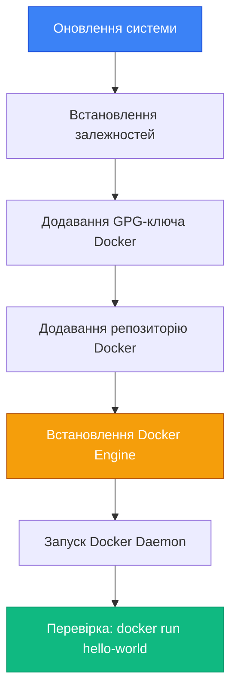

# Встановлення Docker

## Від теорії до практики

У попередніх статтях ми розглянули концептуальні основи контейнеризації, історію Docker та його внутрішню архітектуру. Тепер настав час перейти від теорії до практики — встановити Docker на вашу робочу машину та виконати перші команди.

Встановлення Docker — це не просто завантаження та запуск інсталятора. Це процес, який вимагає розуміння особливостей вашої операційної системи, вимог до апаратного забезпечення та правильного налаштування після встановлення. У цій статті ми детально розглянемо встановлення Docker на трьох основних платформах: Linux, macOS та Windows, з акцентом на CLI-підхід та розуміння того, що відбувається "під капотом".

::note
Ця стаття фокусується на встановленні **Docker Engine** — основного компонента для роботи з контейнерами через командний рядок. Docker Desktop (GUI-інструмент) згадується лише там, де це необхідно для macOS та Windows.

::

---

## Системні вимоги

Перш ніж розпочати встановлення, важливо переконатися, що ваша система відповідає мінімальним вимогам Docker. Хоча Docker є відносно легковісним, він має певні залежності від операційної системи та апаратного забезпечення.

### Загальні вимоги

**64-бітна архітектура**: Docker підтримує лише 64-бітні системи (x86_64/amd64 або ARM64/aarch64). 32-бітні системи не підтримуються.

**Віртуалізація**: На Windows та macOS Docker використовує віртуалізацію для запуску Linux-ядра. Переконайтеся, що віртуалізація увімкнена в BIOS/UEFI:
- Intel: VT-x (Intel Virtualization Technology)
- AMD: AMD-V (AMD Virtualization)

**Оперативна пам'ять**: Мінімум 4 ГБ RAM, рекомендовано 8 ГБ або більше для комфортної роботи з кількома контейнерами.

**Дисковий простір**: Мінімум 10 ГБ вільного місця для Docker Engine та образів. Для активної розробки рекомендовано 50+ ГБ.

### Вимоги для Linux

**Ядро Linux**: версія 3.10 або новіша (рекомендовано 5.x для повної підтримки всіх функцій)

**Дистрибутиви**: Docker офіційно підтримує:
- Ubuntu 20.04 LTS, 22.04 LTS, 24.04 LTS
- Debian 10 (Buster), 11 (Bullseye), 12 (Bookworm)
- Fedora 38, 39, 40
- CentOS 7, 8 (через CentOS Stream)
- RHEL 7, 8, 9

**Архітектура**: x86_64 (amd64), ARM64 (aarch64), ARMv7 (armhf)

### Вимоги для macOS

**Версія macOS**: macOS Monterey (12) або новіша (станом на 2026 рік підтримуються macOS 12, 13, 14, 15)

**Процесор**: 
- Intel Core i5 або новіший (для Intel Mac)
- Apple Silicon (M1, M2, M3, M4) — нативна підтримка ARM64

**Віртуалізація**: Hypervisor.framework (вбудований у macOS, додаткове налаштування не потрібне)

::tip
На Apple Silicon (M1/M2/M3/M4) Docker працює нативно через ARM64, що забезпечує відмінну продуктивність. Більшість популярних образів (включно з офіційними .NET образами) мають ARM64-варіанти.

::

### Вимоги для Windows

**Версія Windows**: Windows 10 версії 21H2 або новіша, Windows 11

**WSL 2**: Windows Subsystem for Linux версії 2 — обов'язкова для Docker Desktop

**Віртуалізація**: Hyper-V або WSL 2 backend (WSL 2 рекомендовано)

**Процесор**: 64-бітний процесор з підтримкою SLAT (Second Level Address Translation)

---

## Встановлення на Linux (Ubuntu/Debian)

Linux — це нативна платформа для Docker, оскільки Docker використовує можливості ядра Linux (namespaces, cgroups). На Linux ми встановлюємо Docker Engine безпосередньо, без проміжних шарів віртуалізації.

### Підготовка системи

Перш за все, оновимо список пакетів та встановимо необхідні залежності:

```bash
# Оновлення індексу пакетів
sudo apt update

# Встановлення залежностей для роботи з HTTPS-репозиторіями
sudo apt install -y ca-certificates curl gnupg lsb-release
```

Ці пакети необхідні для безпечного завантаження Docker з офіційного репозиторію через HTTPS.

### Додавання офіційного репозиторію Docker

Docker не входить до стандартних репозиторіїв Ubuntu/Debian, тому ми додамо офіційний репозиторій Docker:

```bash
# Створення директорії для GPG-ключів
sudo install -m 0755 -d /etc/apt/keyrings

# Завантаження офіційного GPG-ключа Docker
sudo curl -fsSL https://download.docker.com/linux/ubuntu/gpg \
  -o /etc/apt/keyrings/docker.asc

# Встановлення прав доступу до ключа
sudo chmod a+r /etc/apt/keyrings/docker.asc

# Додавання репозиторію Docker до списку джерел APT
echo "deb [arch=$(dpkg --print-architecture) signed-by=/etc/apt/keyrings/docker.asc] \
  https://download.docker.com/linux/ubuntu \
  $(. /etc/os-release && echo "$VERSION_CODENAME") stable" | \
  sudo tee /etc/apt/sources.list.d/docker.list > /dev/null
```

::note
Для Debian замініть `ubuntu` на `debian` в URL репозиторію. Решта команд залишаються ідентичними.

::

### Встановлення Docker Engine

Тепер встановимо Docker Engine та супутні компоненти:

```bash
# Оновлення індексу пакетів з новим репозиторієм
sudo apt update

# Встановлення Docker Engine, CLI, containerd та плагінів
sudo apt install -y \
  docker-ce \
  docker-ce-cli \
  containerd.io \
  docker-buildx-plugin \
  docker-compose-plugin
```

Розберемо, що встановлюється:

- **docker-ce** (Community Edition) — Docker Engine (демон `dockerd`)
- **docker-ce-cli** — Docker CLI (команда `docker`)
- **containerd.io** — containerd runtime
- **docker-buildx-plugin** — розширений builder для multi-platform образів
- **docker-compose-plugin** — Docker Compose v2 як плагін CLI

### Перевірка встановлення

Після встановлення Docker Daemon автоматично запускається. Перевіримо статус:

```bash
# Перевірка статусу Docker Daemon
sudo systemctl status docker
```

Ви повинні побачити `active (running)` у виводі. Тепер виконаємо тестовий запуск контейнера:

```bash
# Запуск тестового контейнера hello-world
sudo docker run hello-world
```

Якщо все налаштовано правильно, ви побачите повідомлення:

```
Hello from Docker!
This message shows that your installation appears to be working correctly.
```

::mermaid



::

### Що відбулося під час встановлення?

Коли ви встановили Docker Engine, система виконала кілька важливих дій:

1. **Створено systemd service**: файл `/lib/systemd/system/docker.service` визначає, як запускати Docker Daemon
2. **Створено групу docker**: група `docker` дозволяє користувачам взаємодіяти з демоном без `sudo`
3. **Створено socket**: `/var/run/docker.sock` — точка входу для Docker CLI
4. **Налаштовано автозапуск**: Docker Daemon буде автоматично запускатися при завантаженні системи

---

## Post-Installation: налаштування для зручності

Після встановлення Docker на Linux є кілька важливих кроків, які зроблять роботу з Docker зручнішою та безпечнішою.

### Додавання користувача до групи docker

За замовчуванням Docker Daemon працює з правами root, і для взаємодії з ним потрібно використовувати `sudo` перед кожною командою. Це незручно та може призвести до помилок (наприклад, створення файлів з правами root).

Рішення — додати вашого користувача до групи `docker`:

```bash
# Створення групи docker (якщо вона ще не існує)
sudo groupadd docker

# Додавання поточного користувача до групи docker
sudo usermod -aG docker $USER

# Застосування змін (альтернатива перелогіну)
newgrp docker
```

Після цього вийдіть з системи та увійдіть знову (або виконайте `newgrp docker`), щоб зміни набули чинності. Тепер ви можете виконувати команди Docker без `sudo`:

```bash
# Тепер працює без sudo
docker run hello-world
docker ps
docker images
```

::warning
Додавання користувача до групи `docker` надає йому фактично root-привілеї на системі, оскільки через Docker можна монтувати будь-які директорії хоста та виконувати команди з підвищеними правами. Робіть це лише для довірених користувачів.

::

### Налаштування автозапуску Docker Daemon

Переконаємося, що Docker Daemon запускається автоматично при завантаженні системи:

```bash
# Увімкнення автозапуску Docker
sudo systemctl enable docker.service
sudo systemctl enable containerd.service

# Перевірка статусу
systemctl is-enabled docker.service
```

Якщо вивід `enabled` — все налаштовано правильно.

### Налаштування логування

За замовчуванням Docker зберігає логи контейнерів у JSON-файлах, які можуть необмежено зростати. Налаштуємо ротацію логів через `/etc/docker/daemon.json`:

```bash
# Створення конфігураційного файлу
sudo nano /etc/docker/daemon.json
```

Додайте наступний вміст:

```json
{
  "log-driver": "json-file",
  "log-opts": {
    "max-size": "10m",
    "max-file": "3"
  }
}
```

Це обмежить розмір кожного лог-файлу до 10 МБ та збереже максимум 3 файли (загалом 30 МБ на контейнер).

Після зміни конфігурації перезапустіть демон:

```bash
sudo systemctl restart docker
```

::tip
Файл `daemon.json` — це центральне місце для конфігурації Docker Daemon. Тут можна налаштувати storage driver, мережеві параметри, insecure registries та багато іншого. Детальніше про конфігурацію ми поговоримо в наступних статтях.

::

---

## Встановлення на macOS

На macOS Docker не може працювати нативно, оскільки macOS не має ядра Linux з підтримкою namespaces та cgroups. Тому Docker на macOS працює через віртуалізацію — запускається легковісна Linux-віртуальна машина, всередині якої працює Docker Engine.

### Docker Desktop for Mac

Офіційний спосіб встановлення Docker на macOS — це **Docker Desktop**, який включає:

- Docker Engine (працює у віртуальній машині)
- Docker CLI (нативний macOS бінарник)
- Docker Compose
- Kubernetes (опціонально)
- GUI для управління контейнерами

::note
На відміну від Linux, де можна встановити лише Docker Engine через CLI, на macOS Docker Desktop є єдиним офіційно підтримуваним способом встановлення. Альтернативи (наприклад, Colima) існують, але виходять за межі цього курсу.

::

### Завантаження та встановлення

1. Відвідайте [офіційний сайт Docker](https://www.docker.com/products/docker-desktop/)
2. Завантажте Docker Desktop для Mac:
   - **Intel Mac**: завантажте версію для x86_64
   - **Apple Silicon (M1/M2/M3/M4)**: завантажте версію для ARM64

3. Відкрийте завантажений `.dmg` файл
4. Перетягніть Docker.app у папку Applications
5. Запустіть Docker з папки Applications

При першому запуску Docker Desktop:
- Попросить права адміністратора (для встановлення мережевих компонентів)
- Створить віртуальну машину для Docker Engine
- Налаштує Docker CLI у вашому PATH

### Перевірка встановлення

Відкрийте Terminal та виконайте:

```bash
# Перевірка версії Docker
docker --version

# Детальна інформація про Docker
docker version

# Інформація про систему
docker info

# Тестовий запуск
docker run hello-world
```

### Особливості Docker на macOS

**Файлова система**: Docker на macOS використовує VirtioFS для монтування директорій хоста у контейнери. Це швидше за попередні рішення (osxfs), але все одно повільніше, ніж нативний Linux.

**Мережа**: Контейнери працюють у віртуальній машині, тому мережева взаємодія проходить через додатковий шар. Для доступу до контейнера з хоста використовуйте `localhost` та проброшені порти.

**Ресурси**: Docker Desktop дозволяє налаштувати, скільки CPU, RAM та дискового простору виділити віртуальній машині. За замовчуванням це 50% доступних ресурсів.

::tip
На Apple Silicon Docker працює дуже ефективно завдяки нативній підтримці ARM64. Більшість популярних образів (Node.js, Python, .NET, PostgreSQL) мають ARM64-варіанти. Для x86_64 образів Docker використовує Rosetta 2 для емуляції, що працює дивовижно швидко.

::

---

## Встановлення на Windows

Windows, як і macOS, не має нативної підтримки Linux-контейнерів. Docker на Windows працює через **WSL 2** (Windows Subsystem for Linux 2) — повноцінне Linux-ядро, інтегроване у Windows.

### Підготовка: встановлення WSL 2

Перш ніж встановлювати Docker Desktop, потрібно налаштувати WSL 2:

```powershell
# Відкрийте PowerShell від імені адміністратора

# Увімкнення WSL
wsl --install

# Перезавантажте комп'ютер після встановлення
```

Ця команда:
- Увімкне необхідні компоненти Windows (Virtual Machine Platform, WSL)
- Завантажить та встановить Linux-ядро для WSL 2
- Встановить Ubuntu як дистрибутив за замовчуванням

Після перезавантаження перевірте версію WSL:

```powershell
# Перевірка версії WSL
wsl --version

# Перевірка встановлених дистрибутивів
wsl --list --verbose
```

Переконайтеся, що ваш дистрибутив використовує WSL 2 (колонка VERSION має показувати 2). Якщо ні, конвертуйте:

```powershell
wsl --set-version Ubuntu 2
wsl --set-default-version 2
```

### Встановлення Docker Desktop

1. Завантажте [Docker Desktop for Windows](https://www.docker.com/products/docker-desktop/)
2. Запустіть інсталятор `Docker Desktop Installer.exe`
3. Під час встановлення переконайтеся, що опція **"Use WSL 2 instead of Hyper-V"** увімкнена
4. Завершіть встановлення та перезавантажте комп'ютер

При першому запуску Docker Desktop:
- Інтегрується з WSL 2
- Налаштує Docker Engine у WSL-дистрибутиві
- Зробить Docker CLI доступним як у PowerShell/CMD, так і у WSL

### Перевірка встановлення

У PowerShell або WSL виконайте:

```bash
# Перевірка версії
docker --version

# Детальна інформація
docker version

# Тестовий запуск
docker run hello-world
```

### Інтеграція з WSL дистрибутивами

Docker Desktop може інтегруватися з кількома WSL-дистрибутивами. Налаштування:

1. Відкрийте Docker Desktop
2. Settings → Resources → WSL Integration
3. Увімкніть інтеграцію для потрібних дистрибутивів (Ubuntu, Debian тощо)

Тепер Docker CLI буде доступний всередині WSL:

```bash
# У WSL (наприклад, Ubuntu)
docker ps
docker images
```

::note
Docker Desktop на Windows підтримує як Linux-контейнери (через WSL 2), так і Windows-контейнери (через Hyper-V). За замовчуванням використовуються Linux-контейнери, оскільки більшість образів створені для Linux. Перемикання між режимами доступне через контекстне меню Docker Desktop.

::

---

## Перевірка встановлення: основні команди

Після встановлення Docker на будь-якій платформі важливо переконатися, що все працює коректно. Розглянемо ключові команди для діагностики.

### docker version: детальна інформація про версії

Команда `docker version` показує версії клієнта та сервера (демона):

```bash
docker version
```

Типовий вивід:

```
Client:
 Version:           24.0.7
 API version:       1.43
 Go version:        go1.21.5
 Git commit:        afdd53b
 Built:             Thu Dec 14 10:28:22 2023
 OS/Arch:           linux/amd64
 Context:           default

Server: Docker Engine - Community
 Engine:
  Version:          24.0.7
  API version:      1.43 (minimum version 1.12)
  Go version:       go1.21.5
  Git commit:       311b9ff
  Built:            Thu Dec 14 10:28:22 2023
  OS/Arch:          linux/amd64
  Experimental:     false
 containerd:
  Version:          1.7.11
  GitCommit:        64b8a811b07ba6288238eefc14d898ee0b5b99ba
 runc:
  Version:          1.1.11
  GitCommit:        v1.1.11-0-g4bccb38
 docker-init:
  Version:          0.19.0
  GitCommit:        de40ad0
```

Що показує цей вивід:

**Client** — версія Docker CLI на вашій машині. Це інструмент, який ви використовуєте для виконання команд.

**Server** — версія Docker Engine (демона). Це процес, який фактично управляє контейнерами.

**API version** — версія Docker API, яку використовує клієнт для спілкування з сервером. Docker підтримує зворотну сумісність — новіший сервер може працювати зі старішим клієнтом.

**containerd** та **runc** — версії низькорівневих компонентів, які ми розглядали в статті про архітектуру.

::tip
Якщо ви бачите помилку "Cannot connect to the Docker daemon", це означає, що Docker Daemon не запущений. На Linux виконайте `sudo systemctl start docker`, на macOS/Windows запустіть Docker Desktop.

::

### docker info: системна інформація

Команда `docker info` показує детальну інформацію про конфігурацію Docker:

```bash
docker info
```

Ключові параметри у виводі:

**Server Version** — версія Docker Engine

**Storage Driver** — драйвер файлової системи (зазвичай `overlay2` на Linux)

**Cgroup Driver** — драйвер для управління cgroups (`cgroupfs` або `systemd`)

**Containers** — кількість контейнерів (запущених, зупинених, призупинених)

**Images** — кількість локально збережених образів

**Docker Root Dir** — директорія, де Docker зберігає дані (зазвичай `/var/lib/docker`)

**Registry** — адреса реєстру за замовчуванням (Docker Hub)

Ця команда корисна для діагностики проблем та розуміння поточної конфігурації системи.

### docker run hello-world: перший контейнер

Команда `docker run hello-world` — це традиційний "Hello World" для Docker:

```bash
docker run hello-world
```

Що відбувається при виконанні цієї команди:

1. Docker CLI відправляє запит до Docker Daemon
2. Демон перевіряє, чи є образ `hello-world` локально
3. Якщо образу немає, демон завантажує його з Docker Hub
4. Демон створює контейнер з образу
5. Демон запускає контейнер
6. Контейнер виводить повідомлення та завершується
7. Демон повертає вивід контейнера до CLI

Успішний вивід:

```
Unable to find image 'hello-world:latest' locally
latest: Pulling from library/hello-world
c1ec31eb5944: Pull complete
Digest: sha256:4bd78111b6914a99dbc560e6a20eab57ff6655aea4a80c50b0c5491968cbc2e6
Status: Downloaded newer image for hello-world:latest

Hello from Docker!
This message shows that your installation appears to be working correctly.

To generate this message, Docker took the following steps:
 1. The Docker client contacted the Docker daemon.
 2. The Docker daemon pulled the "hello-world" image from the Docker Hub.
 3. The Docker daemon created a new container from that image which runs the
    executable that produces the output you are currently reading.
 4. The Docker daemon streamed that output to the Docker client, which sent it
    to your terminal.
```

Це повідомлення підтверджує, що вся архітектура Docker працює коректно: CLI → API → Daemon → containerd → runc → контейнер.

---

## Docker CLI: перше знайомство

Тепер, коли Docker встановлено, розглянемо базову структуру команд Docker CLI.

### Структура команд

Команди Docker мають ієрархічну структуру:

```
docker [OPTIONS] COMMAND [ARG...]
```

Наприклад:

```bash
docker container ls --all
docker image pull nginx:latest
docker network create my-network
```

Сучасний Docker CLI організований навколо **об'єктів** (objects):

- `docker container` — операції з контейнерами
- `docker image` — операції з образами
- `docker network` — операції з мережами
- `docker volume` — операції з томами
- `docker system` — системні операції

Для зворотної сумісності існують скорочені команди:

```bash
# Повна форма
docker container ls

# Скорочена форма (legacy)
docker ps
```

Обидві форми працюють ідентично, але повна форма більш явна та зрозуміла.

### Отримання довідки

Docker CLI має вбудовану систему довідки:

```bash
# Загальна довідка
docker --help

# Довідка для конкретної команди
docker run --help

# Довідка для групи команд
docker container --help
```

Довідка показує всі доступні опції, приклади використання та посилання на документацію.

### Основні команди для початку

Ось команди, які ви будете використовувати найчастіше:

```bash
# Запуск контейнера
docker run nginx

# Перегляд запущених контейнерів
docker ps

# Перегляд всіх контейнерів (включно зі зупиненими)
docker ps -a

# Перегляд локальних образів
docker images

# Зупинка контейнера
docker stop <container_id>

# Видалення контейнера
docker rm <container_id>

# Видалення образу
docker rmi <image_id>
```

Детальний розбір цих команд буде в наступній статті "Перший контейнер".

::note
Docker CLI підтримує автодоповнення (tab completion) у більшості сучасних shell (bash, zsh, fish). Це значно прискорює роботу — просто натисніть Tab після `docker` або `docker container`, щоб побачити доступні команди.

::

---

## Troubleshooting: типові проблеми при встановленні

Навіть при дотриманні інструкцій можуть виникнути проблеми. Розглянемо найпоширеніші та способи їх вирішення.

### Linux: "permission denied" при доступі до Docker socket

**Проблема**: При виконанні `docker ps` отримуєте помилку:

```
permission denied while trying to connect to the Docker daemon socket
```

**Причина**: Ваш користувач не має прав на доступ до `/var/run/docker.sock`.

**Рішення**:

```bash
# Додайте користувача до групи docker
sudo usermod -aG docker $USER

# Застосуйте зміни
newgrp docker

# Або вийдіть та увійдіть знову
```

### Linux: Docker Daemon не запускається

**Проблема**: `systemctl status docker` показує `failed` або `inactive`.

**Діагностика**:

```bash
# Перегляд логів демона
sudo journalctl -u docker.service -n 50 --no-pager

# Спроба запуску вручну для детальних помилок
sudo dockerd --debug
```

**Типові причини**:
- Конфлікт портів (якщо налаштовано TCP listener)
- Некоректний `daemon.json`
- Проблеми з storage driver

### macOS: Docker Desktop не запускається

**Проблема**: Docker Desktop показує помилку при запуску або зависає на "Starting...".

**Рішення**:

```bash
# Повне видалення та перевстановлення
# 1. Видаліть Docker.app
# 2. Видаліть дані Docker
rm -rf ~/Library/Group\ Containers/group.com.docker
rm -rf ~/Library/Containers/com.docker.docker
rm -rf ~/.docker

# 3. Перевстановіть Docker Desktop
```

### Windows: WSL 2 не встановлюється

**Проблема**: `wsl --install` завершується з помилкою.

**Рішення**:

```powershell
# Увімкнення необхідних компонентів Windows вручну
dism.exe /online /enable-feature /featurename:Microsoft-Windows-Subsystem-Linux /all /norestart
dism.exe /online /enable-feature /featurename:VirtualMachinePlatform /all /norestart

# Перезавантаження
# Завантаження та встановлення WSL 2 kernel update
# https://aka.ms/wsl2kernel
```

### Загальна проблема: "Cannot connect to the Docker daemon"

**Проблема**: Docker CLI не може з'єднатися з демоном.

**Діагностика**:

```bash
# Перевірка, чи працює демон
# Linux:
sudo systemctl status docker

# macOS/Windows: переконайтеся, що Docker Desktop запущений

# Перевірка змінної DOCKER_HOST
echo $DOCKER_HOST

# Якщо вона встановлена, спробуйте скинути
unset DOCKER_HOST
```

::tip
Більшість проблем з Docker вирішуються перезапуском демона (Linux: `sudo systemctl restart docker`) або Docker Desktop (macOS/Windows). Якщо це не допомагає, перегляньте логи — вони зазвичай містять детальну інформацію про причину проблеми.

::

---

## Резюме

Встановлення Docker — це перший практичний крок у вивченні контейнеризації. У цій статті ми розглянули:

**Системні вимоги** для Linux, macOS та Windows, включно з особливостями кожної платформи.

**Встановлення на Linux** через офіційний репозиторій Docker — найпростіший та найнадійніший спосіб отримати останню версію Docker Engine.

**Post-installation налаштування** на Linux: додавання користувача до групи docker, налаштування автозапуску, конфігурація логування.

**Встановлення на macOS** через Docker Desktop — єдиний офіційно підтримуваний спосіб, який використовує віртуалізацію для запуску Linux-ядра.

**Встановлення на Windows** через Docker Desktop та WSL 2 — сучасний підхід, який забезпечує майже нативну продуктивність Linux-контейнерів на Windows.

**Перевірка встановлення** через команди `docker version`, `docker info` та `docker run hello-world`.

**Troubleshooting** типових проблем при встановленні на різних платформах.

Тепер, коли Docker встановлено та налаштовано, ми готові до запуску першого контейнера та детального вивчення команди `docker run` у наступній статті.

---

## Практичні завдання

### Завдання 1: Перевірка конфігурації

Виконайте наступні команди та проаналізуйте вивід:

```bash
# Версія Docker
docker version

# Системна інформація
docker info

# Перевірка storage driver
docker info | grep "Storage Driver"

# Перевірка Docker Root Dir
docker info | grep "Docker Root Dir"
```

**Питання:**
- Яка версія Docker Engine встановлена?
- Який storage driver використовується?
- Де Docker зберігає образи та контейнери?

### Завдання 2: Дослідження Docker Daemon

На Linux дослідіть systemd service для Docker:

```bash
# Перегляд конфігурації service
systemctl cat docker.service

# Перегляд логів демона
sudo journalctl -u docker.service -n 100

# Перевірка автозапуску
systemctl is-enabled docker.service
```

**Питання:**
- Яка команда запускає Docker Daemon?
- Які залежності має docker.service?
- Чи налаштовано автозапуск?

### Завдання 3: Експеримент з конфігурацією

Створіть файл `/etc/docker/daemon.json` з наступним вмістом:

```json
{
  "log-driver": "json-file",
  "log-opts": {
    "max-size": "5m",
    "max-file": "2"
  },
  "default-address-pools": [
    {
      "base": "172.20.0.0/16",
      "size": 24
    }
  ]
}
```

Перезапустіть Docker та перевірте, чи застосувалися зміни:

```bash
sudo systemctl restart docker
docker info | grep -A 5 "Default Address Pools"
```

**Питання:**
- Що робить параметр `default-address-pools`?
- Як перевірити, що налаштування логування працює?

### Завдання 4: Порівняння платформ

Якщо у вас є доступ до кількох платформ, порівняйте:

| Характеристика | Linux | macOS | Windows |
| :--- | :--- | :--- | :--- |
| Спосіб встановлення | ? | ? | ? |
| Віртуалізація | ? | ? | ? |
| Розмір встановлення | ? | ? | ? |
| Час запуску демона | ? | ? | ? |

::note
Ці завдання допоможуть вам краще зрозуміти, як Docker працює на вашій платформі, та підготують до наступних статей, де ми почнемо активно працювати з контейнерами.

::


