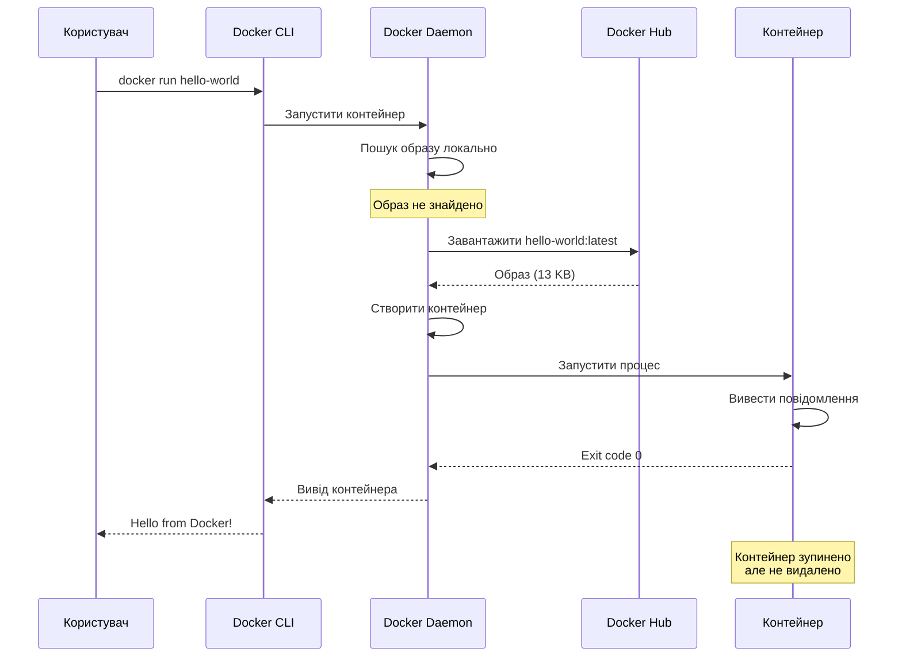

# Перший контейнер — docker run

## Від теорії до практики

У попередніх статтях ми побудували міцний теоретичний фундамент: зрозуміли концепцію контейнеризації, вивчили архітектуру Docker та встановили його на нашу систему. Тепер настав час найцікавішого — запустити перший контейнер та побачити Docker у дії.

Команда `docker run` — це ваш головний інструмент для роботи з контейнерами. Вона здається простою на перший погляд, але за цією простотою ховається величезна гнучкість та потужність. Одна команда може запустити простий скрипт, веб-сервер, базу даних або складний розподілений застосунок.

У цій статті ми детально розберемо `docker run`, почнемо з найпростіших прикладів та поступово перейдемо до складніших сценаріїв. Ви навчитеся запускати контейнери в інтерактивному та фоновому режимах, керувати їхнім життєвим циклом, переглядати логи та розуміти, що відбувається під капотом при кожному запуску.

::note
Ця стаття фокусується на практичному використанні `docker run`. Ми не будемо створювати власні образи (це тема наступних статей) — замість цього використаємо готові образи з Docker Hub.

::

---

## docker run hello-world: розбір по кроках

Почнемо з найпростішого можливого контейнера — `hello-world`. Ми вже запускали його для перевірки встановлення, але тепер розглянемо детально, що відбувається на кожному кроці.

### Виконання команди

```bash
docker run hello-world
```

Ця команда виглядає обманливо простою — лише два слова. Але за лаштунками відбувається складна послідовність операцій.

### Крок 1: Пошук образу локально

Коли ви виконуєте `docker run hello-world`, Docker CLI відправляє запит до Docker Daemon: "Запусти контейнер з образу `hello-world`".

Демон спочатку перевіряє, чи є цей образ у локальному сховищі (зазвичай `/var/lib/docker/`). Якщо це ваш перший запуск, образу там немає, і ви побачите повідомлення:

```
Unable to find image 'hello-world:latest' locally
```

Це не помилка — це нормальна поведінка. Docker повідомляє, що образ потрібно завантажити.

### Крок 2: Завантаження образу з Docker Hub

Оскільки образу немає локально, демон звертається до **Docker Hub** — публічного реєстру образів. Docker Hub містить мільйони образів, включно з офіційними образами для популярних технологій.

Ви побачите процес завантаження:

```
latest: Pulling from library/hello-world
c1ec31eb5944: Pull complete
Digest: sha256:4bd78111b6914a99dbc560e6a20eab57ff6655aea4a80c50b0c5491968cbc2e6
Status: Downloaded newer image for hello-world:latest
```

Що тут відбувається:

- **latest** — це тег образу. Якщо ви не вказуєте тег явно, Docker використовує `latest` за замовчуванням
- **library/hello-world** — повна назва образу. `library/` — це офіційний namespace Docker
- **c1ec31eb5944** — ID шару образу. Образи складаються з шарів, і кожен шар завантажується окремо
- **Digest** — SHA256 хеш образу, який гарантує його цілісність
- **Pull complete** — шар успішно завантажено

Образ `hello-world` надзвичайно малий — близько 13 КБ, тому завантаження займає частки секунди.

### Крок 3: Створення контейнера

Після завантаження образу демон створює контейнер. Це включає:

- Створення ізольованих namespaces (PID, NET, MNT, UTS, IPC)
- Налаштування cgroups для обмеження ресурсів
- Підготовку файлової системи через overlayfs
- Налаштування мережевого інтерфейсу

Все це відбувається за мілісекунди завдяки оптимізованій архітектурі Docker.

### Крок 4: Запуск процесу

Демон запускає головний процес контейнера — в даному випадку це маленька програма, яка виводить повідомлення:

```
Hello from Docker!
This message shows that your installation appears to be working correctly.

To generate this message, Docker took the following steps:
 1. The Docker client contacted the Docker daemon.
 2. The Docker daemon pulled the "hello-world" image from the Docker Hub.
 3. The Docker daemon created a new container from that image which runs the
    executable that produces the output you are currently reading.
 4. The Docker daemon streamed that output to the Docker client, which sent it
    to your terminal.

To try something more ambitious, you can run an Ubuntu container with:
 $ docker run -it ubuntu bash

Share images, automate workflows, and more with a free Docker ID:
 https://hub.docker.com/

For more examples and ideas, visit:
 https://docs.docker.com/get-started/
```

Це повідомлення пояснює саме ті кроки, які ми щойно розглянули!

### Крок 5: Завершення контейнера

Після виведення повідомлення процес контейнера завершується з кодом виходу 0 (успіх). Docker Daemon автоматично зупиняє контейнер, але не видаляє його — контейнер залишається у стані "Exited" і може бути перезапущений або видалений.

::mermaid



::

### Що залишилося після запуску?

Після завершення контейнера у вашій системі залишилося дві речі:

**Образ hello-world** — збережений локально, тому наступний запуск буде миттєвим (не потрібно завантажувати знову)

**Зупинений контейнер** — займає мінімум місця, але залишається в системі

Перевіримо:

```bash
# Перегляд локальних образів
docker images

# Перегляд всіх контейнерів (включно зі зупиненими)
docker ps -a
```

Ви побачите образ `hello-world` та контейнер зі статусом "Exited".

::tip
Якщо ви хочете, щоб контейнер автоматично видалявся після завершення, використовуйте прапорець `--rm`: `docker run --rm hello-world`. Це корисно для одноразових задач, щоб не засмічувати систему зупиненими контейнерами.

::

---

## Анатомія команди docker run

Тепер, коли ми розуміємо базовий процес, розглянемо повний синтаксис команди `docker run` та її ключові опції.

### Загальний синтаксис

```bash
docker run [OPTIONS] IMAGE[:TAG|@DIGEST] [COMMAND] [ARG...]
```

Розберемо кожну частину:

**OPTIONS** — прапорці, які змінюють поведінку контейнера (режим запуску, мережа, томи, ліміти ресурсів тощо)

**IMAGE** — назва образу для запуску. Може бути у форматі:
- `nginx` — скорочена форма (еквівалентно `docker.io/library/nginx:latest`)
- `nginx:1.25` — з явним тегом
- `nginx@sha256:abc123...` — з digest для гарантованої версії
- `myregistry.com/myapp:v1.0` — з приватного реєстру

**COMMAND** — команда, яку виконати всередині контейнера (перевизначає CMD з Dockerfile)

**ARG** — аргументи для команди

### Ключові прапорці

Розглянемо найважливіші опції `docker run`, які ви будете використовувати постійно:

#### -d, --detach: фоновий режим

Запускає контейнер у фоновому режимі (detached mode). Контейнер працює у фоні, а CLI повертає контроль одразу після запуску.

```bash
docker run -d nginx
```

Вивід: ID контейнера (наприклад, `a3f5c8d9e2b1...`)

Без `-d` контейнер працює у foreground mode — CLI "прикріплений" до контейнера і показує його вивід у реальному часі.

#### -it: інтерактивний режим

Комбінація двох прапорців:
- `-i` (--interactive) — тримає STDIN відкритим, дозволяючи вводити дані
- `-t` (--tty) — виділяє псевдо-термінал (TTY)

Разом вони дозволяють інтерактивно працювати з контейнером:

```bash
docker run -it ubuntu bash
```

Це запустить Ubuntu контейнер та відкриє bash shell, де ви можете виконувати команди як у звичайній Linux-системі.

#### --name: іменування контейнера

За замовчуванням Docker генерує випадкові імена для контейнерів (наприклад, `pedantic_liskov`, `angry_tesla`). Ви можете задати власне ім'я:

```bash
docker run --name my-nginx -d nginx
```

Тепер ви можете посилатися на контейнер за іменем замість ID:

```bash
docker stop my-nginx
docker logs my-nginx
```

#### --rm: автоматичне видалення

Автоматично видаляє контейнер після його зупинки:

```bash
docker run --rm hello-world
```

Корисно для одноразових задач, щоб не накопичувати зупинені контейнери.

#### -p, --publish: проброс портів

Пробросити порт з хоста в контейнер:

```bash
docker run -d -p 8080:80 nginx
```

Формат: `-p HOST_PORT:CONTAINER_PORT`

Тепер Nginx всередині контейнера (порт 80) доступний на хості за адресою `http://localhost:8080`.

#### -e, --env: змінні оточення

Передати змінні оточення в контейнер:

```bash
docker run -e MY_VAR=value -e ANOTHER_VAR=123 ubuntu env
```

Це виведе всі змінні оточення, включно з `MY_VAR` та `ANOTHER_VAR`.

#### -v, --volume: монтування томів

Монтувати директорію хоста або Docker volume у контейнер:

```bash
docker run -v /host/path:/container/path nginx
```

Детальніше про томи ми поговоримо в окремій статті.

---

## Інтерактивний режим: експерименти з Ubuntu

Тепер, коли ми розуміємо основні прапорці, запустимо контейнер в інтерактивному режимі та поекспериментуємо з ним.

### Запуск bash в Ubuntu контейнері

```bash
docker run -it ubuntu bash
```

Що відбувається:

1. Docker завантажує образ Ubuntu (якщо його немає локально) — близько 77 МБ
2. Створює контейнер з мінімальною Ubuntu-системою
3. Запускає bash shell всередині контейнера
4. Прикріплює ваш термінал до цього shell

Ви побачите prompt, схожий на:

```
root@a3f5c8d9e2b1:/#
```

Де `a3f5c8d9e2b1` — це ID контейнера (перші 12 символів). Ви зараз всередині контейнера як root-користувач!

### Експерименти всередині контейнера

Спробуймо кілька команд:

```bash
# Перевірка версії Ubuntu
cat /etc/os-release

# Перегляд процесів
ps aux

# Встановлення пакету
apt update && apt install -y curl

# Перевірка мережі
curl https://example.com

# Створення файлу
echo "Hello from container" > /tmp/test.txt
cat /tmp/test.txt

# Перегляд файлової системи
ls -la /
```

Кілька цікавих спостережень:

**Мінімальна система**: Ubuntu контейнер містить лише базові утиліти. Багато звичних команд (наприклад, `curl`, `vim`, `ping`) відсутні за замовчуванням.

**Ізольовані процеси**: `ps aux` показує лише процеси всередині контейнера. Bash має PID 1 — він є головним процесом контейнера.

**Ізольована файлова система**: Всі зміни (встановлення пакетів, створення файлів) відбуваються у контейнері та не впливають на хост-систему.

**Мережевий доступ**: Контейнер має доступ до інтернету через мережевий стек хоста.

### Вихід з контейнера

Щоб вийти з інтерактивного контейнера, є два способи:

**exit або Ctrl+D** — завершує bash процес, що призводить до зупинки контейнера (оскільки bash — це PID 1):

```bash
exit
```

**Ctrl+P, потім Ctrl+Q** — "відчіплює" термінал від контейнера, залишаючи його працювати у фоні. Це працює лише якщо контейнер запущено з `-it`.

::note
Коли головний процес контейнера (PID 1) завершується, контейнер автоматично зупиняється. У нашому випадку bash є PID 1, тому `exit` зупиняє контейнер. Це фундаментальна концепція Docker — контейнер живе, поки живе його головний процес.

::

### Що сталося з нашими змінами?

Після виходу з контейнера всі зміни (встановлені пакети, створені файли) залишаються у контейнері, але контейнер зупинений. Перевіримо:

```bash
# Перегляд зупинених контейнерів
docker ps -a
```

Ви побачите контейнер зі статусом "Exited". Можна перезапустити його:

```bash
# Перезапуск контейнера (замініть CONTAINER_ID на ваш)
docker start -ai CONTAINER_ID
```

Прапорці `-ai` означають "attach" та "interactive" — прикріпити термінал до контейнера. Ви знову опинитеся в bash, і файл `/tmp/test.txt` все ще буде там!

Але якщо ви видалите контейнер та створите новий з того ж образу, всі зміни зникнуть — кожен новий контейнер починає з чистого стану образу.

---

## Фоновий режим: запуск веб-сервера

Інтерактивний режим корисний для експериментів, але більшість застосунків (веб-сервери, бази даних, API) працюють у фоновому режимі. Розглянемо типовий сценарій — запуск Nginx.

### Запуск Nginx у фоновому режимі

```bash
docker run -d -p 8080:80 --name my-nginx nginx
```

Розберемо команду:

- `-d` — detached mode (фоновий режим)
- `-p 8080:80` — пробросити порт 80 контейнера на порт 8080 хоста
- `--name my-nginx` — назвати контейнер "my-nginx"
- `nginx` — образ для запуску

Docker поверне ID контейнера та одразу поверне контроль терміналу. Контейнер працює у фоні.

### Перевірка роботи

Відкрийте браузер та перейдіть на `http://localhost:8080`. Ви побачите стандартну сторінку привітання Nginx:

```
Welcome to nginx!
If you see this page, the nginx web server is successfully installed and working.
```

Це означає, що:
1. Nginx працює всередині контейнера на порту 80
2. Docker пробросив порт 80 контейнера на порт 8080 хоста
3. Ваш браузер підключився до хоста на порті 8080, а Docker перенаправив запит у контейнер

::mermaid


::

### Перегляд запущених контейнерів

```bash
docker ps
```

Вивід:

```
CONTAINER ID   IMAGE     COMMAND                  CREATED          STATUS          PORTS                  NAMES
a3f5c8d9e2b1   nginx     "/docker-entrypoint.…"   2 minutes ago    Up 2 minutes    0.0.0.0:8080->80/tcp   my-nginx
```

Розберемо колонки:

**CONTAINER ID** — унікальний ідентифікатор контейнера (скорочена версія)

**IMAGE** — образ, з якого створено контейнер

**COMMAND** — команда, яка виконується всередині контейнера (головний процес)

**CREATED** — коли контейнер було створено

**STATUS** — поточний стан (Up = працює, Exited = зупинено)

**PORTS** — проброшені порти. `0.0.0.0:8080->80/tcp` означає "порт 8080 на всіх інтерфейсах хоста пробросити на порт 80 контейнера через TCP"

**NAMES** — ім'я контейнера (задане через `--name` або згенероване автоматично)

### Перегляд логів контейнера

Nginx записує логи доступу та помилок. Подивимося на них:

```bash
docker logs my-nginx
```

Ви побачите логи запуску Nginx та записи про HTTP-запити:

```
/docker-entrypoint.sh: /docker-entrypoint.d/ is not empty, will attempt to perform configuration
/docker-entrypoint.sh: Looking for shell scripts in /docker-entrypoint.d/
...
2026/04/14 08:15:23 [notice] 1#1: start worker processes
2026/04/14 08:15:23 [notice] 1#1: start worker process 29
172.17.0.1 - - [14/Apr/2026:08:16:45 +0000] "GET / HTTP/1.1" 200 615 "-" "Mozilla/5.0..."
```

Корисні опції для `docker logs`:

```bash
# Останні 10 рядків
docker logs --tail 10 my-nginx

# Слідкувати за логами в реальному часі (як tail -f)
docker logs -f my-nginx

# Логи з часовими мітками
docker logs -t my-nginx

# Логи за останню годину
docker logs --since 1h my-nginx
```

::tip
`docker logs -f` — це ваш найкращий друг при налагодженні контейнерів. Він показує логи в реальному часі, дозволяючи бачити, що відбувається всередині контейнера без необхідності заходити в нього.

::

---

## Управління життєвим циклом контейнера

Контейнер має простий життєвий цикл: створення → запуск → зупинка → видалення. Розглянемо команди для управління цим циклом.

### docker ps: перегляд контейнерів

```bash
# Запущені контейнери
docker ps

# Всі контейнери (включно зі зупиненими)
docker ps -a

# Тільки ID контейнерів
docker ps -q

# Останній створений контейнер
docker ps -l
```

### docker stop: зупинка контейнера

```bash
docker stop my-nginx
```

Що відбувається:
1. Docker відправляє сигнал SIGTERM головному процесу контейнера (PID 1)
2. Процес має 10 секунд (за замовчуванням) для graceful shutdown
3. Якщо процес не завершився за цей час, Docker відправляє SIGKILL (примусове завершення)

Ви можете змінити таймаут:

```bash
# Дати 30 секунд на graceful shutdown
docker stop -t 30 my-nginx
```

### docker start: перезапуск зупиненого контейнера

```bash
docker start my-nginx
```

Це перезапускає існуючий контейнер зі збереженням всіх його даних та конфігурації. Це **не** створює новий контейнер — це той самий контейнер, який ви зупинили.

### docker restart: перезапуск контейнера

```bash
docker restart my-nginx
```

Еквівалентно `docker stop` + `docker start`, але в одній команді.

### docker kill: примусове завершення

```bash
docker kill my-nginx
```

Відправляє SIGKILL одразу, без graceful shutdown. Використовуйте лише якщо контейнер "завис" і не реагує на `docker stop`.

### docker rm: видалення контейнера

```bash
# Видалити зупинений контейнер
docker rm my-nginx

# Примусово видалити запущений контейнер
docker rm -f my-nginx

# Видалити кілька контейнерів
docker rm container1 container2 container3

# Видалити всі зупинені контейнери
docker container prune
```

::warning
`docker rm` видаляє контейнер назавжди, включно з усіма даними всередині нього (якщо вони не збережені у томах). Переконайтеся, що ви зберегли важливі дані перед видаленням контейнера.

::

### Практичний приклад: повний цикл

Давайте пройдемо повний життєвий цикл контейнера:

```bash
# 1. Створення та запуск
docker run -d -p 8080:80 --name web nginx

# 2. Перевірка статусу
docker ps

# 3. Перегляд логів
docker logs web

# 4. Зупинка
docker stop web

# 5. Перевірка (контейнер зупинено, але існує)
docker ps -a

# 6. Перезапуск
docker start web

# 7. Перезавантаження
docker restart web

# 8. Остаточна зупинка
docker stop web

# 9. Видалення
docker rm web

# 10. Перевірка (контейнера більше немає)
docker ps -a
```

---

## Запуск .NET застосунку в контейнері

Тепер, коли ми освоїли базові операції з контейнерами, запустимо щось більш релевантне для C# розробників — .NET застосунок.

### Перевірка версії .NET SDK

Спочатку перевіримо, яка версія .NET доступна в офіційному образі:

```bash
docker run --rm mcr.microsoft.com/dotnet/sdk:8.0 dotnet --version
```

Розберемо команду:

- `--rm` — автоматично видалити контейнер після завершення
- `mcr.microsoft.com/dotnet/sdk:8.0` — офіційний образ .NET SDK версії 8.0 з Microsoft Container Registry
- `dotnet --version` — команда для виконання всередині контейнера

Вивід:

```
8.0.204
```

Це показує точну версію .NET SDK всередині контейнера. Зверніть увагу: ми не встановлювали .NET на нашу машину — він працює виключно всередині контейнера!

### Запуск інтерактивного .NET REPL

.NET має інтерактивний REPL (Read-Eval-Print Loop) через `dotnet-script`. Запустимо його:

```bash
docker run -it --rm mcr.microsoft.com/dotnet/sdk:8.0 bash
```

Всередині контейнера:

```bash
# Встановлення dotnet-script
dotnet tool install -g dotnet-script

# Додавання до PATH
export PATH="$PATH:/root/.dotnet/tools"

# Запуск REPL
dotnet script
```

Тепер ви можете виконувати C# код інтерактивно:

```csharp
> var message = "Hello from Docker!";
> Console.WriteLine(message);
Hello from Docker!

> var numbers = Enumerable.Range(1, 10);
> numbers.Sum()
55

> DateTime.Now
[14.04.2026 08:20:59]
```

Це демонструє потужність Docker — ви можете експериментувати з різними версіями .NET, не встановлюючи їх на свою систему. Потрібен .NET 6? Просто використайте образ `mcr.microsoft.com/dotnet/sdk:6.0`.

### Компіляція та запуск простого C# застосунку

Створимо простий консольний застосунок прямо в контейнері:

```bash
# Запуск контейнера з монтуванням поточної директорії
docker run -it --rm -v $(pwd):/app -w /app mcr.microsoft.com/dotnet/sdk:8.0 bash
```

Прапорці:
- `-v $(pwd):/app` — монтує поточну директорію хоста в `/app` контейнера
- `-w /app` — встановлює `/app` як робочу директорію

Всередині контейнера:

```bash
# Створення нового консольного проєкту
dotnet new console -n HelloDocker

# Перехід у директорію проєкту
cd HelloDocker

# Редагування Program.cs (використаємо echo для простоти)
cat > Program.cs << 'EOF'
Console.WriteLine("Hello from .NET in Docker!");
Console.WriteLine($"Current time: {DateTime.Now}");
Console.WriteLine($"OS: {Environment.OSVersion}");
Console.WriteLine($"Runtime: {Environment.Version}");
EOF

# Запуск застосунку
dotnet run
```

Вивід:

```
Hello from .NET in Docker!
Current time: 14.04.2026 08:20:59
OS: Unix 5.15.0.102
Runtime: 8.0.4
```

Цікаво: застосунок працює на Linux (всередині контейнера), навіть якщо ваш хост — Windows або macOS. Це демонструє кросплатформність .NET та портативність Docker.

::tip
Монтування директорії хоста (`-v`) дозволяє зберігати файли між запусками контейнерів. Коли ви виходите з контейнера, файли проєкту залишаються на вашому хості, і ви можете відкрити їх у IDE.

::

---

## Корисні патерни та best practices

На завершення розглянемо кілька корисних патернів роботи з `docker run`.

### Іменування контейнерів

Завжди давайте контейнерам осмислені імена:

```bash
# Погано: випадкове ім'я
docker run -d nginx

# Добре: описове ім'я
docker run -d --name frontend-nginx nginx
docker run -d --name api-server myapp:latest
docker run -d --name postgres-dev postgres:15
```

Це спрощує управління, особливо коли у вас багато контейнерів.

### Обмеження ресурсів

Обмежуйте ресурси контейнерів, щоб один контейнер не міг "з'їсти" всю систему:

```bash
# Обмеження пам'яті до 512 МБ
docker run -d --memory="512m" nginx

# Обмеження CPU до 50% одного ядра
docker run -d --cpus="0.5" nginx

# Комбінація обмежень
docker run -d --memory="1g" --cpus="1.0" --name limited-nginx nginx
```

### Автоматичний перезапуск

Налаштуйте політику перезапуску для production-контейнерів:

```bash
# Завжди перезапускати (навіть після перезавантаження хоста)
docker run -d --restart=always --name persistent-nginx nginx

# Перезапускати лише при падінні (не при ручній зупинці)
docker run -d --restart=unless-stopped nginx

# Перезапускати максимум 3 рази при падінні
docker run -d --restart=on-failure:3 nginx
```

### Змінні оточення з файлу

Замість передачі кожної змінної окремо, використовуйте файл:

```bash
# Створення .env файлу
cat > app.env << EOF
DATABASE_URL=postgresql://localhost/mydb
API_KEY=secret123
DEBUG=true
EOF

# Запуск з файлом змінних
docker run --env-file app.env myapp:latest
```

### Очищення ресурсів

Регулярно очищайте непотрібні контейнери та образи:

```bash
# Видалити всі зупинені контейнери
docker container prune

# Видалити невикористані образи
docker image prune

# Видалити все невикористане (контейнери, образи, мережі, томи)
docker system prune -a

# З підтвердженням обсягу звільненого місця
docker system df
```

::warning
`docker system prune -a` видаляє **всі** невикористані образи, включно з тими, які ви можете захотіти використати пізніше. Використовуйте обережно, особливо якщо у вас повільний інтернет для повторного завантаження образів.

::

---

## Резюме

У цій статті ми зробили перші практичні кроки з Docker, детально розібравши команду `docker run` та основні операції з контейнерами.

**Ключові концепції:**

- `docker run` створює та запускає новий контейнер з образу
- Контейнери можуть працювати в інтерактивному (`-it`) або фоновому (`-d`) режимах
- Проброс портів (`-p`) дозволяє отримати доступ до сервісів у контейнері з хоста
- Життєвий цикл контейнера: створення → запуск → зупинка → видалення
- `docker ps` показує запущені контейнери, `docker ps -a` — всі контейнери
- `docker logs` дозволяє переглядати вивід контейнера
- `docker stop/start/restart` керують станом контейнера
- `docker rm` видаляє контейнер назавжди

**Важливі прапорці `docker run`:**

- `-d` — detached mode (фоновий режим)
- `-it` — interactive + TTY (інтерактивний режим)
- `--name` — іменування контейнера
- `--rm` — автоматичне видалення після зупинки
- `-p` — проброс портів
- `-e` — змінні оточення
- `-v` — монтування томів
- `--memory`, `--cpus` — обмеження ресурсів
- `--restart` — політика перезапуску

Ми також запустили .NET застосунок у контейнері, продемонструвавши, як Docker дозволяє працювати з різними версіями runtime без встановлення їх на хост-систему.

У наступній статті ми детально розглянемо життєвий цикл контейнера, стани контейнера, команди для діагностики та моніторингу.

---

## Практичні завдання

### Завдання 1: Експерименти з різними образами

Запустіть контейнери з різних образів та дослідіть їх:

```bash
# Alpine Linux (мінімалістичний дистрибутив)
docker run -it --rm alpine sh

# Python REPL
docker run -it --rm python:3.12 python

# Node.js REPL
docker run -it --rm node:20 node

# PostgreSQL
docker run -d --name postgres-test -e POSTGRES_PASSWORD=secret postgres:15
```

**Питання:**
- Яка різниця в розмірі між образами Ubuntu та Alpine?
- Як підключитися до PostgreSQL з хоста?
- Що станеться з даними PostgreSQL після видалення контейнера?

### Завдання 2: Створення простого веб-сервера

Створіть HTML-файл та запустіть його через Nginx:

```bash
# Створення HTML-файлу
mkdir -p ~/docker-test
cat > ~/docker-test/index.html << EOF
<!DOCTYPE html>
<html>
<head><title>My Docker Page</title></head>
<body>
  <h1>Hello from Docker!</h1>
  <p>This page is served by Nginx running in a container.</p>
</body>
</html>
EOF

# Запуск Nginx з монтуванням HTML
docker run -d -p 8080:80 -v ~/docker-test:/usr/share/nginx/html:ro --name my-web nginx
```

Відкрийте `http://localhost:8080` у браузері.

**Завдання:**
- Змініть HTML-файл на хості та оновіть сторінку в браузері
- Додайте CSS-файл та підключіть його до HTML
- Налаштуйте Nginx на інший порт (наприклад, 3000)

### Завдання 3: Дослідження життєвого циклу

Виконайте наступну послідовність команд та спостерігайте за змінами:

```bash
# 1. Запуск контейнера
docker run -d --name lifecycle-test nginx

# 2. Перевірка статусу
docker ps

# 3. Зупинка
docker stop lifecycle-test

# 4. Перевірка (контейнер зупинено)
docker ps -a

# 5. Інспекція контейнера
docker inspect lifecycle-test | grep Status

# 6. Перезапуск
docker start lifecycle-test

# 7. Перегляд логів
docker logs lifecycle-test

# 8. Видалення (спочатку зупиніть)
docker stop lifecycle-test
docker rm lifecycle-test
```

**Питання:**
- Скільки часу займає зупинка контейнера?
- Чи змінюється ID контейнера після `docker start`?
- Що показує `docker inspect`?

### Завдання 4: .NET застосунок з аргументами

Створіть C# застосунок, який приймає аргументи командного рядка:

```bash
# Створення проєкту
mkdir -p ~/dotnet-docker-test
cd ~/dotnet-docker-test

# Створення Program.cs
cat > Program.cs << 'EOF'
if (args.Length == 0)
{
    Console.WriteLine("No arguments provided!");
    return;
}

Console.WriteLine($"Received {args.Length} arguments:");
for (int i = 0; i < args.Length; i++)
{
    Console.WriteLine($"  [{i}]: {args[i]}");
}
EOF

# Запуск у контейнері з аргументами
docker run --rm -v $(pwd):/app -w /app mcr.microsoft.com/dotnet/sdk:8.0 \
  dotnet run -- arg1 arg2 "argument with spaces"
```

**Завдання:**
- Передайте різні аргументи та перевірте вивід
- Додайте обробку прапорців (наприклад, `--verbose`)
- Зчитайте змінні оточення через `Environment.GetEnvironmentVariable()`

::note
Ці завдання допоможуть вам освоїти базові операції з контейнерами та підготують до більш складних сценаріїв у наступних статтях.

::


