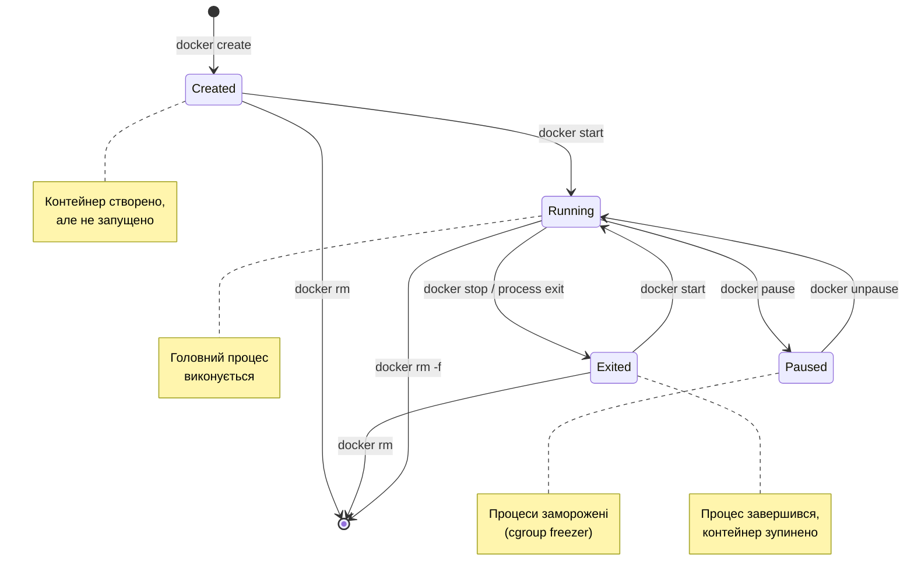

# Життєвий цикл контейнера

## Від запуску до завершення

У попередній статті ми навчилися запускати контейнери командою `docker run` та виконувати базові операції. Але щоб ефективно працювати з Docker, потрібно глибше розуміти, що відбувається з контейнером протягом його життя — від моменту створення до остаточного видалення.

Контейнер — це не статична сутність. Він проходить через різні стани, реагує на сигнали, виконує процеси, генерує логи та споживає ресурси. Розуміння цього життєвого циклу критично важливе для налагодження проблем, оптимізації продуктивності та забезпечення надійності застосунків у продакшені.

У цій статті ми детально розглянемо стани контейнера, дізнаємося про роль процесу PID 1, навчимося виконувати команди всередині працюючих контейнерів, інспектувати їхню конфігурацію, моніторити споживання ресурсів та керувати даними. Це знання перетворить вас з користувача Docker на того, хто справді розуміє, як працюють контейнери.

::note
Ця стаття передбачає, що ви вже знайомі з базовими командами `docker run`, `docker ps`, `docker stop` з попередньої статті. Тут ми заглибимося в деталі та розглянемо просунуті сценарії.

::

---

## Стани контейнера: повний життєвий цикл

Контейнер Docker може перебувати в одному з кількох станів. Розуміння цих станів та переходів між ними — ключ до ефективного управління контейнерами.

### Діаграма станів

::mermaid



::

### Created: створено, але не запущено

Стан **Created** виникає, коли ви використовуєте команду `docker create` замість `docker run`:

```bash
docker create --name my-nginx nginx
```

Що відбувається:
- Docker створює контейнер з усією конфігурацією (мережа, томи, змінні оточення)
- Виділяє ресурси (namespace, cgroup)
- Підготовлює файлову систему
- Але **не запускає** головний процес

Контейнер існує, але нічого не виконується. Це корисно, коли потрібно створити контейнер заздалегідь та запустити його пізніше:

```bash
# Створення контейнера
docker create --name web -p 8080:80 nginx

# Пізніше: запуск
docker start web
```

Перевірка стану:

```bash
docker ps -a --filter "status=created"
```

### Running: активне виконання

Стан **Running** означає, що головний процес контейнера (PID 1) виконується. Це робочий стан контейнера, коли він виконує свою функцію.

```bash
docker run -d --name web nginx
docker ps  # STATUS: Up X seconds/minutes
```

У цьому стані:
- Головний процес та всі дочірні процеси працюють
- Контейнер споживає CPU, пам'ять, мережу
- Генеруються логи
- Можна виконувати команди через `docker exec`

### Paused: призупинено

Стан **Paused** — це особливий стан, коли всі процеси контейнера "заморожені" на рівні ядра через cgroup freezer. Процеси не виконуються, але залишаються в пам'яті.

```bash
# Призупинити контейнер
docker pause web

# Перевірка стану
docker ps --filter "status=paused"

# Відновити виконання
docker unpause web
```

Це відрізняється від `docker stop`:
- **Pause**: процеси заморожені миттєво, без graceful shutdown
- **Stop**: процесу відправляється SIGTERM для graceful shutdown

Pause корисний для тимчасового звільнення CPU без втрати стану процесів у пам'яті.

::note
Стан Paused рідко використовується в повсякденній роботі. Він більше актуальний для оркестраторів (Kubernetes, Swarm) або сценаріїв live migration контейнерів між хостами.

::

### Exited: завершено

Стан **Exited** означає, що головний процес контейнера завершився (з будь-яким exit code). Контейнер зупинено, але не видалено.

Контейнер може потрапити в стан Exited кількома способами:

**Природне завершення процесу**:

```bash
docker run --name test alpine echo "Hello"
# Процес echo завершується одразу після виведення
docker ps -a  # STATUS: Exited (0) X seconds ago
```

**Команда docker stop**:

```bash
docker stop web
# Docker відправляє SIGTERM, чекає 10 секунд, потім SIGKILL
docker ps -a  # STATUS: Exited (0 або 137) X seconds ago
```

**Помилка в застосунку**:

```bash
docker run --name broken alpine sh -c "exit 1"
docker ps -a  # STATUS: Exited (1) X seconds ago
```

Exit code має значення:
- **0** — успішне завершення
- **1-127** — помилка в застосунку
- **137** — процес вбито через SIGKILL (128 + 9)
- **143** — процес завершено через SIGTERM (128 + 15)

Перегляд exit code:

```bash
docker inspect --format='{{.State.ExitCode}}' container_name
```

### Removed: видалено

Це не стан контейнера, а його відсутність. Після `docker rm` контейнер повністю видаляється з системи:

```bash
docker rm web
```

Видаляється:
- Метадані контейнера
- Writable layer файлової системи
- Мережеві налаштування
- Логи (якщо не налаштовано зовнішнє логування)

Але **не** видаляються:
- Образ, з якого створено контейнер
- Іменовані томи (volumes)
- Мережі (якщо вони використовуються іншими контейнерами)

---

## Процеси в контейнері: роль PID 1

Розуміння того, як працюють процеси всередині контейнера, критично важливе для налагодження та правильної архітектури застосунків.

### PID 1: головний процес

У кожному контейнері є один головний процес, який отримує PID 1 у namespace контейнера. Цей процес особливий з кількох причин:

**Життя контейнера прив'язане до PID 1**: Коли процес PID 1 завершується, контейнер автоматично зупиняється. Всі інші процеси в контейнері — це дочірні процеси PID 1.

**PID 1 отримує сигнали від Docker**: Коли ви виконуєте `docker stop`, Docker відправляє SIGTERM саме процесу PID 1. Якщо процес не завершується за 10 секунд (за замовчуванням), Docker відправляє SIGKILL.

**PID 1 відповідає за reaping zombie processes**: У Unix-системах батьківський процес повинен "збирати" (reap) завершені дочірні процеси. Якщо PID 1 не робить цього правильно, можуть накопичуватися zombie-процеси.

### Перегляд процесів у контейнері

Запустимо Nginx та подивимося на його процеси:

```bash
# Запуск Nginx
docker run -d --name web nginx

# Перегляд процесів з хоста
docker top web
```

Вивід:

```
UID       PID     PPID    C   STIME   TTY   TIME       CMD
root      12345   12320   0   08:30   ?     00:00:00   nginx: master process nginx -g daemon off;
101       12380   12345   0   08:30   ?     00:00:00   nginx: worker process
101       12381   12345   0   08:30   ?     00:00:00   nginx: worker process
```

Тут:
- **PID** — ID процесу на хості (не в контейнері!)
- **PPID** — ID батьківського процесу
- Master process Nginx — це PID 1 всередині контейнера
- Worker processes — дочірні процеси master process

Тепер подивимося зсередини контейнера:

```bash
docker exec web ps aux
```

Вивід:

```
USER       PID %CPU %MEM    VSZ   RSS TTY      STAT START   TIME COMMAND
root         1  0.0  0.1  10640  5432 ?        Ss   08:30   0:00 nginx: master process nginx -g daemon off;
nginx       29  0.0  0.0  11076  2344 ?        S    08:30   0:00 nginx: worker process
nginx       30  0.0  0.0  11076  2344 ?        S    08:30   0:00 nginx: worker process
```

Зверніть увагу: всередині контейнера master process має PID 1, тоді як на хості він має інший PID. Це демонструє ізоляцію PID namespace.

### Проблема shell wrapper

Розглянемо типову помилку при написанні Dockerfile:

```dockerfile
# ПОГАНО: shell form
CMD nginx -g "daemon off;"
```

Коли ви використовуєте shell form, Docker запускає команду через `/bin/sh -c`:

```
/bin/sh -c 'nginx -g "daemon off;"'
```

У цьому випадку PID 1 — це **shell** (`/bin/sh`), а не nginx. Це створює проблеми:

**Сигнали не доходять до nginx**: `docker stop` відправляє SIGTERM до shell, але shell може не передати його nginx. Результат — Docker чекає 10 секунд та відправляє SIGKILL, що призводить до некоректного завершення nginx.

**Zombie processes**: Якщо nginx створює дочірні процеси, shell може не збирати їх після завершення.

**Правильний спосіб** — використовувати exec form:

```dockerfile
# ДОБРЕ: exec form
CMD ["nginx", "-g", "daemon off;"]
```

Або явно використовувати `exec` у shell form:

```dockerfile
# ДОБРЕ: exec у shell form
CMD exec nginx -g "daemon off;"
```

Тепер nginx отримує PID 1 та коректно обробляє сигнали.

### Graceful shutdown: обробка сигналів

Коли ви виконуєте `docker stop`, відбувається наступне:

1. Docker відправляє **SIGTERM** (signal 15) процесу PID 1
2. Процес має час (за замовчуванням 10 секунд) для graceful shutdown:
   - Завершити поточні запити
   - Закрити з'єднання з базою даних
   - Зберегти стан
   - Очистити ресурси
3. Якщо процес не завершився за цей час, Docker відправляє **SIGKILL** (signal 9) — примусове завершення

Ви можете змінити таймаут:

```bash
# Дати 30 секунд на graceful shutdown
docker stop -t 30 web

# Або встановити при запуску
docker run -d --stop-timeout 30 --name web nginx
```

Перевіримо, як швидко контейнер зупиняється:

```bash
time docker stop web
```

Якщо вивід близько 0.2-0.5 секунд — процес коректно обробив SIGTERM. Якщо близько 10 секунд — процес не обробив сигнал, і Docker використав SIGKILL.

::tip
Для .NET застосунків переконайтеся, що ви обробляєте `CancellationToken` у `IHostApplicationLifetime.ApplicationStopping`. Це дозволить вашому застосунку коректно завершитися при `docker stop`.

::

---

## docker exec: виконання команд у працюючому контейнері

Одна з найпотужніших можливостей Docker — виконання команд всередині працюючого контейнера без перезапуску.

### Базовий синтаксис

```bash
docker exec [OPTIONS] CONTAINER COMMAND [ARG...]
```

### Виконання простих команд

```bash
# Перегляд змінних оточення
docker exec web env

# Перегляд процесів
docker exec web ps aux

# Перевірка версії Nginx
docker exec web nginx -v

# Перегляд файлів
docker exec web ls -la /etc/nginx/
```

### Інтерактивний shell

Найчастіше `docker exec` використовується для відкриття shell у контейнері:

```bash
docker exec -it web bash
```

Прапорці `-it` (interactive + TTY) дозволяють інтерактивно працювати з shell. Тепер ви всередині контейнера і можете:

```bash
# Перегляд конфігурації Nginx
cat /etc/nginx/nginx.conf

# Перевірка логів
tail -f /var/log/nginx/access.log

# Тестування мережі
curl localhost

# Встановлення утиліт для діагностики
apt update && apt install -y curl vim

# Вихід (контейнер продовжує працювати)
exit
```

::note
На відміну від `docker run -it`, де вихід з shell зупиняє контейнер (якщо shell — це PID 1), `docker exec` створює новий процес всередині існуючого контейнера. Вихід з exec-shell не впливає на головний процес контейнера.

::

### Виконання команд від іншого користувача

За замовчуванням `docker exec` виконує команди від того ж користувача, що й головний процес (зазвичай root). Можна змінити:

```bash
# Виконати від користувача nginx (UID 101)
docker exec -u nginx web whoami

# Виконати від конкретного UID
docker exec -u 1000:1000 web id
```

### Встановлення робочої директорії

```bash
# Виконати команду в конкретній директорії
docker exec -w /var/log/nginx web ls -la
```

### Практичні сценарії

**Діагностика проблем з мережею**:

```bash
# Встановлення інструментів
docker exec web apt update && apt install -y iputils-ping curl

# Перевірка з'єднання
docker exec web ping -c 3 google.com
docker exec web curl -I https://example.com
```

**Перегляд логів застосунку**:

```bash
# Якщо застосунок пише логи у файл
docker exec web tail -f /app/logs/application.log
```

**Виконання міграцій бази даних**:

```bash
# Для .NET застосунку з Entity Framework
docker exec web dotnet ef database update
```

**Backup бази даних**:

```bash
# PostgreSQL
docker exec postgres pg_dump -U postgres mydb > backup.sql

# MySQL
docker exec mysql mysqldump -u root -p mydb > backup.sql
```

::warning
Зміни, зроблені через `docker exec` (встановлення пакетів, редагування файлів), зберігаються лише в writable layer контейнера. Якщо ви видалите контейнер та створите новий з того ж образу, всі зміни зникнуть. Для постійних змін модифікуйте Dockerfile та пересоберіть образ.

::

---

## docker inspect: детальна інформація про контейнер

Команда `docker inspect` повертає повну конфігурацію та стан контейнера у форматі JSON. Це найпотужніший інструмент для діагностики.

### Базове використання

```bash
docker inspect web
```

Вивід — величезний JSON-об'єкт з сотнями полів. Розглянемо найважливіші секції:

### Стан контейнера

```bash
docker inspect --format='{{json .State}}' web | jq
```

Вивід:

```json
{
  "Status": "running",
  "Running": true,
  "Paused": false,
  "Restarting": false,
  "OOMKilled": false,
  "Dead": false,
  "Pid": 12345,
  "ExitCode": 0,
  "Error": "",
  "StartedAt": "2026-04-14T08:15:30.123456789Z",
  "FinishedAt": "0001-01-01T00:00:00Z"
}
```

Ключові поля:
- **Status** — поточний стан (running, exited, paused)
- **Pid** — PID головного процесу на хості
- **ExitCode** — код виходу (якщо контейнер зупинено)
- **OOMKilled** — чи був контейнер вбитий через нестачу пам'яті
- **StartedAt** — час запуску

### Мережева конфігурація

```bash
docker inspect --format='{{json .NetworkSettings}}' web | jq
```

Показує:
- IP-адресу контейнера
- Проброшені порти
- Підключені мережі
- MAC-адресу
- Gateway

Швидкий доступ до IP-адреси:

```bash
docker inspect --format='{{.NetworkSettings.IPAddress}}' web
```

### Монтування томів

```bash
docker inspect --format='{{json .Mounts}}' web | jq
```

Показує всі змонтовані томи та bind mounts:
- Тип монтування (volume, bind, tmpfs)
- Шлях на хості та в контейнері
- Режим (read-only, read-write)

### Змінні оточення

```bash
docker inspect --format='{{json .Config.Env}}' web | jq
```

Показує всі змінні оточення, передані контейнеру.

### Ліміти ресурсів

```bash
docker inspect --format='{{json .HostConfig}}' web | jq | grep -A 5 Memory
```

Показує налаштовані ліміти CPU, пам'яті, I/O.

### Практичні приклади фільтрації

```bash
# Отримати лише IP-адресу
docker inspect -f '{{.NetworkSettings.IPAddress}}' web

# Отримати проброшені порти
docker inspect -f '{{json .NetworkSettings.Ports}}' web

# Отримати exit code
docker inspect -f '{{.State.ExitCode}}' web

# Отримати час запуску
docker inspect -f '{{.State.StartedAt}}' web

# Перевірити, чи контейнер працює
docker inspect -f '{{.State.Running}}' web
```

::tip
Використовуйте `jq` для зручної роботи з JSON-виводом `docker inspect`. Це дозволяє фільтрувати, форматувати та аналізувати дані: `docker inspect web | jq '.State'`

::

---

## docker logs: перегляд виводу контейнера

Логи — це перше місце, куди потрібно дивитися при діагностиці проблем. Docker збирає STDOUT та STDERR головного процесу контейнера.

### Базовий перегляд логів

```bash
docker logs web
```

Показує весь вивід контейнера з моменту запуску.

### Корисні опції

**Останні N рядків**:

```bash
docker logs --tail 50 web
```

**Слідкування в реальному часі** (як `tail -f`):

```bash
docker logs -f web
```

**З часовими мітками**:

```bash
docker logs -t web
```

Вивід:

```
2026-04-14T08:15:30.123456789Z /docker-entrypoint.sh: Configuration complete
2026-04-14T08:15:30.234567890Z 2026/04/14 08:15:30 [notice] 1#1: start worker processes
```

**Логи за період**:

```bash
# За останню годину
docker logs --since 1h web

# З конкретного часу
docker logs --since 2026-04-14T08:00:00 web

# До конкретного часу
docker logs --until 2026-04-14T09:00:00 web
```

**Комбінація опцій**:

```bash
# Останні 100 рядків з часовими мітками, слідкування
docker logs -f -t --tail 100 web
```

### Де зберігаються логи?

За замовчуванням Docker зберігає логи у JSON-файлах:

```bash
# Шлях до логів (на Linux)
/var/lib/docker/containers/<container_id>/<container_id>-json.log
```

Можна переглянути безпосередньо:

```bash
sudo tail -f /var/lib/docker/containers/$(docker inspect -f '{{.Id}}' web)/$(docker inspect -f '{{.Id}}' web)-json.log
```

### Налаштування log driver

Docker підтримує різні log drivers для відправки логів у зовнішні системи:

```bash
# Використання syslog
docker run -d --log-driver syslog --name web nginx

# Використання json-file з ротацією
docker run -d \
  --log-driver json-file \
  --log-opt max-size=10m \
  --log-opt max-file=3 \
  --name web nginx
```

Доступні log drivers:
- `json-file` (за замовчуванням)
- `syslog`
- `journald`
- `gelf` (Graylog)
- `fluentd`
- `awslogs` (AWS CloudWatch)
- `none` (вимкнути логування)

::warning
Якщо ви використовуєте log driver, відмінний від `json-file` або `journald`, команда `docker logs` не працюватиме. Логи будуть доступні лише через відповідну систему логування.

::

---

## docker stats: моніторинг ресурсів

Команда `docker stats` показує споживання ресурсів контейнерами в реальному часі — аналог `top` для контейнерів.

### Базове використання

```bash
docker stats
```

Вивід (оновлюється кожну секунду):

```
CONTAINER ID   NAME   CPU %   MEM USAGE / LIMIT     MEM %   NET I/O           BLOCK I/O   PIDS
a3f5c8d9e2b1   web    0.05%   12.5MiB / 7.775GiB    0.16%   1.2kB / 648B      0B / 0B     3
```

Розберемо колонки:

**CPU %** — відсоток використання CPU. Якщо у вас 4 ядра, максимум може бути 400% (якщо контейнер використовує всі ядра).

**MEM USAGE / LIMIT** — поточне споживання пам'яті та ліміт (якщо встановлено). Якщо ліміт не встановлено, показується загальна пам'ять системи.

**MEM %** — відсоток від ліміту (або від загальної пам'яті системи).

**NET I/O** — мережевий трафік (отримано / відправлено) з моменту запуску контейнера.

**BLOCK I/O** — дисковий I/O (читання / запис).

**PIDS** — кількість процесів у контейнері.

### Моніторинг конкретних контейнерів

```bash
# Один контейнер
docker stats web

# Кілька контейнерів
docker stats web db redis

# Всі контейнери (включно зі зупиненими)
docker stats --all
```

### Без потокового оновлення

```bash
# Показати статистику один раз та вийти
docker stats --no-stream
```

Корисно для скриптів, які збирають метрики.

### Форматування виводу

```bash
# Кастомний формат
docker stats --format "table {{.Container}}\t{{.CPUPerc}}\t{{.MemUsage}}"
```

### Практичні сценарії

**Виявлення контейнерів з високим споживанням CPU**:

```bash
docker stats --no-stream --format "table {{.Name}}\t{{.CPUPerc}}" | sort -k2 -rn
```

**Моніторинг споживання пам'яті**:

```bash
docker stats --no-stream --format "table {{.Name}}\t{{.MemUsage}}\t{{.MemPerc}}"
```

**Експорт метрик у CSV**:

```bash
docker stats --no-stream --format "{{.Name}},{{.CPUPerc}},{{.MemUsage}},{{.NetIO}}" > stats.csv
```

::tip
Для продакшен-моніторингу використовуйте спеціалізовані інструменти (Prometheus + cAdvisor, Datadog, New Relic), які збирають метрики з Docker API та надають історичні дані, алерти та візуалізацію.

::

---

## docker cp: копіювання файлів

Іноді потрібно скопіювати файли між хостом та контейнером. Команда `docker cp` працює як `scp`, але для контейнерів.

### Копіювання з хоста в контейнер

```bash
# Копіювання файлу
docker cp /path/on/host/file.txt web:/path/in/container/

# Копіювання директорії
docker cp /path/on/host/mydir web:/path/in/container/
```

### Копіювання з контейнера на хост

```bash
# Копіювання файлу
docker cp web:/etc/nginx/nginx.conf ./nginx.conf

# Копіювання директорії
docker cp web:/var/log/nginx ./nginx-logs
```

### Практичні приклади

**Backup конфігурації**:

```bash
# Зберегти конфігурацію Nginx
docker cp web:/etc/nginx/nginx.conf ./backup/nginx.conf

# Зберегти всю директорію конфігурації
docker cp web:/etc/nginx ./backup/nginx-config
```

**Відновлення конфігурації**:

```bash
# Відновити конфігурацію
docker cp ./backup/nginx.conf web:/etc/nginx/nginx.conf

# Перезавантажити Nginx для застосування змін
docker exec web nginx -s reload
```

**Витягування логів**:

```bash
# Якщо застосунок пише логи у файл
docker cp web:/app/logs ./app-logs
```

**Розгортання коду (для розробки)**:

```bash
# Копіювання оновленого коду
docker cp ./src/updated-file.cs web:/app/src/

# Перезапуск застосунку
docker restart web
```

::note
`docker cp` працює навіть зі зупиненими контейнерами. Це корисно для витягування даних з контейнера, який не запускається через помилку.

::

### Обмеження docker cp

**Не зберігає права доступу**: Файли копіюються з правами за замовчуванням. Якщо потрібні конкретні права, встановіть їх після копіювання через `docker exec`.

**Не підходить для великих обсягів даних**: Для великих файлів або баз даних краще використовувати томи або bind mounts.

**Не замінює томи**: Для постійного зберігання даних використовуйте Docker volumes, а не `docker cp`.

---

## docker top: процеси контейнера

Команда `docker top` показує процеси, що виконуються в контейнері, з точки зору хоста.

### Базове використання

```bash
docker top web
```

Вивід:

```
UID       PID     PPID    C   STIME   TTY   TIME       CMD
root      12345   12320   0   08:30   ?     00:00:00   nginx: master process nginx -g daemon off;
101       12380   12345   0   08:30   ?     00:00:00   nginx: worker process
101       12381   12345   0   08:30   ?     00:00:00   nginx: worker process
```

### Кастомний формат (ps опції)

```bash
# Показати додаткову інформацію
docker top web aux

# Показати дерево процесів
docker top web -ef
```

### Порівняння з docker exec ps

```bash
# З точки зору хоста (реальні PID)
docker top web

# З точки зору контейнера (PID в namespace)
docker exec web ps aux
```

Різниця:
- `docker top` показує PID на хості (корисно для діагностики на рівні системи)
- `docker exec ps` показує PID всередині контейнера (корисно для розуміння структури застосунку)

---

## Обмеження ресурсів контейнера

Docker дозволяє обмежувати споживання ресурсів контейнерами через cgroups. Це критично важливо для продакшену, щоб один контейнер не міг "з'їсти" всю систему.

### Обмеження пам'яті

```bash
# Жорсткий ліміт: 512 МБ
docker run -d --memory="512m" --name limited nginx

# Ліміт + swap
docker run -d --memory="512m" --memory-swap="1g" --name limited nginx

# Без swap (memory-swap = memory)
docker run -d --memory="512m" --memory-swap="512m" --name limited nginx
```

Що відбувається при досягненні ліміту:
- Процеси в контейнері не можуть виділити більше пам'яті
- Ядро Linux активує OOM Killer (Out Of Memory Killer)
- OOM Killer вбиває процеси в контейнері (зазвичай найбільш "жадібний")
- Контейнер може зупинитися, якщо вбито PID 1

Перевірка, чи був контейнер вбитий через OOM:

```bash
docker inspect --format='{{.State.OOMKilled}}' limited
```

### Обмеження CPU

```bash
# Обмежити до 50% одного ядра
docker run -d --cpus="0.5" --name limited nginx

# Обмежити до 2 ядер
docker run -d --cpus="2.0" --name limited nginx

# Встановити пріоритет (CPU shares)
docker run -d --cpu-shares=512 --name low-priority nginx
docker run -d --cpu-shares=1024 --name high-priority nginx
```

**--cpus** — жорсткий ліміт. Контейнер не може використовувати більше вказаної кількості CPU.

**--cpu-shares** — відносний пріоритет. Якщо система не завантажена, контейнер може використовувати більше CPU. Коли система завантажена, CPU розподіляється пропорційно shares.

### Обмеження дискового I/O

```bash
# Обмежити швидкість читання (bytes per second)
docker run -d --device-read-bps /dev/sda:1mb --name limited nginx

# Обмежити швидкість запису
docker run -d --device-write-bps /dev/sda:1mb --name limited nginx

# Обмежити IOPS (operations per second)
docker run -d --device-read-iops /dev/sda:100 --name limited nginx
```

### Комбінація обмежень

```bash
docker run -d \
  --name production-app \
  --memory="2g" \
  --memory-swap="2g" \
  --cpus="1.5" \
  --restart=unless-stopped \
  myapp:latest
```

### Оновлення обмежень для працюючого контейнера

```bash
# Оновити ліміт пам'яті
docker update --memory="1g" web

# Оновити ліміт CPU
docker update --cpus="2.0" web

# Оновити кілька параметрів
docker update --memory="1g" --cpus="2.0" web
```

::tip
Для .NET застосунків налаштуйте garbage collector для роботи в обмеженому середовищі через змінні оточення: `DOTNET_GCHeapHardLimit` (абсолютний ліміт) або `DOTNET_GCHeapHardLimitPercent` (відсоток від ліміту контейнера).

::

---

## Резюме

У цій статті ми глибоко занурилися в життєвий цикл контейнера та інструменти для управління ним.

**Ключові концепції:**

- Контейнер проходить через стани: Created → Running → Paused → Exited → Removed
- Процес PID 1 визначає життя контейнера — коли він завершується, контейнер зупиняється
- Graceful shutdown через SIGTERM дозволяє застосунку коректно завершитися
- `docker exec` дозволяє виконувати команди в працюючому контейнері без перезапуску
- `docker inspect` надає повну інформацію про конфігурацію та стан контейнера
- `docker logs` збирає STDOUT/STDERR головного процесу
- `docker stats` показує споживання ресурсів у реальному часі
- `docker cp` дозволяє копіювати файли між хостом та контейнером
- Обмеження ресурсів (memory, CPU, I/O) критично важливі для продакшену

**Важливі команди:**

- `docker ps -a` — всі контейнери з їхніми станами
- `docker exec -it container bash` — інтерактивний shell
- `docker inspect container` — детальна інформація
- `docker logs -f container` — логи в реальному часі
- `docker stats` — моніторинг ресурсів
- `docker top container` — процеси контейнера
- `docker update --memory=1g container` — оновлення обмежень

Розуміння життєвого циклу контейнера та вміння діагностувати проблеми — це фундамент для ефективної роботи з Docker у продакшені.

У наступній статті ми перейдемо до Docker-образів — розглянемо, що це таке, як вони влаштовані, як працюють шари та чому образи є незмінними.

---

## Практичні завдання

### Завдання 1: Дослідження станів контейнера

Створіть контейнер та проведіть його через всі стани:

```bash
# 1. Створення без запуску
docker create --name lifecycle-test nginx

# 2. Перевірка стану
docker ps -a --filter "name=lifecycle-test"

# 3. Запуск
docker start lifecycle-test

# 4. Призупинення
docker pause lifecycle-test

# 5. Відновлення
docker unpause lifecycle-test

# 6. Зупинка
docker stop lifecycle-test

# 7. Перезапуск
docker start lifecycle-test

# 8. Видалення
docker stop lifecycle-test
docker rm lifecycle-test
```

**Питання:**
- Який стан показує `docker ps -a` на кожному кроці?
- Чи можна виконати `docker exec` на призупиненому контейнері?
- Що станеться, якщо спробувати `docker rm` на працюючому контейнері?

### Завдання 2: Експерименти з PID 1

Створіть два контейнери з різними підходами до PID 1:

```bash
# Shell wrapper (ПОГАНО)
docker run -d --name bad-pid alpine sh -c "sleep 3600"

# Exec form (ДОБРЕ)
docker run -d --name good-pid alpine sleep 3600

# Перевірка PID 1
docker exec bad-pid ps aux
docker exec good-pid ps aux

# Тест graceful shutdown
time docker stop bad-pid
time docker stop good-pid
```

**Питання:**
- Який процес має PID 1 в кожному контейнері?
- Скільки часу займає зупинка кожного контейнера?
- Чому є різниця?

### Завдання 3: Моніторинг та обмеження ресурсів

Запустіть контейнер з обмеженнями та навантажте його:

```bash
# Запуск з обмеженнями
docker run -d --name stress-test \
  --memory="256m" \
  --cpus="0.5" \
  alpine sleep 3600

# Моніторинг
docker stats stress-test

# Створення навантаження (в іншому терміналі)
docker exec stress-test sh -c "yes > /dev/null"

# Спостереження за CPU
docker stats --no-stream stress-test
```

**Питання:**
- Чи може контейнер перевищити ліміт CPU 50%?
- Що станеться, якщо спробувати виділити більше 256 МБ пам'яті?

### Завдання 4: Діагностика проблемного контейнера

Створіть контейнер, який падає, та продіагностуйте проблему:

```bash
# Контейнер, який падає
docker run -d --name broken alpine sh -c "echo Starting && sleep 5 && exit 1"

# Почекайте 6 секунд, потім діагностуйте
docker ps -a | grep broken
docker logs broken
docker inspect --format='{{.State.ExitCode}}' broken
docker inspect --format='{{.State.Error}}' broken
```

**Завдання:**
- Визначте exit code
- Знайдіть час запуску та завершення
- Витягніть логи для аналізу

::note
Ці завдання допоможуть вам освоїти діагностику та управління контейнерами — навички, які критично важливі для роботи з Docker у реальних проєктах.

::


