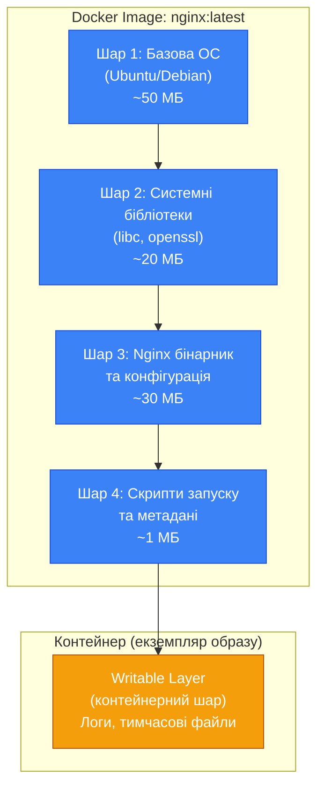
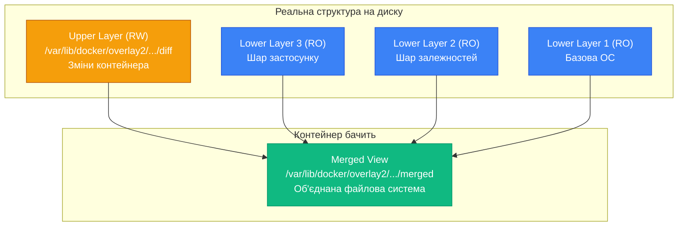
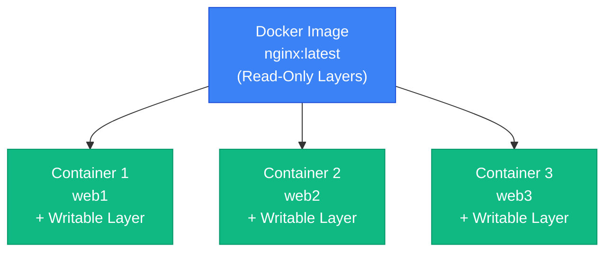

# Docker Images — фундаментальні концепції

## Від контейнерів до образів

У попередніх статтях ми активно працювали з контейнерами — запускали їх, керували життєвим циклом, діагностували проблеми. Але кожен раз, коли ми виконували `docker run nginx` або `docker run ubuntu`, ми використовували щось, що називається **Docker image** (образ). Настав час детально розібратися, що це таке і як воно влаштоване.

Образ — це не просто архів з файлами. Це складна багатошарова структура, яка є фундаментом всієї екосистеми Docker. Розуміння того, як працюють образи, як вони зберігаються, чому вони незмінні та як Docker досягає такої ефективності використання дискового простору — це ключ до створення оптимальних, безпечних та швидких контейнерних застосунків.

У цій статті ми заглибимося в архітектуру Docker-образів, розглянемо концепцію шарів (layers), дізнаємося про Union File System та механізм copy-on-write, зрозуміємо різницю між образом та контейнером на технічному рівні, та навчимося ефективно управляти образами через Docker CLI.

::note
Ця стаття фокусується на **використанні** готових образів та розумінні їхньої внутрішньої структури. Створення власних образів через Dockerfile буде детально розглянуто в наступних статтях.

::

---

## Що таке Docker Image?

### Визначення та аналогія

Docker image (образ) — це **незмінний (immutable) шаблон**, який містить все необхідне для запуску застосунку: операційну систему, бібліотеки, залежності, конфігураційні файли та сам код застосунку. Образ — це "креслення" або "рецепт", за яким Docker створює контейнери.

Аналогія з об'єктно-орієнтованим програмуванням:

- **Образ** — це **клас** у C#. Він визначає структуру та поведінку, але сам по собі не виконується.
- **Контейнер** — це **екземпляр класу** (об'єкт). Ви можете створити багато контейнерів з одного образу, так само як багато об'єктів з одного класу.

```csharp
// Аналогія в C#
public class WebServer  // Це як Docker Image
{
    public string Name { get; set; }
    public void Start() { /* ... */ }
}

// Створення екземплярів (контейнерів)
var server1 = new WebServer { Name = "web1" };  // Контейнер 1
var server2 = new WebServer { Name = "web2" };  // Контейнер 2
var server3 = new WebServer { Name = "web3" };  // Контейнер 3
```

Кожен контейнер — це незалежний екземпляр з власним станом, але всі вони базуються на одному "класі" (образі).

### Ключові характеристики образів

**Незмінність (Immutability)**: Після створення образ не можна змінити. Якщо потрібні зміни, створюється новий образ. Це гарантує, що образ, який працював у вас локально, працюватиме ідентично на продакшені.

**Багатошаровість (Layered Architecture)**: Образ складається з кількох шарів, які накладаються один на одного. Кожен шар представляє зміни файлової системи (додавання, модифікація або видалення файлів).

**Перевикористання (Reusability)**: Шари можуть перевикористовуватися між різними образами. Якщо 10 образів базуються на Ubuntu, базовий шар Ubuntu зберігається на диску лише один раз.

**Портативність (Portability)**: Образ містить все необхідне для запуску застосунку, тому він працює однаково на будь-якій системі з Docker.

**Content Addressability**: Кожен шар ідентифікується унікальним SHA256 хешем його вмісту. Це гарантує цілісність та дозволяє виявити підміну.

---

## Архітектура шарів: як влаштовані образи

Найважливіша концепція Docker-образів — це **шари** (layers). Розуміння шарів критично важливе для оптимізації розміру образів, швидкості збірки та ефективного використання дискового простору.

### Що таке шар?

Шар (layer) — це набір змін файлової системи. Кожна інструкція в Dockerfile (про який ми поговоримо детально в наступних статтях) створює новий шар:

- `FROM ubuntu:22.04` — базовий шар з файловою системою Ubuntu
- `RUN apt-get update && apt-get install -y nginx` — шар з встановленим Nginx
- `COPY index.html /var/www/html/` — шар з вашим HTML-файлом

Кожен шар містить лише **різницю** (delta) відносно попереднього шару. Це робить образи компактними та ефективними.

### Візуалізація шарів

Розглянемо образ Nginx:

::mermaid



::

Ключові моменти:

- Шари образу (L1-L4) є **read-only** (лише для читання) — їх не можна змінити
- Коли створюється контейнер, Docker додає **writable layer** (шар для запису) поверх образу
- Всі зміни в контейнері (створення файлів, модифікація конфігурації) відбуваються у writable layer
- Якщо контейнер видаляється, writable layer теж видаляється, але шари образу залишаються

### Перегляд шарів образу

Завантажимо образ та подивимося на його шари:

```bash
# Завантаження образу
docker pull nginx:latest
```

Вивід показує процес завантаження кожного шару:

```
latest: Pulling from library/nginx
a2abf6c4d29d: Pull complete
a9edb18cadd1: Pull complete
589b7251471a: Pull complete
186b1aaa4aa6: Pull complete
b4df32aa5a72: Pull complete
a0bcbecc962e: Pull complete
Digest: sha256:0d17b565c37bcbd895e9d92315a05c1c3c9a29f762b011a10c54a66cd53c9b31
Status: Downloaded newer image for nginx:latest
```

Кожен рядок з `Pull complete` — це окремий шар. Тепер подивимося детальніше:

```bash
# Інспекція шарів образу
docker image inspect nginx:latest --format='{{json .RootFS.Layers}}' | jq
```

Вивід:

```json
[
  "sha256:a2abf6c4d29d43a4bf9e6c8f5f3e8f9c8d7e6f5a4b3c2d1e0f9a8b7c6d5e4f3a",
  "sha256:a9edb18cadd1f2e3d4c5b6a7f8e9d0c1b2a3f4e5d6c7b8a9f0e1d2c3b4a5f6e",
  "sha256:589b7251471a3e4f5d6c7b8a9f0e1d2c3b4a5f6e7d8c9b0a1f2e3d4c5b6a7f8",
  "sha256:186b1aaa4aa6f7e8d9c0b1a2f3e4d5c6b7a8f9e0d1c2b3a4f5e6d7c8b9a0f1e",
  "sha256:b4df32aa5a72e9f0d1c2b3a4f5e6d7c8b9a0f1e2d3c4b5a6f7e8d9c0b1a2f3e",
  "sha256:a0bcbecc962e1f2e3d4c5b6a7f8e9d0c1b2a3f4e5d6c7b8a9f0e1d2c3b4a5f6"
]
```

Кожен SHA256 хеш — це унікальний ідентифікатор шару. Якщо два образи мають однаковий шар (однаковий хеш), Docker зберігає його на диску лише один раз.

### Історія образу: що в кожному шарі?

```bash
docker image history nginx:latest
```

Вивід:

```
IMAGE          CREATED       CREATED BY                                      SIZE      COMMENT
605c77e624dd   2 weeks ago   CMD ["nginx" "-g" "daemon off;"]                0B        
<missing>      2 weeks ago   STOPSIGNAL SIGQUIT                              0B        
<missing>      2 weeks ago   EXPOSE map[80/tcp:{}]                           0B        
<missing>      2 weeks ago   ENTRYPOINT ["/docker-entrypoint.sh"]            0B        
<missing>      2 weeks ago   COPY 30-tune-worker-processes.sh /docker-ent…   4.62kB    
<missing>      2 weeks ago   COPY 20-envsubst-on-templates.sh /docker-ent…   3.02kB    
<missing>      2 weeks ago   COPY 15-local-resolvers.envsh /docker-entryp…   336B      
<missing>      2 weeks ago   COPY 10-listen-on-ipv6-by-default.sh /docker…   2.12kB    
<missing>      2 weeks ago   RUN /bin/sh -c set -x     && groupadd --syst…   112MB     
<missing>      2 weeks ago   ENV PKG_RELEASE=1~bookworm                      0B        
<missing>      2 weeks ago   ENV NJS_VERSION=0.8.4                           0B        
<missing>      2 weeks ago   ENV NGINX_VERSION=1.25.5                        0B        
<missing>      2 weeks ago   LABEL maintainer=NGINX Docker Maintainers <d…   0B        
<missing>      2 weeks ago   /bin/sh -c #(nop)  CMD ["/bin/bash"]            0B        
<missing>      2 weeks ago   /bin/sh -c #(nop) ADD file:d261a6f6921e7dd2c…   74.8MB
```

Розберемо вивід:

- **IMAGE** — ID шару (або `<missing>` для проміжних шарів)
- **CREATED BY** — команда, яка створила цей шар
- **SIZE** — розмір шару (0B для метаданих, які не додають файлів)

Зверніть увагу:
- Базовий шар Debian (`ADD file:...`) — 74.8 МБ
- Встановлення Nginx (`RUN /bin/sh -c set -x...`) — 112 МБ
- Копіювання скриптів (`COPY`) — кілька кілобайт
- Метадані (`CMD`, `EXPOSE`, `ENV`) — 0 байт (не створюють файлів)

### Перевикористання шарів

Найпотужніша особливість шарової архітектури — перевикористання. Розглянемо приклад:

```bash
# Завантажимо кілька образів на базі Debian
docker pull nginx:latest
docker pull postgres:15
docker pull node:20
```

Всі три образи базуються на Debian. Docker завантажить базовий шар Debian лише один раз та перевикористає його для всіх трьох образів. Це економить:

- **Дисковий простір**: замість 3 × 75 МБ = 225 МБ, зберігається лише 75 МБ
- **Час завантаження**: базовий шар завантажується один раз
- **Мережевий трафік**: не потрібно завантажувати однакові дані кілька разів

Перевіримо:

```bash
docker system df -v
```

Ця команда показує, скільки місця займають образи, контейнери та томи, включно з інформацією про перевикористання шарів.

---

## Union File System: магія об'єднання шарів

Тепер виникає питання: якщо образ складається з кількох read-only шарів, як Docker створює єдину файлову систему, яку бачить контейнер? Відповідь — **Union File System**.

### Що таке Union FS?

Union File System (UnionFS) — це технологія, яка дозволяє об'єднати кілька директорій (шарів) в одну віртуальну файлову систему. Для процесів у контейнері це виглядає як звичайна файлова система, але насправді це "стек" з кількох шарів.

Docker підтримує кілька реалізацій Union FS:

- **OverlayFS** (overlay2) — сучасний, швидкий, рекомендований (за замовчуванням на Linux)
- **AUFS** — старіша реалізація, використовувалася раніше
- **Btrfs**, **ZFS** — файлові системи з вбудованою підтримкою snapshots
- **Device Mapper** — використовується на старих системах

Перевіримо, який storage driver використовується:

```bash
docker info | grep "Storage Driver"
```

Вивід (зазвичай):

```
Storage Driver: overlay2
```

### Як працює OverlayFS

OverlayFS об'єднує шари у два рівні:

**Lower layers** (нижні шари) — read-only шари образу. Їх може бути багато, вони накладаються один на одного.

**Upper layer** (верхній шар) — writable layer контейнера. Всі зміни записуються сюди.

**Merged view** (об'єднане уявлення) — те, що бачить контейнер. Це віртуальна файлова система, яка об'єднує всі шари.

::mermaid



::

### Copy-on-Write (CoW): механізм модифікації

Оскільки шари образу є read-only, як контейнер може модифікувати файли? Через механізм **Copy-on-Write**:

1. **Читання файлу**: Якщо файл існує в нижніх шарах, контейнер читає його безпосередньо. Швидко та ефективно.

2. **Модифікація файлу**: Якщо контейнер намагається змінити файл з нижнього шару:
   - Docker **копіює** файл у верхній (writable) шар
   - Модифікація застосовується до копії
   - Оригінал у нижньому шарі залишається недоторканим

3. **Видалення файлу**: Якщо контейнер видаляє файл з нижнього шару:
   - Docker створює спеціальний "whiteout" файл у верхньому шарі
   - Цей файл "приховує" файл з нижнього шару
   - Оригінал залишається на диску, але контейнер його не бачить

Приклад:

```bash
# Запуск Ubuntu контейнера
docker run -it --name cow-test ubuntu bash

# Всередині контейнера: модифікація файлу з базового образу
echo "Modified" >> /etc/hosts

# Перегляд розміру writable layer
docker ps -s
```

Вивід:

```
CONTAINER ID   IMAGE     SIZE
abc123def456   ubuntu    12B (virtual 77.8MB)
```

- **SIZE** — розмір writable layer (12 байт — наш доданий текст)
- **virtual** — загальний розмір (образ + writable layer)

Файл `/etc/hosts` з базового образу залишився недоторканим. Модифікована версія існує лише у writable layer цього контейнера.

### Переваги Copy-on-Write

**Ефективність дискового простору**: Якщо 100 контейнерів базуються на одному образі (1 ГБ), на диску зберігається 1 ГБ + невеликі writable layers, а не 100 ГБ.

**Швидкість створення контейнерів**: Не потрібно копіювати гігабайти даних — достатньо створити порожній writable layer. Контейнер запускається за мілісекунди.

**Ізоляція**: Зміни в одному контейнері не впливають на інші контейнери або базовий образ.

**Безпека**: Базовий образ залишається незмінним, що гарантує його цілісність.

### Недоліки Copy-on-Write

**Продуктивність при модифікації великих файлів**: Якщо контейнер модифікує великий файл (наприклад, базу даних 10 ГБ), Docker спочатку копіює весь файл у writable layer. Це повільно та споживає багато місця.

**Рішення**: Використовуйте Docker volumes для даних, які часто змінюються (бази даних, логи). Volumes обходять Union FS та працюють безпосередньо з файловою системою хоста.

---

## Образ vs Контейнер: технічна різниця

Тепер, коли ми розуміємо архітектуру шарів, можемо чітко визначити різницю між образом та контейнером на технічному рівні.

### Образ (Image)

- **Незмінний набір read-only шарів**
- Зберігається в `/var/lib/docker/` (на Linux)
- Може використовуватися багатьма контейнерами одночасно
- Ідентифікується за назвою:тегом (`nginx:latest`) або digest (SHA256 хеш)
- Не має стану — це лише "креслення"

### Контейнер (Container)

- **Образ + writable layer + runtime конфігурація + стан виконання**
- Має власний writable layer для змін файлової системи
- Має власні namespaces (PID, NET, MNT, UTS, IPC, USER)
- Має власні cgroups для обмеження ресурсів
- Має стан (running, exited, paused)
- Має унікальний ID та ім'я

Аналогія:

```
Образ = Клас у C#
Контейнер = Екземпляр класу (об'єкт)

Образ = Інсталяційний ISO Windows
Контейнер = Встановлена Windows на конкретному комп'ютері

Образ = Рецепт страви
Контейнер = Приготована страва на тарілці
```

### Візуалізація відносин

::mermaid



::

Один образ → багато контейнерів. Кожен контейнер має власний writable layer, але всі вони спільно використовують read-only шари образу.

---

## Робота з образами через CLI

Тепер, коли ми розуміємо внутрішню структуру образів, розглянемо команди для управління ними.

### docker images: перегляд локальних образів

```bash
docker images
```

Вивід:

```
REPOSITORY          TAG       IMAGE ID       CREATED        SIZE
nginx               latest    605c77e624dd   2 weeks ago    187MB
ubuntu              22.04     3b418d7b466a   3 weeks ago    77.8MB
postgres            15        9f3ec01f884d   1 month ago    412MB
mcr.microsoft.com/dotnet/sdk   8.0       a1b2c3d4e5f6   2 weeks ago    743MB
```

Розберемо колонки:

**REPOSITORY** — назва образу (може включати registry: `mcr.microsoft.com/dotnet/sdk`)

**TAG** — версія або варіант образу (`latest`, `8.0`, `22.04`)

**IMAGE ID** — унікальний ідентифікатор образу (перші 12 символів SHA256 хешу)

**CREATED** — коли образ було створено (не завантажено!)

**SIZE** — розмір образу на диску (сума всіх шарів)

### Фільтрація та форматування

```bash
# Показати лише IMAGE ID
docker images -q

# Фільтрувати за назвою
docker images nginx

# Фільтрувати за тегом
docker images --filter "reference=*:latest"

# Показати всі образи (включно з проміжними)
docker images -a

# Кастомний формат
docker images --format "table {{.Repository}}\t{{.Tag}}\t{{.Size}}"
```

### docker pull: завантаження образів

```bash
# Завантажити образ з Docker Hub
docker pull nginx

# Завантажити конкретний тег
docker pull nginx:1.25

# Завантажити з іншого registry
docker pull mcr.microsoft.com/dotnet/sdk:8.0

# Завантажити за digest (гарантована версія)
docker pull nginx@sha256:0d17b565c37bcbd895e9d92315a05c1c3c9a29f762b011a10c54a66cd53c9b31
```

Що відбувається при `docker pull`:

1. Docker звертається до registry (за замовчуванням Docker Hub)
2. Завантажує manifest образу (список шарів)
3. Перевіряє, які шари вже є локально
4. Завантажує лише відсутні шари
5. Зберігає шари в `/var/lib/docker/`
6. Створює посилання на образ за назвою:тегом

### docker rmi: видалення образів

```bash
# Видалити образ за назвою:тегом
docker rmi nginx:latest

# Видалити образ за ID
docker rmi 605c77e624dd

# Видалити кілька образів
docker rmi nginx ubuntu postgres

# Примусове видалення (навіть якщо є контейнери)
docker rmi -f nginx
```

::warning
Docker не дозволить видалити образ, якщо з нього створені контейнери (навіть зупинені). Спочатку видаліть контейнери: `docker rm $(docker ps -aq --filter ancestor=nginx)`, потім видаліть образ.

::

### docker image prune: очищення непотрібних образів

```bash
# Видалити "висячі" образи (dangling images)
docker image prune

# Видалити всі невикористані образи
docker image prune -a

# Без підтвердження
docker image prune -a -f
```

**Dangling images** — це образи без тегу, які залишаються після пересборки. Вони показуються як `<none>:<none>` у `docker images`.

### Теги та версіонування

Образ може мати кілька тегів, які вказують на один і той самий IMAGE ID:

```bash
# Створення нового тегу для існуючого образу
docker tag nginx:latest myregistry.com/nginx:v1.0

# Перегляд
docker images | grep nginx
```

Вивід:

```
nginx                          latest    605c77e624dd   2 weeks ago   187MB
myregistry.com/nginx           v1.0      605c77e624dd   2 weeks ago   187MB
```

Обидва теги вказують на один IMAGE ID (`605c77e624dd`), тому на диску зберігається лише одна копія.

### Digest: незмінний ідентифікатор

Теги можуть змінюватися — `nginx:latest` сьогодні може вказувати на одну версію, а завтра на іншу. Для гарантованої версії використовуйте **digest**:

```bash
# Отримати digest образу
docker images --digests nginx
```

Вивід:

```
REPOSITORY   TAG      DIGEST                                                                    IMAGE ID       CREATED       SIZE
nginx        latest   sha256:0d17b565c37bcbd895e9d92315a05c1c3c9a29f762b011a10c54a66cd53c9b31   605c77e624dd   2 weeks ago   187MB
```

Тепер можна завантажити саме цю версію:

```bash
docker pull nginx@sha256:0d17b565c37bcbd895e9d92315a05c1c3c9a29f762b011a10c54a66cd53c9b31
```

Це гарантує, що ви отримаєте точно той самий образ, навіть якщо тег `latest` змінився.

::tip
У продакшені завжди використовуйте конкретні теги (`nginx:1.25.5`) або digest, а не `latest`. Це гарантує відтворюваність та запобігає несподіваним оновленням.

::

---

## Іменування образів: повна анатомія

Повна назва Docker-образу має структуру:

```
[REGISTRY/][NAMESPACE/]REPOSITORY[:TAG|@DIGEST]
```

Розберемо кожну частину:

### REGISTRY (опціонально)

Адреса registry, де зберігається образ. Якщо не вказано, використовується `docker.io` (Docker Hub).

Приклади:
- `docker.io` — Docker Hub (за замовчуванням)
- `mcr.microsoft.com` — Microsoft Container Registry
- `gcr.io` — Google Container Registry
- `ghcr.io` — GitHub Container Registry
- `mycompany.azurecr.io` — приватний Azure Container Registry

### NAMESPACE (опціонально)

Організація або користувач, який володіє образом.

На Docker Hub:
- `library/` — офіційні образи (можна опустити: `nginx` = `library/nginx`)
- `username/` — образи користувачів (наприклад, `myuser/myapp`)

### REPOSITORY (обов'язково)

Назва образу. Зазвичай це назва застосунку або сервісу.

Приклади: `nginx`, `postgres`, `ubuntu`, `myapp`

### TAG (опціонально)

Версія або варіант образу. Якщо не вказано, використовується `latest`.

Приклади:
- `latest` — остання версія (за замовчуванням)
- `1.25.5` — конкретна версія
- `1.25-alpine` — варіант на базі Alpine Linux
- `8.0-bookworm-slim` — .NET 8.0 на Debian Bookworm (slim варіант)

### DIGEST (альтернатива TAG)

SHA256 хеш образу для гарантованої версії.

Формат: `@sha256:abc123...`

### Приклади повних назв

```bash
# Мінімальна форма (Docker Hub, офіційний образ, latest)
nginx
# Розгорнуто: docker.io/library/nginx:latest

# З тегом
nginx:1.25.5
# Розгорнуто: docker.io/library/nginx:1.25.5

# З namespace (користувацький образ)
myuser/myapp:v1.0
# Розгорнуто: docker.io/myuser/myapp:v1.0

# З registry
mcr.microsoft.com/dotnet/sdk:8.0
# Повна форма

# З digest
nginx@sha256:0d17b565c37bcbd895e9d92315a05c1c3c9a29f762b011a10c54a66cd53c9b31
# Гарантована версія

# Приватний registry
mycompany.azurecr.io/backend/api:2024.04.14
# Повна форма з приватного registry
```

---

## Незмінність образів: чому це важливо

Одна з найважливіших характеристик Docker-образів — їхня **незмінність** (immutability). Після створення образ не можна змінити. Це не обмеження, а фундаментальна особливість, яка забезпечує надійність та передбачуваність.

### Що означає незмінність?

Коли ви завантажуєте образ `nginx:1.25.5`, ви отримуєте точно той самий набір файлів, що й будь-хто інший у світі, хто завантажує цей образ. Незалежно від того, коли та де ви його завантажуєте.

Якщо розробники Nginx хочуть випустити оновлення, вони не можуть змінити існуючий образ `nginx:1.25.5`. Замість цього вони створюють новий образ з новим тегом (`nginx:1.25.6`) або оновлюють тег `latest`, щоб він вказував на новий образ.

### Переваги незмінності

**Відтворюваність (Reproducibility)**: Образ, який працював у вас локально місяць тому, працюватиме ідентично сьогодні. Це вирішує класичну проблему "it worked yesterday".

**Надійність розгортання**: Якщо образ пройшов тестування в staging-середовищі, ви можете бути впевнені, що той самий образ працюватиме в production.

**Відкат (Rollback)**: Якщо нова версія застосунку має баги, можна миттєво повернутися до попередньої версії, просто запустивши контейнери зі старого образу.

**Аудит та безпека**: Кожен образ має унікальний digest (SHA256 хеш). Можна перевірити, що образ не був підмінений або модифікований.

**Паралельні версії**: Можна одночасно запускати кілька версій застосунку (A/B тестування, canary deployments), оскільки кожна версія — це окремий незмінний образ.

### Як оновлювати застосунки?

Якщо образи незмінні, як оновлювати застосунки? Через створення нових образів:

1. **Розробка**: Вносите зміни в код
2. **Збірка**: Створюєте новий образ з новим тегом (`myapp:v1.1`)
3. **Тестування**: Тестуєте новий образ
4. **Розгортання**: Зупиняєте старі контейнери (`myapp:v1.0`) та запускаєте нові (`myapp:v1.1`)
5. **Відкат (якщо потрібно)**: Повертаєтеся до `myapp:v1.0`

Старий образ залишається на диску та може бути використаний у будь-який момент.

### Теги можуть змінюватися

Важливо розуміти: **теги** не є незмінними, незмінні лише **образи** (ідентифіковані за digest).

Тег `nginx:latest` сьогодні може вказувати на образ з digest `sha256:abc123...`, а завтра — на інший образ з digest `sha256:def456...`. Тег — це лише "покажчик" на образ, і цей покажчик може змінюватися.

Саме тому в продакшені рекомендується використовувати:
- Конкретні версії: `nginx:1.25.5` (краще, але тег все ще може бути перезаписаний)
- Digest: `nginx@sha256:abc123...` (найнадійніше, гарантує незмінність)

::caution
Ніколи не використовуйте тег `latest` у продакшені. Він може змінитися в будь-який момент, що призведе до несподіваних оновлень та потенційних проблем. Завжди вказуйте конкретну версію.

::

---

## Розмір образів: чому це важливо

Розмір образу впливає на:

**Час завантаження**: Чим більший образ, тим довше він завантажується з registry. У CI/CD це може додавати хвилини до кожного деплою.

**Використання дискового простору**: На сервері з десятками контейнерів великі образи швидко заповнюють диск.

**Час запуску контейнера**: Хоча Docker використовує шари та CoW, великі образи все одно повільніше розпаковуються та монтуються.

**Безпека**: Більший образ = більше коду = більше потенційних вразливостей. Мінімалістичні образи мають меншу "поверхню атаки".

**Мережевий трафік**: У хмарних середовищах трафік між регіонами коштує грошей. Менші образи = менші витрати.

### Порівняння розмірів базових образів

Розглянемо розміри популярних базових образів:

```bash
docker images --format "table {{.Repository}}\t{{.Tag}}\t{{.Size}}" | grep -E "ubuntu|debian|alpine"
```

| Образ | Розмір | Опис |
| :--- | :--- | :--- |
| `alpine:latest` | ~7 МБ | Мінімалістичний Linux на базі musl libc |
| `debian:bookworm-slim` | ~74 МБ | Debian без документації та рекомендованих пакетів |
| `debian:bookworm` | ~117 МБ | Повний Debian |
| `ubuntu:22.04` | ~78 МБ | Ubuntu LTS |
| `ubuntu:latest` | ~78 МБ | Остання Ubuntu |

Для .NET застосунків:

| Образ | Розмір | Призначення |
| :--- | :--- | :--- |
| `mcr.microsoft.com/dotnet/sdk:8.0` | ~743 МБ | Повний SDK для розробки та збірки |
| `mcr.microsoft.com/dotnet/aspnet:8.0` | ~216 МБ | Runtime для ASP.NET Core |
| `mcr.microsoft.com/dotnet/runtime:8.0` | ~193 МБ | Runtime для консольних застосунків |
| `mcr.microsoft.com/dotnet/aspnet:8.0-alpine` | ~109 МБ | ASP.NET Runtime на Alpine |
| `mcr.microsoft.com/dotnet/runtime-deps:8.0` | ~112 МБ | Лише системні залежності (для self-contained) |

### Стратегії оптимізації розміру

**Multi-stage builds**: Використовуйте великий образ для збірки (SDK), а маленький для запуску (runtime). Детально розглянемо в наступних статтях.

**Alpine-based образи**: Використовуйте Alpine замість Debian/Ubuntu, якщо можливо. Але будьте обережні з сумісністю (musl libc vs glibc).

**Мінімізація шарів**: Об'єднуйте команди `RUN` для зменшення кількості шарів.

**Очищення кешів**: Видаляйте кеші пакетних менеджерів у тому ж шарі, де вони створюються.

**Distroless образи**: Google Distroless — образи без shell, пакетного менеджера, навіть без базової ОС. Лише runtime та ваш застосунок.

Детальніше про оптимізацію розміру образів ми поговоримо в окремій статті.

---

## Інспекція образів: глибока діагностика

Команда `docker image inspect` надає повну інформацію про образ у форматі JSON.

### Базове використання

```bash
docker image inspect nginx:latest
```

Вивід — величезний JSON з сотнями полів. Розглянемо найважливіші секції:

### Метадані образу

```bash
docker image inspect nginx:latest --format='{{json .}}' | jq '.Id, .Created, .Size'
```

Вивід:

```json
"sha256:605c77e624ddb75e6110f997c58876baa13f8754486b461117934b24a9dc3a85"
"2026-03-28T12:34:56.789Z"
187654321
```

- **Id** — повний SHA256 хеш образу
- **Created** — дата створення образу
- **Size** — розмір у байтах

### Конфігурація контейнера

```bash
docker image inspect nginx:latest --format='{{json .Config}}' | jq
```

Показує:
- **Cmd** — команда за замовчуванням
- **Entrypoint** — точка входу
- **Env** — змінні оточення за замовчуванням
- **ExposedPorts** — порти, які декларує образ
- **WorkingDir** — робоча директорія
- **User** — користувач за замовчуванням

### Шари образу

```bash
docker image inspect nginx:latest --format='{{json .RootFS.Layers}}' | jq
```

Показує список SHA256 хешів всіх шарів образу.

### Історія образу

```bash
docker image inspect nginx:latest --format='{{json .History}}' | jq
```

Показує всі команди, які створили шари образу (аналогічно `docker history`, але в JSON).

### Практичні приклади

**Отримати команду запуску**:

```bash
docker image inspect nginx:latest --format='{{.Config.Cmd}}'
```

**Отримати змінні оточення**:

```bash
docker image inspect nginx:latest --format='{{range .Config.Env}}{{println .}}{{end}}'
```

**Отримати exposed ports**:

```bash
docker image inspect nginx:latest --format='{{json .Config.ExposedPorts}}' | jq
```

**Перевірити, чи образ має певний label**:

```bash
docker image inspect nginx:latest --format='{{index .Config.Labels "maintainer"}}'
```

---

## Резюме

У цій статті ми глибоко занурилися в архітектуру та роботу Docker-образів — фундаменту всієї екосистеми Docker.

**Ключові концепції:**

- Образ — це незмінний шаблон, який містить все необхідне для запуску застосунку
- Образи складаються з шарів (layers), які накладаються один на одного
- Union File System (OverlayFS) об'єднує read-only шари образу та writable layer контейнера
- Copy-on-Write дозволяє ефективно модифікувати файли без дублювання даних
- Шари перевикористовуються між образами, економлячи дисковий простір
- Образи незмінні — зміни вимагають створення нового образу
- Теги можуть змінюватися, digest (SHA256) гарантує незмінність
- Розмір образу впливає на швидкість, безпеку та вартість

**Важливі команди:**

- `docker images` — перегляд локальних образів
- `docker pull` — завантаження образів з registry
- `docker rmi` — видалення образів
- `docker image prune` — очищення непотрібних образів
- `docker image inspect` — детальна інформація про образ
- `docker image history` — історія створення шарів
- `docker tag` — створення нових тегів

**Різниця між образом та контейнером:**

- Образ = read-only шари + метадані
- Контейнер = образ + writable layer + runtime стан

Розуміння архітектури образів критично важливе для створення ефективних, безпечних та швидких контейнерних застосунків. У наступних статтях ми навчимося створювати власні образи через Dockerfile та оптимізувати їх для продакшену.

---

## Практичні завдання

### Завдання 1: Дослідження шарів

Завантажте кілька образів та дослідіть їхні шари:

```bash
# Завантаження образів
docker pull nginx:latest
docker pull nginx:alpine
docker pull ubuntu:22.04

# Перегляд історії
docker image history nginx:latest
docker image history nginx:alpine

# Порівняння розмірів
docker images | grep -E "nginx|ubuntu"

# Інспекція шарів
docker image inspect nginx:latest --format='{{json .RootFS.Layers}}' | jq
docker image inspect nginx:alpine --format='{{json .RootFS.Layers}}' | jq
```

**Питання:**
- Скільки шарів має кожен образ?
- Яка різниця в розмірі між `nginx:latest` та `nginx:alpine`?
- Чи є спільні шари між різними образами?

### Завдання 2: Експеримент з Copy-on-Write

Створіть контейнер та модифікуйте файли:

```bash
# Запуск контейнера
docker run -it --name cow-test ubuntu bash

# Всередині контейнера
echo "Original" > /test.txt
cat /test.txt
exit

# Перегляд розміру writable layer
docker ps -a -s | grep cow-test

# Запуск знову та модифікація
docker start -ai cow-test
echo "Modified content that is much longer than original" >> /test.txt
exit

# Перегляд зміни розміру
docker ps -a -s | grep cow-test
```

**Питання:**
- Як змінився розмір writable layer?
- Що станеться з файлом, якщо видалити контейнер?

### Завдання 3: Теги та digest

Експериментуйте з тегами та digest:

```bash
# Завантаження з тегом
docker pull nginx:latest

# Отримання digest
docker images --digests nginx

# Завантаження за digest
docker pull nginx@sha256:YOUR_DIGEST_HERE

# Створення власного тегу
docker tag nginx:latest my-nginx:v1.0

# Перегляд
docker images | grep nginx
```

**Питання:**
- Чи змінився IMAGE ID після створення нового тегу?
- Скільки місця займають обидва теги на диску?
- Що гарантує digest, чого не гарантує тег?

### Завдання 4: Аналіз розміру образів

Порівняйте розміри різних базових образів:

```bash
# Завантаження базових образів
docker pull alpine:latest
docker pull debian:bookworm-slim
docker pull ubuntu:22.04

# Порівняння розмірів
docker images --format "table {{.Repository}}\t{{.Tag}}\t{{.Size}}" | grep -E "alpine|debian|ubuntu"

# Детальна інспекція
docker image inspect alpine:latest --format='{{.Size}}' | numfmt --to=iec
docker image inspect debian:bookworm-slim --format='{{.Size}}' | numfmt --to=iec
docker image inspect ubuntu:22.04 --format='{{.Size}}' | numfmt --to=iec
```

**Завдання:**
- Створіть таблицю порівняння розмірів
- Запустіть контейнери з кожного образу та порівняйте час запуску
- Дослідіть, які пакети встановлені в кожному образі

::note
Ці завдання допоможуть вам глибше зрозуміти внутрішню структуру образів та підготують до створення власних оптимізованих образів у наступних статтях.

::


