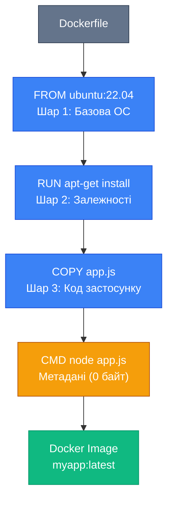

# Dockerfile — основи

## Від споживача до творця

У попередніх статтях ми активно використовували готові образи з Docker Hub — запускали Nginx, Ubuntu, PostgreSQL, .NET SDK. Ми розуміємо, як влаштовані образи зсередини, як працюють шари та Union File System. Тепер настав час навчитися створювати власні образи для наших застосунків.

Dockerfile — це текстовий файл, який містить інструкції для побудови Docker-образу. Це "рецепт", який описує, як перетворити ваш код у портативний, самодостатній контейнер. Dockerfile — це декларативний підхід: ви описуєте бажаний результат, а Docker виконує всю важку роботу.

У цій статті ми детально розглянемо базові інструкції Dockerfile, навчимося створювати прості образи, зрозуміємо різницю між схожими інструкціями (COPY vs ADD, CMD vs ENTRYPOINT), та створимо перші робочі образи для C# застосунків. Це фундамент, на якому будуються всі контейнерні застосунки.

::note
Ця стаття фокусується на базових інструкціях Dockerfile. Просунуті техніки (multi-stage builds, оптимізація, ARG, LABEL) будуть розглянуті в наступній статті.

::

---

## Що таке Dockerfile?

### Визначення

**Dockerfile** — це текстовий файл без розширення (саме `Dockerfile`, а не `Dockerfile.txt`), який містить послідовність інструкцій для побудови Docker-образу. Кожна інструкція створює новий шар в образі.

Аналогія: якщо Docker-образ — це готова страва, то Dockerfile — це детальний рецепт з покроковими інструкціями, як її приготувати.

### Структура Dockerfile

Типовий Dockerfile має наступну структуру:

```dockerfile
# Коментар: базовий образ
FROM ubuntu:22.04

# Коментар: встановлення залежностей
RUN apt-get update && apt-get install -y curl

# Коментар: копіювання файлів
COPY app.js /app/

# Коментар: робоча директорія
WORKDIR /app

# Коментар: команда запуску
CMD ["node", "app.js"]
```

Ключові принципи:

- **Кожна інструкція** (FROM, RUN, COPY тощо) створює новий шар
- **Порядок має значення** — інструкції виконуються послідовно зверху вниз
- **Коментарі** починаються з `#`
- **Регістр не має значення**, але прийнято писати інструкції ВЕЛИКИМИ ЛІТЕРАМИ для читабельності

### Процес побудови образу

Коли ви виконуєте `docker build`, відбувається наступне:

1. Docker читає Dockerfile
2. Для кожної інструкції:
   - Створює тимчасовий контейнер з попереднього шару
   - Виконує інструкцію всередині контейнера
   - Зберігає зміни як новий шар
   - Видаляє тимчасовий контейнер
3. Фінальний образ — це стек всіх створених шарів
4. Docker присвоює образу ID та (опціонально) тег

::mermaid



::

---

## FROM: вибір базового образу

Кожен Dockerfile **повинен** починатися з інструкції `FROM` (за винятком коментарів та ARG перед FROM). Ця інструкція визначає базовий образ, на якому будується ваш образ.

### Синтаксис

```dockerfile
FROM <image>[:<tag>][@<digest>]
```

### Приклади

```dockerfile
# Використання офіційного образу Ubuntu
FROM ubuntu:22.04

# Використання офіційного образу .NET SDK
FROM mcr.microsoft.com/dotnet/sdk:8.0

# Використання Alpine Linux (мінімалістичний)
FROM alpine:3.19

# Використання конкретної версії за digest
FROM nginx@sha256:0d17b565c37bcbd895e9d92315a05c1c3c9a29f762b011a10c54a66cd53c9b31

# Використання scratch (порожній образ)
FROM scratch
```

### Вибір базового образу

Вибір базового образу — це перше та одне з найважливіших рішень при створенні Dockerfile. Від нього залежить:

- Розмір фінального образу
- Доступні інструменти та бібліотеки
- Безпека (кількість потенційних вразливостей)
- Сумісність з вашим застосунком

**Для .NET застосунків** Microsoft надає офіційні образи:

```dockerfile
# Для розробки та збірки (містить SDK)
FROM mcr.microsoft.com/dotnet/sdk:8.0

# Для запуску ASP.NET Core застосунків (містить лише runtime)
FROM mcr.microsoft.com/dotnet/aspnet:8.0

# Для запуску консольних застосунків
FROM mcr.microsoft.com/dotnet/runtime:8.0

# Alpine варіанти (менший розмір)
FROM mcr.microsoft.com/dotnet/aspnet:8.0-alpine
```

**Загальні базові образи**:

- `ubuntu`, `debian` — повнофункціональні, великі (~75-120 МБ)
- `alpine` — мінімалістичний (~7 МБ), але може мати проблеми сумісності
- `scratch` — порожній образ, для статично зібраних бінарників

::tip
Для продакшену використовуйте конкретні версії (`ubuntu:22.04`, `dotnet/aspnet:8.0.4`), а не `latest`. Це гарантує відтворюваність збірки.

::

### scratch: порожній образ

`scratch` — це спеціальний "образ", який насправді порожній. Він використовується для створення мінімальних образів зі статично зібраними бінарниками:

```dockerfile
FROM scratch
COPY myapp /
CMD ["/myapp"]
```

Це створює образ, який містить лише ваш бінарник — жодної ОС, жодних бібліотек. Ідеально для Go застосунків або .NET з Native AOT.

---

## WORKDIR: встановлення робочої директорії

`WORKDIR` встановлює робочу директорію для всіх наступних інструкцій `RUN`, `CMD`, `ENTRYPOINT`, `COPY` та `ADD`.

### Синтаксис

```dockerfile
WORKDIR /path/to/directory
```

### Поведінка

- Якщо директорія не існує, Docker створює її автоматично
- Можна використовувати кілька разів — кожен наступний `WORKDIR` змінює поточну директорію
- Підтримує відносні шляхи (відносно попереднього `WORKDIR`)

### Приклади

```dockerfile
# Абсолютний шлях
WORKDIR /app

# Відносний шлях (відносно попереднього WORKDIR)
WORKDIR /app
WORKDIR src
# Тепер робоча директорія: /app/src

# Використання змінних оточення
ENV APP_HOME=/application
WORKDIR $APP_HOME
```

### Чому WORKDIR краще за RUN cd?

**Погано**:

```dockerfile
RUN cd /app
COPY . .
# COPY виконається в кореневій директорії, а не в /app!
```

Кожна інструкція `RUN` виконується в новому контейнері, тому `cd` не зберігається між інструкціями.

**Добре**:

```dockerfile
WORKDIR /app
COPY . .
# COPY виконається в /app
```

`WORKDIR` встановлює робочу директорію для всіх наступних інструкцій.

::note
Завжди використовуйте `WORKDIR` замість `RUN cd`. Це робить Dockerfile читабельнішим та запобігає помилкам.

::

---

## COPY: копіювання файлів

`COPY` копіює файли та директорії з хоста (build context) в образ.

### Синтаксис

```dockerfile
COPY [--chown=<user>:<group>] <src>... <dest>
```

### Приклади

```dockerfile
# Копіювання одного файлу
COPY app.js /app/

# Копіювання кількох файлів
COPY app.js package.json /app/

# Копіювання директорії
COPY src/ /app/src/

# Копіювання всього (крім .dockerignore)
COPY . /app/

# Копіювання з встановленням власника (Linux)
COPY --chown=1000:1000 app.js /app/

# Копіювання з wildcards
COPY *.js /app/
COPY src/**/*.cs /app/src/
```

### Правила копіювання

**Шлях джерела** (`<src>`):
- Відносний до build context (директорія, де виконується `docker build`)
- Не можна копіювати файли поза build context (`COPY ../file.txt` — помилка)
- Підтримує wildcards (`*`, `?`, `**`)

**Шлях призначення** (`<dest>`):
- Абсолютний шлях в образі (`/app/file.txt`)
- Або відносний до `WORKDIR`
- Якщо закінчується на `/`, вважається директорією

**Поведінка**:
- Якщо `<dest>` не існує, Docker створює його (включно з батьківськими директоріями)
- Якщо `<src>` — директорія, копіюється її **вміст**, а не сама директорія
- Зберігаються метадані файлів (права доступу, timestamps)

### Приклад для .NET застосунку

```dockerfile
FROM mcr.microsoft.com/dotnet/sdk:8.0

WORKDIR /app

# Копіювання .csproj файлу
COPY MyApp.csproj .

# Відновлення залежностей
RUN dotnet restore

# Копіювання решти коду
COPY . .

# Збірка
RUN dotnet build -c Release
```

::tip
Копіюйте файли в правильному порядку для оптимізації кешування. Спочатку копіюйте файли, які рідко змінюються (`.csproj`), потім ті, що змінюються часто (вихідний код). Детальніше про кешування в наступних статтях.

::

---

## ADD: розширене копіювання

`ADD` схожий на `COPY`, але має додаткові можливості:

1. Автоматичне розпакування tar-архівів
2. Завантаження файлів з URL

### Синтаксис

```dockerfile
ADD [--chown=<user>:<group>] <src>... <dest>
```

### Приклади

```dockerfile
# Копіювання файлу (як COPY)
ADD app.js /app/

# Автоматичне розпакування tar-архіву
ADD archive.tar.gz /app/
# Результат: вміст архіву розпаковується в /app/

# Завантаження з URL
ADD https://example.com/file.txt /app/
# Файл завантажується та зберігається в /app/file.txt
```

### COPY vs ADD: що використовувати?

**Офіційна рекомендація Docker**: використовуйте `COPY`, якщо вам не потрібні специфічні можливості `ADD`.

**Використовуйте COPY**:
- Для звичайного копіювання файлів
- Коли потрібна явність та передбачуваність
- У 99% випадків

**Використовуйте ADD**:
- Коли потрібно автоматично розпакувати tar-архів
- Коли потрібно завантажити файл з URL (хоча краще використовувати `RUN curl` або `RUN wget` для явності)

**Приклад проблеми з ADD**:

```dockerfile
# Несподівана поведінка
ADD myapp.tar.gz /app/
# Якщо це tar-архів, він розпакується
# Якщо це просто файл з розширенням .tar.gz, він скопіюється як є
# Неявна поведінка може призвести до помилок
```

::warning
`ADD` має неявну поведінку, яка може призвести до несподіваних результатів. Використовуйте `COPY` для звичайного копіювання файлів, а `ADD` лише коли явно потрібне розпакування архівів.

::

---

## RUN: виконання команд при збірці

`RUN` виконує команди під час побудови образу. Це найчастіше використовувана інструкція для встановлення пакетів, компіляції коду, налаштування середовища.

### Дві форми синтаксису

**Shell form** (виконується через `/bin/sh -c`):

```dockerfile
RUN apt-get update && apt-get install -y curl
```

**Exec form** (виконується безпосередньо, без shell):

```dockerfile
RUN ["apt-get", "update"]
```

### Shell form: найпоширеніша

Shell form дозволяє використовувати всі можливості shell:

```dockerfile
# Встановлення пакетів
RUN apt-get update && apt-get install -y \
    curl \
    vim \
    git

# Використання змінних оточення
RUN echo "PATH=$PATH" > /etc/environment

# Pipe та редиректи
RUN curl https://example.com/script.sh | bash

# Умовні оператори
RUN if [ -f /app/config.json ]; then echo "Config exists"; fi
```

### Exec form: для точного контролю

Exec form не використовує shell, тому:
- Не підтримує змінні оточення (`$PATH` не працює)
- Не підтримує pipe, редиректи, wildcards
- Але працює швидше та не залежить від наявності shell

```dockerfile
# Exec form
RUN ["apt-get", "update"]
RUN ["/bin/bash", "-c", "echo $PATH"]  # Потрібно явно вказати shell
```

### Об'єднання команд для оптимізації

Кожна інструкція `RUN` створює новий шар. Щоб зменшити кількість шарів, об'єднуйте команди:

**Погано** (3 шари):

```dockerfile
RUN apt-get update
RUN apt-get install -y curl
RUN apt-get clean
```

**Добре** (1 шар):

```dockerfile
RUN apt-get update && \
    apt-get install -y curl && \
    apt-get clean && \
    rm -rf /var/lib/apt/lists/*
```

Переваги об'єднання:
- Менше шарів = менший розмір образу
- Очищення кешів у тому ж шарі = не залишається "сміття"
- Швидша збірка (менше проміжних контейнерів)

### Приклади для .NET

```dockerfile
# Встановлення додаткових інструментів
RUN apt-get update && \
    apt-get install -y --no-install-recommends \
        curl \
        ca-certificates && \
    rm -rf /var/lib/apt/lists/*

# Відновлення NuGet пакетів
RUN dotnet restore

# Збірка застосунку
RUN dotnet build -c Release -o /app/build

# Публікація застосунку
RUN dotnet publish -c Release -o /app/publish
```

::tip
Завжди очищайте кеші пакетних менеджерів у тому ж `RUN`, де вони створюються. Інакше кеш залишиться в шарі та збільшить розмір образу: `apt-get clean && rm -rf /var/lib/apt/lists/*`

::

---

## CMD: команда за замовчуванням

`CMD` визначає команду, яка виконується при запуску контейнера. На відміну від `RUN`, яка виконується при **збірці** образу, `CMD` виконується при **запуску** контейнера.

### Три форми синтаксису

**Exec form** (рекомендовано):

```dockerfile
CMD ["executable", "param1", "param2"]
```

**Shell form**:

```dockerfile
CMD command param1 param2
```

**Як параметри для ENTRYPOINT**:

```dockerfile
CMD ["param1", "param2"]
```

### Приклади

```dockerfile
# Exec form (рекомендовано)
CMD ["nginx", "-g", "daemon off;"]

# Shell form
CMD nginx -g "daemon off;"

# Для .NET застосунку
CMD ["dotnet", "MyApp.dll"]

# З параметрами
CMD ["dotnet", "MyApp.dll", "--environment", "Production"]
```

### Важливі особливості CMD

**Може бути лише один CMD**: Якщо в Dockerfile кілька `CMD`, використовується лише останній.

**Може бути перевизначений**: При запуску контейнера можна перевизначити `CMD`:

```bash
# Використовується CMD з Dockerfile
docker run myapp

# CMD перевизначається
docker run myapp echo "Hello"
```

**Shell form vs Exec form**:

```dockerfile
# Shell form: команда виконується через /bin/sh -c
CMD echo "Hello"
# Процес PID 1: /bin/sh -c 'echo "Hello"'

# Exec form: команда виконується безпосередньо
CMD ["echo", "Hello"]
# Процес PID 1: echo
```

Exec form кращий, оскільки ваш застосунок стає PID 1 та коректно отримує сигнали (SIGTERM при `docker stop`).

### Приклад для .NET

```dockerfile
FROM mcr.microsoft.com/dotnet/aspnet:8.0

WORKDIR /app
COPY publish/ .

# Exec form (рекомендовано)
CMD ["dotnet", "MyApp.dll"]

# Альтернатива з параметрами
CMD ["dotnet", "MyApp.dll", "--urls", "http://0.0.0.0:5000"]
```

---

## ENTRYPOINT: точка входу

`ENTRYPOINT` схожий на `CMD`, але з важливою відмінністю: він **не може бути перевизначений** при запуску контейнера (без прапорця `--entrypoint`).

### Синтаксис

**Exec form** (рекомендовано):

```dockerfile
ENTRYPOINT ["executable", "param1", "param2"]
```

**Shell form**:

```dockerfile
ENTRYPOINT command param1 param2
```

### ENTRYPOINT vs CMD

Ключова різниця:

```dockerfile
# Dockerfile з CMD
CMD ["echo", "Hello"]

# Запуск
docker run myapp              # Виведе: Hello
docker run myapp echo "Bye"   # Виведе: Bye (CMD перевизначено)
```

```dockerfile
# Dockerfile з ENTRYPOINT
ENTRYPOINT ["echo", "Hello"]

# Запуск
docker run myapp              # Виведе: Hello
docker run myapp echo "Bye"   # Виведе: Hello echo Bye (аргументи додаються до ENTRYPOINT)
```

### Комбінація ENTRYPOINT + CMD

Найпотужніший патерн — використовувати `ENTRYPOINT` для команди, а `CMD` для параметрів за замовчуванням:

```dockerfile
ENTRYPOINT ["dotnet"]
CMD ["MyApp.dll"]

# Запуск
docker run myapp                    # dotnet MyApp.dll
docker run myapp MyApp.dll --help   # dotnet MyApp.dll --help
docker run myapp --version          # dotnet --version
```

### Практичні приклади

**Контейнер як виконуваний файл**:

```dockerfile
FROM alpine
ENTRYPOINT ["ping"]
CMD ["google.com"]

# Використання
docker run myping                  # ping google.com
docker run myping example.com      # ping example.com
```

**Wrapper script**:

```dockerfile
FROM mcr.microsoft.com/dotnet/aspnet:8.0

COPY entrypoint.sh /
RUN chmod +x /entrypoint.sh

ENTRYPOINT ["/entrypoint.sh"]
CMD ["dotnet", "MyApp.dll"]
```

`entrypoint.sh`:

```bash
#!/bin/bash
set -e

# Ініціалізація (міграції, налаштування)
echo "Running migrations..."
dotnet ef database update

# Запуск головного процесу
exec "$@"
```

`exec "$@"` замінює shell процес на команду з `CMD`, щоб застосунок став PID 1.

::note
Використовуйте `ENTRYPOINT` для команди, яка завжди має виконуватися, та `CMD` для параметрів за замовчуванням, які можна перевизначити. Це робить контейнер гнучким та зручним у використанні.

::

---

## EXPOSE: декларування портів

`EXPOSE` документує, які порти використовує застосунок всередині контейнера. Це **не** пробросить порти на хост — це лише документація.

### Синтаксис

```dockerfile
EXPOSE <port> [<port>/<protocol>...]
```

### Приклади

```dockerfile
# HTTP порт
EXPOSE 80

# HTTPS порт
EXPOSE 443

# Кілька портів
EXPOSE 80 443

# З явним протоколом
EXPOSE 80/tcp
EXPOSE 53/udp

# Для .NET застосунку
EXPOSE 5000
EXPOSE 5001
```

### Що робить EXPOSE?

`EXPOSE` **не** пробросить порти автоматично. Він лише:

1. **Документує** які порти використовує застосунок
2. Дозволяє використовувати `-P` (великий P) при `docker run` для автоматичного проброса всіх EXPOSE портів на випадкові порти хоста

```bash
# Без EXPOSE: потрібно явно вказати порт
docker run -p 8080:5000 myapp

# З EXPOSE 5000: можна використовувати -P
docker run -P myapp
# Docker автоматично пробросить 5000 на випадковий порт хоста (наприклад, 32768)
```

### Для чого потрібен EXPOSE?

**Документація**: Інші розробники бачать, які порти використовує застосунок, просто переглянувши Dockerfile.

**Інтеграція з оркестраторами**: Kubernetes, Docker Swarm використовують `EXPOSE` для автоматичного налаштування мережі.

**Docker Compose**: Може автоматично налаштовувати мережу між сервісами на основі `EXPOSE`.

::tip
Завжди додавайте `EXPOSE` для портів, які використовує ваш застосунок. Це покращує читабельність Dockerfile та допомагає іншим розробникам зрозуміти, як працює застосунок.

::

---

## ENV: змінні оточення

`ENV` встановлює змінні оточення, які будуть доступні як при збірці образу, так і при запуску контейнера.

### Синтаксис

```dockerfile
ENV <key>=<value> ...
```

### Приклади

```dockerfile
# Одна змінна
ENV NODE_ENV=production

# Кілька змінних
ENV APP_HOME=/app \
    APP_PORT=5000 \
    APP_ENV=production

# Використання в наступних інструкціях
ENV APP_HOME=/app
WORKDIR $APP_HOME
COPY . $APP_HOME

# Для .NET
ENV ASPNETCORE_URLS=http://+:5000 \
    ASPNETCORE_ENVIRONMENT=Production \
    DOTNET_RUNNING_IN_CONTAINER=true
```

### Використання змінних

Змінні, встановлені через `ENV`, доступні:

**При збірці** (в інструкціях `RUN`, `COPY`, `WORKDIR` тощо):

```dockerfile
ENV APP_DIR=/application
WORKDIR $APP_DIR
RUN echo "Working in $APP_DIR"
```

**При запуску контейнера** (в застосунку):

```csharp
// C# код може читати змінні
var environment = Environment.GetEnvironmentVariable("ASPNETCORE_ENVIRONMENT");
```

### Перевизначення при запуску

Змінні з `ENV` можна перевизначити при запуску:

```bash
# Використовується ENV з Dockerfile
docker run myapp

# Перевизначення змінної
docker run -e ASPNETCORE_ENVIRONMENT=Development myapp
```

### ENV vs ARG

`ENV` — для runtime змінних (доступні в контейнері)
`ARG` — для build-time змінних (доступні лише при збірці)

Детальніше про `ARG` в наступній статті про просунуті техніки.

::warning
Не зберігайте секрети (паролі, API ключі) в `ENV`. Вони залишаються в образі та можуть бути витягнуті через `docker inspect`. Використовуйте Docker secrets або передавайте секрети через `-e` при запуску.

::

---

## Перший Dockerfile: консольний C# застосунок

Тепер, коли ми розглянули базові інструкції, створимо перший робочий Dockerfile для простого C# застосунку.

### Крок 1: Створення C# проєкту

```bash
# Створення директорії проєкту
mkdir HelloDocker
cd HelloDocker

# Створення консольного застосунку
dotnet new console -n HelloDocker
cd HelloDocker
```

Відредагуємо `Program.cs`:

```csharp
Console.WriteLine("Hello from Docker!");
Console.WriteLine($"Current time: {DateTime.Now}");
Console.WriteLine($"Environment: {Environment.GetEnvironmentVariable("DOTNET_ENVIRONMENT") ?? "Not set"}");
Console.WriteLine($"Machine name: {Environment.MachineName}");

// Нескінченний цикл для демонстрації
while (true)
{
    Console.WriteLine($"[{DateTime.Now:HH:mm:ss}] Application is running...");
    await Task.Delay(5000);
}
```

### Крок 2: Створення Dockerfile

Створіть файл `Dockerfile` (без розширення) в директорії проєкту:

```dockerfile
# Базовий образ з .NET SDK для збірки
FROM mcr.microsoft.com/dotnet/sdk:8.0 AS build

# Встановлення робочої директорії
WORKDIR /src

# Копіювання .csproj та відновлення залежностей
COPY HelloDocker.csproj .
RUN dotnet restore

# Копіювання решти коду
COPY . .

# Збірка застосунку
RUN dotnet build -c Release -o /app/build

# Публікація застосунку
RUN dotnet publish -c Release -o /app/publish

# Фінальний образ з .NET Runtime
FROM mcr.microsoft.com/dotnet/runtime:8.0

# Робоча директорія
WORKDIR /app

# Копіювання опублікованого застосунку з build stage
COPY --from=build /app/publish .

# Змінна оточення
ENV DOTNET_ENVIRONMENT=Production

# Команда запуску
CMD ["dotnet", "HelloDocker.dll"]
```

::note
Цей Dockerfile використовує **multi-stage build** — просунуту техніку, яку ми детально розглянемо в наступній статті. Зараз важливо зрозуміти базові інструкції.

::

### Крок 3: Побудова образу

```bash
# Побудова образу з тегом
docker build -t hello-docker:1.0 .
```

Розберемо команду:
- `docker build` — команда побудови
- `-t hello-docker:1.0` — тег образу (назва:версія)
- `.` — build context (поточна директорія)

Вивід покаже процес виконання кожної інструкції:

```
[+] Building 45.2s (15/15) FINISHED
 => [internal] load build definition from Dockerfile
 => [internal] load .dockerignore
 => [internal] load metadata for mcr.microsoft.com/dotnet/runtime:8.0
 => [internal] load metadata for mcr.microsoft.com/dotnet/sdk:8.0
 => [build 1/6] FROM mcr.microsoft.com/dotnet/sdk:8.0
 => [build 2/6] WORKDIR /src
 => [build 3/6] COPY HelloDocker.csproj .
 => [build 4/6] RUN dotnet restore
 => [build 5/6] COPY . .
 => [build 6/6] RUN dotnet publish -c Release -o /app/publish
 => [stage-1 2/3] WORKDIR /app
 => [stage-1 3/3] COPY --from=build /app/publish .
 => exporting to image
 => => naming to docker.io/library/hello-docker:1.0
```

### Крок 4: Запуск контейнера

```bash
# Запуск у фоновому режимі
docker run -d --name my-hello hello-docker:1.0

# Перегляд логів
docker logs -f my-hello
```

Вивід:

```
Hello from Docker!
Current time: 14.04.2026 09:10:23
Environment: Production
Machine name: a3f5c8d9e2b1
[09:10:23] Application is running...
[09:10:28] Application is running...
[09:10:33] Application is running...
```

### Крок 5: Експерименти

```bash
# Перевизначення змінної оточення
docker run -d --name my-hello-dev -e DOTNET_ENVIRONMENT=Development hello-docker:1.0

# Перегляд логів
docker logs my-hello-dev

# Зупинка та видалення
docker stop my-hello my-hello-dev
docker rm my-hello my-hello-dev
```

---

## docker build: команда побудови

Розглянемо детальніше команду `docker build` та її опції.

### Базовий синтаксис

```bash
docker build [OPTIONS] PATH | URL | -
```

### Ключові опції

**-t, --tag**: Ім'я та тег образу

```bash
docker build -t myapp:1.0 .
docker build -t myapp:latest -t myapp:1.0.5 .  # Кілька тегів
```

**-f, --file**: Шлях до Dockerfile (якщо не `./Dockerfile`)

```bash
docker build -f Dockerfile.prod -t myapp:prod .
docker build -f docker/Dockerfile -t myapp .
```

**--no-cache**: Побудова без використання кешу

```bash
docker build --no-cache -t myapp .
```

**--build-arg**: Передача build-time аргументів

```bash
docker build --build-arg VERSION=1.0 -t myapp .
```

**--target**: Побудова до конкретного stage (для multi-stage)

```bash
docker build --target build -t myapp:build .
```

**--progress**: Тип виводу прогресу

```bash
docker build --progress=plain -t myapp .  # Детальний вивід
```

### Build Context

Build context — це набір файлів, які Docker надсилає демону для побудови образу. Зазвичай це поточна директорія (`.`).

```bash
# Build context = поточна директорія
docker build -t myapp .

# Build context = конкретна директорія
docker build -t myapp ./myproject

# Build context = Git репозиторій
docker build -t myapp https://github.com/user/repo.git#main
```

**Важливо**: Всі шляхи в `COPY` та `ADD` відносні до build context. Не можна копіювати файли поза build context.

### .dockerignore: виключення файлів

Файл `.dockerignore` (аналог `.gitignore`) визначає, які файли виключити з build context.

Створіть `.dockerignore` в директорії проєкту:

```
# Виключити bin та obj
bin/
obj/

# Виключити Git
.git/
.gitignore

# Виключити IDE файли
.vs/
.vscode/
*.user

# Виключити документацію
*.md
docs/

# Виключити тести
**/*Tests/
**/*.Tests/

# Виключити тимчасові файли
*.tmp
*.log
```

Переваги `.dockerignore`:

- **Швидша побудова**: менше файлів передається демону
- **Менший розмір образу**: не копіюються непотрібні файли
- **Безпека**: не потрапляють секрети (`.env`, `secrets.json`)

::tip
Завжди створюйте `.dockerignore` для .NET проєктів. Виключайте `bin/`, `obj/`, `.git/`, `.vs/` — це значно прискорить побудову та зменшить розмір build context.

::

---

## Практичний приклад: ASP.NET Core Web API

Створимо більш реалістичний приклад — Dockerfile для ASP.NET Core Web API.

### Крок 1: Створення проєкту

```bash
dotnet new webapi -n WeatherApi
cd WeatherApi
```

### Крок 2: Dockerfile

```dockerfile
# Етап 1: Збірка
FROM mcr.microsoft.com/dotnet/sdk:8.0 AS build
WORKDIR /src

# Копіювання .csproj та restore
COPY WeatherApi.csproj .
RUN dotnet restore

# Копіювання коду та збірка
COPY . .
RUN dotnet build -c Release -o /app/build

# Публікація
RUN dotnet publish -c Release -o /app/publish /p:UseAppHost=false

# Етап 2: Runtime
FROM mcr.microsoft.com/dotnet/aspnet:8.0
WORKDIR /app

# Копіювання з build stage
COPY --from=build /app/publish .

# Налаштування ASP.NET Core
ENV ASPNETCORE_URLS=http://+:5000 \
    ASPNETCORE_ENVIRONMENT=Production

# Expose порт
EXPOSE 5000

# Запуск
CMD ["dotnet", "WeatherApi.dll"]
```

### Крок 3: .dockerignore

```
bin/
obj/
.git/
.gitignore
.vs/
.vscode/
*.md
Dockerfile
.dockerignore
```

### Крок 4: Побудова та запуск

```bash
# Побудова
docker build -t weather-api:1.0 .

# Запуск
docker run -d -p 8080:5000 --name weather weather-api:1.0

# Тестування
curl http://localhost:8080/weatherforecast

# Перегляд логів
docker logs weather
```

### Крок 5: Перевірка Swagger

Відкрийте браузер: `http://localhost:8080/swagger`

Ви побачите Swagger UI з документацією API.

---

## Резюме

У цій статті ми навчилися створювати Docker-образи через Dockerfile та розглянули базові інструкції.

**Ключові інструкції:**

- `FROM` — базовий образ (обов'язкова, перша інструкція)
- `WORKDIR` — робоча директорія
- `COPY` — копіювання файлів (рекомендовано)
- `ADD` — розширене копіювання (рідко потрібне)
- `RUN` — виконання команд при збірці
- `CMD` — команда за замовчуванням при запуску
- `ENTRYPOINT` — точка входу (не перевизначається)
- `EXPOSE` — документування портів
- `ENV` — змінні оточення

**Важливі концепції:**

- Кожна інструкція створює новий шар
- Порядок інструкцій має значення для кешування
- Shell form vs Exec form
- CMD vs ENTRYPOINT
- COPY vs ADD
- Build context та .dockerignore

**Команди:**

- `docker build -t name:tag .` — побудова образу
- `docker build --no-cache` — без кешу
- `docker build -f Dockerfile.prod` — інший Dockerfile

У наступній статті ми розглянемо просунуті техніки Dockerfile: multi-stage builds, ARG, LABEL, USER, HEALTHCHECK та оптимізацію розміру образів.

---

## Практичні завдання

### Завдання 1: Простий Dockerfile

Створіть Dockerfile для консольного застосунку, який виводить системну інформацію:

```csharp
// Program.cs
Console.WriteLine($"OS: {Environment.OSVersion}");
Console.WriteLine($"Runtime: {Environment.Version}");
Console.WriteLine($"Processor Count: {Environment.ProcessorCount}");
Console.WriteLine($"Working Directory: {Environment.CurrentDirectory}");
```

**Вимоги:**
- Використайте `mcr.microsoft.com/dotnet/runtime:8.0`
- Додайте змінну оточення `APP_NAME=SystemInfo`
- Використайте `WORKDIR /app`

### Завдання 2: Експерименти з CMD та ENTRYPOINT

Створіть три Dockerfile з різними комбінаціями:

**Dockerfile.cmd**:
```dockerfile
FROM alpine
CMD ["echo", "Hello from CMD"]
```

**Dockerfile.entrypoint**:
```dockerfile
FROM alpine
ENTRYPOINT ["echo", "Hello from ENTRYPOINT"]
```

**Dockerfile.both**:
```dockerfile
FROM alpine
ENTRYPOINT ["echo"]
CMD ["Hello from both"]
```

Побудуйте та запустіть кожен з різними аргументами:

```bash
docker build -f Dockerfile.cmd -t test-cmd .
docker run test-cmd
docker run test-cmd echo "Override"

docker build -f Dockerfile.entrypoint -t test-entrypoint .
docker run test-entrypoint
docker run test-entrypoint "Override"

docker build -f Dockerfile.both -t test-both .
docker run test-both
docker run test-both "Override"
```

**Питання:**
- Яка різниця в поведінці?
- Коли використовувати CMD, а коли ENTRYPOINT?

### Завдання 3: Оптимізація шарів

Порівняйте два Dockerfile:

**Неоптимізований**:
```dockerfile
FROM ubuntu:22.04
RUN apt-get update
RUN apt-get install -y curl
RUN apt-get install -y vim
RUN apt-get install -y git
RUN apt-get clean
```

**Оптимізований**:
```dockerfile
FROM ubuntu:22.04
RUN apt-get update && \
    apt-get install -y \
        curl \
        vim \
        git && \
    apt-get clean && \
    rm -rf /var/lib/apt/lists/*
```

Побудуйте обидва та порівняйте:

```bash
docker build -f Dockerfile.unoptimized -t test-unopt .
docker build -f Dockerfile.optimized -t test-opt .

docker images | grep test-
docker history test-unopt
docker history test-opt
```

**Питання:**
- Яка різниця в розмірі?
- Скільки шарів у кожному?
- Чому оптимізований менший?

### Завдання 4: .dockerignore

Створіть .NET проєкт з тестами:

```bash
dotnet new sln -n MyApp
dotnet new webapi -n MyApp.Api
dotnet new xunit -n MyApp.Tests
dotnet sln add MyApp.Api MyApp.Tests
```

Створіть `.dockerignore` та Dockerfile. Побудуйте образ та перевірте, що тести не потрапили в образ:

```bash
docker build -t myapp .
docker run --rm myapp ls -la /app
```

**Завдання:**
- Переконайтеся, що `bin/`, `obj/`, `.git/` виключені
- Перевірте розмір build context: `docker build --progress=plain`

::note
Ці завдання допоможуть вам освоїти базові інструкції Dockerfile та підготують до створення production-ready образів у наступних статтях.

::


