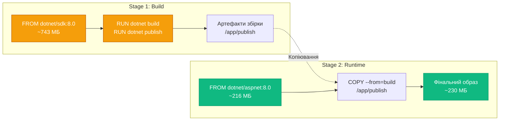

# Dockerfile — просунуті техніки

## Від базових до професійних образів

У попередній статті ми навчилися створювати прості Docker-образи, використовуючи базові інструкції Dockerfile. Але між "працюючим" образом та "production-ready" образом — величезна прірва. Професійні образи мають бути не лише функціональними, але й оптимізованими за розміром, безпечними, добре задокументованими та ефективними у використанні ресурсів.

У цій статті ми розглянемо просунуті техніки створення Docker-образів, які використовуються в реальних продакшен-середовищах. Ми детально вивчимо multi-stage builds — техніку, яка дозволяє зменшити розмір образів у 5-10 разів. Навчимося параметризувати збірку через ARG, додавати метадані через LABEL, запускати контейнери від непривілейованих користувачів через USER, та налаштовувати health checks для моніторингу стану застосунків.

Ці техніки не є опціональними "nice to have" — вони є стандартом індустрії для створення якісних контейнерних застосунків.

::note
Ця стаття передбачає, що ви вже знайомі з базовими інструкціями Dockerfile (FROM, COPY, RUN, CMD, ENV, EXPOSE) з попередньої статті. Тут ми заглибимося в просунуті концепції.

::

---

## Multi-Stage Builds: революція в оптимізації

Multi-stage builds — це найпотужніша техніка оптимізації Docker-образів, яка з'явилася в Docker 17.05 (2017). Вона дозволяє використовувати кілька `FROM` інструкцій в одному Dockerfile, де кожен `FROM` починає новий етап (stage) збірки.

### Проблема, яку вирішують multi-stage builds

Розглянемо типовий процес збірки .NET застосунку:

1. **Збірка**: Потрібен .NET SDK (~743 МБ) для компіляції коду
2. **Запуск**: Потрібен лише .NET Runtime (~193 МБ) для виконання скомпільованого застосунку

Без multi-stage builds ви змушені включати SDK у фінальний образ, навіть якщо він потрібен лише для збірки. Результат — образ розміром 800+ МБ, де 600 МБ — це інструменти, які ніколи не використовуються в runtime.

### Як працюють multi-stage builds

Multi-stage Dockerfile має кілька етапів, кожен з яких починається з `FROM`. Ви можете копіювати файли між етапами, але у фінальний образ потрапляє лише останній етап.

::mermaid



::

### Базовий приклад multi-stage build

```dockerfile
# ============================================
# Етап 1: Збірка (build stage)
# ============================================
FROM mcr.microsoft.com/dotnet/sdk:8.0 AS build

WORKDIR /src

# Копіювання .csproj та restore
COPY *.csproj .
RUN dotnet restore

# Копіювання коду та збірка
COPY . .
RUN dotnet publish -c Release -o /app/publish

# ============================================
# Етап 2: Runtime (final stage)
# ============================================
FROM mcr.microsoft.com/dotnet/aspnet:8.0

WORKDIR /app

# Копіювання лише скомпільованих артефактів з build stage
COPY --from=build /app/publish .

ENTRYPOINT ["dotnet", "MyApp.dll"]
```

Розберемо ключові моменти:

**AS build** — іменування етапу. Це дозволяє посилатися на нього в `COPY --from=build`.

**COPY --from=build** — копіювання файлів з попереднього етапу. Це єдиний спосіб передати дані між етапами.

**Фінальний образ** — містить лише останній етап (FROM aspnet:8.0). Етап збірки (FROM sdk:8.0) не потрапляє у фінальний образ.

### Результат оптимізації

Порівняємо розміри:

```bash
# Без multi-stage (SDK в фінальному образі)
docker build -f Dockerfile.single -t myapp:single .
docker images myapp:single
# REPOSITORY   TAG      SIZE
# myapp        single   850MB

# З multi-stage (лише runtime)
docker build -f Dockerfile.multi -t myapp:multi .
docker images myapp:multi
# REPOSITORY   TAG      SIZE
# myapp        multi    230MB
```

**Економія: 620 МБ (73%)!**

### Просунутий приклад: кілька етапів

Можна мати більше двох етапів для складніших сценаріїв:

```dockerfile
# ============================================
# Етап 1: Базові залежності
# ============================================
FROM mcr.microsoft.com/dotnet/sdk:8.0 AS base
WORKDIR /src
COPY *.csproj .
RUN dotnet restore

# ============================================
# Етап 2: Збірка
# ============================================
FROM base AS build
COPY . .
RUN dotnet build -c Release -o /app/build

# ============================================
# Етап 3: Тестування (опціонально)
# ============================================
FROM build AS test
COPY tests/ ./tests/
RUN dotnet test --no-build -c Release

# ============================================
# Етап 4: Публікація
# ============================================
FROM build AS publish
RUN dotnet publish -c Release -o /app/publish /p:UseAppHost=false

# ============================================
# Етап 5: Фінальний runtime
# ============================================
FROM mcr.microsoft.com/dotnet/aspnet:8.0-alpine AS final
WORKDIR /app
COPY --from=publish /app/publish .
ENTRYPOINT ["dotnet", "MyApp.dll"]
```

Переваги такої структури:

- **Модульність**: Кожен етап має чітку відповідальність
- **Кешування**: Зміни в коді не інвалідують етап restore
- **Гнучкість**: Можна збирати до конкретного етапу (`--target test`)
- **Оптимізація**: Фінальний образ мінімальний (Alpine + runtime)

### Побудова до конкретного етапу

```bash
# Побудова лише до етапу test (для CI)
docker build --target test -t myapp:test .

# Побудова до етапу build (для діагностики)
docker build --target build -t myapp:build .

# Побудова фінального образу (за замовчуванням)
docker build -t myapp:latest .
```

### Копіювання з зовнішніх образів

`COPY --from` може копіювати не лише з попередніх етапів, але й з будь-яких образів:

```dockerfile
# Копіювання з офіційного образу
COPY --from=nginx:latest /etc/nginx/nginx.conf /nginx.conf

# Копіювання з конкретного образу
COPY --from=myregistry.com/tools:1.0 /usr/bin/tool /usr/local/bin/
```

::tip
Multi-stage builds — це не опція, а стандарт для production-образів. Завжди використовуйте їх для .NET застосунків: SDK для збірки, runtime для запуску. Це зменшить розмір образу в 3-5 разів та покращить безпеку.

::

---

## ARG: параметризація збірки

`ARG` визначає змінні, які можна передати при побудові образу через `--build-arg`. На відміну від `ENV`, змінні `ARG` доступні лише під час збірки, а не в runtime.

### Синтаксис

```dockerfile
ARG <name>[=<default value>]
```

### Базове використання

```dockerfile
# Визначення ARG з значенням за замовчуванням
ARG DOTNET_VERSION=8.0
ARG BUILD_CONFIGURATION=Release

FROM mcr.microsoft.com/dotnet/sdk:${DOTNET_VERSION}

WORKDIR /src
COPY . .

# Використання ARG в RUN
RUN dotnet build -c ${BUILD_CONFIGURATION}
```

Побудова з різними аргументами:

```bash
# Використання значень за замовчуванням
docker build -t myapp .

# Перевизначення аргументів
docker build --build-arg DOTNET_VERSION=9.0 --build-arg BUILD_CONFIGURATION=Debug -t myapp:debug .
```

### ARG перед FROM

`ARG` може бути визначений перед `FROM` для параметризації базового образу:

```dockerfile
# ARG перед FROM
ARG DOTNET_VERSION=8.0
ARG VARIANT=alpine

FROM mcr.microsoft.com/dotnet/sdk:${DOTNET_VERSION}-${VARIANT} AS build

# ARG потрібно перевизначити після FROM, щоб використовувати в цьому етапі
ARG DOTNET_VERSION
RUN echo "Building with .NET ${DOTNET_VERSION}"
```

### Область видимості ARG

`ARG` має область видимості в межах етапу (stage). Якщо потрібен в кількох етапах, перевизначте:

```dockerfile
ARG VERSION=1.0

FROM alpine AS stage1
ARG VERSION  # Перевизначення для використання в цьому етапі
RUN echo "Stage 1: ${VERSION}"

FROM alpine AS stage2
ARG VERSION  # Знову перевизначення
RUN echo "Stage 2: ${VERSION}"
```

### ARG vs ENV

| Характеристика | ARG | ENV |
| :--- | :--- | :--- |
| Доступність | Лише при збірці | При збірці та runtime |
| Перевизначення | `--build-arg` | `-e` при `docker run` |
| Видимість в образі | Ні (не зберігається) | Так (в метаданих) |
| Використання | Параметризація збірки | Конфігурація runtime |

### Практичні приклади

**Версіонування образу**:

```dockerfile
ARG VERSION=1.0.0
ARG BUILD_DATE
ARG GIT_COMMIT

FROM mcr.microsoft.com/dotnet/aspnet:8.0

LABEL version="${VERSION}" \
      build-date="${BUILD_DATE}" \
      git-commit="${GIT_COMMIT}"

COPY app/ /app/
```

Побудова з метаданими:

```bash
docker build \
  --build-arg VERSION=1.2.3 \
  --build-arg BUILD_DATE=$(date -u +"%Y-%m-%dT%H:%M:%SZ") \
  --build-arg GIT_COMMIT=$(git rev-parse HEAD) \
  -t myapp:1.2.3 .
```

**Умовна логіка**:

```dockerfile
ARG INSTALL_DEV_TOOLS=false

FROM ubuntu:22.04

RUN apt-get update && \
    apt-get install -y curl && \
    if [ "$INSTALL_DEV_TOOLS" = "true" ]; then \
        apt-get install -y vim git; \
    fi && \
    rm -rf /var/lib/apt/lists/*
```

**Multi-platform builds**:

```dockerfile
ARG TARGETPLATFORM
ARG BUILDPLATFORM

FROM --platform=$BUILDPLATFORM golang:1.21 AS build

RUN echo "Building on $BUILDPLATFORM for $TARGETPLATFORM"
```

::warning
Не передавайте секрети через `--build-arg`. Вони зберігаються в історії образу та можуть бути витягнуті через `docker history`. Використовуйте BuildKit secrets або multi-stage builds для роботи з секретами.

::


---

## Production-Ready Dockerfile: повний приклад

Тепер об'єднаємо всі просунуті техніки в один production-ready Dockerfile для ASP.NET Core Web API.

```dockerfile
# ============================================
# Build Arguments
# ============================================
ARG DOTNET_VERSION=8.0
ARG BUILD_CONFIGURATION=Release
ARG VERSION=1.0.0
ARG BUILD_DATE
ARG GIT_COMMIT

# ============================================
# Stage 1: Restore Dependencies
# ============================================
FROM mcr.microsoft.com/dotnet/sdk:${DOTNET_VERSION} AS restore

WORKDIR /src

# Копіювання лише .csproj для кешування restore
COPY *.csproj .
RUN dotnet restore

# ============================================
# Stage 2: Build
# ============================================
FROM restore AS build

ARG BUILD_CONFIGURATION

# Копіювання коду
COPY . .

# Збірка
RUN dotnet build -c ${BUILD_CONFIGURATION} --no-restore -o /app/build

# ============================================
# Stage 3: Test (опціонально)
# ============================================
FROM build AS test

# Копіювання тестів
COPY tests/ ./tests/

# Запуск тестів
RUN dotnet test --no-build -c ${BUILD_CONFIGURATION}

# ============================================
# Stage 4: Publish
# ============================================
FROM build AS publish

ARG BUILD_CONFIGURATION

RUN dotnet publish -c ${BUILD_CONFIGURATION} \
    --no-build \
    -o /app/publish \
    /p:UseAppHost=false

# ============================================
# Stage 5: Final Runtime Image
# ============================================
FROM mcr.microsoft.com/dotnet/aspnet:${DOTNET_VERSION}-alpine AS final

# Метадані
ARG VERSION
ARG BUILD_DATE
ARG GIT_COMMIT

LABEL org.opencontainers.image.title="MyApp API" \
      org.opencontainers.image.description="Production ASP.NET Core Web API" \
      org.opencontainers.image.version="${VERSION}" \
      org.opencontainers.image.created="${BUILD_DATE}" \
      org.opencontainers.image.revision="${GIT_COMMIT}" \
      org.opencontainers.image.authors="dev@example.com" \
      org.opencontainers.image.licenses="MIT"

# Створення непривілейованого користувача
RUN addgroup -g 1000 appuser && \
    adduser -D -u 1000 -G appuser appuser

WORKDIR /app

# Встановлення curl для health check
RUN apk add --no-cache curl

# Копіювання артефактів з publish stage
COPY --from=publish --chown=1000:1000 /app/publish .

# Створення директорій для логів та даних
RUN mkdir -p /app/logs /app/data && \
    chown -R 1000:1000 /app

# Перемикання на непривілейованого користувача
USER 1000:1000

# Змінні оточення
ENV ASPNETCORE_URLS=http://+:5000 \
    ASPNETCORE_ENVIRONMENT=Production \
    DOTNET_RUNNING_IN_CONTAINER=true

# Health check
HEALTHCHECK --interval=30s --timeout=3s --start-period=10s --retries=3 \
  CMD curl -f http://localhost:5000/health || exit 1

# Expose порт
EXPOSE 5000

# Запуск
ENTRYPOINT ["dotnet", "MyApp.dll"]
```

### Побудова production образу

```bash
docker build \
  --build-arg VERSION=1.2.3 \
  --build-arg BUILD_DATE=$(date -u +"%Y-%m-%dT%H:%M:%SZ") \
  --build-arg GIT_COMMIT=$(git rev-parse --short HEAD) \
  --target final \
  -t myapp:1.2.3 \
  -t myapp:latest \
  .
```

### Побудова для тестування

```bash
# Збірка до етапу test
docker build --target test -t myapp:test .
```

### Перевірка образу

```bash
# Перегляд розміру
docker images myapp:1.2.3

# Перегляд метаданих
docker image inspect myapp:1.2.3 --format='{{json .Config.Labels}}' | jq

# Перевірка користувача
docker run --rm myapp:1.2.3 id

# Запуск з health check
docker run -d -p 5000:5000 --name myapp myapp:1.2.3

# Перевірка health status
docker ps
docker inspect myapp --format='{{.State.Health.Status}}'
```

---

## Резюме

У цій статті ми розглянули просунуті техніки створення Docker-образів, які є стандартом для production-середовищ.

**Ключові техніки:**

- **Multi-stage builds** — розділення збірки та runtime, зменшення розміру образу в 3-10 разів
- **ARG** — параметризація збірки, динамічні значення при побудові
- **LABEL** — метадані для документування, автоматизації та організації
- **USER** — запуск від непривілейованих користувачів для безпеки
- **HEALTHCHECK** — автоматична перевірка стану застосунку

**Best practices:**

- Завжди використовуйте multi-stage builds для .NET застосунків
- Створюйте непривілейованого користувача (UID 1000) та запускайте від нього
- Додавайте HEALTHCHECK для всіх production-застосунків
- Використовуйте ARG для версіонування та метаданих
- Додавайте LABEL з версією, датою збірки, git commit
- Використовуйте Alpine-based образи для мінімального розміру
- Очищайте кеші пакетних менеджерів у тому ж RUN

**Типовий розмір образів:**

- Без оптимізації: 800-1000 МБ
- З multi-stage: 200-300 МБ
- З Alpine: 100-150 МБ

У наступній статті ми розглянемо build context, кешування шарів та оптимізацію швидкості збірки.

---

## Практичні завдання

### Завдання 1: Порівняння розмірів

Створіть два Dockerfile для одного застосунку:

**Dockerfile.single** (без multi-stage):
```dockerfile
FROM mcr.microsoft.com/dotnet/sdk:8.0
WORKDIR /app
COPY . .
RUN dotnet publish -c Release -o /app/publish
WORKDIR /app/publish
CMD ["dotnet", "MyApp.dll"]
```

**Dockerfile.multi** (з multi-stage):
```dockerfile
FROM mcr.microsoft.com/dotnet/sdk:8.0 AS build
WORKDIR /src
COPY . .
RUN dotnet publish -c Release -o /app/publish

FROM mcr.microsoft.com/dotnet/aspnet:8.0-alpine
WORKDIR /app
COPY --from=build /app/publish .
CMD ["dotnet", "MyApp.dll"]
```

Побудуйте обидва та порівняйте:

```bash
docker build -f Dockerfile.single -t myapp:single .
docker build -f Dockerfile.multi -t myapp:multi .
docker images | grep myapp
```

**Питання:**
- Яка різниця в розмірі?
- Скільки шарів у кожному образі?
- Який образ швидше запускається?

### Завдання 2: Параметризація через ARG

Створіть Dockerfile з ARG для різних конфігурацій:

```dockerfile
ARG DOTNET_VERSION=8.0
ARG BUILD_CONFIG=Release
ARG BASE_IMAGE=alpine

FROM mcr.microsoft.com/dotnet/sdk:${DOTNET_VERSION} AS build
ARG BUILD_CONFIG
WORKDIR /src
COPY . .
RUN dotnet publish -c ${BUILD_CONFIG} -o /app/publish

FROM mcr.microsoft.com/dotnet/aspnet:${DOTNET_VERSION}-${BASE_IMAGE}
WORKDIR /app
COPY --from=build /app/publish .
CMD ["dotnet", "MyApp.dll"]
```

Побудуйте різні варіанти:

```bash
# Production (Alpine)
docker build -t myapp:prod .

# Debug (Debian)
docker build --build-arg BUILD_CONFIG=Debug --build-arg BASE_IMAGE=bookworm -t myapp:debug .

# .NET 9 Preview
docker build --build-arg DOTNET_VERSION=9.0 -t myapp:net9 .
```

### Завдання 3: Безпека через USER

Створіть Dockerfile з непривілейованим користувачем:

```dockerfile
FROM mcr.microsoft.com/dotnet/aspnet:8.0-alpine

RUN addgroup -g 1000 appuser && \
    adduser -D -u 1000 -G appuser appuser

WORKDIR /app
COPY --chown=1000:1000 app/ .

RUN mkdir -p /app/logs && \
    chown 1000:1000 /app/logs

USER 1000:1000

CMD ["dotnet", "MyApp.dll"]
```

Перевірте:

```bash
docker build -t myapp:secure .
docker run --rm myapp:secure id
docker run --rm myapp:secure whoami
docker run -d --name test myapp:secure
docker exec test touch /app/logs/test.log  # Має працювати
docker exec test touch /etc/test.log       # Має провалитися (Permission denied)
```

### Завдання 4: Health Check

Додайте health check до ASP.NET Core застосунку:

**Program.cs:**
```csharp
var builder = WebApplication.CreateBuilder(args);
builder.Services.AddHealthChecks();
var app = builder.Build();
app.MapHealthChecks("/health");
app.Run();
```

**Dockerfile:**
```dockerfile
FROM mcr.microsoft.com/dotnet/aspnet:8.0-alpine
WORKDIR /app
COPY app/ .

RUN apk add --no-cache curl

HEALTHCHECK --interval=10s --timeout=3s --start-period=5s --retries=2 \
  CMD curl -f http://localhost:5000/health || exit 1

ENV ASPNETCORE_URLS=http://+:5000
CMD ["dotnet", "MyApp.dll"]
```

Запустіть та спостерігайте:

```bash
docker build -t myapp:health .
docker run -d -p 5000:5000 --name health-test myapp:health

# Спостереження за health status
watch -n 1 'docker ps | grep health-test'

# Детальна інформація
docker inspect health-test --format='{{json .State.Health}}' | jq
```

::note
Ці завдання допоможуть вам освоїти просунуті техніки Dockerfile та створювати production-ready образи для реальних проєктів.

::
