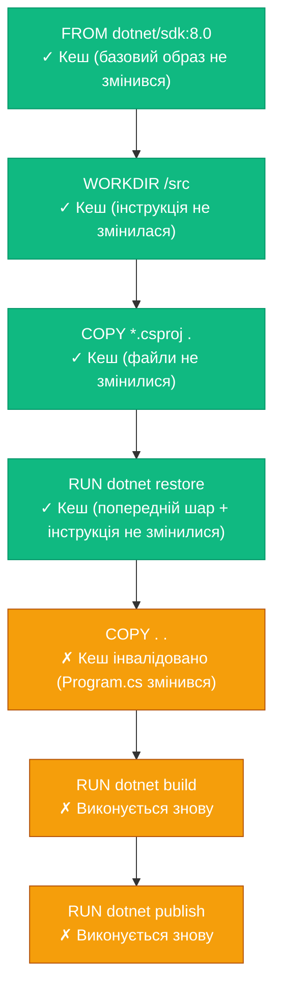
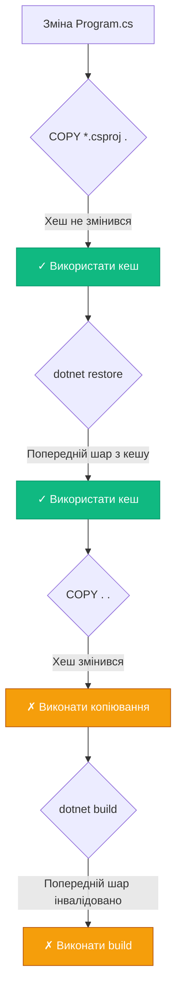
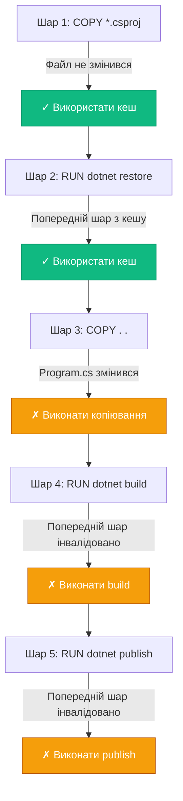

# Build Context та кешування шарів

## Від повільних до блискавичних збірок

У попередніх статтях ми навчилися створювати функціональні та оптимізовані за розміром Docker-образи. Але є ще один критично важливий аспект — **швидкість збірки**. У реальних проєктах ви будете збирати образи десятки разів на день: при кожному коміті, при кожному pull request, при кожному деплої. Якщо збірка займає 10 хвилин, це 100 хвилин на день, 500 хвилин на тиждень — величезна втрата продуктивності.

Docker має потужний механізм кешування, який може зменшити час збірки з 10 хвилин до 10 секунд. Але щоб ефективно використовувати цей механізм, потрібно розуміти, як він працює, що таке build context, як правильно структурувати Dockerfile та використовувати .dockerignore.

У цій статті ми детально розглянемо механізм кешування шарів, дізнаємося, що таке build context і чому він критично важливий для швидкості збірки, навчимося оптимізувати порядок інструкцій у Dockerfile, та познайомимося з BuildKit — сучасним builder'ом Docker з просунутими можливостями кешування.

::note
Ця стаття передбачає розуміння базових інструкцій Dockerfile та концепції шарів з попередніх статей. Тут ми зосередимося на оптимізації швидкості збірки.

::

---

## Build Context: що це і чому це важливо

### Визначення

**Build context** — це набір файлів та директорій, які Docker надсилає демону для побудови образу. Зазвичай це директорія, яку ви вказуєте в команді `docker build`:

```bash
docker build -t myapp .
#                    ^ build context (поточна директорія)
```

Коли ви виконуєте цю команду, Docker:

1. Рекурсивно збирає всі файли з поточної директорії
2. Створює tar-архів з цих файлів
3. Надсилає архів Docker Daemon
4. Демон розпаковує архів та використовує файли для інструкцій `COPY` та `ADD`

### Проблема великого build context

Розглянемо типову структуру .NET проєкту:

```
MyProject/
├── src/
│   ├── MyApp/
│   │   ├── bin/          # 50 МБ (скомпільовані файли)
│   │   ├── obj/          # 100 МБ (проміжні файли збірки)
│   │   └── *.cs
│   └── MyApp.Tests/
│       ├── bin/          # 30 МБ
│       ├── obj/          # 80 МБ
│       └── *.cs
├── .git/                 # 200 МБ (історія Git)
├── .vs/                  # 50 МБ (Visual Studio кеш)
├── node_modules/         # 300 МБ (якщо є frontend)
├── Dockerfile
└── .dockerignore
```

Без `.dockerignore` Docker надішле **810 МБ** демону, навіть якщо для збірки потрібні лише `.cs` та `.csproj` файли (~5 МБ).

Наслідки:

- **Повільна збірка**: Передача 810 МБ займає час, особливо в CI/CD
- **Інвалідація кешу**: Зміна будь-якого файлу в `node_modules` інвалідує кеш `COPY . .`
- **Використання пам'яті**: Демон зберігає build context в пам'яті

### Перевірка розміру build context

```bash
# Побудова з виводом розміру context
docker build --progress=plain -t myapp . 2>&1 | grep "transferring context"
```

Вивід:

```
#1 transferring context: 810.5MB
```

::warning
Великий build context — це одна з найпоширеніших причин повільних збірок Docker. Завжди використовуйте `.dockerignore` для виключення непотрібних файлів.

::

---

## .dockerignore: виключення непотрібних файлів

`.dockerignore` працює аналогічно `.gitignore` — він визначає, які файли та директорії виключити з build context.

### Базовий синтаксис

Створіть файл `.dockerignore` в кореневій директорії проєкту (поруч з Dockerfile):

```
# Коментар

# Виключити конкретний файл
README.md

# Виключити директорію
bin/
obj/

# Виключити всі файли з розширенням
*.log
*.tmp

# Виключити всі файли в усіх піддиректоріях
**/*.log

# Виключити, але зробити виняток
*.md
!IMPORTANT.md
```

### .dockerignore для .NET проєктів

Типовий `.dockerignore` для .NET:

```
# Виключити результати збірки
**/bin/
**/obj/

# Виключити Git
.git/
.gitignore
.gitattributes

# Виключити IDE
.vs/
.vscode/
*.user
*.suo

# Виключити документацію
*.md
docs/

# Виключити тести (якщо не потрібні в образі)
**/*Tests/
**/*.Tests/

# Виключити CI/CD конфігурації
.github/
.gitlab-ci.yml
azure-pipelines.yml

# Виключити Docker файли
Dockerfile*
.dockerignore
docker-compose*.yml

# Виключити тимчасові файли
*.tmp
*.log
*.cache

# Виключити Node.js (якщо є frontend)
node_modules/
npm-debug.log

# Виключити OS файли
.DS_Store
Thumbs.db
```

### Результат оптимізації

```bash
# Без .dockerignore
docker build --progress=plain -t myapp . 2>&1 | grep "transferring context"
#1 transferring context: 810.5MB

# З .dockerignore
docker build --progress=plain -t myapp . 2>&1 | grep "transferring context"
#1 transferring context: 5.2MB
```

**Економія: 805 МБ (99.4%)!**

### Wildcards та патерни

```
# * — будь-які символи (крім /)
*.log          # file.log, app.log
test*          # test.txt, testing.log

# ** — будь-які символи (включно з /)
**/*.log       # src/app.log, tests/unit/test.log

# ? — один будь-який символ
file?.txt      # file1.txt, fileA.txt

# ! — виняток (не виключати)
*.md           # Виключити всі .md
!README.md     # Але залишити README.md
```

### Перевірка .dockerignore

Щоб побачити, які файли потрапляють у build context:

```bash
# Створити tar-архів build context (як це робить Docker)
tar -czf context.tar.gz -C . $(docker build --no-cache -q . 2>&1 | grep -oP '(?<=context: ).*')

# Або використати BuildKit
DOCKER_BUILDKIT=1 docker build --progress=plain . 2>&1 | grep "transferring"
```

::tip
Створюйте `.dockerignore` одразу при створенні Dockerfile. Виключайте `bin/`, `obj/`, `.git/`, `.vs/`, `node_modules/` — це стандарт для .NET проєктів. Це прискорить збірку в 10-100 разів.

::

---

## Механізм кешування шарів

Docker кешує кожен шар образу. Якщо інструкція не змінилася, Docker використовує кешований шар замість повторного виконання.

### Як працює кешування

Для кожної інструкції Docker обчислює **хеш** на основі:

1. **Самої інструкції** (текст у Dockerfile)
2. **Вмісту файлів** (для `COPY` та `ADD`)
3. **Попереднього шару** (хеш батьківського шару)

Якщо хеш співпадає з кешованим шаром, Docker використовує кеш. Якщо ні — виконує інструкцію та інвалідує кеш для всіх наступних інструкцій.

::mermaid



::

### Приклад: погана структура Dockerfile

```dockerfile
FROM mcr.microsoft.com/dotnet/sdk:8.0

WORKDIR /src

# Копіювання всього коду
COPY . .

# Restore та build
RUN dotnet restore
RUN dotnet build -c Release
```

**Проблема**: Будь-яка зміна в коді (навіть коментар у `Program.cs`) інвалідує `COPY . .`, що призводить до повторного виконання `dotnet restore` (завантаження всіх NuGet пакетів — 1-2 хвилини).

### Приклад: оптимізована структура

```dockerfile
FROM mcr.microsoft.com/dotnet/sdk:8.0

WORKDIR /src

# Спочатку копіюємо лише .csproj
COPY *.csproj .

# Restore (кешується, якщо .csproj не змінився)
RUN dotnet restore

# Потім копіюємо решту коду
COPY . .

# Build (виконується лише якщо код змінився)
RUN dotnet build -c Release
```

**Переваги**: Зміна коду не інвалідує `dotnet restore`. Restore виконується лише якщо змінилися залежності (`.csproj`).

### Порівняння часу збірки

**Перша збірка** (без кешу):

```bash
time docker build -t myapp .
# real    2m 15s  (restore: 1m 30s, build: 45s)
```

**Друга збірка** (зміна коду, погана структура):

```bash
# Змінили Program.cs
time docker build -t myapp .
# real    2m 15s  (restore знову: 1m 30s, build: 45s)
```

**Друга збірка** (зміна коду, оптимізована структура):

```bash
# Змінили Program.cs
time docker build -t myapp .
# real    0m 50s  (restore з кешу: 0s, build: 50s)
```

**Економія: 1 хвилина 25 секунд (63%)!**

::tip
Правило оптимізації кешування: розміщуйте інструкції від **рідко змінюваних** до **часто змінюваних**. Залежності (`.csproj`) змінюються рідше, ніж код (`.cs`), тому `COPY *.csproj` має бути перед `COPY . .`.

::

---

## Правило порядку інструкцій для .NET проєктів

### Анатомія оптимального Dockerfile

Розглянемо детально, як правильно структурувати Dockerfile для .NET проєкту, щоб максимально використовувати кешування.

#### Погана структура (анти-патерн)

```dockerfile
FROM mcr.microsoft.com/dotnet/sdk:8.0 AS build

WORKDIR /src

# ❌ Копіюємо все одразу
COPY . .

# Restore, build, publish
RUN dotnet restore "MyApp/MyApp.csproj"
RUN dotnet build "MyApp/MyApp.csproj" -c Release -o /app/build
RUN dotnet publish "MyApp/MyApp.csproj" -c Release -o /app/publish

FROM mcr.microsoft.com/dotnet/aspnet:8.0
WORKDIR /app
COPY --from=build /app/publish .
ENTRYPOINT ["dotnet", "MyApp.dll"]
```

**Проблеми:**

1. `COPY . .` копіює весь код, включно з `.cs` файлами
2. Будь-яка зміна коду інвалідує кеш `dotnet restore`
3. NuGet пакети завантажуються при кожній збірці (1-3 хвилини)

#### Оптимізована структура

```dockerfile
FROM mcr.microsoft.com/dotnet/sdk:8.0 AS build

WORKDIR /src

# ✅ Крок 1: Копіюємо ЛИШЕ .csproj файли
COPY ["MyApp/MyApp.csproj", "MyApp/"]

# ✅ Крок 2: Restore (кешується, якщо .csproj не змінився)
RUN dotnet restore "MyApp/MyApp.csproj"

# ✅ Крок 3: Копіюємо решту коду
COPY . .

# ✅ Крок 4: Build та Publish
WORKDIR "/src/MyApp"
RUN dotnet build "MyApp.csproj" -c Release -o /app/build
RUN dotnet publish "MyApp.csproj" -c Release -o /app/publish /p:UseAppHost=false

FROM mcr.microsoft.com/dotnet/aspnet:8.0
WORKDIR /app
COPY --from=build /app/publish .
ENTRYPOINT ["dotnet", "MyApp.dll"]
```

**Переваги:**

- Зміна `.cs` файлів **не інвалідує** `dotnet restore`
- Restore виконується лише при зміні залежностей
- Економія часу: **60-90%** при повторних збірках

### Порівняння часу збірки

::mermaid

```mermaid
gantt
    title Час збірки: Погана vs Оптимізована структура
    dateFormat X
    axisFormat %s

    section Погана структура
    COPY . .           :0, 5s
    dotnet restore     :5s, 90s
    dotnet build       :95s, 45s
    dotnet publish     :140s, 20s

    section Оптимізована (перша збірка)
    COPY *.csproj      :0, 2s
    dotnet restore     :2s, 90s
    COPY . .           :92s, 5s
    dotnet build       :97s, 45s
    dotnet publish     :142s, 20s

    section Оптимізована (зміна коду)
    COPY *.csproj (кеш) :0, 0s
    dotnet restore (кеш):0s, 0s
    COPY . .           :0s, 5s
    dotnet build       :5s, 45s
    dotnet publish     :50s, 20s
```

::

**Результати:**

| Сценарій | Погана структура | Оптимізована | Економія |
| :--- | :--- | :--- | :--- |
| Перша збірка | 160 с | 162 с | -2 с (незначно) |
| Зміна коду | 160 с | 70 с | **90 с (56%)** |
| Зміна залежностей | 160 с | 162 с | -2 с |

### Складні проєкти: кілька .csproj файлів

Для solution з кількома проєктами:

```dockerfile
FROM mcr.microsoft.com/dotnet/sdk:8.0 AS build

WORKDIR /src

# ✅ Копіюємо всі .csproj та .sln
COPY ["MyApp.sln", "."]
COPY ["MyApp.Api/MyApp.Api.csproj", "MyApp.Api/"]
COPY ["MyApp.Core/MyApp.Core.csproj", "MyApp.Core/"]
COPY ["MyApp.Infrastructure/MyApp.Infrastructure.csproj", "MyApp.Infrastructure/"]

# ✅ Restore для всього solution
RUN dotnet restore "MyApp.sln"

# ✅ Копіюємо весь код
COPY . .

# ✅ Build та Publish
WORKDIR "/src/MyApp.Api"
RUN dotnet build "MyApp.Api.csproj" -c Release -o /app/build
RUN dotnet publish "MyApp.Api.csproj" -c Release -o /app/publish /p:UseAppHost=false

FROM mcr.microsoft.com/dotnet/aspnet:8.0
WORKDIR /app
COPY --from=build /app/publish .
ENTRYPOINT ["dotnet", "MyApp.Api.dll"]
```

::note
Для складних solution з багатьма проєктами використовуйте wildcards у `.dockerignore`, щоб виключити `bin/` та `obj/` з усіх проєктів: `**/bin/`, `**/obj/`.

::

### Чому це працює: аналіз хешування

Docker обчислює хеш для `COPY` на основі:

1. **Шляху файлів** у інструкції
2. **Вмісту файлів** (SHA256 checksum)
3. **Метаданих** (permissions, timestamps — ігноруються за замовчуванням)

```bash
# Приклад: зміна Program.cs
# Хеш для "COPY *.csproj ." — НЕ ЗМІНИВСЯ (файл не торкнутий)
# Хеш для "COPY . ." — ЗМІНИВСЯ (Program.cs змінився)
```

::mermaid



::

---

## Оптимізація для .NET проєктів: просунуті техніки

### NuGet кеш та глобальні пакети

За замовчуванням `dotnet restore` завантажує пакети у глобальний кеш NuGet всередині контейнера. При кожній новій збірці цей кеш втрачається. BuildKit дозволяє зберігати кеш між збірками.

#### Без оптимізації

```dockerfile
FROM mcr.microsoft.com/dotnet/sdk:8.0 AS build

WORKDIR /src
COPY ["MyApp/MyApp.csproj", "MyApp/"]

# ❌ Пакети завантажуються у /root/.nuget/packages
# При кожній збірці цей шар створюється заново
RUN dotnet restore "MyApp/MyApp.csproj"
```

**Проблема:** Якщо `.csproj` не змінився, Docker використовує кеш. Але якщо змінився — всі пакети завантажуються знову (навіть ті, що вже були).

#### З BuildKit cache mount

```dockerfile
# syntax=docker/dockerfile:1

FROM mcr.microsoft.com/dotnet/sdk:8.0 AS build

WORKDIR /src
COPY ["MyApp/MyApp.csproj", "MyApp/"]

# ✅ Монтуємо persistent кеш NuGet
RUN --mount=type=cache,target=/root/.nuget/packages \
    dotnet restore "MyApp/MyApp.csproj"

COPY . .
WORKDIR "/src/MyApp"

# ✅ Монтуємо кеш для build artifacts
RUN --mount=type=cache,target=/root/.nuget/packages \
    dotnet build "MyApp.csproj" -c Release -o /app/build
```

**Переваги:**

- NuGet пакети зберігаються між збірками
- Завантажуються лише **нові або оновлені** пакети
- Економія часу: **70-90%** при зміні залежностей

::warning
Для використання `--mount=type=cache` потрібен BuildKit. Увімкніть його через `export DOCKER_BUILDKIT=1` або додайте `# syntax=docker/dockerfile:1` на початку Dockerfile.

::

### Порівняння: зміна залежностей

**Сценарій:** Додали новий NuGet пакет `Newtonsoft.Json` до `.csproj`.

| Підхід | Час restore | Пояснення |
| :--- | :--- | :--- |
| Без кешу | 90 с | Завантажує всі 50 пакетів знову |
| З Docker layer cache | 90 с | Шар інвалідовано, завантажує всі 50 пакетів |
| З BuildKit cache mount | 12 с | Завантажує лише 1 новий пакет |

### Оптимізація для монорепозиторіїв

Якщо у вас solution з 10+ проєктами, копіювання кожного `.csproj` окремо стає громіздким. Використовуйте скрипт або wildcards.

#### Підхід 1: Явне копіювання (рекомендовано для невеликих solution)

```dockerfile
FROM mcr.microsoft.com/dotnet/sdk:8.0 AS build

WORKDIR /src

# Копіюємо .sln та всі .csproj
COPY ["MyApp.sln", "."]
COPY ["src/MyApp.Api/MyApp.Api.csproj", "src/MyApp.Api/"]
COPY ["src/MyApp.Core/MyApp.Core.csproj", "src/MyApp.Core/"]
COPY ["src/MyApp.Infrastructure/MyApp.Infrastructure.csproj", "src/MyApp.Infrastructure/"]
COPY ["tests/MyApp.Tests/MyApp.Tests.csproj", "tests/MyApp.Tests/"]

RUN dotnet restore "MyApp.sln"

COPY . .
RUN dotnet build "src/MyApp.Api/MyApp.Api.csproj" -c Release -o /app/build
```

#### Підхід 2: Копіювання всіх .csproj через wildcards (для великих solution)

```dockerfile
FROM mcr.microsoft.com/dotnet/sdk:8.0 AS build

WORKDIR /src

# ✅ Копіюємо .sln
COPY ["*.sln", "."]

# ✅ Копіюємо всі .csproj, зберігаючи структуру директорій
COPY ["**/*.csproj", "./"]

# Restore
RUN dotnet restore "MyApp.sln"

COPY . .
RUN dotnet build "src/MyApp.Api/MyApp.Api.csproj" -c Release -o /app/build
```

::note
Wildcards `**/*.csproj` працюють у BuildKit. Переконайтеся, що у вас увімкнено BuildKit (`DOCKER_BUILDKIT=1`) або додайте `# syntax=docker/dockerfile:1` на початку Dockerfile.

::

### Оптимізація publish: trimming та AOT

Для production-образів можна зменшити розмір та прискорити запуск через trimming або AOT compilation.

```dockerfile
FROM mcr.microsoft.com/dotnet/sdk:8.0 AS build

WORKDIR /src
COPY ["MyApp/MyApp.csproj", "MyApp/"]

RUN --mount=type=cache,target=/root/.nuget/packages \
    dotnet restore "MyApp/MyApp.csproj"

COPY . .
WORKDIR "/src/MyApp"

# ✅ Publish з trimming (видаляє невикористаний код)
RUN --mount=type=cache,target=/root/.nuget/packages \
    dotnet publish "MyApp.csproj" \
    -c Release \
    -o /app/publish \
    /p:PublishTrimmed=true \
    /p:TrimMode=link

FROM mcr.microsoft.com/dotnet/aspnet:8.0
WORKDIR /app
COPY --from=build /app/publish .
ENTRYPOINT ["dotnet", "MyApp.dll"]
```

**Результати trimming:**

| Метрика | Без trimming | З trimming | Економія |
| :--- | :--- | :--- | :--- |
| Розмір образу | 220 МБ | 95 МБ | **125 МБ (57%)** |
| Час запуску | 1.2 с | 0.8 с | **0.4 с (33%)** |

::caution
Trimming може видалити код, який використовується через рефлексію. Тестуйте додаток після увімкнення trimming. Для AOT compilation потрібен .NET 7+ та додаткова конфігурація.

::

### Комбінований приклад: production-ready Dockerfile

```dockerfile
# syntax=docker/dockerfile:1

FROM mcr.microsoft.com/dotnet/sdk:8.0 AS build

WORKDIR /src

# Копіюємо .csproj для restore
COPY ["MyApp/MyApp.csproj", "MyApp/"]

# Restore з persistent NuGet cache
RUN --mount=type=cache,target=/root/.nuget/packages \
    dotnet restore "MyApp/MyApp.csproj"

# Копіюємо весь код
COPY . .

WORKDIR "/src/MyApp"

# Build з cache
RUN --mount=type=cache,target=/root/.nuget/packages \
    dotnet build "MyApp.csproj" -c Release -o /app/build

# Publish з trimming
RUN --mount=type=cache,target=/root/.nuget/packages \
    dotnet publish "MyApp.csproj" \
    -c Release \
    -o /app/publish \
    /p:UseAppHost=false \
    /p:PublishTrimmed=true

# Runtime stage
FROM mcr.microsoft.com/dotnet/aspnet:8.0-alpine

# Non-root user для безпеки
RUN addgroup -g 1000 appuser && adduser -u 1000 -G appuser -s /bin/sh -D appuser
USER appuser

WORKDIR /app
COPY --from=build /app/publish .

EXPOSE 8080
ENTRYPOINT ["dotnet", "MyApp.dll"]
```

**Характеристики:**

- ✅ Оптимізоване кешування (restore окремо від коду)
- ✅ BuildKit cache mounts для NuGet
- ✅ Multi-stage build (SDK → Runtime)
- ✅ Alpine образ (мінімальний розмір)
- ✅ Non-root user (безпека)
- ✅ Trimming (зменшення розміру)

**Час збірки:**

| Сценарій | Час |
| :--- | :--- |
| Перша збірка (без кешу) | 180 с |
| Зміна коду (з кешем) | 55 с |
| Зміна залежностей (з BuildKit cache) | 70 с |

::

---

## Cache Busting: коли кеш не працює

### Причини інвалідації кешу

Docker інвалідує кеш шару, якщо:

1. **Інструкція змінилася** (текст у Dockerfile)
2. **Вміст файлів змінився** (для `COPY` та `ADD`)
3. **Попередній шар інвалідовано** (каскадна інвалідація)
4. **Використано `--no-cache`** (примусова збірка без кешу)

### Приклад каскадної інвалідації

```dockerfile
FROM mcr.microsoft.com/dotnet/sdk:8.0

WORKDIR /src

# Шар 1: ✓ Кеш (файл не змінився)
COPY ["MyApp.csproj", "."]

# Шар 2: ✓ Кеш (попередній шар з кешу + інструкція не змінилася)
RUN dotnet restore

# Шар 3: ✗ Інвалідовано (Program.cs змінився)
COPY . .

# Шар 4: ✗ Інвалідовано (попередній шар інвалідовано)
RUN dotnet build -c Release

# Шар 5: ✗ Інвалідовано (попередній шар інвалідовано)
RUN dotnet publish -c Release -o /app
```

::mermaid



::

### Примусова збірка без кешу

Іноді потрібно повністю перебудувати образ, ігноруючи кеш:

```bash
# Збірка без використання кешу
docker build --no-cache -t myapp .
```

**Коли використовувати:**

- Підозра на пошкоджений кеш
- Оновлення базового образу (`FROM`)
- Оновлення системних пакетів (`apt-get update`)
- Debugging проблем збірки

### Вибіркова інвалідація кешу

BuildKit дозволяє інвалідувати кеш для конкретного stage:

```bash
# Інвалідувати кеш лише для stage "build"
docker build --no-cache-filter build -t myapp .
```

**Приклад Dockerfile з іменованими stages:**

```dockerfile
# syntax=docker/dockerfile:1

FROM mcr.microsoft.com/dotnet/sdk:8.0 AS restore
WORKDIR /src
COPY ["MyApp.csproj", "."]
RUN dotnet restore

FROM restore AS build
COPY . .
RUN dotnet build -c Release -o /app/build

FROM build AS publish
RUN dotnet publish -c Release -o /app/publish

FROM mcr.microsoft.com/dotnet/aspnet:8.0
COPY --from=publish /app/publish .
ENTRYPOINT ["dotnet", "MyApp.dll"]
```

```bash
# Інвалідувати кеш лише для stage "build" та всіх наступних
docker build --no-cache-filter build -t myapp .
# restore — використає кеш
# build, publish — перебудуються
```

### Проблеми з timestamps та metadata

За замовчуванням Docker **ігнорує** timestamps файлів при обчисленні хешу. Враховується лише **вміст** файлу.

```bash
# Зміна timestamp не інвалідує кеш
touch Program.cs
docker build -t myapp .
# Кеш використовується, бо вміст файлу не змінився
```

Але якщо ви використовуєте `ADD` замість `COPY`, timestamps можуть впливати на кеш (ще одна причина уникати `ADD`).

::warning
Використовуйте `COPY` замість `ADD` для локальних файлів. `ADD` має додаткову логіку (розпакування архівів, завантаження URL), яка може призвести до непередбачуваної інвалідації кешу.

::

### Кеш та змінні оточення

Змінні оточення (`ENV`, `ARG`) впливають на кеш:

```dockerfile
FROM mcr.microsoft.com/dotnet/sdk:8.0

# ❌ Погано: версія хардкодиться в інструкції
RUN apt-get update && apt-get install -y curl=7.81.0-1ubuntu1.15

# ✅ Краще: версія через ARG
ARG CURL_VERSION=7.81.0-1ubuntu1.15
RUN apt-get update && apt-get install -y curl=${CURL_VERSION}
```

**Зміна ARG при збірці:**

```bash
# Перша збірка
docker build --build-arg CURL_VERSION=7.81.0-1ubuntu1.15 -t myapp .

# Друга збірка з іншою версією — кеш інвалідується
docker build --build-arg CURL_VERSION=7.81.0-1ubuntu1.16 -t myapp .
```

### Кеш та зовнішні залежності

Інструкції, що завантажують дані з інтернету, можуть використовувати застарілий кеш:

```dockerfile
FROM ubuntu:22.04

# ❌ Проблема: apt-get update кешується
RUN apt-get update && apt-get install -y curl

# Через місяць цей шар все ще використовує кеш,
# навіть якщо в репозиторіях з'явилися оновлення безпеки
```

**Рішення 1: Об'єднати update та install**

```dockerfile
# ✅ Завжди виконувати update разом з install
RUN apt-get update && apt-get install -y \
    curl \
    wget \
    && rm -rf /var/lib/apt/lists/*
```

**Рішення 2: Використовувати `--no-cache` для production збірок**

```bash
# У CI/CD для production завжди збирати без кешу
docker build --no-cache -t myapp:production .
```

### Перевірка використання кешу

Під час збірки Docker показує, чи використовується кеш:

```bash
docker build -t myapp .
```

Вивід:

```
[+] Building 45.2s (12/12) FINISHED
 => [internal] load build definition from Dockerfile
 => [internal] load .dockerignore
 => [internal] load metadata for mcr.microsoft.com/dotnet/sdk:8.0
 => [1/6] FROM mcr.microsoft.com/dotnet/sdk:8.0
 => [internal] load build context
 => CACHED [2/6] WORKDIR /src                           # ← Кеш використано
 => CACHED [3/6] COPY MyApp.csproj .                    # ← Кеш використано
 => CACHED [4/6] RUN dotnet restore                     # ← Кеш використано
 => [5/6] COPY . .                                      # ← Виконано (кеш інвалідовано)
 => [6/6] RUN dotnet build -c Release                   # ← Виконано
 => exporting to image
```

**Ключові слова:**

- `CACHED` — шар взято з кешу
- Без `CACHED` — шар виконано заново

::tip
Аналізуйте вивід `docker build`, щоб зрозуміти, які шари інвалідуються. Якщо `dotnet restore` виконується при кожній збірці, перевірте порядок інструкцій `COPY`.

::

---

## BuildKit: сучасний builder Docker

### Що таке BuildKit?

**BuildKit** — це новий backend для побудови Docker-образів, який замінює класичний builder. Він увімкнений за замовчуванням у Docker 23.0+ (2023 рік), але для старіших версій потрібно увімкнути вручну.

**Переваги BuildKit:**

- **Паралельна збірка** — незалежні шари будуються одночасно
- **Cache mounts** — persistent кеш для пакетних менеджерів (npm, NuGet, pip)
- **Secret mounts** — безпечна передача секретів без збереження в шарах
- **SSH mounts** — доступ до приватних Git-репозиторіїв
- **Покращена продуктивність** — до 2-3x швидше за класичний builder
- **Кращий вивід** — інтерактивний прогрес збірки

### Увімкнення BuildKit

**Для Docker 23.0+** (за замовчуванням увімкнено):

```bash
# Перевірити версію
docker version

# Якщо версія >= 23.0, BuildKit вже активний
```

**Для старіших версій Docker:**

```bash
# Тимчасово для однієї команди
DOCKER_BUILDKIT=1 docker build -t myapp .

# Постійно (додати у ~/.bashrc або ~/.zshrc)
export DOCKER_BUILDKIT=1

# Або через daemon.json (глобально)
# /etc/docker/daemon.json
{
  "features": {
    "buildkit": true
  }
}
```

**Через Dockerfile (рекомендовано):**

```dockerfile
# syntax=docker/dockerfile:1

FROM mcr.microsoft.com/dotnet/sdk:8.0
# Решта інструкцій...
```

Перший рядок `# syntax=docker/dockerfile:1` автоматично активує BuildKit для цього Dockerfile.

::note
Рядок `# syntax=docker/dockerfile:1` — це не коментар, а директива для Docker. Вона вказує використовувати останню версію BuildKit frontend.

::

### Cache Mounts: persistent кеш для пакетних менеджерів

Найпотужніша функція BuildKit — `--mount=type=cache`. Вона дозволяє зберігати директорії між збірками.

#### Приклад для .NET (NuGet cache)

```dockerfile
# syntax=docker/dockerfile:1

FROM mcr.microsoft.com/dotnet/sdk:8.0 AS build

WORKDIR /src
COPY ["MyApp.csproj", "."]

# ✅ Монтуємо /root/.nuget/packages як persistent cache
RUN --mount=type=cache,target=/root/.nuget/packages \
    dotnet restore

COPY . .

# ✅ Використовуємо той самий кеш для build
RUN --mount=type=cache,target=/root/.nuget/packages \
    dotnet build -c Release -o /app/build
```

**Як це працює:**

1. Docker створює іменований volume для `/root/.nuget/packages`
2. При кожній збірці цей volume монтується у контейнер
3. Пакети зберігаються між збірками
4. Завантажуються лише нові або оновлені пакети

#### Порівняння: з та без cache mount

**Без cache mount:**

```bash
# Перша збірка
docker build -t myapp .
# dotnet restore: 90 секунд (завантажує 50 пакетів)

# Змінили .csproj (додали новий пакет)
docker build -t myapp .
# dotnet restore: 90 секунд (завантажує всі 51 пакет знову)
```

**З cache mount:**

```bash
# Перша збірка
DOCKER_BUILDKIT=1 docker build -t myapp .
# dotnet restore: 90 секунд (завантажує 50 пакетів)

# Змінили .csproj (додали новий пакет)
DOCKER_BUILDKIT=1 docker build -t myapp .
# dotnet restore: 8 секунд (завантажує лише 1 новий пакет)
```

**Економія: 82 секунди (91%)!**

#### Множинні cache mounts

Можна монтувати кілька директорій одночасно:

```dockerfile
# syntax=docker/dockerfile:1

FROM mcr.microsoft.com/dotnet/sdk:8.0 AS build

WORKDIR /src
COPY ["MyApp.csproj", "."]

RUN --mount=type=cache,target=/root/.nuget/packages \
    --mount=type=cache,target=/root/.local/share/NuGet \
    dotnet restore

COPY . .

RUN --mount=type=cache,target=/root/.nuget/packages \
    --mount=type=cache,target=/tmp/.buildcache \
    dotnet build -c Release -o /app/build
```

### Bind Mounts: доступ до файлів хоста

Bind mounts дозволяють монтувати файли з build context без копіювання їх у шар образу.

```dockerfile
# syntax=docker/dockerfile:1

FROM mcr.microsoft.com/dotnet/sdk:8.0 AS build

WORKDIR /src

# ✅ Монтуємо .csproj без копіювання у шар
RUN --mount=type=bind,source=MyApp.csproj,target=MyApp.csproj \
    dotnet restore MyApp.csproj

# ✅ Монтуємо весь код для build
RUN --mount=type=bind,target=. \
    --mount=type=cache,target=/root/.nuget/packages \
    dotnet build MyApp.csproj -c Release -o /app/build
```

**Переваги:**

- Файли не копіюються у шар (менший розмір образу)
- Швидше, ніж `COPY` для великих файлів
- Ідеально для read-only операцій

::warning
Bind mounts не зберігаються у фінальному образі. Використовуйте їх лише для тимчасового доступу до файлів під час збірки. Для фінального образу все одно потрібен `COPY`.

::

### Secret Mounts: безпечна передача секретів

Secret mounts дозволяють передавати секрети (токени, паролі) у build без збереження їх у шарах образу.

```dockerfile
# syntax=docker/dockerfile:1

FROM mcr.microsoft.com/dotnet/sdk:8.0 AS build

WORKDIR /src

# ✅ Монтуємо секрет для доступу до приватного NuGet feed
RUN --mount=type=secret,id=nuget_token \
    dotnet nuget add source https://private.nuget.org/v3/index.json \
    --name PrivateFeed \
    --username user \
    --password $(cat /run/secrets/nuget_token) \
    --store-password-in-clear-text

COPY ["MyApp.csproj", "."]
RUN dotnet restore
```

**Передача секрету при збірці:**

```bash
# Секрет з файлу
docker build --secret id=nuget_token,src=./nuget-token.txt -t myapp .

# Секрет зі змінної оточення
docker build --secret id=nuget_token,env=NUGET_TOKEN -t myapp .
```

**Безпека:**

- Секрет доступний лише під час виконання `RUN` інструкції
- Секрет **не зберігається** у шарах образу
- Секрет **не видно** у `docker history`

### SSH Mounts: доступ до приватних Git-репозиторіїв

SSH mounts дозволяють клонувати приватні репозиторії під час збірки.

```dockerfile
# syntax=docker/dockerfile:1

FROM mcr.microsoft.com/dotnet/sdk:8.0 AS build

WORKDIR /src

# ✅ Монтуємо SSH ключ для git clone
RUN --mount=type=ssh \
    git clone git@github.com:mycompany/private-lib.git

COPY ["MyApp.csproj", "."]
RUN dotnet restore
```

**Передача SSH ключа при збірці:**

```bash
# Використовуємо SSH agent
eval $(ssh-agent)
ssh-add ~/.ssh/id_rsa

# Збірка з SSH mount
docker build --ssh default -t myapp .
```

### Паралельна збірка

BuildKit автоматично виявляє незалежні шари та будує їх паралельно.

```dockerfile
# syntax=docker/dockerfile:1

FROM mcr.microsoft.com/dotnet/sdk:8.0 AS base
WORKDIR /src

# Stage 1: Restore API
FROM base AS restore-api
COPY ["MyApp.Api/MyApp.Api.csproj", "MyApp.Api/"]
RUN dotnet restore "MyApp.Api/MyApp.Api.csproj"

# Stage 2: Restore Worker (паралельно з API)
FROM base AS restore-worker
COPY ["MyApp.Worker/MyApp.Worker.csproj", "MyApp.Worker/"]
RUN dotnet restore "MyApp.Worker/MyApp.Worker.csproj"

# Stage 3: Build API
FROM restore-api AS build-api
COPY MyApp.Api/ MyApp.Api/
RUN dotnet build "MyApp.Api/MyApp.Api.csproj" -c Release

# Stage 4: Build Worker (паралельно з API)
FROM restore-worker AS build-worker
COPY MyApp.Worker/ MyApp.Worker/
RUN dotnet build "MyApp.Worker/MyApp.Worker.csproj" -c Release
```

**BuildKit автоматично:**

- Будує `restore-api` та `restore-worker` паралельно
- Будує `build-api` та `build-worker` паралельно
- Економія часу: до **50%** для multi-service проєктів

### Покращений вивід збірки

BuildKit показує інтерактивний прогрес:

```bash
docker build -t myapp .
```

**Класичний builder:**

```
Step 1/8 : FROM mcr.microsoft.com/dotnet/sdk:8.0
 ---> a1b2c3d4e5f6
Step 2/8 : WORKDIR /src
 ---> Running in 1234567890ab
 ---> a1b2c3d4e5f6
...
```

**BuildKit:**

```
[+] Building 45.2s (12/12) FINISHED
 => [internal] load build definition from Dockerfile                    0.1s
 => [internal] load .dockerignore                                       0.0s
 => [internal] load metadata for mcr.microsoft.com/dotnet/sdk:8.0      1.2s
 => [1/6] FROM mcr.microsoft.com/dotnet/sdk:8.0                         0.0s
 => [internal] load build context                                       0.3s
 => CACHED [2/6] WORKDIR /src                                           0.0s
 => CACHED [3/6] COPY MyApp.csproj .                                    0.0s
 => CACHED [4/6] RUN dotnet restore                                     0.0s
 => [5/6] COPY . .                                                      0.5s
 => [6/6] RUN dotnet build -c Release                                  42.1s
 => exporting to image                                                  1.0s
```

**Переваги:**

- Показує прогрес у відсотках
- Відображає паралельні операції
- Показує час кожного кроку
- Виділяє кешовані шари (`CACHED`)

### Експорт кешу у зовнішнє сховище

BuildKit дозволяє зберігати кеш у registry (Docker Hub, GitHub Container Registry) та використовувати його в CI/CD.

```bash
# Збірка з експортом кешу у registry
docker buildx build \
  --cache-to type=registry,ref=myuser/myapp:buildcache,mode=max \
  --cache-from type=registry,ref=myuser/myapp:buildcache \
  -t myuser/myapp:latest \
  --push \
  .
```

**Параметри:**

- `--cache-to` — куди експортувати кеш
- `--cache-from` — звідки імпортувати кеш
- `mode=max` — зберігати всі шари (не лише фінальні)

**Використання в CI/CD (GitHub Actions):**

```yaml
- name: Build and push
  uses: docker/build-push-action@v5
  with:
    push: true
    tags: myuser/myapp:latest
    cache-from: type=registry,ref=myuser/myapp:buildcache
    cache-to: type=registry,ref=myuser/myapp:buildcache,mode=max
```

**Переваги:**

- Кеш доступний на всіх CI/CD runner'ах
- Прискорює збірку в CI/CD у 5-10 разів
- Не потрібно зберігати локальний кеш на runner'ах

::tip
Для production CI/CD завжди використовуйте зовнішній кеш у registry. Це дозволяє перевикористовувати кеш між різними runner'ами та прискорює збірку в 5-10 разів.

::

---

## Практичні завдання

### Завдання 1: Оптимізація існуючого Dockerfile

Дано неоптимізований Dockerfile:

```dockerfile
FROM mcr.microsoft.com/dotnet/sdk:8.0

WORKDIR /app

COPY . .

RUN dotnet restore
RUN dotnet build -c Release
RUN dotnet publish -c Release -o /out

FROM mcr.microsoft.com/dotnet/aspnet:8.0
COPY --from=0 /out .
ENTRYPOINT ["dotnet", "MyApp.dll"]
```

**Завдання:**

1. Створіть `.dockerignore` для виключення непотрібних файлів
2. Оптимізуйте порядок інструкцій для кращого кешування
3. Додайте BuildKit cache mounts для NuGet
4. Виміряйте час збірки до та після оптимізації

**Очікуваний результат:** Час повторної збірки (при зміні коду) зменшиться з 120 с до 40-50 с.

### Завдання 2: Аналіз розміру build context

**Завдання:**

1. Створіть .NET проєкт з типовою структурою (з `bin/`, `obj/`, `.git/`)
2. Виміряйте розмір build context без `.dockerignore`
3. Створіть оптимальний `.dockerignore`
4. Виміряйте розмір build context після оптимізації

**Команди:**

```bash
# Перевірка розміру context
docker build --progress=plain -t myapp . 2>&1 | grep "transferring context"
```

**Очікуваний результат:** Зменшення розміру context з 500+ МБ до 5-10 МБ.

### Завдання 3: Експеримент з cache invalidation

**Завдання:**

1. Створіть Dockerfile з 5 шарами
2. Зберіть образ
3. Змініть файл, який впливає на 3-й шар
4. Зберіть знову та проаналізуйте, які шари використали кеш

**Питання для аналізу:**

- Які шари використали кеш?
- Чому шари після 3-го не використали кеш?
- Як можна оптимізувати Dockerfile, щоб зміна цього файлу не інвалідувала наступні шари?

### Завдання 4: BuildKit cache mounts

**Завдання:**

1. Створіть Dockerfile з `dotnet restore` без cache mount
2. Виміряйте час збірки при зміні `.csproj` (додайте новий пакет)
3. Додайте `--mount=type=cache` для NuGet
4. Виміряйте час збірки знову

**Очікуваний результат:** Час restore зменшиться з 60-90 с до 5-10 с.

---

## Резюме

У цій статті ми детально розглянули механізм кешування Docker та оптимізацію швидкості збірки:

**Build Context:**

- Build context — це набір файлів, які надсилаються Docker daemon
- Великий context сповільнює збірку та інвалідує кеш
- `.dockerignore` виключає непотрібні файли (економія 90-99% розміру)

**Механізм кешування:**

- Docker кешує кожен шар на основі хешу інструкції та вмісту файлів
- Зміна шару інвалідує всі наступні шари (каскадна інвалідація)
- Правило оптимізації: від рідко до часто змінюваних інструкцій

**Оптимізація для .NET:**

- Копіювати `.csproj` окремо від коду для кешування `dotnet restore`
- Використовувати BuildKit cache mounts для NuGet пакетів
- Економія часу: 60-90% при повторних збірках

**Cache Busting:**

- `--no-cache` — повна перебудова без кешу
- `--no-cache-filter` — вибіркова інвалідація для конкретного stage
- Timestamps не впливають на кеш (лише вміст файлів)

**BuildKit:**

- Сучасний builder з паралельною збіркою та просунутим кешуванням
- Cache mounts — persistent кеш для пакетних менеджерів
- Secret/SSH mounts — безпечна передача секретів та доступ до приватних репозиторіїв
- Зовнішній кеш у registry — прискорення CI/CD у 5-10 разів

::tip
**Золоте правило оптимізації:** Розміщуйте інструкції від рідко до часто змінюваних. Для .NET це означає: `COPY *.csproj` → `RUN dotnet restore` → `COPY . .` → `RUN dotnet build`. Це одна зміна, яка прискорить ваші збірки у 5-10 разів.

::

