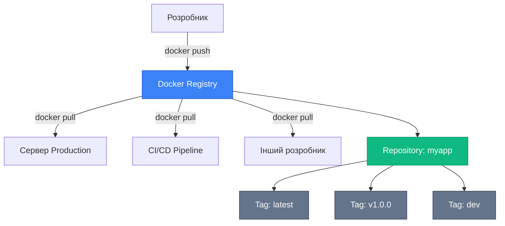

# Реєстри Docker-образів

## Від локальних образів до глобального розповсюдження

У попередніх статтях ми навчилися створювати Docker-образи, оптимізувати їх розмір та швидкість збірки. Але всі ці образи існували лише на вашому локальному комп'ютері. У реальних проєктах образи потрібно **розповсюджувати**: передавати колегам, розгортати на серверах, використовувати в CI/CD pipeline, публікувати для спільноти.

Саме для цього існують **Docker-реєстри** (Docker Registries) — централізовані сховища для зберігання та розповсюдження Docker-образів. Це аналог NuGet для .NET пакетів, npm для JavaScript, або Maven для Java. Найпопулярніший реєстр — **Docker Hub**, але існують і інші: Microsoft Container Registry (MCR), GitHub Container Registry (GHCR), Amazon ECR, Google Container Registry, та приватні реєстри для корпоративного використання.

У цій статті ми детально розглянемо, що таке реєстри, як працює Docker Hub, що таке MCR і чому він важливий для .NET розробників, як правильно іменувати образи, як аутентифікуватися, публікувати та завантажувати образи, та як забезпечити безпеку при роботі з реєстрами.

::note
Ця стаття передбачає розуміння базових концепцій Docker-образів та Dockerfile з попередніх статей. Тут ми зосередимося на розповсюдженні образів через реєстри.

::

---

## Що таке реєстр Docker-образів?

### Визначення

**Docker Registry** — це сервіс для зберігання та розповсюдження Docker-образів. Реєстр організований у вигляді **репозиторіїв** (repositories), кожен з яких містить різні версії одного образу, позначені **тегами** (tags).

**Аналогія з NuGet:**

| Концепція | NuGet | Docker Registry |
| :--- | :--- | :--- |
| Сховище | nuget.org | Docker Hub |
| Пакет | `Newtonsoft.Json` | `nginx` |
| Версія | `13.0.3` | `1.25.3` |
| Повна адреса | `Newtonsoft.Json@13.0.3` | `nginx:1.25.3` |

### Архітектура реєстру

::mermaid



::

### Типи реєстрів

**1. Публічні реєстри:**

- **Docker Hub** — найбільший публічний реєстр (мільйони образів)
- **Microsoft Container Registry (MCR)** — офіційні образи Microsoft (.NET, SQL Server, Azure)
- **GitHub Container Registry (GHCR)** — інтеграція з GitHub
- **Quay.io** — реєстр від Red Hat

**2. Приватні реєстри:**

- **Docker Hub Private Repositories** — приватні репозиторії на Docker Hub
- **Amazon ECR** — Elastic Container Registry від AWS
- **Google Container Registry (GCR)** — реєстр від Google Cloud
- **Azure Container Registry (ACR)** — реєстр від Microsoft Azure
- **Self-hosted Registry** — власний реєстр на вашій інфраструктурі

### Навіщо потрібні реєстри?

**Розповсюдження:**

- Передача образів між розробниками
- Розгортання на production серверах
- Використання в CI/CD pipeline

**Версіонування:**

- Зберігання різних версій образу (v1.0.0, v1.1.0, v2.0.0)
- Rollback до попередніх версій при проблемах
- Тестування різних версій паралельно

**Централізація:**

- Єдине джерело правди для образів
- Контроль доступу та аудит
- Сканування вразливостей

**Оптимізація:**

- Реєстри кешують шари образів
- Завантажуються лише змінені шари (економія трафіку)
- Географічно розподілені CDN для швидкого завантаження

::tip
Реєстри Docker працюють на основі **OCI (Open Container Initiative)** стандарту, тому образи сумісні між різними реєстрами. Ви можете завантажити образ з Docker Hub та завантажити його в Azure Container Registry без змін.

::

---

## Docker Hub: найбільший публічний реєстр

### Що таке Docker Hub?

**Docker Hub** (hub.docker.com) — це офіційний публічний реєстр Docker, який містить:

- **Офіційні образи** (Official Images) — перевірені Docker Inc. образи (nginx, postgres, redis)
- **Verified Publishers** — образи від перевірених компаній (Microsoft, Oracle, MongoDB)
- **Community Images** — образи від спільноти (будь-хто може опублікувати)

**Статистика (2026):**

- 15+ мільйонів репозиторіїв
- 100+ мільярдів завантажень образів
- 10+ мільйонів розробників

### Офіційні образи (Official Images)

Офіційні образи — це курировані образи, які підтримуються Docker Inc. та спільнотою. Вони позначені значком **"Official Image"** на Docker Hub.

**Приклади:**

- `nginx` — веб-сервер
- `postgres` — база даних PostgreSQL
- `redis` — in-memory база даних
- `node` — Node.js runtime
- `python` — Python runtime
- `ubuntu` — операційна система Ubuntu

**Переваги офіційних образів:**

- ✅ Регулярні оновлення безпеки
- ✅ Детальна документація
- ✅ Оптимізовані за розміром та продуктивністю
- ✅ Підтримка спільноти

**Завантаження офіційного образу:**

```bash
# Повна адреса (рідко використовується)
docker pull docker.io/library/nginx:latest

# Скорочена адреса (стандарт)
docker pull nginx:latest

# Без тегу (автоматично :latest)
docker pull nginx
```

::note
Коли ви пишете `docker pull nginx`, Docker автоматично розширює це до `docker.io/library/nginx:latest`. `docker.io` — це адреса Docker Hub, `library` — namespace для офіційних образів.

::

### Verified Publishers

Verified Publishers — це образи від перевірених компаній, які пройшли сертифікацію Docker Inc.

**Приклади:**

- `mcr.microsoft.com/dotnet/sdk` — .NET SDK від Microsoft
- `mcr.microsoft.com/mssql/server` — SQL Server від Microsoft
- `mongo` — MongoDB від MongoDB Inc.
- `mysql` — MySQL від Oracle

**Відмінності від офіційних образів:**

| Характеристика | Official Images | Verified Publishers |
| :--- | :--- | :--- |
| Хто підтримує | Docker Inc. + спільнота | Компанія-власник |
| Namespace | `library/` | Власний (напр. `microsoft/`) |
| Сертифікація | Docker Inc. | Docker Inc. |
| Приклад | `nginx` | `mcr.microsoft.com/dotnet/sdk` |

### Community Images

Community Images — це образи, опубліковані будь-яким користувачем Docker Hub. Вони не проходять перевірку Docker Inc.

**Формат іменування:**

```
username/repository:tag
```

**Приклади:**

- `arakviel/myapp:latest` — ваш особистий образ
- `bitnami/postgresql:15` — PostgreSQL від Bitnami
- `linuxserver/plex:latest` — Plex Media Server від LinuxServer.io

::warning
**Безпека Community Images:** Завантажуйте образи лише від довірених авторів. Community Images можуть містити вразливості або зловмисний код. Завжди перевіряйте:

- Кількість завантажень (популярні образи безпечніші)
- Дату останнього оновлення (застарілі образи небезпечні)
- Наявність Dockerfile (прозорість)
- Відгуки та рейтинг

::

### Структура Docker Hub

**Репозиторій (Repository):**

Репозиторій — це колекція образів з однією назвою, але різними тегами.

**Приклад: репозиторій `nginx`**

```
nginx:latest          # Остання стабільна версія
nginx:1.25.3          # Конкретна версія
nginx:1.25.3-alpine   # Версія на базі Alpine Linux
nginx:stable          # Стабільна гілка
nginx:mainline        # Розробницька гілка
```

**Теги (Tags):**

Теги — це мітки для різних версій образу в одному репозиторії.

**Типові теги:**

- `latest` — остання версія (за замовчуванням)
- `1.25.3` — конкретна версія (Semantic Versioning)
- `1.25` — мінорна версія (автоматично оновлюється до 1.25.x)
- `1` — мажорна версія (автоматично оновлюється до 1.x.x)
- `alpine` — варіант на базі Alpine Linux
- `slim` — мінімізована версія
- `dev` — розробницька версія

::caution
**Небезпека тегу `latest`:** Тег `latest` не означає "найновіша версія". Це просто тег за замовчуванням, який може вказувати на будь-яку версію. Для production завжди використовуйте конкретні версії (напр. `nginx:1.25.3`), щоб уникнути несподіваних оновлень.

::

---

## Microsoft Container Registry (MCR)

### Що таке MCR?

**Microsoft Container Registry** (mcr.microsoft.com) — це офіційний реєстр Microsoft для розповсюдження образів продуктів Microsoft. MCR є **публічним** реєстром (не потрібна аутентифікація для завантаження), але образи публікуються виключно Microsoft.

**Чому MCR, а не Docker Hub?**

До 2019 року Microsoft публікував образи на Docker Hub (напр. `microsoft/dotnet`). Але з 2019 року всі офіційні образи Microsoft перенесені на MCR з наступних причин:

- **Контроль якості** — Microsoft повністю контролює інфраструктуру
- **Продуктивність** — глобальна CDN для швидкого завантаження
- **Безпека** — сканування вразливостей перед публікацією
- **Надійність** — SLA 99.9% uptime

::note
Старі образи на Docker Hub (`microsoft/dotnet`, `microsoft/aspnetcore`) **застарілі** та більше не оновлюються. Завжди використовуйте образи з MCR (`mcr.microsoft.com/dotnet/*`).

::

### Основні образи .NET на MCR

**1. .NET SDK** — для збірки додатків

```bash
# .NET 8.0 SDK (повна версія)
docker pull mcr.microsoft.com/dotnet/sdk:8.0

# .NET 8.0 SDK на Alpine Linux (мінімальний розмір)
docker pull mcr.microsoft.com/dotnet/sdk:8.0-alpine

# Конкретна версія
docker pull mcr.microsoft.com/dotnet/sdk:8.0.3
```

**Розмір:** ~700 МБ (Debian), ~500 МБ (Alpine)

**Використання:** Збірка, тестування, розробка

**2. .NET Runtime** — для запуску консольних додатків

```bash
# .NET 8.0 Runtime
docker pull mcr.microsoft.com/dotnet/runtime:8.0

# .NET 8.0 Runtime на Alpine
docker pull mcr.microsoft.com/dotnet/runtime:8.0-alpine
```

**Розмір:** ~190 МБ (Debian), ~110 МБ (Alpine)

**Використання:** Консольні додатки, worker services

**3. ASP.NET Core Runtime** — для запуску веб-додатків

```bash
# ASP.NET Core 8.0 Runtime
docker pull mcr.microsoft.com/dotnet/aspnet:8.0

# ASP.NET Core 8.0 на Alpine
docker pull mcr.microsoft.com/dotnet/aspnet:8.0-alpine
```

**Розмір:** ~210 МБ (Debian), ~120 МБ (Alpine)

**Використання:** Web API, MVC, Blazor Server

**4. .NET Runtime Dependencies** — мінімальний образ

```bash
# Лише залежності для self-contained додатків
docker pull mcr.microsoft.com/dotnet/runtime-deps:8.0-alpine
```

**Розмір:** ~15 МБ (Alpine)

**Використання:** Self-contained додатки з AOT compilation

### Порівняння .NET образів

| Образ | Розмір | Містить | Використання |
| :--- | :--- | :--- | :--- |
| `dotnet/sdk:8.0` | ~700 МБ | SDK + Runtime + ASP.NET | Збірка, розробка |
| `dotnet/aspnet:8.0` | ~210 МБ | ASP.NET Runtime + .NET Runtime | Web додатки |
| `dotnet/runtime:8.0` | ~190 МБ | .NET Runtime | Консольні додатки |
| `dotnet/runtime-deps:8.0` | ~110 МБ | Лише системні залежності | Self-contained |
| `dotnet/runtime-deps:8.0-alpine` | ~15 МБ | Мінімальні залежності | Self-contained + AOT |

::tip
**Правило вибору образу для .NET:**

- **Збірка (multi-stage):** `dotnet/sdk:8.0`
- **Production Web API/MVC:** `dotnet/aspnet:8.0-alpine`
- **Production Console App:** `dotnet/runtime:8.0-alpine`
- **Production Self-Contained:** `dotnet/runtime-deps:8.0-alpine`

::

### Інші продукти Microsoft на MCR

**SQL Server:**

```bash
# SQL Server 2022 для Linux
docker pull mcr.microsoft.com/mssql/server:2022-latest
```

**PowerShell:**

```bash
# PowerShell Core
docker pull mcr.microsoft.com/powershell:latest
```

**Azure CLI:**

```bash
# Azure Command-Line Interface
docker pull mcr.microsoft.com/azure-cli:latest
```

**Windows Server Core:**

```bash
# Windows Server Core (лише для Windows containers)
docker pull mcr.microsoft.com/windows/servercore:ltsc2022
```

### Документація та підтримка

**Офіційна документація:**

- Каталог образів: https://mcr.microsoft.com/catalog
- .NET образи: https://hub.docker.com/_/microsoft-dotnet
- Dockerfile'и: https://github.com/dotnet/dotnet-docker

**Підтримка:**

- GitHub Issues: https://github.com/dotnet/dotnet-docker/issues
- Stack Overflow: тег `docker` + `.net`
- Microsoft Docs: https://learn.microsoft.com/dotnet/core/docker/

---

## Іменування Docker-образів

### Повна анатомія імені образу

Повне ім'я Docker-образу складається з кількох частин:

```
[registry]/[namespace]/[repository]:[tag]@[digest]
```

**Приклади:**

```bash
# Повна адреса
mcr.microsoft.com/dotnet/sdk:8.0@sha256:abc123...

# Без digest (найчастіше)
mcr.microsoft.com/dotnet/sdk:8.0

# Без тегу (автоматично :latest)
mcr.microsoft.com/dotnet/sdk

# Без registry (автоматично docker.io)
nginx:1.25.3

# Мінімальна форма (docker.io/library/nginx:latest)
nginx
```

### Компоненти імені

**1. Registry (реєстр)**

Адреса реєстру, де зберігається образ.

```
docker.io              # Docker Hub (за замовчуванням)
mcr.microsoft.com      # Microsoft Container Registry
ghcr.io                # GitHub Container Registry
gcr.io                 # Google Container Registry
quay.io                # Quay.io від Red Hat
localhost:5000         # Локальний приватний реєстр
```

**Якщо registry не вказано, Docker використовує `docker.io` за замовчуванням.**

**2. Namespace (простір імен)**

Організація або користувач, який володіє образом.

```
library/               # Офіційні образи Docker Hub (можна опустити)
microsoft/             # Namespace Microsoft на Docker Hub (застарілий)
arakviel/              # Ваш особистий namespace
mycompany/             # Namespace вашої компанії
```

**Для офіційних образів Docker Hub namespace `library/` можна опустити:**

```bash
docker pull nginx
# Еквівалентно: docker pull docker.io/library/nginx:latest
```

**3. Repository (репозиторій)**

Назва образу (проєкту, додатку, сервісу).

```
nginx                  # Веб-сервер Nginx
postgres               # База даних PostgreSQL
myapp                  # Ваш додаток
api-gateway            # API Gateway вашої компанії
```

**4. Tag (тег)**

Версія або варіант образу.

```
latest                 # За замовчуванням
8.0                    # Мажорна версія
8.0.3                  # Повна версія (Semantic Versioning)
8.0-alpine             # Варіант на Alpine Linux
dev                    # Розробницька версія
v1.2.3                 # Версія з префіксом v
20240414               # Версія за датою
```

**Якщо тег не вказано, Docker використовує `latest` за замовчуванням.**

**5. Digest (хеш)**

SHA256 хеш образу для гарантованої ідентифікації.

```
sha256:abc123def456...
```

**Digest гарантує, що ви завантажите точно той самий образ, навіть якщо тег змінився.**

### Правила іменування

**Допустимі символи:**

- Lowercase літери: `a-z`
- Цифри: `0-9`
- Спеціальні символи: `-`, `_`, `.`, `/`

**Недопустимі символи:**

- Uppercase літери: `A-Z` (автоматично конвертуються в lowercase)
- Пробіли
- Спеціальні символи: `@`, `#`, `$`, `%`, тощо (крім `/` для namespace)

**Приклади:**

```bash
# ✅ Правильно
myapp
my-app
my_app
my.app
mycompany/myapp
mycompany/my-api-gateway

# ❌ Неправильно
MyApp              # Uppercase (буде конвертовано в myapp)
my app             # Пробіл
my@app             # Недопустимий символ
```

### Стратегії тегування

**1. Semantic Versioning (рекомендовано для production)**

```bash
myapp:1.0.0        # Повна версія
myapp:1.0          # Мінорна версія (автоматично оновлюється до 1.0.x)
myapp:1            # Мажорна версія (автоматично оновлюється до 1.x.x)
```

**2. Git-based (для CI/CD)**

```bash
myapp:main         # Гілка main
myapp:develop      # Гілка develop
myapp:feature-123  # Feature branch
myapp:abc123       # Git commit SHA (короткий)
myapp:abc123def456 # Git commit SHA (повний)
```

**3. Date-based (для щоденних збірок)**

```bash
myapp:20260414     # Дата (YYYYMMDD)
myapp:2026-04-14   # Дата з дефісами
myapp:2026.04.14   # Дата з крапками
```

**4. Environment-based (для різних середовищ)**

```bash
myapp:dev          # Development
myapp:staging      # Staging
myapp:prod         # Production
myapp:latest       # Остання версія (не рекомендовано для production)
```

**5. Комбінований підхід (найкраща практика)**

```bash
myapp:1.0.0-alpine           # Версія + варіант
myapp:1.0.0-dev              # Версія + середовище
myapp:v1.0.0-20260414        # Версія + дата
myapp:1.0.0-abc123           # Версія + Git SHA
```

::warning
**Уникайте тегу `latest` для production!** Тег `latest` не гарантує стабільності та може змінюватися без попередження. Завжди використовуйте конкретні версії (напр. `myapp:1.0.0`) для production розгортань.

::

---

## Робота з реєстрами: аутентифікація та публікація

### Аутентифікація: `docker login`

Перед публікацією образів у приватний реєстр або приватний репозиторій на Docker Hub потрібно аутентифікуватися.

**Синтаксис:**

```bash
docker login [OPTIONS] [SERVER]
```

**Приклади:**

::code-group

```bash [Docker Hub]
# Аутентифікація на Docker Hub
docker login

# Вивід:
# Username: arakviel
# Password: ********
# Login Succeeded
```

```bash [MCR (не потрібна)]
# MCR — публічний реєстр, аутентифікація не потрібна для pull
docker pull mcr.microsoft.com/dotnet/sdk:8.0
```

```bash [GitHub Container Registry]
# Аутентифікація на GHCR
docker login ghcr.io

# Username: ваш GitHub username
# Password: GitHub Personal Access Token (PAT)
```

```bash [Azure Container Registry]
# Аутентифікація на ACR
docker login myregistry.azurecr.io

# Username: з Azure Portal
# Password: з Azure Portal
```

::

**Опції:**

```bash
# Передати username через параметр
docker login -u arakviel

# Передати password через stdin (безпечніше для CI/CD)
echo $DOCKER_PASSWORD | docker login -u arakviel --password-stdin

# Вказати конкретний реєстр
docker login ghcr.io -u arakviel
```

**Де зберігаються credentials?**

```bash
# Linux/macOS
~/.docker/config.json

# Windows
%USERPROFILE%\.docker\config.json
```

**Приклад `config.json`:**

```json
{
  "auths": {
    "https://index.docker.io/v1/": {
      "auth": "YXJha3ZpZWw6cGFzc3dvcmQ="
    },
    "ghcr.io": {
      "auth": "Z2l0aHVidXNlcjp0b2tlbg=="
    }
  }
}
```

::caution
**Безпека credentials:** Файл `config.json` містить закодовані (base64) credentials. Це **не шифрування**, а лише кодування. Не діліться цим файлом та не комітьте його в Git. Для production використовуйте Docker Credential Helpers або секрети CI/CD.

::

**Вихід з реєстру:**

```bash
# Вийти з Docker Hub
docker logout

# Вийти з конкретного реєстру
docker logout ghcr.io
```

### Тегування образів: `docker tag`

Перед публікацією образу потрібно присвоїти йому правильне ім'я, яке включає адресу реєстру та ваш namespace.

**Синтаксис:**

```bash
docker tag SOURCE_IMAGE[:TAG] TARGET_IMAGE[:TAG]
```

**Приклад: підготовка образу для Docker Hub**

```bash
# Крок 1: Збудувати образ локально
docker build -t myapp .

# Локальне ім'я: myapp:latest

# Крок 2: Перетегувати для Docker Hub
docker tag myapp:latest arakviel/myapp:latest
docker tag myapp:latest arakviel/myapp:1.0.0

# Тепер у вас 3 образи (насправді це один образ з 3 іменами):
# - myapp:latest
# - arakviel/myapp:latest
# - arakviel/myapp:1.0.0
```

**Перевірка:**

```bash
docker images | grep myapp
```

Вивід:

```
myapp                  latest    abc123def456   2 minutes ago   210MB
arakviel/myapp         latest    abc123def456   2 minutes ago   210MB
arakviel/myapp         1.0.0     abc123def456   2 minutes ago   210MB
```

::note
`docker tag` **не копіює** образ, а лише створює нове ім'я (alias) для існуючого образу. Всі три імені вказують на той самий образ (однаковий IMAGE ID: `abc123def456`).

::

**Множинне тегування:**

```bash
# Створити кілька тегів одразу
docker tag myapp:latest arakviel/myapp:latest
docker tag myapp:latest arakviel/myapp:1.0.0
docker tag myapp:latest arakviel/myapp:1.0
docker tag myapp:latest arakviel/myapp:1
```

**Тегування для різних реєстрів:**

```bash
# Docker Hub
docker tag myapp:latest arakviel/myapp:1.0.0

# GitHub Container Registry
docker tag myapp:latest ghcr.io/arakviel/myapp:1.0.0

# Azure Container Registry
docker tag myapp:latest myregistry.azurecr.io/myapp:1.0.0
```

### Публікація образів: `docker push`

Після тегування образ можна опублікувати в реєстр.

**Синтаксис:**

```bash
docker push [OPTIONS] NAME[:TAG]
```

**Приклад: публікація на Docker Hub**

::steps

### Крок 1: Аутентифікація

```bash
docker login
```

### Крок 2: Збірка образу

```bash
docker build -t myapp .
```

### Крок 3: Тегування

```bash
docker tag myapp:latest arakviel/myapp:1.0.0
docker tag myapp:latest arakviel/myapp:latest
```

### Крок 4: Публікація

```bash
docker push arakviel/myapp:1.0.0
docker push arakviel/myapp:latest
```

::

**Вивід `docker push`:**

```
The push refers to repository [docker.io/arakviel/myapp]
5f70bf18a086: Pushed
d0e91e46e4f8: Pushed
1.0.0: digest: sha256:abc123def456... size: 1234
```

**Що відбувається при push:**

1. Docker аналізує шари образу
2. Перевіряє, які шари вже є в реєстрі
3. Завантажує лише **нові або змінені** шари
4. Створює manifest (опис образу)
5. Повертає digest (SHA256 хеш образу)

::tip
**Оптимізація push:** Docker завантажує лише нові шари. Якщо ви публікуєте нову версію образу, яка відрізняється лише одним шаром, завантажиться лише цей шар. Це економить час та трафік.

::

**Публікація всіх тегів:**

```bash
# Опублікувати всі теги репозиторію
docker push arakviel/myapp --all-tags
```

**Публікація в інші реєстри:**

```bash
# GitHub Container Registry
docker push ghcr.io/arakviel/myapp:1.0.0

# Azure Container Registry
docker push myregistry.azurecr.io/myapp:1.0.0

# Приватний реєстр
docker push localhost:5000/myapp:1.0.0
```

### Завантаження образів: `docker pull`

Завантаження образу з реєстру.

**Синтаксис:**

```bash
docker pull [OPTIONS] NAME[:TAG|@DIGEST]
```

**Приклади:**

```bash
# Завантажити останню версію
docker pull arakviel/myapp:latest

# Завантажити конкретну версію
docker pull arakviel/myapp:1.0.0

# Завантажити за digest (гарантована ідентичність)
docker pull arakviel/myapp@sha256:abc123def456...

# Завантажити з іншого реєстру
docker pull ghcr.io/arakviel/myapp:1.0.0
```

**Що відбувається при pull:**

1. Docker перевіряє, чи є образ локально
2. Якщо немає — завантажує manifest з реєстру
3. Перевіряє, які шари вже є локально
4. Завантажує лише **відсутні** шари
5. Збирає образ з шарів

**Вивід `docker pull`:**

```
1.0.0: Pulling from arakviel/myapp
5f70bf18a086: Already exists
d0e91e46e4f8: Pull complete
Digest: sha256:abc123def456...
Status: Downloaded newer image for arakviel/myapp:1.0.0
docker.io/arakviel/myapp:1.0.0
```

**Примусове завантаження:**

```bash
# Завантажити образ, навіть якщо він вже є локально
docker pull arakviel/myapp:latest --platform linux/amd64
```

### Повний workflow: від збірки до публікації

**Сценарій:** Опублікувати .NET Web API на Docker Hub

::steps

### Крок 1: Створити Dockerfile

```dockerfile
# syntax=docker/dockerfile:1

FROM mcr.microsoft.com/dotnet/sdk:8.0 AS build
WORKDIR /src
COPY ["MyApp.csproj", "."]
RUN dotnet restore
COPY . .
RUN dotnet publish -c Release -o /app/publish

FROM mcr.microsoft.com/dotnet/aspnet:8.0-alpine
WORKDIR /app
COPY --from=build /app/publish .
ENTRYPOINT ["dotnet", "MyApp.dll"]
```

### Крок 2: Збудувати образ

```bash
docker build -t myapp .
```

### Крок 3: Протестувати локально

```bash
docker run -p 8080:8080 myapp
curl http://localhost:8080/health
```

### Крок 4: Аутентифікуватися на Docker Hub

```bash
docker login
```

### Крок 5: Перетегувати образ

```bash
docker tag myapp:latest arakviel/myapp:1.0.0
docker tag myapp:latest arakviel/myapp:latest
```

### Крок 6: Опублікувати

```bash
docker push arakviel/myapp:1.0.0
docker push arakviel/myapp:latest
```

### Крок 7: Перевірити на Docker Hub

Відкрийте https://hub.docker.com/r/arakviel/myapp

::

**Результат:**

- Образ доступний для завантаження: `docker pull arakviel/myapp:1.0.0`
- Можна використовувати на будь-якому сервері
- Можна інтегрувати в CI/CD pipeline

---

## Безпека Docker-образів

### Довіра до образів

Не всі образи на Docker Hub безпечні. Перед використанням образу перевірте:

**1. Джерело образу**

- ✅ **Official Images** — найбезпечніші (nginx, postgres, redis)
- ✅ **Verified Publishers** — перевірені компанії (Microsoft, MongoDB, Oracle)
- ⚠️ **Community Images** — перевіряйте автора та репутацію

**2. Популярність**

```
arakviel/myapp
10M+ downloads    ✅ Популярний (ймовірно безпечний)
100 downloads     ⚠️ Непопулярний (перевірте код)
```

**3. Дата оновлення**

```
Last updated: 2 days ago       ✅ Активно підтримується
Last updated: 2 years ago      ❌ Застарілий (вразливості)
```

**4. Наявність Dockerfile**

- ✅ Dockerfile доступний на GitHub — можна перевірити код
- ❌ Dockerfile відсутній — непрозорий образ

**5. Відгуки та рейтинг**

- Перевірте коментарі на Docker Hub
- Шукайте issues на GitHub
- Перевірте Security Advisories

::warning
**Ніколи не використовуйте образи з невідомих джерел для production!** Зловмисники можуть вбудувати backdoor, malware або криптомайнери в образи. Завжди перевіряйте джерело та репутацію автора.

::

### Сканування вразливостей: `docker scout`

Docker Scout — вбудований інструмент для сканування вразливостей в образах.

**Увімкнення Docker Scout:**

```bash
# Docker Scout увімкнений за замовчуванням у Docker Desktop 4.17+
docker scout version
```

**Сканування образу:**

```bash
# Сканувати локальний образ
docker scout cves myapp:latest

# Сканувати образ з реєстру
docker scout cves arakviel/myapp:1.0.0
```

**Вивід:**

```
✓ Image stored for indexing
✓ Indexed 150 packages

Overview:

                    │           Analyzed Image
────────────────────┼─────────────────────────────
  Target            │  myapp:latest
    digest          │  abc123def456
    platform        │ linux/amd64
    vulnerabilities │    2C     5H     8M     3L
    size            │ 210 MB
    packages        │ 150

Packages and Vulnerabilities:

   0C     1H     0M     0L  openssl 3.0.2-0ubuntu1.10
pkg:deb/ubuntu/openssl@3.0.2-0ubuntu1.10

    ✗ HIGH CVE-2023-12345
      https://scout.docker.com/v/CVE-2023-12345
```

**Рекомендації:**

```bash
# Отримати рекомендації щодо виправлення
docker scout recommendations myapp:latest
```

**Порівняння версій:**

```bash
# Порівняти дві версії образу
docker scout compare myapp:1.0.0 --to myapp:1.1.0
```

::tip
Інтегруйте `docker scout` у CI/CD pipeline, щоб автоматично сканувати образи перед публікацією. Це допоможе виявити вразливості на ранніх етапах розробки.

::

### Альтернативні інструменти сканування

**1. Trivy (від Aqua Security)**

```bash
# Встановлення (macOS)
brew install trivy

# Сканування образу
trivy image myapp:latest

# Сканування з фільтрацією за severity
trivy image --severity HIGH,CRITICAL myapp:latest

# Експорт у JSON
trivy image -f json -o report.json myapp:latest
```

**2. Snyk**

```bash
# Встановлення
npm install -g snyk

# Аутентифікація
snyk auth

# Сканування образу
snyk container test myapp:latest
```

**3. Grype (від Anchore)**

```bash
# Встановлення (macOS)
brew install grype

# Сканування образу
grype myapp:latest
```

### Content Trust: підписування образів

Docker Content Trust (DCT) дозволяє підписувати образи для гарантії їх автентичності.

**Увімкнення Content Trust:**

```bash
# Увімкнути для всіх операцій
export DOCKER_CONTENT_TRUST=1

# Тепер docker pull та docker push перевірятимуть підписи
docker pull nginx:latest
```

**Підписування образу при публікації:**

```bash
# Увімкнути Content Trust
export DOCKER_CONTENT_TRUST=1

# Публікація автоматично підпише образ
docker push arakviel/myapp:1.0.0

# Вивід:
# Signing and pushing trust metadata
# Enter passphrase for root key:
# Enter passphrase for new repository key:
```

**Перевірка підпису:**

```bash
# Завантажити лише підписані образи
export DOCKER_CONTENT_TRUST=1
docker pull arakviel/myapp:1.0.0

# Якщо образ не підписаний:
# Error: remote trust data does not exist
```

::note
Content Trust використовує **Notary** — систему підписування на основі криптографії. Підписи зберігаються окремо від образу та перевіряються при завантаженні.

::

### Найкращі практики безпеки

**1. Використовуйте офіційні базові образи**

```dockerfile
# ✅ Офіційний образ Microsoft
FROM mcr.microsoft.com/dotnet/aspnet:8.0-alpine

# ❌ Невідомий community образ
FROM randomuser/dotnet-custom:latest
```

**2. Вказуйте конкретні версії**

```dockerfile
# ✅ Конкретна версія
FROM mcr.microsoft.com/dotnet/aspnet:8.0.3-alpine

# ❌ Тег latest (може змінитися)
FROM mcr.microsoft.com/dotnet/aspnet:latest
```

**3. Мінімізуйте attack surface**

```dockerfile
# ✅ Alpine образ (мінімальний розмір)
FROM mcr.microsoft.com/dotnet/aspnet:8.0-alpine

# ✅ Distroless образ (лише runtime, без shell)
FROM gcr.io/distroless/dotnet:8
```

**4. Не запускайте від root**

```dockerfile
# ✅ Створити non-root користувача
RUN addgroup -g 1000 appuser && adduser -u 1000 -G appuser -s /bin/sh -D appuser
USER appuser
```

**5. Не зберігайте секрети в образах**

```dockerfile
# ❌ Секрети в ENV (залишаються в шарах)
ENV DATABASE_PASSWORD=mysecretpassword

# ✅ Використовуйте BuildKit secrets
RUN --mount=type=secret,id=db_password \
    cat /run/secrets/db_password > /tmp/password
```

**6. Регулярно оновлюйте базові образи**

```bash
# Перебудувати образ з оновленим базовим образом
docker build --pull -t myapp:latest .
```

**7. Сканування в CI/CD**

```yaml
# GitHub Actions приклад
- name: Scan image
  run: |
    docker scout cves myapp:latest --exit-code
```

---

## Приватні реєстри

### Коли потрібен приватний реєстр?

**Сценарії використання:**

- **Корпоративні додатки** — код не повинен бути публічним
- **Комерційні продукти** — захист інтелектуальної власності
- **Compliance** — вимоги регуляторів (GDPR, HIPAA)
- **Контроль доступу** — обмеження доступу для команди
- **Швидкість** — локальний реєстр швидше за публічний

### Типи приватних реєстрів

**1. Docker Hub Private Repositories**

```bash
# Створити приватний репозиторій на hub.docker.com
# Settings → Repositories → Create Repository → Private

# Публікація (потрібна аутентифікація)
docker push arakviel/private-app:1.0.0

# Завантаження (потрібна аутентифікація)
docker login
docker pull arakviel/private-app:1.0.0
```

**Обмеження безкоштовного плану:**

- 1 приватний репозиторій
- Необмежена кількість публічних репозиторіїв

**2. GitHub Container Registry (GHCR)**

```bash
# Аутентифікація (потрібен GitHub PAT)
echo $GITHUB_TOKEN | docker login ghcr.io -u arakviel --password-stdin

# Публікація
docker tag myapp:latest ghcr.io/arakviel/myapp:1.0.0
docker push ghcr.io/arakviel/myapp:1.0.0

# Завантаження
docker pull ghcr.io/arakviel/myapp:1.0.0
```

**Переваги:**

- ✅ Безкоштовні приватні репозиторії
- ✅ Інтеграція з GitHub Actions
- ✅ Автоматичне сканування вразливостей

**3. Azure Container Registry (ACR)**

```bash
# Створити реєстр через Azure CLI
az acr create --name myregistry --resource-group mygroup --sku Basic

# Аутентифікація
az acr login --name myregistry

# Публікація
docker tag myapp:latest myregistry.azurecr.io/myapp:1.0.0
docker push myregistry.azurecr.io/myapp:1.0.0
```

**4. Self-Hosted Registry**

Запустити власний реєстр на вашій інфраструктурі:

```bash
# Запустити реєстр локально
docker run -d -p 5000:5000 --name registry registry:2

# Публікація
docker tag myapp:latest localhost:5000/myapp:1.0.0
docker push localhost:5000/myapp:1.0.0

# Завантаження
docker pull localhost:5000/myapp:1.0.0
```

**Production-ready self-hosted registry:**

```yaml
# docker-compose.yml
version: '3.8'
services:
  registry:
    image: registry:2
    ports:
      - "5000:5000"
    environment:
      REGISTRY_STORAGE_FILESYSTEM_ROOTDIRECTORY: /data
      REGISTRY_AUTH: htpasswd
      REGISTRY_AUTH_HTPASSWD_PATH: /auth/htpasswd
      REGISTRY_AUTH_HTPASSWD_REALM: Registry Realm
    volumes:
      - ./data:/data
      - ./auth:/auth
```

---

## Практичні завдання

### Завдання 1: Публікація образу на Docker Hub

**Мета:** Створити та опублікувати .NET Web API на Docker Hub.

**Кроки:**

1. Створіть простий ASP.NET Core Web API проєкт
2. Створіть оптимізований Dockerfile (multi-stage)
3. Зберіть образ локально
4. Протестуйте образ локально
5. Зареєструйтеся на Docker Hub (якщо ще не зареєстровані)
6. Аутентифікуйтеся через `docker login`
7. Перетегуйте образ з вашим Docker Hub username
8. Опублікуйте образ з тегами `latest` та `1.0.0`
9. Перевірте образ на Docker Hub
10. Завантажте образ на іншому комп'ютері або видаліть локально та завантажте знову

**Очікуваний результат:** Образ доступний за адресою `docker pull yourusername/myapp:1.0.0`

### Завдання 2: Порівняння розмірів образів MCR

**Мета:** Дослідити різницю між різними варіантами .NET образів.

**Кроки:**

1. Завантажте наступні образи:
   - `mcr.microsoft.com/dotnet/sdk:8.0`
   - `mcr.microsoft.com/dotnet/aspnet:8.0`
   - `mcr.microsoft.com/dotnet/aspnet:8.0-alpine`
   - `mcr.microsoft.com/dotnet/runtime:8.0-alpine`
2. Порівняйте розміри через `docker images`
3. Створіть таблицю порівняння
4. Зробіть висновок, який образ використовувати для production

**Питання для аналізу:**

- Яка різниця в розмірі між Debian та Alpine варіантами?
- Чому SDK образ такий великий?
- Який образ оптимальний для Web API?

### Завдання 3: Сканування вразливостей

**Мета:** Навчитися виявляти вразливості в образах.

**Кроки:**

1. Створіть Dockerfile на базі застарілого образу (напр. `ubuntu:18.04`)
2. Зберіть образ
3. Проскануйте образ через `docker scout cves`
4. Проаналізуйте знайдені вразливості
5. Оновіть базовий образ до актуальної версії
6. Проскануйте знову та порівняйте результати

**Очікуваний результат:** Кількість вразливостей зменшиться після оновлення базового образу.

### Завдання 4: Стратегії тегування

**Мета:** Розробити стратегію тегування для вашого проєкту.

**Кроки:**

1. Створіть образ вашого додатку
2. Застосуйте різні стратегії тегування:
   - Semantic Versioning: `1.0.0`, `1.0`, `1`
   - Git-based: `main`, `abc123` (commit SHA)
   - Date-based: `20260414`
   - Environment-based: `dev`, `staging`, `prod`
3. Опублікуйте всі варіанти
4. Перевірте на Docker Hub

**Питання для аналізу:**

- Яка стратегія найкраща для production?
- Як автоматизувати тегування в CI/CD?
- Чи потрібен тег `latest`?

---

## Резюме

У цій статті ми детально розглянули реєстри Docker-образів та роботу з ними:

**Реєстри:**

- Реєстр — це централізоване сховище для Docker-образів
- Docker Hub — найбільший публічний реєстр (15M+ репозиторіїв)
- MCR — офіційний реєстр Microsoft для .NET та інших продуктів
- Приватні реєстри — для корпоративних та комерційних додатків

**Docker Hub:**

- Офіційні образи — курировані Docker Inc. (nginx, postgres)
- Verified Publishers — перевірені компанії (Microsoft, MongoDB)
- Community Images — образи від спільноти (перевіряйте безпеку!)

**Microsoft Container Registry:**

- `mcr.microsoft.com/dotnet/sdk` — для збірки
- `mcr.microsoft.com/dotnet/aspnet` — для Web API
- `mcr.microsoft.com/dotnet/runtime` — для консольних додатків
- Alpine варіанти — мінімальний розмір (економія 50-70%)

**Іменування образів:**

- Повний формат: `registry/namespace/repository:tag@digest`
- Скорочений формат: `nginx:1.25.3` (автоматично `docker.io/library/nginx:1.25.3`)
- Стратегії тегування: Semantic Versioning, Git-based, Date-based

**Робота з реєстрами:**

- `docker login` — аутентифікація в реєстрі
- `docker tag` — перетегування образу (створення alias)
- `docker push` — публікація образу (завантажуються лише нові шари)
- `docker pull` — завантаження образу (завантажуються лише відсутні шари)

**Безпека:**

- Перевіряйте джерело образів (Official > Verified > Community)
- Сканування вразливостей: `docker scout`, Trivy, Snyk
- Content Trust — підписування образів для автентичності
- Найкращі практики: конкретні версії, non-root user, мінімальні образи

::tip
**Золоте правило публікації:** Завжди використовуйте конкретні версії для production (`myapp:1.0.0`), а не `latest`. Публікуйте кілька тегів одночасно: повну версію (`1.0.0`), мінорну (`1.0`), мажорну (`1`) та `latest` для зручності розробників.

::

