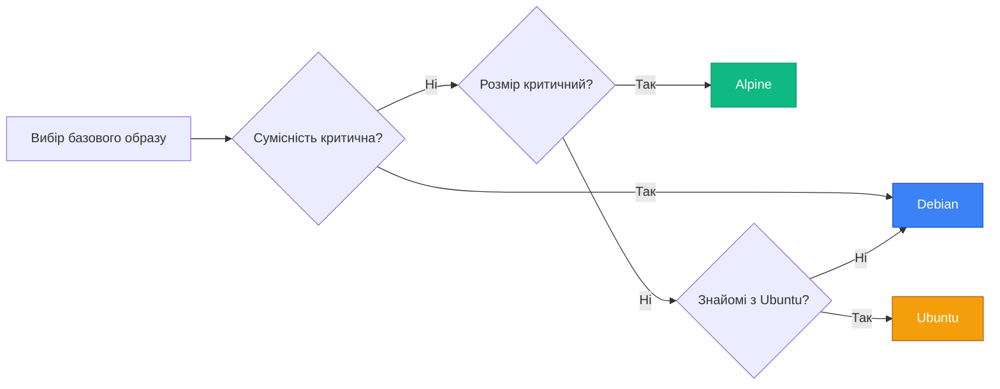

# Контейнеризація .NET додатків

## Від теорії до практики: запакуйте ваш C# код

У попередніх статтях ми вивчили фундаментальні концепції Docker: образи, контейнери, Dockerfile, кешування, реєстри. Ми розглядали приклади на різних технологіях, але тепер настав час зосередитися на тому, що найбільше цікавить .NET розробників — **контейнеризація C# додатків**.

Microsoft активно підтримує Docker та контейнеризацію .NET. Офіційні образи .NET на Microsoft Container Registry (MCR) оптимізовані, регулярно оновлюються та покривають всі сценарії: від розробки до production. У 2026 році контейнеризація .NET додатків — це не екзотика, а стандартна практика для розгортання на серверах, хмарних платформах (Azure, AWS, GCP) та Kubernetes кластерах.

У цій статті ми пройдемо повний цикл контейнеризації .NET додатків: від найпростішої консольної програми до повноцінного ASP.NET Core Web API з Swagger, health checks та production-ready конфігурацією. Ви навчитеся вибирати правильні базові образи, оптимізувати Dockerfile для швидкої збірки та мінімального розміру, налаштовувати порти та змінні оточення, та застосовувати найкращі практики безпеки.

::note
Ця стаття передбачає базове розуміння C# та .NET, а також знання основ Docker з попередніх статей. Всі приклади використовують .NET 8.0 — актуальну LTS версію станом на 2026 рік.

::

---

## Офіційні .NET образи на MCR

### Чотири типи образів

Microsoft надає чотири основні типи образів для різних сценаріїв використання:

**1. SDK (Software Development Kit)**

```bash
mcr.microsoft.com/dotnet/sdk:8.0
```

**Містить:**
- .NET SDK (компілятор, інструменти розробки)
- .NET Runtime
- ASP.NET Core Runtime
- NuGet, MSBuild, dotnet CLI

**Розмір:** ~700 МБ (Debian), ~500 МБ (Alpine)

**Використання:**
- Збірка додатків (build stage в multi-stage Dockerfile)
- Розробка в контейнері
- CI/CD pipeline

**Приклад:**

```dockerfile
FROM mcr.microsoft.com/dotnet/sdk:8.0 AS build
WORKDIR /src
COPY . .
RUN dotnet build -c Release
```

**2. ASP.NET Core Runtime**

```bash
mcr.microsoft.com/dotnet/aspnet:8.0
```

**Містить:**
- ASP.NET Core Runtime
- .NET Runtime
- Kestrel веб-сервер

**Розмір:** ~210 МБ (Debian), ~120 МБ (Alpine)

**Використання:**
- Production для Web API, MVC, Blazor Server
- Мінімальний образ для веб-додатків

**Приклад:**

```dockerfile
FROM mcr.microsoft.com/dotnet/aspnet:8.0-alpine
WORKDIR /app
COPY --from=build /app/publish .
ENTRYPOINT ["dotnet", "MyWebApi.dll"]
```

**3. .NET Runtime**

```bash
mcr.microsoft.com/dotnet/runtime:8.0
```

**Містить:**
- .NET Runtime (без ASP.NET Core)

**Розмір:** ~190 МБ (Debian), ~110 МБ (Alpine)

**Використання:**
- Консольні додатки
- Worker Services
- Background jobs

**Приклад:**

```dockerfile
FROM mcr.microsoft.com/dotnet/runtime:8.0-alpine
WORKDIR /app
COPY --from=build /app/publish .
ENTRYPOINT ["dotnet", "MyConsoleApp.dll"]
```

**4. Runtime Dependencies**

```bash
mcr.microsoft.com/dotnet/runtime-deps:8.0
```

**Містить:**
- Лише системні залежності (libc, libssl, тощо)
- Без .NET Runtime

**Розмір:** ~110 МБ (Debian), ~15 МБ (Alpine)

**Використання:**
- Self-contained додатки (з вбудованим runtime)
- AOT (Ahead-of-Time) compiled додатки
- Мінімальний розмір образу

**Приклад:**

```dockerfile
FROM mcr.microsoft.com/dotnet/runtime-deps:8.0-alpine
WORKDIR /app
COPY --from=build /app/publish .
ENTRYPOINT ["./MyApp"]
```

### Порівняльна таблиця

| Образ | Розмір (Debian) | Розмір (Alpine) | SDK | Runtime | ASP.NET | Використання |
| :--- | :--- | :--- | :---: | :---: | :---: | :--- |
| `dotnet/sdk:8.0` | ~700 МБ | ~500 МБ | ✅ | ✅ | ✅ | Збірка, розробка |
| `dotnet/aspnet:8.0` | ~210 МБ | ~120 МБ | ❌ | ✅ | ✅ | Web API, MVC |
| `dotnet/runtime:8.0` | ~190 МБ | ~110 МБ | ❌ | ✅ | ❌ | Console, Worker |
| `dotnet/runtime-deps:8.0` | ~110 МБ | ~15 МБ | ❌ | ❌ | ❌ | Self-contained |

::tip
**Правило вибору образу:**

- **Build stage:** Завжди `dotnet/sdk` (потрібен компілятор)
- **Runtime stage для Web API:** `dotnet/aspnet` (містить Kestrel)
- **Runtime stage для Console App:** `dotnet/runtime` (без ASP.NET)
- **Self-contained додатки:** `dotnet/runtime-deps` (мінімальний розмір)

::

### Версії та теги

**Формат тегів:**

```
mcr.microsoft.com/dotnet/[тип]:[версія]-[варіант]
```

**Приклади:**

```bash
# Повна версія на Debian
mcr.microsoft.com/dotnet/sdk:8.0.3

# Мінорна версія (автоматично оновлюється до 8.0.x)
mcr.microsoft.com/dotnet/sdk:8.0

# Alpine варіант (мінімальний розмір)
mcr.microsoft.com/dotnet/sdk:8.0-alpine

# Ubuntu варіант
mcr.microsoft.com/dotnet/sdk:8.0-jammy

# Конкретна версія Alpine
mcr.microsoft.com/dotnet/sdk:8.0.3-alpine3.19
```

**Рекомендації:**

- **Development:** `8.0` або `8.0-alpine` (автоматичні оновлення патчів)
- **Production:** `8.0.3-alpine` (конкретна версія для стабільності)
- **CI/CD:** `8.0` (завжди остання патч-версія)

---

## Вибір базового образу: Alpine vs Debian vs Ubuntu

### Три варіанти базових образів

Microsoft надає образи на базі трьох дистрибутивів Linux:

**1. Debian (за замовчуванням)**

```dockerfile
FROM mcr.microsoft.com/dotnet/aspnet:8.0
# Базується на Debian 12 (Bookworm)
```

**Переваги:**
- ✅ Найкраща сумісність (стандарт для більшості образів)
- ✅ Велика кількість пакетів в репозиторіях
- ✅ Стабільність та надійність
- ✅ Добра документація

**Недоліки:**
- ❌ Більший розмір (~210 МБ для aspnet)
- ❌ Більше потенційних вразливостей (більше пакетів)

**Коли використовувати:**
- Потрібна максимальна сумісність
- Використовуються нативні бібліотеки (P/Invoke)
- Немає жорстких обмежень на розмір образу

**2. Alpine Linux**

```dockerfile
FROM mcr.microsoft.com/dotnet/aspnet:8.0-alpine
# Базується на Alpine Linux 3.19
```

**Переваги:**
- ✅ Мінімальний розмір (~120 МБ для aspnet, ~15 МБ для runtime-deps)
- ✅ Менше вразливостей (мінімальний набір пакетів)
- ✅ Швидше завантаження та запуск
- ✅ Ідеально для production

**Недоліки:**
- ❌ Використовує musl libc замість glibc (можливі проблеми сумісності)
- ❌ Деякі нативні бібліотеки можуть не працювати
- ❌ Менше пакетів в репозиторіях

**Коли використовувати:**
- Production середовище (мінімальний розмір)
- Хмарні платформи (економія трафіку та storage)
- Kubernetes (швидший pull образів)
- Немає залежностей від нативних бібліотек

**3. Ubuntu**

```dockerfile
FROM mcr.microsoft.com/dotnet/aspnet:8.0-jammy
# Базується на Ubuntu 22.04 (Jammy Jellyfish)
```

**Переваги:**
- ✅ Популярний дистрибутив (знайомий багатьом)
- ✅ Велика спільнота та документація
- ✅ Добра сумісність з Ubuntu-специфічними інструментами

**Недоліки:**
- ❌ Трохи більший розмір за Debian
- ❌ Рідше оновлюється порівняно з Debian

**Коли використовувати:**
- Команда знайома з Ubuntu
- Потрібні Ubuntu-специфічні пакети
- Розгортання на Ubuntu серверах

### Порівняння розмірів

**ASP.NET Core 8.0 Runtime:**

| Варіант | Розмір | Економія |
| :--- | :--- | :--- |
| Debian (за замовчуванням) | 210 МБ | - |
| Ubuntu (jammy) | 215 МБ | -5 МБ |
| Alpine | 120 МБ | **+90 МБ (43%)** |

**Runtime Dependencies 8.0:**

| Варіант | Розмір | Економія |
| :--- | :--- | :--- |
| Debian | 110 МБ | - |
| Alpine | 15 МБ | **+95 МБ (86%)** |

::mermaid



::

### Проблеми сумісності Alpine

Alpine використовує **musl libc** замість стандартної **glibc**. Це може призвести до проблем:

**1. Нативні бібліотеки (P/Invoke)**

```csharp
// Може не працювати на Alpine
[DllImport("libnative.so")]
private static extern int NativeFunction();
```

**Рішення:** Перекомпілювати нативну бібліотеку для musl або використовувати Debian.

**2. Globalization**

```csharp
// Може працювати некоректно на Alpine
var culture = new CultureInfo("uk-UA");
var formatted = 1234.56.ToString("C", culture); // "1 234,56 ₴"
```

**Рішення:** Встановити `icu-libs` в Alpine або використовувати Invariant Mode.

```dockerfile
FROM mcr.microsoft.com/dotnet/aspnet:8.0-alpine
# Встановити ICU для підтримки локалізації
RUN apk add --no-cache icu-libs
ENV DOTNET_SYSTEM_GLOBALIZATION_INVARIANT=false
```

**3. Time Zones**

```csharp
// Може не працювати на Alpine
var kyivTime = TimeZoneInfo.FindSystemTimeZoneById("Europe/Kiev");
```

**Рішення:** Встановити `tzdata`.

```dockerfile
FROM mcr.microsoft.com/dotnet/aspnet:8.0-alpine
RUN apk add --no-cache tzdata
```

::warning
**Тестуйте на Alpine перед production!** Якщо ваш додаток використовує нативні бібліотеки, складну локалізацію або специфічні системні виклики, протестуйте його на Alpine перед розгортанням. У разі проблем використовуйте Debian.

::

### Рекомендації

**Для більшості .NET додатків:**

```dockerfile
# ✅ Рекомендовано: Alpine для production
FROM mcr.microsoft.com/dotnet/aspnet:8.0-alpine
```

**Якщо є проблеми сумісності:**

```dockerfile
# ✅ Альтернатива: Debian для максимальної сумісності
FROM mcr.microsoft.com/dotnet/aspnet:8.0
```

**Для мінімального розміру (self-contained):**

```dockerfile
# ✅ Мінімальний: Alpine runtime-deps
FROM mcr.microsoft.com/dotnet/runtime-deps:8.0-alpine
```

---

## Контейнеризація Console App

### Простий консольний додаток

Почнемо з найпростішого сценарію — консольний додаток, який виводить повідомлення.

**Структура проєкту:**

```
MyConsoleApp/
├── Program.cs
├── MyConsoleApp.csproj
└── Dockerfile
```

**Program.cs:**

```csharp
Console.WriteLine("Hello from Docker!");
Console.WriteLine($"Current time: {DateTime.Now}");
Console.WriteLine($"Environment: {Environment.GetEnvironmentVariable("DOTNET_ENVIRONMENT") ?? "Production"}");

// Симуляція роботи
await Task.Delay(2000);
Console.WriteLine("Application finished.");
```

**MyConsoleApp.csproj:**

```xml
<Project Sdk="Microsoft.NET.Sdk">
  <PropertyGroup>
    <OutputType>Exe</OutputType>
    <TargetFramework>net8.0</TargetFramework>
    <Nullable>enable</Nullable>
    <ImplicitUsings>enable</ImplicitUsings>
  </PropertyGroup>
</Project>
```

### Dockerfile: базова версія

**Dockerfile (неоптимізований):**

```dockerfile
FROM mcr.microsoft.com/dotnet/sdk:8.0

WORKDIR /app

# Копіюємо весь код
COPY . .

# Збираємо додаток
RUN dotnet build -c Release

# Запускаємо
ENTRYPOINT ["dotnet", "run", "--no-build", "-c", "Release"]
```

**Проблеми:**

- ❌ Використовує SDK образ для runtime (700 МБ замість 110 МБ)
- ❌ Копіює весь код, включно з `bin/` та `obj/`
- ❌ Не використовує multi-stage build
- ❌ Повільна збірка (немає кешування restore)

### Dockerfile: оптимізована версія (multi-stage)

**Dockerfile:**

```dockerfile
# syntax=docker/dockerfile:1

# Stage 1: Build
FROM mcr.microsoft.com/dotnet/sdk:8.0 AS build

WORKDIR /src

# Копіюємо .csproj та робимо restore (кешується окремо)
COPY ["MyConsoleApp.csproj", "."]
RUN dotnet restore

# Копіюємо решту коду
COPY . .

# Збираємо та публікуємо
RUN dotnet publish -c Release -o /app/publish

# Stage 2: Runtime
FROM mcr.microsoft.com/dotnet/runtime:8.0-alpine

WORKDIR /app

# Копіюємо лише опубліковані файли з build stage
COPY --from=build /app/publish .

# Запускаємо
ENTRYPOINT ["dotnet", "MyConsoleApp.dll"]
```

**.dockerignore:**

```
**/bin/
**/obj/
**/.vs/
**/.vscode/
**/*.user
.git/
.gitignore
README.md
```

### Збірка та запуск

::steps

### Крок 1: Збудувати образ

```bash
docker build -t myconsoleapp:1.0.0 .
```

### Крок 2: Запустити контейнер

```bash
docker run --rm myconsoleapp:1.0.0
```

### Крок 3: Перевірити вивід

```
Hello from Docker!
Current time: 14.04.2026 11:12:25
Environment: Production
Application finished.
```

::

### Передача змінних оточення

```bash
# Передати змінну оточення
docker run --rm -e DOTNET_ENVIRONMENT=Development myconsoleapp:1.0.0
```

**Вивід:**

```
Hello from Docker!
Current time: 14.04.2026 11:12:25
Environment: Development
Application finished.
```

### Порівняння розмірів

| Варіант | Розмір образу | Час збірки |
| :--- | :--- | :--- |
| Неоптимізований (SDK) | 720 МБ | 45 с |
| Multi-stage (runtime) | 195 МБ | 50 с |
| Multi-stage (runtime-alpine) | 125 МБ | 50 с |

**Економія: 595 МБ (83%)!**

### Оптимізація з BuildKit cache mounts

```dockerfile
# syntax=docker/dockerfile:1

FROM mcr.microsoft.com/dotnet/sdk:8.0 AS build

WORKDIR /src

COPY ["MyConsoleApp.csproj", "."]

# Restore з persistent NuGet cache
RUN --mount=type=cache,target=/root/.nuget/packages \
    dotnet restore

COPY . .

# Build з cache
RUN --mount=type=cache,target=/root/.nuget/packages \
    dotnet publish -c Release -o /app/publish

FROM mcr.microsoft.com/dotnet/runtime:8.0-alpine

WORKDIR /app
COPY --from=build /app/publish .

ENTRYPOINT ["dotnet", "MyConsoleApp.dll"]
```

**Переваги:**

- ✅ NuGet пакети кешуються між збірками
- ✅ Повторна збірка: 5-10 секунд замість 50

### Worker Service

Worker Service — це фоновий сервіс, який працює постійно (на відміну від консольного додатку, який завершується).

**Program.cs:**

```csharp
using Microsoft.Extensions.Hosting;

var builder = Host.CreateApplicationBuilder(args);
builder.Services.AddHostedService<Worker>();

var host = builder.Build();
await host.RunAsync();
```

**Worker.cs:**

```csharp
public class Worker : BackgroundService
{
    private readonly ILogger<Worker> _logger;

    public Worker(ILogger<Worker> logger)
    {
        _logger = logger;
    }

    protected override async Task ExecuteAsync(CancellationToken stoppingToken)
    {
        while (!stoppingToken.IsCancellationRequested)
        {
            _logger.LogInformation("Worker running at: {time}", DateTimeOffset.Now);
            await Task.Delay(5000, stoppingToken);
        }
    }
}
```

**Dockerfile (ідентичний до Console App):**

```dockerfile
# syntax=docker/dockerfile:1

FROM mcr.microsoft.com/dotnet/sdk:8.0 AS build
WORKDIR /src
COPY ["MyWorker.csproj", "."]
RUN dotnet restore
COPY . .
RUN dotnet publish -c Release -o /app/publish

FROM mcr.microsoft.com/dotnet/runtime:8.0-alpine
WORKDIR /app
COPY --from=build /app/publish .
ENTRYPOINT ["dotnet", "MyWorker.dll"]
```

**Запуск:**

```bash
docker run --rm --name myworker myworker:1.0.0
```

**Вивід (кожні 5 секунд):**

```
info: MyWorker.Worker[0]
      Worker running at: 14.04.2026 11:12:25 +00:00
info: MyWorker.Worker[0]
      Worker running at: 14.04.2026 11:12:30 +00:00
```

**Зупинка (graceful shutdown):**

```bash
docker stop myworker
# Worker отримає CancellationToken та коректно завершиться
```

---

## Контейнеризація ASP.NET Core Web API

### Створення Web API проєкту

**Структура проєкту:**

```
MyWebApi/
├── Controllers/
│   └── WeatherForecastController.cs
├── Program.cs
├── MyWebApi.csproj
├── appsettings.json
├── appsettings.Development.json
├── Dockerfile
└── .dockerignore
```

**Program.cs (мінімальний API):**

```csharp
var builder = WebApplication.CreateBuilder(args);

// Додаємо сервіси
builder.Services.AddControllers();
builder.Services.AddEndpointsApiExplorer();
builder.Services.AddSwaggerGen();

var app = builder.Build();

// Налаштовуємо HTTP pipeline
if (app.Environment.IsDevelopment())
{
    app.UseSwagger();
    app.UseSwaggerUI();
}

app.UseHttpsRedirection();
app.UseAuthorization();
app.MapControllers();

app.Run();
```

**WeatherForecastController.cs:**

```csharp
using Microsoft.AspNetCore.Mvc;

namespace MyWebApi.Controllers;

[ApiController]
[Route("[controller]")]
public class WeatherForecastController : ControllerBase
{
    private static readonly string[] Summaries = new[]
    {
        "Freezing", "Bracing", "Chilly", "Cool", "Mild", 
        "Warm", "Balmy", "Hot", "Sweltering", "Scorching"
    };

    [HttpGet(Name = "GetWeatherForecast")]
    public IEnumerable<WeatherForecast> Get()
    {
        return Enumerable.Range(1, 5).Select(index => new WeatherForecast
        {
            Date = DateOnly.FromDateTime(DateTime.Now.AddDays(index)),
            TemperatureC = Random.Shared.Next(-20, 55),
            Summary = Summaries[Random.Shared.Next(Summaries.Length)]
        })
        .ToArray();
    }
}

public record WeatherForecast(DateOnly Date, int TemperatureC, string? Summary)
{
    public int TemperatureF => 32 + (int)(TemperatureC / 0.5556);
}
```

### Dockerfile для Web API

**Dockerfile:**

```dockerfile
# syntax=docker/dockerfile:1

# Stage 1: Build
FROM mcr.microsoft.com/dotnet/sdk:8.0 AS build

WORKDIR /src

# Копіюємо .csproj та restore
COPY ["MyWebApi.csproj", "."]
RUN --mount=type=cache,target=/root/.nuget/packages \
    dotnet restore

# Копіюємо решту коду
COPY . .

# Build та publish
RUN --mount=type=cache,target=/root/.nuget/packages \
    dotnet publish -c Release -o /app/publish /p:UseAppHost=false

# Stage 2: Runtime
FROM mcr.microsoft.com/dotnet/aspnet:8.0-alpine

WORKDIR /app

# Копіюємо опубліковані файли
COPY --from=build /app/publish .

# Відкриваємо порт (документація)
EXPOSE 8080

# Запускаємо
ENTRYPOINT ["dotnet", "MyWebApi.dll"]
```

**.dockerignore:**

```
**/bin/
**/obj/
**/.vs/
**/.vscode/
**/*.user
.git/
.gitignore
README.md
Dockerfile
.dockerignore
```

### Збірка та запуск Web API

::steps

### Крок 1: Збудувати образ

```bash
docker build -t mywebapi:1.0.0 .
```

### Крок 2: Запустити контейнер

```bash
docker run -d \
  --name mywebapi \
  -p 8080:8080 \
  mywebapi:1.0.0
```

### Крок 3: Перевірити API

```bash
# Перевірити health
curl http://localhost:8080/weatherforecast

# Відкрити Swagger (якщо Development)
open http://localhost:8080/swagger
```

### Крок 4: Переглянути логи

```bash
docker logs mywebapi
```

### Крок 5: Зупинити контейнер

```bash
docker stop mywebapi
docker rm mywebapi
```

::

**Вивід API:**

```json
[
  {
    "date": "2026-04-15",
    "temperatureC": 12,
    "temperatureF": 53,
    "summary": "Cool"
  },
  {
    "date": "2026-04-16",
    "temperatureC": 25,
    "temperatureF": 76,
    "summary": "Warm"
  }
]
```

### Налаштування для різних середовищ

**Development:**

```bash
docker run -d \
  --name mywebapi-dev \
  -p 8080:8080 \
  -e ASPNETCORE_ENVIRONMENT=Development \
  mywebapi:1.0.0
```

**Production:**

```bash
docker run -d \
  --name mywebapi-prod \
  -p 8080:8080 \
  -e ASPNETCORE_ENVIRONMENT=Production \
  mywebapi:1.0.0
```

**З кастомними налаштуваннями:**

```bash
docker run -d \
  --name mywebapi \
  -p 8080:8080 \
  -e ASPNETCORE_ENVIRONMENT=Production \
  -e ConnectionStrings__DefaultConnection="Server=db;Database=mydb" \
  mywebapi:1.0.0
```

---

## Порти та Kestrel: налаштування мережі

### Kestrel веб-сервер

**Kestrel** — це вбудований веб-сервер ASP.NET Core, який працює всередині контейнера. За замовчуванням Kestrel слухає на порту **5000** (HTTP) та **5001** (HTTPS).

**Проблема в Docker:**

У контейнері Kestrel за замовчуванням слухає на `http://localhost:5000`, що означає, що він доступний лише всередині контейнера. Щоб зробити API доступним ззовні, потрібно налаштувати Kestrel слухати на `0.0.0.0` (всі мережеві інтерфейси).

### Налаштування портів через змінні оточення

**Рекомендований спосіб (ASP.NET Core 8.0+):**

```dockerfile
FROM mcr.microsoft.com/dotnet/aspnet:8.0-alpine

WORKDIR /app
COPY --from=build /app/publish .

# Налаштувати Kestrel слухати на порту 8080 на всіх інтерфейсах
ENV ASPNETCORE_URLS=http://+:8080

EXPOSE 8080

ENTRYPOINT ["dotnet", "MyWebApi.dll"]
```

**Альтернативні варіанти:**

```dockerfile
# Варіант 1: Використати 0.0.0.0 замість +
ENV ASPNETCORE_URLS=http://0.0.0.0:8080

# Варіант 2: Кілька портів (HTTP + HTTPS)
ENV ASPNETCORE_URLS=http://+:8080;https://+:8443

# Варіант 3: Через окремі змінні
ENV ASPNETCORE_HTTP_PORTS=8080
ENV ASPNETCORE_HTTPS_PORTS=8443
```

### Інструкція EXPOSE

`EXPOSE` — це **документація**, а не фактичне відкриття порту. Вона вказує, який порт використовує додаток.

```dockerfile
# Документує, що додаток слухає на порту 8080
EXPOSE 8080
```

**Важливо:** `EXPOSE` **не прокидає** порт на хост. Для цього потрібен прапорець `-p` при запуску контейнера.

### Прокидання портів: `-p` vs `-P`

**Явне прокидання (`-p`):**

```bash
# Прокинути порт 8080 контейнера на порт 8080 хоста
docker run -p 8080:8080 mywebapi:1.0.0

# Прокинути на інший порт хоста
docker run -p 3000:8080 mywebapi:1.0.0
# API доступний на http://localhost:3000

# Прокинути лише на localhost (безпечніше)
docker run -p 127.0.0.1:8080:8080 mywebapi:1.0.0

# Прокинути на випадковий порт хоста
docker run -p 8080 mywebapi:1.0.0
```

**Автоматичне прокидання (`-P`):**

```bash
# Прокинути всі EXPOSE порти на випадкові порти хоста
docker run -P mywebapi:1.0.0

# Дізнатися, який порт призначено
docker port <container_id>
# 8080/tcp -> 0.0.0.0:32768
```

### HTTPS в контейнері

Для production рекомендується використовувати зовнішній reverse proxy (Nginx, Traefik) для HTTPS. Але для розробки можна налаштувати HTTPS всередині контейнера.

**Генерація dev-сертифіката:**

```bash
# Згенерувати dev-сертифікат на хості
dotnet dev-certs https -ep ${HOME}/.aspnet/https/aspnetapp.pfx -p YourPassword
dotnet dev-certs https --trust
```

**Dockerfile з HTTPS:**

```dockerfile
FROM mcr.microsoft.com/dotnet/aspnet:8.0-alpine

WORKDIR /app
COPY --from=build /app/publish .

ENV ASPNETCORE_URLS=https://+:8443;http://+:8080
ENV ASPNETCORE_Kestrel__Certificates__Default__Path=/https/aspnetapp.pfx
ENV ASPNETCORE_Kestrel__Certificates__Default__Password=YourPassword

EXPOSE 8080 8443

ENTRYPOINT ["dotnet", "MyWebApi.dll"]
```

**Запуск з монтуванням сертифіката:**

```bash
docker run -d \
  -p 8080:8080 \
  -p 8443:8443 \
  -v ${HOME}/.aspnet/https:/https:ro \
  mywebapi:1.0.0
```

::warning
**HTTPS в production:** Не використовуйте dev-сертифікати в production! Використовуйте reverse proxy (Nginx, Traefik) з Let's Encrypt або корпоративними сертифікатами.

::

### Налаштування через appsettings.json

**appsettings.json:**

```json
{
  "Kestrel": {
    "Endpoints": {
      "Http": {
        "Url": "http://0.0.0.0:8080"
      }
    }
  },
  "Logging": {
    "LogLevel": {
      "Default": "Information",
      "Microsoft.AspNetCore": "Warning"
    }
  }
}
```

**Dockerfile:**

```dockerfile
FROM mcr.microsoft.com/dotnet/aspnet:8.0-alpine

WORKDIR /app
COPY --from=build /app/publish .

# Порт вже налаштований в appsettings.json
EXPOSE 8080

ENTRYPOINT ["dotnet", "MyWebApi.dll"]
```

::tip
**Рекомендація:** Використовуйте змінні оточення (`ASPNETCORE_URLS`) замість `appsettings.json` для налаштування портів. Це дозволяє легко змінювати конфігурацію без перебудови образу.

::

---

## Production-Ready Dockerfile

### Чеклист production-ready образу

- ✅ Multi-stage build (SDK → Runtime)
- ✅ Alpine базовий образ (мінімальний розмір)
- ✅ Non-root користувач (безпека)
- ✅ BuildKit cache mounts (швидка збірка)
- ✅ Оптимізований порядок інструкцій (кешування)
- ✅ .dockerignore (мінімальний build context)
- ✅ Health check (моніторинг)
- ✅ Правильні змінні оточення
- ✅ Конкретна версія базового образу

### Повний production-ready Dockerfile

```dockerfile
# syntax=docker/dockerfile:1

# ============================================
# Stage 1: Build
# ============================================
FROM mcr.microsoft.com/dotnet/sdk:8.0.3-alpine AS build

WORKDIR /src

# Копіюємо .csproj та робимо restore (кешується окремо від коду)
COPY ["MyWebApi.csproj", "."]

# Restore з persistent NuGet cache
RUN --mount=type=cache,target=/root/.nuget/packages \
    dotnet restore

# Копіюємо решту коду
COPY . .

# Build та publish з оптимізаціями
RUN --mount=type=cache,target=/root/.nuget/packages \
    dotnet publish \
    -c Release \
    -o /app/publish \
    /p:UseAppHost=false \
    /p:PublishTrimmed=true \
    /p:TrimMode=link

# ============================================
# Stage 2: Runtime
# ============================================
FROM mcr.microsoft.com/dotnet/aspnet:8.0.3-alpine AS final

# Створити non-root користувача
RUN addgroup -g 1000 appuser && \
    adduser -u 1000 -G appuser -s /bin/sh -D appuser

WORKDIR /app

# Копіюємо опубліковані файли
COPY --from=build /app/publish .

# Змінити власника файлів на appuser
RUN chown -R appuser:appuser /app

# Перемкнутися на non-root користувача
USER appuser

# Налаштувати Kestrel
ENV ASPNETCORE_URLS=http://+:8080
ENV ASPNETCORE_ENVIRONMENT=Production

# Документація порту
EXPOSE 8080

# Health check
HEALTHCHECK --interval=30s --timeout=3s --start-period=5s --retries=3 \
    CMD wget --no-verbose --tries=1 --spider http://localhost:8080/health || exit 1

# Запуск
ENTRYPOINT ["dotnet", "MyWebApi.dll"]
```

### Пояснення кожної секції

**1. BuildKit syntax:**

```dockerfile
# syntax=docker/dockerfile:1
```

Увімкнення BuildKit для просунутих функцій (cache mounts, secrets).

**2. Конкретна версія базового образу:**

```dockerfile
FROM mcr.microsoft.com/dotnet/sdk:8.0.3-alpine
```

Використання конкретної версії для стабільності (не `8.0` або `latest`).

**3. Cache mounts для NuGet:**

```dockerfile
RUN --mount=type=cache,target=/root/.nuget/packages \
    dotnet restore
```

Persistent кеш NuGet пакетів між збірками (економія 60-90% часу).

**4. Publish з trimming:**

```dockerfile
/p:PublishTrimmed=true \
/p:TrimMode=link
```

Видалення невикористаного коду (економія 30-50% розміру).

**5. Non-root користувач:**

```dockerfile
RUN addgroup -g 1000 appuser && \
    adduser -u 1000 -G appuser -s /bin/sh -D appuser
USER appuser
```

Запуск від non-root для безпеки (захист від privilege escalation).

**6. Health check:**

```dockerfile
HEALTHCHECK --interval=30s --timeout=3s --start-period=5s --retries=3 \
    CMD wget --no-verbose --tries=1 --spider http://localhost:8080/health || exit 1
```

Автоматична перевірка здоров'я контейнера (Docker перезапустить при збої).

### Health Check endpoint в ASP.NET Core

**Program.cs:**

```csharp
var builder = WebApplication.CreateBuilder(args);

builder.Services.AddControllers();
builder.Services.AddHealthChecks();

var app = builder.Build();

// Health check endpoint
app.MapHealthChecks("/health");

app.MapControllers();
app.Run();
```

**Перевірка:**

```bash
curl http://localhost:8080/health
# Healthy
```

### Розширений Health Check з перевірками

```csharp
builder.Services.AddHealthChecks()
    .AddCheck("self", () => HealthCheckResult.Healthy())
    .AddNpgSql(connectionString, name: "database")
    .AddRedis(redisConnection, name: "redis");
```

### Порівняння розмірів

| Варіант | Розмір | Час збірки | Безпека |
| :--- | :--- | :--- | :---: |
| Базовий (SDK) | 720 МБ | 45 с | ❌ |
| Multi-stage (aspnet) | 210 МБ | 50 с | ⚠️ |
| Multi-stage (aspnet-alpine) | 120 МБ | 50 с | ⚠️ |
| Production-ready (alpine + trimmed + non-root) | 85 МБ | 55 с | ✅ |

**Економія: 635 МБ (88%)!**

### .dockerignore для production

```
# Build artifacts
**/bin/
**/obj/
**/out/

# IDE
.vs/
.vscode/
.idea/
*.user
*.suo

# Git
.git/
.gitignore
.gitattributes

# Documentation
*.md
docs/

# Tests
**/*Tests/
**/*.Tests/

# CI/CD
.github/
.gitlab-ci.yml
azure-pipelines.yml

# Docker
Dockerfile*
.dockerignore
docker-compose*.yml

# Temporary files
*.tmp
*.log
*.cache

# OS files
.DS_Store
Thumbs.db

# Node.js (якщо є frontend)
node_modules/
npm-debug.log
```

### Збірка production образу

```bash
# Збудувати з BuildKit
DOCKER_BUILDKIT=1 docker build -t mywebapi:1.0.0 .

# Або з явною директивою
docker build -t mywebapi:1.0.0 .

# Перевірити розмір
docker images mywebapi:1.0.0

# Запустити
docker run -d \
  --name mywebapi \
  -p 8080:8080 \
  --restart unless-stopped \
  mywebapi:1.0.0

# Перевірити health
docker inspect --format='{{.State.Health.Status}}' mywebapi
# healthy
```

### Додаткові оптимізації

**1. ReadyToRun (R2R) compilation:**

```dockerfile
RUN dotnet publish \
    -c Release \
    -o /app/publish \
    /p:PublishReadyToRun=true
```

Швидший запуск (+20-30%), але більший розмір (+10-15%).

**2. AOT (Ahead-of-Time) compilation (.NET 8+):**

```dockerfile
RUN dotnet publish \
    -c Release \
    -o /app/publish \
    /p:PublishAot=true
```

Найшвидший запуск, мінімальний розмір, але обмежена сумісність.

**3. Compression:**

```dockerfile
RUN dotnet publish \
    -c Release \
    -o /app/publish \
    /p:EnableCompressionInSingleFile=true
```

Зменшення розміру single-file додатків.

::caution
**Trimming та AOT:** Ці оптимізації можуть видалити код, який використовується через рефлексію (Dependency Injection, Serialization). Завжди тестуйте додаток після увімкнення цих функцій.

::

---

## Практичні завдання

### Завдання 1: Контейнеризація консольного додатку

**Мета:** Створити та запустити простий консольний додаток у Docker.

**Кроки:**

1. Створіть новий консольний проєкт: `dotnet new console -n MyConsoleApp`
2. Додайте код, який виводить системну інформацію (OS, архітектура, версія .NET)
3. Створіть оптимізований Dockerfile з multi-stage build
4. Створіть `.dockerignore`
5. Зберіть образ
6. Запустіть контейнер та перевірте вивід
7. Порівняйте розмір образу з та без Alpine

**Очікуваний результат:** Образ розміром ~125 МБ (Alpine) замість ~195 МБ (Debian).

### Завдання 2: Web API з Swagger

**Мета:** Створити повноцінний ASP.NET Core Web API з Swagger у Docker.

**Кроки:**

1. Створіть Web API проєкт: `dotnet new webapi -n MyWebApi`
2. Додайте кілька endpoints (CRUD операції)
3. Налаштуйте Swagger для всіх середовищ
4. Створіть production-ready Dockerfile з:
   - Multi-stage build
   - Alpine базовий образ
   - Non-root користувач
   - Health check endpoint
   - BuildKit cache mounts
5. Зберіть та запустіть
6. Перевірте Swagger UI на `http://localhost:8080/swagger`
7. Перевірте health check: `curl http://localhost:8080/health`

**Очікуваний результат:** Працюючий API з Swagger, розмір образу ~85-100 МБ.

### Завдання 3: Оптимізація часу збірки

**Мета:** Виміряти вплив кешування на швидкість збірки.

**Кроки:**

1. Створіть Web API проєкт з кількома NuGet пакетами
2. Створіть два Dockerfile:
   - Без оптимізацій (копіювання всього коду одразу)
   - З оптимізаціями (окремий restore, BuildKit cache mounts)
3. Виміряйте час першої збірки для обох варіантів
4. Змініть один `.cs` файл
5. Виміряйте час повторної збірки для обох варіантів
6. Порівняйте результати

**Очікуваний результат:** 
- Перша збірка: ~60 с (обидва варіанти)
- Повторна збірка без оптимізацій: ~60 с
- Повторна збірка з оптимізаціями: ~10 с

### Завдання 4: Multi-project solution

**Мета:** Контейнеризувати solution з кількома проєктами.

**Структура:**

```
MySolution/
├── MySolution.sln
├── src/
│   ├── MyWebApi/
│   │   └── MyWebApi.csproj
│   ├── MyCore/
│   │   └── MyCore.csproj
│   └── MyInfrastructure/
│       └── MyInfrastructure.csproj
└── Dockerfile
```

**Кроки:**

1. Створіть solution з трьома проєктами (API, Core, Infrastructure)
2. Налаштуйте залежності між проєктами
3. Створіть Dockerfile, який:
   - Копіює всі `.csproj` файли
   - Робить restore для всього solution
   - Копіює весь код
   - Публікує лише API проєкт
4. Зберіть та запустіть

**Очікуваний результат:** Працюючий API, всі залежності коректно розв'язані.

---

## Резюме

У цій статті ми детально розглянули контейнеризацію .NET додатків:

**Офіційні .NET образи:**

- `dotnet/sdk` — для збірки (700 МБ)
- `dotnet/aspnet` — для Web API (210 МБ / 120 МБ Alpine)
- `dotnet/runtime` — для консольних додатків (190 МБ / 110 МБ Alpine)
- `dotnet/runtime-deps` — для self-contained (110 МБ / 15 МБ Alpine)

**Вибір базового образу:**

- **Alpine** — мінімальний розмір (економія 40-85%), ідеально для production
- **Debian** — максимальна сумісність, стандарт для більшості образів
- **Ubuntu** — популярний, знайомий багатьом розробникам

**Контейнеризація Console App:**

- Multi-stage build (SDK → Runtime)
- BuildKit cache mounts для NuGet
- Економія розміру: 83% (720 МБ → 125 МБ)

**Контейнеризація Web API:**

- Multi-stage build (SDK → ASP.NET Runtime)
- Налаштування портів через `ASPNETCORE_URLS`
- Health check endpoints
- Економія розміру: 88% (720 МБ → 85 МБ)

**Порти та Kestrel:**

- `ASPNETCORE_URLS=http://+:8080` — слухати на всіх інтерфейсах
- `EXPOSE 8080` — документація порту
- `-p 8080:8080` — прокидання порту на хост
- HTTPS через reverse proxy (Nginx, Traefik) для production

**Production-Ready Dockerfile:**

- ✅ Multi-stage build
- ✅ Alpine базовий образ
- ✅ Non-root користувач (безпека)
- ✅ BuildKit cache mounts (швидкість)
- ✅ Health check (моніторинг)
- ✅ Trimming (розмір)
- ✅ Конкретна версія образу (стабільність)

**Оптимізації:**

- **Trimming** — видалення невикористаного коду (економія 30-50%)
- **ReadyToRun** — швидший запуск (+20-30%), більший розмір (+10-15%)
- **AOT** — найшвидший запуск, мінімальний розмір, обмежена сумісність

::tip
**Золоте правило контейнеризації .NET:**

1. **Build stage:** `dotnet/sdk:8.0.3-alpine` з BuildKit cache mounts
2. **Runtime stage:** `dotnet/aspnet:8.0.3-alpine` для Web API або `dotnet/runtime:8.0.3-alpine` для Console App
3. **Безпека:** Non-root користувач (UID 1000)
4. **Моніторинг:** Health check endpoint
5. **Оптимізація:** Trimming для production

Це забезпечить мінімальний розмір (~85 МБ), швидку збірку (~10 с повторно) та високу безпеку.

::


