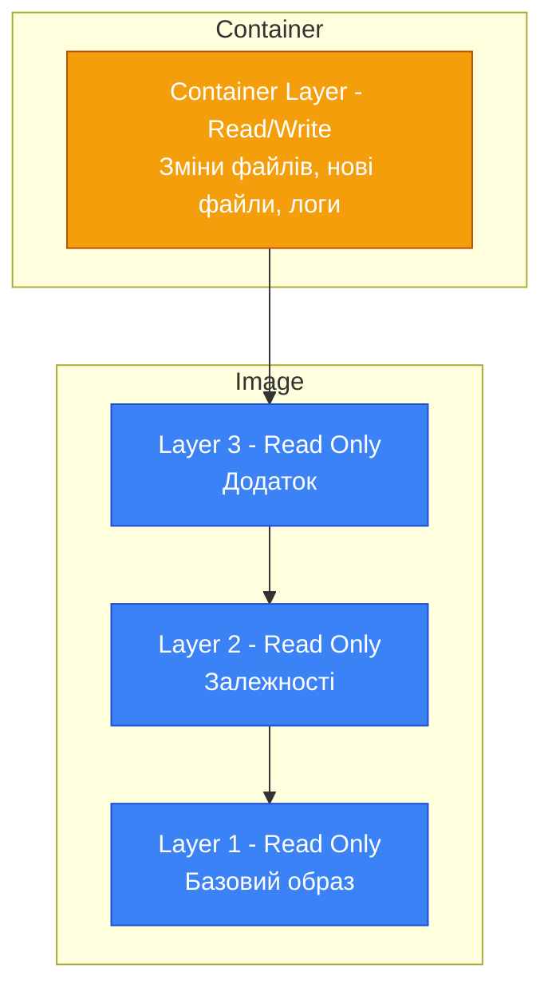
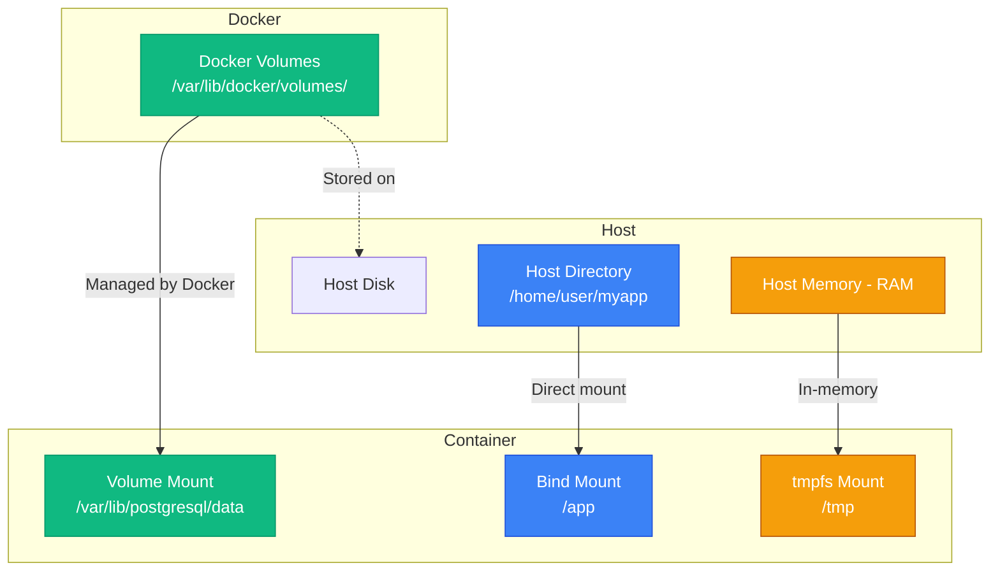

# Томи та збереження даних

## Проблема зникаючих даних

Уявіть ситуацію: ви запустили контейнер з PostgreSQL, створили базу даних, додали таблиці, заповнили їх даними. Все працює ідеально. Але потім ви зупиняєте контейнер для оновлення або перезапуску сервера, і... **всі дані зникли**. База даних порожня, таблиці відсутні, роботу потрібно починати спочатку.

Це не баг — це фундаментальна особливість Docker. Контейнери за своєю природою **ефемерні** (ephemeral) — тимчасові та одноразові. Коли контейнер видаляється, всі зміни, зроблені всередині нього, теж видаляються. Це чудово для stateless додатків (Web API без локального стану), але катастрофічно для stateful додатків (бази даних, файлові сховища, черги повідомлень).

Саме для вирішення цієї проблеми Docker надає механізми **persistent storage** — збереження даних поза життєвим циклом контейнера. У цій статті ми детально розглянемо три типи storage в Docker: **Volumes** (керовані Docker томи), **Bind Mounts** (монтування директорій хоста) та **tmpfs** (тимчасове сховище в пам'яті). Ви навчитеся зберігати дані PostgreSQL, організовувати hot-reload для .NET додатків під час розробки, та застосовувати найкращі практики роботи з даними в контейнерах.

::note
Ця стаття передбачає розуміння базових концепцій Docker (образи, контейнери, шари) з попередніх статей. Тут ми зосередимося на збереженні даних та управлінні storage.

::

---

## Проблема ефемерності контейнерів

### Архітектура шарів: read-only vs read-write

Пригадаємо архітектуру Docker-образу з попередніх статей. Образ складається з **незмінних (immutable) read-only шарів**. Коли ви запускаєте контейнер, Docker додає зверху **тонкий writable шар** (container layer), куди записуються всі зміни.

::mermaid



::

**Що відбувається з даними:**

1. **Створення файлу:** Файл записується у container layer
2. **Зміна файлу з образу:** Docker копіює файл з read-only шару в container layer (Copy-on-Write), змінює копію
3. **Видалення файлу з образу:** Docker позначає файл як видалений у container layer (whiteout file)

**Проблема:** Container layer існує лише поки існує контейнер. При видаленні контейнера (`docker rm`) цей шар теж видаляється.

### Демонстрація проблеми

**Приклад: PostgreSQL без persistent storage**

```bash
# Запустити PostgreSQL
docker run -d \
  --name postgres-temp \
  -e POSTGRES_PASSWORD=mysecret \
  postgres:16

# Дочекатися запуску (5-10 секунд)
docker logs postgres-temp

# Підключитися та створити базу даних
docker exec -it postgres-temp psql -U postgres -c "CREATE DATABASE myapp;"
docker exec -it postgres-temp psql -U postgres -c "\l"

# Вивід:
#   myapp    | postgres | UTF8 | ...
```

**Тепер видалимо контейнер:**

```bash
# Зупинити та видалити контейнер
docker stop postgres-temp
docker rm postgres-temp

# Запустити знову
docker run -d \
  --name postgres-temp \
  -e POSTGRES_PASSWORD=mysecret \
  postgres:16

# Перевірити бази даних
docker exec -it postgres-temp psql -U postgres -c "\l"

# Вивід: база даних myapp відсутня!
```

**База даних зникла**, бо вона зберігалася у container layer, який був видалений разом з контейнером.

### Наслідки ефемерності

**Для stateless додатків (Web API):**

- ✅ Ефемерність — це перевага (легко масштабувати, замінювати)
- ✅ Немає проблем з даними (стан зберігається в БД або зовнішньому сховищі)

**Для stateful додатків (БД, файлові сховища):**

- ❌ Втрата даних при видаленні контейнера
- ❌ Неможливість оновлення без downtime
- ❌ Складність backup та відновлення

::warning
**Ніколи не зберігайте критичні дані всередині контейнера без persistent storage!** Контейнери можуть бути видалені випадково, через помилку, або автоматично (наприклад, Kubernetes перезапускає pods). Завжди використовуйте volumes для stateful додатків.

::

---

## Три типи storage в Docker

Docker надає три механізми для збереження даних поза контейнером:

### 1. Volumes (Томи)

**Volumes** — це керовані Docker сховища даних, які існують незалежно від життєвого циклу контейнера.

**Характеристики:**

- ✅ Керуються Docker (створення, видалення, backup)
- ✅ Зберігаються на хості в спеціальній директорії (`/var/lib/docker/volumes/`)
- ✅ Можуть бути спільними для кількох контейнерів
- ✅ Працюють на всіх платформах (Linux, macOS, Windows)
- ✅ Підтримують volume drivers (local, NFS, cloud storage)
- ✅ Ізольовані від хост-системи (безпека)

**Коли використовувати:**

- Бази даних (PostgreSQL, MySQL, MongoDB)
- Persistent storage для додатків
- Спільні дані між контейнерами
- Production середовище

**Приклад:**

```bash
# Створити volume
docker volume create postgres-data

# Запустити контейнер з volume
docker run -d \
  --name postgres \
  -v postgres-data:/var/lib/postgresql/data \
  -e POSTGRES_PASSWORD=mysecret \
  postgres:16
```

### 2. Bind Mounts (Монтування директорій хоста)

**Bind Mounts** — це пряме монтування директорії або файлу з хост-системи в контейнер.

**Характеристики:**

- ✅ Прямий доступ до файлів хоста
- ✅ Зміни видимі одразу (hot-reload)
- ✅ Повний контроль над розташуванням файлів
- ⚠️ Залежність від структури хост-системи
- ⚠️ Потенційні проблеми з правами доступу
- ⚠️ Менша ізоляція (безпека)

**Коли використовувати:**

- Розробка (hot-reload коду)
- Конфігураційні файли
- Логи для аналізу на хості
- Спільні файли між хостом та контейнером

**Приклад:**

```bash
# Монтувати поточну директорію в контейнер
docker run -d \
  --name myapp-dev \
  -v $(pwd):/app \
  myapp:latest
```

### 3. tmpfs Mounts (Тимчасове сховище в пам'яті)

**tmpfs** — це тимчасове сховище в оперативній пам'яті, яке не зберігається на диску.

**Характеристики:**

- ✅ Дуже швидке (RAM швидше за диск)
- ✅ Автоматично очищається при зупинці контейнера
- ✅ Не залишає слідів на диску (безпека)
- ⚠️ Обмежене розміром RAM
- ⚠️ Дані втрачаються при перезапуску
- ⚠️ Доступно лише на Linux

**Коли використовувати:**

- Тимчасові файли (кеш, сесії)
- Секрети (паролі, токени) — не зберігаються на диску
- Високошвидкісний кеш
- Проміжні дані обробки

**Приклад:**

```bash
# Монтувати tmpfs для тимчасових файлів
docker run -d \
  --name myapp \
  --tmpfs /tmp:rw,size=100m \
  myapp:latest
```

### Порівняльна таблиця

| Характеристика | Volumes | Bind Mounts | tmpfs |
| :--- | :---: | :---: | :---: |
| Керування Docker | ✅ | ❌ | ✅ |
| Persistent storage | ✅ | ✅ | ❌ |
| Швидкість | Середня | Середня | Дуже висока |
| Ізоляція | Висока | Низька | Висока |
| Кросплатформність | ✅ | ⚠️ | ❌ (Linux) |
| Hot-reload | ❌ | ✅ | ❌ |
| Production | ✅ | ⚠️ | ✅ (для кешу) |
| Development | ✅ | ✅ | ⚠️ |

::mermaid



::

::tip
**Правило вибору storage:**

- **Production БД:** Volumes (керовані, надійні, backup-friendly)
- **Development hot-reload:** Bind Mounts (зміни коду одразу видимі)
- **Секрети та кеш:** tmpfs (швидко, не залишає слідів)

::

---

## Docker Volumes: керовані томи

### Створення volumes

**Синтаксис:**

```bash
docker volume create [OPTIONS] [VOLUME_NAME]
```

**Приклади:**

```bash
# Створити volume з автоматичною назвою
docker volume create

# Створити volume з конкретною назвою
docker volume create postgres-data

# Створити volume з мітками (labels)
docker volume create \
  --label environment=production \
  --label app=myapp \
  myapp-data

# Створити volume з конкретним driver
docker volume create \
  --driver local \
  --opt type=nfs \
  --opt o=addr=192.168.1.100,rw \
  --opt device=:/path/to/dir \
  nfs-volume
```

### Перегляд volumes

```bash
# Список всіх volumes
docker volume ls

# Вивід:
# DRIVER    VOLUME NAME
# local     postgres-data
# local     myapp-data
# local     abc123def456  (анонімний volume)

# Детальна інформація про volume
docker volume inspect postgres-data
```

**Вивід `docker volume inspect`:**

```json
[
    {
        "CreatedAt": "2026-04-14T11:20:30Z",
        "Driver": "local",
        "Labels": {},
        "Mountpoint": "/var/lib/docker/volumes/postgres-data/_data",
        "Name": "postgres-data",
        "Options": {},
        "Scope": "local"
    }
]
```

**Ключові поля:**

- `Mountpoint` — де фізично зберігаються дані на хості
- `Driver` — драйвер storage (local, nfs, cloud)
- `Labels` — мітки для організації volumes

### Монтування volumes у контейнер

**Два синтаксиси:**

**1. Короткий синтаксис (`-v`):**

```bash
docker run -v VOLUME_NAME:CONTAINER_PATH [OPTIONS] IMAGE
```

**Приклади:**

```bash
# Монтувати існуючий volume
docker run -d \
  --name postgres \
  -v postgres-data:/var/lib/postgresql/data \
  postgres:16

# Монтувати volume read-only
docker run -d \
  --name app \
  -v config-data:/app/config:ro \
  myapp:latest

# Створити анонімний volume (Docker згенерує назву)
docker run -d \
  --name app \
  -v /app/data \
  myapp:latest
```

**2. Довгий синтаксис (`--mount`):**

```bash
docker run --mount type=volume,source=VOLUME_NAME,target=CONTAINER_PATH [OPTIONS] IMAGE
```

**Приклади:**

```bash
# Базове монтування
docker run -d \
  --name postgres \
  --mount type=volume,source=postgres-data,target=/var/lib/postgresql/data \
  postgres:16

# Read-only монтування
docker run -d \
  --name app \
  --mount type=volume,source=config-data,target=/app/config,readonly \
  myapp:latest

# З додатковими опціями
docker run -d \
  --name app \
  --mount type=volume,source=myapp-data,target=/app/data,volume-driver=local \
  myapp:latest
```

::note
**Різниця між `-v` та `--mount`:**

- `-v` — коротший, зручніший для простих випадків
- `--mount` — більш явний, рекомендований для production (легше читати, менше помилок)

Обидва синтаксиси функціонально еквівалентні.

::

### Приклад: PostgreSQL з persistent storage

**Крок 1: Створити volume**

```bash
docker volume create postgres-data
```

**Крок 2: Запустити PostgreSQL з volume**

```bash
docker run -d \
  --name postgres \
  -e POSTGRES_PASSWORD=mysecret \
  -e POSTGRES_DB=myapp \
  -v postgres-data:/var/lib/postgresql/data \
  -p 5432:5432 \
  postgres:16
```

**Крок 3: Створити дані**

```bash
# Підключитися до БД
docker exec -it postgres psql -U postgres -d myapp

# Створити таблицю та додати дані
CREATE TABLE users (
    id SERIAL PRIMARY KEY,
    name VARCHAR(100),
    email VARCHAR(100)
);

INSERT INTO users (name, email) VALUES 
    ('Alice', 'alice@example.com'),
    ('Bob', 'bob@example.com');

SELECT * FROM users;
```

**Крок 4: Видалити контейнер**

```bash
docker stop postgres
docker rm postgres
```

**Крок 5: Запустити новий контейнер з тим самим volume**

```bash
docker run -d \
  --name postgres-new \
  -e POSTGRES_PASSWORD=mysecret \
  -v postgres-data:/var/lib/postgresql/data \
  -p 5432:5432 \
  postgres:16
```

**Крок 6: Перевірити дані**

```bash
docker exec -it postgres-new psql -U postgres -d myapp -c "SELECT * FROM users;"

# Вивід:
#  id | name  |       email
# ----+-------+-------------------
#   1 | Alice | alice@example.com
#   2 | Bob   | bob@example.com
```

**Дані збереглися!** Volume існує незалежно від контейнера.

### Спільні volumes між контейнерами

Кілька контейнерів можуть монтувати один volume одночасно.

**Приклад: Web API + Worker з спільним volume для файлів**

```bash
# Створити volume
docker volume create shared-uploads

# Запустити Web API (приймає файли)
docker run -d \
  --name api \
  -v shared-uploads:/app/uploads \
  -p 8080:8080 \
  myapi:latest

# Запустити Worker (обробляє файли)
docker run -d \
  --name worker \
  -v shared-uploads:/app/uploads \
  myworker:latest
```

**Потік даних:**

1. Користувач завантажує файл через API → файл зберігається у `/app/uploads` (volume)
2. Worker читає файли з `/app/uploads` (той самий volume) → обробляє їх
3. Обидва контейнери бачать одні й ті самі файли

::warning
**Конкурентний доступ:** Якщо кілька контейнерів пишуть у один volume одночасно, потрібна синхронізація на рівні додатку (file locking, черги). Docker не надає автоматичної синхронізації.

::

### Видалення volumes

```bash
# Видалити конкретний volume
docker volume rm postgres-data

# Видалити всі невикористовувані volumes
docker volume prune

# Видалити всі volumes (небезпечно!)
docker volume prune -a
```

**Важливо:** Volume не можна видалити, якщо він використовується контейнером (навіть зупиненим).

```bash
# Спочатку видалити контейнер
docker rm postgres

# Потім видалити volume
docker volume rm postgres-data
```

### Backup та restore volumes

**Backup volume:**

```bash
# Створити backup volume у tar-архів
docker run --rm \
  -v postgres-data:/data \
  -v $(pwd):/backup \
  alpine \
  tar czf /backup/postgres-backup-$(date +%Y%m%d).tar.gz -C /data .
```

**Пояснення:**

1. Запускаємо тимчасовий контейнер Alpine
2. Монтуємо volume `postgres-data` у `/data`
3. Монтуємо поточну директорію хоста у `/backup`
4. Створюємо tar-архів з вмісту `/data`
5. Контейнер автоматично видаляється (`--rm`)

**Restore volume:**

```bash
# Створити новий volume
docker volume create postgres-data-restored

# Відновити дані з backup
docker run --rm \
  -v postgres-data-restored:/data \
  -v $(pwd):/backup \
  alpine \
  tar xzf /backup/postgres-backup-20260414.tar.gz -C /data
```

### Volume drivers

Docker підтримує різні драйвери для volumes:

**1. local (за замовчуванням)**

Зберігає дані на локальному диску хоста.

```bash
docker volume create --driver local myvolume
```

**2. NFS (Network File System)**

Зберігає дані на віддаленому NFS-сервері.

```bash
docker volume create \
  --driver local \
  --opt type=nfs \
  --opt o=addr=192.168.1.100,rw \
  --opt device=:/path/to/share \
  nfs-volume
```

**3. Cloud drivers (AWS EBS, Azure Disk, GCP Persistent Disk)**

Інтеграція з хмарними сховищами через плагіни.

```bash
# Приклад для AWS EBS (потрібен плагін)
docker volume create \
  --driver rexray/ebs \
  --opt size=10 \
  aws-volume
```

**4. Сторонні драйвери**

- **Portworx** — для Kubernetes
- **GlusterFS** — розподілена файлова система
- **Ceph** — об'єктне сховище

::note
Для більшості випадків достатньо `local` драйвера. Cloud та мережеві драйвери потрібні для кластерних середовищ (Kubernetes, Docker Swarm).

::

### Анонімні vs іменовані volumes

**Іменований volume:**

```bash
docker run -v postgres-data:/var/lib/postgresql/data postgres:16
```

- ✅ Легко ідентифікувати (`docker volume ls`)
- ✅ Можна перевикористовувати
- ✅ Легко робити backup

**Анонімний volume:**

```bash
docker run -v /var/lib/postgresql/data postgres:16
```

- ⚠️ Docker генерує випадкову назву (напр. `abc123def456`)
- ⚠️ Важко ідентифікувати
- ⚠️ Залишаються після видалення контейнера (сміття)

::tip
**Завжди використовуйте іменовані volumes для production!** Анонімні volumes корисні лише для тимчасових експериментів.

::

---

## Bind Mounts: монтування директорій хоста

### Що таке Bind Mounts?

**Bind Mount** — це пряме монтування файлу або директорії з хост-системи в контейнер. На відміну від volumes, bind mounts не керуються Docker — ви повністю контролюєте розташування файлів на хості.

**Синтаксис:**

```bash
# Короткий синтаксис
docker run -v HOST_PATH:CONTAINER_PATH [OPTIONS] IMAGE

# Довгий синтаксис
docker run --mount type=bind,source=HOST_PATH,target=CONTAINER_PATH [OPTIONS] IMAGE
```

### Приклади використання

**1. Монтування поточної директорії:**

```bash
# Монтувати поточну директорію в /app
docker run -d \
  --name myapp-dev \
  -v $(pwd):/app \
  myapp:latest

# Або з --mount
docker run -d \
  --name myapp-dev \
  --mount type=bind,source=$(pwd),target=/app \
  myapp:latest
```

**2. Read-only монтування:**

```bash
# Монтувати конфігурацію read-only
docker run -d \
  --name nginx \
  -v $(pwd)/nginx.conf:/etc/nginx/nginx.conf:ro \
  nginx:alpine

# Або з --mount
docker run -d \
  --name nginx \
  --mount type=bind,source=$(pwd)/nginx.conf,target=/etc/nginx/nginx.conf,readonly \
  nginx:alpine
```

**3. Монтування окремого файлу:**

```bash
# Монтувати лише один файл
docker run -d \
  --name app \
  -v $(pwd)/appsettings.json:/app/appsettings.json:ro \
  myapp:latest
```

### Hot-reload для .NET додатків

Bind mounts ідеально підходять для розробки — зміни коду на хості одразу видимі в контейнері.

**Dockerfile для розробки:**

```dockerfile
FROM mcr.microsoft.com/dotnet/sdk:8.0

WORKDIR /app

# Копіюємо лише .csproj для restore (кешування)
COPY *.csproj .
RUN dotnet restore

# Код буде монтуватися через bind mount
# Тому не копіюємо його в образ

# Запускаємо з hot-reload
ENTRYPOINT ["dotnet", "watch", "run", "--no-launch-profile"]
```

**Запуск з bind mount:**

```bash
# Монтувати код для hot-reload
docker run -d \
  --name myapp-dev \
  -v $(pwd):/app \
  -p 8080:8080 \
  -e ASPNETCORE_ENVIRONMENT=Development \
  myapp-dev:latest
```

**Тепер:**

1. Змініть `Program.cs` на хості
2. `dotnet watch` автоматично перекомпілює код
3. Зміни одразу видимі без перебудови образу

**Логи:**

```
watch : Started
info: Microsoft.Hosting.Lifetime[14]
      Now listening on: http://[::]:8080
watch : File changed: /app/Program.cs
watch : Building...
watch : Started
```

### Проблеми з правами доступу

**Проблема:** Файли, створені контейнером, можуть мати неправильні права доступу на хості.

```bash
# Запустити контейнер, який створює файл
docker run --rm \
  -v $(pwd):/data \
  alpine \
  sh -c "echo 'test' > /data/file.txt"

# Перевірити власника на хості
ls -l file.txt
# -rw-r--r-- 1 root root 5 Apr 14 11:30 file.txt
```

**Файл належить root!** Це може створити проблеми, якщо ваш користувач не має прав root.

**Рішення 1: Запуск від non-root користувача**

```bash
# Запустити від поточного користувача
docker run --rm \
  -v $(pwd):/data \
  -u $(id -u):$(id -g) \
  alpine \
  sh -c "echo 'test' > /data/file.txt"

# Тепер файл належить вашому користувачу
ls -l file.txt
# -rw-r--r-- 1 youruser yourgroup 5 Apr 14 11:30 file.txt
```

**Рішення 2: Налаштування USER в Dockerfile**

```dockerfile
FROM mcr.microsoft.com/dotnet/sdk:8.0

# Створити користувача з тим самим UID, що на хості
ARG USER_ID=1000
ARG GROUP_ID=1000

RUN addgroup -g ${GROUP_ID} appuser && \
    adduser -u ${USER_ID} -G appuser -s /bin/sh -D appuser

USER appuser

WORKDIR /app
```

**Збірка з передачею UID:**

```bash
docker build \
  --build-arg USER_ID=$(id -u) \
  --build-arg GROUP_ID=$(id -g) \
  -t myapp-dev .
```

### Різниця між Volumes та Bind Mounts

| Характеристика | Volumes | Bind Mounts |
| :--- | :--- | :--- |
| Керування | Docker | Користувач |
| Розташування | `/var/lib/docker/volumes/` | Будь-де на хості |
| Створення | `docker volume create` | Автоматично при монтуванні |
| Backup | `docker run` з tar | Звичайні інструменти хоста |
| Права доступу | Керуються Docker | Залежать від хоста |
| Продуктивність | Оптимізована | Залежить від FS хоста |
| Кросплатформність | ✅ | ⚠️ (шляхи відрізняються) |
| Production | ✅ Рекомендовано | ⚠️ Обережно |
| Development | ✅ | ✅ Рекомендовано |

::warning
**Bind Mounts у production:** Уникайте bind mounts у production, бо:

- Залежність від структури хост-системи
- Проблеми з правами доступу
- Складність міграції між серверами
- Менша ізоляція (безпека)

Використовуйте volumes для production та bind mounts лише для розробки.

::

---

## tmpfs Mounts: тимчасове сховище в пам'яті

### Що таке tmpfs?

**tmpfs** — це файлова система в оперативній пам'яті (RAM), яка не зберігається на диску. Дані існують лише поки працює контейнер.

**Характеристики:**

- ✅ Дуже швидке (RAM швидше за SSD у 10-100 разів)
- ✅ Не залишає слідів на диску (безпека)
- ✅ Автоматично очищається при зупинці
- ⚠️ Обмежене розміром RAM
- ⚠️ Дані втрачаються при перезапуску
- ⚠️ Доступно лише на Linux

**Синтаксис:**

```bash
# Короткий синтаксис
docker run --tmpfs CONTAINER_PATH:OPTIONS IMAGE

# Довгий синтаксис
docker run --mount type=tmpfs,target=CONTAINER_PATH,tmpfs-size=SIZE IMAGE
```

### Приклади використання

**1. Тимчасові файли:**

```bash
# Монтувати /tmp у RAM
docker run -d \
  --name myapp \
  --tmpfs /tmp:rw,size=100m \
  myapp:latest
```

**2. Кеш:**

```bash
# Монтувати директорію кешу у RAM
docker run -d \
  --name myapp \
  --tmpfs /app/cache:rw,size=200m,mode=1777 \
  myapp:latest
```

**3. Секрети (паролі, токени):**

```bash
# Монтувати директорію для секретів у RAM
docker run -d \
  --name myapp \
  --tmpfs /run/secrets:rw,size=10m,mode=0700 \
  myapp:latest
```

**Опції tmpfs:**

- `size` — максимальний розмір (напр. `100m`, `1g`)
- `mode` — права доступу (напр. `1777`, `0700`)
- `uid` — власник (User ID)
- `gid` — група (Group ID)

### Приклад: ASP.NET Core з tmpfs для кешу

**Dockerfile:**

```dockerfile
FROM mcr.microsoft.com/dotnet/aspnet:8.0-alpine

WORKDIR /app
COPY --from=build /app/publish .

# tmpfs буде монтуватися при запуску
ENV ASPNETCORE_TEMP=/tmp

ENTRYPOINT ["dotnet", "MyWebApi.dll"]
```

**Запуск:**

```bash
docker run -d \
  --name myapi \
  -p 8080:8080 \
  --tmpfs /tmp:rw,size=100m \
  --tmpfs /app/cache:rw,size=200m \
  myapi:latest
```

**Переваги:**

- Тимчасові файли ASP.NET Core зберігаються в RAM (швидше)
- Кеш у RAM (швидкий доступ)
- Не забруднює диск

### Порівняння продуктивності

**Тест: запис 1000 файлів по 1 КБ**

| Storage | Час | Швидкість |
| :--- | :--- | :--- |
| HDD | 5.2 с | 192 файлів/с |
| SSD | 0.8 с | 1250 файлів/с |
| tmpfs (RAM) | 0.05 с | 20000 файлів/с |

**tmpfs у 16 разів швидше за SSD!**

::tip
**Коли використовувати tmpfs:**

- ✅ Тимчасові файли (кеш, сесії)
- ✅ Секрети (не зберігаються на диску)
- ✅ Високошвидкісна обробка даних
- ❌ Persistent storage (дані втрачаються)
- ❌ Великі обсяги даних (обмежено RAM)

::

---

## Практичні приклади

### Приклад 1: PostgreSQL з persistent storage

**docker-compose.yml:**

```yaml
version: '3.8'

services:
  postgres:
    image: postgres:16-alpine
    container_name: postgres
    environment:
      POSTGRES_USER: myuser
      POSTGRES_PASSWORD: mysecret
      POSTGRES_DB: myapp
    volumes:
      # Named volume для даних БД
      - postgres-data:/var/lib/postgresql/data
      # Bind mount для init-скриптів
      - ./init-scripts:/docker-entrypoint-initdb.d:ro
    ports:
      - "5432:5432"
    restart: unless-stopped

volumes:
  postgres-data:
    driver: local
```

**init-scripts/01-create-tables.sql:**

```sql
CREATE TABLE users (
    id SERIAL PRIMARY KEY,
    name VARCHAR(100) NOT NULL,
    email VARCHAR(100) UNIQUE NOT NULL,
    created_at TIMESTAMP DEFAULT CURRENT_TIMESTAMP
);

CREATE INDEX idx_users_email ON users(email);
```

**Запуск:**

```bash
docker compose up -d
```

**Переваги:**

- ✅ Дані зберігаються у volume (не втрачаються)
- ✅ Init-скрипти монтуються через bind mount (легко редагувати)
- ✅ Автоматична ініціалізація БД при першому запуску

### Приклад 2: .NET Web API з hot-reload

**Структура проєкту:**

```
MyWebApi/
├── Controllers/
│   └── WeatherController.cs
├── Program.cs
├── MyWebApi.csproj
├── Dockerfile.dev
└── docker-compose.dev.yml
```

**Dockerfile.dev:**

```dockerfile
FROM mcr.microsoft.com/dotnet/sdk:8.0

WORKDIR /app

# Копіюємо .csproj для restore
COPY *.csproj .
RUN dotnet restore

# Код монтується через bind mount
# Тому не копіюємо його

# Встановлюємо dotnet-ef для міграцій (опціонально)
RUN dotnet tool install --global dotnet-ef
ENV PATH="${PATH}:/root/.dotnet/tools"

# Запускаємо з hot-reload
CMD ["dotnet", "watch", "run", "--no-launch-profile", "--urls", "http://0.0.0.0:8080"]
```

**docker-compose.dev.yml:**

```yaml
version: '3.8'

services:
  api:
    build:
      context: .
      dockerfile: Dockerfile.dev
    container_name: myapi-dev
    volumes:
      # Bind mount для hot-reload
      - .:/app
      # Exclude bin та obj (не монтувати)
      - /app/bin
      - /app/obj
    ports:
      - "8080:8080"
    environment:
      - ASPNETCORE_ENVIRONMENT=Development
      - ASPNETCORE_URLS=http://+:8080
    depends_on:
      - postgres

  postgres:
    image: postgres:16-alpine
    container_name: postgres-dev
    environment:
      POSTGRES_PASSWORD: dev_password
      POSTGRES_DB: myapp_dev
    volumes:
      - postgres-dev-data:/var/lib/postgresql/data
    ports:
      - "5432:5432"

volumes:
  postgres-dev-data:
```

**Запуск:**

```bash
docker compose -f docker-compose.dev.yml up
```

**Тепер:**

1. Змініть код у `Controllers/WeatherController.cs`
2. Збережіть файл
3. `dotnet watch` автоматично перекомпілює
4. API перезапускається з новим кодом
5. Зміни видимі одразу на `http://localhost:8080`

**Логи:**

```
api-dev  | watch : File changed: /app/Controllers/WeatherController.cs
api-dev  | watch : Building...
api-dev  | watch : Build succeeded
api-dev  | watch : Started
api-dev  | info: Now listening on: http://[::]:8080
```

### Приклад 3: Full-stack з volumes та bind mounts

**docker-compose.yml:**

```yaml
version: '3.8'

services:
  # Frontend (React/Vue) з hot-reload
  frontend:
    image: node:20-alpine
    working_dir: /app
    command: npm run dev
    volumes:
      - ./frontend:/app
      - /app/node_modules  # Exclude node_modules
    ports:
      - "3000:3000"
    environment:
      - NODE_ENV=development

  # Backend (.NET API) з hot-reload
  backend:
    build:
      context: ./backend
      dockerfile: Dockerfile.dev
    volumes:
      - ./backend:/app
      - /app/bin
      - /app/obj
    ports:
      - "8080:8080"
    environment:
      - ASPNETCORE_ENVIRONMENT=Development
      - ConnectionStrings__DefaultConnection=Host=postgres;Database=myapp;Username=postgres;Password=secret
    depends_on:
      - postgres
      - redis

  # PostgreSQL з persistent storage
  postgres:
    image: postgres:16-alpine
    volumes:
      - postgres-data:/var/lib/postgresql/data
      - ./database/init:/docker-entrypoint-initdb.d:ro
    environment:
      POSTGRES_PASSWORD: secret
      POSTGRES_DB: myapp
    ports:
      - "5432:5432"

  # Redis з tmpfs для швидкого кешу
  redis:
    image: redis:7-alpine
    command: redis-server --save ""
    tmpfs:
      - /data:rw,size=100m
    ports:
      - "6379:6379"

  # Nginx reverse proxy
  nginx:
    image: nginx:alpine
    volumes:
      - ./nginx/nginx.conf:/etc/nginx/nginx.conf:ro
      - nginx-logs:/var/log/nginx
    ports:
      - "80:80"
    depends_on:
      - frontend
      - backend

volumes:
  postgres-data:
  nginx-logs:
```

**Типи storage у цьому прикладі:**

- **Bind mounts:** Frontend та Backend код (hot-reload)
- **Named volumes:** PostgreSQL data, Nginx logs (persistent)
- **tmpfs:** Redis data (швидкий кеш, не persistent)
- **Excluded volumes:** `node_modules`, `bin`, `obj` (не монтувати з хоста)

---

## Практичні завдання

### Завдання 1: PostgreSQL з persistent storage

**Мета:** Навчитися зберігати дані БД у volume.

**Кроки:**

1. Створіть volume: `docker volume create postgres-data`
2. Запустіть PostgreSQL з цим volume
3. Створіть базу даних та таблицю з даними
4. Видаліть контейнер
5. Запустіть новий контейнер з тим самим volume
6. Перевірте, що дані збереглися

**Очікуваний результат:** Дані не втрачаються при видаленні контейнера.

### Завдання 2: Hot-reload для .NET додатку

**Мета:** Налаштувати розробницьке середовище з автоматичним перезапуском.

**Кроки:**

1. Створіть ASP.NET Core Web API проєкт
2. Створіть `Dockerfile.dev` з `dotnet watch`
3. Запустіть контейнер з bind mount поточної директорії
4. Змініть код контролера
5. Перевірте, що зміни застосувалися без перебудови образу

**Очікуваний результат:** Зміни коду видимі одразу після збереження файлу.

### Завдання 3: Backup та restore volume

**Мета:** Навчитися робити backup даних з volume.

**Кроки:**

1. Створіть volume з даними (PostgreSQL або файли)
2. Зробіть backup volume у tar-архів
3. Видаліть volume
4. Створіть новий volume
5. Відновіть дані з backup
6. Перевірте, що дані відновилися коректно

**Очікуваний результат:** Дані успішно відновлені з backup.

### Завдання 4: Порівняння продуктивності

**Мета:** Виміряти різницю швидкості між volume, bind mount та tmpfs.

**Кроки:**

1. Створіть скрипт, який записує 1000 файлів
2. Запустіть скрипт з volume
3. Запустіть скрипт з bind mount
4. Запустіть скрипт з tmpfs
5. Порівняйте час виконання

**Очікуваний результат:** tmpfs найшвидший, volume та bind mount приблизно однакові.

---

## Резюме

У цій статті ми детально розглянули збереження даних у Docker:

**Проблема ефемерності:**

- Контейнери тимчасові — дані у container layer видаляються разом з контейнером
- Для stateful додатків (БД, файлові сховища) потрібен persistent storage
- Docker надає три типи storage: Volumes, Bind Mounts, tmpfs

**Docker Volumes:**

- Керовані Docker томи для persistent storage
- Зберігаються у `/var/lib/docker/volumes/`
- Ідеально для production (БД, файли додатків)
- Команди: `docker volume create`, `ls`, `inspect`, `rm`, `prune`
- Підтримують різні драйвери (local, NFS, cloud)
- Можуть бути спільними між контейнерами

**Bind Mounts:**

- Пряме монтування директорій хоста в контейнер
- Ідеально для розробки (hot-reload коду)
- Зміни на хості одразу видимі в контейнері
- Проблеми з правами доступу (вирішуються через `-u` або USER в Dockerfile)
- Не рекомендовано для production (залежність від хоста)

**tmpfs Mounts:**

- Тимчасове сховище в RAM (не на диску)
- Дуже швидке (у 10-100 разів швидше за SSD)
- Автоматично очищується при зупинці
- Ідеально для кешу, тимчасових файлів, секретів
- Доступно лише на Linux

**Практичні сценарії:**

- **PostgreSQL:** Named volume для `/var/lib/postgresql/data`
- **.NET hot-reload:** Bind mount коду + `dotnet watch`
- **Redis кеш:** tmpfs для `/data` (швидко, не persistent)
- **Nginx конфігурація:** Bind mount для `nginx.conf` (легко редагувати)
- **Full-stack:** Комбінація volumes, bind mounts та tmpfs

**Найкращі практики:**

- ✅ Використовуйте іменовані volumes для production
- ✅ Використовуйте bind mounts для розробки
- ✅ Використовуйте tmpfs для кешу та секретів
- ✅ Робіть регулярні backup volumes
- ✅ Exclude `node_modules`, `bin`, `obj` при bind mount
- ❌ Не використовуйте анонімні volumes (важко керувати)
- ❌ Не зберігайте критичні дані в container layer

**Порівняльна таблиця:**

| Сценарій | Рекомендація |
| :--- | :--- |
| Production БД | Named volume |
| Development hot-reload | Bind mount |
| Кеш, тимчасові файли | tmpfs |
| Конфігураційні файли | Bind mount (read-only) |
| Логи для аналізу | Named volume або bind mount |
| Секрети (паролі, токени) | tmpfs (не залишає слідів) |
| Спільні дані між контейнерами | Named volume |

::tip
**Золоте правило storage:**

- **Production:** Volumes (керовані, надійні, backup-friendly)
- **Development:** Bind Mounts (hot-reload, зручність)
- **Кеш/Секрети:** tmpfs (швидко, безпечно)

Ніколи не зберігайте критичні дані всередині контейнера без persistent storage!

::


