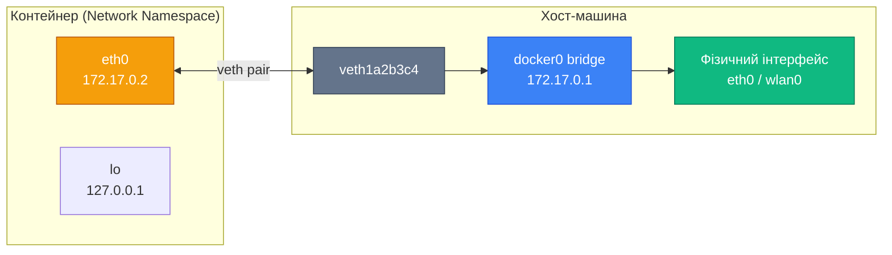
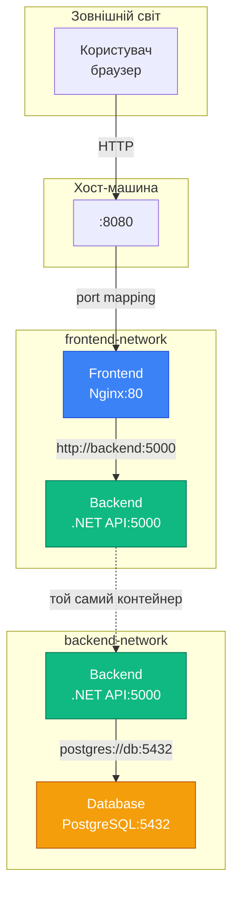

# Основи мережі в Docker

## Проблема ізоляції та комунікації

Уявіть типовий веб-застосунок: фронтенд на React, бекенд на .NET, база даних PostgreSQL, Redis для кешування. У традиційному deployment кожен компонент знає IP-адресу іншого — фронтенд звертається до `http://192.168.1.10:5000` для API, бекенд підключається до бази за адресою `192.168.1.20:5432`. Все працює, поки ви не вирішите перенести один з компонентів на інший сервер — доведеться змінювати конфігурацію скрізь.

Тепер уявіть той самий застосунок у Docker. Кожен компонент — окремий контейнер. Контейнери ізольовані один від одного: вони мають власні файлові системи, процеси, і... **власні мережеві простори** (network namespaces). За замовчуванням контейнер не може "побачити" інший контейнер — вони існують у різних мережевих ізоляціях, наче на різних планетах.

**Як же організувати комунікацію?** Як фронтенд-контейнер має знайти бекенд-контейнер? Як бекенд підключиться до PostgreSQL-контейнера? Чи потрібно знати IP-адреси, які Docker динамічно призначає? Чи можна використовувати DNS-імена замість IP? Як забезпечити, щоб контейнери бачили один одного, але залишалися ізольованими від зовнішнього світу?

Саме для вирішення цих питань Docker надає **мережеву підсистему** (networking subsystem) — гнучку систему віртуальних мереж, що дозволяє контейнерам спілкуватися між собою, з хост-машиною та зовнішнім світом. У цій статті ми детально розглянемо архітектуру Docker networking, типи мереж (bridge, host, overlay, macvlan), механізм DNS-резолюції імен контейнерів, та побудуємо реальний multi-container застосунок з правильною мережевою ізоляцією.

::note
Ця стаття передбачає розуміння базових концепцій Docker (контейнери, образи, volumes) з попередніх статей. Тут ми зосередимося на мережевій комунікації та ізоляції.
::

---

## Мережева ізоляція: Network Namespaces

### Що таке Network Namespace

**Network Namespace** — це механізм ізоляції мережевого стеку на рівні ядра Linux. Кожен namespace має власний набір мережевих інтерфейсів, таблицю маршрутизації, правила firewall (iptables), сокети. Процеси всередині одного namespace "бачать" лише мережеві ресурси цього namespace — вони не можуть безпосередньо взаємодіяти з процесами в іншому namespace.

Docker використовує network namespaces для ізоляції контейнерів. Коли ви запускаєте контейнер, Docker створює новий network namespace і розміщує процеси контейнера всередині нього. Це означає, що:

1. **Контейнер має власний loopback інтерфейс** (`lo`) — `127.0.0.1` всередині контейнера вказує на сам контейнер, а не на хост
2. **Контейнер має власний мережевий інтерфейс** (зазвичай `eth0`) з унікальною IP-адресою
3. **Контейнер не бачить мережеві інтерфейси хоста** — `ifconfig` всередині контейнера показує лише інтерфейси контейнера
4. **Контейнер не бачить інші контейнери** — за замовчуванням, без явного з'єднання через Docker network

### Демонстрація ізоляції

Запустимо контейнер і подивимося на його мережеві інтерфейси:

```bash
# Запустити контейнер Alpine Linux
docker run -it --rm alpine sh

# Всередині контейнера: подивитися мережеві інтерфейси
ip addr show
```

**Вивід всередині контейнера:**

::terminal-preview{title="Мережеві інтерфейси контейнера"}
<div class="line"><span class="opacity-40">/ #</span> <strong class="font-bold">ip addr show</strong></div>
<div class="line"></div>
<div class="line"><span class="text-blue-400 font-bold">1: lo:</span> &lt;LOOPBACK,UP,LOWER_UP&gt; mtu 65536</div>
<div class="line">    inet <span class="text-green-400 font-bold">127.0.0.1/8</span> scope host lo</div>
<div class="line"></div>
<div class="line"><span class="text-blue-400 font-bold">2: eth0@if15:</span> &lt;BROADCAST,MULTICAST,UP,LOWER_UP&gt; mtu 1500</div>
<div class="line">    inet <span class="text-green-400 font-bold">172.17.0.2/16</span> brd 172.17.255.255 scope global eth0</div>
::

**Що ми бачимо:**

- **`lo` (loopback):** Локальний інтерфейс з адресою `127.0.0.1` — ізольований всередині контейнера
- **`eth0`:** Віртуальний Ethernet-інтерфейс з IP-адресою `172.17.0.2` — це адреса контейнера у Docker-мережі
- **Відсутні інтерфейси хоста:** Немає `wlan0`, `enp0s3` чи інших інтерфейсів хост-машини

Тепер подивимося на інтерфейси **на хості** (у новому терміналі, не всередині контейнера):

```bash
# На хості: подивитися Docker-інтерфейси
ip addr show | grep docker
```

**Вивід на хості:**

::terminal-preview{title="Docker bridge на хості"}
<div class="line"><span class="opacity-40">$</span> <strong class="font-bold">ip addr show | grep docker</strong></div>
<div class="line"></div>
<div class="line"><span class="text-blue-400 font-bold">4: docker0:</span> &lt;BROADCAST,MULTICAST,UP,LOWER_UP&gt; mtu 1500</div>
<div class="line">    inet <span class="text-green-400 font-bold">172.17.0.1/16</span> brd 172.17.255.255 scope global docker0</div>
<div class="line"></div>
<div class="line"><span class="text-blue-400 font-bold">15: veth1a2b3c4@if2:</span> &lt;BROADCAST,MULTICAST,UP,LOWER_UP&gt; mtu 1500</div>
::

**Що ми бачимо:**

- **`docker0`:** Віртуальний bridge (міст) з IP-адресою `172.17.0.1` — це шлюз (gateway) для контейнерів
- **`veth1a2b3c4`:** Virtual Ethernet pair — один кінець у хості, інший (`eth0`) всередині контейнера

### Архітектура з'єднання

Docker з'єднує контейнер з хостом через **veth pair** (Virtual Ethernet pair) — пару віртуальних мережевих інтерфейсів, що працюють як "труба": пакет, відправлений в один кінець, з'являється на іншому.

::mermaid



::

**Потік даних:**

1. Процес всередині контейнера відправляє пакет через `eth0`
2. Пакет проходить через veth pair і з'являється на `veth1a2b3c4` на хості
3. `veth1a2b3c4` підключений до `docker0` bridge
4. Bridge маршрутизує пакет до фізичного інтерфейсу хоста або до іншого контейнера

::tip
**Аналогія з реального світу:** Network namespace — це окрема кімната з власним телефоном. Veth pair — це труба між кімнатами, що дозволяє передавати повідомлення. Docker bridge — це коридор, що з'єднує всі кімнати.
::

---

## Типи Docker-мереж

Docker підтримує кілька типів мереж (network drivers), кожен з яких вирішує специфічні завдання. Вибір типу мережі залежить від архітектури застосунку, вимог до ізоляції та deployment-середовища (single host vs cluster).

### Огляд типів мереж

| Тип мережі | Призначення | Use Case | Ізоляція |
|------------|-------------|----------|----------|
| **bridge** | Приватна мережа на одному хості | Локальна розробка, multi-container додатки | Контейнери бачать один одного, ізольовані від зовнішнього світу |
| **host** | Контейнер використовує мережу хоста | Високопродуктивні додатки, мінімальна латентність | Немає ізоляції — контейнер бачить всі інтерфейси хоста |
| **overlay** | Мережа через кілька хостів | Docker Swarm, Kubernetes | Контейнери на різних машинах бачать один одного |
| **macvlan** | Контейнер отримує MAC-адресу | Legacy додатки, що потребують фізичної адреси | Контейнер виглядає як фізичний пристрій у мережі |
| **none** | Немає мережі | Повна ізоляція, тестування | Контейнер не має мережевого доступу |

У цій статті ми детально розглянемо **bridge** (найпоширеніший) та **host** (для специфічних сценаріїв). Overlay та macvlan — теми для просунутих статей про orchestration.

---

## Bridge Network: приватна мережа контейнерів

### Що таке Bridge Network

**Bridge network** — це приватна віртуальна мережа, створена Docker на хості. Контейнери, підключені до однієї bridge-мережі, можуть спілкуватися один з одним через IP-адреси або DNS-імена. Контейнери в різних bridge-мережах ізольовані — вони не бачать один одного без явного з'єднання.

Docker автоматично створює **default bridge network** (`docker0`) при встановленні. Коли ви запускаєте контейнер без явного вказання мережі, він підключається до цієї default bridge.

### Default Bridge vs User-Defined Bridge

Docker надає два типи bridge-мереж:

**1. Default Bridge (`docker0`):**
- Створюється автоматично при встановленні Docker
- Використовується за замовчуванням, якщо не вказано інше
- **Обмеження:** Немає автоматичного DNS-резолюції імен контейнерів — потрібно використовувати IP-адреси або `--link` (deprecated)

**2. User-Defined Bridge:**
- Створюється вручну через `docker network create`
- **Переваги:** Автоматичний DNS, кращий контроль ізоляції, можливість підключення/відключення контейнерів на льоту
- **Рекомендація:** Завжди використовуйте user-defined bridge для production

### Створення та управління мережами

**Переглянути існуючі мережі:**

```bash
docker network ls
```

**Вивід:**

::terminal-preview{title="Список Docker-мереж"}
<div class="line"><span class="opacity-40">$</span> <strong class="font-bold">docker network ls</strong></div>
<div class="line"></div>
<div class="line"><span class="text-blue-400 font-bold">NETWORK ID</span>     <span class="text-blue-400 font-bold">NAME</span>      <span class="text-blue-400 font-bold">DRIVER</span>    <span class="text-blue-400 font-bold">SCOPE</span></div>
<div class="line">a1b2c3d4e5f6   bridge    bridge    local</div>
<div class="line">f6e5d4c3b2a1   host      host      local</div>
<div class="line">1a2b3c4d5e6f   none      none      local</div>
::

**Створити user-defined bridge:**

```bash
# Створити мережу з назвою "myapp-network"
docker network create myapp-network

# Переглянути деталі мережі
docker network inspect myapp-network
```

**Вивід `inspect` (скорочено):**

```json
[
    {
        "Name": "myapp-network",
        "Driver": "bridge",
        "Scope": "local",
        "IPAM": {
            "Config": [
                {
                    "Subnet": "172.18.0.0/16",
                    "Gateway": "172.18.0.1"
                }
            ]
        },
        "Containers": {}
    }
]
```

**Що ми бачимо:**

- **Subnet:** `172.18.0.0/16` — діапазон IP-адрес для контейнерів у цій мережі (65534 можливих адреси)
- **Gateway:** `172.18.0.1` — IP-адреса bridge на хості, через яку контейнери виходять назовні
- **Containers:** Порожній об'єкт — поки жоден контейнер не підключений

::note
**IPAM (IP Address Management):** Docker автоматично призначає IP-адреси контейнерам з subnet. Ви можете вказати власний subnet через `--subnet` при створенні мережі.
::

### Підключення контейнерів до мережі

**Спосіб 1: При запуску контейнера**

```bash
# Запустити контейнер у мережі myapp-network
docker run -d \
  --name web \
  --network myapp-network \
  nginx:alpine
```

**Спосіб 2: Підключити існуючий контейнер**

```bash
# Запустити контейнер без мережі
docker run -d --name api nginx:alpine

# Підключити до мережі
docker network connect myapp-network api
```

**Перевірити підключення:**

```bash
docker network inspect myapp-network
```

**Вивід (фрагмент):**

```json
"Containers": {
    "a1b2c3d4...": {
        "Name": "web",
        "IPv4Address": "172.18.0.2/16"
    },
    "f6e5d4c3...": {
        "Name": "api",
        "IPv4Address": "172.18.0.3/16"
    }
}
```

Тепер обидва контейнери (`web` та `api`) знаходяться в одній мережі і можуть спілкуватися.

---

## DNS-резолюція: комунікація за іменами

### Проблема динамічних IP-адрес

У попередньому прикладі контейнер `web` отримав IP `172.18.0.2`, а `api` — `172.18.0.3`. Але ці адреси **динамічні** — Docker призначає їх автоматично при запуску контейнера. Якщо ви перезапустите контейнер, він може отримати іншу IP-адресу.

**Проблема:** Як контейнер `web` має підключитися до `api`, якщо IP-адреса `api` може змінитися? Хардкодити IP у конфігурації — антипатерн.

**Рішення:** Docker надає **вбудований DNS-сервер** для user-defined bridge networks. Контейнери можуть звертатися один до одного за **іменами контейнерів** замість IP-адрес.

### Як працює Docker DNS

Коли ви створюєте user-defined bridge network, Docker автоматично запускає вбудований DNS-сервер на адресі `127.0.0.11:53` всередині кожного контейнера. Цей DNS-сервер:

1. **Резолвить імена контейнерів** у цій мережі в їхні IP-адреси
2. **Пересилає зовнішні запити** (наприклад, `google.com`) до DNS-серверів хоста

::mermaid

```mermaid
sequenceDiagram
    participant Web as Контейнер "web"
    participant DNS as Docker DNS<br/>127.0.0.11
    participant API as Контейнер "api"
    
    Web->>DNS: Резолвити "api"
    DNS->>DNS: Пошук у таблиці контейнерів
    DNS-->>Web: 172.18.0.3
    Web->>API: HTTP запит до 172.18.0.3
    API-->>Web: HTTP відповідь
    
    style DNS fill:#3b82f6,stroke:#1d4ed8,color:#ffffff
    style Web fill:#f59e0b,stroke:#b45309,color:#ffffff
    style API fill:#10b981,stroke:#047857,color:#ffffff
```

::

### Демонстрація DNS-резолюції

Запустимо два контейнери у user-defined bridge та перевіримо DNS:

```bash
# Створити мережу
docker network create demo-network

# Запустити контейнер "backend"
docker run -d \
  --name backend \
  --network demo-network \
  nginx:alpine

# Запустити контейнер "frontend" та перевірити DNS
docker run -it --rm \
  --name frontend \
  --network demo-network \
  alpine sh
```

**Всередині контейнера `frontend`:**

```bash
# Перевірити резолюцію імені "backend"
nslookup backend

# Вивід:
# Server:    127.0.0.11
# Address:   127.0.0.11:53
# 
# Name:      backend
# Address:   172.18.0.2

# Перевірити з'єднання через HTTP
wget -qO- http://backend
```

**Що відбулося:**

1. Команда `nslookup backend` відправила DNS-запит до `127.0.0.11` (Docker DNS)
2. Docker DNS знайшов контейнер з іменем `backend` у мережі `demo-network`
3. DNS повернув IP-адресу `172.18.0.2`
4. `wget` підключився до `http://backend` (Docker автоматично резолвив ім'я в IP)

::warning
**Default bridge не підтримує DNS:** Якщо ви запускаєте контейнери без `--network`, вони підключаються до default bridge (`docker0`), де DNS-резолюція імен **не працює**. Потрібно використовувати IP-адреси або deprecated `--link`.
::

### Алиаси мережі (Network Aliases)

Іноді потрібно, щоб контейнер був доступний під кількома іменами. Наприклад, контейнер з базою даних може мати ім'я `postgres-primary`, але ви хочете, щоб він був доступний також як `db` для зручності.

**Додати алиас при запуску:**

```bash
docker run -d \
  --name postgres-primary \
  --network myapp-network \
  --network-alias db \
  --network-alias database \
  postgres:16
```

Тепер контейнер доступний за трьома іменами: `postgres-primary`, `db`, `database`.

**Перевірка:**

```bash
docker run -it --rm \
  --network myapp-network \
  alpine sh -c "nslookup db && nslookup database"
```

Обидва запити повернуть ту саму IP-адресу.

---

## Порти та Port Mapping

### Проблема доступу ззовні

Контейнери у bridge network можуть спілкуватися між собою через приватні IP-адреси (наприклад, `172.18.0.2`). Але ці адреси **недоступні ззовні хоста** — ви не можете відкрити браузер на своєму комп'ютері та зайти на `http://172.18.0.2`.

**Чому?** Тому що `172.18.0.0/16` — це приватна мережа, створена Docker всередині хоста. Зовнішній світ (ваш браузер, інші машини в локальній мережі) не знає про існування цієї мережі.

**Рішення:** Docker надає механізм **port mapping** (проброс портів) — прив'язку порту контейнера до порту хоста. Коли ви відкриваєте `http://localhost:8080` на хості, Docker перенаправляє трафік до контейнера.

### Синтаксис Port Mapping

**Формат:** `-p HOST_PORT:CONTAINER_PORT`

```bash
# Запустити Nginx, пробросити порт 80 контейнера на порт 8080 хоста
docker run -d \
  --name web \
  -p 8080:80 \
  nginx:alpine
```

**Що відбувається:**

1. Nginx всередині контейнера слухає на порту `80`
2. Docker створює правило iptables на хості: трафік на `localhost:8080` → перенаправити до `172.18.0.2:80`
3. Ви можете відкрити `http://localhost:8080` у браузері — побачите Nginx

**Перевірка:**

```bash
curl http://localhost:8080
# Вивід: <!DOCTYPE html><html>...
```

### Варіації Port Mapping

**1. Прив'язка до конкретного інтерфейсу:**

```bash
# Слухати лише на localhost (недоступно з інших машин)
docker run -d -p 127.0.0.1:8080:80 nginx:alpine

# Слухати на всіх інтерфейсах (доступно з локальної мережі)
docker run -d -p 0.0.0.0:8080:80 nginx:alpine
```

**2. Автоматичний вибір порту хоста:**

```bash
# Docker сам вибере вільний порт на хості
docker run -d -p 80 nginx:alpine

# Подивитися, який порт призначено
docker port <container_id>
# Вивід: 80/tcp -> 0.0.0.0:32768
```

**3. Кілька портів:**

```bash
# Пробросити HTTP (80) та HTTPS (443)
docker run -d \
  -p 8080:80 \
  -p 8443:443 \
  nginx:alpine
```

**4. UDP-порти:**

```bash
# За замовчуванням -p пробросить TCP. Для UDP:
docker run -d -p 53:53/udp dns-server
```

### Переглянути проброшені порти

```bash
# Для конкретного контейнера
docker port web

# Вивід:
# 80/tcp -> 0.0.0.0:8080
```

Або через `docker ps`:

```bash
docker ps
```

**Вивід:**

::terminal-preview{title="Контейнери з пробросом портів"}
<div class="line"><span class="opacity-40">$</span> <strong class="font-bold">docker ps</strong></div>
<div class="line"></div>
<div class="line"><span class="text-blue-400 font-bold">CONTAINER ID</span>   <span class="text-blue-400 font-bold">IMAGE</span>          <span class="text-blue-400 font-bold">PORTS</span></div>
<div class="line">a1b2c3d4e5f6   nginx:alpine   <span class="text-green-400 font-bold">0.0.0.0:8080->80/tcp</span></div>
::

::tip
**Best Practice:** У production використовуйте reverse proxy (Nginx, Traefik) на хості для маршрутизації трафіку до контейнерів замість прямого проброса портів. Це дає SSL termination, load balancing, та кращу безпеку.
::

---

## Host Network: мінімальна ізоляція

### Коли потрібен Host Network

**Host network** — це режим, у якому контейнер **не отримує власний network namespace**. Замість цього контейнер використовує мережевий стек хоста безпосередньо. Це означає:

1. **Контейнер бачить всі мережеві інтерфейси хоста** — `eth0`, `wlan0`, `docker0`, тощо
2. **Контейнер слухає на портах хоста безпосередньо** — немає port mapping, немає NAT
3. **Немає мережевої ізоляції** — контейнер має повний доступ до мережі хоста

**Переваги:**
- **Максимальна продуктивність** — немає overhead від NAT та bridge
- **Мінімальна латентність** — пакети не проходять через veth pair та bridge
- **Доступ до всіх інтерфейсів** — корисно для мережевих утиліт (tcpdump, nmap)

**Недоліки:**
- **Немає ізоляції** — контейнер може конфліктувати з процесами хоста за порти
- **Немає портабельності** — конфігурація залежить від мережі хоста
- **Безпека** — контейнер має доступ до всієї мережевої активності хоста

### Використання Host Network

**Запустити контейнер у host network:**

```bash
docker run -d \
  --name web-host \
  --network host \
  nginx:alpine
```

**Що відбувається:**

1. Nginx всередині контейнера слухає на порту `80`
2. Цей порт `80` — це **порт хоста**, а не контейнера
3. Немає потреби в `-p 8080:80` — контейнер вже на хості

**Перевірка:**

```bash
# На хості (не всередині контейнера)
curl http://localhost:80
# Вивід: <!DOCTYPE html><html>...

# Подивитися процеси, що слухають на порту 80
sudo netstat -tlnp | grep :80
# Вивід: tcp  0  0.0.0.0:80  0.0.0.0:*  LISTEN  12345/nginx
```

**Порівняння з bridge:**

```bash
# Всередині контейнера з host network
docker exec web-host ip addr show

# Вивід: ТІ Ж інтерфейси, що й на хості
# eth0, wlan0, docker0, lo — все доступно
```

::warning
**Конфлікт портів:** Якщо на хості вже працює процес на порту 80 (наприклад, Apache), контейнер з Nginx не зможе запуститися — отримаєте помилку "address already in use".
::

### Коли використовувати Host Network

**Рекомендовані сценарії:**

1. **Високопродуктивні мережеві додатки** — коли кожна мілісекунда латентності критична (HFT, real-time streaming)
2. **Мережеві утиліти** — tcpdump, Wireshark, nmap, що потребують доступу до всіх інтерфейсів
3. **Legacy додатки** — які очікують конкретні мережеві налаштування хоста

**НЕ рекомендується:**

1. **Multi-container застосунки** — конфлікти портів між контейнерами
2. **Production web-сервіси** — втрата ізоляції та портабельності
3. **Розробка** — bridge з DNS зручніший для локальної розробки

::tip
**Альтернатива:** Якщо вам потрібна висока продуктивність, але ви хочете зберегти ізоляцію, розгляньте **macvlan** network — контейнер отримує власну MAC-адресу та виглядає як окремий фізичний пристрій у мережі.
::

---

## Практичний приклад: Multi-container застосунок

Тепер застосуємо знання на практиці. Побудуємо типовий веб-застосунок з трьома компонентами:

1. **Frontend** — Nginx, що віддає статичні файли та проксує API-запити
2. **Backend** — .NET Web API
3. **Database** — PostgreSQL

**Вимоги до мережі:**

- Frontend має бути доступний ззовні на порту `8080`
- Backend має бути доступний лише для Frontend (не ззовні)
- Database має бути доступна лише для Backend (не ззовні, не для Frontend)

### Архітектура мережі

Створимо дві bridge-мережі для ізоляції:

1. **frontend-network** — з'єднує Frontend та Backend
2. **backend-network** — з'єднує Backend та Database

::mermaid



::

**Пояснення архітектури:**

- **Backend підключений до двох мереж** — може спілкуватися і з Frontend, і з Database
- **Frontend не бачить Database** — вони в різних мережах без спільних контейнерів
- **Database ізольована** — доступна лише через Backend

### Крок 1: Створення мереж

```bash
# Створити frontend-network
docker network create frontend-network

# Створити backend-network
docker network create backend-network
```

### Крок 2: Запуск Database

```bash
# Запустити PostgreSQL у backend-network
docker run -d \
  --name db \
  --network backend-network \
  -e POSTGRES_PASSWORD=mysecret \
  -e POSTGRES_DB=myapp \
  postgres:16
```

**Важливо:** Контейнер `db` доступний за іменем `db` всередині `backend-network`. Немає проброса портів — база недоступна ззовні.

### Крок 3: Запуск Backend

```bash
# Запустити .NET API
docker run -d \
  --name backend \
  --network frontend-network \
  -e ConnectionStrings__Default="Host=db;Database=myapp;Username=postgres;Password=mysecret" \
  myapp-api:latest

# Підключити backend до другої мережі (backend-network)
docker network connect backend-network backend
```

**Пояснення:**

- Backend запущений у `frontend-network` (може спілкуватися з Frontend)
- Потім підключений до `backend-network` (може спілкуватися з Database)
- Connection string використовує `Host=db` — Docker DNS резолвить це в IP PostgreSQL

### Крок 4: Запуск Frontend

```bash
# Запустити Nginx у frontend-network
docker run -d \
  --name frontend \
  --network frontend-network \
  -p 8080:80 \
  myapp-frontend:latest
```

**Конфігурація Nginx** (всередині образу `myapp-frontend`):

```nginx
server {
    listen 80;
    
    # Статичні файли
    location / {
        root /usr/share/nginx/html;
        try_files $uri $uri/ /index.html;
    }
    
    # Проксування API-запитів до Backend
    location /api/ {
        proxy_pass http://backend:5000/;
        proxy_set_header Host $host;
        proxy_set_header X-Real-IP $remote_addr;
    }
}
```

**Що відбувається:**

- Nginx слухає на порту `80` всередині контейнера
- Порт `80` пробросено на `8080` хоста
- Запити до `/api/*` проксуються до `http://backend:5000` — Docker DNS резолвить `backend`

### Крок 5: Перевірка

```bash
# Відкрити у браузері
curl http://localhost:8080

# Перевірити API через Frontend
curl http://localhost:8080/api/health

# Спробувати підключитися до Database ззовні (має не вдатися)
psql -h localhost -U postgres -d myapp
# Помилка: Connection refused (порт не пробросено)
```

**Перевірка ізоляції:**

```bash
# Frontend НЕ може підключитися до Database
docker exec frontend ping db
# Помилка: bad address 'db' (немає в frontend-network)

# Backend МОЖЕ підключитися до Database
docker exec backend ping db
# Успіх: PING db (172.19.0.2)
```

::tip
**Best Practice:** Використовуйте окремі мережі для різних рівнів застосунку (presentation, business logic, data). Це реалізує принцип **least privilege** — кожен компонент має доступ лише до того, що йому потрібно.
::

---
## Ізоляція та безпека мережі

### Принцип мережевої ізоляції

Docker networking за замовчуванням забезпечує **ізоляцію між мережами** — контейнери в різних bridge-мережах не можуть спілкуватися один з одним без явного з'єднання. Це фундаментальний принцип безпеки: якщо контейнер скомпрометовано, атакуючий не може автоматично отримати доступ до інших контейнерів.

**Рівні ізоляції:**

1. **Network Namespace** — кожен контейнер має власний мережевий стек
2. **Bridge Isolation** — контейнери в різних bridge-мережах ізольовані
3. **Firewall Rules** — Docker автоматично створює iptables-правила для контролю трафіку

### Як Docker використовує iptables

Docker використовує **iptables** (firewall Linux) для реалізації мережевої ізоляції та NAT. Коли ви створюєте мережу або пробросуєте порт, Docker автоматично додає правила в iptables.

**Подивитися правила Docker:**

```bash
# Переглянути NAT-правила (port mapping)
sudo iptables -t nat -L -n

# Переглянути filter-правила (ізоляція)
sudo iptables -t filter -L DOCKER-ISOLATION-STAGE-1 -n
```

**Приклад правила для port mapping:**

```
Chain DOCKER (2 references)
target     prot opt source      destination
ACCEPT     tcp  --  0.0.0.0/0   172.17.0.2   tcp dpt:80
```

**Пояснення:** Дозволити TCP-трафік з будь-якої адреси (`0.0.0.0/0`) до контейнера `172.17.0.2` на порт `80`.

**Приклад правила ізоляції:**

```
Chain DOCKER-ISOLATION-STAGE-1 (1 references)
target                     prot opt source      destination
DOCKER-ISOLATION-STAGE-2   all  --  0.0.0.0/0   0.0.0.0/0
DROP                       all  --  0.0.0.0/0   0.0.0.0/0
```

**Пояснення:** За замовчуванням DROP (відкинути) весь трафік між мережами, якщо немає явного дозволу.

::warning
**Не модифікуйте iptables вручну:** Docker керує правилами автоматично. Ручні зміни можуть бути перезаписані при перезапуску Docker daemon або створенні нових контейнерів.
::

### Обмеження доступу до контейнерів

**1. Не пробросуйте порти без потреби**

Кожен пробросений порт (`-p`) — це потенційна точка атаки. Якщо контейнер не потребує доступу ззовні, не використовуйте `-p`.

**Погано:**

```bash
# База даних доступна ззовні — небезпечно!
docker run -d -p 5432:5432 postgres:16
```

**Добре:**

```bash
# База даних доступна лише всередині Docker-мережі
docker run -d --network backend-network postgres:16
```

**2. Використовуйте `127.0.0.1` для локальних сервісів**

Якщо контейнер потрібен лише на хості (не з інших машин), прив'яжіть порт до `localhost`:

```bash
# Доступно лише з хоста, не з локальної мережі
docker run -d -p 127.0.0.1:5432:5432 postgres:16
```

**3. Створюйте окремі мережі для різних застосунків**

Не запускайте всі контейнери в одній мережі. Якщо у вас два незалежні застосунки (наприклад, `app1` та `app2`), створіть окремі мережі:

```bash
docker network create app1-network
docker network create app2-network
```

Це запобігає випадковому або зловмисному доступу між застосунками.

### Inter-Container Communication (ICC)

За замовчуванням Docker дозволяє контейнерам у одній bridge-мережі спілкуватися один з одним. Це називається **ICC (Inter-Container Communication)**.

**Вимкнути ICC для default bridge:**

```bash
# Зупинити Docker daemon
sudo systemctl stop docker

# Відредагувати /etc/docker/daemon.json
sudo nano /etc/docker/daemon.json
```

**Додати:**

```json
{
  "icc": false
}
```

```bash
# Перезапустити Docker
sudo systemctl start docker
```

Тепер контейнери в default bridge не можуть спілкуватися без явних `--link` (deprecated) або user-defined networks.

::note
**User-defined networks:** ICC завжди ввімкнено для user-defined bridge networks і не може бути вимкнено. Якщо вам потрібна повна ізоляція, використовуйте окремі мережі.
::

### Шифрування трафіку між контейнерами

Docker bridge networks **не шифрують** трафік між контейнерами — дані передаються у відкритому вигляді через віртуальний bridge. Для більшості локальних сценаріїв це прийнятно, оскільки трафік не виходить за межі хоста.

**Коли потрібне шифрування:**

1. **Multi-host networking** — контейнери на різних фізичних машинах (використовуйте overlay network з шифруванням)
2. **Чутливі дані** — навіть локально, якщо хост може бути скомпрометовано

**Overlay network з шифруванням:**

```bash
# Створити overlay-мережу з шифруванням (Docker Swarm)
docker network create \
  --driver overlay \
  --opt encrypted \
  secure-network
```

Трафік між контейнерами шифрується через IPsec.

---

## Troubleshooting мережевих проблем

### Типові проблеми та їх вирішення

#### Проблема 1: Контейнер не може підключитися до іншого контейнера

**Симптоми:**

```bash
docker exec frontend curl http://backend:5000
# Помилка: Could not resolve host: backend
```

**Можливі причини:**

1. **Контейнери в різних мережах** — перевірте через `docker network inspect`
2. **Використання default bridge** — немає DNS-резолюції, потрібен user-defined bridge
3. **Неправильне ім'я контейнера** — DNS резолвить лише імена контейнерів, не ID

**Рішення:**

```bash
# Перевірити, в яких мережах контейнери
docker inspect frontend --format='{{json .NetworkSettings.Networks}}'
docker inspect backend --format='{{json .NetworkSettings.Networks}}'

# Підключити до спільної мережі
docker network connect myapp-network frontend
docker network connect myapp-network backend
```

#### Проблема 2: Port mapping не працює

**Симптоми:**

```bash
curl http://localhost:8080
# Помилка: Connection refused
```

**Можливі причини:**

1. **Контейнер не запущений** — перевірте `docker ps`
2. **Додаток всередині контейнера слухає на `127.0.0.1`** — має слухати на `0.0.0.0`
3. **Firewall на хості** — блокує порт

**Рішення:**

```bash
# Перевірити, чи контейнер запущений
docker ps | grep web

# Перевірити логи контейнера
docker logs web

# Перевірити, чи додаток слухає на правильному порту
docker exec web netstat -tlnp

# Має бути: 0.0.0.0:80, а не 127.0.0.1:80
```

**Виправлення для .NET:**

```csharp
// Program.cs — слухати на всіх інтерфейсах
builder.WebHost.UseUrls("http://0.0.0.0:5000");
```

#### Проблема 3: Контейнер не має доступу до Інтернету

**Симптоми:**

```bash
docker exec web ping google.com
# Помилка: Network is unreachable
```

**Можливі причини:**

1. **DNS не налаштовано** — контейнер не може резолвити доменні імена
2. **Немає маршруту до зовнішньої мережі** — проблема з NAT на хості
3. **Firewall блокує** — iptables на хості

**Рішення:**

```bash
# Перевірити DNS всередині контейнера
docker exec web cat /etc/resolv.conf
# Має бути: nameserver 8.8.8.8 або IP хоста

# Перевірити маршрутизацію
docker exec web ip route
# Має бути default route через docker0

# Перевірити NAT на хості
sudo iptables -t nat -L POSTROUTING -n
# Має бути MASQUERADE для Docker-мереж
```

**Вказати кастомний DNS при створенні мережі:**

```bash
docker network create \
  --dns 8.8.8.8 \
  --dns 1.1.1.1 \
  myapp-network
```

### Інструменти діагностики

**1. `docker network inspect` — детальна інформація про мережу**

```bash
docker network inspect myapp-network
```

Показує: subnet, gateway, підключені контейнери з IP-адресами.

**2. `docker exec` + мережеві утиліти**

```bash
# Встановити утиліти в Alpine-контейнері
docker exec -it web apk add curl bind-tools iputils

# Перевірити DNS
docker exec web nslookup backend

# Перевірити з'єднання
docker exec web ping backend

# Перевірити HTTP
docker exec web curl http://backend:5000
```

**3. `tcpdump` для аналізу трафіку**

```bash
# На хості: перехопити трафік на docker0
sudo tcpdump -i docker0 -n

# Всередині контейнера (якщо tcpdump встановлено)
docker exec web tcpdump -i eth0 -n
```

**4. Логи Docker daemon**

```bash
# Переглянути логи Docker
sudo journalctl -u docker -f

# Або (залежно від системи)
sudo tail -f /var/log/docker.log
```

::tip
**Debugging-контейнер:** Створіть окремий контейнер з усіма мережевими утилітами (curl, nslookup, ping, tcpdump) та підключайте його до потрібної мережі для діагностики:

```bash
docker run -it --rm \
  --network myapp-network \
  nicolaka/netshoot
```

Образ `nicolaka/netshoot` містить 30+ мережевих інструментів.
::

---

## Найкращі практики Docker Networking

### 1. Завжди використовуйте User-Defined Bridge Networks

**Чому:** Default bridge (`docker0`) не підтримує автоматичну DNS-резолюцію імен контейнерів. User-defined bridge надає DNS, кращу ізоляцію та гнучкість.

**Погано:**

```bash
# Контейнери в default bridge — немає DNS
docker run -d --name web nginx
docker run -d --name api myapp
# api не може знайти web за іменем
```

**Добре:**

```bash
# Створити мережу та запустити контейнери
docker network create myapp-network
docker run -d --name web --network myapp-network nginx
docker run -d --name api --network myapp-network myapp
# api може звертатися до http://web
```

### 2. Використовуйте окремі мережі для різних рівнів застосунку

**Принцип:** Розділяйте presentation layer, business logic layer та data layer у різні мережі. Це реалізує **defense in depth** — навіть якщо один рівень скомпрометовано, атакуючий не має прямого доступу до інших.

**Архітектура:**

```
frontend-network: [Frontend] ←→ [Backend]
backend-network:              [Backend] ←→ [Database]
```

Frontend не бачить Database. Backend — єдина точка доступу до даних.

### 3. Мінімізуйте проброс портів

**Правило:** Пробросуйте порти (`-p`) лише для контейнерів, що мають бути доступні ззовні (зазвичай лише frontend/reverse proxy).

**Погано:**

```bash
docker run -d -p 5432:5432 postgres  # База доступна ззовні
docker run -d -p 5000:5000 api       # API доступний ззовні
docker run -d -p 8080:80 frontend    # Frontend доступний ззовні
```

**Добре:**

```bash
docker run -d --network backend-net postgres      # Немає -p
docker run -d --network app-net api               # Немає -p
docker run -d --network app-net -p 8080:80 frontend  # Лише frontend
```

### 4. Використовуйте Network Aliases для гнучкості

**Сценарій:** У вас є primary та replica бази даних. Додаток підключається до `db`, але ви хочете мати можливість переключити його між primary та replica без зміни коду.

```bash
# Primary database
docker run -d \
  --name postgres-primary \
  --network backend-net \
  --network-alias db \
  postgres:16

# Replica database (standby)
docker run -d \
  --name postgres-replica \
  --network backend-net \
  postgres:16

# Додаток підключається до "db" — резолвиться в primary
docker run -d \
  --network backend-net \
  -e DATABASE_URL=postgres://db:5432/myapp \
  myapp
```

Якщо primary падає, ви можете зупинити його, додати алиас `db` до replica, і додаток автоматично переключиться.

### 5. Документуйте мережеву архітектуру

**Створіть діаграму мережі** у README проєкту або docker-compose.yml. Це допомагає новим розробникам зрозуміти, як компоненти спілкуються.

**Приклад документації:**

```markdown
## Network Architecture

- **frontend-network** (172.18.0.0/16)
  - nginx (frontend) — 172.18.0.2
  - api (backend) — 172.18.0.3

- **backend-network** (172.19.0.0/16)
  - api (backend) — 172.19.0.2
  - postgres (db) — 172.19.0.3
  - redis (cache) — 172.19.0.4

**Access:**
- Frontend → Backend: http://api:5000
- Backend → Database: postgres://db:5432
- Backend → Cache: redis://cache:6379
```

### 6. Використовуйте Docker Compose для складних мереж

Замість ручного створення мереж та запуску контейнерів, використовуйте **Docker Compose** для декларативного опису мережевої архітектури.

**docker-compose.yml:**

```yaml
version: '3.8'

services:
  frontend:
    image: nginx:alpine
    ports:
      - "8080:80"
    networks:
      - frontend-net

  backend:
    image: myapp-api:latest
    networks:
      - frontend-net
      - backend-net
    environment:
      - DATABASE_URL=postgres://db:5432/myapp

  database:
    image: postgres:16
    networks:
      - backend-net
    environment:
      - POSTGRES_PASSWORD=mysecret
    volumes:
      - db-data:/var/lib/postgresql/data

networks:
  frontend-net:
    driver: bridge
  backend-net:
    driver: bridge

volumes:
  db-data:
```

**Запуск:**

```bash
docker-compose up -d
```

Docker Compose автоматично створить мережі, запустить контейнери у правильному порядку та налаштує DNS.

::note
Docker Compose детально розглядається у наступній статті. Тут ми лише показуємо, що він спрощує управління складними мережами.
::

---

## Резюме

У цій статті ми детально розглянули мережеву підсистему Docker — від базових концепцій до практичних сценаріїв та troubleshooting.

**Ключові концепції:**

1. **Network Namespaces** — механізм ізоляції мережевого стеку на рівні ядра Linux. Кожен контейнер має власний namespace з окремими інтерфейсами, таблицею маршрутизації та firewall-правилами.

2. **Bridge Network** — найпоширеніший тип мережі. User-defined bridge надає автоматичну DNS-резолюцію імен контейнерів, що дозволяє спілкуватися через `http://container-name` замість IP-адрес.

3. **Host Network** — контейнер використовує мережу хоста безпосередньо. Максимальна продуктивність, але немає ізоляції. Використовуйте лише для специфічних сценаріїв (високопродуктивні додатки, мережеві утиліти).

4. **Port Mapping** — проброс портів контейнера на хост через `-p HOST_PORT:CONTAINER_PORT`. Дозволяє доступ до контейнера ззовні. Мінімізуйте кількість пробросених портів для безпеки.

5. **DNS-резолюція** — Docker надає вбудований DNS-сервер (`127.0.0.11`) для user-defined networks. Контейнери можуть звертатися один до одного за іменами замість IP-адрес.

6. **Мережева ізоляція** — контейнери в різних bridge-мережах не можуть спілкуватися без явного з'єднання. Використовуйте окремі мережі для різних рівнів застосунку (frontend, backend, data).

**Найкращі практики:**

- Завжди використовуйте user-defined bridge networks замість default bridge
- Створюйте окремі мережі для різних рівнів застосунку
- Мінімізуйте проброс портів — пробросуйте лише те, що має бути доступне ззовні
- Використовуйте network aliases для гнучкості та failover
- Документуйте мережеву архітектуру у README або діаграмах
- Використовуйте Docker Compose для декларативного опису складних мереж

**Troubleshooting:**

- `docker network inspect` — перевірити підключення контейнерів до мережі
- `docker exec <container> nslookup <name>` — перевірити DNS-резолюцію
- `docker logs <container>` — переглянути логи для діагностики проблем з'єднання
- `nicolaka/netshoot` — debugging-контейнер з 30+ мережевими утилітами

**Що далі:**

У наступній статті ми розглянемо **Docker Compose** — інструмент для декларативного опису multi-container застосунків. Ви навчитеся описувати складні мережеві архітектури у YAML-файлі, керувати життєвим циклом кількох контейнерів однією командою, та організовувати development/production environments.

---

## Практичні завдання

### Рівень 1: Базове розуміння

**Завдання 1.1: Дослідження Network Namespaces**

Запустіть контейнер Alpine та порівняйте його мережеві інтерфейси з інтерфейсами хоста.

```bash
# Запустити контейнер
docker run -it --rm alpine sh

# Всередині контейнера
ip addr show
exit

# На хості
ip addr show
```

**Питання:**
- Скільки інтерфейсів у контейнера? Скільки на хості?
- Яка IP-адреса у контейнера? З якого subnet?
- Чи бачить контейнер інтерфейси хоста (наприклад, `wlan0`)?

**Завдання 1.2: DNS-резолюція**

Створіть user-defined bridge network та два контейнери. Перевірте DNS-резолюцію.

```bash
docker network create test-network
docker run -d --name web --network test-network nginx:alpine
docker run -it --rm --network test-network alpine sh

# Всередині другого контейнера
nslookup web
ping web
wget -qO- http://web
```

**Питання:**
- Яку IP-адресу повернув DNS для імені `web`?
- Чи працює `ping`? Чи працює HTTP-запит?

**Завдання 1.3: Port Mapping**

Запустіть Nginx з пробросом порту та перевірте доступ ззовні.

```bash
docker run -d --name web -p 8080:80 nginx:alpine
curl http://localhost:8080
docker port web
```

**Питання:**
- На якому порту хоста доступний Nginx?
- Чи можете ви відкрити `http://localhost:8080` у браузері?

---

### Рівень 2: Практичне застосування

**Завдання 2.1: Multi-container застосунок**

Створіть простий застосунок з двома контейнерами: Nginx (frontend) та httpbin (backend для тестування API).

**Вимоги:**
- Створити user-defined bridge network `app-network`
- Запустити `kennethreitz/httpbin` як backend
- Запустити Nginx як frontend з пробросом порту `8080:80`
- Налаштувати Nginx для проксування `/api/*` до backend

**Підказка для Nginx config:**

```nginx
server {
    listen 80;
    location /api/ {
        proxy_pass http://backend:80/;
    }
}
```

**Перевірка:**
```bash
curl http://localhost:8080/api/get
# Має повернути JSON від httpbin
```

**Завдання 2.2: Ізоляція мереж**

Створіть три контейнери у двох різних мережах та перевірте ізоляцію.

```bash
docker network create net1
docker network create net2

docker run -d --name container1 --network net1 alpine sleep 3600
docker run -d --name container2 --network net2 alpine sleep 3600
docker run -d --name container3 --network net1 alpine sleep 3600
```

**Питання:**
- Чи може `container1` пінгувати `container3`? (обидва в `net1`)
- Чи може `container1` пінгувати `container2`? (різні мережі)
- Як підключити `container2` до `net1`, щоб він міг спілкуватися з `container1`?

**Завдання 2.3: Troubleshooting**

Запустіть контейнер з .NET API, що слухає на `127.0.0.1:5000` (неправильно). Діагностуйте проблему та виправте.

```bash
# Dockerfile з помилкою
FROM mcr.microsoft.com/dotnet/aspnet:8.0
COPY app /app
WORKDIR /app
ENV ASPNETCORE_URLS=http://127.0.0.1:5000
ENTRYPOINT ["dotnet", "MyApp.dll"]
```

**Питання:**
- Чому `curl http://localhost:5000` на хості не працює після `-p 5000:5000`?
- Як виправити `ASPNETCORE_URLS`?

---

### Рівень 3: Архітектура та оптимізація

**Завдання 3.1: Three-tier архітектура**

Побудуйте повноцінний three-tier застосунок з правильною мережевою ізоляцією:

**Компоненти:**
1. **Frontend:** Nginx (статичні файли + reverse proxy)
2. **Backend:** .NET Web API або Node.js Express
3. **Database:** PostgreSQL
4. **Cache:** Redis

**Вимоги:**
- Створити три мережі: `frontend-net`, `backend-net`, `cache-net`
- Frontend у `frontend-net`, доступний на порту `8080`
- Backend у `frontend-net` та `backend-net`
- Database у `backend-net`
- Redis у `cache-net` та `backend-net`
- Frontend не може підключитися до Database або Redis
- Використати network aliases: Database як `db`, Redis як `cache`

**Перевірка:**
```bash
# Frontend може звернутися до Backend
docker exec frontend curl http://backend:5000/health

# Backend може звернутися до Database
docker exec backend pg_isready -h db

# Backend може звернутися до Redis
docker exec backend redis-cli -h cache ping

# Frontend НЕ може звернутися до Database
docker exec frontend ping db
# Має бути: bad address 'db'
```

**Завдання 3.2: Load Balancing через DNS**

Створіть два backend-контейнери з однаковим network alias та перевірте round-robin DNS.

```bash
docker network create lb-network

docker run -d --name backend1 --network lb-network --network-alias api nginx:alpine
docker run -d --name backend2 --network lb-network --network-alias api nginx:alpine

docker run -it --rm --network lb-network alpine sh
# Всередині:
nslookup api
# Має повернути дві IP-адреси
```

**Питання:**
- Скільки IP-адрес повертає DNS для `api`?
- Як Docker розподіляє запити між `backend1` та `backend2`?

**Завдання 3.3: Мережева безпека**

Налаштуйте застосунок з максимальною мережевою ізоляцією:

**Вимоги:**
1. Database доступна лише для Backend (не для Frontend, не ззовні)
2. Backend доступний лише для Frontend (не ззовні)
3. Frontend доступний ззовні лише на `localhost:8080` (не з локальної мережі)
4. Використати окремі мережі для кожного рівня

**Перевірка безпеки:**
```bash
# З іншої машини в локальній мережі
curl http://<host-ip>:8080
# Має бути: Connection refused

# З хоста
curl http://localhost:8080
# Має працювати

# Спроба підключитися до Database ззовні
psql -h <host-ip> -U postgres
# Має бути: Connection refused
```

---

::note
**Підказка для завдань:** Використовуйте `docker network inspect <network>` для перевірки підключених контейнерів та їхніх IP-адрес. Використовуйте `docker logs <container>` для діагностики проблем з'єднання.
::
