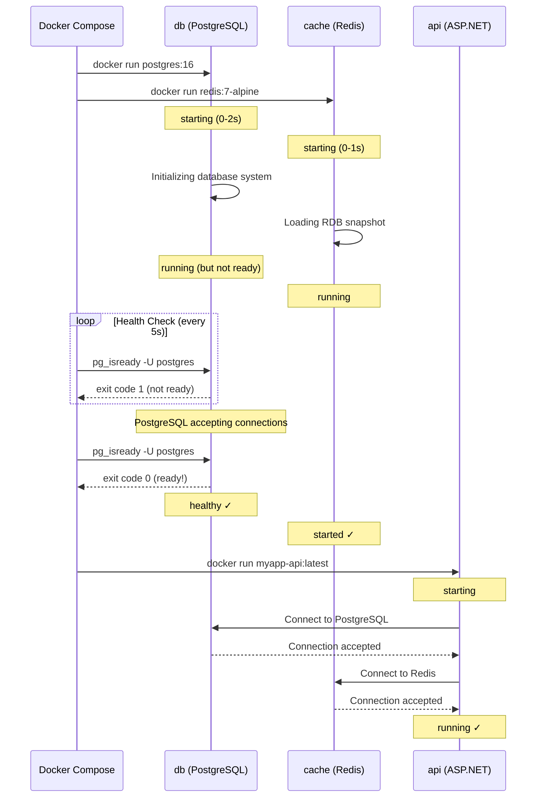
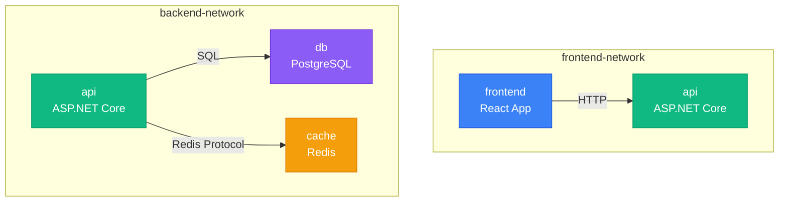
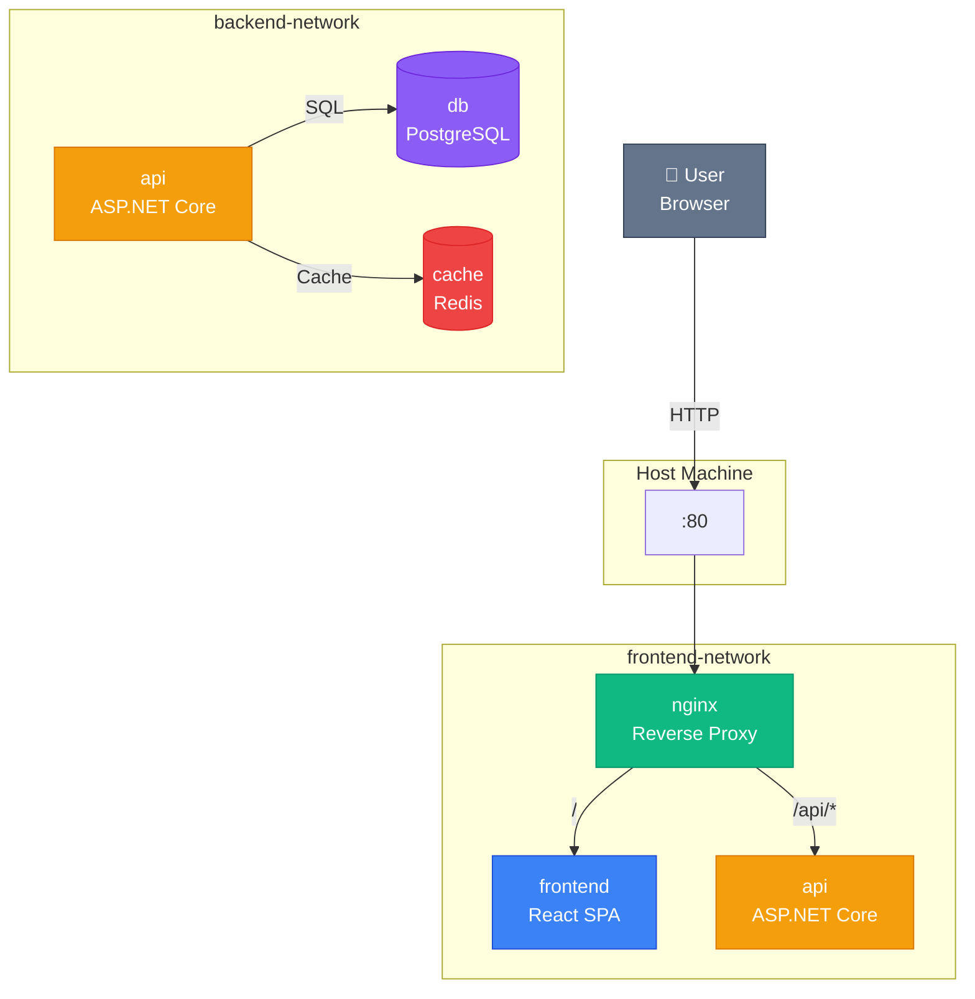

# Docker Compose — Multi-Service застосунки

## Від простого до складного

У попередній статті ми познайомилися з основами Docker Compose: створили базовий `docker-compose.yml` файл, запустили двосервісний застосунок (C# API + PostgreSQL), та навчилися керувати lifecycle через команди `docker compose up/down`. Це був фундамент — мінімальна конфігурація, достатня для розуміння концепції.

**Але реальні застосунки рідко обмежуються двома сервісами.** Сучасна архітектура веб-застосунку може включати:

- **Backend API** (ASP.NET Core, Node.js, Python)
- **Frontend** (React, Vue, Angular)
- **База даних** (PostgreSQL, MySQL, MongoDB)
- **Кеш** (Redis, Memcached)
- **Message Queue** (RabbitMQ, Kafka)
- **Reverse Proxy** (Nginx, Traefik)
- **Моніторинг** (Prometheus, Grafana)
- **Утилітні сервіси** (Adminer, pgAdmin, Redis Commander)

Кожен з цих компонентів має свої **залежності** (база даних має запуститися до API), **мережеві вимоги** (frontend не повинен мати прямого доступу до бази даних), **вимоги до даних** (volumes для персистентності), та **конфігурацію** (environment variables, secrets).

**Проблема:** Як організувати такий складний multi-service застосунок у Docker Compose, щоб він був:

1. **Надійним** — сервіси запускаються у правильному порядку, чекають готовності залежностей
2. **Безпечним** — мережева ізоляція, обмеження доступу, secrets management
3. **Гнучким** — можливість запускати різні конфігурації (dev/prod, з/без моніторингу)
4. **Масштабованим** — можливість запускати кілька екземплярів сервісу
5. **Підтримуваним** — зрозуміла структура, перевикористання конфігурацій

У цій статті ми детально розглянемо **просунуті можливості Docker Compose**, які дозволяють вирішити ці проблеми. Ми побудуємо повноцінний multi-service застосунок з правильною архітектурою, навчимося керувати залежностями через `depends_on` та health checks, організуємо мережеву топологію з ізоляцією рівнів, налаштуємо profiles для різних середовищ, та застосуємо patterns для перевикористання конфігурацій.

::note
Ця стаття передбачає розуміння базових концепцій Docker Compose з попередньої статті. Тут ми зосередимося на orchestration patterns та advanced features.
::

---

## Залежності між сервісами

### Проблема порядку запуску

Коли ви запускаєте `docker compose up`, Compose створює та запускає всі сервіси **паралельно** (для швидкості). Але це створює проблему:

**Сценарій:** Ваш ASP.NET Core API намагається підключитися до PostgreSQL при старті (у `Program.cs` через `DbContext`). Якщо контейнер з API запуститься **раніше** за контейнер з базою даних, застосунок отримає помилку підключення та завершиться з exit code 1.

```csharp
// Program.cs — типовий код ініціалізації
var builder = WebApplication.CreateBuilder(args);
builder.Services.AddDbContext<AppDbContext>(options =>
    options.UseNpgsql(builder.Configuration.GetConnectionString("DefaultConnection")));

var app = builder.Build();

// Якщо PostgreSQL ще не готовий — exception!
using (var scope = app.Services.CreateScope())
{
    var db = scope.ServiceProvider.GetRequiredService<AppDbContext>();
    db.Database.Migrate(); // ❌ Npgsql.NpgsqlException: Connection refused
}
```

**Наївне рішення:** Додати `sleep 10` перед запуском API. Це **anti-pattern** — ви не знаєте, скільки часу потрібно базі даних для ініціалізації (залежить від навантаження системи, розміру даних, тощо).

**Правильне рішення:** Використовувати механізми Docker Compose для керування залежностями.

### `depends_on` — базовий механізм

Директива `depends_on` дозволяє вказати, що один сервіс **залежить** від іншого. Compose запустить залежності **перед** залежним сервісом.

**Синтаксис (базовий):**

```yaml
services:
  api:
    image: myapp-api:latest
    depends_on:
      - db
      - cache

  db:
    image: postgres:16

  cache:
    image: redis:7-alpine
```

**Що відбувається:**

1. Compose запускає `db` та `cache` (паралельно)
2. Чекає, поки контейнери `db` та `cache` перейдуть у стан **`running`**
3. Запускає `api`

**Важливо:** `depends_on` чекає лише на **запуск контейнера** (стан `running`), а **не на готовність сервісу всередині**. PostgreSQL контейнер може бути у стані `running`, але сам PostgreSQL сервер ще ініціалізується (створює системні таблиці, завантажує конфігурацію). Це займає 2-5 секунд.

**Результат:** API все одно може отримати помилку підключення, якщо спробує з'єднатися з базою даних до завершення її ініціалізації.

### `depends_on` з умовами — правильний підхід

Docker Compose підтримує **розширений синтаксис** `depends_on` з умовами очікування:

```yaml
services:
  api:
    image: myapp-api:latest
    depends_on:
      db:
        condition: service_healthy
      cache:
        condition: service_started

  db:
    image: postgres:16
    healthcheck:
      test: ["CMD-SHELL", "pg_isready -U postgres"]
      interval: 5s
      timeout: 3s
      retries: 5
      start_period: 10s

  cache:
    image: redis:7-alpine
```

**Розбір конфігурації:**

**1. `condition: service_healthy`** — Compose чекає, поки сервіс `db` перейде у стан **`healthy`** (не просто `running`). Це означає, що PostgreSQL **дійсно готовий** приймати з'єднання.

**2. `healthcheck`** — визначає, як перевіряти здоров'я сервісу:

- **`test`** — команда для перевірки. `pg_isready` — утиліта PostgreSQL, яка повертає exit code 0, якщо сервер готовий
- **`interval: 5s`** — перевіряти кожні 5 секунд
- **`timeout: 3s`** — якщо команда не завершилася за 3 секунди — вважати невдалою
- **`retries: 5`** — після 5 невдалих спроб вважати контейнер `unhealthy`
- **`start_period: 10s`** — grace period після запуску контейнера, коли невдалі перевірки не враховуються (дає час на ініціалізацію)

**3. `condition: service_started`** — для Redis достатньо просто дочекатися запуску контейнера (Redis стартує дуже швидко, health check не критичний).

**Lifecycle з health checks:**

::mermaid



::

**Що відбувається покроково:**

1. **t=0s** — Compose запускає `db` та `cache` паралельно
2. **t=0-2s** — Контейнери переходять у стан `running`, але сервіси всередині ще ініціалізуються
3. **t=2s** — Compose починає health check для `db` (перша спроба після `start_period`)
4. **t=2-10s** — Health checks повертають exit code 1 (PostgreSQL ще не готовий)
5. **t=12s** — PostgreSQL завершив ініціалізацію, `pg_isready` повертає exit code 0
6. **t=12s** — `db` переходить у стан `healthy`, `cache` вже у стані `started`
7. **t=12s** — Compose запускає `api`
8. **t=13s** — API успішно підключається до бази даних та Redis

**Результат:** API **ніколи** не отримає помилку підключення, бо Compose гарантує, що база даних готова до прийому з'єднань.

### Доступні умови `depends_on`

Docker Compose підтримує чотири типи умов:

::field-group

::field{name="service_started" type="condition"}
Чекати, поки контейнер перейде у стан `running`. Найшвидша умова, але не гарантує готовність сервісу всередині.

**Використання:** Для сервісів, які стартують миттєво (Redis, Memcached) або коли залежність не критична.
::

::field{name="service_healthy" type="condition"}
Чекати, поки контейнер перейде у стан `healthy` (health check повертає success). Вимагає наявності `healthcheck` у сервісі.

**Використання:** Для баз даних, message queues, будь-яких сервісів з тривалою ініціалізацією.
::

::field{name="service_completed_successfully" type="condition"}
Чекати, поки контейнер завершиться з exit code 0. Використовується для init-контейнерів (міграції, seed даних).

**Використання:** Для одноразових задач, які мають виконатися перед запуском основного сервісу.
::

::field{name="service_completed" type="condition"}
Чекати, поки контейнер завершиться (будь-який exit code). Рідко використовується.
::

::

### Приклад з init-контейнером

Часто потрібно виконати **міграції бази даних** перед запуском API. Для цього використовується окремий сервіс з умовою `service_completed_successfully`:

```yaml
services:
  db:
    image: postgres:16
    environment:
      POSTGRES_PASSWORD: secret
      POSTGRES_DB: myapp
    healthcheck:
      test: ["CMD-SHELL", "pg_isready -U postgres"]
      interval: 5s
      timeout: 3s
      retries: 5

  migrations:
    image: myapp-api:latest
    command: dotnet ef database update
    depends_on:
      db:
        condition: service_healthy
    environment:
      ConnectionStrings__DefaultConnection: "Host=db;Database=myapp;Username=postgres;Password=secret"
    restart: "no"  # Не перезапускати після завершення

  api:
    image: myapp-api:latest
    depends_on:
      migrations:
        condition: service_completed_successfully
    ports:
      - "5000:8080"
    environment:
      ConnectionStrings__DefaultConnection: "Host=db;Database=myapp;Username=postgres;Password=secret"
```

**Порядок виконання:**

1. Запускається `db`, чекаємо `healthy`
2. Запускається `migrations`, виконує `dotnet ef database update`, завершується з exit code 0
3. Запускається `api` — база даних вже має актуальну схему

**Важливо:** `restart: "no"` для `migrations` — інакше Compose буде перезапускати контейнер після завершення, що призведе до повторного виконання міграцій.

---

## Мережева топологія та ізоляція

### Проблема плоскої мережі

За замовчуванням Docker Compose створює **одну мережу** для всіх сервісів у `docker-compose.yml`. Це означає, що **кожен сервіс може з'єднатися з будь-яким іншим** за іменем:

```yaml
services:
  frontend:
    image: myapp-frontend:latest
  
  api:
    image: myapp-api:latest
  
  db:
    image: postgres:16
```

У цій конфігурації `frontend` може **напряму** підключитися до `db` за адресою `postgresql://db:5432`. Це **порушення принципу least privilege** — frontend не повинен мати доступу до бази даних, він має комунікувати лише з API.

**Проблеми плоскої мережі:**

1. **Безпека** — компрометація frontend-контейнера дає доступ до бази даних
2. **Архітектурна чистота** — порушення layered architecture (presentation → business → data)
3. **Складність налагодження** — важко зрозуміти, хто з ким комунікує

**Рішення:** Створити **кілька мереж** з чіткою ізоляцією рівнів.

### Багатомережева архітектура

Типова трирівнева архітектура веб-застосунку:

- **Frontend Network** — frontend ↔ API
- **Backend Network** — API ↔ Database/Cache/Queue

```yaml
services:
  frontend:
    image: myapp-frontend:latest
    networks:
      - frontend-network
    ports:
      - "3000:3000"

  api:
    image: myapp-api:latest
    networks:
      - frontend-network  # Доступний для frontend
      - backend-network   # Має доступ до DB
    ports:
      - "5000:8080"

  db:
    image: postgres:16
    networks:
      - backend-network   # Ізольований від frontend
    environment:
      POSTGRES_PASSWORD: secret

  cache:
    image: redis:7-alpine
    networks:
      - backend-network

networks:
  frontend-network:
    driver: bridge
  backend-network:
    driver: bridge
```

**Мережева топологія:**

::mermaid



::

**Що відбувається:**

- `frontend` може з'єднатися з `api` (обидва у `frontend-network`)
- `api` може з'єднатися з `db` та `cache` (всі у `backend-network`)
- `frontend` **НЕ МОЖЕ** з'єднатися з `db` або `cache` (різні мережі, немає маршруту)

**Перевірка ізоляції:**

```bash
# Спроба підключитися до PostgreSQL з frontend-контейнера
docker compose exec frontend ping db
# ping: db: Name or service not known ✓

# Спроба підключитися до PostgreSQL з api-контейнера
docker compose exec api ping db
# PING db (172.20.0.3): 56 data bytes ✓
```

### Іменування мереж

За замовчуванням Docker Compose додає **префікс** до імен мереж: `<project-name>_<network-name>`. Якщо ваш проєкт знаходиться у директорії `myapp`, мережа `frontend-network` матиме реальне ім'я `myapp_frontend-network`.

**Перевірка:**

```bash
docker network ls
# NETWORK ID     NAME                      DRIVER    SCOPE
# a1b2c3d4e5f6   myapp_frontend-network    bridge    local
# f6e5d4c3b2a1   myapp_backend-network     bridge    local
```

**Кастомне ім'я проєкту:**

Ви можете змінити префікс через змінну оточення `COMPOSE_PROJECT_NAME` або прапорець `-p`:

```bash
# Через змінну оточення
export COMPOSE_PROJECT_NAME=kostyl
docker compose up

# Через прапорець
docker compose -p kostyl up
```

**Використання зовнішніх мереж:**

Якщо мережа вже існує (створена вручну або іншим Compose-проєктом), використовуйте `external: true`:

```yaml
networks:
  shared-network:
    external: true
    name: company-shared-network
```

Це корисно, коли кілька застосунків мають комунікувати між собою (наприклад, через спільний Nginx reverse proxy).

---

## Управління томами

### Іменовані томи для персистентності

У попередній статті ми використовували іменовані томи для збереження даних PostgreSQL. У multi-service застосунках томів може бути багато:

```yaml
services:
  db:
    image: postgres:16
    volumes:
      - postgres-data:/var/lib/postgresql/data

  cache:
    image: redis:7-alpine
    volumes:
      - redis-data:/data

  rabbitmq:
    image: rabbitmq:3-management
    volumes:
      - rabbitmq-data:/var/lib/rabbitmq

volumes:
  postgres-data:
    driver: local
  redis-data:
    driver: local
  rabbitmq-data:
    driver: local
```

**Важливо:** Секція `volumes:` на верхньому рівні **декларує** томи. Якщо ви не вкажете том у цій секції, Compose створить його автоматично, але з префіксом проєкту.

### Bind mounts для конфігурації

Для передачі конфігураційних файлів у контейнери використовуйте **bind mounts**:

```yaml
services:
  nginx:
    image: nginx:alpine
    volumes:
      - ./nginx/nginx.conf:/etc/nginx/nginx.conf:ro
      - ./nginx/conf.d:/etc/nginx/conf.d:ro
      - ./static:/usr/share/nginx/html:ro
    ports:
      - "80:80"

  db:
    image: postgres:16
    volumes:
      - postgres-data:/var/lib/postgresql/data
      - ./init-scripts:/docker-entrypoint-initdb.d:ro

volumes:
  postgres-data:
```

**Розбір:**

- **`./nginx/nginx.conf:/etc/nginx/nginx.conf:ro`** — монтує файл з хоста у контейнер у **read-only** режимі (`:ro`)
- **`./init-scripts:/docker-entrypoint-initdb.d:ro`** — PostgreSQL автоматично виконає всі `.sql` та `.sh` файли з цієї директорії при першому запуску

**Структура проєкту:**

```
myapp/
├── docker-compose.yml
├── nginx/
│   ├── nginx.conf
│   └── conf.d/
│       └── default.conf
├── init-scripts/
│   ├── 01-schema.sql
│   └── 02-seed.sql
└── static/
    └── index.html
```

### Volumes для розробки (hot reload)

Для розробки зручно монтувати вихідний код у контейнер, щоб зміни застосовувалися без пересборки образу:

```yaml
services:
  api:
    build: ./backend
    volumes:
      - ./backend:/app
      - /app/bin
      - /app/obj
    environment:
      - ASPNETCORE_ENVIRONMENT=Development
      - DOTNET_USE_POLLING_FILE_WATCHER=true
    command: dotnet watch run
```

**Розбір:**

- **`./backend:/app`** — монтує вихідний код у контейнер
- **`/app/bin` та `/app/obj`** — анонімні томи, які **перекривають** директорії з хоста (інакше артефакти збірки з хоста конфліктуватимуть з контейнерними)
- **`dotnet watch run`** — автоматично перезапускає застосунок при зміні файлів
- **`DOTNET_USE_POLLING_FILE_WATCHER=true`** — використовувати polling замість inotify (потрібно для Docker на macOS/Windows)

::warning
**Увага:** Bind mounts для коду працюють добре на Linux, але на **macOS та Windows** можуть бути проблеми з продуктивністю через overhead віртуалізації файлової системи. Для production завжди використовуйте `COPY` у Dockerfile.
::

---

## Масштабування сервісів

### Запуск кількох екземплярів

Docker Compose дозволяє запускати **кілька екземплярів** одного сервісу через прапорець `--scale`:

```yaml
services:
  api:
    image: myapp-api:latest
    networks:
      - backend-network
    environment:
      - DATABASE_URL=postgresql://db:5432/myapp

  db:
    image: postgres:16
    networks:
      - backend-network
```

**Запуск 3 екземплярів API:**

```bash
docker compose up --scale api=3
```

**Що відбувається:**

- Compose створює 3 контейнери: `myapp-api-1`, `myapp-api-2`, `myapp-api-3`
- Всі контейнери підключені до `backend-network`
- Кожен може з'єднатися з `db` за іменем

**Проблема:** Якщо у сервісі вказано `ports`, масштабування **не працюватиме**:

```yaml
services:
  api:
    image: myapp-api:latest
    ports:
      - "5000:8080"  # ❌ Конфлікт портів при --scale api=3
```

**Помилка:**

```
Error response from daemon: driver failed programming external connectivity:
Bind for 0.0.0.0:5000 failed: port is already allocated
```

**Рішення 1:** Видалити `ports` та використовувати reverse proxy (Nginx, Traefik) для load balancing:

```yaml
services:
  nginx:
    image: nginx:alpine
    ports:
      - "80:80"
    volumes:
      - ./nginx.conf:/etc/nginx/nginx.conf:ro
    depends_on:
      - api

  api:
    image: myapp-api:latest
    # Без ports — доступний лише всередині мережі
```

**nginx.conf з upstream:**

```nginx
upstream api_backend {
    server api:8080;  # Docker DNS автоматично балансує між екземплярами
}

server {
    listen 80;
    
    location /api/ {
        proxy_pass http://api_backend;
        proxy_set_header Host $host;
        proxy_set_header X-Real-IP $remote_addr;
    }
}
```

**Рішення 2:** Використовувати динамічне призначення портів:

```yaml
services:
  api:
    image: myapp-api:latest
    ports:
      - "5000-5010:8080"  # Compose призначить вільний порт з діапазону
```

### Директива `deploy` (Compose Spec v3+)

Для декларативного масштабування використовуйте секцію `deploy`:

```yaml
services:
  api:
    image: myapp-api:latest
    deploy:
      replicas: 3
      resources:
        limits:
          cpus: '0.5'
          memory: 512M
        reservations:
          cpus: '0.25'
          memory: 256M
      restart_policy:
        condition: on-failure
        delay: 5s
        max_attempts: 3
```

**Важливо:** Секція `deploy` **ігнорується** у `docker compose up` (працює лише у Docker Swarm або Kubernetes). Для локальної розробки використовуйте `--scale`.

---

## Profiles — конфігурації для різних середовищ

### Проблема "зайвих" сервісів

У development-середовищі часто потрібні **утилітні сервіси** для налагодження:

- **Adminer** — веб-інтерфейс для PostgreSQL
- **Redis Commander** — веб-інтерфейс для Redis
- **Mailhog** — SMTP-сервер для тестування email

Але у **production** ці сервіси не потрібні (і навіть небезпечні). Як організувати `docker-compose.yml`, щоб можна було запускати різні набори сервісів?

**Наївне рішення:** Створити два файли — `docker-compose.dev.yml` та `docker-compose.prod.yml`. Це призводить до дублювання конфігурації.

**Правильне рішення:** Використовувати **profiles**.

### Синтаксис profiles

Profiles дозволяють **групувати** сервіси та запускати лише потрібні групи:

```yaml
services:
  # Основні сервіси (без profile — запускаються завжди)
  api:
    image: myapp-api:latest
    depends_on:
      db:
        condition: service_healthy

  db:
    image: postgres:16
    healthcheck:
      test: ["CMD-SHELL", "pg_isready -U postgres"]
      interval: 5s

  cache:
    image: redis:7-alpine

  # Утилітні сервіси (profile: tools)
  adminer:
    image: adminer:latest
    ports:
      - "8080:8080"
    profiles:
      - tools
    depends_on:
      - db

  redis-commander:
    image: rediscommander/redis-commander:latest
    ports:
      - "8081:8081"
    environment:
      - REDIS_HOSTS=local:cache:6379
    profiles:
      - tools
    depends_on:
      - cache

  # Моніторинг (profile: monitoring)
  prometheus:
    image: prom/prometheus:latest
    ports:
      - "9090:9090"
    volumes:
      - ./prometheus.yml:/etc/prometheus/prometheus.yml:ro
    profiles:
      - monitoring

  grafana:
    image: grafana/grafana:latest
    ports:
      - "3000:3000"
    profiles:
      - monitoring
    depends_on:
      - prometheus
```

**Запуск різних конфігурацій:**

```bash
# Лише основні сервіси (api, db, cache)
docker compose up

# Основні + утилітні
docker compose --profile tools up

# Основні + моніторинг
docker compose --profile monitoring up

# Основні + утилітні + моніторинг
docker compose --profile tools --profile monitoring up

# Або через змінну оточення
export COMPOSE_PROFILES=tools,monitoring
docker compose up
```

**Перевірка активних profiles:**

```bash
docker compose config --profiles
# tools
# monitoring
```

### Комбінування з override файлами

Для складніших сценаріїв комбінуйте profiles з **override файлами**:

**docker-compose.yml** (базова конфігурація):

```yaml
services:
  api:
    image: myapp-api:latest
    environment:
      - ASPNETCORE_ENVIRONMENT=Production

  db:
    image: postgres:16
    environment:
      - POSTGRES_PASSWORD_FILE=/run/secrets/db_password
    secrets:
      - db_password

secrets:
  db_password:
    file: ./secrets/db_password.txt
```

**docker-compose.override.yml** (автоматично застосовується у dev):

```yaml
services:
  api:
    build: ./backend
    volumes:
      - ./backend:/app
    environment:
      - ASPNETCORE_ENVIRONMENT=Development
    command: dotnet watch run

  db:
    environment:
      - POSTGRES_PASSWORD=dev_password  # Перекриває secrets для dev
    ports:
      - "5432:5432"  # Відкриває порт для локального доступу

  adminer:
    image: adminer:latest
    ports:
      - "8080:8080"
    profiles:
      - tools
```

**Використання:**

```bash
# Development (застосовує обидва файли)
docker compose up

# Production (лише базовий файл)
docker compose -f docker-compose.yml up
```

Docker Compose автоматично шукає файл `docker-compose.override.yml` та **мержить** його з `docker-compose.yml`. Це дозволяє тримати production-конфігурацію у базовому файлі, а development-специфічні налаштування — в override.

---

## Перевикористання конфігурацій через `extends`

### Проблема дублювання

Уявіть, що у вас є кілька .NET API-сервісів з однаковою базовою конфігурацією:

```yaml
services:
  users-api:
    image: myapp-users-api:latest
    environment:
      - ASPNETCORE_ENVIRONMENT=Production
      - ASPNETCORE_URLS=http://+:8080
    healthcheck:
      test: ["CMD-SHELL", "curl -f http://localhost:8080/health || exit 1"]
      interval: 10s
      timeout: 3s
      retries: 3
    restart: unless-stopped

  orders-api:
    image: myapp-orders-api:latest
    environment:
      - ASPNETCORE_ENVIRONMENT=Production
      - ASPNETCORE_URLS=http://+:8080
    healthcheck:
      test: ["CMD-SHELL", "curl -f http://localhost:8080/health || exit 1"]
      interval: 10s
      timeout: 3s
      retries: 3
    restart: unless-stopped

  products-api:
    image: myapp-products-api:latest
    environment:
      - ASPNETCORE_ENVIRONMENT=Production
      - ASPNETCORE_URLS=http://+:8080
    healthcheck:
      test: ["CMD-SHELL", "curl -f http://localhost:8080/health || exit 1"]
      interval: 10s
      timeout: 3s
      retries: 3
    restart: unless-stopped
```

**Проблема:** Якщо потрібно змінити health check (наприклад, збільшити `interval`), доведеться редагувати **три місця**. Це порушує принцип DRY (Don't Repeat Yourself).

### Рішення через `extends`

Створіть **базовий шаблон** у окремому файлі:

**docker-compose.base.yml:**

```yaml
services:
  dotnet-api-base:
    environment:
      - ASPNETCORE_ENVIRONMENT=Production
      - ASPNETCORE_URLS=http://+:8080
    healthcheck:
      test: ["CMD-SHELL", "curl -f http://localhost:8080/health || exit 1"]
      interval: 10s
      timeout: 3s
      retries: 3
      start_period: 30s
    restart: unless-stopped
    networks:
      - backend-network
```

**docker-compose.yml:**

```yaml
services:
  users-api:
    extends:
      file: docker-compose.base.yml
      service: dotnet-api-base
    image: myapp-users-api:latest
    environment:
      - DATABASE_URL=postgresql://db:5432/users

  orders-api:
    extends:
      file: docker-compose.base.yml
      service: dotnet-api-base
    image: myapp-orders-api:latest
    environment:
      - DATABASE_URL=postgresql://db:5432/orders

  products-api:
    extends:
      file: docker-compose.base.yml
      service: dotnet-api-base
    image: myapp-products-api:latest
    environment:
      - DATABASE_URL=postgresql://db:5432/products

  db:
    image: postgres:16
    networks:
      - backend-network

networks:
  backend-network:
```

**Що відбувається:**

1. Кожен сервіс **наслідує** конфігурацію з `dotnet-api-base`
2. Специфічні параметри (`image`, додаткові `environment`) **доповнюють** або **перекривають** базові
3. Зміна health check у `docker-compose.base.yml` автоматично застосується до всіх сервісів

**Правила мержу:**

- **Скалярні значення** (strings, numbers) — перекриваються
- **Списки** (`environment`, `volumes`) — об'єднуються
- **Мапи** (`labels`, `deploy.resources`) — мержаться рекурсивно

### Альтернатива: YAML anchors

Якщо ви не хочете створювати окремий файл, використовуйте **YAML anchors**:

```yaml
x-dotnet-api-defaults: &dotnet-api-defaults
  environment:
    - ASPNETCORE_ENVIRONMENT=Production
    - ASPNETCORE_URLS=http://+:8080
  healthcheck:
    test: ["CMD-SHELL", "curl -f http://localhost:8080/health || exit 1"]
    interval: 10s
    timeout: 3s
    retries: 3
  restart: unless-stopped

services:
  users-api:
    <<: *dotnet-api-defaults
    image: myapp-users-api:latest
    environment:
      - DATABASE_URL=postgresql://db:5432/users

  orders-api:
    <<: *dotnet-api-defaults
    image: myapp-orders-api:latest
    environment:
      - DATABASE_URL=postgresql://db:5432/orders
```

**Розбір:**

- **`x-dotnet-api-defaults:`** — extension field (починається з `x-`), ігнорується Docker Compose, використовується лише для anchors
- **`&dotnet-api-defaults`** — створює anchor (посилання)
- **`<<: *dotnet-api-defaults`** — вставляє вміст anchor у сервіс

::tip
**Коли використовувати що:**

- **`extends`** — для перевикористання між файлами (base + overrides)
- **YAML anchors** — для перевикористання всередині одного файлу
::

---

## Практичний приклад: Повноцінний multi-service застосунок

Тепер застосуємо всі вивчені концепції для створення реального застосунку з правильною архітектурою.

**Архітектура:**

- **Frontend** (React) — порт 3000
- **Backend API** (ASP.NET Core) — порт 5000
- **PostgreSQL** — база даних
- **Redis** — кеш та session storage
- **Nginx** — reverse proxy та статичні файли
- **Adminer** — веб-інтерфейс для PostgreSQL (dev only)

**Мережева топологія:**

- `frontend-network` — Nginx ↔ Frontend ↔ API
- `backend-network` — API ↔ PostgreSQL ↔ Redis

**docker-compose.yml:**

```yaml
version: '3.9'

services:
  # ============================================
  # Frontend Layer
  # ============================================
  frontend:
    build:
      context: ./frontend
      dockerfile: Dockerfile
    networks:
      - frontend-network
    environment:
      - REACT_APP_API_URL=http://localhost/api
    depends_on:
      - api

  # ============================================
  # API Layer
  # ============================================
  api:
    build:
      context: ./backend
      dockerfile: Dockerfile
    networks:
      - frontend-network
      - backend-network
    environment:
      - ASPNETCORE_ENVIRONMENT=Production
      - ASPNETCORE_URLS=http://+:8080
      - ConnectionStrings__DefaultConnection=Host=db;Database=myapp;Username=postgres;Password=${DB_PASSWORD}
      - Redis__ConnectionString=cache:6379
    depends_on:
      db:
        condition: service_healthy
      cache:
        condition: service_started
    healthcheck:
      test: ["CMD-SHELL", "curl -f http://localhost:8080/health || exit 1"]
      interval: 10s
      timeout: 3s
      retries: 3
      start_period: 30s
    restart: unless-stopped

  # ============================================
  # Database Layer
  # ============================================
  db:
    image: postgres:16-alpine
    networks:
      - backend-network
    environment:
      - POSTGRES_DB=myapp
      - POSTGRES_USER=postgres
      - POSTGRES_PASSWORD=${DB_PASSWORD}
    volumes:
      - postgres-data:/var/lib/postgresql/data
      - ./init-scripts:/docker-entrypoint-initdb.d:ro
    healthcheck:
      test: ["CMD-SHELL", "pg_isready -U postgres"]
      interval: 5s
      timeout: 3s
      retries: 5
      start_period: 10s
    restart: unless-stopped

  cache:
    image: redis:7-alpine
    networks:
      - backend-network
    volumes:
      - redis-data:/data
    command: redis-server --appendonly yes
    healthcheck:
      test: ["CMD", "redis-cli", "ping"]
      interval: 5s
      timeout: 3s
      retries: 3
    restart: unless-stopped

  # ============================================
  # Reverse Proxy
  # ============================================
  nginx:
    image: nginx:alpine
    networks:
      - frontend-network
    ports:
      - "80:80"
      - "443:443"
    volumes:
      - ./nginx/nginx.conf:/etc/nginx/nginx.conf:ro
      - ./nginx/conf.d:/etc/nginx/conf.d:ro
      - ./static:/usr/share/nginx/html:ro
    depends_on:
      - frontend
      - api
    restart: unless-stopped

  # ============================================
  # Development Tools (profile: tools)
  # ============================================
  adminer:
    image: adminer:latest
    networks:
      - backend-network
      - frontend-network
    ports:
      - "8080:8080"
    environment:
      - ADMINER_DEFAULT_SERVER=db
    profiles:
      - tools
    depends_on:
      - db

# ============================================
# Networks
# ============================================
networks:
  frontend-network:
    driver: bridge
  backend-network:
    driver: bridge

# ============================================
# Volumes
# ============================================
volumes:
  postgres-data:
    driver: local
  redis-data:
    driver: local
```

**.env файл:**

```bash
# Database
DB_PASSWORD=super_secret_password_change_in_production

# Compose
COMPOSE_PROJECT_NAME=myapp
```

**Запуск:**

```bash
# Production (без dev tools)
docker compose up -d

# Development (з Adminer)
docker compose --profile tools up -d

# Перегляд логів
docker compose logs -f api

# Перевірка здоров'я
docker compose ps
```

**Очікуваний вивід `docker compose ps`:**

::terminal-preview{title="docker compose ps"}
<div class="line"><span class="opacity-40">NAME</span>                <span class="opacity-40">IMAGE</span>              <span class="opacity-40">STATUS</span>                   <span class="opacity-40">PORTS</span></div>
<div class="line">myapp-nginx-1       nginx:alpine       Up 2 minutes (healthy)   0.0.0.0:80->80/tcp</div>
<div class="line">myapp-frontend-1    myapp-frontend     Up 2 minutes             </div>
<div class="line">myapp-api-1         myapp-api          Up 2 minutes (healthy)   </div>
<div class="line">myapp-db-1          postgres:16        Up 3 minutes (healthy)   </div>
<div class="line">myapp-cache-1       redis:7-alpine     Up 3 minutes (healthy)   </div>
::

**Мережева діаграма:**

::mermaid



::

---

## Резюме

У цій статті ми розглянули просунуті можливості Docker Compose для організації складних multi-service застосунків:

**Залежності між сервісами:**

- `depends_on` з умовами (`service_healthy`, `service_started`, `service_completed_successfully`)
- Health checks для гарантії готовності сервісів
- Init-контейнери для міграцій та seed даних

**Мережева топологія:**

- Багатомережева архітектура для ізоляції рівнів
- Принцип least privilege — frontend не має доступу до бази даних
- Іменування та зовнішні мережі

**Управління томами:**

- Іменовані томи для персистентності
- Bind mounts для конфігурації та розробки
- Анонімні томи для перекриття директорій

**Масштабування:**

- `--scale` для запуску кількох екземплярів
- Reverse proxy для load balancing
- Обмеження ресурсів через `deploy.resources`

**Profiles:**

- Групування сервісів за призначенням (tools, monitoring)
- Запуск різних конфігурацій однією командою
- Комбінування з override файлами

**Перевикористання конфігурацій:**

- `extends` для наслідування між файлами
- YAML anchors для DRY всередині файлу

У наступній статті ми застосуємо ці знання для створення **повноцінного full-stack .NET застосунку** з фронтендом, бекендом, базою даних та всіма необхідними сервісами — від розробки до production deployment.

---

## Практичні завдання

### Рівень 1: Базове розуміння

**Завдання 1.1:** Створіть `docker-compose.yml` з трьома сервісами: Nginx, PostgreSQL, Redis. Налаштуйте `depends_on` так, щоб Nginx запускався останнім.

**Завдання 1.2:** Додайте health checks для PostgreSQL та Redis. Перевірте статус через `docker compose ps`.

**Завдання 1.3:** Створіть дві мережі: `frontend` та `backend`. Підключіть Nginx до `frontend`, PostgreSQL та Redis до `backend`.

### Рівень 2: Архітектура та ізоляція

**Завдання 2.1:** Розширте конфігурацію з Завдання 1.3: додайте сервіс `api`, який має доступ до обох мереж. Перевірте, що Nginx може з'єднатися з `api`, але не може з `db`.

**Завдання 2.2:** Створіть init-контейнер `migrations`, який виконує SQL-скрипт перед запуском `api`. Використайте `condition: service_completed_successfully`.

**Завдання 2.3:** Налаштуйте profiles: `tools` (Adminer, Redis Commander) та `monitoring` (Prometheus). Запустіть застосунок з різними комбінаціями profiles.

### Рівень 3: Production-Ready конфігурація

**Завдання 3.1:** Створіть повноцінний multi-service застосунок з ASP.NET Core API, PostgreSQL, Redis, Nginx. Організуйте структуру проєкту з окремими директоріями для кожного сервісу.

**Завдання 3.2:** Реалізуйте перевикористання конфігурацій через `extends` або YAML anchors для кількох API-сервісів з однаковими health checks.

**Завдання 3.3:** Створіть `docker-compose.yml` (production) та `docker-compose.override.yml` (development). У dev-версії додайте bind mounts для hot reload, відкрийте порти для прямого доступу до БД, додайте Adminer.

