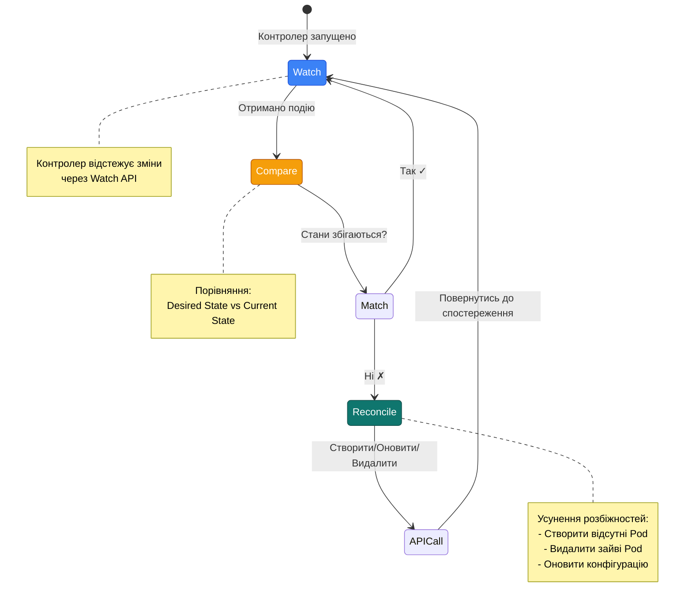
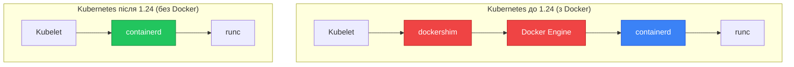

# Архітектура Kubernetes — анатомія кластера

## Від одного демона до розподіленої системи

Коли ви працювали з Docker, вся взаємодія зводилась до однієї простої схеми: ви виконували `docker run`, Docker-демон (`dockerd`) на вашому сервері отримував команду, завантажував образ і запускав контейнер. Один хост — один демон — одна точка управління. Усе прозоро і зрозуміло.

Kubernetes принципово інший. Він не є одним процесом і не працює на одній машині. Kubernetes — це **розподілена система**: сукупність кількох взаємодіючих компонентів, розгорнутих на різних машинах, які разом утворюють єдиний керований простір.

Розуміння цієї архітектури є необхідною умовою для ефективної роботи з Kubernetes. Без нього навіть прості помилки стають незрозумілими, а усунення несправностей перетворюється на вгадування. У цій статті ми пройдемо анатомію кластера від зовнішнього вигляду до внутрішніх механізмів — крок за кроком, без пропусків.

::note
У цій статті ми розглядаємо архітектуру концептуально. Практичне встановлення локального кластера та перші команди — тема наступної статті.
::

---

## Кластер — основна одиниця Kubernetes

Перша і найважливіша концепція, яку необхідно засвоїти: у Kubernetes ви не працюєте з окремими серверами. Ви працюєте з **кластером**.

**Кластер** (cluster) — це сукупність машин (фізичних або віртуальних серверів), обʼєднаних під управлінням Kubernetes і представлених як єдиний обчислювальний ресурс. З точки зору оператора, кластер — це «один великий комп'ютер»: ви описуєте, *що* хочете запустити і *скільки* ресурсів це потребує, а Kubernetes сам вирішує, *де* і *як* це розмістити.

Кожна машина, що входить до кластера, називається **вузлом** (node). Вузли бувають двох типів — але про це трохи пізніше. Спочатку познайомимось з інструментом, яким оператор взаємодіє з кластером.

---

## kubectl — інструмент оператора

**kubectl** (вимовляється «кюб-контрол» або «кюбектл») — це командний рядковий інтерфейс (CLI) для взаємодії з Kubernetes-кластером. Якщо проводити паралель із Docker, `kubectl` відіграє ту саму роль, що і команда `docker` — він формує запити до API кластера та відображає відповіді.

Аналогія точна, але не повна: `docker` CLI спілкується з демоном на *тому ж хості*, тоді як `kubectl` може взаємодіяти з кластером *з будь-якої машини* — з вашого ноутбука, з CI/CD-системи, з іншого сервера — через захищене HTTPS-підключення.

**Загальна анатомія команди kubectl:**

```bash
kubectl [дієслово] [тип-ресурсу] [імʼя] [прапорці]
```

| Частина | Опис | Приклад |
|---|---|---|
| `дієслово` | Що зробити | `get`, `apply`, `delete`, `describe` |
| `тип-ресурсу` | З яким об'єктом | `node`, `pod`, `deployment`, `service` |
| `імʼя` | Конкретний екземпляр (необов'язково) | `my-app-pod` |
| `прапорці` | Додаткові параметри | `-n production`, `-o yaml` |

**Перші команди, які ви виконаєте у будь-якому кластері:**

```bash
# Переглянути вузли кластера та їхній стан
kubectl get nodes

# Переглянути поточний контекст (до якого кластера підключено)
kubectl config current-context
```

::tip
`kubectl` зберігає налаштування підключення (адреси кластерів, credentials, поточний контекст) у файлі `~/.kube/config`. Завдяки цьому ви можете перемикатися між кластерами однією командою: `kubectl config use-context <назва-контексту>`.
::

Тепер, коли ми знаємо інструмент оператора, розглянемо архітектуру того, з чим цей інструмент взаємодіє.

---

## Два типи вузлів: управління та виконання

Як зазначалось вище, кожна машина у кластері — це вузол. Але не всі вузли однакові: вони поділяються на два принципово різні типи залежно від ролі, яку виконують.

**Control Plane** (площина управління) — це «мозок» кластера. Вузли цього типу не запускають ваші застосунки. Їхнє завдання — зберігати стан усієї системи, приймати рішення (що запустити, де розмістити, як реагувати на збої) та автоматично підтримувати бажаний стан. У невеликих кластерах control plane розгортається на одному вузлі; у production — зазвичай на трьох, для відмовостійкості.

**Worker Nodes** (робочі вузли) — це «м'язи» кластера. Саме тут виконуються ваші застосунки. Кожен worker-вузол отримує інструкції від control plane і запускає контейнери відповідно до цих інструкцій. Кількість worker-вузлів визначає обчислювальну потужність кластера і може змінюватись динамічно — вузли можна додавати або видаляти без зупинки системи.

Зверніть увагу на принципову різницю в порівнянні з Docker Compose: там усе виконувалось на одній машині. Тут «управління» і «виконання» фізично розділені.

::diagram-flow{caption="Топологія Kubernetes-кластера: control plane управляє, worker nodes виконують" height="420px" :showMinimap="false" frame="macos" :nodes="[{\"id\":\"user\",\"position\":{\"x\":340,\"y\":20},\"data\":{\"label\":\"Оператор (kubectl)\"},\"style\":{\"background\":\"#475569\",\"color\":\"#fff\",\"fontWeight\":\"bold\",\"borderRadius\":\"8px\",\"padding\":\"10px 16px\"}},{\"id\":\"cp\",\"position\":{\"x\":260,\"y\":120},\"data\":{\"label\":\"Control Plane\"},\"style\":{\"background\":\"#1d4ed8\",\"color\":\"#fff\",\"fontWeight\":\"bold\",\"borderRadius\":\"8px\",\"padding\":\"10px 24px\",\"fontSize\":\"15px\"}},{\"id\":\"w1\",\"position\":{\"x\":60,\"y\":280},\"data\":{\"label\":\"Worker Node 1\"},\"style\":{\"background\":\"#15803d\",\"color\":\"#fff\",\"fontWeight\":\"bold\",\"borderRadius\":\"8px\",\"padding\":\"10px 16px\"}},{\"id\":\"w2\",\"position\":{\"x\":300,\"y\":280},\"data\":{\"label\":\"Worker Node 2\"},\"style\":{\"background\":\"#15803d\",\"color\":\"#fff\",\"fontWeight\":\"bold\",\"borderRadius\":\"8px\",\"padding\":\"10px 16px\"}},{\"id\":\"w3\",\"position\":{\"x\":540,\"y\":280},\"data\":{\"label\":\"Worker Node 3\"},\"style\":{\"background\":\"#15803d\",\"color\":\"#fff\",\"fontWeight\":\"bold\",\"borderRadius\":\"8px\",\"padding\":\"10px 16px\"}}]" :edges="[{\"source\":\"user\",\"target\":\"cp\",\"label\":\"HTTPS запити\",\"animated\":true,\"style\":{\"stroke\":\"#94a3b8\",\"strokeWidth\":2}},{\"source\":\"cp\",\"target\":\"w1\",\"label\":\"інструкції\",\"animated\":true,\"style\":{\"stroke\":\"#3b82f6\",\"strokeWidth\":2}},{\"source\":\"cp\",\"target\":\"w2\",\"label\":\"інструкції\",\"animated\":true,\"style\":{\"stroke\":\"#3b82f6\",\"strokeWidth\":2}},{\"source\":\"cp\",\"target\":\"w3\",\"label\":\"інструкції\",\"animated\":true,\"style\":{\"stroke\":\"#3b82f6\",\"strokeWidth\":2}},{\"source\":\"w1\",\"target\":\"cp\",\"label\":\"статус\",\"style\":{\"stroke\":\"#22c55e\",\"strokeWidth\":1,\"strokeDasharray\":\"5 5\"}},{\"source\":\"w2\",\"target\":\"cp\",\"label\":\"статус\",\"style\":{\"stroke\":\"#22c55e\",\"strokeWidth\":1,\"strokeDasharray\":\"5 5\"}},{\"source\":\"w3\",\"target\":\"cp\",\"label\":\"статус\",\"style\":{\"stroke\":\"#22c55e\",\"strokeWidth\":1,\"strokeDasharray\":\"5 5\"}}]"}
::

Зі схеми видно два потоки комунікації:
- **Оператор → Control Plane**: ваші `kubectl`-команди надходять до control plane через HTTPS.
- **Control Plane ↔ Worker Nodes**: control plane надсилає інструкції вузлам (що запускати), а вузли повертають актуальний статус (що реально виконується).

Ніколи не навпаки: оператор ніколи не спілкується з worker-вузлами напряму. Вся взаємодія відбувається через control plane.

---

## Що таке Pod — базова одиниця виконання

Перш ніж розглядати компоненти вузлів детально, необхідно ввести одне ключове поняття, яке з'являтиметься у кожному наступному розділі.

**Pod** (від англ. «стручок») — це найменша розгортана одиниця у Kubernetes. Не контейнер, а саме Pod. Розуміння цього є принципово важливим для тих, хто приходить із Docker.

У Docker мінімальна одиниця — це контейнер. У Kubernetes — Pod, який є *обгорткою* над одним або кількома контейнерами. Pod гарантує, що всі контейнери всередині нього:
- Запускаються і зупиняються **разом**
- Знаходяться на **одному вузлі**
- Мають **спільну мережу** (один IP на Pod)
- Можуть мати **спільні volumes** (файли)

::note
У переважній більшості випадків Pod містить **один контейнер**. Кілька контейнерів у Pod — це окремий патерн (sidecar), який розглядається у статті про Podʼи. Поки що сприймайте Pod як «контейнер у Kubernetes».
::

Аналогія: якщо Docker-контейнер — це окремий процес в ізольованому середовищі, то Pod — це «мінімальна логічна одиниця вашого застосунку», яку Kubernetes розміщує, масштабує та перезапускає як ціле.

---

## Компоненти Control Plane

Control plane складається з чотирьох основних процесів. Кожен з них має чітко визначену відповідальність — жоден не виконує «все поспіль». Саме така модульність і дозволяє системі бути відмовостійкою та розширюваною.

### kube-apiserver — єдина точка входу

**kube-apiserver** — це HTTP-сервер, через який проходять *абсолютно всі* операції у кластері. Ваш `kubectl`, внутрішні компоненти Kubernetes, зовнішні інструменти — всі вони звертаються виключно до API-сервера. Ніхто не спілкується з `etcd` або планувальником напряму.

::tip
Аналогія з Docker: `kube-apiserver` — це `dockerd`, але для цілого кластера. Так само, як `docker` CLI спілкується з `dockerd` через Unix-socket, `kubectl` спілкується з `kube-apiserver` через захищений HTTPS-канал.
::

#### Потік обробки запиту

Кожен запит до API-сервера проходить через кілька етапів обробки. Розглянемо детально на прикладі команди `kubectl get pods`:

::mermaid

```mermaid
sequenceDiagram
    participant K as kubectl
    participant A as API Server
    participant Auth as Authentication
    participant Authz as Authorization
    participant E as etcd

    K->>A: GET /api/v1/namespaces/default/pods
    A->>Auth: Перевірити сертифікат клієнта
    Auth-->>A: Користувач: admin
    A->>Authz: Чи має admin право читати pods?
    Authz-->>A: Дозволено ✓
    A->>E: Читати /registry/pods/default/*
    E-->>A: Список Pod (JSON)
    A-->>K: HTTP 200 + JSON response
    
    style Auth fill:#f59e0b,stroke:#b45309,color:#fff
    style Authz fill:#3b82f6,stroke:#1d4ed8,color:#fff
    style E fill:#b45309,stroke:#92400e,color:#fff
```

::

**Етапи обробки запиту:**

::field-group

::field{name="1. Authentication (Аутентифікація)" type="етап"}
API-сервер визначає, **хто** надіслав запит. Підтримуються різні методи: клієнтські сертифікати, bearer tokens, basic auth. У більшості кластерів використовуються X.509 сертифікати.
::

::field{name="2. Authorization (Авторизація)" type="етап"}
API-сервер перевіряє, **чи має** цей користувач право виконати цю дію. Використовується RBAC (Role-Based Access Control): користувач → роль → дозволи.
::

::field{name="3. Admission Control (Контроль прийняття)" type="етап"}
Серія плагінів, які можуть **змінити** або **відхилити** запит. Наприклад, `LimitRanger` перевіряє, чи не перевищує Pod ліміти ресурсів namespace.
::

::field{name="4. Validation (Валідація)" type="етап"}
Перевірка структури об'єкта: чи всі обов'язкові поля присутні, чи правильні типи даних, чи валідні значення.
::

::field{name="5. Persistence (Збереження)" type="етап"}
Для запитів на створення/оновлення — збереження об'єкта у `etcd`. Для запитів на читання — отримання даних з `etcd`.
::

::

#### Приклад: створення Deployment

Тепер розглянемо складніший сценарій — `kubectl apply -f deployment.yaml`:

::mermaid

```mermaid
sequenceDiagram
    participant K as kubectl
    participant A as API Server
    participant AC as Admission Controllers
    participant E as etcd
    participant W as Watchers<br/>(scheduler, controller-manager)

    K->>A: POST /apis/apps/v1/namespaces/default/deployments
    Note over A: Authentication ✓<br/>Authorization ✓
    A->>AC: MutatingAdmissionWebhook
    AC-->>A: Додано default values
    A->>AC: ValidatingAdmissionWebhook
    AC-->>A: Валідація пройдена ✓
    A->>E: Зберегти Deployment
    E-->>A: Збережено, revision=1
    A-->>K: HTTP 201 Created
    
    Note over W: Watchers отримують подію
    W->>A: Watch: нові Deployment?
    A-->>W: Event: Deployment створено
    
    style AC fill:#7c3aed,stroke:#5b21b6,color:#fff
    style E fill:#b45309,stroke:#92400e,color:#fff
    style W fill:#0f766e,stroke:#134e4a,color:#fff
```

::

**Ключові моменти:**

1. **Admission Controllers** можуть змінювати об'єкт перед збереженням (наприклад, додавати default значення)
2. **etcd** зберігає об'єкт і повертає номер ревізії
3. **Watchers** (scheduler, controller-manager) отримують подію про новий об'єкт через механізм **watch**

#### Watch API — механізм реального часу

API-сервер підтримує **watch API** — механізм, який дозволяє компонентам отримувати події про зміни у реальному часі, без постійного опитування (polling).

```bash
# Приклад watch-запиту
kubectl get pods --watch
```

Під капотом це HTTP-запит з параметром `?watch=true`, який залишається відкритим, і API-сервер надсилає події через цей канал:

```json
{"type": "ADDED", "object": {"kind": "Pod", "metadata": {"name": "nginx-1"}}}
{"type": "MODIFIED", "object": {"kind": "Pod", "metadata": {"name": "nginx-1"}, "status": {"phase": "Running"}}}
{"type": "DELETED", "object": {"kind": "Pod", "metadata": {"name": "nginx-1"}}}
```

Саме завдяки watch API scheduler дізнається про нові Pod, а controller-manager — про зміни у Deployment.

#### Stateless природа API-сервера

API-сервер є **stateless** (без внутрішнього стану): він не запам'ятовує нічого між запитами. Весь стан кластера живе у `etcd`. Завдяки цьому можна запускати кілька екземплярів API-сервера паралельно для відмовостійкості — всі вони читають і пишуть до одного `etcd`.

::diagram-flow{caption="Високодоступний API-сервер: кілька екземплярів за Load Balancer" height="350px" :showMinimap="false" frame="macos" :nodes="[{\"id\":\"lb\",\"position\":{\"x\":280,\"y\":30},\"data\":{\"label\":\"Load Balancer\"},\"style\":{\"background\":\"#475569\",\"color\":\"#fff\",\"fontWeight\":\"bold\",\"borderRadius\":\"8px\",\"padding\":\"10px 20px\"}},{\"id\":\"api1\",\"position\":{\"x\":80,\"y\":150},\"data\":{\"label\":\"API Server 1\"},\"style\":{\"background\":\"#1d4ed8\",\"color\":\"#fff\",\"fontWeight\":\"bold\",\"borderRadius\":\"8px\",\"padding\":\"8px 16px\"}},{\"id\":\"api2\",\"position\":{\"x\":280,\"y\":150},\"data\":{\"label\":\"API Server 2\"},\"style\":{\"background\":\"#1d4ed8\",\"color\":\"#fff\",\"fontWeight\":\"bold\",\"borderRadius\":\"8px\",\"padding\":\"8px 16px\"}},{\"id\":\"api3\",\"position\":{\"x\":480,\"y\":150},\"data\":{\"label\":\"API Server 3\"},\"style\":{\"background\":\"#1d4ed8\",\"color\":\"#fff\",\"fontWeight\":\"bold\",\"borderRadius\":\"8px\",\"padding\":\"8px 16px\"}},{\"id\":\"etcd\",\"position\":{\"x\":280,\"y\":270},\"data\":{\"label\":\"etcd Cluster\"},\"style\":{\"background\":\"#b45309\",\"color\":\"#fff\",\"fontWeight\":\"bold\",\"borderRadius\":\"8px\",\"padding\":\"10px 20px\"}}]" :edges="[{\"source\":\"lb\",\"target\":\"api1\",\"style\":{\"stroke\":\"#94a3b8\",\"strokeWidth\":2}},{\"source\":\"lb\",\"target\":\"api2\",\"style\":{\"stroke\":\"#94a3b8\",\"strokeWidth\":2}},{\"source\":\"lb\",\"target\":\"api3\",\"style\":{\"stroke\":\"#94a3b8\",\"strokeWidth\":2}},{\"source\":\"api1\",\"target\":\"etcd\",\"style\":{\"stroke\":\"#f59e0b\",\"strokeWidth\":2}},{\"source\":\"api2\",\"target\":\"etcd\",\"style\":{\"stroke\":\"#f59e0b\",\"strokeWidth\":2}},{\"source\":\"api3\",\"target\":\"etcd\",\"style\":{\"stroke\":\"#f59e0b\",\"strokeWidth\":2}}]"}
::

Якщо один екземпляр API-сервера падає — Load Balancer перенаправляє трафік на інші. Жоден стан не втрачається, бо все зберігається у `etcd`.

### etcd — розподілена база даних стану

**etcd** (вимовляється «ет-сі-ді») — це розподілене сховище типу «ключ-значення», яке є **єдиним джерелом правди** для всього кластера. Тут зберігається все: поточний стан Podʼів, конфігурації, секрети, інформація про вузли, права доступу.

Назва «etcd» походить від Unix-конвенції: конфігурації традиційно зберігаються у директорії `/etc`, а суфікс `-d` означає «distributed» (розподілений).

::caution
`etcd` — найкритичніший компонент кластера. Якщо `etcd` повністю втрачає дані — кластер втрачає стан: Kubernetes вже не знає, які Podʼи мали бути запущені, які Deployment існували, які секрети були збережені. Відновлення можливе лише з резервної копії. У production `etcd` обовʼязково розгортається у кластері з трьох вузлів та має регулярні резервні копії.
::

#### Структура даних у etcd

etcd зберігає всі об'єкти Kubernetes у ієрархічній структурі ключів. Кожен об'єкт має унікальний шлях:

```
/registry/
├── pods/
│   ├── default/
│   │   ├── nginx-deployment-7d6b8c9f4d-8xk2p
│   │   ├── nginx-deployment-7d6b8c9f4d-m5n7q
│   │   └── nginx-deployment-7d6b8c9f4d-z9w3r
│   └── kube-system/
│       ├── coredns-7db6d8ff4d-8xk2p
│       └── kube-apiserver-minikube
├── deployments/
│   └── default/
│       └── nginx-deployment
├── services/
│   └── default/
│       └── kubernetes
├── secrets/
│   └── default/
│       └── default-token-xxxxx
└── configmaps/
    └── kube-system/
        └── kubeadm-config
```

Кожен ключ містить повну специфікацію об'єкта у JSON-форматі. Наприклад, `/registry/pods/default/nginx-deployment-7d6b8c9f4d-8xk2p` містить:

```json
{
  "kind": "Pod",
  "apiVersion": "v1",
  "metadata": {
    "name": "nginx-deployment-7d6b8c9f4d-8xk2p",
    "namespace": "default",
    "uid": "a3f8c9d1-2e45-4b6c-8d7e-9f0a1b2c3d4e",
    "resourceVersion": "12345"
  },
  "spec": { ... },
  "status": { ... }
}
```

#### Консенсус Raft — як etcd залишається узгодженим

etcd використовує алгоритм консенсусу **Raft** для забезпечення узгодженості даних між вузлами кластера. Розглянемо, як це працює.

::mermaid

```mermaid
sequenceDiagram
    participant API as API Server
    participant L as etcd Leader
    participant F1 as etcd Follower 1
    participant F2 as etcd Follower 2

    API->>L: Записати Pod (nginx-1)
    L->>F1: Реплікувати запис
    L->>F2: Реплікувати запис
    F1-->>L: ACK (підтверджено)
    F2-->>L: ACK (підтверджено)
    Note over L: Кворум досягнуто (2 з 3)
    L->>L: Commit запис
    L-->>API: Успішно збережено
    L->>F1: Commit запис
    L->>F2: Commit запис
    
    style L fill:#22c55e,stroke:#15803d,color:#fff
    style F1 fill:#3b82f6,stroke:#1d4ed8,color:#fff
    style F2 fill:#3b82f6,stroke:#1d4ed8,color:#fff
```

::

**Ключові концепції Raft:**

::field-group

::field{name="Leader (Лідер)" type="роль"}
Один вузол у кластері etcd є лідером. Всі запити на запис надходять до лідера. Він координує реплікацію даних на follower-вузли.
::

::field{name="Follower (Послідовник)" type="роль"}
Решта вузлів є follower. Вони отримують реплікації від лідера та можуть обслуговувати запити на читання.
::

::field{name="Quorum (Кворум)" type="механізм"}
Для підтвердження запису потрібна більшість вузлів (N/2 + 1). У кластері з 3 вузлів — мінімум 2. У кластері з 5 вузлів — мінімум 3.
::

::field{name="Leader Election (Вибори лідера)" type="механізм"}
Якщо лідер падає, follower автоматично проводять вибори нового лідера. Процес займає кілька секунд.
::

::

#### Чому непарна кількість вузлів?

etcd рекомендується розгортати у кластері з **непарною** кількістю вузлів (3, 5, 7). Розглянемо чому:

| Кількість вузлів | Кворум | Витримує відмов | Коментар |
|---|---|---|---|
| 1 | 1 | 0 | Немає відмовостійкості |
| 2 | 2 | 0 | Якщо один впаде — кворум втрачено |
| **3** | **2** | **1** | ✅ Оптимально для невеликих кластерів |
| 4 | 3 | 1 | Витримує стільки ж відмов, що й 3, але дорожче |
| **5** | **3** | **2** | ✅ Оптимально для production |
| 6 | 4 | 2 | Витримує стільки ж відмов, що й 5, але дорожче |
| **7** | **4** | **3** | ✅ Для критичних систем |

**Висновок:** Кластер з 4 вузлів витримує лише 1 відмову (так само, як 3 вузли), але споживає більше ресурсів. Тому завжди використовуйте непарну кількість.

#### Продуктивність та обмеження

etcd оптимізовано для **узгодженості** (consistency), а не для продуктивності. Типові характеристики:

- **Пропускна здатність запису**: ~10,000 записів/сек (залежить від розміру об'єктів)
- **Латентність запису**: 10-50 мс (залежить від мережі між вузлами)
- **Розмір бази даних**: рекомендовано до 8 ГБ (за замовчуванням ліміт — 2 ГБ)
- **Кількість об'єктів**: до ~100,000 Pod у кластері

::warning
**Обмеження etcd:** Якщо база даних etcd перевищує 8 ГБ або кластер містить понад 5,000 вузлів — продуктивність деградує. Для таких масштабів потрібна федерація кластерів або інші рішення.
::

#### Резервне копіювання etcd

Оскільки etcd — єдине джерело правди, регулярні резервні копії критично важливі:

```bash
# Створити snapshot etcd
ETCDCTL_API=3 etcdctl snapshot save /backup/etcd-snapshot.db \
  --endpoints=https://127.0.0.1:2379 \
  --cacert=/etc/kubernetes/pki/etcd/ca.crt \
  --cert=/etc/kubernetes/pki/etcd/server.crt \
  --key=/etc/kubernetes/pki/etcd/server.key

# Перевірити snapshot
ETCDCTL_API=3 etcdctl snapshot status /backup/etcd-snapshot.db
```

У production рекомендується автоматизувати резервне копіювання (наприклад, через CronJob у Kubernetes) та зберігати копії у віддаленому сховищі (S3, GCS).

### kube-scheduler — планувальник розміщення

Коли у кластері зʼявляється новий Pod, якому ще не призначено вузол (статус `Pending`), завдання **kube-scheduler** — знайти для нього найбільш підходящий worker-вузол.

Scheduler не призначає вузол навмання. Він аналізує кожен доступний вузол і перевіряє цілий ряд умов через двофазний процес: **фільтрація** та **оцінювання**.

#### Процес планування: від Pending до Running

::mermaid

```mermaid
sequenceDiagram
    participant D as Deployment Controller
    participant API as API Server
    participant S as Scheduler
    participant K as Kubelet

    D->>API: Створити Pod (nodeName: null)
    API->>API: Зберегти у etcd (status: Pending)
    
    S->>API: Watch: нові Pod без nodeName?
    API-->>S: Pod "nginx-1" (nodeName: null)
    
    Note over S: Фаза 1: Фільтрація
    S->>S: Перевірити вузли<br/>(ресурси, taints, affinity)
    Note over S: Вузли: [node-1 ✓, node-2 ✗, node-3 ✓]
    
    Note over S: Фаза 2: Оцінювання
    S->>S: Ранжувати вузли<br/>(балансування, locality)
    Note over S: node-1: 85 балів<br/>node-3: 72 бали
    
    S->>API: PATCH Pod: nodeName = "node-1"
    API->>API: Оновити у etcd
    
    K->>API: Watch: Pod для мого вузла?
    API-->>K: Pod "nginx-1" (nodeName: "node-1")
    K->>K: Запустити контейнер
    K->>API: PATCH Pod: status = Running
    
    style S fill:#6d28d9,stroke:#5b21b6,color:#fff
    style K fill:#15803d,stroke:#14532d,color:#fff
```

::

#### Фаза 1: Фільтрація (Predicate)

Scheduler перевіряє кожен вузол на відповідність **обов'язковим вимогам**. Якщо вузол не проходить хоча б одну перевірку — він виключається з розгляду.

::field-group

::field{name="PodFitsResources" type="фільтр"}
Чи достатньо на вузлі CPU та памʼяті для задоволення `requests` Podʼу? Якщо Pod потребує 500m CPU, а на вузлі залишилось лише 200m — вузол відхиляється.
::

::field{name="PodFitsHostPorts" type="фільтр"}
Чи не зайнятий порт, який Pod хоче відкрити на вузлі через `hostPort`? Два Pod не можуть використовувати один і той самий `hostPort` на одному вузлі.
::

::field{name="NodeSelector" type="фільтр"}
Чи має вузол мітки, які вимагає Pod через `nodeSelector`? Наприклад, якщо Pod вимагає `disktype=ssd`, вузли без цієї мітки відхиляються.
::

::field{name="TaintToleration" type="фільтр"}
Чи має Pod `toleration` для всіх `taints` вузла? Taint — це спосіб «відштовхнути» Pod від вузла, якщо Pod явно не декларує допуск.
::

::field{name="PodAffinity/AntiAffinity" type="фільтр"}
Чи задовольняє вузол правила affinity (Pod має бути поруч з іншими Pod) або anti-affinity (Pod не має бути поруч з іншими Pod)?
::

::field{name="VolumeBinding" type="фільтр"}
Чи може вузол змонтувати всі volumes, які потребує Pod? Наприклад, якщо Pod потребує PersistentVolume, прив'язаний до зони `us-east-1a`, вузли з інших зон відхиляються.
::

::

**Приклад фільтрації:**

```
Кластер: 5 вузлів
Pod потребує: 2 CPU, 4 Gi RAM, мітка disktype=ssd

Вузол 1: 1 CPU доступно   → ✗ Відхилено (PodFitsResources)
Вузол 2: 3 CPU, 8 Gi RAM  → ✓ Пройшов
Вузол 3: 4 CPU, 6 Gi RAM, disktype=hdd → ✗ Відхилено (NodeSelector)
Вузол 4: 3 CPU, 8 Gi RAM, disktype=ssd → ✓ Пройшов
Вузол 5: 2 CPU, 4 Gi RAM, disktype=ssd → ✓ Пройшов

Результат фільтрації: [Вузол 2, Вузол 4, Вузол 5]
```

#### Фаза 2: Оцінювання (Scoring)

Серед вузлів, що пройшли фільтрацію, scheduler **ранжує** їх за балами (0-100). Вузол з найвищим балом обирається для розміщення Pod.

::field-group

::field{name="LeastRequestedPriority" type="оцінка"}
Надає перевагу вузлам з **меншим** використанням ресурсів. Формула: `(capacity - requests) / capacity * 100`. Мета — рівномірно розподілити навантаження.
::

::field{name="BalancedResourceAllocation" type="оцінка"}
Надає перевагу вузлам, де CPU та Memory використовуються **пропорційно**. Якщо на вузлі 80% CPU зайнято, але лише 20% RAM — бал знижується.
::

::field{name="NodeAffinityPriority" type="оцінка"}
Надає перевагу вузлам, які відповідають `preferredDuringSchedulingIgnoredDuringExecution` affinity правилам (м'які вимоги).
::

::field{name="InterPodAffinityPriority" type="оцінка"}
Надає перевагу вузлам, де вже працюють Pod з певними мітками (для locality) або, навпаки, де їх немає (для anti-affinity).
::

::field{name="ImageLocalityPriority" type="оцінка"}
Надає перевагу вузлам, де образ контейнера вже завантажено. Це зменшує час запуску Pod.
::

::

**Приклад оцінювання:**

```
Вузли після фільтрації: [Вузол 2, Вузол 4, Вузол 5]

Вузол 2:
  - LeastRequestedPriority: 60 балів (40% ресурсів зайнято)
  - BalancedResourceAllocation: 80 балів (CPU 45%, RAM 40%)
  - ImageLocalityPriority: 0 балів (образ не завантажено)
  Загальний бал: (60 + 80 + 0) / 3 = 47 балів

Вузол 4:
  - LeastRequestedPriority: 80 балів (20% ресурсів зайнято)
  - BalancedResourceAllocation: 90 балів (CPU 22%, RAM 18%)
  - ImageLocalityPriority: 100 балів (образ вже є)
  Загальний бал: (80 + 90 + 100) / 3 = 90 балів ← Переможець

Вузол 5:
  - LeastRequestedPriority: 50 балів (50% ресурсів зайнято)
  - BalancedResourceAllocation: 70 балів (CPU 60%, RAM 40%)
  - ImageLocalityPriority: 0 балів (образ не завантажено)
  Загальний бал: (50 + 70 + 0) / 3 = 40 балів

Результат: Pod призначається Вузлу 4
```

#### Візуалізація процесу планування

::diagram-flow{caption="Двофазний процес планування Scheduler" height="450px" :showMinimap="false" frame="macos" :nodes="[{\"id\":\"pod\",\"position\":{\"x\":50,\"y\":30},\"data\":{\"label\":\"Pod<br/>(Pending)\"},\"style\":{\"background\":\"#f59e0b\",\"color\":\"#fff\",\"fontWeight\":\"bold\",\"borderRadius\":\"8px\",\"padding\":\"10px 16px\"}},{\"id\":\"filter\",\"position\":{\"x\":250,\"y\":30},\"data\":{\"label\":\"Фаза 1<br/>Фільтрація\"},\"style\":{\"background\":\"#6d28d9\",\"color\":\"#fff\",\"fontWeight\":\"bold\",\"borderRadius\":\"8px\",\"padding\":\"10px 20px\"}},{\"id\":\"n1\",\"position\":{\"x\":50,\"y\":180},\"data\":{\"label\":\"Node 1\"},\"style\":{\"background\":\"#ef4444\",\"color\":\"#fff\",\"borderRadius\":\"8px\",\"padding\":\"8px 12px\"}},{\"id\":\"n2\",\"position\":{\"x\":150,\"y\":180},\"data\":{\"label\":\"Node 2\"},\"style\":{\"background\":\"#22c55e\",\"color\":\"#fff\",\"borderRadius\":\"8px\",\"padding\":\"8px 12px\"}},{\"id\":\"n3\",\"position\":{\"x\":250,\"y\":180},\"data\":{\"label\":\"Node 3\"},\"style\":{\"background\":\"#ef4444\",\"color\":\"#fff\",\"borderRadius\":\"8px\",\"padding\":\"8px 12px\"}},{\"id\":\"n4\",\"position\":{\"x\":350,\"y\":180},\"data\":{\"label\":\"Node 4\"},\"style\":{\"background\":\"#22c55e\",\"color\":\"#fff\",\"borderRadius\":\"8px\",\"padding\":\"8px 12px\"}},{\"id\":\"n5\",\"position\":{\"x\":450,\"y\":180},\"data\":{\"label\":\"Node 5\"},\"style\":{\"background\":\"#22c55e\",\"color\":\"#fff\",\"borderRadius\":\"8px\",\"padding\":\"8px 12px\"}},{\"id\":\"score\",\"position\":{\"x\":300,\"y\":300},\"data\":{\"label\":\"Фаза 2<br/>Оцінювання\"},\"style\":{\"background\":\"#6d28d9\",\"color\":\"#fff\",\"fontWeight\":\"bold\",\"borderRadius\":\"8px\",\"padding\":\"10px 20px\"}},{\"id\":\"winner\",\"position\":{\"x\":350,\"y\":400},\"data\":{\"label\":\"Node 4<br/>(90 балів)\"},\"style\":{\"background\":\"#22c55e\",\"color\":\"#fff\",\"fontWeight\":\"bold\",\"borderRadius\":\"8px\",\"padding\":\"10px 16px\",\"border\":\"3px solid #f59e0b\"}}]" :edges="[{\"source\":\"pod\",\"target\":\"filter\",\"label\":\"планування\",\"style\":{\"stroke\":\"#94a3b8\",\"strokeWidth\":2}},{\"source\":\"filter\",\"target\":\"n1\",\"label\":\"✗\",\"style\":{\"stroke\":\"#ef4444\",\"strokeWidth\":2}},{\"source\":\"filter\",\"target\":\"n2\",\"label\":\"✓\",\"style\":{\"stroke\":\"#22c55e\",\"strokeWidth\":2}},{\"source\":\"filter\",\"target\":\"n3\",\"label\":\"✗\",\"style\":{\"stroke\":\"#ef4444\",\"strokeWidth\":2}},{\"source\":\"filter\",\"target\":\"n4\",\"label\":\"✓\",\"style\":{\"stroke\":\"#22c55e\",\"strokeWidth\":2}},{\"source\":\"filter\",\"target\":\"n5\",\"label\":\"✓\",\"style\":{\"stroke\":\"#22c55e\",\"strokeWidth\":2}},{\"source\":\"n2\",\"target\":\"score\",\"style\":{\"stroke\":\"#94a3b8\",\"strokeWidth\":1,\"strokeDasharray\":\"5 5\"}},{\"source\":\"n4\",\"target\":\"score\",\"style\":{\"stroke\":\"#94a3b8\",\"strokeWidth\":1,\"strokeDasharray\":\"5 5\"}},{\"source\":\"n5\",\"target\":\"score\",\"style\":{\"stroke\":\"#94a3b8\",\"strokeWidth\":1,\"strokeDasharray\":\"5 5\"}},{\"source\":\"score\",\"target\":\"winner\",\"label\":\"найкращий\",\"style\":{\"stroke\":\"#f59e0b\",\"strokeWidth\":3}}]"}
::

#### Що робити, якщо жоден вузол не підходить?

Якщо після фільтрації не залишилось жодного вузла — Pod залишається у стані `Pending` з причиною `Unschedulable`. Scheduler періодично повторює спробу планування (кожні кілька секунд).

Типові причини:
- **Insufficient CPU/Memory**: Немає вузлів з достатніми ресурсами
- **No nodes available**: Усі вузли мають taints, які Pod не толерує
- **PersistentVolume not available**: Немає доступних volumes у потрібній зоні

Переглянути причину:

```bash
kubectl describe pod <назва-podʼу>
```

У секції `Events` буде повідомлення на кшталт:

```
Warning  FailedScheduling  Pod cannot be scheduled: 0/3 nodes are available: 
         3 Insufficient cpu.
```

---

### kube-controller-manager — двигун самовідновлення

**kube-controller-manager** — це процес, який запускає набір **контролерів** (controllers). Кожен контролер — це нескінченний цикл, який виконує одне просте завдання: порівнює **бажаний стан** (що оператор описав у конфігурації) з **поточним станом** (що реально існує у кластері) і намагається усунути розбіжності.

Цей підхід має назву **reconciliation loop** (цикл узгодження) і є фундаментальним принципом Kubernetes.

#### Reconciliation Loop — серце Kubernetes

::mermaid



::

**Приклад: ReplicaSet Controller**

Розглянемо, як ReplicaSet Controller підтримує задану кількість реплік:

```
Бажаний стан (Desired State):
  ReplicaSet "nginx" має мати 3 репліки

Поточний стан (Current State):
  Реально працює 2 Pod з міткою app=nginx

Розбіжність (Drift):
  3 (бажано) - 2 (реально) = 1 (не вистачає)

Дія контролера (Reconciliation):
  Створити 1 новий Pod через API-сервер

Новий стан:
  3 репліки ✓ (стани збіглися)
```

#### Основні контролери у kube-controller-manager

У `kube-controller-manager` працює понад 20 контролерів. Розглянемо найважливіші:

::field-group

::field{name="ReplicaSet Controller" type="контролер"}
Підтримує задану кількість реплік Pod. Якщо Pod видаляється — створює новий. Якщо Pod більше, ніж потрібно — видаляє зайві.
::

::field{name="Deployment Controller" type="контролер"}
Керує оновленнями Deployment через створення нових ReplicaSet та поступове зменшення старих. Реалізує rolling updates.
::

::field{name="Node Controller" type="контролер"}
Відстежує стан вузлів. Якщо вузол не відповідає протягом 40 секунд — позначає його як `NotReady`. Якщо не відповідає 5 хвилин — евакуює Pod на інші вузли.
::

::field{name="Job Controller" type="контролер"}
Запускає Pod для одноразових задач. Стежить за успішним завершенням і створює нові Pod при невдачах (згідно з `backoffLimit`).
::

::field{name="Service Account Controller" type="контролер"}
Автоматично створює default ServiceAccount для кожного нового namespace та генерує токени для автентифікації Pod.
::

::field{name="Endpoint Controller" type="контролер"}
Відстежує Pod, які відповідають селектору Service, та оновлює об'єкт Endpoints зі списком IP-адрес цих Pod.
::

::field{name="Namespace Controller" type="контролер"}
При видаленні namespace видаляє всі ресурси всередині нього (Pod, Service, ConfigMap тощо).
::

::

#### Приклад: Node Controller у дії

Розглянемо детально, як Node Controller реагує на недоступність вузла:

::mermaid

```mermaid
sequenceDiagram
    participant NC as Node Controller
    participant API as API Server
    participant K as Kubelet (Node 2)
    participant S as Scheduler

    loop Кожні 5 секунд
        NC->>API: Перевірити heartbeat від вузлів
    end
    
    Note over K: Вузол 2 втратив мережу
    
    NC->>API: Heartbeat від Node 2?
    API-->>NC: Останній heartbeat: 45 секунд тому
    NC->>API: PATCH Node 2: status = NotReady
    
    Note over NC: Чекає 5 хвилин...
    
    NC->>API: Node 2 досі NotReady?
    API-->>NC: Так, 5 хвилин 10 секунд
    
    NC->>API: Отримати Pod на Node 2
    API-->>NC: [pod-1, pod-2, pod-3]
    
    NC->>API: DELETE pod-1, pod-2, pod-3
    Note over API: Pod позначені як Terminating
    
    Note over S: Scheduler бачить нові Pod<br/>без nodeName
    S->>API: Призначити Pod на інші вузли
    
    style NC fill:#0f766e,stroke:#134e4a,color:#fff
    style K fill:#ef4444,stroke:#b91c1c,color:#fff
```

::

**Таймлайн подій:**

1. **0 сек**: Вузол 2 втрачає мережеве з'єднання
2. **40 сек**: Node Controller позначає вузол як `NotReady`
3. **5 хв 10 сек**: Node Controller видаляє Pod з недоступного вузла
4. **5 хв 15 сек**: Scheduler призначає нові Pod на здорові вузли
5. **5 хв 30 сек**: Kubelet на здорових вузлах запускає контейнери

::tip
**Налаштування таймаутів:** Таймаути Node Controller можна змінити через прапорці `kube-controller-manager`:
- `--node-monitor-period=5s` — як часто перевіряти heartbeat
- `--node-monitor-grace-period=40s` — скільки чекати перед `NotReady`
- `--pod-eviction-timeout=5m` — скільки чекати перед евакуацією Pod
::

#### Чому контролери працюють в одному процесі?

Усі контролери запускаються в одному процесі `kube-controller-manager` з кількох причин:

1. **Економія ресурсів**: Спільне використання пам'яті та мережевих з'єднань до API-сервера
2. **Спрощення розгортання**: Один бінарник замість десятків окремих процесів
3. **Узгоджена конфігурація**: Всі контролери використовують одні й ті ж налаштування (kubeconfig, rate limits)

Але кожен контролер працює у **власній goroutine** (легковаговий потік у Go) і не блокує інші контролери.

---

## Компоненти Worker Node

Якщо control plane — це мозок, що приймає рішення, то worker node — це тіло, що їх виконує. На кожному worker-вузлі запущені три компоненти Kubernetes.

### kubelet — агент вузла

**kubelet** — це агент, який запускається на кожному worker-вузлі та є «відповідальним» за стан Podʼів на цьому конкретному вузлі. Він постійно спілкується з API-сервером: отримує список Podʼів, які мають виконуватись на його вузлі, і гарантує, що вони реально запущені та справні.

::note
Аналогія: `kubelet` схожий на `dockerd` у тому сенсі, що саме він фізично запускає контейнери. Але замість того, щоб отримувати накази від вас напряму — він отримує їх від API-сервера у вигляді специфікацій Podʼів.
::

#### Життєвий цикл Pod з точки зору kubelet

::mermaid

```mermaid
sequenceDiagram
    participant API as API Server
    participant K as Kubelet
    participant CRI as containerd (CRI)
    participant CNI as CNI Plugin
    participant CSI as CSI Plugin

    K->>API: Watch: Pod для мого вузла?
    API-->>K: Pod "nginx-1" (nodeName: "node-1")
    
    Note over K: Фаза 1: Підготовка
    K->>CSI: Змонтувати volumes
    CSI-->>K: Volumes готові
    K->>CNI: Створити мережу для Pod
    CNI-->>K: IP: 10.244.1.5
    
    Note over K: Фаза 2: Запуск контейнерів
    K->>CRI: PullImage("nginx:1.25")
    CRI-->>K: Image завантажено
    K->>CRI: CreateContainer(nginx-1)
    CRI-->>K: Container створено
    K->>CRI: StartContainer(nginx-1)
    CRI-->>K: Container запущено
    
    Note over K: Фаза 3: Моніторинг
    loop Кожні 10 секунд
        K->>CRI: ContainerStatus(nginx-1)
        CRI-->>K: Running ✓
        K->>K: Виконати liveness probe
        K->>K: Виконати readiness probe
    end
    
    K->>API: PATCH Pod: status = Running
    
    style K fill:#15803d,stroke:#14532d,color:#fff
    style CRI fill:#3b82f6,stroke:#1d4ed8,color:#fff
```

::

#### Основні обов'язки kubelet

::field-group

::field{name="Pod Lifecycle Management" type="обов'язок"}
Запуск, зупинка та перезапуск контейнерів згідно з специфікацією Pod. Kubelet гарантує, що контейнери працюють відповідно до `restartPolicy`.
::

::field{name="Health Checks" type="обов'язок"}
Виконання liveness, readiness та startup probes. Якщо liveness probe не проходить — kubelet перезапускає контейнер. Якщо readiness probe не проходить — Pod не отримує трафік.
::

::field{name="Volume Management" type="обов'язок"}
Монтування volumes у контейнери через CSI (Container Storage Interface). Підтримка emptyDir, hostPath, PersistentVolume тощо.
::

::field{name="Resource Monitoring" type="обов'язок"}
Збір метрик використання CPU та памʼяті через cAdvisor (вбудований у kubelet). Ці метрики використовуються Metrics Server для HPA.
::

::field{name="Status Reporting" type="обов'язок"}
Регулярне оновлення статусу Pod у API-сервері: фаза (Pending/Running/Succeeded/Failed), IP-адреса, стан контейнерів.
::

::field{name="Node Status" type="обов'язок"}
Надсилання heartbeat до API-сервера кожні 10 секунд. Якщо heartbeat не надходить — Node Controller позначає вузол як NotReady.
::

::

#### Взаємодія з Container Runtime через CRI

Kubelet не запускає контейнери напряму. Він використовує стандартний інтерфейс **CRI** (Container Runtime Interface) для взаємодії з container runtime (containerd, CRI-O).

::diagram-flow{caption="Архітектура kubelet та взаємодія з containerd" height="400px" :showMinimap="false" frame="macos" :nodes="[{\"id\":\"api\",\"position\":{\"x\":280,\"y\":30},\"data\":{\"label\":\"API Server\"},\"style\":{\"background\":\"#1d4ed8\",\"color\":\"#fff\",\"fontWeight\":\"bold\",\"borderRadius\":\"8px\",\"padding\":\"10px 20px\"}},{\"id\":\"kubelet\",\"position\":{\"x\":280,\"y\":150},\"data\":{\"label\":\"Kubelet\"},\"style\":{\"background\":\"#15803d\",\"color\":\"#fff\",\"fontWeight\":\"bold\",\"borderRadius\":\"8px\",\"padding\":\"10px 20px\"}},{\"id\":\"cri\",\"position\":{\"x\":280,\"y\":270},\"data\":{\"label\":\"containerd (CRI)\"},\"style\":{\"background\":\"#3b82f6\",\"color\":\"#fff\",\"fontWeight\":\"bold\",\"borderRadius\":\"8px\",\"padding\":\"10px 20px\"}},{\"id\":\"runc\",\"position\":{\"x\":280,\"y\":360},\"data\":{\"label\":\"runc (OCI)\"},\"style\":{\"background\":\"#64748b\",\"color\":\"#fff\",\"fontWeight\":\"bold\",\"borderRadius\":\"8px\",\"padding\":\"8px 16px\"}},{\"id\":\"container\",\"position\":{\"x\":280,\"y\":450},\"data\":{\"label\":\"Container Process\"},\"style\":{\"background\":\"#22c55e\",\"color\":\"#fff\",\"fontWeight\":\"bold\",\"borderRadius\":\"8px\",\"padding\":\"8px 16px\"}}]" :edges="[{\"source\":\"api\",\"target\":\"kubelet\",\"label\":\"Pod Spec\",\"style\":{\"stroke\":\"#94a3b8\",\"strokeWidth\":2}},{\"source\":\"kubelet\",\"target\":\"cri\",\"label\":\"gRPC (CRI)\",\"style\":{\"stroke\":\"#3b82f6\",\"strokeWidth\":2}},{\"source\":\"cri\",\"target\":\"runc\",\"label\":\"OCI Runtime Spec\",\"style\":{\"stroke\":\"#64748b\",\"strokeWidth\":2}},{\"source\":\"runc\",\"target\":\"container\",\"label\":\"fork/exec\",\"style\":{\"stroke\":\"#22c55e\",\"strokeWidth\":2}}]"}
::

**Шари абстракції:**

1. **Kubelet** → отримує Pod Spec від API-сервера
2. **CRI (containerd)** → перетворює Pod Spec у виклики container runtime
3. **OCI Runtime (runc)** → створює Linux namespaces, cgroups та запускає процес
4. **Container Process** → ваш застосунок працює в ізольованому середовищі

#### Статичні Pod (Static Pods)

Kubelet може запускати Pod не лише з API-сервера, а й з локальних файлів на вузлі. Це називається **Static Pods**.

```yaml
# /etc/kubernetes/manifests/nginx.yaml
apiVersion: v1
kind: Pod
metadata:
  name: nginx-static
spec:
  containers:
  - name: nginx
    image: nginx:1.25
```

Kubelet відстежує директорію `/etc/kubernetes/manifests/` (налаштовується через `--pod-manifest-path`) та автоматично запускає Pod з файлів у цій директорії.

::tip
**Використання Static Pods:** Саме через Static Pods запускаються компоненти control plane у кластерах, створених через `kubeadm`. Файли `kube-apiserver.yaml`, `etcd.yaml`, `kube-scheduler.yaml` знаходяться у `/etc/kubernetes/manifests/`, і kubelet на control plane вузлі запускає їх як звичайні Pod.
::

---

### kube-proxy — мережевий проксі

**kube-proxy** відповідає за реалізацію мережевих правил на вузлі. Щоразу, коли у кластері створюється або видаляється **Service** (мережева абстракція для доступу до Pod), `kube-proxy` оновлює правила маршрутизації на своєму вузлі.

#### Як працює Service: від віртуальної IP до реальних Pod

Коли ви створюєте Service, Kubernetes призначає йому **ClusterIP** — віртуальну IP-адресу, яка не існує на жодному інтерфейсі. Завдання `kube-proxy` — перехопити трафік до цієї віртуальної IP та перенаправити його до реальних Pod.

::mermaid

```mermaid
sequenceDiagram
    participant P as Pod (Client)
    participant IP as iptables/IPVS
    participant Pod1 as Backend Pod 1
    participant Pod2 as Backend Pod 2
    participant Pod3 as Backend Pod 3

    Note over P: Запит до Service<br/>ClusterIP: 10.96.0.10:80
    
    P->>IP: TCP connect 10.96.0.10:80
    
    Note over IP: kube-proxy налаштував правила:<br/>10.96.0.10:80 → [10.244.1.5, 10.244.2.8, 10.244.3.2]
    
    IP->>Pod2: Перенаправити на 10.244.2.8:8080
    Pod2-->>IP: HTTP Response
    IP-->>P: HTTP Response
    
    Note over IP: Наступний запит піде до іншого Pod<br/>(round-robin балансування)
    
    style IP fill:#6d28d9,stroke:#5b21b6,color:#fff
    style Pod2 fill:#22c55e,stroke:#15803d,color:#fff
```

::

#### Режими роботи kube-proxy

kube-proxy підтримує три режими реалізації мережевих правил:

::field-group

::field{name="iptables (за замовчуванням)" type="режим"}
Використовує Linux iptables для NAT (Network Address Translation). Для кожного Service створюється ланцюжок iptables правил. Простий, але не масштабується для кластерів з тисячами Service.
::

::field{name="IPVS (рекомендовано)" type="режим"}
Використовує Linux IPVS (IP Virtual Server) — kernel-модуль для балансування навантаження. Набагато швидший за iptables для великих кластерів. Підтримує різні алгоритми балансування (round-robin, least connection, source hashing).
::

::field{name="userspace (застарілий)" type="режим"}
kube-proxy працює як проксі у user space. Повільний, використовувався у ранніх версіях Kubernetes. Не рекомендується.
::

::

**Приклад iptables правил для Service:**

```bash
# Service: nginx-service (ClusterIP: 10.96.0.10)
# Backends: 10.244.1.5:8080, 10.244.2.8:8080, 10.244.3.2:8080

# Правило 1: Перехопити трафік до ClusterIP
-A KUBE-SERVICES -d 10.96.0.10/32 -p tcp -m tcp --dport 80 -j KUBE-SVC-NGINX

# Правило 2: Балансування між Pod (33% ймовірність кожен)
-A KUBE-SVC-NGINX -m statistic --mode random --probability 0.33 -j KUBE-SEP-POD1
-A KUBE-SVC-NGINX -m statistic --mode random --probability 0.50 -j KUBE-SEP-POD2
-A KUBE-SVC-NGINX -j KUBE-SEP-POD3

# Правило 3: DNAT до реальних Pod
-A KUBE-SEP-POD1 -p tcp -m tcp -j DNAT --to-destination 10.244.1.5:8080
-A KUBE-SEP-POD2 -p tcp -m tcp -j DNAT --to-destination 10.244.2.8:8080
-A KUBE-SEP-POD3 -p tcp -m tcp -j DNAT --to-destination 10.244.3.2:8080
```

::warning
**Обмеження iptables:** У кластерах з 5,000+ Service iptables правил стає настільки багато, що оновлення займає секунди. Для таких масштабів обов'язково використовуйте IPVS режим.
::

---

### Container Runtime — виконавець контейнерів

**Container Runtime** — це програма, яка безпосередньо *запускає* контейнери. Kubernetes не запускає контейнери сам — він делегує цю роботу container runtime через стандартний інтерфейс **CRI** (Container Runtime Interface).

#### Еволюція: від Docker до containerd

Історично Kubernetes використовував Docker як container runtime. Але Docker — це повноцінна платформа з CLI, API, image registry тощо. Kubernetes потребував лише частину функціональності — запуск контейнерів.

::mermaid



::

**Що змінилось у Kubernetes 1.24:**

- ❌ Видалено `dockershim` — проміжний шар між kubelet та Docker
- ✅ Kubelet тепер спілкується з `containerd` напряму через CRI
- ✅ Зменшено латентність запуску контейнерів (менше шарів абстракції)
- ✅ Спрощено архітектуру (менше компонентів)

::note
**Важливо:** Видалення Docker як runtime **не впливає** на розробку. Ви досі можете використовувати `docker build` для створення образів. Образи, зібрані Docker, повністю сумісні з containerd, бо обидва дотримуються стандарту OCI (Open Container Initiative).
::

#### CRI — Container Runtime Interface

**CRI** — це gRPC API, який визначає, як kubelet взаємодіє з container runtime. Завдяки CRI Kubernetes не прив'язаний до конкретного runtime — можна використовувати containerd, CRI-O або будь-який інший runtime, що реалізує CRI.

**Основні операції CRI:**

::field-group

::field{name="ImageService" type="API"}
Управління образами: завантаження (`PullImage`), видалення (`RemoveImage`), перегляд (`ListImages`).
::

::field{name="RuntimeService" type="API"}
Управління контейнерами та Pod: створення (`CreateContainer`), запуск (`StartContainer`), зупинка (`StopContainer`), видалення (`RemoveContainer`).
::

::field{name="PodSandbox" type="концепція"}
CRI вводить концепцію "sandbox" — ізольоване середовище для Pod. Спочатку створюється sandbox (мережа, IPC namespace), потім у ньому запускаються контейнери.
::

::

**Приклад gRPC виклику через CRI:**

```protobuf
// Kubelet → containerd
service RuntimeService {
  rpc CreateContainer(CreateContainerRequest) returns (CreateContainerResponse);
  rpc StartContainer(StartContainerRequest) returns (StartContainerResponse);
  rpc StopContainer(StopContainerRequest) returns (StopContainerResponse);
  rpc RemoveContainer(RemoveContainerRequest) returns (RemoveContainerResponse);
  rpc ListContainers(ListContainersRequest) returns (ListContainersResponse);
  rpc ContainerStatus(ContainerStatusRequest) returns (ContainerStatusResponse);
}
```

#### containerd — найпопулярніший CRI runtime

**containerd** — це високопродуктивний container runtime, який використовується у більшості Kubernetes-кластерів. Він є частиною CNCF (Cloud Native Computing Foundation) і підтримується спільнотою.

**Архітектура containerd:**

::diagram-flow{caption="Внутрішня архітектура containerd" height="450px" :showMinimap="false" frame="macos" :nodes="[{\"id\":\"kubelet\",\"position\":{\"x\":280,\"y\":30},\"data\":{\"label\":\"Kubelet\"},\"style\":{\"background\":\"#15803d\",\"color\":\"#fff\",\"fontWeight\":\"bold\",\"borderRadius\":\"8px\",\"padding\":\"10px 20px\"}},{\"id\":\"cri\",\"position\":{\"x\":280,\"y\":130},\"data\":{\"label\":\"CRI Plugin\"},\"style\":{\"background\":\"#3b82f6\",\"color\":\"#fff\",\"fontWeight\":\"bold\",\"borderRadius\":\"8px\",\"padding\":\"8px 16px\"}},{\"id\":\"containerd\",\"position\":{\"x\":280,\"y\":220},\"data\":{\"label\":\"containerd Core\"},\"style\":{\"background\":\"#3b82f6\",\"color\":\"#fff\",\"fontWeight\":\"bold\",\"borderRadius\":\"8px\",\"padding\":\"8px 16px\"}},{\"id\":\"shim\",\"position\":{\"x\":280,\"y\":310},\"data\":{\"label\":\"containerd-shim\"},\"style\":{\"background\":\"#64748b\",\"color\":\"#fff\",\"fontWeight\":\"bold\",\"borderRadius\":\"8px\",\"padding\":\"8px 16px\"}},{\"id\":\"runc\",\"position\":{\"x\":280,\"y\":400},\"data\":{\"label\":\"runc (OCI Runtime)\"},\"style\":{\"background\":\"#64748b\",\"color\":\"#fff\",\"fontWeight\":\"bold\",\"borderRadius\":\"8px\",\"padding\":\"8px 16px\"}},{\"id\":\"container\",\"position\":{\"x\":280,\"y\":490},\"data\":{\"label\":\"Container Process\"},\"style\":{\"background\":\"#22c55e\",\"color\":\"#fff\",\"fontWeight\":\"bold\",\"borderRadius\":\"8px\",\"padding\":\"8px 16px\"}}]" :edges="[{\"source\":\"kubelet\",\"target\":\"cri\",\"label\":\"gRPC (CRI)\",\"style\":{\"stroke\":\"#3b82f6\",\"strokeWidth\":2}},{\"source\":\"cri\",\"target\":\"containerd\",\"label\":\"internal API\",\"style\":{\"stroke\":\"#3b82f6\",\"strokeWidth\":2}},{\"source\":\"containerd\",\"target\":\"shim\",\"label\":\"spawn\",\"style\":{\"stroke\":\"#64748b\",\"strokeWidth\":2}},{\"source\":\"shim\",\"target\":\"runc\",\"label\":\"exec\",\"style\":{\"stroke\":\"#64748b\",\"strokeWidth\":2}},{\"source\":\"runc\",\"target\":\"container\",\"label\":\"fork\",\"style\":{\"stroke\":\"#22c55e\",\"strokeWidth\":2}}]"}
::

**Роль кожного компонента:**

1. **CRI Plugin**: Реалізує CRI API для kubelet
2. **containerd Core**: Управління життєвим циклом контейнерів, образами, snapshots
3. **containerd-shim**: Проміжний процес між containerd та runc. Дозволяє containerd перезапускатись без впливу на контейнери
4. **runc**: OCI-сумісний runtime, який створює Linux namespaces, cgroups та запускає процес

#### OCI — Open Container Initiative

**OCI** — це відкритий стандарт для контейнерів, який визначає:

1. **Image Spec**: Формат образів контейнерів (layers, manifest, config)
2. **Runtime Spec**: Як запускати контейнер (namespaces, cgroups, capabilities)

Завдяки OCI образи, зібрані Docker, працюють у containerd, CRI-O, Podman тощо. Всі вони дотримуються одного стандарту.

**Приклад OCI Runtime Spec:**

```json
{
  "ociVersion": "1.0.0",
  "process": {
    "terminal": false,
    "user": { "uid": 0, "gid": 0 },
    "args": ["nginx", "-g", "daemon off;"],
    "env": ["PATH=/usr/local/sbin:/usr/local/bin:/usr/sbin:/usr/bin:/sbin:/bin"],
    "cwd": "/"
  },
  "root": {
    "path": "/var/lib/containerd/io.containerd.snapshotter.v1.overlayfs/snapshots/42/fs",
    "readonly": false
  },
  "mounts": [
    { "destination": "/proc", "type": "proc", "source": "proc" },
    { "destination": "/dev", "type": "tmpfs", "source": "tmpfs" }
  ],
  "linux": {
    "namespaces": [
      { "type": "pid" },
      { "type": "network" },
      { "type": "ipc" },
      { "type": "uts" },
      { "type": "mount" }
    ],
    "resources": {
      "memory": { "limit": 268435456 },
      "cpu": { "quota": 50000, "period": 100000 }
    }
  }
}
```

Цей JSON передається `runc`, який створює контейнер згідно зі специфікацією.

#### Альтернативи containerd

::field-group

::field{name="CRI-O" type="runtime"}
Мінімалістичний CRI runtime, створений спеціально для Kubernetes. Не має зайвої функціональності, яка не потрібна Kubernetes. Використовується у OpenShift.
::

::field{name="Docker Engine (через cri-dockerd)" type="runtime"}
Після видалення dockershim з'явився проєкт `cri-dockerd` — зовнішній адаптер CRI для Docker. Дозволяє продовжувати використовувати Docker як runtime.
::

::field{name="Kata Containers" type="runtime"}
Запускає контейнери у легких віртуальних машинах замість Linux namespaces. Забезпечує сильнішу ізоляцію для multi-tenant кластерів.
::

::

---

## Повна картина: всі компоненти разом

Тепер, коли кожен компонент детально розглянуто, подивимось на повну топологію кластера з усіма внутрішніми зв'язками:

::diagram-flow{caption="Повна архітектура Kubernetes-кластера з усіма компонентами" height="560px" :showMinimap="false" frame="macos" :nodes="[{\"id\":\"kubectl\",\"position\":{\"x\":330,\"y\":10},\"data\":{\"label\":\"kubectl\"},\"style\":{\"background\":\"#475569\",\"color\":\"#fff\",\"fontWeight\":\"bold\",\"borderRadius\":\"8px\",\"padding\":\"8px 20px\"}},{\"id\":\"api\",\"position\":{\"x\":270,\"y\":100},\"data\":{\"label\":\"kube-apiserver\"},\"style\":{\"background\":\"#1d4ed8\",\"color\":\"#fff\",\"fontWeight\":\"bold\",\"borderRadius\":\"8px\",\"padding\":\"8px 16px\"}},{\"id\":\"etcd\",\"position\":{\"x\":480,\"y\":190},\"data\":{\"label\":\"etcd\"},\"style\":{\"background\":\"#b45309\",\"color\":\"#fff\",\"fontWeight\":\"bold\",\"borderRadius\":\"8px\",\"padding\":\"8px 20px\"}},{\"id\":\"sched\",\"position\":{\"x\":60,\"y\":190},\"data\":{\"label\":\"kube-scheduler\"},\"style\":{\"background\":\"#6d28d9\",\"color\":\"#fff\",\"fontWeight\":\"bold\",\"borderRadius\":\"8px\",\"padding\":\"8px 12px\"}},{\"id\":\"cm\",\"position\":{\"x\":270,\"y\":190},\"data\":{\"label\":\"controller-manager\"},\"style\":{\"background\":\"#0f766e\",\"color\":\"#fff\",\"fontWeight\":\"bold\",\"borderRadius\":\"8px\",\"padding\":\"8px 10px\"}},{\"id\":\"kubelet\",\"position\":{\"x\":100,\"y\":360},\"data\":{\"label\":\"kubelet\"},\"style\":{\"background\":\"#15803d\",\"color\":\"#fff\",\"fontWeight\":\"bold\",\"borderRadius\":\"8px\",\"padding\":\"8px 16px\"}},{\"id\":\"proxy\",\"position\":{\"x\":250,\"y\":360},\"data\":{\"label\":\"kube-proxy\"},\"style\":{\"background\":\"#15803d\",\"color\":\"#fff\",\"fontWeight\":\"bold\",\"borderRadius\":\"8px\",\"padding\":\"8px 12px\"}},{\"id\":\"crt\",\"position\":{\"x\":400,\"y\":360},\"data\":{\"label\":\"containerd\"},\"style\":{\"background\":\"#15803d\",\"color\":\"#fff\",\"fontWeight\":\"bold\",\"borderRadius\":\"8px\",\"padding\":\"8px 14px\"}},{\"id\":\"pod\",\"position\":{\"x\":400,\"y\":470},\"data\":{\"label\":\"Pod (контейнер)\"},\"style\":{\"background\":\"#374151\",\"color\":\"#fff\",\"borderRadius\":\"8px\",\"padding\":\"8px 14px\"}}]" :edges="[{\"source\":\"kubectl\",\"target\":\"api\",\"label\":\"HTTPS\",\"animated\":true,\"style\":{\"stroke\":\"#94a3b8\",\"strokeWidth\":2}},{\"source\":\"api\",\"target\":\"etcd\",\"label\":\"зберігає стан\",\"style\":{\"stroke\":\"#f59e0b\",\"strokeWidth\":2}},{\"source\":\"api\",\"target\":\"sched\",\"label\":\"Pending Pods\",\"style\":{\"stroke\":\"#a78bfa\",\"strokeWidth\":2}},{\"source\":\"api\",\"target\":\"cm\",\"label\":\"події\",\"style\":{\"stroke\":\"#34d399\",\"strokeWidth\":2}},{\"source\":\"api\",\"target\":\"kubelet\",\"label\":\"spec Podів\",\"animated\":true,\"style\":{\"stroke\":\"#3b82f6\",\"strokeWidth\":2}},{\"source\":\"sched\",\"target\":\"api\",\"label\":\"nodeName\",\"style\":{\"stroke\":\"#a78bfa\",\"strokeWidth\":1,\"strokeDasharray\":\"4 4\"}},{\"source\":\"cm\",\"target\":\"api\",\"label\":\"нові обʼєкти\",\"style\":{\"stroke\":\"#34d399\",\"strokeWidth\":1,\"strokeDasharray\":\"4 4\"}},{\"source\":\"kubelet\",\"target\":\"crt\",\"label\":\"запустити\",\"style\":{\"stroke\":\"#22c55e\",\"strokeWidth\":2}},{\"source\":\"crt\",\"target\":\"pod\",\"label\":\"створює\",\"animated\":true,\"style\":{\"stroke\":\"#6b7280\",\"strokeWidth\":2}},{\"source\":\"kubelet\",\"target\":\"api\",\"label\":\"статус\",\"style\":{\"stroke\":\"#22c55e\",\"strokeWidth\":1,\"strokeDasharray\":\"4 4\"}}]"}
::

На цій діаграмі синіми суцільними лініями позначено основні потоки команд, штриховими — зворотні звіти про стан. Зверніть увагу: жоден компонент не спілкується з `etcd` напряму — лише через API-сервер.

---

## Резюме

Kubernetes — це розподілена система з чіткою архітектурою. Кластер складається з двох типів вузлів:

- **Control Plane**: `kube-apiserver` (єдина точка входу), `etcd` (сховище стану), `kube-scheduler` (планування Podʼів), `kube-controller-manager` (reconciliation loop)
- **Worker Nodes**: `kubelet` (агент вузла), `kube-proxy` (мережа), `containerd` (запуск контейнерів)

**Pod** — це найменша розгортана одиниця, обгортка над одним або кількома контейнерами.

Ключовий принцип — **reconciliation loop**: система безперервно порівнює бажаний стан з поточним і усуває розбіжності. Це основа self-healing.

У наступній статті ми переходимо від теорії до практики: встановимо локальний кластер за допомогою `minikube` та виконаємо перші команди `kubectl`.

---

## Практичні завдання

### Рівень 1 (Розуміння)

**Завдання 1.** Намалюйте (на папері або в будь-якому інструменті) схему Kubernetes-кластера з одним control plane вузлом і двома worker-вузлами. Позначте на кожному вузлі всі компоненти, що на ньому виконуються. Проведіть стрілки між компонентами, що взаємодіють між собою.

**Завдання 2.** Заповніть таблицю аналогій «Docker → Kubernetes»:

| Концепція Docker | Аналог у Kubernetes |
|---|---|
| `dockerd` | ? |
| `docker` CLI | ? |
| Контейнер | ? |
| `docker run` | ? |
| `docker ps` | ? |

### Рівень 2 (Аналіз)

**Завдання 3.** Ваш кластер має один control plane вузол і три worker-вузли. Worker Node 2 раптово стає недоступним. Опишіть покроково: який компонент першим виявляє проблему, яким чином, що відбувається з Podʼами, що виконувались на цьому вузлі, і скільки орієнтовно часу займе відновлення.

**Завдання 4.** Чому `etcd` рекомендується розгортати у кластері з непарною кількістю вузлів (3, 5, 7)? Знайдіть відповідь у концепції «кворум» (quorum) у розподілених системах та поясніть своїми словами: що відбудеться з кластером з 4 вузлями `etcd`, якщо одночасно впадуть 2?

### Рівень 3 (Архітектурне мислення)

**Завдання 5.** Ви проектуєте production-кластер для критичного застосунку з вимогою 99.99% uptime. Визначте мінімальну топологію: скільки вузлів control plane та скільки worker-вузлів потрібно, щоб витримати одночасний вихід з ладу одного control plane вузла і одного worker-вузла без деградації сервісу? Поясніть логіку свого рішення.

