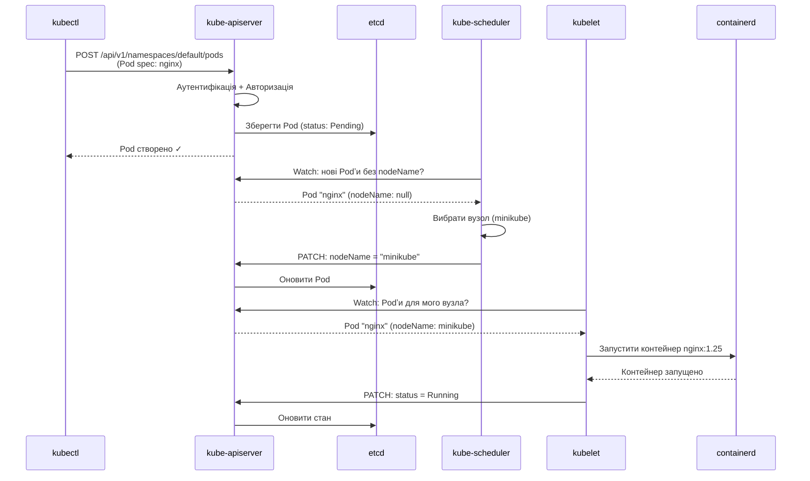

# Локальне середовище — minikube, kind та k3s

## Від теорії до практики

У попередніх двох статтях ми розглянули, *навіщо* потрібен Kubernetes і *як* він влаштований зсередини. Тепер настав час перейти від концепцій до реальної роботи: запустити власний кластер, виконати перші команди та побачити, як абстрактні компоненти — API-сервер, scheduler, kubelet — працюють разом.

Але виникає практичне питання: де взяти кластер для навчання? Розгортати production-кластер у хмарі (GKE, EKS, AKS) для експериментів — дорого і надмірно. Встановлювати повноцінний кластер на кількох серверах через `kubeadm` — складно і вимагає інфраструктури.

Саме для цього існують **локальні дистрибутиви Kubernetes** — інструменти, які дозволяють запустити повноцінний кластер на вашому ноутбуці за кілька хвилин. Вони не призначені для production, але ідеально підходять для розробки, тестування та навчання.

::note
Ця стаття має практичний характер. Ви встановите один з інструментів, запустите кластер і виконаєте перші `kubectl`-команди. Рекомендуємо мати під рукою термінал та виконувати команди паралельно з читанням.
::

---

## Вибір інструменту: порівняння варіантів

Існує кілька популярних інструментів для запуску Kubernetes локально. Кожен має свої переваги та обмеження. Розглянемо чотири основні варіанти.

### minikube — класичний вибір для навчання

**minikube** — це офіційний інструмент Kubernetes для локальної розробки. Він створює віртуальну машину (або використовує Docker як backend) і розгортає всередині неї повноцінний однонодовий кластер.

**Переваги:**
- Найбільш документований та підтримуваний спільнотою
- Вбудовані addons (dashboard, metrics-server, ingress)
- Підтримка різних драйверів (VirtualBox, Docker, Podman, Hyper-V)
- Команди для роботи з кластером (`minikube start`, `minikube stop`, `minikube delete`)

**Недоліки:**
- Повільніший старт порівняно з kind (30-60 секунд)
- Споживає більше ресурсів через віртуалізацію
- Один вузол (не можна тестувати multi-node сценарії без додаткових налаштувань)

**Типовий use case:** Навчання Kubernetes, розробка застосунків, тестування маніфестів перед деплоєм у production.

### kind — Kubernetes in Docker

**kind** (Kubernetes IN Docker) — інструмент, який запускає Kubernetes-вузли як Docker-контейнери. Кожен вузол кластера — це окремий контейнер.

**Переваги:**
- Дуже швидкий старт (10-20 секунд)
- Легко створювати multi-node кластери (кілька control plane + worker вузлів)
- Мінімальне споживання ресурсів
- Ідеальний для CI/CD pipelines (тестування у GitHub Actions, GitLab CI)

**Недоліки:**
- Менше вбудованих addons порівняно з minikube
- Вимагає Docker Desktop або Docker Engine
- Складніша налаштування мережі для доступу ззовні

**Типовий use case:** CI/CD тестування, розробка Kubernetes-операторів, тестування multi-node сценаріїв.

### k3s — легкий Kubernetes для edge

**k3s** — це мінімалістичний дистрибутив Kubernetes від Rancher Labs. Він видаляє застарілі компоненти та зменшує бінарник до ~50 МБ (порівняно з ~1 ГБ у повному Kubernetes).

**Переваги:**
- Найменше споживання ресурсів (працює навіть на Raspberry Pi)
- Швидкий старт
- Вбудований Traefik як Ingress Controller
- Підходить для production на edge-пристроях

**Недоліки:**
- Не 100% сумісний з upstream Kubernetes (деякі компоненти замінені)
- Менша спільнота порівняно з minikube

**Типовий use case:** IoT, edge computing, локальна розробка на слабких машинах.

### Docker Desktop Kubernetes

**Docker Desktop** (Windows/macOS) має вбудовану підтримку Kubernetes — можна увімкнути кластер одним чекбоксом у налаштуваннях.

**Переваги:**
- Нульова конфігурація (якщо Docker Desktop вже встановлено)
- Інтеграція з Docker CLI
- Автоматичне оновлення разом з Docker Desktop

**Недоліки:**
- Доступний лише на Windows та macOS (не Linux)
- Повільніший старт порівняно з kind
- Менше контролю над версією Kubernetes

**Типовий use case:** Швидкий старт для розробників, які вже використовують Docker Desktop.

---

## Порівняльна таблиця

| Характеристика | minikube | kind | k3s | Docker Desktop |
|---|---|---|---|---|
| **Час старту** | 30-60 сек | 10-20 сек | 15-30 сек | 40-60 сек |
| **Споживання RAM** | 2-4 ГБ | 1-2 ГБ | 512 МБ - 1 ГБ | 2-3 ГБ |
| **Multi-node** | Так (складно) | Так (легко) | Так | Ні |
| **Платформи** | Win/Mac/Linux | Win/Mac/Linux | Win/Mac/Linux | Win/Mac |
| **Вбудовані addons** | Багато | Мало | Traefik | Мало |
| **Складність** | Низька | Середня | Низька | Дуже низька |
| **Рекомендація** | Навчання | CI/CD, тести | Edge, слабкі машини | Швидкий старт |

::tip
**Наша рекомендація для цього курсу:** використовуйте **minikube** з Docker-драйвером. Він найкраще документований, має найбільшу спільноту та найпростіший для початківців. Якщо у вас вже встановлено Docker Desktop — можете використовувати його вбудований Kubernetes.
::

---

## Встановлення kubectl

Перш ніж встановлювати сам кластер, потрібен інструмент для взаємодії з ним — **kubectl**. Це CLI, який ми вже згадували у попередній статті.

::note
**Аналогія з Docker:** Якщо `docker` CLI — це інструмент для керування контейнерами на одному хості, то `kubectl` — інструмент для керування контейнерами (Podʼами) на цілому кластері. Синтаксис схожий: `docker ps` → `kubectl get pods`, `docker logs` → `kubectl logs`.
::

### Встановлення на macOS

::code-group

```bash [Homebrew (рекомендовано)]
brew install kubectl
```

```bash [Офіційний бінарник]
# Завантажити останню версію
curl -LO "https://dl.k8s.io/release/$(curl -L -s https://dl.k8s.io/release/stable.txt)/bin/darwin/arm64/kubectl"

# Зробити виконуваним
chmod +x ./kubectl

# Перемістити у PATH
sudo mv ./kubectl /usr/local/bin/kubectl
```

::

### Встановлення на Windows

::code-group

```powershell [Chocolatey]
choco install kubernetes-cli
```

```powershell [Scoop]
scoop install kubectl
```

```powershell [Winget]
winget install Kubernetes.kubectl
```

::

### Встановлення на Linux

::code-group

```bash [Debian/Ubuntu]
# Додати репозиторій Kubernetes
sudo apt-get update
sudo apt-get install -y apt-transport-https ca-certificates curl

curl -fsSL https://pkgs.k8s.io/core:/stable:/v1.30/deb/Release.key | sudo gpg --dearmor -o /etc/apt/keyrings/kubernetes-apt-keyring.gpg

echo 'deb [signed-by=/etc/apt/keyrings/kubernetes-apt-keyring.gpg] https://pkgs.k8s.io/core:/stable:/v1.30/deb/ /' | sudo tee /etc/apt/sources.list.d/kubernetes.list

sudo apt-get update
sudo apt-get install -y kubectl
```

```bash [Snap]
snap install kubectl --classic
```

```bash [Бінарник]
curl -LO "https://dl.k8s.io/release/$(curl -L -s https://dl.k8s.io/release/stable.txt)/bin/linux/amd64/kubectl"
chmod +x ./kubectl
sudo mv ./kubectl /usr/local/bin/kubectl
```

::

### Перевірка встановлення

Після встановлення перевірте версію:

```bash
kubectl version --client
```

Очікуваний вивід:

::terminal-preview{title="kubectl version"}
<div class="line"><span class="opacity-40">$</span> <strong>kubectl version --client</strong></div>
<div class="line"></div>
<div class="line"><span class="text-blue-400">Client Version:</span> v1.30.0</div>
<div class="line"><span class="text-blue-400">Kustomize Version:</span> v5.0.4-0.20230601165947-6ce0bf390ce3</div>
::

::tip
Прапорець `--client` показує лише версію `kubectl`, не намагаючись підключитись до кластера. Це корисно для перевірки встановлення до того, як кластер запущено.
::

---

## Встановлення minikube

Тепер встановимо сам minikube — інструмент для запуску локального кластера.

### Встановлення на macOS

::code-group

```bash [Homebrew (рекомендовано)]
brew install minikube
```

```bash [Бінарник]
curl -LO https://storage.googleapis.com/minikube/releases/latest/minikube-darwin-arm64
sudo install minikube-darwin-arm64 /usr/local/bin/minikube
```

::

### Встановлення на Windows

::code-group

```powershell [Chocolatey]
choco install minikube
```

```powershell [Winget]
winget install Kubernetes.minikube
```

```powershell [Інсталятор]
# Завантажте .exe з https://minikube.sigs.k8s.io/docs/start/
# Запустіть інсталятор
```

::

### Встановлення на Linux

::code-group

```bash [Debian/Ubuntu]
curl -LO https://storage.googleapis.com/minikube/releases/latest/minikube_latest_amd64.deb
sudo dpkg -i minikube_latest_amd64.deb
```

```bash [RPM (Fedora/RHEL)]
curl -LO https://storage.googleapis.com/minikube/releases/latest/minikube-latest.x86_64.rpm
sudo rpm -Uvh minikube-latest.x86_64.rpm
```

```bash [Бінарник]
curl -LO https://storage.googleapis.com/minikube/releases/latest/minikube-linux-amd64
sudo install minikube-linux-amd64 /usr/local/bin/minikube
```

::

### Перевірка встановлення

```bash
minikube version
```

Очікуваний вивід:

::terminal-preview{title="minikube version"}
<div class="line"><span class="opacity-40">$</span> <strong>minikube version</strong></div>
<div class="line"></div>
<div class="line"><span class="text-blue-400">minikube version:</span> v1.33.0</div>
<div class="line"><span class="text-blue-400">commit:</span> 86fc9d54fca63f295d8737c8eacdbb7987e89c67</div>
::

---

## Запуск першого кластера

Настав момент істини — запустимо наш перший Kubernetes-кластер.

::steps

### Крок 1: Запуск кластера

Виконайте команду:

```bash
minikube start --driver=docker
```

::note
Прапорець `--driver=docker` вказує minikube використовувати Docker як backend. Це найшвидший та найстабільніший варіант, якщо у вас встановлено Docker Desktop або Docker Engine. Без цього прапорця minikube спробує автоматично визначити найкращий драйвер.
::

Процес займе 30-60 секунд. Ви побачите вивід, схожий на цей:

::terminal-preview{title="minikube start"}
<div class="line"><span class="opacity-40">$</span> <strong>minikube start --driver=docker</strong></div>
<div class="line"></div>
<div class="line"><span class="text-blue-400">😄</span> minikube v1.33.0 on Darwin 14.4.1 (arm64)</div>
<div class="line"><span class="text-blue-400">✨</span> Using the docker driver based on user configuration</div>
<div class="line"><span class="text-blue-400">📌</span> Using Docker Desktop driver with root privileges</div>
<div class="line"><span class="text-blue-400">👍</span> Starting control plane node minikube in cluster minikube</div>
<div class="line"><span class="text-blue-400">🚜</span> Pulling base image ...</div>
<div class="line"><span class="text-blue-400">🔥</span> Creating docker container (CPUs=2, Memory=4000MB) ...</div>
<div class="line"><span class="text-blue-400">🐳</span> Preparing Kubernetes v1.30.0 on Docker 26.0.1 ...</div>
<div class="line">    <span class="opacity-60">▪ Generating certificates and keys ...</span></div>
<div class="line">    <span class="opacity-60">▪ Booting up control plane ...</span></div>
<div class="line">    <span class="opacity-60">▪ Configuring RBAC rules ...</span></div>
<div class="line"><span class="text-blue-400">🔗</span> Configuring bridge CNI (Container Networking Interface) ...</div>
<div class="line"><span class="text-blue-400">🔎</span> Verifying Kubernetes components...</div>
<div class="line"><span class="text-green-400">🏄</span> <strong>Done! kubectl is now configured to use "minikube" cluster</strong></div>
::

Що відбулося під капотом:

1. **Створено Docker-контейнер** з іменем `minikube`, який виконує роль єдиного вузла кластера
2. **Встановлено Kubernetes** версії 1.30.0 всередині цього контейнера
3. **Запущено всі компоненти control plane**: `kube-apiserver`, `etcd`, `kube-scheduler`, `kube-controller-manager`
4. **Запущено компоненти worker node**: `kubelet`, `kube-proxy`, `containerd`
5. **Налаштовано kubectl** для підключення до цього кластера

Перевірити, що контейнер запущено, можна через Docker:

```bash
docker ps --filter name=minikube
```

::terminal-preview{title="docker ps"}
<div class="line"><span class="opacity-40">$</span> <strong>docker ps --filter name=minikube</strong></div>
<div class="line"></div>
<div class="line"><span class="text-gray-400">CONTAINER ID   IMAGE                    STATUS         PORTS                                                                NAMES</span></div>
<div class="line">a3f8c9d12e45   gcr.io/k8s-minikube/...  Up 2 minutes   127.0.0.1:32768->22/tcp, 127.0.0.1:32769->2376/tcp, ...             <strong>minikube</strong></div>
::

### Крок 2: Перевірка стану кластера

Тепер перевіримо, що кластер справді працює. Виконайте:

```bash
kubectl cluster-info
```

Очікуваний вивід:

::terminal-preview{title="kubectl cluster-info"}
<div class="line"><span class="opacity-40">$</span> <strong>kubectl cluster-info</strong></div>
<div class="line"></div>
<div class="line"><span class="text-green-400 font-bold">Kubernetes control plane</span> is running at <span class="text-blue-400">https://127.0.0.1:32769</span></div>
<div class="line"><span class="text-green-400 font-bold">CoreDNS</span> is running at <span class="text-blue-400">https://127.0.0.1:32769/api/v1/namespaces/kube-system/services/kube-dns:dns/proxy</span></div>
<div class="line"></div>
<div class="line"><span class="opacity-60">To further debug and diagnose cluster problems, use 'kubectl cluster-info dump'.</span></div>
::

Ця команда показує адресу API-сервера та системні сервіси. Зверніть увагу: `kubectl` спілкується з кластером через HTTPS на локальному порту.

### Крок 3: Перегляд вузлів кластера

Згадайте з попередньої статті: кластер складається з вузлів (nodes). Подивимось, які вузли є у нашому кластері:

```bash
kubectl get nodes
```

::terminal-preview{title="kubectl get nodes"}
<div class="line"><span class="opacity-40">$</span> <strong>kubectl get nodes</strong></div>
<div class="line"></div>
<div class="line"><span class="text-gray-400">NAME       STATUS   ROLES           AGE   VERSION</span></div>
<div class="line">minikube   <span class="text-green-400 font-bold">Ready</span>    control-plane   2m    v1.30.0</div>
::

Бачимо один вузол з іменем `minikube`. Колонка `ROLES` показує `control-plane` — це означає, що цей вузол виконує роль і control plane, і worker node одночасно. У production-кластерах ці ролі розділені, але для локальної розробки це нормально.

Статус `Ready` означає, що вузол справний і готовий приймати Podʼи.

### Крок 4: Перегляд системних Podʼів

Kubernetes сам використовує Podʼи для запуску своїх внутрішніх компонентів. Подивимось на них:

```bash
kubectl get pods -n kube-system
```

::note
Прапорець `-n kube-system` вказує на **namespace** (простір імен) `kube-system`. Namespace — це логічна ізоляція ресурсів у кластері. Системні компоненти Kubernetes живуть у namespace `kube-system`, а ваші застосунки зазвичай розміщуються у namespace `default` або власних namespace.
::

Очікуваний вивід:

::terminal-preview{title="kubectl get pods -n kube-system"}
<div class="line"><span class="opacity-40">$</span> <strong>kubectl get pods -n kube-system</strong></div>
<div class="line"></div>
<div class="line"><span class="text-gray-400">NAME                               READY   STATUS    RESTARTS   AGE</span></div>
<div class="line">coredns-7db6d8ff4d-8xk2p           1/1     <span class="text-green-400 font-bold">Running</span>   0          3m</div>
<div class="line">etcd-minikube                      1/1     <span class="text-green-400 font-bold">Running</span>   0          3m</div>
<div class="line">kube-apiserver-minikube            1/1     <span class="text-green-400 font-bold">Running</span>   0          3m</div>
<div class="line">kube-controller-manager-minikube   1/1     <span class="text-green-400 font-bold">Running</span>   0          3m</div>
<div class="line">kube-proxy-vx9qm                   1/1     <span class="text-green-400 font-bold">Running</span>   0          3m</div>
<div class="line">kube-scheduler-minikube            1/1     <span class="text-green-400 font-bold">Running</span>   0          3m</div>
<div class="line">storage-provisioner                1/1     <span class="text-green-400 font-bold">Running</span>   0          3m</div>
::

Впізнаєте ці імена? Це саме ті компоненти, які ми розглядали у попередній статті:

- `etcd-minikube` — розподілена база даних стану
- `kube-apiserver-minikube` — API-сервер
- `kube-controller-manager-minikube` — менеджер контролерів
- `kube-scheduler-minikube` — планувальник
- `kube-proxy-vx9qm` — мережевий проксі
- `coredns-*` — DNS-сервер для service discovery
- `storage-provisioner` — компонент для автоматичного створення volumes

Колонка `READY` показує `1/1` — це означає, що у Podʼі один контейнер і він готовий до роботи. Статус `Running` підтверджує, що контейнер виконується.

::

---

## Розуміння kubeconfig — як kubectl знає, куди підключатись

Коли ви виконуєте `kubectl get nodes`, як `kubectl` знає, до якого кластера звертатись? Відповідь — через файл конфігурації **kubeconfig**.

### Структура kubeconfig

За замовчуванням `kubectl` читає конфігурацію з файлу `~/.kube/config`. Цей файл містить три основні секції:

::field-group

::field{name="clusters" type="масив"}
Список кластерів, до яких ви можете підключатись. Кожен кластер має адресу API-сервера та сертифікат для перевірки його автентичності.
::

::field{name="users" type="масив"}
Список облікових записів (credentials) для автентифікації у кластерах. Може містити сертифікати, токени або інші методи автентифікації.
::

::field{name="contexts" type="масив"}
Контекст — це комбінація кластера + користувача + namespace. Він визначає, *куди* підключатись, *від імені кого* та *у якому namespace* працювати за замовчуванням.
::

::field{name="current-context" type="рядок"}
Ім'я активного контексту. Саме цей контекст використовується для всіх `kubectl`-команд.
::

::

Подивимось на структуру файлу:

```bash
kubectl config view
```

::terminal-preview{title="kubectl config view"}
<div class="line"><span class="opacity-40">$</span> <strong>kubectl config view</strong></div>
<div class="line"></div>
<div class="line"><span class="text-blue-400">apiVersion:</span> v1</div>
<div class="line"><span class="text-blue-400">clusters:</span></div>
<div class="line">- <span class="text-blue-400">cluster:</span></div>
<div class="line">    certificate-authority: /Users/user/.minikube/ca.crt</div>
<div class="line">    server: https://127.0.0.1:32769</div>
<div class="line">  <span class="text-blue-400">name:</span> minikube</div>
<div class="line"><span class="text-blue-400">contexts:</span></div>
<div class="line">- <span class="text-blue-400">context:</span></div>
<div class="line">    cluster: minikube</div>
<div class="line">    user: minikube</div>
<div class="line">  <span class="text-blue-400">name:</span> minikube</div>
<div class="line"><span class="text-blue-400">current-context:</span> <span class="text-green-400 font-bold">minikube</span></div>
<div class="line"><span class="text-blue-400">users:</span></div>
<div class="line">- <span class="text-blue-400">name:</span> minikube</div>
<div class="line">  <span class="text-blue-400">user:</span></div>
<div class="line">    client-certificate: /Users/user/.minikube/profiles/minikube/client.crt</div>
<div class="line">    client-key: /Users/user/.minikube/profiles/minikube/client.key</div>
::

Коли `minikube start` завершився, він автоматично:
1. Додав кластер `minikube` до секції `clusters`
2. Додав користувача `minikube` до секції `users`
3. Створив контекст `minikube`, що поєднує їх
4. Встановив `current-context: minikube`

### Перемикання між контекстами

Якщо у вас кілька кластерів (наприклад, локальний minikube та production у GKE), ви можете перемикатись між ними:

```bash
# Переглянути всі доступні контексти
kubectl config get-contexts

# Перемкнутись на інший контекст
kubectl config use-context <назва-контексту>

# Подивитись поточний контекст
kubectl config current-context
```

::tip
**Аналогія з Docker:** Якщо у Docker ви завжди працюєте з одним демоном на вашій машині, то у Kubernetes через `kubectl` ви можете керувати десятками різних кластерів — локальними, тестовими, production — просто перемикаючи контекст однією командою.
::

---

## Перші команди kubectl

Тепер, коли кластер запущено і `kubectl` налаштовано, розглянемо базові команди для роботи з Kubernetes.

### Структура команд kubectl

Як ми згадували у попередній статті, команди `kubectl` мають чітку структуру:

```bash
kubectl [дієслово] [тип-ресурсу] [імʼя] [прапорці]
```

**Основні дієслова:**

::card-group

::card{title="get" icon="i-heroicons-eye"}
Отримати список ресурсів або деталі конкретного ресурсу. Найчастіша команда для перегляду стану.
::

::card{title="describe" icon="i-heroicons-document-text"}
Детальна інформація про ресурс: події, стан, конфігурація. Використовується для діагностики.
::

::card{title="apply" icon="i-heroicons-arrow-up-tray"}
Створити або оновити ресурс з YAML/JSON файлу. Декларативний підхід.
::

::card{title="delete" icon="i-heroicons-trash"}
Видалити ресурс з кластера.
::

::card{title="logs" icon="i-heroicons-document-magnifying-glass"}
Переглянути логи контейнера у Podʼі.
::

::card{title="exec" icon="i-heroicons-command-line"}
Виконати команду всередині контейнера у Podʼі (аналог `docker exec`).
::

::

### Приклади базових команд

::code-group

```bash [Перегляд ресурсів]
# Переглянути всі Podʼи у поточному namespace (default)
kubectl get pods

# Переглянути Podʼи у всіх namespace
kubectl get pods --all-namespaces
# або скорочено:
kubectl get pods -A

# Переглянути вузли кластера
kubectl get nodes

# Переглянути сервіси
kubectl get services
# або скорочено:
kubectl get svc
```

```bash [Детальна інформація]
# Детальна інформація про вузол
kubectl describe node minikube

# Детальна інформація про Pod
kubectl describe pod <назва-podʼу>

# Переглянути логи Podʼу
kubectl logs <назва-podʼу>

# Переглянути логи у реальному часі (аналог docker logs -f)
kubectl logs -f <назва-podʼу>
```

```bash [Виконання команд]
# Виконати команду у контейнері
kubectl exec <назва-podʼу> -- ls /app

# Відкрити інтерактивну оболонку (аналог docker exec -it)
kubectl exec -it <назва-podʼу> -- /bin/bash
```

```bash [Різні формати виводу]
# Вивести у форматі YAML
kubectl get pods -o yaml

# Вивести у форматі JSON
kubectl get pods -o json

# Вивести з додатковими колонками
kubectl get pods -o wide
```

::

### Скорочення назв ресурсів

Kubernetes підтримує скорочення для типів ресурсів:

| Повна назва | Скорочення |
|---|---|
| `pods` | `po` |
| `services` | `svc` |
| `deployments` | `deploy` |
| `replicasets` | `rs` |
| `namespaces` | `ns` |
| `nodes` | `no` |
| `persistentvolumes` | `pv` |
| `persistentvolumeclaims` | `pvc` |

Приклад:

```bash
# Ці команди еквівалентні:
kubectl get pods
kubectl get po
```

---

## Запуск першого Podʼу

Настав час запустити наш перший застосунок у Kubernetes. Почнемо з найпростішого — одного Podʼу з Nginx.

### Імперативний спосіб (швидкий тест)

Найшвидший спосіб запустити Pod — використати команду `kubectl run`:

```bash
kubectl run nginx --image=nginx:1.25
```

::note
**Аналогія з Docker:** Ця команда схожа на `docker run nginx:1.25`, але замість запуску контейнера напряму, вона створює Pod у кластері. Kubernetes сам вирішує, на якому вузлі його розмістити.
::

Перевіримо, що Pod створено:

```bash
kubectl get pods
```

::terminal-preview{title="kubectl get pods"}
<div class="line"><span class="opacity-40">$</span> <strong>kubectl get pods</strong></div>
<div class="line"></div>
<div class="line"><span class="text-gray-400">NAME    READY   STATUS              RESTARTS   AGE</span></div>
<div class="line">nginx   0/1     <span class="text-yellow-400 font-bold">ContainerCreating</span>   0          3s</div>
::

Статус `ContainerCreating` означає, що Kubernetes завантажує образ та запускає контейнер. Зачекайте кілька секунд і виконайте команду знову:

::terminal-preview{title="kubectl get pods (після завантаження)"}
<div class="line"><span class="opacity-40">$</span> <strong>kubectl get pods</strong></div>
<div class="line"></div>
<div class="line"><span class="text-gray-400">NAME    READY   STATUS    RESTARTS   AGE</span></div>
<div class="line">nginx   1/1     <span class="text-green-400 font-bold">Running</span>   0          45s</div>
::

Статус змінився на `Running`, а колонка `READY` показує `1/1` — один контейнер з одного готовий.

### Що відбулося під капотом?

Розглянемо покроково, що сталося після виконання `kubectl run`:

::mermaid



::

**Покрокове пояснення:**

1. **kubectl → API-сервер**: `kubectl` надсилає HTTP POST-запит до API-сервера з специфікацією Podʼу
2. **API-сервер → etcd**: Після валідації API-сервер зберігає Pod у `etcd` зі статусом `Pending` (очікує призначення вузла)
3. **Scheduler спостерігає**: `kube-scheduler` постійно відстежує (watch) нові Podʼи без призначеного вузла
4. **Scheduler призначає вузол**: Scheduler аналізує доступні вузли та обирає `minikube`, оновлює поле `nodeName` через API-сервер
5. **Kubelet спостерігає**: `kubelet` на вузлі `minikube` відстежує Podʼи, призначені його вузлу
6. **Kubelet запускає контейнер**: `kubelet` інструктує `containerd` завантажити образ `nginx:1.25` та запустити контейнер
7. **Kubelet звітує**: Після успішного запуску `kubelet` оновлює статус Podʼу на `Running`

Це і є **reconciliation loop** у дії: система безперервно порівнює бажаний стан (Pod має бути запущений) з поточним (Pod ще не існує) і усуває розбіжності.

### Детальна інформація про Pod

Подивимось детальніше на створений Pod:

```bash
kubectl describe pod nginx
```

Вивід буде великим, але найважливіші секції:

::terminal-preview{title="kubectl describe pod nginx (фрагмент)"}
<div class="line"><span class="text-blue-400 font-bold">Name:</span>         nginx</div>
<div class="line"><span class="text-blue-400 font-bold">Namespace:</span>    default</div>
<div class="line"><span class="text-blue-400 font-bold">Node:</span>         minikube/192.168.49.2</div>
<div class="line"><span class="text-blue-400 font-bold">Status:</span>       Running</div>
<div class="line"><span class="text-blue-400 font-bold">IP:</span>           10.244.0.5</div>
<div class="line"></div>
<div class="line"><span class="text-blue-400 font-bold">Containers:</span></div>
<div class="line">  nginx:</div>
<div class="line">    Image:          nginx:1.25</div>
<div class="line">    Port:           &lt;none&gt;</div>
<div class="line">    State:          <span class="text-green-400 font-bold">Running</span></div>
<div class="line">      Started:      Thu, 07 May 2026 10:02:15 +0000</div>
<div class="line"></div>
<div class="line"><span class="text-blue-400 font-bold">Events:</span></div>
<div class="line">  <span class="opacity-60">Type    Reason     Age   From               Message</span></div>
<div class="line">  Normal  Scheduled  2m    default-scheduler  Successfully assigned default/nginx to minikube</div>
<div class="line">  Normal  Pulling    2m    kubelet            Pulling image "nginx:1.25"</div>
<div class="line">  Normal  Pulled     90s   kubelet            Successfully pulled image "nginx:1.25"</div>
<div class="line">  Normal  Created    90s   kubelet            Created container nginx</div>
<div class="line">  Normal  Started    90s   kubelet            Started container nginx</div>
::

Секція **Events** показує хронологію подій — це найкорисніша частина для діагностики проблем.

### Доступ до застосунку

Pod запущено, але як до нього звернутись? У Podʼа є внутрішня IP-адреса (`10.244.0.5` у прикладі вище), але вона доступна лише всередині кластера.

Для тестування можна використати **port-forward** — тунель між вашою локальною машиною та Podʼом:

```bash
kubectl port-forward pod/nginx 8080:80
```

::terminal-preview{title="kubectl port-forward"}
<div class="line"><span class="opacity-40">$</span> <strong>kubectl port-forward pod/nginx 8080:80</strong></div>
<div class="line"></div>
<div class="line">Forwarding from 127.0.0.1:8080 -> 80</div>
<div class="line">Forwarding from [::1]:8080 -> 80</div>
<div class="line"><span class="text-green-400">Handling connection for 8080</span></div>
::

Тепер відкрийте браузер та перейдіть на `http://localhost:8080` — ви побачите стандартну сторінку Nginx.

::note
`port-forward` — це інструмент для розробки та діагностики, не для production. У наступних статтях ми розглянемо **Service** — правильний спосіб надати доступ до застосунків у Kubernetes.
::

### Видалення Podʼу

Видалимо створений Pod:

```bash
kubectl delete pod nginx
```

::terminal-preview{title="kubectl delete pod"}
<div class="line"><span class="opacity-40">$</span> <strong>kubectl delete pod nginx</strong></div>
<div class="line"></div>
<div class="line">pod "nginx" deleted</div>
::

Перевіримо:

```bash
kubectl get pods
```

::terminal-preview{title="kubectl get pods (після видалення)"}
<div class="line"><span class="opacity-40">$</span> <strong>kubectl get pods</strong></div>
<div class="line"></div>
<div class="line"><span class="opacity-60">No resources found in default namespace.</span></div>
::

---

## Декларативний підхід: YAML-маніфести

Команда `kubectl run` зручна для швидких тестів, але у реальних проєктах використовується **декларативний підхід** — опис ресурсів у YAML-файлах.

### Чому YAML, а не команди?

::card-group

::card{title="Версіонування" icon="i-heroicons-code-bracket"}
YAML-файли зберігаються у Git разом з кодом. Ви бачите історію змін інфраструктури так само, як історію коду.
::

::card{title="Відтворюваність" icon="i-heroicons-arrow-path"}
Один файл можна застосувати у dev, staging та production. Немає ризику забути прапорець у команді.
::

::card{title="Code Review" icon="i-heroicons-eye"}
Зміни в інфраструктурі проходять через Pull Request, як і зміни у коді. Команда бачить, що саме змінюється.
::

::card{title="Автоматизація" icon="i-heroicons-cog"}
CI/CD pipeline може автоматично застосовувати маніфести. Команди `kubectl run` не підходять для автоматизації.
::

::

### Створення першого маніфесту

Створимо файл `nginx-pod.yaml`:

```yaml
apiVersion: v1
kind: Pod
metadata:
  name: nginx
  labels:
    app: nginx
spec:
  containers:
  - name: nginx
    image: nginx:1.25
    ports:
    - containerPort: 80
```

Розберемо структуру рядок за рядком:

::field-group

::field{name="apiVersion" type="string" required="true"}
Версія API Kubernetes для цього типу ресурсу. Для Podʼів — `v1`. Різні ресурси можуть мати різні версії API (наприклад, `apps/v1` для Deployment).
::

::field{name="kind" type="string" required="true"}
Тип ресурсу. У нашому випадку — `Pod`. Інші приклади: `Deployment`, `Service`, `ConfigMap`.
::

::field{name="metadata" type="object" required="true"}
Метадані ресурсу: ім'я, мітки (labels), анотації. Ім'я має бути унікальним у межах namespace.
::

::field{name="metadata.labels" type="map"}
Пари ключ-значення для ідентифікації та групування ресурсів. Використовуються для селекторів у Service, Deployment тощо.
::

::field{name="spec" type="object" required="true"}
Специфікація бажаного стану ресурсу. Для Podʼу — список контейнерів, volumes, налаштування мережі тощо.
::

::field{name="spec.containers" type="array" required="true"}
Список контейнерів у Podʼі. Мінімум один контейнер обов'язковий.
::

::field{name="spec.containers[].name" type="string" required="true"}
Ім'я контейнера всередині Podʼу. Має бути унікальним у межах Podʼу.
::

::field{name="spec.containers[].image" type="string" required="true"}
Docker-образ для контейнера. Формат: `registry/repository:tag`. Якщо registry не вказано — використовується Docker Hub.
::

::field{name="spec.containers[].ports" type="array"}
Список портів, які контейнер відкриває. Це декларативна інформація (не відкриває порти автоматично), але використовується Service для маршрутизації.
::

::

### Застосування маніфесту

Застосуємо створений файл:

```bash
kubectl apply -f nginx-pod.yaml
```

::terminal-preview{title="kubectl apply"}
<div class="line"><span class="opacity-40">$</span> <strong>kubectl apply -f nginx-pod.yaml</strong></div>
<div class="line"></div>
<div class="line">pod/nginx <span class="text-green-400 font-bold">created</span></div>
::

Команда `kubectl apply` є **ідемпотентною**: якщо ресурс не існує — він створюється, якщо існує — оновлюється. Це відрізняється від `kubectl create`, яка завершиться помилкою, якщо ресурс вже існує.

Перевіримо:

```bash
kubectl get pods
```

::terminal-preview{title="kubectl get pods"}
<div class="line"><span class="opacity-40">$</span> <strong>kubectl get pods</strong></div>
<div class="line"></div>
<div class="line"><span class="text-gray-400">NAME    READY   STATUS    RESTARTS   AGE</span></div>
<div class="line">nginx   1/1     <span class="text-green-400 font-bold">Running</span>   0          10s</div>
::

### Отримання YAML існуючого ресурсу

Якщо ви хочете побачити повну специфікацію Podʼу (включно з полями, які Kubernetes додав автоматично):

```bash
kubectl get pod nginx -o yaml
```

Вивід буде містити набагато більше полів, ніж ми задали у маніфесті:

```yaml
apiVersion: v1
kind: Pod
metadata:
  name: nginx
  namespace: default
  uid: a3f8c9d1-2e45-4b6c-8d7e-9f0a1b2c3d4e
  creationTimestamp: "2026-05-07T10:02:15Z"
  labels:
    app: nginx
spec:
  containers:
  - name: nginx
    image: nginx:1.25
    ports:
    - containerPort: 80
      protocol: TCP
    resources: {}
    volumeMounts:
    - mountPath: /var/run/secrets/kubernetes.io/serviceaccount
      name: kube-api-access-xxxxx
      readOnly: true
  nodeName: minikube
  # ... багато інших полів
status:
  phase: Running
  podIP: 10.244.0.5
  startTime: "2026-05-07T10:02:15Z"
  # ... детальний статус контейнерів
```

Зверніть увагу на секцію `status` — вона не задається оператором, а заповнюється Kubernetes автоматично і відображає поточний стан ресурсу.

---

## Управління кластером minikube

Розглянемо корисні команди для управління локальним кластером.

### Зупинка та запуск кластера

```bash
# Зупинити кластер (зберігає стан)
minikube stop

# Запустити знову
minikube start
```

Після `minikube stop` всі Podʼи зупиняються, але їхні дані зберігаються. При наступному `minikube start` кластер відновлюється у тому ж стані.

### Видалення кластера

```bash
# Повністю видалити кластер
minikube delete
```

::caution
Ця команда видаляє всі дані кластера безповоротно. Використовуйте її, коли хочете почати з чистого аркуша або звільнити ресурси.
::

### Доступ до Dashboard

Kubernetes має вбудований веб-інтерфейс для перегляду ресурсів кластера:

```bash
minikube dashboard
```

Ця команда автоматично відкриє браузер з Dashboard. Там ви можете переглядати Podʼи, логи, події — все через графічний інтерфейс.

### SSH до вузла

Іноді потрібно зайти всередину вузла кластера (наприклад, для діагностики мережі):

```bash
minikube ssh
```

Ви опинитесь у оболонці всередині Docker-контейнера, який є вузлом кластера.

### Перегляд логів кластера

Якщо щось йде не так з самим кластером (не з вашими Podʼами, а з компонентами Kubernetes):

```bash
minikube logs
```

---

## Namespace — логічна ізоляція ресурсів

Ми вже кілька разів згадували **namespace**. Настав час розглянути цю концепцію детальніше.

**Namespace** (простір імен) — це механізм логічної ізоляції ресурсів у кластері. Один кластер може містити кілька namespace, і ресурси в одному namespace не бачать ресурси в іншому (якщо це не налаштовано явно).

### Системні namespace

Kubernetes створює кілька namespace автоматично:

::field-group

::field{name="default" type="namespace"}
Namespace за замовчуванням. Якщо ви не вказуєте namespace явно — ресурси створюються тут.
::

::field{name="kube-system" type="namespace"}
Системні компоненти Kubernetes (API-сервер, scheduler, CoreDNS тощо). Не чіпайте ресурси тут без необхідності.
::

::field{name="kube-public" type="namespace"}
Публічний namespace, доступний для читання всім користувачам (навіть неавтентифікованим). Рідко використовується.
::

::field{name="kube-node-lease" type="namespace"}
Технічний namespace для heartbeat-повідомлень від вузлів. Не для ручного використання.
::

::

Переглянути всі namespace:

```bash
kubectl get namespaces
```

::terminal-preview{title="kubectl get namespaces"}
<div class="line"><span class="opacity-40">$</span> <strong>kubectl get namespaces</strong></div>
<div class="line"></div>
<div class="line"><span class="text-gray-400">NAME              STATUS   AGE</span></div>
<div class="line">default           Active   15m</div>
<div class="line">kube-node-lease   Active   15m</div>
<div class="line">kube-public       Active   15m</div>
<div class="line">kube-system       Active   15m</div>
::

### Створення власного namespace

Створимо namespace для нашого проєкту:

```bash
kubectl create namespace myapp
```

Або через YAML-маніфест:

```yaml
apiVersion: v1
kind: Namespace
metadata:
  name: myapp
```

```bash
kubectl apply -f namespace.yaml
```

### Робота з ресурсами у namespace

Створимо Pod у новому namespace:

```bash
kubectl apply -f nginx-pod.yaml -n myapp
```

Переглянути Podʼи у конкретному namespace:

```bash
kubectl get pods -n myapp
```

Переглянути Podʼи у всіх namespace:

```bash
kubectl get pods --all-namespaces
# або скорочено:
kubectl get pods -A
```

### Зміна namespace за замовчуванням

Щоб не вказувати `-n myapp` у кожній команді, можна змінити namespace за замовчуванням для поточного контексту:

```bash
kubectl config set-context --current --namespace=myapp
```

Тепер всі команди `kubectl` працюватимуть з namespace `myapp` за замовчуванням.

---

## Резюме

У цій статті ми перейшли від теорії до практики:

- **Встановили kubectl** — інструмент для взаємодії з Kubernetes-кластерами
- **Встановили minikube** — локальний дистрибутив Kubernetes для розробки
- **Запустили перший кластер** і побачили, як компоненти з попередньої статті працюють разом
- **Розібрали kubeconfig** — механізм підключення до кластерів
- **Виконали базові команди kubectl** для перегляду ресурсів
- **Запустили перший Pod** двома способами: імперативно (`kubectl run`) та декларативно (YAML-маніфест)
- **Познайомились з namespace** — логічною ізоляцією ресурсів

Ключовий висновок: Kubernetes працює за принципом **декларативної конфігурації**. Ви описуєте бажаний стан у YAML-файлах, а система сама приводить реальний стан до бажаного через reconciliation loop.

У наступній статті ми детально розглянемо **Pod** — найменшу розгортану одиницю Kubernetes: його життєвий цикл, патерни використання (sidecar, init-контейнери) та обмеження, які призводять до необхідності вищих абстракцій.

---

## Практичні завдання

### Рівень 1 (Базовий)

**Завдання 1.** Встановіть minikube та kubectl на вашій машині. Запустіть кластер і виконайте команду `kubectl get nodes`. Зробіть скріншот виводу.

**Завдання 2.** Створіть Pod з образом `httpd:2.4` (Apache HTTP Server) через команду `kubectl run`. Перевірте, що Pod запущено. Використайте `kubectl port-forward` для доступу до сервера на порту 8080. Відкрийте браузер і переконайтесь, що бачите стандартну сторінку Apache.

**Завдання 3.** Створіть YAML-маніфест для Podʼу з образом `redis:7`. Додайте мітку `app: cache`. Застосуйте маніфест через `kubectl apply`. Перевірте, що Pod створено, використовуючи `kubectl get pods --show-labels`.

### Рівень 2 (Практичний)

**Завдання 4.** Створіть два namespace: `development` та `production`. У кожному namespace створіть Pod з іменем `api` (образ `nginx:1.25`). Переконайтесь, що обидва Podʼи існують одночасно (імена не конфліктують, бо вони у різних namespace). Виведіть список всіх Podʼів у всіх namespace.

**Завдання 5.** Запустіть Pod з образом `busybox:1.36` з командою `sleep 3600` (щоб контейнер не завершувався). Використайте `kubectl exec` для входу в контейнер та виконайте команду `nslookup kubernetes.default` — це перевірить, що DNS працює. Поясніть, що означає адреса, яку повернув `nslookup`.

**Завдання 6.** Створіть Pod, який використовує образ, що не існує (наприклад, `nginx:nonexistent-tag`). Використайте `kubectl describe pod` для діагностики проблеми. Знайдіть у виводі секцію Events і поясніть, яка подія вказує на проблему та що саме пішло не так.

### Рівень 3 (Дослідницький)

**Завдання 7.** Використайте `kubectl get pod <назва> -o yaml` для отримання повної специфікації запущеного Podʼу. Порівняйте з вашим оригінальним маніфестом. Знайдіть та поясніть призначення трьох полів, які Kubernetes додав автоматично (наприклад, `status.podIP`, `spec.nodeName`, `metadata.uid`).

**Завдання 8.** Виконайте `minikube ssh` для входу у вузол кластера. Всередині вузла виконайте `docker ps` (або `crictl ps`, якщо `docker` недоступний). Знайдіть контейнер вашого Podʼу серед системних контейнерів. Поясніть, чому контейнерів більше, ніж Podʼів у кластері.

**Завдання 9.** Дослідіть файл `~/.kube/config`. Знайдіть секцію `clusters` та поясніть, що означає поле `certificate-authority`. Чому Kubernetes використовує сертифікати для підключення до кластера, а не просто логін/пароль? Які переваги це дає з точки зору безпеки?

**Завдання 10.** Створіть Pod з двома контейнерами: `nginx:1.25` та `busybox:1.36` (з командою `sleep 3600`). Використайте `kubectl exec` для входу в контейнер `busybox` та виконайте `wget -O- localhost:80`. Поясніть, чому контейнер `busybox` може звернутись до `nginx` через `localhost`, хоча це різні контейнери. Яка концепція Podʼу це демонструє?

