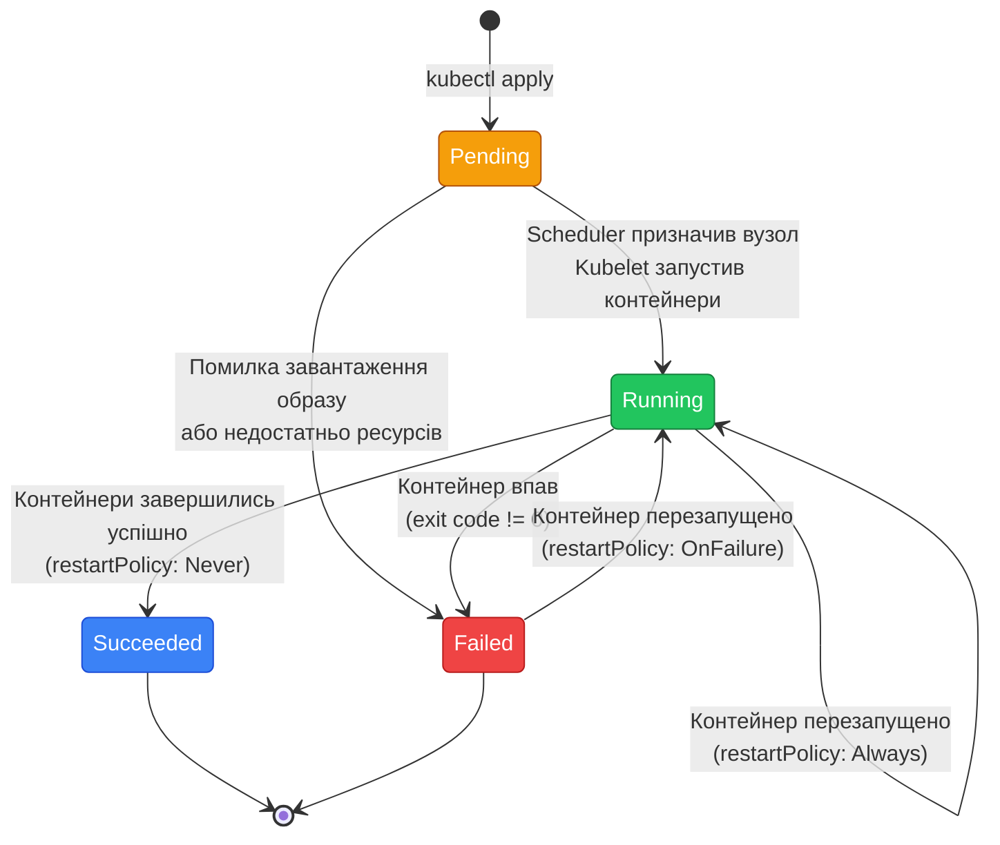

# Pod — атомарна одиниця Kubernetes

## Від контейнера до Pod

У попередній статті ми запустили перший Pod і побачили, що він працює. Але чому Kubernetes використовує Pod, а не контейнер напряму? Чому не можна просто сказати «запусти контейнер `nginx:1.25`», як у Docker?

Щоб зрозуміти це, повернемось до фундаментальної проблеми, яку вирішує Kubernetes: **оркестрація розподілених застосунків**. У реальних системах застосунок рідко складається з одного процесу. Часто потрібні допоміжні компоненти, які працюють поруч з основним застосунком:

- **Sidecar для логування**: контейнер, який збирає логи основного застосунку та відправляє їх у централізоване сховище
- **Proxy для мережі**: контейнер, який перехоплює весь мережевий трафік для шифрування, моніторингу або балансування
- **Init-контейнер для міграцій**: контейнер, який виконується перед основним застосунком для підготовки бази даних

Усі ці компоненти мають працювати **разом**, на **одному вузлі**, з **спільною мережею** та **спільними файлами**. Саме для цього і існує Pod.

::note
**Ключова ідея:** Pod — це не просто обгортка над контейнером. Це **атомарна одиниця розгортання**, яка може містити кілька тісно пов'язаних контейнерів, що працюють як єдине ціле.
::

---

## Що таке Pod: формальне визначення

**Pod** (від англ. «стручок», як стручок гороху з кількома горошинами всередині) — це найменша розгортана одиниця у Kubernetes, яка представляє один або кілька контейнерів, що:

1. **Завжди розміщуються на одному вузлі** — Kubernetes ніколи не розділить контейнери одного Podʼу між різними серверами
2. **Мають спільну мережу** — всі контейнери у Podʼі бачать один одного через `localhost` і мають одну IP-адресу
3. **Можуть мати спільні volumes** — контейнери можуть читати та писати у спільні директорії
4. **Запускаються та зупиняються разом** — життєвий цикл усіх контейнерів у Podʼі синхронізований

### Аналогія з Docker

Якщо ви знайомі з Docker Compose, можна провести таку аналогію:

```yaml
# Docker Compose — кілька контейнерів на одному хості
services:
  app:
    image: myapp:1.0
  sidecar:
    image: log-collector:1.0
    network_mode: "service:app"  # спільна мережа
```

У Docker Compose ви явно налаштовуєте спільну мережу через `network_mode`. У Kubernetes це поведінка **за замовчуванням** для контейнерів у одному Podʼі — вам не потрібно нічого налаштовувати.

### Візуалізація Pod

::diagram-flow{caption="Структура Pod з кількома контейнерами" height="400px" :showMinimap="false" frame="macos" :nodes="[{\"id\":\"pod\",\"position\":{\"x\":200,\"y\":50},\"data\":{\"label\":\"Pod (IP: 10.244.0.5)\"},\"style\":{\"background\":\"#1d4ed8\",\"color\":\"#fff\",\"fontWeight\":\"bold\",\"borderRadius\":\"12px\",\"padding\":\"12px 24px\",\"fontSize\":\"16px\"}},{\"id\":\"c1\",\"position\":{\"x\":80,\"y\":180},\"data\":{\"label\":\"Container 1<br/>(nginx)\"},\"style\":{\"background\":\"#15803d\",\"color\":\"#fff\",\"fontWeight\":\"bold\",\"borderRadius\":\"8px\",\"padding\":\"10px 16px\"}},{\"id\":\"c2\",\"position\":{\"x\":280,\"y\":180},\"data\":{\"label\":\"Container 2<br/>(log-collector)\"},\"style\":{\"background\":\"#15803d\",\"color\":\"#fff\",\"fontWeight\":\"bold\",\"borderRadius\":\"8px\",\"padding\":\"10px 16px\"}},{\"id\":\"vol\",\"position\":{\"x\":480,\"y\":180},\"data\":{\"label\":\"Shared Volume<br/>(/var/log)\"},\"style\":{\"background\":\"#b45309\",\"color\":\"#fff\",\"fontWeight\":\"bold\",\"borderRadius\":\"8px\",\"padding\":\"10px 16px\"}},{\"id\":\"net\",\"position\":{\"x\":200,\"y\":320},\"data\":{\"label\":\"Спільна мережа (localhost)\"},\"style\":{\"background\":\"#6d28d9\",\"color\":\"#fff\",\"fontWeight\":\"bold\",\"borderRadius\":\"8px\",\"padding\":\"8px 16px\"}}]" :edges="[{\"source\":\"pod\",\"target\":\"c1\",\"label\":\"містить\",\"style\":{\"stroke\":\"#3b82f6\",\"strokeWidth\":2}},{\"source\":\"pod\",\"target\":\"c2\",\"label\":\"містить\",\"style\":{\"stroke\":\"#3b82f6\",\"strokeWidth\":2}},{\"source\":\"c1\",\"target\":\"vol\",\"label\":\"монтує\",\"style\":{\"stroke\":\"#f59e0b\",\"strokeWidth\":2,\"strokeDasharray\":\"5 5\"}},{\"source\":\"c2\",\"target\":\"vol\",\"label\":\"монтує\",\"style\":{\"stroke\":\"#f59e0b\",\"strokeWidth\":2,\"strokeDasharray\":\"5 5\"}},{\"source\":\"c1\",\"target\":\"net\",\"style\":{\"stroke\":\"#a855f7\",\"strokeWidth\":2}},{\"source\":\"c2\",\"target\":\"net\",\"style\":{\"stroke\":\"#a855f7\",\"strokeWidth\":2}}]"}
::

На діаграмі видно ключові властивості Pod:
- Один Pod має одну IP-адресу
- Контейнери всередині Pod спілкуються через `localhost`
- Спільні volumes доступні всім контейнерам
- Усе це працює на одному вузлі кластера

---

## Анатомія Pod: структура YAML-маніфесту

Розглянемо детально структуру Pod-маніфесту, починаючи з найпростішого прикладу та поступово ускладнюючи.

### Мінімальний Pod

Найпростіший Pod містить один контейнер:

```yaml
apiVersion: v1
kind: Pod
metadata:
  name: simple-pod
spec:
  containers:
  - name: nginx
    image: nginx:1.25
```

Це мінімально необхідна конфігурація. Розберемо кожне поле:

::field-group

::field{name="apiVersion" type="string" required="true"}
Версія API Kubernetes. Для Pod завжди `v1` (стабільна версія з самого початку Kubernetes).
::

::field{name="kind" type="string" required="true"}
Тип ресурсу. У нашому випадку — `Pod`.
::

::field{name="metadata.name" type="string" required="true"}
Унікальне ім'я Pod у межах namespace. Має відповідати DNS-стандарту: малі літери, цифри, дефіси.
::

::field{name="spec.containers" type="array" required="true"}
Список контейнерів у Pod. Мінімум один контейнер обов'язковий.
::

::field{name="spec.containers[].name" type="string" required="true"}
Ім'я контейнера всередині Pod. Має бути унікальним у межах Pod.
::

::field{name="spec.containers[].image" type="string" required="true"}
Docker-образ для контейнера. Якщо не вказано тег — використовується `latest` (не рекомендується для production).
::

::

### Pod з налаштуваннями контейнера

Додамо типові налаштування:

```yaml
apiVersion: v1
kind: Pod
metadata:
  name: configured-pod
  labels:
    app: myapp
    tier: backend
spec:
  containers:
  - name: app
    image: myapp:1.0.0
    ports:
    - containerPort: 8080
      protocol: TCP
    env:
    - name: DATABASE_URL
      value: "postgresql://db:5432/mydb"
    - name: LOG_LEVEL
      value: "info"
    resources:
      requests:
        memory: "128Mi"
        cpu: "250m"
      limits:
        memory: "256Mi"
        cpu: "500m"
```

Нові поля:

::field-group

::field{name="metadata.labels" type="map"}
Мітки (key-value пари) для ідентифікації та групування Pod. Використовуються Service, Deployment та іншими ресурсами для вибору Pod через селектори.
::

::field{name="spec.containers[].ports" type="array"}
Декларація портів, які контейнер відкриває. Це **документаційне** поле — воно не відкриває порти автоматично, але використовується Service для маршрутизації.
::

::field{name="spec.containers[].env" type="array"}
Змінні оточення для контейнера. Аналог `-e` у `docker run`.
::

::field{name="spec.containers[].resources" type="object"}
Запити (requests) та обмеження (limits) ресурсів. Requests — мінімум, який гарантується контейнеру. Limits — максимум, який контейнер може використати.
::

::

::tip
**Одиниці вимірювання:**
- **CPU**: `250m` = 0.25 ядра, `1000m` = 1 ядро, `2` = 2 ядра
- **Memory**: `128Mi` = 128 мебібайт, `1Gi` = 1 гібібайт (бінарні одиниці, не десяткові)
::

---

## Життєвий цикл Pod

Pod проходить через кілька фаз від створення до завершення. Розуміння цього циклу критично важливе для діагностики проблем.

### Фази Pod

Kubernetes відстежує стан Pod через поле `status.phase`. Існує п'ять можливих фаз:

::field-group

::field{name="Pending" type="фаза"}
Pod створено у API-сервері, але один або кілька контейнерів ще не запущені. Це включає час очікування планування (scheduler ще не призначив вузол) та час завантаження образів.
::

::field{name="Running" type="фаза"}
Pod призначено вузлу, всі контейнери створені, і принаймні один контейнер запущено або перезапускається.
::

::field{name="Succeeded" type="фаза"}
Всі контейнери у Pod успішно завершились і не будуть перезапущені. Типово для Job (одноразових задач).
::

::field{name="Failed" type="фаза"}
Всі контейнери у Pod завершились, і принаймні один завершився з помилкою (ненульовий exit code).
::

::field{name="Unknown" type="фаза"}
Стан Pod не може бути визначений, зазвичай через втрату зв'язку з вузлом, на якому Pod виконується.
::

::

### Діаграма життєвого циклу

::mermaid



::

### Стани контейнерів

Окрім фази Pod, кожен контейнер має власний стан:

::field-group

::field{name="Waiting" type="стан"}
Контейнер ще не запущено. Причина може бути у завантаженні образу або очікуванні init-контейнерів.
::

::field{name="Running" type="стан"}
Контейнер виконується без проблем.
::

::field{name="Terminated" type="стан"}
Контейнер завершив виконання (успішно або з помилкою). Зберігається exit code та причина завершення.
::

::

Переглянути детальний стан контейнерів:

```bash
kubectl get pod <назва> -o jsonpath='{.status.containerStatuses[*].state}'
```

### Політика перезапуску (restartPolicy)

Kubernetes може автоматично перезапускати контейнери залежно від політики:

```yaml
apiVersion: v1
kind: Pod
metadata:
  name: restart-demo
spec:
  restartPolicy: Always  # Always | OnFailure | Never
  containers:
  - name: app
    image: myapp:1.0
```

::field-group

::field{name="Always" type="політика" default="true"}
Завжди перезапускати контейнер після завершення (незалежно від exit code). Використовується для довготривалих сервісів.
::

::field{name="OnFailure" type="політика"}
Перезапускати лише якщо контейнер завершився з помилкою (exit code != 0). Використовується для Job.
::

::field{name="Never" type="політика"}
Ніколи не перезапускати. Використовується для одноразових задач, де важливо зберегти стан після завершення.
::

::

::warning
**Важливо:** `restartPolicy` застосовується до всього Pod, а не до окремих контейнерів. Усі контейнери у Pod мають однаковий `restartPolicy`.
::

---

## Init-контейнери — підготовка перед запуском

**Init-контейнери** — це спеціальні контейнери, які виконуються **перед** основними контейнерами Pod. Вони використовуються для підготовчих задач: міграції бази даних, завантаження конфігурацій, очікування доступності залежних сервісів.

### Ключові властивості init-контейнерів

::card-group

::card{title="Послідовне виконання" icon="i-heroicons-arrow-right"}
Init-контейнери виконуються один за одним, у порядку оголошення. Наступний не запуститься, поки попередній не завершиться успішно.
::

::card{title="Блокування запуску" icon="i-heroicons-lock-closed"}
Основні контейнери не запустяться, поки всі init-контейнери не завершаться успішно (exit code 0).
::

::card{title="Окремі образи" icon="i-heroicons-cube"}
Init-контейнери можуть використовувати інші образи, ніж основні контейнери. Наприклад, образ з утилітами для міграцій.
::

::card{title="Спільні volumes" icon="i-heroicons-folder"}
Init-контейнери мають доступ до тих самих volumes, що й основні контейнери. Можуть підготувати файли для основного застосунку.
::

::

### Приклад: очікування доступності бази даних

```yaml
apiVersion: v1
kind: Pod
metadata:
  name: app-with-init
spec:
  initContainers:
  - name: wait-for-db
    image: busybox:1.36
    command:
    - sh
    - -c
    - |
      echo "Waiting for database..."
      until nc -z postgres 5432; do
        echo "Database not ready, waiting..."
        sleep 2
      done
      echo "Database is ready!"
  
  containers:
  - name: app
    image: myapp:1.0
    env:
    - name: DATABASE_URL
      value: "postgresql://postgres:5432/mydb"
```

**Що відбувається:**

1. Kubernetes запускає init-контейнер `wait-for-db`
2. Init-контейнер перевіряє доступність PostgreSQL на порту 5432
3. Якщо база недоступна — чекає 2 секунди і перевіряє знову
4. Коли база стає доступною — init-контейнер завершується з exit code 0
5. Тільки після цього Kubernetes запускає основний контейнер `app`

::note
**Аналогія з Docker Compose:** У Compose ви використовували `depends_on` з `condition: service_healthy`. У Kubernetes немає вбудованого механізму залежностей — замість цього використовуються init-контейнери для явної перевірки готовності.
::

### Приклад: міграції бази даних

```yaml
apiVersion: v1
kind: Pod
metadata:
  name: app-with-migrations
spec:
  initContainers:
  - name: run-migrations
    image: myapp:1.0
    command:
    - dotnet
    - ef
    - database
    - update
    env:
    - name: DATABASE_URL
      value: "postgresql://postgres:5432/mydb"
  
  containers:
  - name: app
    image: myapp:1.0
    ports:
    - containerPort: 8080
```

Init-контейнер використовує той самий образ, що й основний застосунок, але виконує команду міграції. Основний застосунок запуститься лише після успішного застосування міграцій.

---

## Sidecar-контейнери — допоміжні процеси

**Sidecar** (бічний причіп) — це патерн, коли у Pod поруч з основним контейнером працює допоміжний контейнер, який розширює або доповнює функціональність основного.

### Типові сценарії використання sidecar

::card-group

::card{title="Збір логів" icon="i-heroicons-document-text"}
Sidecar читає логи з спільного volume та відправляє їх у централізоване сховище (Elasticsearch, Loki).
::

::card{title="Мережевий проксі" icon="i-heroicons-shield-check"}
Sidecar перехоплює весь трафік для шифрування (mTLS), моніторингу або балансування. Приклад: Envoy у Service Mesh.
::

::card{title="Синхронізація конфігурацій" icon="i-heroicons-arrow-path"}
Sidecar періодично завантажує оновлені конфігурації з зовнішнього джерела та оновлює файли у спільному volume.
::

::card{title="Адаптер даних" icon="i-heroicons-arrow-path-rounded-square"}
Sidecar перетворює формат даних (наприклад, метрики застосунку у формат Prometheus).
::

::

### Приклад: sidecar для збору логів

```yaml
apiVersion: v1
kind: Pod
metadata:
  name: app-with-log-sidecar
spec:
  volumes:
  - name: logs
    emptyDir: {}
  
  containers:
  # Основний застосунок
  - name: app
    image: myapp:1.0
    volumeMounts:
    - name: logs
      mountPath: /var/log/app
    command:
    - sh
    - -c
    - |
      while true; do
        echo "$(date) - Application log entry" >> /var/log/app/app.log
        sleep 5
      done
  
  # Sidecar для збору логів
  - name: log-collector
    image: fluent/fluent-bit:2.0
    volumeMounts:
    - name: logs
      mountPath: /var/log/app
      readOnly: true
    env:
    - name: FLUENT_ELASTICSEARCH_HOST
      value: "elasticsearch.logging.svc.cluster.local"
```

**Як це працює:**

1. **Спільний volume** `logs` типу `emptyDir` створюється разом з Pod
2. **Основний контейнер** `app` пише логи у `/var/log/app/app.log`
3. **Sidecar** `log-collector` монтує той самий volume (у режимі read-only) та читає логи
4. Fluent Bit відправляє логи у Elasticsearch
5. Обидва контейнери працюють паралельно протягом усього життя Pod

::tip
**Переваги sidecar-патерну:**
- Розділення відповідальності: основний застосунок не знає про логування у Elasticsearch
- Повторне використання: один і той самий sidecar-образ можна використовувати для різних застосунків
- Незалежне оновлення: можна оновити log-collector без зміни основного застосунку
::

### Приклад: Nginx + SSL-термінація через sidecar

```yaml
apiVersion: v1
kind: Pod
metadata:
  name: web-with-ssl
spec:
  volumes:
  - name: shared-data
    emptyDir: {}
  
  containers:
  # Основний веб-застосунок (HTTP)
  - name: web-app
    image: myapp:1.0
    ports:
    - containerPort: 8080
  
  # Sidecar для SSL-термінації
  - name: nginx-ssl
    image: nginx:1.25
    ports:
    - containerPort: 443
    volumeMounts:
    - name: shared-data
      mountPath: /etc/nginx/conf.d
    command:
    - sh
    - -c
    - |
      cat > /etc/nginx/conf.d/default.conf <<EOF
      server {
        listen 443 ssl;
        ssl_certificate /etc/ssl/certs/tls.crt;
        ssl_certificate_key /etc/ssl/certs/tls.key;
        
        location / {
          proxy_pass http://localhost:8080;
        }
      }
      EOF
      nginx -g 'daemon off;'
```

Тут Nginx працює як reverse proxy, який приймає HTTPS-трафік на порту 443 та проксує його до основного застосунку на `localhost:8080`. Завдяки спільній мережі Pod, `localhost` працює між контейнерами.

---

## Volumes у Pod — спільне сховище

Ми вже бачили `emptyDir` у прикладах вище. Розглянемо типи volumes, які можна використовувати у Pod.

### emptyDir — тимчасове сховище

**emptyDir** — це порожня директорія, яка створюється разом з Pod і видаляється разом з ним. Дані зберігаються на диску вузла.

```yaml
apiVersion: v1
kind: Pod
metadata:
  name: pod-with-emptydir
spec:
  volumes:
  - name: cache
    emptyDir: {}
  
  containers:
  - name: app
    image: myapp:1.0
    volumeMounts:
    - name: cache
      mountPath: /app/cache
```

**Використання:**
- Тимчасовий кеш
- Обмін даними між контейнерами у Pod
- Scratch space для обчислень

::warning
Дані у `emptyDir` **не зберігаються** після видалення Pod. Для персистентних даних використовуйте PersistentVolume (розглядається у окремій статті).
::

### configMap та secret — конфігурації як volumes

ConfigMap та Secret можна монтувати як файли:

```yaml
apiVersion: v1
kind: Pod
metadata:
  name: pod-with-config
spec:
  volumes:
  - name: config
    configMap:
      name: app-config
  - name: secrets
    secret:
      secretName: app-secrets
  
  containers:
  - name: app
    image: myapp:1.0
    volumeMounts:
    - name: config
      mountPath: /etc/config
      readOnly: true
    - name: secrets
      mountPath: /etc/secrets
      readOnly: true
```

Кожен ключ у ConfigMap/Secret стає окремим файлом у змонтованій директорії.

### hostPath — доступ до файлової системи вузла

**hostPath** монтує директорію або файл з файлової системи вузла у контейнер:

```yaml
apiVersion: v1
kind: Pod
metadata:
  name: pod-with-hostpath
spec:
  volumes:
  - name: docker-socket
    hostPath:
      path: /var/run/docker.sock
      type: Socket
  
  containers:
  - name: docker-cli
    image: docker:24
    volumeMounts:
    - name: docker-socket
      mountPath: /var/run/docker.sock
```

::caution
**Безпека:** `hostPath` дає контейнеру доступ до файлової системи вузла. Це порушує ізоляцію і може бути небезпечним. Використовуйте лише для системних Pod або коли це абсолютно необхідно.
::

---

## Обмеження Pod — чому не використовувати напряму

Ми детально розглянули Pod, але тепер важливо зрозуміти його **обмеження**. У production Pod майже ніколи не створюються напряму — замість цього використовуються вищі абстракції (Deployment, StatefulSet, DaemonSet).

### Проблема 1: Pod є ефемерним

Якщо Pod видалити — він зникає назавжди. Kubernetes не створить його знову автоматично:

```bash
kubectl delete pod my-app
# Pod видалено. Kubernetes НЕ створить новий автоматично.
```

**Наслідок:** Якщо вузол падає або Pod аварійно завершується — ваш застосунок просто зникає. Немає self-healing.

### Проблема 2: Немає масштабування

Якщо потрібно 3 репліки застосунку — доведеться створити 3 окремі Pod вручну:

```bash
kubectl apply -f pod1.yaml
kubectl apply -f pod2.yaml
kubectl apply -f pod3.yaml
```

І кожен Pod матиме унікальне ім'я. Немає автоматичного управління кількістю реплік.

### Проблема 3: Немає оновлень без downtime

Щоб оновити версію застосунку:

```bash
kubectl delete pod my-app
kubectl apply -f my-app-v2.yaml
```

Між видаленням старого і створенням нового Pod є **downtime**.

### Проблема 4: Немає історії версій

Якщо нова версія застосунку має баг — немає простого способу повернутись до попередньої версії. Доведеться вручну змінювати маніфест і застосовувати знову.

### Рішення: Deployment

Усі ці проблеми вирішує **Deployment** — ресурс вищого рівня, який керує Pod автоматично:

- ✅ Автоматично створює Pod знову при видаленні
- ✅ Підтримує задану кількість реплік
- ✅ Виконує rolling updates без downtime
- ✅ Зберігає історію версій для rollback

::note
**Правило:** У production **ніколи** не створюйте Pod напряму. Завжди використовуйте Deployment (для stateless застосунків) або StatefulSet (для stateful). Pod — це низькорівнева примітив, на якому будуються вищі абстракції.
::

---

## Резюме

У цій статті ми детально розглянули Pod — атомарну одиницю Kubernetes:

- **Pod — це обгортка** над одним або кількома контейнерами, які працюють разом на одному вузлі
- **Спільна мережа**: контейнери у Pod бачать один одного через `localhost`
- **Спільні volumes**: контейнери можуть обмінюватись файлами через `emptyDir`, ConfigMap, Secret
- **Життєвий цикл**: Pod проходить через фази Pending → Running → Succeeded/Failed
- **Init-контейнери**: виконуються послідовно перед основними контейнерами для підготовчих задач
- **Sidecar-патерн**: допоміжні контейнери працюють паралельно з основним для розширення функціональності
- **Обмеження Pod**: ефемерність, відсутність self-healing та масштабування — тому у production використовуються Deployment

Ключовий висновок: Pod — це **низькорівневий примітив**. Він дає гнучкість для складних сценаріїв (sidecar, init-контейнери), але не надає автоматизації для production (self-healing, масштабування, rolling updates). Саме тому наступна стаття присвячена **Deployment** — ресурсу, який керує Pod автоматично.

---

## Практичні завдання

### Рівень 1 (Базовий)

**Завдання 1.** Створіть Pod з двома контейнерами: `nginx:1.25` та `busybox:1.36` (з командою `sleep 3600`). Використайте `kubectl exec` для входу в контейнер `busybox` та виконайте `wget -O- localhost:80`. Поясніть, чому це працює.

**Завдання 2.** Створіть Pod з `restartPolicy: Never` та контейнером, який завершується з помилкою (наприклад, `command: ["sh", "-c", "exit 1"]`). Перевірте фазу Pod через `kubectl get pod`. Поясніть, чому Pod не перезапускається.

**Завдання 3.** Створіть Pod з volume типу `emptyDir`. Один контейнер пише файл у цей volume, другий контейнер читає його. Перевірте, що обидва контейнери бачать один і той самий файл.

### Рівень 2 (Практичний)

**Завдання 4.** Створіть Pod з init-контейнером, який завантажує HTML-файл через `wget` у спільний volume, та основним контейнером `nginx`, який віддає цей файл. Перевірте через `kubectl port-forward`, що Nginx віддає завантажений контент.

**Завдання 5.** Створіть Pod з основним контейнером, який пише логи у файл `/var/log/app.log`, та sidecar-контейнером, який читає цей файл та виводить у stdout (через `tail -f`). Використайте `kubectl logs <pod> -c <sidecar-container>` для перегляду логів через sidecar.

**Завдання 6.** Створіть Pod з ресурсними обмеженнями: `requests: {memory: "64Mi", cpu: "100m"}`, `limits: {memory: "128Mi", cpu: "200m"}`. Використайте `kubectl describe pod` для перевірки, що обмеження застосовані. Поясніть різницю між `requests` та `limits`.

### Рівень 3 (Дослідницький)

**Завдання 7.** Створіть Pod з init-контейнером, який навмисно завершується з помилкою (exit code 1). Використайте `kubectl describe pod` для діагностики. Знайдіть у Events, на якому етапі Pod застряг. Поясніть, чому основний контейнер не запускається.

**Завдання 8.** Створіть Pod з трьома контейнерами: основний застосунок, sidecar для логування та sidecar для метрик. Використайте спільний `emptyDir` volume для обміну даними. Перевірте, що всі три контейнери працюють паралельно через `kubectl get pod -o wide`.

**Завдання 9.** Експериментуйте з `restartPolicy`. Створіть три Pod з різними політиками (`Always`, `OnFailure`, `Never`) та контейнером, який завершується з помилкою через 10 секунд. Спостерігайте за поведінкою через `kubectl get pods -w` (watch mode). Поясніть різницю у поведінці.

**Завдання 10.** Створіть Pod з контейнером, який має `resources.limits.memory: "64Mi"` та виконує команду, що споживає більше пам'яті (наприклад, `stress --vm 1 --vm-bytes 128M`). Використайте `kubectl describe pod` для перегляду причини завершення контейнера. Знайдіть у виводі `OOMKilled` (Out Of Memory Killed) та поясніть, що це означає.

