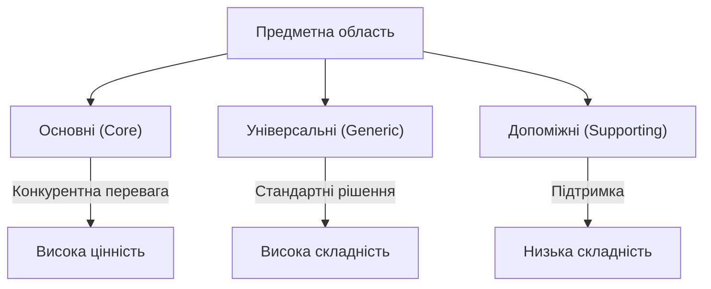
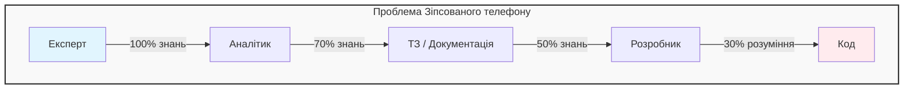

# 1. Аналіз предметної області. Експертні знання та складність

В 1986 році Фред Брукс, автор книги «Міфічний людино-місяць», опублікував статтю під назвою "No Silver Bullet — Essence and Accident in Software Engineering".

У ній він навів переконливі аргументи на користь того, що:

> «Не існує жодної технології чи управлінської методики, яка сама по собі могла б гарантувати десятикратне збільшення продуктивності, надійності чи простоти розробки протягом найближчого десятиліття».

Цей аргумент став центральною ідеєю його роботи.

Брукс розрізняв два типи складності: випадкову (accidental) і суттєву (essential).

З часом технологічні інструменти стали значно кращими, і випадкова складність зменшилася. Проте суттєва складність залишилася незмінною. На думку Брукса, "срібної кулі" не існує, тому що складність програмного забезпечення обумовлена складністю самої предметної області, а не інструментів.

---

## Що таке предметна область?

Предметна область визначає основну сферу діяльності компанії. Простими словами, це той сервіс чи продукт, який компанія пропонує своїм клієнтам.

Наприклад:

-   **FedEx** спеціалізується на кур'єрській доставці.
-   **Starbucks** найбільше відома своїм кавовим асортиментом.
-   **Walmart** — одна з найпопулярніших мереж роздрібної торгівлі.

### Особливості

1. **Багатогалузевість.** Компанія може працювати одночасно в кількох сферах бізнесу.
    - **Amazon** надає як послуги електронної комерції, так і хмарні обчислювальні сервіси.
    - **Uber** поєднує райдшеринг із доставкою їжі та прокатом велосипедів.
2. **Зміна предметної області.** З часом компанії можуть змінювати свою основну сферу діяльності.
    - Канонічним прикладом є **Nokia**, яка займалася такими різними напрямами, як деревообробка, виробництво каучуку, телекомунікації та мобільний зв’язок.

Предметна область — це ядро бізнесу компанії, яке може змінюватися залежно від ринкових умов чи стратегії розвитку.

---

## Що таке піддомен (subdomain)?

Піддомен — це чітко визначена сфера ділової діяльності компанії, яка є частиною її загальної предметної області. Усі піддомени разом утворюють ту предметну область, у якій працює компанія, тобто набір послуг або продуктів, які вона пропонує клієнтам.

::note
Ключові аспекти:

-   **Піддомен як будівельний блок.** Реалізація лише одного піддомена не забезпечить успіху компанії, адже він є лише частиною загальної системи.
-   **Взаємодія піддоменів.** Для досягнення цілей у предметній області піддомени повинні ефективно співпрацювати.

::

### Приклад: Starbucks

Кава — це головний продукт, завдяки якому компанія відома. Але успішна мережа кав'ярень потребує:

-   Оренди чи купівлі нерухомості в стратегічних місцях.
-   Найму персоналу та управління командою.
-   Фінансового менеджменту для забезпечення стійкості бізнесу.

Жоден з цих піддоменів окремо не перетворить компанію на прибуткову. Але їхня взаємодія створює умови для конкурентоздатності та успіху в предметній області.

> Піддомени — це основні складові частини бізнесу, які разом забезпечують його ефективність у предметній області.

---

## Типи піддоменів

У предметно-орієнтованому проектуванні виділяють три основні типи піддоменів:

1. **Основні (core subdomains)**
2. **Універсальні (generic subdomains)**
3. **Допоміжні (supporting subdomains)**

Ці піддомени відіграють різні ролі у досягненні стратегічних та бізнесових цілей компанії.
::mermaid



::

## Основні піддомени (core subdomains)

Основний піддомен — це те, що вирізняє діяльність компанії серед її конкурентів. Це може бути:

-   Створення нових продуктів або послуг (винаходи).
-   Оптимізація існуючих процесів для зниження витрат.

### Приклади основних піддоменів

::card-group
::card{title="Uber"}
Ідея райдшерингу (спільного використання авто) стала новим видом транспортних послуг (винахід, інновація).
Подальші оптимізації, як-от підбір пасажирів в одному напрямку, дозволили зменшити витрати та розвинути бізнес (оптимізація).
::
::card{title="Google"}
Алгоритм ранжування пошукових результатів є ключовим для Google. Функція пошуку навіть не є платною функцією! Хоча пошукова система не приносить прямий дохід, вона забезпечує великий трафік для Google Ads. Помилки у роботі алгоритму чи кращий сервіс від конкурентів могли б негативно вплинути на дохід компанії.

_Примітка: Google Ads - не піддомен, а скоріше окрема предметна область зі складовими її піддоменами, серед яких служби хмарних обчислень (Google Cloud Platform), інструменти для підвищення продуктивності та спільної роботи (Google Workspaces) та інші галузі, в яких працює компанія Alphabet._
::
::

### Особливості основних піддоменів

1. **Складність реалізації**
   Основний піддомен повинен бути складним у реалізації, адже лише складні рішення створюють довготривалу конкурентну перевагу. Наприклад, Uber не тільки запропонував новий ринок, а й зруйнував монолітну структуру індустрії таксі за допомогою технологій. Основний бізнес компанії повинен мати вищий вхідний поріг, щоб конкурентам було складно скопіювати або зімітувати рішення компанії.

2. **Джерела конкурентної переваги**
   Конкурентні переваги можуть бути як технологічними (алгоритми, інновації), так і нетехнологічними (дизайн, експертність).
    - **Ювелірна компанія:** Основним піддоменом є дизайн прикрас, а не інтернет-магазин, який можна створити на готових платформах.
    - **Аналітика шахрайства:** Основним є навчання аналітиків, а не програмна система, яка лише полегшує їх роботу.

### Відмінність основного піддомену від предметної області

Основний піддомен — це частина предметної області, яка має ключове значення для конкурентоспроможності компанії.

> У книзі Еріка Еванса терміни «основний піддомен» та «основна предметна область» часто використовуються як синоніми. Проте, поняття «основний піддомен» є точнішим, адже воно акцентує увагу на ієрархічній структурі.

Основний піддомен — це серце бізнесу компанії, її головний конкурентний козир. Розробка основних піддоменів вимагає складних рішень і забезпечує стійкість компанії на ринку.

---

## Універсальні піддомени (generic subdomains)

Універсальні піддомени охоплюють бізнес-процеси, які всі компанії реалізують однаково. Це перевірені на практиці рішення, які не надають конкурентних переваг.

На відміну від основних піддоменів, універсальні:

-   Не вирізняються інноваціями чи оптимізаціями.
-   Використовуються усіма компаніями в галузі без значних змін.

### Приклади універсальних піддоменів

::steps

### Аутентифікація та авторизація

У більшості систем користувачам потрібен доступ до своїх облікових записів. Реалізувати власну систему аутентифікації складно, а використання готових рішень (наприклад, OAuth2, JWT, або бібліотек) є більш раціональним. Це забезпечує надійність та безпеку, але не надає конкурентних переваг.

### Інтернет-магазини

Якщо ювелірна компанія використовує готову платформу для онлайн-торгівлі, це буде універсальним піддоменом. Важливо лише те, що платформа відповідає базовим вимогам бізнесу.

### Обробка платежів

Інтеграція з готовими сервісами для обробки платежів (Stripe, PayPal) також є типовим універсальним піддоменом. Компанії не вигадують власні системи, а користуються доступними рішеннями.
::

### Характеристики універсальних піддоменів

1. **Складність реалізації.** Універсальні піддомени часто є складними у створенні, тому компанії обирають готові рішення, а не розробляють власні.
2. **Відсутність конкурентної переваги.** Використання універсального рішення не робить компанію унікальною.
3. **Широка доступність.** Готові універсальні рішення є стандартом у багатьох галузях і добре документовані.

### Роль універсальних піддоменів у бізнесі

Універсальні піддомени дозволяють компаніям:

-   Зосередитися на своїх основних піддоменах.
-   Зекономити ресурси, використовуючи готові надійні рішення.

> Універсальні піддомени — це основа функціонування компанії, але не її унікальність. Вони допомагають мінімізувати витрати і ризики, використовуючи перевірені рішення, які не впливають на конкурентні переваги.

---

## Допоміжні піддомени (supporting subdomains)

Допоміжні піддомени підтримують основну бізнес-діяльність компанії, але:

-   Не надають конкурентних переваг.
-   Відрізняються від основних піддоменів простішою бізнес-логікою.

Розглянемо, наприклад, роботу компанії, що займається онлайн-рекламою, основні піддомени якої охоплюють підбір реклами для відвідувачів, підвищення ефективності реклами та зведення до мінімуму вартості рекламного місця. Але для успіху в цих галузях компанії необхідно створити каталог своїх напрацювань. Порядок зберігання та індексації фізичних напрацювань, наприклад банерів і рекламних сторінок, що відкриваються за посиланням, не впливає на її прибуток. У цій галузі нічого винаходити або оптимізувати не потрібно. З іншого боку, каталог напрацювань необхідний для реалізації системи управління рекламою і допоміжних систем. Отже, рішення з каталогізації контенту стає одним із допоміжних піддоменів компанії.

### Приклад використання допоміжних піддоменів

**Компанія онлайн-реклами:**

Основні піддомени включають:

-   Підбір реклами для відвідувачів.
-   Підвищення ефективності реклами.
-   Оптимізацію витрат на рекламний простір.

Для підтримки цих процесів компанії потрібен каталог наявного контенту: Банери, Рекламні сторінки, Посилання.

**Цей каталог:**

-   Не впливає безпосередньо на конкурентоспроможність компанії.
-   Забезпечує основу для інших систем, наприклад, керування рекламою.

Таким чином, каталогізація контенту є допоміжним піддоменом.

### Характеристики допоміжних піддоменів

1. **Проста бізнес-логіка.** Допоміжні піддомени зазвичай містять CRUD-функціонал (створення, читання, оновлення, видалення).
2. **Відсутність високих бар'єрів входу.** Реалізація таких піддоменів не потребує унікальних знань чи складних інновацій.
3. **Підтримка основних піддоменів.** Вони потрібні для забезпечення роботи основних піддоменів, але не створюють додаткової цінності самі по собі.

### Приклади допоміжних піддоменів

-   **Каталогізація контенту.** Зберігання та індексація матеріалів (зображення, відео, документи). Відсутність необхідності в оптимізації, оскільки вплив на прибуток незначний.
-   **Облік ресурсів.** Наприклад, у логістичній компанії це може бути система інвентаризації складів, яка підтримує основну діяльність із транспортування вантажів.
-   **Звітність.** Формування звітів та аналітики для внутрішнього використання.

### Чому допоміжні піддомени важливі?

-   **Забезпечення операційної діяльності:** вони є фундаментом для роботи основних піддоменів.
-   **Раціоналізація витрат:** спрощення реалізації цих піддоменів дозволяє зосередитися на ключових областях бізнесу.

> Допоміжні піддомени важливі для підтримки бізнес-процесів, але вони не є джерелом унікальності чи конкурентних переваг. Компанії часто використовують перевірені підходи для їх реалізації, фокусуючись на розвитку своїх основних піддоменів.

---

## Порівняння піддоменів

Розглянувши три типи піддоменів, настав час звернути увагу на їх відмінності з різних точок зору та зрозуміти, як вони впливають на стратегічні рішення щодо розробки програмних продуктів.

### Конкурентна перевага

-   **Конкурентна перевага** забезпечується лише **основними піддоменами (core subdomains)**. Ці піддомени є ключовими для стратегії компанії, спрямованої на те, щоб виділитися серед конкурентів.
-   **Універсальні піддомени (generic subdomains)** не можуть бути джерелом конкурентної переваги, оскільки це стандартні рішення, які використовуються як вашою компанією, так і конкурентами.
-   **Допоміжні піддомени (supporting subdomains)** мають низькі бар'єри для входу і не забезпечують конкурентної переваги. Зазвичай компанії не заперечують проти того, щоб конкуренти використовували їх рішення, оскільки це не впливає на їх конкурентоспроможність.

## Конкурентна перевага

Чим складніші задачі, які успішно вирішує компанія, тим більшу бізнес-цінність вона створює. Це можуть бути не лише послуги для споживачів, а й оптимізація та підвищення ефективності бізнесу. Наприклад, конкурентною перевагою є надання того ж рівня обслуговування, що й у конкурентів, але з меншими витратами на експлуатацію.

## Складність

Визначення піддоменів має важливе значення і з технічної точки зору, оскільки різні типи піддоменів мають різний рівень складності. Для розробки програмних продуктів потрібно обирати інструменти та методи, що відповідають складності бізнес-вимог.

::card-group
::card{title="Допоміжні піддомени"}
Бізнес-логіка зазвичай проста і очевидна. Наприклад, для стандартних ETL-операцій та CRUD-інтерфейсів (створення, читання, оновлення, видалення) не потрібно великих зусиль. Вона часто обмежується перевіркою вхідних даних або перетворенням даних з однієї структури в іншу.
::

::card{title="Універсальні піддомени"}
Набагато складніші. Наприклад, алгоритми шифрування або механізми аутентифікації потребують значних зусиль і часу на розробку, і часто ці знання вже є доступними через відкриті рішення або консультантів.
::
::

**Основні піддомени** відрізняються особливою складністю. Їх копіювання конкурентами має бути ускладненим, оскільки це впливає на прибутковість компанії. Тому компанії прагнуть вирішувати складні задачі саме в основних піддоменах.

## Зміна

-   **Основні піддомени** часто зазнають змін, оскільки їх розвиток є ключовим для підтримки конкурентної переваги. Інновації, нові функції та оптимізація існуючих рішень постійно вносяться для того, щоб обігнати конкурентів.
-   **Допоміжні піддомени** не піддаються частим змінам, оскільки не забезпечують значної конкурентної переваги. Їх розвиток не приносить значної комерційної цінності.
-   **Універсальні піддомени** можуть змінюватися, наприклад, удосконалюються заходи безпеки або виправляються помилки.

## Стратегія реалізації

::card-group
::card{title="Основні піддомени"}
Повинні реалізовуватись всередині компанії, оскільки їх купівля або аутсорсинг знижує конкурентну перевагу. Аутсорсинг основних піддоменів є ризикованим у довгостроковій перспективі, оскільки це може призвести до втрати контролю над критично важливими процесами та інноваціями.
::
::card{title="Універсальні піддомени"}
Через свою складність і вже вирішені задачі вигідніше купувати або використовувати відкриті рішення. Розробка їх власними силами може бути надмірною витратою ресурсів.
::
::card{title="Допоміжні піддомени"}
Зазвичай не призначені для створення конкурентних переваг, тому їх розробка власними силами не є оптимальним варіантом, але через відсутність готових рішень компанії змушені брати на себе реалізацію таких піддоменів. У такому випадку використання простих технологій для розробки є виправданим.
::
::

Для ефективного розвитку та досягнення конкурентних переваг компанія повинна орієнтуватися на правильний вибір і реалізацію кожного типу піддомену, враховуючи його складність і роль у бізнес-стратегії.

| Піддомен                    | Конкурентна перевага | Складність | Частота змін | Стратегія реалізації  | Тип проблеми        |
| :-------------------------- | :------------------- | :--------- | :----------- | :-------------------- | :------------------ |
| **Основний (Core)**         | Так                  | Висока     | Висока       | Власна розробка       | Складна / Унікальна |
| **Універсальний (Generic)** | Ні                   | Висока     | Середня      | Покупка / Відкрите ПЗ | Вирішена            |
| **Допоміжний (Supporting)** | Ні                   | Низька     | Низька       | Самостійна            | Банальна            |

---

## Визначення меж піддоменів

Визначення меж піддоменів — це процес, що починається з аналізу бізнес-стратегії компанії та її унікальних характеристик. Піддомен визначається через вивчення предметних областей, у яких компанія працює, а також через розуміння того, як вона вирізняється серед конкурентів у своїй галузі. Важливо пам’ятати, що піддоменами часто вже є елементи бізнесу, навіть якщо вони не були формалізовані.

Щоб визначити піддомени, можна почати з аналізу існуючих відділів компанії. Наприклад, інтернет-магазин може містити піддомени, як склад, обслуговування клієнтів, комплектація, відвантаження та інші, які можуть бути класифіковані за ступенем важливості або специфічності. Однак чи достатньо цих категорій для прийняття проектних рішень?

### Виділення піддоменів: чому важлива увага до деталей

Грубе визначення піддоменів, наприклад, через ідентифікацію відділів компанії, може бути хорошою відправною точкою, але не дає повного розуміння меж піддоменів. Важливо не пропустити важливу інформацію, яка може бути прихована в дрібницях бізнес-функцій.

Приклад з відділом обслуговування клієнтів допомагає зрозуміти, що проста класифікація на один піддомен є недостатньою. Усередині відділу може бути кілька більш вузьких функцій, таких як довідкова служба, управління робочими змінами, телефонна станція та інші. Кожен з цих підрозділів може бути віднесений до різних типів піддоменів, наприклад:

-   **Довідкова служба та телефонна станція** — універсальні піддомени, оскільки їх функції можуть бути передані стороннім постачальникам.
-   **Управління робочими змінами** — допоміжний піддомен, що не є конкурентною перевагою, але необхідний для забезпечення безперебійної роботи.
-   **Алгоритм маршрутизації звернень** — основний піддомен, оскільки він надає компанії конкурентну перевагу в обслуговуванні клієнтів.

{.diagram-img}

### Коли зупинятися?

Визначити, де закінчуються межі піддоменів, — це мистецтво, яке потребує балансу. З одного боку, важливо не занурюватися в деталі на занадто низькі рівні, щоб не втратити фокус на основній бізнес-цілі. З іншого боку, важливо не упустити важливі аспекти, що можуть вплинути на проектування рішення та його бізнес-цінність.

Зрештою, треба зупинитися на тому рівні деталізації, який дозволяє чітко зрозуміти, які функції є основними та конкурентними для компанії, а які — допоміжними чи універсальними. Це допомагає не тільки у проектуванні, але й у правильному розподілі ресурсів, спрощенні архітектури та підвищенні ефективності розробки програмного продукту.

### Піддомен і сценарії використання: взаємозв'язок і визначення меж

#### 1. Піддомен як набір взаємопов'язаних сценаріїв використання

З технічної точки зору, піддомен можна порівняти з набором взаємозв'язаних сценаріїв використання (use cases), які зазвичай мають однакових учасників, об'єкти господарювання та схожий набір використовуваних даних.
Наприклад, розглянемо систему прийому платежів за кредитними картками. Всі сценарії цієї системи будуть тісно пов'язані з робочими даними та учасниками, що беруть участь у процесі. Всі варіанти дій, пов'язані з обробкою платежів, формують піддомен оплати кредитними картками.

#### 2. Як визначити точні межі піддоменів

Одним із принципів, що дозволяє визначити межі піддоменів, є твердження, що піддомен — це набір узгоджених сценаріїв використання. Такий підхід допомагає чітко визначити межі піддомену, зосереджуючи увагу на тих функціях, які дійсно відносяться до цього піддомену, і відокремлюючи їх від універсальних або допоміжних функцій.

#### 3. Коли слід зупинитися в пошуках піддоменів?

Важливо не занурюватися в нескінченний пошук дрібніших піддоменів, оскільки це може призвести до втрати фокусу на основних бізнес-функціях.

-   **Для основних піддоменів** — так, важливо чітко визначити межі, оскільки вони є найважливішими, змінними та складними. Точне визначення меж дозволить сконцентруватися на реалізації найбільш цінних функцій, усунувши універсальні та допоміжні функції.
-   **Для допоміжних та універсальних піддоменів** можна бути менш строгими в пошуках, якщо подальше углиблення не відкриває нових ідей, корисних для проектування.

Наприклад, коли ми аналізуємо довідкову службу, подальше її розбиття на піддомени навряд чи приведе до нової цінної інформації. Тут можна використовувати вже готові інструменти загального призначення, і такий піддомен не потребує надмірного розбиття.

#### 4. Не всі піддомени необхідні

При визначенні піддоменів важливо також задатися питанням, чи потрібні всі піддомени. Оскільки кожен піддомен — це інструмент для прийняття проектних рішень, потрібно зосередитися тільки на тих аспектах бізнесу, які безпосередньо пов'язані з розробкою програмного забезпечення.

> **Зверніть увагу:** не всі бізнес-функції є частинами програмного забезпечення. Наприклад, виробник ювелірних виробів може мати бізнес-функції, які не стосуються програмних рішень, і в такому випадку ці функції не повинні впливати на проектування програмного продукту.

---

### Висновки

-   Піддомен визначається через набори сценаріїв використання, які тісно пов'язані з певними бізнес-функціями.
-   Важливо чітко окреслити межі піддоменів для основних і допоміжних функцій, зберігаючи фокус на ключових аспектах.
-   Пошук піддоменів повинен зупинятися на рівні, коли подальше углиблення не приносить нової корисної інформації.
-   Не всі бізнес-функції повинні бути інтегровані в програмне забезпечення, тому важливо розпізнавати функції, які мають відношення саме до розробки системи.

{.diagram-img}
{.diagram-img}

---

## Приклади сценаріїв використання (use cases)

### 1. Інтернет-магазин (піддомен "Управління замовленнями")

-   **Сценарій використання:** Оформлення замовлення
-   **Актор:** Клієнт
-   **Опис:** Клієнт додає товари до кошика, вибирає спосіб доставки та оплати, після чого підтверджує замовлення.
-   **Передумови:** Клієнт авторизований у системі.

**Основний потік:**
::steps

1. Клієнт переглядає товарний каталог.
2. Клієнт додає товари до кошика.
3. Клієнт переходить до оформлення замовлення.
4. Клієнт вибирає спосіб доставки (кур'єр, пошта тощо).
5. Клієнт вибирає спосіб оплати (кредитна картка, онлайн-банкінг тощо).
6. Клієнт підтверджує замовлення.

::

**Результат:** Замовлення створено, система надсилає підтвердження на електронну пошту клієнта.

### 2. Система управління персоналом (піддомен "Облік робочого часу")

-   **Сценарій використання:** Реєстрація робочих годин
-   **Актор:** Співробітник
-   **Опис:** Співробітник реєструє свої робочі години через внутрішню систему.
-   **Передумови:** Співробітник авторизований у системі.

**Основний потік:**
::steps

1. Співробітник входить в систему.
2. Співробітник вибирає опцію "Реєстрація робочого часу".
3. Співробітник вказує кількість годин, відпрацьованих за день.
4. Співробітник підтверджує введену інформацію.

::

**Результат:** Інформація про робочі години співробітника оновлюється в базі даних.

### 3. Банківська система (піддомен "Обробка транзакцій")

-   **Сценарій використання:** Переказ коштів між рахунками
-   **Актор:** Клієнт
-   **Опис:** Клієнт здійснює переказ коштів з одного рахунку на інший через онлайн-банкінг.
-   **Передумови:** Клієнт має доступ до онлайн-банкінгу та достатньо коштів на рахунку.

**Основний потік:**
::steps

1. Клієнт входить в онлайн-банкінг.
2. Клієнт вибирає опцію "Переказ коштів".
3. Клієнт вводить номер рахунку отримувача та суму переказу.
4. Клієнт підтверджує транзакцію, вводячи код з SMS.
5. Система обробляє транзакцію і надає клієнту підтвердження.

::

**Результат:** Кошти успішно переказані на вказаний рахунок.

### 4. Медична система (піддомен "Запис на прийом до лікаря")

-   **Сценарій використання:** Запис до лікаря
-   **Актор:** Пацієнт
-   **Опис:** Пацієнт записується на прийом до лікаря через електронну систему.
-   **Передумови:** Пацієнт зареєстрований у системі і має доступ до календаря лікаря.

**Основний потік:**
::steps

1. Пацієнт входить в систему.
2. Пацієнт вибирає лікаря і дату з доступних варіантів у календарі.
3. Пацієнт підтверджує запис і вводить необхідну інформацію про проблему.
4. Система надсилає підтвердження запису на електронну пошту пацієнта.

::

**Результат:** Пацієнт успішно записаний на прийом до лікаря.

### 5. Система навчання (піддомен "Управління курсами")

-   **Сценарій використання:** Запис на курс
-   **Актор:** Студент
-   **Опис:** Студент записується на курс через платформу для онлайн-навчання.
-   **Передумови:** Студент авторизований на платформі та має доступ до списку курсів.

**Основний потік:**
::steps

1. Студент переглядає доступні курси на платформі.
2. Студент вибирає курс і натискає на кнопку "Записатися".
3. Студент підтверджує запис та обирає метод оплати (якщо це платний курс).
4. Платформа підтверджує успішний запис на курс і надає доступ до навчальних матеріалів.

::

**Результат:** Студент записаний на курс і має доступ до навчальних матеріалів.

---

## Практика: Аналіз піддоменів

Розглянемо, як можна застосувати концепцію піддоменів на практиці та використовувати їх для прийняття стратегічних рішень. Візьмемо дві вигадані компанії: **Gigmaster** та **BusVNext**. Під час читання спробуйте проаналізувати сфери бізнесу цих компаній та визначити три типи піддоменів для кожної. Пам'ятайте, що деякі бізнес-вимоги можуть бути явними або не зовсім очевидними.

### Gigmaster

**Gigmaster** — компанія, що займається продажем та розповсюдженням квитків. У їх мобільному додатку для визначення найближчих шоу, які користувачі хотіли б відвідати, аналізуються музичні бібліотеки, акаунти потокових сервісів та профілі в соціальних мережах.

Користувачі Gigmaster прагнуть зберегти свою конфіденційність. Тому вся особиста інформація шифрується, а алгоритм рекомендацій працює тільки з анонімізованими даними. Для покращення рекомендацій користувачам дається змога реєструвати концерти, які вони відвідували раніше, навіть якщо квитки були придбані не через Gigmaster.

#### Предметна область та піддомени Gigmaster:

Сфера діяльності: Продаж квитків. Це основна послуга, що надається компанією своїм клієнтам.

::card-group
::card{title="Основні піддомени"}
**Система рекомендацій** — забезпечує користувачів персоналізованими порадами щодо подій.
**Система забезпечення анонімності даних** — гарантує конфіденційність особистої інформації користувачів.
**Мобільний додаток** — забезпечує зручність користування і доступ до всіх послуг.
::
::card{title="Універсальні піддомени"}
**Шифрування** — для захисту всіх даних користувачів.
**Бухгалтерський облік** — для ведення обліку продажу квитків.
**Безготівковий розрахунок** — для отримання платежів від клієнтів.
**Аутентифікація та авторизація** — для ідентифікації користувачів.
::
::card{title="Допоміжні піддомени"}
**Інтеграція з сервісами потокового аудіо** — для доступу до музичних бібліотек користувачів.
**Інтеграція з соціальними мережами** — для збору профілів та інтересів користувачів.
**Модуль відвіданих концертів** — для реєстрації минулих подій.
::
::

#### Архітектурні рішення для Gigmaster:

Система рекомендацій, анонімізація даних та мобільний додаток повинні бути розроблені власноруч за допомогою новітніх технологій.
Шифрування даних, облік, безготівкові розрахунки та аутентифікація — можна використовувати готові рішення або відкритий код.
Інтеграція з потоковими сервісами та соціальними мережами, а також модуль відвіданих концертів можна передати на аутсорсинг.

---

### BusVNext

**BusVNext** — компанія, що займається громадським транспортом, зокрема, організацією комфортних поїздок на автобусах. Компанія керує автобусними парками в великих містах.

Клієнти BusVNext можуть замовити поїздку через мобільний додаток, і у разі необхідності маршрут автобуса буде миттєво скоригований для точного часу прибуття. Основним завданням компанії було впровадження алгоритму маршрутизації, який оптимізує розподіл автобусів з урахуванням різних бізнес-цілей, таких як скорочення часу посадки, навіть якщо це збільшує загальну тривалість поїздки. Для покращення маршрутизації BusVNext інтегрується з постачальниками трафіку для отримання інформації в реальному часі.

Компанія також регулярно пропонує знижки, щоб залучити нових клієнтів і вирівняти попит у години пік.

#### Предметна область та піддомени BusVNext:

Сфера діяльності: Громадський транспорт — надання пасажирських перевезень на автобусах.

::card-group
::card{title="Основні піддомени"}
**Маршрутизація** — алгоритм оптимізації маршрутів для автобусів.
**Аналіз даних** — для покращення маршрутів на основі поведінки клієнтів.
**Покращене користувацьке враження від мобільного додатка** — забезпечення зручності користування додатком.
**Управління автопарком** — моніторинг технічного стану автобусів.
::
::card{title="Універсальні піддомени"}
**Умови трафіку** — для отримання актуальної інформації про трафік.
**Бухгалтерський облік** — для обробки фінансів компанії.
**Збір оплати** — для обробки платежів від клієнтів.
**Авторизація** — для ідентифікації користувачів.
::
::card{title="Допоміжні піддомени"}
**Управління акціями та знижками** — для обробки промо-акцій та купонів.
::
::

#### Архітектурні рішення для BusVNext:

Алгоритм маршрутизації, аналіз даних, управління автопарком та зручність користування додатком повинні бути розроблені власноруч із використанням складних технічних інструментів.
Управління рекламними акціями та знижками може бути передано на аутсорсинг.
Умови трафіку, авторизація та фінансові операції можуть бути делеговані зовнішнім постачальникам послуг.

#### Висновки

Аналіз предметної області дозволяє чітко визначити ключові піддомени компанії, що має вирішальне значення для стратегічних архітектурних рішень. Знаючи різницю між основними, універсальними та вспомогальними піддоменами, можна приймати обґрунтовані рішення щодо розвитку та оптимізації системи.

---

---

## Хто такі фахівці у предметній області?

Фахівці у предметній області (Domain Experts) — це люди, які глибоко розбираються в бізнес-процесах та специфіці предметної області, яку планується моделювати і реалізовувати у програмному забезпеченні. Їхня основна роль полягає у формулюванні та роз'ясненні бізнес-завдань, які потрібно вирішити за допомогою системи.

**Основні риси фахівців у предметній області:**

-   **Не плутати з аналітиками чи програмістами:**
    -   Вони не збирають вимоги і не пишуть код.
    -   Їхня головна компетенція — розуміння бізнесу та його завдань.
-   **Джерело бізнес-знань:**
    -   Від них надходять основні вимоги та знання, необхідні для побудови програми.
-   **Різна експертиза:**
    -   Одні фахівці мають широке уявлення про всю предметну область.
    -   Інші спеціалізуються на окремих піддоменах.

### Приклади фахівців у різних сферах:

-   **У рекламному агентстві:**
    -   Менеджери кампаній.
    -   Закупівельники медіаконтенту.
    -   Аналітики даних.
-   **У сфері транспорту:**
    -   Логісти, які планують маршрути.
    -   Інженери, відповідальні за технічний стан транспортних засобів.
    -   Оператори, які працюють із клієнтами.

### Чому фахівці важливі у розробці програмного забезпечення?

-   Вони визначають сутність бізнес-завдань, які має вирішити система.
-   Допомагають трансформувати ментальні моделі бізнесу у вимоги до системи та у технічну реалізацію.
-   Їхні знання дозволяють уникнути помилок у проектуванні та краще задовольнити потреби кінцевих користувачів.

> **Ключова ідея:** Фахівці у предметній області — це ті, хто створює основу для побудови ефективного програмного забезпечення. Їхні знання є базою для аналітиків та розробників, які працюють над трансформацією цих знань у програмний код.

---

## Висновки до розділу

У першій частині лекції розглядалися інструменти проєктування, орієнтовані на предметну область, які дозволяють глибше зрозуміти ділову активність компанії. Основні тези глави:

1. **Все починається з предметної області (домену):**
   Це сфера, в якій працює бізнес і яка визначає, які послуги надаються клієнтам.
2. **Ключові будівельні блоки для досягнення бізнес-успіху:**

    - **Основні піддомени (Core subdomains):**
      Сюди входять унікальні завдання, які виконуються компанією інакше, ніж у конкурентів, забезпечуючи конкурентні переваги.
    - **Універсальні піддомени (Generic subdomains):**
      Це вирішені завдання, які всі компанії виконують однаково. Інновації тут не потрібні, і використання готових рішень є більш ефективним.
    - **Допоміжні піддомени (Supporting subdomains):**
      Завдання з очевидними рішеннями, які компанія зазвичай виконує самостійно, але вони не додають конкурентних переваг.

3. **Роль фахівців у предметній області:**
    - Фахівці є експертами у бізнесі, мають глибокі знання про домен або його піддомени.
    - Вони відіграють вирішальну роль у забезпеченні успіху проєкту, формуючи основу для моделювання і реалізації програмного забезпечення.

> Успішне проєктування програмного забезпечення неможливе без розуміння предметної області, структури її піддоменів та залучення фахівців, які допоможуть трансформувати бізнес-знання у технічні рішення.

---

## Приклад предметної області: WolfDesk

**WolfDesk** надає як послугу систему управління заявками служби підтримки. Якщо вашій компанії, що тільки розпочинає діяльність, необхідно підтримувати клієнтів, то за допомогою рішення WolfDesk можна буде розпочати роботу у найкоротші терміни.

Компанія WolfDesk використовує не таку модель оплати, як її конкуренти. Вона стягує плату не за кожного користувача, а дозволяє орендарям мати скільки завгодно користувачів і стягує з них плату за кількість звернень до служби підтримки за оплачуваний період. Мінімальна плата відсутня, і до того ж компанія застосовує автоматичні оптові знижки для певних порогів щомісячних заявок: 10% при відкритті понад 500 заявок, 20% при відкритті понад 750 заявок та 30% при відкритті понад 1000 заявок на місяць.

Щоб орендарі не зловживали бізнес-моделлю, алгоритмом життєвого циклу заявок WolfDesk забезпечується автоматичне закриття неактивних заявок, що стимулює клієнтів відкривати нові заявки, коли буде потрібна додаткова підтримка. Більше того, WolfDesk впровадила систему виявлення випадків шахрайства, яка проводить аналіз повідомлень і виявляє випадки розгляду несумісних між собою тем в одній і тій самій заявці.

Щоб допомогти своїм орендарям оптимізувати роботу, пов’язану з підтримкою, WolfDesk впровадила функцію автопілота підтримки. Цей автопілот аналізує нові заявки і намагається автоматично знайти відповідне рішення з історії заявок орендаря. Його функціонування дозволяє ще більше скоротити строк життя заявок, стимулюючи клієнтів відкривати нові заявки для наступних питань.

У WolfDesk впроваджені всі стандарти і заходи безпеки для автентифікації та авторизації користувачів своїх орендарів, а також орендарям дозволено налаштовувати наскрізну реєстрацію (single sign-on, SSO) з наявними у них системами управління користувачами.

Інтерфейс адміністрування дозволяє орендарям налаштовувати можливі значення категорій заявок, а також список тих продуктів орендаря, які ними підтримуються.

Щоб мати змогу спрямовувати нові заявки агентам підтримки орендаря лише у їхній робочий час, WolfDesk дозволяє вводити графік змін кожного агента.

Оскільки WolfDesk надає свої послуги без мінімальної плати, компанія повинна оптимізувати свою інфраструктуру таким чином, щоб звести до мінімуму витрати на підключення нового орендаря. Для цього у WolfDesk використовуються безсерверні обчислення, що дозволяють проводити гнучке масштабування обчислювальних ресурсів залежно від кількості операцій з активними заявками.

### Завдання (Quiz)

::steps

1. **Які з піддоменів не надають жодної конкурентної переваги?**

    А) Основний (Core).
    Б) Універсальний (Generic).
    В) Допоміжний (Supporting).
    Г) І універсальний, і допоміжний.

::collapsible
**Г) І універсальний, і допоміжний.**

    _Ці піддомени не додають конкурентної переваги, оскільки включають завдання з очевидними рішеннями та функції, які виконуються однаково в різних компаніях._

::

2. **Для якого піддомену всі конкуренти можуть використовувати одні й ті ж рішення?**

    А) Для основного (Core).
    Б) Для універсального (Generic).
    В) Для допоміжного (Supporting).
    Г) Для жодного з перерахованих. Компанія завжди повинна відрізнятися від своїх конкурентів.

::collapsible
**Б) Для універсального (Generic).**

    _Універсальні піддомени можуть використовувати однакові рішення, оскільки вони не залежать від специфіки бізнесу._

::

3. **Який піддомен зазнає найчастіших змін?**

    А) Основний (Core).
    Б) Універсальний (Generic).
    В) Допоміжний (Supporting).
    Г) У змінності різних піддоменів немає жодної різниці.

::collapsible
**А) Основний (Core).**

    _Основний піддомен зазвичай зазнає найчастіших змін, оскільки саме він забезпечує конкурентні переваги і постійно адаптується до ринку._

::

4. **У чому саме полягає суть предметної області WolfDesk?**

::collapsible
Суть предметної області WolfDesk полягає у наданні послуги системи управління заявками служби підтримки, яка дозволяє компаніям ефективно підтримувати своїх клієнтів. Основна функція полягає в оптимізації обробки заявок, впровадженні автоматизації, аналітики, а також забезпеченні зручності для користувачів.

::

5. **Що є основним (core) піддоменом (або основними піддоменами) WolfDesk?**

::collapsible
Основним піддоменом є:

    - Унікальна бізнес-модель WolfDesk (стягнення плати за кількість заявок замість кількості користувачів), яка забезпечує конкурентну перевагу.
    - Система автоматичного закриття неактивних заявок та виявлення шахрайства, що додає унікальності та ефективності послузі.
    - Автопілот підтримки, що аналізує заявки та пропонує рішення на основі історичних даних.

::

6. **Що є допоміжним (supporting) піддоменом (або допоміжними піддоменами) WolfDesk?**

::collapsible
Допоміжними піддоменами є:

    - Адміністративний інтерфейс для налаштування категорій заявок та списків продуктів.
    - Механізм введення графіків роботи агентів підтримки, що дозволяє адаптувати систему під потреби орендарів.

::

7. **Що є універсальним (generic) піддоменом (або універсальними піддоменами) WolfDesk?**

::collapsible
Універсальними піддоменами є:

    - Системи автентифікації та авторизації користувачів, які дотримуються загальноприйнятих стандартів безпеки.
    - Налаштування наскрізної реєстрації (SSO), що є стандартною функцією для інтеграції з іншими системами управління користувачами.
    - Використання безсерверних обчислень для масштабування інфраструктури, що є типовим рішенням для багатьох сучасних SaaS-платформ.

::

::

---

## Завдання бізнесу (business problems)

### Суть і мета завдань бізнесу

Програмні системи створюються для вирішення бізнес-завдань, які значно відрізняються від математичних задач чи загадок. Бізнес-завдання не завжди мають єдине, остаточне рішення. Це комплексні проблеми, які вимагають оптимізації процесів, автоматизації, управління даними та підтримки прийняття рішень.

**Приклад:** Для компанії FedEx бізнес-завданням є забезпечення швидкої доставки посилок, тому оптимізація процесу доставки — це ключовий аспект їхньої діяльності.

### Рівні постановки бізнес-завдань

-   **На рівні предметної області:** це великі, стратегічні завдання, що охоплюють усю сферу діяльності компанії.
-   **На рівні піддоменів:** піддомени — це менші за масштабом області, кожна з яких фокусується на вирішенні окремих бізнес-компетенцій.

**Приклад піддоменів і їх задач:**

-   **Піддомен управління знаннями:** оптимізація зберігання та пошуку інформації.
-   **Піддомен взаєморозрахунків:** ефективність фінансових операцій.
-   **Бухгалтерський піддомен:** відстеження руху коштів у компанії.

### Мета бізнесу — надати рішення, які полегшують роботу клієнтів.

-   Піддомени розв’язують конкретні проблеми, що дозволяє компанії досягати бізнес-цілей.
-   Успішна програмна система повинна враховувати специфіку кожного піддомену, що дозволяє компанії залишатися конкурентоспроможною.
-   Піддомени являють собою більш дрібні предметні області, метою яких є надання рішень (solution) для конкретних бізнес-компетенцій (capabilities).

Кожна компанія має свої завдання, наприклад, як зробити процес доставки швидшим або як автоматизувати фінансові операції. Для цього бізнес розділяється на менші частини — піддомени, кожен із яких вирішує конкретну задачу. Як результат, програма стає ефективним інструментом для бізнесу.

## Обмін знаннями (Knowledge Crunching)

Процес розробки — це не просто написання коду. Це **навчання**.
Ми (розробники) вчимося у експертів предметної області.

### Виявлення експертних знань

Ефективна розробка програмного забезпечення залежить від розуміння предметної області.
Експертами в предметній області є фахівці, які мають глибокі знання та розуміють тонкощі сфери. Розробники не повинні ставати експертами, але повинні розуміти їхній спосіб мислення та використовувати відповідну термінологію.

**Основні проблеми:**

-   Відсутність повного розуміння бізнес-завдань розробниками.
-   Прогалини у вимогах: важливі граничні випадки можуть бути упущені.
-   Втрати інформації під час передачі знань.

> **Ключова думка Альберто Брандоліні:**
> Розробка програмного забезпечення — це процес навчання, а робочий код є побічним ефектом.

**Для успіху проекту:**

-   Розробники та експерти повинні взаємодіяти ефективно.
-   Розуміння задачі має бути повним, а обмін знаннями — продуктивним.

### Продуктивне спілкування

Більшість програмних проектів вимагають співпраці між різними ролями:

-   Експерти предметної області.
-   Власники продуктів.
-   Розробники, тестувальники, дизайнери UX/UI.
-   Аналітики та менеджери проектів.

Продуктивне спілкування — ключ до успіху, але воно часто ускладнюється:

-   Бізнес і розробники часто не мають прямого контакту.
-   Знання передаються через "перекладачів": бізнес-аналітиків, власників продуктів, системних аналітиків.

### Проблеми з обміном знаннями

1. **Втрати при "перекладі":**
   Кожен етап передачі інформації (від експертів до розробників) супроводжується втратами.
2. **Застарілі документи:**
   Традиційний підхід передбачає створення аналітичної моделі (опису вимог), але вона швидко втрачає актуальність.
3. **Ігровий ефект "зіпсованого телефону":**
   Передача знань схожа на гру: інформація спотворюється, що призводить до помилкових рішень.

**Результат:**
Невдалий програмний проект: або неправильно вирішено задачу, або вирішено іншу задачу.
::mermaid



::

### Предметно-орієнтоване програмування як рішення

Предметно-орієнтоване програмування (DDD) пропонує ефективний підхід:

-   Використання єдиної мови (ubiquitous language), яка зрозуміла як розробникам, так і експертам.
-   Зменшення кількості "перекладів" інформації між ролями.
-   Підвищення точності реалізації вимог.

{.diagram-img}

### Висновок

-   Розуміння предметної області — основа успішного проекту.
-   Для мінімізації втрат інформації потрібно налагодити пряме спілкування між експертами та розробниками.
-   Використання єдиної мови допомагає усунути проблеми "зіпсованого телефону" та спростити розробку.

> Простими словами: Щоб створити якісний продукт, розробникам потрібно говорити з бізнесом "однією мовою". Це зменшить помилки та спростить розуміння задач.

{.diagram-img}

## Що таке єдина мова?

Єдина мова (англ. Ubiquitous Language) – це наріжний камінь предметно-орієнтованого проєктування.

### Основна ідея

Якщо всі зацікавлені сторони хочуть ефективно спілкуватися без перекладів, вони мають використовувати єдину мову для опису предметної області.

### Чому це важливо?

Хоча ця ідея здається очевидною, як казав Вольтер: «Здоровий глузд – це не таке вже й поширене явище». У традиційному процесі розробки програмного забезпечення знання предметної області проходять кілька перетворень:

1. Перетворення знань у аналітичну модель.
2. Перетворення аналітичної моделі у вимоги.
3. Перетворення вимог у дизайн.
4. Перетворення дизайну у вихідний код.

### Роль єдиної мови

Предметно-орієнтоване проєктування пропонує створити єдину мову для опису предметної області, щоб уникнути цих численних перекладів.

**Хто повинен використовувати єдину мову?**
Усі зацікавлені сторони проєкту:

-   програмісти,
-   власники продукту,
-   експерти предметної області,
-   дизайнери UI/UX.

**Мета:** забезпечити, щоб експертам предметної області було комфортно використовувати цю мову, яка відображає їхні знання та ментальні моделі.

### Як забезпечити ефективне використання єдиної мови?

-   **Постійне використання:** мова має бути інтегрована в усі аспекти роботи команди.
-   **Узгоджені терміни:** мова має однаково трактуватися всіма учасниками.
-   **Зворотний зв’язок:** експерти предметної області повинні активно перевіряти, чи мова відповідає реальності.

---

## Мова бізнесу

Важливо підкреслити, що єдина мова - це мова бізнесу. Тобто вона має складатися тільки з понять, пов'язаних із предметною областю. У ній не має бути жодного технічного жаргону! Навчати експертів у сфері бізнесу синглтонам і абстрактним фабрикам - не ваша мета. Єдина мова націлена на введення розуміння експертами предметної області та ментальних моделей предметної області в рамки легко сприйманих понять.

### Сценарії

**Приклад: Система управління рекламними кампаніями**

Уявімо, що ми працюємо над системою управління рекламними кампаніями. Ось кілька тверджень:

::card-group
::card

---

title: ✅ Хороші (Бізнес) формулювання

---

-   У межах рекламної кампанії можуть демонструватися різні креативні матеріали.
-   Рекламну кампанію можна запустити, лише якщо активне хоча б одне місце розміщення.
-   Комісія за продажі нараховується лише після підтвердження транзакцій.

_Ці твердження сформульовані на бізнес-мові. Вони зрозумілі бізнес-експертам і відображають їхній підхід до роботи._
::

::card

---

title: ❌ Неприйнятні технічні формулювання

---

-   У рекламному iframe-елементі відображається HTML-файл.
-   Рекламна кампанія запускається лише за наявності запису в таблиці активних місць розміщення.
-   Комісія за продажі нараховується на основі записів таблиць транзакцій і підтверджених продажів.

_Ці твердження є суто технічними й незрозумілими бізнес-експертам. Якщо програмісти орієнтуються лише на такі формулювання, вони можуть не зрозуміти повністю бізнес-логіку, що призведе до складнощів у моделюванні ефективного рішення._
::
::

### Узгодженість

Єдина мова має бути чітко вираженою та узгодженою.
Логіка предметної області повинна бути відображена явно, щоб уникнути двозначностей.
Кожне поняття в єдиній мові має мати однозначне значення.

#### Неоднозначні поняття

Наприклад, у деякій предметній області слово **policy** може мати кілька значень:

-   «Політика».
-   «Страховий договір».

Визначити, що саме мається на увазі, можна лише за контекстом. Проте програми не працюють із двозначностями, і моделювання такого поняття в коді стає складним.

> **Рішення:** Розділити поняття policy на два окремі терміни: «політика» та «страховий договір».

### Поняття-синоніми

У єдиній мові не можна використовувати синоніми для позначення одного поняття.

Наприклад:
У системах часто використовують поняття **user** (користувач). Але в жаргоні предметної області user може бути замінений словами **visitor** (відвідувач), **administrator** (адміністратор), **account** (обліковий запис).

Спочатку це може здатися незначною проблемою, але насправді кожне з цих понять має різне значення:

-   **Visitor** – незареєстрований користувач (використовується для аналітики).
-   **Account** – зареєстрований користувач (має доступ до функціоналу системи).

> **Рішення:** Для кожного поняття використовувати чітко визначений термін, який відповідає його ролі.

---

## Модель предметної області

### Що таке модель?

Модель — це спрощене уявлення об’єкта або явища, в якому свідомо виділяються певні аспекти та ігноруються інші. Це абстракція, створена для конкретного використання.

**Ребекка Вірфс-Брок (Rebecca Wirfs-Brock)**:

> Модель — це не копія реального світу, а конструкція, створена людиною, що допомагає зрозуміти системи реального світу.

Класичним прикладом моделі є карта. Наприклад, навігаційна карта, карта місцевості, карта метро — кожна з них показує лише ту інформацію, яка необхідна для її конкретного завдання.

{.diagram-img}

### Ефективне моделювання

Кожна модель має свою мету, і ефективна модель включає лише ті деталі, які потрібні для її досягнення.

Наприклад:

-   На карті світу не буде станцій метро.
-   На карті метро неможливо оцінити географічні відстані.

Корисна модель — це не копія реального світу, а інструмент для вирішення конкретної задачі. Як сказав статистик Джордж Бокс:

> «Усі моделі є хибними, але деякі корисними».

Моделі допомагають зменшувати складність, опускаючи зайві деталі й залишаючи лише те, що необхідно. Проте погана абстракція може упустити важливі деталі або додати зайве, що створить проблеми.

Як зазначив Едсгер Дейкстра:

> «Мета абстрагування — створення нового рівня семантики, де можна бути абсолютно точним».

### Моделювання предметної області

Створюючи єдину мову, ми фактично будуємо модель предметної області, яка повинна:

-   відображати уявлення експертів про бізнес;
-   включати об’єкти, їх поведінку, причинно-наслідкові зв’язки та інваріанти.

Модель не повинна охоплювати всі деталі. Вона має включати лише ті аспекти, які потрібні для реалізації конкретного програмного продукту.
Комунікація між розробниками та експертами є критично важливою. Недопрацювання у спілкуванні можуть призвести до серйозних помилок у продукті.

### Неперервна робота

Створення єдиної мови вимагає постійної взаємодії з експертами.

-   Мова має використовуватись усіма зацікавленими сторонами на кожному етапі проекту.
-   Її слід вдосконалювати у вимогах, тестах, документації та коді.
-   Єдина мова — це динамічний процес.

Зміни у предметній області вимагають оновлення мови. Постійне використання мови дозволяє глибше зрозуміти суть предметної області.

### Інструменти для підтримки

Для управління та зберігання єдиної мови можна використовувати:

-   **Глосарій (наприклад, на wiki-сторінках):**
    -   Допомагає новим членам команди швидше адаптуватись.
    -   Має оновлюватись всіма членами команди.
-   **Сценарії використання або Gherkin-тести:**
    -   Дозволяють фіксувати поведінку та бізнес-логіку.
    -   Наприклад:

```ini
Сценарій: Повідомити агента про новий запит
Дано: Користувач подає запит з текстом:
«Мені потрібна допомога в налаштуванні AWS»
Коли: Запит призначено містеру Вольфу
Тоді: Агент отримує повідомлення про новий запит.
```

-   Інструменти статичного аналізу коду (наприклад, 'NDepend'): допомагають перевіряти використання термінів єдиної мови в коді.

Незважаючи на важливість інструментів, вони не замінять реального використання мови у повсякденній роботі.

## Складнощі в розробці єдиної мови

### Теоретичний підхід

Розробка єдиного мови (ubiquitous language) виглядає простою в теорії, але на практиці це може бути складніше. Успіх залежить від:

-   **Спілкування з експертами** — вони є ключовими носіями знань про предметну область.
-   **Виявлення невидимих знань** — часто важливі знання не задокументовані і не систематизовані, вони перебувають лише в свідомості експертів.

### Проблеми при зборі знань

Згодом, ви зрозумієте, що процес збору знань часто полягає не тільки в ідентифікації вже існуючих фактів, а й у **спільному створенні моделі** разом з експертами.

### Можливі проблеми:

-   **Неясності у розумінні** — у самих експертів можуть бути прогалини в розумінні своєї бізнес-сфери.
-   **Недостатність визначень** — концепції, які не мають чітких визначень.
-   **Граничні випадки** — важливо враховувати всі можливі сценарії, а не лише позитивні.

### Взаємне навчання

Процес навчання в таких умовах є **взаємним** — ви допомагаєте експертам краще розуміти їхню предметну область. Це дозволяє:

-   Виявити приховані невідповідності.
-   Підвищити точність моделі.

### Впровадження в існуючий проект

Іноді предметна область вже описана наявним мовним апаратом в організації. Але цей мова може бути:

-   **Технічним** — використання термінів типу "імена таблиць бази даних".
-   **Неефективним** — він може не відображати суть предметної області, оскільки не слідує методології предметно-орієнтованого проектування.

#### Виклики:

-   **Зміна існуючого мови** — це складний і довготривалий процес.
-   **Терпіння** — важливо переконатися, що новий мова використовується у документації та коді.

### Як вибрати мову?

На питання, **яку мову вибрати** в неангломовній країні, моя порада:

-   Використовуйте **англійські іменники** для позначення об'єктів предметної області. Це спростить застосування єдиної термінології в коді.

---

## Висновок

### Ключові ідеї:

1. **Ефективне спілкування** є основою для успішного створення програмного продукту.
2. **Єдиний мова** допомагає усунути розрив у знаннях між експертами та розробниками.

### Роль єдиної мови

-   **Уніфікація термінів**: усі поняття мають бути чітко визначені, без неоднозначностей.
-   **Спільне використання**: мова має бути використана у всіх сферах — від розмов до коду.

### Розвиток єдиного мови

-   Це **безперервний процес** — мова має еволюціонувати разом з проектом.
-   **Залучення інструментів**:
    -   Глосарії на основі вікі-сторінок.
    -   Gherkin-тести для документування.

### Підсумок

Єдиний мова — це не просто термінологія. Це основа для **ефективного спілкування** та **взаємодії** на всіх етапах проекту.

---

## Як осмислити складність предметної області

### Протиріччя в моделях

**Приклад: телемаркетингова компанія**
Розглянемо ситуацію з телемаркетинговою компанією:

-   **Маркетинговий відділ** залучає потенційних клієнтів через онлайн-рекламу.
-   **Відділ продажів** працює з потенційними клієнтами, щоб перетворити їх на покупців.

{.diagram-img}
На рис. показано послідовність процесу.

**Проблема**
При аналізі мови експертів предметної області з'являється дивна особливість:
термін «лід» (lead) в маркетинговому відділі та відділі продажів має різні значення:

::card-group
::card{title="Маркетинговий відділ"}

-   Для маркетологів «лід» — це подія отримання контактної інформації потенційного клієнта.
-   Простий опис: **"Хтось проявив інтерес"**.

::

::card{title="Відділ продажів"}

-   Для продавців «лід» — це весь життєвий цикл взаємодії з клієнтом.
-   Це складний процес, який включає багато етапів.

::
::

**Виникає питання:** як створити єдину мову для компанії?

### Виклик

-   **Єдина мова** має бути позбавлена протиріч: у кожного терміну має бути одне значення.
-   Але ментальні моделі експертів у відділах маркетингу та продажів суттєво різняться.

**На практиці:**

-   Люди легко розуміють значення терміну «лід» із контексту розмови.
-   Але у вихідному коді така неоднозначність може стати причиною помилок.

**Спроби вирішення:**

1. **Модель продажів у маркетингу:** Надлишок деталей, які не потрібні для оптимізації рекламних кампаній.
2. **Модель маркетингу у продажах:** Занадто спрощений підхід, що не відповідає вимогам продажів.

У першому випадку виникає зайва складність, а в другому — втрата важливої інформації.

### Рішення

1. **Універсальна модель**

    - Традиційний підхід — створення єдиної моделі для всіх задач.
    - Але такі моделі часто стають надто громіздкими (рис. 3.2).

-   **Проблеми:** Зайві деталі, складність пошуку потрібної інформації, підтримання непротирічності даних.

2. **Додавання префіксів**

    - Наприклад: «маркетинговий лід» і «продажний лід».
    - **Недоліки:**
        - **Когнітивне навантаження:** яку модель використовувати в конкретному випадку?
        - **Невідповідність єдиній мові:** у розмовах люди не використовують префікси, покладаючись на контекст.

3. **Паттерн обмеженого контексту (Bounded Context)**
    - Використання окремих контекстів для маркетингового та продажного лідів.
    - Цей підхід дозволяє створювати незалежні моделі для кожного піддомена, зменшуючи кількість конфліктів.

{.diagram-img}

Далі ми детально розглянемо, як працює паттерн **обмеженого контексту** та які вигоди він приносить у розробці програмного забезпечення.
