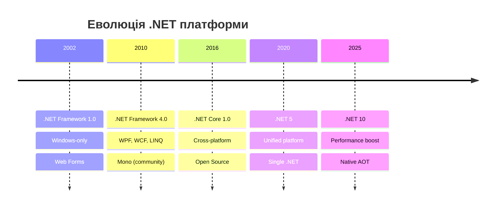
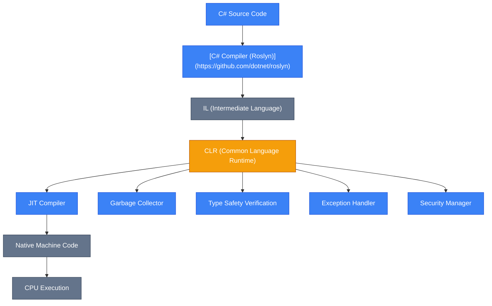
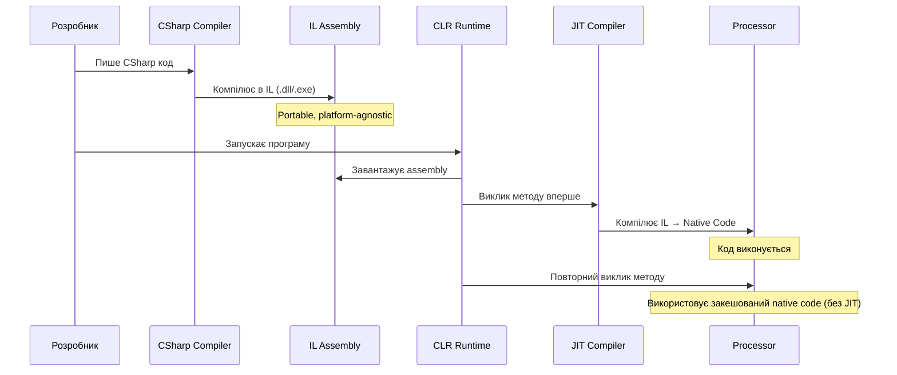
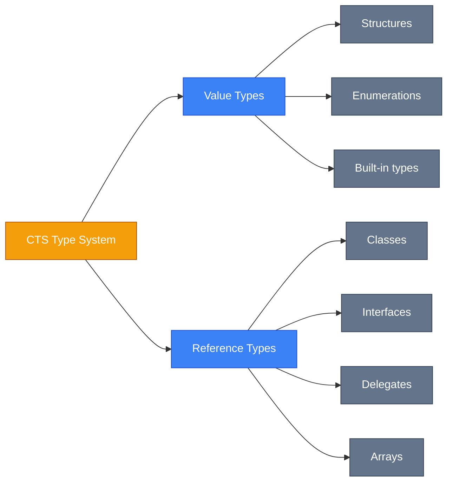

## Навіщо нам .NET? Проблема з реального світу

Уявіть, що ви розробник у 2000-му році. Ви хочете створити застосунок, який працюватиме на **Windows**, виконуватиме складні бізнес-операції, взаємодіятиме з базами даних і забезпечуватиме безпеку даних користувачів. У вас є кілька варіантів:

-   **C/C++**: Надзвичайно швидкий, але складний. Управління пам'яттю вручну — це джерело помилок.
-   **Visual Basic**: Простий, але обмежений у можливостях.
-   **Java**: Кросплатформенний, але не інтегрований з Windows ecosystemою.

::note
**Проблема**: Розробникам потрібна була платформа, яка поєднує **продуктивність C++**, **простоту Visual Basic** та **безпеку керованого середовища**, з глибокою інтеграцією у Windows.
::

Microsoft створила [**.NET Framework**](https://learn.microsoft.com/en-us/dotnet/framework/get-started/) як відповідь на цей виклик. Сьогодні [.NET](https://learn.microsoft.com/en-us/dotnet/core/introduction) — це потужна, кросплатформенна екосистема для створення будь-яких типів застосунків.

---

## Еволюція .NET: Від Windows-Only до Cross-Platform Giant

{.wide-img}

<!-- Search Query: .NET platform evolution timeline infographic 2002 to 2025 -->

### Історична хронологія

::mermaid



::

---

### Три покоління .NET

| Характеристика     | .NET Framework               | .NET Core                 | Modern .NET (5+)                     |
| :----------------- | :--------------------------- | :------------------------ | :----------------------------------- |
| **Платформи**      | Windows only                 | Windows, Linux, macOS     | Windows, Linux, macOS, mobile, IoT   |
| **Open Source**    | ❌ Ні                        | ✅ Так                    | ✅ Так                               |
| **Продуктивність** | Базова                       | Висока                    | Надзвичайно висока                   |
| **Deployment**     | System-wide                  | Side-by-side              | Side-by-side + Native AOT            |
| **Підтримка**      | До 2029 (.NET Framework 4.8) | Завершено                 | Активна (LTS: .NET 10)               |
| **Use Cases**      | Legacy apps, WinForms, WPF   | Modern web, microservices | Усе: web, mobile, desktop, cloud, ML |

::warning
**Важливо**: .NET Framework (4.8) все ще підтримується Microsoft, але **нові проєкти** повинні використовувати **modern .NET** (.NET 10 і надалі). .NET Core (1.x-3.x) більше не підтримується.
::

---

## Що таке .NET? Фундаментальні концепції

### Академічне визначення

::badge
.NET Platform
::

**.NET (дотнет)** — це **безкоштовна**, **кросплатформенна**, **відкрита (open-source)** платформа розробки від Microsoft для створення різноманітних типів застосунків: веб-додатків, мобільних аплікацій, desktop-програм, хмарних сервісів, ігор, IoT-рішень та систем машинного навчання.

### Ключові компоненти екосистеми

::card-group
::card{title="Runtime (CLR)" icon="i-heroicons-cpu-chip"}
Середовище виконання коду з автоматичним управлінням пам'яттю ([Garbage Collection](https://learn.microsoft.com/en-us/dotnet/standard/garbage-collection/fundamentals)), [JIT-компіляцією](https://learn.microsoft.com/en-us/dotnet/standard/managed-code#intermediate-language-and-execution) та системою безпеки.
::

::card{title="Base Class Library (BCL)" icon="i-heroicons-book-open"}
Велика [стандартна бібліотека класів](https://learn.microsoft.com/en-us/dotnet/standard/class-library) для роботи з файлами, мережею, колекціями, багатопотоковістю та іншим.
::

::card{title="Languages" icon="i-heroicons-code-bracket"}
Підтримка множини мов: [C#](https://learn.microsoft.com/en-us/dotnet/csharp/), [F#](https://learn.microsoft.com/en-us/dotnet/fsharp/), [Visual Basic](https://learn.microsoft.com/en-us/dotnet/visual-basic/). Усі компілюються в проміжний код (IL).
::

::card{title="Tools & SDK" icon="i-heroicons-wrench-screwdriver"}
Інструменти розробки: [.NET CLI](https://learn.microsoft.com/en-us/dotnet/core/tools/), [NuGet](https://learn.microsoft.com/en-us/nuget/what-is-nuget) (менеджер пакетів), IDE (Visual Studio, Rider, VS Code).
::
::

### Аналогія з реального світу

Уявіть .NET як **універсальну кухню** з професійним обладнанням:

-   [**CLR (Runtime)**](https://learn.microsoft.com/en-us/dotnet/standard/clr) — це **кухонна плита та духовка**: ви готуєте свою страву (код), а вони забезпечують необхідне тепло (виконання) та контролюють процес.
-   [**BCL (Base Class Library)**](https://learn.microsoft.com/en-us/dotnet/standard/class-library) — це **набір інструментів та інгредієнтів**: ножі, каструлі, сіль, спеції — усе, що потрібно для базового приготування.
-   **C#, F# (Languages)** — це **рецепти різних кухонь**: італійська паста (C#), французька випічка (F#) — різні підходи, але всі використовують одну кухню.
-   **.NET SDK** — це **кухар-інструктор**: допомагає правильно організувати процес та дає поради.

---

## CLR: Серце платформи

{.diagram-img}

<!-- Search Query: CLR Common Language Runtime architecture diagram components -->

### Архітектура Common Language Runtime

::mermaid



::

---

### Що робить CLR?

::steps

### Завантаження та верифікація

CLR завантажує ваш скомпільований код (IL) та перевіряє його **безпеку типів** (type safety). Це означає, що неможливо випадково звернутися до пам'яті, на яку ви не маєте права.

### JIT-компіляція

**Just-In-Time Compiler** перетворює IL-код у **нативний машинний код** безпосередньо під час виконання. Це відбувається один раз для кожного методу при першому виклику.

### Управління пам'яттю

**Garbage Collector (GC)** автоматично відстежує об'єкти в пам'яті та звільняє ті, які більше не використовуються. Ви не пишете `free()` або `delete` як у C++.

### Обробка помилок

CLR централізовано обробляє виняткові ситуації (exceptions) та забезпечує структурований механізм відновлення.

### Безпека виконання

Code Access Security (CAS) та інші механізми контролюють, які операції дозволені вашому коду (доступ до файлів, мережі тощо).
::

::tip
**Переваги керованого коду (Managed Code)**:

-   Автоматичне управління пам'яттю → менше витоків пам'яті (memory leaks)
-   Type safety → менше помилок доступу до пам'яті
-   Кросплатформенність → один код працює на різних ОС
-   Безпека → ізоляція та контроль доступу

::

---

## IL та JIT: Магія компіляції

{.diagram-img}

<!-- Search Query: JIT compiler tiered compilation diagram Profile-Guided Optimization -->

### Compilation Pipeline: Від C# до Machine Code

::code-group

```csharp [HelloWorld.cs]
using System;

public class Program
{
    public static void Main()
    {
        Console.WriteLine("Hello, .NET!");
    }
}
```

```asm [HelloWorld (Intermediate Language)]
.method public static void Main() cil managed
{
    .entrypoint
    .maxstack 8

    // Load string onto stack
    ldstr "Hello, .NET!"

    // Call Console.WriteLine
    call void [System.Console]System.Console::WriteLine(string)

    // Return from method
    ret
}
```

```asm [x86-64 Native Code (after JIT)]
; Simplified representation
mov     rcx, offset string_literal
call    System.Console.WriteLine
ret
```

::

### Процес компіляції: Два етапи

::mermaid



::

---

### Tiered Compilation: Розумна оптимізація

Modern .NET використовує **багаторівневу компіляцію** (Tiered Compilation):

|    Tier    | Опис                                       | Переваги                   | Коли використовується              |
| :--------: | :----------------------------------------- | :------------------------- | :--------------------------------- |
| **Tier 0** | Швидка, мінімально оптимізована компіляція | Швидкий старт застосунку   | Перший виклик методу               |
| **Tier 1** | Повна оптимізація з профілюванням          | Максимальна продуктивність | Після збору статистики (hot paths) |

::note
**Profile-Guided Optimization (PGO)**: CLR збирає **дані про виконання коду** (які гілки if часто виконуються, які типи передаються) та використовує їх для **повторної оптимізації** коду в Tier 1.
::

### RyuJIT: Оптимізація під капотом

**RyuJIT** — це назва сучасного JIT-компілятора в .NET. Він виконує численні оптимізації:

#### 1. **Method Inlining** (Вбудовування методів)

Замість виклику маленького методу, JIT **вставляє його код безпосередньо** у місце виклику, усуваючи overhead виклику функції.

::code-group

```csharp [Before Inlining] {5}
public int Add(int a, int b) => a + b;

public void Calculate()
{
    int result = Add(5, 10); // Method call overhead // [!code --]
}
```

```csharp [After Inlining (JIT optimized)] {4}
public void Calculate()
{
    int result = 5 + 10; // No method call, direct calculation // [!code ++]
}
```

::

#### 2. **Loop Unrolling** (Розгортання циклів)

JIT може **розгорнути** малі цикли для зменшення кількості перевірок умов і збільшення інструкцій, які CPU може виконати паралельно.

::code-group

```csharp [Original Loop]
int sum = 0;
for (int i = 0; i < 4; i++)
{
    sum += array[i];
}
```

```csharp [After Loop Unrolling]
int sum = 0;
sum += array[0];
sum += array[1];
sum += array[2];
sum += array[3];
// Fewer branch predictions, better CPU pipelining
```

::

#### 3. **SIMD Vectorization** (Векторизація)

RyuJIT автоматично використовує **SIMD (Single Instruction, Multiple Data)** інструкції процесора для обробки **декількох значень одночасно**.

```csharp {11}
// System.Numerics.Vectors example
using System.Numerics;

Span<float> values = stackalloc float[8] { 1, 2, 3, 4, 5, 6, 7, 8 };
Span<float> results = stackalloc float[8];

var vector1 = new Vector<float>(values);
var vector2 = new Vector<float>(2.0f); // All elements = 2.0

var resultVector = vector1 * vector2; // Multiplies 8 floats in ONE CPU instruction // [!code highlight]
resultVector.CopyTo(results);

// Results: [2, 4, 6, 8, 10, 12, 14, 16]
```

::tip
**Performance Impact**: SIMD може прискорити обчислення **в 4-8 разів** для операцій над масивами чисел (графіка, ML, обробка зображень).
::

---

## CTS та CLS: Універсальна мова типів

### Common Type System (CTS)

**CTS** — це **специфікація**, яка визначає, як типи даних описуються та використовуються в .NET. Вона забезпечує **сумісність між мовами**.

::mermaid



::

---

#### Приклад міжмовної сумісності

::code-group

```csharp [C# Library]
// MyLibrary.dll
namespace MathLib
{
    public class Calculator
    {
        public int Add(int a, int b) => a + b;
    }
}
```

```fsharp [F# Usage]
// F# can use C# library seamlessly
open MathLib

let calc = Calculator()
let result = calc.Add(10, 20) // Returns 30
printfn "Result: %d" result
```

::

### Common Language Specification (CLS)

**CLS** — це **підмножина CTS**, яка визначає **мінімальний набір функцій**, які повинен підтримувати будь-який .NET-сумісний компілятор.

::warning
**CLS-Compliance**: Якщо ви створюєте **бібліотеку**, яку планують використовувати інші розробники (можливо, з F# або VB), переконайтеся, що публічний API використовує лише **CLS-compliant типи**.
::

Наприклад:

-   ❌ `public UInt32 GetId()` — `UInt32` не CLS-compliant
-   ✅ `public int GetId()` — `int` (Int32) CLS-compliant

---

## Налаштування середовища розробки

### Вибір IDE: Порівняння інструментів

{.wide-img}

<!-- Search Query: Visual Studio vs Rider vs VS Code screenshot comparison C# development -->

| IDE                      | Платформа       | Ліцензія                                  | Переваги                                                  | Недоліки                              | Рекомендовано для                    |
| :----------------------- | :-------------- | :---------------------------------------- | :-------------------------------------------------------- | :------------------------------------ | :----------------------------------- |
| **Visual Studio**        | Windows, macOS  | Community: Free <br> Pro/Enterprise: Paid | Найпотужніший debugger, інтеграція з Azure, GUI-дизайнери | Важкий, повільний на старих ПК        | Enterprise-розробка, WPF, WinForms   |
| **JetBrains Rider**      | Win, Mac, Linux | Платна (підписка)                         | Швидкий, інтелектуальний ReSharper, кросплатформенний     | Потребує підписку                     | Професійна розробка, великі проєкти  |
| **VS Code + C# Dev Kit** | Win, Mac, Linux | Безкоштовна                               | Легкий, швидкий, розширюваний, великий Marketplace        | Менше функцій для складного debugging | Web-розробка, скрипти, легкі проєкти |

### Встановлення .NET SDK

::steps

### Завантаження .NET SDK

Відвідайте офіційний сайт: [https://dotnet.microsoft.com/download](https://dotnet.microsoft.com/download)

Завантажте **останню LTS (Long-Term Support) версію** — **. NET 10**.

### Установка

::code-group

```bash [Windows (winget)]
winget install Microsoft.DotNet.SDK.10
```

```bash [Windows (Chocolatey)]
choco install dotnet-sdk -y
```

```bash [Windows (Scoop)]
scoop install dotnet-sdk
```

```bash [macOS (Homebrew)]
brew install --cask dotnet-sdk
```

```bash [Linux (Ubuntu/Debian)]
sudo apt-get update
sudo apt-get install -y dotnet-sdk-10.0
```

::

### Перевірка встановлення

Відкрийте термінал та виконайте:

```bash
dotnet --version
```

Очікуваний вивід:

```text
10.0.100
```

::tip
Якщо ви бачите номер версії, .NET SDK встановлено успішно!
::
::

---

## .NET CLI: Mastering Command Line Interface

### Основні команди: Швидкий довідник

| Команда              | Опис                                | Приклад                              |
| :------------------- | :---------------------------------- | :----------------------------------- |
| `dotnet new`         | Створює новий проєкт з шаблону      | `dotnet new console -n MyApp`        |
| `dotnet build`       | Компілює проєкт                     | `dotnet build`                       |
| `dotnet run`         | Компілює та запускає проєкт         | `dotnet run`                         |
| `dotnet watch`       | Автоматично перекомпілює при змінах | `dotnet watch run`                   |
| `dotnet publish`     | Публікує застосунок для deployment  | `dotnet publish -c Release`          |
| `dotnet add package` | Додає NuGet-пакет                   | `dotnet add package Newtonsoft.Json` |
| `dotnet restore`     | Відновлює залежності                | `dotnet restore`                     |
| `dotnet test`        | Запускає тести                      | `dotnet test`                        |

### Workflow: Створення першого застосунку

::steps

### Створення проєкту

```bash
dotnet new console -n HelloDotNet
cd HelloDotNet
```

Ця команда створює **консольний застосунок** з назвою `HelloDotNet`.

### Структура проєкту

::code-tree

```xml [HelloDotNet.csproj]
<Project Sdk="Microsoft.NET.Sdk">
  <PropertyGroup>
    <OutputType>Exe</OutputType>
    <TargetFramework>net10.0</TargetFramework>
    <ImplicitUsings>enable</ImplicitUsings>
    <Nullable>enable</Nullable>
  </PropertyGroup>
</Project>
```

```csharp [Program.cs]
// Top-level statements (C# 10+)
// Файл з вхідною точкою програми
Console.WriteLine("Hello, World!");
```

::

### Перегляд коду

::code-group

```csharp [Program.cs]
// Top-level statements (C# 9+)
Console.WriteLine("Hello, World!");
```

::

### Запуск застосунку

```bash
dotnet run
```

Вивід:

```text
Hello, World!
```

### Watch mode (автоматична перекомпіляція)

```bash
dotnet watch run
```

Тепер **змініть** `Program.cs`:

```csharp
Console.WriteLine("Hello, .NET! 🚀");
```

Збережіть файл — застосунок **автоматично перезапуститься**!

### Публікація для production

```bash
dotnet publish -c Release -r win-x64 --self-contained
```

Пояснення:

-   `-c Release` → Оптимізована збірка (Release mode)
-   `-r win-x64` → Runtime Identifier (Windows 64-bit)
-   `--self-contained` → Включає .NET runtime у пакет (не потребує встановленого .NET на цільовій машині)

::

::note
**Підказка**: Використовуйте `dotnet watch` під час розробки — це заощаджує величезну кількість часу, автоматично перекомпілюючи код при кожній зміні.
::

---

## .NET 10: Сучасні можливості

Modern .NET еволюціонує з неймовірною швидкістю. Ось найважливіші інновації останніх версій:

### .NET 10 (LTS - Листопад 2025)

::badge
Long-Term Support до 2028
::

| Функція                                                                                        | Опис                                                      | Переваги                                               |
| :--------------------------------------------------------------------------------------------- | :-------------------------------------------------------- | :----------------------------------------------------- |
| **Discriminated Unions**                                                                       | Нативна підтримка union types (як у F#)                   | Безпечніша робота з варіантами типів                   |
| **Primary Constructors Enhanced**                                                              | Розширення на всі типи класів                             | Менше boilerplate коду                                 |
| **Performance Improvements**                                                                   | SIMD, PGO за замовчуванням, оптимізації GC та компілятора | До 40% швидше у веб-сценаріях порівняно з .NET 8       |
| [**Native AOT Maturity**](https://learn.microsoft.com/en-us/dotnet/core/deploying/native-aot/) | Покращена підтримка Ahead-of-Time компіляції              | Startup за <1ms, менший розмір (~10MB standalone apps) |
| **JSON Source Generators v3**                                                                  | Нове покоління source generators для `System.Text.Json`   | Найшвидша серіалізація, zero-allocation                |
| [**Blazor Enhancements**](https://dotnet.microsoft.com/apps/aspnet/web-apps/blazor)            | WebAssembly preloading, form validation improvements      | Кращий UX для веб-застосунків                          |

::tip
**Рекомендація**: .NET 10 є поточною LTS версією. Використовуйте її для всіх нових production-проєктів.
::

### Порівняння останніх версій

| Версія      | Тип підтримки | Підтримка до  | Ключові особливості                                                    |
| :---------- | :------------ | :------------ | :--------------------------------------------------------------------- |
| **.NET 8**  | LTS           | Листопад 2026 | Blazor SSR, TimeProvider, Native AOT improvements                      |
| **.NET 9**  | STS           | Травень 2026  | Hybrid Cache, LINQ improvements (CountBy, AggregateBy), OpenAI SDK     |
| **.NET 10** | LTS           | Листопад 2028 | Discriminated Unions, Performance boost, Enhanced Primary Constructors |

---

## IL Analysis & Protection: Reflectors та Obfuscators

### Що таке Reflectors (Дизасемблери)?

**Reflector (Decompiler)** — це інструмент, який **перетворює скомпільований .NET код (IL) назад у читабельний C#/F# код**. Оскільки IL містить багато метаданих (назви класів, методів, змінних), декомпіляція є дуже точною.

#### Популярні Reflectors

| Інструмент                                        | Тип                  | Можливості                                    | Use Cases                                     |
| :------------------------------------------------ | :------------------- | :-------------------------------------------- | :-------------------------------------------- |
| [**ILSpy**](https://github.com/icsharpcode/ILSpy) | Open-source          | Decompiler, Assembly Browser, Find References | Вивчення чужих бібліотек, reverse engineering |
| [**dnSpy**](https://github.com/dnSpy/dnSpy)       | Open-source          | Decompiler + Debugger + IL Editor             | Налагодження сторонніх DLL, патчінг           |
| **dotPeek**                                       | Free (JetBrains)     | Decompiler, Navigation, Export to Project     | Дослідження коду, інтеграція з Rider          |
| **ILDasm**                                        | Official (Microsoft) | IL Viewer (не C#)                             | Перегляд raw IL коду                          |

#### Приклад: Decompiling з ILSpy

::steps

### Компілюємо простий застосунок

::code-group

```csharp [Secret.cs] {5}
namespace MyApp;

public class Calculator
{
    private const string SecretKey = "MyPassword123"; // [!code highlight]

    public int Multiply(int a, int b)
    {
        return a * b;
    }
}
```

::

```bash
dotnet build -c Release
```

### Відкриваємо DLL у ILSpy

1. Завантажте **ILSpy**: [https://github.com/icsharpcode/ILSpy](https://github.com/icsharpcode/ILSpy)
2. Відкрийте `bin/Release/net10.0/MyApp.dll`
3. ILSpy показує **оригінальний C# код**, включаючи константу `SecretKey`!

{.screenshot-img}

<!-- Search Query: ILSpy decompiler screenshot showing C# code with constants -->

::caution
**Проблема безпеки**: Будь-хто може побачити ваші константи, алгоритми, навіть ключі API, якщо ви їх хардкодите!
::
::

### Obfuscators (Обфускатори): Захист коду

**Obfuscator** — це інструмент, який **перетворює IL-код**, роблячи його **важким для читання та аналізу**, але зберігаючи функціональність.

#### Методи обфускації

| Техніка                      | Опис                                                          | Приклад                                    |
| :--------------------------- | :------------------------------------------------------------ | :----------------------------------------- |
| **Name Obfuscation**         | Заміна зрозумілих назв на випадкові                           | `Calculator` → `A`, `Multiply` → `a1b2`    |
| **Control Flow Obfuscation** | Ускладнення логіки (додавання мертвого коду, заплутування if) | `if (true)` → `if (a ^ b == c)`            |
| **String Encryption**        | Шифрування рядкових літералів                                 | `"MyPassword"` → зашифрована послідовність |
| **Anti-Tampering**           | Виявлення модифікацій коду                                    | Перевірка checksum при старті              |
| **Anti-Debugging**           | Виявлення debugger                                            | `Debugger.IsAttached` → Exit               |

#### Популярні Obfuscators

| Інструмент        | Тип                    | Рівень захисту                                  | Вартість                                |
| :---------------- | :--------------------- | :---------------------------------------------- | :-------------------------------------- |
| **Dotfuscator**   | Commercial (Microsoft) | Високий (Enterprise: anti-tamper, watermarking) | Free (Community), Paid (Pro/Enterprise) |
| **ConfuserEx**    | Open-source            | Середній (name, control flow, constants)        | Безкоштовно                             |
| **SmartAssembly** | Commercial (Red Gate)  | Високий (feature merging, pruning)              | Платний                                 |
| **.NET Reactor**  | Commercial             | Високий (native code wrapping)                  | Платний                                 |

#### Приклад обфускації

::code-group

```csharp [Before Obfuscation]
public class Calculator
{
    public int Multiply(int a, int b)
    {
        return a * b;
    }
}
```

```csharp [After Obfuscation (ConfuserEx)]
public class A
{
    public int a(int b, int c)
    {
        int d = b;
        int e = c;
        return d * e;
    }
}
```

::

::warning
**Обмеження Obfuscation**:

-   Не є абсолютним захистом (досвідчений reverse engineer може частково відновити логіку)
-   Може **погіршити performance** (особливо control flow obfuscation)
-   Ускладнює **debugging production issues** (stack traces стають нечитабельними)

::

### Коли використовувати Reflectors та Obfuscators?

::card-group

    ::card{title="✅ Використовуйте Reflectors" icon="i-heroicons-magnifying-glass"}

    -   Вивчення внутрішніх механізмів .NET/сторонніх бібліотек
    -   Debugging проблем у залежностях
    -   Reverse engineering legacy code без вихідників
    -   Навчання (розуміння, як реалізовані LINQ, async/await)

    ::

    ::card{title="🔒 Використовуйте Obfuscators" icon="i-heroicons-shield-check"}

    -   Комерційні desktop-застосунки (захист інтелектуальної власності)
    -   Ліцензійні алгоритми (криптографія, ML-моделі)
    -   Запобігання крадіжці API-ключів
    -   Ускладнення створення піратських копій

    ::

::

::note
**Best Practice**: Для **веб-застосунків** (ASP.NET Core API) обфускація менш критична, оскільки код виконується на **вашому сервері**. Для **desktop/mobile** — обфускація рекомендована.
::

---

## Резюме та Практичні завдання

### Що ми дізналися

::card-group
::card{title="Історія .NET" icon="i-heroicons-clock"}
Еволюція від .NET Framework (Windows-only) до Modern .NET (cross-platform, open-source).
::

::card{title="CLR Architecture" icon="i-heroicons-cpu-chip"}
Як CLR виконує код: IL → JIT → Native Code, Garbage Collection, Type Safety.
::

::card{title="JIT Optimizations" icon="i-heroicons-bolt"}
Tiered Compilation, PGO, RyuJIT оптимізації (Inlining, Loop Unrolling, SIMD).
::

::card{title="CTS/CLS" icon="i-heroicons-language"}
Універсальна система типів для міжмовної сумісності.
::

::card{title=".NET CLI" icon="i-heroicons-command-line"}
Робота з dotnet: new, build, run, watch, publish.
::

::card{title="Modern Features" icon="i-heroicons-sparkles"}
Native AOT, Performance improvements, Discriminated Unions (.NET 10).
::

::card{title="IL Tools" icon="i-heroicons-wrench-screwdriver"}
Reflectors (ILSpy) для аналізу, Obfuscators (ConfuserEx) для захисту.
::
::

### Практичні завдання

::steps

### Beginner: Перший .NET застосунок

1. Створіть консольний проєкт:
    ```bash
    dotnet new console -n MyCalculator
    ```
2. Реалізуйте клас `Calculator` з методами `Add`, `Subtract`, `Multiply`, `Divide`.
3. Викличте методи з `Main` та виведіть результати.
4. Опублікуйте застосунок у режимі `Release`:
    ```bash
    dotnet publish -c Release
    ```

### Intermediate: IL Analysis

1. Компілюйте ваш `Calculator` у Release mode.
2. Завантажте **ILSpy** та відкрийте скомпільовану DLL.
3. Знайдіть метод `Add` та подивіться **IL код**.
4. Порівняйте IL-код для `Debug` vs `Release` збірок (Release оптимізованіший).

### Advanced: Obfuscation Experiment

1. Завантажте **ConfuserEx**: [https://github.com/mkaring/ConfuserEx](https://github.com/mkaring/ConfuserEx)
2. Обфускуйте вашу DLL:
    - Увімкніть Name Obfuscation
    - Увімкніть Control Flow Obfuscation
3. Відкрийте обфусковану DLL у ILSpy.
4. Зверніть увагу, наскільки важче читати код.

::warning
**Примітка**: Обфускація може зламати Reflection-based код (наприклад, серіалізацію JSON). Завжди тестуйте після обфускації!
::

::

---

::tip
**Вітаємо!** Ви завершили вступ до екосистеми .NET. Тепер ви розумієте, як працює платформа "під капотом", як налаштувати середовище та які інструменти використовувати для розробки та захисту коду.

**Наступний крок**: Переходьте до **1.2. Program Structure** та дізнайтеся про структуру C# програм, namespaces та top-level statements!
::
