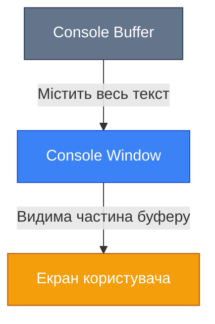

# Інтерактивна Консоль (Classic)

## Вступ

Уявіть, що вам потрібно створити інструмент для системного адміністратора — консольну утиліту з кольоровим меню, можливістю навігації стрілками та індикатором прогресу. Або інтерактивний інсталятор, що виводить статус різними кольорами та дозволяє користувачу вибирати опції без повторного введення команд.

Все це можливо завдяки потужному API класу `System.Console`, який надає набагато більше можливостей, ніж просто `Console.WriteLine()`. У цьому розділі ми детально розглянемо всі аспекти роботи з консоллю: від базових методів вводу-виводу до створення складних інтерактивних інтерфейсів.

::note
**Передумови**: Для комфортного вивчення матеріалу потрібно розуміти базові типи даних, змінні, методи та оператори C#.
::

## System.Console API: Основи вводу-виводу

### Write vs WriteLine

Метод `Console.Write()` виводить текст без переходу на новий рядок, тоді як `Console.WriteLine()` додає символ нового рядка після виводу.

| Метод         | Поведінка                                  | Типове використання                               |
| :------------ | :----------------------------------------- | :------------------------------------------------ |
| `Write()`     | Виводить текст без переходу на новий рядок | Виведення тексту в один рядок, підказки для вводу |
| `WriteLine()` | Виводить текст і переходить на новий рядок | Виведення окремих повідомлень, логів              |

::code-group

```csharp [Write - виведення в один рядок] showLineNumbers
Console.Write("Завантаження");
Console.Write(".");
Console.Write(".");
Console.Write(".");
Console.WriteLine(" Готово!");

// Виведе: Завантаження... Готово!
```

```csharp [WriteLine - кожен рядок окремо] showLineNumbers
Console.WriteLine("Крок 1: Ініціалізація");
Console.WriteLine("Крок 2: Обробка даних");
Console.WriteLine("Крок 3: Завершення");

// Виведе:
// Крок 1: Ініціалізація
// Крок 2: Обробка даних
// Крок 3: Завершення
```

```csharp [Комбінований підхід] showLineNumbers
Console.Write("Введіть ваше ім'я: ");
string name = Console.ReadLine() ?? "";
Console.WriteLine($"Привіт, {name}!");

// Виведе в одному рядку підказку, потім ім'я користувача
```

::

### ReadLine vs ReadKey

Існує два основні способи отримання вводу від користувача: `ReadLine()` для читання цілого рядка тексту та `ReadKey()` для читання одного натискання клавіші.

| Метод           | Повертає         | Блокує виконання                     | Типове використання                 |
| :-------------- | :--------------- | :----------------------------------- | :---------------------------------- |
| `ReadLine()`    | `string?`        | Так, до Enter                        | Введення тексту, імен, значень      |
| `ReadKey()`     | `ConsoleKeyInfo` | Так, до натискання будь-якої клавіші | Меню навігації, підтвердження (Y/N) |
| `ReadKey(true)` | `ConsoleKeyInfo` | Так, але не відображає символ        | Введення паролів, керування UI      |

::code-group

```csharp [ReadLine - введення тексту] showLineNumbers
Console.Write("Введіть ваш email: ");
string? email = Console.ReadLine();

if (string.IsNullOrWhiteSpace(email))
{
    Console.WriteLine("Email не може бути порожнім!");
    return;
}

Console.WriteLine($"Email збережено: {email}");
```

```csharp [ReadKey - навігація меню] showLineNumbers
Console.WriteLine("Натисніть будь-яку клавішу для продовження...");
Console.ReadKey(true); // true = не відображати символ

Console.WriteLine("\nВиберіть дію:");
Console.WriteLine("[S] - Зберегти");
Console.WriteLine("[C] - Скасувати");

ConsoleKeyInfo key = Console.ReadKey(true);

switch (key.Key)
{
    case ConsoleKey.S:
        Console.WriteLine("Збереження...");
        break;
    case ConsoleKey.C:
        Console.WriteLine("Скасовано");
        break;
    default:
        Console.WriteLine("Невідома команда");
        break;
}
```

```csharp [ReadKey з модифікаторами] showLineNumbers
Console.WriteLine("Натисніть Ctrl+Q для виходу");

while (true)
{
    ConsoleKeyInfo keyInfo = Console.ReadKey(true);

    // Перевірка комбінації клавіш
    if (keyInfo.Key == ConsoleKey.Q &&
        keyInfo.Modifiers == ConsoleModifiers.Control)
    {
        Console.WriteLine("\nВихід з програми...");
        break;
    }

    Console.WriteLine($"Натиснуто: {keyInfo.Key}");
}
```

::

::tip
**Best Practice**: Використовуйте `ReadKey(true)` для створення інтерактивних меню, щоб символи не відображалися на екрані. Це робить інтерфейс чистішим та професійнішим.
::

## Кастомізація Консолі

### Кольори (Colors)

Консоль дозволяє налаштовувати колір тексту (Foreground) та фону (Background) за допомогою перерахування `ConsoleColor`.

::steps

### Встановлення кольорів

```csharp showLineNumbers
// Зберігаємо поточні кольори
ConsoleColor originalFg = Console.ForegroundColor;
ConsoleColor originalBg = Console.BackgroundColor;

// Встановлюємо нові кольори
Console.ForegroundColor = ConsoleColor.Green;
Console.BackgroundColor = ConsoleColor.DarkGray;
Console.WriteLine("Цей текст зелений на темно-сірому тлі");

// Відновлюємо оригінальні кольори
Console.ForegroundColor = originalFg;
Console.BackgroundColor = originalBg;
```

### Використання ResetColor()

```csharp showLineNumbers
Console.ForegroundColor = ConsoleColor.Cyan;
Console.WriteLine("Блакитний текст");

Console.ResetColor(); // Повертає до стандартних кольорів
Console.WriteLine("Стандартний текст");
```

::

#### Доступні кольори ConsoleColor

| Колір                                | Опис            | Рекомендоване використання       |
| :----------------------------------- | :-------------- | :------------------------------- |
| `Black`, `DarkGray`, `Gray`, `White` | Відтінки сірого | Фон, звичайний текст             |
| `Red`, `DarkRed`                     | Червоний        | Помилки, критичні попередження   |
| `Green`, `DarkGreen`                 | Зелений         | Успішні операції, підтвердження  |
| `Yellow`, `DarkYellow`               | Жовтий          | Попередження, важлива інформація |
| `Blue`, `DarkBlue`                   | Синій           | Інформаційні повідомлення        |
| `Cyan`, `DarkCyan`                   | Блакитний       | Підказки, допоміжна інформація   |
| `Magenta`, `DarkMagenta`             | Пурпурний       | Заголовки, акценти               |

::code-group

```csharp [Кольорові повідомлення] showLineNumbers
void WriteSuccess(string message)
{
    Console.ForegroundColor = ConsoleColor.Green;
    Console.WriteLine($"✓ {message}");
    Console.ResetColor();
}

void WriteError(string message)
{
    Console.ForegroundColor = ConsoleColor.Red;
    Console.WriteLine($"✗ {message}");
    Console.ResetColor();
}

void WriteWarning(string message)
{
    Console.ForegroundColor = ConsoleColor.Yellow;
    Console.WriteLine($"⚠ {message}");
    Console.ResetColor();
}

// Використання
WriteSuccess("Файл успішно збережено");
WriteError("Не вдалося підключитися до бази даних");
WriteWarning("Залишилось мало дискового простору");
```

```csharp [Кольорове меню] showLineNumbers
Console.Clear();

// Заголовок
Console.ForegroundColor = ConsoleColor.Cyan;
Console.WriteLine("╔════════════════════════════╗");
Console.WriteLine("║   ГОЛОВНЕ МЕНЮ СИСТЕМИ     ║");
Console.WriteLine("╚════════════════════════════╝");
Console.ResetColor();

Console.WriteLine();

// Пункти меню
Console.ForegroundColor = ConsoleColor.White;
Console.Write("[1] ");
Console.ForegroundColor = ConsoleColor.Gray;
Console.WriteLine("Створити новий проект");

Console.ForegroundColor = ConsoleColor.White;
Console.Write("[2] ");
Console.ForegroundColor = ConsoleColor.Gray;
Console.WriteLine("Відкрити існуючий проект");

Console.ForegroundColor = ConsoleColor.White;
Console.Write("[3] ");
Console.ForegroundColor = ConsoleColor.Gray;
Console.WriteLine("Налаштування");

Console.ForegroundColor = ConsoleColor.DarkRed;
Console.Write("[Q] ");
Console.WriteLine("Вихід");

Console.ResetColor();
```

::

::warning
**Обмеження платформ**: На деяких Unix/Linux терміналах підтримка кольорів може бути обмеженою. Перед використанням кольорів у production-застосунках, перевірте підтримку через властивість `Console.IsOutputRedirected`.
::

### Інші параметри кастомізації

::code-group

```csharp [Console.Title] showLineNumbers
// Встановлення заголовку вікна консолі
Console.Title = "Мій Консольний Застосунок v1.0";

// Динамічна зміна заголовку (наприклад, для індикатора прогресу)
for (int i = 0; i <= 100; i += 10)
{
    Console.Title = $"Завантаження... {i}%";
    Thread.Sleep(500);
}

Console.Title = "Завантаження завершено!";
```

```csharp [Console.Beep] showLineNumbers
// Короткий сигнал (стандартна частота 800 Hz, тривалість 200 мс)
Console.Beep();

// Кастомний сигнал: частота 1000 Hz, тривалість 500 мс
Console.Beep(1000, 500);

// Сигнал помилки (низька частота)
Console.Beep(400, 300);

// Сигнал успіху (висока частота)
Console.Beep(1500, 200);

// Мелодія (послідовність звуків)
int[] melody = { 523, 587, 659, 698, 784, 880, 988, 1047 }; // До, Ре, Мі, Фа, Соль, Ля, Сі, До
foreach (int frequency in melody)
{
    Console.Beep(frequency, 300);
    Thread.Sleep(50);
}
```

::

::note
**Console.Beep на різних платформах**:

-   **Windows**: Повністю підтримується з можливістю налаштування частоти (37-32767 Hz) та тривалості.
-   **Linux/macOS**: Може не підтримуватися або виконувати стандартний системний звук незалежно від параметрів.

::

## Керування Курсором

Керування позицією курсору дозволяє створювати динамічні інтерфейси, оновлювати текст на місці та будувати інтерактивні меню без прокрутки екрану.

### Основні методи роботи з курсором

| Метод/Властивість                      | Опис                                   | Приклад значення                 |
| :------------------------------------- | :------------------------------------- | :------------------------------- |
| `SetCursorPosition(int left, int top)` | Встановлює позицію курсору             | `SetCursorPosition(0, 10)`       |
| `GetCursorPosition()`                  | Повертає поточну позицію `(Left, Top)` | `(5, 12)`                        |
| `CursorLeft`                           | Координата X (колонка)                 | `15`                             |
| `CursorTop`                            | Координата Y (рядок)                   | `8`                              |
| `CursorVisible`                        | Видимість курсору (`true`/`false`)     | `Console.CursorVisible = false;` |

::code-group

```csharp [Базове позиціонування] showLineNumbers
Console.Clear();

// Виведення в конкретну позицію
Console.SetCursorPosition(10, 5);
Console.Write("Текст у позиції (10, 5)");

// Отримання поточної позиції (tuple deconstruction)
var (x, y) = Console.GetCursorPosition();
Console.SetCursorPosition(0, 10);
Console.WriteLine($"Попередня позиція: X={x}, Y={y}");

// Переміщення курсору на початок рядка
Console.CursorLeft = 0;
Console.Write("Початок рядка");
```

```csharp [Прогрес-бар на місці] showLineNumbers
Console.Write("Завантаження: ");
int startX = Console.CursorLeft;
int startY = Console.CursorTop;

for (int i = 0; i <= 100; i += 5)
{
    // Повертаємось на початкову позицію
    Console.SetCursorPosition(startX, startY);

    // Виводимо прогрес
    Console.Write($"{i}% ");

    // Малюємо прогрес-бар
    int barLength = i / 5; // 20 символів максимум
    Console.Write("[");
    Console.Write(new string('█', barLength));
    Console.Write(new string(' ', 20 - barLength));
    Console.Write("]");

    Thread.Sleep(200);
}

Console.WriteLine("\nЗавершено!");
```

```csharp [Приховування курсору] showLineNumbers
// Приховуємо курсор для чистого інтерфейсу
Console.CursorVisible = false;

try
{
    Console.Clear();
    Console.WriteLine("Анімація без мигаючого курсору...");

    for (int i = 0; i < 10; i++)
    {
        Console.SetCursorPosition(i * 2, 5);
        Console.Write("●");
        Thread.Sleep(200);
    }
}
finally
{
    // Завжди показуємо курсор при виході
    Console.CursorVisible = true;
}
```

::

### Практичний приклад: Інтерактивне меню з навігацією

::steps

### Створюємо структуру меню

```csharp showLineNumbers
class MenuItem
{
    public string Text { get; set; } = "";
    public Action Action { get; set; } = () => { };
}

MenuItem[] menuItems = new[]
{
    new MenuItem { Text = "Створити новий файл", Action = () => Console.WriteLine("\nСтворення файлу...") },
    new MenuItem { Text = "Відкрити файл", Action = () => Console.WriteLine("\nВідкриття файлу...") },
    new MenuItem { Text = "Налаштування", Action = () => Console.WriteLine("\nНалаштування...") },
    new MenuItem { Text = "Вихід", Action = () => Environment.Exit(0) }
};
```

### Реалізуємо логіку навігації

```csharp showLineNumbers
int selectedIndex = 0;
Console.CursorVisible = false;

try
{
    while (true)
    {
        Console.Clear();
        Console.ForegroundColor = ConsoleColor.Cyan;
        Console.WriteLine("╔═══════════════════════════╗");
        Console.WriteLine("║      ГОЛОВНЕ МЕНЮ         ║");
        Console.WriteLine("╚═══════════════════════════╝");
        Console.ResetColor();
        Console.WriteLine("\nВикористовуйте ↑↓ для навігації, Enter для вибору\n");

        // Малюємо меню
        for (int i = 0; i < menuItems.Length; i++)
        {
            if (i == selectedIndex)
            {
                Console.BackgroundColor = ConsoleColor.DarkGray;
                Console.ForegroundColor = ConsoleColor.White;
                Console.WriteLine($"  ► {menuItems[i].Text}  ");
                Console.ResetColor();
            }
            else
            {
                Console.WriteLine($"    {menuItems[i].Text}");
            }
        }

        // Обробка клавіш
        ConsoleKeyInfo key = Console.ReadKey(true);

        switch (key.Key)
        {
            case ConsoleKey.UpArrow:
                selectedIndex = selectedIndex > 0 ? selectedIndex - 1 : menuItems.Length - 1;
                break;
            case ConsoleKey.DownArrow:
                selectedIndex = selectedIndex < menuItems.Length - 1 ? selectedIndex + 1 : 0;
                break;
            case ConsoleKey.Enter:
                Console.Clear();
                menuItems[selectedIndex].Action();
                Console.WriteLine("\nНатисніть будь-яку клавішу для повернення в меню...");
                Console.ReadKey(true);
                break;
        }
    }
}
finally
{
    Console.CursorVisible = true;
}
```

::


<!-- Search Query: console menu navigation with arrow keys demonstration C# -->

::tip
**Професійний UX**: Завжди приховуйте курсор (`CursorVisible = false`) при створенні інтерактивних меню, щоб уникнути мигаючого курсору, який псує візуальний вигляд.
::

## Буфери та Вікна

Консоль має дві важливі концепції: **буфер** (buffer) та **вікно** (window). Розуміння їх різниці критично важливе для створення професійних консольних інтерфейсів.

::mermaid



::

### BufferSize vs WindowSize

| Параметр           | Опис                                                             | Налаштування                                                             |
| :----------------- | :--------------------------------------------------------------- | :----------------------------------------------------------------------- |
| **Buffer (Буфер)** | Загальний розмір області для тексту. Може бути більшим за вікно. | `Console.BufferHeight`, `Console.BufferWidth`, `Console.SetBufferSize()` |
| **Window (Вікно)** | Видима частина буферу на екрані. Завжди ≤ буферу.                | `Console.WindowHeight`, `Console.WindowWidth`, `Console.SetWindowSize()` |

::note
**Важливо**: Розмір вікна не може перевищувати розмір буферу. Якщо буфер більший за вікно, з'являється смуга прокрутки (scrollbar).
::


<!-- Search Query: console buffer vs window size visualization diagram -->

::code-group

```csharp [Читання розмірів] showLineNumbers
// Отримання поточних розмірів
int bufferWidth = Console.BufferWidth;
int bufferHeight = Console.BufferHeight;

int windowWidth = Console.WindowWidth;
int windowHeight = Console.WindowHeight;

Console.WriteLine($"Буфер: {bufferWidth}x{bufferHeight}");
Console.WriteLine($"Вікно: {windowWidth}x{windowHeight}");

// Максимально можливий розмір вікна
int maxWidth = Console.LargestWindowWidth;
int maxHeight = Console.LargestWindowHeight;
Console.WriteLine($"Максимум: {maxWidth}x{maxHeight}");
```

```csharp [Налаштування розмірів] showLineNumbers
try
{
    // Спочатку збільшуємо буфер
    Console.SetBufferSize(120, 300);

    // Потім налаштовуємо вікно (має бути ≤ буферу)
    Console.SetWindowSize(120, 30);

    Console.WriteLine("Розміри налаштовано успішно!");
    Console.WriteLine("Буфер містить 300 рядків, але видно лише 30.");
    Console.WriteLine("Використовуйте scrollbar для перегляду.");
}
catch (ArgumentOutOfRangeException ex)
{
    Console.WriteLine($"Помилка: {ex.Message}");
    Console.WriteLine("Можливо, екран недостатньо великий для таких розмірів.");
}
```

```csharp [Створення лог-консолі] showLineNumbers
// Налаштовуємо консоль для логування
Console.SetBufferSize(150, 9999);  // Великий буфер для історії
Console.SetWindowSize(150, 40);    // Зручний розмір вікна

Console.WriteLine("=== Лог-консоль запущена ===");
Console.WriteLine("Буфер розрахований на 9999 рядків історії\n");

// Симуляція логування
for (int i = 1; i <= 100; i++)
{
    string timestamp = DateTime.Now.ToString("HH:mm:ss.fff");
    Console.WriteLine($"[{timestamp}] Подія #{i}: Обробка завершена");
    Thread.Sleep(50);
}
```

::

::warning
**Platform-specific**: На Linux та macOS можливості зміни розміру буферу та вікна можуть бути обмеженими або недоступними. Завжди обгортайте виклики `SetBufferSize` та `SetWindowSize` у `try-catch`.
::

## Перенаправлення Потоків (Stream Redirection)

Консольний застосунок працює з трьома стандартними потоками: **StandardInput** (введення), **StandardOutput** (виведення) та **StandardError** (помилки). Розуміння цих потоків відкриває великі можливості для інтеграції з іншими програмами та автоматизації.

### Три стандартні потоки

::mermaid


::

| Потік                         | Властивість     | Призначення                      | За замовчуванням |
| :---------------------------- | :-------------- | :------------------------------- | :--------------- |
| **Стандартний ввід**          | `Console.In`    | Читання даних від користувача    | Клавіатура       |
| **Стандартний вивід**         | `Console.Out`   | Виведення результатів роботи     | Консольне вікно  |
| **Стандартний потік помилок** | `Console.Error` | Виведення помилок та діагностики | Консольне вікно  |

### Pipes та перенаправлення в терміналі

::code-group

```bash [Windows (PowerShell/CMD)] showLineNumbers
# Перенаправлення виводу у файл
myapp.exe > output.txt

# Перенаправлення помилок у файл
myapp.exe 2> errors.txt

# Перенаправлення і виводу, і помилок
myapp.exe > output.txt 2>&1

# Pipe: передача виводу одної програми до іншої
myapp.exe | findstr "ERROR"

# Читання з файлу як введення
myapp.exe < input.txt
```

```bash [Linux/macOS] showLineNumbers
# Перенаправлення виводу у файл
./myapp > output.txt

# Перенаправлення помилок у файл
./myapp 2> errors.txt

# Перенаправлення і виводу, і помилок
./myapp > output.txt 2>&1

# Pipe: передача виводу одній програмі до іншої
./myapp | grep "ERROR"

# Читання з файлу як введення
./myapp < input.txt
```

::

### Програмне перенаправлення потоків

::code-group

```csharp [Перенаправлення у файл] showLineNumbers
using System;
using System.IO;

// Зберігаємо оригінальні потоки
TextWriter originalOut = Console.Out;
TextWriter originalError = Console.Error;

try
{
    // Перенаправляємо вивід у файл
    using (StreamWriter fileOut = new StreamWriter("output.log"))
    using (StreamWriter fileErr = new StreamWriter("errors.log"))
    {
        Console.SetOut(fileOut);
        Console.SetError(fileErr);

        Console.WriteLine("Це повідомлення йде у output.log");
        Console.Error.WriteLine("Це помилка йде у errors.log");

        // Виконуємо деяку роботу
        PerformWork();
    }
}
finally
{
    // Відновлюємо оригінальні потоки
    Console.SetOut(originalOut);
    Console.SetError(originalError);

    Console.WriteLine("Логування завершено. Перевірте output.log та errors.log");
}

void PerformWork()
{
    Console.WriteLine("Початок обробки...");
    try
    {
        // Симуляція роботи
        throw new InvalidOperationException("Тестова помилка");
    }
    catch (Exception ex)
    {
        Console.Error.WriteLine($"ПОМИЛКА: {ex.Message}");
    }
    Console.WriteLine("Обробка завершена.");
}
```

```csharp [In-memory перенаправлення] showLineNumbers
using System;
using System.IO;
using System.Text;

// Використовуємо StringWriter для захоплення виводу в пам'ять
using (StringWriter stringWriter = new StringWriter())
{
    TextWriter originalOut = Console.Out;
    Console.SetOut(stringWriter);

    // Весь вивід іде в stringWriter
    Console.WriteLine("Рядок 1");
    Console.WriteLine("Рядок 2");
    Console.WriteLine("Рядок 3");

    // Відновлюємо консольний вивід
    Console.SetOut(originalOut);

    // Отримуємо захоплений текст
    string capturedOutput = stringWriter.ToString();

    Console.WriteLine("=== Захоплений вивід ===");
    Console.WriteLine(capturedOutput);
    Console.WriteLine($"Загальна довжина: {capturedOutput.Length} символів");
}
```

```csharp [Читання з StringReader] showLineNumbers
using System;
using System.IO;

string simulatedInput = "John Doe\n30\nyes\n";

using (StringReader stringReader = new StringReader(simulatedInput))
{
    TextReader originalIn = Console.In;
    Console.SetIn(stringReader);

    Console.Write("Введіть ім'я: ");
    string? name = Console.ReadLine();

    Console.Write("Введіть вік: ");
    string? ageInput = Console.ReadLine();

    Console.Write("Підтвердити? (yes/no): ");
    string? confirmation = Console.ReadLine();

    // Відновлюємо оригінальний ввід
    Console.SetIn(originalIn);

    Console.WriteLine("\n=== Отримані дані ===");
    Console.WriteLine($"Ім'я: {name}");
    Console.WriteLine($"Вік: {ageInput}");
    Console.WriteLine($"Підтверджено: {confirmation}");
}
```

::

::tip
**Тестування консольних застосунків**: Використовуйте `StringWriter` та `StringReader` для автоматизованого тестування консольних програм без реального вводу-виводу. Це значно спрощує написання unit-тестів.
::

### Визначення перенаправлення

```csharp showLineNumbers
// Перевірка, чи потоки перенаправлені
bool isInputRedirected = Console.IsInputRedirected;
bool isOutputRedirected = Console.IsOutputRedirected;
bool isErrorRedirected = Console.IsErrorRedirected;

Console.WriteLine($"Ввід перенаправлений: {isInputRedirected}");
Console.WriteLine($"Вивід перенаправлений: {isOutputRedirected}");
Console.WriteLine($"Помилки перенаправлені: {isErrorRedirected}");

// Адаптація поведінки
if (!Console.IsOutputRedirected)
{
    // Кольори працюють лише в справжній консолі
    Console.ForegroundColor = ConsoleColor.Green;
    Console.WriteLine("Кольоровий вивід доступний");
    Console.ResetColor();
}
else
{
    // При перенаправленні використовуємо простий текст
    Console.WriteLine("Вивід перенаправлено, кольори відключені");
}
```

## Troubleshooting: Типові проблеми

::steps

### Проблема: Некоректне відображення Unicode символів

**Симптоми**: Кирилиця або спецсимволи відображаються як `?` або квадратики.

**Рішення**:

```csharp showLineNumbers
// Встановлюємо UTF-8 кодування для виводу
Console.OutputEncoding = System.Text.Encoding.UTF8;
Console.InputEncoding = System.Text.Encoding.UTF8;

Console.WriteLine("Тепер українська мова відображається коректно! ✓");
Console.WriteLine("Емодзі теж працюють: 🎉 🚀 ⭐");
```

### Проблема: SetCursorPosition викидає виняток

**Симптоми**: `ArgumentOutOfRangeException` при спробі встановити позицію курсору.

**Рішення**:

```csharp showLineNumbers
void SafeSetCursorPosition(int left, int top)
{
    // Перевіряємо межі
    if (left < 0 || left >= Console.BufferWidth)
        return;

    if (top < 0 || top >= Console.BufferHeight)
        return;

    try
    {
        Console.SetCursorPosition(left, top);
    }
    catch (ArgumentOutOfRangeException)
    {
        // Ігноруємо, якщо розміри змінилися під час виконання
    }
}
```

### Проблема: Кольори не працюють в CI/CD або при перенаправленні

**Рішення**:

```csharp showLineNumbers
void WriteColored(string text, ConsoleColor color)
{
    if (Console.IsOutputRedirected)
    {
        // При перенаправленні виводимо без кольорів
        Console.WriteLine(text);
    }
    else
    {
        Console.ForegroundColor = color;
        Console.WriteLine(text);
        Console.ResetColor();
    }
}
```

### Проблема: Console.ReadKey не працює на Linux в певних терміналах

**Рішення**: Використовуйте бібліотеку `System.Console` обережно та додайте fallback:

```csharp showLineNumbers
try
{
    ConsoleKeyInfo key = Console.ReadKey(true);
    // Обробка клавіші
}
catch (InvalidOperationException)
{
    // Fallback для середовищ без підтримки ReadKey
    Console.WriteLine("Натисніть Enter для продовження...");
    Console.ReadLine();
}
```

::

## Практичні Завдання

### Рівень 1: Базове кольорове меню

**Мета**: Відпрацювати роботу з кольорами та базовим ReadKey.

**Завдання**: Створіть програму з меню, яке:

-   Виводить 3-4 пункти різними кольорами
-   Чекає на натискання клавіші (1, 2, 3 або Q для виходу)
-   Виводить повідомлення про вибраний пункт

::collapsible{title="Підказка"}
Використовуйте `Console.ForegroundColor`, `Console.ReadKey()` та `switch` для обробки вибору.
::

::collapsible{title="Приклад рішення"}

```csharp showLineNumbers
while (true)
{
    Console.Clear();

    Console.ForegroundColor = ConsoleColor.Cyan;
    Console.WriteLine("=== МЕНЮ ===\n");
    Console.ResetColor();

    Console.ForegroundColor = ConsoleColor.Green;
    Console.WriteLine("[1] Опція 1");
    Console.ForegroundColor = ConsoleColor.Yellow;
    Console.WriteLine("[2] Опція 2");
    Console.ForegroundColor = ConsoleColor.Magenta;
    Console.WriteLine("[3] Опція 3");
    Console.ForegroundColor = ConsoleColor.Red;
    Console.WriteLine("[Q] Вихід");
    Console.ResetColor();

    ConsoleKeyInfo key = Console.ReadKey(true);

    switch (key.Key)
    {
        case ConsoleKey.D1:
        case ConsoleKey.NumPad1:
            Console.WriteLine("\nВибрано опцію 1");
            break;
        case ConsoleKey.D2:
        case ConsoleKey.NumPad2:
            Console.WriteLine("\nВибрано опцію 2");
            break;
        case ConsoleKey.D3:
        case ConsoleKey.NumPad3:
            Console.WriteLine("\nВибрано опцію 3");
            break;
        case ConsoleKey.Q:
            return;
        default:
            Console.WriteLine("\nНевідома команда");
            break;
    }

    Console.WriteLine("\nНатисніть будь-яку клавішу...");
    Console.ReadKey(true);
}
```

::

### Рівень 2: Інтерактивний список з навігацією

**Мета**: Відпрацювати керування курсором та створення динамічного UI.

**Завдання**: Створіть програму зі списком елементів (масив рядків), яка:

-   Дозволяє переміщуватися по списку стрілками ↑↓
-   Підсвічує поточний елемент іншим кольором/фоном
-   Вибирає елемент по Enter і виводить повідомлення
-   Виходить по Escape

::collapsible{title="Підказка"}
Використовуйте змінну `selectedIndex`, `Console.Clear()` для перемальовування та `Console.BackgroundColor` для підсвічення.
::

::collapsible{title="Приклад рішення"}

```csharp showLineNumbers
string[] items = { "JavaScript", "Python", "C#", "Java", "Go", "Rust" };
int selectedIndex = 0;
Console.CursorVisible = false;

try
{
    while (true)
    {
        Console.Clear();
        Console.WriteLine("Оберіть мову програмування (↑↓ Enter Esc):\n");

        for (int i = 0; i < items.Length; i++)
        {
            if (i == selectedIndex)
            {
                Console.BackgroundColor = ConsoleColor.DarkBlue;
                Console.ForegroundColor = ConsoleColor.White;
                Console.WriteLine($"  ► {items[i]}  ");
                Console.ResetColor();
            }
            else
            {
                Console.WriteLine($"    {items[i]}");
            }
        }

        ConsoleKeyInfo key = Console.ReadKey(true);

        switch (key.Key)
        {
            case ConsoleKey.UpArrow:
                selectedIndex = selectedIndex > 0 ? selected Index - 1 : items.Length - 1;
                break;
            case ConsoleKey.DownArrow:
                selectedIndex = selectedIndex < items.Length - 1 ? selectedIndex + 1 : 0;
                break;
            case ConsoleKey.Enter:
                Console.Clear();
                Console.WriteLine($"Ви обрали: {items[selectedIndex]}");
                Console.WriteLine("\nНатисніть будь-яку клавішу для продовження...");
                Console.ReadKey(true);
                break;
            case ConsoleKey.Escape:
                return;
        }
    }
}
finally
{
    Console.CursorVisible = true;
}
```

::

### Рівень 3: Консольний текстовий редактор з прокруткою

**Мета**: Освоїти роботу з BufferSize, ScrollBars та складну навігацію.

**Завдання**: Створіть простий текстовий редактор, який:

-   Дозволяє вводити багато рядків тексту (зберігаються у `List<string>`)
-   Показує рядки у вікні фіксованого розміру (наприклад, 10 рядків)
-   Дозволяє прокручувати вміст стрілками, якщо рядків більше, ніж поміщається на екрані
-   Показує індикатор поточного рядка
-   Зберігає текст у файл по Ctrl+S
-   Виходить по Escape

::collapsible{title="Підказка"}
Використовуйте `List<string>` для зберігання рядків, змінну `topLine` для відстеження першого видимого рядка, та `Console.SetCursorPosition()` для оновлення екрану.
::

::collapsible{title="Приклад рішення"}

```csharp showLineNumbers
List<string> lines = new List<string>();
int currentLine = 0;
int topLine = 0;
const int VisibleLines = 10;
Console.CursorVisible = false;

try
{
    while (true)
    {
        Console.Clear();
        Console.ForegroundColor = ConsoleColor.Cyan;
        Console.WriteLine("=== ТЕКСТОВИЙ РЕДАКТОР ===");
        Console.WriteLine("Ctrl+S - Зберегти | Esc - Вихід | ↑↓ - Навігація | Enter - Новий рядок\n");
        Console.ResetColor();

        // Відображаємо видимі рядки
        int endLine = Math.Min(topLine + VisibleLines, lines.Count);
        for (int i = topLine; i < endLine; i++)
        {
            if (i == currentLine)
            {
                Console.BackgroundColor = ConsoleColor.DarkGray;
                Console.ForegroundColor = ConsoleColor.White;
            }

            Console.WriteLine($"{i + 1,3}: {lines[i]}");
            Console.ResetColor();
        }

        // Статус-бар
        Console.SetCursorPosition(0, Console.WindowHeight - 1);
        Console.BackgroundColor = ConsoleColor.DarkBlue;
        Console.ForegroundColor = ConsoleColor.White;
        Console.Write($" Рядок: {currentLine + 1}/{lines.Count} ".PadRight(Console.WindowWidth));
        Console.ResetColor();

        ConsoleKeyInfo key = Console.ReadKey(true);

        switch (key.Key)
        {
            case ConsoleKey.UpArrow:
                if (currentLine > 0)
                {
                    currentLine--;
                    if (currentLine < topLine)
                        topLine--;
                }
                break;

            case ConsoleKey.DownArrow:
                if (currentLine < lines.Count - 1)
                {
                    currentLine++;
                    if (currentLine >= topLine + VisibleLines)
                        topLine++;
                }
                break;

            case ConsoleKey.Enter:
                lines.Insert(currentLine + 1, "");
                currentLine++;
                if (currentLine >= topLine + VisibleLines)
                    topLine++;
                break;

            case ConsoleKey.S when key.Modifiers == ConsoleModifiers.Control:
                File.WriteAllLines("document.txt", lines);
                Console.SetCursorPosition(0, Console.WindowHeight - 2);
                Console.ForegroundColor = ConsoleColor.Green;
                Console.WriteLine("✓ Збережено у document.txt");
                Console.ResetColor();
                Thread.Sleep(1000);
                break;

            case ConsoleKey.Escape:
                return;
        }
    }
}
finally
{
    Console.CursorVisible = true;
}
```

::

::note
**Розширення**: Додайте можливість редагування тексту в рядках, видалення рядків (Delete/Backspace), пошук (Ctrl+F) та горизонтальну прокрутку для довгих рядків.
::

## Підсумок

У цьому розділі ми детально розглянули можливості `System.Console` API:

-   **Базові методи**: `Write`/`WriteLine` для виводу, `ReadLine`/`ReadKey` для вводу
-   **Кастомізація**: Робота з кольорами (`ForegroundColor`, `BackgroundColor`), заголовками та звуками
-   **Керування курсором**: Позиціонування (`SetCursorPosition`), приховування та отримання координат
-   **Буфери та вікна**: Розуміння різниці між `BufferSize` та `WindowSize` для створення професійних інтерфейсів
-   **Потоки**: Робота з `StandardInput`, `StandardOutput`, `StandardError` та їх перенаправлення

Ці знання дозволяють створювати інтерактивні консольні застосунки з зручним UX: від простих меню до складних текстових редакторів та інструментів моніторингу.

::tip
**Наступні кроки**: Для створення ще більш потужних консольних інтерфейсів дослідіть бібліотеки як **Spectre.Console**, **Terminal.Gui** або **Colorful.Console**, які надають готові компоненти: таблиці, дерева, progress bars та багато іншого.
::
