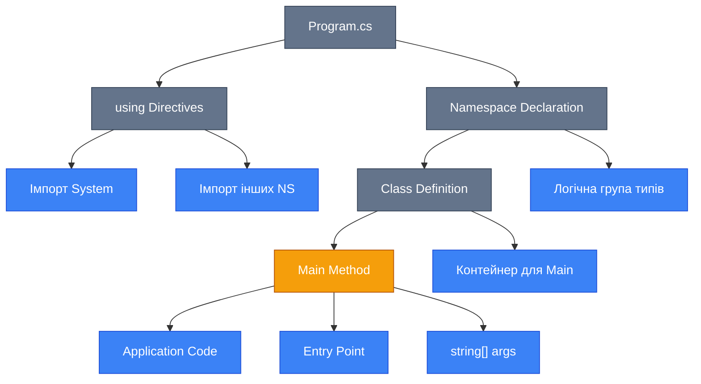
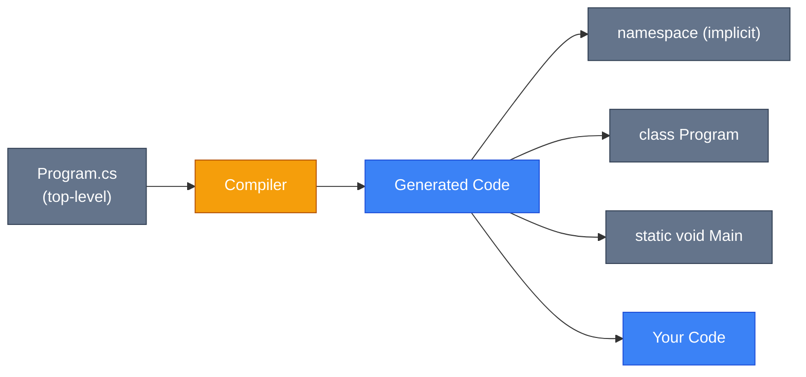
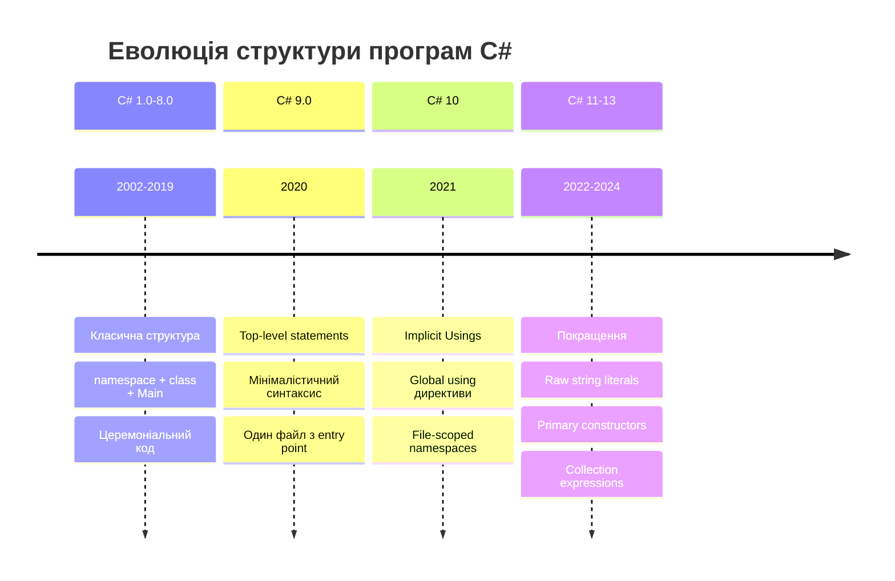

## Проблема: Церемоніальний код

Традиційно, навіть найпростіша програма на C# вимагала написання значної кількості "церемоніального" коду:

```csharp {1,3-4,7-8}
using System; // [!code --]

namespace Application // [!code --]
{ // [!code --]
    class Program // [!code --]
    { // [!code --]
        static void Main(string[] args) // [!code --]
        { // [!code --]
            Console.WriteLine("Hello World!");
        }
    }
}
```

Для виведення одного рядка потрібно було визначити namespace, клас та метод Main. Це створювало бар'єр для початківців та ускладнювало написання простих скриптів.

::note
**Історична довідка**: До C# 9.0 (2020), кожна програма вимагала явного визначення класу та методу Main. Це було успадковано від Java та C++, де структура програми є більш ригідною.
::

## Анатомія класичної програми

### Компоненти структури

Розглянемо традиційну структуру програми та роль кожного компонента:

::mermaid



::

#### 1. Using Directives (Директиви імпорту)

```csharp
using System;
using System.Collections.Generic;
using System.Linq;
```

**Призначення**: Імпортують namespaces, щоб уникнути повної кваліфікації типів.

::code-group

```csharp [Без using]
namespace MyApp
{
    class Program
    {
        static void Main()
        {
            // Повна кваліфікація типу
            System.Console.WriteLine("Hello");
            System.Collections.Generic.List<int> numbers = new();
        }
    }
}
```

```csharp [З using] {1-2,7-8}
using System; // [!code ++]
using System.Collections.Generic; // [!code ++]

namespace MyApp
{
    class Program
    {
        static void Main()
        {
            // Короткі назви // [!code ++]
            Console.WriteLine("Hello"); // [!code ++]
            List<int> numbers = new(); // [!code ++]
        }
    }
}
```

::

::tip
**Best Practice**: Розміщуйте `using` директиви **поза namespace** (C# 10+) для покращення читабельності та уникнення проблем з вкладеними namespace.
::

#### 2. Namespace (Простір імен)

```csharp
namespace MyCompany.MyProduct.Utilities
{
    // Класи, інтерфейси, структури
}
```

**Мета**: Організація типів у логічні групи та уникнення конфліктів імен.

**Два стилі оголошення**:

::code-group

```csharp [Block-scoped (класичний)]
namespace MyCompany.MyProduct
{
    class Calculator
    {
        // Вміст класу
    }

    class Logger
    {
        // Вміст класу
    }
}
```

```csharp [File-scoped (C# 10+)] {1}
namespace MyCompany.MyProduct; // [!code ++]

class Calculator
{
    // Вміст класу
}

class Logger
{
    // Вміст класу
}

// Без зайвих фігурних дужок!
```

::

::tip
**Рекомендація**: Використовуйте **file-scoped namespaces** (C# 10+) для зменшення рівня вкладеності та підвищення читабельності коду. Це усуває один рівень відступів у всьому файлі.
::

#### 3. Class Definition (Визначення класу)

```csharp
class Program
{
    // Члени класу
}
```

У традиційній структурі, клас `Program` служить контейнером для точки входу.

#### 4. Main Method (Точка входу)

Метод `Main` — це **спеціальний метод**, який виконує CLR (Common Language Runtime) при запуску програми.

**Сигнатури методу Main**:

| Сигнатура                                    | Опис                             | Використання                   |
| :------------------------------------------- | :------------------------------- | :----------------------------- |
| `static void Main()`                         | Без параметрів, без повернення   | Прості програми без аргументів |
| `static void Main(string[] args)`            | З аргументами командного рядка   | Обробка параметрів запуску     |
| `static int Main()`                          | Повертає код завершення          | Скрипти, CLI інструменти       |
| `static int Main(string[] args)`             | Повний контроль                  | Професійні CLI застосунки      |
| `static async Task Main()`                   | Асинхронна точка входу (C# 7.1+) | Async/await у Main             |
| `static async Task<int> Main(string[] args)` | Асинхронна з поверненням         | Async CLI з exit codes         |

**Приклад з аргументами**:

```csharp
using System;

namespace FileProcessor
{
    class Program
    {
        static int Main(string[] args)
        {
            if (args.Length == 0)
            {
                Console.WriteLine("Usage: FileProcessor <filename>");
                return 1; // Exit code для помилки
            }

            string filename = args[0];
            Console.WriteLine($"Processing file: {filename}");

            // Логіка обробки файлу

            return 0; // Успішне виконання
        }
    }
}
```

**Виклик з командного рядка**:

```bash
dotnet run -- myfile.txt
```

::note
**CLR та Entry Point**: Під час компіляції, компілятор C# шукає метод з іменем `Main` у всіх класах. Якщо знайдено більше одного `Main`, необхідно вказати головний клас через налаштування проєкту (`<StartupObject>`). CLR викликає цей метод для початку виконання програми.
::

## Революція: Top-Level Statements

З C# 9.0 (.NET 5+) з'явилася можливість писати код безпосередньо у файлі, без явного визначення namespace, класу та методу Main.

### Мінімальна програма

**Раніше (C# 8 та нижче)**:

```csharp
using System;

namespace HelloWorld
{
    class Program
    {
        static void Main(string[] args)
        {
            Console.WriteLine("Hello World!");
        }
    }
}
```

**Тепер (C# 9+)**:

```csharp {1}
Console.WriteLine("Hello World!"); // [!code ++]
```

Всього **один рядок**! Компілятор автоматично генерує всю необхідну структуру.

::mermaid



::

### Що генерує компілятор?

Коли ви пишете:

```csharp
using System;

Console.WriteLine("Hello World!");
```

Компілятор генерує еквівалент:

```csharp
using System;

internal class Program
{
    static void Main(string[] args)
    {
        Console.WriteLine("Hello World!");
    }
}
```

::warning
**Важливо**: Top-level statements можуть бути **тільки в одному файлі** проєкту. Якщо спробувати використати їх у кількох файлах, компілятор видасть помилку.
::

### Доступ до аргументів командного рядка

Магічна змінна `args` доступна автоматично:

```csharp
// Program.cs
if (args.Length > 0)
{
    Console.WriteLine($"Hello, {args[0]}!");
}
else
{
    Console.WriteLine("Hello, World!");
}
```

```bash
dotnet run -- Alice
# Вивід: Hello, Alice!
```

### Повернення коду завершення

```csharp
if (args.Length == 0)
{
    Console.WriteLine("Error: No arguments provided");
    return 1; // Exit code
}

Console.WriteLine("Success");
return 0;
```

### Асинхронний код у top-level statements

```csharp
using System;
using System.Net.Http;
using System.Threading.Tasks;

// Await працює "із коробки"!
HttpClient client = new();
string content = await client.GetStringAsync("https://api.github.com");
Console.WriteLine($"Response length: {content.Length}");
```

Компілятор автоматично генерує:

```csharp
static async Task Main(string[] args)
{
    // Ваш код
}
```

### Комбінація з класами та методами

Top-level statements мають бути **на початку файлу**, а потім можна визначати інші типи:

```csharp
using System;

// Top-level statements
Console.WriteLine("Starting application...");
var calculator = new Calculator();
int result = calculator.Add(5, 3);
Console.WriteLine($"Result: {result}");

// Класи та інші типи після top-level коду
class Calculator
{
    public int Add(int a, int b) => a + b;

    public int Subtract(int a, int b) => a - b;
}
```

::note
**Область видимості**: Класи, визначені після top-level statements, знаходяться в тому ж (неявному) namespace і доступні для коду top-level statements.
::

### Порівняння підходів

| Аспект           | Класична структура   | Top-level statements             |
| :--------------- | :------------------- | :------------------------------- |
| Кількість рядків | 9+ для "Hello World" | 1 рядок                          |
| Точка входу      | Явний `Main` метод   | Неявний, згенерований            |
| `args` доступ    | Параметр `Main`      | Глобальна змінна `args`          |
| Async/await      | `async Task Main`    | Підтримується автоматично        |
| Кількість файлів | Необмежена           | **Тільки один файл** з top-level |
| Підходить для    | Великі проєкти       | Скрипти, прототипи, навчання     |

::tip
**Коли використовувати що?**

-   **Top-level statements**: Прототипи, скрипти, навчальні приклади, маленькі утиліти.
-   **Класична структура**: Великі проєкти з множинними класами, бібліотеки, корпоративні застосунки.

::

## Implicit Usings (Неявні імпорти)

Починаючи з C# 10 та .NET 6, SDK автоматично додає типові `using` директиви залежно від типу проєкту.

### Увімкнення в проєкті

У файлі `.csproj`:

```xml
<Project Sdk="Microsoft.NET.Sdk">
  <PropertyGroup>
    <ImplicitUsings>enable</ImplicitUsings>
  </PropertyGroup>
</Project>
```

### Які namespaces додаються автоматично?

Для консольних застосунків (SDK: `Microsoft.NET.Sdk`):

```csharp
// Ці using додаються автоматично:
using System;
using System.Collections.Generic;
using System.IO;
using System.Linq;
using System.Net.Http;
using System.Threading;
using System.Threading.Tasks;
```

**Результат**: Ви можете використовувати `Console`, `List<T>`, `File`, LINQ методи без явних `using` директив!

```csharp
// Файл Program.cs (C# 10+, ImplicitUsings enabled)

// Всі типи доступні без using!
var numbers = new List<int> { 1, 2, 3, 4, 5 };
var evenNumbers = numbers.Where(n => n % 2 == 0);

foreach (var num in evenNumbers)
{
    Console.WriteLine(num);
}
```

### Кастомізація глобальних using

Ви можете додати власні глобальні using директиви, які будуть доступні у всіх файлах:

```csharp [GlobalUsings.cs]
global using System.Text.Json;
global using MyCompany.SharedLibrary;
global using static System.Math;
```

Тепер у будь-якому файлі проєкту:

```csharp
// JsonSerializer, PI, Sqrt доступні глобально!
double radius = 5;
double area = PI * Pow(radius, 2);

var json = JsonSerializer.Serialize(new { Radius = radius, Area = area });
Console.WriteLine(json);
```

::tip
**Best Practice**: Створіть окремий файл `GlobalUsings.cs` для централізованого управління глобальними імпортами. Це покращує видимість залежностей проєкту.
::

## Коментарі та XML-документація

Документування коду є критично важливим для підтримуваності та співпраці в команді.

### Види коментарів

::code-group

```csharp [Однорядковий]
// Це однорядковий коментар
int age = 25; // Вік користувача
```

```csharp [Багаторядковий]
/*
   Це багаторядковий коментар.
   Може займати кілька рядків.
   Використовується для блоків тексту.
*/
int CalculateTotal(int a, int b)
{
    return a + b;
}
```

```csharp [XML документація]
/// <summary>
/// Обчислює суму двох цілих чисел.
/// </summary>
/// <param name="a">Перше число.</param>
/// <param name="b">Друге число.</param>
/// <returns>Сума a та b.</returns>
public int Add(int a, int b)
{
    return a + b;
}
```

::

### XML-документація: Професійний стандарт

XML-коментарі використовуються інструментами для генерації документації (IntelliSense, DocFX, Sandcastle).

#### Основні теги

| Тег           | Призначення                    | Приклад                                                                  |
| :------------ | :----------------------------- | :----------------------------------------------------------------------- |
| `<summary>`   | Короткий опис типу/члена       | `<summary>Основний клас для розрахунків</summary>`                       |
| `<remarks>`   | Детальний опис                 | `<remarks>Цей клас використовує алгоритм...</remarks>`                   |
| `<param>`     | Опис параметра методу          | `<param name="x">Координата X</param>`                                   |
| `<returns>`   | Опис значення, що повертається | `<returns>Площа кола</returns>`                                          |
| `<exception>` | Опис винятків                  | `<exception cref="ArgumentNullException">Якщо параметр null</exception>` |
| `<example>`   | Приклад використання           | `<example><code>var calc = new Calculator();</code></example>`           |
| `<see>`       | Посилання на інший тип/член    | `<see cref="Calculator.Add"/>`                                           |
| `<seealso>`   | Зв'язані елементи              | `<seealso cref="ICalculator"/>`                                          |
| `<paramref>`  | Посилання на параметр у тексті | `Якщо <paramref name="x"/> менше нуля...`                                |
| `<typeparam>` | Опис generic параметра         | `<typeparam name="T">Тип елементу</typeparam>`                           |

#### Комплексний приклад

```csharp
namespace MathLibrary;

/// <summary>
/// Надає математичні операції для геометричних розрахунків.
/// </summary>
/// <remarks>
/// <para>
/// Цей клас оптимізований для роботи з координатами в 2D-просторі.
/// Всі методи є thread-safe.
/// </para>
/// <para>
/// Для 3D розрахунків використовуйте <see cref="Geometry3D"/>.
/// </para>
/// </remarks>
public class Calculator
{
    /// <summary>
    /// Обчислює відстань між двома точками на площині.
    /// </summary>
    /// <param name="x1">X-координата першої точки.</param>
    /// <param name="y1">Y-координата першої точки.</param>
    /// <param name="x2">X-координата другої точки.</param>
    /// <param name="y2">Y-координата другої точки.</param>
    /// <returns>
    /// Евклідова відстань між точками (<paramref name="x1"/>, <paramref name="y1"/>)
    /// та (<paramref name="x2"/>, <paramref name="y2"/>).
    /// </returns>
    /// <exception cref="ArgumentException">
    /// Викидається, якщо координати містять <see cref="double.NaN"/> або <see cref="double.PositiveInfinity"/>.
    /// </exception>
    /// <example>
    /// <code>
    /// var calculator = new Calculator();
    /// double distance = calculator.Distance(0, 0, 3, 4);
    /// Console.WriteLine(distance); // Вивід: 5
    /// </code>
    /// </example>
    public double Distance(double x1, double y1, double x2, double y2)
    {
        if (double.IsNaN(x1) || double.IsNaN(y1) || double.IsNaN(x2) || double.IsNaN(y2))
        {
            throw new ArgumentException("Координати не можуть бути NaN.");
        }

        double dx = x2 - x1;
        double dy = y2 - y1;
        return Math.Sqrt(dx * dx + dy * dy);
    }

    /// <summary>
    /// Обчислює площу кола за його радіусом.
    /// </summary>
    /// <param name="radius">Радіус кола. Має бути більше нуля.</param>
    /// <returns>Площа кола.</returns>
    /// <exception cref="ArgumentOutOfRangeException">
    /// Викидається, якщо <paramref name="radius"/> менше або дорівнює нулю.
    /// </exception>
    public double CircleArea(double radius)
    {
        if (radius <= 0)
        {
            throw new ArgumentOutOfRangeException(nameof(radius), "Радіус має бути додатнім.");
        }

        return Math.PI * radius * radius;
    }
}
```

#### Генерація XML-файлу документації

Увімкніть у `.csproj`:

```xml
<Project Sdk="Microsoft.NET.Sdk">
  <PropertyGroup>
    <DocumentationFile>bin\$(Configuration)\$(TargetFramework)\$(AssemblyName).xml</DocumentationFile>
  </PropertyGroup>
</Project>
```

Після компіляції буде створено XML-файл з усією документацією, який можна використати для генерації веб-сайту з документацією (наприклад, через DocFX).

::tip
**IntelliSense**: XML-коментарі автоматично відображаються в підказках IntelliSense в IDE (Visual Studio, Rider, VS Code). Це значно полегшує розуміння API вашого коду іншими розробниками та вами самими через певний час.
::

### Винесення документації у зовнішні файли

Для великих проєктів можна використовувати тег `<include>`:

**Файл: MathDocs.xml**

```xml
<?xml version="1.0"?>
<doc>
  <members>
    <member name="M:Calculator.Add">
      <summary>
      Додає два числа разом.
      </summary>
      <param name="a">Перше число.</param>
      <param name="b">Друге число.</param>
      <returns>Сума a та b.</returns>
    </member>
  </members>
</doc>
```

**Файл: Calculator.cs**

```csharp
public class Calculator
{
    /// <include file='MathDocs.xml' path='doc/members/member[@name="M:Calculator.Add"]/*' />
    public int Add(int a, int b)
    {
        return a + b;
    }
}
```

::note
**Переваги зовнішніх файлів**: Розділення документації та коду, можливість локалізації, менша засміченість вихідного коду. Однак, це ускладнює підтримку синхронізації між кодом і документацією.
::

## Візуальне порівняння еволюції

::mermaid



::

## Практичні рекомендації

::steps

### Крок 1: Оберіть правильний підхід

Визначте, чи потрібна вам класична структура чи top-level statements:

-   **Маленький проєкт/скрипт**: Top-level statements
-   **Бібліотека/великий проєкт**: Класична структура

### Крок 2: Налаштуйте проєкт

Увімкніть сучасні фічі у `.csproj`:

```xml
<Project Sdk="Microsoft.NET.Sdk">
  <PropertyGroup>
    <OutputType>Exe</OutputType>
    <TargetFramework>net8.0</TargetFramework>
    <ImplicitUsings>enable</ImplicitUsings>
    <Nullable>enable</Nullable>
    <LangVersion>latest</LangVersion>
  </PropertyGroup>
</Project>
```

### Крок 3: Організуйте using директиви

Створіть `GlobalUsings.cs` для спільних імпортів:

```csharp
global using System.Text.Json;
global using Microsoft.Extensions.Logging;
```

### Крок 4: Документуйте код

Додавайте XML-коментарі до публічних API:

```csharp
/// <summary>
/// Ваш опис
/// </summary>
public void MyMethod() { }
```

::

::

## Практичні завдання

### Рівень 1: Основи

::steps

#### Завдання 1.1: Від класичної структури до top-level

Створіть дві версії програми "Hello World":

-   Перша версія: з повною класичною структурою (namespace, class, Main)
-   Друга версія: з top-level statements

Порівняйте кількість рядків коду.

```csharp
// Очікуваний вивід для обох версій:
// Hello, World!
// Current time: [поточний час]
```

#### Завдання 1.2: Робота з аргументами командного рядка

Напишіть програму з top-level statements, яка:

-   Приймає ім'я користувача як аргумент командного рядка
-   Якщо аргумент не надано, запитує ім'я через `Console.ReadLine()`
-   Виводить персоналізоване вітання

```bash
dotnet run -- Олена
# Вивід: Привіт, Олена! Ласкаво просимо.

dotnet run
# Вивід: Введіть ваше ім'я: [користувач вводить]
# Вивід: Привіт, [ім'я]! Ласкаво просимо.
```

#### Завдання 1.3: File-scoped namespaces

Перепишіть наступний код, використовуючи file-scoped namespace (C# 10+):

```csharp
namespace MyCompany.Utilities
{
    public class StringHelper
    {
        public string Reverse(string input)
        {
            char[] chars = input.ToCharArray();
            Array.Reverse(chars);
            return new string(chars);
        }
    }
}
```

::

### Рівень 2: Поглиблене розуміння

::steps

#### Завдання 2.1: Асинхронний top-level код

Створіть програму з top-level statements, яка:

-   Використовує `HttpClient` для завантаження JSON даних з API
-   Використовує `await` для асинхронного запиту
-   Парсить JSON та виводить результат

```csharp
// Використайте публічний API, наприклад:
// https://api.github.com/users/[username]
// Виведіть ім'я користувача та кількість публічних репозиторіїв
```

#### Завдання 2.2: Global Usings

Створіть консольний проєкт з наступною структурою:

-   Налаштуйте `ImplicitUsings` в `.csproj`
-   Створіть `GlobalUsings.cs` з додатковими імпортами:
    -   `System.Text.Json`
    -   `System.Text.RegularExpressions`
-   Напишіть програму, що використовує ці namespace без явних `using` директив

#### Завдання 2.3: XML документація для калькулятора

Створіть клас `Calculator` з методами:

-   `Add(int a, int b)` — додавання
-   `Subtract(int a, int b)` — віднімання
-   `Multiply(int a, int b)` — множення
-   `Divide(double a, double b)` — ділення

Додайте повну XML-документацію для кожного методу, включаючи:

-   `<summary>` — опис методу
-   `<param>` — опис кожного параметра
-   `<returns>` — опис значення, що повертається
-   `<exception>` — опис винятків (для `Divide` приділенні на нуль)
-   `<example>` — приклад використання

::

### Рівень 3: Практичне застосування

::steps

#### Завдання 3.1: CLI інструмент для обробки файлів

Створіть консольний застосунок для обробки текстових файлів:

**Вимоги:**

-   Використайте top-level statements
-   Прийміть шлях до файлу та команду як аргументи CLI
-   Команди: `count` (кількість слів), `upper` (у верхній регістр), `lines` (кількість рядків)
-   Поверніть код завершення: 0 для успіху, 1 для помилки
-   Додайте обробку помилок (файл не знайдено, невідома команда)

```bash
dotnet run -- myfile.txt count
# Вивід: Words: 150

dotnet run -- myfile.txt upper
# Вивід: [вміст файлу у верхньому регістрі]

dotnet run -- nonexistent.txt count
# Вивід: Error: File not found
# Exit code: 1
```


<!-- Search Query: Console application screenshot з CLI tool для обробки файлів на C# -->

#### Завдання 3.2: Модульна програма з top-level statements

Створіть програму, яка демонструє комбінацію top-level statements з класами:

**Структура:**

-   Top-level код у `Program.cs` — точка входу та основна логіка
-   Класи після top-level коду:
    -   `UserManager` — управління користувачами (список, додавання, пошук)
    -   `ConsoleUI` — методи для взаємодії з консоллю

**Функціонал:**

-   Меню з опціями: додати користувача, показати всіх, знайти за іменем, вийти
-   Зберігання користувачів у `List<User>` (клас `User` з полями Name, Email, Age)
-   Валідація введення

```csharp
// Приклад взаємодії:
// 1. Add user
// 2. Show all users
// 3. Find by name
// 4. Exit
// Choose option: 1
// Enter name: Іван
// Enter email: ivan@example.com
// Enter age: 25
// User added successfully!
```

#### Завдання 3.3: Генерація документації

Створіть невелику бібліотеку класів (Class Library project):

**Вимоги:**

-   Створіть клас `MathOperations` з методами для геометричних обчислень:
    -   `CircleArea(double radius)` — площа кола
    -   `RectanglePerimeter(double width, double height)` — периметр прямокутника
    -   `TriangleArea(double baseLength, double height)` — площа трикутника
-   Додайте повну XML-документацію з `<example>` секціями
-   Налаштуйте проєкт для генерації XML-файлу документації
-   Створіть консольний проєкт, який посилається на бібліотеку
-   Переконайтеся, що IntelliSense показує вашу документацію

**Налаштування `.csproj` бібліотеки:**

```xml
<Project Sdk="Microsoft.NET.Sdk">
  <PropertyGroup>
    <TargetFramework>net8.0</TargetFramework>
    <DocumentationFile>bin\$(Configuration)\$(TargetFramework)\$(AssemblyName).xml</DocumentationFile>
  </PropertyGroup>
</Project>
```

::

::tip
**Поради для виконання завдань:**

-   Експериментуйте з різними підходами (класична структура vs top-level)
-   Використовуйте IntelliSense для перегляду згенерованої документації
-   Тестуйте CLI програми з різними вхідними даними та крайніми випадками
-   Звертайте увагу на коди завершення для CLI інструментів
-   Створюйте окремі файли для різних класів у складніших проєктах
    ::

## Резюме

Структура програми на C# пройшла значну еволюцію від ригідної, церемоніальної форми до гнучкого, мінімалістичного підходу. Розуміння обох підходів є критично важливим:

-   **Класична структура** (`namespace` → `class` → `Main`) забезпечує явну організацію та підходить для великих проєктів.
-   **Top-level statements** (C# 9+) усувають шаблонний код для простих сценаріїв та навчання.
-   **Implicit usings** та **global using** скорочують повторювані імпорти.
-   **XML-документація** є стандартом індустрії для професійного документування коду.
