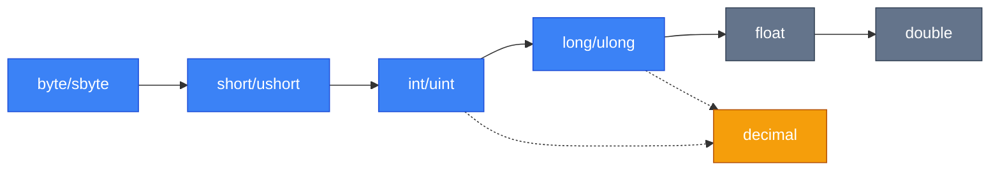
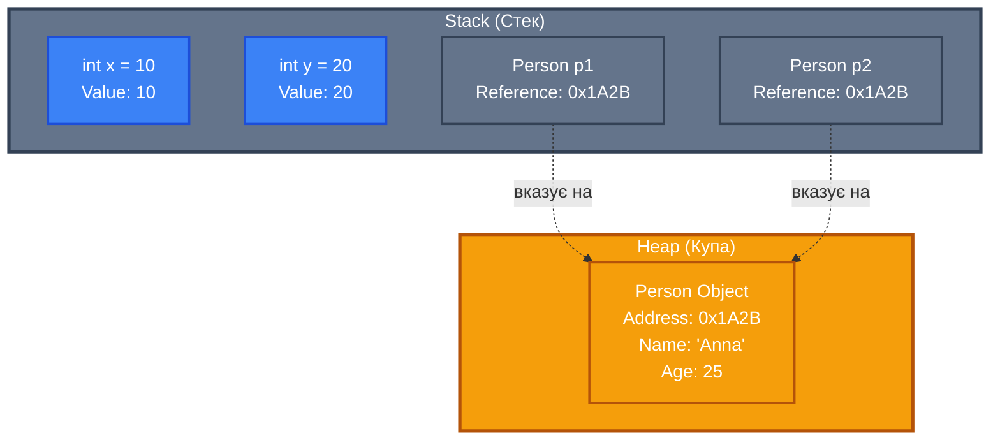

# Змінні та Типи Даних

## Вступ

Змінні (Variables) та типи даних — це фундаментальні будівельні блоки будь-якої програми на C#. Розуміння того, як оголошувати, ініціалізувати та використовувати змінні, а також знання особливостей різних типів даних, є критично важливим для написання ефективного та надійного коду.

У цьому розділі ми розглянемо:

-   Різницю між змінними та константами
-   Вбудовані типи даних C# та їх характеристики
-   Літерали для різних типів
-   Механізми конверсії типів
-   Фундаментальну відмінність між типами значень та посилань
-   Неявне типізування з `var`
-   Nullable Reference Types для безпечної роботи з `null`
-   Бітові операції та прапорці

## Змінні та Константи

### Змінні

Змінна — це іменована область пам'яті, яка зберігає значення певного типу. Значення змінної може змінюватися під час виконання програми.

```csharp
int age = 25;
age = 26; // Значення змінилося
Console.WriteLine($"Вік: {age}"); // Виведе: Вік: 26
```

### Константи: `const` vs `readonly`

C# надає два способи оголошення незмінних значень: `const` та `readonly`. Хоча обидва запобігають зміні значення після ініціалізації, вони мають важливі відмінності.

#### `const` — Константи часу компіляції

Константи `const` є **константами часу компіляції** (Compile-time constants). Їх значення має бути відоме під час компіляції, і воно вбудовується безпосередньо в скомпільований код.

```csharp {3}
public class MathConstants
{
    public const double Pi = 3.14159265359; // [!code highlight]
    public const int MaxIterations = 100;
    public const string AppName = "MyApp";
}

// Використання
double circumference = 2 * MathConstants.Pi * radius;
```

::warning
**Обмеження `const`:**

-   Можуть бути лише примітивні типи, рядки або `null`
-   Значення має бути відоме на етапі компіляції
-   Неявно є `static`
-   Не можуть бути ініціалізовані результатом виклику методу

::

#### `readonly` — Константи часу виконання

Поля `readonly` є **константами часу виконання** (Runtime constants). Їх значення може бути визначене під час виконання програми, але лише один раз — в момент ініціалізації або в конструкторі.

```csharp
public class Configuration
{
    public readonly DateTime StartTime;
    public readonly string UserId;
    public readonly int[] AllowedPorts;

    public Configuration(string userId)
    {
        StartTime = DateTime.Now; // Ініціалізація під час виконання // [!code highlight]
        UserId = userId;
        AllowedPorts = new int[] { 80, 443, 8080 };
    }
}

// Використання
var config = new Configuration("user123");
Console.WriteLine($"Застосунок запущено: {config.StartTime}");
// config.StartTime = DateTime.Now; // ПОМИЛКА: не можна змінити після ініціалізації
```

#### Порівняльна таблиця

| Критерій                 | `const`                       | `readonly`                                    |
| :----------------------- | :---------------------------- | :-------------------------------------------- |
| Час визначення значення  | Час компіляції                | Час виконання                                 |
| Місце ініціалізації      | Тільки при оголошенні         | При оголошенні або в конструкторі             |
| Типи даних               | Примітиви, рядки, `null`      | Будь-які типи                                 |
| Модифікатор доступу      | Неявно `static`               | За замовчуванням instance, може бути `static` |
| Використання в атрибутах | Так                           | Ні                                            |
| Продуктивність           | Максимальна (вбудовано в код) | Незначний overhead                            |

::tip
**Коли використовувати:**

-   **`const`**: Для справжніх констант, які ніколи не зміняться (математичні константи, налаштування конфігурації, магічні числа)
-   **`readonly`**: Для значень, які визначаються під час виконання, але не повинні змінюватися після ініціалізації (timestamp створення, конфігурація з файлу, dependency injection)

::

### Правила іменування змінних та констант

Дотримання конвенцій іменування (Naming Conventions) від Microsoft робить код більш читабельним та підтримуваним.

#### Змінні

**Локальні змінні** та **параметри методів** використовують **camelCase**:

```csharp
public void ProcessOrder(int orderId, string customerName)
{
    int totalAmount = 0;
    bool isValid = true;
    DateTime createdDate = DateTime.Now;

    // Використання
    if (isValid)
    {
        totalAmount = CalculateTotal(orderId);
    }
}
```

**Приватні поля** (Private fields) використовують **camelCase з префіксом `_`**:

```csharp
public class Customer
{
    private int _customerId;
    private string _firstName;
    private DateTime _registrationDate;

    public Customer(int customerId, string firstName)
    {
        _customerId = customerId;
        _firstName = firstName;
        _registrationDate = DateTime.Now;
    }
}
```

**Публічні поля та властивості** (Public fields and properties) використовують **PascalCase**:

```csharp
public class Product
{
    public int ProductId { get; set; }
    public string ProductName { get; set; }
    public decimal Price { get; set; }
    public bool IsAvailable { get; set; }
}
```

#### Константи (`const`)

Константи використовують **PascalCase** (не SCREAMING_SNAKE_CASE, як у деяких інших мовах):

```csharp
public class Constants
{
    public const int MaxLoginAttempts = 3;
    public const double Pi = 3.14159265359;
    public const string ApplicationName = "MyApplication";
    public const int DefaultTimeout = 30;

    // ❌ Неправильно (не використовуйте)
    // public const int MAX_LOGIN_ATTEMPTS = 3;
}
```

**Приватні константи** також використовують PascalCase:

```csharp
public class DatabaseConfig
{
    private const string ConnectionStringKey = "DefaultConnection";
    private const int MaxRetryCount = 5;
    private const double CacheExpirationMinutes = 15.0;
}
```

#### Readonly поля

Поля `readonly` слідують тим самим правилам, що й звичайні поля:

**Приватні readonly поля** — **camelCase з префіксом `_`**:

```csharp
public class ServiceClient
{
    private readonly HttpClient _httpClient;
    private readonly string _apiBaseUrl;
    private readonly TimeSpan _requestTimeout;

    public ServiceClient(HttpClient httpClient, string apiBaseUrl)
    {
        _httpClient = httpClient;
        _apiBaseUrl = apiBaseUrl;
        _requestTimeout = TimeSpan.FromSeconds(30);
    }
}
```

**Публічні/захищені readonly поля** — **PascalCase**:

```csharp
public class Configuration
{
    public readonly string Environment;
    public readonly DateTime StartupTime;
    protected readonly int MaxConnections;

    public Configuration(string environment)
    {
        Environment = environment;
        StartupTime = DateTime.UtcNow;
        MaxConnections = 100;
    }
}
```

**Static readonly поля** — **PascalCase**:

```csharp
public class AppSettings
{
    public static readonly string DefaultCulture = "uk-UA";
    public static readonly TimeSpan SessionTimeout = TimeSpan.FromMinutes(20);
    private static readonly ILogger Logger = LoggerFactory.Create();
}
```

#### Порівняльна таблиця

| Тип ідентифікатора        | Convention  | Приклад                            |
| :------------------------ | :---------- | :--------------------------------- |
| Локальна змінна           | camelCase   | `customerName`, `totalAmount`      |
| Параметр методу           | camelCase   | `orderId`, `isActive`              |
| Приватне поле             | \_camelCase | `_customerId`, `_connectionString` |
| Публічне поле/властивість | PascalCase  | `ProductName`, `IsAvailable`       |
| Константа (public)        | PascalCase  | `MaxValue`, `DefaultTimeout`       |
| Константа (private)       | PascalCase  | `ConnectionStringKey`              |
| Readonly поле (private)   | \_camelCase | `_httpClient`, `_apiBaseUrl`       |
| Readonly поле (public)    | PascalCase  | `Environment`, `StartupTime`       |
| Static readonly           | PascalCase  | `DefaultCulture`, `SessionTimeout` |

::tip
**Best Practices:**

-   Використовуйте описові імена замість скорочень (`customerName` замість `custNm`)
-   Уникайте однолітерних імен, крім лічильників циклів (`i`, `j`, `k`)
-   Для булевих змінних використовуйте префікси `is`, `has`, `can` (`isValid`, `hasErrors`, `canExecute`)
-   Імена мають відображати призначення, а не тип (`customerList`, а не `stringList`)

::


<!-- Search Query: Visual Studio Code або Rider screenshot з прикладами різних стилів іменування змінних, полів, констант у C# коді -->

## Вбудовані типи даних

C# надає багатий набір вбудованих типів даних (Built-in types), які можна розділити на кілька категорій.

### Цілочисельні типи

Цілочисельні типи (Integral types) зберігають цілі числа без дробової частини.

| Тип C#   | Тип .NET        | Розмір (біт) | Діапазон                                                | Приклад                        |
| :------- | :-------------- | :----------- | :------------------------------------------------------ | :----------------------------- |
| `sbyte`  | `System.SByte`  | 8            | -128 до 127                                             | `sbyte temp = -40;`            |
| `byte`   | `System.Byte`   | 8            | 0 до 255                                                | `byte age = 25;`               |
| `short`  | `System.Int16`  | 16           | -32,768 до 32,767                                       | `short year = 2024;`           |
| `ushort` | `System.UInt16` | 16           | 0 до 65,535                                             | `ushort port = 8080;`          |
| `int`    | `System.Int32`  | 32           | -2,147,483,648 до 2,147,483,647                         | `int count = 1000;`            |
| `uint`   | `System.UInt32` | 32           | 0 до 4,294,967,295                                      | `uint population = 3000000;`   |
| `long`   | `System.Int64`  | 64           | -9,223,372,036,854,775,808 до 9,223,372,036,854,775,807 | `long distance = 1000000L;`    |
| `ulong`  | `System.UInt64` | 64           | 0 до 18,446,744,073,709,551,615                         | `ulong bigNumber = 1000000UL;` |

```csharp
// Приклади використання
byte pixelValue = 255;
int temperature = -15;
long worldPopulation = 8_000_000_000L; // Підкреслення для читабельності
uint hexColor = 0xFF5733;
```

### Типи з плаваючою точкою

Типи з плаваючою точкою (Floating-point types) зберігають числа з дробовою частиною.

| Тип C#    | Тип .NET         | Розмір (біт) | Точність    | Діапазон (приблизно)          | Суфікс                |
| :-------- | :--------------- | :----------- | :---------- | :---------------------------- | :-------------------- |
| `float`   | `System.Single`  | 32           | ~6-9 цифр   | ±1.5 × 10⁻⁴⁵ до ±3.4 × 10³⁸   | `f` або `F`           |
| `double`  | `System.Double`  | 64           | ~15-17 цифр | ±5.0 × 10⁻³²⁴ до ±1.7 × 10³⁰⁸ | `d` або `D` (опційно) |
| `decimal` | `System.Decimal` | 128          | 28-29 цифр  | ±1.0 × 10⁻²⁸ до ±7.9 × 10²⁸   | `m` або `M`           |

```csharp
float gravity = 9.81f;
double pi = 3.141592653589793;
decimal price = 19.99m; // Для фінансових розрахунків
decimal preciseValue = 0.123456789012345678901234567m;
```

::tip
**Вибір типу для дробових чисел:**

-   **`float`**: Коли потрібна економія пам'яті, а точність не критична (графіка, ігри)
-   **`double`**: Стандартний вибір для наукових обчислень
-   **`decimal`**: Обов'язково для фінансових та грошових операцій (уникає помилок округлення)

::

### Булевий тип

Тип `bool` (Boolean type) зберігає логічні значення.

```csharp
bool isActive = true;
bool hasErrors = false;

// Використання в умовах
if (isActive && !hasErrors)
{
    Console.WriteLine("Система працює коректно");
}
```

### Символьний тип

Тип `char` (Character type) зберігає один символ Unicode (UTF-16).

```csharp
char letter = 'A';
char digit = '5';
char unicodeChar = '\u0041'; // 'A' в Unicode
char emoji = '😊';

Console.WriteLine($"Символ: {letter}, Код: {(int)letter}"); // A, Код: 65
```

### Рядковий тип

Тип `string` (String type) — це послідовність символів Unicode. Рядки в C# є незмінними (immutable).

```csharp
string greeting = "Привіт, світ!";
string name = "Анна";
string fullGreeting = greeting + " Мене звати " + name;

// Інтерполяція рядків
string message = $"Вітаю, {name}! Сьогодні {DateTime.Now:dd.MM.yyyy}";
Console.WriteLine(message);
```

## Літерали

Літерали (Literals) — це фіксовані значення, які записуються безпосередньо в коді.

### Цілочисельні літерали

```csharp
// Десяткові (Decimal)
int decimal1 = 42;
int decimal2 = 1_000_000; // Підкреслення для читабельності

// Шістнадцяткові (Hexadecimal) - префікс 0x або 0X
int hex1 = 0x2A;        // 42 у десятковій
int hex2 = 0xFF;        // 255 у десятковій
int hex3 = 0x00_FF_00;  // 65280 (зелений колір у RGB)

// Двійкові (Binary) - префікс 0b або 0B
int binary1 = 0b101010;      // 42 у десятковій
int binary2 = 0b1111_1111;   // 255 у десятковій
int binary3 = 0b0000_1111_0000; // 240

Console.WriteLine($"Hex: {hex1}, Binary: {binary1}"); // Hex: 42, Binary: 42
```

### Літерали дійсних чисел

```csharp
// Float літерали (суфікс f або F)
float f1 = 3.14f;
float f2 = 2.5F;
float f3 = 1.23e-4f; // Наукова нотація: 1.23 × 10⁻⁴

// Double літерали (суфікс d або D опційний)
double d1 = 3.14;
double d2 = 2.5d;
double d3 = 1.23e10; // 1.23 × 10¹⁰

// Decimal літерали (суфікс m або M)
decimal m1 = 3.14m;
decimal m2 = 123.456M;
decimal m3 = 0.0001m;
```

### Булеві літерали

```csharp
bool isTrue = true;
bool isFalse = false;
```

### Символьні літерали

```csharp
char letter = 'A';
char newline = '\n';        // Escape-послідовність
char tab = '\t';
char backslash = '\\';
char quote = '\'';
char unicode = '\u0041';    // Unicode escape
char hex = '\x0041';        // Hexadecimal escape
```

### Рядкові літерали

#### Звичайні рядкові літерали

```csharp
string simple = "Привіт, світ!";
string withEscape = "Перший рядок\nДругий рядок";
string withQuotes = "Вона сказала: \"Привіт!\"";
```

#### Verbatim рядкові літерали (префікс @)

Verbatim літерали ігнорують escape-послідовності та зберігають формат тексту.

```csharp
// Без verbatim - потрібно екранувати
string path1 = "C:\\Users\\Anna\\Documents\\file.txt";

// З verbatim - простіше та зрозуміліше
string path2 = @"C:\Users\Anna\Documents\file.txt";

// Багаторядковий текст
string multiline = @"Перший рядок
Другий рядок
Третій рядок";

// Лапки подвоюються
string withQuotes = @"Вона сказала: ""Привіт!""";
```

#### Raw рядкові літерали (C# 11+)

Raw string literals дозволяють уникнути будь-якого екранування, використовуючи три або більше подвійних лапок.

```csharp
// Однорядковий raw string
string json1 = """{"name": "Anna", "age": 25}""";

// Багаторядковий raw string
string json2 = """
{
    "name": "Anna",
    "age": 25,
    "city": "Kyiv"
}
""";

// Raw string з інтерполяцією (C# 11+)
string name = "Богдан";
int age = 30;
string interpolated = $$"""
{
    "name": "{{name}}",
    "age": {{age}}
}
""";
Console.WriteLine(interpolated);
// Виведе:
// {
//     "name": "Богдан",
//     "age": 30
// }
```

::code-group

```csharp [Звичайний рядок]
string path = "C:\\Projects\\MyApp\\bin\\Debug";
string sql = "SELECT * FROM Users WHERE Name = 'John'";
```

```csharp [Verbatim рядок]
string path = @"C:\Projects\MyApp\bin\Debug";
string sql = @"SELECT * FROM Users WHERE Name = 'John'";
```

```csharp [Raw рядок (C# 11+)]
string json = """
{
    "path": "C:\Projects\MyApp\bin\Debug",
    "query": "SELECT * FROM Users WHERE Name = 'John'"
}
""";
```

::

## Оператори в C#

Оператори (Operators) — це спеціальні символи або ключові слова, які виконують операції над операндами (змінними, літералами або виразами). C# надає багатий набір операторів для різних цілей.

### Арифметичні оператори

Арифметичні оператори (Arithmetic Operators) виконують математичні операції.

| Оператор | Назва                  | Опис                              | Приклад         | Результат |
| :------- | :--------------------- | :-------------------------------- | :-------------- | :-------- |
| `+`      | Додавання              | Додає два операнди                | `5 + 3`         | `8`       |
| `-`      | Віднімання             | Віднімає другий операнд з першого | `5 - 3`         | `2`       |
| `*`      | Множення               | Множить два операнди              | `5 * 3`         | `15`      |
| `/`      | Ділення                | Ділить перший операнд на другий   | `10 / 3`        | `3`       |
| `%`      | Остача від ділення     | Повертає залишок від ділення      | `10 % 3`        | `1`       |
| `++`     | Інкремент (збільшення) | Збільшує значення на 1            | `x++` або `++x` | -         |
| `--`     | Декремент (зменшення)  | Зменшує значення на 1             | `x--` або `--x` | -         |
| `+`      | Унарний плюс           | Вказує позитивне значення         | `+5`            | `5`       |
| `-`      | Унарний мінус          | Змінює знак на протилежний        | `-5`            | `-5`      |

```csharp showLineNumbers
// Базові арифметичні операції
int a = 10;
int b = 3;

int sum = a + b;          // 13
int difference = a - b;   // 7
int product = a * b;      // 30
int quotient = a / b;     // 3 (цілочисельне ділення)
int remainder = a % b;    // 1

// Ділення з дробовою частиною
double preciseQuotient = (double)a / b;  // 3.333...
Console.WriteLine($"{a} / {b} = {preciseQuotient:F2}");

// Унарні оператори
int positive = +5;    // 5
int negative = -5;    // -5
```

#### Інкремент та декремент

Оператори `++` та `--` можуть бути **префіксними** (перед змінною) або **постфіксними** (після змінної), що впливає на порядок виконання.

::code-group

```csharp [Префіксний (++x)]
int x = 5;
int y = ++x;  // Спочатку збільшення, потім присвоювання

Console.WriteLine($"x = {x}, y = {y}");
// Виведе: x = 6, y = 6
```

```csharp [Постфіксний (x++)]
int x = 5;
int y = x++;  // Спочатку присвоювання, потім збільшення

Console.WriteLine($"x = {x}, y = {y}");
// Виведе: x = 6, y = 5
```

::

```csharp
// Приклад різниці
int a = 10;
int b = 10;

int result1 = a++ * 2;  // result1 = 10 * 2 = 20, потім a = 11
int result2 = ++b * 2;  // спочатку b = 11, потім result2 = 11 * 2 = 22

Console.WriteLine($"a={a}, result1={result1}");  // a=11, result1=20
Console.WriteLine($"b={b}, result2={result2}");  // b=11, result2=22
```

### Оператори присвоювання

Оператори присвоювання (Assignment Operators) встановлюють значення змінної.

| Оператор | Назва                       | Еквівалент   | Приклад   | Результат (якщо x=5) |
| :------- | :-------------------------- | :----------- | :-------- | :------------------- |
| `=`      | Просте присвоювання         | -            | `x = 10`  | `x = 10`             |
| `+=`     | Додавання з присвоюванням   | `x = x + y`  | `x += 3`  | `x = 8`              |
| `-=`     | Віднімання з присвоюванням  | `x = x - y`  | `x -= 3`  | `x = 2`              |
| `*=`     | Множення з присвоюванням    | `x = x * y`  | `x *= 3`  | `x = 15`             |
| `/=`     | Ділення з присвоюванням     | `x = x / y`  | `x /= 2`  | `x = 2`              |
| `%=`     | Остача з присвоюванням      | `x = x % y`  | `x %= 3`  | `x = 2`              |
| `&=`     | Бітове І з присвоюванням    | `x = x & y`  | `x &= 3`  | -                    |
| `\|=`    | Бітове АБО з присвоюванням  | `x = x \| y` | `x \|= 3` | -                    |
| `^=`     | Бітове XOR з присвоюванням  | `x = x ^ y`  | `x ^= 3`  | -                    |
| `<<=`    | Зсув вліво з присвоюванням  | `x = x << y` | `x <<= 2` | `x = 20`             |
| `>>=`    | Зсув вправо з присвоюванням | `x = x >> y` | `x >>= 1` | `x = 2`              |
| `??=`    | Null-coalescing assignment  | `x = x ?? y` | `x ??= 5` | -                    |

```csharp showLineNumbers
int counter = 0;

// Складені оператори присвоювання
counter += 5;   // counter = 0 + 5 = 5
counter *= 2;   // counter = 5 * 2 = 10
counter -= 3;   // counter = 10 - 3 = 7
counter /= 2;   // counter = 7 / 2 = 3
counter %= 2;   // counter = 3 % 2 = 1

Console.WriteLine($"Final counter: {counter}"); // 1

// Null-coalescing assignment (C# 8.0+)
string? name = null;
name ??= "За замовчуванням";  // Присвоює тільки якщо name == null
Console.WriteLine(name);       // "За замовчуванням"

name ??= "Інше значення";      // Не присвоює, бо name вже не null
Console.WriteLine(name);       // "За замовчуванням"
```

### Оператори порівняння

Оператори порівняння (Comparison/Relational Operators) порівнюють два значення та повертають `bool`.

| Оператор | Назва               | Опис                      | Приклад  | Результат |
| :------- | :------------------ | :------------------------ | :------- | :-------- |
| `==`     | Дорівнює            | Перевіряє рівність        | `5 == 3` | `false`   |
| `!=`     | Не дорівнює         | Перевіряє нерівність      | `5 != 3` | `true`    |
| `>`      | Більше              | Перший більший за другий  | `5 > 3`  | `true`    |
| `<`      | Менше               | Перший менший за другий   | `5 < 3`  | `false`   |
| `>=`     | Більше або дорівнює | Перший більший або рівний | `5 >= 5` | `true`    |
| `<=`     | Менше або дорівнює  | Перший менший або рівний  | `5 <= 3` | `false`   |

```csharp showLineNumbers
int x = 10;
int y = 20;

bool isEqual = x == y;          // false
bool isNotEqual = x != y;       // true
bool isGreater = x > y;         // false
bool isLess = x < y;            // true
bool isGreaterOrEqual = x >= 10; // true
bool isLessOrEqual = x <= 5;    // false

// Порівняння рядків
string str1 = "Hello";
string str2 = "World";
bool areStringsEqual = str1 == str2;  // false

// Порівняння дат
DateTime date1 = new DateTime(2024, 1, 1);
DateTime date2 = DateTime.Now;
bool isPastDate = date1 < date2;  // true (якщо зараз після 1 січня 2024)
```

::warning
**Увага з reference types**: Оператор `==` для reference types порівнює **посилання**, а не вміст об'єктів (окрім `string`, який має перевизначену поведінку). Для порівняння вмісту використовуйте метод `.Equals()`.
::

### Логічні оператори

Логічні оператори (Logical Operators) виконують логічні операції над булевими значеннями.

| Оператор | Назва                         | Опис                            | Приклад           | Результат |
| :------- | :---------------------------- | :------------------------------ | :---------------- | :-------- |
| `&&`     | Логічне І (AND)               | `true` якщо обидва `true`       | `true && false`   | `false`   |
| `\|\|`   | Логічне АБО (OR)              | `true` якщо хоча б один `true`  | `true \|\| false` | `true`    |
| `!`      | Логічне НЕ (NOT)              | Інвертує булеве значення        | `!true`           | `false`   |
| `&`      | Логічне І без short-circuit   | Завжди обчислює обидва операнди | `true & false`    | `false`   |
| `\|`     | Логічне АБО без short-circuit | Завжди обчислює обидва операнди | `true \| false`   | `true`    |
| `^`      | Логічне виключне АБО (XOR)    | `true` якщо операнди різні      | `true ^ false`    | `true`    |

```csharp showLineNumbers
bool isAdult = true;
bool hasLicense = false;

// Логічне І (AND) - обидва мають бути true
bool canDrive = isAdult && hasLicense;  // false

// Логічне АБО (OR) - хоча б один true
bool canEnter = isAdult || hasLicense;  // true

// Логічне НЕ (NOT) - інверсія
bool isChild = !isAdult;  // false

// Складні умови
int age = 25;
bool hasPermission = true;

if (age >= 18 && hasPermission)
{
    Console.WriteLine("Доступ дозволено");
}

// XOR - виключне АБО
bool option1 = true;
bool option2 = false;
bool exclusiveChoice = option1 ^ option2;  // true (тільки один з них true)
```

#### Short-circuit evaluation

Оператори `&&` та `||` використовують **short-circuit evaluation** (скорочене обчислення) — другий операнд не обчислюється, якщо результат вже відомий з першого.

```csharp showLineNumbers
int? nullableValue = null;

// && short-circuit: другий вираз не виконається, якщо перший false
if (nullableValue != null && nullableValue.Value > 10) // [!code highlight]
{
    // Безпечно: nullableValue.Value не викличеться, якщо nullableValue == null
}

// || short-circuit: другий вираз не виконується, якщо перший true
bool result = CheckCondition1() || CheckCondition2(); // [!code highlight]
// Якщо CheckCondition1() повертає true, CheckCondition2() НЕ викликається

// Без short-circuit (& та |) - обидва операнди завжди обчислюються
bool result2 = CheckCondition1() & CheckCondition2(); // [!code highlight]
// Обидва методи ЗАВЖДИ викликаються, незалежно від результату першого
```

::tip
**Best Practice**: Використовуйте `&&` та `||` замість `&` та `|` для булевих операцій, оскільки short-circuit evaluation:

-   Підвищує продуктивність (не обчислює непотрібні вирази)
-   Запобігає помилкам (наприклад, `NullReferenceException`)

::

### Тернарний оператор

Тернарний (умовний) оператор `? :` (Ternary/Conditional Operator) — це скорочена форма `if-else`.

**Синтаксис:**

```csharp
condition ? valueIfTrue : valueIfFalse
```

```csharp showLineNumbers
int age = 20;

// Використання if-else
string status;
if (age >= 18)
{
    status = "Повнолітній";
}
else
{
    status = "Неповнолітній";
}

// Те саме з тернарним оператором
string status2 = age >= 18 ? "Повнолітній" : "Неповнолітній"; // [!code highlight]

// Вкладені тернарні оператори (використовуйте обережно!)
int score = 85;
string grade = score >= 90 ? "A" :
               score >= 80 ? "B" :
               score >= 70 ? "C" :
               score >= 60 ? "D" : "F";
Console.WriteLine($"Оцінка: {grade}"); // "B"

// Практичний приклад
int itemCount = 5;
string message = $"У кошику {itemCount} {(itemCount == 1 ? "товар" : "товарів")}";
Console.WriteLine(message); // "У кошику 5 товарів"
```

::code-group

```csharp [З тернарним оператором]
int max = a > b ? a : b;
Console.WriteLine($"Max: {max}");
```

```csharp [З if-else]
int max;
if (a > b)
{
    max = a;
}
else
{
    max = b;
}
Console.WriteLine($"Max: {max}");
```

::

### Оператори для роботи з null

C# надає спеціальні оператори для безпечної роботи з `null` значеннями.

| Оператор | Назва                      | Опис                                        | Приклад              |
| :------- | :------------------------- | :------------------------------------------ | :------------------- |
| `?.`     | Null-conditional (Elvis)   | Доступ до члена, якщо не `null`             | `obj?.Property`      |
| `?[]`    | Null-conditional indexer   | Індексація, якщо не `null`                  | `array?[0]`          |
| `??`     | Null-coalescing            | Повертає ліве, якщо не `null`, інакше праве | `x ?? defaultValue`  |
| `??=`    | Null-coalescing assignment | Присвоює, якщо `null`                       | `x ??= defaultValue` |
| `!`      | Null-forgiving             | Вказує компілятору, що значення не `null`   | `obj!.Property`      |

#### Null-conditional оператор `?.`

Оператор `?.` (Elvis operator) безпечно отримує доступ до членів об'єкта, який може бути `null`.

```csharp showLineNumbers
string? name = null;

// Без null-conditional - NullReferenceException!
// int length1 = name.Length;  // ❌ Помилка під час виконання

// З null-conditional - повертає null
int? length2 = name?.Length;  // ✅ length2 = null
Console.WriteLine(length2 ?? 0);  // Виведе: 0

// Ланцюжок викликів
Person? person = GetPerson();
string? city = person?.Address?.City?.ToUpper();

// З масивами та колекціями
int[] numbers = null;
int? firstNumber = numbers?[0];  // null замість винятку

// З методами
string? result = person?.GetFullName()?.Trim();
```

#### Null-coalescing оператор `??`

Оператор `??` повертає ліве значення, якщо воно не `null`, інакше повертає праве значення.

```csharp showLineNumbers
string? userName = null;
string displayName = userName ?? "Гість";  // "Гість"
Console.WriteLine($"Вітаємо, {displayName}!");

// Ланцюжок null-coalescing
string? firstName = null;
string? lastName = null;
string? nickName = "Користувач123";
string name = firstName ?? lastName ?? nickName ?? "Анонім";
Console.WriteLine(name); // "Користувач123"

// З nullable value types
int? nullableInt = null;
int actualValue = nullableInt ?? 0;  // 0

// Комбінація з null-conditional
Person? person = GetPerson();
string city = person?.Address?.City ?? "Невідоме місто";
```

#### Null-coalescing assignment `??=`

Оператор `??=` (C# 8.0+) присвоює значення **тільки якщо** ліва змінна є `null`.

```csharp showLineNumbers
List<string>? items = null;

// Ініціалізація тільки якщо null
items ??= new List<string>();  // Створюється новий список
items ??= new List<string>();  // НЕ виконується, бо items вже не null

// Lazy initialization
private List<string>? _cache;
public List<string> Cache
{
    get
    {
        _cache ??= LoadDataFromDatabase();  // Завантажується тільки при першому доступі
        return _cache;
    }
}

// Приклад з налаштуваннями
Dictionary<string, string>? config = LoadConfig();
config ??= GetDefaultConfig();  // Використати дефолтні, якщо завантаження не вдалось
```

::code-group

```csharp [Без ??=]
if (cache == null)
{
    cache = new List<Item>();
}
cache.Add(newItem);
```

```csharp [З ??=]
cache ??= new List<Item>();
cache.Add(newItem);
```

::

### Оператори перевірки типу

Оператори перевірки типу (Type-testing Operators) дозволяють перевіряти та перетворювати типи.

| Оператор | Назва           | Опис                                  | Результат |
| :------- | :-------------- | :------------------------------------ | :-------- |
| `is`     | Type test       | Перевіряє, чи об'єкт сумісний з типом | `bool`    |
| `as`     | Type cast       | Приводить до типу або повертає `null` | `type?`   |
| `typeof` | Type reflection | Отримує об'єкт `Type` для типу        | `Type`    |
| `sizeof` | Size of type    | Розмір типу в байтах                  | `int`     |

#### Оператор `is`

Оператор `is` перевіряє сумісність з типом та дозволяє pattern matching.

```csharp showLineNumbers
object obj = "Hello, World!";

// Проста перевірка типу
if (obj is string) // [!code highlight]
{
    Console.WriteLine("obj є рядком");
}

// Pattern matching з оголошенням змінної (C# 7+)
if (obj is string text) // [!code highlight]
{
    Console.WriteLine($"Рядок: {text.ToUpper()}");
    // text доступна тільки в цьому блоці
}

// Перевірка на null
object? nullableObj = null;
if (nullableObj is null)  // Еквівалент: nullableObj == null
{
    Console.WriteLine("Об'єкт null");
}
if (nullableObj is not null)  // C# 9+
{
    Console.WriteLine("Об'єкт не null");
}

// Property pattern (C# 8+)
if (obj is string { Length: > 5 } longText)
{
    Console.WriteLine($"Довгий рядок: {longText}");
}

// Приклад з успадкуванням
Animal animal = new Dog();
if (animal is Dog dog)
{
    dog.Bark();  // Метод специфічний для Dog
}
```

#### Оператор `as`

Оператор `as` намагається привести об'єкт до вказаного типу. Повертає `null` при невдачі (не викидає виняток).

```csharp showLineNumbers
object obj = "Hello";

// З оператором as
string? str = obj as string; // [!code highlight]
if (str != null)
{
    Console.WriteLine($"Довжина: {str.Length}");
}

// З явним приведенням (cast) - НЕБЕЗПЕЧНО
try
{
    int number = (int)obj;  // InvalidCastException!
}
catch (InvalidCastException ex)
{
    Console.WriteLine("Неможливо привести до int");
}

// Безпечний підхід з as
int? number = obj as int?;  // null, без винятку
if (number.HasValue)
{
    Console.WriteLine($"Число: {number.Value}");
}
else
{
    Console.WriteLine("Не є числом");
}
```

::code-group

```csharp [З оператором as]
Animal animal = GetAnimal();
Dog? dog = animal as Dog;
if (dog != null)
{
    dog.Bark();
}
```

```csharp [З оператором is]
Animal animal = GetAnimal();
if (animal is Dog dog)
{
    dog.Bark();
}
```

```csharp [Явне приведення (небезпечно)]
Animal animal = GetAnimal();
try
{
    Dog dog = (Dog)animal;
    dog.Bark();
}
catch (InvalidCastException)
{
    // Обробка помилки
}
```

::

#### Оператори `typeof` та `sizeof`

```csharp showLineNumbers
// typeof - отримання Type об'єкта
Type stringType = typeof(string);
Console.WriteLine($"Тип: {stringType.Name}");
Console.WriteLine($"Простір імен: {stringType.Namespace}");

Type genericType = typeof(List<int>);
Console.WriteLine($"Generic: {genericType.Name}");

// Порівняння типів
object obj = "Hello";
if (obj.GetType() == typeof(string))
{
    Console.WriteLine("obj є рядком");
}

// sizeof - розмір типу (тільки для value types)
int intSize = sizeof(int);           // 4 байти
long longSize = sizeof(long);        // 8 байтів
double doubleSize = sizeof(double);  // 8 байтів
bool boolSize = sizeof(bool);        // 1 байт

Console.WriteLine($"int: {intSize}, long: {longSize}, double: {doubleSize}");

// Для користувацьких структур
unsafe
{
    int pointSize = sizeof(Point);  // Залежить від визначення Point
}
```

### Оператор `nameof`

Оператор `nameof` (C# 6.0+) повертає ім'я змінної, типу або члена як рядок.

```csharp showLineNumbers
string variableName = "test";
Console.WriteLine(nameof(variableName));   // "variableName"
Console.WriteLine(nameof(Console));        // "Console"
Console.WriteLine(nameof(String.Length));  // "Length"

// Практичне використання: валідація параметрів
public void SetName(string name)
{
    if (string.IsNullOrEmpty(name))
    {
        throw new ArgumentException(
            $"Параметр не може бути порожнім",
            nameof(name)  // Замість "name" як рядка
        );
    }
}

// PropertyChanged events
public class Person : INotifyPropertyChanged
{
    private string _name;
    public string Name
    {
        get => _name;
        set
        {
            _name = value;
            OnPropertyChanged(nameof(Name));  // Безпечно від рефакторингу
        }
    }
}
```

::tip
**Переваги `nameof`**:

-   Безпечний рефакторинг (компілятор оновить автоматично при перейменуванні)
-   Відсутність "магічних рядків"
-   IntelliSense підтримка

::

### Пріоритет операторів

Пріоритет операторів (Operator Precedence) визначає порядок виконання операцій у виразі.

| Пріоритет | Оператори                               | Категорія                    | Асоціативність |
| :-------- | :-------------------------------------- | :--------------------------- | :------------- |
| 1         | `x.y`, `x?.y`, `x?[y]`, `f(x)`, `a[i]`  | Первинні                     | Зліва направо  |
| 2         | `x++`, `x--`, `new`, `typeof`, `sizeof` | Унарні постфіксні            | Зліва направо  |
| 3         | `+x`, `-x`, `!x`, `~x`, `++x`, `--x`    | Унарні префіксні             | Справа наліво  |
| 4         | `(T)x`                                  | Приведення типу              | Справа наліво  |
| 5         | `*`, `/`, `%`                           | Мультиплікативні             | Зліва направо  |
| 6         | `+`, `-`                                | Адитивні                     | Зліва направо  |
| 7         | `<<`, `>>`                              | Зсув                         | Зліва направо  |
| 8         | `<`, `>`, `<=`, `>=`, `is`, `as`        | Порівняння та перевірка типу | Зліва направо  |
| 9         | `==`, `!=`                              | Рівність                     | Зліва направо  |
| 10        | `&`                                     | Логічне/бітове І             | Зліва направо  |
| 11        | `^`                                     | Логічне/бітове XOR           | Зліва направо  |
| 12        | `\|`                                    | Логічне/бітове АБО           | Зліва направо  |
| 13        | `&&`                                    | Умовне І                     | Зліва направо  |
| 14        | `\|\|`                                  | Умовне АБО                   | Зліва направо  |
| 15        | `??`                                    | Null-coalescing              | Зліва направо  |
| 16        | `?:`                                    | Тернарний                    | Справа наліво  |
| 17        | `=`, `+=`, `-=`, `*=`, `/=`, тощо       | Присвоювання                 | Справа наліво  |

```csharp showLineNumbers
// Приклад пріоритету
int result = 2 + 3 * 4;  // 14, не 20 (* має вищий пріоритет)
int result2 = (2 + 3) * 4;  // 20 (дужки змінюють порядок)

// Складний вираз
bool condition = x > 5 && y < 10 || z == 0;
// Еквівалент: ((x > 5) && (y < 10)) || (z == 0)

// З null-coalescing
string name = firstName ?? lastName ?? "Unknown";
// Виконується зліва направо

// Для ясності краще використовувати дужки
int complex = (a + b) * (c - d) / (e + f);
```

::warning
**Best Practice**: Навіть знаючи пріоритет, використовуйте дужки для складних виразів. Це покращує читабельність коду та запобігає помилкам.
::

### Таблиця всіх операторів

::collapsible{summary="Розгорнути повну таблицю операторів C#"}

| Категорія         | Оператори                                            | Опис                              |
| :---------------- | :--------------------------------------------------- | :-------------------------------- |
| Арифметичні       | `+`, `-`, `*`, `/`, `%`, `++`, `--`                  | Математичні операції              |
| Присвоювання      | `=`, `+=`, `-=`, `*=`, `/=`, `%=`, `&=`, `\|=`, `^=` | Присвоювання значень              |
| Порівняння        | `==`, `!=`, `>`, `<`, `>=`, `<=`                     | Порівняння значень                |
| Логічні           | `&&`, `\|\|`, `!`, `&`, `\|`, `^`                    | Булева логіка                     |
| Бітові            | `&`, `\|`, `^`, `~`, `<<`, `>>`                      | Операції з бітами                 |
| Null-операції     | `?.`, `?[]`, `??`, `??=`, `!`                        | Безпечна робота з null            |
| Перевірка типу    | `is`, `as`, `typeof`, `sizeof`                       | Робота з типами                   |
| Інші              | `?:`, `nameof`, `=>`, `new`, `default`, `checked`    | Спеціальні оператори              |
| Індексація        | `[]`, `?[]`                                          | Доступ до елементів               |
| Виклик            | `()`, `?.()`, `delegate`, `await`                    | Виклик методів та делегатів       |
| Діапазони (C# 8+) | `..`, `^`                                            | Робота з діапазонами та індексами |

::

## Конверсія типів

Конверсія типів (Type Conversion) — це процес перетворення значення з одного типу в інший.

### Неявна конверсія (Implicit Conversion)

Неявна конверсія (Implicit Conversion) або розширююча конверсія (Widening Conversion) відбувається автоматично, коли не існує ризику втрати даних.

```csharp
// Числова ієрархія: byte → short → int → long → float → double → decimal
int intValue = 100;
long longValue = intValue;      // int → long (безпечно)
float floatValue = intValue;    // int → float
double doubleValue = floatValue; // float → double

Console.WriteLine($"int: {intValue}, long: {longValue}, double: {doubleValue}");
```

::mermaid



::

### Явна конверсія (Explicit Conversion)

Явна конверсія (Explicit Conversion) або звужуюча конверсія (Narrowing Conversion) потребує явного приведення (casting) та може призвести до втрати даних.

```csharp {2}
double doubleValue = 123.456;
int intValue = (int)doubleValue; // Явне приведення, втрата дробової частини // [!code highlight]
Console.WriteLine($"double: {doubleValue}, int: {intValue}");
// Виведе: double: 123.456, int: 123

long bigNumber = 3000000000L;
int smallerNumber = (int)bigNumber; // Ризик переповнення!
Console.WriteLine($"long: {bigNumber}, int: {smallerNumber}");

// Приведення між float та decimal потребує явної конверсії
decimal decimalValue = 19.99m;
double fromDecimal = (double)decimalValue;
float fromDecimal2 = (float)decimalValue;
```

::warning
**Увага**: Явна конверсія може призвести до:

-   Втрати точності (дробова частина)
-   Переповнення (overflow) при виході за межі діапазону
-   Некоректних результатів

::

### Клас `Convert`

Клас `System.Convert` надає методи для конверсії між базовими типами з обробкою крайніх випадків.

```csharp
// Конверсія рядків у числа
string numberStr = "42";
int number = Convert.ToInt32(numberStr);
double doubleNum = Convert.ToDouble("3.14");
bool boolValue = Convert.ToBoolean("true");

Console.WriteLine($"int: {number}, double: {doubleNum}, bool: {boolValue}");

// Конверсія з перевіркою null
string nullStr = null;
int fromNull = Convert.ToInt32(nullStr); // Поверне 0, а не викличе виняток!

// Конверсія між числовими типами
decimal decValue = 123.45m;
int intFromDec = Convert.ToInt32(decValue); // 123 (округлення)

// Робота з різними системами числення
string hexString = "FF";
int fromHex = Convert.ToInt32(hexString, 16); // 255
string binary = Convert.ToString(255, 2);     // "11111111"
Console.WriteLine($"Hex FF = {fromHex}, Decimal 255 = {binary} (binary)");
```

### Методи `Parse` та `TryParse`

Методи `Parse` та `TryParse` — це спеціалізовані методи для конверсії рядків у конкретні типи.

#### `Parse` — конверсія з винятком

Метод `Parse` викидає виняток, якщо конверсія неможлива.

```csharp
try
{
    string validNumber = "123";
    int result1 = int.Parse(validNumber);
    Console.WriteLine($"Результат: {result1}"); // 123

    string invalidNumber = "abc";
    int result2 = int.Parse(invalidNumber); // FormatException!
}
catch (FormatException ex)
{
    Console.WriteLine($"Помилка формату: {ex.Message}");
}
catch (OverflowException ex)
{
    Console.WriteLine($"Переповнення: {ex.Message}");
}
```

#### `TryParse` — безпечна конверсія

Метод `TryParse` повертає `bool` та не викидає винятків, що робить його кращим вибором для валідації введення.

```csharp
string input = "456";
if (int.TryParse(input, out int result))
{
    Console.WriteLine($"Успішна конверсія: {result}");
}
else
{
    Console.WriteLine("Не вдалося сконвертувати");
}

// Використання з некоректним значенням
string badInput = "xyz";
if (int.TryParse(badInput, out int badResult))
{
    Console.WriteLine($"Результат: {badResult}");
}
else
{
    Console.WriteLine($"'{badInput}' не є коректним числом"); // Це виведеться
}

// Inline оголошення out змінної (C# 7+)
if (double.TryParse("3.14159", out var pi))
{
    Console.WriteLine($"Число π ≈ {pi}");
}
```

#### Порівняння методів конверсії

| Метод             | Обробка null        | Викидає виняток | Використання                      |
| :---------------- | :------------------ | :-------------- | :-------------------------------- |
| `(type)value`     | ❌ Виняток          | ✅ Так          | Гарантована сумісність типів      |
| `Convert.ToXXX()` | ✅ Повертає 0/false | ✅ Так          | Універсальна конверсія            |
| `Type.Parse()`    | ❌ Виняток          | ✅ Так          | Парсинг рядків (довірений ввід)   |
| `Type.TryParse()` | ✅ Повертає false   | ❌ Ні           | Парсинг рядків (недовірений ввід) |

::tip
**Best Practice**: Використовуйте `TryParse` для парсингу введення користувача або даних з зовнішніх джерел, щоб уникнути винятків та забезпечити кращу продуктивність.
::

## Value Types vs Reference Types

Одна з найважливіших концепцій у C# — це різниця між типами значень (Value Types) та типами посилань (Reference Types).

### Типи значень (Value Types)

Типи значень зберігають дані безпосередньо. Вони розміщуються в **стеку** (Stack) або inline в об'єкті, що їх містить.

**Типи значень включають:**

-   Усі числові типи (`int`, `double`, `decimal` тощо)
-   `bool`, `char`
-   `struct`
-   `enum`
-   Nullable value types (`int?`, `bool?` тощо)

```csharp {2-3}
// Value types - копіювання значення
int a = 10;
int b = a;    // Копіюється значення // [!code highlight]
b = 20;       // Змінюється тільки b // [!code highlight]

Console.WriteLine($"a = {a}, b = {b}"); // a = 10, b = 20
```

### Типи посилань (Reference Types)

Типи посилань зберігають **посилання** (reference) на дані, які розміщені в **купі** (Heap). Змінна типу посилання містить адресу об'єкта, а не сам об'єкт.

**Типи посилань включають:**

-   `class`
-   `interface`
-   `delegate`
-   `string`, `object`, `dynamic`
-   Масиви (навіть масиви value types)

```csharp {2-3}
// Reference types - копіювання посилання
int[] array1 = new int[] { 1, 2, 3 };
int[] array2 = array1;  // Копіюється посилання, не дані! // [!code highlight]
array2[0] = 999;        // Змінюється спільний об'єкт // [!code highlight]

Console.WriteLine($"array1[0] = {array1[0]}, array2[0] = {array2[0]}");
// Виведе: array1[0] = 999, array2[0] = 999
```

### Візуалізація Stack vs Heap

::mermaid



::

### Приклад з класами та структурами

::code-group

```csharp [Struct (Value Type)]
public struct PointStruct
{
    public int X { get; set; }
    public int Y { get; set; }

    public PointStruct(int x, int y)
    {
        X = x;
        Y = y;
    }
}

// Використання
PointStruct p1 = new PointStruct(10, 20);
PointStruct p2 = p1; // Копіюється значення
p2.X = 100;

Console.WriteLine($"p1.X = {p1.X}"); // 10
Console.WriteLine($"p2.X = {p2.X}"); // 100
```

```csharp [Class (Reference Type)]
public class PointClass
{
    public int X { get; set; }
    public int Y { get; set; }

    public PointClass(int x, int y)
    {
        X = x;
        Y = y;
    }
}

// Використання
PointClass p1 = new PointClass(10, 20);
PointClass p2 = p1; // Копіюється посилання
p2.X = 100;

Console.WriteLine($"p1.X = {p1.X}"); // 100
Console.WriteLine($"p2.X = {p2.X}"); // 100
```

::

### Boxing та Unboxing

**Boxing** — це процес перетворення value type у reference type (зазвичай в `object`).  
**Unboxing** — це зворотний процес.

```csharp
// Boxing - value type → reference type
int value = 42;
object boxed = value; // Boxing: int → object (алокація в heap!)

Console.WriteLine($"Boxed value: {boxed}");

// Unboxing - reference type → value type
int unboxed = (int)boxed; // Unboxing: object → int

Console.WriteLine($"Unboxed value: {unboxed}");
```

::warning
**Performance Impact**: Boxing та unboxing мають значний вплив на продуктивність:

-   Boxing створює новий об'єкт у купі
-   Unboxing вимагає перевірки типу та копіювання даних
-   Уникайте частого boxing/unboxing у критичних для продуктивності місцях

::

### Порівняльна таблиця

| Характеристика   | Value Types                                | Reference Types                        |
| :--------------- | :----------------------------------------- | :------------------------------------- |
| Пам'ять          | Stack (або inline)                         | Heap                                   |
| Копіювання       | Копіюється значення                        | Копіюється посилання                   |
| `null`           | Не можуть бути `null` (крім `Nullable<T>`) | Можуть бути `null`                     |
| Збір сміття (GC) | Не потребує                                | Керується GC                           |
| Продуктивність   | Швидший доступ                             | Повільніша алокація                    |
| Розмір           | Фіксований                                 | Динамічний                             |
| Наслідування     | Не підтримується                           | Підтримується                          |
| Приклади         | `int`, `double`, `struct`, `enum`          | `class`, `string`, `array`, `delegate` |

## Неявне типізування з `var`

Ключове слово `var` (Implicitly Typed Local Variables) дозволяє компілятору автоматично визначити тип змінної на основі виразу ініціалізації.

### Основний синтаксис

```csharp
// Без var - явне оголошення
int number = 42;
string message = "Привіт";
List<string> names = new List<string>();

// З var - неявне типізування
var number2 = 42;              // Компілятор виводить: int
var message2 = "Привіт";       // Компілятор виводить: string
var names2 = new List<string>(); // Компілятор виводить: List<string>
```

::note
**Важливо**: `var` — це **не динамічний тип**! Тип визначається на етапі компіляції і залишається незмінним. Це відрізняється від `dynamic`, який перевіряється під час виконання.
::

### Коли `var` є обов'язковим

`var` **обов'язковий** для анонімних типів, оскільки вони не мають явних імен.

```csharp
// Анонімний тип - var обов'язковий
var person = new
{
    Name = "Олена",
    Age = 28,
    City = "Київ"
};

Console.WriteLine($"{person.Name}, {person.Age} років, м. {person.City}");

// Масив анонімних типів
var people = new[]
{
    new { Name = "Іван", Age = 30 },
    new { Name = "Марія", Age = 25 },
    new { Name = "Петро", Age = 35 }
};

foreach (var p in people)
{
    Console.WriteLine($"{p.Name}: {p.Age}");
}
```

### LINQ запити

`var` часто використовується з LINQ, особливо коли результат має складний або анонімний тип.

```csharp
var numbers = new[] { 1, 2, 3, 4, 5, 6, 7, 8, 9, 10 };

// LINQ запит з анонімним типом
var evenSquares = from n in numbers
                  where n % 2 == 0
                  select new { Number = n, Square = n * n };

foreach (var item in evenSquares)
{
    Console.WriteLine($"{item.Number}² = {item.Square}");
}
```

### Best Practices та Anti-patterns

::tip
**Коли використовувати `var`:**

-   Коли тип очевидний з правого боку (`var list = new List<string>()`)
-   Для анонімних типів
-   Для складних generic типів (`var dict = new Dictionary<string, List<int>>()`)
-   У LINQ запитах
-   Коли ім'я змінної чітко вказує на тип

::

::warning
**Коли НЕ використовувати `var` (Anti-patterns):**

-   Коли тип неочевидний (`var result = GetData()` - що це повертає?)
-   При роботі з числовими літералами, де тип має значення
-   У публічних API або параметрах методів (вони вимагають явних типів)

::

```csharp
// ✅ Добре - тип очевидний
var customer = new Customer();
var customers = new List<Customer>();
var name = customer.GetFullName();

// ✅ Добре - зменшує повторення
var dictionary = new Dictionary<string, List<ProductCategory>>();

// ❌ Погано - тип неочевидний
var data = GetData();
var value = Calculate();
var result = Process();

// ❌ Погано - може бути неочевидний числовий тип
var number = 10;  // int? long? short?
int explicitNumber = 10; // Краще для чіткості
```

## Nullable Reference Types (NRT)

Nullable Reference Types — це функція, введена в C# 8.0, яка допомагає запобігти помилкам `NullReferenceException` шляхом явного позначення, які посилання можуть бути `null`.

### Концепція NRT

За замовчуванням, всі reference types у C# можуть бути `null`. NRT додає рівень безпеки, дозволяючи відрізняти:

-   **Non-nullable reference types** (`string`) — не можуть бути `null`
-   **Nullable reference types** (`string?`) — можуть бути `null`

### Увімкнення NRT

NRT можна увімкнути на рівні проєкту або файлу.

::tabs

:::tab{label="В .csproj файлі"}

```xml
<Project Sdk="Microsoft.NET.Sdk">
  <PropertyGroup>
    <TargetFramework>net8.0</TargetFramework>
    <Nullable>enable</Nullable>
  </PropertyGroup>
</Project>
```

:::

:::tab{label="На рівні файлу"}

```csharp
#nullable enable

public class MyClass
{
    // NRT увімкнено для цього файлу
}

#nullable disable
```

:::

::

### Синтаксис та використання

```csharp
#nullable enable

public class Person
{
    // Non-nullable - має бути ініціалізована
    public string FirstName { get; set; } = string.Empty;
    public string LastName { get; set; } = string.Empty;

    // Nullable - може бути null
    public string? MiddleName { get; set; }
    public string? Email { get; set; }

    public Person(string firstName, string lastName)
    {
        FirstName = firstName;
        LastName = lastName;
    }

    public string GetFullName()
    {
        // Компілятор попереджає про можливий null
        if (MiddleName != null)
        {
            return $"{FirstName} {MiddleName} {LastName}";
        }

        return $"{FirstName} {LastName}";
    }
}
```

### Попередження компілятора

З увімкненим NRT компілятор видає попередження при небезпечній роботі з `null`.

```csharp
#nullable enable

string nonNullable = "Hello";
string? nullable = null;

// ⚠️ Попередження: Можливе присвоювання null до non-nullable
// nonNullable = nullable;

// ✅ OK - перевірка на null
if (nullable != null)
{
    nonNullable = nullable;
}

// ⚠️ Попередження: Можливе розіменування null
// int length = nullable.Length;

// ✅ OK - перевірка на null
int? length = nullable?.Length;
```

### Null-Forgiving Operator `!`

Оператор `!` (Null-Forgiving Operator) вказує компілятору, що ви впевнені, що значення не є `null`, навіть якщо компілятор так не вважає.

```csharp
#nullable enable

public class UserService
{
    private string? _cachedName;

    public void Initialize()
    {
        _cachedName = LoadNameFromDatabase();
    }

    public string GetName()
    {
        // Ми знаємо, що Initialize() був викликаний і _cachedName не null
        // Але компілятор цього не знає

        // ⚠️ Попередження без !
        // return _cachedName;

        // ✅ OK з оператором !
        return _cachedName!;
    }

    private string LoadNameFromDatabase()
    {
        return "Anna";
    }
}
```

::warning
**Обережно**: Використовуйте `!` тільки коли ви **абсолютно впевнені**, що значення не є `null`. Неправильне використання може призвести до `NullReferenceException` під час виконання.
::

### Приклад обробки NRT попереджень

```csharp
#nullable enable

public class OrderProcessor
{
    public void ProcessOrder(string? orderId)
    {
        // ❌ Попередження: orderId може бути null
        // Console.WriteLine(orderId.ToUpper());

        // ✅ Варіант 1: Перевірка на null
        if (orderId != null)
        {
            Console.WriteLine(orderId.ToUpper());
        }

        // ✅ Варіант 2: Null-conditional operator
        Console.WriteLine(orderId?.ToUpper() ?? "NO ORDER");

        // ✅ Варіант 3: Null-coalescing operator
        string safeOrderId = orderId ?? "UNKNOWN";
        Console.WriteLine(safeOrderId.ToUpper());

        // ✅ Варіант 4: Pattern matching (C# 9+)
        if (orderId is not null)
        {
            Console.WriteLine(orderId.ToUpper());
        }
    }
}
```

### NRT з колекціями

```csharp
#nullable enable

public class DataService
{
    // Список non-nullable рядків (сам список теж non-nullable)
    public List<string> NonNullableList { get; set; } = new();

    // Список nullable рядків
    public List<string?> NullableItemsList { get; set; } = new();

    // Nullable список non-nullable рядків
    public List<string>? NullableList { get; set; }

    // Nullable список nullable рядків
    public List<string?>? FullyNullable { get; set; }

    public void Example()
    {
        NonNullableList.Add("Hello");
        // NonNullableList.Add(null); // ❌ Помилка компіляції

        NullableItemsList.Add("Hello");
        NullableItemsList.Add(null); // ✅ OK

        // Треба перевірити список на null перед використанням
        int? count = NullableList?.Count;
    }
}
```

::tip
**Best Practice**:

-   Використовуйте NRT в нових проєктах
-   Поступово вмикайте в існуючих проєктах
-   Обробляйте всі попередження компілятора
-   Уникайте надмірного використання `!` оператора

::

## Бітові операції

Бітові операції (Bitwise Operations) дозволяють маніпулювати окремими бітами в числах. Вони часто використовуються для оптимізації пам'яті, роботи з прапорцями та низькорівневого програмування.

### Бітові оператори

C# надає такі бітові оператори:

| Оператор | Назва       | Опис                           | Приклад         |
| :------- | :---------- | :----------------------------- | :-------------- |
| `&`      | AND         | Бітове І (обидва біти 1)       | `5 & 3` → `1`   |
| `\|`     | OR          | Бітове АБО (хоча б один біт 1) | `5 \| 3` → `7`  |
| `^`      | XOR         | Виключне АБО (біти різні)      | `5 ^ 3` → `6`   |
| `~`      | NOT         | Бітове НЕ (інверсія бітів)     | `~5` → `-6`     |
| `<<`     | Left Shift  | Зсув вліво                     | `5 << 1` → `10` |
| `>>`     | Right Shift | Зсув вправо                    | `5 >> 1` → `2`  |

### Приклади операцій

```csharp
int a = 5;  // 0000 0101 в двійковому
int b = 3;  // 0000 0011 в двійковому

// Бітове І (AND)
int andResult = a & b;  // 0000 0001 = 1
Console.WriteLine($"{a} & {b} = {andResult}");

// Бітове АБО (OR)
int orResult = a | b;   // 0000 0111 = 7
Console.WriteLine($"{a} | {b} = {orResult}");

// Виключне АБО (XOR)
int xorResult = a ^ b;  // 0000 0110 = 6
Console.WriteLine($"{a} ^ {b} = {xorResult}");

// Бітове НЕ (NOT)
int notResult = ~a;     // 1111 1010 = -6 (доповняльний код)
Console.WriteLine($"~{a} = {notResult}");

// Зсув вліво
int leftShift = a << 1;  // 0000 1010 = 10 (помножити на 2)
Console.WriteLine($"{a} << 1 = {leftShift}");

// Зсув вправо
int rightShift = a >> 1; // 0000 0010 = 2 (поділити на 2)
Console.WriteLine($"{a} >> 1 = {rightShift}");
```

### Візуалізація бітових операцій

```csharp
using System;

public class BitwiseDemo
{
    public static void ShowBitwiseOperations()
    {
        int x = 12;  // 1100
        int y = 10;  // 1010

        Console.WriteLine($"x = {x,3} = {Convert.ToString(x, 2).PadLeft(8, '0')}");
        Console.WriteLine($"y = {y,3} = {Convert.ToString(y, 2).PadLeft(8, '0')}");
        Console.WriteLine(new string('-', 30));

        int andResult = x & y;
        Console.WriteLine($"x & y  = {andResult,3} = {Convert.ToString(andResult, 2).PadLeft(8, '0')}");

        int orResult = x | y;
        Console.WriteLine($"x | y  = {orResult,3} = {Convert.ToString(orResult, 2).PadLeft(8, '0')}");

        int xorResult = x ^ y;
        Console.WriteLine($"x ^ y  = {xorResult,3} = {Convert.ToString(xorResult, 2).PadLeft(8, '0')}");
    }
}

// Вивід:
// x =  12 = 00001100
// y =  10 = 00001010
// ------------------------------
// x & y  =   8 = 00001000
// x | y  =  14 = 00001110
// x ^ y  =   6 = 00000110
```

### Практичне використання: Множення та ділення

```csharp
int number = 16;

// Множення на 2^n через зсув вліво
int multiplyBy2 = number << 1;   // 16 * 2 = 32
int multiplyBy4 = number << 2;   // 16 * 4 = 64
int multiplyBy8 = number << 3;   // 16 * 8 = 128

Console.WriteLine($"{number} << 1 = {multiplyBy2}");
Console.WriteLine($"{number} << 2 = {multiplyBy4}");
Console.WriteLine($"{number} << 3 = {multiplyBy8}");

// Ділення на 2^n через зсув вправо
int divideBy2 = number >> 1;     // 16 / 2 = 8
int divideBy4 = number >> 2;     // 16 / 4 = 4
int divideBy8 = number >> 3;     // 16 / 8 = 2

Console.WriteLine($"{number} >> 1 = {divideBy2}");
Console.WriteLine($"{number} >> 2 = {divideBy4}");
Console.WriteLine($"{number} >> 3 = {divideBy8}");
```

### Flags Enums — прапорці

Один з найпоширеніших випадків використання бітових операцій — це enums з прапорцями (Flags Enums), які дозволяють комбінувати декілька значень.

```csharp
[Flags]
public enum FilePermissions
{
    None    = 0,      // 0000
    Read    = 1,      // 0001
    Write   = 2,      // 0010
    Execute = 4,      // 0100
    Delete  = 8,      // 1000

    // Комбіновані права
    ReadWrite = Read | Write,           // 0011 = 3
    ReadExecute = Read | Execute,       // 0101 = 5
    All = Read | Write | Execute | Delete  // 1111 = 15
}

public class PermissionDemo
{
    public static void Main()
    {
        // Встановлення прав
        FilePermissions userPermissions = FilePermissions.Read | FilePermissions.Write;
        Console.WriteLine($"User permissions: {userPermissions}");
        // Виведе: Read, Write

        // Перевірка наявності права
        bool canRead = (userPermissions & FilePermissions.Read) == FilePermissions.Read;
        bool canExecute = (userPermissions & FilePermissions.Execute) == FilePermissions.Execute;

        Console.WriteLine($"Can read: {canRead}");       // True
        Console.WriteLine($"Can execute: {canExecute}"); // False

        // Додавання права
        userPermissions |= FilePermissions.Execute;
        Console.WriteLine($"Updated permissions: {userPermissions}");
        // Виведе: Read, Write, Execute

        // Видалення права
        userPermissions &= ~FilePermissions.Write;
        Console.WriteLine($"After removing Write: {userPermissions}");
        // Виведе: Read, Execute

        // Перемикання права (toggle)
        userPermissions ^= FilePermissions.Delete;
        Console.WriteLine($"After toggling Delete: {userPermissions}");
        // Виведе: Read, Execute, Delete

        // Перевірка кількох прав одночасно
        bool hasReadAndExecute = (userPermissions & FilePermissions.ReadExecute) == FilePermissions.ReadExecute;
        Console.WriteLine($"Has Read AND Execute: {hasReadAndExecute}"); // True
    }
}
```

### Бітові маски та практичні приклади

```csharp
public class BitMaskExamples
{
    // Приклад: збереження кольору в одному int (ARGB)
    public static void ColorExample()
    {
        int alpha = 255;  // 0-255
        int red = 128;    // 0-255
        int green = 64;   // 0-255
        int blue = 32;    // 0-255

        // Упакування кольору (ARGB формат)
        int color = (alpha << 24) | (red << 16) | (green << 8) | blue;
        Console.WriteLine($"Color (ARGB): 0x{color:X8}");

        // Розпакування кольору
        int extractedAlpha = (color >> 24) & 0xFF;
        int extractedRed = (color >> 16) & 0xFF;
        int extractedGreen = (color >> 8) & 0xFF;
        int extractedBlue = color & 0xFF;

        Console.WriteLine($"A={extractedAlpha}, R={extractedRed}, G={extractedGreen}, B={extractedBlue}");
    }

    // Приклад: перевірка парності/непарності
    public static bool IsEven(int number)
    {
        return (number & 1) == 0; // Якщо останній біт 0, число парне
    }

    // Приклад: встановлення конкретного біта
    public static int SetBit(int number, int position)
    {
        return number | (1 << position);
    }

    // Приклад: очищення конкретного біта
    public static int ClearBit(int number, int position)
    {
        return number & ~(1 << position);
    }

    // Приклад: перемикання конкретного біта
    public static int ToggleBit(int number, int position)
    {
        return number ^ (1 << position);
    }

    // Приклад: перевірка конкретного біта
    public static bool IsBitSet(int number, int position)
    {
        return (number & (1 << position)) != 0;
    }
}

// Використання
var examples = new BitMaskExamples();
int value = 0b0000_1010; // 10 у десятковій

Console.WriteLine($"Original: {Convert.ToString(value, 2).PadLeft(8, '0')}");

value = BitMaskExamples.SetBit(value, 0);   // Встановити біт 0
Console.WriteLine($"Set bit 0: {Convert.ToString(value, 2).PadLeft(8, '0')}");

value = BitMaskExamples.ClearBit(value, 1); // Очистити біт 1
Console.WriteLine($"Clear bit 1: {Convert.ToString(value, 2).PadLeft(8, '0')}");

bool bit3Set = BitMaskExamples.IsBitSet(value, 3);
Console.WriteLine($"Bit 3 is set: {bit3Set}");
```

::tip
**Використання Flags Enums:**

-   Завжди додавайте атрибут `[Flags]`
-   Використовуйте степені двійки (1, 2, 4, 8, 16...) або зсуви (`1 << 0`, `1 << 1`, `1 << 2`)
-   Додайте значення `None = 0` для позначення відсутності прапорців
-   Використовуйте `|` для комбінації, `&` для перевірки, `&=  ~` для видалення

::

## Практичні завдання

### Рівень 1: Основи

::steps

#### Завдання 1.1: Оголошення та ініціалізація

Створіть програму, яка демонструє:

-   Оголошення змінних різних типів (`int`, `double`, `string`, `bool`)
-   Ініціалізацію констант `const` та `readonly`
-   Виведення значень у консоль

```csharp
// Очікуваний результат:
// Ім'я: Олена, Вік: 25, Зріст: 1.68м, Студент: True
```

#### Завдання 1.2: Літерали

Напишіть код, який використовує:

-   Десяткові, шістнадцяткові та двійкові літерали для одного числа (42)
-   Verbatim рядок для шляху до файлу
-   Raw string literal для JSON

#### Завдання 1.3: Конверсія типів

Реалізуйте функцію, яка:

-   Приймає рядок від користувача
-   Намагається конвертувати його в `int` за допомогою `TryParse`
-   Повертає результат або повідомлення про помилку

::

### Рівень 2: Поглиблене розуміння

::steps

#### Завдання 2.1: Value Types vs Reference Types

Створіть два методи:

-   `DemonstrateValueTypes()` — показує копіювання значень для `int` та `struct`
-   `DemonstrateReferenceTypes()` — показує копіювання посилань для масивів та класів

Додайте коментарі, що пояснюють поведінку.

#### Завдання 2.2: Nullable Reference Types

Створіть клас `Person` з:

-   Обов'язковими полями: `FirstName`, `LastName` (non-nullable)
-   Опціональними полями: `MiddleName`, `Email` (nullable)
-   Методом `GetFullName()`, який коректно обробляє nullable поля

Увімкніть NRT та обробіть усі попередження компілятора.

#### Завдання 2.3: Бітові операції

Реалізуйте enum з прапорцями для прав доступу до файлу:

```csharp
[Flags]
public enum FileAccess
{
    None = 0,
    Read = 1,
    Write = 2,
    Execute = 4,
    Delete = 8
}
```

Напишіть методи для:

-   Додавання права
-   Видалення права
-   Перевірки наявності конкретного права
-   Виведення всіх активних прав

::

### Рівень 3: Практичне застосування

::steps

#### Завдання 3.1: Конвертор температур

Створіть програму для конвертації температур між Celsius, Fahrenheit та Kelvin:

-   Використайте `readonly` поля для констант конверсії
-   Застосуйте `TryParse` для валідації введення
-   Використайте `decimal` для точності обчислень
-   Додайте обробку помилок


<!-- Search Query: Console application screenshot з конвертором температур на C# -->

#### Завдання 3.2: Калькулятор кольорів RGB

Реалізуйте програму для роботи з кольорами:

-   Використайте бітові операції для упакування/розпакування RGB значень в один `int`
-   Метод для створення кольору з компонентів R, G, B, A
-   Метод для отримання окремих компонентів
-   Метод для змішування двох кольорів

```csharp
// Приклад використання:
int color1 = CreateColor(255, 128, 64, 255); // Помаранчевий
int color2 = CreateColor(64, 128, 255, 255); // Блакитний
int mixed = MixColors(color1, color2);
Console.WriteLine($"R={GetRed(mixed)}, G={GetGreen(mixed)}, B={GetBlue(mixed)}");
```

#### Завдання 3.3: Система налаштувань

Створіть клас `AppConfiguration` з:

-   `const` для значень, які ніколи не зміняться (назва додатку, версія)
-   `readonly` для значень, що встановлюються при запуску (шлях до конфігурації, час запуску)
-   `static readonly` для спільних налаштувань
-   Властивостями для динамічних налаштувань

Використайте правильні конвенції іменування для всіх полів.

::

::tip
**Поради для виконання завдань:**

-   Тестуйте код з різними вхідними даними
-   Додавайте коментарі для пояснення складних моментів
-   Обробляйте крайні випадки (null, переповнення, некоректний формат)
-   Використовуйте `var` там, де це покращує читабельність

::

## Резюме

У цьому розділі ми розглянули фундаментальні концепції змінних та типів даних у C#:

-   **Змінні та константи**: Різниця між `const` (константи часу компіляції) та `readonly` (константи часу виконання)
-   **Вбудовані типи**: Цілочисельні типи, типи з плаваючою точкою, булеві, символьні та рядкові типи
-   **Літерали**: Різні способи запису значень, включаючи raw string literals
-   **Конверсія типів**: Неявна та явна конверсія, використання `Convert`, `Parse` та `TryParse`
-   **Value vs Reference Types**: Фундаментальна різниця в зберіганні даних у стеку та купі
-   **`var`**: Неявне типізування для зручності та роботи з анонімними типами
-   **Nullable Reference Types**: Сучасний підхід до безпечної роботи з `null`
-   **Бітові операції**: Маніпуляції з бітами та використання flags enums

Розуміння цих концепцій є критично важливим для написання ефективного, безпечного та підтримуваного коду на C#.
