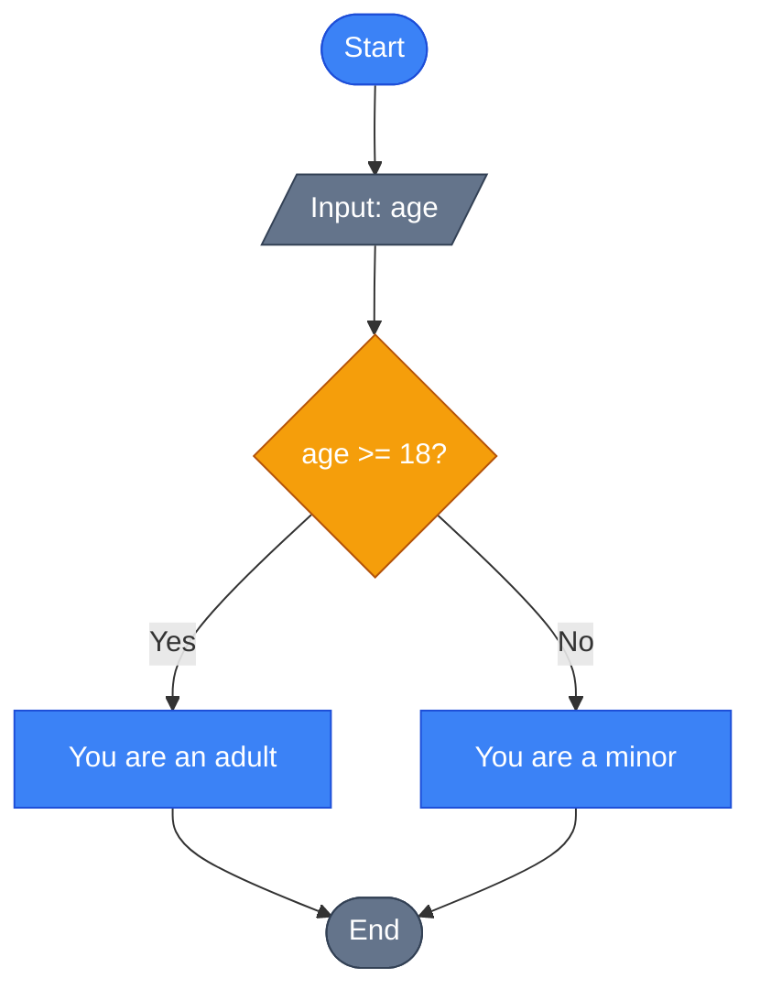
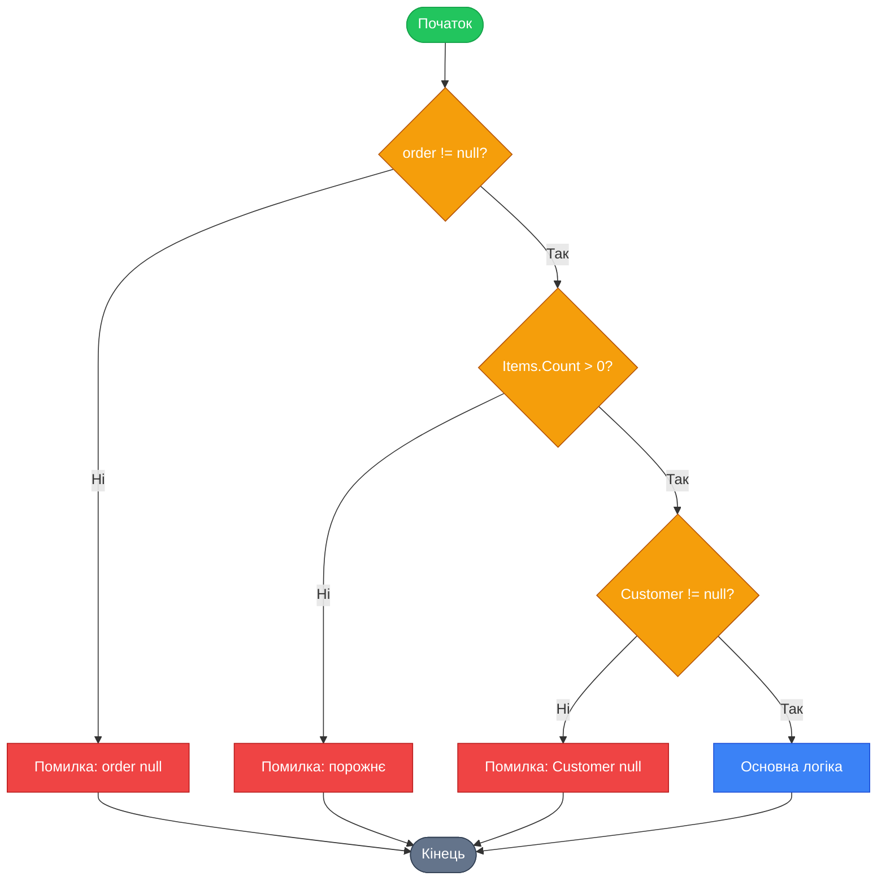
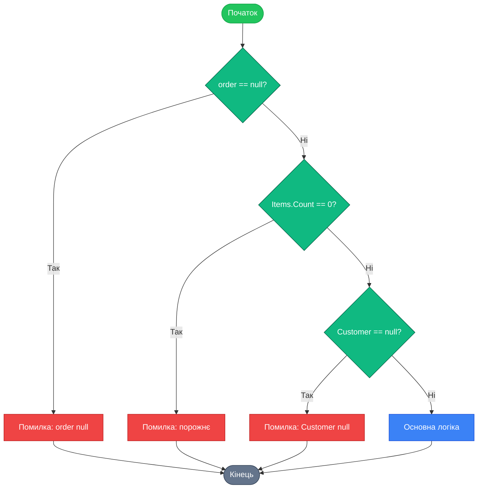
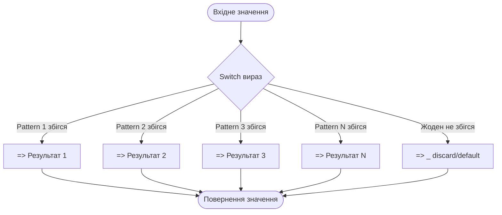

# Потік Керування (Control Flow)

## Вступ

Уявіть, що ви створюєте додаток для онлайн-магазину. Користувач додає товар до кошика, і програма має прийняти рішення: чи достатньо товару на складі? Якщо так — додати в кошик, якщо ні — показати повідомлення про відсутність. Далі програма має перевірити всі товари в кошику, обчислити загальну суму з урахуванням знижок та податків. Кожна з цих дій потребує **потоку керування** (control flow) — механізму, який визначає, які інструкції виконуються, в якому порядку та за яких умов.

Потік керування — це фундаментальна концепція програмування, яка дозволяє створювати динамічні та інтелектуальні програми. Без нього код виконувався б лише послідовно, рядок за рядком, що унеможливлювало б будь-яку складну логіку.

::note
**Потік керування (Control Flow)** — це порядок, у якому виконуються окремі інструкції, вирази або виклики функцій у програмі. Він визначається за допомогою умовних операторів, циклів та операторів переходу. Докладніше у [офіційній документації](https://learn.microsoft.com/en-us/dotnet/csharp/programming-guide/statements-expressions-operators/statements).
::

### Що ви дізнаєтесь

У цьому розділі ви опануєте:

-   **Умовні оператори** для прийняття рішень (`if`, `else`, `switch`, тернарний оператор)
-   **Цикли** для повторення дій (`for`, `foreach`, `while`, `do-while`)
-   **Оператори переходу** для контролю виконання (`break`, `continue`, `return`)
-   **Зіставлення шаблонів** у `switch` виразах для елегантної обробки складних умов

### Передумови

Перед вивченням цього розділу рекомендується ознайомитися з:

-   [Змінні та типи даних](/csharp/variables-data-types)
-   [Базовий синтаксис C#](/csharp/program-structure)
-   Булеві вирази та оператори порівняння

---

## Умовні Оператори

Умовні оператори дозволяють програмі приймати рішення на основі певних умов. Це фундамент логіки будь-якої програми.

### Оператор [`if`](https://learn.microsoft.com/en-us/dotnet/csharp/language-reference/statements/selection-statements#the-if-statement)

Найпростіший спосіб виконати код залежно від умови — це оператор `if`.

**Синтаксис:**

```csharp showLineNumbers
if (умова)
{
    // Код, що виконується, якщо умова істинна
}
```

**Приклад:**

```csharp showLineNumbers
int temperature = 25;

if (temperature > 20)
{
    Console.WriteLine("Сьогодні тепло!");
}
```

::tip
Завжди використовуйте фігурні дужки `{}` навіть для однорядкових блоків коду. Це покращує читабельність та запобігає помилкам при подальшому редагуванні коду.
::

### Оператор [`if-else`](https://learn.microsoft.com/en-us/dotnet/csharp/language-reference/statements/selection-statements#the-if-statement)

Для обробки альтернативного сценарію використовується `else`:

```csharp showLineNumbers
int age = 16;

if (age >= 18)
{
    Console.WriteLine("Ви можете голосувати.");
}
else
{
    Console.WriteLine("Ви ще не досягли віку для голосування.");
}
```

### Оператор `else if`

Для перевірки кількох умов послідовно:

```csharp showLineNumbers
int score = 85;

if (score >= 90)
{
    Console.WriteLine("Оцінка: Відмінно");
}
else if (score >= 75)
{
    Console.WriteLine("Оцінка: Добре");
}
else if (score >= 60)
{
    Console.WriteLine("Оцінка: Задовільно");
}
else
{
    Console.WriteLine("Оцінка: Незадовільно");
}
```

### Вкладені умовні оператори

Умовні оператори можна вкладати один в одного:

```csharp showLineNumbers
int temperature = 22;
bool isRaining = false;

if (temperature > 20)
{
    if (isRaining)
    {
        Console.WriteLine("Тепло, але дощить. Візьміть парасольку!");
    }
    else
    {
        Console.WriteLine("Чудова погода для прогулянки!");
    }
}
else
{
    Console.WriteLine("Холодно. Одягніться тепліше.");
}
```

::warning
Надмірне вкладання умовних операторів (більше 2-3 рівнів) погіршує читабельність коду. Розгляньте можливість рефакторингу через раннє повернення (early return) або винесення логіки в окремі методи.
::

### [Тернарний Оператор](https://learn.microsoft.com/en-us/dotnet/csharp/language-reference/operators/conditional-operator)

Тернарний оператор `?:` — це скорочена форма `if-else`, яка повертає значення:

**Синтаксис:**

```csharp showLineNumbers
умова ? значення_якщо_істина : значення_якщо_хиба
```

**Приклад:**

```csharp showLineNumbers
int age = 20;
string status = age >= 18 ? "Дорослий" : "Неповнолітній";
Console.WriteLine(status); // Виведе: Дорослий
```

::code-group

```csharp [З використанням if-else]
int number = 42;
string result;

if (number % 2 == 0)
{
    result = "Парне";
}
else
{
    result = "Непарне";
}
```

```csharp [З тернарним оператором]
int number = 42;
string result = number % 2 == 0 ? "Парне" : "Непарне";
```

::

::tip
Використовуйте тернарний оператор для простих умов, які повертають значення. Для складної логіки краще використовувати звичайний `if-else` для покращення читабельності.
::

### Оператор [`switch`](https://learn.microsoft.com/en-us/dotnet/csharp/language-reference/statements/selection-statements#the-switch-statement)

Оператор `switch` використовується для багатоваріантного вибору на основі значення виразу.

**Синтаксис:**

```csharp showLineNumbers
switch (вираз)
{
    case значення1:
        // Код для значення1
        break;
    case значення2:
        // Код для значення2
        break;
    default:
        // Код за замовчуванням
        break;
}
```

**Приклад:**

```csharp showLineNumbers
int dayOfWeek = 3;

switch (dayOfWeek)
{
    case 1:
        Console.WriteLine("Понеділок");
        break;
    case 2:
        Console.WriteLine("Вівторок");
        break;
    case 3:
        Console.WriteLine("Середа");
        break;
    case 4:
        Console.WriteLine("Четвер");
        break;
    case 5:
        Console.WriteLine("П'ятниця");
        break;
    case 6:
        Console.WriteLine("Субота");
        break;
    case 7:
        Console.WriteLine("Неділя");
        break;
    default:
        Console.WriteLine("Некоректний день тижня");
        break;
}
```

#### Множинні мітки `case`

Можна об'єднувати кілька міток `case` для виконання одного блоку коду:

```csharp showLineNumbers
int dayOfWeek = 6;

switch (dayOfWeek)
{
    case 1:
    case 2:
    case 3:
    case 4:
    case 5:
        Console.WriteLine("Робочий день");
        break;
    case 6:
    case 7:
        Console.WriteLine("Вихідний");
        break;
    default:
        Console.WriteLine("Некоректний день");
        break;
}
```

::note
У C# немає "провалювання" (fall-through) між блоками `case`, як у деяких інших мовах. Кожен `case` має закінчуватися оператором `break`, `return`, `goto` або `throw`.
::

### Порівняння умовних конструкцій

| Конструкція        | Коли використовувати                            | Переваги                             | Недоліки                           |
| :----------------- | :---------------------------------------------- | :----------------------------------- | :--------------------------------- |
| `if-else`          | Умови на основі булевих виразів, складна логіка | Універсальність, зрозумілість        | Багато коду для простих випадків   |
| Тернарний оператор | Прості умови з поверненням значення             | Компактність                         | Погана читабельність при вкладанні |
| `switch`           | Перевірка одного виразу на множину значень      | Читабельність для багатьох варіантів | Обмежений тип виразу (до C# 7)     |
| `switch` вираз     | Як `switch`, але з поверненням значення         | Компактність, pattern matching       | Потребує C# 8.0+                   |

---

## Цикли

Цикли дозволяють повторювати блок коду кілька разів. Це критично важливо для обробки колекцій, повторення дій та реалізації алгоритмів.

### Цикл [`for`](https://learn.microsoft.com/en-us/dotnet/csharp/language-reference/statements/iteration-statements#the-for-statement)

Цикл `for` використовується, коли кількість ітерацій відома заздалегідь.

**Синтаксис:**

```csharp showLineNumbers
for (ініціалізація; умова; ітератор)
{
    // Код, що повторюється
}
```

**Компоненти:**

-   **Ініціалізація**: виконується один раз перед початком циклу
-   **Умова**: перевіряється перед кожною ітерацією
-   **Ітератор**: виконується після кожної ітерації

**Приклад:**

```csharp showLineNumbers
for (int i = 0; i < 5; i++)
{
    Console.WriteLine($"Ітерація: {i}");
}
// Виведе:
// Ітерація: 0
// Ітерація: 1
// Ітерація: 2
// Ітерація: 3
// Ітерація: 4
```

#### Множинні вирази в `for`

Можна використовувати кілька змінних:

```csharp showLineNumbers
for (int i = 0, j = 10; i < j; i++, j--)
{
    Console.WriteLine($"i = {i}, j = {j}");
}
```

::tip
Цикл `for` ідеально підходить для роботи з масивами, коли потрібен доступ до індексу елемента.
::

### Цикл [`foreach`](https://learn.microsoft.com/en-us/dotnet/csharp/language-reference/statements/iteration-statements#the-foreach-statement)

Цикл `foreach` використовується для ітерації по колекціях без необхідності маніпулювати індексом.

**Синтаксис:**

```csharp showLineNumbers
foreach (тип змінна in колекція)
{
    // Код, що використовує змінну
}
```

**Приклад:**

```csharp showLineNumbers
string[] fruits = { "Яблуко", "Банан", "Апельсин", "Груша" };

foreach (string fruit in fruits)
{
    Console.WriteLine($"Фрукт: {fruit}");
}
```

#### Неявна типізація з `var`

Компілятор може автоматично визначити тип:

```csharp showLineNumbers
var numbers = new[] { 1, 2, 3, 4, 5 };

foreach (var number in numbers)
{
    Console.WriteLine(number * 2);
}
```

::note
Цикл `foreach` працює з будь-яким типом, що реалізує інтерфейс `IEnumerable` або `IEnumerable<T>`. Елементи колекції доступні лише для читання всередині циклу.
::

::code-group

```csharp [for - з індексом]
int[] numbers = { 10, 20, 30, 40, 50 };

for (int i = 0; i < numbers.Length; i++)
{
    Console.WriteLine($"Індекс {i}: {numbers[i]}");
}
```

```csharp [foreach - без індексу]
int[] numbers = { 10, 20, 30, 40, 50 };

foreach (int number in numbers)
{
    Console.WriteLine($"Значення: {number}");
}
```

::

### Цикл [`while`](https://learn.microsoft.com/en-us/dotnet/csharp/language-reference/statements/iteration-statements#the-while-statement)

Цикл `while` виконується доки умова істинна. Він використовується, коли кількість ітерацій невідома наперед.

**Синтаксис:**

```csharp showLineNumbers
while (умова)
{
    // Код, що повторюється
}
```

**Приклад:**

```csharp showLineNumbers
int count = 0;

while (count < 5)
{
    Console.WriteLine($"Лічильник: {count}");
    count++;
}
```

::warning
**Остерігайтесь нескінченних циклів!** Переконайтеся, що умова циклу `while` колись стане хибною, інакше програма зависне.

```csharp
// НЕ РОБІТЬ ТАК!
while (true)
{
    // Цей код виконуватиметься вічно
}
```

::

### Цикл [`do-while`](https://learn.microsoft.com/en-us/dotnet/csharp/language-reference/statements/iteration-statements#the-do-statement)

Цикл `do-while` схожий на `while`, але **гарантує виконання тіла циклу принаймні один раз**, оскільки умова перевіряється після виконання блоку коду.

**Синтаксис:**

```csharp showLineNumbers
do
{
    // Код, що повторюється
} while (умова);
```

**Приклад:**

```csharp showLineNumbers
int userInput;

do
{
    Console.Write("Введіть число більше 0: ");
    userInput = int.Parse(Console.ReadLine());
} while (userInput <= 0);

Console.WriteLine($"Ви ввели: {userInput}");
```

::code-group

```csharp [while - може не виконатися]
int count = 10;

while (count < 5)
{
    Console.WriteLine(count);
    count++;
}
// Код не виконається жодного разу
```

```csharp [do-while - виконається мінімум 1 раз]
int count = 10;

do
{
    Console.WriteLine(count);
    count++;
} while (count < 5);
// Виведе: 10 (один раз)
```

::

### Порівняння типів циклів

| Тип циклу  | Коли використовувати                                 | Особливості                                            |
| :--------- | :--------------------------------------------------- | :----------------------------------------------------- |
| `for`      | Кількість ітерацій відома, потрібен індекс           | Компактний синтаксис, ініціалізація + умова + ітератор |
| `foreach`  | Ітерація по колекції без індексу                     | Найпростіший синтаксис, лише для читання               |
| `while`    | Кількість ітерацій невідома, перевірка в початку     | Умова перевіряється перед виконанням                   |
| `do-while` | Те саме що `while`, але потрібне мінімум 1 виконання | Умова перевіряється після виконання                    |

### Візуалізація виконання циклів

::mermaid



::

---

## Оператори Переходу

Оператори переходу (jump statements) дозволяють змінювати нормальний потік виконання програми. Вони можуть переривати цикли, пропускати ітерації або виходити з методів.

### Оператор [`break`](https://learn.microsoft.com/en-us/dotnet/csharp/language-reference/statements/jump-statements#the-break-statement)

Оператор `break` припиняє виконання найближчого циклу або оператора `switch`.

**Використання в циклі:**

```csharp showLineNumbers
for (int i = 0; i < 10; i++)
{
    if (i == 5)
    {
        break; // Вихід з циклу при i = 5
    }
    Console.WriteLine(i);
}
// Виведе: 0 1 2 3 4
```

**Використання у вкладених циклах:**

```csharp showLineNumbers
for (int i = 0; i < 3; i++)
{
    for (int j = 0; j < 3; j++)
    {
        if (j == 1)
        {
            break; // Виходить лише з внутрішнього циклу
        }
        Console.WriteLine($"i={i}, j={j}");
    }
}
```

::note
`break` припиняє лише найближчий цикл або `switch`. Для виходу з кількох вкладених циклів використовуйте прапорець (flag) або винесіть код у метод з `return`.
::

### Оператор [`continue`](https://learn.microsoft.com/en-us/dotnet/csharp/language-reference/statements/jump-statements#the-continue-statement)

Оператор `continue` пропускає решту коду в поточній ітерації циклу та переходить до наступної ітерації.

```csharp showLineNumbers
for (int i = 0; i < 10; i++)
{
    if (i % 2 == 0)
    {
        continue; // Пропустити парні числа
    }
    Console.WriteLine(i);
}
// Виведе: 1 3 5 7 9
```

**Практичний приклад:**

```csharp showLineNumbers
string[] files = { "document.txt", "image.png", "data.csv", "photo.jpg", "report.txt" };

foreach (string file in files)
{
    if (!file.EndsWith(".txt"))
    {
        continue; // Пропустити файли, що не є текстовими
    }
    Console.WriteLine($"Обробка текстового файлу: {file}");
}
// Виведе:
// Обробка текстового файлу: document.txt
// Обробка текстового файлу: report.txt
```

::tip
Використовуйте `continue` для покращення читабельності коду, щоб уникнути глибокого вкладання умовних операторів у циклах.
::

### Оператор [`return`](https://learn.microsoft.com/en-us/dotnet/csharp/language-reference/statements/jump-statements#the-return-statement)

Оператор `return` припиняє виконання методу та повертає керування викликаючому коду. Він може повертати значення або бути порожнім (для методів типу `void`).

**Повернення значення:**

```csharp showLineNumbers
int Add(int a, int b)
{
    return a + b; // Повертає суму
}

int result = Add(5, 3); // result = 8
```

**Використання для раннього виходу (Guard Clauses):**

**Guard Clauses** (охоронні вирази) — це техніка програмування, яка полягає у використанні раннього повернення (`early return`) для перевірки умов та виходу з методу при помилкових або небажаних умовах. Ця практика покращує читабельність коду, зменшує вкладеність та робить логіку програми більш зрозумілою.

### Принцип Guard Clauses

Guard Clauses діють за принципом "захисту" основної логіки методу від некоректних вхідних даних або станів. Вони розміщуються на початку методу та виконують перевірки, які дозволяють швидко вийти з методу, якщо умови не відповідають вимогам.

### Переваги використання Guard Clauses

1. **Зменшення вкладеності** - уникнення глибокого вкладання `if-else` блоків
2. **Покращення читабельності** - основна логіка методу стає більш видимою
3. **Швидке виявлення помилок** - проблеми виявляються на самому початку виконання
4. **Спрощення тестування** - окремі умови легше тестувати незалежно
5. **Дотримання принципу "ранньої валідації"** - перевірка вхідних даних перед початком обробки

### Приклади Guard Clauses у C#

#### Приклад 1: Проста валідація параметрів

**До (з вкладеними умовами):**

```csharp showLineNumbers
void ProcessOrder(Order order)
{
    if (order != null)
    {
        if (order.Items.Count > 0)
        {
            if (order.Customer != null)
            {
                // Основна логіка обробки замовлення
                Console.WriteLine($"Обробка замовлення {order.Id} для клієнта {order.Customer.Name}");
                // ... складна логіка обробки
            }
            else
            {
                Console.WriteLine("Помилка: клієнт відсутній");
            }
        }
        else
        {
            Console.WriteLine("Помилка: замовлення порожнє");
        }
    }
    else
    {
        Console.WriteLine("Помилка: замовлення відсутнє");
    }
}
```

**Після (з Guard Clauses):**

```csharp showLineNumbers
void ProcessOrder(Order order)
{
    // Guard Clauses - перевірка умов на початку методу
    if (order == null)
    {
        Console.WriteLine("Помилка: замовлення відсутнє");
        return;
    }

    if (order.Items.Count == 0)
    {
        Console.WriteLine("Помилка: замовлення порожнє");
        return;
    }

    if (order.Customer == null)
    {
        Console.WriteLine("Помилка: клієнт відсутній");
        return;
    }

    // Основна логіка обробки замовлення
    Console.WriteLine($"Обробка замовлення {order.Id} для клієнта {order.Customer.Name}");
    // ... складна логіка обробки
}
```

#### Приклад 2: Використання бібліотеки Light.GuardClauses

Для більш елегантної реалізації Guard Clauses можна використовувати спеціалізовані бібліотеки, такі як **Light.GuardClauses**.

**Встановлення бібліотеки:**

```bash
dotnet add package Light.GuardClauses
```

**Приклад з використанням бібліотеки:**

```csharp showLineNumbers
using Light.GuardClauses;

public class OrderProcessor
{
    private readonly IOrderRepository _orderRepository;
    private readonly ICustomerService _customerService;

    public OrderProcessor(IOrderRepository orderRepository, ICustomerService customerService)
    {
        // Guard Clauses для конструктора
        _orderRepository = orderRepository.MustNotBeNull();
        _customerService = customerService.MustNotBeNull();
    }

    public void ProcessOrder(Order order)
    {
        // Guard Clauses для параметрів методу
        order.MustNotBeNull();
        order.Items.MustNotBeNullOrEmpty();
        order.Customer.MustNotBeNull();

        // Додаткові перевірки
        order.Id.MustNotBeEmpty();
        order.TotalAmount.MustBeGreaterThan(0);

        // Основна логіка обробки
        var customer = _customerService.GetCustomer(order.Customer.Id);
        customer.MustNotBeNull();

        _orderRepository.Save(order);
        Console.WriteLine($"Замовлення {order.Id} успішно оброблено");
    }
}
```

#### Приклад 3: Складні умови з використанням switch виразів

```csharp showLineNumbers
public string ValidateUserInput(string input, int minLength, int maxLength)
{
    // Guard Clauses з використанням switch виразів
    return input switch
    {
        null => "Вхідне значення не може бути null",
        { Length: 0 } => "Вхідне значення не може бути порожнім",
        string s when s.Length < minLength => $"Довжина повинна бути не менше {minLength}",
        string s when s.Length > maxLength => $"Довжина повинна бути не більше {maxLength}",
        string s when s.Trim().Length == 0 => "Вхідне значення не може містити тільки пробіли",
        _ => "Валідація пройшла успішно"
    };
}
```

#### Приклад 4: Guard Clauses у асинхронних методах

```csharp showLineNumbers
public async Task<OrderResult> ProcessOrderAsync(Order order, CancellationToken cancellationToken = default)
{
    // Guard Clauses для асинхронних методів
    if (order == null)
        throw new ArgumentNullException(nameof(order), "Замовлення не може бути null");

    if (order.Items == null || !order.Items.Any())
        throw new ArgumentException("Замовлення повинно містити хоча б один товар", nameof(order));

    if (cancellationToken.IsCancellationRequested)
        throw new OperationCanceledException("Операція була скасована");

    try
    {
        // Асинхронна обробка замовлення
        var validationResult = await ValidateOrderAsync(order, cancellationToken);
        if (!validationResult.IsValid)
        {
            return new OrderResult { Success = false, Error = validationResult.ErrorMessage };
        }

        var processedOrder = await SaveOrderAsync(order, cancellationToken);
        return new OrderResult { Success = true, OrderId = processedOrder.Id };
    }
    catch (Exception ex)
    {
        _logger.LogError(ex, "Помилка під час обробки замовлення");
        throw;
    }
}
```

### Правила використання Guard Clauses

#### Коли використовувати Guard Clauses:

1. **На початку методу** - для перевірки вхідних параметрів
2. **Для валідації стану об'єкта** - перед виконанням операцій
3. **Для перевірки авторизації** - на початку методів, які вимагають прав доступу
4. **Для перевірки ресурсів** - наявність файлів, з'єднань, конфігурацій

#### Коли НЕ використовувати Guard Clauses:

1. **Для складних обчислень** - якщо перевірка вимагає значних витрат ресурсів
2. **Для необов'язкових перевірок** - якщо помилка не критична
3. **У властивостях** - може призвести до несподіваних виключень при доступі до властивостей

#### Найкращі практики:

1. **Розміщуйте Guard Clauses на початку методу**
2. **Використовуйте зрозумілі повідомлення про помилки**
3. **Групуйте пов'язані перевірки**
4. **Використовуйте спеціалізовані бібліотеки для спрощення**
5. **Дотримуйтесь єдиного стилю перевірок у всьому проекті**

### Візуальне порівняння підходів

#### Традиційний підхід (з вкладеними умовами):

::mermaid



::

#### Guard Clauses підхід (з раннім виходом):

::mermaid



::

#### Текстове представлення структури:

```
ProcessOrder()
├── if (order != null)
│   └── if (order.Items.Count > 0)
│       └── if (order.Customer != null)
│           └── [Основна логіка]  ← Глибока вкладеність
│       └── else
│           └── [Помилка Customer]
│   └── else
│       └── [Помилка Items]
└── else
    └── [Помилка order]
```

```
ProcessOrder()
├── if (order == null) → return [Помилка order]
├── if (order.Items.Count == 0) → return [Помилка Items]
├── if (order.Customer == null) → return [Помилка Customer]
└── [Основна логіка]  ← Пряма лінія виконання
```

### Порівняння підходів

| Аспект             | Традиційний підхід                   | Guard Clauses                 |
| ------------------ | ------------------------------------ | ----------------------------- |
| **Читабельність**  | Низька (глибока вкладеність)         | Висока (лінійна структура)    |
| **Підтримка**      | Складніше (багато рівнів вкладення)  | Простіше (очевидна структура) |
| **Тестування**     | Складніше (потрібні складніші тести) | Простіше (кожна умова окремо) |
| **Продуктивність** | Однакова                             | Однакова                      |
| **Обсяг коду**     | Більше                               | Менше                         |

### Висновки

Guard Clauses - це потужна техніка, яка допомагає писати чистіший, зрозуміліший та легший у супроводі код. Використовуючи цей підхід, ви:

-   Зменшуєте складність коду
-   Покращуєте його читабельність
-   Прискорюєте виявлення помилок
-   Спрощуєте процес тестування

Ця практика особливо корисна у великих проектах, де важлива підтримка коду та його розуміння командою розробників.

::tip
**Ранній вихід (Early Return)** з використанням Guard Clauses покращує читабельність, дозволяючи уникнути глибокого вкладання умовних операторів. Спочатку перевіряйте помилкові умови та виходьте, а потім обробляйте основну логіку.
::

### Порівняння операторів переходу

::steps

### `break`

Повністю виходить з циклу або `switch`. Виконання продовжується з наступного оператора після циклу.

::code-group

```csharp [Приклад]
for (int i = 0; i < 10; i++)
{
    if (i == 5) break;
    Console.Write(i + " ");
}
// Виведе: 0 1 2 3 4
```

::

### `continue`

Пропускає решту коду в поточній ітерації, але цикл продовжується. Переходить безпосередньо до наступної ітерації.

::code-group

```csharp [Приклад]
for (int i = 0; i < 10; i++)
{
    if (i == 5) continue;
    Console.Write(i + " ");
}
// Виведе: 0 1 2 3 4 6 7 8 9
```

::

### `return`

Виходить з усього методу, незалежно від циклів. Може повертати значення.

::code-group

```csharp [Приклад]
int FindFirst(int[] arr, int target)
{
    for (int i = 0; i < arr.Length; i++)
    {
        if (arr[i] == target)
        {
            return i; // Повертає індекс
        }
    }
    return -1; // Не знайдено
}
```

::

::

---

## Зіставлення Шаблонів у Switch Виразах

Починаючи з C# 8.0, мова отримала потужний функціонал [**зіставлення шаблонів** (pattern matching)](https://learn.microsoft.com/en-us/dotnet/csharp/fundamentals/functional/pattern-matching), який революціонізував роботу з умовною логікою. [Switch вирази (switch expressions)](https://learn.microsoft.com/en-us/dotnet/csharp/language-reference/operators/switch-expression) — це сучасна альтернатива традиційним операторам `switch`, яка є більш виразною та компактною.

### Еволюція: від оператора до виразу

::code-group

```csharp [Традиційний switch]
string GetSeasonName(int month)
{
    string season;

    switch (month)
    {
        case 12:
        case 1:
        case 2:
            season = "Зима";
            break;
        case 3:
        case 4:
        case 5:
            season = "Весна";
            break;
        case 6:
        case 7:
        case 8:
            season = "Літо";
            break;
        case 9:
        case 10:
        case 11:
            season = "Осінь";
            break;
        default:
            season = "Невідомо";
            break;
    }

    return season;
}
```

```csharp [Switch вираз (C# 8.0+)]
string GetSeasonName(int month) => month switch
{
    12 or 1 or 2 => "Зима",
    3 or 4 or 5 => "Весна",
    6 or 7 or 8 => "Літо",
    9 or 10 or 11 => "Осінь",
    _ => "Невідомо"
};
```

::

::note
**Switch вираз** — це компактна форма оператора `switch`, яка повертає значення. Основні відмінності:

-   Використовує `=>` замість `:` та `break`
-   Значення записується справа від `=>`
-   Це **вираз**, а не оператор, тому повертає значення
-   Використовує `_` (discard) замість `default`

::

### Основні типи шаблонів

#### Константні шаблони (Constant Patterns)

Перевірка на точну відповідність значенню:

```csharp showLineNumbers
string GetDayType(int day) => day switch
{
    6 => "Субота",
    7 => "Неділя",
    _ => "Робочий день"
};
```

#### Реляційні шаблони (Relational Patterns)

Використання операторів порівняння `<`, `>`, `<=`, `>=`:

```csharp showLineNumbers
string GetWaterState(int temperature) => temperature switch
{
    < 0 => "Лід",
    0 => "Точка замерзання",
    > 0 and < 100 => "Рідина",
    100 => "Точка кипіння",
    > 100 => "Пара",
    _ => "Невідомий стан"
};
```

#### Логічні шаблони (Logical Patterns)

Комбінування шаблонів за допомогою `and`, `or`, `not`:

```csharp showLineNumbers
bool IsWeekday(int day) => day switch
{
    >= 1 and <= 5 => true,
    6 or 7 => false,
    _ => throw new ArgumentException("Некоректний день")
};

string ClassifyAge(int age) => age switch
{
    < 0 => "Некоректний вік",
    >= 0 and < 13 => "Дитина",
    >= 13 and < 18 => "Підліток",
    >= 18 and < 65 => "Дорослий",
    >= 65 => "Пенсіонер"
};
```

#### Шаблони властивостей (Property Patterns)

Перевірка властивостей об'єктів:

```csharp showLineNumbers
public record Person(string Name, int Age);

string GetCategory(Person person) => person switch
{
    { Age: < 18 } => "Неповнолітній",
    { Age: >= 18, Name: "Admin" } => "Адміністратор",
    { Age: >= 18 } => "Дорослий користувач",
    _ => "Невідомо"
};
```

#### Позиційні шаблони (Positional Patterns)

Використання деконструкції для перевірки кортежів або типів з деконструктором:

```csharp showLineNumbers
public record Point(int X, int Y);

string GetQuadrant(Point point) => point switch
{
    (0, 0) => "Початок координат",
    (> 0, > 0) => "Перший квадрант",
    (< 0, > 0) => "Другий квадрант",
    (< 0, < 0) => "Третій квадрант",
    (> 0, < 0) => "Четвертий квадрант",
    (_, 0) => "На осі X",
    (0, _) => "На осі Y"
};
```

#### Discard Pattern

Використання `_` для ігнорування значень:

```csharp showLineNumbers
string GetInfo((string name, int age, string city) person) => person switch
{
    ("John", _, _) => "Це John, незалежно від віку та міста",
    (_, > 65, _) => "Пенсіонер",
    (_, _, "Kyiv") => "Житель Києва",
    _ => "Інший користувач"
};
```

### Застереження (Case Guards) з `when`

Додаткові умови для більш точного зіставлення:

```csharp showLineNumbers
decimal CalculateDiscount(int age, bool isMember) => (age, isMember) switch
{
    ( < 18, _) => 0.20m, // 20% для дітей
    ( >= 65, _) => 0.15m, // 15% для пенсіонерів
    (_, true) when age >= 18 && age < 65 => 0.10m, // 10% для членів
    _ => 0m // Без знижки
};
```

**Складніший приклад з `when`:**

```csharp showLineNumbers
public record Order(int ItemCount, decimal TotalPrice, bool IsPriority);

string GetShippingMethod(Order order) => order switch
{
    { IsPriority: true } => "Експрес доставка",
    { ItemCount: > 10, TotalPrice: > 1000 } => "Вантажна доставка",
    { TotalPrice: > 500 } when order.ItemCount <= 5 => "Стандартна доставка з упаковкою",
    { ItemCount: <= 3 } => "Кур'єрська служба",
    _ => "Звичайна пошта"
};
```

### Вичерпність (Exhaustiveness Checking)

Компілятор C# перевіряє, чи охоплюють шаблони всі можливі значення. Якщо ні, виникне попередження:

```csharp showLineNumbers
enum TrafficLight { Red, Yellow, Green }

// Попередження CS8509: Не всі значення охоплені
string GetAction(TrafficLight light) => light switch
{
    TrafficLight.Red => "Стоп",
    TrafficLight.Green => "Рух"
    // Відсутній Yellow!
};

// Правильна версія:
string GetActionCorrect(TrafficLight light) => light switch
{
    TrafficLight.Red => "Стоп",
    TrafficLight.Yellow => "Підготуватися",
    TrafficLight.Green => "Рух",
    _ => throw new ArgumentException("Невідомий сигнал")
};
```

### Порівняння: традиційний switch vs switch вираз

| Аспект                    | Традиційний `switch`            | Switch вираз       |
| :------------------------ | :------------------------------ | :----------------- |
| **Синтаксис**             | Оператор з `case`, `:`, `break` | Вираз з `=>`       |
| **Повернення значення**   | Потрібна окрема змінна          | Пряме повернення   |
| **Компактність**          | Багатослівний                   | Лаконічний         |
| **Pattern matching**      | Обмежений (C# 7+)               | Повна підтримка    |
| **Перевірка вичерпності** | Ні                              | Так (попередження) |
| **Версія C#**             | Всі версії                      | C# 8.0+            |

### Практичний приклад: обробка HTTP статусів

```csharp showLineNumbers
public record HttpResponse(int StatusCode, string Body);

string HandleResponse(HttpResponse response) => response switch
{
    { StatusCode: 200, Body: not null } => $"Успіх: {response.Body}",
    { StatusCode: 200, Body: null } => "Успіх, але немає даних",
    { StatusCode: >= 200 and < 300 } => "Успішна відповідь",
    { StatusCode: 400 } => "Поганий запит",
    { StatusCode: 401 } => "Не авторизовано",
    { StatusCode: 404 } => "Не знайдено",
    { StatusCode: >= 400 and < 500 } => "Помилка клієнта",
    { StatusCode: >= 500 } => "Помилка сервера",
    _ => "Невідомий статус"
};
```

::tip
Switch вирази особливо корисні для створення чистого, декларативного коду. Вони ідеально підходять для:

-   Маппінгу значень (value mapping)
-   Класифікації даних
-   Обробки складних умов на основі множини властивостей
-   Редюсерів у state management

::

::mermaid



::

---

## Найкращі Практики та Поширені Помилки

### Найкращі практики

::tip
**1. Уникайте глибокого вкладання**

Замість глибоко вкладених умов використовуйте ранній вихід:
::

::code-group

```csharp [❌ Погано - глибоке вкладання]
void ProcessUser(User user)
{
    if (user != null)
    {
        if (user.IsActive)
        {
            if (user.HasPermission)
            {
                // Основна логіка
            }
        }
    }
}
```

```csharp [✅ Добре - ранній вихід]
void ProcessUser(User user)
{
    if (user == null) return;
    if (!user.IsActive) return;
    if (!user.HasPermission) return;

    // Основна логіка
}
```

::

::tip
**2. Використовуйте правильний тип циклу**

-   `for` — коли потрібен індекс або конкретна кількість ітерацій
-   `foreach` — для простої ітерації по колекції
-   `while` — коли кількість ітерацій невідома
-   `do-while` — коли потрібне мінімум одне виконання

::

::tip
**3. Віддавайте перевагу switch виразам**

Для сучасного C# 8.0+ коду використовуйте switch вирази замість традиційних операторів `switch`, коли це доцільно.
::

::tip
**4. Використовуйте осмислені імена змінних у циклах**

::code-group

```csharp [❌ Погано]
foreach (var x in items)
{
    // Що таке x?
}
```

```csharp [✅ Добре]
foreach (var product in products)
{
    // Зрозуміло, що це продукт
}
```

::
::

### Поширені помилки

::warning
**Нескінченні цикли**

```csharp
// Помилка: лічильник не змінюється
int i = 0;
while (i < 10)
{
    Console.WriteLine(i);
    // Забули i++
}
```

**Вирішення:** Завжди перевіряйте, що умова циклу колись стане хибною.
::

::warning
**Зміна колекції під час ітерації**

```csharp
var numbers = new List<int> { 1, 2, 3, 4, 5 };

// Помилка: зміна списку під час ітерації
foreach (var num in numbers)
{
    if (num % 2 == 0)
    {
        numbers.Remove(num); // InvalidOperationException!
    }
}
```

**Вирішення:** Використовуйте `for` в зворотному порядку або створіть нову колекцію.

```csharp
// Правильно: ітерація у зворотному порядку
for (int i = numbers.Count - 1; i >= 0; i--)
{
    if (numbers[i] % 2 == 0)
    {
        numbers.RemoveAt(i);
    }
}
```

::

::warning
**Відсутність `break` у `switch`**

```csharp
// Помилка компіляції в C#
switch (value)
{
    case 1:
        Console.WriteLine("One");
        // Забули break - помилка компіляції!
    case 2:
        Console.WriteLine("Two");
        break;
}
```

**Вирішення:** Завжди додавайте `break`, `return` або `goto` в кінці кожного `case`.
::

::warning
**Неправильне використання `continue` та `break`**

```csharp
// Помилка: плутанина між continue та break
for (int i = 0; i < 10; i++)
{
    if (i == 5)
    {
        continue; // Пропускає лише 5
    }
    Console.WriteLine(i);
}
// Очікували вихід на 5, але отримали пропуск
```

**Розуміння:**

-   `break` — виходить з циклу
-   `continue` — пропускає поточну ітерацію

::

---

## Troubleshooting (Усунення помилок)

### Проблема 1: Condition is always true/false

**Симптом:** Попередження компілятора про завжди істинну або хибну умову.

```csharp
int x = 5;
if (x = 5) // Помилка: присвоєння замість порівняння
{
    // ...
}
```

**Вирішення:**

```csharp
int x = 5;
if (x == 5) // Правильно: оператор порівняння
{
    // ...
}
```

### Проблема 2: Unreachable code detected

**Симптом:** Код після `return`, `break` або безумовного переходу ніколи не виконується.

```csharp
int GetValue()
{
    return 42;
    Console.WriteLine("Це ніколи не виконається"); // Попередження
}
```

**Вирішення:** Видаліть недосяжний код або перегляньте логіку.

### Проблема 3: Не всі шляхи повертають значення

**Симптом:** Компілятор повідомляє, що метод не завжди повертає значення.

```csharp
int GetSign(int number)
{
    if (number > 0)
    {
        return 1;
    }
    else if (number < 0)
    {
        return -1;
    }
    // Що якщо number == 0?
}
```

**Вирішення:**

```csharp
int GetSign(int number)
{
    if (number > 0) return 1;
    if (number < 0) return -1;
    return 0; // Обробка всіх випадків
}
```

### Проблема 4: Off-by-one error у циклах

**Симптом:** Цикл виконується на одну ітерацію більше або менше, ніж очікувалось.

```csharp
int[] arr = { 1, 2, 3, 4, 5 };

// Помилка: IndexOutOfRangeException
for (int i = 0; i <= arr.Length; i++) // Повинно бути <, а не <=
{
    Console.WriteLine(arr[i]);
}
```

**Вирішення:**

```csharp
for (int i = 0; i < arr.Length; i++) // Правильно
{
    Console.WriteLine(arr[i]);
}
```

---

## Практичні Завдання

### Рівень 1: Базовий

::steps

### Завдання 1.1: Парність числа

Напишіть програму, яка запитує у користувача ціле число та визначає, чи є воно парним або непарним, використовуючи оператор `if-else`.

::collapsible{title="Підказка"}
Використовуйте оператор остачі від ділення `%`. Якщо `number % 2 == 0`, число парне.
::

::collapsible{title="Рішення"}

```csharp showLineNumbers
Console.Write("Введіть ціле число: ");
int number = int.Parse(Console.ReadLine());

if (number % 2 == 0)
{
    Console.WriteLine($"{number} є парним числом.");
}
else
{
    Console.WriteLine($"{number} є непарним числом.");
}
```

::

### Завдання 1.2: Сума чисел від 1 до N

Напишіть програму, яка обчислює суму всіх цілих чисел від 1 до N (включно) за допомогою циклу `for`.

::collapsible{title="Підказка"}
Використовуйте змінну-накопичувач для зберігання суми.
::

::collapsible{title="Рішення"}

```csharp showLineNumbers
Console.Write("Введіть число N: ");
int n = int.Parse(Console.ReadLine());

int sum = 0;

for (int i = 1; i <= n; i++)
{
    sum += i;
}

Console.WriteLine($"Сума чисел від 1 до {n} = {sum}");
```

::

### Завдання 1.3: Виведення масиву

Створіть масив з 5 елементів та виведіть всі його елементи за допомогою циклу `foreach`.

::collapsible{title="Рішення"}

```csharp showLineNumbers
int[] numbers = { 10, 20, 30, 40, 50 };

Console.WriteLine("Елементи масиву:");

foreach (int number in numbers)
{
    Console.WriteLine(number);
}
```

::

::

### Рівень 2: Середній

::steps

### Завдання 2.1: Калькулятор з switch

Створіть простий калькулятор, який приймає два числа та оператор (+, -, \*, /) і виконує відповідну операцію, використовуючи `switch` вираз.

::collapsible{title="Підказка"}
Використовуйте `switch` вираз для визначення операції на основі введеного оператора.
::

::collapsible{title="Рішення"}

```csharp showLineNumbers
Console.Write("Введіть перше число: ");
double num1 = double.Parse(Console.ReadLine());

Console.Write("Введіть оператор (+, -, *, /): ");
string op = Console.ReadLine();

Console.Write("Введіть друге число: ");
double num2 = double.Parse(Console.ReadLine());

double result = op switch
{
    "+" => num1 + num2,
    "-" => num1 - num2,
    "*" => num1 * num2,
    "/" when num2 != 0 => num1 / num2,
    "/" => throw new DivideByZeroException("Ділення на нуль!"),
    _ => throw new InvalidOperationException("Невідомий оператор")
};

Console.WriteLine($"Результат: {num1} {op} {num2} = {result}");
```

::

### Завдання 2.2: Таблиця множення

Напишіть програму, яка виводить таблицю множення для числа від 1 до 10, використовуючи вкладені цикли `for`.

::collapsible{title="Рішення"}

```csharp showLineNumbers
for (int i = 1; i <= 10; i++)
{
    for (int j = 1; j <= 10; j++)
    {
        Console.Write($"{i * j,4}"); // Форматування з вирівнюванням
    }
    Console.WriteLine(); // Новий рядок після кожного ряду
}
```

::

### Завдання 2.3: Пошук простих чисел

Напишіть програму, яка знаходить всі прості числа від 2 до N. Використовуйте оператори `continue` або `break` для оптимізації.

::collapsible{title="Підказка"}
Просте число ділиться тільки на 1 та на саме себе. Для перевірки достатньо перевірити дільники до √N.
::

::collapsible{title="Рішення"}

```csharp showLineNumbers
Console.Write("Введіть число N: ");
int n = int.Parse(Console.ReadLine());

Console.WriteLine($"Прості числа від 2 до {n}:");

for (int i = 2; i <= n; i++)
{
    bool isPrime = true;

    for (int j = 2; j * j <= i; j++)
    {
        if (i % j == 0)
        {
            isPrime = false;
            break; // Знайшли дільник - не просте
        }
    }

    if (isPrime)
    {
        Console.Write(i + " ");
    }
}

Console.WriteLine();
```

::

::

### Рівень 3: Просунутий

::steps

### Завдання 3.1: Pattern Matching для класифікації фігур

Створіть ієрархію класів для геометричних фігур (коло, прямокутник, трикутник) та напишіть метод, який використовує pattern matching для обчислення площі.

::collapsible{title="Рішення"}

```csharp showLineNumbers
public abstract record Shape;
public record Circle(double Radius) : Shape;
public record Rectangle(double Width, double Height) : Shape;
public record Triangle(double Base, double Height) : Shape;

public class ShapeCalculator
{
    public static double CalculateArea(Shape shape) => shape switch
    {
        Circle { Radius: var r } => Math.PI * r * r,
        Rectangle { Width: var w, Height: var h } => w * h,
        Triangle { Base: var b, Height: var h } => 0.5 * b * h,
        _ => throw new ArgumentException("Невідомий тип фігури")
    };

    public static string GetDescription(Shape shape) => shape switch
    {
        Circle { Radius: < 5 } => "Маленьке коло",
        Circle { Radius: >= 5 and < 10 } => "Середнє коло",
        Circle { Radius: >= 10 } => "Велике коло",
        Rectangle { Width: var w, Height: var h } when w == h => "Квадрат",
        Rectangle => "Прямокутник",
        Triangle => "Трикутник",
        _ => "Невідома фігура"
    };
}

// Використання:
var shapes = new Shape[]
{
    new Circle(5),
    new Rectangle(4, 6),
    new Triangle(3, 4),
    new Rectangle(5, 5)
};

foreach (var shape in shapes)
{
    double area = ShapeCalculator.CalculateArea(shape);
    string description = ShapeCalculator.GetDescription(shape);
    Console.WriteLine($"{description}: Площа = {area:F2}");
}
```

::

### Завдання 3.2: Оптимізація пошуку в масиві

Напишіть метод бінарного пошуку в відсортованому масиві. Використовуйте цикл `while` та оператори переходу для ефективного пошуку.

::collapsible{title="Підказка"}
Бінарний пошук працює, поділяючи діапазон пошуку навпіл на кожній ітерації.
::

::collapsible{title="Рішення"}

```csharp showLineNumbers
public class BinarySearch
{
    public static int Search(int[] sortedArray, int target)
    {
        int left = 0;
        int right = sortedArray.Length - 1;

        while (left <= right)
        {
            int mid = left + (right - left) / 2;

            if (sortedArray[mid] == target)
            {
                return mid; // Знайдено
            }

            if (sortedArray[mid] < target)
            {
                left = mid + 1; // Шукаємо в правій половині
            }
            else
            {
                right = mid - 1; // Шукаємо в лівій половині
            }
        }

        return -1; // Не знайдено
    }
}

// Використання:
int[] numbers = { 2, 5, 8, 12, 16, 23, 38, 45, 56, 67, 78 };
int target = 23;

int index = BinarySearch.Search(numbers, target);

if (index != -1)
{
    Console.WriteLine($"Елемент {target} знайдено на індексі {index}");
}
else
{
    Console.WriteLine($"Елемент {target} не знайдено");
}
```

::

### Завдання 3.3: Складний switch вираз для обробки HTTP запитів

Створіть систему обробки HTTP запитів з використанням pattern matching для маршрутизації та обробки різних типів запитів.

::collapsible{title="Рішення"}

```csharp showLineNumbers
public record HttpRequest(string Method, string Path, Dictionary<string, string> Headers);

public class RequestHandler
{
    public static string HandleRequest(HttpRequest request) => request switch
    {
        // API ендпоінти
        { Method: "GET", Path: "/api/users" } => GetAllUsers(),
        { Method: "GET", Path: var p } when p.StartsWith("/api/users/")
            => GetUserById(ExtractId(p)),
        { Method: "POST", Path: "/api/users" } => CreateUser(),
        { Method: "PUT", Path: var p } when p.StartsWith("/api/users/")
            => UpdateUser(ExtractId(p)),
        { Method: "DELETE", Path: var p } when p.StartsWith("/api/users/")
            => DeleteUser(ExtractId(p)),

        // Статичні ресурси
        { Path: var p } when p.EndsWith(".css") => ServeStaticFile(p, "text/css"),
        { Path: var p } when p.EndsWith(".js") => ServeStaticFile(p, "application/javascript"),
        { Path: var p } when p.EndsWith(".html") => ServeStaticFile(p, "text/html"),

        // Особливі випадки
        { Headers: var h } when h.ContainsKey("Authorization") && !IsAuthorized(h)
            => "401 Unauthorized",
        { Method: "OPTIONS" } => HandleOptionsRequest(),

        // За замовчуванням
        _ => "404 Not Found"
    };

    private static string ExtractId(string path) => path.Split('/').Last();
    private static string GetAllUsers() => "Список всіх користувачів";
    private static string GetUserById(string id) => $"Користувач з ID: {id}";
    private static string CreateUser() => "Створено нового користувача";
    private static string UpdateUser(string id) => $"Оновлено користувача {id}";
    private static string DeleteUser(string id) => $"Видалено користувача {id}";
    private static string ServeStaticFile(string path, string contentType)
        => $"Serving {path} as {contentType}";
    private static string HandleOptionsRequest() => "CORS headers sent";
    private static bool IsAuthorized(Dictionary<string, string> headers) => true;
}

// Використання:
var requests = new[]
{
    new HttpRequest("GET", "/api/users", new()),
    new HttpRequest("GET", "/api/users/123", new()),
    new HttpRequest("POST", "/api/users", new()),
    new HttpRequest("GET", "/styles/main.css", new()),
    new HttpRequest("GET", "/unknown", new())
};

foreach (var request in requests)
{
    string response = RequestHandler.HandleRequest(request);
    Console.WriteLine($"{request.Method} {request.Path} => {response}");
}
```

::

::

---

## Резюме

У цьому розділі ви вивчили **потік керування** (control flow) — фундаментальні механізми, які дозволяють програмам приймати рішення та повторювати дії:

**Умовні оператори:**

-   `if`, `else`, `else if` для базових умовних розгалужень
-   Тернарний оператор `? :` для компактних умовних виразів
-   Оператор `switch` для множинного вибору
-   Сучасні switch вирази з pattern matching (C# 8.0+)

**Цикли:**

-   `for` — для фіксованої кількості ітерацій з доступом до індексу
-   `foreach` — для зручної ітерації по колекціях
-   `while` — для циклів з попередньою перевіркою умови
-   `do-while` — для циклів з гарантованим першим виконанням

**Оператори переходу:**

-   `break` — вихід з циклу або `switch`
-   `continue` — пропуск поточної ітерації циклу
-   `return` — вихід з методу з можливим поверненням значення

**Pattern Matching:**

-   Константні, реляційні, логічні шаблони
-   Шаблони властивостей та позиційні шаблони
-   Case guards з `when` для додаткових умов
-   Перевірка вичерпності компілятором

Опанування потоку керування — це ключ до написання ефективної та елегантної логіки програми. Практикуйте різні підходи, обирайте найбільш читабельні рішення та використовуйте сучасні можливості C# для створення чистого коду!


<!-- Search Query: control flow structures comparison diagram C# if switch loop flowchart -->
