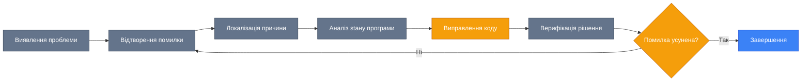
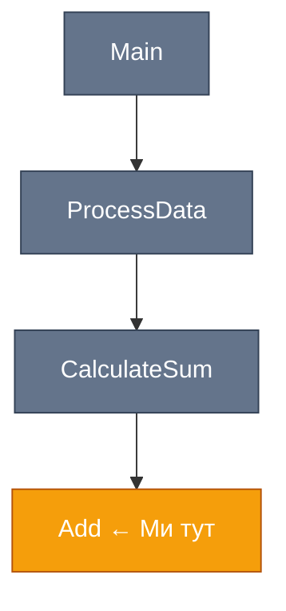

# Основи Відлагодження (Debugging Basics)

## Вступ та Контекст

Уявіть собі ситуацію: ваша програма компілюється без помилок, але при виконанні видає неочікуваний результат. Користувачі скаржаться, що їхні замовлення обробляються з неправильними цінами. Де саме виникає проблема? Яка змінна містить некоректне значення? У якій послідовності викликаються методи?

Саме для вирішення таких задач існує **відлагодження (debugging)** — процес виявлення та усунення помилок у коді. Відлагоджувач (debugger) — це потужний інструмент, який дозволяє зупиняти виконання програми, інспектувати стан змінних, покроково виконувати код та аналізувати потік виконання.

::note
**Цікавий факт**: Термін "bug" (помилка) у програмуванні з'явився у 1947 році, коли інженери знайшли справжнього метелика, який застряг у реле комп'ютера Harvard Mark II і викликав несправність. Звідти й пішла назва "debugging" — "видалення метеликів".
::

### Що ви отримаєте

Після вивчення цього розділу ви зможете:

-   Ефективно використовувати **breakpoints** (точки зупинки) для аналізу коду
-   Інспектувати змінні через **Locals**, **Watch** та **Call Stack** вікна
-   Навігувати по коду за допомогою **Step Into**, **Step Over** та **Step Out**
-   Виконувати код "на льоту" через **Immediate Window**
-   Швидко діагностувати та виправляти типові помилки

### Передумови

Для роботи з цим розділом вам необхідно:

-   Встановлене середовище розробки (Visual Studio або Visual Studio Code з C# Dev Kit)
-   Базове розуміння синтаксису C# (змінні, методи, класи)
-   Знання про типи даних та control flow

---

## Фундаментальні Концепції

### Що таке відлагодження?

[**Відлагодження (Debugging)**](https://learn.microsoft.com/en-us/visualstudio/debugger/debugger-feature-tour) — це систематичний процес виявлення, локалізації та усунення помилок (bugs) у програмному коді. Це не просто "виправлення того, що не працює", а наукова методика аналізу поведінки програми на різних рівнях абстракції.

### Життєвий цикл відлагодження

::mermaid



::

### Visual Studio Debugger

Visual Studio надає один з найпотужніших відлагоджувачів для .NET розробки. Він інтегрований безпосередньо в IDE та підтримує:

-   **Interactive debugging**: Зупинка виконання в будь-який момент
-   **Data inspection**: Перегляд та модифікація змінних у реальному часі
-   **Navigation**: Покрокове виконання коду з повним контролем
-   **Expression evaluation**: Виконання C# виразів під час паузи

---

## Breakpoints (Точки Зупинки)

[**Breakpoint**](https://learn.microsoft.com/en-us/visualstudio/debugger/using-breakpoints) — це маркер у коді, який інструктує відлагоджувач призупинити виконання програми у вказаному місці. Це найбазовіший та найважливіший інструмент відлагодження.

### Встановлення Breakpoints

::tabs
:::tab{label="Visual Studio"}
**Три способи встановити breakpoint:**

::steps

1. **Клік на полі (gutter)**: Клацніть лівою кнопкою миші на сірому полі ліворуч від номера рядка
2. **Клавіатурою**: Поставте курсор на потрібний рядок та натисніть `F9`
3. **Меню**: `Debug` → `Toggle Breakpoint`

::

Breakpoint візуально відображається як **червоне коло** на полі редактора.


<!-- Search Query: Visual Studio breakpoint red circle code editor -->

:::

:::tab{label="VS Code"}
**Встановлення breakpoint у VS Code:**

::steps

1. Клацніть на лівому полі редактора (ліворуч від номера рядка)
2. Або натисніть `F9` на потрібному рядку

::

Breakpoint відображається як червона крапка.


<!-- Search Query: VS Code C# breakpoint -->

:::
::

### Керування Breakpoints

::code-group

```csharp [Program.cs] showLineNumbers
using System;

class Program
{
    static void Main()
    {
        int sum = 0; // ← Breakpoint тут (рядок 7)

        for (int i = 1; i <= 5; i++)
        {
            sum += i; // ← Breakpoint тут (рядок 11)
            Console.WriteLine($"Ітерація {i}: sum = {sum}");
        }

        Console.WriteLine($"Підсумок: {sum}"); // ← Breakpoint тут (рядок 15)
    }
}
```

::

**Операції з breakpoints:**

| Дія                     | Visual Studio                                        | VS Code                    |
| :---------------------- | :--------------------------------------------------- | :------------------------- |
| Встановити/Видалити     | `F9`                                                 | `F9`                       |
| Видалити всі            | `Ctrl+Shift+F9`                                      | Через Debug панель         |
| Вимкнути (не видаляючи) | Правий клік → Disable                                | Правий клік → Disable      |
| Список всіх breakpoints | `Ctrl+Alt+B` або `Debug` → `Windows` → `Breakpoints` | Debug панель → Breakpoints |

::tip
**Порада**: Вимикайте breakpoints замість видалення, якщо плануєте користуватися ними пізніше. Це зберігає їх позиції та налаштування.
::

### Conditional Breakpoints (Умовні Точки Зупинки)

[**Conditional breakpoints**](https://learn.microsoft.com/en-us/visualstudio/debugger/using-breakpoints#BKMK_Specify_a_breakpoint_condition_using_a_code_expression) зупиняють виконання лише тоді, коли виконується певна умова. Це надзвичайно корисно для відлагодження циклів або рідкісних сценаріїв.

::code-group

```csharp [Example.cs] showLineNumbers
public class OrderProcessor
{
    public void ProcessOrders(List<Order> orders)
    {
        foreach (var order in orders)
        {
            decimal total = CalculateTotal(order); // [!code highlight]
            // Умовний breakpoint: total > 1000

            if (total > 0)
            {
                order.Status = "Processed";
            }
        }
    }

    private decimal CalculateTotal(Order order)
    {
        return order.Items.Sum(i => i.Price * i.Quantity);
    }
}
```

::

**Встановлення умовного breakpoint:**

::steps

1. Встановіть звичайний breakpoint на потрібному рядку
2. Правий клік на червоному колі breakpoint
3. Виберіть `Conditions...` (Visual Studio) або `Edit Breakpoint...` (VS Code)
4. Вкажіть умову, наприклад: `total > 1000` або `order.CustomerId == "VIP123"`
5. Натисніть `Enter` або `Close`

::

::code-group

```csharp [Conditional Expression]
// Зупинитися, коли сума перевищує 1000
total > 1000
```

```csharp [String Condition]
// Зупинитися для конкретного користувача
string.IsNullOrEmpty(name)
```

```csharp [Complex Condition]
// Зупинитися при комбінації умов
order.Status == "Pending" && order.Total > 500
```

::

::warning
**Застереження**: Умовні breakpoints впливають на продуктивність, оскільки відлагоджувач оцінює умову на кожній ітерації. Використовуйте їх обережно у циклах з великою кількістю ітерацій.
::

### Hit Count Breakpoints

**Hit Count breakpoints** зупиняють виконання після певної кількості проходжень через breakpoint.

**Приклад**: Зупинитися на 100-й ітерації циклу.

::steps

1. Правий клік на breakpoint
2. `Conditions...` → вкладка `Hit Count`
3. Виберіть умову (наприклад, "is equal to") та вкажіть число `100`

::

---

## Debugging Windows (Вікна Відлагодження)

Коли програма зупинена на breakpoint, Visual Studio надає кілька вікон для інспекції стану програми.

### Locals Window (Вікно Локальних Змінних)

[**Locals Window**](https://learn.microsoft.com/en-us/visualstudio/debugger/autos-and-locals-windows) автоматично відображає всі локальні змінні у поточному scope (області видимості), включаючи параметри методу.

::code-group

```csharp [Example.cs] showLineNumbers
public decimal CalculateDiscount(decimal price, int quantity)
{
    decimal subtotal = price * quantity; // ← Breakpoint тут
    decimal discount = 0;

    if (subtotal > 100)
    {
        discount = subtotal * 0.1m; // 10% знижка
    }

    return subtotal - discount;
}
```

::

**Що показує Locals Window на breakpoint (рядок 3):**

| Ім'я       | Значення | Тип       |
| :--------- | :------- | :-------- |
| `price`    | `25.50`  | `decimal` |
| `quantity` | `5`      | `int`     |
| `subtotal` | `127.50` | `decimal` |
| `discount` | `0`      | `decimal` |

::tabs
:::tab{label="Відкрити вікно"}
**Visual Studio:** `Debug` → `Windows` → `Locals` або `Ctrl+Alt+V, L`


<!-- Search Query: Visual Studio Locals Window debugging -->

:::

:::tab{label="Особливості"}

-   **Автоматичне оновлення**: Значення оновлюються при кожному кроці
-   **Розгортання об'єктів**: Клік на `▶` розгортає properties та fields
-   **Модифікація**: Можна змінювати значення прямо у вікні (double-click на значенні)
-   **Контекстна навігація**: `this` показує поточний екземпляр класу

:::

::

::tip
**Порада**: Червоним кольором у Locals Window виділяються змінні, значення яких змінилися після останнього кроку. Це допомагає швидко відстежувати зміни.
::

### Watch Window (Вікно Спостереження)

[**Watch Window**](https://learn.microsoft.com/en-us/visualstudio/debugger/watch-and-quickwatch-windows) дозволяє додавати власні вирази та змінні для постійного моніторингу, навіть якщо вони не входять у поточний scope.

**Відкрити:** `Debug` → `Windows` → `Watch` → `Watch 1` або `Ctrl+Alt+W, 1`

::code-group

```csharp [Example.cs] showLineNumbers
public class ShoppingCart
{
    private List<Item> items = new List<Item>();

    public void AddItem(Item item)
    {
        items.Add(item); // ← Breakpoint тут

        // Додайте у Watch:
        // items.Count
        // items.Sum(i => i.Price)
        // item.Name
    }
}
```

::

**Вирази для Watch Window:**

| Вираз                     | Опис                         |
| :------------------------ | :--------------------------- |
| `items.Count`             | Кількість елементів у списку |
| `items.Sum(i => i.Price)` | LINQ вираз для сумми цін     |
| `item.Name.Length`        | Довжина назви товару         |
| `DateTime.Now`            | Поточний час                 |


<!-- Search Query: Visual Studio Watch Window adding expressions animation -->

::note
**Примітка**: У Watch Window можна використовувати повноцінні C# вирази, включаючи виклики методів, LINQ запити та навіть створення нових об'єктів.
::

### Call Stack Window (Вікно Стека Викликів)

[**Call Stack**](https://learn.microsoft.com/en-us/visualstudio/debugger/how-to-use-the-call-stack-window) показує ланцюжок викликів методів, які привели до поточної точки виконання. Це критично важливо для розуміння контексту виконання.

::code-group

```csharp [CallStackExample.cs] showLineNumbers
class Program
{
    static void Main(string[] args)
    {
        ProcessData(); // [1] Точка входу
    }

    static void ProcessData()
    {
        var result = CalculateSum(10, 20); // [2] Виклик CalculateSum
        Console.WriteLine(result);
    }

    static int CalculateSum(int a, int b)
    {
        return Add(a, b); // [3] Виклик Add ← Breakpoint тут
    }

    static int Add(int x, int y)
    {
        return x + y; // [4] Поточне місце виконання
    }
}
```

::

**Call Stack на breakpoint (рядок 20):**

```
Add(int x, int y) Line 20          ← Поточний frame
CalculateSum(int a, int b) Line 15
ProcessData() Line 10
Main(string[] args) Line 5
[External Code]
```

**Відкрити:** `Debug` → `Windows` → `Call Stack` або `Ctrl+Alt+C`

::mermaid



::

**Використання Call Stack:**

::steps

1. **Навігація**: Double-click на будь-якому frame для переходу до цього місця в коді
2. **Контекст**: Кожен frame зберігає значення локальних змінних (видно в Locals Window)
3. **Аналіз потоку**: Розуміння, хто викликав поточний метод та з якими параметрами

::

::tip
**Порада**: Використовуйте Call Stack для швидкого переходу між рівнями методів без Step Out. Це економить години при відлагодженні глибоко вкладених викликів.
::

---

## Step-Through Debugging (Покрокове Виконання)

Після зупинки на breakpoint ви можете контролювати виконання коду по рядках.

### Основні Команди Навігації

::code-group

```csharp [StepExample.cs] showLineNumbers
public class Calculator
{
    public int Calculate(int a, int b)
    {
        int result = Add(a, b);     // [1] Breakpoint тут
        result = Multiply(result, 2); // [2]
        return result;                // [3]
    }

    private int Add(int x, int y)
    {
        return x + y;                 // [4]
    }

    private int Multiply(int x, int y)
    {
        return x * y;                 // [5]
    }
}
```

::

| Команда                                                                                                                            | Клавіша     | Опис                                         | Поведінка на рядку [1]                            |
| :--------------------------------------------------------------------------------------------------------------------------------- | :---------- | :------------------------------------------- | :------------------------------------------------ |
| [**Step Into**](https://learn.microsoft.com/en-us/visualstudio/debugger/navigating-through-code-with-the-debugger#step-into-code)  | `F11`       | Заходить всередину викликів методів          | Перехід всередину `Add()` → рядок [4]             |
| [**Step Over**](https://learn.microsoft.com/en-us/visualstudio/debugger/navigating-through-code-with-the-debugger#step-over-code)  | `F10`       | Виконує рядок повністю, не заходячи в методи | Виконує `Add()` цілком → рядок [2]                |
| [**Step Out**](https://learn.microsoft.com/en-us/visualstudio/debugger/navigating-through-code-with-the-debugger#step-out-of-code) | `Shift+F11` | Виконує до кінця поточного методу            | Виконує весь `Calculate()` → повернення до caller |
| **Continue**                                                                                                                       | `F5`        | Продовжує виконання до наступного breakpoint | Виконується до наступного breakpoint або кінця    |

### Практичний Сценарій

::steps
**Крок 1**: Встановіть breakpoint на рядку [1]

**Крок 2**: Запустіть відлагодження (`F5`)

**Крок 3**: Коли виконання зупиниться, використовуйте:

-   `F11` (Step Into) → заходимо в метод `Add()`
-   У методі `Add()` натисніть `F10` (Step Over) → виконується `return x + y`
-   `Shift+F11` (Step Out) → повертаємось до методу `Calculate()` на рядок [2]

::


<!-- Search Query: Visual Studio step into step over step out debugging animation -->

### Візуалізація Flow Execution

::mermaid

```mermaid
sequenceDiagram
    participant User
    participant Calculate
    participant Add
    participant Multiply

    User->>Calculate: Calculate(5, 3)
    Note over Calculate: Breakpoint на рядку [1]

    alt F11 (Step Into)
        Calculate->>Add: Add(5, 3)
        Note over Add: Заходимо всередину
        Add-->>Calculate: return 8
    end

    alt F10 (Step Over)
        Calculate->>Multiply: Multiply(8, 2)
        Note over Calculate: Виконується цілком
        Multiply-->>Calculate: return 16
    end

    alt Shift+F11 (Step Out)
        Calculate-->>User: return 16
        Note over User: Вихід з методу
    end

    style User fill:#3b82f6,stroke:#1d4ed8,color:#ffffff
    style Calculate fill:#64748b,stroke:#334155,color:#ffffff
    style Add fill:#f59e0b,stroke:#b45309,color:#ffffff
    style Multiply fill:#f59e0b,stroke:#b45309,color:#ffffff
```

::

::warning
**Важливо**: Step Into (`F11`) не працює з методами, для яких немає вихідного коду (наприклад, бібліотечні методи .NET). У такому разі він поводиться як Step Over.
::

### Run to Cursor (Виконати до Курсору)

**Run to Cursor** — це швидкий спосіб виконати код до певного рядка без встановлення breakpoint.

::steps

1. Під час паузи на breakpoint поставте курсор на потрібний рядок
2. Натисніть `Ctrl+F10` або правий клік → `Run to Cursor`
3. Виконання продовжиться до цього рядка

::

---

## Immediate Window (Вікно Негайного Виконання)

[**Immediate Window**](https://learn.microsoft.com/en-us/visualstudio/debugger/immediate-window) — це інтерактивна консоль, яка дозволяє виконувати C# вирази та команди під час паузи виконання.

**Відкрити:** `Debug` → `Windows` → `Immediate` або `Ctrl+Alt+I`

### Оцінка Виразів

::code-group

```csharp [ImmediateExample.cs] showLineNumbers
public void ProcessOrder(Order order)
{
    string customerName = order.Customer.Name;
    decimal total = order.CalculateTotal(); // ← Breakpoint тут

    if (total > 100)
    {
        ApplyDiscount(order);
    }
}
```

::

**У Immediate Window (коли breakpoint активний):**

::code-group

```csharp [Immediate Window]
// Перевірка значень
? customerName
"John Doe"

? total
125.50m

// Виклик методів
? order.Items.Count
3

// LINQ запити
? order.Items.Where(i => i.Price > 20).Count()
2

// Математичні операції
? total * 0.1
12.55m

// Умовні вирази
? total > 100
true
```

::

::note
**Примітка**: Символ `?` є скороченням для команди `Debug.Print()`. Він виводить результат виразу у вікно.
::

### Виконання Коду "На Льоту"

Immediate Window дозволяє не тільки читати, але й **змінювати стан програми**:

::code-group

```csharp [Immediate Window - Модифікація]
// Змінити значення змінної
total = 50.0m

// Викликати метод
order.AddItem(new Item { Name = "Test", Price = 10 })

// Створити новий об'єкт
var testCustomer = new Customer { Name = "Test User" }

// Invoke приватні методи (через рефлексію)
? this.GetType().GetMethod("PrivateMethod",
    BindingFlags.NonPublic | BindingFlags.Instance)
    .Invoke(this, null)
```

::


<!-- Search Query: Visual Studio Immediate Window debugging C# -->

### Практичні Use Cases

::card-group

::card{title="Швидке тестування логіки" icon="i-heroicons-beaker"}
Перевірити вираз без зміни коду:

```csharp
? DateTime.Now.AddDays(7).DayOfWeek
DayOfWeek.Monday
```

::

::card{title="Інспекція приватних полів" icon="i-heroicons-eye"}
Доступ до приватних членів через рефлексію або властивості:

```csharp
? order.GetType().GetField("_internalId",
    BindingFlags.NonPublic | BindingFlags.Instance).GetValue(order)
```

::

::card{title="Симуляція сценаріїв" icon="i-heroicons-play"}
Модифікувати стан для тестування edge cases:

```csharp
total = decimal.MaxValue
? order.CalculateTotal()
// Перевірка overflow handling
```

::

::

::tip
**Порада для професіоналів**: Immediate Window зберігає історію команд. Використовуйте стрілки `↑` та `↓` для навігації по попереднім командам.

::

---

## Практичний Debugging Workflow

Розглянемо повний цикл відлагодження реальної проблеми.

### Сценарій: Некоректна Знижка

::code-group

```csharp [DiscountBug.cs] showLineNumbers
public class PriceCalculator
{
    public decimal ApplyDiscount(decimal price, decimal discountPercent)
    {
        decimal discount = price * discountPercent;
        return price - discount;
    }
}

// Виклик:
var calculator = new PriceCalculator();
var finalPrice = calculator.ApplyDiscount(100, 20);
// Очікуємо: 80, Отримуємо: -1900 (?!)
```

::

### Процес Відлагодження

::steps
**1. Відтворення проблеми**

-   Запустіть код та підтвердіть некоректний результат

**2. Встановлення breakpoint**

-   Breakpoint на рядку 5 (обчислення discount)

**3. Запуск відлагодження**

-   Натисніть `F5` для запуску

**4. Інспекція у Locals Window**

```
price = 100
discountPercent = 20
discount = 2000  ← Проблема!
```

**5. Аналіз у Immediate Window**

```csharp
? price * discountPercent
2000m  // Має бути 20!

? discountPercent / 100
0.20m  // Ось правильне значення!
```

**6. Виявлення помилки**

-   `discountPercent` передається як `20`, а не `0.20`
-   Формула обчислює `100 * 20 = 2000` замість `100 * 0.20 = 20`

**7. Виправлення**

```csharp {4}
public decimal ApplyDiscount(decimal price, decimal discountPercent)
{
    // Конвертуємо відсотки у десятковий формат
    decimal discount = price * (discountPercent / 100);
    return price - discount;
}
```

**8. Верифікація**

-   Запустіть тести повторно
-   Підтвердіть результат: `80`

::

### Debugging Checklist

::field-group
::field{name="Перевірте вхідні дані" type="checkbox"}
Чи коректні значення параметрів методу?
::

::field{name="Оцініть проміжні обчислення" type="checkbox"}
Чи правильно обчислюються змінні на кожному кроці?
::

::field{name="Перевірте граничні випадки" type="checkbox"}
Як поводиться код при `null`, `0`, порожніх колекціях?
::

::field{name="Аналізуйте Call Stack" type="checkbox"}
Чи правильна послідовність викликів?
::

::field{name="Використовуйте Watch для ключових виразів" type="checkbox"}
Додайте критичні вирази у Watch Window
::
::

---

## Troubleshooting (Вирішення Типових Проблем)

### Breakpoint не спрацьовує

::warning
**Проблема**: Breakpoint встановлено, але виконання не зупиняється
::

**Можливі причини та рішення:**

::collapsible{title="1. Код не виконується"}
Переконайтеся, що code path, де знаходиться breakpoint, дійсно виконується. Додайте `Console.WriteLine()` для перевірки.
::

::collapsible{title="2. Оптимізація компілятора"}
У Release mode компілятор може оптимізувати код. Перемкніться на **Debug mode**:

-   Visual Studio: `Debug` → Configuration Manager → Active solution configuration → `Debug`

::

::collapsible{title="3. Символи відлагодження відсутні"}
Переконаєтесь, що `.pdb` файли генеруються:

```xml [Project.csproj]
<PropertyGroup>
  <DebugType>full</DebugType>
  <DebugSymbols>true</DebugSymbols>
</PropertyGroup>
```

::

::collapsible{title="4. Breakpoint у асинхронному коді"}
Для `async` методів переконайтесь, що breakpoint стоїть після `await`, а не на визначенні методу.
::

### Locals/Watch показує "Cannot evaluate expression"

| Причина                          | Рішення                                                                     |
| :------------------------------- | :-------------------------------------------------------------------------- |
| Змінна оптимізована компілятором | Вимкніть оптимізацію: Проєкт → Properties → Build → Uncheck "Optimize code" |
| Змінна поза scope                | Перевірте, що змінна досяжна у поточному контексті                          |
| Асинхронний контекст             | Використовуйте Immediate Window з повним шляхом                             |

### Immediate Window не працює

::tip
Переконайтесь, що програма **призупинена** на breakpoint. Immediate Window активне лише під час debug session.
::

### Надто повільне відлагодження

::warning
Умовні breakpoints та складні Watch вирази сповільнюють виконання
::

**Оптимізації:**

-   Використовуйте Hit Count breakpoints замість складних умов
-   Видаліть непотрібні Watch вирази
-   Вимкніть "Enable property evaluation and other implicit function calls" в налаштуваннях Debug

---

## Практичні Завдання

Закріпіть знання через практику!

### Рівень 1: Основи Breakpoints

::card
**Завдання 1.1**: Базовий Debugging

Створіть програму, яка обчислює суму чисел від 1 до 10:

::code-group

```csharp [Task1.cs] showLineNumbers
int sum = 0;
for (int i = 1; i <= 10; i++)
{
    sum += i;
}
Console.WriteLine($"Сума: {sum}");
```

::

**Вимоги:**

1. Встановіть breakpoint на рядку 4
2. Запустіть відлагодження
3. У Locals Window знайдіть значення `sum` та `i` на кожній ітерації
4. Використовуйте `F10` для покрокового виконання циклу
5. Запишіть значення `sum` після 5-ї ітерації

**Очікувана відповідь**: `sum = 15` після 5-ї ітерації
::

::card
**Завдання 1.2**: Conditional Breakpoint

::code-group

```csharp [Task2.cs] showLineNumbers
for (int i = 1; i <= 100; i++)
{
    if (i % 7 == 0)
    {
        Console.WriteLine($"Знайдено: {i}");
    }
}
```

::

**Вимоги:**

1. Встановіть умовний breakpoint на рядку 5
2. Умова: `i == 49`
3. Запустіть програму — вона має зупинитися тільки один раз
4. Перевірте значення `i` у Locals Window

**Питання**: Скільки разів виконається рядок 5 до спрацювання breakpoint? (Відповідь: 7 разів)
::

### Рівень 2: Watch та Step-Through

::card
**Завдання 2.1**: Використання Watch Window

::code-group

```csharp [Task3.cs] showLineNumbers
public class Student
{
    public string Name { get; set; }
    public List<int> Grades { get; set; } = new List<int>();

    public double GetAverage()
    {
        return Grades.Average(); // Breakpoint тут
    }
}

var student = new Student { Name = "Іван" };
student.Grades.AddRange(new[] { 85, 90, 78, 92, 88 });
var avg = student.GetAverage();
```

::

**Вимоги:**

1. Встановіть breakpoint на рядку 8
2. Додайте у Watch Window:
    - `Grades.Count`
    - `Grades.Max()`
    - `Grades.Min()`
    - `Name.Length`
3. Запустіть відлагодження та запишіть всі значення

**Очікувані результати**:

-   Count: 5
-   Max: 92
-   Min: 78
-   Name.Length: 4

::

::card
**Завдання 2.2**: Step Into vs Step Over

::code-group

```csharp [Task4.cs] showLineNumbers
public int Calculate(int a, int b)
{
    int sum = Add(a, b);        // [1] Breakpoint
    int product = Multiply(a, b); // [2]
    return sum + product;         // [3]
}

private int Add(int x, int y) => x + y;
private int Multiply(int x, int y) => x * y;

// Виклик:
Calculate(3, 4);
```

::

**Експеримент:**

1. Встановіть breakpoint на рядку [1]
2. **Сценарій A**: Використайте `F11` (Step Into) → куди ви потрапите?
3. **Сценарій B**: Поверніться, використайте `F10` (Step Over) → що станеться?

**Питання**:

-   У сценарії A ви потрапите всередину методу `Add()` чи перейдете на рядок [2]? (Відповідь: всередину `Add()`)
-   Запишіть значення `sum` після виконання рядка [1]: (Відповідь: 7)

::

### Рівень 3: Складні Сценарії

::card
**Завдання 3.1**: Відлагодження рекурсії

::code-group

```csharp [Task5.cs] showLineNumbers
public int Factorial(int n)
{
    if (n <= 1)
        return 1;  // [Base case]

    return n * Factorial(n - 1); // [Recursive call] ← Breakpoint
}

// Виклик:
int result = Factorial(5);
```

::

**Вимоги:**

1. Встановіть breakpoint на рядку 6
2. Додайте `n` у Watch Window
3. Використовуйте Call Stack Window для відстеження рекурсії
4. Запишіть, скільки frames буде у Call Stack при `n = 1`

**Додаткове питання**: Яке значення `n` у кожному frame Call Stack коли досягається base case?

**Відповідь**: Call Stack матиме 5 frames: `Factorial(1)` → `Factorial(2)` → `Factorial(3)` → `Factorial(4)` → `Factorial(5)`
::

::card
**Завдання 3.2**: Debugging з Immediate Window

::code-group

```csharp [Task6.cs] showLineNumbers
public class BankAccount
{
    private decimal balance;

    public void Deposit(decimal amount)
    {
        balance += amount; // Breakpoint тут
    }

    public bool Withdraw(decimal amount)
    {
        if (balance >= amount)
        {
            balance -= amount;
            return true;
        }
        return false;
    }
}

var account = new BankAccount();
account.Deposit(1000);
account.Withdraw(300);
account.Withdraw(500);
```

::

**Челендж:**

1. Встановіть breakpoint на рядку 7
2. Під час першого спрацювання у Immediate Window:
    - Змініть `amount` на `5000`
    - Виконайте `F10` (Step Over)
    - Перевірте `balance`

**Питання**:

-   Яке значення `balance` після модифікації? (Відповідь: 5000)
-   Спробуйте викликати `Withdraw(200)` з Immediate Window під час паузи
-   Що покаже `balance` після цього виклику? (Відповідь: 4800)

**Мета**: Навчитися модифікувати стан програми для тестування edge cases
::

::card
**Завдання 3.3**: Знайдіть Bug

::code-group

```csharp [BuggyCode.cs] showLineNumbers
public List<int> GetEvenNumbers(List<int> numbers)
{
    var result = new List<int>();

    for (int i = 0; i < numbers.Count; i++)
    {
        if (numbers[i] % 2 == 0)
        {
            result.Add(numbers[i]);
        }
        i++; // ← Є тут проблема?
    }

    return result;
}

// Тест:
var input = new List<int> { 1, 2, 3, 4, 5, 6, 7, 8 };
var evens = GetEvenNumbers(input);
// Очікуємо: [2, 4, 6, 8]
// Отримуємо: [2, 6] (половина пропущена!)
```

::

**Завдання:**

1. Знайдіть помилку використовуючи breakpoint та Watch Window
2. Додайте у Watch: `i`, `numbers[i]`, `result.Count`
3. Використовуйте Step Over (`F10`) для проходу циклу
4. Визначте, чому пропускаються елементи

**Підказка**: Зверніть увагу на рядок 11

**Виправлення**: Видаліть рядок 11 (`i++`) — інкремент вже виконується у `for` циклі!
::

---

## Резюме

У цьому розділі ви освоїли фундаментальні техніки відлагодження C# коду:

::card-group
::card{icon="i-heroicons-stop-circle"}
**Breakpoints**

-   Встановлення, вимкнення та видалення точок зупинки
-   Умовні breakpoints для складних сценаріїв
-   Hit count breakpoints для циклів

::

::card{icon="i-heroicons-window"}
**Debugging Windows**

-   **Locals**: автоматична інспекція локальних змінних
-   **Watch**: моніторинг користувацьких виразів
-   **Call Stack**: аналіз потоку виконання

::

::card{icon="i-heroicons-arrow-path"}
**Step-Through**

-   **Step Into** (`F11`): заглиблення в методи
-   **Step Over** (`F10`): виконання рядка цілком
-   **Step Out** (`Shift+F11`): вихід з методу

::

::card{icon="i-heroicons-command-line"}
**Immediate Window**

-   Оцінка виразів у реальному часі
-   Виконання коду "на льоту"
-   Модифікація стану для тестування

::
::

::tip{icon="i-heroicons-light-bulb"}
**Найважливіше**: Відлагодження — це навичка, яка розвивається з практикою. Ефективне використання debugger економить години пошуку помилок та робить вас кращим розробником. Не бійтеся експериментувати з різними техніками та знаходьте свій оптимальний workflow!
::

---

## Наступні Кроки

Тепер, коли ви володієте базовими техніками відлагодження, ви готові:

-   **Працювати з виключеннями**: Налаштування Exception Settings для перехоплення помилок
-   **Профілювати код**: Використання Performance Profiler для оптимізації
-   **Відлагоджувати асинхронний код**: Особливості роботи з `async`/`await`
-   **Використовувати IntelliTrace**: Історичне відлагодження (Visual Studio Enterprise)

Продовжуйте практикуватися, і debugging стане вашою суперсилою! 🚀
