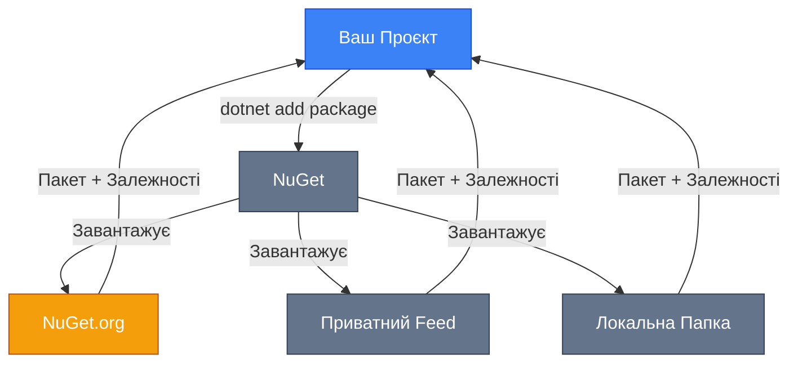
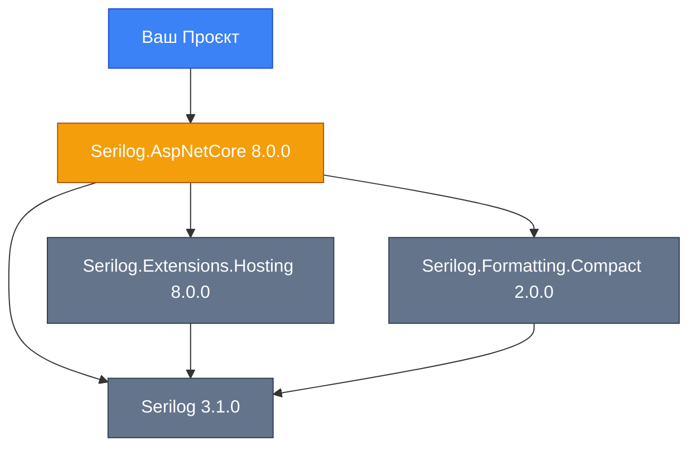

# Package Management (Управління Пакетами)

::note
**Передумови**: Рекомендується ознайомитись з [основами .NET CLI](/csharp/fundamentals/introduction-to-ecosystem) перед вивченням цього розділу.
::

## Навіщо це потрібно?

Уявіть, що ви створюєте веб-додаток. Вам потрібно працювати з JSON, логувати події, підключатися до бази даних, відправляти HTTP-запити... Писати весь цей код з нуля — марнування часу. Натомість, ви використовуєте **готові бібліотеки** (packages), які вирішують ці задачі.

Але як керувати десятками залежностей? Як оновлювати їх? Як переконатися, що всі члени команди використовують однакові версії? Саме для цього існує **NuGet** — система управління пакетами для .NET.

## Що таке NuGet?

**NuGet** (вимовляється "New Get") — це офіційний менеджер пакетів для платформи .NET. Він дозволяє:

-   📦 **Встановлювати** бібліотеки (пакети) в проєкт одією командою
-   🔄 **Оновлювати** залежності до нових версій
-   🔍 **Шукати** серед понад 350,000 доступних пакетів
-   📤 **Публікувати** власні бібліотеки для використання іншими розробниками
-   🔒 **Керувати версіями** та залежностями автоматично

::mermaid



::

### Еволюція Package Management у .NET

::tabs
:::tab{label="packages.config (Legacy)"}
**Використовувався в .NET Framework**

```xml
<?xml version="1.0" encoding="utf-8"?>
<packages>
  <package id="Newtonsoft.Json" version="13.0.3" targetFramework="net48" />
  <package id="Serilog" version="3.1.1" targetFramework="net48" />
</packages>
```

**Проблеми:**

-   Пакети копіювалися в папку `packages/` у кожному проєкті
-   Складне управління транзитивними залежностями
-   Великий розмір репозиторіїв

:::

:::tab{label="PackageReference (Сучасний)"}
**Використовується в .NET 5+ та .NET Core**

```xml [YourProject.csproj]
<Project Sdk="Microsoft.NET.Sdk">
  <PropertyGroup>
    <TargetFramework>net8.0</TargetFramework>
  </PropertyGroup>

  <ItemGroup>
    <PackageReference Include="Newtonsoft.Json" Version="13.0.3" />
    <PackageReference Include="Serilog" Version="3.1.1" />
  </ItemGroup>
</Project>
```

**Переваги:**

-   ✅ Глобальний кеш пакетів (не копіюються в кожен проєкт)
-   ✅ Автоматичне розв'язання транзитивних залежностей
-   ✅ Менше місця на диску
-   ✅ Швидша компіляція

:::
::

## Джерела Пакетів (Package Sources)

NuGet може завантажувати пакети з різних джерел:

### 1. Офіційний Репозиторій — NuGet.org

**NuGet.org** — це публічний безкоштовний репозиторій, де розміщено понад 350,000 пакетів.

::code-group

```bash [Пошук пакетів]
# Пошук пакетів на NuGet.org
dotnet search Serilog

# Або через веб-інтерфейс
# https://www.nuget.org/packages
```

```bash [Встановлення]
# Встановлення останньої версії
dotnet add package Serilog

# Встановлення конкретної версії
dotnet add package Serilog --version 3.1.1
```

::

::tip
**Best Practice**: Завжди перевіряйте **Downloads**, **GitHub Stars**, та **Last Update** пакета перед використанням. Популярні пакети зазвичай краще підтримуються.
::

### 2. Приватні Feeds

Для корпоративних проєктів часто використовують приватні репозиторії:

::tabs
:::tab{label="Azure Artifacts"}
**Azure DevOps Artifacts** — інтегрується з Azure pipelines.

```bash
# Додати приватний feed
dotnet nuget add source https://pkgs.dev.azure.com/yourorg/_packaging/yourfeed/nuget/v3/index.json \
  --name AzureArtifacts \
  --username anything \
  --password <YOUR_PAT>
```

:::

:::tab{label="GitHub Packages"}
**GitHub Packages** — інтегрується з GitHub репозиторіями.

```bash
# Додати GitHub Packages як джерело
dotnet nuget add source https://nuget.pkg.github.com/OWNER/index.json \
  --name GitHubPackages \
  --username GITHUB_USERNAME \
  --password <GITHUB_PAT>
```

:::

:::tab{label="MyGet"}
**MyGet** — спеціалізований сервіс для приватних feeds.

```bash
# Додати MyGet feed
dotnet nuget add source https://www.myget.org/F/yourfeed/api/v3/index.json \
  --name MyGetFeed
```

:::
::

::warning
**Безпека**: Ніколи не зберігайте паролі безпосередньо в `nuget.config`. Використовуйте:

-   Environment Variables
-   Azure Key Vault
-   GitHub Secrets
-   Credential Providers

::

### 3. Локальні Feeds

Корисні для розробки та тестування пакетів локально:

```bash
# Додати локальну папку як джерело пакетів
dotnet nuget add source /Users/yourname/local-packages --name LocalFeed

# Або на Windows
dotnet nuget add source C:\local-packages --name LocalFeed
```

### Конфігурація nuget.config

Всі джерела пакетів зберігаються в файлі `nuget.config`:

```xml [nuget.config]
<?xml version="1.0" encoding="utf-8"?>
<configuration>
  <packageSources>
    <clear />
    <add key="nuget.org" value="https://api.nuget.org/v3/index.json" protocolVersion="3" />
    <add key="AzureArtifacts" value="https://pkgs.dev.azure.com/yourorg/_packaging/yourfeed/nuget/v3/index.json" />
    <add key="LocalFeed" value="/Users/yourname/local-packages" />
  </packageSources>

  <packageSourceCredentials>
    <AzureArtifacts>
      <add key="Username" value="anything" />
      <add key="ClearTextPassword" value="%AZURE_ARTIFACTS_PAT%" />
    </AzureArtifacts>
  </packageSourceCredentials>
</configuration>
```

## Встановлення Пакетів

Існує три основні способи встановлення NuGet пакетів:

### 1. Використання .NET CLI (Рекомендовано)

::steps

#### Встановлення останньої версії

```bash
dotnet add package Newtonsoft.Json
```

Ця команда:

1. Знаходить останню стабільну версію пакета на NuGet.org
2. Додає `<PackageReference>` в `.csproj` файл
3. Автоматично виконує `dotnet restore`

#### Встановлення конкретної версії

```bash
dotnet add package Newtonsoft.Json --version 13.0.3
```

#### Встановлення prerelease версії

```bash
dotnet add package Microsoft.EntityFrameworkCore --prerelease
```

#### Встановлення з певного джерела

```bash
dotnet add package YourCompany.Core --source https://your-private-feed.com/nuget
```

#### Встановлення для конкретного target framework

```bash
dotnet add package System.Text.Json --framework net8.0
```

::

### 2. Package Manager UI (Visual Studio / Rider)

::note
У **Visual Studio** та **JetBrains Rider** є графічний інтерфейс для управління пакетами:

-   **Visual Studio**: Tools → NuGet Package Manager → Manage NuGet Packages for Solution
-   **Rider**: Right-click on project → Manage NuGet Packages

::


<!-- Search Query: Visual Studio NuGet Package Manager interface screenshot -->

### 3. Ручне редагування .csproj

Ви можете безпосередньо редагувати файл проєкту:

```xml [MyProject.csproj] {7-10}
<Project Sdk="Microsoft.NET.Sdk">
  <PropertyGroup>
    <TargetFramework>net8.0</TargetFramework>
  </PropertyGroup>

  <ItemGroup>
    <PackageReference Include="Newtonsoft.Json" Version="13.0.3" />
    <PackageReference Include="Serilog" Version="3.1.1" />
    <PackageReference Include="FluentValidation" Version="11.9.0" />
  </ItemGroup>
</Project>
```

::tip
Після ручного редагування виконайте:

```bash
dotnet restore
```

::

## Управління Залежностями

### Транзитивні Залежності

Коли ви встановлюєте пакет, він може мати власні залежності. NuGet автоматично їх завантажує:

::mermaid



::

Це називається **транзитивні залежності** (transitive dependencies). NuGet автоматично розв'язує всі залежності та завантажує правильні версії.

### Перегляд Дерева Залежностей

```bash
# Показати всі пакети проєкту
dotnet list package

# Показати транзитивні залежності
dotnet list package --include-transitive

# Показати дерево у вигляді JSON
dotnet list package --format json
```

**Приклад виводу:**

```
Project 'MyWebApp' has the following package references
   [net8.0]:
   Top-level Package                            Requested   Resolved
   > Serilog.AspNetCore                         8.0.0       8.0.0

   Transitive Package                           Resolved
   > Serilog                                    3.1.0
   > Serilog.Extensions.Hosting                 8.0.0
   > Serilog.Formatting.Compact                 2.0.0
```

### Конфлікти Версій

Що трапляється, якщо два пакети вимагають різні версії однієї залежності?

::code-group

```xml [Проблема]
<!-- Пакет A потребує Newtonsoft.Json 12.0 -->
<PackageReference Include="PackageA" Version="1.0.0" />

<!-- Пакет B потребує Newtonsoft.Json 13.0 -->
<PackageReference Include="PackageB" Version="2.0.0" />
```

```xml [Рішення: Явне вказання версії]
<ItemGroup>
  <PackageReference Include="PackageA" Version="1.0.0" />
  <PackageReference Include="PackageB" Version="2.0.0" />

  <!-- Явно вказуємо, яку версію використовувати -->
  <PackageReference Include="Newtonsoft.Json" Version="13.0.3" />
</ItemGroup>
```

::

::warning
**Compatibility Risk**: Примусове використання новішої версії може спричинити проблеми, якщо `PackageA` не сумісний з `Newtonsoft.Json 13.0`. Завжди тестуйте після зміни версій!
::

### Перевірка Вразливостей

NuGet дозволяє перевіряти пакети на відомі вразливості безпеки:

```bash
# Показати пакети з відомими вразливостями
dotnet list package --vulnerable

# Показати застарілі пакети
dotnet list package --deprecated
```

**Приклад виводу:**

```
The following sources were used:
   https://api.nuget.org/v3/index.json

Project `MyWebApp` has the following vulnerable packages
   [net8.0]:
   Top-level Package      Requested   Resolved   Severity   Advisory URL
   > System.Text.Json     6.0.0       6.0.0      High       https://github.com/advisories/GHSA-...
```

::caution
**Security Alert**: Якщо виявлено вразливість з рівнем **High** чи **Critical**, оновіть пакет якнайшвидше!
::

## Оновлення Пакетів

### Перевірка Застарілих Пакетів

```bash
# Показати всі застарілі пакети
dotnet list package --outdated

# Тільки major updates
dotnet list package --outdated --highest-major

# Тільки minor updates
dotnet list package --outdated --highest-minor
```

**Приклад виводу:**

```
Project `MyWebApp` has the following updates to its packages
   [net8.0]:
   Top-level Package              Requested   Resolved   Latest
   > Newtonsoft.Json              12.0.3      12.0.3     13.0.3
   > Serilog                      2.10.0      2.10.0     3.1.1
```

### Семантичне Версіонування (SemVer)

NuGet використовує **Semantic Versioning** (SemVer) у форматі `MAJOR.MINOR.PATCH`:

| Компонент | Коли змінюється                          | Приклад           |
| :-------- | :--------------------------------------- | :---------------- |
| **MAJOR** | Breaking changes (несумісні зміни API)   | `1.0.0` → `2.0.0` |
| **MINOR** | Нова функціональність (зворотно сумісна) | `1.0.0` → `1.1.0` |
| **PATCH** | Bug fixes (виправлення помилок)          | `1.0.0` → `1.0.1` |

::tip
**Update Strategy**:

-   🟢 **PATCH** — завжди безпечно оновлювати
-   🟡 **MINOR** — зазвичай безпечно, але перевірте release notes
-   🔴 **MAJOR** — потребує ретельного тестування, можливі breaking changes

::

### Діапазони Версій

Ви можете вказати діапазон прийнятних версій:

```xml
<!-- Точна версія -->
<PackageReference Include="Newtonsoft.Json" Version="13.0.3" />

<!-- Мінімальна версія (13.0.3 або вище) -->
<PackageReference Include="Newtonsoft.Json" Version="[13.0.3,)" />

<!-- Діапазон версій (від 13.0.0 до 14.0.0, не включно) -->
<PackageReference Include="Newtonsoft.Json" Version="[13.0.0,14.0.0)" />

<!-- Wildcard для patch версії -->
<PackageReference Include="Newtonsoft.Json" Version="13.0.*" />
```

::warning
**Trade-off**: Використання діапазонів забезпечує гнучкість, але може призвести до **недетермінованих білдів** (різні розробники отримують різні версії). Для production рекомендується фіксувати точні версії.
::

### Lock Files (Фіксація Версій)

Для забезпечення відтворюваності білдів використовуйте **lock files**:

```xml [MyProject.csproj]
<Project Sdk="Microsoft.NET.Sdk">
  <PropertyGroup>
    <RestorePackagesWithLockFile>true</RestorePackagesWithLockFile>
  </PropertyGroup>
</Project>
```

Це створить файл `packages.lock.json`, який фіксує точні версії всіх залежностей:

```json [packages.lock.json]
{
    "version": 1,
    "dependencies": {
        "net8.0": {
            "Newtonsoft.Json": {
                "type": "Direct",
                "requested": "[13.0.3, )",
                "resolved": "13.0.3",
                "contentHash": "HJQJXkjsRHxC..."
            }
        }
    }
}
```

## Створення та Публікація Приватних Пакетів

Час створити власний NuGet пакет!

::steps

### Крок 1: Створення Бібліотеки

```bash
# Створити проєкт Class Library
dotnet new classlib -n MyCompany.Core -o src/MyCompany.Core
cd src/MyCompany.Core
```

### Крок 2: Написання Коду

```csharp [StringExtensions.cs]
namespace MyCompany.Core.Extensions;

public static class StringExtensions
{
    /// <summary>
    /// Truncates a string to the specified length.
    /// </summary>
    public static string Truncate(this string value, int maxLength)
    {
        if (string.IsNullOrEmpty(value)) return value;
        return value.Length <= maxLength ? value : value[..maxLength];
    }
}
```

### Крок 3: Додавання Метаданих Пакета

```xml [MyCompany.Core.csproj] {5-14}
<Project Sdk="Microsoft.NET.Sdk">
  <PropertyGroup>
    <TargetFramework>net8.0</TargetFramework>

    <!-- Package Metadata -->
    <PackageId>MyCompany.Core</PackageId>
    <Version>1.0.0</Version>
    <Authors>Your Name</Authors>
    <Company>MyCompany</Company>
    <Description>Core utilities for MyCompany projects</Description>
    <PackageTags>utilities;extensions;helpers</PackageTags>
    <PackageLicenseExpression>MIT</PackageLicenseExpression>
    <RepositoryUrl>https://github.com/mycompany/core</RepositoryUrl>
  </PropertyGroup>
</Project>
```

### Крок 4: Створення Пакета

```bash
# Створення NuGet пакета (.nupkg файл)
dotnet pack --configuration Release

# Результат: bin/Release/MyCompany.Core.1.0.0.nupkg
```

### Крок 5: Публікація

::code-group

```bash [Публікація на NuGet.org]
# Потрібен API ключ з https://www.nuget.org/account/apikeys
dotnet nuget push bin/Release/MyCompany.Core.1.0.0.nupkg \
  --api-key YOUR_API_KEY \
  --source https://api.nuget.org/v3/index.json
```

```bash [Публікація на Azure Artifacts]
dotnet nuget push bin/Release/MyCompany.Core.1.0.0.nupkg \
  --api-key az \
  --source https://pkgs.dev.azure.com/yourorg/_packaging/yourfeed/nuget/v3/index.json
```

```bash [Локальний Feed]
# Просто скопіювати .nupkg в локальну папку
cp bin/Release/MyCompany.Core.1.0.0.nupkg /path/to/local-feed/
```

::
::

::tip
**Versioning Best Practice**:

-   Використовуйте **SemVer** послідовно
-   Автоматизуйте версіонування через CI/CD (наприклад, GitVersion)
-   Додавайте release notes до кожної версії

::

## Global Tools (Глобальні Інструменти)

**.NET Global Tools** — це консольні додатки, які можна встановити глобально та викликати з будь-якого місця в терміналі.

### Встановлення Global Tools

```bash
# Встановлення інструменту глобально
dotnet tool install --global dotnet-ef

# Після встановлення можна викликати з будь-якого місця
dotnet ef --version
```

### Популярні Global Tools

| Інструмент          | Призначення                  | Встановлення                                        |
| :------------------ | :--------------------------- | :-------------------------------------------------- |
| **dotnet-ef**       | Entity Framework CLI         | `dotnet tool install --global dotnet-ef`            |
| **dotnet-outdated** | Перевірка застарілих пакетів | `dotnet tool install --global dotnet-outdated-tool` |
| **dotnet-format**   | Code formatter               | `dotnet tool install --global dotnet-format`        |
| **dotnet-trace**    | Performance profiling        | `dotnet tool install --global dotnet-trace`         |
| **dotnet-dump**     | Memory dump analysis         | `dotnet tool install --global dotnet-dump`          |

### Local Tools (Tool Manifests)

Замість глобальної установки, можна використовувати **локальні інструменти** на рівні проєкту:

::steps

#### Створення Manifest

```bash
# Створити .config/dotnet-tools.json
dotnet new tool-manifest
```

#### Встановлення Local Tool

```bash
# Встановити інструмент локально
dotnet tool install dotnet-ef
```

#### Використання

```bash
# Виклик локального інструменту
dotnet tool run dotnet-ef --version

# Або просто
dotnet ef --version
```

::

**Переваги Local Tools:**

-   ✅ Версія інструменту зберігається в репозиторії
-   ✅ Всі члени команди використовують однакову версію
-   ✅ Не конфліктує з глобальними установками

**Приклад `dotnet-tools.json`:**

```json [.config/dotnet-tools.json]
{
    "version": 1,
    "isRoot": true,
    "tools": {
        "dotnet-ef": {
            "version": "8.0.0",
            "commands": ["dotnet-ef"]
        },
        "dotnet-outdated-tool": {
            "version": "4.6.0",
            "commands": ["dotnet-outdated"]
        }
    }
}
```

### Управління Global Tools

```bash
# Показати всі встановлені глобальні інструменти
dotnet tool list --global

# Оновити інструмент
dotnet tool update --global dotnet-ef

# Видалити інструмент
dotnet tool uninstall --global dotnet-ef

# Встановити інструмент у кастомну папку
dotnet tool install dotnet-ef --tool-path ~/my-tools
```

## Практична Реалізація: Створення Проєкту з Пакетами

Давайте створимо реальний проєкт, який використовує кілька популярних пакетів:

::steps

### Створення Web API проєкту

```bash
dotnet new webapi -n ProductCatalog
cd ProductCatalog
```

### Встановлення пакетів

```bash
# Entity Framework Core для роботи з БД
dotnet add package Microsoft.EntityFrameworkCore.Sqlite
dotnet add package Microsoft.EntityFrameworkCore.Design

# Serilog для логування
dotnet add package Serilog.AspNetCore
dotnet add package Serilog.Sinks.Console

# FluentValidation для валідації
dotnet add package FluentValidation.AspNetCore

# Swagger для API документації (вже включено в шаблон webapi)
```

### Перевірка встановлених пакетів

```bash
dotnet list package
```

**Вивід:**

```
Project 'ProductCatalog' has the following package references
   [net8.0]:
   Top-level Package                                    Requested   Resolved
   > FluentValidation.AspNetCore                        11.3.0      11.3.0
   > Microsoft.EntityFrameworkCore.Design               8.0.0       8.0.0
   > Microsoft.EntityFrameworkCore.Sqlite               8.0.0       8.0.0
   > Serilog.AspNetCore                                 8.0.0       8.0.0
   > Serilog.Sinks.Console                              5.0.1       5.0.1
   > Swashbuckle.AspNetCore                             6.5.0       6.5.0
```

### Перегляд файлу проєкту

```xml [ProductCatalog.csproj]
<Project Sdk="Microsoft.NET.Sdk.Web">
  <PropertyGroup>
    <TargetFramework>net8.0</TargetFramework>
    <Nullable>enable</Nullable>
    <ImplicitUsings>enable</ImplicitUsings>
  </PropertyGroup>

  <ItemGroup>
    <PackageReference Include="FluentValidation.AspNetCore" Version="11.3.0" />
    <PackageReference Include="Microsoft.EntityFrameworkCore.Design" Version="8.0.0" />
    <PackageReference Include="Microsoft.EntityFrameworkCore.Sqlite" Version="8.0.0" />
    <PackageReference Include="Serilog.AspNetCore" Version="8.0.0" />
    <PackageReference Include="Serilog.Sinks.Console" Version="5.0.1" />
    <PackageReference Include="Swashbuckle.AspNetCore" Version="6.5.0" />
  </ItemGroup>
</Project>
```

### Restore пакетів

```bash
# Завантажити всі пакети та залежності
dotnet restore
```

::

## Troubleshooting (Вирішення Проблем)

### Проблема 1: "Package not found"

**Симптоми:**

```
error NU1101: Unable to find package 'SomePackage'. No packages exist with this id in source(s): nuget.org
```

**Рішення:**

::steps

#### Перевірте назву пакета

```bash
# Пошук на NuGet.org
dotnet tool install --global dotnet-search
dotnet-search SomePackage
```

#### Перевірте джерела пакетів

```bash
dotnet nuget list source
```

#### Додайте потрібне джерело

```bash
dotnet nuget add source https://your-custom-feed.com/nuget --name CustomFeed
```

::

### Проблема 2: Version Conflicts

**Симптоми:**

```
error NU1107: Version conflict detected for 'Newtonsoft.Json'.
 PackageA 1.0.0 -> Newtonsoft.Json (>= 12.0.0)
 PackageB 2.0.0 -> Newtonsoft.Json (>= 13.0.0)
```

**Рішення:**

```xml
<!-- Явно вказати версію, яка задовольняє обидва пакети -->
<PackageReference Include="Newtonsoft.Json" Version="13.0.3" />
```

### Проблема 3: Restore Failures

**Симптоми:**

```
error : The restore operation failed. Check the console output for details.
```

**Рішення:**

```bash
# Очистити кеш NuGet
dotnet nuget locals all --clear

# Повторити restore з детальним логуванням
dotnet restore --verbosity detailed

# Видалити bin/ і obj/ папки
rm -rf bin obj
dotnet restore
```

### Проблема 4: Authentication Failures (Private Feeds)

**Симптоми:**

```
error : Response status code does not indicate success: 401 (Unauthorized)
```

**Рішення:**

::code-group

```bash [Azure Artifacts]
# Встановити Azure Artifacts Credential Provider
# https://github.com/microsoft/artifacts-credprovider

# Або використати PAT (Personal Access Token)
dotnet nuget update source AzureArtifacts \
  --username anything \
  --password YOUR_PAT \
  --store-password-in-clear-text
```

```bash [GitHub Packages]
# Створити PAT на GitHub: Settings → Developer settings → Personal access tokens
# Scope: read:packages

dotnet nuget update source GitHubPackages \
  --username YOUR_GITHUB_USERNAME \
  --password YOUR_GITHUB_PAT \
  --store-password-in-clear-text
```

::

::caution
**Security**: Параметр `--store-password-in-clear-text` зберігає пароль у відкритому вигляді. Для production використовуйте Credential Providers або Azure Key Vault!
::

## Завдання для Практики

### 📝 Level 1: Основи (Beginner)

::collapsible{label="Завдання 1.1: Встановлення та Дослідження Пакетів"}
**Мета:** Навчитися встановлювати пакети та досліджувати залежності.

**Завдання:**

1. Створіть новий console application проєкт
2. Встановіть пакет `Newtonsoft.Json`
3. Встановіть пакет `Serilog`
4. Виведіть список всіх пакетів з транзитивними залежностями
5. Збережіть вивід у файл `packages.txt`

**Подсказка:**

```bash
dotnet new console -n PackageExplorer
cd PackageExplorer
dotnet add package Newtonsoft.Json
dotnet add package Serilog
dotnet list package --include-transitive > packages.txt
```

::

::collapsible{label="Завдання 1.2: Використання JSON Serialization"}
**Мета:** Практика використання встановленого пакета.

**Завдання:**
Використайте `Newtonsoft.Json` для серіалізації та десеріалізації об'єкта:

```csharp
using Newtonsoft.Json;

var person = new Person { Name = "Олена", Age = 25, City = "Київ" };

// Серіалізація в JSON
string json = JsonConvert.SerializeObject(person, Formatting.Indented);
Console.WriteLine(json);

// Десеріалізація з JSON
var deserializedPerson = JsonConvert.DeserializeObject<Person>(json);
Console.WriteLine($"{deserializedPerson?.Name} з {deserializedPerson?.City}");

record Person(string Name, int Age, string City);
```

**Очікуваний результат:**

```json
{
  "Name": "Олена",
  "Age": 25,
  "City": "Київ"
}
Олена з Київ
```

::

### 🔧 Level 2: Середній (Intermediate)

::collapsible{label="Завдання 2.1: Створення Власного NuGet Пакета"}
**Мета:** Навчитися створювати та пакувати власні бібліотеки.

**Завдання:**

1. Створіть class library з назвою `YourName.StringHelpers`
2. Реалізуйте 3 extension методи для `string`:
    - `Reverse()` — повертає перевернутий рядок
    - `WordCount()` — підраховує кількість слів
    - `ToPascalCase()` — конвертує рядок у PascalCase
3. Додайте метадані пакета (автор, опис, версія)
4. Створіть NuGet пакет командою `dotnet pack`
5. Встановіть пакет у локальному проєкті

**Розв'язання:**

```csharp [StringExtensions.cs]
namespace YourName.StringHelpers;

public static class StringExtensions
{
    public static string Reverse(this string str)
    {
        return new string(str.Reverse().ToArray());
    }

    public static int WordCount(this string str)
    {
        return str.Split(' ', StringSplitOptions.RemoveEmptyEntries).Length;
    }

    public static string ToPascalCase(this string str)
    {
        var words = str.Split(' ', StringSplitOptions.RemoveEmptyEntries);
        return string.Concat(words.Select(w =>
            char.ToUpper(w[0]) + w[1..].ToLower()));
    }
}
```

::

::collapsible{label="Завдання 2.2: Розв'язання Version Conflict"}
**Мета:** Навчитися вирішувати конфлікти версій пакетів.

**Сценарій:**
У вас є два пакети:

-   `PackageA` вимагає `System.Text.Json >= 6.0.0`
-   `PackageB` вимагає `System.Text.Json >= 7.0.0`

**Завдання:**

1. Симулюйте цю проблему створивши проєкт
2. Додайте обидва пакети
3. Вирішіть конфлікт явним вказанням версії
4. Перевірте, що проєкт компілюється

**Розв'язання:**

```xml
<ItemGroup>
  <!-- Явно вказуємо версію, яка задовольняє обидва пакети -->
  <PackageReference Include="System.Text.Json" Version="7.0.3" />
  <PackageReference Include="PackageA" Version="1.0.0" />
  <PackageReference Include="PackageB" Version="2.0.0" />
</ItemGroup>
```

::

### 🚀 Level 3: Просунутий (Advanced)

::collapsible{label="Завдання 3.1: Налаштування Private Feed з GitHub Packages"}
**Мета:** Налаштувати приватний репозиторій пакетів.

**Завдання:**

1. Створіть репозиторій на GitHub
2. Налаштуйте GitHub Actions для автоматичної публікації пакета
3. Створіть Personal Access Token (PAT)
4. Додайте GitHub Packages як джерело в `nuget.config`
5. Опублікуйте свій пакет на GitHub Packages
6. Встановіть пакет з GitHub Packages в іншому проєкті

**GitHub Actions Workflow:**

```yaml [.github/workflows/publish.yml]
name: Publish NuGet Package

on:
    push:
        tags:
            - 'v*'

jobs:
    publish:
        runs-on: ubuntu-latest
        steps:
            - uses: actions/checkout@v3

            - name: Setup .NET
              uses: actions/setup-dotnet@v3
              with:
                  dotnet-version: '8.0.x'

            - name: Restore dependencies
              run: dotnet restore

            - name: Build
              run: dotnet build --configuration Release --no-restore

            - name: Pack
              run: dotnet pack --configuration Release --no-build

            - name: Publish to GitHub Packages
              run: dotnet nuget push "**/*.nupkg" --source https://nuget.pkg.github.com/YOUR_USERNAME/index.json --api-key ${{ secrets.GITHUB_TOKEN }}
```

::

::collapsible{label="Завдання 3.2: Створення Tool Manifest для Команди"}
**Мета:** Налаштувати локальні інструменти для консистентності в команді.

**Завдання:**

1. Створіть tool manifest у проєкті
2. Додайте 3 локальні інструменти:
    - `dotnet-ef` версії 8.0.0
    - `dotnet-outdated-tool` останньої версії
    - `dotnet-format` останньої версії
3. Створіть скрипт `setup.sh`, який встановлює всі інструменти
4. Задокументуйте використання в `README.md`

**Розв'язання:**

```bash [setup.sh]
#!/bin/bash

# Create tool manifest if it doesn't exist
if [ ! -f .config/dotnet-tools.json ]; then
  dotnet new tool-manifest
fi

# Install tools
dotnet tool restore

echo "✅ All tools installed successfully!"
echo "Available tools:"
dotnet tool list
```

````markdown [README.md]
## Development Setup

### Prerequisites

-   .NET 8.0 SDK

### Tool Installation

```bash
chmod +x setup.sh
./setup.sh
```
````

### Available Tools

-   `dotnet ef` - Entity Framework CLI
-   `dotnet outdated` - Check for outdated packages
-   `dotnet format` - Code formatter

### Usage

```bash
# Run EF migrations
dotnet ef migrations add InitialCreate

# Check outdated packages
dotnet outdated

# Format code
dotnet format
```

````
::

## Резюме

У цьому розділі ми вивчили:

::card-group
:::card{icon="📦"}
**NuGet Basics**
- Що таке NuGet та навіщо він потрібен
- Еволюція від packages.config до PackageReference
- Архітектура екосистеми NuGet
:::

:::card{icon="🔍"}
**Package Sources**
- Офіційний репозиторій NuGet.org
- Приватні feeds (Azure Artifacts, GitHub Packages)
- Локальні feeds для розробки
- Конфігурація через nuget.config
:::

:::card{icon="⚙️"}
**Package Management**
- Встановлення пакетів через CLI, UI, та вручну
- Управління транзитивними залежностями
- Розв'язання конфліктів версій
- Перевірка вразливостей
:::

:::card{icon="🔄"}
**Updates & Versioning**
- Semantic Versioning (SemVer)
- Стратегії оновлення пакетів
- Lock files для відтворюваності
- Діапазони версій
:::

:::card{icon="🛠️"}
**Creating Packages**
- Створення class library
- Додавання метаданих
- Упаковка через `dotnet pack`
- Публікація на різні feeds
:::

:::card{icon="🌐"}
**Global Tools**
- Встановлення глобальних інструментів
- Local tools через manifests
- Популярні .NET tools
- Версіонування інструментів
:::
::

**Ключові Команди:**

```bash
# Package Management
dotnet add package <PACKAGE_NAME>              # Встановити пакет
dotnet list package                            # Показати пакети
dotnet list package --include-transitive       # Показати всі залежності
dotnet list package --outdated                 # Застарілі пакети
dotnet list package --vulnerable               # Вразливі пакети
dotnet restore                                 # Завантажити залежності

# Package Creation
dotnet pack                                    # Створити .nupkg
dotnet nuget push <PACKAGE>.nupkg              # Опублікувати пакет

# Sources
dotnet nuget list source                       # Показати джерела
dotnet nuget add source <URL> --name <NAME>    # Додати джерело
dotnet nuget remove source <NAME>              # Видалити джерело

# Global Tools
dotnet tool install --global <TOOL>            # Встановити глобально
dotnet tool list --global                      # Показати глобальні tools
dotnet tool update --global <TOOL>             # Оновити tool

# Local Tools
dotnet new tool-manifest                       # Створити manifest
dotnet tool install <TOOL>                     # Встановити локально
dotnet tool restore                            # Відновити tools з manifest
````

::tip
**Next Steps**: Тепер, коли ви знаєте, як керувати пакетами, переходьте до вивчення [Classes & Objects](/csharp/oop/classes-objects), де ви навчитеся створювати власні типи даних та використовувати ООП на повну!
::
