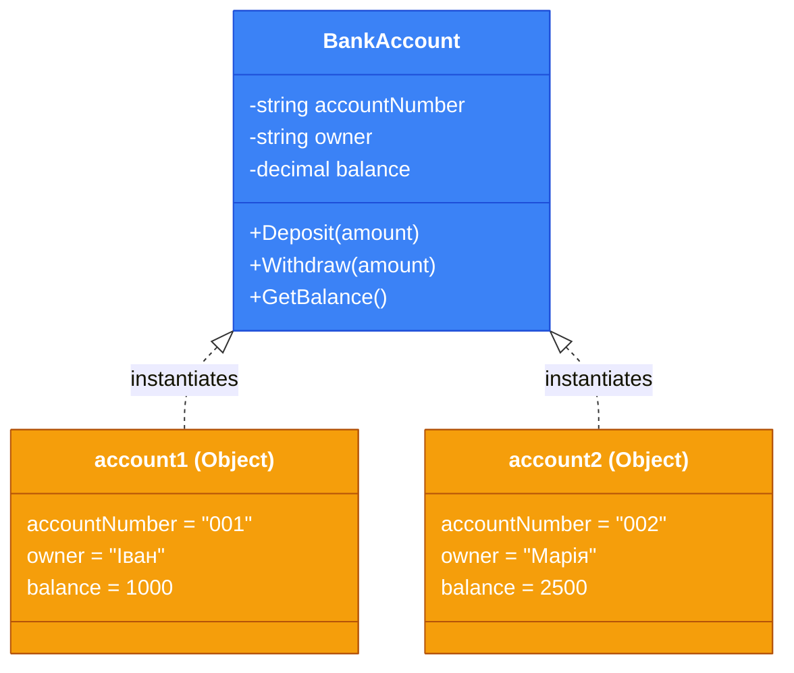
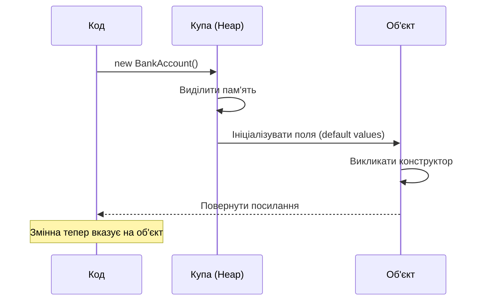
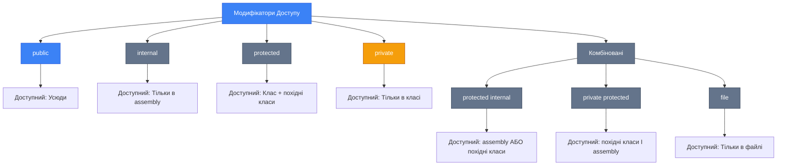

# Класи та Об'єкти

## Вступ: Від Хаосу до Порядку

Уявіть, що ви створюєте банківську систему. Вам потрібно зберігати інформацію про клієнтів, рахунки, транзакції. Використовуючи тільки примітивні типи та функції, ви швидко зіткнетеся з хаосом: безліч змінних, складність у підтримці зв'язків між даними, дублювання коду.

**Класи та об'єкти** (Classes & Objects) — це фундаментальна концепція об'єктно-орієнтованого програмування (ООП), яка дозволяє організувати код в логічні, самодостатні одиниці, що моделюють реальні сутності.

::note
**Історична еволюція**: Процедурне програмування (C, Pascal) організовувало код навколо функцій та даних окремо. ООП (Simula, Smalltalk, C++) об'єднало дані та поведінку в єдину структуру — клас. C# успадкував цю парадигму та розширив її сучасними можливостями.
::

### Що ви дізнаєтесь

У цьому розділі ви опануєте:

-   Визначення класів та створення об'єктів
-   Різні типи конструкторів, включаючи **Primary Constructors** (C# 12)
-   Ініціалізатори об'єктів та деконструктори
-   Використання ключового слова `this`
-   Статичні члени класів
-   Модифікатори доступу для контролю видимості

### Передумови

Перед вивченням цієї теми рекомендується ознайомитися з:

-   Базовим синтаксисом C# (змінні, типи даних, методи)
-   Структурою програми C#
-   Концепцією Value Types vs Reference Types

---

## Фундаментальні Концепції

### Що таке Клас?

[**Клас** (Class)](https://learn.microsoft.com/en-us/dotnet/csharp/fundamentals/types/classes) — це шаблон або blueprint, який визначає структуру (дані) та поведінку (методи) для створення об'єктів. Клас описує, які властивості та дії може мати об'єкт, але сам по собі не займає пам'яті для зберігання даних екземплярів.

[**Об'єкт** (Object)](https://learn.microsoft.com/en-us/dotnet/csharp/fundamentals/types/classes#objects) або **екземпляр** (Instance) — це конкретна реалізація класу, що існує в пам'яті програми та має власні значення полів.

Клас у C# є **reference type** (посилальним типом). Це означає, що змінна, яка зберігає об'єкт, насправді містить не сам об'єкт, а **посилання** (адресу в пам'яті) на нього. Самі дані об'єкта розміщуються в керованій купі (Managed Heap). Це фундаментально відрізняє класи від структур (`struct`), які є **value types** і зберігають свої дані безпосередньо у змінній (зазвичай у стеці).

### Аналогія з Реального Світу

Подумайте про клас як про **архітектурний план будинку**:

-   **Клас** = Креслення будинку (описує кімнати, двері, вікна)
-   **Об'єкт** = Реальний будинок, побудований за цим кресленням
-   Ви можете побудувати багато будинків (об'єктів) за одним кресленням (класом)

::mermaid



::

---

## Визначення Класу та Створення Об'єктів

### Синтаксис Визначення Класу

Базова структура класу в C#:

```csharp [BankAccount.cs] showLineNumbers
public class BankAccount
{
    // Поля (Fields) - приватні дані класу
    private string _accountNumber;
    private string _owner;
    private decimal _balance;

    // Властивості (Properties) - публічний доступ до даних
    public string AccountNumber { get; set; }
    public string Owner { get; set; }
    public decimal Balance { get; private set; }

    // Методи (Methods) - поведінка класу
    public void Deposit(decimal amount)
    {
        if (amount > 0)
        {
            Balance += amount;
        }
    }

    public bool Withdraw(decimal amount)
    {
        if (amount > 0 && Balance >= amount)
        {
            Balance -= amount;
            return true;
        }
        return false;
    }
}
```

### Створення Об'єктів (Інстанціювання)

Для створення об'єкта використовується оператор `new`:

::code-group

```csharp [Традиційний синтаксис] showLineNumbers
// Створення об'єкта з викликом конструктора
BankAccount account1 = new BankAccount();

// Присвоєння значень властивостям
account1.AccountNumber = "UA001";
account1.Owner = "Іван Петренко";
```

```csharp [Скорочений синтаксис (var)] showLineNumbers
// Компілятор автоматично визначає тип
var account2 = new BankAccount();
account2.AccountNumber = "UA002";
account2.Owner = "Марія Коваленко";
```

```csharp [Target-typed new (C# 9+)] showLineNumbers
// Тип визначається з лівої частини
BankAccount account3 = new();
account3.AccountNumber = "UA003";
```

::

### Як Працює Створення Об'єкта

::steps

#### Крок 1: Виділення пам'яті

Оператор `new` виділяє пам'ять в **купі** (Heap) для зберігання всіх полів об'єкта.

#### Крок 2: Ініціалізація полів

Усі поля ініціалізуються значеннями за замовчуванням (числа = 0, референсні типи = `null`).

#### Крок 3: Виклик конструктора

Виконується код конструктора для додаткової ініціалізації.

#### Крок 4: Повернення посилання

Оператор `new` повертає посилання (reference) на створений об'єкт, яке зберігається у змінній.
::

Коли ви створюєте об'єкт (`new BankAccount()`), відбувається два ключових процеси, пов'язаних з пам'яттю:

1.  **Стек (Stack)**: Це область пам'яті, яка працює за принципом "Last-In, First-Out" (LIFO). Тут зберігаються локальні змінні, включаючи посилання на об'єкти. Пам'ять у стеці звільняється автоматично, коли змінна виходить за межі своєї області видимості. У нашому прикладі, змінна `account1` (яка є посиланням) живе у стеці.

2.  **Купа (Heap)**: Це велика область пам'яті для динамічного виділення. Тут зберігаються самі дані об'єктів (екземпляри класів). Пам'ять у купі не звільняється автоматично. За це відповідає **Збирач сміття (Garbage Collector, GC)** — фоновий процес CLR, який періодично шукає об'єкти в купі, на які більше не існує посилань зі стеку, і звільняє пам'ять, яку вони займали.

Цей механізм автоматичного керування пам'яттю є однією з ключових переваг .NET, що захищає розробників від поширених помилок, таких як витоки пам'яті.

::mermaid



::

---

## Конструктори

[**Конструктор** (Constructor)](https://learn.microsoft.com/en-us/dotnet/csharp/programming-guide/classes-and-structs/constructors) — це спеціальний метод класу, який автоматично викликається під час створення об'єкта. Його призначення — ініціалізувати об'єкт у валідному стані.

### Характеристики Конструктора

-   Має таку саму назву, як клас
-   Не має типу повернення (навіть `void`)
-   Може бути перевантаженим (кілька конструкторів з різними параметрами)
-   Якщо конструктор не визначений, компілятор створює **конструктор за замовчуванням** (parameterless constructor)

**Неявний конструктор за замовчуванням**:

Якщо ви не оголошуєте **жодного** конструктора у класі, компілятор C# автоматично генерує для вас публічний конструктор без параметрів. Цей неявний конструктор просто ініціалізує всі поля класу їхніми значеннями за замовчуванням (0 для числових типів, `null` для посилальних типів, `false` для `bool` тощо).

**Важливо**: як тільки ви визначаєте хоча б один конструктор (навіть з параметрами), компілятор більше **не** створює конструктор за замовчуванням автоматично. Якщо він вам потрібен, ви повинні оголосити його явно.

### Instance Constructors (Конструктори Екземпляра)

```csharp [BankAccount.cs] showLineNumbers
public class BankAccount
{
    public string AccountNumber { get; set; }
    public string Owner { get; set; }
    public decimal Balance { get; private set; }

    // Конструктор без параметрів (Default Constructor)
    public BankAccount()
    {
        AccountNumber = "N/A";
        Owner = "Unknown";
        Balance = 0m;
    }

    // Конструктор з параметрами
    public BankAccount(string accountNumber, string owner)
    {
        AccountNumber = accountNumber;
        Owner = owner;
        Balance = 0m;
    }

    // Перевантажений конструктор з початковим балансом
    public BankAccount(string accountNumber, string owner, decimal initialBalance)
    {
        AccountNumber = accountNumber;
        Owner = owner;
        Balance = initialBalance;
    }
}
```

**Використання:**

```csharp showLineNumbers
var account1 = new BankAccount();
var account2 = new BankAccount("UA001", "Іван Петренко");
var account3 = new BankAccount("UA002", "Марія Коваленко", 5000m);
```

### Constructor Chaining (Ланцюжок Конструкторів)

Конструктори можуть викликати один одного за допомогою ключового слова `this`:

```csharp [BankAccount.cs] showLineNumbers
public class BankAccount
{
    public string AccountNumber { get; set; }
    public string Owner { get; set; }
    public decimal Balance { get; private set; }

    // Головний конструктор з усією логікою
    public BankAccount(string accountNumber, string owner, decimal initialBalance)
    {
        // Валідація
        if (string.IsNullOrWhiteSpace(accountNumber))
            throw new ArgumentException("Account number cannot be empty", nameof(accountNumber));

        if (string.IsNullOrWhiteSpace(owner))
            throw new ArgumentException("Owner name cannot be empty", nameof(owner));

        if (initialBalance < 0)
            throw new ArgumentException("Initial balance cannot be negative", nameof(initialBalance));

        AccountNumber = accountNumber;
        Owner = owner;
        Balance = initialBalance;
    }

    // Делегує виклик головному конструктору
    public BankAccount(string accountNumber, string owner)
        : this(accountNumber, owner, 0m)
    {
    }

    // Делегує виклик попередньому конструктору
    public BankAccount()
        : this("N/A", "Unknown", 0m)
    {
    }
}
```

::tip
**Best Practice**: Розміщуйте логіку валідації та ініціалізації в одному "головному" конструкторі, а інші конструктори делегуйте до нього через `this(...)`. Це зменшує дублювання коду та полегшує підтримку.
::

### Primary Constructors (C# 12)

[**Primary Constructors**](https://learn.microsoft.com/en-us/dotnet/csharp/programming-guide/classes-and-structs/instance-constructors#primary-constructors) — це синтаксичний цукор, введений у C# 12, який дозволяє визначати параметри конструктора безпосередньо в оголошенні класу.

::code-group

```csharp [Traditional Constructor] showLineNumbers
public class BankAccount
{
    public string AccountNumber { get; }
    public string Owner { get; }

    public BankAccount(string accountNumber, string owner)
    {
        AccountNumber = accountNumber;
        Owner = owner;
    }
}
```

```csharp [Primary Constructor (C# 12)] showLineNumbers
// Параметри у дужках після назви класу
public class BankAccount(string accountNumber, string owner)
{
    // Параметри доступні у всіх членах класу
    public string AccountNumber { get; } = accountNumber;
    public string Owner { get; } = owner;

    public void DisplayInfo()
    {
        // Параметри primary constructor доступні як змінні
        Console.WriteLine($"Account: {accountNumber}, Owner: {owner}");
    }
}
```

::

**Використання з Dependency Injection:**

```csharp [Controller.cs] showLineNumbers
// Primary constructor ідеально підходить для DI
public class BankController(IBankService bankService, ILogger<BankController> logger) : Controller
{
    public IActionResult GetAccount(string accountNumber)
    {
        logger.LogInformation("Fetching account {AccountNumber}", accountNumber);
        var account = bankService.GetAccount(accountNumber);
        return View(account);
    }
}
```

::warning
**Обережно з Primary Constructors**: Параметри primary constructor зберігаються як приховані поля, якщо вони використовуються поза ініціалізацією властивостей. Це може призвести до подвійного зберігання даних, якщо ви також зберігаєте значення у властивостях.
::

**Приклад проблеми з подвійним зберіганням:**

```csharp showLineNumbers
// ❌ НЕПРАВИЛЬНО - подвійне зберігання
public class BankAccount(string accountNumber, string owner)
{
    public string AccountNumber { get; set; } = accountNumber;
    public string Owner { get; set; } = owner;

    // accountNumber та owner також зберігаються як приховані поля
    public void Display() => Console.WriteLine($"{accountNumber} - {owner}");
}

// ✅ ПРАВИЛЬНО - одиничне зберігання
public class BankAccount(string accountNumber, string owner)
{
    public string AccountNumber { get; } = accountNumber;
    public string Owner { get; } = owner;

    // Використовуємо властивості замість параметрів
    public void Display() => Console.WriteLine($"{AccountNumber} - {Owner}");
}
```

### Static Constructors (Статичні Конструктори)

**Static Constructor** викликається автоматично **один раз** перед першим використанням класу (створення екземпляра або доступ до статичних членів).

```csharp [Configuration.cs] showLineNumbers
public class Configuration
{
    public static string DatabaseConnection { get; private set; }
    public static int MaxRetries { get; private set; }

    // Статичний конструктор (без модифікаторів доступу, без параметрів)
    static Configuration()
    {
        Console.WriteLine("Static constructor called!");
        DatabaseConnection = Environment.GetEnvironmentVariable("DB_CONNECTION")
            ?? "DefaultConnection";
        MaxRetries = 3;
    }

    public static void Display()
    {
        Console.WriteLine($"DB: {DatabaseConnection}, Retries: {MaxRetries}");
    }
}

// Використання
Configuration.Display(); // Спочатку викличеться static constructor один раз
Configuration.Display(); // Static constructor вже не викличеться
```

### Private Constructors (Приватні Конструктори)

Приватний конструктор запобігає створенню екземплярів класу ззовні. Використовується для:

-   **Singleton Pattern** (один єдиний екземпляр класу)
-   **Utility Classes** (класи тільки зі статичними методами)
-   **Factory Methods** (контроль над створенням об'єктів)

```csharp [DatabaseConnection.cs] showLineNumbers
public class DatabaseConnection
{
    private static DatabaseConnection _instance;
    private static readonly object _lock = new();

    // Приватний конструктор - неможливо викликати ззовні
    private DatabaseConnection()
    {
        Console.WriteLine("Database connection initialized");
    }

    // Публічний статичний метод для отримання єдиного екземпляра
    public static DatabaseConnection Instance
    {
        get
        {
            if (_instance == null)
            {
                lock (_lock)
                {
                    _instance ??= new DatabaseConnection();
                }
            }
            return _instance;
        }
    }
}

// Використання
var db1 = DatabaseConnection.Instance;
var db2 = DatabaseConnection.Instance;
// db1 == db2 (один і той самий об'єкт)

// ❌ Це не скомпілюється:
// var db3 = new DatabaseConnection(); // Error: Constructor is inaccessible
```

---

## Object Initializers (Ініціалізатори Об'єктів)

[**Object Initializers**](https://learn.microsoft.com/en-us/dotnet/csharp/programming-guide/classes-and-structs/object-and-collection-initializers) дозволяють присвоювати значення публічним властивостям або полям під час створення об'єкта у більш зручному та читабельному синтаксисі.

::code-group

```csharp [Без ініціалізаторів] showLineNumbers
var account = new BankAccount();
account.AccountNumber = "UA001";
account.Owner = "Іван Петренко";
```

```csharp [З ініціалізаторами] showLineNumbers
var account = new BankAccount
{
    AccountNumber = "UA001",
    Owner = "Іван Петренко"
};
```

```csharp [З конструктором + ініціалізатор] showLineNumbers
var account = new BankAccount("UA001", "Іван Петренко")
{
    // Додаткова ініціалізація після конструктора
    Balance = 1500m // Якщо властивість має public set
};
```

::

### Collection Initializers

Ініціалізатори також працюють з колекціями:

```csharp showLineNumbers
var accounts = new List<BankAccount>
{
    new BankAccount { AccountNumber = "UA001", Owner = "Іван" },
    new BankAccount { AccountNumber = "UA002", Owner = "Марія" },
    new BankAccount { AccountNumber = "UA003", Owner = "Петро" }
};
```

::tip
Ініціалізатори об'єктів особливо корисні для:

-   Створення об'єктів для unit-тестів
-   Ініціалізації конфігураційних об'єктів
-   Створення анонімних типів у LINQ

::

---

## Deconstructors (Деконструктори)

[**Deconstructor**](https://learn.microsoft.com/en-us/dotnet/csharp/fundamentals/functional/deconstruct) — це метод, який дозволяє "розпакувати" об'єкт на окремі складові частини. Це обернена операція до конструктора.

### Визначення Деконструктора

```csharp [BankAccount.cs] showLineNumbers
public class BankAccount
{
    public string AccountNumber { get; set; }
    public string Owner { get; set; }
    public decimal Balance { get; set; }

    public BankAccount(string accountNumber, string owner, decimal balance)
    {
        AccountNumber = accountNumber;
        Owner = owner;
        Balance = balance;
    }

    // Deconstruct метод з out параметрами
    public void Deconstruct(out string accountNumber, out string owner, out decimal balance)
    {
        accountNumber = AccountNumber;
        owner = Owner;
        balance = Balance;
    }
}
```

### Використання Деконструктора

```csharp showLineNumbers
var account = new BankAccount("UA001", "Іван Петренко", 1500m);

// Деконструкція в окремі змінні
var (number, owner, balance) = account;

Console.WriteLine($"Номер: {number}");    // UA001
Console.WriteLine($"Власник: {owner}");   // Іван Петренко
Console.WriteLine($"Баланс: {balance}"); // 1500

// Можна ігнорувати непотрібні значення
var (accountNum, _, _) = account;
```

### Множинні Деконструктори

Клас може мати кілька перевантажених деконструкторів:

```csharp [Person.cs] showLineNumbers
public class Person
{
    public string FirstName { get; set; }
    public string LastName { get; set; }
    public int Age { get; set; }
    public string City { get; set; }

    // Деконструктор для імені та прізвища
    public void Deconstruct(out string firstName, out string lastName)
    {
        firstName = FirstName;
        lastName = LastName;
    }

    // Деконструктор для повної інформації
    public void Deconstruct(out string firstName, out string lastName, out int age, out string city)
    {
        firstName = FirstName;
        lastName = LastName;
        age = Age;
        city = City;
    }
}

// Використання
var person = new Person
{
    FirstName = "Іван",
    LastName = "Петренко",
    Age = 30,
    City = "Київ"
};

var (fname, lname) = person;               // Перший деконструктор
var (fname2, lname2, age, city) = person;  // Другий деконструктор
```

---

## Ключове Слово `this`

Ключове слово [`this`](https://learn.microsoft.com/en-us/dotnet/csharp/language-reference/keywords/this) представляє посилання на **поточний екземпляр** класу. Використовується для:

### 1. Розрізнення між полями та параметрами

```csharp showLineNumbers
public class BankAccount
{
    private string owner;

    public BankAccount(string owner)
    {
        // this.owner - поле класу
        // owner - параметр конструктора
        this.owner = owner;
    }
}
```

### 2. Виклик іншого конструктора (Constructor Chaining)

```csharp showLineNumbers
public class BankAccount
{
    public BankAccount(string accountNumber, string owner, decimal balance)
    {
        // Основна логіка
    }

    public BankAccount(string accountNumber, string owner)
        : this(accountNumber, owner, 0m)  // Виклик іншого конструктора
    {
    }
}
```

### 3. Передача поточного об'єкта як параметра

```csharp showLineNumbers
public class BankAccount
{
    public void RegisterWithBank(Bank bank)
    {
        // Передаємо поточний об'єкт у метод іншого класу
        bank.AddAccount(this);
    }
}
```

### 4. Extension Methods (неявне використання)

```csharp showLineNumbers
public static class BankAccountExtensions
{
    // this - перший параметр робить метод розширенням
    public static string GetFormattedBalance(this BankAccount account)
    {
        return $"{account.Balance:C}";
    }
}

// Використання
var account = new BankAccount("UA001", "Іван", 1500m);
string formatted = account.GetFormattedBalance(); // Виглядає як метод екземпляра
```

::note
Ключове слово `this` є неявним і його можна опустити, якщо немає неоднозначності між іменами полів і параметрів.
::

**Теорія: `this` та статичний контекст**
Ключове слово `this` є посиланням на **конкретний екземпляр** класу. Статичні члени (поля та методи) належать самому **класу**, а не його екземплярам. Вони існують незалежно від того, скільки об'єктів створено, і навіть якщо не створено жодного.

Оскільки статичний контекст не пов'язаний з жодним конкретним об'єктом, у ньому просто не існує "поточного екземпляра", на який могло б вказувати `this`. Саме тому спроба використати `this` усередині статичного методу призведе до помилки компіляції.
::

---

## Static Members (Статичні Члени)

[**Static members**](https://learn.microsoft.com/en-us/dotnet/csharp/programming-guide/classes-and-structs/static-classes-and-static-class-members) належать самому класу, а не окремим екземплярам. Вони спільні для всіх об'єктів класу.

**Теорія: Зберігання статичних членів**
На відміну від полів екземпляра, які зберігаються в купі (Heap) разом з кожним об'єктом, **статичні члени** зберігаються в спеціальній області пам'яті, яка називається **High-Frequency Heap** (або як частина метаданих типу). Ця пам'ять виділяється один раз за весь час життя програми — коли завантажувач CLR вперше завантажує метадані типу (класу).

Це означає, що статичні поля ініціалізуються лише один раз (при першому зверненні до класу або при виклику статичного конструктора) і існують протягом усього життєвого циклу домену додатку (AppDomain), незалежно від кількості створених об'єктів.
::

### Static Fields (Статичні Поля)

```csharp [BankAccount.cs] showLineNumbers
public class BankAccount
{
    // Static field - спільний лічильник для всіх рахунків
    private static int _accountCount = 0;

    // Instance fields - унікальні для кожного об'єкта
    public string AccountNumber { get; set; }
    public string Owner { get; set; }

    public BankAccount(string owner)
    {
        _accountCount++; // Збільшуємо загальний лічильник
        AccountNumber = $"UA{_accountCount:D6}";
        Owner = owner;
    }

    // Static property
    public static int TotalAccounts => _accountCount;
}

// Використання
var acc1 = new BankAccount("Іван");    // AccountNumber = UA000001
var acc2 = new BankAccount("Марія");   // AccountNumber = UA000002
var acc3 = new BankAccount("Петро");   // AccountNumber = UA000003

Console.WriteLine(BankAccount.TotalAccounts); // 3
```

### Static Methods (Статичні Методи)

Статичні методи не мають доступу до `this` та instance members:

```csharp [MathHelper.cs] showLineNumbers
public class MathHelper
{
    // Static method - утилітна функція
    public static double CalculateInterest(decimal principal, double rate, int years)
    {
        return (double)principal * rate * years;
    }

    // Static method з параметром екземпляра
    public static bool IsValidAccount(BankAccount account)
    {
        return account != null && !string.IsNullOrEmpty(account.AccountNumber);
    }
}

// Використання через назву класу
double interest = MathHelper.CalculateInterest(1000m, 0.05, 3);
```

::code-group

```csharp [Instance Method] showLineNumbers
public class Calculator
{
    private int baseValue;

    public int Add(int x)
    {
        return baseValue + x; // Доступ до instance field
    }
}

var calc = new Calculator();
int result = calc.Add(5);
```

```csharp [Static Method] showLineNumbers
public class Calculator
{
    public static int Add(int x, int y)
    {
        // Немає доступу до instance members
        // Немає доступу до this
        return x + y;
    }
}

int result = Calculator.Add(5, 3);
```

::

### Static Classes

**Static class** — це клас, який:

-   Містить тільки статичні члени
-   Не може мати екземплярів
-   Не може бути успадкований
-   Автоматично `sealed` та `abstract`

```csharp [TemperatureConverter.cs] showLineNumbers
public static class TemperatureConverter
{
    public static double CelsiusToFahrenheit(double celsius)
    {
        return (celsius * 9.0 / 5.0) + 32;
    }

    public static double FahrenheitToCelsius(double fahrenheit)
    {
        return (fahrenheit - 32) * 5.0 / 9.0;
    }
}

// Використання
double temp = TemperatureConverter.CelsiusToFahrenheit(25);

// ❌ Це не скомпілюється:
// var converter = new TemperatureConverter(); // Error: Cannot create instance
```

### Коли Використовувати Static vs Instance?

| Критерій         | Static Members                          | Instance Members                       |
| :--------------- | :-------------------------------------- | :------------------------------------- |
| **Дані**         | Спільні для всього класу                | Унікальні для кожного об'єкта          |
| **Доступ**       | Через назву класу                       | Через екземпляр                        |
| **Використання** | Утилітні функції, константи, лічильники | Дані та поведінка конкретного об'єкта  |
| **Приклади**     | `Math.Sqrt()`, `Console.WriteLine()`    | `account.Deposit()`, `person.GetAge()` |

::tip
**Best Practice**: Використовуйте статичні члени для утилітних функцій, які не залежать від стану об'єкта. Уникайте надмірного використання статичних полів (глобальний стан) — це ускладнює тестування та може призвести до проблем у багатопоточних програмах.
::

---

## Access Modifiers (Модифікатори Доступу)

[**Access Modifiers**](https://learn.microsoft.com/en-us/dotnet/csharp/programming-guide/classes-and-structs/access-modifiers) контролюють видимість і доступність членів класу. Вони є основою **інкапсуляції** (Encapsulation) — одного з трьох стовпів ООП.

**Теорія: Навіщо потрібна Інкапсуляція?**

Інкапсуляція — це механізм, який об'єднує дані (поля) та методи, що ними маніпулюють, в єдиний компонент (клас) і приховує внутрішню реалізацію від зовнішнього світу. Це дає дві ключові переваги:

1.  **Захист даних (Data Hiding)**: Ви можете зробити поля `private`, а для доступу до них надати `public` властивості або методи. Це дозволяє вам додавати логіку валідації, запобігаючи запису некоректних даних і гарантуючи, що об'єкт завжди перебуває у валідному стані.

2.  **Гнучкість та підтримка**: Приховуючи реалізацію, ви можете вільно змінювати внутрішню структуру класу (наприклад, змінити тип поля, оптимізувати алгоритм), не ламаючи код, який цей клас використовує. Поки публічний "контракт" (сигнатури методів та властивостей) залишається незмінним, зовнішньому коду не потрібно знати про ваші внутрішні зміни.

Модифікатори доступу є головним інструментом для реалізації інкапсуляції в C#.

### Таблиця Модифікаторів Доступу

| Модифікатор          | Опис                       | Доступ з класу |   Доступ з похідного класу   |       Доступ з assembly       |   Доступ з іншого assembly    |
| :------------------- | :------------------------- | :------------: | :--------------------------: | :---------------------------: | :---------------------------: |
| `public`             | Повна видимість            |       ✅       |              ✅              |              ✅               |              ✅               |
| `private`            | Тільки в межах класу       |       ✅       |              ❌              |              ❌               |              ❌               |
| `protected`          | Клас + похідні класи       |       ✅       |              ✅              | ❌ (тільки через спадкування) | ✅ (тільки через спадкування) |
| `internal`           | Тільки в межах assembly    |       ✅       |              ✅              |              ✅               |              ❌               |
| `protected internal` | `protected` АБО `internal` |       ✅       |              ✅              |              ✅               | ✅ (тільки через спадкування) |
| `private protected`  | `protected` І `internal`   |       ✅       | ✅ (тільки в цьому assembly) |              ❌               |              ❌               |
| `file` (C# 11)       | Тільки в межах файлу       |       ✅       |              ❌              |              ❌               |              ❌               |

### `public` - Публічний Доступ

Найбільш відкритий рівень доступу. Член доступний звідусіль.

```csharp showLineNumbers
public class BankAccount
{
    // Публічна властивість - доступна всім
    public string AccountNumber { get; set; }

    // Публічний метод
    public void Deposit(decimal amount)
    {
        // ...
    }
}

// Використання з будь-якого місця
var account = new BankAccount();
account.AccountNumber = "UA001"; // OK
account.Deposit(100);            // OK
```

### `private` - Приватний Доступ

Член доступний тільки в межах того самого класу.

```csharp showLineNumbers
public class BankAccount
{
    // Приватне поле - доступне тільки всередині BankAccount
    private decimal _balance;

    public void Deposit(decimal amount)
    {
        _balance += amount; // OK - доступ з того самого класу
    }

    private bool ValidateAmount(decimal amount)
    {
        return amount > 0;
    }
}

// Використання
var account = new BankAccount();
// account._balance = 100;      // ❌ Error: Cannot access private member
// account.ValidateAmount(50);  // ❌ Error: Cannot access private method
```

::tip
**Best Practice**: За замовчуванням робіть поля приватними (`private`) і надавайте доступ через публічні властивості або методи. Це дозволяє контролювати валідацію та зміну даних.
::

### `protected` - Захищений Доступ

Член доступний всередині класу та в усіх похідних класах (навіть в інших assemblies).

```csharp showLineNumbers
public class BankAccount
{
    // Захищене поле - доступне в похідних класах
    protected decimal _balance;

    protected virtual void LogTransaction(string message)
    {
        Console.WriteLine($"[LOG] {message}");
    }
}

public class SavingsAccount : BankAccount
{
    public void AddInterest(double rate)
    {
        // Доступ до protected члена батьківського класу
        _balance += _balance * (decimal)rate;
        LogTransaction($"Interest added: {rate * 100}%");
    }
}

// Використання
var savings = new SavingsAccount();
// savings._balance = 1000;     // ❌ Error: Cannot access protected member
// savings.LogTransaction("");  // ❌ Error: Cannot access protected method
```

### `internal` - Внутрішній Доступ (Assembly-Level)

Член доступний тільки в межах того самого assembly (проекту, DLL).

```csharp [Assembly1.dll] showLineNumbers
// Файл у проекті "BankingCore.dll"
public class BankAccount
{
    // Доступний тільки в межах BankingCore.dll
    internal string InternalId { get; set; }

    internal void InternalAudit()
    {
        Console.WriteLine("Internal audit performed");
    }
}

// В іншому класі того самого проекту
public class BankManager
{
    public void Process(BankAccount account)
    {
        account.InternalId = "ID123";  // OK - той самий assembly
        account.InternalAudit();       // OK
    }
}
```

```csharp [Assembly2.dll] showLineNumbers
// Файл у проекті "BankingApp.exe" (інший assembly)
var account = new BankAccount();
// account.InternalId = "ID";  // ❌ Error: Cannot access internal member
// account.InternalAudit();    // ❌ Error: Cannot access internal method
```

### `protected internal` - Комбінація

Член доступний в межах assembly **АБО** в похідних класах (навіть в інших assemblies).

```csharp [Assembly1.dll] showLineNumbers
public class BankAccount
{
    // Доступний: в цьому assembly АБО в похідних класах інших assemblies
    protected internal decimal GetInternalBalance()
    {
        return _balance;
    }
}
```

```csharp [Assembly2.dll] showLineNumbers
// В іншому assembly, але похідний клас
public class PremiumAccount : BankAccount
{
    public void Display()
    {
        // OK - доступ через спадкування
        var balance = GetInternalBalance();
    }
}
```

### `private protected` - Найбільш Обмежений

Член доступний тільки в похідних класах **І** тільки в межах того самого assembly.

```csharp [Assembly1.dll] showLineNumbers
public class BankAccount
{
    // Доступний: тільки в похідних класах цього assembly
    private protected void SensitiveOperation()
    {
        // Критична операція
    }
}

public class SavingsAccount : BankAccount
{
    public void Process()
    {
        SensitiveOperation(); // OK - похідний клас в тому самому assembly
    }
}
```

```csharp [Assembly2.dll] showLineNumbers
public class ForeignAccount : BankAccount
{
    public void Process()
    {
        // SensitiveOperation(); // ❌ Error: Інший assembly
    }
}
```

### `file` - File-Scoped Types (C# 11)

Обмежує видимість типу до [**одного файлу**](https://learn.microsoft.com/en-us/dotnet/csharp/language-reference/keywords/file).

::code-group

```csharp [BankAccount.cs] showLineNumbers
// Клас доступний тільки в цьому файлі
file class TransactionValidator
{
    public bool Validate(decimal amount)
    {
        return amount > 0;
    }
}

public class BankAccount
{
    public void Deposit(decimal amount)
    {
        var validator = new TransactionValidator();
        if (validator.Validate(amount))
        {
            // ...
        }
    }
}
```

```csharp [AccountManager.cs] showLineNumbers
public class AccountManager
{
    public void Process()
    {
        // ❌ Error: TransactionValidator не доступний в цьому файлі
        // var validator = new TransactionValidator();
    }
}
```

::

::note
**Використання `file`**: Корисно для helper-класів, які потрібні тільки в одному файлі, наприклад, для Source Generators або для ізоляції допоміжних типів.
::

### Візуалізація Доступності

::mermaid



::

---

## Troubleshooting (Вирішення Типових Проблем)

### Проблема 1: "Cannot access private member"

```csharp showLineNumbers
public class BankAccount
{
    private decimal balance;
}

var account = new BankAccount();
account.balance = 1000; // ❌ Error CS0122: 'BankAccount.balance' is inaccessible
```

**Рішення**: Використовуйте публічні властивості або методи:

```csharp showLineNumbers
public class BankAccount
{
    private decimal _balance;

    public decimal Balance
    {
        get => _balance;
        private set => _balance = value; // Public get, private set
    }

    public void Deposit(decimal amount)
    {
        _balance += amount;
    }
}
```

### Проблема 2: NullReferenceException з неініціалізованими об'єктами

```csharp showLineNumbers
BankAccount account; // Тільки оголошення, не ініціалізація
account.Deposit(100); // ❌ NullReferenceException
```

**Рішення**: Завжди ініціалізуйте об'єкти перед використанням:

```csharp showLineNumbers
BankAccount account = new BankAccount(); // Або new()
account.Deposit(100); // ✅ OK
```

### Проблема 3: Плутанина між Static і Instance членами

```csharp showLineNumbers
public class BankAccount
{
    public static int TotalAccounts;
    public string Owner;
}

var account = new BankAccount();
account.TotalAccounts = 5; // ❌ Error: Cannot access static member via instance
```

**Рішення**: Доступ до static через назву класу:

```csharp showLineNumbers
BankAccount.TotalAccounts = 5;           // ✅ Static через клас
account.Owner = "Іван";                  // ✅ Instance через об'єкт
```

### Проблема 4: Primary Constructor - Подвійне Зберігання

```csharp showLineNumbers
// ❌ Параметри зберігаються двічі
public class BankAccount(string owner)
{
    public string Owner { get; set; } = owner; // Зберігається тут

    public void Display()
    {
        Console.WriteLine(owner); // І тут (прихована змінна)
    }
}
```

**Рішення**: Використовуйте властивості замість параметрів primary constructor:

```csharp showLineNumbers
// ✅ Одиничне зберігання
public class BankAccount(string owner)
{
    public string Owner { get; } = owner;

    public void Display()
    {
        Console.WriteLine(Owner); // Використовуємо властивість
    }
}
```

---

## Practical Tasks (Практичні Завдання)

### Level 1: Створення Базового Класу

**Завдання**: Створіть клас `Person` з наступними характеристиками:

-   Властивості: `FirstName`, `LastName`, `BirthYear`
-   Конструктор, що приймає всі три параметри
-   Метод `GetAge()`, що розраховує вік на основі поточного року
-   Метод `GetFullName()`, що повертає повне ім'я

::collapsible{title="Показати рішення"}

```csharp showLineNumbers
public class Person
{
    public string FirstName { get; set; }
    public string LastName { get; set; }
    public int BirthYear { get; set; }

    public Person(string firstName, string lastName, int birthYear)
    {
        FirstName = firstName;
        LastName = lastName;
        BirthYear = birthYear;
    }

    public int GetAge()
    {
        return DateTime.Now.Year - BirthYear;
    }

    public string GetFullName()
    {
        return $"{FirstName} {LastName}";
    }
}

// Використання
var person = new Person("Іван", "Петренко", 1990);
Console.WriteLine($"Повне ім'я: {person.GetFullName()}");
Console.WriteLine($"Вік: {person.GetAge()}");
```

::

---

### Level 2: Банківська Система з Primary Constructors

**Завдання**: Створіть ієрархію банківських рахунків:

1. Базовий клас `BankAccount` з primary constructor:

    - Параметри: `accountNumber`, `owner`
    - Властивості: `AccountNumber`, `Owner`, `Balance` (тільки get)
    - Методи: `Deposit(amount)`, `Withdraw(amount)`, `GetAccountInfo()`
    - Static поле `TotalAccounts` для підрахунку кількості рахунків

2. Похідний клас `SavingsAccount`:

    - Додаткова властивість: `InterestRate`
    - Метод `ApplyInterest()` для нарахування відсотків

3. Використайте різні модифікатори доступу:
    - `Balance` має `private set`
    - Метод валідації має бути `private`

::collapsible{title="Показати рішення"}

```csharp showLineNumbers
public class BankAccount(string accountNumber, string owner)
{
    // Static counter
    private static int _totalAccounts = 0;

    // Properties
    public string AccountNumber { get; } = accountNumber;
    public string Owner { get; } = owner;
    public decimal Balance { get; private set; }

    // Static property
    public static int TotalAccounts => _totalAccounts;

    // Constructor logic
    public BankAccount(string accountNumber, string owner, decimal initialBalance)
        : this(accountNumber, owner)
    {
        if (initialBalance < 0)
            throw new ArgumentException("Initial balance cannot be negative");

        Balance = initialBalance;
        _totalAccounts++;
    }

    // Methods
    public void Deposit(decimal amount)
    {
        if (!ValidateAmount(amount))
            throw new ArgumentException("Invalid deposit amount");

        Balance += amount;
        Console.WriteLine($"Deposited {amount:C}. New balance: {Balance:C}");
    }

    public virtual bool Withdraw(decimal amount)
    {
        if (!ValidateAmount(amount) || Balance < amount)
        {
            Console.WriteLine("Insufficient funds or invalid amount");
            return false;
        }

        Balance -= amount;
        Console.WriteLine($"Withdrawn {amount:C}. New balance: {Balance:C}");
        return true;
    }

    public string GetAccountInfo()
    {
        return $"Account: {AccountNumber}, Owner: {Owner}, Balance: {Balance:C}";
    }

    // Private validation
    private bool ValidateAmount(decimal amount)
    {
        return amount > 0;
    }

    // Deconstructor
    public void Deconstruct(out string accountNumber, out string owner, out decimal balance)
    {
        accountNumber = AccountNumber;
        owner = Owner;
        balance = Balance;
    }
}

public class SavingsAccount : BankAccount
{
    public double InterestRate { get; set; }

    public SavingsAccount(string accountNumber, string owner, decimal initialBalance, double interestRate)
        : base(accountNumber, owner, initialBalance)
    {
        InterestRate = interestRate;
    }

    public void ApplyInterest()
    {
        decimal interest = Balance * (decimal)InterestRate;
        Deposit(interest);
        Console.WriteLine($"Interest applied: {interest:C} at rate {InterestRate:P}");
    }
}

// Використання
var checking = new BankAccount("UA001", "Іван Петренко", 5000m);
var savings = new SavingsAccount("UA002", "Марія Коваленко", 10000m, 0.05);

checking.Deposit(1500m);
checking.Withdraw(500m);

savings.ApplyInterest();

Console.WriteLine($"\nTotal accounts created: {BankAccount.TotalAccounts}");

// Використання деконструктора
var (number, owner, balance) = checking;
Console.WriteLine($"\nDeconstructed: {number}, {owner}, {balance:C}");
```

::

---

### Level 3: Singleton Pattern з Advanced Features

**Завдання**: Створіть thread-safe Singleton для системи логування з наступними особливостями:

1. Клас `Logger`:

    - Приватний конструктор
    - Static властивість `Instance` для отримання єдиного екземпляра
    - Thread-safe ініціалізація
    - Метод `Log(message)` для запису логів
    - Static метод `GetLogCount()` для отримання кількості логів

2. Використайте:
    - `private` constructor
    - `private static` поле для екземпляра
    - `lock` для thread-safety
    - `internal` метод для тестування

::collapsible{title="Показати рішення"}

```csharp showLineNumbers
public sealed class Logger
{
    // Singleton instance
    private static Logger? _instance;
    private static readonly object _lock = new();

    // Instance members
    private readonly List<string> _logs = new();
    private int _logCount;

    // Private constructor
    private Logger()
    {
        Console.WriteLine("Logger instance created");
    }

    // Public static property for accessing singleton
    public static Logger Instance
    {
        get
        {
            if (_instance == null)
            {
                lock (_lock)
                {
                    // Double-check locking pattern
                    _instance ??= new Logger();
                }
            }
            return _instance;
        }
    }

    // Public method
    public void Log(string message)
    {
        lock (_lock)
        {
            string timestamp = DateTime.Now.ToString("yyyy-MM-dd HH:mm:ss");
            string logEntry = $"[{timestamp}] {message}";
            _logs.Add(logEntry);
            _logCount++;
            Console.WriteLine(logEntry);
        }
    }

    // Static method
    public static int GetLogCount()
    {
        return Instance._logCount;
    }

    // Internal method for testing
    internal List<string> GetAllLogs()
    {
        lock (_lock)
        {
            return new List<string>(_logs); // Return copy
        }
    }

    // Clear logs (useful for testing)
    internal void ClearLogs()
    {
        lock (_lock)
        {
            _logs.Clear();
            _logCount = 0;
        }
    }
}

// Допоміжний static клас для демонстрації
public static class LoggerHelper
{
    public static void LogMultipleMessages(params string[] messages)
    {
        var logger = Logger.Instance;
        foreach (var message in messages)
        {
            logger.Log(message);
        }
    }
}

// Використання
var logger1 = Logger.Instance;
var logger2 = Logger.Instance;

Console.WriteLine($"Same instance? {ReferenceEquals(logger1, logger2)}"); // True

logger1.Log("Application started");
logger2.Log("Processing data");

LoggerHelper.LogMultipleMessages(
    "Step 1: Initialization",
    "Step 2: Processing",
    "Step 3: Completion"
);

Console.WriteLine($"\nTotal logs: {Logger.GetLogCount()}");

// ❌ Це не скомпілюється:
// var logger3 = new Logger(); // Error: Constructor is inaccessible
```

::

---

## Summary (Підсумок)

У цьому розділі ви навчились:

::card-group
::card{title="Класи та Об'єкти"}
Розібрали концепції класів як шаблонів та об'єктів як екземплярів. Навчились створювати об'єкти за допомогою оператора `new` та розуміти процес виділення пам'яті.
::

::card{title="Конструктори"}
Опанували різні типи конструкторів: instance, static, private, та сучасні **Primary Constructors (C# 12)**. Навчились використовувати constructor chaining для зменшення дублювання коду.
::

::card{title="Ініціалізатори та Деконструктори"}
Дізнались про зручний синтаксис object initializers та як "розпаковувати" об'єкти за допомогою deconstructors.
::

::card{title="Ключове Слово this"}
Розібрали використання `this` для доступу до поточного екземпляра, розрізнення між полями та параметрами, та виклику інших конструкторів.
::

::card{title="Статичні Члени"}
Вивчили static fields, methods, та classes. Зрозуміли, коли використовувати статичні члени для утилітних функцій та спільних даних.
::

::card{title="Модифікатори Доступу"}
Опанували всі типи модифікаторів доступу (`public`, `private`, `protected`, `internal`, `protected internal`, `private protected`, `file`) та навчились правильно їх застосовувати для інкапсуляції.
::
::

### Ключові Винос

-   **Класи** — blueprint, **об'єкти** — конкретні екземпляри
-   **Primary Constructors** (C# 12) спрощують визначення класів
-   **Інкапсуляція** через модифікатори доступу захищає дані
-   **Static members** належать класу, а не екземплярам
-   Використовуйте `private` fields і `public` properties для контролю доступу

::tip
**Наступні кроки**: Тепер, коли ви розумієте класи та об'єкти, переходьте до вивчення **Properties & Fields** для більш глибокого розуміння інкапсуляції, та **OOP Pillars** для опанування спадкування та поліморфізму.
::
