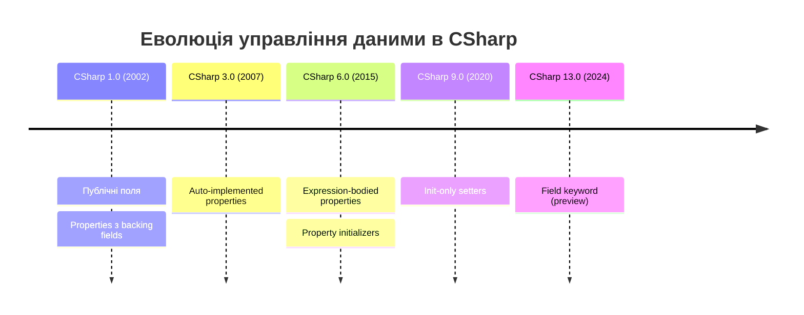
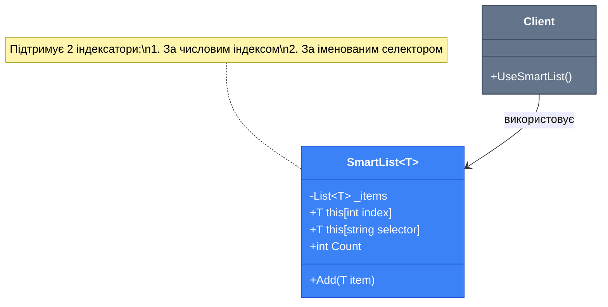
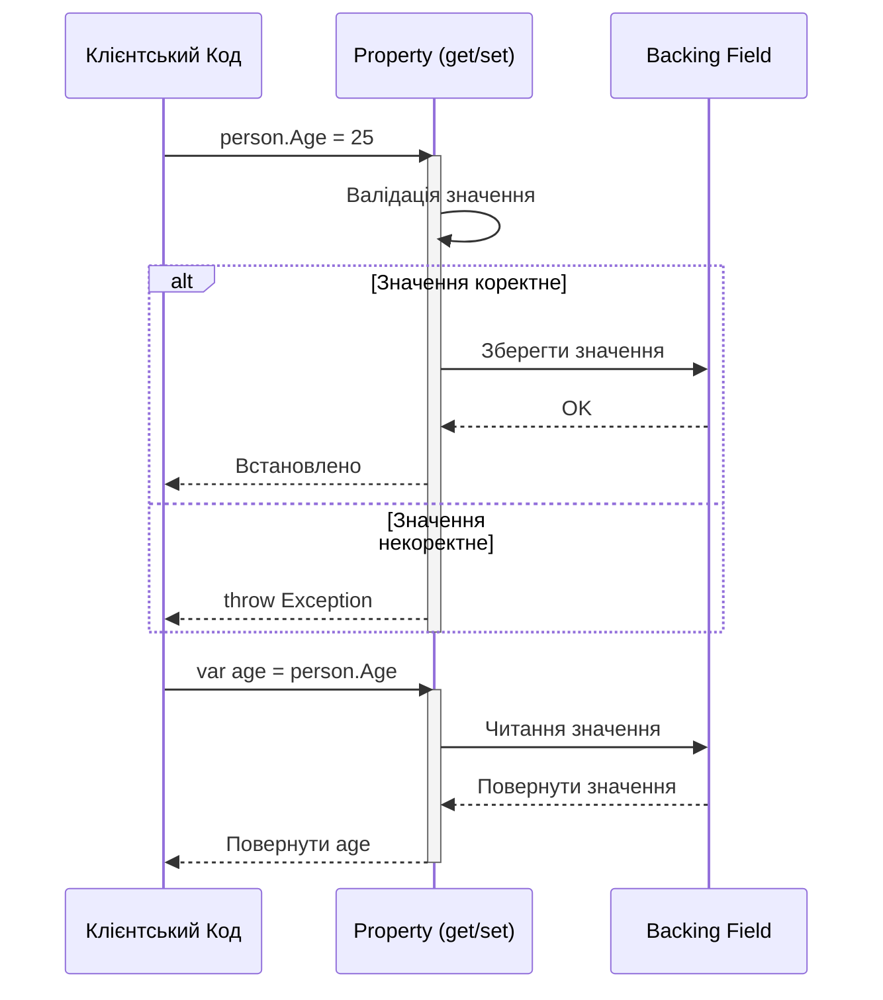

# Властивості та Поля

## Вступ: Проблема Контролю Доступу

Уявіть, що ви створюєте клас для представлення банківського рахунку. Найпростіший підхід — зробити баланс публічним полем:

```csharp showLineNumbers
public class BankAccount
{
    public decimal Balance; // Небезпечно!
}

var account = new BankAccount();
account.Balance = -1000; // Ніхто не заважає встановити негативний баланс!
```

Проблема очевидна: будь-який код може встановити некоректне значення. Нам потрібен механізм **контролю доступу** до даних. Саме для цього в C# існують **Properties (Властивості)** — вони надають інкапсуляцію та дозволяють додавати логіку при читанні або записі даних.

::note
**Інкапсуляція (Encapsulation)** — один з фундаментальних принципів ООП, який передбачає приховування внутрішньої реалізації об'єкта та надання контрольованого доступу до його стану через публічний інтерфейс. Детальніше про принципи ООП можна прочитати в [наступному розділі](./4.oop-pillars.md).
::

## Еволюція: Від Полів до Властивостей

Історично підходи до управління даними в класах еволюціонували:

::mermaid



::

## Фундаментальні Концепції

### Fields (Поля)

[**Field (Поле)**](https://learn.microsoft.com/en-us/dotnet/csharp/programming-guide/classes-and-structs/fields) — це змінна, оголошена безпосередньо в класі або структурі. Поля зберігають дані об'єкта.

```csharp showLineNumbers
public class Person
{
    // Приватне поле (backing field)
    private string _firstName;

    // Публічне поле (не рекомендується)
    public int Age;

    // Поле тільки для читання (readonly)
    private readonly DateTime _birthDate;

    // [Константа](https://learn.microsoft.com/en-us/dotnet/csharp/language-reference/keywords/const)
    private const int MaxAge = 150;
}
```

**Характеристики полів:**

| Характеристика           | Опис                                                              |
| :----------------------- | :---------------------------------------------------------------- |
| **Модифікатори доступу** | `private`, `protected`, `internal`, `public`                      |
| **Readonly**             | Може бути ініціалізовано тільки при оголошенні або в конструкторі |
| **Const**                | Значення визначається на етапі компіляції, неявно `static`        |
| **Використання**         | Зазвичай приватні, як backing fields для властивостей             |

### Properties (Властивості)

[**Property (Властивість)**](https://learn.microsoft.com/en-us/dotnet/csharp/programming-guide/classes-and-structs/properties) — це член класу, який надає гнучкий механізм читання, запису або обчислення значення приватного поля через **accessors (аксесори)**: [`get`](https://learn.microsoft.com/en-us/dotnet/csharp/language-reference/keywords/get) та [`set`](https://learn.microsoft.com/en-us/dotnet/csharp/language-reference/keywords/set).

```csharp showLineNumbers
public class Person
{
    private string _firstName; // Backing field

    // Властивість з повною реалізацією
    public string FirstName
    {
        get
        {
            return _firstName;
        }
        set
        {
            if (string.IsNullOrWhiteSpace(value))
                throw new ArgumentException("Ім'я не може бути порожнім");

            _firstName = value.Trim();
        }
    }
}
```

**Переваги властивостей над полями:**

::tip
✅ **Валідація**: Можна перевіряти дані перед встановленням  
✅ **Інкапсуляція**: Приховування внутрішньої реалізації  
✅ **Обчислювані значення**: Властивість може повертати обчислене значення  
✅ **Зворотна сумісність**: Зміна поля на властивість не ламає API
✅ **Підтримка інтерфейсів**: Інтерфейси можуть оголошувати властивості, але не поля

::

::tip
Для глибшого розуміння цієї теми рекомендуємо ознайомитись з попереднім матеріалом: [Класи та Об'єкти](./2.classes-objects.md).
::

Властивості, на відміну від полів, не є простими змінними. На рівні проміжної мови (Intermediate Language, IL), компілятор перетворює властивість на пару методів: `get_PropertyName()` та `set_PropertyName()`. Це означає, що кожне звернення до властивості насправді є викликом методу, що й дозволяє додавати логіку валідації, обчислень чи логування. Поля, навпаки, транслюються в прямі операції з пам'яттю, що робить їх швидшими, але менш гнучкими.

### Expression-Bodied Properties

Для простих властивостей можна використовувати скорочений синтаксис:

```csharp showLineNumbers
public class Person
{
    private string _firstName;
    private string _lastName;

    // Read-only властивість з expression body
    public string FullName => $"{_firstName} {_lastName}";

    // Властивість з expression-bodied get/set
    public string FirstName
    {
        get => _firstName;
        set => _firstName = value?.Trim() ?? throw new ArgumentNullException(nameof(value));
    }
}
```

### Порівняння: Fields vs Properties

| Критерій              | Fields (Поля)        | Properties (Властивості)   |
| :-------------------- | :------------------- | :------------------------- |
| **Синтаксис доступу** | `obj.field`          | `obj.Property`             |
| **Валідація**         | ❌ Немає             | ✅ Так, в `set` accessor   |
| **Інкапсуляція**      | ❌ Пряме зберігання  | ✅ Контрольований доступ   |
| **Обчислення**        | ❌ Завжди значення   | ✅ Може обчислюватись      |
| **Інтерфейси**        | ❌ Не підтримуються  | ✅ Підтримуються           |
| **Продуктивність**    | Трохи швидше         | Може бути незначна різниця |
| **Використання**      | Внутрішнє зберігання | Публічний API              |

::mermaid


::

::tip
Для глибшого розуміння цієї теми рекомендуємо ознайомитись з попереднім матеріалом: [Класи та Об'єкти](./2.classes-objects.md).
::

## Auto-Implemented Properties

[**Auto-implemented properties (Автоматично реалізовані властивості)**](https://learn.microsoft.com/en-us/dotnet/csharp/programming-guide/classes-and-structs/auto-implemented-properties) — це синтаксичний цукор, коли компілятор автоматично створює приватне backing field.

### Базовий Синтаксис

```csharp showLineNumbers
public class Product
{
    // Auto-implemented property - компілятор створює приховане backing field
    public string Name { get; set; }

    // Еквівалентно:
    // private string <Name>k__BackingField;
    // public string Name
    // {
    //     get => <Name>k__BackingField;
    //     set => <Name>k__BackingField = value;
    // }
}
```

### Варіації Auto-Implemented Properties

::code-group

```csharp [Read-Write]
public string Name { get; set; }
```

```csharp [Read-Only]
public string Name { get; }
// Можна встановити тільки в конструкторі
```

```csharp [Private Setter]
public string Name { get; private set; }
// Зовнішній код може тільки читати
```

```csharp [З ініціалізацією]
public string Name { get; set; } = "Unknown";
// Значення за замовчуванням
```

::

### Приклад використання

```csharp showLineNumbers
public class Book
{
    // Auto-implemented з ініціалізацією
    public string Title { get; set; } = string.Empty;

    // Private setter - зовнішній код не може змінювати
    public string ISBN { get; private set; }

    // Read-only - можна встановити тільки в конструкторі
    public DateTime PublishedDate { get; }

    public Book(string isbn, DateTime publishedDate)
    {
        ISBN = isbn;
        PublishedDate = publishedDate; // OK в конструкторі
    }

    public void UpdateISBN(string newIsbn)
    {
        ISBN = newIsbn; // OK всередині класу
    }
}

// Використання
var book = new Book("978-0-123456-47-2", DateTime.Now);
Console.WriteLine(book.ISBN); // OK - читання
// book.ISBN = "новий"; // ПОМИЛКА - private setter
```

::tip
**Best Practice**: Використовуйте auto-implemented properties для простих випадків без валідації. Це робить код чистішим і читабельнішим.

Для глибшого розуміння цієї теми рекомендуємо ознайомитись з попереднім матеріалом: [Класи та Об'єкти](./2.classes-objects.md).
::

Хоча автоматично реалізовані властивості є надзвичайно зручними, важливо розуміти їхні обмеження. Вони ідеально підходять для сценаріїв, де властивість є простим сховищем даних без додаткової логіки. Як тільки виникає потреба у валідації, логуванні, обчисленні значення "на льоту" або виконанні будь-яких побічних ефектів при читанні чи записі, необхідно переходити до повної реалізації властивості з явним `backing field`.

## Init Accessors (C# 9+)

### Проблема: Immutable Objects

До C# 9, створення незмінних об'єктів (immutable objects) було незручним:

::code-group

```csharp [Проблема: Readonly Properties]
public class Person
{
    public string Name { get; } // Тільки конструктор
    public int Age { get; }

    // Треба передавати ВСІ параметри
    public Person(string name, int age)
    {
        Name = name;
        Age = age;
    }
}

// Незручно для об'єктів з багатьма властивостями
var person = new Person("Іван", 25);
```

```csharp [Рішення: Init Accessor]
public class Person
{
    public string Name { get; init; } // C# 9+
    public int Age { get; init; }
}

// Object initializer syntax!
var person = new Person
{
    Name = "Іван",
    Age = 25
};

// person.Name = "Петро"; // ПОМИЛКА після ініціалізації
```

::

### Синтаксис init Accessor

[**Init accessor**](https://learn.microsoft.com/en-us/dotnet/csharp/language-reference/keywords/init) дозволяє встановити значення властивості **тільки під час ініціалізації об'єкта** (в конструкторі або object initializer).

```csharp showLineNumbers
public class ImmutablePerson
{
    public string Name { get; init; }
    public int Age { get; init; }
    public string Email { get; init; }
}

// Використання
var person = new ImmutablePerson
{
    Name = "Іван",
    Age = 25,
    Email = "ivan@example.com"
};

// Після створення - тільки читання
Console.WriteLine(person.Name); // OK
// person.Age = 26; // ПОМИЛКА КОМПІЛЯЦІЇ!
```

### Init з Валідацією

Можна додати валідацію в `init` accessor:

```csharp showLineNumbers
public class ValidatedPerson
{
    private string _name;
    private int _age;

    public string Name
    {
        get => _name;
        init
        {
            if (string.IsNullOrWhiteSpace(value))
                throw new ArgumentException("Ім'я не може бути порожнім");
            _name = value.Trim();
        }
    }

    public int Age
    {
        get => _age;
        init
        {
            if (value < 0 || value > 150)
                throw new ArgumentOutOfRangeException(nameof(value),
                    "Вік має бути від 0 до 150");
            _age = value;
        }
    }
}
```

### Порівняння: readonly vs init

| Характеристика   | `{ get; }` (readonly)      | `{ get; init; }`                     |
| :--------------- | :------------------------- | :----------------------------------- |
| **Встановлення** | Тільки в конструкторі      | Конструктор + object initializer     |
| **Синтаксис**    | `new(param1, param2)`      | `new { Prop1 = val1, Prop2 = val2 }` |
| **Зручність**    | Багато параметрів незручно | Object initializer зручніше          |
| **Валідація**    | Можлива                    | Можлива                              |
| **Версія C#**    | Будь-яка                   | C# 9+                                |

::note
**Record types** в C# 9+ автоматично використовують `init` accessors для створення незмінних об'єктів з concise syntax. Детальніше про record types можна прочитати в [офіційній документації C#](https://learn.microsoft.com/en-us/dotnet/csharp/language-reference/builtin-types/record).
::

Незмінність (immutability) є ключовою концепцією функціонального програмування, яка набуває все більшої популярності в об'єктно-орієнтованих мовах, як-от C#. Об'єкти, стан яких неможливо змінити після створення, є більш передбачуваними та безпечними для використання у багатопотокових середовищах, оскільки вони не потребують синхронізації доступу. `init` аксесори є потужним інструментом для побудови таких незмінних типів, поєднуючи безпеку `readonly` полів зі зручністю синтаксису ініціалізаторів об'єктів.

## Field Keyword (C# 13/14 Preview)

::warning
**Preview Feature**: Ключове слово `field` знаходиться в режимі preview в C# 13 і планується до офіційного релізу в C# 14. Для використання потрібно увімкнути preview features.
::

### Проблема: Semi-Auto Properties

Іноді потрібна auto-implemented property, але з невеликою логікою (наприклад, trim значення):

::code-group

```csharp [До C# 13: Багато коду]
public class Person
{
    private string _middleName; // Треба оголошувати backing field

    public string MiddleName
    {
        get => _middleName; // Дублювання
        set => _middleName = value?.Trim(); // Проста логіка
    }
}
```

```csharp [C# 13+: field keyword]
public class Person
{
    // Компілятор створює backing field автоматично
    public string MiddleName
    {
        get; // Або: get => field;
        set => field = value?.Trim();
    }
}
```

::

### Що таке field keyword?

[**`field` keyword**](https://learn.microsoft.com/en-us/dotnet/csharp/language-reference/keywords/field) — це **контекстне ключове слово**, яке надає доступ до **compiler-synthesized backing field** у властивостях. Це дозволяє писати **semi-auto properties** — частково автоматичні властивості.

```csharp showLineNumbers
public class TimeSlot
{
    // Компілятор синтезує backing field автоматично
    public int Hours
    {
        get; // Автоматичний get accessor
        set  // Власна логіка в set
        {
            if (value >= 0 && value <= 23)
            {
                field = value; // Доступ до синтезованого поля
            }
            else
            {
                throw new ArgumentOutOfRangeException(nameof(value),
                    "Години мають бути від 0 до 23");
            }
        }
    }
}
```

### Де можна використовувати field

```csharp showLineNumbers
public class Example
{
    // ✅ set accessor з валідацією
    public int Value
    {
        get;
        set => field = value >= 0 ? value : 0;
    }

    // ✅ init accessor з валідацією
    public string Name
    {
        get;
        init => field = value?.Trim() ?? throw new ArgumentNullException();
    }

    // ✅ Обидва accessors
    public decimal Price
    {
        get => field;
        set => field = Math.Round(value, 2);
    }
}
```

### Увімкнення Preview Features

Щоб використовувати `field` keyword:

::steps

### Крок 1: Оновіть .csproj файл

```xml [project.csproj]
<Project Sdk="Microsoft.NET.Sdk">
  <PropertyGroup>
    <TargetFramework>net9.0</TargetFramework>
    <LangVersion>preview</LangVersion>
    <EnablePreviewFeatures>true</EnablePreviewFeatures>
  </PropertyGroup>
</Project>
```

### Крок 2: Використовуйте field у властивостях

```csharp
public string Email
{
    get;
    set => field = value?.ToLowerInvariant();
}
```

::

### Порівняльна Таблиця Підходів

| Підхід               | Синтаксис                 | Backing Field       | Валідація | Складність |
| :------------------- | :------------------------ | :------------------ | :-------- | :--------- |
| **Повна реалізація** | Manual get/set            | Оголошується вручну | ✅ Так    | Висока     |
| **Auto property**    | `{ get; set; }`           | Автоматичне         | ❌ Ні     | Низька     |
| **field keyword**    | `get; set => field = ...` | Автоматичне         | ✅ Так    | Середня    |

::tip
**Best Practice**: Використовуйте `field` keyword для властивостей, де потрібна проста валідація або трансформація, але не хочеться вручну оголошувати backing field.

Для глибшого розуміння цієї теми рекомендуємо ознайомитись з попереднім матеріалом: [Класи та Об'єкти](./2.classes-objects.md).
::

Ключове слово `field` є елегантною відповіддю на давню проблему "багатослівних" властивостей. Раніше розробникам доводилося обирати між абсолютно лаконічною автоматичною властивістю (без логіки) та повною реалізацією з явним `backing field` (навіть для найпростішої логіки, як-от `INotifyPropertyChanged`). `field` заповнює цю прогалину, дозволяючи додавати логіку до аксесорів, не жертвуючи при цьому лаконічністю, оскільки компілятор все ще генерує поле для зберігання даних за лаштунками. Це робить код чистішим і зменшує кількість шаблонного коду.

## Indexers (Індексатори)

[**Indexer (Індексатор)**](https://learn.microsoft.com/en-us/dotnet/csharp/programming-guide/indexers/) — це властивість, яка дозволяє індексувати об'єкти як масиви або колекції, використовуючи синтаксис `[]`.

Подібно до властивостей, індексатори є синтаксичним цукром. На рівні IL-коду компілятор перетворює індексатор на методи, які зазвичай називаються `get_Item` та `set_Item`, що приймають індекс як параметр. Це дозволяє класам імітувати поведінку масивів або словників, надаючи при цьому повний контроль над внутрішньою логікою доступу до даних.

### Базовий Синтаксис

```csharp showLineNumbers
public class WeekTemperatures
{
    private float[] _temperatures = new float[7];

    // Indexer - використовує ключове слово 'this'
    public float this[int day]
    {
        get
        {
            if (day < 0 || day > 6)
                throw new ArgumentOutOfRangeException(nameof(day));
            return _temperatures[day];
        }
        set
        {
            if (day < 0 || day > 6)
                throw new ArgumentOutOfRangeException(nameof(day));
            _temperatures[day] = value;
        }
    }
}

// Використання
var week = new WeekTemperatures();
week[0] = 22.5f; // Понеділок
week[1] = 24.0f; // Вівторок
Console.WriteLine($"Температура в понеділок: {week[0]}°C");
```

### Read-Only Indexer

```csharp showLineNumbers
public class FibonacciSequence
{
    // Тільки для читання - expression-bodied
    public int this[int index] => index switch
    {
        0 => 0,
        1 => 1,
        _ => this[index - 1] + this[index - 2]
    };
}

var fib = new FibonacciSequence();
Console.WriteLine(fib[10]); // 55
```

### Індексатори з Різними Типами

```csharp showLineNumbers
public class PhoneBook
{
    private Dictionary<string, string> _contacts = new();

    // Індексатор з string ключем
    public string this[string name]
    {
        get => _contacts.TryGetValue(name, out var phone) ? phone : "Не знайдено";
        set => _contacts[name] = value;
    }
}

var book = new PhoneBook();
book["Іван"] = "+380123456789";
Console.WriteLine(book["Іван"]); // +380123456789
```

### Індексатори з Багатьма Параметрами

```csharp showLineNumbers
public class Matrix
{
    private int[,] _data = new int[3, 3];

    // Багатовимірний індексатор
    public int this[int row, int col]
    {
        get
        {
            ValidateIndices(row, col);
            return _data[row, col];
        }
        set
        {
            ValidateIndices(row, col);
            _data[row, col] = value;
        }
    }

    private void ValidateIndices(int row, int col)
    {
        if (row < 0 || row > 2 || col < 0 || col > 2)
            throw new ArgumentOutOfRangeException();
    }
}

var matrix = new Matrix();
matrix[0, 0] = 1;
matrix[1, 1] = 5;
Console.WriteLine(matrix[0, 0]); // 1
```

### Індексатори в Інтерфейсах

```csharp showLineNumbers
public interface IDataStore<T>
{
    T this[int index] { get; set; } // Оголошення в інтерфейсі
}

::tip
Для глибшого розуміння цієї теми рекомендуємо ознайомитись з попереднім матеріалом: [Класи та Об'єкти](./2.classes-objects.md).
::

public class DataStore<T> : IDataStore<T>
{
    private T[] _data = new T[100];

    public T this[int index]
    {
        get => _data[index];
        set => _data[index] = value;
    }
}
```

### Приклад: Досконала Колекція

::code-group

```csharp [SmartList.cs] showLineNumbers
public class SmartList<T>
{
    private List<T> _items = new();

    // Індексатор з валідацією
    public T this[int index]
    {
        get
        {
            if (index < 0 || index >= _items.Count)
                throw new IndexOutOfRangeException(
                    $"Індекс {index} поза межами [0, {_items.Count - 1}]");
            return _items[index];
        }
        set
        {
            if (index < 0 || index >= _items.Count)
                throw new IndexOutOfRangeException(
                    $"Індекс {index} поза межами [0, {_items.Count - 1}]");
            _items[index] = value;
        }
    }

    // Індексатор з іменованим доступом (string)
    public T this[string selector]
    {
        get => selector.ToLower() switch
        {
            "first" => _items.FirstOrDefault(),
            "last" => _items.LastOrDefault(),
            _ => throw new ArgumentException($"Невідомий селектор: {selector}")
        };
    }

    public void Add(T item) => _items.Add(item);
    public int Count => _items.Count;
}
```

```csharp [Program.cs] showLineNumbers
var list = new SmartList<string>();
list.Add("Apple");
list.Add("Banana");
list.Add("Cherry");

// Числовий індексатор
Console.WriteLine(list[0]); // Apple
list[1] = "Blueberry";

// Іменований індексатор
Console.WriteLine(list["first"]); // Apple
Console.WriteLine(list["last"]);  // Cherry
```

::

::mermaid



::

## Візуалізація: Property Lifecycle

::mermaid



::

## Практичні Приклади

### Приклад 1: Клас Product з Валідацією

```csharp showLineNumbers
public class Product
{
    private decimal _price;
    private int _quantity;

    public string Name { get; init; } = string.Empty;

    public decimal Price
    {
        get => _price;
        set
        {
            if (value < 0)
                throw new ArgumentException("Ціна не може бути від'ємною");
            _price = Math.Round(value, 2); // Округлення до 2 знаків
        }
    }

    public int Quantity
    {
        get => _quantity;
        set
        {
            if (value < 0)
                throw new ArgumentException("Кількість не може бути від'ємною");
            _quantity = value;
        }
    }

    // Обчислювана властивість
    public decimal TotalValue => Price * Quantity;

    // Expression-bodied read-only
    public bool IsInStock => Quantity > 0;
}
```

### Приклад 2: Конфігурація з field keyword

```csharp showLineNumbers
public class AppConfiguration
{
    // Semi-auto property з нормалізацією
    public string ServerUrl
    {
        get;
        set => field = value?.TrimEnd('/').ToLowerInvariant()
            ?? throw new ArgumentNullException(nameof(value));
    }

    // Валідація діапазону
    public int MaxConnections
    {
        get;
        set => field = value is >= 1 and <= 1000
            ? value
            : throw new ArgumentOutOfRangeException(nameof(value));
    }

    // Init з валідацією
    public int Port
    {
        get;
        init => field = value is >= 1 and <= 65535
            ? value
            : throw new ArgumentOutOfRangeException(nameof(value));
    }
}
```


<!-- Search Query: C# field keyword IDE screenshot validation -->

## Troubleshooting: Типові Помилки

### Помилка 1: Публічні Поля Замість Властивостей

::warning
**Анти-паттерн**: Використання публічних полів
::

::code-group

```csharp [❌ Неправильно]
public class User
{
    public string Email; // Публічне поле - немає валідації
}

var user = new User();
user.Email = "invalid"; // Некоректний email!
```

```csharp [✅ Правильно]
public class User
{
    private string _email;

    public string Email
    {
        get => _email;
        set
        {
            if (!IsValidEmail(value))
                throw new ArgumentException("Некоректний email");
            _email = value.ToLowerInvariant();
        }
    }

    private bool IsValidEmail(string email)
        => email?.Contains('@') == true;
}
```

::

::tip
Для глибшого розуміння цієї теми рекомендуємо ознайомитись з попереднім матеріалом: [Класи та Об'єкти](./2.classes-objects.md).
::

### Помилка 2: Забута Валідація

```csharp showLineNumbers
// ❌ Небезпечно
public class BankAccount
{
    public decimal Balance { get; set; } // Можна встановити від'ємне!
}

// ✅ Безпечно
public class BankAccount
{
    private decimal _balance;

    public decimal Balance
    {
        get => _balance;
        private set // Тільки клас може змінювати напряму
        {
            if (value < 0)
                throw new InvalidOperationException("Баланс не може бути від'ємним");
            _balance = value;
        }
    }

    public void Deposit(decimal amount)
    {
        if (amount <= 0)
            throw new ArgumentException("Сума має бути додатною");
        Balance += amount;
    }

    public void Withdraw(decimal amount)
    {
        if (amount <= 0)
            throw new ArgumentException("Сума має бути додатною");
        if (Balance - amount < 0)
            throw new InvalidOperationException("Недостатньо коштів");
        Balance -= amount;
    }
}
```

::tip
Для глибшого розуміння цієї теми рекомендуємо ознайомитись з попереднім матеріалом: [Класи та Об'єкти](./2.classes-objects.md).
::

::tip
Для глибшого розуміння цієї теми рекомендуємо ознайомитись з попереднім матеріалом: [Класи та Об'єкти](./2.classes-objects.md).
::

::tip
**Рішення**: Додайте в `.csproj`:

```xml
<LangVersion>preview</LangVersion>
<EnablePreviewFeatures>true</EnablePreviewFeatures>
```

Для глибшого розуміння цієї теми рекомендуємо ознайомитись з попереднім матеріалом: [Класи та Об'єкти](./2.classes-objects.md).
::

### Помилка 3: Неправильне Використання init vs set

```csharp showLineNumbers
// ❌ Проблема: init дозволяє змінювати після створення через with
public class Config
{
    public string ApiKey { get; init; } // Здається незмінним
}

var config = new Config { ApiKey = "secret123" };
var modified = config with { ApiKey = "hacked!" }; // Упс!

// ✅ Рішення: readonly для справжньої незмінності
public class Config
{
    public string ApiKey { get; }

    public Config(string apiKey)
    {
        ApiKey = apiKey;
    }
}
```

### Помилка 4: Preview Features Без Увімкнення

```csharp showLineNumbers
// ❌ Помилка компіляції: CS9258
public class Example
{
    public string Name
    {
        get;
        set => field = value?.Trim(); // 'field' unavailable
    }
}
```

::tip
**Рішення**: Додайте в `.csproj`:

```xml
<LangVersion>preview</LangVersion>
<EnablePreviewFeatures>true</EnablePreviewFeatures>
```

::tip
Для глибшого розуміння цієї теми рекомендуємо ознайомитись з попереднім матеріалом: [Класи та Об'єкти](./2.classes-objects.md).
::

::

## Практичні Завдання

### Рівень 1: Базові Властивості

::steps

### Завдання 1.1

Створіть клас `Student` з наступними auto-implemented properties:

-   `FirstName` (string, get/set)
-   `LastName` (string, get/set)
-   `StudentId` (int, get, private set)
-   `EnrollmentDate` (DateTime, get only)

Додайте властивість `FullName`, яка повертає `FirstName + " " + LastName`.

::collapsible{title="Показати рішення"}

```csharp showLineNumbers
public class Student
{
    public string FirstName { get; set; }
    public string LastName { get; set; }
    public int StudentId { get; private set; }
    public DateTime EnrollmentDate { get; }

    // Обчислювана властивість
    public string FullName => $"{FirstName} {LastName}";

    public Student(int studentId, DateTime enrollmentDate)
    {
        StudentId = studentId;
        EnrollmentDate = enrollmentDate;
    }

    public void UpdateStudentId(int newId)
    {
        StudentId = newId; // Можна змінювати всередині класу
    }
}

// Використання
var student = new Student(12345, DateTime.Now)
{
    FirstName = "Іван",
    LastName = "Петренко"
};

Console.WriteLine(student.FullName); // Іван Петренко
Console.WriteLine(student.EnrollmentDate.ToShortDateString());
```

::

::tip
Для глибшого розуміння цієї теми рекомендуємо ознайомитись з попереднім матеріалом: [Класи та Об'єкти](./2.classes-objects.md).
::

### Рівень 2: Init Accessors та Валідація

### Завдання 2.1

Створіть клас `EmailMessage` з наступними вимогами:

-   Властивості `To`, `Subject`, `Body` мають використовувати `init` accessor
-   Додайте валідацію:
    -   `To` має містити `@`
    -   `Subject` не може бути порожнім і має максимум 100 символів
    -   `Body` не може бути `null`
-   Додайте read-only властивість `CreatedAt`, яка зберігає час створення

::collapsible{title="Показати рішення"}

```csharp showLineNumbers
public class EmailMessage
{
    private string _to;
    private string _subject;
    private string _body;

    public string To
    {
        get => _to;
        init
        {
            if (string.IsNullOrWhiteSpace(value) || !value.Contains('@'))
                throw new ArgumentException("Email має містити @");
            _to = value.Trim().ToLowerInvariant();
        }
    }

    public string Subject
    {
        get => _subject;
        init
        {
            if (string.IsNullOrWhiteSpace(value))
                throw new ArgumentException("Тема не може бути порожньою");
            if (value.Length > 100)
                throw new ArgumentException("Тема не може перевищувати 100 символів");
            _subject = value.Trim();
        }
    }

    public string Body
    {
        get => _body;
        init
        {
            _body = value?.Trim() ?? throw new ArgumentNullException(nameof(value));
        }
    }

    public DateTime CreatedAt { get; } = DateTime.UtcNow;
}

// Використання
var email = new EmailMessage
{
    To = "user@example.com",
    Subject = "Вітаємо!",
    Body = "Дякуємо за реєстрацію."
};

Console.WriteLine($"Email створено: {email.CreatedAt}");

// email.Subject = "Нова тема"; // ПОМИЛКА - тільки init!
```

::

::tip
Для глибшого розуміння цієї теми рекомендуємо ознайомитись з попереднім матеріалом: [Класи та Об'єкти](./2.classes-objects.md).
::

### Рівень 3: Indexers та Field Keyword

::steps

### Завдання 3.1

Створіть клас `ShoppingCart` з:

1. Індексатором для доступу до товарів за назвою
2. Властивість `TotalItems` (кількість унікальних товарів)
3. Властивість `TotalPrice` (загальна вартість)
4. Використайте `field` keyword для властивості `DiscountPercent` з валідацією (0-100)

::collapsible{title="Показати рішення"}

```csharp showLineNumbers
public class ShoppingCart
{
    private Dictionary<string, CartItem> _items = new();

    // Індексатор для доступу за назвою товару
    public CartItem this[string productName]
    {
        get => _items.TryGetValue(productName, out var item)
            ? item
            : null;
        set
        {
            if (value == null)
                _items.Remove(productName);
            else
                _items[productName] = value;
        }
    }

    // Властивість з field keyword та валідацією
    public decimal DiscountPercent
    {
        get;
        set => field = value is >= 0 and <= 100
            ? value
            : throw new ArgumentOutOfRangeException(nameof(value),
                "Знижка має бути від 0 до 100%");
    }

    // Обчислювані властивості
    public int TotalItems => _items.Count;

    public decimal TotalPrice
    {
        get
        {
            var subtotal = _items.Values.Sum(item => item.Price * item.Quantity);
            return subtotal * (1 - DiscountPercent / 100);
        }
    }

    public void AddItem(string name, decimal price, int quantity)
    {
        this[name] = new CartItem(name, price, quantity);
    }

    public void RemoveItem(string name)
    {
        this[name] = null;
    }
}

public record CartItem(string Name, decimal Price, int Quantity);

// Використання
var cart = new ShoppingCart();
cart.AddItem("Laptop", 25000, 1);
cart.AddItem("Mouse", 500, 2);
cart.DiscountPercent = 10;

Console.WriteLine($"Товарів: {cart.TotalItems}");
Console.WriteLine($"Сума: {cart.TotalPrice:C}");
Console.WriteLine($"Mouse кількість: {cart["Mouse"].Quantity}");

cart["Mouse"] = new CartItem("Mouse", 500, 3); // Оновлення
```

::tip
Для глибшого розуміння цієї теми рекомендуємо ознайомитись з попереднім матеріалом: [Класи та Об'єкти](./2.classes-objects.md).
::

### Завдання 3.2: Двовимірний Індексатор

Створіть клас `Spreadsheet`, який реалізує:

-   Двовимірний індексатор `[row, col]` для доступу до комірок
-   Зберігання даних у словнику (щоб не витрачати пам'ять на порожні комірки)
-   Метод `GetUsedCells()` який повертає список координат заповнених комірок

::collapsible{title="Показати рішення"}

```csharp showLineNumbers
public class Spreadsheet
{
    private Dictionary<(int row, int col), string> _cells = new();

    public string this[int row, int col]
    {
        get
        {
            ValidateIndices(row, col);
            return _cells.TryGetValue((row, col), out var value) ? value : string.Empty;
        }
        set
        {
            ValidateIndices(row, col);

            if (string.IsNullOrEmpty(value))
                _cells.Remove((row, col)); // Очистити комірку
            else
                _cells[(row, col)] = value;
        }
    }

    public int UsedCellsCount => _cells.Count;

    public List<(int row, int col)> GetUsedCells()
    {
        return _cells.Keys.OrderBy(k => k.row).ThenBy(k => k.col).ToList();
    }

    private void ValidateIndices(int row, int col)
    {
        if (row < 0 || col < 0)
            throw new ArgumentOutOfRangeException("Індекси мають бути невід'ємними");
    }

    public void Print()
    {
        var cells = GetUsedCells();
        foreach (var (row, col) in cells)
        {
            Console.WriteLine($"[{row}, {col}] = {this[row, col]}");
        }
    }
}

// Використання
var sheet = new Spreadsheet();
sheet[0, 0] = "Name";
sheet[0, 1] = "Age";
sheet[1, 0] = "Іван";
sheet[1, 1] = "25";
sheet[2, 0] = "Марія";
sheet[2, 1] = "30";

Console.WriteLine($"Використано {sheet.UsedCellsCount} комірок");
sheet.Print();

// Результат:
// Використано 6 комірок
// [0, 0] = Name
// [0, 1] = Age
// [1, 0] = Іван
// [1, 1] = 25
// [2, 0] = Марія
// [2, 1] = 30
```

::


<!-- Search Query: C# indexer multidimensional example output console -->

## Резюме

У цьому розділі ви вивчили:

::tip{title="Ключові Концепції"}
✅ **Fields vs Properties**: Поля для внутрішнього зберігання, властивості для публічного API  
✅ **Auto-implemented Properties**: Синтаксичний цукор для простих властивостей  
✅ **Init Accessors**: Створення immutable об'єктів з зручним синтаксисом  
✅ **Field Keyword**: Semi-auto properties з доступом до backing field (C# 13+)  
✅ **Indexers**: Надання array-like доступу до даних об'єкта  
✅ **Best Practices**: Завжди використовуйте властивості для публічних даних з валідацією

**Наступні Кроки**: У наступному розділі ви дізнаєтеся про [методи, делегати та події](./4.oop-pillars.md), які дозволяють визначати поведінку класів та реалізовувати шаблон спостерігача (Observer pattern).
::

**Наступні Кроки**: У наступному розділі ви дізнаєтеся про методи, делегати та події, які дозволяють визначати поведінку класів та реалізовувати шаблон спостерігача (Observer pattern).
