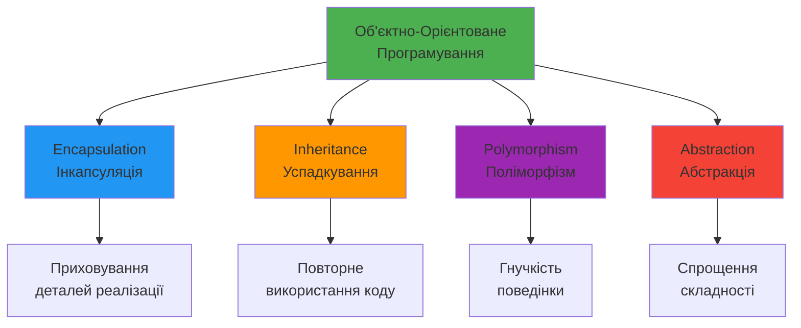
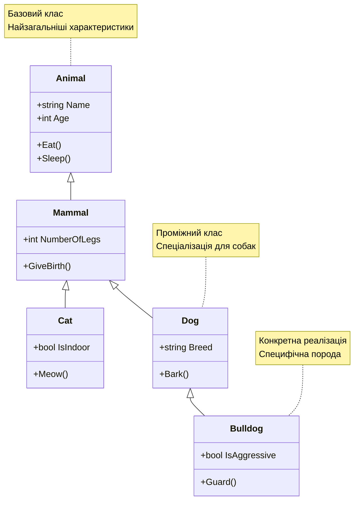
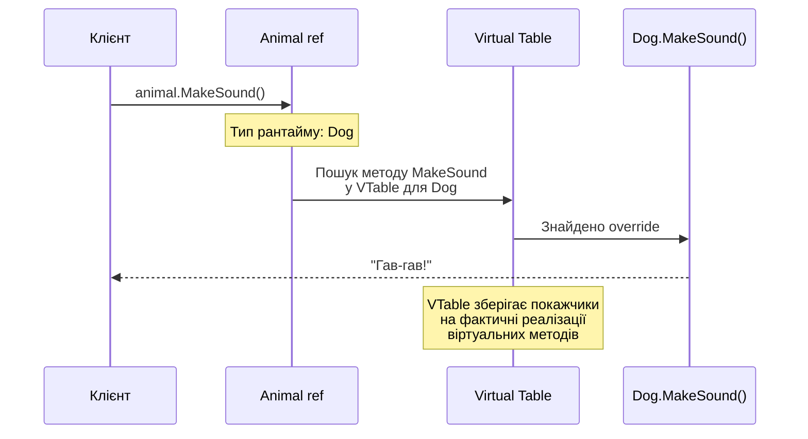
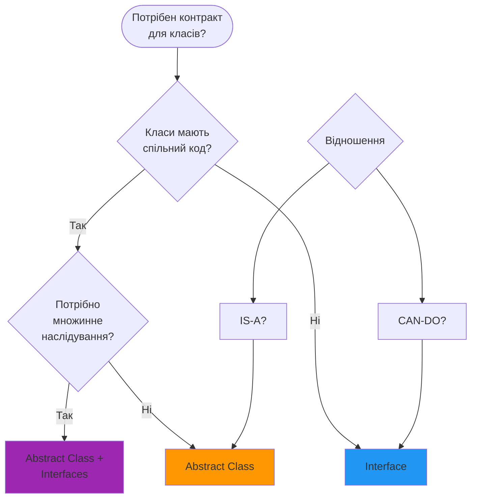
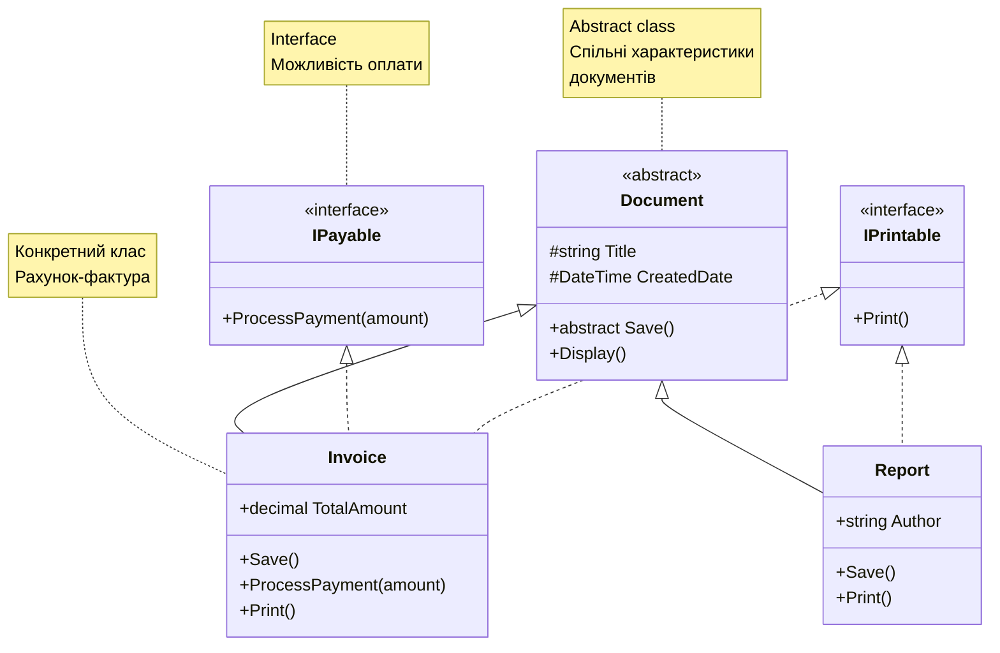

# Стовпи ООП

## Вступ: Чому ООП?

Уявіть, що ви пишете програму для управління автопарком. У структурному програмуванні ви б створили безліч змінних та функцій:

```csharp showLineNumbers
// Структурний підхід - важко підтримувати
string car1Brand = "Toyota";
int car1Year = 2020;
decimal car1Price = 25000;

string car2Brand = "Honda";
int car2Year = 2021;
decimal car2Price = 28000;

void PrintCarInfo(string brand, int year, decimal price)
{
    Console.WriteLine($"{brand} ({year}): ${price}");
}
```

Проблеми очевидні: дублювання коду, важко масштабувати, відсутність зв'язку між даними та поведінкою. **Об'єктно-орієнтоване Програмування (ООП)** вирішує ці проблеми через чотири фундаментальні принципи.

::note
**Об'єктно-орієнтоване Програмування (Object-Oriented Programming, OOP)** — це парадигма програмування, яка організує код навколо **об'єктів** (комбінація даних та поведінки) замість функцій та логіки.
::

## Чотири Стовпи ООП

::mermaid



::

| Принцип          | Англійська    | Мета                                      | Ключові слова                    |
| :--------------- | :------------ | :---------------------------------------- | :------------------------------- |
| **Інкапсуляція** | Encapsulation | Приховування внутрішньої реалізації       | `private`, `public`, `protected` |
| **Успадкування** | Inheritance   | Створення нових класів на основі існуючих | `:`, `base`                      |
| **Поліморфізм**  | Polymorphism  | Різна поведінка для схожих об'єктів       | `virtual`, `override`, `new`     |
| **Абстракція**   | Abstraction   | Визначення контракту без деталей          | `abstract`, `interface`          |

## 1. Encapsulation (Інкапсуляція)

### Визначення

[**Encapsulation (Інкапсуляція)**](https://learn.microsoft.com/en-us/dotnet/csharp/fundamentals/tutorials/oop#encapsulation) — це принцип приховування **внутрішньої реалізації** об'єкта та надання **контрольованого доступу** до його стану через публічний інтерфейс.

::tip
**Аналогія**: Думайте про банкомат. Ви не бачите внутрішню механіку (як він рахує гроші, перевіряє баланс), але маєте зручний інтерфейс (кнопки, екран) для взаємодії.
::

### Модифікатори Доступу

C# надає різні рівні доступу для контролю видимості членів класу:

| Модифікатор          | Доступ всередині класу |    У похідних класах    | У тій самій збірці |   У інших збірках   |
| :------------------- | :--------------------: | :---------------------: | :----------------: | :-----------------: |
| `public`             |           ✅           |           ✅            |         ✅         |         ✅          |
| `private`            |           ✅           |           ❌            |         ❌         |         ❌          |
| `protected`          |           ✅           |           ✅            |         ❌         |         ❌          |
| `internal`           |           ✅           |           ✅            |         ✅         |         ❌          |
| `protected internal` |           ✅           |           ✅            |         ✅         | ✅ (тільки похідні) |
| `private protected`  |           ✅           | ✅ (у тій самій збірці) |         ❌         |         ❌          |
| `file` (C# 11+)      |  ✅ (тільки в файлі)   |           ❌            |         ❌         |         ❌          |

### Приклад: Інкапсуляція в BankAccount

::code-group

```csharp [❌ Без інкапсуляції] showLineNumbers
public class BankAccount
{
    public decimal Balance; // Публічне поле - небезпечно!
}

var account = new BankAccount();
account.Balance = -1000; // Ніхто не заважає зламати логіку!
account.Balance = 999999999; // Шахрайство легко
```

```csharp [✅ З інкапсуляцією] showLineNumbers
public class BankAccount
{
    // Приватне поле - приховане від зовнішнього світу
    private decimal _balance;

    // Публічна властивість - контрольований доступ
    public decimal Balance
    {
        get => _balance;
        private set // Тільки клас може змінювати напряму
        {
            if (value < 0)
                throw new InvalidOperationException(
                    "Баланс не може бути від'ємним");
            _balance = value;
        }
    }

    // Публічні методи - контрольована зміна стану
    public void Deposit(decimal amount)
    {
        if (amount <= 0)
            throw new ArgumentException("Сума має бути додатною");
        Balance += amount;
    }

    public void Withdraw(decimal amount)
    {
        if (amount <= 0)
            throw new ArgumentException("Сума має бути додатною");
        if (Balance - amount < 0)
            throw new InvalidOperationException("Недостатньо коштів");
        Balance -= amount;
    }
}
```

::

### Best Practices Інкапсуляції

::tip{title="Правила Інкапсуляції"}
✅ **Поля завжди приватні**: Використовуйте `private` для полів  
✅ **Властивості для доступу**: Надавайте контрольований доступ через properties  
✅ **Валідація**: Перевіряйте дані перед зміною стану  
✅ **Мінімальний публічний інтерфейс**: Робіть публічним тільки те, що необхідно  
✅ **Tell, Don't Ask**: Об'єкт сам керує своїм станом
::

Інкапсуляція є ключовим механізмом для підтримки **інваріантів класу** — умов, які завжди мають бути істинними для об'єкта. Наприклад, для банківського рахунку інваріантом може бути `Balance >= 0`. Завдяки приховуванню поля `_balance` та наданню контрольованих методів `Deposit` та `Withdraw`, ми гарантуємо, що жоден зовнішній код не зможе порушити цей інваріант, встановивши від'ємний баланс напряму.

### 🎓 Академічний Погляд: Інкапсуляція vs Приховування Даних

В академічній літературі часто розрізняють два поняття, які в C# часто зливаються:

1.  **Інкапсуляція (Encapsulation)**: Це механізм об'єднання даних (полів) та методів, що працюють з цими даними, в єдиний компонент (клас).
2.  **Приховування інформації (Information Hiding)**: Це принцип проектування, за яким внутрішні деталі реалізації компонента недоступні для інших компонентів.

> "Інкапсуляція — це техніка для реалізації приховування інформації."

#### Інваріанти Класу

Важливим аспектом інкапсуляції є підтримка **інваріантів** — умов, які завжди мають бути істинними для об'єкта протягом його життя.
Наприклад, для `BankAccount` інваріантом є `Balance >= 0` (якщо ми не дозволяємо овердрафт). Інкапсуляція гарантує, що жоден зовнішній код не зможе порушити цей інваріант, встановивши баланс напряму.

## 2. Inheritance (Успадкування)

### Визначення

[**Inheritance (Успадкування)**](https://learn.microsoft.com/en-us/dotnet/csharp/fundamentals/tutorials/inheritance) — це механізм створення нових класів (**похідних**, derived) на основі існуючих (**базових**, base), дозволяючи повторно використовувати код та створювати ієрархії типів.

Успадкування моделює відношення **"IS-A"** (є). Наприклад, `Dog` **є** `Animal`. Це означає, що похідний клас має успадковувати всі характеристики та поведінку базового класу, а не просто повторно використовувати його код. Правильно побудована ієрархія успадкування є запорукою дотримання Принципу Підстановки Лісков (LSP), який стверджує, що об'єкти похідного класу повинні мати можливість заміщувати об'єкти базового класу без зміни коректності програми.

### Синтаксис Успадкування

```csharp showLineNumbers
// Базовий клас (Base class, Parent class, Superclass)
public class Animal
{
    public string Name { get; set; }

    public void Eat()
    {
        Console.WriteLine($"{Name} їсть");
    }
}

// Похідний клас (Derived class, Child class, Subclass)
public class Dog : Animal  // Наслідує Animal
{
    public void Bark()
    {
        Console.WriteLine($"{Name} гавкає: Гав-гав!");
    }
}

// Використання
var dog = new Dog { Name = "Рекс" };
dog.Eat();  // Успадкований метод
dog.Bark(); // Власний метод
```

### Ключове Слово `base`

Ключове слово [**`base`**](https://learn.microsoft.com/en-us/dotnet/csharp/language-reference/keywords/base) використовується для:

1. Виклику конструкторів базового класу
2. Доступу до членів базового класу (методів, властивостей)

#### 1. Виклик Конструкторів

```csharp showLineNumbers
public class Animal
{
    public string Name { get; }
    public int Age { get; }

    public Animal(string name, int age)
    {
        Name = name;
        Age = age;
        Console.WriteLine($"Animal конструктор: {name}");
    }
}

public class Dog : Animal
{
    public string Breed { get; }

    // Конструктор похідного класу викликає базовий через :base()
    public Dog(string name, int age, string breed) : base(name, age)
    {
        Breed = breed;
        Console.WriteLine($"Dog конструктор: {breed}");
    }
}

// Порядок виклику:
var dog = new Dog("Рекс", 3, "Німецька вівчарка");
// Вивід:
// Animal конструктор: Рекс
// Dog конструктор: Німецька вівчарка
```

::note
**Порядок ініціалізації**: Завжди спочатку виконується конструктор базового класу, потім похідного. Це гарантує, що базова частина об'єкта ініціалізована перед похідною.
::

#### 2. Доступ до Членів Базового Класу

```csharp showLineNumbers
public class Animal
{
    public virtual void MakeSound()
    {
        Console.WriteLine("Тварина видає звук");
    }
}

public class Dog : Animal
{
    public override void MakeSound()
    {
        base.MakeSound(); // Виклик методу базового класу
        Console.WriteLine("Гав-гав!");
    }
}

var dog = new Dog();
dog.MakeSound();
// Вивід:
// Тварина видає звук
// Гав-гав!
```

### Ієрархія Успадкування

::mermaid



::

### Обмеження Успадкування

::warning
**Важливо**: C# підтримує тільки **одиночне успадкування класів** (клас може мати лише один базовий клас), але **множинну реалізацію інтерфейсів**.
::

```csharp showLineNumbers
// ❌ Це НЕ працює - множинне успадкування класів заборонено
public class FlyingFish : Fish, Bird  // ПОМИЛКА КОМПІЛЯЦІЇ
{
}

// ✅ Це працює - один базовий клас + множинні інтерфейси
public class FlyingFish : Fish, IFlyable, ISwimmable
{
}
```

### 🎓 Принцип Підстановки Лісков (LSP)

З точки зору теорії типів, успадкування створює відношення **IS-A**. Це формалізується **Принципом Підстановки Барбари Лісков (Liskov Substitution Principle)**:

> "Об'єкти в програмі повинні бути замінними на екземпляри їх підтипів без зміни правильності виконання програми."

#### Проблема Квадрата і Прямокутника

Класичний приклад порушення LSP при неправильному використанні успадкування:

```csharp
// Якщо Square успадковує Rectangle
public class Rectangle { public virtual int Width { get; set; } public virtual int Height { get; set; } }
public class Square : Rectangle
{
    public override int Width { set { base.Width = value; base.Height = value; } }
    public override int Height { set { base.Width = value; base.Height = value; } }
}

// Це ламає логіку для коду, який очікує Rectangle:
Rectangle r = new Square();
r.Width = 5;
r.Height = 10;
// Для прямокутника площа має бути 50, але для квадрата вона стане 100 (бо Height=10 встановить і Width=10).
```

Це демонструє, чому математичне відношення "квадрат є прямокутником" не завжди працює в ООП.

### Композиція замість Успадкування

В сучасній розробці часто надають перевагу **композиції** ("HAS-A") над успадкуванням ("IS-A") для повторного використання коду, щоб уникнути крихкості базового класу та проблем з LSP.

## 3. Polymorphism (Поліморфізм)

### Визначення

[**Polymorphism (Поліморфізм)**](https://learn.microsoft.com/en-us/dotnet/csharp/fundamentals/tutorials/oop#polymorphism) — це здатність об'єктів різних типів реагувати на ті самі повідомлення (виклики методів) **по-різному**. Буквально означає "багато форм" (poly = багато, morph = форма).

Цей принцип дозволяє писати більш гнучкий та узагальнений код. Замість того, щоб писати окремий код для кожного конкретного типу, ви можете працювати з об'єктами через їхній базовий тип або інтерфейс, покладаючись на те, що кожен об'єкт "знає", як правильно виконати ту чи іншу дію. Це досягається за допомогою механізмів статичної (ранньої) та динамічної (пізньої) диспетчеризації.

::tip
**Аналогія**: Команда "Видай звук" для різних тварин дасть різні результати: собака гавкає, кіт нявкає, корова мукає — це і є поліморфізм.
::

### Види Поліморфізму

| Вид              | Час визначення     | Механізм           | Приклад                |
| :--------------- | :----------------- | :----------------- | :--------------------- |
| **Compile-time** | Під час компіляції | Method overloading | Різні параметри методу |
| **Runtime**      | Під час виконання  | Method overriding  | `virtual` / `override` |

### 🎓 Класифікація Поліморфізму

В теорії мов програмування (Cardelli & Wegner) виділяють кілька видів поліморфізму:

1.  **Ad-hoc Polymorphism**: Функція поводиться по-різному для обмеженого набору типів.
    -   В C#: **Method Overloading** (перевантаження методів), **Operator Overloading**.
2.  **Parametric Polymorphism**: Код виконується однаково для будь-якого типу.
    -   В C#: **Generics** (`List<T>`).
3.  **Subtype Polymorphism (Inclusion Polymorphism)**: Код працює з об'єктом через інтерфейс його базового типу.
    -   В C#: **Inheritance** + **Virtual Methods**.

#### Static vs Dynamic Dispatch

-   **Static Dispatch (Early Binding)**: Рішення про те, який метод викликати, приймається під час компіляції (Overloading).
-   **Dynamic Dispatch (Late Binding)**: Рішення приймається під час виконання на основі реального типу об'єкта (Overriding).

### Runtime Polymorphism: Virtual та Override

#### Ключові Слова

-   [**`virtual`**](https://learn.microsoft.com/en-us/dotnet/csharp/language-reference/keywords/virtual): Позначає метод у базовому класі, який **може бути перевизначений**
-   [**`override`**](https://learn.microsoft.com/en-us/dotnet/csharp/language-reference/keywords/override): Перевизначає віртуальний метод у похідному класі

```csharp showLineNumbers
public class Animal
{
    // Virtual метод - може бути перевизначений
    public virtual void MakeSound()
    {
        Console.WriteLine("Тварина видає звук");
    }
}

public class Dog : Animal
{
    // Override - перевизначення віртуального методу
    public override void MakeSound()
    {
        Console.WriteLine("Гав-гав!");
    }
}

public class Cat : Animal
{
    public override void MakeSound()
    {
        Console.WriteLine("Мяу!");
    }
}

// Поліморфна поведінка
Animal animal1 = new Dog();
Animal animal2 = new Cat();

animal1.MakeSound(); // Гав-гав! (викликається Dog.MakeSound)
animal2.MakeSound(); // Мяу! (викликається Cat.MakeSound)
```

#### Як працює Virtual Method Table (VTable)

::mermaid



::

### Method Hiding з `new`

Ключове слово [**`new`**](https://learn.microsoft.com/en-us/dotnet/csharp/language-reference/keywords/new-modifier) **приховує** метод базового класу, а не перевизначає його.

::code-group

```csharp [override vs new] showLineNumbers
public class Animal
{
    public virtual void MakeSound()
    {
        Console.WriteLine("Animal звук");
    }
}

public class DogOverride : Animal
{
    public override void MakeSound()  // Перевизначення
    {
        Console.WriteLine("Гав-гав!");
    }
}

public class DogNew : Animal
{
    public new void MakeSound()  // Приховування
    {
        Console.WriteLine("Гав-гав!");
    }
}
```

```csharp [Різниця в поведінці] showLineNumbers
// Polymorphic виклик через базовий тип
Animal dog1 = new DogOverride();
Animal dog2 = new DogNew();

dog1.MakeSound(); // "Гав-гав!" - викликається DogOverride
dog2.MakeSound(); // "Animal звук" - викликається Animal!

// Direct виклик через конкретний тип
((DogNew)dog2).MakeSound(); // "Гав-гав!" - викликається DogNew
```

::

::warning
**Важливо**: Використовуйте `override` для поліморфної поведінки, а `new` тільки коли свідомо хочете приховати метод базового класу та запобігти поліморфізму.
::

### Sealed Classes та Methods

#### Sealed Class

[**`sealed class`**](https://learn.microsoft.com/en-us/dotnet/csharp/language-reference/keywords/sealed) — клас, який **не може бути успадкований**.

```csharp showLineNumbers
public sealed class FinalClass
{
    public void DoSomething() { }
}

// ❌ ПОМИЛКА КОМПІЛЯЦІЇ
public class Derived : FinalClass  // CS0509: cannot derive from sealed type
{
}
```

**Коли використовувати sealed class:**

-   Коли успадкування може порушити логіку класу
-   Для оптимізації (компілятор може виконати devirtualization)
-   Для безпеки (запобігання небажаному розширенню)

#### Sealed Override

**`sealed override`** — метод, який перевизначає віртуальний метод, але **не може бути перевизначений далі**.

```csharp showLineNumbers
public class A
{
    public virtual void DoWork()
    {
        Console.WriteLine("A.DoWork");
    }
}

public class B : A
{
    public override void DoWork()
    {
        Console.WriteLine("B.DoWork");
    }
}

public class C : B
{
    // Sealed override - зупиняє ланцюжок перевизначення
    public sealed override void DoWork()
    {
        Console.WriteLine("C.DoWork");
    }
}

public class D : C
{
    // ❌ ПОМИЛКА - не можна override sealed метод
    // public override void DoWork() { }
}
```

### Порівняльна Таблиця

| Keyword           | Призначення                              | Де використовується |     Поліморфізм     |
| :---------------- | :--------------------------------------- | :------------------ | :-----------------: |
| `virtual`         | Дозволяє перевизначення                  | Базовий клас        |         ✅          |
| `override`        | Перевизначає віртуальний метод           | Похідний клас       |         ✅          |
| `new`             | Приховує метод базового класу            | Похідний клас       |         ❌          |
| `sealed override` | Перевизначає і зупиняє подальше override | Похідний клас       | ✅ (до цього рівня) |
| `sealed class`    | Забороняє успадкування                   | Оголошення класу    |         N/A         |

## 4. Abstraction (Абстракція)

### Визначення

[**Abstraction (Абстракція)**](https://learn.microsoft.com/en-us/dotnet/csharp/language-reference/keywords/abstract) — це принцип **визначення контракту** (що має робити об'єкт) **без деталей реалізації** (як саме він це робить). Абстракція дозволяє приховати складність та зосередитися на суттєвих характеристиках.

Абстракція є фундаментальним інструментом мислення, який ми використовуємо щодня. Коли ви керуєте автомобілем, ви взаємодієте з простою абстракцією (кермо, педалі), ігноруючи складну внутрішню роботу двигуна. В програмуванні абстракція працює так само: вона дозволяє нам створювати компоненти, які легко використовувати, не занурюючись у деталі їх реалізації. `abstract class` та `interface` є лише інструментами мови C# для втілення цього принципу.

### Abstract Classes

[**Abstract class (Абстрактний клас)**](https://learn.microsoft.com/en-us/dotnet/csharp/programming-guide/classes-and-structs/abstract-and-sealed-classes-and-class-members) — клас, який **не може бути інстанційований** і може містити **abstract методи** (без реалізації).

```csharp showLineNumbers
public abstract class Shape
{
    // Звичайна властивість
    public string Color { get; set; }

    // Abstract метод - БЕЗ реалізації
    public abstract double CalculateArea();

    // Abstract властивість
    public abstract double Perimeter { get; }

    // Звичайний метод з реалізацією
    public void Display()
    {
        Console.WriteLine($"Фігура кольору {Color} з площею {CalculateArea()}");
    }
}

public class Circle : Shape
{
    public double Radius { get; set; }

    // ОБОВ'ЯЗКОВО override abstract методу
    public override double CalculateArea()
    {
        return Math.PI * Radius * Radius;
    }

    public override double Perimeter => 2 * Math.PI * Radius;
}

// Використання
Shape shape = new Circle { Color = "Червоний", Radius = 5 };
shape.Display(); // Викликається конкретна реалізація CalculateArea()
```

::warning
**Важливо**: Не можна створити екземпляр abstract класу напряму:

```csharp
Shape shape = new Shape(); // ❌ ПОМИЛКА КОМПІЛЯЦІЇ
```

::

### Interfaces

[**Interface (Інтерфейс)**](https://learn.microsoft.com/en-us/dotnet/csharp/language-reference/keywords/interface) — це **контракт**, який визначає набір методів та властивостей, які має реалізувати клас.

```csharp showLineNumbers
// Інтерфейс - тільки оголошення
public interface IDrawable
{
    void Draw();
    void Resize(double scale);
}

public interface IColorable
{
    string Color { get; set; }
}

// Клас може реалізовувати МНОЖИННІ інтерфейси
public class Circle : IDrawable, IColorable
{
    public string Color { get; set; }

    // Реалізація IDrawable
    public void Draw()
    {
        Console.WriteLine($"Малюю коло кольору {Color}");
    }

    public void Resize(double scale)
    {
        Console.WriteLine($"Змінюю розмір на {scale}");
    }
}
```

#### Default Interface Methods (C# 8+)

```csharp showLineNumbers
public interface ILogger
{
    void Log(string message);

    // Default реалізація в інтерфейсі
    void LogError(string error)
    {
        Log($"ERROR: {error}");
    }
}

public class ConsoleLogger : ILogger
{
    public void Log(string message)
    {
        Console.WriteLine(message);
    }

    // LogError вже є - не обов'язково override
}
```

### Abstract Classes vs Interfaces

::code-group

```csharp [Abstract Class] showLineNumbers
// Абстрактний клас - "IS-A" відношення
public abstract class Vehicle
{
    // Може мати СТАН (поля)
    private string _brand;

    public string Brand => _brand;

    // Конструктор
    public Vehicle(string brand)
    {
        _brand = brand;
    }

    // Abstract метод
    public abstract void Start();

    // Звичайний метод
    public void Stop()
    {
        Console.WriteLine($"{Brand} зупинився");
    }
}

public class Car : Vehicle
{
    public Car(string brand) : base(brand) { }

    public override void Start()
    {
        Console.WriteLine($"{Brand} заводиться");
    }
}
```

```csharp [Interface] showLineNumbers
// Інтерфейс - "CAN-DO" відношення
public interface IFlyable
{
    // Не може мати полів (стану)
    void Fly();
    double MaxAltitude { get; }
}

public interface IDriveable
{
    void Drive();
}

// Множинна реалізація
public class FlyingCar : IFlyable, IDriveable
{
    public double MaxAltitude => 10000;

    public void Fly()
    {
        Console.WriteLine("Літаю!");
    }

    public void Drive()
    {
        Console.WriteLine("Їду!");
    }
}
```

::

| Критерій                  | Abstract Class                | Interface                           |
| :------------------------ | :---------------------------- | :---------------------------------- |
| **Інстанціювання**        | ❌ Не можна                   | ❌ Не можна                         |
| **Множинне наслідування** | ❌ Ні (тільки 1)              | ✅ Так (багато)                     |
| **Поля (стан)**           | ✅ Так                        | ❌ Ні                               |
| **Конструктори**          | ✅ Так                        | ❌ Ні                               |
| **Методи з реалізацією**  | ✅ Так                        | ✅ Так (C# 8+, default)             |
| **Access modifiers**      | ✅ Будь-які                   | ❌ Тільки public (за замовчуванням) |
| **Коли використовувати**  | "IS-A" (собака **є** тварина) | "CAN-DO" (собака **може** бігти)    |

::mermaid



::

### 🎓 Абстрактні Типи Даних (ADT)

Абстракція в ООП тісно пов'язана з поняттям **Абстрактних Типів Даних**. ADT визначається своєю поведінкою (операціями) з точки зору користувача, а не своєю структурою.
Клас в C# реалізує ADT, надаючи публічний інтерфейс (операції) та приховуючи представлення даних.

#### Проблема "Дірявих Абстракцій" (Leaky Abstractions)

Закон Джоела Спольскі стверджує:

> "Усі нетривіальні абстракції певною мірою 'протікають'."

Це означає, що деталі реалізації іноді "вилазять" назовні. Наприклад, ітерація по `List<T>` (масив у пам'яті) швидша за `LinkedList<T>` (розкидані вузли) через кеш процесора, хоча абстракція `IEnumerable<T>` приховує цю різницю.

### Приклад: Комплексна Ієрархія

::mermaid



::

## Зв'язок між Стовпами ООП

Чотири принципи працюють **разом** для створення гнучких та підтримуваних систем:

```csharp showLineNumbers
// ENCAPSULATION: Приховування деталей
public abstract class BankAccount  // ABSTRACTION: Абстрактний контракт
{
    private decimal _balance;  // ENCAPSULATION: Приватне поле

    public string AccountNumber { get; }

    protected BankAccount(string accountNumber, decimal initialBalance)
    {
        AccountNumber = accountNumber;
        _balance = initialBalance;
    }

    public decimal Balance => _balance;

    // ABSTRACTION: Abstract метод для різних типів рахунків
    public abstract decimal CalculateInterest();

    // POLYMORPHISM: Virtual метод
    public virtual void Deposit(decimal amount)
    {
        if (amount <= 0)
            throw new ArgumentException("Сума має бути додатною");
        _balance += amount;
    }
}

// INHERITANCE: Успадкування від BankAccount
public class SavingsAccount : BankAccount
{
    private decimal _interestRate;

    public SavingsAccount(string accountNumber, decimal initialBalance, decimal interestRate)
        : base(accountNumber, initialBalance)
    {
        _interestRate = interestRate;
    }

    // ABSTRACTION: Реалізація абстрактного методу
    public override decimal CalculateInterest()
    {
        return Balance * _interestRate / 100;
    }

    // POLYMORPHISM: Override методу
    public override void Deposit(decimal amount)
    {
        base.Deposit(amount);  // INHERITANCE: Виклик базового методу
        Console.WriteLine($"Нарахований бонус: {amount * 0.01m:C}");
    }
}

public class CheckingAccount : BankAccount
{
    public CheckingAccount(string accountNumber, decimal initialBalance)
        : base(accountNumber, initialBalance) { }

    public override decimal CalculateInterest() => 0; // Немає відсотків
}
```

## Troubleshooting: Типові Помилки

### Помилка 1: Порушення Інкапсуляції

::code-group

```csharp [❌ Неправильно]
public class User
{
    public string Password; // Публічне поле!
}

var user = new User();
user.Password = "123"; // Прямий доступ - небезпечно
```

```csharp [✅ Правильно]
public class User
{
    private string _passwordHash;

    public void SetPassword(string password)
    {
        if (password.Length < 8)
            throw new ArgumentException("Пароль закороткий");
        _passwordHash = HashPassword(password);
    }

    private string HashPassword(string password)
    {
        // Хешування пароля
        return Convert.ToBase64String(
            System.Text.Encoding.UTF8.GetBytes(password));
    }
}
```

::

### Помилка 2: Забутий `override` Keyword

```csharp showLineNumbers
public class Animal
{
    public virtual void MakeSound()
    {
        Console.WriteLine("Звук");
    }
}

public class Dog : Animal
{
    // ❌ УВАГА: Компілятор видасть попередження CS0114
    public void MakeSound()  // Забули override!
    {
        Console.WriteLine("Гав");
    }
}

Animal animal = new Dog();
animal.MakeSound(); // "Звук" - викликається Animal, а не Dog!
```

::tip
**Рішення**: Завжди використовуйте `override` для перевизначення віртуальних методів:

```csharp
public override void MakeSound() { }
```

::

### Помилка 3: Спроба Успадкувати Sealed Class

```csharp showLineNumbers
public sealed class FinalClass
{
    public void DoWork() { }
}

// ❌ ПОМИЛКА CS0509: cannot derive from sealed type 'FinalClass'
public class DerivedClass : FinalClass
{
}
```

### Помилка 4: Неправильний Вибір Abstract vs Interface

```csharp showLineNumbers
// ❌ Неправильно - інтерфейс для IS-A відношення
public interface IVehicle  // Краще abstract class
{
    string Brand { get; }
    void Start();
}

// ✅ Правильно
public abstract class Vehicle  // IS-A: Car IS-A Vehicle
{
    public string Brand { get; protected set; }
    public abstract void Start();
}

public interface IDriveable  // CAN-DO: Car CAN-DO Drive
{
    void Drive();
}
```

### Помилка 5: Abstract Method без Override

```csharp showLineNumbers
public abstract class Shape
{
    public abstract double Area { get; }
}

// ❌ ПОМИЛКА CS0534: 'Circle' does not implement inherited abstract member
public class Circle : Shape
{
    public double Radius { get; set; }
    // Забули override Area!
}

// ✅ Правильно
public class Circle : Shape
{
    public double Radius { get; set; }
    public override double Area => Math.PI * Radius * Radius;
}
```

## Практичні Завдання

### Рівень 1: Ієрархія Employee

::steps

### Завдання 1.1

Створіть ієрархію працівників з використанням інкапсуляції та успадкування:

1. Базовий abstract клас `Employee`:

    - Приватні поля: `_name`, `_salary`
    - Властивості: `Name` (get), `Salary` (get, protected set)
    - Abstract метод: `CalculateBonus()`
    - Звичайний метод: `DisplayInfo()`

2. Похідні класи:
    - `Manager`: бонус = 20% від зарплати
    - `Developer`: бонус = 15% від зарплати
    - `Intern`: бонус = 5% від зарплати

::collapsible{title="Показати рішення"}

```csharp showLineNumbers
public abstract class Employee
{
    private string _name;
    private decimal _salary;

    protected Employee(string name, decimal salary)
    {
        if (string.IsNullOrWhiteSpace(name))
            throw new ArgumentException("Ім'я не може бути порожнім");
        if (salary <= 0)
            throw new ArgumentException("Зарплата має бути додатною");

        _name = name;
        _salary = salary;
    }

    public string Name => _name;
    public decimal Salary => _salary;

    public abstract decimal CalculateBonus();

    public void DisplayInfo()
    {
        Console.WriteLine($"Працівник: {Name}");
        Console.WriteLine($"Зарплата: {Salary:C}");
        Console.WriteLine($"Бонус: {CalculateBonus():C}");
        Console.WriteLine($"Загалом: {Salary + CalculateBonus():C}");
    }
}

public class Manager : Employee
{
    public Manager(string name, decimal salary) : base(name, salary) { }

    public override decimal CalculateBonus()
    {
        return Salary * 0.20m;
    }
}

public class Developer : Employee
{
    public Developer(string name, decimal salary) : base(name, salary) { }

    public override decimal CalculateBonus()
    {
        return Salary * 0.15m;
    }
}

public class Intern : Employee
{
    public Intern(string name, decimal salary) : base(name, salary) { }

    public override decimal CalculateBonus()
    {
        return Salary * 0.05m;
    }
}

// Використання - демонстрація поліморфізму
List<Employee> employees = new()
{
    new Manager("Іван Петренко", 50000),
    new Developer("Марія Коваль", 40000),
    new Intern("Олег Сидоренко", 15000)
};

foreach (var employee in employees)
{
    employee.DisplayInfo();
    Console.WriteLine();
}
```

::
::

### Рівень 2: Система Транспорту з Поліморфізмом

::steps

### Завдання 2.1

Створіть систему транспорту, що демонструє всі аспекти поліморфізму:

1. Abstract клас `Vehicle`:

    - Virtual метод `Start()`
    - Virtual метод `Stop()`
    - Abstract метод `GetMaxSpeed()`

2. Похідні класи:

    - `Car`: override `Start()`, sealed override `Stop()`, реалізує `GetMaxSpeed()`
    - `Motorcycle`: override `Start()` і `GetMaxSpeed()`
    - `ElectricCar` extends `Car`: спробуйте override `Stop()` (sealed!)

3. Демонструйте різницю між `virtual`, `override`, `sealed override` та `new`

::collapsible{title="Показати рішення"}

```csharp showLineNumbers
public abstract class Vehicle
{
    public string Brand { get; set; }

    public virtual void Start()
    {
        Console.WriteLine($"{Brand}: Двигун запущено");
    }

    public virtual void Stop()
    {
        Console.WriteLine($"{Brand}: Двигун зупинено");
    }

    public abstract int GetMaxSpeed();
}

public class Car : Vehicle
{
    public override void Start()
    {
        Console.WriteLine($"{Brand}: Провертаю ключ, двигун заводиться");
        base.Start();
    }

    // Sealed override - далі не можна override
    public sealed override void Stop()
    {
        Console.WriteLine($"{Brand}: Натискаю кнопку Stop/Start");
        base.Stop();
    }

    public override int GetMaxSpeed() => 200;
}

public class Motorcycle : Vehicle
{
    public override void Start()
    {
        Console.WriteLine($"{Brand}: Кікстартер! Врум-врум!");
    }

    public override void Stop()
    {
        Console.WriteLine($"{Brand}: Вимикаю на ходу (небезпечно!)");
    }

    public override int GetMaxSpeed() => 180;
}

public class ElectricCar : Car
{
    // ❌ Не можна override sealed метод
    // public override void Stop() { }  // ПОМИЛКА CS0239

    // ✅ Але можна приховати через new (не рекомендується)
    public new void Stop()
    {
        Console.WriteLine($"{Brand}: Електричний Silent Stop");
    }

    public override int GetMaxSpeed() => 250;
}

// Демонстрація поліморфізму
List<Vehicle> vehicles = new()
{
    new Car { Brand = "Toyota" },
    new Motorcycle { Brand = "Harley-Davidson" },
    new ElectricCar { Brand = "Tesla" }
};

foreach (var vehicle in vehicles)
{
    vehicle.Start();
    Console.WriteLine($"Макс. швид швидкість: {vehicle.GetMaxSpeed()} км/год");
    vehicle.Stop();
    Console.WriteLine();
}

// Демонстрація різниці між override і new
Vehicle electricAsVehicle = new ElectricCar { Brand = "Tesla" };
electricAsVehicle.Stop(); // Викличе Car.Stop (sealed override)

ElectricCar electricAsConcrete = (ElectricCar)electricAsVehicle;
electricAsConcrete.Stop(); // Викличе ElectricCar.Stop (new)
```

::
::

### Рівень 3: Система Платіжних Методів

::steps

### Завдання 3.1

Створіть систему обробки платежів, що демонструє абстракцію:

1. Інтерфейс `IPaymentMethod`:

    - `bool ProcessPayment(decimal amount)`
    - `string GetPaymentDetails()`

2. Інтерфейс `IRefundable`:

    - `bool Refund(decimal amount)`

3. Abstract клас `PaymentMethod`:

    - Поле `_transactionHistory` (List of transactions)
    - Abstract метод `ValidatePayment(decimal amount)`
    - Метод `LogTransaction(decimal amount, bool success)`

4. Конкретні класи:
    - `CreditCardPayment`: implements `IPaymentMethod`, `IRefundable`, extends `PaymentMethod`
    - `CashPayment`: implements `IPaymentMethod`, extends `PaymentMethod` (не refundable)
    - `CryptoPayment`: implements `IPaymentMethod`, extends `PaymentMethod`

::collapsible{title="Показати рішення"}

```csharp showLineNumbers
// Інтерфейси
public interface IPaymentMethod
{
    bool ProcessPayment(decimal amount);
    string GetPaymentDetails();
}

public interface IRefundable
{
    bool Refund(decimal amount);
}

// Abstract базовий клас
public abstract class PaymentMethod
{
    private List<(DateTime Date, decimal Amount, bool Success)> _transactionHistory = new();

    protected abstract bool ValidatePayment(decimal amount);

    protected void LogTransaction(decimal amount, bool success)
    {
        _transactionHistory.Add((DateTime.Now, amount, success));
        Console.WriteLine($"[LOG] {DateTime.Now:yyyy-MM-dd HH:mm:ss} - " +
            $"{amount:C} - {(success ? "SUCCESS" : "FAILED")}");
    }

    public void PrintHistory()
    {
        Console.WriteLine("Історія транзакцій:");
        foreach (var (date, amount, success) in _transactionHistory)
        {
            Console.WriteLine($"  {date:yyyy-MM-dd HH:mm:ss}: {amount:C} - " +
                $"{(success ? "✓" : "✗")}");
        }
    }
}

// Конкретні реалізації
public class CreditCardPayment : PaymentMethod, IPaymentMethod, IRefundable
{
    public string CardNumber { get; set; }
    public string CardHolder { get; set; }
    private decimal _availableCredit = 10000;

    public bool ProcessPayment(decimal amount)
    {
        if (!ValidatePayment(amount))
        {
            LogTransaction(amount, false);
            return false;
        }

        _availableCredit -= amount;
        LogTransaction(amount, true);
        Console.WriteLine($"Оплата {amount:C} карткою успішна. " +
            $"Залишок кредиту: {_availableCredit:C}");
        return true;
    }

    protected override bool ValidatePayment(decimal amount)
    {
        if (amount <= 0)
        {
            Console.WriteLine("Сума має бути додатною");
            return false;
        }

        if (amount > _availableCredit)
        {
            Console.WriteLine($"Недостатньо кредиту. Доступно: {_availableCredit:C}");
            return false;
        }

        return true;
    }

    public bool Refund(decimal amount)
    {
        if (amount <= 0) return false;

        _availableCredit += amount;
        Console.WriteLine($"Повернення {amount:C} на картку. " +
            $"Кредит: {_availableCredit:C}");
        return true;
    }

    public string GetPaymentDetails()
    {
        return $"Credit Card: **** **** **** {CardNumber?[^4..]}, " +
            $"Власник: {CardHolder}";
    }
}

public class CashPayment : PaymentMethod, IPaymentMethod
{
    private decimal _cashInHand;

    public CashPayment(decimal initialCash)
    {
        _cashInHand = initialCash;
    }

    public bool ProcessPayment(decimal amount)
    {
        if (!ValidatePayment(amount))
        {
            LogTransaction(amount, false);
            return false;
        }

        _cashInHand -= amount;
        LogTransaction(amount, true);
        Console.WriteLine($"Оплата готівкою {amount:C} успішна. " +
            $"Решта: {_cashInHand:C}");
        return true;
    }

    protected override bool ValidatePayment(decimal amount)
    {
        if (amount <= 0)
        {
            Console.WriteLine("Сума має бути додатною");
            return false;
        }

        if (amount > _cashInHand)
        {
            Console.WriteLine($"Недостатньо готівки. Є: {_cashInHand:C}");
            return false;
        }

        return true;
    }

    public string GetPaymentDetails()
    {
        return $"Cash Payment, Available: {_cashInHand:C}";
    }
}

public class CryptoPayment : PaymentMethod, IPaymentMethod
{
    public string WalletAddress { get; set; }
    private decimal _balance = 5;

    public bool ProcessPayment(decimal amount)
    {
        if (!ValidatePayment(amount))
        {
            LogTransaction(amount, false);
            return false;
        }

        _balance -= amount * 0.01m; // Конвертація USD -> BTC (умовно)
        LogTransaction(amount, true);
        Console.WriteLine($"Криптоплатіж {amount:C} успішний. " +
            $"Баланс гаманця: {_balance:F8} BTC");
        return true;
    }

    protected override bool ValidatePayment(decimal amount)
    {
        decimal btcAmount = amount * 0.01m;

        if (amount <= 0)
        {
            Console.WriteLine("Сума має бути додатною");
            return false;
        }

        if (btcAmount > _balance)
        {
            Console.WriteLine($"Недостатньо BTC. Баланс: {_balance:F8} BTC");
            return false;
        }

        return true;
    }

    public string GetPaymentDetails()
    {
        return $"Crypto Wallet: {WalletAddress}, Balance: {_balance:F8} BTC";
    }
}

// Демонстрація використання
class PaymentProcessor
{
    public static void ProcessOrder(List<IPaymentMethod> payments, decimal totalAmount)
    {
        Console.WriteLine($"Обробка замовлення на суму: {totalAmount:C}\n");

        foreach (var payment in payments)
        {
            Console.WriteLine($"Спосіб оплати: {payment.GetPaymentDetails()}");

            bool success = payment.ProcessPayment(totalAmount);

            if (success && payment is IRefundable refundable)
            {
                Console.WriteLine("Цей метод підтримує повернення коштів");
                // Тестове повернення
                refundable.Refund(totalAmount * 0.1m);
            }

            if (payment is PaymentMethod pm)
            {
                pm.PrintHistory();
            }

            Console.WriteLine(new string('-', 60));
        }
    }
}

// Використання
var payments = new List<IPaymentMethod>
{
    new CreditCardPayment
    {
        CardNumber = "1234567890123456",
        CardHolder = "Іван Петренко"
    },
    new CashPayment(500),
    new CryptoPayment
    {
        WalletAddress = "1A1zP1eP5QGefi2DMPTfTL5SLmv7DivfNa"
    }
};

PaymentProcessor.ProcessOrder(payments, 250);
```

::
::


<!-- Search Query: C# payment system console output polymorphism -->

## Резюме

У цьому розділі ви вивчили чотири фундаментальні принципи ООП:

::tip{title="Ключові Концепції"}
🔒 **Encapsulation (Інкапсуляція)**: Приховування внутрішньої реалізації через модифікатори доступу (`private`, `protected`, `public`)

🔗 **Inheritance (Успадкування)**: Створення нових класів на основі існуючих через `:` та `base` keyword

🎭 **Polymorphism (Поліморфізм)**: Різна поведінка для схожих об'єктів через `virtual`, `override`, `new`, `sealed`

📐 **Abstraction (Абстракція)**: Визначення контракту без деталей через `abstract class` та `interface`
::

**Коли використовувати що:**

| Ситуація                         | Рішення                                             |
| :------------------------------- | :-------------------------------------------------- |
| Приховати дані                   | Encapsulation (`private` поля, `public` properties) |
| Повторне використання коду       | Inheritance (базовий клас)                          |
| Різна поведінка для схожих типів | Polymorphism (`virtual`/`override`)                 |
| Визначити контракт IS-A          | Abstraction (`abstract class`)                      |
| Визначити можливість CAN-DO      | Abstraction (`interface`)                           |
| Запобігти успадкуванню           | `sealed class`                                      |
| Зупинити override ланцюжок       | `sealed override`                                   |

**Наступні Кроки**: У наступному розділі ви дізнаєтеся про **Advanced Types**: structs, enums, records, tuples, та nullable types, які розширюють можливості системи типів C#.
