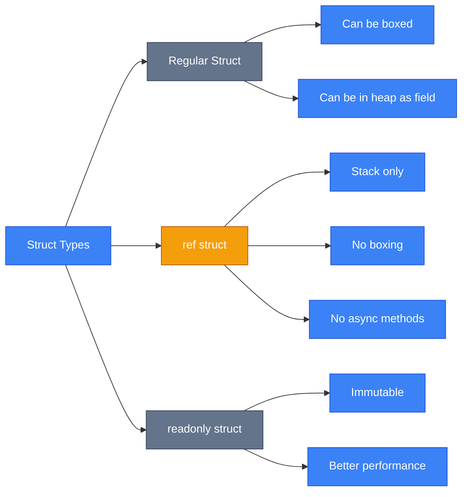
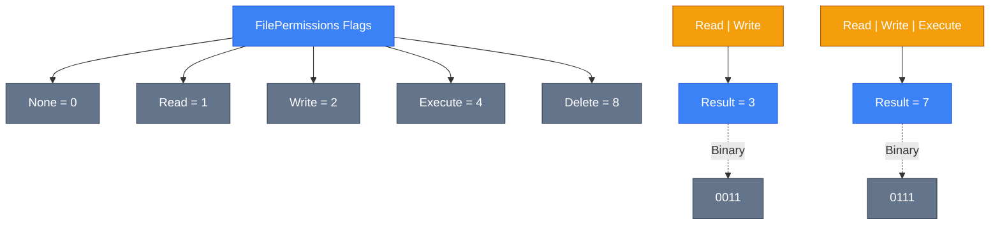
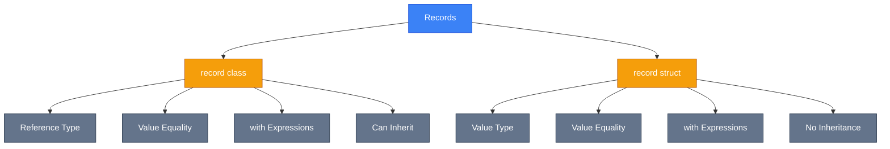
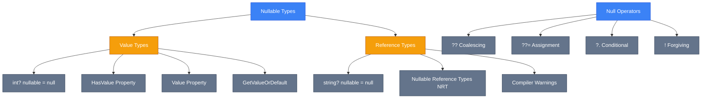
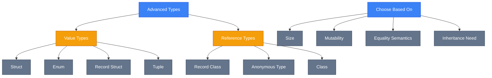

# Advanced Types (Розширені Типи)

## Вступ

Уявіть, що ви розробляєте систему для управління геометричними фігурами. Вам потрібно зберігати координати точок, кольори, стани об'єктів та багато інших даних. Який тип використати для кожного випадку? Клас? Структуру? Запис? Вибір правильного типу даних впливає не лише на читабельність коду, але й на продуктивність, споживання пам'яті та загальну архітектуру застосунку.

C# пропонує багатий набір розширених типів даних, кожен з яких оптимізований для конкретних сценаріїв використання. У цьому розділі ми детально розглянемо **структури (structs)**, **перерахування (enums)**, **записи (records)**, **кортежі (tuples)**, **анонімні типи (anonymous types)**, **nullable типи** та концепцію **discriminated unions**.

::tip
Розуміння відмінностей між різними типами даних — ключ до написання ефективного та підтримуваного коду. Неправильний вибір типу може призвести до проблем з продуктивністю або архітектурних помилок.
::

## Structs (Структури)

### Що таке Struct?

**Struct (структура)** — це value type (тип-значення), який зберігається на стеку (stack) і передається за значенням. На відміну від класів, які є reference types (типами-посиланнями) і зберігаються в купі (heap), структури оптимізовані для невеликих, легких об'єктів.

### Struct vs Class: Ключові відмінності

| Критерій                       | Struct                                   | Class                      |
| :----------------------------- | :--------------------------------------- | :------------------------- |
| **Тип**                        | Value Type                               | Reference Type             |
| **Розміщення в пам'яті**       | Stack (зазвичай)                         | Heap                       |
| **Передача параметрів**        | За значенням (копія)                     | За посиланням              |
| **Наслідування**               | Неможливе                                | Можливе                    |
| **`null` за замовчуванням**    | Не може бути `null` (крім `Nullable<T>`) | Може бути `null`           |
| **Конструктор без параметрів** | Завжди є (автоматичний)                  | Потребує оголошення        |
| **Продуктивність**             | Краща для малих даних                    | Краща для великих об'єктів |

::note
**Value Type vs Reference Type**: Value types зберігають дані безпосередньо, а reference types зберігають адресу (посилання) на об'єкт у пам'яті. Це фундаментальна різниця, яка впливає на поведінку коду.
::

### Оголошення Struct

```csharp [Point.cs] showLineNumbers
public struct Point
{
    public double X { get; set; }
    public double Y { get; set; }

    public Point(double x, double y)
    {
        X = x;
        Y = y;
    }

    public double DistanceFromOrigin()
    {
        return Math.Sqrt(X * X + Y * Y);
    }

    public override string ToString()
    {
        return $"({X}, {Y})";
    }
}

// Використання
Point p1 = new Point(3, 4);
Point p2 = p1; // Копія значення, а не посилання!
p2.X = 10;

Console.WriteLine(p1); // (3, 4) - p1 не змінився
Console.WriteLine(p2); // (10, 4)
```

::warning
**Важливо**: При присвоєнні структури іншій змінній створюється **повна копія** даних. Це відрізняється від класів, де обидві змінні вказували б на той самий об'єкт у пам'яті.
::

### Коли використовувати Struct?

**Використовуйте struct, якщо:**

-   Об'єкт невеликий (зазвичай ≤ 16 байт)
-   Логічно представляє одне значення (координата, колір, розмір)
-   Не потрібне наслідування
-   Об'єкт не змінюється після створення (immutable)
-   Часто передається як параметр методів

**Приклади з .NET BCL**: `DateTime`, `TimeSpan`, `Guid`, `Int32`, `Double`

```csharp [Examples.cs] showLineNumbers
// Гарний приклад використання struct - невеликий immutable тип
public readonly struct Color
{
    public byte R { get; }
    public byte G { get; }
    public byte B { get; }

    public Color(byte r, byte g, byte b)
    {
        R = r;
        G = g;
        B = b;
    }
}

// Поганий приклад - занадто великий для struct
public struct HugeData // ❌ Краще використати class
{
    public double[] Data { get; set; } // Масив з 1000 елементів
    public string Description { get; set; }
    // ... багато полів
}
```

### ref struct: Обмеження стеком

**ref struct** — це спеціальний вид структури, який **обов'язково** має зберігатися на стеку і не може потрапити в купу. Це використовується для високопродуктивних сценаріїв, наприклад, `Span<T>`.

```csharp [RefStruct.cs] showLineNumbers
public ref struct SpanExample
{
    private Span<int> _numbers;

    public SpanExample(Span<int> numbers)
    {
        _numbers = numbers;
    }

    // ref struct має суворі обмеження:
    // ❌ Не може бути полем класу
    // ❌ Не може реалізовувати інтерфейси
    // ❌ Не може бути boxing (перетворення в object)
    // ❌ Не може бути типом параметра async методу
}
```

::tip
**ref struct** використовуйте лише для високопродуктивних операцій з пам'яттю, коли потрібен повний контроль над розміщенням даних на стеку. Приклади: `Span<T>`, `ReadOnlySpan<T>`, `Utf8JsonReader`.
::

::mermaid



::


<!-- Search Query: C# struct vs class memory layout diagram stack heap visualization -->

---

## Enums (Перерахування)

### Базове оголошення

**Enum (enumeration, перерахування)** — це value type, який визначає набір іменованих констант. Використовується для представлення фіксованого набору можливих значень.

```csharp [OrderStatus.cs] showLineNumbers
public enum OrderStatus
{
    Pending,      // 0 (за замовчуванням)
    Processing,   // 1
    Shipped,      // 2
    Delivered,    // 3
    Cancelled     // 4
}

// Використання
OrderStatus status = OrderStatus.Pending;

if (status == OrderStatus.Delivered)
{
    Console.WriteLine("Замовлення доставлено!");
}

// Конвертація в int
int statusCode = (int)status; // 0

// Конвертація з int
OrderStatus newStatus = (OrderStatus)2; // Shipped
```

### Underlying Types (Базові типи)

За замовчуванням enum базується на типі `int`, але можна вказати інший цілочисловий тип (`byte`, `sbyte`, `short`, `ushort`, `int`, `uint`, `long`, `ulong`).

```csharp [ErrorCode.cs] showLineNumbers
// Використання ushort для економії пам'яті
public enum ErrorCode : ushort
{
    None = 0,
    NotFound = 404,
    Unauthorized = 401,
    InternalServerError = 500
}

// Великі значення - використання long
public enum LargeValues : long
{
    SmallValue = 1,
    HugeValue = 9_223_372_036_854_775_807 // long.MaxValue
}
```

### Flags Attribute: Бітові прапорці

**`[Flags]` attribute** дозволяє комбінувати значення enum через бітові операції. Значення повинні бути степенями двійки (1, 2, 4, 8, 16...).

```csharp [FilePermissions.cs] showLineNumbers {1,4-8}
[Flags]
public enum FilePermissions
{
    None = 0,           // 0000
    Read = 1,           // 0001
    Write = 2,          // 0010
    Execute = 4,        // 0100
    Delete = 8,         // 1000
    ReadWrite = Read | Write,              // 0011 (3)
    FullControl = Read | Write | Execute | Delete  // 1111 (15)
}

// Використання
FilePermissions userPermissions = FilePermissions.Read | FilePermissions.Write;

// Перевірка наявності прапорця
if (userPermissions.HasFlag(FilePermissions.Read))
{
    Console.WriteLine("Користувач може читати файл");
}

// Додавання прапорця
userPermissions |= FilePermissions.Execute;

// Видалення прапорця
userPermissions &= ~FilePermissions.Write;

// Перевірка через бітову операцію (швидше)
bool canWrite = (userPermissions & FilePermissions.Write) == FilePermissions.Write;
```

::tip
**Best Practice**: Для flags enum завжди використовуйте `[Flags]` attribute та степені двійки. Це забезпечує коректну роботу методу `ToString()` та інших операцій.
::

::mermaid



::

### Операції з Enum

::code-group

```csharp [Parsing.cs] showLineNumbers
// Parse з string
OrderStatus status = Enum.Parse<OrderStatus>("Shipped");

// TryParse (безпечніший варіант)
if (Enum.TryParse<OrderStatus>("Pending", out var result))
{
    Console.WriteLine($"Parsed: {result}");
}

// Отримання всіх значень
foreach (OrderStatus s in Enum.GetValues<OrderStatus>())
{
    Console.WriteLine($"{s} = {(int)s}");
}

// Отримання всіх імен
string[] names = Enum.GetNames<OrderStatus>();
```

```csharp [ToString.cs] showLineNumbers
FilePermissions perms = FilePermissions.Read | FilePermissions.Write;

// З [Flags] attribute
Console.WriteLine(perms.ToString());
// Output: "Read, Write"

// Без [Flags] attribute
Console.WriteLine(perms.ToString());
// Output: "3" (просто число)
```

::


<!-- Search Query: C# flags enum bitwise operations diagram OR Read Write Execute -->

---

## Records (Записи)

### Що таке Record?

**Record (запис)** — це reference type (або value type для `record struct`), оптимізований для незмінних (immutable) даних з вбудованою **value equality** (рівністю за значенням). Records автоматично генерують методи `Equals()`, `GetHashCode()`, та `ToString()`.

### Positional Records

```csharp [Person.cs] showLineNumbers
// Positional syntax (компактний синтаксис)
public record Person(string FirstName, string LastName, int Age);

// Еквівалентно:
public record Person
{
    public string FirstName { get; init; }
    public string LastName { get; init; }
    public int Age { get; init; }

    public Person(string firstName, string lastName, int age)
    {
        FirstName = firstName;
        LastName = lastName;
        Age = age;
    }
}

// Використання
Person person1 = new("John", "Doe", 30);
Person person2 = new("John", "Doe", 30);

Console.WriteLine(person1 == person2); // True - value equality!
```

::note
**Value Equality**: На відміну від звичайних класів, де порівнюються посилання, records порівнюють **значення всіх властивостей**. Два records рівні, якщо всі їхні властивості мають однакові значення.
::

### with Expressions: Non-destructive Mutation

**`with` expression** дозволяє створити копію record з зміненими певними властивостями, не змінюючи оригінал.

```csharp [WithExpressions.cs] showLineNumbers
public record Person(string FirstName, string LastName, int Age);

Person person = new("John", "Doe", 30);

// Створення копії зі зміненим віком
Person olderPerson = person with { Age = 31 };

Console.WriteLine(person);       // Person { FirstName = John, LastName = Doe, Age = 30 }
Console.WriteLine(olderPerson);  // Person { FirstName = John, LastName = Doe, Age = 31 }

// person залишився незмінним!

// Можна змінювати кілька властивостей
Person different = person with
{
    FirstName = "Jane",
    Age = 25
};
```

### Record Struct vs Record Class

::code-group

```csharp [RecordClass.cs] showLineNumbers
// Record class (reference type) - за замовчуванням
public record Person(string Name, int Age);

Person p1 = new("Alice", 25);
Person p2 = p1; // Обидві змінні вказують на той самий об'єкт

// Але через immutability це не проблема
```

```csharp [RecordStruct.cs] showLineNumbers
// Record struct (value type)
public record struct Point(double X, double Y);

Point p1 = new(3, 4);
Point p2 = p1; // Копія значення

p2 = p2 with { X = 10 };

Console.WriteLine(p1); // Point { X = 3, Y = 4 }
Console.WriteLine(p2); // Point { X = 10, Y = 4 }
```

::

### Порівняння Record, Class, та Struct

| Критерій              | Record Class            | Record Struct           | Class              | Struct            |
| :-------------------- | :---------------------- | :---------------------- | :----------------- | :---------------- |
| **Тип**               | Reference               | Value                   | Reference          | Value             |
| **Equality**          | Value Equality          | Value Equality          | Reference Equality | Value Equality    |
| **Mutability**        | Immutable (recommended) | Immutable (recommended) | Mutable            | Mutable/Immutable |
| **`with` expression** | ✅                      | ✅                      | ❌                 | ❌                |
| **Inheritance**       | ✅                      | ❌                      | ✅                 | ❌                |
| **Performance**       | Heap allocation         | Stack allocation        | Heap allocation    | Stack allocation  |

::tip
**Коли використовувати records:**

-   Для DTO (Data Transfer Objects)
-   Для immutable моделей даних
-   Коли потрібна value equality
-   Для простих об'єктів без складної бізнес-логіки

::

::mermaid



::


<!-- Search Query: C# record value equality vs class reference equality visualization -->

---

## Tuples (Кортежі)

### ValueTuple: Сучасний підхід

**Tuple (кортеж)** дозволяє групувати кілька значень в один об'єкт без створення окремого типу. Сучасний `ValueTuple` (C# 7+) є value type і має зручний синтаксис.

```csharp [TupleBasics.cs] showLineNumbers
// Оголошення tuple
(string Name, int Age) person = ("Alice", 25);

// Доступ до елементів
Console.WriteLine(person.Name); // Alice
Console.WriteLine(person.Age);  // 25

// Без імен (доступ через Item1, Item2...)
(string, int) unnamed = ("Bob", 30);
Console.WriteLine(unnamed.Item1); // Bob

// Tuple literal
var point = (X: 3.0, Y: 4.0);
```

### Повернення множинних значень

Tuples ідеально підходять для повернення декількох значень з методу без створення спеціального класу.

```csharp [ReturningMultipleValues.cs] showLineNumbers
public (int Min, int Max, double Average) AnalyzeNumbers(int[] numbers)
{
    if (numbers.Length == 0)
    {
        return (0, 0, 0);
    }

    int min = numbers.Min();
    int max = numbers.Max();
    double avg = numbers.Average();

    return (min, max, avg);
}

// Використання
int[] data = { 5, 2, 8, 1, 9 };
var result = AnalyzeNumbers(data);

Console.WriteLine($"Min: {result.Min}");         // 1
Console.WriteLine($"Max: {result.Max}");         // 9
Console.WriteLine($"Avg: {result.Average}");     // 5
```

### Deconstruction (Деконструкція)

**Deconstruction** дозволяє розпакувати tuple в окремі змінні.

```csharp [Deconstruction.cs] showLineNumbers
// Повний приклад deconstructon
(string Name, int Age) GetPerson() => ("Alice", 25);

// Deconstruct в нові змінні
var (name, age) = GetPerson();
Console.WriteLine($"{name} is {age} years old");

// Deconstruct в існуючі змінні
string personName;
int personAge;
(personName, personAge) = GetPerson();

// Використання discard (_) для ігнорування значень
var (_, onlyAge) = GetPerson(); // Ігноруємо ім'я
Console.WriteLine($"Age: {onlyAge}");

// Deconstruction в foreach
var people = new[]
{
    ("Alice", 25),
    ("Bob", 30)
};

foreach (var (n, a) in people)
{
    Console.WriteLine($"{n}: {a}");
}
```

### ValueTuple vs старий Tuple

::code-group

```csharp [ValueTuple(Modern).cs] showLineNumbers
// ✅ ValueTuple (C# 7+) - Рекомендується
(int X, int Y) point = (3, 4);
Console.WriteLine(point.X);

// Value type (struct)
// Зручний синтаксис
// Named elements
```

```csharp [Tuple(Legacy).cs] showLineNumbers
// ❌ Старий Tuple - Не використовуйте!
Tuple<int, int> point = Tuple.Create(3, 4);
Console.WriteLine(point.Item1);

// Reference type (class)
// Незручний синтаксис
// Тільки Item1, Item2...
```

::

::warning
**Важливо**: ValueTuple є **mutable** за замовчуванням. Якщо потрібна immutability, використовуйте records або readonly fields.
::

---

## Anonymous Types (Анонімні типи)

### Що таке Anonymous Type?

**Anonymous type (анонімний тип)** — це reference type без явного оголошення класу. Компілятор автоматично генерує клас з read-only властивостями.

```csharp [AnonymousBasics.cs] showLineNumbers
// Створення анонімного типу
var person = new
{
    Name = "Alice",
    Age = 25,
    City = "Kyiv"
};

Console.WriteLine(person.Name);  // Alice
Console.WriteLine(person.Age);   // 25

// Тип відомий тільки компілятору
// person.Name = "Bob"; // ❌ Помилка - read-only
```

### Використання в LINQ

Анонімні типи найчастіше використовуються в LINQ запитах для проекції (projection) даних.

```csharp [LinqProjection.cs] showLineNumbers
public record Product(string Name, decimal Price, string Category);

List<Product> products = new()
{
    new("Laptop", 1200m, "Electronics"),
    new("Mouse", 25m, "Electronics"),
    new("Desk", 300m, "Furniture")
};

// Проекція в анонімний тип
var result = products
    .Where(p => p.Category == "Electronics")
    .Select(p => new
    {
        ProductName = p.Name,
        PriceInUah = p.Price * 40, // Конвертація в гривні
        Discount = p.Price > 1000 ? 10 : 5
    });

foreach (var item in result)
{
    Console.WriteLine($"{item.ProductName}: {item.PriceInUah} UAH (Discount: {item.Discount}%)");
}
```

### with Expressions з Anonymous Types (C# 10+)

```csharp [AnonymousWithExpressions.cs] showLineNumbers
var person = new { Name = "Alice", Age = 25 };

// Створення копії зі зміненою властивістю
var olderPerson = person with { Age = 26 };

Console.WriteLine(person);       // { Name = Alice, Age = 25 }
Console.WriteLine(olderPerson);  // { Name = Alice, Age = 26 }
```

### Обмеження Anonymous Types

::warning
**Обмеження:**

-   Можна використовувати тільки всередині методу (не можна повертати з методу як тип)
-   Всі властивості read-only
-   Не можна додати методи або події
-   Складно використовувати в юніт-тестах

::

::code-group

```csharp [Good.cs] showLineNumbers
// ✅ Гарне використання - локально в методі
public void ProcessData()
{
    var temp = new { X = 10, Y = 20 };
    Console.WriteLine(temp.X + temp.Y);
}
```

```csharp [Bad.cs] showLineNumbers
// ❌ Погане використання - повернення з методу
public object GetData() // Тип object - втрата type safety!
{
    return new { X = 10, Y = 20 };
}

// Краще використати record або tuple
public (int X, int Y) GetData()
{
    return (10, 20);
}
```

::

---

## Nullable Types (Nullable Типи)

### Value Types: Nullable<T> або T?

**Nullable value types** дозволяють value types приймати значення `null`. Це корисно, коли значення може бути відсутнім (наприклад, дані з бази даних).

```csharp [NullableValueTypes.cs] showLineNumbers
// Два способи оголошення - еквівалентні
Nullable<int> age1 = null;
int? age2 = null; // Скорочений синтаксис (рекомендується)

// Присвоєння значення
age2 = 25;

// Перевірка наявності значення
if (age2.HasValue)
{
    Console.WriteLine($"Age: {age2.Value}");
}

// Безпечний доступ
Console.WriteLine(age2.GetValueOrDefault()); // 25
Console.WriteLine(age2.GetValueOrDefault(18)); // 25 (або 18, якщо null)

// Null-coalescing operator
int definiteAge = age2 ?? 18; // Якщо age2 == null, то 18
```

### Reference Types: Nullable Reference Types (NRT)

Починаючи з C# 8, reference types за замовчуванням **non-nullable** (якщо ввімкнено NRT). Для nullable потрібен `?`.

```csharp [NullableReferenceTypes.cs] showLineNumbers
// Увімкнення NRT у файлі
#nullable enable

// Non-nullable reference type
string name = "Alice";
// name = null; // ⚠️ Попередження компілятора

// Nullable reference type
string? nullableName = null; // OK

// Compiler warning якщо не перевірити на null
void PrintLength(string? input)
{
    // Console.WriteLine(input.Length); // ⚠️ Попередження

    // ✅ Правильно - перевірка на null
    if (input != null)
    {
        Console.WriteLine(input.Length);
    }

    // Або з null-conditional operator
    Console.WriteLine(input?.Length);
}
```

### Null-Coalescing Operators

| Оператор | Назва                      | Опис                                                 | Приклад                        |
| :------- | :------------------------- | :--------------------------------------------------- | :----------------------------- |
| `??`     | Null-coalescing            | Повертає ліве значення, якщо не `null`, інакше праве | `int age = nullableAge ?? 18;` |
| `??=`    | Null-coalescing assignment | Присвоює праве значення, якщо ліве `null`            | `name ??= "Default";`          |
| `?.`     | Null-conditional           | Викликає член, тільки якщо об'єкт не `null`          | `int? length = text?.Length;`  |
| `?[]`    | Null-conditional index     | Індексує масив, тільки якщо не `null`                | `int? first = array?[0];`      |
| `!`      | Null-forgiving             | Підказує компілятору, що значення точно не `null`    | `string name = nullableText!;` |

```csharp [NullOperators.cs] showLineNumbers {5,8,12,16,20}
string? name = null;
string? city = "Kyiv";

// ?? - Null-coalescing
string displayName = name ?? "Guest"; // "Guest"

// ??= - Null-coalescing assignment
name ??= "Default"; // name тепер "Default"

// ?. - Null-conditional member access
int? nameLength = name?.Length; // 7 (довжина "Default")
int? nullLength = ((string?)null)?.Length; // null

// ?[] - Null-conditional indexing
int[] numbers = { 1, 2, 3 };
int? first = numbers?[0]; // 1
int? nullArrayFirst = ((int[]?)null)?[0]; // null

// ! - Null-forgiving operator (використовуйте обережно!)
string definitelyNotNull = name!; // Компілятор не попереджає
string riskyAccess = name!.ToUpper(); // "DEFAULT"
```

::warning
**Null-forgiving operator (`!`)**: Використовуйте тільки коли ви **точно впевнені**, що значення не `null`. Якщо помилитеся, отримаєте `NullReferenceException` у runtime.
::

### Best Practices для роботи з Null

::steps

### Увімкніть Nullable Reference Types

У `.csproj` файлі:

```xml
<Nullable>enable</Nullable>
```

### Завжди перевіряйте nullable значення

```csharp
if (nullableValue != null)
{
    // Безпечне використання
}
```

### Використовуйте null-conditional operators

```csharp
// Замість:
int length = text != null ? text.Length : 0;

// Краще:
int length = text?.Length ?? 0;
```

### Уникайте null-forgiving без причини

```csharp
// ❌ Погано
string name = GetName()!;

// ✅ Добре
string? name = GetName();
if (name != null)
{
    // використання
}
```

::

::mermaid



::

---

## Discriminated Unions (Концепція)

### Що таке Discriminated Unions?

**Discriminated Unions (також tagged unions або sum types)** — це тип даних, який може бути **одним з кількох можливих варіантів**. Це поширена концепція в функціональному програмуванні (F#, Rust, TypeScript), але **нативно не підтримується в C#** (станом на C# 13).

### Приклад з F# (для розуміння концепції)

```fsharp
type PaymentMethod =
    | Cash of amount: decimal
    | CreditCard of cardNumber: string * cvv: string
    | BankTransfer of accountNumber: string

let processPayment payment =
    match payment with
    | Cash amount -> printfn "Cash payment: %M" amount
    | CreditCard (number, cvv) -> printfn "Card: %s" number
    | BankTransfer account -> printfn "Transfer from: %s" account
```

### Емуляція в C# через Pattern Matching

Найкращий спосіб емулювати discriminated unions у C# — sealed class hierarchy з pattern matching.

```csharp [DiscriminatedUnionEmulation.cs] showLineNumbers
// База - sealed щоб запобігти розширенню ззовні
public abstract record PaymentMethod;

// Варіанти
public record Cash(decimal Amount) : PaymentMethod;
public record CreditCard(string CardNumber, string Cvv) : PaymentMethod;
public record BankTransfer(string AccountNumber) : PaymentMethod;

// Використання з pattern matching
public static string ProcessPayment(PaymentMethod payment)
{
    return payment switch
    {
        Cash { Amount: var amount } =>
            $"Cash payment: {amount:C}",

        CreditCard { CardNumber: var number } =>
            $"Card payment: {number[^4..]} (last 4 digits)",

        BankTransfer { AccountNumber: var account } =>
            $"Bank transfer from: {account}",

        _ => throw new ArgumentException("Unknown payment method")
    };
}

// Використання
PaymentMethod payment1 = new Cash(100m);
PaymentMethod payment2 = new CreditCard("1234-5678-9012-3456", "123");

Console.WriteLine(ProcessPayment(payment1));
// Cash payment: $100.00

Console.WriteLine(ProcessPayment(payment2));
// Card payment: 3456 (last 4 digits)
```

### OneOf Library: Альтернативне рішення

**OneOf** — популярна бібліотека NuGet, яка надає discriminated unions для C#.

```csharp [OneOfExample.cs] showLineNumbers
using OneOf;

// Визначення union type
public class Result : OneOfBase<Success, Error>
{
    public Result(OneOf<Success, Error> input) : base(input) { }
}

public record Success(string Message);
public record Error(string ErrorMessage, int Code);

// Метод, що повертає union
public Result DivideNumbers(int a, int b)
{
    if (b == 0)
    {
        return new Error("Division by zero", 400);
    }

    return new Success($"Result: {a / b}");
}

// Pattern matching з OneOf
Result result = DivideNumbers(10, 2);

string output = result.Match(
    success => $"✓ {success.Message}",
    error => $"✗ Error {error.Code}: {error.ErrorMessage}"
);

Console.WriteLine(output); // ✓ Result: 5
```

::note
**Майбутнє C#**: Розробники C# розглядають додавання нативної підтримки discriminated unions у майбутніх версіях мови. Слідкуйте за GitHub репозиторієм [csharplang proposals](https://github.com/dotnet/csharplang).
::

---

## Порівняльна таблиця всіх типів

| Тип               | Value/Reference | Mutability  | Equality  | Inheritance | Коли використовувати                           |
| :---------------- | :-------------- | :---------- | :-------- | :---------- | :--------------------------------------------- |
| **Struct**        | Value           | Mutable     | Value     | ❌          | Малі, логічно одне значення, передається часто |
| **Enum**          | Value           | Immutable   | Value     | ❌          | Фіксований набір варіантів                     |
| **Record class**  | Reference       | Immutable\* | Value     | ✅          | DTO, immutable дані, value equality            |
| **Record struct** | Value           | Immutable\* | Value     | ❌          | Малі immutable дані з value equality           |
| **Tuple**         | Value           | Mutable     | Value     | ❌          | Повернення кількох значень, локальні групи     |
| **Anonymous**     | Reference       | Immutable   | Value     | ❌          | LINQ проекції, тимчасові об'єкти               |
| **Class**         | Reference       | Mutable     | Reference | ✅          | Складні об'єкти, entity, багато логіки         |

_\* Recommended immutable, але можна зробити mutable_

::mermaid



::

---

## Troubleshooting (Усунення проблем)

### Struct: Boxing performance penalty

::warning
**Проблема**: При передачі struct як `object` або інтерфейс відбувається **boxing** — копіювання даних на heap.

```csharp
public struct Point
{
    public int X, Y;
}

Point p = new Point { X = 10, Y = 20 };
object obj = p; // ⚠️ Boxing - копія на heap
```

**Рішення**: Уникайте boxing, використовуйте generics.
::

### Enum: Невалідні значення

::warning
**Проблема**: Можна cast невалідне число в enum.

```csharp
OrderStatus status = (OrderStatus)999; // Компілюється!
```

**Рішення**: Перевіряйте через `Enum.IsDefined()`.

```csharp
if (Enum.IsDefined(typeof(OrderStatus), status))
{
    // Валідне значення
}
```

::

### Record: Mutable вкладені об'єкти

::warning
**Проблема**: Records з mutable вкладеними об'єктами не повністю immutable.

```csharp
public record Person(string Name, List<string> Hobbies);

var p1 = new Person("Alice", new List<string> { "Reading" });
var p2 = p1 with { };

p2.Hobbies.Add("Coding"); // Змінює і p1.Hobbies!
```

**Рішення**: Використовуйте immutable collections.

```csharp
using System.Collections.Immutable;

public record Person(string Name, ImmutableList<string> Hobbies);
```

::

### Nullable: Забули перевірку на null

::warning
**Проблема**: `NullReferenceException` при доступі до nullable reference.

```csharp
string? name = GetName();
Console.WriteLine(name.Length); // 💥 NullReferenceException
```

**Рішення**: Завжди перевіряйте або використовуйте null-conditional.

```csharp
Console.WriteLine(name?.Length ?? 0);
```

::

---

## Practice Tasks (Практичні завдання)

### Beginner: Базові структури та перерахування

Створіть програму для управління геометричними фігурами:

1. Створіть `struct Point` з властивостями `X` та `Y` (readonly)
2. Додайте метод `DistanceTo(Point other)` для обчислення відстані
3. Створіть `enum Shape { Circle, Rectangle, Triangle }`
4. Створіть `enum Direction { North, South, East, West }` та метод `GetOpposite()` для отримання протилежного напрямку

::collapsible{title="Рішення"}

```csharp [Solution.cs] showLineNumbers
public readonly struct Point
{
    public double X { get; }
    public double Y { get; }

    public Point(double x, double y)
    {
        X = x;
        Y = y;
    }

    public double DistanceTo(Point other)
    {
        double dx = X - other.X;
        double dy = Y - other.Y;
        return Math.Sqrt(dx * dx + dy * dy);
    }
}

public enum Shape
{
    Circle,
    Rectangle,
    Triangle
}

public enum Direction
{
    North,
    South,
    East,
    West
}

public static Direction GetOpposite(this Direction direction)
{
    return direction switch
    {
        Direction.North => Direction.South,
        Direction.South => Direction.North,
        Direction.East => Direction.West,
        Direction.West => Direction.East,
        _ => throw new ArgumentException()
    };
}
```

::

### Intermediate: Records та Flags

Створіть систему для управління користувачами та правами доступу:

1. Створіть `record User(string Name, string Email, DateTime RegisteredAt)`
2. Додайте метод `GetAge()` до record через extension
3. Створіть `[Flags] enum Permissions` з правами: Read, Write, Execute, Delete
4. Реалізуйте методи `AddPermission`, `RemovePermission`, `HasPermission`
5. Використайте `with` expression для створення адміністратора з копії звичайного користувача

::collapsible{title="Рішення"}

```csharp [Solution.cs] showLineNumbers
public record User(string Name, string Email, DateTime RegisteredAt, Permissions Permissions);

[Flags]
public enum Permissions
{
    None = 0,
    Read = 1,
    Write = 2,
    Execute = 4,
    Delete = 8,
    Full = Read | Write | Execute | Delete
}

public static class PermissionsExtensions
{
    public static Permissions Add(this Permissions current, Permissions permission)
    {
        return current | permission;
    }

    public static Permissions Remove(this Permissions current, Permissions permission)
    {
        return current & ~permission;
    }

    public static bool Has(this Permissions current, Permissions permission)
    {
        return (current & permission) == permission;
    }
}

// Використання
User user = new("Alice", "alice@example.com", DateTime.Now, Permissions.Read);
User admin = user with
{
    Permissions = Permissions.Full
};

Console.WriteLine(admin.Permissions.Has(Permissions.Write)); // True
```

::

### Advanced: Emulating Discriminated Unions

Створіть систему обробки результатів операцій без exceptions:

1. Створіть discriminated union `Result<T>` з варіантами `Success<T>` та `Failure`
2. `Success` містить значення типу `T`
3. `Failure` містить повідомлення про помилку та код помилки
4. Реалізуйте методи `Match<TOut>`, `Bind<TOut>`, `Map<TOut>` для функціональної роботи
5. Створіть приклад ланцюжка операцій (parsing → validation → computation)

::collapsible{title="Рішення"}

```csharp [Result.cs] showLineNumbers
public abstract record Result<T>
{
    public abstract TOut Match<TOut>(
        Func<T, TOut> onSuccess,
        Func<string, int, TOut> onFailure);
}

public record Success<T>(T Value) : Result<T>
{
    public override TOut Match<TOut>(
        Func<T, TOut> onSuccess,
        Func<string, int, TOut> onFailure)
    {
        return onSuccess(Value);
    }
}

public record Failure<T>(string Message, int ErrorCode) : Result<T>
{
    public override TOut Match<TOut>(
        Func<T, TOut> onSuccess,
        Func<string, int, TOut> onFailure)
    {
        return onFailure(Message, ErrorCode);
    }
}

// Extension methods для функціонального програмування
public static class ResultExtensions
{
    public static Result<TOut> Bind<T, TOut>(
        this Result<T> result,
        Func<T, Result<TOut>> func)
    {
        return result.Match(
            onSuccess: func,
            onFailure: (msg, code) => new Failure<TOut>(msg, code)
        );
    }

    public static Result<TOut> Map<T, TOut>(
        this Result<T> result,
        Func<T, TOut> mapper)
    {
        return result.Match(
            onSuccess: value => new Success<TOut>(mapper(value)),
            onFailure: (msg, code) => new Failure<TOut>(msg, code)
        );
    }
}

// Приклад використання
Result<int> ParseNumber(string input)
{
    if (int.TryParse(input, out int value))
    {
        return new Success<int>(value);
    }
    return new Failure<int>("Invalid number format", 400);
}

Result<int> ValidatePositive(int number)
{
    if (number > 0)
    {
        return new Success<int>(number);
    }
    return new Failure<int>("Number must be positive", 400);
}

Result<int> Double(int number)
{
    return new Success<int>(number * 2);
}

// Ланцюжок операцій
var result = ParseNumber("42")
    .Bind(ValidatePositive)
    .Map(Double);

string output = result.Match(
    onSuccess: value => $"Result: {value}",
    onFailure: (msg, code) => $"Error {code}: {msg}"
);

Console.WriteLine(output); // Result: 84
```

::

---

## Резюме

У цьому розділі ми детально розглянули розширені типи даних в C#:

-   **Structs** — value types для малих, часто використовуваних об'єктів. `ref struct` для high-performance сценаріїв.
-   **Enums** — іменовані константи для фіксованих наборів значень. `[Flags]` attribute для бітових операцій.
-   **Records** — reference або value types з value equality та `with` expressions для immutable даних.
-   **Tuples** — легкі групи значень без створення окремих типів. Ідеально для повернення multiple values.
-   **Anonymous Types** — compiler-generated types для LINQ проекцій та локальних тимчасових об'єктів.
-   **Nullable Types** — підтримка `null` для value (`int?`) та reference types (`string?`). Null-coalescing operators для безпечної роботи.
-   **Discriminated Unions** — концепція з функціонального програмування. Емулюється через sealed hierarchies або OneOf library.

Вибір правильного типу залежить від розміру даних, mutability, equality semantics та потреби в inheritance. Розуміння цих відмінностей дозволяє писати більш ефективний, читабельний та підтримуваний код.

::tip
**Наступні кроки**: Вивчіть розділ "Namespaces" для організації коду та розділ "Generics" для створення універсальних типів, які працюють з будь-якими з розглянутих типів даних.
::
